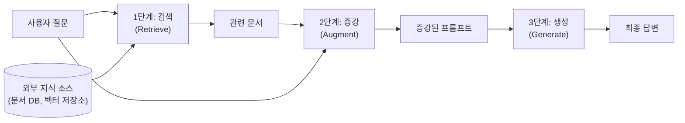
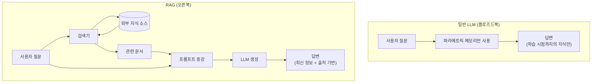

# RAG의 핵심 개념 — 검색 증강 생성이란

> 외부 지식을 검색해서 LLM의 답변을 보강하는 RAG의 동작 원리와 핵심 구조를 이해합니다.

## 개요

이 섹션에서는 RAG(Retrieval-Augmented Generation)의 정의와 핵심 아이디어를 배웁니다. LLM이 가진 파라메트릭 메모리의 한계를 비파라메트릭 메모리로 보완하는 원리를 이해하고, "검색 → 증강 → 생성"이라는 3단계 흐름을 코드로 직접 구현해봅니다.

**선수 지식**: [LLM의 한계 — 왜 외부 지식이 필요한가](ch01/session_01.md)에서 배운 파라메트릭 메모리(parametric_memory), 할루시네이션(hallucination), 지식 단절(knowledge_cutoff) 개념
**학습 목표**:
- RAG의 정의와 "검색 증강 생성"이 의미하는 바를 설명할 수 있다
- 파라메트릭 메모리와 비파라메트릭 메모리의 결합 원리를 이해한다
- Retrieve → Augment → Generate 3단계 흐름을 코드로 표현할 수 있다
- RAG가 왜 LLM의 한계를 해결하는 효과적인 방법인지 논리적으로 설명할 수 있다

## 왜 알아야 할까?

앞서 [LLM의 한계](ch01/session_01.md)에서 우리는 LLM이 할루시네이션, 지식 단절, 도메인 특화 부족이라는 세 가지 구조적 문제를 가진다는 것을 배웠습니다. 그렇다면 이 문제를 어떻게 해결할 수 있을까요?

가장 직관적인 방법은 **시험을 오픈북으로 보는 것**입니다. 학생이 모든 것을 외우지 않아도, 필요할 때 교과서를 펼쳐서 정확한 정보를 찾아 답할 수 있죠. RAG는 바로 이 아이디어를 LLM에 적용한 것입니다.

RAG는 현재 프로덕션 AI 시스템에서 가장 널리 쓰이는 패턴입니다. ChatGPT의 웹 검색, Perplexity, 기업용 AI 챗봇 — 이 모든 것의 핵심에 RAG가 있습니다. 이 개념을 이해하면 이후 챕터에서 배울 임베딩, 벡터 데이터베이스, 검색 최적화 등의 기술이 왜 필요한지 자연스럽게 연결됩니다.

## 핵심 개념

### 개념 1: RAG란 무엇인가 — 오픈북 시험의 AI 버전

> 💡 **비유**: 시험을 볼 때 두 가지 방식이 있습니다. **클로즈드북**은 오직 머릿속에 외운 내용만으로 답을 적는 것이고, **오픈북**은 교과서나 노트를 펼쳐서 필요한 정보를 찾아 답하는 것이죠. LLM이 학습한 파라미터만으로 답변하는 것은 클로즈드북 시험이고, RAG는 오픈북 시험입니다.

**RAG(Retrieval-Augmented Generation, 검색 증강 생성)**은 LLM이 답변을 생성하기 전에 외부 지식 소스에서 관련 정보를 **검색(Retrieve)**하여 프롬프트에 **증강(Augment)**한 뒤 답변을 **생성(Generate)**하는 기법입니다.

이 이름을 분해하면 의미가 명확해집니다:

| 구성 요소 | 영문 | 의미 |
|-----------|------|------|
| 검색 | Retrieval | 외부 지식 소스에서 관련 정보를 찾아옴 |
| 증강 | Augmented | 찾은 정보를 LLM의 입력에 추가하여 보강 |
| 생성 | Generation | 보강된 입력을 바탕으로 LLM이 답변 생성 |

일반 LLM이 "기억에만 의존하는 답변"을 한다면, RAG는 "자료를 찾아본 뒤 근거를 바탕으로 하는 답변"을 합니다. 바로 이 차이가 할루시네이션을 줄이고, 최신 정보를 반영하며, 특정 도메인에 특화된 정확한 답변을 가능하게 하는 거죠.

### 개념 2: 두 종류의 메모리 — 파라메트릭 vs 비파라메트릭

> 💡 **비유**: 우리 뇌에는 두 종류의 기억이 있습니다. 하나는 구구단처럼 **반복 학습으로 뇌에 새겨진 기억**이고, 다른 하나는 전화번호처럼 **필요할 때 연락처 앱을 열어 찾는 기억**입니다. 전자가 파라메트릭 메모리, 후자가 비파라메트릭 메모리입니다.

앞 섹션에서 배운 것처럼, LLM은 학습 과정에서 수십억 개의 **파라미터(가중치)**에 지식을 압축해서 저장합니다. 이것이 **파라메트릭 메모리(Parametric Memory)**입니다. 하지만 이 메모리에는 치명적인 한계가 있었죠 — 학습 이후의 정보를 모르고, 잘못된 정보를 자신 있게 말하기도 합니다.

앞서 1.1의 '더 깊이 알아보기'에서 모델 외부의 지식 저장소라는 개념을 잠깐 언급했는데요, 이제 본격적으로 그 개념을 정의해보겠습니다. **비파라메트릭 메모리(Non-parametric Memory)**는 모델 외부에 존재하는 지식 저장소 — 문서 데이터베이스, 벡터 저장소, 위키피디아 등 — 에서 필요한 정보를 실시간으로 가져오는 방식입니다. 파라메트릭 메모리가 "이미 외운 지식"이라면, 비파라메트릭 메모리는 "필요할 때 찾아보는 지식"이라고 할 수 있습니다.

```python
# 두 종류의 메모리 개념 비교
parametric_memory = {
    "저장 위치": "모델 내부 파라미터 (가중치)",
    "업데이트 방식": "전체 재학습 필요",
    "장점": "빠른 추론, 일반 지식에 강함",
    "한계": "최신 정보 반영 불가, 할루시네이션"
}

non_parametric_memory = {
    "저장 위치": "외부 지식 소스 (DB, 문서, 벡터 저장소)",
    "업데이트 방식": "문서 추가/수정으로 즉시 반영",
    "장점": "최신 정보, 도메인 특화, 출처 추적 가능",
    "한계": "검색 품질에 의존, 추가 인프라 필요"
}
```

RAG의 핵심 아이디어는 이 **두 메모리를 결합**하는 것입니다. LLM의 파라메트릭 메모리가 언어 이해와 추론 능력을 담당하고, 비파라메트릭 메모리가 정확한 사실과 최신 정보를 제공합니다. 마치 뛰어난 변호사가 법률 지식(파라메트릭)과 판례 데이터베이스(비파라메트릭)를 동시에 활용하는 것처럼요.

> ⚠️ **흔한 오해**: "RAG를 쓰면 LLM 학습이 필요 없다"고 생각하기 쉽지만, 사실 파라메트릭 메모리가 없으면 검색된 정보를 이해하고 종합하는 능력 자체가 없습니다. RAG는 LLM을 **대체**하는 것이 아니라 **보강**하는 기법입니다.

### 개념 3: RAG의 3단계 — Retrieve → Augment → Generate

> 💡 **비유**: 리포터가 기사를 쓰는 과정과 동일합니다. ① 먼저 관련 자료를 **취재(Retrieve)**하고, ② 수집한 자료를 정리해서 기사 초안에 **반영(Augment)**한 뒤, ③ 최종 기사를 **작성(Generate)**합니다.

RAG의 동작 흐름은 세 단계로 나뉩니다:

**1단계: 검색 (Retrieve)**
사용자의 질문과 관련된 문서를 외부 지식 소스에서 찾습니다. 이때 단순 키워드 매칭이 아니라, 의미적 유사도를 기반으로 검색하는 것이 핵심입니다. "서울 날씨"라고 물었을 때 "대한민국 수도의 기상 현황"이라는 문서도 찾아낼 수 있어야 하죠.

**2단계: 증강 (Augment)**
검색된 문서를 사용자의 질문과 함께 LLM의 프롬프트에 포함시킵니다. "다음 자료를 참고하여 질문에 답하세요"라는 구조로 컨텍스트를 구성하는 것입니다.

**3단계: 생성 (Generate)**
증강된 프롬프트를 LLM에 전달하여 최종 답변을 생성합니다. LLM은 자신의 언어 능력으로 검색된 자료를 종합하고, 질문에 맞는 자연스러운 답변을 만들어냅니다.

> 📊 **그림 1**: RAG의 3단계 처리 흐름



```run:python
# RAG 3단계를 파이썬 의사코드로 표현
def rag_pipeline(query: str) -> str:
    """RAG의 3단계: Retrieve → Augment → Generate"""

    # 1단계: 검색 (Retrieve)
    # 외부 지식 소스에서 관련 문서를 찾는다
    retrieved_docs = retrieve(query, knowledge_base)
    print(f"[1단계 검색] '{query}'에 대해 {len(retrieved_docs)}개 문서 검색 완료")

    # 2단계: 증강 (Augment)
    # 검색된 문서를 프롬프트에 추가한다
    augmented_prompt = augment(query, retrieved_docs)
    print(f"[2단계 증강] 프롬프트에 컨텍스트 추가 완료")

    # 3단계: 생성 (Generate)
    # LLM이 증강된 프롬프트로 답변을 생성한다
    answer = generate(augmented_prompt)
    print(f"[3단계 생성] 최종 답변 생성 완료")

    return answer

# 시뮬레이션
print("=== RAG 파이프라인 시뮬레이션 ===")
print()

# 간단한 지식 베이스 (실제로는 벡터 DB 등을 사용)
knowledge_base = [
    "Python 3.12는 2023년 10월에 출시되었다.",
    "RAG는 2020년 Facebook AI Research에서 발표한 기법이다.",
    "LangChain은 LLM 애플리케이션 개발 프레임워크이다.",
]

def retrieve(query, kb):
    # 간단한 키워드 매칭 (실제로는 벡터 유사도 검색)
    return [doc for doc in kb if any(word in doc for word in query.split())]

def augment(query, docs):
    context = "\n".join(f"- {doc}" for doc in docs)
    return f"참고 자료:\n{context}\n\n질문: {query}\n위 자료를 바탕으로 답변해주세요."

def generate(prompt):
    # 실제로는 LLM API 호출
    return "(LLM이 검색된 자료를 바탕으로 생성한 답변)"

result = rag_pipeline("RAG는 언제 발표되었나?")
print(f"\n최종 답변: {result}")
```

```output
=== RAG 파이프라인 시뮬레이션 ===

[1단계 검색] 'RAG는 언제 발표되었나?'에 대해 1개 문서 검색 완료
[2단계 증강] 프롬프트에 컨텍스트 추가 완료
[3단계 생성] 최종 답변 생성 완료

최종 답변: (LLM이 검색된 자료를 바탕으로 생성한 답변)
```

### 개념 4: 일반 LLM vs RAG — 무엇이 달라지는가

RAG를 적용하면 LLM의 세 가지 한계가 어떻게 해결되는지 구체적으로 비교해보겠습니다.

> 📊 **그림 2**: 일반 LLM과 RAG의 답변 과정 비교



| 한계 | 일반 LLM (클로즈드북) | RAG (오픈북) |
|------|----------------------|-------------|
| 할루시네이션 | 모르는 것도 자신 있게 지어냄 | 검색된 근거를 바탕으로 답변, 출처 제공 가능 |
| 지식 단절 | 학습 시점 이후 정보를 모름 | 외부 DB 업데이트만으로 최신 정보 반영 |
| 도메인 특화 | 내부/전문 지식에 약함 | 도메인 문서를 지식 소스로 추가 가능 |

```run:python
# 일반 LLM vs RAG 응답 비교 시뮬레이션
class SimpleLLM:
    """파라메트릭 메모리만 사용하는 일반 LLM"""
    def __init__(self):
        # 학습된 지식 (2023년까지)
        self.knowledge_cutoff = "2023-04"

    def answer(self, query: str) -> str:
        return f"[일반 LLM] 내부 지식만으로 답변 (학습 데이터 기준: ~{self.knowledge_cutoff})"


class RAGSystem:
    """비파라메트릭 메모리를 결합한 RAG 시스템"""
    def __init__(self, documents: list[str]):
        self.llm = SimpleLLM()
        self.knowledge_base = documents  # 외부 지식 소스

    def retrieve(self, query: str) -> list[str]:
        """관련 문서 검색"""
        results = [doc for doc in self.knowledge_base
                   if any(w in doc.lower() for w in query.lower().split())]
        return results[:3]  # 상위 3개 반환

    def answer(self, query: str) -> str:
        docs = self.retrieve(query)
        if docs:
            context = " | ".join(docs)
            return f"[RAG] 검색된 {len(docs)}개 문서 기반 답변 (근거: {context})"
        return self.llm.answer(query)  # 검색 결과 없으면 LLM 지식 사용


# 비교 테스트
documents = [
    "Claude 3.5 Sonnet은 2024년 6월에 출시되었다.",
    "GPT-4o는 2024년 5월에 공개되었다.",
    "LangChain v0.3은 2024년 9월에 릴리스되었다.",
]


llm = SimpleLLM()
rag = RAGSystem(documents)

query = "Claude 3.5는 언제 출시되었나?"
print(f"질문: {query}")
print(llm.answer(query))
print(rag.answer(query))
```

```output
질문: Claude 3.5는 언제 출시되었나?
[일반 LLM] 내부 지식만으로 답변 (학습 데이터 기준: ~2023-04)
[RAG] 검색된 1개 문서 기반 답변 (근거: Claude 3.5 Sonnet은 2024년 6월에 출시되었다.)
```

핵심 차이가 보이시나요? 일반 LLM은 학습 시점 이후의 정보를 모르지만, RAG는 외부 지식 소스에서 최신 정보를 검색해서 정확한 답변을 제공할 수 있습니다.

## 실습: 직접 해보기

이번 실습에서는 RAG의 전체 흐름을 파이썬으로 구현해봅니다. 아직 벡터 데이터베이스나 임베딩 모델을 배우지 않았으므로, 간단한 키워드 매칭으로 검색을 구현하고 RAG의 **구조적 흐름**에 집중합니다.

```run:python
from dataclasses import dataclass, field


# --- 데이터 모델 ---
@dataclass
class Document:
    """검색 가능한 문서 단위"""
    content: str          # 문서 내용
    source: str           # 출처 정보
    metadata: dict = field(default_factory=dict)


@dataclass
class RetrievalResult:
    """검색 결과"""
    document: Document
    score: float          # 관련도 점수 (0~1)


# --- 1단계: 지식 베이스 구성 ---
knowledge_base = [
    Document(
        content="RAG(Retrieval-Augmented Generation)는 2020년 Facebook AI Research에서 "
                "Patrick Lewis 등이 발표한 기법이다. 외부 지식을 검색하여 LLM의 생성 품질을 높인다.",
        source="Lewis et al., 2020",
        metadata={"year": 2020, "topic": "RAG"}
    ),
    Document(
        content="LLM의 할루시네이션은 학습 데이터에 없는 정보를 사실처럼 생성하는 현상이다. "
                "RAG는 외부 근거를 제공하여 이 문제를 크게 완화한다.",
        source="RAG Survey, 2023",
        metadata={"year": 2023, "topic": "hallucination"}
    ),
    Document(
        content="벡터 데이터베이스는 텍스트를 고차원 벡터로 변환하여 의미 기반 유사도 검색을 수행한다. "
                "대표적으로 ChromaDB, FAISS, Pinecone 등이 있다.",
        source="Vector DB Guide",
        metadata={"year": 2024, "topic": "vector_db"}
    ),
    Document(
        content="LangChain은 LLM 애플리케이션 개발을 위한 프레임워크로, "
                "RAG 파이프라인을 쉽게 구축할 수 있는 도구를 제공한다.",
        source="LangChain Docs",
        metadata={"year": 2024, "topic": "framework"}
    ),
    Document(
        content="프롬프트 엔지니어링은 LLM에 전달하는 입력을 최적화하는 기법이다. "
                "RAG에서는 검색 결과를 효과적으로 프롬프트에 통합하는 것이 중요하다.",
        source="Prompt Engineering Guide",
        metadata={"year": 2024, "topic": "prompt"}
    ),
]


# --- 2단계: 검색기 구현 ---
def simple_retrieve(query: str, docs: list[Document], top_k: int = 3) -> list[RetrievalResult]:
    """간단한 키워드 기반 검색기 (실제로는 벡터 유사도 검색 사용)"""
    results = []
    query_words = set(query.lower().split())

    for doc in docs:
        doc_words = set(doc.content.lower().split())
        # 키워드 겹침 비율로 관련도 점수 계산
        overlap = len(query_words & doc_words)
        score = overlap / len(query_words) if query_words else 0
        if score > 0:
            results.append(RetrievalResult(document=doc, score=score))

    # 점수 순으로 정렬, 상위 k개 반환
    results.sort(key=lambda r: r.score, reverse=True)
    return results[:top_k]


# --- 3단계: 프롬프트 증강 ---
def augment_prompt(query: str, results: list[RetrievalResult]) -> str:
    """검색 결과를 프롬프트에 통합"""
    context_parts = []
    for i, r in enumerate(results, 1):
        context_parts.append(
            f"[자료 {i}] (출처: {r.document.source}, 관련도: {r.score:.2f})\n"
            f"{r.document.content}"
        )

    context = "\n\n".join(context_parts)

    # 증강된 프롬프트 구성
    prompt = f"""다음 참고 자료를 바탕으로 질문에 정확하게 답변해주세요.
답변에는 반드시 참고 자료의 내용을 근거로 포함하세요.

=== 참고 자료 ===
{context}

=== 질문 ===
{query}

=== 답변 ==="""
    return prompt


# --- 4단계: RAG 파이프라인 실행 ---
def rag_answer(query: str) -> str:
    """완전한 RAG 파이프라인"""
    print(f"질문: {query}")
    print("-" * 50)

    # Retrieve
    results = simple_retrieve(query, knowledge_base)
    print(f"[검색] {len(results)}개 관련 문서 발견:")
    for r in results:
        print(f"  - (관련도 {r.score:.2f}) {r.document.source}: {r.document.content[:50]}...")

    # Augment
    prompt = augment_prompt(query, results)
    print(f"\n[증강] 프롬프트 길이: {len(prompt)}자")

    # Generate (시뮬레이션)
    answer = f"검색된 {len(results)}개 자료에 따르면, " + results[0].document.content[:80] + "..."
    print(f"\n[생성] {answer}")

    return answer


# 실행
print("=" * 50)
print("RAG 파이프라인 실습")
print("=" * 50)
print()
rag_answer("RAG는 누가 언제 만들었나?")
print()
print("=" * 50)
print()
rag_answer("할루시네이션 문제를 어떻게 해결하나?")
```

```output
==================================================
RAG 파이프라인 실습
==================================================

질문: RAG는 누가 언제 만들었나?
--------------------------------------------------
[검색] 3개 관련 문서 발견:
  - (관련도 0.17) Lewis et al., 2020: RAG(Retrieval-Augmented Generation)는 2020년 Faceboo...
  - (관련도 0.17) RAG Survey, 2023: LLM의 할루시네이션은 학습 데이터에 없는 정보를 사실처럼 생성하...
  - (관련도 0.17) Vector DB Guide: 벡터 데이터베이스는 텍스트를 고차원 벡터로 변환하여 의미 기반 유사...

[증강] 프롬프트 길이: 488자

[생성] 검색된 3개 자료에 따르면, RAG(Retrieval-Augmented Generation)는 2020년 Facebook AI Research에서 Patrick L...

==================================================

질문: 할루시네이션 문제를 어떻게 해결하나?
--------------------------------------------------
[검색] 3개 관련 문서 발견:
  - (관련도 0.20) RAG Survey, 2023: LLM의 할루시네이션은 학습 데이터에 없는 정보를 사실처럼 생성하...
  - (관련도 0.20) Prompt Engineering Guide: 프롬프트 엔지니어링은 LLM에 전달하는 입력을 최적화하는 ...
  - (관련도 0.20) LangChain Docs: LangChain은 LLM 애플리케이션 개발을 위한 프레임워크로, RAG 파이프...

[증강] 프롬프트 길이: 504자

[생성] 검색된 3개 자료에 따르면, LLM의 할루시네이션은 학습 데이터에 없는 정보를 사실처럼 생성하는 현상이다. RAG는 외부 근거를...
```

이 실습에서 사용한 키워드 매칭 검색은 매우 단순합니다. "서울의 기온"과 "수도의 날씨"처럼 같은 의미를 다른 단어로 표현하면 찾지 못하죠. 이 한계를 극복하는 것이 바로 [임베딩 모델 이해](05-임베딩-모델-이해-텍스트를-벡터로-변환/01-임베딩의-기본-개념-단어에서-문장까지.md)에서 배울 벡터 유사도 검색입니다.

## 더 깊이 알아보기

### RAG의 탄생 — Facebook AI Research의 도전

앞서 1.1에서 LLM의 한계를 극복하기 위한 시도 중 하나로 RAG의 등장을 간략히 언급했습니다. 이제 그 탄생 배경을 본격적으로 살펴보겠습니다.

RAG라는 이름은 2020년 Facebook AI Research(현 Meta AI)의 연구팀이 발표한 논문 *"Retrieval-Augmented Generation for Knowledge-Intensive NLP Tasks"*에서 처음 등장했습니다. 이 논문의 주요 저자인 **Patrick Lewis**(당시 FAIR 소속 박사과정 학생), **Sebastian Riedel**(연구 매니저), **Douwe Kiela**(리서치 사이언티스트), **Aleksandra Piktus**(소프트웨어 엔지니어) 등이 함께 만들었습니다.

당시 연구팀이 해결하려던 핵심 문제는 이것이었습니다: "사전 학습된 언어 모델이 알고 있는 지식을 바꾸려면 모델 전체를 다시 학습시켜야 한다. 더 좋은 방법이 없을까?" 그들의 답은 명쾌했습니다 — **검색 컴포넌트를 모델에 결합**하면, 문서만 교체하는 것으로 모델이 아는 지식을 즉시 업데이트할 수 있다는 것이었죠.

논문에서 제안한 원본 RAG 모델은 검색기로 **DPR(Dense Passage Retrieval)**을, 생성기로 **BART** 모델을 사용했습니다. 이 구조가 혁신적이었던 이유는, 앞서 개념 2에서 배운 파라메트릭 메모리(BART의 학습된 파라미터)와 비파라메트릭 메모리(DPR이 검색하는 외부 문서)를 하나의 end-to-end 모델로 결합했다는 점입니다. 원본 논문에서는 검색 문서를 활용하는 방식에 따라 두 가지 변형(RAG-Sequence, RAG-Token)을 제시하기도 했는데, 이 아키텍처의 수학적 정의와 구체적인 차이점은 다음 섹션 [RAG 원본 논문 파헤치기](ch01/session_03.md)에서 본격적으로 다룹니다.

이 논문은 2020년 12월 NeurIPS에서 발표되었고, 같은 해 9월 Hugging Face의 Transformers 라이브러리에 통합되어 누구나 쉽게 사용할 수 있게 되었습니다.

> 💡 **알고 계셨나요?**: "RAG"라는 이름이 붙기 전에도 비슷한 아이디어는 존재했습니다. 검색 엔진과 QA 시스템을 결합하는 연구는 2000년대부터 있었죠. 하지만 RAG 논문이 특별했던 이유는 검색과 생성을 **end-to-end로 미분 가능한 하나의 모델**로 결합했다는 점입니다. 오류 신호가 생성기에서 검색기까지 역전파되어, 검색 자체가 더 나은 답변을 위해 학습될 수 있었습니다.

### "Retrieve-Read" 패턴의 확산

원본 RAG 논문 이후, 이 아이디어는 "Retrieve-Read" 또는 "Retrieve-then-Generate" 패턴으로 일반화되었습니다. 현대의 RAG 시스템은 원본 논문과 달리 end-to-end 학습 없이도, 검색기와 LLM을 **파이프라인으로 조합**하는 방식으로 발전했습니다. LangChain, LlamaIndex 같은 프레임워크가 이 패턴을 쉽게 구현할 수 있게 해주면서 RAG는 LLM 애플리케이션의 사실상 표준 아키텍처가 되었습니다.

## 흔한 오해와 팁

> ⚠️ **흔한 오해**: "RAG를 쓰면 할루시네이션이 완전히 사라진다"고 생각하기 쉽습니다. 하지만 RAG도 할루시네이션을 완전히 제거하지는 못합니다. 검색된 문서가 부정확하거나, LLM이 검색 결과를 무시하고 자체 지식으로 답변하는 경우가 있거든요. RAG는 할루시네이션을 **크게 줄이는** 기법이지, 완전히 없애는 마법이 아닙니다. 이를 더 개선하는 방법은 [리랭킹으로 검색 정확도 높이기](12-리랭킹으로-검색-정확도-높이기-cohere-rerank-활용/01-리랭킹의-원리-왜-초기-검색으로는-부족한가.md)와 [RAG 평가](17-rag-평가-ragas-프레임워크로-시스템-성능-측정/01-rag-평가란-무엇을-어떻게-측정할-것인가.md)에서 배웁니다.

> 💡 **알고 계셨나요?**: Meta AI 연구팀은 RAG의 가장 큰 실용적 장점으로 **지식 업데이트의 용이성**을 꼽았습니다. 기존에는 LLM이 아는 내용을 바꾸려면 모델 전체를 재학습해야 했지만, RAG에서는 외부 문서만 교체하면 됩니다. 수십억 원의 학습 비용 대신, 문서 몇 개를 바꾸는 것만으로 모델의 지식을 업데이트할 수 있는 거죠.

> 🔥 **실무 팁**: RAG 시스템의 성능은 **검색 품질에 80% 이상 좌우됩니다**. 아무리 좋은 LLM을 써도 엉뚱한 문서가 검색되면 좋은 답변이 나올 수 없습니다. RAG 파이프라인을 구축할 때는 생성 모델보다 **검색 파이프라인 최적화**에 더 많은 시간을 투자하세요. 청킹 전략, 임베딩 모델 선택, 리랭킹 등이 모두 검색 품질을 높이는 기법이며, 이 코스의 핵심 주제입니다.

## 핵심 정리

| 개념 | 설명 |
|------|------|
| RAG | 검색(Retrieve) + 증강(Augment) + 생성(Generate)의 3단계로 외부 지식을 활용하는 LLM 기법 |
| 파라메트릭 메모리 | 모델 파라미터에 저장된 학습 지식. 빠르지만 업데이트 어려움 |
| 비파라메트릭 메모리 | 외부 지식 소스(DB, 문서 등). 실시간 업데이트 가능, 출처 추적 가능 |
| Retrieve (검색) | 사용자 질문과 관련된 문서를 외부 지식 소스에서 찾는 단계 |
| Augment (증강) | 검색된 문서를 LLM 프롬프트에 컨텍스트로 추가하는 단계 |
| Generate (생성) | 증강된 프롬프트를 바탕으로 LLM이 최종 답변을 만드는 단계 |
| DPR | Dense Passage Retrieval. 원본 RAG에서 사용한 밀집 벡터 기반 검색기 |

## 다음 섹션 미리보기

이번 섹션에서는 RAG의 핵심 개념과 3단계 흐름을 배웠습니다. 하지만 실습에서 보았듯이, 단순 키워드 매칭으로는 의미를 제대로 이해한 검색이 불가능합니다. 다음 섹션 **[RAG 원본 논문 파헤치기](ch01/session_03.md)**에서는 2020년 Lewis et al. 논문의 아키텍처를 더 깊이 분석하고, RAG-Sequence와 RAG-Token의 수학적 정의, DPR 검색기와 BART 생성기가 어떻게 결합되는지, 그리고 이 원본 구조가 현대 RAG 시스템으로 어떻게 진화했는지 살펴봅니다.

## 참고 자료

- [Retrieval-Augmented Generation for Knowledge-Intensive NLP Tasks (원본 논문)](https://arxiv.org/abs/2005.11401) - RAG의 개념을 최초로 제안한 2020년 NeurIPS 논문. 아키텍처의 상세 분석은 다음 섹션에서 다룸
- [RAG 101: Demystifying Retrieval-Augmented Generation Pipelines (NVIDIA)](https://developer.nvidia.com/blog/rag-101-demystifying-retrieval-augmented-generation-pipelines/) - RAG 파이프라인의 전체 아키텍처를 다이어그램과 함께 설명하는 입문 가이드
- [Retrieval-Augmented Generation: Streamlining the creation of intelligent NLP models (Meta AI)](https://ai.meta.com/blog/retrieval-augmented-generation-streamlining-the-creation-of-intelligent-natural-language-processing-models/) - RAG 원저자들이 직접 작성한 Meta AI 블로그. 연구 동기와 핵심 기여를 쉽게 설명
- [Build a RAG App — LangChain Tutorial](https://python.langchain.com/docs/tutorials/rag/) - LangChain으로 RAG를 실제 구현하는 공식 튜토리얼. 이 코스 Ch8에서 자세히 다룸
- [Retrieval-Augmented Generation for Large Language Models: A Survey](https://arxiv.org/abs/2312.10997) - RAG 기법의 발전 과정을 체계적으로 정리한 서베이 논문

---
### 🔗 Related Sessions
- [hallucination](../01-rag-개요-llm의-한계와-rag의-필요성/01-llm의-한계-왜-외부-지식이-필요한가.md) (prerequisite)
- [parametric_memory](../01-rag-개요-llm의-한계와-rag의-필요성/01-llm의-한계-왜-외부-지식이-필요한가.md) (prerequisite)
- [knowledge_cutoff](../01-rag-개요-llm의-한계와-rag의-필요성/01-llm의-한계-왜-외부-지식이-필요한가.md) (prerequisite)
