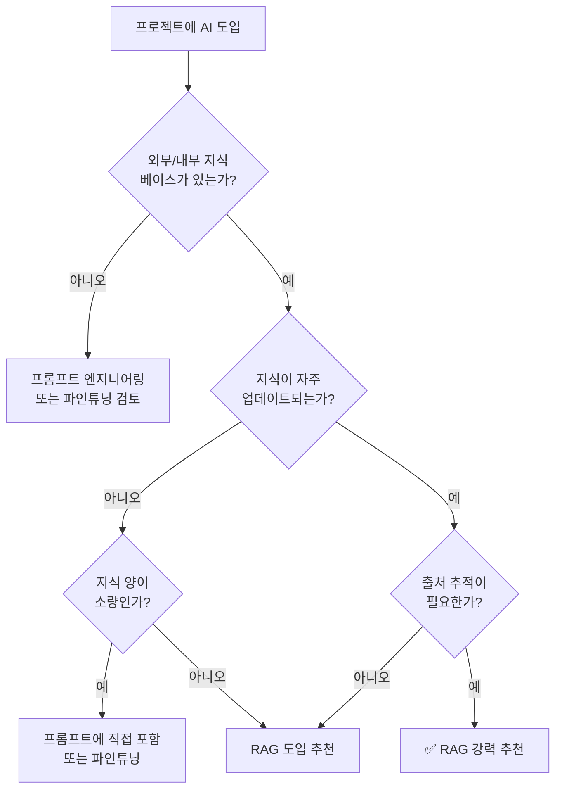
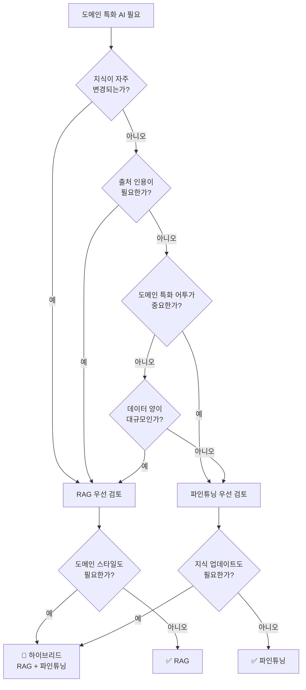
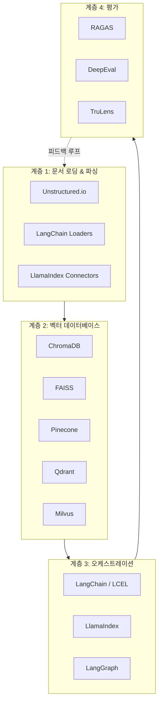
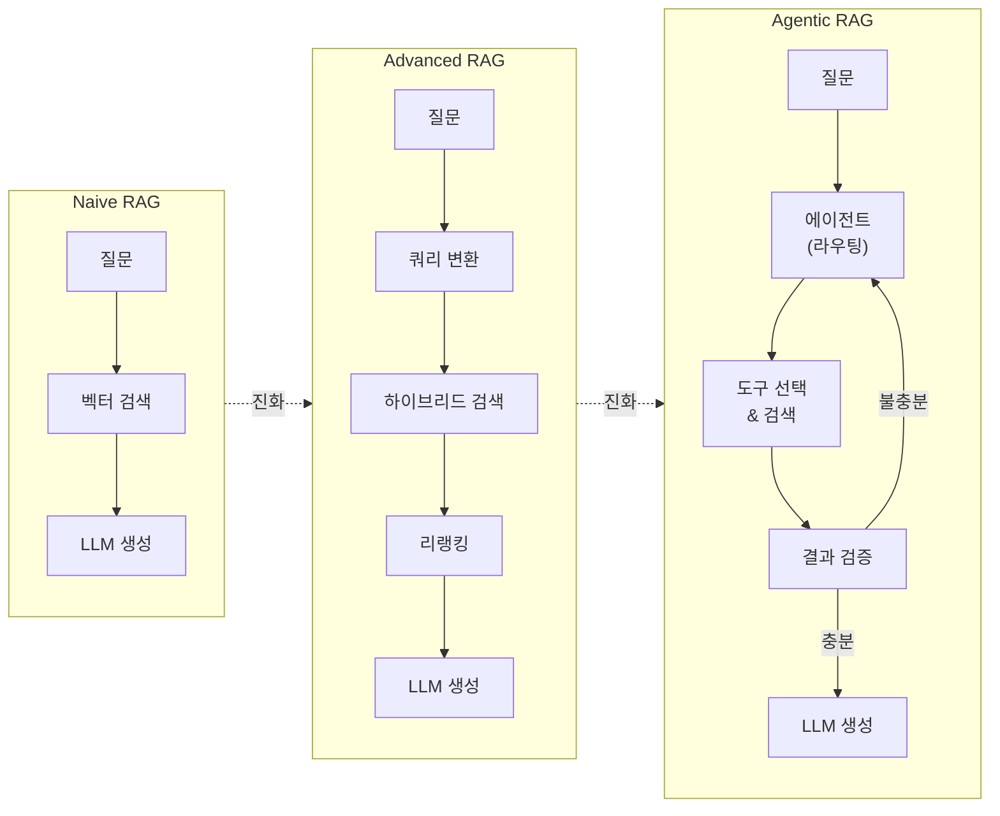

# RAG 적용 사례와 생태계 개관

> RAG가 빛을 발하는 곳과 그렇지 않은 곳, 그리고 RAG를 둘러싼 도구들의 전체 지도

## 개요

이 섹션에서는 RAG가 실제로 어떤 문제를 해결하는 데 효과적인지, 반대로 RAG가 오히려 불필요하거나 부적합한 경우는 언제인지를 판단하는 기준을 배웁니다. 나아가 RAG와 파인튜닝을 **비용·성능·유지보수** 관점에서 정량적으로 비교하고, 현재 RAG 생태계를 구성하는 프레임워크, 벡터 데이터베이스, 평가 도구들을 전체적으로 조망하여 앞으로의 학습 로드맵을 그려봅니다.

**선수 지식**: [LLM의 한계](01-rag-개요-llm의-한계와-rag의-필요성/01-llm의-한계-왜-외부-지식이-필요한가.md)에서 배운 할루시네이션·지식 단절·도메인 특화 문제, [RAG의 핵심 개념](01-rag-개요-llm의-한계와-rag의-필요성/02-rag의-핵심-개념-검색-증강-생성이란.md)에서 배운 검색-증강-생성 3단계 동작 원리, [RAG 원본 논문 핵심 분석](01-rag-개요-llm의-한계와-rag의-필요성/03-rag-원본-논문-핵심-분석.md)에서 다룬 DPR+BART 아키텍처와 현대 RAG로의 진화

**학습 목표**:
- RAG가 효과적인 대표적 사용 사례 5가지 이상을 열거할 수 있다
- RAG가 불필요하거나 부적합한 상황을 판단할 수 있다
- RAG vs 파인튜닝의 차이를 **비용·성능·운영** 세 축으로 정량 비교할 수 있다
- RAG 생태계의 주요 구성 요소(프레임워크, 벡터 DB, 평가 도구)를 파악하고, 프로젝트 요구사항에 맞는 기술 스택을 선택할 수 있다

## 왜 알아야 할까?

앞선 세션에서 RAG의 **이론적 기반**을 탄탄히 다졌습니다. 특히 [RAG 원본 논문 핵심 분석](01-rag-개요-llm의-한계와-rag의-필요성/03-rag-원본-논문-핵심-분석.md)에서 DPR의 Bi-Encoder 구조와 marginalization 수식까지 살펴보았죠. 하지만 실무에서 가장 먼저 마주치는 질문은 수식이 아니라 판단이에요. "우리 프로젝트에 RAG가 정말 필요한가?", "파인튜닝이 나을까, RAG가 나을까?", "어떤 도구를 써야 하지?"

잘못된 판단은 비용으로 이어집니다. RAG가 필요 없는 곳에 복잡한 파이프라인을 구축하면 불필요한 인프라 비용과 지연시간(Latency)이 발생하고, 반대로 RAG가 필요한 곳에 파인튜닝만 고집하면 지식을 업데이트할 때마다 모델을 재학습해야 하죠. 2026년 현재, 많은 기업이 RAG를 핵심 AI 아키텍처로 채택하고 있을 만큼 RAG는 실전 기술이 되었습니다. 이 섹션은 여러분이 **"RAG를 쓸지 말지"를 스스로 판단**하고, **생태계의 전체 지도를 머릿속에 그리는** 출발점이 됩니다.

## 핵심 개념

### 개념 1: RAG가 빛나는 사용 사례

> 💡 **비유**: RAG를 **실시간 검색이 되는 도서관 사서**라고 생각해 보세요. 손님(사용자)이 질문하면, 사서(LLM)는 자기 기억만으로 답하는 대신 서가(외부 지식 베이스)에서 관련 책을 꺼내와 펼친 뒤 답변합니다. 이 사서가 가장 빛나는 순간은? 질문이 구체적이고, 서가에 답이 있으며, 정확한 출처가 중요할 때입니다.

RAG가 특히 효과적인 대표 사례를 다섯 가지 범주로 정리하겠습니다.

**1) 지식 기반 QA (Knowledge-Grounded Question Answering)**
가장 대표적인 RAG 활용처입니다. 사내 문서, 제품 매뉴얼, 법률 조항, 의료 가이드라인 등 **특정 지식 소스에 기반한 질의응답**이 여기에 해당합니다. LLM이 학습하지 못한 비공개 정보를 검색하여 답변하므로, 할루시네이션을 크게 줄일 수 있거든요.

**2) 고객 지원 챗봇 (Customer Support)**
FAQ, 트러블슈팅 가이드, 정책 문서를 벡터 DB에 저장해 두면, 고객 질문에 정확한 근거를 붙여 답변할 수 있습니다. "반품 정책이 어떻게 되나요?"라는 질문에 최신 정책 문서를 검색해서 인용하는 식이죠.

**3) 코드 검색 및 개발 지원 (Code Search & Developer Assistance)**
GitHub Copilot 같은 AI 코딩 도구도 내부적으로 RAG 원리를 활용합니다. 코드베이스를 벡터 DB에 인덱싱해 두면, "이 프로젝트에서 인증 처리하는 코드 어디 있어?"라는 자연어 질문에 관련 코드 스니펫을 찾아줄 수 있습니다.

**4) 연구 및 분석 보조 (Research & Analysis)**
논문, 보고서, 특허 같은 대규모 문서 컬렉션에서 관련 정보를 검색하고 요약합니다. 금융 애널리스트가 수백 개의 실적 보고서에서 특정 지표 변화를 추적하는 것이 좋은 예시입니다.

**5) 규정 준수 및 감사 (Compliance & Audit)**
법률, 규정이 자주 바뀌는 영역에서 RAG는 최신 규정 문서를 실시간으로 검색하여 답변합니다. **출처 추적(Traceability)**이 가능하기 때문에 "이 답변의 근거가 뭐야?"라는 감사 요구사항을 충족할 수 있죠.

> 📊 **그림 1**: RAG 적합성 판단 의사결정 흐름



```run:python
# RAG 사용 사례를 판단하는 의사결정 도우미
from dataclasses import dataclass

@dataclass
class UseCaseAssessment:
    """RAG 적합성 평가 결과"""
    name: str
    needs_current_info: bool      # 최신 정보가 필요한가?
    has_private_knowledge: bool   # 비공개/내부 지식이 있는가?
    requires_citation: bool       # 출처 인용이 필요한가?
    knowledge_changes_often: bool # 지식이 자주 변하는가?

    @property
    def rag_score(self) -> int:
        """RAG 적합도 점수 (0~4)"""
        return sum([
            self.needs_current_info,
            self.has_private_knowledge,
            self.requires_citation,
            self.knowledge_changes_often,
        ])

    @property
    def recommendation(self) -> str:
        score = self.rag_score
        if score >= 3:
            return "✅ RAG 강력 추천"
        elif score == 2:
            return "🟡 RAG 고려할 만함"
        else:
            return "⚪ RAG 불필요할 수 있음"

# 대표 사용 사례 평가
cases = [
    UseCaseAssessment("사내 문서 QA",        True,  True,  True,  True),
    UseCaseAssessment("고객 지원 챗봇",       True,  True,  True,  True),
    UseCaseAssessment("코드 검색",            False, True,  True,  True),
    UseCaseAssessment("일상 대화 챗봇",       False, False, False, False),
    UseCaseAssessment("번역 서비스",          False, False, False, False),
    UseCaseAssessment("의료 가이드라인 QA",   True,  True,  True,  True),
]

print("=" * 60)
print(f"{'사용 사례':<20} {'점수':>4}  {'추천'}")
print("=" * 60)
for case in cases:
    print(f"{case.name:<20} {case.rag_score:>4}  {case.recommendation}")
```

```output
============================================================
사용 사례                 점수  추천
============================================================
사내 문서 QA                4  ✅ RAG 강력 추천
고객 지원 챗봇              4  ✅ RAG 강력 추천
코드 검색                   3  ✅ RAG 강력 추천
일상 대화 챗봇              0  ⚪ RAG 불필요할 수 있음
번역 서비스                 0  ⚪ RAG 불필요할 수 있음
의료 가이드라인 QA          4  ✅ RAG 강력 추천
```

### 개념 2: RAG가 불필요하거나 부적합한 경우

> 💡 **비유**: 아까의 사서 비유를 떠올려 보세요. 사서가 서가에서 책을 가져오는 데는 시간이 걸립니다. 만약 손님의 질문이 "1 더하기 1은?"처럼 사서가 이미 아는 것이라면, 굳이 서가까지 다녀올 필요가 없겠죠? 오히려 느려질 뿐입니다.

RAG가 **적합하지 않은** 상황을 알아두는 것도 중요합니다.

**1) LLM의 기존 지식으로 충분한 경우**
일반 상식 질문, 간단한 수학 계산, 널리 알려진 사실에 대해서는 LLM이 이미 충분히 정확합니다. 여기에 RAG를 추가하면 불필요한 지연시간과 비용만 발생하죠.

**2) 창의적 생성 작업**
시 쓰기, 소설 작성, 브레인스토밍처럼 **특정 사실에 근거할 필요가 없는** 창작 작업에서 RAG는 오히려 창의성을 제한할 수 있습니다.

**3) 번역 및 텍스트 변환**
언어 번역, 요약, 스타일 변환 같은 작업은 입력 텍스트 자체가 모든 정보를 담고 있으므로 외부 검색이 필요 없습니다.

**4) 지식이 고정적이고 양이 적은 경우**
변하지 않는 소량의 도메인 지식이라면, 파인튜닝이나 프롬프트에 직접 포함하는 것이 더 효율적일 수 있습니다.

**5) 실시간 응답이 극도로 중요한 경우**
RAG는 검색 단계가 추가되므로 순수 LLM 호출보다 지연시간이 깁니다. 밀리초 단위 응답이 요구되는 환경에서는 부담이 될 수 있어요.

### 개념 3: RAG vs 파인튜닝 — 비용·성능·운영 3축 비교

> 💡 **비유**: 파인튜닝은 사서에게 **새로운 분야의 전공 교육**을 시키는 것이고, RAG는 사서에게 **참고 자료실 이용 권한**을 주는 것입니다. 전공 교육을 받은 사서는 해당 분야의 용어와 뉘앙스를 자연스럽게 구사하지만, 새로운 책이 들어오면 또 교육을 받아야 하죠. 반면 참고 자료실을 이용하는 사서는 최신 자료를 바로 찾아볼 수 있지만, 전문 용어의 미묘한 차이까지 체화하지는 못합니다.

둘은 상호 배타적이 아닙니다. 많은 프로덕션 시스템이 **파인튜닝 + RAG를 함께** 사용하죠. 하지만 무엇을 선택하느냐에 따라 비용 구조가 완전히 달라지기 때문에 정량적으로 비교할 줄 알아야 합니다.

| 기준 | RAG | 파인튜닝 |
|------|-----|----------|
| **지식 업데이트** | 문서만 교체하면 즉시 반영 | 재학습 필요 (수일~수주) |
| **출처 추적** | 검색된 문서를 인용 가능 | 어려움 (블랙박스) |
| **도메인 어투/스타일** | LLM 기본 스타일 유지 | 도메인 특화 표현 학습 가능 |
| **초기 비용** | 낮음 (인프라 구축) | 높음 (GPU 학습 비용) |
| **런타임 비용** | 검색 + LLM 호출 (토큰 ↑) | LLM 호출만 (토큰 ↓) |
| **환각 감소** | 매우 효과적 (근거 기반) | 보통 (학습 데이터 품질 의존) |
| **구현 복잡도** | 중간 (검색 파이프라인) | 높음 (학습 파이프라인) |
| **지식 용량** | 사실상 무제한 (문서 추가) | 모델 파라미터에 제한 |

> 📊 **그림 2**: RAG vs 파인튜닝 의사결정 흐름



비용 관점에서 좀 더 구체적으로 비교해 볼까요? 실제 프로젝트에서는 **초기 구축 비용**뿐 아니라 **월간 운영 비용**과 **지식 업데이트 비용**까지 고려해야 합니다.

```run:python
# RAG vs 파인튜닝: 12개월 TCO(총소유비용) 시뮬레이션
from dataclasses import dataclass

@dataclass
class CostModel:
    """접근법별 비용 모델 (월 기준, USD)"""
    name: str
    setup_cost: float          # 초기 구축 비용
    monthly_infra: float       # 월간 인프라 비용
    monthly_api_calls: float   # 월간 API/추론 비용
    update_cost: float         # 지식 업데이트 1회 비용
    updates_per_year: int      # 연간 업데이트 횟수

    def total_cost_12m(self) -> float:
        """12개월 총비용"""
        return (
            self.setup_cost
            + (self.monthly_infra + self.monthly_api_calls) * 12
            + self.update_cost * self.updates_per_year
        )

# 시나리오: 10만 건 문서, 월 5만 쿼리, 주 1회 지식 업데이트
rag = CostModel(
    name="RAG",
    setup_cost=2_000,        # 벡터 DB 세팅, 파이프라인 구축
    monthly_infra=300,       # 벡터 DB 호스팅 (Qdrant Cloud 등)
    monthly_api_calls=1_500, # 검색 + LLM (컨텍스트 토큰 증가)
    update_cost=50,          # 문서 재인덱싱 비용
    updates_per_year=52,     # 주 1회
)

fine_tuning = CostModel(
    name="파인튜닝",
    setup_cost=5_000,        # 데이터 정제, 학습 파이프라인 구축
    monthly_infra=100,       # 모델 호스팅 (전용 인스턴스)
    monthly_api_calls=800,   # LLM만 (컨텍스트 짧음)
    update_cost=3_000,       # 재학습 비용 (GPU 시간)
    updates_per_year=12,     # 월 1회 (주 1회는 비현실적)
)

hybrid = CostModel(
    name="하이브리드",
    setup_cost=6_000,        # 두 시스템 모두 구축
    monthly_infra=350,       # 벡터 DB + 모델 호스팅
    monthly_api_calls=1_200, # RAG지만 파인튜닝 모델이라 효율적
    update_cost=500,         # 문서는 주기적, 모델은 분기별
    updates_per_year=56,     # 주 1회 문서 + 분기별 모델
)

print("=" * 60)
print("📊 12개월 TCO 비교 (10만 문서, 월 5만 쿼리)")
print("=" * 60)

for model in [rag, fine_tuning, hybrid]:
    total = model.total_cost_12m()
    print(f"\n{'─' * 40}")
    print(f"  {model.name}")
    print(f"  초기 구축:     ${model.setup_cost:>8,.0f}")
    print(f"  월간 운영(×12): ${(model.monthly_infra + model.monthly_api_calls) * 12:>8,.0f}")
    print(f"  업데이트(연간): ${model.update_cost * model.updates_per_year:>8,.0f}")
    print(f"  ── 12개월 총비용: ${total:>8,.0f}")

# 업데이트 빈도에 따른 손익분기점
print(f"\n{'=' * 60}")
print("💡 핵심 인사이트")
print(f"{'=' * 60}")
gap = fine_tuning.total_cost_12m() - rag.total_cost_12m()
print(f"  RAG가 파인튜닝 대비 연 ${gap:,.0f} 절감 (주 1회 업데이트 시)")
print(f"  업데이트 빈도가 낮을수록 파인튜닝이 유리해짐")
```

```output
============================================================
📊 12개월 TCO 비교 (10만 문서, 월 5만 쿼리)
============================================================

────────────────────────────────────────
  RAG
  초기 구축:     $   2,000
  월간 운영(×12): $  21,600
  업데이트(연간): $   2,600
  ── 12개월 총비용: $  26,200

────────────────────────────────────────
  파인튜닝
  초기 구축:     $   5,000
  월간 운영(×12): $  10,800
  업데이트(연간): $  36,000
  ── 12개월 총비용: $  51,800

────────────────────────────────────────
  하이브리드
  초기 구축:     $   6,000
  월간 운영(×12): $  18,600
  업데이트(연간): $  28,000
  ── 12개월 총비용: $  52,600

============================================================
💡 핵심 인사이트
============================================================
  RAG가 파인튜닝 대비 연 $25,600 절감 (주 1회 업데이트 시)
  업데이트 빈도가 낮을수록 파인튜닝이 유리해짐
```

여기서 주목할 점은, **지식 업데이트 빈도**가 비용 차이의 핵심 변수라는 것입니다. 업데이트가 잦으면 RAG가 압도적으로 유리하고, 지식이 거의 변하지 않으면 파인튜닝의 낮은 런타임 비용이 장기적으로 유리해지죠. 이것이 바로 "우리 프로젝트에는 뭐가 맞을까?"라는 질문에 **일률적인 정답이 없는** 이유입니다.

### 개념 4: RAG 생태계 전체 지도

> 💡 **비유**: RAG 생태계는 **요리에 필요한 주방 도구 세트**와 같습니다. 식재료(원본 문서)를 손질하는 칼(문서 파서), 재료를 보관하는 냉장고(벡터 DB), 레시피에 따라 요리하는 조리도구(오케스트레이션 프레임워크), 그리고 맛을 평가하는 시식 도구(평가 프레임워크)가 필요하죠.

현재 RAG 생태계를 네 개 계층으로 나눠 살펴보겠습니다.

> 📊 **그림 3**: RAG 생태계 4계층 아키텍처



**계층 1: 문서 로딩 & 파싱**
원본 데이터를 수집하고 텍스트로 변환하는 단계입니다.
- **Unstructured.io** — PDF, Word, HTML 등 다양한 포맷을 파싱
- **LangChain Document Loaders** — 80개 이상의 데이터 소스 커넥터 제공
- **LlamaIndex Data Connectors** — 구조화/비구조화 데이터 로딩에 특화

**계층 2: 벡터 데이터베이스**
임베딩 벡터를 저장하고 유사도 검색을 수행합니다.

| 벡터 DB | 특징 | 적합한 상황 |
|---------|------|-------------|
| **ChromaDB** | 경량, 설치 간편, 로컬 개발용 | 프로토타이핑, 학습, 소규모 프로젝트 |
| **FAISS** | Meta 개발, GPU 가속, 라이브러리 형태 | 연구, 대규모 배치 검색 |
| **Pinecone** | 완전 관리형, 서버리스 | 운영 부담 없는 프로덕션 |
| **Qdrant** | Rust 기반, 고성능, 실시간 업데이트 | 프로덕션, 실시간 서비스 |
| **Milvus** | 대규모(수십억 벡터), 분산 처리 | 엔터프라이즈, 빅데이터 |

**계층 3: 오케스트레이션 프레임워크**
RAG 파이프라인의 각 단계를 조합하고 관리합니다.
- **LangChain** — 범용 LLM 프레임워크. 에이전트, 체인, 다양한 통합 지원. LCEL(LangChain Expression Language)로 파이프라인을 선언적으로 조합
- **LlamaIndex** — 데이터 인덱싱과 검색에 특화. 벡터, 계층적, 키워드 등 다양한 인덱싱 전략 제공
- **LangGraph** — LangChain 팀이 만든 에이전틱 워크플로우 프레임워크. 조건부 분기, 반복 등 복잡한 RAG 흐름 구현

**계층 4: 평가 프레임워크**
RAG 시스템의 품질을 측정합니다.
- **RAGAS** — Faithfulness, Answer Relevancy, Context Precision/Recall 등의 메트릭으로 참조 없이 자동 평가
- **DeepEval** — pytest 스타일로 LLM 출력에 대한 단위 테스트 작성
- **TruLens** — LangChain/LlamaIndex와 긴밀히 통합된 평가 및 추적 도구

```python
# RAG 생태계 컴포넌트 매핑
RAG_ECOSYSTEM = {
    "문서 로딩 & 파싱": {
        "tools": ["Unstructured.io", "LangChain Loaders", "LlamaIndex Connectors"],
        "chapters": ["Ch3: 문서 로딩과 파싱"],
    },
    "텍스트 청킹": {
        "tools": ["RecursiveCharacterTextSplitter", "SemanticChunker", "RAPTOR"],
        "chapters": ["Ch4: 텍스트 청킹 전략", "Ch14: 고급 청킹과 인덱싱"],
    },
    "임베딩 모델": {
        "tools": ["OpenAI Embeddings", "Sentence Transformers", "Cohere Embed"],
        "chapters": ["Ch5: 임베딩 모델 이해"],
    },
    "벡터 데이터베이스": {
        "tools": ["ChromaDB", "FAISS", "Pinecone", "Qdrant", "Milvus"],
        "chapters": ["Ch6: ChromaDB 기초", "Ch7: 벡터 DB 심화"],
    },
    "검색 & 리랭킹": {
        "tools": ["BM25", "Cohere Rerank", "MMR"],
        "chapters": ["Ch10~12: 검색 품질·하이브리드·리랭킹"],
    },
    "오케스트레이션": {
        "tools": ["LangChain", "LlamaIndex", "LangGraph"],
        "chapters": ["Ch8: LangChain RAG", "Ch9: LlamaIndex RAG", "Ch16: 에이전틱 RAG"],
    },
    "평가": {
        "tools": ["RAGAS", "DeepEval", "TruLens"],
        "chapters": ["Ch17: RAG 평가"],
    },
}
```

이 코스의 나머지 챕터들이 이 생태계의 각 계층을 하나씩 깊이 파고드는 구조라는 점을 기억해 두세요.

### 개념 5: RAG의 진화 — 세 가지 패러다임

앞서 [RAG 원본 논문 핵심 분석](01-rag-개요-llm의-한계와-rag의-필요성/03-rag-원본-논문-핵심-분석.md)에서 2020년 원본 RAG를 살펴봤는데요, 현재까지 RAG 아키텍처는 크게 세 세대로 진화해 왔습니다.

**Naive RAG (1세대)**
가장 기본적인 형태로, 질문 → 임베딩 → 벡터 검색 → Top-K 문서 → LLM 생성이라는 단순한 파이프라인입니다. 이 구조의 장점과 한계, 그리고 구현 방법은 [Ch2 세션 2.2](02-rag-아키텍처-핵심-컴포넌트와-파이프라인-구조/02-naive-rag-기본-패턴과-한계.md)에서 본격적으로 다루게 됩니다. 여기서는 전체 진화 흐름에서의 위치만 잡아두겠습니다.

**Advanced RAG (2세대)**
Naive RAG의 약점을 보완합니다. **쿼리 변환**(Multi-Query, HyDE), **하이브리드 검색**(키워드 + 벡터), **리랭킹**(Cohere Rerank), **고급 청킹**(시멘틱 청킹, 부모-자식 청킹) 등의 기법을 추가하여 검색과 생성 품질을 모두 높입니다.

**Modular / Agentic RAG (3세대)**
LLM 에이전트가 검색 전략을 동적으로 결정합니다. "이 질문에는 벡터 검색이 좋겠다", "결과가 부족하니 쿼리를 바꿔서 다시 검색하자"처럼 **스스로 판단하고 반복**하는 형태입니다. LangGraph 같은 에이전틱 프레임워크가 이를 지원하죠.

> 📊 **그림 4**: RAG 아키텍처의 세 가지 진화 단계



이 세 패러다임은 코스 전체에 걸쳐 단계적으로 배우게 됩니다. Ch2~Ch7에서 Naive RAG의 각 컴포넌트를 이해하고, Ch10~Ch14에서 Advanced 기법을, Ch16에서 Agentic RAG를 다루죠.

```run:python
# RAG 진화 단계별 특징 비교
rag_generations = [
    {
        "세대": "Naive RAG",
        "검색": "단순 벡터 유사도",
        "생성": "검색 결과 그대로 전달",
        "특징": "구현 간단, 품질 제한적",
        "대표 기법": "Top-K 유사도 검색",
        "적합 상황": "PoC, 단순 QA",
    },
    {
        "세대": "Advanced RAG",
        "검색": "하이브리드 + 리랭킹",
        "생성": "쿼리 변환, 컨텍스트 압축",
        "특징": "검색/생성 품질 대폭 향상",
        "대표 기법": "HyDE, Cohere Rerank, Semantic Chunking",
        "적합 상황": "프로덕션 QA, 문서 분석",
    },
    {
        "세대": "Agentic RAG",
        "검색": "에이전트가 동적 결정",
        "생성": "반복적 검증 + 자기 수정",
        "특징": "복잡한 질문에 강력",
        "대표 기법": "LangGraph, Self-RAG, CRAG",
        "적합 상황": "멀티홉 추론, 복잡한 분석",
    },
]

for gen in rag_generations:
    print(f"📌 {gen['세대']}")
    print(f"   검색 전략:  {gen['검색']}")
    print(f"   생성 전략:  {gen['생성']}")
    print(f"   대표 기법:  {gen['대표 기법']}")
    print(f"   적합 상황:  {gen['적합 상황']}")
    print()
```

```output
📌 Naive RAG
   검색 전략:  단순 벡터 유사도
   생성 전략:  검색 결과 그대로 전달
   대표 기법:  Top-K 유사도 검색
   적합 상황:  PoC, 단순 QA

📌 Advanced RAG
   검색 전략:  하이브리드 + 리랭킹
   생성 전략:  쿼리 변환, 컨텍스트 압축
   대표 기법:  HyDE, Cohere Rerank, Semantic Chunking
   적합 상황:  프로덕션 QA, 문서 분석

📌 Agentic RAG
   검색 전략:  에이전트가 동적 결정
   생성 전략:  반복적 검증 + 자기 수정
   대표 기법:  LangGraph, Self-RAG, CRAG
   적합 상황:  멀티홉 추론, 복잡한 분석
```

## 실습: 직접 해보기

이번 실습에서는 RAG 적합성 판단 도구를 만들어 봅니다. 실제 프로젝트에서 RAG 도입 여부를 결정할 때 활용할 수 있는 체크리스트 기반 평가기입니다. 앞서 개념 3에서 살펴본 비용 모델과 결합하면, **"RAG를 쓸지, 파인튜닝을 쓸지, 하이브리드로 갈지"**를 정량적으로 판단할 수 있습니다.

```run:python
from dataclasses import dataclass, field

@dataclass
class RAGFeasibilityChecker:
    """RAG 도입 적합성을 종합 평가하는 체크리스트"""
    project_name: str
    scores: dict = field(default_factory=dict)

    # 평가 항목과 가중치
    CRITERIA = {
        "external_knowledge": {
            "question": "외부/내부 지식 베이스가 존재하는가?",
            "weight": 3,
            "category": "필수",
        },
        "knowledge_freshness": {
            "question": "지식이 주기적으로 업데이트되는가?",
            "weight": 2,
            "category": "강력 추천",
        },
        "citation_needed": {
            "question": "답변의 출처/근거 제시가 필요한가?",
            "weight": 2,
            "category": "강력 추천",
        },
        "factual_accuracy": {
            "question": "사실 정확성이 매우 중요한가?",
            "weight": 2,
            "category": "강력 추천",
        },
        "latency_tolerance": {
            "question": "1~3초의 응답 지연을 허용할 수 있는가?",
            "weight": 1,
            "category": "실행 가능성",
        },
        "infra_budget": {
            "question": "벡터 DB 인프라 예산이 있는가?",
            "weight": 1,
            "category": "실행 가능성",
        },
    }

    def evaluate(self, responses: dict[str, bool]) -> None:
        """각 항목에 대한 응답(True/False)으로 평가"""
        self.scores = {}
        for key, value in self.CRITERIA.items():
            answer = responses.get(key, False)
            self.scores[key] = value["weight"] if answer else 0

    @property
    def total_score(self) -> int:
        return sum(self.scores.values())

    @property
    def max_score(self) -> int:
        return sum(c["weight"] for c in self.CRITERIA.values())

    def report(self) -> str:
        """평가 리포트 생성"""
        lines = [f"\n🔍 RAG 적합성 평가: {self.project_name}"]
        lines.append("=" * 50)

        for key, criteria in self.CRITERIA.items():
            score = self.scores.get(key, 0)
            status = "✅" if score > 0 else "❌"
            lines.append(
                f"  {status} [{criteria['category']}] "
                f"{criteria['question']} (+{score}/{criteria['weight']})"
            )

        lines.append("-" * 50)
        pct = (self.total_score / self.max_score) * 100
        lines.append(f"  총점: {self.total_score}/{self.max_score} ({pct:.0f}%)")

        if pct >= 80:
            rec = "RAG"
        elif pct >= 50:
            rec = "RAG 또는 하이브리드"
        elif pct >= 30:
            rec = "파인튜닝 또는 프롬프트 엔지니어링"
        else:
            rec = "프롬프트 엔지니어링 (RAG 불필요)"

        if pct >= 80:
            lines.append(f"  → 🟢 추천: {rec}")
        elif pct >= 50:
            lines.append(f"  → 🟡 추천: {rec}")
        elif pct >= 30:
            lines.append(f"  → 🟠 추천: {rec}")
        else:
            lines.append(f"  → 🔴 추천: {rec}")

        return "\n".join(lines)


# 시나리오 1: 사내 기술 문서 검색 시스템
checker1 = RAGFeasibilityChecker("사내 기술 문서 검색")
checker1.evaluate({
    "external_knowledge": True,      # 사내 위키, 기술 문서 존재
    "knowledge_freshness": True,     # 문서가 주기적으로 업데이트됨
    "citation_needed": True,         # 답변 근거 필요
    "factual_accuracy": True,        # 기술 정보 정확성 중요
    "latency_tolerance": True,       # 2~3초 지연 허용
    "infra_budget": True,            # 인프라 예산 있음
})
print(checker1.report())

# 시나리오 2: 창작 글쓰기 보조 도구
checker2 = RAGFeasibilityChecker("창작 글쓰기 보조")
checker2.evaluate({
    "external_knowledge": False,     # 외부 지식 불필요
    "knowledge_freshness": False,    # 지식 업데이트 불필요
    "citation_needed": False,        # 출처 불필요
    "factual_accuracy": False,       # 창작이므로 사실 정확성 불필요
    "latency_tolerance": True,       # 지연 허용
    "infra_budget": False,           # 별도 인프라 불필요
})
print(checker2.report())

# 시나리오 3: 법률 상담 AI (하이브리드 후보)
checker3 = RAGFeasibilityChecker("법률 상담 AI")
checker3.evaluate({
    "external_knowledge": True,      # 법률 DB 존재
    "knowledge_freshness": True,     # 법률 개정 반영 필요
    "citation_needed": True,         # 조문 인용 필수
    "factual_accuracy": True,        # 정확성 매우 중요
    "latency_tolerance": True,       # 지연 허용
    "infra_budget": True,            # 예산 있음
})
print(checker3.report())
print("\n  💡 법률 특화 어투가 필요하다면 → 하이브리드(RAG + 파인튜닝) 권장")
```

```output

🔍 RAG 적합성 평가: 사내 기술 문서 검색
==================================================
  ✅ [필수] 외부/내부 지식 베이스가 존재하는가? (+3/3)
  ✅ [강력 추천] 지식이 주기적으로 업데이트되는가? (+2/2)
  ✅ [강력 추천] 답변의 출처/근거 제시가 필요한가? (+2/2)
  ✅ [강력 추천] 사실 정확성이 매우 중요한가? (+2/2)
  ✅ [실행 가능성] 1~3초의 응답 지연을 허용할 수 있는가? (+1/1)
  ✅ [실행 가능성] 벡터 DB 인프라 예산이 있는가? (+1/1)
--------------------------------------------------
  총점: 11/11 (100%)
  → 🟢 추천: RAG

🔍 RAG 적합성 평가: 창작 글쓰기 보조
==================================================
  ❌ [필수] 외부/내부 지식 베이스가 존재하는가? (+0/3)
  ❌ [강력 추천] 지식이 주기적으로 업데이트되는가? (+0/2)
  ❌ [강력 추천] 답변의 출처/근거 제시가 필요한가? (+0/2)
  ❌ [강력 추천] 사실 정확성이 매우 중요한가? (+0/2)
  ✅ [실행 가능성] 1~3초의 응답 지연을 허용할 수 있는가? (+1/1)
  ❌ [실행 가능성] 벡터 DB 인프라 예산이 있는가? (+0/1)
--------------------------------------------------
  총점: 1/11 (9%)
  → 🔴 추천: 프롬프트 엔지니어링 (RAG 불필요)

🔍 RAG 적합성 평가: 법률 상담 AI
==================================================
  ✅ [필수] 외부/내부 지식 베이스가 존재하는가? (+3/3)
  ✅ [강력 추천] 지식이 주기적으로 업데이트되는가? (+2/2)
  ✅ [강력 추천] 답변의 출처/근거 제시가 필요한가? (+2/2)
  ✅ [강력 추천] 사실 정확성이 매우 중요한가? (+2/2)
  ✅ [실행 가능성] 1~3초의 응답 지연을 허용할 수 있는가? (+1/1)
  ✅ [실행 가능성] 벡터 DB 인프라 예산이 있는가? (+1/1)
--------------------------------------------------
  총점: 11/11 (100%)
  → 🟢 추천: RAG

  💡 법률 특화 어투가 필요하다면 → 하이브리드(RAG + 파인튜닝) 권장
```

## 더 깊이 알아보기

### RAG 논문에서 기업 표준까지 — 4년의 여정

RAG의 역사는 놀라울 정도로 짧습니다. 2020년 Facebook AI Research(현 Meta AI)에서 Lewis et al.이 원본 논문을 발표한 이후, 불과 4년 만에 기업 AI의 표준 아키텍처가 되었거든요.

2020년의 원본 RAG는 DPR과 BART를 결합한 **연구 프로토타입**이었습니다. 직접 학습시켜야 했고, Wikipedia 21M 문서에 대해서만 검증되었죠. 하지만 2022년 ChatGPT가 등장하면서 모든 것이 바뀌었습니다. GPT-3.5/4 같은 강력한 범용 LLM이 나오자, 연구자들은 깨달았습니다 — "굳이 end-to-end로 학습할 필요 없이, 검색 결과를 프롬프트에 넣으면 되잖아?"

이 **"Retrieve-then-Read"** 패러다임의 전환이 현대 RAG의 폭발적 성장을 이끌었습니다. LangChain(2022년 10월)과 LlamaIndex(당시 GPT Index, 2022년 11월)가 거의 동시에 등장하면서 RAG 구현의 진입 장벽이 극적으로 낮아졌고, ChromaDB, Pinecone, Qdrant 같은 벡터 데이터베이스들이 빠르게 성장했습니다.

2024년에는 Anthropic이 **Contextual RAG**를 제안하여 각 청크에 문서 맥락을 접두사로 추가하는 기법을 소개했고, Microsoft는 **GraphRAG**를 발표하여 지식 그래프와 RAG를 결합했습니다. 2025~2026년에 이르러 RAG는 단순한 검색-생성을 넘어 **에이전틱 RAG**, **멀티모달 RAG** 등으로 진화하며 실험 단계를 넘어 프로덕션 필수 아키텍처로 자리잡았습니다.

### LangChain과 LlamaIndex — 라이벌이 아닌 동반자

흥미로운 사실이 있습니다. LangChain의 창시자 Harrison Chase와 LlamaIndex의 창시자 Jerry Liu는 거의 같은 시기에, 각자 독립적으로 RAG 프레임워크를 만들기 시작했어요. Chase는 범용 LLM 애플리케이션 프레임워크를, Liu는 데이터 인덱싱에 특화된 프레임워크를 목표로 했죠. 결과적으로 두 프레임워크는 경쟁보다는 **보완 관계**로 발전했습니다. 실제로 많은 프로덕션 시스템이 LlamaIndex로 검색을 처리하고 LangChain/LangGraph로 워크플로우를 오케스트레이션하는 조합을 사용합니다.

## 흔한 오해와 팁

> ⚠️ **흔한 오해**: "RAG는 항상 파인튜닝보다 낫다"
>
> 앞서 개념 3에서 살펴본 것처럼, RAG와 파인튜닝은 각각 강점이 다릅니다. RAG는 지식 업데이트와 출처 추적에 유리하지만, 도메인 특화 어투나 전문 용어의 자연스러운 사용이 중요한 경우에는 파인튜닝이 더 효과적입니다. 예를 들어 의료 보고서 생성처럼 특정 문체와 형식이 엄격히 요구되는 작업에서는 RAG만으로는 부족할 수 있어요. 또한 지식이 고정적이고 양이 적다면 파인튜닝이나 프롬프트 엔지니어링이 더 단순하고 효율적인 선택입니다. 최적의 접근법은 "둘 중 하나"가 아니라 **프로젝트 요구사항에 맞는 조합**을 찾는 것입니다.

> 💡 **알고 계셨나요?**: Gao et al.의 2023년 서베이 논문에 따르면, RAG 아키텍처는 **Naive → Advanced → Modular** 세 가지 패러다임으로 분류됩니다. 이 분류 체계는 RAG 커뮤니티에서 사실상 표준으로 자리잡아, 새로운 기법을 소개할 때 "이건 Advanced RAG에 해당한다"는 식으로 위치를 설명하는 공통 언어가 되었습니다.

> 🔥 **실무 팁**: RAG 프로젝트를 시작할 때 가장 흔한 실수는 **처음부터 복잡한 아키텍처를 구축하는 것**입니다. 대신 이 순서를 따르세요: ① Naive RAG로 시작하여 기본 파이프라인을 검증 → ② RAGAS 등으로 성능을 측정 → ③ 약점이 드러난 부분만 Advanced 기법으로 교체. ChromaDB + LangChain으로 프로토타입을 만들고, 프로덕션에서 필요하면 Qdrant나 Pinecone으로 마이그레이션하는 것이 현실적인 전략입니다.

> 🔥 **실무 팁**: RAG vs 파인튜닝 결정이 어렵다면, **먼저 RAG로 프로토타입**을 만드세요. RAG는 초기 비용이 낮고 구축이 빠르기 때문에, 실제 데이터로 성능을 검증한 후에 파인튜닝 추가 여부를 판단할 수 있습니다. "RAG-first, Fine-tune-later"가 리스크를 최소화하는 전략이에요.

## 핵심 정리

| 개념 | 설명 |
|------|------|
| RAG 적합 사례 | 지식 QA, 고객 지원, 코드 검색, 연구 분석, 규정 준수 등 외부 지식 + 출처 필요한 작업 |
| RAG 부적합 사례 | 창작, 번역, 일반 상식 질문 등 외부 검색이 불필요한 작업 |
| RAG vs 파인튜닝 | RAG는 지식 업데이트·출처 추적에 강하고, 파인튜닝은 도메인 스타일 학습에 강함. 비용은 업데이트 빈도가 핵심 변수 |
| TCO 관점 | 업데이트 잦으면 RAG 유리, 지식 고정적이면 파인튜닝의 낮은 런타임 비용이 장기적 이점 |
| 문서 로딩 계층 | Unstructured.io, LangChain Loaders 등으로 다양한 포맷의 데이터를 수집·파싱 |
| 벡터 DB 계층 | ChromaDB(프로토타입) → FAISS/Qdrant/Pinecone/Milvus(프로덕션)로 단계적 선택 |
| 오케스트레이션 계층 | LangChain(범용 체인), LlamaIndex(검색 특화), LangGraph(에이전틱 워크플로우) |
| 평가 계층 | RAGAS(표준 메트릭), DeepEval(TDD 스타일), TruLens(추적·모니터링) |
| RAG 진화 3단계 | Naive → Advanced → Agentic으로 검색·생성 전략이 점점 지능화 |

## 다음 섹션 미리보기

챕터 1에서 LLM의 한계부터 RAG의 개념, 원본 논문, 그리고 생태계 전체를 조망했습니다. 다음 챕터 [Ch2: RAG 아키텍처 — 핵심 컴포넌트와 파이프라인 구조](02-rag-아키텍처-핵심-컴포넌트와-파이프라인-구조/01-rag-파이프라인-전체-구조-ingestion과-inference.md)에서는 RAG 파이프라인을 구성하는 **각 컴포넌트(문서 로더, 텍스트 스플리터, 임베딩 모델, 벡터 스토어, 리트리버, 프롬프트, LLM)**를 하나씩 분해하고, 이들이 어떻게 조합되어 하나의 파이프라인을 이루는지를 코드와 함께 구체적으로 살펴봅니다. 특히 [세션 2.2](02-rag-아키텍처-핵심-컴포넌트와-파이프라인-구조/02-naive-rag-기본-패턴과-한계.md)에서는 Naive RAG 파이프라인을 직접 구현하며 이번 섹션에서 그린 생태계 지도 위에 실제 구현의 살을 붙이게 됩니다.

## 참고 자료

- [Retrieval-Augmented Generation for Large Language Models: A Survey (Gao et al., 2023)](https://arxiv.org/abs/2312.10997) — Naive/Advanced/Modular RAG 분류 체계를 제안한 대표적 서베이 논문
- [RAG 101: Demystifying Retrieval-Augmented Generation Pipelines (NVIDIA)](https://developer.nvidia.com/blog/rag-101-demystifying-retrieval-augmented-generation-pipelines/) — RAG 파이프라인 아키텍처를 시각적으로 설명하는 NVIDIA 기술 블로그
- [LangChain RAG Documentation](https://docs.langchain.com/oss/python/langchain/rag) — LangChain 공식 RAG 가이드
- [LlamaIndex RAG Documentation](https://developers.llamaindex.ai/python/framework/understanding/rag/) — LlamaIndex 공식 RAG 가이드
- [RAGAS: Automated Evaluation of Retrieval Augmented Generation](https://arxiv.org/abs/2309.15217) — RAG 평가 프레임워크 RAGAS의 원본 논문
- [RAG vs Fine-Tuning (IBM)](https://www.ibm.com/think/topics/rag-vs-fine-tuning) — RAG와 파인튜닝의 장단점을 체계적으로 비교하는 가이드
- [What is RAG? (GitHub)](https://github.com/resources/articles/software-development-with-retrieval-augmentation-generation-rag) — GitHub이 설명하는 소프트웨어 개발에서의 RAG 활용

---
### 🔗 Related Sessions
- [hallucination](../01-rag-개요-llm의-한계와-rag의-필요성/01-llm의-한계-왜-외부-지식이-필요한가.md) (prerequisite)
- [parametric_memory](../01-rag-개요-llm의-한계와-rag의-필요성/01-llm의-한계-왜-외부-지식이-필요한가.md) (prerequisite)
- [knowledge_cutoff](../01-rag-개요-llm의-한계와-rag의-필요성/01-llm의-한계-왜-외부-지식이-필요한가.md) (prerequisite)
- [rag](../01-rag-개요-llm의-한계와-rag의-필요성/02-rag의-핵심-개념-검색-증강-생성이란.md) (prerequisite)
- [non_parametric_memory](../01-rag-개요-llm의-한계와-rag의-필요성/01-llm의-한계-왜-외부-지식이-필요한가.md) (prerequisite)
- [retrieve_augment_generate](../01-rag-개요-llm의-한계와-rag의-필요성/02-rag의-핵심-개념-검색-증강-생성이란.md) (prerequisite)
- [dpr](../01-rag-개요-llm의-한계와-rag의-필요성/02-rag의-핵심-개념-검색-증강-생성이란.md) (prerequisite)
- [bart_generator](../01-rag-개요-llm의-한계와-rag의-필요성/03-rag-원본-논문-핵심-분석.md) (prerequisite)
