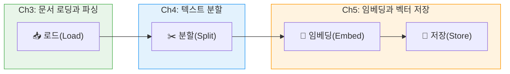
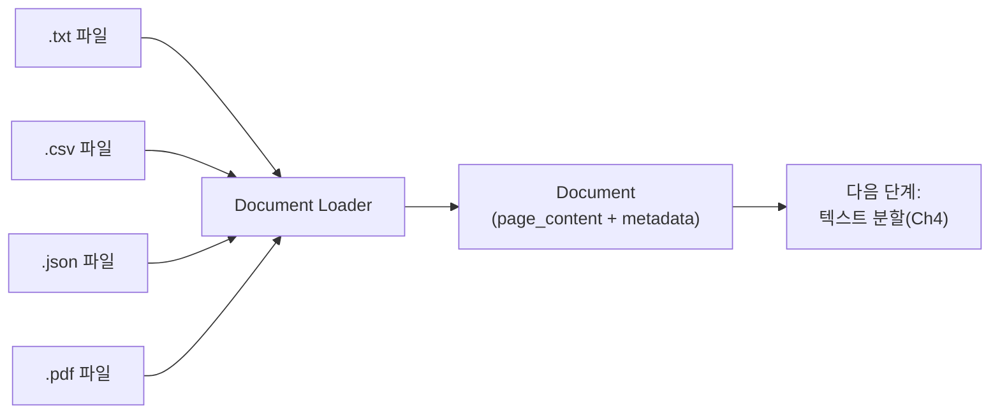

# 문서 로딩 기초 — LangChain Document Loaders

> LangChain의 Document 객체 구조를 이해하고, TextLoader·CSVLoader·JSONLoader로 다양한 파일을 RAG 파이프라인에 투입하는 방법을 배웁니다.

## 개요

[Ch2 세션 5](02-rag-아키텍처-핵심-컴포넌트와-파이프라인-구조/05-rag-아키텍처-설계-실습-요구사항에서-설계까지.md)에서 RAG 아키텍처를 직접 설계해 보셨죠? 그때 인제스천 파이프라인의 첫 번째 컴포넌트로 **문서 로더(Document Loader)**를 선택하셨을 겁니다. 이제 그 설계를 실제 코드로 구현할 차례입니다.

> 📊 **그림 1**: Ch3–Ch5 인제스천 파이프라인 로드맵



Ch3부터 Ch5까지는 RAG 인제스천 파이프라인의 세 단계 — **로드(Load) → 분할(Split) → 임베딩(Embed)** — 를 순서대로 다룹니다. 이번 Ch3에서는 그 첫 단추인 "로드" 단계를 집중적으로 살펴보는데요, 그중에서도 이 세션에서는 **가장 기본적인 파일 형식(텍스트·CSV·JSON)부터 시작**합니다.

LangChain이 제공하는 `Document` 객체의 구조를 이해하고, 텍스트·CSV·JSON 파일을 로드하는 기본 로더들을 실습합니다. 아무리 똑똑한 LLM이라도 데이터를 먹여주지 않으면 아무것도 할 수 없거든요.

**선수 지식**: [Ch2: RAG 아키텍처](02-rag-아키텍처-핵심-컴포넌트와-파이프라인-구조/01-rag-파이프라인-전체-구조-ingestion과-inference.md)에서 배운 RAG 파이프라인의 전체 구조(Indexing → Retrieval → Generation)를 알고 있어야 합니다. 특히 Indexing 단계에서 문서 로딩이 어떤 역할을 하는지 기억해 주세요.

**학습 목표**:
- LangChain의 `Document` 객체가 `page_content`와 `metadata`로 구성되어 있음을 이해한다
- `TextLoader`, `CSVLoader`, `JSONLoader`의 사용법과 차이점을 익힌다
- 메타데이터(metadata)가 RAG 파이프라인에서 왜 중요한지 설명할 수 있다
- `DirectoryLoader`로 여러 파일을 한꺼번에 로드할 수 있다

## 왜 알아야 할까?

RAG 시스템을 도서관에 비유해 볼까요? LLM이 사서라면, **Document Loader는 책을 도서관 서가에 꽂을 수 있는 규격으로 정리해주는 사서 보조원**입니다. 원본 자료가 PDF든, CSV든, JSON이든 상관없이 동일한 형태(`Document` 객체)로 변환해야 다음 단계인 텍스트 청킹(Chunking)과 임베딩(Embedding)이 가능하거든요.

실무에서 RAG를 구축할 때 가장 먼저 부딪히는 문제가 바로 "우리 데이터를 어떻게 넣지?"입니다. 사내 문서가 `.txt`로만 되어 있는 경우는 거의 없죠. FAQ는 CSV, API 응답은 JSON, 보고서는 PDF — 이렇게 다양한 형식이 섞여 있습니다. LangChain의 Document Loader는 이 혼란을 **하나의 통일된 인터페이스**로 정리해 줍니다.

> 📊 **그림 2**: Document Loader의 역할 — 다양한 형식을 하나의 Document 객체로 통일



## 핵심 개념

### 개념 1: Document 객체 — RAG의 공통 화폐

> 💡 **비유**: `Document` 객체는 도서관의 **색인 카드**와 같습니다. 카드 앞면에는 책 내용 요약(page_content)이, 뒷면에는 저자·출판연도·분류번호 같은 부가 정보(metadata)가 적혀 있죠. RAG 파이프라인의 모든 컴포넌트는 이 색인 카드 형태만 읽을 줄 알면 됩니다.

LangChain에서 모든 문서 데이터는 `Document` 객체로 표현됩니다. 구조는 놀랍도록 단순한데요:

```python
from langchain_core.documents import Document

# Document 객체 직접 생성
doc = Document(
    page_content="RAG는 검색 증강 생성의 약자입니다.",  # 실제 텍스트 내용
    metadata={                                          # 부가 정보 딕셔너리
        "source": "rag_intro.txt",
        "page": 1,
        "author": "홍길동"
    }
)
```

두 가지 핵심 속성을 정리하면:

| 속성 | 타입 | 역할 |
|------|------|------|
| `page_content` | `str` | 실제 텍스트 내용. 임베딩과 검색의 대상 |
| `metadata` | `dict` | 출처, 페이지 번호, 생성일 등 부가 정보. 필터링과 추적에 사용 |

```run:python
from langchain_core.documents import Document

doc = Document(
    page_content="RAG는 검색 증강 생성의 약자입니다.",
    metadata={"source": "rag_intro.txt", "page": 1}
)

print(f"내용: {doc.page_content}")
print(f"메타데이터: {doc.metadata}")
print(f"출처: {doc.metadata['source']}")
```

```output
내용: RAG는 검색 증강 생성의 약자입니다.
메타데이터: {'source': 'rag_intro.txt', 'page': 1}
출처: rag_intro.txt
```

왜 `metadata`가 중요할까요? 나중에 검색 결과를 사용자에게 보여줄 때 "이 답변의 근거는 `보고서_2024Q3.pdf`의 5페이지입니다"라고 출처를 밝힐 수 있기 때문입니다. 메타데이터 없이는 할루시네이션(Hallucination)과 정확한 정보를 구별할 방법이 없거든요.

### 개념 2: TextLoader — 가장 기본적인 로더

> 💡 **비유**: `TextLoader`는 종이 한 장을 통째로 스캔하는 것과 같습니다. 파일 전체를 하나의 `Document` 객체로 만들어 줍니다.

`TextLoader`는 가장 단순한 로더로, `.txt` 파일의 전체 내용을 하나의 `Document`로 변환합니다.

```python
from langchain_community.document_loaders import TextLoader

# 기본 사용법
loader = TextLoader("./data/rag_intro.txt")
docs = loader.load()  # List[Document] 반환
```

한국어 문서를 다룰 때 인코딩 문제가 자주 발생하는데요, `encoding` 파라미터로 해결할 수 있습니다:

```python
# 한국어 파일 로드 시 인코딩 지정
loader = TextLoader(
    "./data/korean_doc.txt",
    encoding="utf-8",
    autodetect_encoding=True  # 인코딩 자동 감지 폴백
)
docs = loader.load()
```

`autodetect_encoding=True`로 설정하면, 지정한 인코딩이 실패할 경우 자동으로 다른 인코딩을 시도합니다. `euc-kr`, `cp949` 같은 레거시 인코딩 파일을 다룰 때 유용하죠.

### 개념 3: CSVLoader — 행 단위로 문서 생성

> 💡 **비유**: 엑셀 시트의 각 행을 개별 포스트잇으로 떼어내는 것과 같습니다. 한 행이 하나의 `Document`가 되고, 열 이름이 자동으로 메타데이터가 됩니다.

CSV 파일은 FAQ, 제품 목록, 고객 리뷰 등 **구조화된 데이터**에 많이 쓰이죠. `CSVLoader`는 각 행(row)을 개별 `Document` 객체로 변환합니다.

```python
from langchain_community.document_loaders import CSVLoader

# 기본 사용법 — 각 행이 하나의 Document
loader = CSVLoader("./data/faq.csv")
docs = loader.load()
```

기본적으로 `CSVLoader`는 모든 열의 값을 `key: value` 형태로 `page_content`에 넣습니다. 하지만 실무에서는 특정 열만 본문으로, 나머지는 메타데이터로 분리하고 싶을 때가 많거든요:

```python
# source_column: 특정 열을 metadata의 source로 지정
loader = CSVLoader(
    file_path="./data/products.csv",
    source_column="product_name",    # source 메타데이터로 사용할 열
    csv_args={
        "delimiter": ",",
        "quotechar": '"'
    }
)
docs = loader.load()
# metadata['source']가 파일 경로 대신 제품명이 됨
```

```run:python
from langchain_community.document_loaders import CSVLoader

# 샘플 CSV 파일 생성
import csv
with open("/tmp/faq.csv", "w", newline="", encoding="utf-8") as f:
    writer = csv.writer(f)
    writer.writerow(["question", "answer", "category"])
    writer.writerow(["RAG란 무엇인가요?", "검색 증강 생성 기법입니다.", "기초"])
    writer.writerow(["임베딩이란?", "텍스트를 벡터로 변환하는 것입니다.", "기초"])

loader = CSVLoader("/tmp/faq.csv", source_column="category")
docs = loader.load()

for i, doc in enumerate(docs):
    print(f"--- Document {i} ---")
    print(f"내용: {doc.page_content[:60]}...")
    print(f"출처: {doc.metadata['source']}")
    print()
```

```output
--- Document 0 ---
내용: question: RAG란 무엇인가요?
answer: 검색 증강 생성 기법입니다.
category:...
출처: 기초

--- Document 1 ---
내용: question: 임베딩이란?
answer: 텍스트를 벡터로 변환하는 것입니다.
category: 기...
출처: 기초

```

### 개념 4: JSONLoader — 유연한 JSON 파싱

> 💡 **비유**: JSON 파일이 큰 나무라면, `jq_schema`는 원하는 가지만 정확히 잘라내는 가위입니다. 복잡하게 중첩된 JSON에서 필요한 부분만 골라 `Document`로 만들 수 있죠.

JSON 데이터는 API 응답, 로그, 설정 파일 등에서 흔히 사용됩니다. `JSONLoader`는 `jq` 문법을 활용해 중첩 구조에서 원하는 데이터를 정밀하게 추출합니다.

```bash
# jq 패키지 설치 필요
pip install jq
```

```python
from langchain_community.document_loaders import JSONLoader

# messages 배열에서 content 필드만 추출
loader = JSONLoader(
    file_path="./data/chat_log.json",
    jq_schema=".messages[].content",  # jq 표현식으로 경로 지정
    text_content=False                # JSON 값을 문자열로 변환
)
docs = loader.load()
```

더 정교한 제어가 필요할 때는 `content_key`와 `metadata_func`를 조합합니다:

```python
def extract_metadata(record: dict, metadata: dict) -> dict:
    """각 JSON 레코드에서 메타데이터를 추출하는 커스텀 함수"""
    metadata["sender"] = record.get("sender_name", "unknown")
    metadata["timestamp"] = record.get("timestamp_ms", 0)
    return metadata

loader = JSONLoader(
    file_path="./data/chat_log.json",
    jq_schema=".messages[]",          # 각 메시지 객체를 순회
    content_key="content",            # page_content로 사용할 필드
    metadata_func=extract_metadata    # 메타데이터 추출 함수
)
docs = loader.load()
```

| jq 표현식 | 의미 |
|-----------|------|
| `.messages[]` | messages 배열의 모든 요소 |
| `.data.items[].text` | 중첩 객체의 text 필드 |
| `.results[]?` | 결과가 없어도 에러 없이 빈 배열 반환 |

### 개념 5: load()와 lazy_load() — 메모리를 고려한 로딩

모든 LangChain 문서 로더는 두 가지 로딩 방식을 지원합니다:

```python
# load() — 모든 문서를 한 번에 메모리에 적재
docs = loader.load()  # List[Document] 반환

# lazy_load() — 제너레이터로 하나씩 처리 (대용량 파일에 유용)
for doc in loader.lazy_load():
    process(doc)  # 한 번에 하나의 Document만 메모리에
```

작은 파일이라면 `load()`가 편리하지만, 수천 개의 파일을 처리할 때는 `lazy_load()`가 메모리 절약에 큰 도움이 됩니다. 마치 물탱크에 물을 한꺼번에 부을지(`load`), 수도꼭지에서 필요한 만큼만 틀지(`lazy_load`) 선택하는 것과 같죠.

### 개념 6: DirectoryLoader — 폴더 전체를 한 번에

실무에서는 파일 하나가 아니라 폴더 전체를 로드해야 하는 경우가 많습니다. `DirectoryLoader`는 glob 패턴으로 여러 파일을 한꺼번에 로드합니다:

```python
from langchain_community.document_loaders import DirectoryLoader, TextLoader

# data/ 폴더의 모든 .txt 파일을 로드
loader = DirectoryLoader(
    "./data",
    glob="**/*.txt",           # 하위 폴더까지 재귀 탐색
    loader_cls=TextLoader,     # 각 파일에 사용할 로더 지정
    show_progress=True         # 진행 상황 표시
)
docs = loader.load()
```

## 실습: 직접 해보기

아래 실습에서는 텍스트, CSV, JSON 세 가지 형식의 샘플 데이터를 만들고, 각각의 로더로 `Document` 객체를 생성한 뒤, 메타데이터를 비교해 봅니다.

```python
# 0. 필요한 패키지 설치
# pip install langchain-core langchain-community jq

import json
import csv
import os
from pathlib import Path

# ─── 1단계: 샘플 데이터 생성 ───

# 작업 디렉토리 생성
data_dir = Path("./rag_loader_demo")
data_dir.mkdir(exist_ok=True)

# 텍스트 파일
txt_path = data_dir / "intro.txt"
txt_path.write_text(
    "RAG(Retrieval-Augmented Generation)는 검색 증강 생성 기법입니다.\n"
    "LLM이 답변을 생성하기 전에 관련 문서를 검색하여 참고합니다.\n"
    "이를 통해 할루시네이션을 줄이고 최신 정보를 반영할 수 있습니다.",
    encoding="utf-8"
)

# CSV 파일
csv_path = data_dir / "faq.csv"
with open(csv_path, "w", newline="", encoding="utf-8") as f:
    writer = csv.writer(f)
    writer.writerow(["question", "answer", "category"])
    writer.writerow(["RAG란?", "검색 증강 생성 기법입니다.", "개념"])
    writer.writerow(["임베딩이란?", "텍스트를 벡터로 변환하는 것입니다.", "개념"])
    writer.writerow(["청킹이란?", "문서를 작은 단위로 분할하는 것입니다.", "전처리"])

# JSON 파일
json_path = data_dir / "docs.json"
json_data = {
    "documents": [
        {"title": "RAG 개요", "content": "RAG는 외부 지식을 활용하는 기법입니다.", "author": "김철수"},
        {"title": "벡터 DB", "content": "벡터 DB는 임베딩을 저장하고 검색합니다.", "author": "이영희"},
        {"title": "LangChain", "content": "LangChain은 LLM 애플리케이션 프레임워크입니다.", "author": "박민수"}
    ]
}
with open(json_path, "w", encoding="utf-8") as f:
    json.dump(json_data, f, ensure_ascii=False, indent=2)

print("샘플 데이터 생성 완료!")
print(f"  - {txt_path}")
print(f"  - {csv_path}")
print(f"  - {json_path}")
```

```python
# ─── 2단계: TextLoader로 텍스트 파일 로드 ───

from langchain_community.document_loaders import TextLoader

txt_loader = TextLoader(
    str(data_dir / "intro.txt"),
    encoding="utf-8"
)
txt_docs = txt_loader.load()

print(f"[TextLoader] 로드된 Document 수: {len(txt_docs)}")
print(f"내용 미리보기: {txt_docs[0].page_content[:50]}...")
print(f"메타데이터: {txt_docs[0].metadata}")
print()
```

```python
# ─── 3단계: CSVLoader로 CSV 파일 로드 ───

from langchain_community.document_loaders import CSVLoader

csv_loader = CSVLoader(
    file_path=str(data_dir / "faq.csv"),
    source_column="category",  # category 열을 source로 활용
    encoding="utf-8"
)
csv_docs = csv_loader.load()

print(f"[CSVLoader] 로드된 Document 수: {len(csv_docs)}")
for i, doc in enumerate(csv_docs):
    print(f"\n  Document {i}:")
    print(f"  내용: {doc.page_content}")
    print(f"  메타데이터: {doc.metadata}")
print()
```

```python
# ─── 4단계: JSONLoader로 JSON 파일 로드 ───

from langchain_community.document_loaders import JSONLoader

# 메타데이터 추출 함수 정의
def extract_metadata(record: dict, metadata: dict) -> dict:
    """JSON 레코드에서 title과 author를 메타데이터로 추출"""
    metadata["title"] = record.get("title", "")
    metadata["author"] = record.get("author", "")
    return metadata

json_loader = JSONLoader(
    file_path=str(data_dir / "docs.json"),
    jq_schema=".documents[]",       # documents 배열의 각 요소를 순회
    content_key="content",          # content 필드를 page_content로 사용
    metadata_func=extract_metadata  # 커스텀 메타데이터 추출
)
json_docs = json_loader.load()

print(f"[JSONLoader] 로드된 Document 수: {len(json_docs)}")
for i, doc in enumerate(json_docs):
    print(f"\n  Document {i}:")
    print(f"  내용: {doc.page_content}")
    print(f"  메타데이터: {doc.metadata}")
```

```python
# ─── 5단계: 결과 비교 ───

print("=" * 60)
print("로더별 Document 생성 비교")
print("=" * 60)

all_docs = {
    "TextLoader": txt_docs,
    "CSVLoader": csv_docs,
    "JSONLoader": json_docs,
}

for loader_name, docs in all_docs.items():
    print(f"\n📄 {loader_name}")
    print(f"  Document 수: {len(docs)}")
    print(f"  metadata 키: {list(docs[0].metadata.keys())}")
    print(f"  첫 번째 page_content 길이: {len(docs[0].page_content)}자")

# 정리
import shutil
shutil.rmtree(data_dir)
print("\n\n정리 완료! 샘플 데이터가 삭제되었습니다.")
```

## 더 깊이 알아보기

### LangChain의 탄생과 Document Loader의 진화

LangChain은 **Harrison Chase**가 2022년 10월, 단 며칠 만에 만들어낸 프로젝트입니다. 당시 ML 스타트업 Robust Intelligence에서 일하던 Chase는 개발자 밋업에 다니며 한 가지 패턴을 발견했는데요 — 모든 사람이 LLM 앱을 만들 때 비슷한 코드를 반복해서 작성하고 있었다는 것이죠. "프롬프트 템플릿 → 외부 데이터 연결 → LLM 호출"이라는 공통 패턴을 하나의 프레임워크로 묶은 것이 LangChain의 시작이었습니다.

초기 버전은 개인 GitHub(hwchase17)에 올린 800줄짜리 단일 Python 파일이었는데, 놀랍게도 이것이 빠르게 성장하여 현재 200개 이상의 Document Loader를 제공하는 거대한 생태계가 되었습니다. `TextLoader`에서 시작해 PDF, HTML, Notion, Slack, YouTube까지 — 데이터가 있는 곳이면 어디든 연결하겠다는 철학이 LangChain의 핵심이죠.

2023~2024년에는 패키지 구조가 대대적으로 개편되었습니다. 원래 `langchain` 하나에 모든 것이 담겨 있었지만, `langchain-core`(핵심 추상화), `langchain-community`(커뮤니티 통합), 그리고 `langchain-openai` 같은 파트너 패키지로 분리되었거든요. 이 덕분에 Document Loader를 사용할 때도 `langchain_community.document_loaders`에서 임포트하는 것이 현재의 표준입니다.

### Document라는 이름의 유래

"왜 하필 Document라고 불렀을까?"라는 의문이 들 수 있는데요. 이는 정보 검색(Information Retrieval) 분야의 전통에서 온 것입니다. IR 분야에서는 검색 대상이 되는 텍스트 단위를 전통적으로 "document"라고 부릅니다. 실제로 한 문장이든, 한 문단이든, 파일 한 개 전체든 — 검색의 기본 단위이면 모두 document입니다. LangChain은 이 전통을 그대로 이어받아 `Document` 클래스를 설계한 것이죠.

## 흔한 오해와 팁

> ⚠️ **흔한 오해**: "TextLoader는 텍스트 파일만 읽을 수 있다"고 생각하기 쉽지만, 실제로는 `.py`, `.md`, `.html` 등 **텍스트 기반이라면 어떤 확장자든** 읽을 수 있습니다. 다만 구조를 파싱하지는 않기 때문에, HTML의 태그까지 그대로 `page_content`에 들어간다는 점을 주의하세요.

> 💡 **알고 계셨나요?**: LangChain의 Document Loader는 현재 **200개 이상**이 존재합니다. 파일 형식별 로더(PDF, Word, Excel) 외에도, Notion, Slack, GitHub Issues, YouTube 자막, Wikipedia 등 외부 서비스와 직접 연동되는 로더도 있습니다. 새로운 데이터 소스가 필요하면 [공식 통합 문서](https://docs.langchain.com/oss/python/integrations/document_loaders)에서 검색해 보세요.

> 🔥 **실무 팁**: 한국어 CSV/텍스트 파일을 다룰 때 `UnicodeDecodeError`가 가장 흔한 에러입니다. `encoding="utf-8"` 을 명시하되, 레거시 파일이 섞여 있다면 `autodetect_encoding=True`를 함께 설정하세요. 이렇게 하면 `utf-8` 실패 시 `euc-kr`, `cp949` 등을 자동으로 시도합니다.

> 🔥 **실무 팁**: `CSVLoader`는 기본적으로 모든 열을 `page_content`에 "key: value" 형태로 넣습니다. 대규모 CSV에서 특정 열만 검색 대상으로 쓰고 싶다면, `content_columns` 파라미터로 본문에 포함할 열을 제한하거나, 로드 후 `page_content`를 가공하는 후처리를 추가하세요.

> 💡 **코드 스타일 팁**: 실습 코드의 `print`문에서 `📄`같은 이모지를 사용하는 것을 눈치채셨을 텐데요. 이는 터미널 출력의 **가독성을 높이기 위한 의도적인 선택**입니다. 로더 종류나 처리 단계를 시각적으로 구분할 때 이모지가 효과적이거든요. 본 교재에서는 `print`문의 이모지 사용을 챕터 전반에 걸쳐 일관되게 적용하고 있으니, 여러분의 프로젝트에서도 팀 내 코드 컨벤션으로 "허용" 또는 "금지"를 명확히 정해두면 스타일 혼란을 방지할 수 있습니다.

## 핵심 정리

| 개념 | 설명 |
|------|------|
| `Document` | `page_content`(텍스트)와 `metadata`(부가 정보)로 구성된 LangChain의 기본 데이터 단위 |
| `page_content` | 임베딩과 검색의 대상이 되는 실제 텍스트 내용 |
| `metadata` | 출처, 페이지 번호, 카테고리 등 추적·필터링에 사용하는 딕셔너리 |
| `TextLoader` | 텍스트 파일 전체를 하나의 Document로 로드. `encoding`, `autodetect_encoding` 지원 |
| `CSVLoader` | CSV의 각 행을 개별 Document로 변환. `source_column`으로 출처 지정 가능 |
| `JSONLoader` | `jq_schema`로 JSON 구조를 탐색하여 원하는 데이터만 Document로 추출 |
| `DirectoryLoader` | glob 패턴으로 폴더 내 여러 파일을 한꺼번에 로드 |
| `load()` vs `lazy_load()` | 전체 적재 vs 제너레이터 방식. 대용량 데이터는 `lazy_load()` 권장 |

## 다음 섹션 미리보기

지금까지 텍스트, CSV, JSON이라는 비교적 단순한 형식을 다뤘는데요. 실무에서 가장 많이 마주치는 문서 형식은 사실 **PDF**입니다. 다음 섹션 [3.2: PDF 문서 로딩과 파싱](03-문서-로딩과-파싱-다양한-소스에서-데이터-수집/02-pdf-문서-처리-텍스트-추출과-레이아웃-분석.md)에서는 `PyPDFLoader`, `PDFMinerLoader` 등 다양한 PDF 로더를 비교하고, 표·이미지가 포함된 복잡한 PDF를 효과적으로 처리하는 전략을 알아봅니다.

## 참고 자료

- [LangChain Document Loader 통합 문서](https://docs.langchain.com/oss/python/integrations/document_loaders) - 200개 이상의 로더를 종류별로 분류한 공식 레퍼런스
- [LangChain JSONLoader 공식 가이드](https://python.langchain.com/docs/integrations/document_loaders/json/) - jq_schema 사용법과 메타데이터 추출 예제
- [LangChain CSVLoader API 레퍼런스](https://python.langchain.com/api_reference/community/document_loaders/langchain_community.document_loaders.csv_loader.CSVLoader.html) - source_column, csv_args 등 파라미터 상세 설명
- [LangChain Document 클래스 레퍼런스](https://python.langchain.com/api_reference/core/documents/langchain_core.documents.base.Document.html) - Document 객체의 속성과 메서드 API 문서
- [LangChain v1 마이그레이션 가이드](https://docs.langchain.com/oss/python/migrate/langchain-v1) - langchain-community 패키지 분리 등 최신 임포트 경로 안내