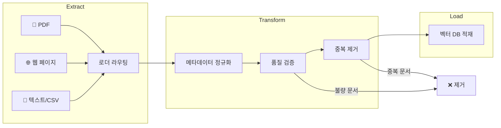
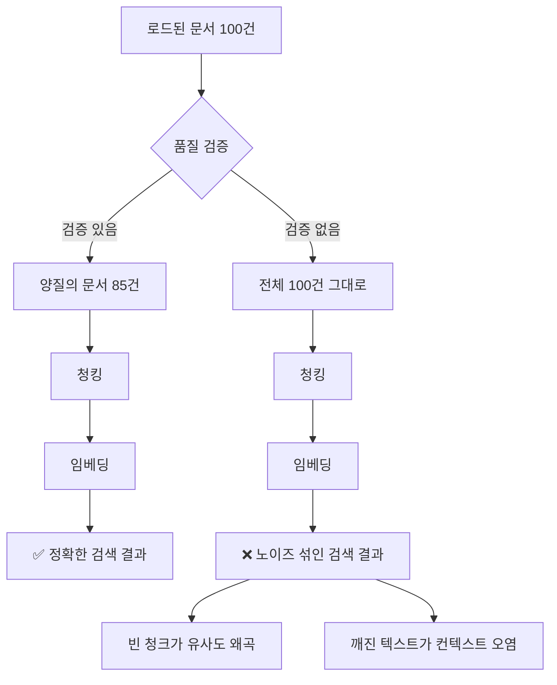

# 문서 로딩 파이프라인 구축 — 실전 ETL

> 여러 소스에서 문서를 수집하고, 정규화하고, 품질을 검증하고, 중복을 제거하는 통합 파이프라인을 만들어 봅니다.

## 개요

이 섹션에서는 앞서 배운 모든 문서 로더(TextLoader, PyPDFLoader, WebBaseLoader, UnstructuredLoader 등)를 하나의 통합 파이프라인으로 엮는 방법을 학습합니다. 실전 RAG 시스템에서는 하나의 형식만 다루는 경우가 거의 없거든요. PDF, 웹 페이지, API 데이터가 뒤섞인 환경에서 일관된 품질의 Document 객체를 생산하는 것이 핵심입니다.

**선수 지식**: [세션 3.1](ch03/session_01.md)의 Document 객체와 metadata 구조, [세션 3.2](ch03/session_02.md)의 PDF 로더, [세션 3.3](ch03/session_03.md)의 Unstructured.io partition, [세션 3.4](ch03/session_04.md)의 WebBaseLoader와 API 데이터 수집

**학습 목표**:
- 파일 확장자에 따라 적절한 로더를 자동 선택하는 라우팅 로직을 구현할 수 있다
- 서로 다른 소스에서 온 메타데이터를 통일된 스키마로 정규화할 수 있다
- 문서 품질 검증(빈 문서 필터링, 인코딩 감지, 최소 길이 검증)으로 후속 파이프라인 품질을 보장할 수 있다
- 콘텐츠 해시 기반 중복 제거(Deduplication) 전략을 구현할 수 있다
- 증분 업데이트(Incremental Update)로 변경된 문서만 효율적으로 처리할 수 있다

## 왜 알아야 할까?

실제 프로젝트를 상상해 보세요. 사내 기술 문서는 Confluence에 있고, API 명세는 Swagger JSON으로 관리하고, 고객 매뉴얼은 PDF로 제공되고, 최신 업데이트는 블로그에 올라옵니다. 이 모든 소스를 하나의 RAG 시스템에 넣으려면 어떻게 해야 할까요?

각각 로더를 따로 호출해서 리스트를 합치면 되지 않느냐고요? 그 방법은 문서가 10개일 때는 통하지만, 수백~수천 개의 문서가 매주 업데이트되는 프로덕션 환경에서는 금세 한계에 부딪힙니다. 중복 문서가 벡터 DB에 쌓이고, 메타데이터 형식이 제각각이라 필터링이 안 되고, 전체를 매번 다시 처리하느라 시간과 비용이 낭비되죠.

게다가 **품질이 낮은 문서**가 파이프라인에 섞여 들어가면 어떻게 될까요? 인코딩이 깨진 PDF, 텍스트가 비어 있는 HTML, 특수문자만 가득한 파싱 잔해 — 이런 "쓰레기 데이터"가 임베딩되면 벡터 공간을 오염시키고, 검색 결과의 정확도를 떨어뜨립니다. **Garbage In, Garbage Out**은 RAG에서도 철칙이거든요.

이 세션에서 만드는 ETL 파이프라인은 이런 현실적 문제를 체계적으로 해결합니다. **E**xtract(추출) → **T**ransform(변환) → **L**oad(적재)의 각 단계에서 무엇을 해야 하는지 명확히 정리하고, 재사용 가능한 코드로 구현해 봅시다.

## 핵심 개념

### 개념 1: ETL 패턴과 문서 파이프라인

> 💡 **비유**: ETL은 공장의 조립 라인과 같습니다. 원재료(원본 문서)가 들어오면, 검수대(Transform)에서 규격에 맞게 다듬고, 불량품을 걸러내고, 창고(벡터 DB)에 정리해서 넣습니다. 규격이 다른 재료가 섞여 들어와도 조립 라인이 알아서 분류하고 통일된 형태로 가공하죠.

RAG 시스템에서의 ETL은 전통적인 데이터 웨어하우스의 ETL과 본질적으로 같은 문제를 풉니다:

| ETL 단계 | 전통 데이터 | RAG 문서 파이프라인 |
|----------|------------|-------------------|
| **Extract** | DB, CSV, API에서 데이터 추출 | PDF, 웹, API에서 원본 텍스트 추출 |
| **Transform** | 스키마 통일, 클렌징, 정규화 | 메타데이터 정규화, 품질 검증, 중복 제거 |
| **Load** | 데이터 웨어하우스에 적재 | 벡터 DB에 임베딩과 함께 저장 |

> 📊 **그림 1**: 문서 ETL 파이프라인의 전체 흐름



이 세션에서는 Extract와 Transform 단계에 집중합니다. Load(벡터 DB 적재)는 [챕터 6](ch06/session_01.md)에서 본격적으로 다룹니다.

### 개념 2: 로더 라우팅 — 파일 확장자 기반 자동 선택

> 💡 **비유**: 우체국의 우편물 분류기를 떠올려 보세요. 편지, 소포, 등기 등 종류에 따라 다른 처리 라인으로 자동 분배됩니다. 로더 라우팅도 마찬가지로, 파일 확장자를 보고 적합한 로더를 자동으로 선택합니다.

LangChain의 `DirectoryLoader`는 기본적으로 모든 파일에 동일한 로더를 적용합니다. 하지만 실전에서는 PDF, HTML, TXT, JSON 등이 한 디렉토리에 섞여 있죠. 이럴 때 파일 확장자별로 다른 로더를 매핑하는 라우팅 딕셔너리를 만들어야 합니다:

```python
from langchain_community.document_loaders import (
    TextLoader,
    PyPDFLoader,
    CSVLoader,
    JSONLoader,
    BSHTMLLoader,
    UnstructuredMarkdownLoader,
)

# 확장자 → 로더 매핑 딕셔너리
LOADER_MAPPING: dict[str, type] = {
    ".txt": TextLoader,
    ".pdf": PyPDFLoader,
    ".csv": CSVLoader,
    ".html": BSHTMLLoader,
    ".htm": BSHTMLLoader,
    ".md": UnstructuredMarkdownLoader,
    ".json": JSONLoader,
}
```

이 매핑을 기반으로 파일 경로를 받아 자동으로 적절한 로더를 선택하는 함수를 만들 수 있습니다:

```python
from pathlib import Path
from langchain_core.documents import Document


def load_file(file_path: str, **kwargs) -> list[Document]:
    """파일 확장자에 따라 적절한 로더를 자동 선택하여 문서를 로드합니다."""
    ext = Path(file_path).suffix.lower()
    loader_cls = LOADER_MAPPING.get(ext)
    
    if loader_cls is None:
        raise ValueError(f"지원하지 않는 파일 형식: {ext}")
    
    # JSON 로더는 jq_schema가 필요 (세션 3.1에서 배운 내용)
    if loader_cls == JSONLoader and "jq_schema" not in kwargs:
        kwargs["jq_schema"] = "."
    
    loader = loader_cls(file_path, **kwargs)
    return loader.load()
```

### 개념 3: 메타데이터 정규화 — 일관된 스키마 만들기

> 💡 **비유**: 여러 나라에서 수입된 식품의 라벨을 생각해 보세요. 일본어, 영어, 중국어로 된 라벨이 제각각이면 관리가 어렵습니다. 수입 후 한국어 통일 라벨을 부착하듯, 서로 다른 소스의 메타데이터도 하나의 표준 스키마로 통일해야 합니다.

각 로더가 생성하는 메타데이터는 형식이 전부 다릅니다. `PyPDFLoader`는 `page` 필드를, `WebBaseLoader`는 `source`에 URL을, `CSVLoader`는 `row` 번호를 넣죠. 이렇게 제각각인 메타데이터를 검색 시 필터링에 활용하려면 정규화가 필수입니다:

```python
import hashlib
from datetime import datetime, timezone
from pathlib import Path


def normalize_metadata(doc: Document, source_type: str) -> Document:
    """다양한 소스의 메타데이터를 통일된 스키마로 정규화합니다."""
    raw = doc.metadata
    
    normalized = {
        # 필수 필드 — 모든 문서에 반드시 포함
        "source": raw.get("source", "unknown"),
        "source_type": source_type,  # "local_file", "web", "api"
        "content_hash": hashlib.sha256(
            doc.page_content.encode()
        ).hexdigest(),
        "ingested_at": datetime.now(timezone.utc).isoformat(),
        "char_count": len(doc.page_content),
        
        # 선택 필드 — 소스에 따라 존재 여부가 다름
        "page": raw.get("page"),
        "file_type": Path(raw.get("source", "")).suffix.lower() or None,
        "title": raw.get("title"),
        "language": raw.get("language", "ko"),
    }
    
    # None 값은 제거하여 깔끔하게 유지
    normalized = {k: v for k, v in normalized.items() if v is not None}
    
    doc.metadata = normalized
    return doc
```

여기서 핵심은 `content_hash`입니다. 문서 내용을 SHA-256으로 해싱한 값인데, 이 해시가 중복 제거와 증분 업데이트의 기반이 됩니다.

### 개념 4: 품질 검증 — 쓰레기를 걸러야 보석이 빛난다

> 💡 **비유**: 금을 채굴할 때, 캐낸 광석을 바로 제련소에 넣지 않습니다. 먼저 돌멩이, 흙, 불순물을 선별기로 걸러내죠. 이 과정을 건너뛰면 제련소 효율이 떨어지고, 최종 금의 순도도 낮아집니다. 문서 파이프라인에서도 마찬가지로, 품질이 낮은 문서를 미리 걸러내지 않으면 후속 청킹과 임베딩의 품질이 크게 떨어집니다.

메타데이터가 정규화된 후, 중복을 제거하기 **전에** 반드시 품질 검증 단계를 거쳐야 합니다. 실전에서 로더가 반환하는 Document 중에는 놀라울 정도로 "쓸모없는" 문서가 많거든요. 대표적인 문제 유형을 살펴봅시다:

| 문제 유형 | 증상 | 발생 원인 |
|----------|------|----------|
| 빈 문서 | `page_content`가 빈 문자열이거나 공백만 존재 | PDF의 이미지 전용 페이지, HTML의 스크립트 블록 |
| 깨진 인코딩 | `문서` 같은 의미 없는 문자(mojibake) | EUC-KR 파일을 UTF-8로 읽었을 때 |
| 너무 짧은 콘텐츠 | "Page 1", "목차" 등 정보가 없는 텍스트 | PDF 헤더/푸터, 빈 페이지의 잔여 텍스트 |
| 파싱 잔해 | 특수문자, HTML 태그, 바이너리 문자열만 남은 경우 | 잘못된 파서 선택, 암호화된 PDF |

이런 저품질 문서가 파이프라인을 통과하면 어떤 일이 벌어질까요?

> 📊 **그림 2**: 품질 검증 유무에 따른 파이프라인 결과 비교



품질 검증이 없으면 빈 문서가 청킹 단계에서 의미 없는 작은 청크를 생성하고, 이 청크의 임베딩 벡터가 벡터 공간에서 엉뚱한 위치를 차지합니다. 결국 사용자의 질문과 무관한 쓰레기 청크가 검색 상위에 올라오게 되죠.

다음은 체계적인 품질 검증 함수입니다:

```python
import re


def validate_document(doc: Document, min_length: int = 30) -> tuple[bool, str]:
    """문서의 품질을 검증하고, 통과 여부와 사유를 반환합니다.
    
    Args:
        doc: 검증할 Document 객체
        min_length: 최소 콘텐츠 길이 (기본 30자)
    
    Returns:
        (통과 여부, 실패 시 사유)
    """
    content = doc.page_content
    
    # 1. 빈 문서 필터링
    if not content or not content.strip():
        return False, "empty_content"
    
    # 2. 최소 길이 검증
    stripped = content.strip()
    if len(stripped) < min_length:
        return False, f"too_short ({len(stripped)} < {min_length})"
    
    # 3. 인코딩 깨짐(mojibake) 감지
    # 한글이 깨지면 Latin 범위의 특수문자가 대량 출현
    mojibake_pattern = re.compile(r'[ã-ÿ]{3,}|\\x[0-9a-f]{2}')
    if mojibake_pattern.search(content):
        return False, "mojibake_detected"
    
    # 4. 의미 있는 텍스트 비율 검증
    # 특수문자/제어문자가 전체의 50% 이상이면 파싱 잔해로 판단
    alnum_count = sum(1 for c in stripped if c.isalnum() or c.isspace())
    if len(stripped) > 0 and alnum_count / len(stripped) < 0.5:
        return False, "low_text_ratio"
    
    return True, "ok"


def validate_batch(
    docs: list[Document], min_length: int = 30
) -> tuple[list[Document], list[dict]]:
    """문서 목록을 일괄 검증하여 통과/실패를 분리합니다.
    
    Returns:
        (통과한 문서 리스트, 실패 로그 리스트)
    """
    valid_docs: list[Document] = []
    rejection_log: list[dict] = []
    
    for doc in docs:
        passed, reason = validate_document(doc, min_length)
        if passed:
            valid_docs.append(doc)
        else:
            rejection_log.append({
                "source": doc.metadata.get("source", "unknown"),
                "reason": reason,
                "char_count": len(doc.page_content),
                "preview": doc.page_content[:50].replace('\n', ' '),
            })
    
    return valid_docs, rejection_log
```

**왜 이 단계가 후속 청킹·임베딩 품질에 결정적인가?**

[챕터 4](ch04/session_01.md)에서 배울 청킹 단계를 미리 생각해 보면, 텍스트 스플리터는 문자 수나 의미 단위로 문서를 나눕니다. 빈 문서나 깨진 텍스트가 이 단계에 들어가면:

- **빈 문서** → 길이가 0에 가까운 청크가 생성되어 임베딩 벡터가 원점 근처로 수렴, 모든 쿼리와 "적당히 유사"하게 매칭됨
- **깨진 인코딩** → 의미 없는 토큰으로 분절되어 임베딩 공간을 오염시킴
- **파싱 잔해** → HTML 태그나 특수문자 시퀀스가 별도 청크가 되어 검색 노이즈 증가

품질 검증은 이런 문제를 **임베딩 비용이 발생하기 전에** 차단합니다. 실무에서는 전체 문서의 5~15%가 이 단계에서 걸러지는 경우가 흔합니다.

> 🔥 **실무 팁**: 품질 검증에서 탈락한 문서의 `rejection_log`는 반드시 보관하세요. "왜 이 문서가 검색에 안 잡히지?"라는 디버깅 상황에서, 해당 문서가 품질 검증에서 필터링된 건지 아니면 로더가 아예 로드하지 못한 건지를 구분하는 데 결정적인 단서가 됩니다.

### 개념 5: 콘텐츠 기반 중복 제거

> 💡 **비유**: 사진첩 정리를 할 때, 같은 사진이 여러 폴더에 흩어져 있으면 용량만 차지하죠. 사진의 "지문"(해시)을 비교해서 똑같은 사진을 하나만 남기는 것처럼, 문서의 콘텐츠 해시로 중복을 걸러냅니다.

중복 문서가 벡터 DB에 들어가면 검색 결과에 같은 내용이 반복되어 컨텍스트 윈도우를 낭비합니다. 중복 제거에는 두 가지 수준이 있습니다:

**정확히 같은 문서(Exact Duplicate)**: 콘텐츠 해시가 동일한 경우

```python
def deduplicate_exact(docs: list[Document]) -> list[Document]:
    """콘텐츠 해시 기반으로 정확한 중복을 제거합니다."""
    seen_hashes: set[str] = set()
    unique_docs: list[Document] = []
    
    for doc in docs:
        content_hash = doc.metadata.get("content_hash")
        if content_hash and content_hash not in seen_hashes:
            seen_hashes.add(content_hash)
            unique_docs.append(doc)
    
    return unique_docs
```

**거의 같은 문서(Near Duplicate)**: 공백이나 포맷만 다른 경우. 이 경우 콘텐츠를 정규화한 후 해시를 비교합니다:

```python
import re


def _normalize_text(text: str) -> str:
    """비교를 위해 텍스트를 정규화합니다."""
    text = text.lower()
    text = re.sub(r'\s+', ' ', text)  # 연속 공백을 하나로
    text = text.strip()
    return text


def deduplicate_near(docs: list[Document], threshold: float = 0.95) -> list[Document]:
    """정규화된 해시로 거의 같은 문서를 제거합니다."""
    seen_hashes: set[str] = set()
    unique_docs: list[Document] = []
    
    for doc in docs:
        normalized = _normalize_text(doc.page_content)
        norm_hash = hashlib.sha256(normalized.encode()).hexdigest()
        
        if norm_hash not in seen_hashes:
            seen_hashes.add(norm_hash)
            unique_docs.append(doc)
    
    return unique_docs
```

### 개념 6: 증분 업데이트 전략

> 💡 **비유**: 도서관에 새 책이 들어올 때마다 서가 전체를 비우고 다시 정리하는 사서는 없겠죠? 새 책만 추가하고, 개정판은 교체하고, 절판된 책만 제거합니다. 증분 업데이트도 바로 이 원리입니다.

전체 문서를 매번 다시 처리하는 것은 대규모 시스템에서 비효율적입니다. 증분 업데이트는 변경된 문서만 식별하여 처리합니다:

```python
import json
from pathlib import Path


class IncrementalTracker:
    """문서의 변경 상태를 추적하여 증분 업데이트를 지원합니다."""
    
    def __init__(self, state_path: str = ".doc_state.json"):
        self.state_path = Path(state_path)
        self.state: dict[str, str] = {}  # source → content_hash
        self._load_state()
    
    def _load_state(self) -> None:
        """이전 처리 상태를 파일에서 로드합니다."""
        if self.state_path.exists():
            self.state = json.loads(self.state_path.read_text())
    
    def save_state(self) -> None:
        """현재 상태를 파일에 저장합니다."""
        self.state_path.write_text(json.dumps(self.state, indent=2))
    
    def get_changes(
        self, docs: list[Document]
    ) -> tuple[list[Document], list[Document], list[str]]:
        """문서 목록에서 신규, 수정, 삭제를 분류합니다.
        
        Returns:
            (new_docs, modified_docs, deleted_sources)
        """
        current_sources: dict[str, Document] = {}
        for doc in docs:
            source = doc.metadata.get("source", "")
            current_sources[source] = doc
        
        new_docs: list[Document] = []
        modified_docs: list[Document] = []
        
        for source, doc in current_sources.items():
            content_hash = doc.metadata.get("content_hash", "")
            if source not in self.state:
                new_docs.append(doc)
            elif self.state[source] != content_hash:
                modified_docs.append(doc)
        
        # 이전에 있었지만 현재 없는 문서 = 삭제됨
        deleted_sources = [
            s for s in self.state if s not in current_sources
        ]
        
        return new_docs, modified_docs, deleted_sources
    
    def update(self, docs: list[Document]) -> None:
        """처리 완료된 문서들로 상태를 업데이트합니다."""
        for doc in docs:
            source = doc.metadata.get("source", "")
            content_hash = doc.metadata.get("content_hash", "")
            self.state[source] = content_hash
```

## 실습: 직접 해보기

이제 위에서 배운 개념들을 모두 결합한 통합 파이프라인을 만들어 봅시다. 실제로 로컬 파일 여러 개를 처리하고, 메타데이터를 정규화하고, 품질을 검증하고, 중복을 제거하는 전체 흐름입니다.

먼저 테스트용 샘플 파일들을 준비합니다. 정상 파일뿐 아니라 **의도적으로 품질이 낮은 파일**도 포함시켜 품질 검증이 제대로 동작하는지 확인해 봅시다:

```python
# 실습 환경 준비 — 샘플 파일 생성
from pathlib import Path

# 실습용 디렉토리 생성
sample_dir = Path("sample_docs")
sample_dir.mkdir(exist_ok=True)

# 텍스트 파일
(sample_dir / "intro.txt").write_text(
    "RAG는 Retrieval-Augmented Generation의 약자입니다.\n"
    "외부 지식을 검색하여 LLM의 응답을 보강하는 기법입니다.",
    encoding="utf-8",
)

# 마크다운 파일
(sample_dir / "guide.md").write_text(
    "# RAG 가이드\n\n"
    "## 개요\n\n"
    "RAG 시스템은 세 단계로 구성됩니다:\n"
    "1. 문서 인덱싱\n"
    "2. 관련 문서 검색\n"
    "3. 답변 생성\n",
    encoding="utf-8",
)

# 중복 텍스트 파일 (intro.txt와 동일한 내용)
(sample_dir / "intro_copy.txt").write_text(
    "RAG는 Retrieval-Augmented Generation의 약자입니다.\n"
    "외부 지식을 검색하여 LLM의 응답을 보강하는 기법입니다.",
    encoding="utf-8",
)

# CSV 파일
(sample_dir / "models.csv").write_text(
    "model,provider,embedding_dim\n"
    "text-embedding-3-small,OpenAI,1536\n"
    "text-embedding-3-large,OpenAI,3072\n"
    "all-MiniLM-L6-v2,Sentence Transformers,384\n",
    encoding="utf-8",
)

# ❌ 품질 테스트용 — 빈 파일
(sample_dir / "empty.txt").write_text("", encoding="utf-8")

# ❌ 품질 테스트용 — 너무 짧은 파일
(sample_dir / "header_only.txt").write_text("Page 1", encoding="utf-8")

# ❌ 품질 테스트용 — 특수문자만 있는 파일
(sample_dir / "garbage.txt").write_text(
    "###===***///|||&&&%%%$$$@@@",
    encoding="utf-8",
)

print(f"샘플 파일 생성 완료: {[f.name for f in sorted(sample_dir.iterdir())]}")
```

이제 품질 검증이 포함된 통합 파이프라인 클래스를 구현합니다:

```python
import hashlib
import json
import re
from datetime import datetime, timezone
from pathlib import Path
from langchain_core.documents import Document
from langchain_community.document_loaders import (
    TextLoader,
    CSVLoader,
    UnstructuredMarkdownLoader,
)


class DocumentETLPipeline:
    """여러 소스의 문서를 통합 처리하는 ETL 파이프라인입니다."""
    
    # 확장자별 로더 매핑
    LOADER_MAP: dict[str, type] = {
        ".txt": TextLoader,
        ".csv": CSVLoader,
        ".md": UnstructuredMarkdownLoader,
    }
    
    def __init__(
        self,
        state_path: str = ".pipeline_state.json",
        min_doc_length: int = 30,
    ):
        self.state_path = Path(state_path)
        self.state: dict[str, str] = {}
        self.min_doc_length = min_doc_length
        self._load_state()
        self.stats = {
            "loaded": 0, "validated": 0, "rejected": 0,
            "duplicates": 0, "errors": 0,
        }
        self.rejection_log: list[dict] = []
    
    def _load_state(self) -> None:
        if self.state_path.exists():
            self.state = json.loads(self.state_path.read_text())
    
    def save_state(self) -> None:
        self.state_path.write_text(json.dumps(self.state, indent=2))
    
    # ── Extract 단계 ──────────────────────────────────────
    
    def extract(self, source_dir: str) -> list[Document]:
        """디렉토리에서 지원되는 모든 파일을 로드합니다."""
        source_path = Path(source_dir)
        all_docs: list[Document] = []
        
        for file_path in sorted(source_path.iterdir()):
            if file_path.is_file():
                ext = file_path.suffix.lower()
                loader_cls = self.LOADER_MAP.get(ext)
                
                if loader_cls is None:
                    print(f"  ⏭ 건너뜀 (미지원): {file_path.name}")
                    continue
                
                try:
                    loader = loader_cls(str(file_path))
                    docs = loader.load()
                    all_docs.extend(docs)
                    self.stats["loaded"] += len(docs)
                    print(f"  ✓ 로드 완료: {file_path.name} ({len(docs)}건)")
                except Exception as e:
                    self.stats["errors"] += 1
                    print(f"  ✗ 로드 실패: {file_path.name} — {e}")
        
        return all_docs
    
    # ── Transform 단계 ─────────────────────────────────────
    
    def transform(self, docs: list[Document]) -> list[Document]:
        """메타데이터 정규화 → 품질 검증 → 중복 제거를 수행합니다."""
        # 1단계: 메타데이터 정규화
        docs = [self._normalize_metadata(doc) for doc in docs]
        
        # 2단계: 품질 검증
        docs, rejections = self._validate_quality(docs)
        self.rejection_log.extend(rejections)
        self.stats["rejected"] = len(rejections)
        self.stats["validated"] = len(docs)
        
        # 3단계: 중복 제거
        before_count = len(docs)
        docs = self._deduplicate(docs)
        self.stats["duplicates"] = before_count - len(docs)
        
        return docs
    
    def _normalize_metadata(self, doc: Document) -> Document:
        """메타데이터를 통일된 스키마로 변환합니다."""
        raw = doc.metadata
        source = raw.get("source", "unknown")
        
        doc.metadata = {
            "source": source,
            "source_type": "local_file",
            "file_type": Path(source).suffix.lower() if source != "unknown" else None,
            "content_hash": hashlib.sha256(
                doc.page_content.encode()
            ).hexdigest()[:16],  # 앞 16자만 사용 (실용적 충분)
            "ingested_at": datetime.now(timezone.utc).isoformat(),
            "char_count": len(doc.page_content),
        }
        # None 값 제거
        doc.metadata = {k: v for k, v in doc.metadata.items() if v is not None}
        return doc
    
    def _validate_quality(
        self, docs: list[Document]
    ) -> tuple[list[Document], list[dict]]:
        """문서 품질을 검증하여 불량 문서를 걸러냅니다."""
        valid: list[Document] = []
        rejections: list[dict] = []
        mojibake_re = re.compile(r'[ã-ÿ]{3,}|\\x[0-9a-f]{2}')
        
        for doc in docs:
            content = doc.page_content
            source = doc.metadata.get("source", "unknown")
            
            # 빈 문서 체크
            if not content or not content.strip():
                rejections.append({
                    "source": source, "reason": "empty_content",
                    "preview": "(empty)",
                })
                continue
            
            stripped = content.strip()
            
            # 최소 길이 체크
            if len(stripped) < self.min_doc_length:
                rejections.append({
                    "source": source,
                    "reason": f"too_short ({len(stripped)} chars)",
                    "preview": stripped[:50],
                })
                continue
            
            # 인코딩 깨짐(mojibake) 체크
            if mojibake_re.search(content):
                rejections.append({
                    "source": source, "reason": "mojibake_detected",
                    "preview": content[:50],
                })
                continue
            
            # 의미 있는 텍스트 비율 체크
            alnum_count = sum(
                1 for c in stripped if c.isalnum() or c.isspace()
            )
            if alnum_count / len(stripped) < 0.5:
                rejections.append({
                    "source": source, "reason": "low_text_ratio",
                    "preview": stripped[:50],
                })
                continue
            
            valid.append(doc)
        
        return valid, rejections
    
    def _deduplicate(self, docs: list[Document]) -> list[Document]:
        """콘텐츠 해시 기반 중복 제거를 수행합니다."""
        seen: set[str] = set()
        unique: list[Document] = []
        
        for doc in docs:
            h = doc.metadata.get("content_hash", "")
            if h not in seen:
                seen.add(h)
                unique.append(doc)
        
        return unique
    
    # ── 전체 파이프라인 실행 ───────────────────────────────
    
    def run(self, source_dir: str) -> list[Document]:
        """ETL 파이프라인을 순차적으로 실행합니다."""
        print("=" * 50)
        print("📥 [Extract] 문서 로딩 시작")
        print("=" * 50)
        docs = self.extract(source_dir)
        
        print(f"\n{'=' * 50}")
        print("🔄 [Transform] 정규화 → 품질 검증 → 중복 제거")
        print("=" * 50)
        docs = self.transform(docs)
        
        # 품질 검증 탈락 내역 출력
        if self.rejection_log:
            print(f"\n  🚫 품질 검증 탈락: {len(self.rejection_log)}건")
            for r in self.rejection_log:
                print(f"     - {Path(r['source']).name}: {r['reason']}")
        
        print(f"\n{'=' * 50}")
        print("📊 [결과] 파이프라인 완료")
        print("=" * 50)
        print(f"  로드된 문서: {self.stats['loaded']}건")
        print(f"  품질 검증 통과: {self.stats['validated']}건")
        print(f"  품질 검증 탈락: {self.stats['rejected']}건")
        print(f"  중복 제거: {self.stats['duplicates']}건")
        print(f"  오류: {self.stats['errors']}건")
        print(f"  최종 문서: {len(docs)}건")
        
        return docs
```

파이프라인을 실행합니다:

```run:python
# 파이프라인 실행 (위 클래스가 정의된 상태에서)
pipeline = DocumentETLPipeline(min_doc_length=30)
docs = pipeline.run("sample_docs")

# 결과 확인
print("\n--- 처리된 문서 목록 ---")
for i, doc in enumerate(docs):
    preview = doc.page_content[:50].replace('\n', ' ')
    print(f"[{i}] {doc.metadata.get('file_type', '?')} | "
          f"{doc.metadata['char_count']}자 | {preview}...")
```

```output
==================================================
📥 [Extract] 문서 로딩 시작
==================================================
  ✓ 로드 완료: empty.txt (1건)
  ✓ 로드 완료: garbage.txt (1건)
  ✓ 로드 완료: guide.md (1건)
  ✓ 로드 완료: header_only.txt (1건)
  ✓ 로드 완료: intro.txt (1건)
  ✓ 로드 완료: intro_copy.txt (1건)
  ✓ 로드 완료: models.csv (3건)

==================================================
🔄 [Transform] 정규화 → 품질 검증 → 중복 제거
==================================================

  🚫 품질 검증 탈락: 3건
     - empty.txt: empty_content
     - garbage.txt: low_text_ratio
     - header_only.txt: too_short (6 chars)

==================================================
📊 [결과] 파이프라인 완료
==================================================
  로드된 문서: 9건
  품질 검증 통과: 6건
  품질 검증 탈락: 3건
  중복 제거: 1건
  오류: 0건
  최종 문서: 5건

--- 처리된 문서 목록 ---
[0] .md | 82자 | RAG 가이드 개요 RAG 시스템은 세 단계로 구성됩니다: 1. 문서 인덱싱 2...
[1] .txt | 74자 | RAG는 Retrieval-Augmented Generation의 약자입니다. 외부 지...
[2] .csv | 47자 | model: text-embedding-3-small provider: OpenAI em...
[3] .csv | 47자 | model: text-embedding-3-large provider: OpenAI em...
[4] .csv | 54자 | model: all-MiniLM-L6-v2 provider: Sentence Transf...
```

9건의 로드된 문서 중 빈 파일(`empty.txt`), 특수문자만 있는 파일(`garbage.txt`), 너무 짧은 파일(`header_only.txt`) 3건이 품질 검증에서 탈락하고, `intro_copy.txt`는 중복으로 제거되어 최종 5건만 남았습니다.

이번에는 증분 업데이트를 확인해 봅시다:

```run:python
# 증분 업데이트 시뮬레이션
tracker = IncrementalTracker(state_path=".doc_tracker.json")

# 첫 번째 실행 — 모든 문서가 "신규"
new, modified, deleted = tracker.get_changes(docs)
print(f"[1차 실행] 신규: {len(new)}건, 수정: {len(modified)}건, 삭제: {len(deleted)}건")

# 상태 저장
tracker.update(docs)
tracker.save_state()

# 두 번째 실행 — 변경 없으면 처리할 게 없음
new, modified, deleted = tracker.get_changes(docs)
print(f"[2차 실행] 신규: {len(new)}건, 수정: {len(modified)}건, 삭제: {len(deleted)}건")
print("→ 변경이 없으므로 재처리 불필요!")
```

```output
[1차 실행] 신규: 5건, 수정: 0건, 삭제: 0건
[2차 실행] 신규: 0건, 수정: 0건, 삭제: 0건
→ 변경이 없으므로 재처리 불필요!
```

## 더 깊이 알아보기

### ETL의 기원 — 50년된 개념이 AI 시대에 되살아나다

ETL이라는 개념은 1970년대에 처음 등장했습니다. 당시에는 서로 다른 데이터베이스 시스템 간에 데이터를 옮기는 것이 큰 도전이었거든요. 1988년, IBM 연구원들이 "비즈니스 데이터 웨어하우스(Business Data Warehouse)"라는 용어를 IBM Systems Journal에서 처음 사용하면서, ETL은 데이터 통합의 표준 패턴으로 자리잡았습니다.

"데이터 웨어하우징의 아버지"로 불리는 Bill Inmon이 이미 1970년대에 그 원리를 논의했지만, 실제로 산업에서 널리 쓰인 것은 1990년대 관계형 데이터베이스가 보편화되면서부터입니다.

놀라운 점은 50년이 넘은 이 개념이 2020년대 AI/RAG 시대에 다시 핵심 패턴으로 부상했다는 겁니다. Unstructured.io는 스스로를 "GenAI를 위한 ETL 플랫폼"이라 소개하고, 64가지 이상의 파일 형식을 처리하는 파이프라인을 제공합니다. 전통적 ETL이 정형 데이터(테이블, CSV)를 다뤘다면, 현대의 ETL은 비정형 데이터(PDF, 이미지, 웹 페이지)를 벡터로 변환하는 것으로 진화한 셈이죠.

### Unstructured.io의 탄생 이야기

Unstructured.io의 공동 창립자 Brian Raymond와 Robinson Piramuthu는 미국 정부와 금융 기관에서 대량의 비정형 문서를 처리하면서 느낀 좌절감에서 프로젝트를 시작했습니다. PDF 하나를 제대로 파싱하는 것조차 여러 라이브러리를 조합해야 했고, 문서 형식마다 다른 도구가 필요했죠. "하나의 함수로 어떤 문서든 처리할 수 있으면 좋겠다"는 아이디어가 `partition()` 함수의 탄생으로 이어졌습니다. 2022년 오픈소스로 공개된 후, RAG 붐과 함께 급성장하여 2025년 현재 GitHub 스타 10,000개 이상을 기록하고 있습니다.

## 흔한 오해와 팁

> ⚠️ **흔한 오해**: "중복 제거는 벡터 DB에 넣을 때 하면 된다"
>
> 벡터 DB 단계에서 중복을 잡으려면 이미 임베딩 비용을 지불한 후입니다. OpenAI `text-embedding-3-small` 기준으로 100만 토큰당 $0.02인데, 중복 문서 1,000개를 불필요하게 임베딩하면 비용과 시간이 낭비됩니다. 중복 제거는 **임베딩 전**, 즉 ETL의 Transform 단계에서 하는 것이 정답입니다.

> ⚠️ **흔한 오해**: "로더가 반환하면 바로 쓸 수 있는 깨끗한 데이터다"
>
> 실전에서는 전혀 그렇지 않습니다. PDF 로더는 이미지 전용 페이지에서 빈 문자열을 반환하고, 웹 로더는 `<script>` 태그 내용을 텍스트로 추출하기도 합니다. 인코딩이 잘못 감지된 파일은 의미 없는 문자열을 뱉어냅니다. **로더의 출력은 항상 "원재료"로 취급**하고, 품질 검증을 거친 후에야 신뢰할 수 있습니다.

> 💡 **알고 계셨나요?**: SHA-256 해시의 충돌 확률은 약 $2^{-128}$으로, 사실상 0에 가깝습니다. 하지만 실무에서는 해시의 앞 16자(64비트)만 사용해도 수백만 건의 문서에서 충돌이 거의 발생하지 않습니다. 본 실습에서 `hexdigest()[:16]`을 사용한 이유입니다.

> 🔥 **실무 팁**: 증분 업데이트 상태 파일(`.doc_state.json`)은 반드시 버전 관리(git)에 포함하거나 안전한 저장소에 보관하세요. 이 파일이 유실되면 전체 문서를 다시 처리해야 합니다. 프로덕션에서는 SQLite나 Redis 같은 영구 저장소를 사용하는 것이 더 안전합니다.

> 🔥 **실무 팁**: 대규모 파일을 처리할 때는 `load()` 대신 `lazy_load()`를 사용하세요. [세션 3.1](ch03/session_01.md)에서 배웠듯이, `lazy_load()`는 제너레이터를 반환하여 메모리 사용량을 크게 줄여줍니다. 특히 수천 개 파일을 처리하는 파이프라인에서는 필수입니다.

## 핵심 정리

| 개념 | 설명 |
|------|------|
| ETL 패턴 | Extract(추출) → Transform(변환) → Load(적재)의 3단계 데이터 처리 패턴 |
| 로더 라우팅 | 파일 확장자를 기반으로 적절한 LangChain 로더를 자동 선택하는 매핑 전략 |
| 메타데이터 정규화 | 서로 다른 소스의 메타데이터를 `source`, `source_type`, `content_hash` 등 통일된 스키마로 변환 |
| 품질 검증 | 빈 문서, 깨진 인코딩, 너무 짧은 콘텐츠, 파싱 잔해를 감지하여 걸러내는 단계. 후속 청킹·임베딩 품질의 기반 |
| 콘텐츠 해시 | `hashlib.sha256()`으로 문서 내용의 고유 지문을 생성하여 중복 식별에 활용 |
| Exact Dedup | 콘텐츠 해시가 완전히 동일한 문서를 제거하는 정확 중복 제거 |
| Near Dedup | 텍스트를 정규화(소문자, 공백 통일) 후 해시를 비교하는 유사 중복 제거 |
| 증분 업데이트 | 이전 처리 상태와 비교하여 신규/수정/삭제 문서만 선별 처리하는 전략 |
| `IncrementalTracker` | source → content_hash 매핑을 JSON으로 저장하여 문서 변경을 추적하는 클래스 |

## 다음 섹션 미리보기

챕터 3에서는 다양한 소스의 문서를 로드하고 하나의 파이프라인으로 통합하는 방법을 배웠습니다. 하지만 로드된 문서는 아직 통째로 된 상태인데요 — 수천 자짜리 문서를 그대로 벡터 DB에 넣으면 검색 정확도가 떨어집니다. [챕터 4: 텍스트 청킹 전략](ch04/session_01.md)에서는 이 문서들을 검색에 최적화된 작은 단위로 분할하는 다양한 전략을 학습합니다. 고정 크기 청킹부터 시맨틱 청킹까지, 청크 크기와 오버랩이 RAG 성능에 미치는 영향을 실험해 봅시다.

## 참고 자료

- [Unstructured.io — Open-source ETL for Documents](https://github.com/Unstructured-IO/unstructured) - 64가지 이상의 파일 형식을 처리하는 오픈소스 문서 ETL 플랫폼. `partition()` 함수의 동작 원리와 최신 업데이트 확인
- [LangChain RAG Documentation](https://docs.langchain.com/oss/python/langchain/rag) - LangChain의 공식 RAG 가이드. Document Loader, Text Splitter, Vector Store 통합 파이프라인 구축 방법
- [Databricks — Build an Unstructured Data Pipeline for RAG](https://docs.databricks.com/aws/en/generative-ai/tutorials/ai-cookbook/quality-data-pipeline-rag) - 프로덕션 수준의 RAG 데이터 파이프라인 구축 가이드. 메타데이터 추출, 중복 제거, 품질 검증 전략을 상세히 다룸
- [LangChain DirectoryLoader API Reference](https://python.langchain.com/api_reference/community/document_loaders/langchain_community.document_loaders.directory.DirectoryLoader.html) - DirectoryLoader의 glob 패턴, loader_cls, loader_kwargs 등 파라미터 공식 문서
- [ETL — Extract, Transform, Load (Wikipedia)](https://en.wikipedia.org/wiki/Extract,_transform,_load) - ETL 개념의 역사적 배경과 발전 과정

---
### 🔗 Related Sessions
- [document](../03-문서-로딩과-파싱-다양한-소스에서-데이터-수집/01-문서-로딩-기초-langchain-document-loaders.md) (prerequisite)
- [page_content](../03-문서-로딩과-파싱-다양한-소스에서-데이터-수집/01-문서-로딩-기초-langchain-document-loaders.md) (prerequisite)
- [metadata](../03-문서-로딩과-파싱-다양한-소스에서-데이터-수집/01-문서-로딩-기초-langchain-document-loaders.md) (prerequisite)
- [lazy_load](../03-문서-로딩과-파싱-다양한-소스에서-데이터-수집/01-문서-로딩-기초-langchain-document-loaders.md) (prerequisite)
- [pypdfloader](../03-문서-로딩과-파싱-다양한-소스에서-데이터-수집/02-pdf-문서-처리-텍스트-추출과-레이아웃-분석.md) (prerequisite)
- [pdfplumberloader](../03-문서-로딩과-파싱-다양한-소스에서-데이터-수집/02-pdf-문서-처리-텍스트-추출과-레이아웃-분석.md) (prerequisite)
- [textloader](../03-문서-로딩과-파싱-다양한-소스에서-데이터-수집/01-문서-로딩-기초-langchain-document-loaders.md) (prerequisite)
- [csvloader](../03-문서-로딩과-파싱-다양한-소스에서-데이터-수집/01-문서-로딩-기초-langchain-document-loaders.md) (prerequisite)
- [jsonloader](../03-문서-로딩과-파싱-다양한-소스에서-데이터-수집/01-문서-로딩-기초-langchain-document-loaders.md) (prerequisite)
- [directoryloader](../03-문서-로딩과-파싱-다양한-소스에서-데이터-수집/01-문서-로딩-기초-langchain-document-loaders.md) (prerequisite)
- [unstructuredloader](../03-문서-로딩과-파싱-다양한-소스에서-데이터-수집/03-unstructuredio-범용-문서-파싱-엔진.md) (prerequisite)
- [webbaseloader](../03-문서-로딩과-파싱-다양한-소스에서-데이터-수집/04-웹-문서와-api-데이터-수집.md) (prerequisite)
- [partition](../03-문서-로딩과-파싱-다양한-소스에서-데이터-수집/03-unstructuredio-범용-문서-파싱-엔진.md) (prerequisite)
