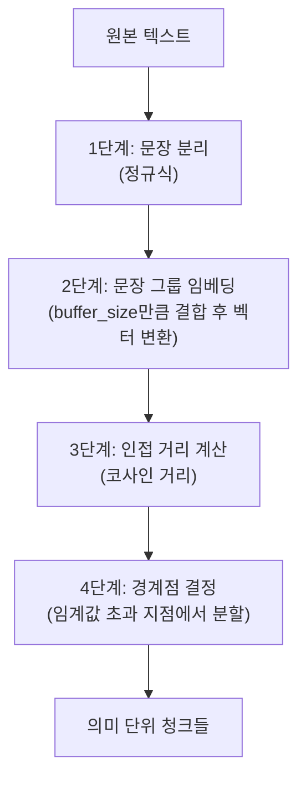
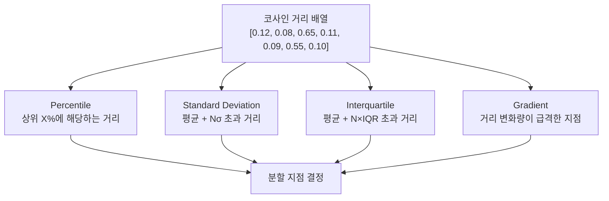

# 시멘틱 청킹 — 의미 기반 분할

> 임베딩 유사도로 텍스트의 "의미가 바뀌는 지점"을 자동으로 찾아 분할하는 AI 기반 청킹 전략

## 개요

이 섹션에서는 고정 크기나 문서 구조가 아닌, **텍스트의 의미적 유사도**를 기준으로 청크 경계를 결정하는 시멘틱 청킹(Semantic Chunking)을 학습합니다. 앞서 [4.1: 청킹의 중요성과 기본 원리](ch04/session_4_1.md)에서 배운 청킹의 세 가지 조건 — 의미적 완결성, 적절한 길이, 메타데이터 보존 — 중 **의미적 완결성**을 극대화하는 접근법이라 할 수 있습니다.

**선수 지식**:
- [4.1] 청크 크기(chunk_size)와 오버랩(chunk_overlap)의 트레이드오프
- [4.2] RecursiveCharacterTextSplitter의 계층적 분리자(separator_hierarchy) 동작 원리
- 임베딩(Embedding)과 코사인 유사도(Cosine Similarity)의 직관적 이해 (아래 '임베딩 미니 입문' 박스에서 설명)

**학습 목표**:
- 시멘틱 청킹의 원리를 이해하고, 고정 크기 청킹과의 차이를 설명할 수 있다
- LangChain의 `SemanticChunker`를 사용하여 텍스트를 의미 단위로 분할할 수 있다
- `breakpoint_threshold_type` 네 가지 전략의 동작 방식과 결과 차이를 비교할 수 있다
- 시멘틱 청킹의 장단점을 파악하고, 적합한 사용 시나리오를 판단할 수 있다

## 왜 알아야 할까?

[4.2: 고정 크기 청킹과 재귀적 청킹](ch04/session_4_2.md)에서 `RecursiveCharacterTextSplitter`를 사용해봤죠? 이 방법은 `\n\n`, `\n`, ` `, `""` 같은 **구문론적 단서**(문단 구분, 줄바꿈, 공백)를 기준으로 텍스트를 나눕니다. 대부분의 경우 잘 작동하지만, 근본적인 한계가 있어요.

같은 문단 안에서도 주제가 바뀔 수 있고, 반대로 여러 문단에 걸쳐 하나의 주제가 이어질 수도 있거든요. 예를 들어볼게요:

```
"트랜스포머는 2017년 구글이 발표한 아키텍처입니다. 셀프 어텐션 메커니즘을
통해 입력 시퀀스의 모든 위치를 동시에 참조합니다. 한편 최근 서울의 부동산
시장은 금리 인상의 영향으로 거래량이 크게 감소했습니다."
```

하나의 문단이지만, "트랜스포머 아키텍처"와 "부동산 시장"이라는 완전히 다른 주제가 섞여 있습니다. 고정 크기 청킹은 이 문단을 하나의 청크로 묶거나, 글자 수 기준으로 임의의 위치에서 자를 수밖에 없어요. 결과적으로 "트랜스포머"를 검색할 때 부동산 정보가 함께 딸려오고, 검색 품질이 떨어집니다.

시멘틱 청킹은 이 문제를 **임베딩 모델의 눈**으로 해결합니다. 각 문장을 벡터로 변환하고, 인접한 문장들 사이의 의미적 거리를 계산해서, **"여기서 주제가 바뀌었구나!"** 하는 지점을 자동으로 찾아 분할하는 거죠. Greg Kamradt가 제안한 **텍스트 분할의 5단계**(Five Levels of Text Splitting)에서 Level 4에 해당하는 고급 전략입니다.

## 핵심 개념

> 🎯 **이 세션의 학습 범위**
>
> 시멘틱 청킹은 내부적으로 **임베딩 모델**과 **코사인 유사도** 계산을 사용합니다. 하지만 이 세션에서는 임베딩을 **"텍스트를 넣으면 비교 가능한 숫자 벡터가 나오는 블랙박스"**로 취급합니다. `SemanticChunker`에 임베딩 모델 객체만 전달하면, 벡터 변환과 거리 계산을 라이브러리가 알아서 처리해주거든요. 임베딩이 어떻게 학습되는지, 벡터 공간이 어떤 구조를 가지는지, 코사인 유사도의 수학적 정의는 무엇인지는 [5장: 임베딩과 벡터 표현](ch05/session_5_1.md)과 [5.4: 유사도 측정](ch05/session_5_4.md)에서 깊이 배웁니다. 지금은 **"의미가 비슷한 문장은 가까운 벡터, 다른 문장은 먼 벡터"**라는 직관만으로 충분합니다.

> 📦 **임베딩 미니 입문 — 이 세션의 코드를 이해하기 위한 최소 배경지식**
>
> **임베딩(Embedding)**이란 텍스트를 숫자 벡터(예: `[0.12, -0.34, 0.56, ...]`)로 변환하는 기술입니다. 의미가 비슷한 문장은 비슷한 벡터로, 다른 문장은 먼 벡터로 변환되죠. 두 벡터가 얼마나 가까운지 측정하는 대표적 방법이 **코사인 유사도(Cosine Similarity)**인데, 1이면 "같은 방향(비슷한 의미)", 0이면 "무관"으로 직관적으로 해석할 수 있습니다. 시멘틱 청킹은 이 값의 반대인 **코사인 거리(1 - 유사도)**를 사용하여 "의미가 얼마나 달라졌는지"를 측정합니다. 코드에서는 `OpenAIEmbeddings()` 같은 임베딩 모델 객체를 생성해서 `SemanticChunker`에 전달하기만 하면 됩니다 — 벡터 변환과 거리 계산은 내부에서 자동으로 처리됩니다. 코사인 유사도의 수학적 정의와 임베딩 모델의 동작 원리는 [5.4: 유사도 측정](ch05/session_5_4.md)에서 정식으로 다룹니다.

### 개념 1: 시멘틱 청킹의 원리 — "대화 주제가 바뀌는 순간 감지하기"

> 💡 **비유**: 친구와 카페에서 2시간 동안 수다를 떨었다고 상상해보세요. 녹음 파일을 들으며 내용을 정리한다면 어떻게 나눌까요? "여기까지가 여행 이야기, 여기서부터 직장 이야기, 그 다음은 맛집 이야기..." 이렇게 **주제가 전환되는 순간**을 기준으로 나누겠죠? 시멘틱 청킹이 바로 이 방식입니다. 대화의 "흐름이 바뀌는 지점"을 임베딩 유사도로 감지합니다.

시멘틱 청킹은 다음 네 단계로 동작합니다:

**1단계: 문장 분리** — 텍스트를 개별 문장으로 분리합니다. 기본적으로 `(?<=[.?!])\s+` 정규식을 사용합니다.

**2단계: 문장 그룹 임베딩** — 각 문장을 전후 `buffer_size`개 문장과 합쳐서 하나의 "결합 문장"을 만들고, 이를 임베딩(숫자 벡터로 변환)합니다. 단독 문장보다 주변 맥락을 포함한 임베딩이 의미를 더 잘 포착하거든요.

**3단계: 인접 거리 계산** — 연속된 문장 임베딩 사이의 **코사인 거리**(1 - 코사인 유사도)를 계산합니다. 직관적으로 말하면, 거리가 크다 = 두 문장의 주제가 많이 다르다는 뜻이에요. (코사인 유사도가 정확히 무엇인지는 [5.4: 유사도 측정](ch05/session_5_4.md)에서 수학적으로 배우니, 지금은 "의미 차이를 0~1 사이 숫자로 표현한 것" 정도로 이해하면 됩니다.)

**4단계: 경계점 결정** — 계산된 거리들 중 임계값(threshold)을 넘는 지점에서 청크를 분리합니다.

이 과정을 시각적으로 표현하면:

> 📊 **그림 1**: 시멘틱 청킹의 경계점 감지 원리


문장3과 문장4 사이의 거리(0.65)가 다른 쌍들(0.08~0.12)보다 확연히 크죠? 이 지점이 "주제가 바뀌는 경계"이고, 여기서 청크를 분할합니다. 문장1~3이 한 청크, 문장4~5가 다른 청크가 되는 거예요.

> 📊 **그림 2**: 시멘틱 청킹의 4단계 처리 흐름



### 개념 2: SemanticChunker — LangChain의 시멘틱 청킹 구현

LangChain은 `langchain_experimental` 패키지에 `SemanticChunker`를 제공합니다. 먼저 설치부터 해볼게요:

```bash
pip install langchain-experimental langchain-openai
```

기본적인 사용법은 다음과 같습니다:

```python
from langchain_experimental.text_splitter import SemanticChunker
from langchain_openai.embeddings import OpenAIEmbeddings

# 임베딩 모델 초기화 (블랙박스로 사용 — 원리는 5장에서!)
embeddings = OpenAIEmbeddings(model="text-embedding-3-small")

# 시멘틱 청커 생성
semantic_chunker = SemanticChunker(
    embeddings=embeddings,
    breakpoint_threshold_type="percentile",  # 경계 판단 전략
    breakpoint_threshold_amount=95,          # 임계값 (95번째 백분위수)
    buffer_size=1,                            # 전후 문장 결합 수
    sentence_split_regex=r"(?<=[.?!。])\s+",  # 문장 분리 정규식
)

# 텍스트 분할
chunks = semantic_chunker.split_text(long_text)

# Document 객체로 분할 (메타데이터 포함)
documents = semantic_chunker.create_documents([long_text])
```

위 코드에서 `OpenAIEmbeddings`가 생소해도 괜찮습니다. 지금 단계에서 알아야 할 것은 딱 하나예요: **이 객체가 텍스트를 벡터로 변환해주는 도구**라는 것. `SemanticChunker`는 이 도구를 받아서 내부적으로 문장을 벡터로 바꾸고, 벡터 간 거리를 계산하고, 경계점을 찾는 모든 과정을 자동 처리합니다.

`SemanticChunker`의 주요 파라미터를 정리하면:

| 파라미터 | 타입 | 기본값 | 설명 |
|----------|------|--------|------|
| `embeddings` | `Embeddings` | **필수** | 문장 임베딩에 사용할 모델 |
| `buffer_size` | `int` | `1` | 각 문장 전후로 결합할 문장 수 |
| `breakpoint_threshold_type` | `str` | `"percentile"` | 경계점 결정 전략 |
| `breakpoint_threshold_amount` | `float` | 전략별 상이 | 임계값 크기 |
| `sentence_split_regex` | `str` | `r"(?<=[.?!])\s+"` | 문장 분리 정규식 |
| `min_chunk_size` | `int` | `None` | 최소 청크 글자 수 |
| `number_of_chunks` | `int` | `None` | 목표 청크 개수 |
| `add_start_index` | `bool` | `False` | 메타데이터에 시작 위치 포함 |

> 🔥 **실무 팁**: 한국어 텍스트에서는 `sentence_split_regex`를 `r"(?<=[.?!。\n])\s+"`처럼 마침표(。)와 줄바꿈(`\n`)을 추가하는 게 좋습니다. 기본 정규식은 영문 문장 부호만 인식하거든요.

### 개념 3: 네 가지 경계점 전략 — "어디서 자를지 결정하는 기준"

> 💡 **비유**: 학급 시험 점수가 [60, 65, 62, 95, 70, 68]이라면, 95점이 "이상치"라는 걸 어떻게 판별할까요? "상위 10%에 해당하면" (백분위수), "평균에서 2σ 넘으면" (표준편차), "사분위범위 × 1.5 넘으면" (IQR) 등 여러 통계적 방법이 있죠. SemanticChunker의 네 가지 전략도 정확히 이 아이디어입니다 — 문장 간 코사인 거리 배열에서 "비정상적으로 큰 거리"를 찾는 통계적 기준이 다를 뿐이에요.

**1. Percentile (백분위수)** — 기본값, 가장 널리 사용

```python
# 모든 인접 거리 중 95번째 백분위수를 넘는 지점에서 분할
chunker = SemanticChunker(
    embeddings,
    breakpoint_threshold_type="percentile",
    breakpoint_threshold_amount=95  # 기본값: 95
)
```

95번째 백분위수란, 전체 거리값 중 상위 5%에 해당하는 거리에서만 분할한다는 뜻입니다. 값을 낮추면(예: 70) 더 많은 지점에서 분할되어 청크가 작아지고, 높이면(예: 99) 극단적인 전환만 감지되어 청크가 커집니다.

**2. Standard Deviation (표준편차)**

```python
# 평균 + 3σ 를 넘는 거리에서 분할
chunker = SemanticChunker(
    embeddings,
    breakpoint_threshold_type="standard_deviation",
    breakpoint_threshold_amount=3  # 기본값: 3
)
```

거리 분포가 정규분포를 따른다고 가정하고, 평균에서 3표준편차 이상 벗어난 지점을 경계로 봅니다. 통계학의 3σ 규칙(99.7%)과 같은 원리예요.

**3. Interquartile (사분위범위)**

```python
# 평균 + 1.5×IQR 을 넘는 거리에서 분할
chunker = SemanticChunker(
    embeddings,
    breakpoint_threshold_type="interquartile",
    breakpoint_threshold_amount=1.5  # 기본값: 1.5
)
```

박스플롯에서 이상치를 탐지하는 방법과 동일합니다. 정규분포를 가정하지 않으므로, 거리 분포가 비대칭인 경우에 더 안정적이에요.

**4. Gradient (기울기)**

```python
# 거리 변화의 기울기가 급격한 지점에서 분할
chunker = SemanticChunker(
    embeddings,
    breakpoint_threshold_type="gradient",
    breakpoint_threshold_amount=95  # 기본값: 95
)
```

인접 거리의 **변화량**(기울기)을 계산해서, 변화량이 급격한 지점에서 분할합니다. "거리가 큰 곳"이 아니라 "거리가 갑자기 커지는 곳"을 찾는다는 점에서 다른 세 전략과 차별됩니다. `numpy.gradient()`를 사용하며, 최소 3개 이상의 문장이 필요합니다.

> 📊 **그림 3**: 네 가지 경계점 전략 비교



```run:python
# 네 가지 전략의 임계값 계산 원리 비교
import numpy as np

# 예시: 문장 간 코사인 거리 배열
distances = np.array([0.12, 0.08, 0.65, 0.11, 0.09, 0.55, 0.10, 0.07])

# 1. Percentile
threshold_pct = np.percentile(distances, 95)
print(f"[Percentile 95] 임계값: {threshold_pct:.3f}")

# 2. Standard Deviation
threshold_std = np.mean(distances) + 3 * np.std(distances)
print(f"[Std Dev ×3]    임계값: {threshold_std:.3f}")

# 3. Interquartile
q1, q3 = np.percentile(distances, [25, 75])
iqr = q3 - q1
threshold_iqr = np.mean(distances) + 1.5 * iqr
print(f"[IQR ×1.5]      임계값: {threshold_iqr:.3f}")

# 4. Gradient
gradient = np.gradient(distances)
threshold_grad = np.percentile(gradient, 95)
print(f"[Gradient 95]   임계값: {threshold_grad:.3f}")

# 각 전략별 분할 지점
print(f"\n분할 지점 (0-indexed):")
print(f"  Percentile:  {np.where(distances > threshold_pct)[0].tolist()}")
print(f"  Std Dev:     {np.where(distances > threshold_std)[0].tolist()}")
print(f"  IQR:         {np.where(distances > threshold_iqr)[0].tolist()}")
print(f"  Gradient:    {np.where(gradient > threshold_grad)[0].tolist()}")
```

```output
[Percentile 95] 임계값: 0.623
[Std Dev ×3]    임계값: 0.888
[IQR ×1.5]      임계값: 0.897
[Gradient 95]   임계값: 0.490

분할 지점 (0-indexed):
  Percentile:  [2]
  Std Dev:     []
  IQR:         []
  Gradient:    [2]
```

같은 거리 데이터에서도 전략에 따라 분할 지점이 다릅니다. Percentile과 Gradient는 인덱스 2(거리 0.65)에서 분할을 감지한 반면, Standard Deviation과 IQR은 임계값이 더 높아서 분할을 하지 않았어요. 이처럼 데이터 분포의 특성에 따라 적합한 전략이 달라집니다.

### 개념 4: buffer_size의 역할 — 맥락의 창

`buffer_size`는 각 문장을 임베딩할 때 **전후로 몇 개의 문장을 함께 결합할지** 결정합니다.

```
buffer_size=0: "문장3" 만 임베딩
buffer_size=1: "문장2 문장3 문장4" 를 합쳐서 임베딩
buffer_size=2: "문장1 문장2 문장3 문장4 문장5" 를 합쳐서 임베딩
```

> 💡 **비유**: 책의 한 문장만 보면 맥락을 파악하기 어렵지만, 앞뒤 문장까지 함께 읽으면 그 문장의 역할이 명확해지죠? buffer_size가 바로 이 "앞뒤 문맥의 폭"입니다.

`buffer_size=0`이면 개별 문장의 의미만 비교하고, 값이 커질수록 더 넓은 문맥을 고려합니다. 다만 너무 크면 인접 문장들의 임베딩이 비슷해져서 경계 감지가 둔해질 수 있어요. 실무에서는 기본값 `1`이 대부분의 경우 잘 작동합니다.

## 실습: 직접 해보기

시멘틱 청킹과 재귀적 청킹의 결과를 직접 비교해봅시다. OpenAI API 키가 필요합니다.

```python
import os
from dotenv import load_dotenv
from langchain_experimental.text_splitter import SemanticChunker
from langchain_text_splitters import RecursiveCharacterTextSplitter
from langchain_openai.embeddings import OpenAIEmbeddings

load_dotenv()

# 의도적으로 주제가 전환되는 텍스트 샘플
sample_text = """
트랜스포머(Transformer)는 2017년 구글 연구팀이 "Attention Is All You Need" 논문에서 
발표한 딥러닝 아키텍처입니다. 기존 RNN이나 LSTM과 달리 셀프 어텐션(Self-Attention) 
메커니즘을 사용하여 입력 시퀀스의 모든 위치를 동시에 참조할 수 있습니다. 이 병렬 처리 
능력 덕분에 학습 속도가 크게 향상되었고, BERT, GPT 등 대규모 언어 모델의 기반이 되었습니다.

RAG(Retrieval-Augmented Generation)는 검색과 생성을 결합한 기법입니다. LLM이 
응답을 생성하기 전에 외부 지식 소스에서 관련 정보를 검색하여 컨텍스트로 제공합니다. 
이를 통해 할루시네이션을 줄이고, 최신 정보를 반영한 답변을 생성할 수 있습니다. 
특히 기업의 내부 문서나 최신 데이터를 활용해야 하는 경우에 효과적입니다.

벡터 데이터베이스는 고차원 벡터를 효율적으로 저장하고 검색하는 특수한 데이터베이스입니다. 
ChromaDB, FAISS, Pinecone 등이 대표적이며, ANN(Approximate Nearest Neighbor) 
알고리즘을 통해 빠른 유사도 검색을 수행합니다. HNSW(Hierarchical Navigable Small 
World) 그래프가 가장 널리 사용되는 인덱스 구조입니다.

한편 최근 한국의 AI 스타트업 생태계는 빠르게 성장하고 있습니다. 정부의 적극적인 
지원 정책과 대기업의 투자 확대로 AI 분야의 인재 풀이 넓어지고 있으며, 특히 
자연어 처리와 컴퓨터 비전 분야에서 글로벌 경쟁력을 갖춘 기업들이 등장하고 있습니다.
"""

# === 1. 시멘틱 청킹 ===
# 임베딩 모델 생성 (내부적으로 텍스트→벡터 변환을 담당)
embeddings = OpenAIEmbeddings(model="text-embedding-3-small")
semantic_chunker = SemanticChunker(
    embeddings=embeddings,
    breakpoint_threshold_type="percentile",
    breakpoint_threshold_amount=80,  # 80번째 백분위수
)

semantic_chunks = semantic_chunker.split_text(sample_text)

print("=" * 60)
print(f"시멘틱 청킹 결과: {len(semantic_chunks)}개 청크")
print("=" * 60)
for i, chunk in enumerate(semantic_chunks):
    preview = chunk.strip()[:80].replace("\n", " ")
    print(f"\n[청크 {i+1}] ({len(chunk)}자)")
    print(f"  → {preview}...")

# === 2. 재귀적 청킹 (비교용) ===
recursive_splitter = RecursiveCharacterTextSplitter(
    chunk_size=300,
    chunk_overlap=50,
    separators=["\n\n", "\n", ". ", " ", ""]
)

recursive_chunks = recursive_splitter.split_text(sample_text)

print("\n" + "=" * 60)
print(f"재귀적 청킹 결과: {len(recursive_chunks)}개 청크")
print("=" * 60)
for i, chunk in enumerate(recursive_chunks):
    preview = chunk.strip()[:80].replace("\n", " ")
    print(f"\n[청크 {i+1}] ({len(chunk)}자)")
    print(f"  → {preview}...")
```

실행하면 차이가 분명히 드러납니다. 시멘틱 청킹은 "트랜스포머", "RAG", "벡터 데이터베이스", "AI 스타트업"이라는 네 주제를 자연스럽게 분리하는 반면, 재귀적 청킹은 300자 기준으로 기계적으로 자르면서 주제 중간에서 잘릴 수 있습니다.

이번에는 네 가지 경계점 전략을 모두 비교하는 실험을 해봅시다:

```python
# 네 가지 전략 비교 실험
strategies = [
    ("percentile", 80),
    ("standard_deviation", 2),
    ("interquartile", 1.5),
    ("gradient", 80),
]

print("전략별 청크 개수 비교")
print("-" * 50)

for threshold_type, threshold_amount in strategies:
    chunker = SemanticChunker(
        embeddings=embeddings,
        breakpoint_threshold_type=threshold_type,
        breakpoint_threshold_amount=threshold_amount,
    )
    chunks = chunker.split_text(sample_text)
    avg_len = sum(len(c) for c in chunks) / len(chunks)
    print(f"  {threshold_type:20s} (임계값={threshold_amount}): "
          f"{len(chunks)}개 청크, 평균 {avg_len:.0f}자")
```

> 🔥 **실무 팁**: 최적의 전략과 임계값은 문서의 특성에 따라 다릅니다. 기술 문서처럼 주제가 명확히 구분되는 텍스트에서는 `percentile` 80~90이 잘 작동하고, 소설처럼 주제가 서서히 전환되는 텍스트에서는 `gradient`가 더 자연스러운 경계를 찾아내는 경향이 있어요. 반드시 실험으로 확인하세요.

다음은 시멘틱 청킹 결과를 벡터 스토어에 넣고 검색 품질을 비교하는 전체 파이프라인입니다:

```python
from langchain_community.vectorstores import FAISS
from langchain_core.documents import Document

# 시멘틱 청크 → Document 객체 변환
semantic_docs = semantic_chunker.create_documents([sample_text])

# 재귀적 청크 → Document 객체 변환
recursive_docs = [Document(page_content=chunk) for chunk in recursive_chunks]

# 각각 벡터 스토어 구축 (벡터 스토어는 6장에서 자세히 다룹니다)
semantic_store = FAISS.from_documents(semantic_docs, embeddings)
recursive_store = FAISS.from_documents(recursive_docs, embeddings)

# 검색 테스트
query = "RAG는 어떻게 할루시네이션을 줄이나요?"

print(f"쿼리: {query}\n")

print("--- 시멘틱 청킹 검색 결과 (top-1) ---")
sem_results = semantic_store.similarity_search(query, k=1)
for doc in sem_results:
    print(doc.page_content[:200].strip())

print("\n--- 재귀적 청킹 검색 결과 (top-1) ---")
rec_results = recursive_store.similarity_search(query, k=1)
for doc in rec_results:
    print(doc.page_content[:200].strip())
```

시멘틱 청킹으로 분할한 벡터 스토어는 RAG 관련 청크만 깔끔하게 반환할 가능성이 높지만, 재귀적 청킹은 300자 제한 때문에 RAG 설명이 잘려서 불완전한 컨텍스트를 반환할 수 있습니다.

## 더 깊이 알아보기

### Greg Kamradt와 "텍스트 분할의 5단계"

시멘틱 청킹이라는 개념을 RAG 커뮤니티에 대중화한 사람은 **Greg Kamradt**입니다. 그는 2023년 말에 "5 Levels Of Text Splitting"이라는 프레임워크를 제안했는데요:

| 레벨 | 전략 | 핵심 아이디어 |
|------|------|---------------|
| 1 | Character Split | 고정 글자 수로 자르기 |
| 2 | Recursive Character | 계층적 분리자로 자르기 |
| 3 | Document-specific | 문서 구조(Markdown, HTML, 코드)로 자르기 |
| **4** | **Semantic Chunking** | **임베딩 유사도로 의미 경계 감지** |
| 5 | Agentic/Reasoned | LLM이 직접 판단하여 자르기 |

우리 과정이 4.1~4.3에서 Level 1~3을 거쳐 이번 세션에서 Level 4에 도달한 셈이에요! Kamradt는 이 프레임워크를 제시하면서 "청킹 전략을 세울 때는 전체 검색 파이프라인을 함께 고려해야 한다"고 강조했습니다. 청킹은 독립된 작업이 아니라, 임베딩 모델, 벡터 DB, 검색 알고리즘과 함께 최적화되어야 한다는 통찰이죠.

### 시멘틱 청킹은 정말 비용 대비 효과적인가?

흥미로운 점은, 시멘틱 청킹의 효과에 대한 학계의 평가가 엇갈린다는 사실입니다. 2024년 10월, Vectara의 Renyi Qu 등이 발표한 논문 **"Is Semantic Chunking Worth the Computational Cost?"**(arXiv:2410.13070)에서는 문서 검색, 증거 검색, 답변 생성이라는 세 가지 태스크에서 시멘틱 청킹을 고정 크기 청킹과 비교했습니다. 놀랍게도, 고정 200단어 청킹이 시멘틱 청킹과 비슷하거나 오히려 나은 성능을 보이는 경우가 있었고, 논문은 "시멘틱 청킹의 계산 비용이 일관된 성능 향상으로 정당화되지 않는다"고 결론 내렸습니다.

반면, 2025년 임상 의사결정 지원 시스템 연구(MDPI Bioengineering)에서는 의미 경계를 인식하는 적응적 청킹이 87% 정확도를 달성해 고정 크기 방식(13%)을 압도적으로 앞섰다는 결과도 있습니다.

결론적으로, 시멘틱 청킹은 **"은탄환"이 아닙니다**. 문서의 특성, 검색 태스크의 종류, 그리고 비용 제약에 따라 효과가 크게 달라집니다. 이 뉘앙스를 이해하는 것이 실무에서 올바른 선택을 하는 열쇠예요.

## 흔한 오해와 팁

> ⚠️ **흔한 오해**: "시멘틱 청킹은 항상 고정 크기 청킹보다 우월하다"
> 그렇지 않습니다. 위에서 살펴본 것처럼, 일반적인 문서 검색 태스크에서는 잘 튜닝된 RecursiveCharacterTextSplitter가 시멘틱 청킹과 비슷한 성능을 내면서도 훨씬 빠르고 저렴합니다. 시멘틱 청킹이 빛나는 곳은 **주제 전환이 명확하지만 구조적 단서(문단 구분 등)가 부족한 텍스트**, 예를 들어 회의록, 인터뷰 녹취록, 긴 대화 로그 같은 비정형 텍스트입니다.

> 💡 **알고 계셨나요?**: 시멘틱 청킹은 문장마다 임베딩을 생성해야 합니다. 1만 단어 문서라면 약 200~300개의 임베딩 API 호출이 필요하죠. OpenAI의 `text-embedding-3-small` 기준으로 비용은 미미하지만, **지연 시간(latency)**은 무시할 수 없습니다. 대량 문서를 처리할 때는 로컬 임베딩 모델(예: `sentence-transformers`)을 사용하거나, 시멘틱 청킹 대신 [4.2](ch04/session_4_2.md)의 재귀적 청킹으로 먼저 시도해보는 것이 현명합니다.

> 🔥 **실무 팁**: `breakpoint_threshold_amount`를 조절할 때 "청크 개수"를 먼저 확인하세요. 너무 많은 청크(문장 1~2개짜리)가 나오면 임계값을 올리고, 청크가 너무 크면 내리세요. 또는 `number_of_chunks` 파라미터로 원하는 청크 개수를 직접 지정할 수도 있습니다 — SemanticChunker가 임계값을 자동으로 보간(interpolation)하여 목표 개수에 맞춰줍니다.

> 🔥 **실무 팁**: 시멘틱 청킹 후에도 `min_chunk_size`를 설정해서 너무 짧은 청크가 생기는 것을 방지하세요. 문장 하나짜리 청크는 임베딩 품질이 떨어지고 검색 시 노이즈가 됩니다. `min_chunk_size=100` 정도면 대부분의 한국어 텍스트에서 합리적입니다.

## 핵심 정리

| 개념 | 설명 |
|------|------|
| 시멘틱 청킹 | 인접 문장 간 임베딩 코사인 거리를 계산하여, 의미적 전환이 감지되는 지점에서 분할하는 전략 |
| SemanticChunker | `langchain_experimental`의 시멘틱 청킹 구현. 임베딩 모델과 경계점 전략을 파라미터로 받음 |
| breakpoint_threshold_type | 경계점 판단 전략: `percentile`, `standard_deviation`, `interquartile`, `gradient` |
| buffer_size | 각 문장 임베딩 시 결합할 전후 문장 수. 값이 클수록 넓은 문맥을 반영하지만 경계 감지가 둔해질 수 있음 |
| Percentile | 거리 배열의 X번째 백분위수 초과 시 분할. 가장 직관적이고 널리 사용 (기본값 95) |
| Gradient | 거리 변화량의 기울기를 기준으로 분할. 갑작스러운 전환에 민감 |
| 비용 트레이드오프 | 문장마다 임베딩 생성 필요 → 고정 크기 대비 처리 시간과 비용 증가. 효과는 문서 특성에 따라 다름 |
| Five Levels of Splitting | Greg Kamradt의 프레임워크. 시멘틱 청킹은 Level 4에 해당하며, Level 5는 LLM 기반 에이전틱 청킹 |
| 임베딩 (블랙박스) | 텍스트를 비교 가능한 숫자 벡터로 변환하는 기술. 원리는 [5장](ch05/session_5_1.md)에서 학습 |

## 다음 섹션 미리보기

이번 섹션에서 시멘틱 청킹의 원리와 LangChain 구현까지 살펴봤습니다. 하지만 실전에서는 단일 청킹 전략만으로 모든 문서를 처리하기 어렵죠. 다음 [4.5: 청킹 전략 선택 가이드와 최적화](ch04/session_4_5.md)에서는 **문서 유형별 최적 청킹 전략 매트릭스**, **RAPTOR와 부모-자식 청킹** 같은 계층적 인덱싱 기법, 그리고 청크 크기를 **실험적으로 최적화하는 평가 프레임워크**를 구축합니다. 지금까지 배운 4가지 청킹 전략(고정 크기, 재귀적, 구조 인식, 시멘틱)을 종합하여 상황에 맞는 전략을 선택하는 실무 역량을 완성합니다.

## 참고 자료

- [SemanticChunker API 문서 — LangChain Experimental](https://python.langchain.com/api_reference/experimental/text_splitter/langchain_experimental.text_splitter.SemanticChunker.html) - SemanticChunker의 전체 파라미터와 메서드 레퍼런스
- [Is Semantic Chunking Worth the Computational Cost? (arXiv:2410.13070)](https://arxiv.org/abs/2410.13070) - 시멘틱 청킹 vs 고정 크기 청킹의 체계적 비교 연구. 비용 대비 효과에 대한 냉정한 분석
- [5 Levels of Text Splitting — Greg Kamradt 원본 노트북](https://github.com/FullStackRetrieval-com/RetrievalTutorials/blob/main/tutorials/LevelsOfTextSplitting/5_Levels_Of_Text_Splitting.ipynb) - 시멘틱 청킹 개념의 원류. 5단계 프레임워크와 Python 구현 코드
- [Retrieval-Augmented Generation for Large Language Models: A Survey (arXiv:2312.10997)](https://arxiv.org/abs/2312.10997) - RAG 전반의 서베이 논문. 청킹 전략이 검색 품질에 미치는 영향을 체계적으로 분석
- [Semantic Chunking — NirDiamant/RAG_Techniques](https://github.com/NirDiamant/RAG_Techniques/blob/main/all_rag_techniques/semantic_chunking.ipynb) - 시멘틱 청킹의 실전 구현 예제와 FAISS 벡터 스토어 연동 코드
- [Semantic Chunking | VectorHub by Superlinked](https://superlinked.com/vectorhub/articles/semantic-chunking) - 시멘틱 청킹의 원리, 임계값 전략, 실무 적용 가이드를 정리한 튜토리얼

---
### 🔗 Related Sessions
- [embedding](../05-임베딩-모델-이해-텍스트를-벡터로-변환/01-임베딩의-기본-개념-단어에서-문장까지.md) (prerequisite)
- [chunking](../04-텍스트-청킹-전략-문서-분할과-최적화/01-청킹의-중요성과-기본-원리.md) (prerequisite)
- [chunk_size](../04-텍스트-청킹-전략-문서-분할과-최적화/01-청킹의-중요성과-기본-원리.md) (prerequisite)
- [chunk_overlap](../04-텍스트-청킹-전략-문서-분할과-최적화/01-청킹의-중요성과-기본-원리.md) (prerequisite)
- [recursivecharactertextsplitter](../04-텍스트-청킹-전략-문서-분할과-최적화/02-고정-크기-청킹과-재귀적-청킹.md) (prerequisite)
- [separator_hierarchy](../04-텍스트-청킹-전략-문서-분할과-최적화/02-고정-크기-청킹과-재귀적-청킹.md) (prerequisite)
