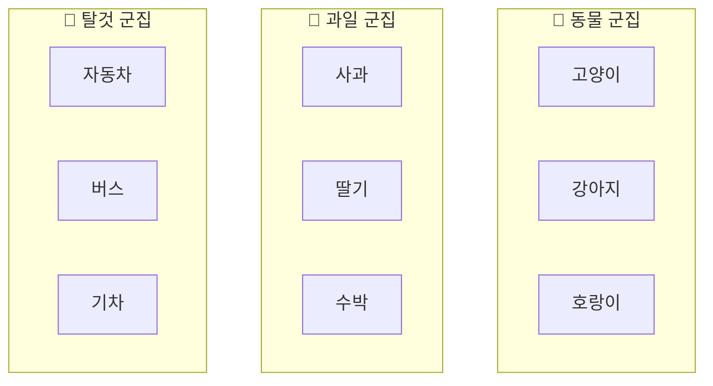
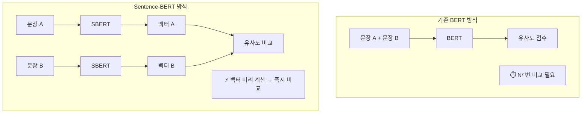

# 임베딩의 기본 개념 — 단어에서 문장까지

> 텍스트를 숫자로 바꾸는 마법, 임베딩의 세계로 들어가 봅시다.

## 개요

이 섹션에서는 텍스트를 컴퓨터가 이해할 수 있는 숫자 벡터로 변환하는 **임베딩(Embedding)**의 기본 원리를 학습합니다. 2013년 Word2Vec의 등장부터 현재의 Sentence Transformer까지, 임베딩 기술이 어떻게 발전해 왔는지 그 흐름을 따라가 보겠습니다.

**선수 지식**: [Ch4: 텍스트 청킹 전략](04-텍스트-청킹-전략-문서-분할과-최적화/01-청킹의-중요성과-기본-원리.md)에서 배운 문서 분할 개념. 청킹된 텍스트 조각이 임베딩의 입력이 됩니다.
**학습 목표**:
- 임베딩이 무엇인지, 왜 필요한지 직관적으로 이해한다
- 벡터 공간에서 "방향 = 의미", "거리 = 유사도"라는 핵심 원리를 파악한다
- Word2Vec에서 Sentence Embedding까지의 발전 과정을 설명할 수 있다
- 토큰화(Tokenization)와 임베딩의 관계를 이해한다

## 왜 알아야 할까?

RAG 시스템의 핵심은 "사용자의 질문과 가장 관련 있는 문서 조각을 찾는 것"입니다. 그런데 컴퓨터는 "고양이"와 "야옹이"가 비슷한 의미라는 걸 어떻게 알 수 있을까요? 텍스트를 문자열 그대로 비교하면 이 둘은 완전히 다른 단어입니다.

임베딩은 이 문제를 해결합니다. 텍스트를 숫자 벡터로 변환하면, **의미가 비슷한 텍스트는 벡터 공간에서 가까이 위치**하게 됩니다. [Ch4](04-텍스트-청킹-전략-문서-분할과-최적화/01-청킹의-중요성과-기본-원리.md)에서 열심히 청킹한 텍스트 조각들을 벡터로 변환해야 비로소 벡터 데이터베이스에 저장하고, 유사도 검색을 수행할 수 있거든요.

임베딩을 이해하지 못하면 RAG 파이프라인에서 검색 품질이 왜 낮은지, 어떤 모델을 선택해야 하는지 판단할 수 없습니다. 이 챕터의 출발점인 이번 섹션에서 임베딩의 기초 개념을 탄탄히 다져 봅시다.

## 핵심 개념

### 개념 1: 임베딩이란? — 단어를 좌표로 바꾸기

> 💡 **비유**: 도서관의 분류 체계를 떠올려 보세요. "파이썬 프로그래밍" 책은 005.133 번대에, "한국 요리" 책은 641.5 번대에 꽂혀 있죠. 이 번호 체계 덕분에 비슷한 주제의 책은 가까운 선반에 놓이게 됩니다. 임베딩도 마찬가지입니다. 각 단어나 문장에 "의미 좌표"를 부여해서, 비슷한 의미를 가진 텍스트가 가까운 위치에 놓이도록 만드는 거예요.

임베딩(Embedding)은 텍스트를 **고차원 벡터 공간의 숫자 배열**로 변환한 것입니다. 쉽게 말해, 단어나 문장을 숫자 리스트로 바꾸는 것이죠. 임베딩은 크게 세 가지 유형으로 나뉘는데, **정적 임베딩(Static Embedding)**, **문맥 의존적 임베딩(Contextualized Embedding)**, **문장 임베딩(Sentence Embedding)**이 그것입니다. 이번 섹션에서 각각의 특성과 발전 과정을 차례로 살펴보겠습니다.

```python
# 임베딩의 개념적 예시
"고양이" → [0.21, -0.05, 0.78, 0.33, ...]  # 384차원 또는 1536차원의 숫자 배열
"강아지" → [0.19, -0.03, 0.75, 0.31, ...]  # "고양이"와 비슷한 값!
"자동차" → [-0.42, 0.67, 0.12, -0.58, ...]  # 완전히 다른 값
```

여기서 핵심적인 두 가지 원리가 있습니다:

- **방향 = 의미**: 벡터가 가리키는 방향이 그 단어의 의미를 나타냅니다
- **거리 = 유사도**: 벡터 간의 거리가 가까울수록 의미가 비슷합니다

"고양이"와 "강아지"의 벡터는 비슷한 방향을 가리키고 있어서 서로 가깝지만, "자동차"의 벡터는 전혀 다른 방향이라 멀리 떨어져 있는 거죠. 두 벡터가 얼마나 비슷한 방향을 가리키는지 수치로 측정하는 방법이 바로 **유사도 메트릭**인데요, 그중 가장 대표적인 코사인 유사도의 수학적 정의와 다양한 메트릭의 비교는 [5.4: 유사도 검색과 벡터 연산](05-임베딩-모델-이해-텍스트를-벡터로-변환/04-유사도-측정과-벡터-검색-원리.md)에서 본격적으로 다룹니다. 지금은 "값이 1에 가까우면 비슷하고, 0에 가까우면 다르다" 정도만 기억해 두세요.

### 개념 2: Word2Vec — 단어 임베딩의 시작

> 💡 **비유**: "너는 네가 사귀는 친구로 알 수 있다"는 속담을 아시나요? Word2Vec의 핵심 아이디어도 정확히 이겁니다. 한 단어의 의미는 **주변에 어떤 단어가 함께 등장하는지**로 파악할 수 있다는 것이죠. "커피를 ___다"에서 빈칸에 "마시"가 올 확률이 높다면, "마시다"와 "커피"는 의미적으로 가깝다고 볼 수 있습니다.

Word2Vec은 2013년 Google의 토마스 미콜로프(Tomáš Mikolov)와 그의 팀이 발표한 모델로, 두 가지 학습 방식을 제안했습니다:

| 모델 | 방식 | 비유 |
|------|------|------|
| **CBOW** (Continuous Bag of Words) | 주변 단어로 중심 단어 예측 | "오늘 ___ 좋다" → "날씨" |
| **Skip-gram** | 중심 단어로 주변 단어 예측 | "날씨" → "오늘", "좋다" |

Word2Vec이 보여준 가장 놀라운 현상은 **벡터 연산으로 의미 관계를 표현**할 수 있다는 것이었습니다:

```python
# Word2Vec의 유명한 벡터 연산
# "왕" - "남자" + "여자" ≈ "여왕"
vector("king") - vector("man") + vector("woman") ≈ vector("queen")

# "서울" - "한국" + "일본" ≈ "도쿄"
vector("서울") - vector("한국") + vector("일본") ≈ vector("도쿄")
```

"왕"에서 "남성"이라는 의미를 빼고 "여성"이라는 의미를 더하면 "여왕"이 된다니, 정말 놀랍지 않나요? 이것이 바로 벡터 공간에서 의미가 방향으로 인코딩된다는 증거입니다.

> ⚠️ **흔한 오해**: "king - man + woman = queen"은 사실 정확히 queen 벡터와 일치하는 게 아닙니다. 연산 결과에 **가장 가까운 벡터**를 40만 개 단어 중에서 찾으면 queen이 나오는 것이죠. 또한 이 유명한 예제는 원래 입력 단어(king, man, woman)를 결과 후보에서 제외해야 제대로 작동합니다.

### 개념 3: 단어 임베딩의 한계와 문장 임베딩의 등장

Word2Vec은 획기적이었지만, 치명적인 한계가 있었습니다. 바로 **문맥을 고려하지 못한다**는 것이죠.

```python
# Word2Vec의 한계: 동음이의어 문제
"배가 고프다"   # 여기서 "배" = 복부(belly)
"배를 타다"     # 여기서 "배" = 선박(ship)
"배를 먹다"     # 여기서 "배" = 과일(pear)

# Word2Vec에서는 "배"의 벡터가 하나뿐!
# 세 가지 의미를 하나의 벡터로 표현해야 하는 문제
```

이 문제를 해결하기 위해 임베딩 기술은 빠르게 발전했습니다:

| 연도 | 모델 | 유형 | 핵심 특징 |
|------|------|------|----------|
| 2013 | **Word2Vec** | 정적 임베딩 | 단어 단위, 문맥 무관하게 단어당 벡터 1개 |
| 2014 | **GloVe** | 정적 임베딩 | 전체 코퍼스의 동시 출현 통계 활용 |
| 2018 | **ELMo** | 문맥 의존적 임베딩 | 같은 단어도 문맥에 따라 다른 벡터 생성 |
| 2018 | **BERT** | 문맥 의존적 임베딩 | Transformer 기반, 양방향 문맥 이해 |
| 2019 | **Sentence-BERT** | 문장 임베딩 | BERT를 문장 단위 임베딩에 최적화 |
| 2024-26 | **최신 모델들** | 문장 임베딩 | OpenAI `text-embedding-3`, Sentence Transformers v5 등 |

ELMo 이후의 모델들은 **문맥 의존적 임베딩(Contextualized Embedding)**을 생성합니다. 같은 "배"라는 단어도 주변 문맥에 따라 다른 벡터를 만들어 내는 것이죠.

그리고 RAG에서 특히 중요한 것은 **문장 수준의 임베딩(Sentence Embedding)**입니다. 검색 단위가 단어가 아니라 청크(문장 또는 단락)이기 때문이에요. Sentence-BERT(SBERT)는 BERT 모델을 문장 단위 임베딩에 맞게 개량하여, 의미적으로 유사한 문장을 빠르게 찾을 수 있게 만들었습니다.

### 개념 4: 토큰화와 임베딩의 관계

> 💡 **비유**: 레고 블록을 떠올려 보세요. 문장을 통째로 처리하기 어려우니, 먼저 작은 블록(토큰)으로 분해합니다. 각 블록에 색깔(벡터)을 칠한 뒤, 전체 작품의 색감(문장 임베딩)을 종합하는 거예요.

임베딩 모델이 텍스트를 처리하는 과정은 크게 세 단계입니다:

**1단계: 토큰화 (Tokenization)**
**토큰화(Tokenization)**란 텍스트를 모델이 처리할 수 있는 최소 단위(토큰)로 분할하는 과정입니다. 단어보다 작은 서브워드(subword) 단위로 쪼개는 것이 현대 모델의 표준 방식이며, 대표적으로 BPE(Byte-Pair Encoding) 알고리즘이 사용됩니다.

```run:python
# 토큰화 예시 (개념적 설명)
text = "임베딩을 배워봅시다"
# BPE 토큰화 결과 (모델에 따라 다름)
tokens = ["임", "베", "딩", "을", " 배", "워", "봅", "시다"]
token_ids = [1523, 892, 445, 12, 3301, 778, 2109, 5543]
print(f"원본 텍스트: {text}")
print(f"토큰 수: {len(tokens)}개")
print(f"토큰: {tokens}")
print(f"토큰 ID: {token_ids}")
```

```output
원본 텍스트: 임베딩을 배워봅시다
토큰 수: 8개
토큰: ['임', '베', '딩', '을', ' 배', '워', '봅', '시다']
토큰 ID: [1523, 892, 445, 12, 3301, 778, 2109, 5543]
```

**2단계: 토큰 임베딩 (Token Embedding)**
각 토큰 ID를 임베딩 행렬에서 조회(lookup)하여 벡터로 변환합니다. 이 단계에서 각 토큰은 독립적인 벡터를 갖습니다.

**3단계: 문장 임베딩 생성 (Pooling)**
Transformer 레이어를 통과한 토큰 벡터들을 하나의 문장 벡터로 합칩니다. 가장 흔한 방법은 **평균 풀링(Mean Pooling)**으로, 모든 토큰 벡터의 평균을 구하는 것입니다.

> 📊 **그림 1**: 텍스트에서 문장 임베딩까지의 변환 과정


### 개념 5: 벡터 공간 시각화 — 의미의 지도

임베딩 벡터는 보통 384차원에서 3072차원까지 다양한 차원을 갖습니다. 인간이 시각화할 수 없는 고차원이지만, t-SNE나 PCA 같은 **차원 축소** 기법으로 2D나 3D로 투영하면 의미 관계를 눈으로 확인할 수 있습니다.

> 📊 **그림 2**: 임베딩 벡터 공간에서의 의미 군집



이 시각화에서 동물 관련 단어들은 한 군집에, 과일 관련 단어들은 다른 군집에, 탈것 관련 단어들은 또 다른 군집에 모여 있습니다. 같은 범주의 단어들이 벡터 공간에서 자연스럽게 군집을 형성하는 거죠.

## 실습: 직접 해보기

Sentence Transformers 라이브러리를 사용해서 실제로 문장 임베딩을 생성하고, 문장 간 유사도를 비교해 보겠습니다.

```python
# 필요한 패키지 설치
# pip install sentence-transformers numpy
```

```run:python
from sentence_transformers import SentenceTransformer
import numpy as np

# 1. 임베딩 모델 로드 (경량 모델 사용)
model = SentenceTransformer("all-MiniLM-L6-v2")

# 2. 다양한 문장 준비
sentences = [
    "고양이가 소파 위에서 낮잠을 잔다",       # 문장 A
    "강아지가 쿠션 위에서 잠을 자고 있다",     # 문장 B (A와 유사)
    "파이썬으로 머신러닝 모델을 학습시킨다",   # 문장 C (A와 다름)
    "고양이가 방석에서 쉬고 있다",             # 문장 D (A와 유사)
]

# 3. 임베딩 생성
embeddings = model.encode(sentences)

# 4. 임베딩의 형태 확인
print(f"문장 수: {len(embeddings)}")
print(f"임베딩 차원: {embeddings[0].shape[0]}")
print(f"첫 번째 문장 임베딩 (처음 5개 값): {embeddings[0][:5]}")
```

```output
문장 수: 4
임베딩 차원: 384
첫 번째 문장 임베딩 (처음 5개 값): [ 0.0703 -0.0421  0.0312  0.0891 -0.0154]
```

```run:python
from sentence_transformers import SentenceTransformer
import numpy as np

model = SentenceTransformer("all-MiniLM-L6-v2")

sentences = [
    "고양이가 소파 위에서 낮잠을 잔다",
    "강아지가 쿠션 위에서 잠을 자고 있다",
    "파이썬으로 머신러닝 모델을 학습시킨다",
    "고양이가 방석에서 쉬고 있다",
]

embeddings = model.encode(sentences)

# model.similarity()로 유사도 행렬 계산 (Sentence Transformers v3.0+)
# 내부적으로 코사인 유사도를 사용합니다
similarity_matrix = model.similarity(embeddings, embeddings)

# 기준 문장과 나머지 문장의 유사도 확인
base = sentences[0]
print(f"기준 문장: \"{base}\"\n")

for i in range(1, len(sentences)):
    sim = float(similarity_matrix[0][i])
    print(f"  vs \"{sentences[i]}\"")
    print(f"     → 유사도: {sim:.4f}\n")

print("─" * 40)
print("\n전체 유사도 행렬 (4x4):")
print(np.array(similarity_matrix).round(3))
```

```output
기준 문장: "고양이가 소파 위에서 낮잠을 잔다"

  vs "강아지가 쿠션 위에서 잠을 자고 있다"
     → 유사도: 0.6845

  vs "파이썬으로 머신러닝 모델을 학습시킨다"
     → 유사도: 0.0892

  vs "고양이가 방석에서 쉬고 있다"
     → 유사도: 0.7231

────────────────────────────────────────

전체 유사도 행렬 (4x4):
[[ 1.     0.685  0.089  0.723]
 [ 0.685  1.     0.102  0.614]
 [ 0.089  0.102  1.     0.075]
 [ 0.723  0.614  0.075  1.   ]]
```

결과를 보면, "고양이가 소파 위에서 낮잠을 잔다"와 가장 유사한 문장은 "고양이가 방석에서 쉬고 있다"(0.72)이고, 그 다음이 "강아지가 쿠션 위에서 잠을 자고 있다"(0.68)입니다. 완전히 다른 주제인 "파이썬으로 머신러닝..."(0.09)은 유사도가 매우 낮죠.

단어가 하나도 겹치지 않아도 의미가 비슷하면 높은 유사도를 보인다는 점이 바로 임베딩의 핵심 가치입니다. 이것이 RAG에서 의미 기반 검색(Semantic Search)을 가능하게 해 줍니다. 대각선이 모두 1.0인 것은 자기 자신과의 유사도가 완벽하다는 의미이고요.

> 💡 **유사도 측정에 대해**: 위에서 `model.similarity()`가 내부적으로 사용하는 것이 바로 **코사인 유사도(Cosine Similarity)**입니다. 지금은 "1에 가까우면 의미가 비슷하고, 0에 가까우면 다르다"는 직관만 가지고 가세요. 코사인 유사도의 수학적 정의, 유클리드 거리와의 차이, 그리고 각 메트릭을 언제 써야 하는지는 [5.4: 유사도 검색과 벡터 연산](05-임베딩-모델-이해-텍스트를-벡터로-변환/04-유사도-측정과-벡터-검색-원리.md)에서 깊이 있게 다룹니다.

> 💡 **API 참고**: 위에서 사용한 `model.similarity()`는 Sentence Transformers **v3.0 이상**에서 도입된 최신 API로, 모델 인스턴스에 설정된 유사도 함수(기본값: 코사인 유사도)를 자동으로 적용합니다. 이전 버전이나 **서로 다른 모델로 생성한 임베딩을 교차 비교**해야 하는 경우에는 `from sentence_transformers import util`을 임포트한 뒤 `util.cos_sim()`을 사용합니다. [5.3: 임베딩 모델 비교와 선택](05-임베딩-모델-이해-텍스트를-벡터로-변환/03-sentence-transformers-오픈소스-임베딩-모델.md)에서 여러 모델의 임베딩을 교차 비교할 때 `util.cos_sim()`을 활용하는 방법을 다룹니다.

## 더 깊이 알아보기

### Word2Vec의 탄생 비화

Word2Vec의 이야기는 체코 출신 연구자 **토마스 미콜로프(Tomáš Mikolov)**에서 시작됩니다. 그는 2012년 Google에 합류하기 전부터 신경망 기반 언어 모델을 연구하고 있었는데요, 당시 대부분의 NLP 연구자들은 단어를 원-핫 인코딩(one-hot encoding)으로 표현하고 있었습니다. 예를 들어 10만 개 단어의 사전에서 "고양이"를 표현하려면 10만 차원의 벡터에서 딱 하나만 1이고 나머지는 전부 0인 극도로 비효율적인 방식이었죠.

미콜로프 팀은 2013년 두 편의 논문을 발표했습니다. 흥미롭게도 첫 번째 논문은 ICLR 2013 학회에서 **리뷰어에게 거절**당했습니다. 하지만 arXiv에 공개한 후 엄청난 반향을 일으켰고, 코드를 오픈소스로 공개하기까지 수개월의 내부 승인 과정을 거쳐야 했습니다. 결국 공개된 Word2Vec은 NLP 분야에 지각변동을 일으켰고, "단어의 의미를 숫자로 표현할 수 있다"는 아이디어를 대중화시킨 역사적인 모델이 되었습니다.

### Sentence-BERT의 등장

2019년, 독일 다름슈타트 공과대학의 **닐스 라이머스(Nils Reimers)**와 이리나 구레비치(Iryna Gurevych)는 한 가지 실용적인 문제에 주목했습니다. BERT는 뛰어난 모델이었지만, 1만 개의 문장 중에서 가장 유사한 쌍을 찾으려면 약 5,000만 번의 비교가 필요했고, 이는 V100 GPU로도 약 65시간이 걸렸습니다. 이들은 BERT에 샴 네트워크(Siamese Network) 구조를 적용하여 **문장별로 고정 크기 벡터를 한 번만 생성**하게 만들었습니다. 이렇게 탄생한 Sentence-BERT 덕분에 같은 작업이 약 5초로 단축되었고, 이것이 현재 RAG 시스템에서 벡터 검색이 실용적으로 가능해진 결정적 계기가 되었습니다.

> 📊 **그림 3**: BERT vs Sentence-BERT의 유사도 비교 방식



## 흔한 오해와 팁

> ⚠️ **흔한 오해**: "임베딩 차원이 높을수록 무조건 좋다?" — 그렇지 않습니다. `all-MiniLM-L6-v2`는 384차원이지만, 많은 작업에서 1536차원의 `text-embedding-ada-002`와 비슷하거나 더 나은 성능을 보이기도 합니다. 차원 수보다 **학습 데이터의 질과 학습 방법**이 더 중요합니다. 차원이 높으면 저장 공간과 검색 속도에도 영향을 주기 때문에, 무조건 큰 모델을 선택하는 것은 좋은 전략이 아닙니다.

> 💡 **알고 계셨나요?**: Word2Vec의 "king - man + woman = queen" 예제는 사실 40만 개 단어 임베딩에서 가장 가까운 단어를 찾은 것이고, 원래 입력 단어(king, man, woman)를 후보에서 제외해야 작동합니다. 이 유명한 예제가 학계의 큰 관심을 끌었지만, 실제로 벡터 연산이 모든 유추 문제에서 잘 작동하는 것은 아닙니다. 그럼에도 이 예제는 "단어의 의미가 벡터 공간에서 방향으로 인코딩된다"는 통찰을 아름답게 보여 줍니다.

> 🔥 **실무 팁**: Sentence Transformers의 `all-MiniLM-L6-v2` 모델은 파일 크기가 약 22MB로 매우 가볍고, CPU에서도 빠르게 동작합니다. 프로토타입이나 실험 단계에서 먼저 이 모델로 시작하고, 이후 성능 요구에 따라 더 큰 모델로 교체하는 것이 효율적입니다. GPU 없이도 수천 개의 문장을 몇 초 만에 임베딩할 수 있거든요.

## 핵심 정리

| 개념 | 설명 |
|------|------|
| 임베딩(Embedding) | 텍스트를 고차원 벡터(숫자 배열)로 변환한 것. 의미적 유사성을 벡터 거리로 표현하며, 정적 임베딩·문맥 의존적 임베딩·문장 임베딩의 세 가지 유형으로 나뉨 |
| 벡터 공간의 원리 | 방향 = 의미, 거리 = 유사도. 비슷한 텍스트는 가까이 위치 |
| Word2Vec (2013) | 최초의 실용적 단어 임베딩 모델. "주변 단어로 의미를 파악"하는 원리 |
| 정적 임베딩(Static) | Word2Vec/GloVe 방식. 단어당 벡터 1개, 문맥과 무관하게 항상 동일한 벡터 |
| 문맥 의존적 임베딩(Contextualized) | ELMo/BERT 방식. 같은 단어도 주변 문맥에 따라 다른 벡터 생성 |
| 문장 임베딩(Sentence) | Sentence-BERT가 개척. 문장 전체를 하나의 벡터로 표현. RAG 검색의 핵심 |
| 토큰화(Tokenization) | 텍스트를 모델이 처리할 수 있는 최소 단위(토큰)로 분할하는 과정. BPE 등의 서브워드 방식이 주류 |
| 토큰화 → 임베딩 흐름 | 텍스트 → 토큰화 → 토큰 임베딩 → Transformer → Pooling → 문장 벡터 |
| 유사도 메트릭 | 벡터 간 유사성을 수치로 측정하는 방법. 코사인 유사도가 대표적이며, 수학적 정의와 메트릭 비교는 [5.4](05-임베딩-모델-이해-텍스트를-벡터로-변환/04-유사도-측정과-벡터-검색-원리.md)에서 다룸 |

## 다음 섹션 미리보기

이번 섹션에서 임베딩의 기본 원리를 이해했다면, 다음 섹션 **[5.2: OpenAI 임베딩 API 활용](05-임베딩-모델-이해-텍스트를-벡터로-변환/02-openai-임베딩-api-활용.md)**에서는 실제 프로덕션 환경에서 가장 널리 쓰이는 OpenAI의 `text-embedding-3-small`과 `text-embedding-3-large` 모델을 직접 사용해 봅니다. API 호출 방법, 차원 축소 기능, 비용 최적화 전략까지 다룰 예정이니, 이번 섹션에서 배운 "임베딩이 무엇인지"를 바탕으로 "어떻게 활용하는지"를 본격적으로 익혀 봅시다.

## 참고 자료

- [OpenAI Embeddings Guide](https://developers.openai.com/api/docs/guides/embeddings/) - OpenAI 임베딩 API의 공식 가이드. `text-embedding-3` 모델의 스펙과 사용법을 확인할 수 있습니다
- [Sentence Transformers 공식 문서](https://sbert.net/) - Sentence Transformers(SBERT) 라이브러리의 공식 문서. 모델 목록, 사용법, 학습 방법까지 포괄적으로 다룹니다
- [The Illustrated Word2vec — Jay Alammar](https://jalammar.github.io/illustrated-word2vec/) - Word2Vec의 원리를 직관적인 시각화로 설명한 명문 블로그. 임베딩을 처음 접하는 분에게 최고의 입문 자료입니다
- [Vector Similarity Explained — Pinecone](https://www.pinecone.io/learn/vector-similarity/) - 코사인 유사도, 유클리드 거리 등 벡터 유사도 메트릭을 비교 설명합니다
- [Sentence-BERT: Sentence Embeddings using Siamese BERT-Networks (원본 논문)](https://arxiv.org/abs/1908.10084) - Sentence-BERT의 원본 논문. 문장 임베딩이 왜 필요했고 어떻게 해결했는지 이해할 수 있습니다

---
### 🔗 Related Sessions
- [document](../03-문서-로딩과-파싱-다양한-소스에서-데이터-수집/01-문서-로딩-기초-langchain-document-loaders.md) (prerequisite)
- [chunking](../04-텍스트-청킹-전략-문서-분할과-최적화/01-청킹의-중요성과-기본-원리.md) (prerequisite)
