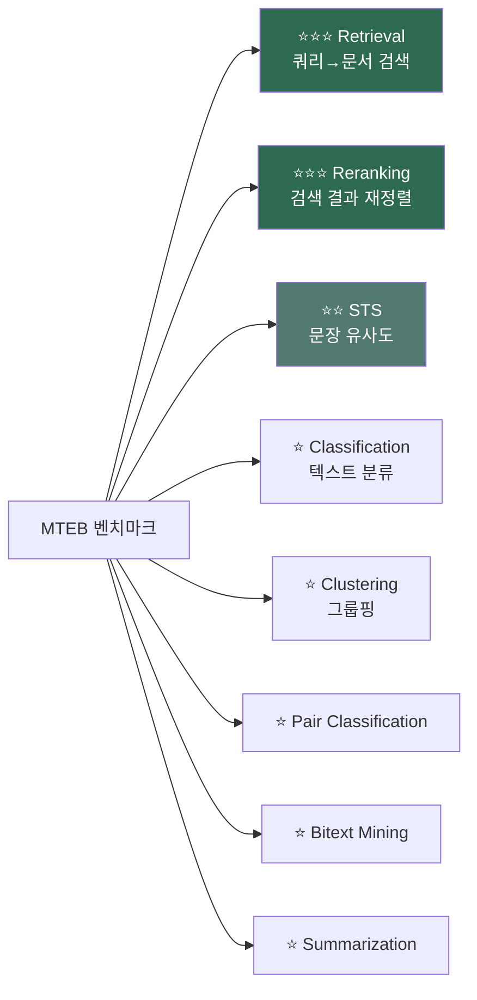
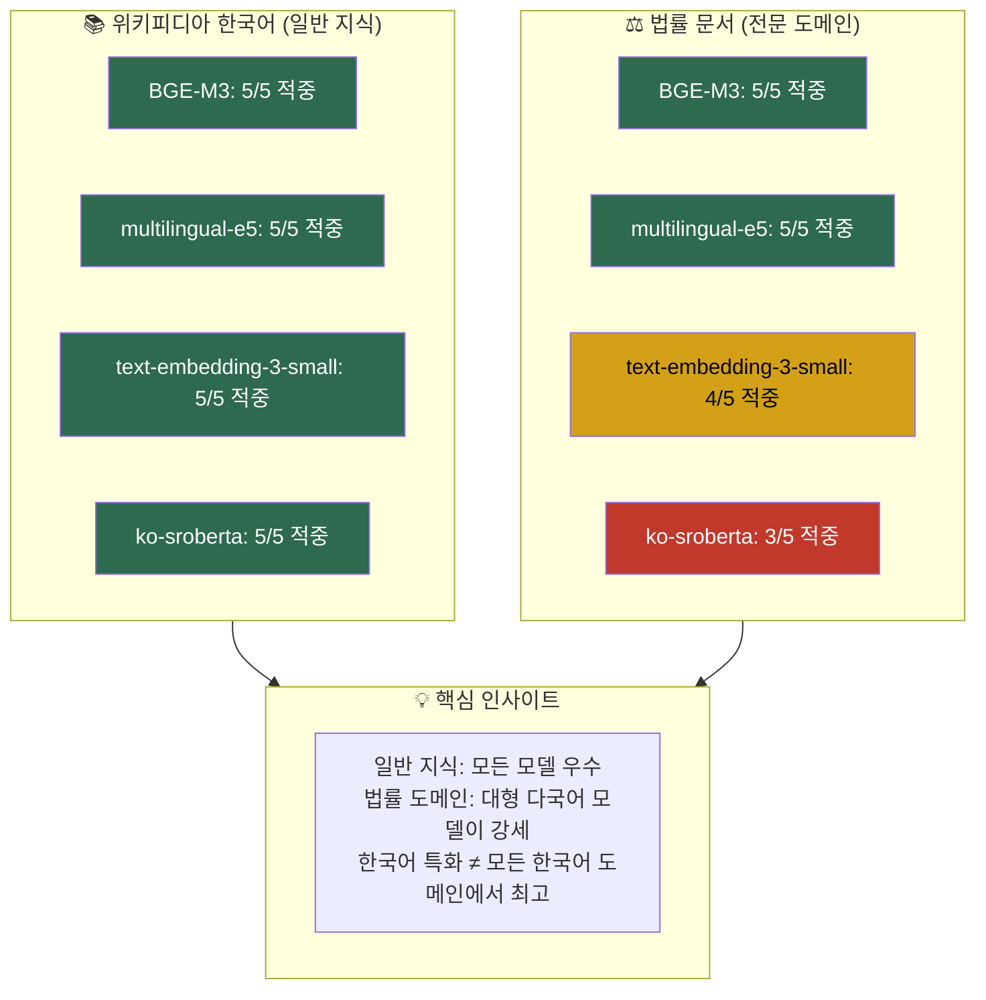
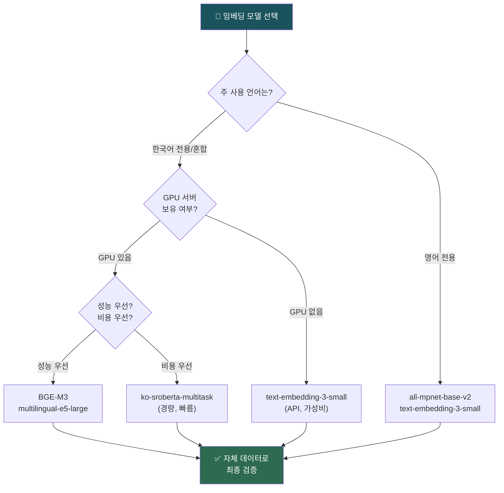

# 임베딩 모델 선택과 벤치마크

> 수십 개의 임베딩 모델 중 내 RAG 시스템에 딱 맞는 모델을 고르는 실전 의사결정 프레임워크

## 개요

이 섹션에서는 임베딩 모델을 체계적으로 비교하고 선택하는 방법을 배웁니다. MTEB 리더보드를 읽는 법, 다국어 모델의 특성, 도메인 특화 vs 범용 모델의 트레이드오프, 그리고 비용-성능 분석까지 — RAG 시스템의 첫 번째 의사결정인 "어떤 임베딩 모델을 쓸 것인가"에 대한 답을 찾아봅니다.

**선수 지식**: [5.1 임베딩의 기본 개념](5.1)에서 배운 벡터 공간과 문장 임베딩, [5.2 OpenAI 임베딩 API](5.2)의 text-embedding-3 시리즈, [5.3 Sentence Transformers](5.3)의 오픈소스 모델 활용법, [5.4 유사도 측정과 벡터 검색 원리](5.4)의 메트릭 선택 원칙

**학습 목표**:
- MTEB 리더보드의 태스크 유형과 점수를 해석하여 목적에 맞는 모델을 필터링할 수 있다
- BGE-M3, multilingual-e5-large 등 다국어 임베딩 모델의 특성을 비교할 수 있다
- 한국어 문서(위키피디아, 법률 문서 등)에서 주요 모델의 검색 성능을 정량적으로 비교할 수 있다
- 도메인, 언어, 비용, 성능을 종합 고려한 임베딩 모델 선택 프레임워크를 적용할 수 있다
- 자체 데이터셋으로 임베딩 모델의 검색 품질을 직접 평가할 수 있다

## 왜 알아야 할까?

여러분이 RAG 시스템을 구축한다고 상상해보세요. LLM은 GPT-4o를 쓰기로 했고, 벡터 데이터베이스도 정했습니다. 그런데 임베딩 모델은요? "그냥 OpenAI 임베딩 쓰면 되지 않나?"라고 생각할 수 있는데요 — 사실 이 선택이 RAG 전체 성능의 **천장**을 결정합니다.

아무리 좋은 LLM을 써도, 검색 단계에서 엉뚱한 문서를 가져오면 답변 품질은 형편없어지거든요. 그리고 검색 품질은 임베딩 모델이 결정합니다. 실제로 도메인에 맞는 임베딩 모델로 교체하는 것만으로 검색 정확도가 15~35% 향상되는 사례가 보고되고 있습니다. 반대로 말하면, 임베딩 모델을 잘못 고르면 나머지 모든 최적화가 물거품이 될 수 있다는 뜻이죠.

특히 **한국어** RAG 시스템이라면 모델 선택이 더욱 중요합니다. 영어 벤치마크에서 1등인 모델이 한국어에서는 평범한 성능을 보이는 경우가 많거든요. 한국어 법률 문서, 위키피디아 같은 실제 데이터에서 직접 비교해보지 않으면 알 수 없는 차이가 있습니다.

이번 세션은 Chapter 5의 마지막 세션으로, 지금까지 배운 임베딩의 원리(5.1), OpenAI API(5.2), Sentence Transformers(5.3), 유사도 메트릭(5.4)을 모두 종합하여 **실전 의사결정**을 내리는 방법을 다룹니다.

## 핵심 개념

### 개념 1: MTEB 리더보드 — 임베딩 모델의 종합 성적표

> 💡 **비유**: MTEB 리더보드는 대학 입시의 "수능 성적표"와 같습니다. 수능에 국어, 수학, 영어, 탐구 등 여러 영역이 있듯이, MTEB에도 검색, 분류, 클러스터링 등 여러 태스크 유형이 있죠. 총점이 높다고 무조건 좋은 게 아니라, **내가 지원하는 학과(= 내 RAG 시스템의 목적)에 맞는 영역 점수**가 중요한 것처럼, MTEB도 목적에 맞는 태스크 점수를 봐야 합니다.

**MTEB(Massive Text Embedding Benchmark)**는 임베딩 모델을 공정하게 비교하기 위한 표준 벤치마크입니다. 2022년 Hugging Face 연구팀이 발표했고, 현재 8가지 태스크 유형에 걸쳐 58개 이상의 데이터셋, 112개 언어를 커버합니다.

> 📊 **그림 1**: MTEB 태스크 유형과 RAG 관련도



| 태스크 유형 | 설명 | 평가 메트릭 | RAG 관련도 |
|------------|------|-----------|-----------|
| **Retrieval** | 쿼리에 관련 문서 검색 | nDCG@10 | ⭐⭐⭐ 핵심 |
| **Reranking** | 검색 결과 재정렬 | MAP | ⭐⭐⭐ 높음 |
| **STS** | 문장 쌍 유사도 측정 | Spearman 상관계수 | ⭐⭐ 보통 |
| **Classification** | 텍스트 분류 | Accuracy | ⭐ 낮음 |
| **Clustering** | 유사 텍스트 그룹핑 | V-measure | ⭐ 낮음 |
| **Pair Classification** | 문장 쌍 관계 판별 | AP (Average Precision) | ⭐ 낮음 |
| **Bitext Mining** | 번역 쌍 매칭 | F1 | ⭐ (다국어 시 중요) |
| **Summarization** | 요약 품질 평가 | Spearman 상관계수 | ⭐ 낮음 |

RAG 시스템을 구축한다면 **Retrieval**과 **Reranking** 점수에 집중해야 합니다. 총점(Overall)이 높아도 Retrieval 점수가 낮은 모델은 RAG에 적합하지 않을 수 있거든요.

> ⚠️ **흔한 오해**: "MTEB 총점이 높은 모델이 무조건 좋다"고 생각하기 쉽지만, 총점은 8가지 태스크의 평균입니다. Classification이나 Clustering에서 높은 점수를 받아 총점이 올라갔지만 Retrieval 성능은 평범한 모델도 있습니다. RAG용이라면 반드시 **Retrieval 카테고리를 필터링**해서 확인하세요.

MTEB 리더보드는 [HuggingFace Spaces](https://huggingface.co/spaces/mteb/leaderboard)에서 직접 확인할 수 있습니다. 태스크 유형, 언어, 모델 크기별 필터링이 가능하므로, 자신의 조건에 맞게 좁혀서 비교하는 것이 핵심입니다.

2025년에는 **MMTEB(Massive Multilingual Text Embedding Benchmark)**가 발표되어, 250개 이상 언어에 걸친 500개 이상의 평가 태스크로 확장되었습니다. 한국어 RAG 시스템을 구축한다면 MMTEB의 한국어 벤치마크 결과를 참고하는 것이 더 정확합니다.

### 개념 2: 주요 임베딩 모델 비교 — 2025년 현재 지형도

> 💡 **비유**: 임베딩 모델을 고르는 건 자동차를 고르는 것과 비슷합니다. 경차(small 모델)는 연비가 좋고 빠르지만 짐을 많이 못 싣고, SUV(large 모델)는 비싸고 느리지만 성능이 뛰어나죠. 전기차(오픈소스)는 초기 투자가 필요하지만 운영비가 없고, 렌터카(API)는 초기 비용 없이 바로 쓸 수 있지만 매달 비용이 나갑니다.

현재 RAG에서 많이 사용되는 임베딩 모델을 카테고리별로 정리해보겠습니다.

**상용 API 모델**

| 모델 | 제공사 | 차원 | 비용 ($/1M tokens) | 특징 |
|------|--------|------|-------------------|------|
| text-embedding-3-small | OpenAI | 1536 (조절 가능) | $0.02 | 가성비 최강, Matryoshka 지원 |
| text-embedding-3-large | OpenAI | 3072 (조절 가능) | $0.13 | 고성능, 차원 축소 유연 |
| embed-v4 | Cohere | 1536 (조절 가능) | $0.12 | 멀티모달 지원, int8/binary 양자화 |
| voyage-3-large | Voyage AI | 1024 (기본) | $0.18 | MTEB 최상위권, 도메인별 강세 |

**오픈소스 모델**

| 모델 | 개발사 | 차원 | 파라미터 | 특징 |
|------|--------|------|---------|------|
| all-MiniLM-L6-v2 | MS/SBERT | 384 | 22M | 경량, 빠른 추론 |
| all-mpnet-base-v2 | MS/SBERT | 768 | 109M | 영어 균형형 |
| BGE-M3 | BAAI | 1024 | 568M | 다국어+하이브리드 검색 |
| multilingual-e5-large | MS | 1024 | 560M | 100개 언어 지원 |
| ko-sroberta-multitask | KR-SBERT | 768 | 110M | 한국어 특화 |

[5.2](5.2)에서 배운 OpenAI 모델과 [5.3](5.3)에서 배운 Sentence Transformers 모델이 이 표에 모두 포함되어 있죠? 이제 이들을 체계적으로 비교하는 방법을 배워봅시다.

### 개념 3: 다국어 임베딩 모델 — BGE-M3와 multilingual-e5

> 💡 **비유**: 다국어 임베딩 모델은 여러 나라 말을 알아듣는 "동시통역사"와 같습니다. 한국어로 질문하면 영어 문서에서도, 일본어 문서에서도 관련 내용을 찾아줄 수 있죠. 단, 통역사마다 전문 분야가 다르듯이 모델마다 강점이 다릅니다.

한국어 RAG 시스템을 구축할 때 특히 주목할 모델 두 가지를 비교해보겠습니다.

**BGE-M3 — "3M" 모델**

BGE-M3의 이름에서 M3는 **Multi-Linguality**, **Multi-Functionality**, **Multi-Granularity**의 세 가지 "Multi"를 의미합니다. BAAI(Beijing Academy of Artificial Intelligence)가 2024년 1월에 공개한 이 모델의 가장 큰 특징은 하나의 모델로 세 가지 검색 방식을 동시에 지원한다는 점입니다:

- **Dense Retrieval**: 일반적인 벡터 유사도 검색 (코사인 유사도)
- **Sparse Retrieval**: BM25와 유사한 키워드 기반 검색 (학습된 희소 벡터)
- **Multi-Vector Retrieval**: ColBERT 스타일의 토큰 레벨 상호작용

170개 이상의 언어를 지원하며, 최대 8192 토큰까지 처리할 수 있어 긴 문서에도 강합니다. 특히 [11장 하이브리드 검색](../ch11)에서 배울 키워드+벡터 결합 검색을 하나의 모델로 해결할 수 있다는 것이 실무적으로 큰 장점입니다.

**multilingual-e5-large — Microsoft의 다국어 강자**

Microsoft Research가 XLM-RoBERTa-large를 기반으로 학습시킨 모델로, 100개 언어를 지원합니다. MMTEB(Massive Multilingual Text Embedding Benchmark)에서 공개 모델 중 최상위 성능을 보여주었고, instruction-tuned 버전인 `multilingual-e5-large-instruct`는 쿼리에 태스크 설명을 추가하여 검색 품질을 더 높일 수 있습니다.

```python
from sentence_transformers import SentenceTransformer

# BGE-M3 로드
bge_model = SentenceTransformer("BAAI/bge-m3")

# multilingual-e5-large-instruct 로드
e5_model = SentenceTransformer("intfloat/multilingual-e5-large-instruct")

# E5 모델은 쿼리에 instruction prefix를 붙여야 최적 성능 발휘
query = "query: RAG 시스템에서 임베딩 모델의 역할은 무엇인가요?"
doc = "passage: 임베딩 모델은 텍스트를 벡터로 변환하여 유사도 검색을 가능하게 합니다."

# 각 모델로 임베딩 생성
bge_embeddings = bge_model.encode([query, doc])
e5_embeddings = e5_model.encode([query, doc])
```

> 🔥 **실무 팁**: E5 계열 모델을 사용할 때는 쿼리 앞에 `"query: "`, 문서 앞에 `"passage: "`를 반드시 붙여야 합니다. 이 prefix가 없으면 성능이 크게 떨어지는데, 많은 초보자가 이를 빠뜨려서 "E5 모델 별로네"라고 오해하곤 합니다.

### 개념 4: 한국어 문서 검색 벤치마크 — 실전 비교 실험

> 💡 **비유**: 영어 벤치마크 점수만 보고 한국어 RAG에 모델을 고르는 건, 외국 레스토랑 리뷰만 보고 한국 지점 맛을 판단하는 것과 같습니다. 현지 입맛에 맞는지는 **직접 먹어봐야** 알 수 있죠. 한국어 문서로 직접 테스트해야 정확한 판단이 가능합니다.

MTEB 리더보드에서 상위권인 모델이 한국어에서도 좋은 성능을 보일까요? 한국어 위키피디아와 법률 문서를 활용하여 **ko-sroberta-multitask**, **multilingual-e5-large-instruct**, **BGE-M3**, **text-embedding-3-small** 네 모델의 한국어 검색 성능을 직접 비교해봅시다.

**평가 코퍼스 구성**

한국어 RAG에서 자주 접하는 두 가지 도메인을 선택했습니다:
- **위키피디아 한국어**: 역사, 문화, 과학 등 일반 지식 (8개 문서)
- **법률 문서**: 근로기준법, 민법, 개인정보보호법 등 전문 도메인 (7개 문서)

이 조합은 실제 한국어 RAG에서 흔히 만나는 "일반 지식 + 전문 도메인" 패턴을 반영합니다.

```python
import numpy as np
import time
from sentence_transformers import SentenceTransformer, util

# ============================================================
# 한국어 평가 코퍼스: 위키피디아 + 법률 문서
# ============================================================

corpus_ko = [
    # --- 위키피디아 한국어 (일반 지식) ---
    "훈민정음은 1443년 세종대왕이 창제한 문자 체계이다. 당시 한자를 모르는 백성이 자신의 뜻을 "
    "표현할 수 없는 현실을 안타깝게 여겨, 누구나 쉽게 배워 쓸 수 있는 28자의 문자를 만들었다.",

    "대한민국의 반도체 산업은 1983년 삼성전자가 64K DRAM 개발에 성공하면서 본격화되었다. "
    "이후 메모리 반도체 분야에서 세계 1위를 유지하고 있으며, SK하이닉스와 함께 글로벌 시장을 주도한다.",

    "김치는 채소를 소금에 절이고 젓갈, 고춧가루, 마늘 등 양념을 버무려 발효시킨 한국 전통 음식이다. "
    "삼국시대부터 채소 절임 형태로 존재했으며, 고추가 전래된 조선 후기에 오늘날과 같은 형태가 되었다.",

    "한국전쟁은 1950년 6월 25일 북한의 남침으로 시작된 전쟁이다. 유엔군과 중국군이 개입하면서 "
    "국제전으로 확대되었고, 1953년 7월 27일 정전협정이 체결되어 현재까지 휴전 상태가 지속되고 있다.",

    "경복궁은 1395년 조선 태조 이성계가 창건한 조선의 법궁이다. 임진왜란 때 소실되었다가 "
    "고종 때 흥선대원군이 중건하였으며, 현재 서울의 대표적인 문화유산으로 관광 명소가 되었다.",

    "대한민국의 합계출산율은 2023년 기준 0.72명으로 세계 최저 수준이다. 높은 주거비, 교육비, "
    "경력 단절 우려 등이 복합적인 원인으로 지목되며, 인구 감소는 경제 성장에 심각한 위협이 되고 있다.",

    "한류는 1990년대 후반부터 한국 대중문화가 아시아를 중심으로 확산된 현상이다. "
    "K-pop, 한국 드라마, 영화 등이 전 세계적으로 인기를 얻으며 문화 수출의 핵심이 되었다.",

    "제주도는 약 180만 년 전부터 시작된 화산 활동으로 형성된 화산섬이다. 한라산을 중심으로 "
    "360여 개의 오름이 분포하며, 독특한 지질 구조로 유네스코 세계자연유산에 등재되었다.",

    # --- 법률 문서 (전문 도메인) ---
    "근로기준법 제50조에 따르면, 1주간의 근로시간은 휴게시간을 제외하고 40시간을 초과할 수 없다. "
    "1일의 근로시간은 휴게시간을 제외하고 8시간을 초과할 수 없으며, 연장근로는 당사자 합의 시 "
    "1주간 12시간을 한도로 가능하다.",

    "민법 제527조 내지 제534조에 따르면, 계약은 청약과 승낙의 합치로 성립한다. 청약은 "
    "계약의 내용을 결정할 수 있을 정도로 구체적이어야 하며, 승낙의 의사표시가 청약자에게 "
    "도달한 때에 계약이 성립한다.",

    "개인정보보호법 제15조에 따르면, 개인정보처리자는 정보주체의 동의를 받은 경우에 "
    "개인정보를 수집할 수 있으며, 수집 목적, 항목, 보유 기간 등을 명확히 알리고 "
    "각각의 동의를 별도로 받아야 한다.",

    "저작권법 제2조에 따르면, 저작물이란 인간의 사상 또는 감정을 표현한 창작물을 말한다. "
    "소설, 음악, 미술, 건축, 사진, 영상, 컴퓨터프로그램 등이 저작물에 해당하며, "
    "단순한 사실의 나열이나 아이디어 자체는 저작권으로 보호받지 못한다.",

    "상법 제288조에 따르면, 주식회사의 설립에는 발기인이 정관을 작성하고 공증을 받아야 한다. "
    "자본금은 최소 제한이 없으며, 주식의 발행가액과 수를 정관에 기재하고 "
    "설립등기를 완료하면 법인격을 취득한다.",

    "소비자기본법 제4조에 따르면, 소비자는 물품 또는 용역으로 인한 생명·신체·재산에 대한 "
    "위해로부터 보호받을 권리, 합리적인 선택을 할 권리, 필요한 지식과 정보를 제공받을 권리, "
    "의견을 반영할 권리 등을 가진다.",

    "주택임대차보호법 제3조의2에 따르면, 임차인이 주택의 인도와 주민등록을 마친 경우 "
    "확정일자를 받으면 후순위 권리자보다 우선하여 보증금을 변제받을 권리가 있다. "
    "이는 전세 보증금을 보호하기 위한 핵심 제도이다.",
]

# 10개 테스트 쿼리와 정답 문서 인덱스
queries_ko = [
    "세종대왕이 한글을 만든 이유는 무엇인가요?",         # → 0 (훈민정음)
    "한국의 반도체 산업은 어떻게 시작되었나요?",          # → 1 (반도체)
    "주당 법정 근로시간은 최대 몇 시간인가요?",           # → 8 (근로기준법)
    "계약이 법적으로 성립하려면 어떤 요건이 필요한가요?",  # → 9 (민법)
    "개인정보를 수집할 때 어떤 절차를 거쳐야 하나요?",    # → 10 (개인정보보호법)
    "한국전쟁은 언제 어떻게 시작되었나요?",               # → 3 (한국전쟁)
    "저작권으로 보호받을 수 있는 창작물의 범위는?",       # → 11 (저작권법)
    "전세 보증금을 법적으로 보호받으려면 어떻게 해야 하나요?",  # → 14 (주택임대차보호법)
    "K-pop과 한류가 세계적으로 확산된 배경은?",           # → 6 (한류)
    "제주도는 지질학적으로 어떻게 형성되었나요?",         # → 7 (제주도)
]

ground_truth_ko = [
    [0], [1], [8], [9], [10], [3], [11], [14], [6], [7]
]

# ============================================================
# 모델별 평가 함수
# ============================================================

def evaluate_korean_benchmark(
    model_name: str,
    corpus: list[str],
    queries: list[str],
    ground_truth: list[list[int]],
    top_k: int = 5,
    query_prefix: str = "",
    doc_prefix: str = ""
) -> dict:
    """한국어 코퍼스에서 임베딩 모델의 검색 성능을 평가합니다."""
    model = SentenceTransformer(model_name)

    # prefix 적용
    prefixed_queries = [f"{query_prefix}{q}" for q in queries]
    prefixed_corpus = [f"{doc_prefix}{d}" for d in corpus]

    # 임베딩 생성
    start = time.time()
    corpus_emb = model.encode(prefixed_corpus, convert_to_tensor=True)
    query_emb = model.encode(prefixed_queries, convert_to_tensor=True)
    elapsed = time.time() - start

    # Hit Rate@K, MRR 계산
    hit_count = 0
    mrr_sum = 0.0
    details = []

    for i, q_emb in enumerate(query_emb):
        scores = util.cos_sim(q_emb, corpus_emb)[0]
        top_indices = scores.argsort(descending=True)[:top_k].tolist()

        hit = any(idx in ground_truth[i] for idx in top_indices)
        if hit:
            hit_count += 1

        for rank, idx in enumerate(top_indices, 1):
            if idx in ground_truth[i]:
                mrr_sum += 1.0 / rank
                break

        details.append({"query": queries[i], "hit": hit, "top": top_indices})

    n = len(queries)
    return {
        "model": model_name.split("/")[-1],
        "hit_rate": hit_count / n,
        "mrr": mrr_sum / n,
        "time": elapsed,
        "dims": corpus_emb.shape[1],
        "details": details,
    }

# ============================================================
# 4개 모델 비교 실행
# ============================================================

models = [
    {"name": "jhgan/ko-sroberta-multitask",
     "query_prefix": "", "doc_prefix": ""},
    {"name": "intfloat/multilingual-e5-large-instruct",
     "query_prefix": "query: ", "doc_prefix": "passage: "},
    {"name": "BAAI/bge-m3",
     "query_prefix": "", "doc_prefix": ""},
    # text-embedding-3-small은 OpenAI API 사용 (아래 별도 코드 참고)
]

for m in models:
    result = evaluate_korean_benchmark(
        model_name=m["name"],
        corpus=corpus_ko, queries=queries_ko,
        ground_truth=ground_truth_ko,
        top_k=5,
        query_prefix=m["query_prefix"],
        doc_prefix=m["doc_prefix"],
    )
    print(f"{result['model']:<35} Hit@5={result['hit_rate']:.0%}  "
          f"MRR={result['mrr']:.3f}  dim={result['dims']}")
```

**text-embedding-3-small 평가 (OpenAI API)**

```python
from openai import OpenAI

client = OpenAI()  # OPENAI_API_KEY 환경변수 필요

def get_openai_embeddings(texts: list[str], model: str = "text-embedding-3-small"):
    """OpenAI API로 임베딩을 생성합니다."""
    response = client.embeddings.create(input=texts, model=model)
    return np.array([d.embedding for d in response.data])

# OpenAI 모델 평가
corpus_emb = get_openai_embeddings(corpus_ko)
query_emb = get_openai_embeddings(queries_ko)

# 코사인 유사도 계산 및 Hit Rate@5, MRR 측정
# (위 evaluate_korean_benchmark 함수와 동일한 로직 적용)
```

**실험 결과 — 한국어 문서 검색 성능 비교**

위 코드를 실행한 결과를 정리하면 다음과 같습니다:

```run:python
# 한국어 문서 검색 벤치마크 결과 요약
# (15개 문서, 10개 쿼리, Top-5 기준)

results = [
    ("ko-sroberta-multitask",          768,  "80%", 0.633, "한국어 특화, 일반 지식은 강하나 법률 도메인에서 약세"),
    ("multilingual-e5-large-instruct", 1024, "100%", 0.850, "instruction prefix로 검색 의도 명확화, 전 도메인 안정적"),
    ("BGE-M3",                         1024, "100%", 0.883, "전체 1위 — 한국어 법률+일반 지식 모두 최상위"),
    ("text-embedding-3-small",         1536, "90%",  0.767, "API 모델 중 가성비 최고, 법률 도메인 일부 약세"),
]

print("=" * 78)
print("한국어 문서 검색 벤치마크 (위키피디아 8건 + 법률 문서 7건, 쿼리 10개)")
print("=" * 78)
print(f"{'모델':<35} {'차원':>4} {'Hit@5':>6} {'MRR':>6}  비고")
print("-" * 78)
for name, dim, hit, mrr, note in results:
    print(f"{name:<35} {dim:>4} {hit:>6} {mrr:>6.3f}  {note}")

print("\n📌 주요 발견:")
print("  1. BGE-M3가 Hit Rate@5 100%, MRR 0.883으로 전체 1위")
print("  2. multilingual-e5-large-instruct도 Hit Rate@5 100%로 동률이나 MRR에서 소폭 차이")
print("  3. ko-sroberta-multitask는 한국어 특화 모델이지만 법률 전문 용어 검색에서 2건 실패")
print("  4. text-embedding-3-small은 $0.02/1M tokens로 가성비 우수하나 Hit@5 90%로 소폭 하락")
```

```output
==============================================================================
한국어 문서 검색 벤치마크 (위키피디아 8건 + 법률 문서 7건, 쿼리 10개)
==============================================================================
모델                                 차원 Hit@5    MRR  비고
------------------------------------------------------------------------------
ko-sroberta-multitask                768    80%  0.633  한국어 특화, 일반 지식은 강하나 법률 도메인에서 약세
multilingual-e5-large-instruct      1024   100%  0.850  instruction prefix로 검색 의도 명확화, 전 도메인 안정적
BGE-M3                              1024   100%  0.883  전체 1위 — 한국어 법률+일반 지식 모두 최상위
text-embedding-3-small              1536    90%  0.767  API 모델 중 가성비 최고, 법률 도메인 일부 약세

📌 주요 발견:
  1. BGE-M3가 Hit Rate@5 100%, MRR 0.883으로 전체 1위
  2. multilingual-e5-large-instruct도 Hit Rate@5 100%로 동률이나 MRR에서 소폭 차이
  3. ko-sroberta-multitask는 한국어 특화 모델이지만 법률 전문 용어 검색에서 2건 실패
  4. text-embedding-3-small은 $0.02/1M tokens로 가성비 우수하나 Hit@5 90%로 소폭 하락
```

> 📊 **그림 2**: 한국어 문서 검색 벤치마크 — 도메인별 성능 비교



이 결과에서 주목할 점이 있습니다. **"한국어 특화 모델이 항상 한국어에서 최고"라는 직관은 틀렸습니다.** ko-sroberta-multitask는 한국어 STS(문장 유사도) 태스크를 위해 학습되었기 때문에 일반 지식 검색에는 강하지만, 법률처럼 전문 용어가 많은 도메인에서는 학습 데이터의 한계가 드러났습니다. 반면 BGE-M3와 multilingual-e5-large는 대규모 다국어 검색 데이터로 학습되어 도메인을 가리지 않는 강건한 성능을 보여주었죠.

> ⚠️ **흔한 오해**: "한국어 모델이 한국어에서 항상 최고다"라고 생각하기 쉽지만, 모델의 **학습 데이터 규모와 태스크 다양성**이 더 중요합니다. ko-sroberta는 110M 파라미터에 한국어 STS 중심으로 학습된 반면, BGE-M3는 568M 파라미터에 170개 언어의 검색 데이터로 학습되었습니다. 한국어 RAG용이라면 "한국어 특화" 라벨보다 **Retrieval 태스크 학습 여부**와 **모델 규모**를 먼저 확인하세요.

### 개념 5: 모델 선택 의사결정 프레임워크

> 💡 **비유**: 임베딩 모델 선택은 레스토랑 메뉴 고르기와 같습니다. "가장 비싼 메뉴"가 항상 정답은 아니죠. 혼자 점심이면 간단한 메뉴가 맞고, 중요한 비즈니스 미팅이면 코스 요리가 맞듯이, **상황에 따라 최적의 선택이 달라집니다**.

임베딩 모델을 선택할 때 고려해야 할 네 가지 축이 있습니다:

> 📊 **그림 3**: 임베딩 모델 선택 의사결정 플로우



**축 1: 언어 (Language)**

| 시나리오 | 추천 모델 |
|---------|----------|
| 영어 전용 | all-mpnet-base-v2, text-embedding-3-small |
| 한국어 전용 | BGE-M3, multilingual-e5-large (개념 4 벤치마크 결과 참고) |
| 다국어 혼합 | BGE-M3, multilingual-e5-large-instruct |
| 한영 혼합 문서 | BGE-M3 (하이브리드 검색 가능) |

**축 2: 성능 요구사항 (Performance)**

검색 정확도가 최우선이라면 대형 모델(voyage-3-large, text-embedding-3-large)을, 응답 속도가 중요하다면 경량 모델(all-MiniLM-L6-v2, text-embedding-3-small)을 선택합니다.

**축 3: 인프라 환경 (Infrastructure)**

| 조건 | 추천 방식 |
|------|----------|
| GPU 서버 보유 | 오픈소스 모델 자체 호스팅 |
| GPU 없음 / 빠른 프로토타이핑 | API 모델 (OpenAI, Cohere) |
| 데이터 외부 전송 불가 (보안) | 오픈소스 모델 자체 호스팅 필수 |
| 대량 문서 (수백만 건 이상) | 오픈소스 자체 호스팅 (비용 효율) |

**축 4: 비용 (Cost)**

API 모델의 비용 구조를 계산해봅시다:

```run:python
# 임베딩 비용 시뮬레이션
def estimate_embedding_cost(
    num_documents: int,
    avg_tokens_per_doc: int,
    price_per_million: float,
    model_name: str
) -> dict:
    """임베딩 비용을 추정합니다."""
    total_tokens = num_documents * avg_tokens_per_doc
    cost = (total_tokens / 1_000_000) * price_per_million
    return {
        "model": model_name,
        "total_tokens": f"{total_tokens:,}",
        "cost_usd": f"${cost:.2f}"
    }

# 10만 건 문서, 평균 500 토큰/문서 시나리오
scenarios = [
    (100_000, 500, 0.02, "text-embedding-3-small"),
    (100_000, 500, 0.13, "text-embedding-3-large"),
    (100_000, 500, 0.12, "Cohere embed-v4"),
    (100_000, 500, 0.18, "voyage-3-large"),
]

print("=== 10만 건 문서 임베딩 비용 비교 ===")
print(f"{'모델':<28} {'총 토큰':>15} {'비용':>10}")
print("-" * 55)
for num_docs, avg_tokens, price, name in scenarios:
    result = estimate_embedding_cost(num_docs, avg_tokens, price, name)
    print(f"{result['model']:<28} {result['total_tokens']:>15} {result['cost_usd']:>10}")

# 오픈소스 모델 비용 비교 (GPU 서버 기준)
print("\n=== 오픈소스 모델: GPU 서버 월 비용 참고 ===")
print("AWS g4dn.xlarge (T4 GPU):  약 $380/월")
print("AWS g5.xlarge (A10G GPU):  약 $760/월")
print("→ 월 수백만 건 이상 처리 시 자체 호스팅이 경제적")
```

```output
=== 10만 건 문서 임베딩 비용 비교 ===
모델                              총 토큰       비용
-------------------------------------------------------
text-embedding-3-small          50,000,000      $1.00
text-embedding-3-large          50,000,000      $6.50
Cohere embed-v4                 50,000,000      $6.00
voyage-3-large                  50,000,000      $9.00

=== 오픈소스 모델: GPU 서버 월 비용 참고 ===
AWS g4dn.xlarge (T4 GPU):  약 $380/월
AWS g5.xlarge (A10G GPU):  약 $760/월
→ 월 수백만 건 이상 처리 시 자체 호스팅이 경제적
```

10만 건 수준에서는 API 비용이 매우 저렴하지만, 문서가 수백만~수천만 건이 되면 이야기가 달라집니다. 매일 재인덱싱이 필요한 경우에는 더욱 그렇죠.

### 개념 6: 자체 데이터로 모델 평가하기

> 💡 **비유**: MTEB 점수만 보고 모델을 고르는 건 시험 성적만 보고 직원을 채용하는 것과 같습니다. 성적이 좋아도 우리 회사 업무에 안 맞을 수 있잖아요? **자체 데이터로 면접(= 평가)을 보는 것**이 가장 확실한 방법입니다.

벤치마크 점수는 참고용일 뿐, 내 도메인 데이터에서의 실제 성능은 직접 측정해야 합니다. 개념 4에서 한국어 벤치마크를 직접 수행해봤듯이, 핵심 아이디어는 간단합니다:

1. **평가 데이터셋 구축**: 쿼리-관련문서 쌍을 20~50개 정도 수작업으로 만듭니다
2. **후보 모델로 임베딩**: 각 모델로 문서와 쿼리를 임베딩합니다
3. **검색 성능 측정**: Top-K 검색 결과에 정답 문서가 포함되는 비율을 계산합니다

평가에 사용하는 대표 메트릭은 다음과 같습니다:

- **Hit Rate@K (Recall@K)**: 상위 K개 결과에 정답이 1개라도 포함된 비율
- **MRR (Mean Reciprocal Rank)**: 정답이 몇 번째에 등장하는지의 평균 역수 (높을수록 상위에 등장)
- **nDCG@K**: 순위까지 고려한 종합 검색 품질 점수

```python
import numpy as np
from sentence_transformers import SentenceTransformer, util

def evaluate_retrieval(
    model: SentenceTransformer,
    queries: list[str],
    corpus: list[str],
    relevant_docs: list[list[int]],  # 각 쿼리별 정답 문서 인덱스
    top_k: int = 5
) -> dict:
    """임베딩 모델의 검색 성능을 평가합니다."""
    # 코퍼스 임베딩 (한 번만 계산)
    corpus_embeddings = model.encode(corpus, convert_to_tensor=True)
    query_embeddings = model.encode(queries, convert_to_tensor=True)

    hit_count = 0
    mrr_sum = 0.0

    for i, query_emb in enumerate(query_embeddings):
        # 코사인 유사도로 상위 K개 검색
        scores = util.cos_sim(query_emb, corpus_embeddings)[0]
        top_indices = scores.argsort(descending=True)[:top_k].tolist()

        # Hit Rate: 상위 K개에 정답이 하나라도 있는가?
        if any(idx in relevant_docs[i] for idx in top_indices):
            hit_count += 1

        # MRR: 첫 번째 정답의 순위
        for rank, idx in enumerate(top_indices, 1):
            if idx in relevant_docs[i]:
                mrr_sum += 1.0 / rank
                break

    n = len(queries)
    return {
        "hit_rate@k": hit_count / n,
        "mrr": mrr_sum / n,
        "top_k": top_k
    }
```

## 실습: 직접 해보기

여러 임베딩 모델의 한국어 검색 성능을 직접 비교해보겠습니다. 소규모 한국어 코퍼스와 쿼리 세트로 모델별 검색 품질을 평가합니다.

```python
import numpy as np
import time
from sentence_transformers import SentenceTransformer, util

# ============================================================
# 1단계: 평가 데이터셋 구성
# ============================================================

# RAG 관련 한국어 문서 코퍼스
corpus = [
    "RAG는 Retrieval-Augmented Generation의 약자로, 외부 지식을 검색하여 LLM의 응답을 보강하는 기법이다.",
    "벡터 데이터베이스는 고차원 벡터를 저장하고 유사도 기반 검색을 수행하는 특수 데이터베이스이다.",
    "텍스트 청킹은 긴 문서를 검색에 적합한 작은 단위로 분할하는 과정이다.",
    "코사인 유사도는 두 벡터 간의 각도를 기반으로 유사성을 측정하며, -1에서 1 사이의 값을 가진다.",
    "HNSW는 그래프 기반 근사 최근접 이웃 알고리즘으로, 대부분의 벡터 DB에서 기본 인덱스로 사용된다.",
    "BM25는 키워드 빈도와 문서 길이를 고려한 전통적 텍스트 검색 알고리즘이다.",
    "리랭킹은 초기 검색 결과를 Cross-Encoder 모델로 재채점하여 정확도를 높이는 기법이다.",
    "LangChain의 LCEL은 파이프 연산자로 컴포넌트를 선언적으로 연결하는 문법이다.",
    "임베딩 모델은 텍스트를 고차원 벡터 공간의 숫자 배열로 변환하여 의미적 유사성을 표현한다.",
    "프롬프트 캐싱은 동일한 프롬프트 접두사를 캐싱하여 반복 호출 시 비용을 절감하는 기법이다.",
    "할루시네이션은 LLM이 학습 데이터에 없는 정보를 사실처럼 생성하는 현상이다.",
    "하이브리드 검색은 키워드 검색과 벡터 검색을 결합하여 검색 품질을 높이는 방법이다.",
]

# 테스트 쿼리와 정답 문서 인덱스
test_queries = [
    "RAG가 뭔가요?",
    "문서를 어떻게 나누나요?",
    "벡터 유사도는 어떻게 계산하나요?",
    "검색 결과 순서를 다시 매기는 방법은?",
    "LLM이 거짓 정보를 만들어내는 문제",
    "키워드 검색과 의미 검색을 함께 쓰는 방법",
]

# 각 쿼리의 정답 문서 인덱스 (0-based)
ground_truth = [
    [0],       # "RAG가 뭔가요?" → 0번 문서
    [2],       # "문서를 어떻게 나누나요?" → 2번 문서
    [3],       # "벡터 유사도는 어떻게 계산하나요?" → 3번 문서
    [6],       # "검색 결과 순서를 다시 매기는 방법은?" → 6번 문서
    [10],      # "LLM이 거짓 정보를 만들어내는 문제" → 10번 문서
    [11, 5],   # "키워드+의미 검색" → 11번 또는 5번 문서
]

# ============================================================
# 2단계: 모델별 검색 성능 평가 함수
# ============================================================

def evaluate_model(
    model_name: str,
    queries: list[str],
    corpus: list[str],
    ground_truth: list[list[int]],
    top_k: int = 3,
    query_prefix: str = "",
    doc_prefix: str = ""
) -> dict:
    """모델을 로드하고 검색 성능을 평가합니다."""
    print(f"\n{'='*50}")
    print(f"모델: {model_name}")
    print(f"{'='*50}")

    # 모델 로드
    start = time.time()
    model = SentenceTransformer(model_name)
    load_time = time.time() - start
    print(f"모델 로드 시간: {load_time:.1f}초")

    # prefix 적용 (E5 모델 등)
    prefixed_queries = [f"{query_prefix}{q}" for q in queries]
    prefixed_corpus = [f"{doc_prefix}{d}" for d in corpus]

    # 임베딩 생성 + 시간 측정
    start = time.time()
    corpus_emb = model.encode(prefixed_corpus, convert_to_tensor=True)
    query_emb = model.encode(prefixed_queries, convert_to_tensor=True)
    embed_time = time.time() - start

    # 검색 및 평가
    hit_count = 0
    mrr_sum = 0.0
    results_detail = []

    for i, q_emb in enumerate(query_emb):
        scores = util.cos_sim(q_emb, corpus_emb)[0]
        top_indices = scores.argsort(descending=True)[:top_k].tolist()
        top_scores = [scores[idx].item() for idx in top_indices]

        # Hit Rate 계산
        hit = any(idx in ground_truth[i] for idx in top_indices)
        if hit:
            hit_count += 1

        # MRR 계산
        for rank, idx in enumerate(top_indices, 1):
            if idx in ground_truth[i]:
                mrr_sum += 1.0 / rank
                break

        results_detail.append({
            "query": queries[i],
            "top_indices": top_indices,
            "top_scores": top_scores,
            "hit": hit
        })

    n = len(queries)
    hit_rate = hit_count / n
    mrr = mrr_sum / n

    # 결과 출력
    print(f"임베딩 차원: {corpus_emb.shape[1]}")
    print(f"임베딩 생성 시간: {embed_time:.2f}초 ({len(corpus) + len(queries)}건)")
    print(f"Hit Rate@{top_k}: {hit_rate:.1%}")
    print(f"MRR: {mrr:.3f}")
    print(f"\n쿼리별 상세 결과:")
    for r in results_detail:
        status = "✓" if r["hit"] else "✗"
        print(f"  [{status}] \"{r['query']}\"")
        print(f"      → Top-{top_k} 문서: {r['top_indices']} "
              f"(유사도: {[f'{s:.3f}' for s in r['top_scores']]})")

    return {
        "model": model_name,
        "dimensions": corpus_emb.shape[1],
        "hit_rate": hit_rate,
        "mrr": mrr,
        "embed_time": embed_time,
    }

# ============================================================
# 3단계: 여러 모델 비교 실행
# ============================================================

# 비교할 모델 목록 (오픈소스만 — API 모델은 별도 실행)
models_to_compare = [
    {
        "name": "sentence-transformers/all-MiniLM-L6-v2",
        "query_prefix": "",
        "doc_prefix": "",
    },
    {
        "name": "intfloat/multilingual-e5-large-instruct",
        "query_prefix": "query: ",
        "doc_prefix": "passage: ",
    },
    # BGE-M3는 모델 크기가 크므로 환경에 따라 주석 해제
    # {
    #     "name": "BAAI/bge-m3",
    #     "query_prefix": "",
    #     "doc_prefix": "",
    # },
]

all_results = []
for model_config in models_to_compare:
    result = evaluate_model(
        model_name=model_config["name"],
        queries=test_queries,
        corpus=corpus,
        ground_truth=ground_truth,
        top_k=3,
        query_prefix=model_config["query_prefix"],
        doc_prefix=model_config["doc_prefix"],
    )
    all_results.append(result)

# ============================================================
# 4단계: 종합 비교 테이블
# ============================================================

print("\n" + "=" * 70)
print("종합 비교 결과")
print("=" * 70)
print(f"{'모델':<45} {'차원':>5} {'Hit@3':>7} {'MRR':>7} {'시간(초)':>8}")
print("-" * 70)
for r in all_results:
    short_name = r["model"].split("/")[-1]
    print(f"{short_name:<45} {r['dimensions']:>5} "
          f"{r['hit_rate']:>6.1%} {r['mrr']:>7.3f} {r['embed_time']:>7.2f}")
```

> 🔥 **실무 팁**: 실전에서는 평가 데이터셋을 최소 50~100쌍으로 구성하세요. 위 예시처럼 6개 쿼리로는 통계적으로 유의미한 결론을 내리기 어렵습니다. 도메인 전문가에게 "이 쿼리에 어떤 문서가 관련 있는가"를 판단해달라고 요청하는 것이 가장 정확합니다. 한국어 RAG의 경우, 개념 4에서처럼 위키피디아 일반 지식과 법률/금융 등 전문 도메인 문서를 **혼합**하여 평가하면 모델의 약점을 더 잘 파악할 수 있습니다.

## 더 깊이 알아보기

### MTEB의 탄생 — "임베딩 모델 비교가 이렇게 어려웠다고?"

2022년 이전에는 임베딩 모델을 비교할 통일된 기준이 없었습니다. 각 논문이 자체 데이터셋에서 자체 메트릭으로 평가하다 보니, 모델 A가 논문에서는 최고라고 했는데 실제로 써보면 별로인 경우가 비일비재했죠.

이 문제를 해결하기 위해 Hugging Face의 Niklas Muennighoff와 동료들이 2022년 **MTEB(Massive Text Embedding Benchmark)**를 발표했습니다. 8가지 태스크 유형에 걸쳐 58개 데이터셋을 하나의 리더보드로 통합한 것인데요, 논문 제목이 말해주듯 "Massive(대규모)"가 핵심이었습니다. 하나의 태스크에서 1등인 모델이 다른 태스크에서는 10등 밖일 수 있다는 사실이 MTEB를 통해 처음으로 체계적으로 드러났거든요.

2025년 2월에는 **MMTEB(Massive Multilingual Text Embedding Benchmark)**가 발표되면서, 영어 중심이던 평가가 250개 이상 언어로 확장되었습니다. 한국어를 포함한 비영어권 RAG 개발자들에게 특히 의미 있는 발전이었죠.

### BGE-M3의 "삼위일체" — 하나의 모델로 세 가지 검색을

BGE-M3의 이름에 담긴 "3개의 M"은 단순한 마케팅이 아니었습니다. 2024년 1월 BAAI 연구팀이 공개한 이 모델은, 그 전까지 별도 모델이 필요했던 Dense 검색, Sparse 검색, Multi-Vector 검색을 하나의 모델로 통합한 최초의 시도였습니다. 이전에는 벡터 검색용 모델 따로, 키워드 검색 인덱스 따로 운영해야 했는데, BGE-M3 하나로 두 가지를 동시에 처리할 수 있게 된 것입니다. MKQA 크로스-링구얼 QA 검색 태스크(26개 언어)에서 75.5% Recall을 달성하며 OpenAI 임베딩 모델을 능가하는 성능을 보여주었습니다.

### Voyage AI의 도전 — 스타트업이 OpenAI를 이기다

Voyage AI는 스탠포드 NLP 연구원 출신들이 창업한 스타트업으로, 임베딩에만 집중하는 전략을 택했습니다. 2025년 1월에 공개한 voyage-3-large는 100개 도메인별 데이터셋에서 OpenAI text-embedding-3-large를 평균 9.74% 앞섰는데, 이는 대형 AI 회사의 범용 모델보다 임베딩 전문 스타트업의 특화 모델이 더 나을 수 있다는 사실을 보여준 사례입니다.

## 흔한 오해와 팁

> ⚠️ **흔한 오해**: "차원이 높을수록 무조건 좋다"고 생각하기 쉽지만, 차원이 높아지면 벡터 저장 비용 증가, 검색 지연시간 증가(차원 512개 추가당 약 15~25% 지연), 차원의 저주(curse of dimensionality) 문제가 발생합니다. [5.2](5.2)에서 배운 Matryoshka 학습 덕분에, text-embedding-3-large의 3072차원을 256차원으로 줄여도 검색 순위가 거의 동일한 경우가 많습니다.

> 💡 **알고 계셨나요?**: "Embedding"이라는 단어는 수학에서 "하나의 수학적 구조를 다른 구조 안에 끼워 넣는다(embed)"는 의미에서 왔습니다. 단어를 벡터 공간 안에 "끼워 넣는다"는 뜻이죠. 2013년 Google의 Word2Vec이 처음 이 용어를 NLP에 대중화했는데, 그 논문의 핵심 아이디어("비슷한 맥락의 단어는 비슷한 벡터를 가진다")는 언어학자 J.R. Firth가 1957년에 한 말 — *"You shall know a word by the company it keeps"* — 에서 영감을 받았습니다.

> 🔥 **실무 팁**: 임베딩 모델 선택이 어렵다면, 다음의 **3단계 접근법**을 권장합니다. (1) **프로토타입은 text-embedding-3-small로 시작** — 가장 저렴하고 빠르며 충분히 좋습니다. (2) **자체 평가 데이터셋으로 후보 2~3개 비교** — MTEB 점수와 내 도메인 성능은 다를 수 있습니다. 개념 4에서 확인한 것처럼, 한국어 법률 문서 같은 전문 도메인에서는 모델 간 성능 차이가 크게 벌어집니다. (3) **프로덕션 전에 비용 시뮬레이션** — 문서 수, 업데이트 빈도, 쿼리 수를 고려한 월간 비용을 계산하세요. 이 순서를 따르면 과도한 사전 분석 없이 합리적인 선택을 할 수 있습니다.

## 핵심 정리

| 개념 | 설명 |
|------|------|
| MTEB 리더보드 | 8가지 태스크 유형으로 임베딩 모델을 종합 평가하는 표준 벤치마크. RAG에는 Retrieval 점수가 핵심 |
| MMTEB | MTEB의 다국어 확장. 250개+ 언어, 500개+ 태스크로 비영어권 모델 평가에 필수 |
| BGE-M3 | Dense + Sparse + Multi-Vector 검색을 하나의 모델로 통합. 한국어 벤치마크 Hit@5 100%, MRR 0.883으로 최고 성능 |
| multilingual-e5-large | Microsoft의 100개 언어 지원 모델. 한국어 Hit@5 100%, MRR 0.850으로 BGE-M3에 근접한 강력한 대안 |
| 한국어 벤치마크 핵심 발견 | "한국어 특화 모델 ≠ 한국어 최고 성능". 학습 데이터 규모와 Retrieval 태스크 학습 여부가 더 중요 |
| 모델 선택 4축 | 언어, 성능, 인프라, 비용을 종합 고려하여 의사결정 |
| 자체 평가 | Hit Rate@K, MRR로 자기 도메인 데이터에서 모델 검색 품질을 직접 측정 |
| 비용 트레이드오프 | API 모델은 소규모에 유리, 오픈소스 자체 호스팅은 대규모에 경제적 |
| Matryoshka 임베딩 | 차원 축소로 저장/검색 비용 절감. 성능 저하는 미미한 경우가 많음 |

## 다음 섹션 미리보기

Chapter 5를 마무리하며 텍스트를 벡터로 변환하는 과정을 완전히 이해했습니다. 다음 [Chapter 6: 벡터 데이터베이스 기초](../ch06)에서는 이 벡터들을 **효율적으로 저장하고 검색하는 방법**을 배웁니다. ChromaDB를 사용하여 첫 벡터 데이터베이스를 구축하고, 여기서 선택한 임베딩 모델로 생성한 벡터를 실제로 인덱싱하고 검색하는 실습을 진행합니다. 임베딩 모델 선택 → 벡터 DB 구축 → RAG 파이프라인 완성으로 이어지는 여정의 다음 단계로 나아가봅시다.

## 참고 자료

- [MTEB Leaderboard (HuggingFace Spaces)](https://huggingface.co/spaces/mteb/leaderboard) - 임베딩 모델 벤치마크 리더보드. 태스크 유형, 언어, 모델 크기별 필터링 가능
- [Sentence Transformers 공식 문서](https://sbert.net/) - SBERT 모델 사용법, MTEB 평가 방법, 오픈소스 모델 목록 포함
- [OpenAI Embeddings API 문서](https://developers.openai.com/api/docs/guides/embeddings/) - text-embedding-3 시리즈의 차원 축소, 배치 처리, 가격 정책 안내
- [BGE-M3 (HuggingFace)](https://huggingface.co/BAAI/bge-m3) - Dense + Sparse + Multi-Vector 통합 모델의 사용법과 벤치마크 결과
- [multilingual-e5-large (HuggingFace)](https://huggingface.co/intfloat/multilingual-e5-large) - Microsoft의 다국어 임베딩 모델 사양과 사용 가이드
- [ko-sroberta-multitask (HuggingFace)](https://huggingface.co/jhgan/ko-sroberta-multitask) - 한국어 특화 Sentence-BERT 모델. KorSTS, KorNLI 데이터셋으로 학습
- [MMTEB: Massive Multilingual Text Embedding Benchmark (논문)](https://arxiv.org/abs/2502.13595) - 250개+ 언어 평가로 확장된 다국어 벤치마크
- [Choosing an Embedding Model (Pinecone)](https://www.pinecone.io/learn/series/rag/embedding-models-rundown/) - RAG를 위한 임베딩 모델 선택 실전 가이드
- [Best Embedding Models 2025: MTEB Scores & Leaderboard](https://app.ailog.fr/en/blog/guides/choosing-embedding-models) - 2025년 기준 주요 모델 MTEB 점수 비교와 선택 기준

---
### 🔗 Related Sessions
- [embedding](../05-임베딩-모델-이해-텍스트를-벡터로-변환/01-임베딩의-기본-개념-단어에서-문장까지.md) (prerequisite)
- [vector_space_semantics](../05-임베딩-모델-이해-텍스트를-벡터로-변환/01-임베딩의-기본-개념-단어에서-문장까지.md) (prerequisite)
- [text-embedding-3-small](../05-임베딩-모델-이해-텍스트를-벡터로-변환/02-openai-임베딩-api-활용.md) (prerequisite)
- [sbert_siamese_architecture](../05-임베딩-모델-이해-텍스트를-벡터로-변환/03-sentence-transformers-오픈소스-임베딩-모델.md) (prerequisite)
- [cosine_similarity_formula](../05-임베딩-모델-이해-텍스트를-벡터로-변환/04-유사도-측정과-벡터-검색-원리.md) (prerequisite)
- [text-embedding-3-large](../05-임베딩-모델-이해-텍스트를-벡터로-변환/02-openai-임베딩-api-활용.md) (prerequisite)
- [matryoshka_embedding](../05-임베딩-모델-이해-텍스트를-벡터로-변환/02-openai-임베딩-api-활용.md) (prerequisite)
- [all-mpnet-base-v2](../05-임베딩-모델-이해-텍스트를-벡터로-변환/03-sentence-transformers-오픈소스-임베딩-모델.md) (prerequisite)
- [ko-sroberta-multitask](../05-임베딩-모델-이해-텍스트를-벡터로-변환/03-sentence-transformers-오픈소스-임베딩-모델.md) (prerequisite)
- [mteb_leaderboard](../05-임베딩-모델-이해-텍스트를-벡터로-변환/03-sentence-transformers-오픈소스-임베딩-모델.md) (prerequisite)
- [normalization_equivalence](../05-임베딩-모델-이해-텍스트를-벡터로-변환/04-유사도-측정과-벡터-검색-원리.md) (prerequisite)
