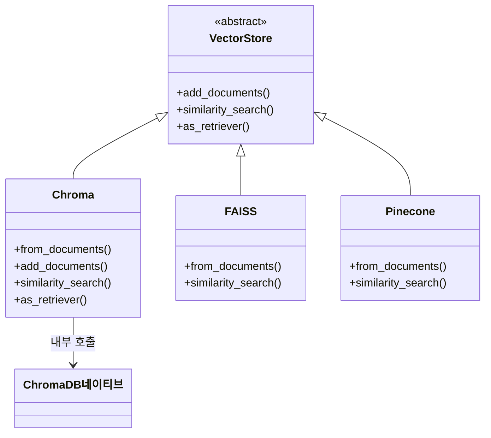
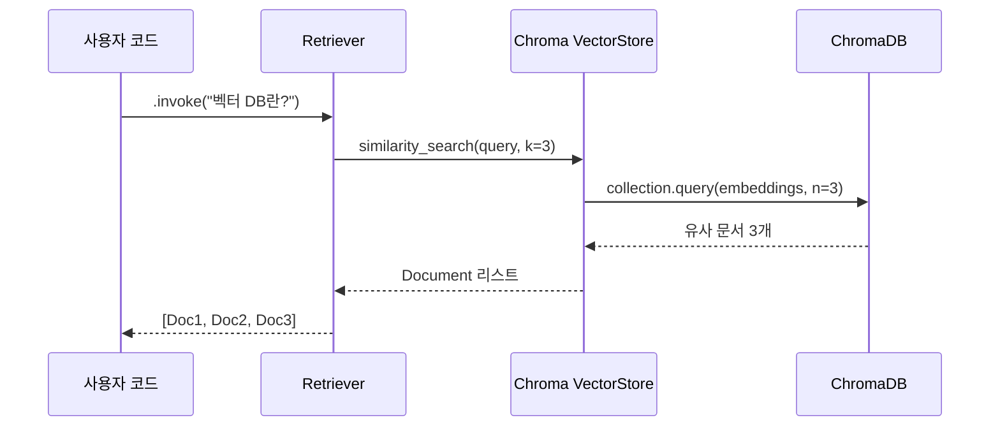
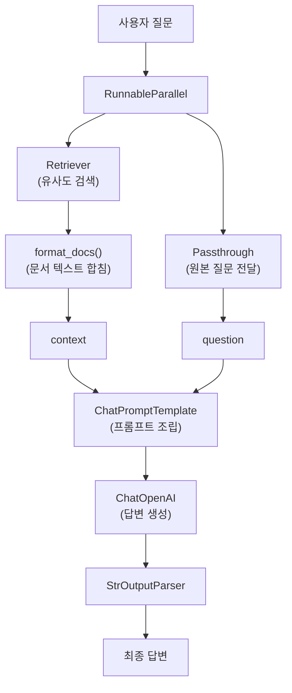

# LangChain × ChromaDB 통합 실습

> LangChain의 벡터스토어 추상화를 통해 ChromaDB를 RAG 파이프라인에 자연스럽게 연결하는 방법을 배웁니다

## 개요

이 섹션에서는 지금까지 배운 ChromaDB의 모든 기능을 LangChain 프레임워크와 통합하는 방법을 학습합니다. `langchain-chroma` 패키지의 `Chroma` 클래스를 활용하여 문서 인덱싱 맛보기부터 검색기(Retriever) 변환, 그리고 LCEL(LangChain Expression Language) 기반 RAG 체인 구축까지 한 번에 다룹니다.

**선수 지식**: [6.1 벡터 데이터베이스란](06-벡터-데이터베이스-기초-chromadb로-시작하기/01-벡터-데이터베이스란-왜-필요한가.md)에서 배운 벡터 유사도 검색 개념, [6.2 ChromaDB 시작하기](06-벡터-데이터베이스-기초-chromadb로-시작하기/02-chromadb-시작하기-설치와-기본-사용법.md)의 기본 CRUD 연산, [6.3 메타데이터와 필터링](06-벡터-데이터베이스-기초-chromadb로-시작하기/03-chromadb-메타데이터와-필터링.md)의 where 필터 문법, [6.4 커스텀 임베딩과 영속성](06-벡터-데이터베이스-기초-chromadb로-시작하기/04-chromadb-커스텀-임베딩과-영속성.md)의 임베딩 함수 연동 방법

**학습 목표**:
- `langchain-chroma` 패키지를 설치하고 `Chroma` 벡터스토어를 초기화할 수 있다
- `from_documents()`로 문서를 빠르게 인덱싱하는 기본 흐름을 이해한다
- `as_retriever()`로 검색기를 생성하고, 기본 유사도 검색을 수행할 수 있다
- LCEL 파이프 연산자(`|`)로 Chroma 검색기를 포함한 RAG 체인을 구축할 수 있다

## 왜 알아야 할까?

앞선 세션에서 ChromaDB의 네이티브 API — `collection.add()`, `collection.query()`, 메타데이터 필터링 — 를 충분히 다뤘는데요, 왜 또 다른 방법을 배워야 할까요?

실무에서 RAG 시스템을 구축할 때, 벡터 데이터베이스는 전체 파이프라인의 **한 부분**일 뿐입니다. 문서 로더, 텍스트 스플리터, 임베딩 모델, LLM, 프롬프트 템플릿 등 여러 컴포넌트가 유기적으로 연결되어야 하거든요. 만약 각 컴포넌트마다 서로 다른 API를 직접 호출한다면, 코드는 금세 스파게티가 됩니다.

LangChain의 **벡터스토어 추상화**는 이 문제를 해결합니다. ChromaDB든 FAISS든 Pinecone이든, 동일한 인터페이스(`add_documents()`, `similarity_search()`, `as_retriever()`)로 사용할 수 있죠. 마치 USB 포트처럼 — 어떤 장치를 꽂든 같은 방식으로 동작합니다.

특히 `as_retriever()`는 벡터스토어를 LangChain의 **Retriever 인터페이스**로 변환해주는데, 이것이 LCEL 체인의 파이프 연산자(`|`)와 결합되면 놀라울 정도로 간결한 RAG 파이프라인이 만들어집니다. 챕터 8에서 본격적으로 구축할 RAG 앱의 핵심 기반이 바로 여기에 있습니다.

## 핵심 개념

### 개념 1: langchain-chroma 패키지와 Chroma 클래스

> 💡 **비유**: ChromaDB 네이티브 API가 '자동차 엔진'이라면, `langchain-chroma`는 그 엔진을 자동차 프레임(LangChain)에 장착하는 **어댑터 키트**입니다. 엔진 자체는 같지만, 어댑터를 끼우면 핸들, 브레이크, 계기판(다른 LangChain 컴포넌트)과 자연스럽게 연결됩니다.

LangChain은 초기에 `langchain-community` 패키지 안에 Chroma 통합을 포함했지만, v0.2.9부터 이를 **별도의 파트너 패키지**인 `langchain-chroma`로 분리했습니다. 현재 최신 버전은 **1.1.0** (2025년 12월 출시)이며, Python 3.10 이상을 요구합니다.

```bash
# 설치 (chromadb + langchain-chroma를 함께 설치)
pip install -qU chromadb langchain-chroma langchain-openai
```

> 📊 **그림 1**: LangChain 벡터스토어 추상화 구조



`Chroma` 클래스는 [6.2](06-벡터-데이터베이스-기초-chromadb로-시작하기/02-chromadb-시작하기-설치와-기본-사용법.md)에서 배운 세 가지 클라이언트 모드를 모두 지원합니다:

```python
from langchain_chroma import Chroma
from langchain_openai import OpenAIEmbeddings

embeddings = OpenAIEmbeddings(model="text-embedding-3-small")

# 1) 인메모리 (테스트/프로토타이핑용)
vector_store = Chroma(
    collection_name="my_collection",
    embedding_function=embeddings,
)

# 2) 영구 저장 (로컬 개발용)
vector_store = Chroma(
    collection_name="my_collection",
    embedding_function=embeddings,
    persist_directory="./chroma_langchain_db",
)

# 3) 기존 ChromaDB 클라이언트 재사용
import chromadb
client = chromadb.PersistentClient(path="./chroma_langchain_db")
vector_store = Chroma(
    client=client,
    collection_name="my_collection",
    embedding_function=embeddings,
)
```

> ⚠️ **흔한 오해**: `langchain-community`의 `Chroma`와 `langchain-chroma`의 `Chroma`는 **다른 클래스**입니다. 이전 코드에서 `from langchain_community.vectorstores import Chroma`를 사용했다면, `from langchain_chroma import Chroma`로 변경하세요. 구버전은 더 이상 유지보수되지 않습니다.

### 개념 2: from_documents()로 빠르게 인덱싱하기 — 맛보기

> 💡 **비유**: 도서관에 책을 기증한다고 상상해보세요. ChromaDB 네이티브 API는 책을 한 권씩 직접 분류하고 서가에 꽂는 것이라면, `from_documents()`는 **책 상자를 통째로 사서에게 맡기는 것**입니다. 사서(LangChain)가 알아서 분류표를 붙이고, 적절한 서가에 꽂고, 색인 카드까지 만들어줍니다.

`Chroma.from_documents()`는 LangChain의 `Document` 객체 리스트를 받아서, 임베딩 생성과 ChromaDB 저장을 **한 번의 호출**로 처리합니다. 여기서는 LangChain-Chroma 통합이 어떻게 동작하는지 **기본 흐름만 맛보기**로 살펴보겠습니다.

```run:python
from langchain_chroma import Chroma
from langchain_openai import OpenAIEmbeddings
from langchain_core.documents import Document

# LangChain Document 객체 리스트 준비
documents = [
    Document(
        page_content="RAG는 외부 지식을 검색하여 LLM 응답을 보강하는 기법입니다.",
        metadata={"source": "chapter1", "topic": "rag_basics", "difficulty": 1}
    ),
    Document(
        page_content="ChromaDB는 오픈소스 벡터 데이터베이스로, 임베딩 저장과 유사도 검색을 지원합니다.",
        metadata={"source": "chapter6", "topic": "vector_db", "difficulty": 2}
    ),
    Document(
        page_content="HNSW 알고리즘은 그래프 기반 ANN 검색으로, 대부분의 벡터 DB에서 기본 인덱스입니다.",
        metadata={"source": "chapter6", "topic": "ann_algorithm", "difficulty": 3}
    ),
]

embeddings = OpenAIEmbeddings(model="text-embedding-3-small")

# 한 줄로 인덱싱 완료!
vector_store = Chroma.from_documents(
    documents=documents,           # Document 리스트
    embedding=embeddings,          # 임베딩 모델
    collection_name="rag_course",  # 컬렉션 이름
    persist_directory="./chroma_db",  # 영구 저장 경로 (선택)
)
print(f"총 {len(documents)}개 문서가 인덱싱되었습니다.")
```

```output
총 3개 문서가 인덱싱되었습니다.
```

여기서는 `from_documents()`의 **기본 사용법**만 확인했는데요. 실무에서는 텍스트 스플리터, 문서 로더와 결합하여 대량의 문서를 체계적으로 인덱싱해야 합니다. 이러한 **본격적인 인덱싱 파이프라인**은 [8.3 인덱싱 파이프라인 구축](08-기본-rag-파이프라인-구축-langchain으로-첫-rag-앱-만들기/03-인덱싱-파이프라인-구축-문서에서-벡터-db까지.md)에서 배치 처리, 중복 방지, 에러 핸들링까지 포함하여 깊이 있게 다룹니다.

### 개념 3: as_retriever()로 검색기 만들기

> 💡 **비유**: 벡터스토어가 거대한 **도서관 서가**라면, `as_retriever()`는 그 서가 앞에 **전문 사서**를 배치하는 것입니다. "이 질문과 비슷한 책 3권만 찾아주세요"라고 요청하면, 사서가 알아서 가장 관련 있는 문서를 골라줍니다.

`as_retriever()` 메서드는 벡터스토어를 LangChain의 **Retriever 인터페이스**로 변환합니다. 이 Retriever는 `.invoke(query)` 한 번으로 관련 문서를 가져오며, LCEL 체인에 바로 연결할 수 있습니다.

가장 기본적인 사용법은 **유사도 검색(Similarity Search)**입니다:

```python
# 가장 유사한 문서 k개를 반환 (기본 search_type)
retriever = vector_store.as_retriever(
    search_type="similarity",      # 기본값 — 생략 가능
    search_kwargs={"k": 3}         # 상위 3개 반환
)
docs = retriever.invoke("벡터 데이터베이스란?")

for doc in docs:
    print(doc.page_content[:60])
```

`search_type="similarity"`는 쿼리 임베딩과 코사인 유사도가 가장 높은 문서 k개를 반환하는, 가장 직관적인 검색 방식입니다. 대부분의 경우 이 기본값으로 충분합니다.

> 📊 **그림 2**: as_retriever()의 동작 흐름



> 💡 **알고 계셨나요?**: `as_retriever()`는 유사도 검색 외에도 MMR(Maximal Marginal Relevance) 검색, 유사도 점수 임계값 검색 등 다양한 `search_type`을 지원합니다. 각 검색 전략의 차이와 실무에서의 활용법은 [8.4 검색 전략과 최적화](08-기본-rag-파이프라인-구축-langchain으로-첫-rag-앱-만들기/04-검색-체인-구축-retriever와-프롬프트-설계.md)에서 체계적으로 비교합니다.

### 개념 4: 메타데이터 필터와 Retriever 결합

[6.3 메타데이터와 필터링](06-벡터-데이터베이스-기초-chromadb로-시작하기/03-chromadb-메타데이터와-필터링.md)에서 배운 `where` 필터를 LangChain Retriever에서도 그대로 사용할 수 있습니다. `search_kwargs`에 `filter` 키를 추가하면 됩니다.

```python
# 메타데이터 필터 + 유사도 검색
retriever = vector_store.as_retriever(
    search_type="similarity",
    search_kwargs={
        "k": 3,
        "filter": {"topic": "vector_db"}  # topic이 "vector_db"인 문서만
    }
)

# 복합 필터 (6.3에서 배운 $and, $or 연산자 활용)
retriever = vector_store.as_retriever(
    search_kwargs={
        "k": 5,
        "filter": {
            "$and": [
                {"difficulty": {"$lte": 3}},      # 난이도 3 이하
                {"source": {"$in": ["chapter5", "chapter6"]}}  # 5~6장만
            ]
        }
    }
)
```

> 🔥 **실무 팁**: 메타데이터 필터를 `as_retriever()` 시점에 고정하면, 해당 Retriever는 항상 같은 필터로 동작합니다. 사용자 입력에 따라 동적으로 필터를 바꾸고 싶다면, `similarity_search()` 메서드를 직접 호출하거나, Retriever를 매번 새로 생성하는 패턴을 사용하세요.

### 개념 5: LCEL로 RAG 체인 구축

> 💡 **비유**: LCEL의 파이프 연산자(`|`)는 공장의 **컨베이어 벨트**와 같습니다. 원재료(사용자 질문)가 벨트 위에 올라가면, 첫 번째 기계(Retriever)가 관련 문서를 꺼내 붙이고, 두 번째 기계(프롬프트 템플릿)가 형식을 맞추고, 세 번째 기계(LLM)가 최종 답변을 생성합니다. 각 기계는 독립적이지만, 벨트로 연결되어 하나의 파이프라인으로 동작하죠.

LangChain Expression Language(LCEL)는 `|` 연산자로 컴포넌트를 체인처럼 연결합니다. Retriever와 LLM을 연결하면 완전한 RAG 체인이 됩니다:

```python
from langchain_openai import ChatOpenAI
from langchain_core.prompts import ChatPromptTemplate
from langchain_core.output_parsers import StrOutputParser
from langchain_core.runnables import RunnablePassthrough

# 1) Retriever 준비 (기본 유사도 검색)
retriever = vector_store.as_retriever(
    search_kwargs={"k": 3}
)

# 2) 프롬프트 템플릿
prompt = ChatPromptTemplate.from_template("""
다음 컨텍스트를 기반으로 질문에 답변하세요.
컨텍스트에 없는 내용은 "정보가 부족합니다"라고 답하세요.

컨텍스트:
{context}

질문: {question}

답변:
""")

# 3) LLM
llm = ChatOpenAI(model="gpt-4o-mini", temperature=0)

# 4) 검색된 문서를 하나의 문자열로 합치는 헬퍼
def format_docs(docs: list) -> str:
    return "\n\n".join(doc.page_content for doc in docs)

# 5) LCEL RAG 체인 조립
rag_chain = (
    {"context": retriever | format_docs, "question": RunnablePassthrough()}
    | prompt
    | llm
    | StrOutputParser()
)

# 6) 실행
answer = rag_chain.invoke("ChromaDB에서 사용하는 기본 인덱스 알고리즘은?")
print(answer)
```

이 체인의 데이터 흐름을 다이어그램으로 정리하면:

> 📊 **그림 3**: LCEL RAG 체인의 데이터 흐름



## 실습: 직접 해보기

기술 블로그 Q&A 시스템을 만들어보겠습니다. 여러 주제의 블로그 글을 ChromaDB에 인덱싱하고, 유사도 검색으로 관련 문서를 찾은 뒤, LCEL 체인까지 완성합니다.

```python
"""
LangChain × ChromaDB 통합 실습
- 문서 인덱싱, 유사도 검색, 메타데이터 필터, RAG 체인 구축
"""

import os
from dotenv import load_dotenv
from langchain_chroma import Chroma
from langchain_openai import OpenAIEmbeddings, ChatOpenAI
from langchain_core.documents import Document
from langchain_core.prompts import ChatPromptTemplate
from langchain_core.output_parsers import StrOutputParser
from langchain_core.runnables import RunnablePassthrough

load_dotenv()  # .env에서 OPENAI_API_KEY 로드

# ──────────────────────────────────────────
# 1단계: 샘플 블로그 문서 준비
# ──────────────────────────────────────────
blog_posts = [
    Document(
        page_content="RAG(Retrieval-Augmented Generation)는 LLM이 외부 지식 소스를 검색하여 "
                     "더 정확하고 최신의 답변을 생성하도록 돕는 기법입니다. "
                     "2020년 Meta AI 연구팀이 처음 제안했습니다.",
        metadata={"author": "김철수", "category": "AI", "year": 2024}
    ),
    Document(
        page_content="RAG 시스템의 핵심은 검색(Retrieval) 단계입니다. "
                     "좋은 검색 결과 없이는 좋은 답변도 나올 수 없습니다. "
                     "벡터 유사도 검색이 가장 널리 사용되는 방법입니다.",
        metadata={"author": "이영희", "category": "AI", "year": 2024}
    ),
    Document(
        page_content="RAG의 장점은 LLM을 재학습하지 않고도 최신 정보를 제공할 수 있다는 것입니다. "
                     "기업 내부 문서, 기술 문서, FAQ 등을 실시간으로 검색하여 답변합니다.",
        metadata={"author": "박민수", "category": "AI", "year": 2025}
    ),
    Document(
        page_content="ChromaDB는 AI 네이티브 오픈소스 벡터 데이터베이스입니다. "
                     "Python에서 pip install chromadb 한 줄로 설치할 수 있고, "
                     "내장 임베딩 함수를 제공하여 별도 설정 없이 바로 사용 가능합니다.",
        metadata={"author": "김철수", "category": "Database", "year": 2025}
    ),
    Document(
        page_content="FAISS는 Meta에서 개발한 대규모 벡터 검색 라이브러리입니다. "
                     "GPU 가속을 지원하며, 수억 개의 벡터도 빠르게 검색할 수 있습니다. "
                     "프로덕션 환경에서 높은 처리량이 필요할 때 적합합니다.",
        metadata={"author": "이영희", "category": "Database", "year": 2024}
    ),
    Document(
        page_content="벡터 데이터베이스를 선택할 때는 데이터 규모, 검색 속도, "
                     "메타데이터 필터링 지원 여부, 클라우드/온프레미스 옵션을 고려해야 합니다. "
                     "소규모 프로젝트에는 ChromaDB, 대규모에는 Pinecone이나 Qdrant가 적합합니다.",
        metadata={"author": "박민수", "category": "Database", "year": 2025}
    ),
    Document(
        page_content="프롬프트 엔지니어링은 LLM에 입력하는 지시문을 최적화하는 기술입니다. "
                     "Zero-shot, Few-shot, Chain-of-Thought 등 다양한 기법이 있으며, "
                     "RAG와 결합하면 더욱 강력한 성능을 발휘합니다.",
        metadata={"author": "김철수", "category": "AI", "year": 2024}
    ),
]

# ──────────────────────────────────────────
# 2단계: from_documents()로 인덱싱 (맛보기)
# ──────────────────────────────────────────
embeddings = OpenAIEmbeddings(model="text-embedding-3-small")

# from_documents()의 기본 사용법 — 본격적인 인덱싱 파이프라인은 8.3에서!
vector_store = Chroma.from_documents(
    documents=blog_posts,
    embedding=embeddings,
    collection_name="tech_blog",
    persist_directory="./chroma_blog_db",
)
print(f"✅ {len(blog_posts)}개 문서 인덱싱 완료\n")

# ──────────────────────────────────────────
# 3단계: 유사도 검색으로 관련 문서 찾기
# ──────────────────────────────────────────
query = "RAG 시스템은 어떻게 동작하나요?"

# 기본 유사도 검색: 가장 비슷한 3개 반환
retriever = vector_store.as_retriever(
    search_type="similarity",     # 기본값
    search_kwargs={"k": 3}
)
results = retriever.invoke(query)

print("=" * 50)
print("📌 유사도 검색 결과 (상위 3개)")
print("=" * 50)
for i, doc in enumerate(results, 1):
    print(f"\n[{i}] ({doc.metadata['author']}, {doc.metadata['category']})")
    print(f"    {doc.page_content[:80]}...")

# ──────────────────────────────────────────
# 4단계: 메타데이터 필터 + 검색
# ──────────────────────────────────────────
filtered_retriever = vector_store.as_retriever(
    search_kwargs={
        "k": 3,
        "filter": {
            "$and": [
                {"category": "AI"},
                {"year": {"$gte": 2025}}
            ]
        }
    }
)
filtered_results = filtered_retriever.invoke("RAG의 장점")

print(f"\n{'=' * 50}")
print("📌 필터링 검색 (AI 카테고리 & 2025년 이후)")
print("=" * 50)
for i, doc in enumerate(filtered_results, 1):
    print(f"\n[{i}] ({doc.metadata['author']}, {doc.metadata['year']})")
    print(f"    {doc.page_content[:80]}...")

# ──────────────────────────────────────────
# 5단계: LCEL RAG 체인 구축
# ──────────────────────────────────────────
llm = ChatOpenAI(model="gpt-4o-mini", temperature=0)

prompt = ChatPromptTemplate.from_template("""
당신은 기술 블로그 Q&A 도우미입니다.
아래 블로그 글을 참고하여 질문에 친절하게 답변하세요.
참고한 글의 작성자를 함께 언급해주세요.

참고 블로그 글:
{context}

질문: {question}

답변:
""")

def format_docs(docs: list) -> str:
    """검색된 문서를 하나의 문자열로 포매팅"""
    formatted = []
    for doc in docs:
        author = doc.metadata.get("author", "알 수 없음")
        formatted.append(f"[{author}] {doc.page_content}")
    return "\n\n".join(formatted)

# LCEL 파이프라인 조립 (기본 유사도 검색 사용)
rag_chain = (
    {"context": retriever | format_docs, "question": RunnablePassthrough()}
    | prompt
    | llm
    | StrOutputParser()
)

# RAG 체인 실행
answer = rag_chain.invoke("RAG 시스템에서 검색이 중요한 이유는 무엇인가요?")
print(f"\n{'=' * 50}")
print("🤖 RAG 체인 답변")
print("=" * 50)
print(answer)

# 정리 (실습이 끝나면 디렉토리 삭제 가능)
# import shutil
# shutil.rmtree("./chroma_blog_db")
```

```output
✅ 7개 문서 인덱싱 완료

==================================================
📌 유사도 검색 결과 (상위 3개)
==================================================

[1] (이영희, AI)
    RAG 시스템의 핵심은 검색(Retrieval) 단계입니다. 좋은 검색 결과 없이는 좋은 답변도 나올 수 없습니다...

[2] (김철수, AI)
    RAG(Retrieval-Augmented Generation)는 LLM이 외부 지식 소스를 검색하여 더 정확하고 최신의 답변을 생...

[3] (박민수, AI)
    RAG의 장점은 LLM을 재학습하지 않고도 최신 정보를 제공할 수 있다는 것입니다. 기업 내부 문서, 기술 문...

==================================================
📌 필터링 검색 (AI 카테고리 & 2025년 이후)
==================================================

[1] (박민수, 2025)
    RAG의 장점은 LLM을 재학습하지 않고도 최신 정보를 제공할 수 있다는 것입니다. 기업 내부 문서, 기술 문...

==================================================
🤖 RAG 체인 답변
==================================================
RAG 시스템에서 검색은 가장 핵심적인 단계입니다. 이영희 님의 글에서 잘 설명하고 있듯이, "좋은 검색 결과 없이는 좋은 답변도 나올 수 없습니다." RAG는 외부 지식 소스를 검색하여 LLM의 응답을 보강하는 기법이므로, 검색 품질이 곧 최종 답변의 품질을 결정합니다.
```

실습 결과에서 확인할 수 있듯이:
- **유사도 검색**: 쿼리와 가장 관련 있는 RAG 문서 3개가 정확히 반환됩니다
- **필터링 검색**: 조건에 맞는 문서만 정확히 반환됩니다
- **RAG 체인**: 검색 결과를 LLM이 참고하여 근거 있는 답변을 생성합니다

> 💡 위 실습에서는 기본 유사도 검색만 사용했는데요, "비슷한 문서만 뭉쳐서 나오는 게 아쉽다"는 느낌이 드시나요? [8.4 검색 전략과 최적화](08-기본-rag-파이프라인-구축-langchain으로-첫-rag-앱-만들기/04-검색-체인-구축-retriever와-프롬프트-설계.md)에서 MMR(다양성 검색), 유사도 임계값 검색 등 다양한 `search_type`을 비교하며, 상황에 맞는 최적의 검색 전략을 선택하는 방법을 배웁니다.

## 더 깊이 알아보기

### LangChain 벡터스토어 추상화의 탄생

LangChain의 창시자 **Harrison Chase**는 2022년 말에 LangChain을 시작했는데요, 초기에는 벡터 검색을 위해 각 데이터베이스의 API를 직접 호출하는 코드를 작성해야 했습니다. FAISS, Pinecone, Weaviate 등 새로운 벡터 DB가 매달 등장하면서, 매번 코드를 바꿔야 하는 문제가 있었죠.

이 경험에서 **VectorStore 추상 클래스**가 탄생했습니다. `add_documents()`, `similarity_search()`, `as_retriever()` 같은 공통 인터페이스를 정의하고, 각 벡터 DB는 이 인터페이스를 구현하면 되는 것이죠. 소프트웨어 공학에서 말하는 **어댑터 패턴(Adapter Pattern)**의 전형적인 사례입니다.

2024년부터 LangChain은 통합 패키지를 `langchain-community`에서 **파트너 패키지**(예: `langchain-chroma`, `langchain-pinecone`)로 분리하기 시작했습니다. 이는 각 벡터 DB 팀이 자체적으로 LangChain 통합을 관리할 수 있게 해주어, 더 빠른 업데이트와 버그 수정을 가능하게 합니다.

### MMR — 이름만 알아두세요

앞서 유사도 검색 결과에서 RAG 관련 문서만 3개 뭉쳐서 나온 것을 보셨는데요. 이렇게 비슷한 결과만 반복되는 문제를 해결하기 위해 **MMR(Maximal Marginal Relevance)**이라는 검색 전략이 있습니다. 1998년 카네기 멜론 대학교의 **Jaime Carbonell**과 **Jade Goldstein**이 제안한 방법으로, 원래 텍스트 요약에서 중복 문장을 피하기 위해 고안되었는데 벡터 검색에서도 효과적이라 RAG의 핵심 검색 전략 중 하나가 되었습니다.

핵심 아이디어는 간단합니다: "쿼리와 관련있되, 이미 뽑힌 문서와는 다른 것을 우선 선택한다." LangChain에서는 `search_type="mmr"`로 간단히 사용할 수 있는데, 구체적인 사용법과 파라미터 튜닝은 [8.4 검색 전략과 최적화](08-기본-rag-파이프라인-구축-langchain으로-첫-rag-앱-만들기/04-검색-체인-구축-retriever와-프롬프트-설계.md)에서 자세히 다룹니다.

## 흔한 오해와 팁

> ⚠️ **흔한 오해**: "`from_documents()`를 호출할 때마다 기존 데이터에 추가된다" — 사실이 아닙니다. `persist_directory`에 이미 데이터가 있어도, `from_documents()`는 **새 컬렉션을 생성**하거나 같은 이름의 컬렉션에 문서를 추가합니다. 같은 문서를 중복 추가하지 않으려면 고유한 `ids`를 지정하거나, 기존 벡터스토어를 `Chroma(persist_directory=...)` 생성자로 로드한 뒤 `add_documents()`를 사용하세요. 이러한 배치 인덱싱의 베스트 프랙티스는 [8.3](08-기본-rag-파이프라인-구축-langchain으로-첫-rag-앱-만들기/03-인덱싱-파이프라인-구축-문서에서-벡터-db까지.md)에서 자세히 배웁니다.

> 💡 **알고 계셨나요?**: LangChain의 `Chroma` 래퍼 내부에서는 ChromaDB 네이티브의 `collection.add()`와 `collection.query()`를 그대로 호출합니다. 즉, LangChain을 거치더라도 성능 오버헤드는 거의 없습니다. LangChain이 해주는 핵심 역할은 `Document` 객체의 `page_content`와 `metadata`를 ChromaDB가 기대하는 형식(`documents`, `metadatas`, `ids`)으로 자동 변환해주는 것입니다.

> 🔥 **실무 팁**: 프로토타이핑에서는 `from_documents()`의 간편함을 활용하고, 프로덕션에서는 `Chroma(persist_directory=...)`로 벡터스토어를 먼저 생성한 뒤 `add_documents()`로 배치 추가하는 **2단계 접근법**을 추천합니다. 대량 인덱싱 중 오류가 발생해도 이미 추가된 데이터가 보존되거든요. 이 패턴은 [8.3](08-기본-rag-파이프라인-구축-langchain으로-첫-rag-앱-만들기/03-인덱싱-파이프라인-구축-문서에서-벡터-db까지.md)에서 실전 예제와 함께 다룹니다.

## 핵심 정리

| 개념 | 설명 |
|------|------|
| `langchain-chroma` | ChromaDB의 공식 LangChain 파트너 패키지. `from langchain_chroma import Chroma`로 사용 |
| `Chroma()` 생성자 | 기존 컬렉션 연결. `persist_directory`, `client`, `host` 등으로 초기화 |
| `from_documents()` | Document 리스트 → 임베딩 → 저장을 한 번에 처리. 빠른 프로토타이핑에 적합 (심화: [8.3](08-기본-rag-파이프라인-구축-langchain으로-첫-rag-앱-만들기/03-인덱싱-파이프라인-구축-문서에서-벡터-db까지.md)) |
| `as_retriever()` | 벡터스토어를 LangChain Retriever 인터페이스로 변환. LCEL 체인에 연결 가능 |
| `search_type="similarity"` | 기본 유사도 검색. 쿼리와 가장 가까운 k개 반환 |
| `search_kwargs={"filter": {...}}` | 메타데이터 필터와 벡터 검색 결합. ChromaDB where 문법 사용 |
| 다양한 search_type | MMR, 점수 임계값 등 고급 검색 전략 → [8.4](08-기본-rag-파이프라인-구축-langchain으로-첫-rag-앱-만들기/04-검색-체인-구축-retriever와-프롬프트-설계.md)에서 상세 비교 |
| LCEL RAG 체인 | `retriever \| format_docs` → `prompt` → `llm` → `output_parser` 파이프라인 |

## 다음 섹션 미리보기

이것으로 **챕터 6: 벡터 데이터베이스 기초**를 모두 마쳤습니다! ChromaDB의 기본 개념부터 LangChain 통합까지 완전히 익히셨는데요. 다음 [챕터 7: 벡터 데이터베이스 심화](07-벡터-데이터베이스-심화-faiss-pinecone-qdrant-비교/01-faiss-대규모-벡터-검색의-표준.md)에서는 ChromaDB를 넘어서 **FAISS, Pinecone, Qdrant** 등 다양한 벡터 데이터베이스를 비교합니다. 각각의 장단점, 적합한 사용 시나리오, 그리고 프로덕션 환경에서의 선택 기준을 다루면서, 여러분의 RAG 프로젝트에 가장 적합한 벡터 DB를 선택하는 안목을 키워보겠습니다.

## 참고 자료

- [LangChain Chroma 통합 공식 문서](https://docs.langchain.com/oss/python/integrations/vectorstores/chroma) — `Chroma` 클래스의 초기화, 검색, Retriever 설정 등 전체 API 레퍼런스
- [langchain-chroma PyPI 패키지](https://pypi.org/project/langchain-chroma/) — 최신 버전 정보와 설치 가이드, 의존성 확인
- [ChromaDB 공식 GitHub 리포지토리](https://github.com/chroma-core/chroma) — ChromaDB 소스 코드, 이슈 트래커, 릴리즈 노트
- [Chroma Cookbook — LangChain Retriever 예제](https://cookbook.chromadb.dev/integrations/langchain/retrievers/) — ChromaDB 공식 쿡북의 LangChain Retriever 사용 패턴
- [LangChain RAG 공식 문서](https://docs.langchain.com/oss/python/langchain/rag) — LCEL 기반 RAG 체인 구축 가이드

---
### 🔗 Related Sessions
- [vector_database](../06-벡터-데이터베이스-기초-chromadb로-시작하기/01-벡터-데이터베이스란-왜-필요한가.md) (prerequisite)
- [ann](../06-벡터-데이터베이스-기초-chromadb로-시작하기/01-벡터-데이터베이스란-왜-필요한가.md) (prerequisite)
- [hnsw](../06-벡터-데이터베이스-기초-chromadb로-시작하기/01-벡터-데이터베이스란-왜-필요한가.md) (prerequisite)
- [ephemeralclient](../06-벡터-데이터베이스-기초-chromadb로-시작하기/02-chromadb-시작하기-설치와-기본-사용법.md) (prerequisite)
- [persistentclient](../06-벡터-데이터베이스-기초-chromadb로-시작하기/02-chromadb-시작하기-설치와-기본-사용법.md) (prerequisite)
- [httpclient](../06-벡터-데이터베이스-기초-chromadb로-시작하기/02-chromadb-시작하기-설치와-기본-사용법.md) (prerequisite)
- [where_filter](../06-벡터-데이터베이스-기초-chromadb로-시작하기/03-chromadb-메타데이터와-필터링.md) (prerequisite)
- [mmr](../10-검색-품질-향상-유사도-검색과-메타데이터-필터링/02-mmr-관련성과-다양성의-균형.md) (prerequisite)
- [lcel](../08-기본-rag-파이프라인-구축-langchain으로-첫-rag-앱-만들기/01-langchain-v1-핵심-개념과-설정.md) (prerequisite)
