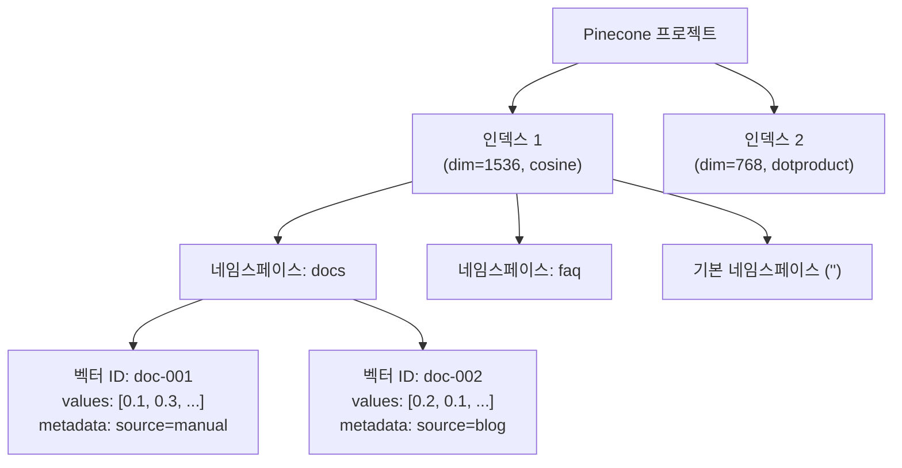
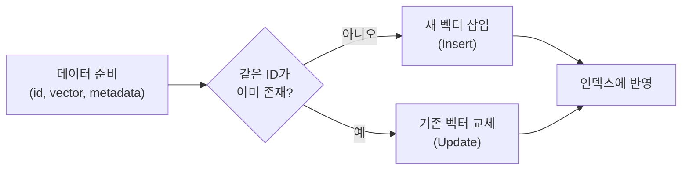
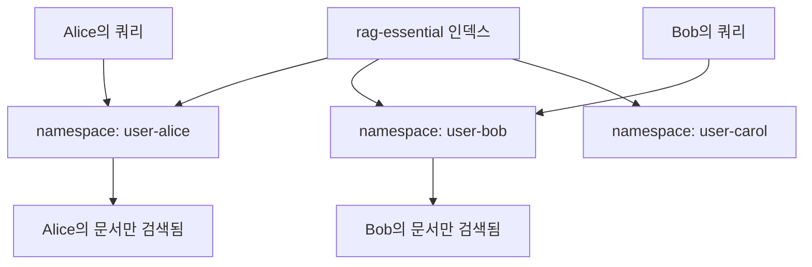
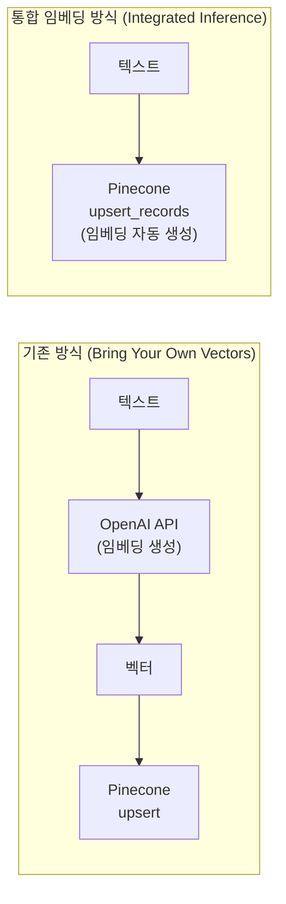

# Pinecone — 관리형 벡터 데이터베이스

> Pinecone의 서버리스 아키텍처로 벡터 인덱스를 생성하고, 데이터를 Upsert/Query/Delete하며, 네임스페이스와 통합 임베딩까지 활용하는 방법을 배웁니다.

## 개요

이 세션에서는 완전 관리형(Fully Managed) 벡터 데이터베이스인 Pinecone을 다룹니다. 앞서 [7.1 FAISS — 대규모 벡터 검색의 표준](07-벡터-데이터베이스-심화-faiss-pinecone-qdrant-비교/01-faiss-대규모-벡터-검색의-표준.md)에서 직접 인덱스를 생성하고, 메모리에 올리고, 파일로 저장하는 **자체 운영(Self-hosted)** 방식을 경험했는데요. 이번에는 인프라 관리 없이 API 호출만으로 벡터를 저장하고 검색하는 **클라우드 관리형** 접근법을 배웁니다.

**선수 지식**: FAISS의 인덱스 개념(IndexFlatL2, IndexIVFFlat 등), 벡터 유사도 검색의 기본 원리, 임베딩 차원(dimension)과 메트릭(metric)의 의미

**학습 목표**:
- Pinecone 계정 생성부터 API 키 설정까지의 초기 셋업을 완료할 수 있다
- 서버리스 인덱스를 생성하고, dimension/metric/spec 옵션을 이해한다
- Upsert, Query, Delete 연산을 Python SDK로 수행할 수 있다
- 네임스페이스(Namespace)를 활용한 데이터 파티셔닝을 구현할 수 있다
- Pinecone Inference(통합 임베딩/리랭킹)의 개념과 활용법을 이해한다

## 왜 알아야 할까?

FAISS는 강력하지만, 결국 여러분의 서버 위에서 돌아갑니다. 인덱스 파일 백업은? 서버가 죽으면? 트래픽이 갑자기 10배로 늘면? 이런 운영 문제를 직접 해결해야 하죠.

Pinecone은 이 모든 인프라 부담을 없애줍니다. AWS에서 DB를 직접 설치하는 것과 RDS를 쓰는 것의 차이와 비슷한데요. 실제로 프로덕션 RAG 시스템을 운영하는 많은 기업이 Pinecone을 선택하는 이유도 바로 **"벡터 검색에만 집중하고, 나머지는 맡기자"**라는 철학 때문입니다.

특히 2024년 이후 Pinecone은 **서버리스(Serverless)** 아키텍처를 전면 도입하면서, 사용한 만큼만 비용을 내는 모델로 전환했습니다. 무료 Starter 플랜으로도 2GB 스토리지와 5개 인덱스를 사용할 수 있어, 학습과 프로토타이핑에 부담이 없습니다.

## 핵심 개념

### 개념 1: Pinecone의 아키텍처 — "벡터 전용 클라우드 창고"

> 💡 **비유**: FAISS가 여러분 집 차고에 설치한 **개인 창고**라면, Pinecone은 전문 물류 회사가 운영하는 **클라우드 창고 서비스**입니다. 물건(벡터)을 맡기면 알아서 분류하고, 찾아달라고 하면 즉시 꺼내줍니다. 창고 확장, 보안, 백업은 모두 물류 회사가 담당하죠.

Pinecone의 핵심 아키텍처를 이해하려면 세 가지 계층을 알아야 합니다:

| 계층 | 역할 | 비유 |
|------|------|------|
| **Index** | 벡터가 저장되는 최상위 컨테이너 | 창고 건물 |
| **Namespace** | 인덱스 내부의 논리적 파티션 | 창고 안의 구역(A동, B동) |
| **Vector** | ID + 값 + 메타데이터로 구성된 개별 레코드 | 구역 안에 보관된 물건 |

> 📊 **그림 1**: Pinecone의 계층 구조



**서버리스(Serverless) vs 팟 기반(Pod-based)**

Pinecone은 현재 두 가지 배포 모델을 제공합니다:

- **서버리스(Serverless)**: 2024년부터 기본값. 사용량 기반 과금, 자동 확장. 신규 사용자에게 권장
- **팟 기반(Pod-based)**: 전용 컴퓨팅 자원 할당. 일관된 성능이 필요한 엔터프라이즈용

이 세션에서는 **서버리스** 인덱스를 기준으로 진행합니다.

### 개념 2: 계정 생성과 API 키 설정

Pinecone을 사용하려면 먼저 [Pinecone 콘솔](https://app.pinecone.io/)에서 계정을 만들어야 합니다. 무료 Starter 플랜으로 시작할 수 있습니다.

**Starter(무료) 플랜 주요 제한:**
- 인덱스: 최대 5개 (각 100개 네임스페이스)
- 스토리지: 2GB (약 30만 레코드)
- 쓰기: 월 200만 Write Units
- 읽기: 월 100만 Read Units
- 리전: AWS us-east-1만 사용 가능
- 3주간 비활성 시 인덱스 일시 중지

API 키를 발급받은 후, 환경 변수로 설정합니다:

```python
# .env 파일에 API 키 저장 (코드에 직접 하드코딩 금지!)
# PINECONE_API_KEY=pcsk_xxxxxxx...

import os
from dotenv import load_dotenv

load_dotenv()

# API 키 확인
api_key = os.getenv("PINECONE_API_KEY")
assert api_key is not None, "PINECONE_API_KEY 환경 변수를 설정하세요"
```

### 개념 3: 인덱스 생성 — dimension, metric, spec

> 💡 **비유**: 인덱스를 만드는 건 새 엑셀 파일을 만들 때 **열(column) 개수와 정렬 기준을 정하는 것**과 같습니다. dimension은 열 개수, metric은 "어떤 기준으로 비슷한 행을 찾을지"를 결정합니다. 한번 정하면 나중에 바꿀 수 없으니 신중하게!

```python
from pinecone import Pinecone, ServerlessSpec

# 클라이언트 초기화
pc = Pinecone(api_key=os.getenv("PINECONE_API_KEY"))

# 서버리스 인덱스 생성
pc.create_index(
    name="rag-essential",          # 인덱스 이름 (고유해야 함)
    dimension=1536,                # OpenAI text-embedding-3-small 차원
    metric="cosine",               # 유사도 메트릭: cosine | euclidean | dotproduct
    spec=ServerlessSpec(
        cloud="aws",               # 클라우드 제공자
        region="us-east-1"         # 리전 (Starter는 us-east-1만 가능)
    ),
    deletion_protection="disabled" # 실수 방지 삭제 보호 (프로덕션에서는 "enabled")
)
```

**세 가지 메트릭의 선택 기준:**

| 메트릭 | 수식 | 사용 시점 |
|--------|------|-----------|
| `cosine` | $\cos(\theta) = \frac{A \cdot B}{\|A\| \|B\|}$ | 대부분의 임베딩 모델 (OpenAI, Cohere 등). 벡터 크기 무관, 방향만 비교 |
| `euclidean` | $d = \sqrt{\sum(a_i - b_i)^2}$ | 벡터 크기가 의미 있을 때. 이미지 임베딩에서 간혹 사용 |
| `dotproduct` | $d = \sum a_i \cdot b_i$ | 정규화된 벡터에서 cosine과 동일. MRL(Matryoshka) 임베딩에 사용 |

> ⚠️ **흔한 오해**: "metric은 아무거나 골라도 검색은 된다"고 생각하기 쉽지만, **임베딩 모델이 학습된 메트릭과 다른 메트릭을 사용하면 검색 품질이 크게 떨어집니다**. OpenAI 임베딩은 cosine, Sentence Transformers는 모델마다 다르니 반드시 모델 문서를 확인하세요.

인덱스가 생성된 후, 연결하여 사용합니다:

```run:python
# 인덱스 정보 확인
index = pc.Index("rag-essential")
stats = index.describe_index_stats()
print(f"인덱스 차원: {stats.dimension}")
print(f"전체 벡터 수: {stats.total_vector_count}")
print(f"네임스페이스: {stats.namespaces}")
```

```output
인덱스 차원: 1536
전체 벡터 수: 0
네임스페이스: {}
```

### 개념 4: Upsert — 벡터 삽입과 업데이트

> 💡 **비유**: "Upsert"는 **Up**date + In**sert**의 합성어입니다. 택배 보관함에 물건을 넣을 때, 빈 칸이면 새로 넣고(Insert), 이미 물건이 있으면 교체(Update)하는 것과 같습니다. 같은 ID로 다시 upsert하면 이전 벡터가 덮어씌워집니다.

> 📊 **그림 2**: Upsert 연산의 동작 흐름



```python
# 단일 벡터 upsert
index.upsert(
    vectors=[
        {
            "id": "doc-001",
            "values": [0.1, 0.2, 0.3, ...],  # 1536차원 벡터
            "metadata": {
                "source": "user_manual",
                "category": "setup",
                "page": 15
            }
        }
    ],
    namespace="documents"  # 네임스페이스 지정 (없으면 자동 생성)
)

# 배치 upsert (대량 데이터 처리 시)
import random

vectors_batch = [
    {
        "id": f"doc-{i:04d}",
        "values": [random.random() for _ in range(1536)],
        "metadata": {"source": "batch", "index": i}
    }
    for i in range(100)
]

# 100개씩 나누어 upsert (권장 배치 크기: 100~200)
for i in range(0, len(vectors_batch), 100):
    batch = vectors_batch[i:i + 100]
    index.upsert(vectors=batch, namespace="documents")
```

> 🔥 **실무 팁**: Pinecone의 upsert는 한 번에 최대 **1000개 벡터** 또는 **2MB**까지 가능합니다. 대규모 데이터를 넣을 때는 100~200개씩 배치를 나누고, `pinecone[grpc]` 옵션을 설치하면 gRPC 전송으로 성능이 향상됩니다.

### 개념 5: Query — 유사도 검색

Query는 Pinecone의 핵심 연산입니다. 쿼리 벡터를 보내면, 인덱스에서 가장 유사한 벡터를 찾아 돌려줍니다.

```python
# 기본 쿼리 — top_k개의 유사 벡터 반환
results = index.query(
    vector=query_embedding,       # 쿼리 벡터 (1536차원)
    top_k=5,                      # 반환할 결과 수
    namespace="documents",        # 검색할 네임스페이스
    include_metadata=True,        # 메타데이터 포함 여부
    include_values=False          # 벡터 값 포함 여부 (보통 False)
)

# 결과 구조
for match in results.matches:
    print(f"ID: {match.id}, Score: {match.score:.4f}")
    print(f"  Metadata: {match.metadata}")
```

**메타데이터 필터링** — 벡터 유사도 검색에 조건을 추가할 수 있습니다:

```python
# 메타데이터 필터와 함께 쿼리
results = index.query(
    vector=query_embedding,
    top_k=5,
    namespace="documents",
    include_metadata=True,
    filter={
        "category": {"$eq": "setup"},      # category가 "setup"인 것만
        "page": {"$gte": 10, "$lte": 50}   # page가 10~50 사이인 것만
    }
)
```

주요 필터 연산자:

| 연산자 | 의미 | 예시 |
|--------|------|------|
| `$eq` | 같음 | `{"status": {"$eq": "active"}}` |
| `$ne` | 같지 않음 | `{"status": {"$ne": "deleted"}}` |
| `$gt`, `$gte` | 초과, 이상 | `{"score": {"$gte": 0.8}}` |
| `$lt`, `$lte` | 미만, 이하 | `{"year": {"$lt": 2024}}` |
| `$in` | 목록 포함 | `{"tag": {"$in": ["ai", "ml"]}}` |
| `$and`, `$or` | 논리 조합 | 최상위 레벨에서만 사용 가능 |

### 개념 6: Delete — 데이터 삭제

```python
# 특정 ID 삭제
index.delete(ids=["doc-001", "doc-002"], namespace="documents")

# 메타데이터 필터로 삭제 (서버리스 인덱스에서 지원)
index.delete(
    filter={"category": {"$eq": "deprecated"}},
    namespace="documents"
)

# 네임스페이스 전체 삭제
index.delete(delete_all=True, namespace="old-data")
```

### 개념 7: 네임스페이스 — 멀티테넌트 데이터 격리

> 💡 **비유**: 네임스페이스는 하나의 아파트 건물(인덱스) 안에 있는 **각 세대(호수)**와 같습니다. 201호의 물건은 301호에서 보이지 않고, 각 세대를 독립적으로 관리할 수 있죠. 인덱스를 따로 만들 필요 없이 하나의 인덱스에서 데이터를 논리적으로 분리할 수 있습니다.

> 📊 **그림 3**: 네임스페이스를 활용한 멀티테넌트 구조



네임스페이스의 핵심 특성:

1. **격리(Isolation)**: 한 네임스페이스의 쿼리는 다른 네임스페이스의 데이터를 절대 반환하지 않음
2. **자동 생성**: upsert 시 네임스페이스가 없으면 자동으로 만들어짐
3. **개별 삭제**: 네임스페이스 단위로 전체 삭제 가능
4. **Starter 제한**: 무료 플랜은 인덱스당 최대 100개 네임스페이스

```run:python
# 사용자별로 다른 네임스페이스에 데이터 저장
users = ["alice", "bob", "carol"]
for user in users:
    index.upsert(
        vectors=[{"id": f"{user}-doc-1", "values": embedding, "metadata": {"owner": user}}],
        namespace=f"user-{user}"
    )

# 특정 사용자의 데이터만 검색
alice_results = index.query(
    vector=query_embedding,
    top_k=3,
    namespace="user-alice"  # Alice의 문서만 검색
)
print(f"Alice의 검색 결과: {len(alice_results.matches)}건")
```

```output
Alice의 검색 결과: 3건
```

### 개념 8: Pinecone Inference — 임베딩과 리랭킹 통합

Pinecone은 자체 호스팅하는 임베딩 모델과 리랭킹 모델을 제공합니다. 외부 임베딩 API(OpenAI 등) 없이도 텍스트를 벡터로 변환하고, 검색 결과를 재정렬할 수 있죠.

**방법 1: Standalone Inference — 임베딩 직접 생성**

```python
from pinecone import Pinecone

pc = Pinecone(api_key=os.getenv("PINECONE_API_KEY"))

# Pinecone 호스팅 모델로 임베딩 생성
embeddings = pc.inference.embed(
    model="multilingual-e5-large",     # 다국어 지원 임베딩 모델
    inputs=["RAG는 검색 증강 생성입니다", "벡터 데이터베이스는 유사도 검색에 특화됩니다"],
    parameters={"input_type": "passage"}  # "passage" 또는 "query"
)

print(f"임베딩 차원: {len(embeddings.data[0].values)}")
print(f"생성된 임베딩 수: {len(embeddings.data)}")
```

**방법 2: Integrated Inference — 인덱스에 모델 통합**

이 방법은 텍스트를 직접 upsert하면 Pinecone이 알아서 임베딩을 생성해줍니다:

```python
# 통합 임베딩 인덱스 생성
pc.create_index_for_model(
    name="rag-integrated",
    cloud="aws",
    region="us-east-1",
    embed={
        "model": "multilingual-e5-large",   # 사용할 임베딩 모델
        "field_map": {"text": "chunk_text"}  # 어떤 필드를 임베딩할지 매핑
    }
)

# 텍스트를 직접 upsert — 임베딩 자동 생성!
integrated_index = pc.Index("rag-integrated")
integrated_index.upsert_records(
    namespace="docs",
    records=[
        {
            "id": "rec-001",
            "chunk_text": "RAG는 외부 지식을 활용하여 LLM의 응답을 개선합니다.",
            "category": "concept"
        },
        {
            "id": "rec-002",
            "chunk_text": "벡터 데이터베이스는 고차원 벡터를 효율적으로 저장합니다.",
            "category": "database"
        }
    ]
)
```

> 📊 **그림 4**: 기존 방식 vs 통합 임베딩 방식 비교



**방법 3: 리랭킹(Reranking)**

검색 결과의 순서를 재정렬하여 더 관련성 높은 문서를 상위에 올리는 기법입니다. Pinecone Inference는 자체 리랭킹 모델을 제공하여, 벡터 유사도만으로는 놓칠 수 있는 의미적 관련성을 잡아줍니다. 리랭킹의 원리와 다양한 도구(Cohere Rerank 등)는 [Ch12 — 리랭킹](12-리랭킹으로-검색-정확도-높이기-cohere-rerank-활용/01-리랭킹의-원리-왜-초기-검색으로는-부족한가.md)에서 자세히 다루니, 여기서는 Pinecone에서의 사용법에 집중하겠습니다.

```python
# 검색 결과를 리랭킹으로 재정렬
reranked = pc.inference.rerank(
    model="pinecone-rerank-v0",     # Pinecone 리랭킹 모델
    query="RAG 시스템의 핵심 구성 요소는?",
    documents=[
        "RAG는 Retrieval-Augmented Generation의 약자입니다.",
        "벡터 DB, 임베딩 모델, LLM이 RAG의 핵심 구성 요소입니다.",
        "Python은 범용 프로그래밍 언어입니다."
    ],
    top_n=2,                        # 상위 N개만 반환
    return_documents=True
)

for item in reranked.data:
    print(f"Score: {item.score:.4f} | {item.document.text[:50]}")
```

> 💡 **알고 계셨나요?**: Pinecone Inference의 Starter 플랜에서는 매월 **500만 토큰의 임베딩**과 **500회의 리랭킹** 요청이 무료로 제공됩니다. 별도의 OpenAI API 키 없이도 RAG 프로토타입을 만들 수 있어요!

## 실습: 직접 해보기

이제 FAISS와 동일한 시나리오를 Pinecone으로 구현해봅시다. 간단한 FAQ 검색 시스템을 만들어보겠습니다.

```python
"""
Pinecone을 활용한 FAQ 검색 시스템
필요 패키지: pip install pinecone python-dotenv langchain-pinecone langchain-openai
"""

import os
from dotenv import load_dotenv
from pinecone import Pinecone, ServerlessSpec
from langchain_openai import OpenAIEmbeddings
from langchain_pinecone import PineconeVectorStore
from langchain_core.documents import Document

load_dotenv()

# ──────────────────────────────
# 1단계: Pinecone 클라이언트 초기화
# ──────────────────────────────
pc = Pinecone(api_key=os.getenv("PINECONE_API_KEY"))

INDEX_NAME = "faq-search"
DIMENSION = 1536        # text-embedding-3-small의 차원
NAMESPACE = "ko-faq"    # 한국어 FAQ 전용 네임스페이스

# ──────────────────────────────
# 2단계: 인덱스 생성 (이미 존재하면 건너뜀)
# ──────────────────────────────
existing_indexes = [idx.name for idx in pc.list_indexes()]
if INDEX_NAME not in existing_indexes:
    pc.create_index(
        name=INDEX_NAME,
        dimension=DIMENSION,
        metric="cosine",
        spec=ServerlessSpec(cloud="aws", region="us-east-1")
    )
    print(f"인덱스 '{INDEX_NAME}' 생성 완료")
else:
    print(f"인덱스 '{INDEX_NAME}' 이미 존재")

# ──────────────────────────────
# 3단계: FAQ 데이터 준비
# ──────────────────────────────
faq_data = [
    Document(
        page_content="RAG는 Retrieval-Augmented Generation의 약자로, "
                     "외부 지식 소스에서 관련 정보를 검색하여 LLM의 응답을 보강하는 기법입니다.",
        metadata={"category": "concept", "difficulty": "beginner"}
    ),
    Document(
        page_content="벡터 데이터베이스는 고차원 벡터를 효율적으로 저장하고, "
                     "코사인 유사도 등으로 유사한 벡터를 빠르게 검색하는 특수 데이터베이스입니다.",
        metadata={"category": "database", "difficulty": "beginner"}
    ),
    Document(
        page_content="청킹(Chunking)은 긴 문서를 작은 텍스트 조각으로 나누는 과정입니다. "
                     "적절한 청크 크기는 보통 200~1000 토큰 사이입니다.",
        metadata={"category": "preprocessing", "difficulty": "intermediate"}
    ),
    Document(
        page_content="임베딩 모델은 텍스트를 고차원 벡터로 변환합니다. "
                     "OpenAI의 text-embedding-3-small은 1536차원 벡터를 생성합니다.",
        metadata={"category": "embedding", "difficulty": "beginner"}
    ),
    Document(
        page_content="하이브리드 검색은 키워드 기반 BM25 검색과 벡터 유사도 검색을 결합하여 "
                     "검색 품질을 높이는 기법입니다.",
        metadata={"category": "search", "difficulty": "advanced"}
    ),
]

# ──────────────────────────────
# 4단계: LangChain + Pinecone 벡터 스토어 생성
# ──────────────────────────────
embeddings = OpenAIEmbeddings(model="text-embedding-3-small")

vectorstore = PineconeVectorStore.from_documents(
    documents=faq_data,
    embedding=embeddings,
    index_name=INDEX_NAME,
    namespace=NAMESPACE
)
print(f"{len(faq_data)}개 FAQ를 '{NAMESPACE}' 네임스페이스에 저장 완료")

# ──────────────────────────────
# 5단계: 유사도 검색
# ──────────────────────────────
query = "벡터 DB란 무엇인가요?"
results = vectorstore.similarity_search_with_score(
    query=query,
    k=3,
    namespace=NAMESPACE
)

print(f"\n🔍 쿼리: '{query}'")
print("-" * 50)
for doc, score in results:
    print(f"[{score:.4f}] {doc.page_content[:80]}...")
    print(f"         카테고리: {doc.metadata['category']}")

# ──────────────────────────────
# 6단계: 메타데이터 필터 + 검색
# ──────────────────────────────
query2 = "초보자가 알아야 할 RAG 개념"
filtered_results = vectorstore.similarity_search(
    query=query2,
    k=3,
    namespace=NAMESPACE,
    filter={"difficulty": {"$eq": "beginner"}}  # 초급 콘텐츠만 필터링
)

print(f"\n🔍 쿼리: '{query2}' (필터: beginner)")
print("-" * 50)
for doc in filtered_results:
    print(f"- {doc.page_content[:80]}...")

# ──────────────────────────────
# 7단계: 정리 (학습 후 인덱스 삭제)
# ──────────────────────────────
# pc.delete_index(INDEX_NAME)  # 주석 해제하여 삭제
# print(f"인덱스 '{INDEX_NAME}' 삭제 완료")
```

## 더 깊이 알아보기

### Pinecone의 탄생 이야기

Pinecone은 2019년, 이스라엘 출신의 컴퓨터 과학자 **Edo Liberty**가 설립했습니다. Liberty는 Yahoo! Research에서 대규모 머신러닝 연구를 하다가 AWS로 옮겨 **Amazon SageMaker**의 AI/ML 담당 연구 디렉터로 일했는데요.

흥미로운 점은 Pinecone이 탄생한 계기입니다. Liberty는 AWS에서 내부적으로 대규모 벡터 검색 시스템을 구축하면서, Google이나 Facebook 같은 빅테크 기업만이 이런 시스템을 만들 수 있다는 사실에 문제의식을 느꼈습니다. "분명 외부에 패키지된 솔루션이 있을 거야"라고 생각했지만, 놀랍게도 **그런 제품은 존재하지 않았습니다**. 그래서 직접 만들기로 결심한 거죠.

2021년 1월, Pinecone은 Wing Venture Capital이 주도한 1,000만 달러 시드 라운드를 발표하며 세상에 모습을 드러냈습니다. 당시만 해도 "벡터 데이터베이스"라는 카테고리 자체가 생소했지만, 2022년 말 ChatGPT의 등장 이후 RAG에 대한 관심이 폭발하면서 Pinecone은 이 시장의 선두주자로 자리 잡았습니다.

"Pinecone(솔방울)"이라는 이름은 솔방울의 **나선 구조가 피보나치 수열을 따르는 것**에서 영감을 받았다고 합니다. 자연의 수학적 아름다움이 벡터 공간의 구조와 닮았다는 의미를 담고 있죠.

### FAISS vs Pinecone: 언제 무엇을 선택할까?

| 기준 | FAISS | Pinecone |
|------|-------|----------|
| **운영 모델** | 자체 호스팅 (라이브러리) | 완전 관리형 (SaaS) |
| **비용** | 무료 (서버 비용만) | 사용량 기반 과금 |
| **확장성** | 수동 샤딩 필요 | 자동 확장 |
| **실시간 업데이트** | 인덱스 재구축 필요 (일부) | 즉시 반영 |
| **메타데이터 필터링** | 직접 구현 | 네이티브 지원 |
| **백업/복구** | 직접 관리 | 자동 |
| **최적 사용 사례** | 연구, 오프라인 배치, 비용 최소화 | 프로덕션, 멀티테넌트, 빠른 프로토타이핑 |

## 흔한 오해와 팁

> ⚠️ **흔한 오해**: "Pinecone은 유료 서비스라서 학습에 쓸 수 없다"고 생각하는 분이 많지만, **Starter(무료) 플랜으로 충분히 학습과 프로토타이핑이 가능합니다**. 2GB 스토리지와 월 100만 읽기 요청이면 대부분의 학습 시나리오를 커버할 수 있어요.

> 💡 **알고 계셨나요?**: Pinecone의 서버리스 인덱스는 내부적으로 데이터를 **blob storage(S3 등)에 저장**합니다. 쿼리가 없을 때는 컴퓨팅 리소스가 0으로 줄어들기 때문에, 데이터를 넣어두기만 하고 가끔 검색하는 "콜드 스토리지" 용도로도 비용 효율적입니다.

> 🔥 **실무 팁**: Pinecone에서 대량 데이터를 upsert할 때는 `pip install "pinecone[grpc]"`로 gRPC 확장을 설치하세요. REST API 대비 **2~3배 빠른 전송 속도**를 얻을 수 있습니다. 또한, upsert 전에 `describe_index_stats()`로 현재 벡터 수를 확인하는 습관을 들이면 중복 삽입 사고를 방지할 수 있습니다.

> 🔥 **실무 팁**: dimension을 잘못 설정하면 인덱스를 삭제하고 다시 만들어야 합니다. 인덱스 생성 전에 임베딩 모델의 차원을 반드시 확인하세요. OpenAI `text-embedding-3-small`은 1536, `text-embedding-3-large`는 3072, Sentence Transformers의 `all-MiniLM-L6-v2`는 384차원입니다.

## 핵심 정리

| 개념 | 설명 |
|------|------|
| **Pinecone** | 완전 관리형 벡터 데이터베이스. 인프라 관리 없이 API로 벡터 저장/검색 |
| **ServerlessSpec** | 서버리스 인덱스 배포 설정. cloud와 region을 지정 |
| **dimension** | 벡터 차원 수. 임베딩 모델에 맞춰 설정 (생성 후 변경 불가) |
| **metric** | 유사도 계산 방식. cosine, euclidean, dotproduct 중 선택 |
| **Upsert** | Insert + Update. 같은 ID면 덮어쓰기, 없으면 새로 삽입 |
| **Namespace** | 인덱스 내 논리적 데이터 파티션. 멀티테넌트 격리에 활용 |
| **메타데이터 필터링** | 벡터 검색에 조건($eq, $gte, $in 등)을 추가하여 결과 범위 제한 |
| **Pinecone Inference** | 자체 임베딩/리랭킹 모델 호스팅. 외부 API 없이 텍스트→벡터 변환 가능 |
| **Integrated Inference** | 인덱스에 임베딩 모델을 통합하여 텍스트 직접 upsert/query 가능 |

## 다음 섹션 미리보기

이번 세션에서는 클라우드 관리형 벡터 DB인 Pinecone의 기본 사용법을 배웠습니다. 다음 세션 **7.3 Qdrant — 오픈소스 벡터 검색 엔진**에서는 자체 호스팅과 클라우드 모두 지원하는 Qdrant를 다룹니다. 특히 Qdrant의 강력한 **필터링 기능**과 **하이브리드 검색(Sparse + Dense)** 네이티브 지원은 Pinecone과 차별화되는 핵심 특징인데요, FAISS-Pinecone-Qdrant 세 가지를 비교하면 프로젝트에 맞는 최적의 벡터 DB를 선택하는 안목이 생길 것입니다.

## 참고 자료

- [Pinecone 공식 문서 — Getting Started](https://docs.pinecone.io/guides/get-started/overview) - 계정 생성부터 첫 쿼리까지 단계별 가이드
- [Pinecone Python SDK GitHub](https://github.com/pinecone-io/pinecone-python-client) - SDK 소스 코드와 최신 릴리즈 정보, v8 기준 Python 3.10+ 필요
- [LangChain Pinecone 통합 문서](https://python.langchain.com/docs/integrations/vectorstores/pinecone/) - LangChain에서 PineconeVectorStore 활용법
- [Pinecone Inference 이해하기](https://docs.pinecone.io/guides/inference/understanding-inference) - 통합 임베딩/리랭킹 모델 상세 설명
- [Pinecone 인덱스 생성 가이드](https://docs.pinecone.io/guides/index-data/create-an-index) - dimension, metric, spec 설정 상세 옵션
- [Pinecone 메타데이터 필터링](https://docs.pinecone.io/guides/search/filter-by-metadata) - 필터 연산자와 고급 쿼리 패턴

---
### 🔗 Related Sessions
- [embedding](../05-임베딩-모델-이해-텍스트를-벡터로-변환/01-임베딩의-기본-개념-단어에서-문장까지.md) (prerequisite)
- [ann](../06-벡터-데이터베이스-기초-chromadb로-시작하기/01-벡터-데이터베이스란-왜-필요한가.md) (prerequisite)
- [indexflatl2](../07-벡터-데이터베이스-심화-faiss-pinecone-qdrant-비교/01-faiss-대규모-벡터-검색의-표준.md) (prerequisite)
