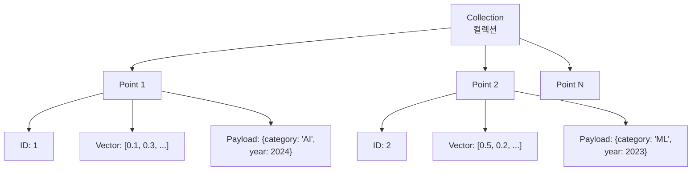
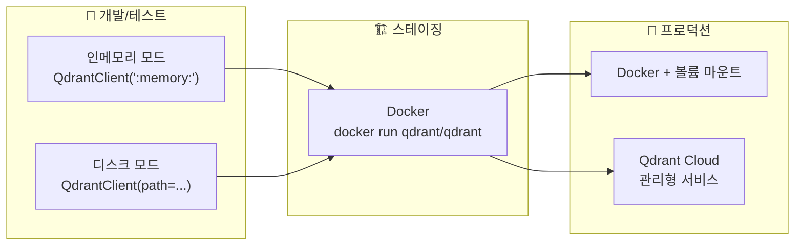
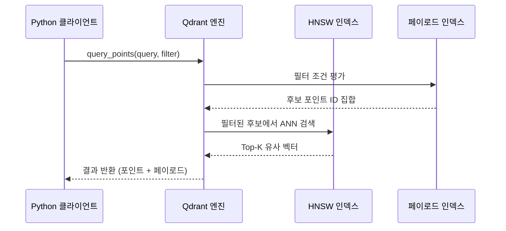

# Qdrant — 고성능 하이브리드 검색 엔진

> Rust로 작성된 오픈소스 벡터 검색 엔진 Qdrant의 설치, 컬렉션 관리, 페이로드 필터링, FastEmbed 통합, 비동기 클라이언트까지 실전 활용법을 익힙니다.

## 개요

이 세션에서는 Qdrant(쿼드란트)를 처음부터 끝까지 다룹니다. 앞서 [세션 7.1](07-벡터-데이터베이스-심화-faiss-pinecone-qdrant-비교/01-faiss-대규모-벡터-검색의-표준.md)에서 FAISS의 저수준 인덱스 제어를, [세션 7.2](07-벡터-데이터베이스-심화-faiss-pinecone-qdrant-비교/02-pinecone-관리형-벡터-데이터베이스.md)에서 Pinecone의 완전 관리형 서비스를 학습했습니다. Qdrant는 이 둘 사이의 "골디락스 존"에 위치합니다 — 자체 호스팅의 유연성과 클라우드 서비스의 편리함을 동시에 제공하면서, 강력한 페이로드 필터링과 하이브리드 검색까지 지원하는 벡터 검색 엔진입니다.

> ⚠️ **용어 구분**: 이 세션에서 말하는 **"하이브리드 검색"**이란, Qdrant가 **벡터 유사도 검색과 페이로드 필터를 하나의 쿼리로 결합**하는 것을 의미합니다. [세션 11.1](11-하이브리드-검색-bm25-키워드-검색과-벡터-검색-결합/01-bm25-키워드-검색-전통적-정보-검색의-힘.md)에서 다룰 **BM25 + Dense 벡터를 결합하는 하이브리드 검색**과는 다른 개념이니 혼동하지 마세요.

**선수 지식**: 벡터 임베딩의 개념(Ch5), 벡터 데이터베이스의 기본 구조(Ch6), FAISS 인덱스 타입([세션 7.1](07-벡터-데이터베이스-심화-faiss-pinecone-qdrant-비교/01-faiss-대규모-벡터-검색의-표준.md)), Pinecone의 관리형 서비스 개념([세션 7.2](07-벡터-데이터베이스-심화-faiss-pinecone-qdrant-비교/02-pinecone-관리형-벡터-데이터베이스.md))
**학습 목표**:
- Qdrant의 세 가지 배포 방식(Docker, 로컬, 클라우드)을 이해하고 설치할 수 있다
- 컬렉션 생성, 포인트 업서트, 벡터 검색의 전체 워크플로를 구현할 수 있다
- 페이로드 필터링을 활용하여 메타데이터 기반 정밀 검색을 수행할 수 있다
- FastEmbed 통합으로 임베딩 생성 없이 문서를 바로 인덱싱할 수 있다
- AsyncQdrantClient를 활용한 비동기 검색 패턴을 적용할 수 있다

## 왜 알아야 할까?

실무에서 벡터 검색 시스템을 구축할 때, "검색은 되는데 원하는 결과가 안 나와요"라는 문제를 자주 마주칩니다. 사용자가 "2024년에 작성된 Python 관련 문서만 검색해주세요"라고 요청하면 어떻게 할까요? FAISS는 벡터 유사도만 계산하므로 메타데이터 필터링을 직접 구현해야 하고, Pinecone은 가능하지만 클라우드 종속성이 생깁니다.

Qdrant는 벡터 유사도 검색과 메타데이터 필터링을 **하나의 쿼리로** 처리합니다. 게다가 Rust로 작성되어 메모리 안전성과 성능을 동시에 확보했고, Docker 한 줄이면 바로 시작할 수 있죠. 오픈소스이면서도 클라우드 서비스를 제공하니, 프로토타이핑에서 프로덕션까지 하나의 도구로 여정을 이어갈 수 있습니다.

## 핵심 개념

### 개념 1: Qdrant의 아키텍처 — 왜 Rust인가?

> 💡 **비유**: FAISS가 "초고속 계산기"라면, Pinecone은 "클라우드 비서"이고, Qdrant는 "나만의 전문 도서관"입니다. 직접 운영할 수도 있고, 관리 서비스를 맡길 수도 있으며, 책(벡터)뿐 아니라 책에 붙은 태그(페이로드)까지 한 번에 검색할 수 있습니다.

Qdrant는 Rust로 작성된 벡터 유사도 검색 엔진입니다. "왜 Rust인가?"라는 질문에 답하려면, 벡터 검색의 핵심 요구사항을 생각해보면 됩니다:

1. **메모리 안전성**: 수십억 개의 벡터를 다룰 때 메모리 누수는 치명적입니다
2. **제로 코스트 추상화**: C/C++ 수준의 성능을 안전한 코드로 달성
3. **동시성**: 수천 개의 동시 검색 요청을 안전하게 처리

Qdrant의 핵심 구성 요소는 다음과 같습니다:

| 구성 요소 | 설명 |
|-----------|------|
| **Collection** | 벡터와 페이로드를 저장하는 논리적 단위 (RDBMS의 테이블에 해당) |
| **Point** | 벡터 + 페이로드 + ID로 구성된 단일 레코드 |
| **Payload** | 포인트에 첨부되는 JSON 형태의 메타데이터 |
| **Named Vector** | 하나의 포인트에 여러 종류의 벡터를 저장하는 기능 |

> 📊 **그림 1**: Qdrant의 핵심 데이터 구조



### 개념 2: 세 가지 배포 방식

Qdrant는 상황에 맞게 세 가지 방식으로 실행할 수 있습니다:

**1. Docker (추천 — 개발/프로덕션)**

```bash
# Qdrant 이미지 다운로드 및 실행
docker pull qdrant/qdrant
docker run -p 6333:6333 -p 6334:6334 \
    -v "$(pwd)/qdrant_storage:/qdrant/storage:z" \
    qdrant/qdrant
```

6333 포트는 REST API, 6334 포트는 gRPC 통신에 사용됩니다. `-v` 옵션으로 스토리지를 호스트에 마운트하면 컨테이너를 재시작해도 데이터가 보존됩니다.

**2. Python 클라이언트 내장 모드 (테스트/프로토타이핑)**

```python
from qdrant_client import QdrantClient

# 인메모리 모드 — 프로세스 종료 시 데이터 소멸
client = QdrantClient(":memory:")

# 디스크 모드 — 파일로 영속화
client = QdrantClient(path="./qdrant_local_db")
```

> 🔥 **실무 팁**: 인메모리 모드(`:memory:`)는 유닛 테스트와 빠른 프로토타이핑에 최적입니다. Docker 없이 `pip install qdrant-client`만으로 바로 시작할 수 있어요. 하지만 프로덕션에서는 반드시 Docker나 Qdrant Cloud를 사용하세요.

**3. Qdrant Cloud (관리형 서비스)**

```python
# Qdrant Cloud 연결
client = QdrantClient(
    url="https://your-cluster-url.aws.cloud.qdrant.io",
    api_key="your-api-key",
)
```

> 📊 **그림 2**: Qdrant 배포 방식 비교



### 개념 3: 컬렉션 생성과 포인트 업서트

> 💡 **비유**: 컬렉션을 만드는 건 도서관에 새 서가를 설치하는 것과 같습니다. "이 서가에는 384차원짜리 벡터만 들어갈 수 있고, 코사인 유사도로 정렬합니다"라고 규격을 정하는 거죠.

컬렉션을 생성할 때는 **벡터 크기(size)**와 **거리 메트릭(distance)**을 반드시 지정해야 합니다:

```python
from qdrant_client import QdrantClient
from qdrant_client.models import Distance, VectorParams

client = QdrantClient(":memory:")

# 컬렉션 생성 — 벡터 크기와 거리 메트릭 지정
client.create_collection(
    collection_name="my_documents",
    vectors_config=VectorParams(
        size=384,                 # 임베딩 모델의 출력 차원 수
        distance=Distance.COSINE  # 코사인 유사도 사용
    ),
)
```

지원하는 거리 메트릭은 세 가지입니다:

| 메트릭 | 설명 | 사용 사례 |
|--------|------|----------|
| `Distance.COSINE` | 벡터 간 각도 기반 유사도 | 텍스트 임베딩 (가장 보편적) |
| `Distance.EUCLID` | 유클리드 거리 (L2) | 이미지 특징 벡터 |
| `Distance.DOT` | 내적 (Dot Product) | 정규화된 벡터, 추천 시스템 |

이제 포인트를 업서트(Upsert)합니다. 업서트는 "없으면 삽입, 있으면 갱신"하는 연산으로, [세션 7.2](07-벡터-데이터베이스-심화-faiss-pinecone-qdrant-비교/02-pinecone-관리형-벡터-데이터베이스.md)에서 Pinecone에서도 동일한 개념을 다뤘습니다:

```python
from qdrant_client.models import PointStruct

# 포인트 업서트 — ID, 벡터, 페이로드(메타데이터)를 함께 저장
operation_info = client.upsert(
    collection_name="my_documents",
    wait=True,  # 인덱싱 완료까지 대기
    points=[
        PointStruct(
            id=1,
            vector=[0.05, 0.61, 0.76, 0.74] * 96,  # 384차원 벡터
            payload={
                "title": "RAG 입문 가이드",
                "category": "tutorial",
                "year": 2024,
                "tags": ["RAG", "LLM", "검색"]
            }
        ),
        PointStruct(
            id=2,
            vector=[0.19, 0.81, 0.75, 0.11] * 96,
            payload={
                "title": "벡터 데이터베이스 비교",
                "category": "comparison",
                "year": 2025,
                "tags": ["벡터DB", "FAISS", "Qdrant"]
            }
        ),
    ],
)
```

`wait=True`를 설정하면 서버가 인덱싱을 완료할 때까지 응답을 기다립니다. 배치 업서트 시에는 `wait=False`로 설정하면 처리량이 크게 향상됩니다.

### 개념 4: 벡터 검색과 페이로드 필터링

Qdrant의 진정한 강점은 **벡터 유사도 검색과 메타데이터 필터링을 동시에** 수행할 수 있다는 점입니다. 이것이 바로 Qdrant가 말하는 "하이브리드 검색"의 핵심인데요 — 벡터 유사도와 페이로드 필터를 하나의 쿼리로 결합하는 방식입니다. FAISS에서는 검색 후 별도로 필터링 로직을 구현해야 했지만, Qdrant는 이를 단일 쿼리로 해결합니다.

**기본 벡터 검색:**

```python
# 쿼리 벡터로 유사한 포인트 검색
results = client.query_points(
    collection_name="my_documents",
    query=[0.2, 0.1, 0.9, 0.7] * 96,  # 384차원 쿼리 벡터
    with_payload=True,  # 페이로드 포함 반환
    limit=5,            # 상위 5개 결과
).points
```

**페이로드 필터링을 결합한 검색:**

```python
from qdrant_client.models import Filter, FieldCondition, MatchValue, Range

# "2024년 이후 tutorial 카테고리" 문서만 검색
results = client.query_points(
    collection_name="my_documents",
    query=[0.2, 0.1, 0.9, 0.7] * 96,
    query_filter=Filter(
        must=[
            # category가 정확히 "tutorial"인 문서
            FieldCondition(
                key="category",
                match=MatchValue(value="tutorial")
            ),
            # year가 2024 이상인 문서
            FieldCondition(
                key="year",
                range=Range(gte=2024)
            ),
        ]
    ),
    with_payload=True,
    limit=5,
).points
```

필터 조건은 세 가지 논리 연산자로 조합할 수 있습니다:

| 연산자 | 의미 | SQL 대응 |
|--------|------|----------|
| `must` | 모든 조건 충족 (AND) | `WHERE A AND B` |
| `should` | 하나 이상 충족 (OR) | `WHERE A OR B` |
| `must_not` | 모든 조건 불충족 (NOT) | `WHERE NOT A AND NOT B` |

> 📊 **그림 3**: Qdrant의 필터링 검색 흐름



> ⚠️ **흔한 오해**: "필터링하면 검색 속도가 느려지지 않나요?" — Qdrant는 **필터링을 먼저** 적용한 뒤 축소된 후보 집합에서 벡터 검색을 수행합니다. 페이로드 인덱스를 생성하면 필터링 자체도 매우 빠릅니다. 다만, 필터 조건이 너무 엄격해서 후보가 극소수일 때는 HNSW 그래프 탐색이 비효율적이 될 수 있어서, Qdrant는 이때 자동으로 brute-force 검색으로 전환합니다.

**페이로드 인덱스 생성** — 필터링 성능 최적화:

```python
# 자주 필터링하는 필드에 인덱스 생성
client.create_payload_index(
    collection_name="my_documents",
    field_name="category",
    field_schema="keyword"  # 문자열 완전 일치용
)

client.create_payload_index(
    collection_name="my_documents",
    field_name="year",
    field_schema="integer"  # 정수 범위 검색용
)
```

### 개념 5: FastEmbed — 임베딩 없이 바로 검색

> 💡 **비유**: 보통 도서관에 책을 기증하려면 먼저 분류 번호를 붙여야(임베딩 생성) 합니다. FastEmbed는 도서관이 직접 분류 번호를 붙여주는 서비스입니다 — 책(텍스트)만 건네면 나머지는 자동으로 처리됩니다.

FastEmbed는 Qdrant 팀이 만든 경량 임베딩 라이브러리로, **PyTorch나 GPU 드라이버 없이** CPU만으로 빠르게 임베딩을 생성합니다. `qdrant-client[fastembed]`를 설치하면 텍스트를 직접 인덱싱하고 검색할 수 있습니다:

```bash
pip install 'qdrant-client[fastembed]'
```

```run:python
from qdrant_client import QdrantClient

# FastEmbed 통합 클라이언트 — 인메모리 모드
client = QdrantClient(":memory:")

# 문서와 메타데이터 준비
docs = [
    "RAG는 검색 증강 생성의 약자입니다",
    "벡터 데이터베이스는 고차원 벡터를 저장합니다",
    "LangChain은 LLM 애플리케이션 프레임워크입니다",
    "임베딩은 텍스트를 숫자 벡터로 변환합니다",
]
metadata = [
    {"source": "rag-guide", "chapter": 1},
    {"source": "vectordb-intro", "chapter": 6},
    {"source": "langchain-docs", "chapter": 8},
    {"source": "embedding-tutorial", "chapter": 5},
]

# add() 메서드 — 임베딩 생성 + 인덱싱을 한 번에!
client.add(
    collection_name="knowledge_base",
    documents=docs,
    metadata=metadata,
    ids=[1, 2, 3, 4],
)

# query() 메서드 — 텍스트로 바로 검색
results = client.query(
    collection_name="knowledge_base",
    query_text="벡터 검색이란 무엇인가요?",
    limit=2,
)

for result in results:
    print(f"[{result.score:.4f}] {result.document}")
```

```output
[0.8234] 벡터 데이터베이스는 고차원 벡터를 저장합니다
[0.7651] 임베딩은 텍스트를 숫자 벡터로 변환합니다
```

FastEmbed는 기본적으로 `sentence-transformers/all-MiniLM-L6-v2` 모델을 사용합니다. 다른 모델을 쓰고 싶다면 `QdrantClient`를 생성할 때 `embedding_model_name` 파라미터를 지정하면 됩니다.

### 개념 6: 비동기 클라이언트 — AsyncQdrantClient

웹 서버나 비동기 파이프라인에서 Qdrant를 사용할 때는 `AsyncQdrantClient`를 활용합니다. 동기 클라이언트와 API가 완전히 동일하므로 `await` 키워드만 추가하면 됩니다:

```python
import asyncio
from qdrant_client import AsyncQdrantClient, models

async def async_search_example():
    # 비동기 클라이언트 생성
    client = AsyncQdrantClient(":memory:")

    # 컬렉션 생성
    await client.create_collection(
        collection_name="async_docs",
        vectors_config=models.VectorParams(
            size=384,
            distance=models.Distance.COSINE,
        ),
    )

    # 포인트 업서트
    await client.upsert(
        collection_name="async_docs",
        points=[
            models.PointStruct(
                id=i,
                vector=[0.1 * i] * 384,
                payload={"index": i}
            )
            for i in range(100)
        ],
    )

    # 비동기 검색
    results = await client.query_points(
        collection_name="async_docs",
        query=[0.5] * 384,
        limit=3,
    )

    for point in results.points:
        print(f"ID: {point.id}, Score: {point.score:.4f}")

    await client.close()

# 실행
asyncio.run(async_search_example())
```

> 🔥 **실무 팁**: FastAPI나 aiohttp 같은 비동기 웹 프레임워크와 함께 사용할 때는 반드시 `AsyncQdrantClient`를 사용하세요. 동기 클라이언트를 비동기 환경에서 쓰면 이벤트 루프가 블로킹되어 전체 서버 성능이 떨어집니다.

## 실습: 직접 해보기

기술 블로그 검색 시스템을 만들어봅시다. FastEmbed로 임베딩을 자동 생성하고, 페이로드 필터링으로 카테고리별 검색을 수행합니다.

```python
from qdrant_client import QdrantClient
from qdrant_client.models import (
    Filter, FieldCondition, MatchValue, Range
)

# 1. 클라이언트 생성 (인메모리 모드)
client = QdrantClient(":memory:")

# 2. 기술 블로그 문서 데이터 준비
documents = [
    "RAG 파이프라인은 검색, 증강, 생성의 세 단계로 구성됩니다. 각 단계를 최적화하면 답변 품질이 크게 향상됩니다.",
    "FAISS는 Facebook AI Research에서 개발한 벡터 검색 라이브러리로, GPU 가속을 지원합니다.",
    "Pinecone은 완전 관리형 벡터 데이터베이스로, 서버리스 아키텍처를 채택하여 자동 확장이 가능합니다.",
    "Qdrant는 Rust로 작성된 벡터 검색 엔진으로, 페이로드 필터링과 하이브리드 검색을 지원합니다.",
    "LangChain의 LCEL을 사용하면 파이프 연산자(|)로 RAG 체인을 선언적으로 구성할 수 있습니다.",
    "텍스트 청킹 시 RecursiveCharacterTextSplitter를 사용하면 의미 단위로 문서를 분할할 수 있습니다.",
    "코사인 유사도는 두 벡터의 방향 유사성을 측정하며, 텍스트 임베딩 비교에 가장 널리 사용됩니다.",
    "HNSW 알고리즘은 계층적 그래프 구조를 사용하여 대규모 벡터에서 빠른 근사 최근접 이웃 검색을 수행합니다.",
]

metadata_list = [
    {"category": "rag", "difficulty": "beginner", "year": 2024},
    {"category": "vectordb", "difficulty": "intermediate", "year": 2024},
    {"category": "vectordb", "difficulty": "intermediate", "year": 2025},
    {"category": "vectordb", "difficulty": "intermediate", "year": 2025},
    {"category": "rag", "difficulty": "intermediate", "year": 2024},
    {"category": "preprocessing", "difficulty": "beginner", "year": 2024},
    {"category": "embedding", "difficulty": "beginner", "year": 2023},
    {"category": "algorithm", "difficulty": "advanced", "year": 2023},
]

# 3. FastEmbed로 문서 인덱싱 (임베딩 자동 생성)
client.add(
    collection_name="tech_blog",
    documents=documents,
    metadata=metadata_list,
    ids=list(range(1, len(documents) + 1)),
)

# 4. 기본 텍스트 검색
print("=== 기본 검색: '벡터 데이터베이스' ===")
results = client.query(
    collection_name="tech_blog",
    query_text="벡터 데이터베이스 비교",
    limit=3,
)
for r in results:
    print(f"  [{r.score:.4f}] {r.document[:50]}...")

# 5. 필터링 검색 — vectordb 카테고리만
print("\n=== 필터 검색: vectordb + 2025년 ===")
results = client.query(
    collection_name="tech_blog",
    query_text="벡터 검색 엔진",
    query_filter=Filter(
        must=[
            FieldCondition(key="category", match=MatchValue(value="vectordb")),
            FieldCondition(key="year", range=Range(gte=2025)),
        ]
    ),
    limit=3,
)
for r in results:
    print(f"  [{r.score:.4f}] {r.document[:50]}...")

# 6. 복합 필터 — beginner가 아닌 문서 중 rag 또는 vectordb
print("\n=== 복합 필터: (rag OR vectordb) AND NOT beginner ===")
results = client.query(
    collection_name="tech_blog",
    query_text="RAG 파이프라인 구축",
    query_filter=Filter(
        must_not=[
            FieldCondition(
                key="difficulty",
                match=MatchValue(value="beginner")
            ),
        ],
        should=[
            FieldCondition(key="category", match=MatchValue(value="rag")),
            FieldCondition(key="category", match=MatchValue(value="vectordb")),
        ]
    ),
    limit=3,
)
for r in results:
    print(f"  [{r.score:.4f}] {r.document[:50]}...")
```

이 실습에서 핵심은 `client.add()`와 `client.query()` 두 메서드입니다. FastEmbed 통합 덕분에 별도의 임베딩 모델 호출 없이 **텍스트만으로** 인덱싱과 검색이 가능합니다. 필터 조건을 `must`, `should`, `must_not`으로 조합하면 SQL의 WHERE 절처럼 정밀한 검색이 가능하죠.

### LangChain 연동

LangChain과 Qdrant를 연동하면 RAG 파이프라인에 바로 통합할 수 있습니다:

```python
from langchain_qdrant import QdrantVectorStore, FastEmbedSparse, RetrievalMode
from langchain_openai import OpenAIEmbeddings
from qdrant_client import QdrantClient

# Qdrant 클라이언트 생성
client = QdrantClient(":memory:")

# Dense 임베딩 모델
dense_embeddings = OpenAIEmbeddings(model="text-embedding-3-small")

# QdrantVectorStore 초기화
vector_store = QdrantVectorStore.from_texts(
    texts=[
        "RAG는 검색 증강 생성 기법입니다",
        "Qdrant는 Rust로 작성된 벡터 검색 엔진입니다",
        "LangChain은 LLM 앱 개발 프레임워크입니다",
    ],
    embedding=dense_embeddings,
    collection_name="langchain_demo",
    url=":memory:",  # 인메모리 모드
)

# 리트리버로 변환하여 RAG 체인에 활용
retriever = vector_store.as_retriever(
    search_kwargs={"k": 3}
)

# 검색 실행
docs = retriever.invoke("Qdrant가 뭔가요?")
for doc in docs:
    print(f"  {doc.page_content}")
```

LangChain의 `QdrantVectorStore`는 세 가지 검색 모드를 지원합니다:

| 모드 | 설명 | 설정 |
|------|------|------|
| `RetrievalMode.DENSE` | Dense 벡터만 사용 (기본값) | `embedding` 파라미터 |
| `RetrievalMode.SPARSE` | Sparse 벡터만 사용 (키워드 검색) | `sparse_embedding` 파라미터 |
| `RetrievalMode.HYBRID` | Dense + Sparse 결합 | 양쪽 모두 설정 |

여기서 `RetrievalMode.HYBRID`는 Dense 벡터와 Sparse 벡터(BM25 계열)를 결합하는 방식으로, [세션 11.1](11-하이브리드-검색-bm25-키워드-검색과-벡터-검색-결합/01-bm25-키워드-검색-전통적-정보-검색의-힘.md)에서 BM25와 벡터 검색을 결합하는 하이브리드 검색 전략과 함께 더 자세히 다룹니다.

## 더 깊이 알아보기

### Qdrant의 탄생 스토리

Qdrant는 2021년 10월, 독일 베를린에서 **André Zayarni**와 **Andrey Vasnetsov**가 창립했습니다. CTO인 Andrey Vasnetsov는 모스크바 바우만 공과대학에서 정보기술 석사 학위를 받고, 러시아의 핀테크 기업 Tinkoff Bank에서 머신러닝 엔지니어로 일했습니다.

그가 Qdrant를 만든 계기는 흥미롭습니다. 당시 벡터 검색 분야에는 FAISS 같은 라이브러리는 있었지만, **프로덕션에서 바로 사용할 수 있는 벡터 검색 서비스**는 부재했습니다. FAISS는 강력하지만 서버가 아닌 라이브러리이고, 메타데이터 필터링이나 분산 처리를 직접 구현해야 했죠.

Andrey는 "처음부터 프로덕션용으로 설계된 벡터 검색 엔진"이라는 비전으로 Rust를 선택했습니다. 첫 버전을 GitHub에 공개하자 예상을 뛰어넘는 반응이 쏟아졌고, 이것이 확인되어 정식 회사를 설립하게 됩니다. "Qdrant"라는 이름은 **Q**(Query) + **d**(dimension) + **rant**(정밀한 의미 전달)의 조합으로, "고차원 쿼리"를 상징합니다.

> 💡 **알고 계셨나요?**: Qdrant가 Rust를 선택한 것은 단순한 성능 이유만은 아닙니다. Rust의 소유권(ownership) 시스템은 동시에 수천 개의 검색 요청을 처리할 때 데이터 레이스(race condition)를 컴파일 타임에 방지합니다. Go나 Java의 가비지 컬렉터는 대량의 벡터 데이터를 다룰 때 예측 불가능한 지연(stop-the-world pause)을 유발할 수 있는데, Rust는 이 문제가 원천적으로 없습니다.

### Named Vectors — 멀티모달 검색의 기반

하나의 포인트에 여러 종류의 벡터를 저장할 수 있는 Named Vectors는 Qdrant의 독특한 기능입니다:

```python
from qdrant_client.models import VectorParams, Distance

# 텍스트 + 이미지 벡터를 함께 저장하는 컬렉션
client.create_collection(
    collection_name="multimodal_docs",
    vectors_config={
        "text": VectorParams(size=384, distance=Distance.COSINE),
        "image": VectorParams(size=512, distance=Distance.COSINE),
    }
)

# Named Vector로 포인트 업서트
client.upsert(
    collection_name="multimodal_docs",
    points=[
        PointStruct(
            id=1,
            vector={
                "text": [0.1, 0.2, ...],   # 텍스트 임베딩 (384차원)
                "image": [0.3, 0.4, ...],   # 이미지 임베딩 (512차원)
            },
            payload={"title": "AI 개론", "type": "article"}
        )
    ]
)

# 특정 벡터 타입으로 검색
results = client.query_points(
    collection_name="multimodal_docs",
    query=[0.5] * 384,
    using="text",  # 텍스트 벡터로 검색
    limit=5,
)
```

이 기능은 [세션 19.1](19-멀티모달-rag-이미지와-테이블-처리/01-멀티모달-rag-아키텍처-텍스트를-넘어서.md)에서 멀티모달 RAG를 다룰 때 핵심적으로 활용됩니다.

## 흔한 오해와 팁

> ⚠️ **흔한 오해**: "Qdrant는 Docker가 없으면 사용할 수 없다" — 아닙니다! `QdrantClient(":memory:")`나 `QdrantClient(path="./db")`로 Python 내장 모드를 사용할 수 있습니다. 물론 프로덕션에서는 Docker나 클라우드를 권장하지만, 개발과 테스트 단계에서는 `pip install qdrant-client`만으로 충분합니다.

> 💡 **알고 계셨나요?**: Qdrant의 페이로드 필터링은 HNSW 인덱스와 통합되어 있어서, 필터링 후 검색이 아니라 **검색 과정에서 동시에 필터링**합니다. 이 방식을 "filterable HNSW"라고 부르는데, 일반적인 사후 필터링(post-filtering)보다 훨씬 효율적입니다. 후보를 100개 찾아놓고 필터링으로 90개를 버리는 낭비가 없거든요.

> 🔥 **실무 팁**: 대량의 포인트를 업서트할 때는 `wait=False`로 설정하고 배치 크기를 100~500개로 나누세요. Qdrant는 내부적으로 Write-Ahead Log(WAL)를 사용하므로 `wait=False`여도 데이터 유실 걱정은 없습니다. 모든 업서트가 끝난 뒤 `client.get_collection("collection_name")`으로 포인트 수를 확인하면 됩니다.

> 🔥 **실무 팁**: Docker 실행 시 반드시 `-v` 옵션으로 스토리지 볼륨을 마운트하세요. 마운트 없이 실행하면 컨테이너 중지 시 **모든 데이터가 사라집니다**. 또한 Windows에서 Docker/WSL 환경의 볼륨 마운트는 파일시스템 문제로 데이터 손실이 보고되어 있으니, Linux나 macOS 환경을 권장합니다.

## 핵심 정리

| 개념 | 설명 |
|------|------|
| **Qdrant** | Rust로 작성된 오픈소스 벡터 검색 엔진. 자체 호스팅과 클라우드 모두 지원 |
| **Collection** | 벡터와 페이로드를 저장하는 논리적 단위. 벡터 크기와 거리 메트릭을 지정하여 생성 |
| **Point** | ID + Vector + Payload로 구성된 단일 레코드 |
| **Payload** | 포인트에 첨부되는 JSON 메타데이터. 필터링 검색의 핵심 |
| **하이브리드 검색 (Qdrant)** | 벡터 유사도 + 페이로드 필터를 하나의 쿼리로 결합하는 방식. BM25+Dense 하이브리드와는 다른 개념 |
| **query_points()** | 벡터 유사도 + 페이로드 필터를 결합한 검색 메서드 |
| **Filter** | `must`(AND), `should`(OR), `must_not`(NOT)으로 조합하는 필터 객체 |
| **FastEmbed** | PyTorch 없이 CPU에서 임베딩을 생성하는 경량 라이브러리. `add()`/`query()`로 텍스트 직접 처리 |
| **AsyncQdrantClient** | 비동기 환경용 클라이언트. 동기 API와 동일한 인터페이스 |
| **Named Vector** | 하나의 포인트에 여러 종류의 벡터를 저장하는 멀티벡터 기능 |
| **페이로드 인덱스** | `create_payload_index()`로 생성. 필터링 검색 성능을 크게 향상 |

## 다음 섹션 미리보기

이제 FAISS, Pinecone, Qdrant 세 가지 벡터 데이터베이스를 모두 살펴보았습니다. 다음 세션에서는 이 세 가지를 **동일한 데이터셋과 쿼리로 벤치마킹**하여, 검색 속도·정확도·메모리 사용량·필터링 성능 등을 체계적으로 비교합니다. "내 프로젝트에는 어떤 벡터 DB가 맞을까?"라는 질문에 데이터 기반으로 답할 수 있게 될 것입니다.

## 참고 자료

- [Qdrant Python Client 공식 문서](https://python-client.qdrant.tech/) - Python 클라이언트의 전체 API 레퍼런스와 퀵스타트 가이드
- [Qdrant 공식 퀵스타트](https://qdrant.tech/documentation/quickstart/) - Docker 설치부터 첫 검색까지의 공식 가이드
- [Qdrant GitHub 리포지토리](https://github.com/qdrant/qdrant-client) - Python 클라이언트 소스코드와 예제
- [FastEmbed GitHub 리포지토리](https://github.com/qdrant/fastembed) - 경량 임베딩 라이브러리의 소스코드, 지원 모델 목록, 벤치마크
- [LangChain Qdrant 통합 문서](https://docs.langchain.com/oss/python/integrations/vectorstores/qdrant) - LangChain에서 QdrantVectorStore를 활용하는 공식 가이드
- [Qdrant 하이브리드 검색 튜토리얼](https://qdrant.tech/documentation/beginner-tutorials/hybrid-search-fastembed/) - FastEmbed를 활용한 하이브리드 검색(Sparse+Dense) 구현 가이드
- [Qdrant 페이로드 필터링 문서](https://qdrant.tech/documentation/concepts/payload/) - 페이로드 타입, 인덱스, 필터 조건의 상세 설명

---
### 🔗 Related Sessions
- [embedding](../05-임베딩-모델-이해-텍스트를-벡터로-변환/01-임베딩의-기본-개념-단어에서-문장까지.md) (prerequisite)
- [ann](../06-벡터-데이터베이스-기초-chromadb로-시작하기/01-벡터-데이터베이스란-왜-필요한가.md) (prerequisite)
- [hnsw](../06-벡터-데이터베이스-기초-chromadb로-시작하기/01-벡터-데이터베이스란-왜-필요한가.md) (prerequisite)
- [lcel](../08-기본-rag-파이프라인-구축-langchain으로-첫-rag-앱-만들기/01-langchain-v1-핵심-개념과-설정.md) (prerequisite)
