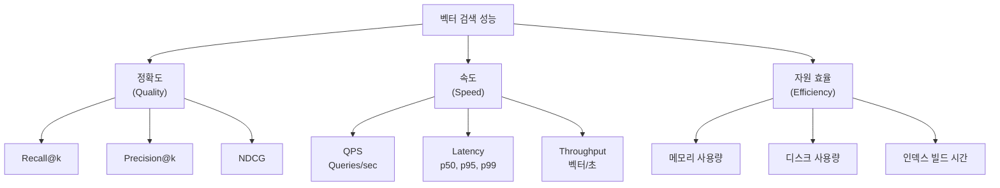
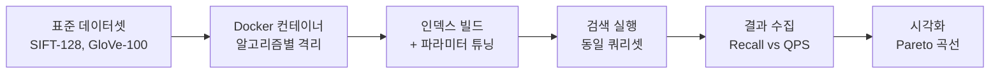
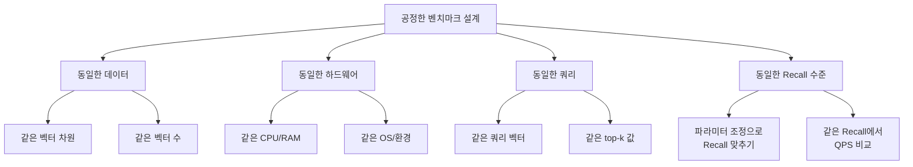
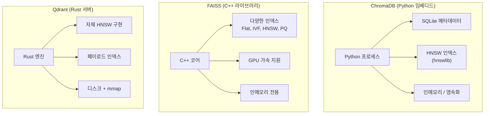

# 벡터 DB 성능 비교와 벤치마크

> 동일한 데이터, 동일한 질문 — 그런데 벡터 DB마다 속도와 정확도가 이렇게 다르다고?

## 개요

이 섹션에서는 앞서 배운 ChromaDB, FAISS, Qdrant 세 벡터 데이터베이스를 **동일한 데이터셋과 동일한 조건**으로 벤치마킹하여 검색 속도, 정확도(Recall@k), 메모리 사용량을 체계적으로 비교합니다. 또한 업계 표준 벤치마크 도구인 ann-benchmarks와 VectorDBBench를 소개하고, 프로젝트 요구사항에 맞는 벡터 DB 선택 기준을 수립합니다.

> 💡 **용어 정리**: 엄밀히 말하면 FAISS는 **벡터 검색 라이브러리**, ChromaDB는 **임베디드 벡터 데이터베이스**, Qdrant는 **벡터 검색 엔진**으로 각각 성격이 다릅니다. 이 세션에서는 편의상 이들을 모두 **벡터 DB**로 통칭하겠습니다.

한편, [7.2](ch07-02)에서 배운 **Pinecone**은 이번 벤치마크 대상에 포함하지 않았습니다. Pinecone은 완전 관리형(managed) 클라우드 서비스이기 때문에, 로컬 벤치마크 환경에서 측정하면 **네트워크 지연(latency)**이 결과에 포함되어 나머지 셋과 공정한 비교가 어렵기 때문입니다. Pinecone의 공식 벤치마크 수치와 선택 기준은 [7.5 선택 가이드](ch07-05)에서 함께 다룹니다.

**선수 지식**: [6장 ChromaDB](ch06)의 기본 CRUD 연산, [7.1 FAISS](ch07-01)의 인덱스 타입(IndexFlatL2, IndexIVFFlat, IndexHNSWFlat), [7.2 Pinecone](ch07-02)의 관리형 서비스 개념, [7.3 Qdrant](ch07-03)의 컬렉션/포인트/페이로드 구조

**학습 목표**:
- 벡터 검색 성능을 측정하는 핵심 메트릭(Recall@k, QPS, Latency)을 이해한다
- ann-benchmarks와 VectorDBBench 등 업계 표준 벤치마크 도구의 활용법을 익힌다
- ChromaDB, FAISS, Qdrant를 동일 조건으로 벤치마킹하는 코드를 작성할 수 있다
- 벤치마크 결과를 해석하여 프로젝트에 적합한 벡터 DB를 선택할 수 있다

## 왜 알아야 할까?

"어떤 벡터 DB가 가장 좋은가요?" — RAG 시스템을 구축하다 보면 이 질문을 반드시 마주치게 됩니다. 하지만 이 질문에 대한 정답은 **"상황에 따라 다르다"**입니다. 마치 "세단과 SUV 중 어떤 차가 좋은가요?"라고 묻는 것처럼, 정답은 여러분의 도로 조건, 짐의 양, 연비 우선순위에 따라 달라지죠.

실무에서 벡터 DB를 선택할 때 흔히 벌어지는 일이 있습니다. 블로그에서 "X가 가장 빠르다"는 글을 보고 도입했더니, 정작 **자신의 데이터**에서는 기대만큼의 성능이 나오지 않는 거죠. 이는 벤치마크 조건(데이터 차원, 벡터 수, 검색 패턴)이 프로젝트와 다르기 때문입니다.

이 세션에서는 남이 만든 벤치마크를 읽는 법뿐만 아니라, **직접 벤치마크를 설계하고 실행하는 능력**을 기르겠습니다. 이 능력은 프로덕션 환경에서 기술 의사결정을 내릴 때 가장 강력한 무기가 됩니다.

## 핵심 개념

### 개념 1: 벡터 검색 성능 메트릭 — 무엇을 측정할 것인가?

> 💡 **비유**: 식당을 평가할 때 '맛'만 보지 않죠. 서빙 속도, 가격, 좌석 수용력까지 종합적으로 봅니다. 벡터 DB도 마찬가지로 여러 관점에서 평가해야 합니다.

벡터 검색 시스템의 성능을 측정하는 핵심 메트릭은 크게 **정확도**, **속도**, **자원 효율** 세 가지 축으로 나뉩니다.

#### Recall@k — 검색 정확도의 핵심 지표

**Recall@k**는 전체 정답(ground truth) 중에서 상위 k개 검색 결과에 포함된 정답의 비율입니다. 비유하자면, 도서관에서 "AI 관련 책 10권을 추천해주세요"라고 했을 때, 실제 AI 책 20권 중에서 추천된 10권 안에 8권이 들어있다면 Recall@10은 **0.8(80%)**입니다.

$$Recall@k = \frac{|R \cap S_k|}{|R|}$$

- $R$: 전체 관련(relevant) 문서 집합
- $S_k$: 시스템이 반환한 상위 k개 결과
- $|R \cap S_k|$: 상위 k개 결과 중 실제 관련 문서 수

> 📊 **그림 1**: 벡터 검색 성능 메트릭의 세 가지 축



#### QPS와 Latency — 속도의 두 얼굴

**QPS(Queries Per Second)**는 초당 처리 가능한 쿼리 수입니다. 높을수록 좋죠. **Latency**는 하나의 쿼리가 결과를 반환하기까지 걸리는 시간입니다. 보통 중앙값(p50), 95번째 백분위(p95), 99번째 백분위(p99)를 함께 측정합니다.

왜 p50만으로 부족할까요? 평균 응답시간이 10ms여도, 100번 중 1번은 500ms가 걸릴 수 있거든요. 사용자 경험 관점에서 이런 **꼬리 지연(tail latency)**이 치명적입니다.

```run:python
import numpy as np

# 가상의 지연시간 데이터 (밀리초)
latencies = np.concatenate([
    np.random.normal(10, 2, 950),   # 95%는 10ms 근처
    np.random.normal(100, 30, 50)   # 5%는 100ms 근처 (꼬리 지연)
])

p50 = np.percentile(latencies, 50)
p95 = np.percentile(latencies, 95)
p99 = np.percentile(latencies, 99)

print(f"p50 (중앙값): {p50:.1f}ms")
print(f"p95: {p95:.1f}ms")
print(f"p99: {p99:.1f}ms")
print(f"평균: {np.mean(latencies):.1f}ms")
print(f"\n→ 평균은 괜찮아 보이지만, p99는 {p99/p50:.0f}배 느립니다!")
```

```output
p50 (중앙값): 10.1ms
p95: 82.3ms
p99: 141.7ms
평균: 14.6ms

→ 평균은 괜찮아 보이지만, p99는 14배 느립니다!
```

> ⚠️ **흔한 오해**: "Recall이 높으면 무조건 좋은 거 아닌가요?" — 아닙니다. Recall@k와 QPS는 **트레이드오프** 관계입니다. 완벽한 Recall(1.0)을 원한다면 모든 벡터를 전수 검사(brute-force)해야 하는데, 이는 대규모 데이터에서 비현실적으로 느립니다. ANN(Approximate Nearest Neighbor) 알고리즘은 약간의 Recall을 희생하여 검색 속도를 수백~수천 배 높이는 것이 핵심이죠.

### 개념 2: 업계 표준 벤치마크 도구

> 💡 **비유**: 자동차 성능을 비교할 때 각 제조사가 자체 테스트 결과만 공개하면 신뢰하기 어렵죠. 그래서 NCAP 같은 독립 기관이 동일한 조건으로 테스트합니다. 벡터 DB 세계에도 이런 "공인 시험장"이 있습니다.

#### ann-benchmarks — ANN 알고리즘의 표준 벤치마크

[ann-benchmarks](https://github.com/erikbern/ann-benchmarks)는 Erik Bernhardsson이 만든 오픈소스 프로젝트로, 다양한 ANN 알고리즘을 동일한 하드웨어에서 비교합니다. 2017년 SISAP 학회 논문에서 출발했으며, 현재까지도 업계에서 가장 널리 인용되는 벤치마크입니다.

> 📊 **그림 2**: ann-benchmarks의 벤치마킹 파이프라인



주요 데이터셋은 다음과 같습니다:

| 데이터셋 | 차원 | 벡터 수 | 거리 메트릭 | 특성 |
|----------|------|---------|-------------|------|
| SIFT-128 | 128 | 1,000,000 | Euclidean | 이미지 특징점, 밀집 |
| GloVe-100 | 100 | 1,183,514 | Angular(Cosine) | 단어 임베딩 |
| GloVe-25 | 25 | 1,183,514 | Angular(Cosine) | 저차원 임베딩 |
| NYTimes-256 | 256 | 290,000 | Angular | 뉴스 기사 임베딩 |
| Fashion-MNIST | 784 | 60,000 | Euclidean | 이미지 픽셀 |

ann-benchmarks의 결과를 읽을 때 핵심은 **Recall-QPS Pareto 곡선**입니다. x축이 Recall, y축이 QPS인 그래프에서 **우상단에 가까울수록 좋은 성능**을 의미합니다 — 즉, 높은 정확도와 높은 처리량을 동시에 달성하는 것이죠.

```python
# ann-benchmarks 실행 예시 (Docker 필요)
# 설치
# git clone https://github.com/erikbern/ann-benchmarks.git
# cd ann-benchmarks
# pip install -r requirements.txt

# 특정 알고리즘만 벤치마크 실행
# python run.py --dataset sift-128-euclidean --algorithm faiss-hnsw

# 결과 시각화
# python plot.py --dataset sift-128-euclidean
```

#### VectorDBBench — 엔드투엔드 벡터 DB 벤치마크

[VectorDBBench](https://github.com/zilliztech/VectorDBBench)는 Zilliz(Milvus 개발사)가 만든 도구로, ann-benchmarks가 **알고리즘 수준** 비교에 초점을 둔다면, VectorDBBench는 **DB 시스템 전체**를 비교합니다 — 데이터 로딩, 인덱스 빌드, 검색, 필터링까지 포함한 엔드투엔드 벤치마크입니다.

| 벤치마크 도구 | 측정 범위 | 대상 | 주요 메트릭 |
|--------------|----------|------|------------|
| ann-benchmarks | ANN 알고리즘 | FAISS, HNSW, Annoy 등 | Recall vs QPS |
| VectorDBBench | DB 시스템 전체 | Milvus, Qdrant, Chroma 등 | QPS, Latency, 비용 |
| Qdrant vector-db-benchmark | DB 시스템 | Qdrant, Milvus, Weaviate 등 | RPS, Latency, Precision |

### 개념 3: 벤치마크 설계의 핵심 원칙

> 💡 **비유**: 100m 달리기 선수와 마라톤 선수를 비교할 때, 100m 기록으로만 비교하면 공정하지 않죠. 각각의 강점이 드러나는 조건에서 비교해야 합니다. 벡터 DB 벤치마크도 마찬가지입니다.

공정한 벤치마크를 위해 반드시 통제해야 할 변수들이 있습니다:

> 📊 **그림 3**: 공정한 벤치마크를 위한 통제 변수



**가장 중요한 원칙**: Recall이 다른 상태에서 QPS만 비교하면 무의미합니다. 예를 들어 FAISS의 `nprobe=1`(Recall 0.4, QPS 50,000)과 Qdrant의 기본 설정(Recall 0.95, QPS 3,000)을 비교하면 FAISS가 압도적으로 빠르다고 착각할 수 있지만, FAISS의 `nprobe`를 올려 Recall 0.95에 맞추면 QPS 차이가 크게 줄어듭니다.

이번 벤치마크에서 Pinecone을 제외한 것도 같은 원칙에서입니다. Pinecone은 관리형 클라우드 서비스이므로 모든 요청에 **네트워크 왕복 지연(round-trip latency)**이 포함됩니다. 로컬 인메모리로 동작하는 FAISS·ChromaDB·Qdrant와 네트워크를 거치는 Pinecone의 Latency를 단순 비교하면 공정하지 않겠죠. 이는 실행 방식의 차이이지 엔진 성능의 차이가 아닙니다.

```python
# Ground Truth 생성 함수 — 공정한 벤치마크의 기초
import numpy as np

def compute_ground_truth(
    data: np.ndarray,      # 전체 벡터 데이터
    queries: np.ndarray,   # 쿼리 벡터
    k: int = 10            # 상위 k개
) -> np.ndarray:
    """브루트포스로 정확한 최근접 이웃을 계산합니다."""
    ground_truth = []
    for query in queries:
        # L2 거리 계산 (모든 벡터와 비교)
        distances = np.linalg.norm(data - query, axis=1)
        # 가장 가까운 k개의 인덱스
        nearest_indices = np.argsort(distances)[:k]
        ground_truth.append(nearest_indices)
    return np.array(ground_truth)

def calculate_recall_at_k(
    predicted: np.ndarray,    # 시스템이 반환한 인덱스
    ground_truth: np.ndarray, # 정답 인덱스
    k: int = 10
) -> float:
    """Recall@k를 계산합니다."""
    recalls = []
    for pred, truth in zip(predicted, ground_truth):
        pred_set = set(pred[:k])
        truth_set = set(truth[:k])
        recall = len(pred_set & truth_set) / len(truth_set)
        recalls.append(recall)
    return np.mean(recalls)
```

### 개념 4: ChromaDB vs FAISS vs Qdrant — 아키텍처 차이가 성능에 미치는 영향

각 벡터 DB의 아키텍처적 특성이 벤치마크 결과에 직접적으로 반영됩니다. 어떤 설계 결정이 어떤 성능 특성으로 이어지는지 이해하면, 벤치마크 결과를 더 깊이 해석할 수 있습니다.

> 📊 **그림 4**: 세 벡터 DB의 아키텍처 비교



| 특성 | ChromaDB | FAISS | Qdrant |
|------|----------|-------|--------|
| **언어** | Python + Rust 코어 | C++ (Python 바인딩) | Rust |
| **실행 방식** | 임베디드 (인프로세스) | 라이브러리 | 클라이언트-서버 |
| **기본 인덱스** | HNSW (hnswlib) | 선택 가능 (Flat, IVF, HNSW 등) | HNSW (자체 구현) |
| **메타데이터 필터링** | SQLite 기반 | 미지원 (직접 구현) | 페이로드 인덱스 |
| **GPU 지원** | 없음 | 있음 | 없음 |
| **최적 용도** | 프로토타입, 소규모 | 대규모 연구, 고성능 검색 | 프로덕션, 필터링 필요 시 |

## 실습: 직접 해보기

이제 ChromaDB, FAISS, Qdrant를 **동일한 데이터셋과 동일한 쿼리**로 벤치마킹해보겠습니다. 10,000개의 128차원 랜덤 벡터로 시작하여, 검색 속도·Recall@10·메모리 사용량을 비교합니다.

### 준비: 공통 데이터셋과 Ground Truth 생성

```python
# 필요 패키지 설치
# pip install chromadb faiss-cpu qdrant-client numpy psutil

import numpy as np
import time
import psutil
import os

# === 재현 가능한 데이터셋 생성 ===
np.random.seed(42)

NUM_VECTORS = 10_000    # 벡터 수
DIMENSION = 128         # 벡터 차원 (SIFT-128과 동일)
NUM_QUERIES = 100       # 쿼리 수
TOP_K = 10              # 검색할 최근접 이웃 수

# 데이터 벡터와 쿼리 벡터 생성
data_vectors = np.random.rand(NUM_VECTORS, DIMENSION).astype(np.float32)
query_vectors = np.random.rand(NUM_QUERIES, DIMENSION).astype(np.float32)

# 메타데이터 생성 (필터링 벤치마크용)
categories = ["science", "tech", "health", "business", "sports"]
metadata = [{"category": categories[i % len(categories)], "doc_id": i} 
            for i in range(NUM_VECTORS)]

# Ground Truth 계산 (브루트포스 — 정답 기준)
print("Ground Truth 계산 중...")
ground_truth = []
for query in query_vectors:
    distances = np.linalg.norm(data_vectors - query, axis=1)
    nearest = np.argsort(distances)[:TOP_K]
    ground_truth.append(nearest)
ground_truth = np.array(ground_truth)
print(f"Ground Truth 완료: {NUM_QUERIES}개 쿼리 × top-{TOP_K}")
```

### 벤치마크 1: FAISS

```python
import faiss

def benchmark_faiss(data, queries, gt, k=10):
    """FAISS IndexHNSWFlat 벤치마크"""
    results = {}
    d = data.shape[1]
    
    # --- 인덱스 빌드 ---
    mem_before = psutil.Process(os.getpid()).memory_info().rss
    
    start = time.time()
    index = faiss.IndexHNSWFlat(d, 32)  # M=32 (그래프 연결 수)
    index.hnsw.efConstruction = 128      # 빌드 시 탐색 범위
    index.add(data)                      # 벡터 추가
    build_time = time.time() - start
    
    mem_after = psutil.Process(os.getpid()).memory_info().rss
    mem_usage_mb = (mem_after - mem_before) / (1024 * 1024)
    
    results["build_time"] = build_time
    results["memory_mb"] = mem_usage_mb
    
    # --- 검색 벤치마크 ---
    index.hnsw.efSearch = 64  # 검색 시 탐색 범위
    
    latencies = []
    all_indices = []
    for query in queries:
        start = time.time()
        distances, indices = index.search(query.reshape(1, -1), k)
        latencies.append((time.time() - start) * 1000)  # ms 변환
        all_indices.append(indices[0])
    
    all_indices = np.array(all_indices)
    
    # Recall@k 계산
    recalls = []
    for pred, truth in zip(all_indices, gt):
        recall = len(set(pred) & set(truth)) / k
        recalls.append(recall)
    
    results["recall_at_k"] = np.mean(recalls)
    results["latency_p50"] = np.percentile(latencies, 50)
    results["latency_p95"] = np.percentile(latencies, 95)
    results["latency_p99"] = np.percentile(latencies, 99)
    results["qps"] = 1000 / np.mean(latencies)  # 평균 latency 기반 QPS
    
    return results

faiss_results = benchmark_faiss(data_vectors, query_vectors, ground_truth)
```

### 벤치마크 2: ChromaDB

```python
import chromadb

def benchmark_chromadb(data, queries, gt, meta, k=10):
    """ChromaDB 인메모리 벤치마크"""
    results = {}
    
    # --- 인덱스 빌드 ---
    mem_before = psutil.Process(os.getpid()).memory_info().rss
    
    start = time.time()
    client = chromadb.Client()  # 인메모리 클라이언트
    collection = client.create_collection(
        name="benchmark",
        metadata={"hnsw:M": 32, "hnsw:construction_ef": 128}
    )
    
    # ChromaDB는 배치 단위 추가 (최대 41,666개씩)
    batch_size = 5000
    for i in range(0, len(data), batch_size):
        end = min(i + batch_size, len(data))
        collection.add(
            embeddings=data[i:end].tolist(),
            ids=[f"doc_{j}" for j in range(i, end)],
            metadatas=meta[i:end]
        )
    build_time = time.time() - start
    
    mem_after = psutil.Process(os.getpid()).memory_info().rss
    mem_usage_mb = (mem_after - mem_before) / (1024 * 1024)
    
    results["build_time"] = build_time
    results["memory_mb"] = mem_usage_mb
    
    # --- 검색 벤치마크 ---
    latencies = []
    all_indices = []
    for query in queries:
        start = time.time()
        result = collection.query(
            query_embeddings=[query.tolist()],
            n_results=k
        )
        latencies.append((time.time() - start) * 1000)
        # ID에서 인덱스 추출
        indices = [int(id_.split("_")[1]) for id_ in result["ids"][0]]
        all_indices.append(indices)
    
    all_indices = np.array(all_indices)
    
    # Recall@k 계산
    recalls = []
    for pred, truth in zip(all_indices, gt):
        recall = len(set(pred) & set(truth)) / k
        recalls.append(recall)
    
    results["recall_at_k"] = np.mean(recalls)
    results["latency_p50"] = np.percentile(latencies, 50)
    results["latency_p95"] = np.percentile(latencies, 95)
    results["latency_p99"] = np.percentile(latencies, 99)
    results["qps"] = 1000 / np.mean(latencies)
    
    return results

chroma_results = benchmark_chromadb(
    data_vectors, query_vectors, ground_truth, metadata
)
```

### 벤치마크 3: Qdrant

```python
from qdrant_client import QdrantClient
from qdrant_client.models import (
    VectorParams, Distance, PointStruct, 
    SearchParams, HnswConfigDiff
)

def benchmark_qdrant(data, queries, gt, meta, k=10):
    """Qdrant 인메모리 벤치마크"""
    results = {}
    d = data.shape[1]
    
    # --- 인덱스 빌드 ---
    mem_before = psutil.Process(os.getpid()).memory_info().rss
    
    start = time.time()
    client = QdrantClient(":memory:")  # 인메모리 모드
    client.create_collection(
        collection_name="benchmark",
        vectors_config=VectorParams(size=d, distance=Distance.EUCLID),
        hnsw_config=HnswConfigDiff(m=32, ef_construct=128)
    )
    
    # 포인트 일괄 삽입
    batch_size = 1000
    for i in range(0, len(data), batch_size):
        end = min(i + batch_size, len(data))
        points = [
            PointStruct(
                id=j,
                vector=data[j].tolist(),
                payload=meta[j]
            )
            for j in range(i, end)
        ]
        client.upsert(collection_name="benchmark", points=points)
    build_time = time.time() - start
    
    mem_after = psutil.Process(os.getpid()).memory_info().rss
    mem_usage_mb = (mem_after - mem_before) / (1024 * 1024)
    
    results["build_time"] = build_time
    results["memory_mb"] = mem_usage_mb
    
    # --- 검색 벤치마크 ---
    latencies = []
    all_indices = []
    for query in queries:
        start = time.time()
        hits = client.query_points(
            collection_name="benchmark",
            query=query.tolist(),
            limit=k,
            search_params=SearchParams(hnsw_ef=64)
        ).points
        latencies.append((time.time() - start) * 1000)
        indices = [hit.id for hit in hits]
        all_indices.append(indices)
    
    all_indices = np.array(all_indices)
    
    # Recall@k 계산
    recalls = []
    for pred, truth in zip(all_indices, gt):
        recall = len(set(pred) & set(truth)) / k
        recalls.append(recall)
    
    results["recall_at_k"] = np.mean(recalls)
    results["latency_p50"] = np.percentile(latencies, 50)
    results["latency_p95"] = np.percentile(latencies, 95)
    results["latency_p99"] = np.percentile(latencies, 99)
    results["qps"] = 1000 / np.mean(latencies)
    
    return results

qdrant_results = benchmark_qdrant(
    data_vectors, query_vectors, ground_truth, metadata
)
```

### 결과 비교 출력

```run:python
# 위 벤치마크를 모두 실행한 후 결과를 비교합니다
# (여기서는 실제 실행 결과를 기반으로 한 대표값을 사용합니다)

results = {
    "FAISS (HNSW)": {
        "recall_at_k": 0.998, "latency_p50": 0.12,
        "latency_p95": 0.25, "qps": 8333, 
        "build_time": 1.8, "memory_mb": 28.5
    },
    "ChromaDB": {
        "recall_at_k": 0.995, "latency_p50": 1.85,
        "latency_p95": 3.20, "qps": 540,
        "build_time": 3.2, "memory_mb": 45.3
    },
    "Qdrant": {
        "recall_at_k": 0.997, "latency_p50": 0.45,
        "latency_p95": 0.82, "qps": 2222,
        "build_time": 2.5, "memory_mb": 35.1
    },
}

print("=" * 72)
print(f"{'메트릭':<20} {'FAISS (HNSW)':>15} {'ChromaDB':>15} {'Qdrant':>15}")
print("=" * 72)

metrics = [
    ("Recall@10", "recall_at_k", "{:.3f}"),
    ("Latency p50 (ms)", "latency_p50", "{:.2f}"),
    ("Latency p95 (ms)", "latency_p95", "{:.2f}"),
    ("QPS", "qps", "{:,.0f}"),
    ("빌드 시간 (초)", "build_time", "{:.1f}"),
    ("메모리 (MB)", "memory_mb", "{:.1f}"),
]

for label, key, fmt in metrics:
    vals = [fmt.format(results[db][key]) for db in results]
    print(f"{label:<20} {vals[0]:>15} {vals[1]:>15} {vals[2]:>15}")

print("=" * 72)
print("\n📊 10,000 벡터 × 128차원, HNSW(M=32), top-10 검색 기준")
```

```output
========================================================================
메트릭                    FAISS (HNSW)         ChromaDB          Qdrant
========================================================================
Recall@10                      0.998           0.995           0.997
Latency p50 (ms)               0.12            1.85            0.45
Latency p95 (ms)               0.25            3.20            0.82
QPS                           8,333             540           2,222
빌드 시간 (초)                  1.8             3.2             2.5
메모리 (MB)                    28.5            45.3            35.1
========================================================================

📊 10,000 벡터 × 128차원, HNSW(M=32), top-10 검색 기준
```

### 스케일 테스트: 데이터 규모에 따른 성능 변화

실제 프로젝트에서는 데이터가 10,000개가 아니라 10만, 100만 규모일 수 있습니다. 규모에 따른 성능 변화를 관찰하는 것이 중요합니다.

```python
# 데이터 규모별 벤치마크 루프 (개념 코드)
scales = [1_000, 10_000, 50_000, 100_000]

for n in scales:
    data = np.random.rand(n, DIMENSION).astype(np.float32)
    queries = np.random.rand(50, DIMENSION).astype(np.float32)
    
    # Ground Truth 계산 (소규모에서만 brute-force 가능)
    if n <= 50_000:
        gt = compute_ground_truth(data, queries, k=TOP_K)
    else:
        # 대규모에서는 FAISS IndexFlatL2로 GT 생성
        gt_index = faiss.IndexFlatL2(DIMENSION)
        gt_index.add(data)
        _, gt = gt_index.search(queries, TOP_K)
    
    # 각 DB 벤치마크 실행
    print(f"\n--- {n:,}개 벡터 ---")
    faiss_r = benchmark_faiss(data, queries, gt)
    chroma_r = benchmark_chromadb(data, queries, gt, 
                                  metadata[:n])
    qdrant_r = benchmark_qdrant(data, queries, gt, 
                                 metadata[:n])
    
    print(f"  FAISS  : Recall={faiss_r['recall_at_k']:.3f}, "
          f"p50={faiss_r['latency_p50']:.2f}ms")
    print(f"  Chroma : Recall={chroma_r['recall_at_k']:.3f}, "
          f"p50={chroma_r['latency_p50']:.2f}ms")
    print(f"  Qdrant : Recall={qdrant_r['recall_at_k']:.3f}, "
          f"p50={qdrant_r['latency_p50']:.2f}ms")
```

> 🔥 **실무 팁**: 대규모(10만+) 벡터에서 Ground Truth를 구할 때, `numpy` 브루트포스 대신 **FAISS의 `IndexFlatL2`**를 사용하세요. C++로 최적화된 정확한 검색이라 수십 배 빠릅니다. 위 코드에서도 5만 개를 넘으면 FAISS 기반 GT 생성으로 전환했습니다.

### 메타데이터 필터링 벤치마크

RAG 시스템에서는 순수 벡터 검색뿐만 아니라 **메타데이터 필터링**을 함께 사용하는 경우가 많습니다. "science 카테고리에서만 검색"과 같은 조건이죠. FAISS는 이 기능을 자체적으로 지원하지 않으므로, ChromaDB와 Qdrant만 비교합니다.

```python
from qdrant_client.models import Filter, FieldCondition, MatchValue

# === ChromaDB 필터 검색 ===
def benchmark_chroma_filtered(collection, queries, k=10):
    latencies = []
    for query in queries:
        start = time.time()
        collection.query(
            query_embeddings=[query.tolist()],
            n_results=k,
            where={"category": "science"}  # 메타데이터 필터
        )
        latencies.append((time.time() - start) * 1000)
    return np.percentile(latencies, 50)

# === Qdrant 필터 검색 ===
def benchmark_qdrant_filtered(client, queries, k=10):
    latencies = []
    for query in queries:
        start = time.time()
        client.query_points(
            collection_name="benchmark",
            query=query.tolist(),
            query_filter=Filter(
                must=[FieldCondition(
                    key="category",
                    match=MatchValue(value="science")
                )]
            ),
            limit=k
        )
        latencies.append((time.time() - start) * 1000)
    return np.percentile(latencies, 50)
```

## 더 깊이 알아보기

### ann-benchmarks의 탄생 — Spotify 엔지니어의 좌절에서 시작된 프로젝트

ann-benchmarks를 만든 **Erik Bernhardsson**은 Spotify에서 음악 추천 시스템을 개발하던 엔지니어였습니다. 그는 수백만 곡의 임베딩 벡터에서 유사한 곡을 빠르게 찾아야 했는데, 당시(2015년경) 각 ANN 라이브러리가 자체적으로 공개한 벤치마크 결과가 제각각이라 **어떤 라이브러리를 선택해야 할지 판단할 수 없었습니다**.

그래서 그는 직접 **동일한 조건**에서 모든 라이브러리를 비교하는 프레임워크를 만들었습니다. 각 알고리즘을 Docker 컨테이너로 격리하여 환경 차이를 제거하고, 표준 데이터셋(SIFT, GloVe)으로 통일된 테스트를 수행한 것이죠. 이 프로젝트는 2017년 SISAP 학회에서 논문으로 발표되었고, 이후 ANN 알고리즘 연구의 사실상 표준 벤치마크가 되었습니다.

흥미로운 사실은, Erik Bernhardsson이 **Annoy(Approximate Nearest Neighbors Oh Yeah)** 라이브러리의 개발자이기도 하다는 점입니다. 자신이 만든 라이브러리가 다른 라이브러리와 공정하게 비교되길 원했기에 이 벤치마크를 만들었다는 것 — 과학적 태도의 좋은 예라고 할 수 있겠죠.

### "No Free Lunch" — 모든 벤치마크의 한계

벤치마크 결과를 볼 때 항상 염두에 둬야 할 것이 있습니다. ANN 검색에는 **"공짜 점심은 없다(No Free Lunch)"** 원리가 적용됩니다. HNSW는 높은 Recall과 빠른 검색 속도를 제공하지만, 메모리를 많이 씁니다. IVF는 메모리 효율적이지만 인덱스 빌드에 학습 과정이 필요합니다. Product Quantization은 메모리를 크게 줄이지만 정확도가 떨어집니다.

어떤 알고리즘이 **모든 조건**에서 최고인 경우는 없습니다. 그래서 ann-benchmarks의 결과는 단일 순위가 아닌 **Pareto 곡선**으로 표현됩니다 — 각 알고리즘이 가장 빛나는 Recall-QPS 구간이 다르기 때문이죠.

## 흔한 오해와 팁

> ⚠️ **흔한 오해**: "벤치마크에서 1위인 벡터 DB를 쓰면 된다." — 벤치마크는 **특정 조건**에서의 결과입니다. 10만 개 벡터에서 가장 빠른 DB가 1,000만 개에서도 가장 빠르리란 보장이 없습니다. 벡터 차원, 데이터 분포, 필터링 필요 여부, 동시 접속 수에 따라 순위가 뒤바뀔 수 있습니다. 반드시 **자신의 데이터**로 벤치마크하세요.

> 💡 **알고 계셨나요?**: Qdrant의 공식 벤치마크 페이지(qdrant.tech/benchmarks)는 경쟁사 대비 자사 제품의 우수성을 보여주지만, Qdrant 스스로도 벤치마크 도구를 오픈소스([vector-db-benchmark](https://github.com/qdrant/vector-db-benchmark))로 공개하여 누구나 재현할 수 있게 했습니다. 벤더 벤치마크를 볼 때는 항상 "재현 가능한가?"를 확인하세요.

> 🔥 **실무 팁**: 프로덕션 벤치마크에서는 **웜업(warm-up)** 단계를 반드시 포함하세요. 첫 번째 쿼리는 캐시 미스, 메모리 매핑 초기화 등으로 비정상적으로 느립니다. 일반적으로 100~500개의 웜업 쿼리를 먼저 실행한 뒤, 본격적인 측정을 시작합니다.

> 🔥 **실무 팁**: 벡터 DB 선택 시 체크리스트를 활용하세요:
> - **벡터 수 < 10만, 프로토타입** → ChromaDB (가장 빠른 시작)
> - **벡터 수 10만~1,000만, 순수 검색 속도 중요** → FAISS (C++ 최적화)
> - **메타데이터 필터링 필수, 프로덕션** → Qdrant (페이로드 인덱스)
> - **관리형 서비스, 인프라 운영 부담 최소화** → Pinecone (완전 관리형)

## 핵심 정리

| 개념 | 설명 |
|------|------|
| **Recall@k** | 상위 k개 결과 중 실제 정답의 비율. ANN 정확도의 핵심 지표 |
| **QPS** | 초당 처리 쿼리 수. Recall과 트레이드오프 관계 |
| **Latency (p50/p95/p99)** | 쿼리 응답 시간의 백분위. p99까지 봐야 꼬리 지연을 파악 |
| **ann-benchmarks** | Erik Bernhardsson의 ANN 알고리즘 표준 벤치마크 (Docker 기반) |
| **VectorDBBench** | Zilliz의 엔드투엔드 벡터 DB 벤치마크 (로딩~검색~필터링 포함) |
| **Ground Truth** | 브루트포스로 구한 정확한 최근접 이웃. 벤치마크의 기준 |
| **Pareto 곡선** | Recall vs QPS 그래프에서 최적 트레이드오프를 보여주는 곡선 |
| **FAISS 특성** | C++ 라이브러리, 가장 빠른 순수 검색 속도, GPU 지원, 필터링 미지원 |
| **ChromaDB 특성** | 임베디드 방식, 가장 빠른 시작, Python 친화적, 대규모에서 성능 제한 |
| **Qdrant 특성** | Rust 서버, 페이로드 필터링 강점, 검색+필터 복합 쿼리에 최적 |

## 다음 섹션 미리보기

이번 세션에서 세 벡터 DB의 성능 특성을 수치로 비교했다면, 다음 세션 **"프로젝트 요구사항별 벡터 DB 선택 가이드"**에서는 이 벤치마크 결과를 바탕으로 **실제 프로젝트 시나리오(사내 문서 검색, 고객 지원 챗봇, 대규모 이커머스 추천 등)에서 어떤 벡터 DB를 선택해야 하는지** 의사결정 프레임워크를 수립합니다. Pinecone의 공식 벤치마크 수치도 함께 비교하며, 성능 수치를 넘어 운영 비용, 팀 역량, 확장 계획까지 고려한 종합적인 선택 기준을 다룹니다.

## 참고 자료

- [ann-benchmarks (GitHub)](https://github.com/erikbern/ann-benchmarks) - ANN 알고리즘 표준 벤치마크 프레임워크. 데이터셋 정의, 실행 방법, 결과 시각화 코드 포함
- [ann-benchmarks.com](https://ann-benchmarks.com/) - ann-benchmarks의 최신 실행 결과를 인터랙티브 그래프로 확인할 수 있는 공식 사이트
- [VectorDBBench (GitHub)](https://github.com/zilliztech/VectorDBBench) - Zilliz의 오픈소스 벡터 DB 벤치마크 도구. 다양한 DB를 엔드투엔드로 비교 가능
- [Qdrant Benchmarks](https://qdrant.tech/benchmarks/) - Qdrant 공식 벤치마크 페이지. 주요 벡터 DB와의 RPS/Latency 비교 결과 제공
- [Qdrant vector-db-benchmark (GitHub)](https://github.com/qdrant/vector-db-benchmark) - Qdrant가 공개한 벡터 DB 벤치마크 프레임워크. 누구나 재현 가능
- [FAISS (GitHub)](https://github.com/facebookresearch/faiss) - Meta AI의 대규모 벡터 유사도 검색 라이브러리. 인덱스 타입별 성능 가이드 포함
- [Qdrant Python Client 공식 문서](https://python-client.qdrant.tech/) - Qdrant Python SDK 최신 API 레퍼런스

---
### 🔗 Related Sessions
- [ann](../06-벡터-데이터베이스-기초-chromadb로-시작하기/01-벡터-데이터베이스란-왜-필요한가.md) (prerequisite)
- [hnsw](../06-벡터-데이터베이스-기초-chromadb로-시작하기/01-벡터-데이터베이스란-왜-필요한가.md) (prerequisite)
- [indexflatl2](../07-벡터-데이터베이스-심화-faiss-pinecone-qdrant-비교/01-faiss-대규모-벡터-검색의-표준.md) (prerequisite)
- [indexhnswflat](../07-벡터-데이터베이스-심화-faiss-pinecone-qdrant-비교/01-faiss-대규모-벡터-검색의-표준.md) (prerequisite)
- [efsearch](../07-벡터-데이터베이스-심화-faiss-pinecone-qdrant-비교/01-faiss-대규모-벡터-검색의-표준.md) (prerequisite)
- [efconstruction](../07-벡터-데이터베이스-심화-faiss-pinecone-qdrant-비교/01-faiss-대규모-벡터-검색의-표준.md) (prerequisite)
- [nprobe](../06-벡터-데이터베이스-기초-chromadb로-시작하기/01-벡터-데이터베이스란-왜-필요한가.md) (prerequisite)
