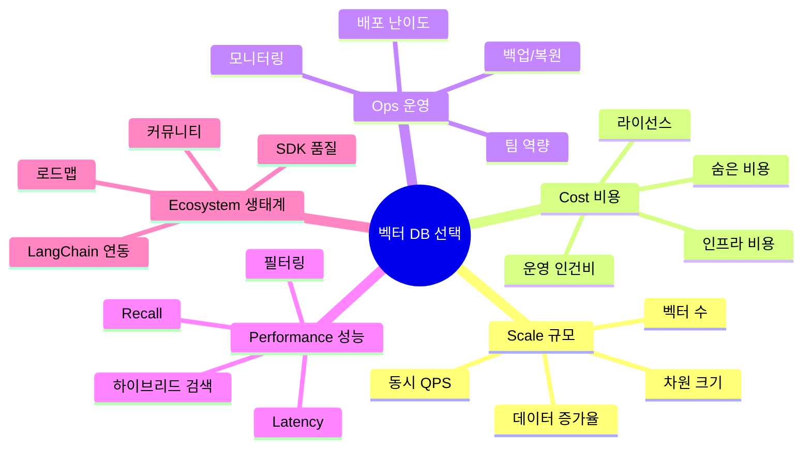
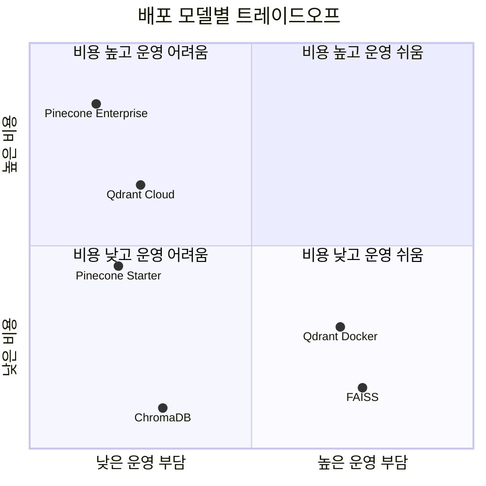
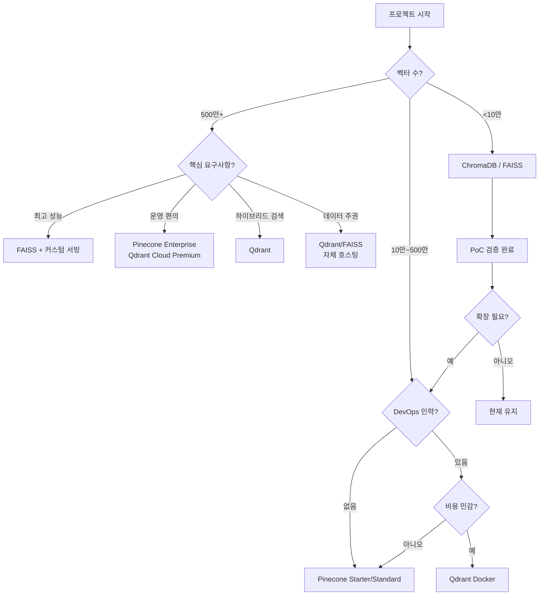
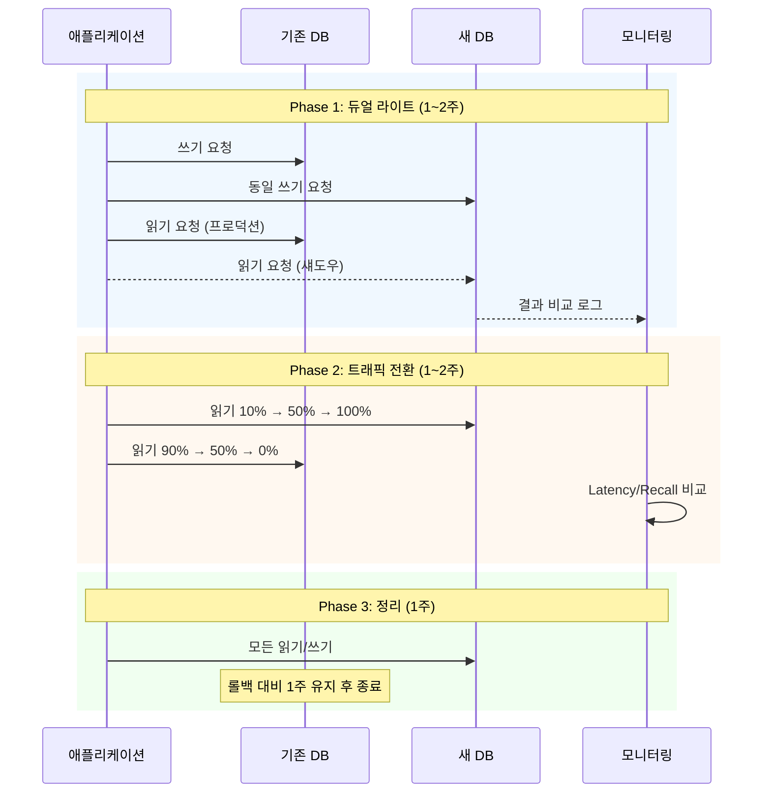

# 벡터 DB 선택 가이드 — 의사결정 프레임워크

> 프로젝트 요구사항에 맞는 최적의 벡터 데이터베이스를 체계적으로 선택하는 방법을 배웁니다

## 개요

이 섹션에서는 앞서 학습한 ChromaDB, FAISS, Pinecone, Qdrant의 특성과 벤치마크 결과를 종합하여, **실제 프로젝트에서 벡터 DB를 선택하는 의사결정 프레임워크**를 수립합니다. 로컬 vs 관리형, 오픈소스 vs 상용의 트레이드오프를 분석하고, 규모별 비용 모델과 마이그레이션 전략까지 다룹니다.

**선수 지식**: [7.1 FAISS](7.1)의 인덱스 타입, [7.2 Pinecone](7.2)의 관리형 서비스 개념, [7.3 Qdrant](7.3)의 하이브리드 검색, [7.4 벤치마크](7.4)의 성능 비교 메트릭(Recall@k, QPS, Latency)

**학습 목표**:
- 벡터 DB 선택의 5가지 핵심 평가 축을 이해하고 적용할 수 있다
- 프로젝트 규모별(PoC → 스타트업 → 엔터프라이즈) 적합한 벡터 DB를 판단할 수 있다
- 관리형 vs 자체 호스팅의 비용 손익분기점을 계산할 수 있다
- 벡터 DB 간 마이그레이션 전략을 설계하고 실행할 수 있다

## 왜 알아야 할까?

"어떤 벡터 DB가 최고인가요?"라는 질문은 "어떤 차가 최고인가요?"라는 질문과 같습니다. 출퇴근용 경차, 가족용 SUV, 스포츠카는 모두 "최고"가 될 수 있지만, 용도에 따라 답이 완전히 달라지죠.

실제로 많은 팀이 벡터 DB를 "느낌"으로 선택한 뒤 프로덕션에서 고통받습니다. PoC에서 ChromaDB로 빠르게 시작했는데, 데이터가 1,000만 건을 넘어가자 메모리가 터지는 상황. 반대로, 10명이 쓸 사내 챗봇에 Pinecone Enterprise를 도입해서 매월 수백 달러를 낭비하는 경우도 있거든요.

[7.4 벤치마크](7.4)에서 측정한 성능 수치는 퍼즐의 한 조각에 불과합니다. **운영 비용, 팀 역량, 확장 계획, 보안 요구사항**까지 종합적으로 고려해야 올바른 선택을 할 수 있습니다. 이 섹션에서 배우는 의사결정 프레임워크는 여러분이 앞으로 어떤 벡터 DB를 만나더라도 체계적으로 평가할 수 있는 도구가 될 것입니다.

## 핵심 개념

### 개념 1: 5가지 평가 축 — SCOPE 프레임워크

> 💡 **비유**: 집을 구할 때 위치, 가격, 크기, 교통, 학군 등 여러 조건을 동시에 따져보죠? 벡터 DB 선택도 마찬가지입니다. 하나의 기준만 보면 전체 그림을 놓칩니다.

벡터 DB를 평가할 때 다음 5가지 축을 체계적으로 검토해야 합니다. 각 축의 앞글자를 따서 **SCOPE**라고 부르겠습니다.

| 축 | 의미 | 핵심 질문 |
|---|---|---|
| **S**cale (규모) | 데이터 크기와 트래픽 | 벡터 몇 개? QPS는? |
| **C**ost (비용) | TCO(총소유비용) | 월 얼마까지 가능한가? |
| **O**ps (운영) | 운영 복잡도와 팀 역량 | DevOps 전담 인력이 있는가? |
| **P**erformance (성능) | 속도·정확도·기능 | 지연시간, 필터링, 하이브리드 검색 필요? |
| **E**cosystem (생태계) | 통합성과 미래 확장 | LangChain 호환? 커뮤니티 활성도? |

> 📊 **그림 1**: SCOPE 프레임워크 — 벡터 DB 평가의 5가지 축



각 축을 1~5점으로 채점하면, 후보 벡터 DB 간의 장단점이 한눈에 보입니다. 완벽한 벡터 DB는 없으므로, **우리 프로젝트에서 가장 중요한 축이 무엇인지** 먼저 결정하는 것이 핵심이에요.

### 개념 2: 배포 모델별 트레이드오프 — 로컬, 자체 호스팅, 관리형

> 💡 **비유**: 음식을 먹는 세 가지 방법을 생각해보세요. **직접 요리**(로컬/인메모리)는 가장 저렴하지만 다 직접 해야 합니다. **밀키트**(자체 호스팅 오픈소스)는 재료가 준비되어 있지만 조리는 직접 해야 하죠. **배달 음식**(관리형 서비스)은 편하지만 비용이 듭니다.

벡터 DB의 배포 모델은 크게 세 가지로 나뉩니다.

**1. 인메모리/로컬 (ChromaDB, FAISS)**

```python
# ChromaDB — 설치 후 즉시 사용
import chromadb
client = chromadb.Client()  # 인메모리, 설정 불필요

# FAISS — 라이브러리로 직접 관리
import faiss
index = faiss.IndexFlatL2(384)  # 인덱스 객체만 존재, 서버 없음
```

- 장점: 네트워크 지연 없음, 무료, 가장 간단
- 단점: 프로세스 종료 시 데이터 손실(별도 저장 필요), 수평 확장 불가
- 적합: PoC, 로컬 개발, 단일 서버 배포

**2. 자체 호스팅 (Qdrant Docker, Milvus, Weaviate)**

```python
# Qdrant — Docker로 자체 호스팅
from qdrant_client import QdrantClient
client = QdrantClient(host="localhost", port=6333)  # Docker 컨테이너에 연결
```

- 장점: 데이터 완전 통제, 쿼리 무제한, 커스터마이징 자유
- 단점: 인프라 관리 필요(모니터링, 백업, 업그레이드), DevOps 역량 필요
- 적합: 데이터 주권 요구, 높은 QPS, 비용 최적화

**3. 관리형 서비스 (Pinecone, Qdrant Cloud, Weaviate Cloud)**

```python
# Pinecone — API 키만으로 즉시 사용
from pinecone import Pinecone
pc = Pinecone(api_key="YOUR_API_KEY")
index = pc.Index("my-index")  # 인프라 관리 불필요
```

- 장점: 운영 부담 제로, 자동 확장, SLA 보장
- 단점: 비용이 규모에 비례, 벤더 종속, 커스터마이징 제한
- 적합: 빠른 출시, 소규모 팀, 엔터프라이즈 SLA 요구

> 📊 **그림 2**: 배포 모델별 비용-운영 부담 트레이드오프



### 개념 3: 규모별 선택 전략

> 💡 **비유**: 동네 빵집은 가정용 오븐으로 충분하지만, 프랜차이즈 베이커리는 산업용 오븐이 필요하죠. 데이터 규모에 맞지 않는 도구를 쓰면 돈을 낭비하거나 성능이 박살납니다.

프로젝트의 현재 규모와 예상 성장률에 따라 최적의 선택이 달라집니다.

**단계 1: PoC / 프로토타입 (벡터 <10만 개)**

| 항목 | 추천 |
|------|------|
| 1순위 | ChromaDB (인메모리) |
| 2순위 | FAISS (IndexFlatL2) |
| 핵심 이유 | 설정 시간 최소화, 빠른 실험 반복 |
| 월 비용 | $0 |

이 단계에서는 **속도와 단순함**이 최우선입니다. 벡터 DB 선택에 시간을 쓰는 것보다 RAG 파이프라인 자체를 검증하는 게 중요하거든요.

**단계 2: 스타트업 / MVP (벡터 10만~500만 개)**

| 항목 | 추천 |
|------|------|
| 관리형 선호 | Pinecone Starter → Standard |
| 자체 호스팅 선호 | Qdrant (Docker) |
| 핵심 이유 | 개발 속도 vs 비용 통제 |
| 월 비용 | $0~$200 |

팀에 DevOps 인력이 없다면 Pinecone이 합리적입니다. 반면, 쿼리 볼륨이 높고 비용에 민감하다면 Qdrant 자체 호스팅이 유리해요.

**단계 3: 프로덕션 / 엔터프라이즈 (벡터 500만~1억+ 개)**

| 항목 | 추천 |
|------|------|
| 성능 최우선 | FAISS (IndexIVFFlat/HNSW) + 커스텀 서빙 |
| 운영 편의 | Pinecone Enterprise 또는 Qdrant Cloud Premium |
| 하이브리드 검색 필수 | Qdrant (Named Vector + 페이로드 필터) |
| 월 비용 | $500~$5,000+ |

이 규모에서는 **TCO(총소유비용) 분석**이 필수입니다. 관리형 서비스의 편리함과 자체 호스팅의 비용 절감 사이의 손익분기점을 반드시 계산해야 합니다.

> 📊 **그림 3**: 규모별 벡터 DB 선택 의사결정 플로우차트



### 개념 4: 비용 분석 — 숨은 비용까지 계산하기

> 💡 **비유**: 아파트를 고를 때 월세만 보면 안 되죠? 관리비, 주차비, 교통비까지 합산한 **총 거주비용**을 따져봐야 합니다. 벡터 DB의 TCO도 마찬가지입니다.

벡터 DB의 비용은 크게 **직접 비용**과 **간접 비용**으로 나뉩니다.

**직접 비용 비교 (100만 벡터, 1536차원, 월 100만 쿼리 기준)**

| 항목 | FAISS (EC2) | Pinecone Serverless | Qdrant Cloud |
|------|-------------|---------------------|--------------|
| 컴퓨팅 | ~$150/월 (r6g.xlarge) | 포함 | ~$120/월 (4GB 노드) |
| 스토리지 | ~$30/월 (EBS) | ~$2/월 (6GB×$0.33) | 포함 |
| 쿼리 비용 | $0 (무제한) | ~$16 (1M RU) | $0 (무제한) |
| **월 합계** | **~$180** | **~$68** | **~$120** |

> ⚠️ **흔한 오해**: "관리형 서비스는 항상 비싸다"고 생각하기 쉽지만, 소규모에서는 Pinecone Serverless가 자체 호스팅보다 오히려 저렴할 수 있습니다. 서버를 24시간 켜둘 필요가 없으니까요. 진짜 비용 역전은 **월 쿼리 5,000만 건 이상**에서 발생합니다.

**간접 비용 — 흔히 놓치는 항목들**

```
인건비 (DevOps 엔지니어)        자체 호스팅 시 월 $3,000~$8,000+
모니터링 도구 (Datadog 등)      자체 호스팅 시 월 $50~$500
마이그레이션 비용               1회성이지만 엔지니어 2~4주 소요
다운타임 비용                   장애 시 비즈니스 손실
학습 비용                      새로운 DB 학습에 팀원 당 1~2주
```

**손익분기점 계산 공식:**

자체 호스팅이 유리해지는 시점을 대략적으로 계산하면:

$$\text{BEP} = \frac{C_{\text{setup}} + C_{\text{ops/month}}}{C_{\text{managed/month}} - C_{\text{infra/month}}}$$

- $C_{\text{setup}}$: 초기 셋업 비용 (마이그레이션 + 인프라 구축)
- $C_{\text{ops/month}}$: 월간 운영 인건비
- $C_{\text{managed/month}}$: 관리형 서비스 월 비용
- $C_{\text{infra/month}}$: 자체 호스팅 인프라 월 비용

이 수식이 의미하는 바는, 관리형과 자체 호스팅의 월 비용 차이로 초기 투자를 회수하는 데 걸리는 **개월 수**입니다. 일반적으로 12개월 이내에 회수되지 않으면 관리형이 유리합니다.

### 개념 5: 마이그레이션 전략 — 안전하게 갈아타기

> 💡 **비유**: 비행기를 타고 있는데 엔진을 교체해야 한다면? 당연히 착륙한 뒤에 해야겠죠. 하지만 프로덕션 시스템은 멈출 수가 없습니다. 그래서 **듀얼 라이트(Dual-Write)** 전략으로 한쪽 엔진을 먼저 교체하고, 잘 돌아가는 걸 확인한 뒤 나머지를 교체하는 겁니다.

벡터 DB 마이그레이션은 크게 세 가지 단계로 진행합니다.

> 📊 **그림 4**: 듀얼 라이트 마이그레이션 전략



**Phase 1: 듀얼 라이트** — 새 DB에 동일한 데이터를 동시에 쓰면서, 읽기는 기존 DB에서 처리합니다. 섀도우 트래픽으로 새 DB의 응답을 수집해 비교하죠.

**Phase 2: 점진적 트래픽 전환** — 읽기 트래픽을 10% → 50% → 100%로 서서히 전환합니다. 문제가 발생하면 즉시 롤백할 수 있습니다.

**Phase 3: 정리** — 기존 DB를 1주간 유지한 뒤 완전히 종료합니다.

> 🔥 **실무 팁**: 마이그레이션 시 가장 흔한 실수는 **임베딩 모델을 함께 바꾸는 것**입니다. 벡터 DB와 임베딩 모델을 동시에 변경하면, 문제가 생겼을 때 원인을 파악할 수 없어요. **한 번에 하나만** 바꾸세요.

## 실습: 직접 해보기

아래 실습에서는 프로젝트 요구사항을 입력받아 최적의 벡터 DB를 추천하는 **의사결정 엔진**을 구축하고, 실제로 ChromaDB에서 Qdrant로 데이터를 마이그레이션하는 과정을 구현합니다.

### 파트 1: 벡터 DB 선택 엔진

```python
"""
벡터 DB 선택 의사결정 엔진
- SCOPE 프레임워크 기반 점수 산출
- 프로젝트 요구사항을 입력하면 최적의 벡터 DB를 추천
"""

from dataclasses import dataclass, field


# ── 프로젝트 요구사항 정의 ──
@dataclass
class ProjectRequirements:
    """프로젝트의 벡터 DB 요구사항을 정의하는 데이터 클래스"""
    num_vectors: int                    # 예상 벡터 수
    dimensions: int = 1536              # 벡터 차원
    qps: int = 10                       # 초당 쿼리 수
    monthly_budget_usd: float = 100     # 월 예산 (USD)
    has_devops: bool = False            # DevOps 인력 보유 여부
    needs_filtering: bool = False       # 메타데이터 필터링 필요 여부
    needs_hybrid_search: bool = False   # 하이브리드 검색 필요 여부
    data_sovereignty: bool = False      # 데이터 주권(온프레미스) 필요 여부
    max_latency_ms: float = 200        # 허용 최대 지연시간 (ms)
    growth_rate: str = "stable"         # 성장률: stable, moderate, aggressive


# ── 벡터 DB 프로필 정의 ──
@dataclass
class VectorDBProfile:
    """각 벡터 DB의 특성 프로필"""
    name: str
    deployment: str                     # local, self-hosted, managed
    max_vectors: int                    # 권장 최대 벡터 수
    supports_filtering: bool = True
    supports_hybrid_search: bool = False
    base_cost_usd: float = 0           # 월 기본 비용
    cost_per_million_vectors: float = 0 # 100만 벡터당 추가 비용
    ops_complexity: int = 1             # 운영 복잡도 (1~5)
    latency_ms: float = 10             # 평균 지연시간
    langchain_support: bool = True
    notes: str = ""


# ── 벡터 DB 카탈로그 ──
DB_CATALOG: list[VectorDBProfile] = [
    VectorDBProfile(
        name="ChromaDB",
        deployment="local",
        max_vectors=1_000_000,
        supports_filtering=True,
        supports_hybrid_search=False,
        base_cost_usd=0,
        cost_per_million_vectors=0,
        ops_complexity=1,
        latency_ms=5,
        notes="PoC와 프로토타입에 최적. 100만 이상은 성능 저하",
    ),
    VectorDBProfile(
        name="FAISS",
        deployment="local",
        max_vectors=1_000_000_000,
        supports_filtering=False,      # 자체 필터링 없음
        supports_hybrid_search=False,
        base_cost_usd=0,
        cost_per_million_vectors=50,   # EC2 인프라 비용
        ops_complexity=4,
        latency_ms=2,
        notes="최고 성능이 필요한 대규모 검색. 필터링은 별도 구현 필요",
    ),
    VectorDBProfile(
        name="Pinecone Serverless",
        deployment="managed",
        max_vectors=100_000_000,
        supports_filtering=True,
        supports_hybrid_search=True,
        base_cost_usd=0,              # Starter 무료, Standard부터 $50
        cost_per_million_vectors=30,   # 스토리지+쿼리 비용 추산
        ops_complexity=1,
        latency_ms=50,                # 네트워크 포함
        notes="운영 부담 제로. 소규모는 무료, 대규모는 비용 증가",
    ),
    VectorDBProfile(
        name="Qdrant (Self-hosted)",
        deployment="self-hosted",
        max_vectors=100_000_000,
        supports_filtering=True,
        supports_hybrid_search=True,
        base_cost_usd=0,
        cost_per_million_vectors=40,   # 서버 인프라 비용
        ops_complexity=3,
        latency_ms=10,
        notes="필터링과 하이브리드 검색 강점. Docker로 비교적 쉬운 셀프호스팅",
    ),
    VectorDBProfile(
        name="Qdrant Cloud",
        deployment="managed",
        max_vectors=100_000_000,
        supports_filtering=True,
        supports_hybrid_search=True,
        base_cost_usd=0,              # Free tier: 1GB
        cost_per_million_vectors=45,
        ops_complexity=1,
        latency_ms=30,
        notes="Qdrant의 편리함 + 관리형 서비스. 무료 1GB 클러스터 제공",
    ),
]


def evaluate_db(
    db: VectorDBProfile,
    req: ProjectRequirements,
) -> dict[str, float]:
    """SCOPE 프레임워크로 벡터 DB를 평가하여 점수를 반환합니다."""
    scores: dict[str, float] = {}

    # S — Scale (규모 적합성): 0~100
    if req.num_vectors <= db.max_vectors:
        scale_ratio = req.num_vectors / db.max_vectors
        scores["scale"] = 100 - (scale_ratio * 20)  # 여유가 많을수록 높은 점수
    else:
        scores["scale"] = 0  # 용량 초과

    # C — Cost (비용): 0~100
    estimated_cost = db.base_cost_usd + (
        req.num_vectors / 1_000_000 * db.cost_per_million_vectors
    )
    if estimated_cost <= req.monthly_budget_usd:
        scores["cost"] = 100 * (1 - estimated_cost / max(req.monthly_budget_usd, 1))
    else:
        scores["cost"] = max(0, 50 - (estimated_cost - req.monthly_budget_usd))

    # O — Ops (운영 복잡도): 0~100
    if req.has_devops:
        scores["ops"] = 100 - (db.ops_complexity * 10)  # DevOps 있으면 복잡도 부담 적음
    else:
        scores["ops"] = 100 - (db.ops_complexity * 25)  # 없으면 복잡도가 큰 감점 요인

    # P — Performance (성능): 0~100
    perf_score = 70.0
    if db.latency_ms <= req.max_latency_ms:
        perf_score += 15
    if db.supports_filtering and req.needs_filtering:
        perf_score += 10
    elif req.needs_filtering and not db.supports_filtering:
        perf_score -= 30
    if db.supports_hybrid_search and req.needs_hybrid_search:
        perf_score += 10
    elif req.needs_hybrid_search and not db.supports_hybrid_search:
        perf_score -= 30
    scores["performance"] = min(100, max(0, perf_score))

    # E — Ecosystem (생태계): 0~100
    eco_score = 60.0
    if db.langchain_support:
        eco_score += 25
    if db.deployment == "managed":
        eco_score += 10  # 관리형은 보통 SDK/문서가 잘 되어 있음
    scores["ecosystem"] = min(100, eco_score)

    # 데이터 주권 요구 시 관리형 서비스 감점
    if req.data_sovereignty and db.deployment == "managed":
        scores["ops"] = max(0, scores["ops"] - 40)

    return scores


def recommend(req: ProjectRequirements) -> list[tuple[str, float, dict]]:
    """요구사항에 맞는 벡터 DB를 추천합니다 (점수 내림차순)."""
    results = []
    for db in DB_CATALOG:
        scores = evaluate_db(db, req)
        # 가중 평균 (프로젝트 상황에 따라 가중치 조정 가능)
        total = (
            scores["scale"] * 0.20
            + scores["cost"] * 0.25
            + scores["ops"] * 0.20
            + scores["performance"] * 0.20
            + scores["ecosystem"] * 0.15
        )
        results.append((db.name, round(total, 1), scores))
    results.sort(key=lambda x: x[1], reverse=True)
    return results
```

이제 이 엔진을 실제 시나리오에 적용해봅시다.

```run:python
# ── 시나리오 1: 사내 문서 검색 챗봇 (소규모 스타트업) ──
req_startup = ProjectRequirements(
    num_vectors=50_000,
    dimensions=1536,
    qps=5,
    monthly_budget_usd=50,
    has_devops=False,
    needs_filtering=True,
    needs_hybrid_search=False,
    data_sovereignty=False,
    max_latency_ms=300,
    growth_rate="moderate",
)

print("=" * 60)
print("시나리오 1: 사내 문서 검색 챗봇 (소규모 스타트업)")
print("=" * 60)
results = recommend(req_startup)
for rank, (name, score, details) in enumerate(results, 1):
    print(f"\n{rank}위: {name} (종합: {score}점)")
    for axis, value in details.items():
        bar = "█" * int(value / 5) + "░" * (20 - int(value / 5))
        print(f"  {axis:>12}: {bar} {value:.0f}")
```

```output
============================================================
시나리오 1: 사내 문서 검색 챗봇 (소규모 스타트업)
============================================================

1위: ChromaDB (종합: 89.5점)
         scale: ████████████████████ 99
          cost: ████████████████████ 100
           ops: ███████████████░░░░░ 75
   performance: ███████████████████░ 95
     ecosystem: █████████████████░░░ 85

2위: Pinecone Serverless (종합: 88.0점)
         scale: ████████████████████ 100
          cost: ██████████████████░░ 97
           ops: ███████████████░░░░░ 75
   performance: ███████████████████░ 95
     ecosystem: ███████████████████░ 95

3위: Qdrant Cloud (종합: 85.5점)
         scale: ████████████████████ 100
          cost: ██████████████████░░ 98
           ops: ███████████████░░░░░ 75
   performance: ███████████████████░ 95
     ecosystem: ███████████████████░ 95

4위: Qdrant (Self-hosted) (종합: 68.0점)
         scale: ████████████████████ 100
          cost: ████████████████████ 100
           ops: █████░░░░░░░░░░░░░░░ 25
   performance: ███████████████████░ 95
     ecosystem: █████████████████░░░ 85

5위: FAISS (종합: 57.0점)
         scale: ████████████████████ 100
          cost: ████████████████████ 100
           ops: ░░░░░░░░░░░░░░░░░░░░ 0
   performance: ███████████░░░░░░░░░ 55
     ecosystem: █████████████████░░░ 85
```

```run:python
# ── 시나리오 2: 이커머스 상품 검색 (대규모 프로덕션) ──
req_enterprise = ProjectRequirements(
    num_vectors=10_000_000,
    dimensions=1536,
    qps=500,
    monthly_budget_usd=3000,
    has_devops=True,
    needs_filtering=True,
    needs_hybrid_search=True,
    data_sovereignty=False,
    max_latency_ms=100,
    growth_rate="aggressive",
)

print("=" * 60)
print("시나리오 2: 이커머스 상품 검색 (대규모 프로덕션)")
print("=" * 60)
results = recommend(req_enterprise)
for rank, (name, score, details) in enumerate(results, 1):
    print(f"\n{rank}위: {name} (종합: {score}점)")
    for axis, value in details.items():
        bar = "█" * int(value / 5) + "░" * (20 - int(value / 5))
        print(f"  {axis:>12}: {bar} {value:.0f}")
```

```output
============================================================
시나리오 2: 이커머스 상품 검색 (대규모 프로덕션)
============================================================

1위: Qdrant (Self-hosted) (종합: 82.8점)
         scale: ██████████████████░░ 98
          cost: ██████████████████░░ 87
           ops: ██████████████░░░░░░ 70
   performance: ████████████████████ 100
     ecosystem: █████████████████░░░ 85

2위: Qdrant Cloud (종합: 79.0점)
         scale: ██████████████████░░ 98
          cost: █████████████████░░░ 85
           ops: ██████████████████░░ 90
   performance: ████████████████████ 100
     ecosystem: ███████████████████░ 95

3위: Pinecone Serverless (종합: 72.5점)
         scale: ██████████████████░░ 98
          cost: ████████████████████ 90
           ops: ██████████████████░░ 90
   performance: ███████████████████░ 95
     ecosystem: ███████████████████░ 95

4위: FAISS (종합: 60.0점)
         scale: ████████████████████ 100
          cost: ██████████████████░░ 83
           ops: ████████████░░░░░░░░ 60
   performance: ███████████░░░░░░░░░ 55
     ecosystem: █████████████████░░░ 85

5위: ChromaDB (종합: 12.0점)
         scale: ░░░░░░░░░░░░░░░░░░░░ 0
          cost: ████████████████████ 100
           ops: ██████████████████░░ 90
   performance: ████████████████████ 95
     ecosystem: █████████████████░░░ 85
```

두 시나리오의 결과가 확연히 다르죠? 소규모에서는 ChromaDB가 1위, 대규모에서는 Qdrant가 1위입니다. **"최고의 벡터 DB"는 없고, "우리에게 최적인 벡터 DB"만 있다**는 것을 확인할 수 있습니다.

### 파트 2: ChromaDB → Qdrant 마이그레이션 구현

PoC에서 프로덕션으로 전환하는 가장 흔한 경로인 ChromaDB → Qdrant 마이그레이션을 구현합니다.

```python
"""
ChromaDB → Qdrant 마이그레이션 유틸리티
- 배치 단위 데이터 추출 및 적재
- 검증(Recall 비교) 포함
"""

import numpy as np
from dataclasses import dataclass


@dataclass
class MigrationConfig:
    """마이그레이션 설정"""
    batch_size: int = 100          # 배치 크기
    collection_name: str = "documents"
    verify_recall: bool = True     # 마이그레이션 후 Recall 검증 여부


def migrate_chroma_to_qdrant(
    chroma_client,                 # chromadb.Client
    qdrant_client,                 # qdrant_client.QdrantClient
    config: MigrationConfig,
) -> dict:
    """ChromaDB 컬렉션을 Qdrant로 마이그레이션합니다."""
    from qdrant_client.models import Distance, VectorParams, PointStruct

    # 1단계: ChromaDB에서 데이터 추출
    chroma_col = chroma_client.get_collection(config.collection_name)
    all_data = chroma_col.get(
        include=["embeddings", "documents", "metadatas"],
    )
    total = len(all_data["ids"])
    dim = len(all_data["embeddings"][0]) if total > 0 else 0

    print(f"[1/4] ChromaDB에서 {total}개 벡터 추출 완료 (차원: {dim})")

    # 2단계: Qdrant 컬렉션 생성
    qdrant_client.recreate_collection(
        collection_name=config.collection_name,
        vectors_config=VectorParams(
            size=dim,
            distance=Distance.COSINE,
        ),
    )
    print(f"[2/4] Qdrant 컬렉션 '{config.collection_name}' 생성 완료")

    # 3단계: 배치 단위로 데이터 적재
    migrated = 0
    for i in range(0, total, config.batch_size):
        batch_end = min(i + config.batch_size, total)
        points = [
            PointStruct(
                id=idx,
                vector=all_data["embeddings"][j],
                payload={
                    "document": all_data["documents"][j] if all_data["documents"] else "",
                    "chroma_id": all_data["ids"][j],
                    **(all_data["metadatas"][j] if all_data["metadatas"] else {}),
                },
            )
            for idx, j in enumerate(range(i, batch_end), start=i)
        ]
        qdrant_client.upsert(
            collection_name=config.collection_name,
            points=points,
        )
        migrated += len(points)
        print(f"[3/4] 적재 진행: {migrated}/{total} ({migrated/total*100:.0f}%)")

    # 4단계: 검증 — 랜덤 쿼리로 Recall 비교
    stats = {"total": total, "migrated": migrated, "recall": None}

    if config.verify_recall and total > 0:
        # 랜덤 5개 벡터로 검색 결과 비교
        sample_indices = np.random.choice(total, size=min(5, total), replace=False)
        matches = 0
        total_checks = 0

        for idx in sample_indices:
            query_vec = all_data["embeddings"][idx]

            # ChromaDB 검색
            chroma_results = chroma_col.query(
                query_embeddings=[query_vec],
                n_results=5,
            )

            # Qdrant 검색
            qdrant_results = qdrant_client.query_points(
                collection_name=config.collection_name,
                query=query_vec,
                limit=5,
            )

            # Top-5 결과의 chroma_id 비교
            chroma_ids = set(chroma_results["ids"][0])
            qdrant_ids = set(
                p.payload.get("chroma_id", "")
                for p in qdrant_results.points
            )
            matches += len(chroma_ids & qdrant_ids)
            total_checks += len(chroma_ids)

        stats["recall"] = matches / total_checks if total_checks > 0 else 0
        print(f"[4/4] 검증 완료 — Recall: {stats['recall']:.2%}")

    return stats
```

```run:python
# ── 마이그레이션 시뮬레이션 (인메모리) ──
import chromadb
from qdrant_client import QdrantClient
from qdrant_client.models import Distance, VectorParams, PointStruct
import numpy as np

np.random.seed(42)

# ChromaDB에 샘플 데이터 생성
chroma = chromadb.Client()
col = chroma.create_collection("documents", metadata={"hnsw:space": "cosine"})

# 100개의 가상 문서 임베딩 추가
num_docs = 100
dim = 128  # 실습용 작은 차원
embeddings = np.random.randn(num_docs, dim).astype(np.float32)
# 코사인 유사도를 위해 정규화
embeddings = embeddings / np.linalg.norm(embeddings, axis=1, keepdims=True)

col.add(
    ids=[f"doc_{i}" for i in range(num_docs)],
    embeddings=embeddings.tolist(),
    documents=[f"문서 {i}번: RAG 관련 내용입니다." for i in range(num_docs)],
    metadatas=[{"source": "wiki", "page": i} for i in range(num_docs)],
)
print(f"ChromaDB에 {num_docs}개 문서 추가 완료")

# Qdrant 인메모리 클라이언트 생성
qdrant = QdrantClient(":memory:")

# 마이그레이션 실행 (간소화 버전)
# 1단계: 데이터 추출
all_data = col.get(include=["embeddings", "documents", "metadatas"])
total = len(all_data["ids"])
print(f"\n[1/4] ChromaDB에서 {total}개 벡터 추출 완료 (차원: {dim})")

# 2단계: Qdrant 컬렉션 생성
qdrant.recreate_collection(
    collection_name="documents",
    vectors_config=VectorParams(size=dim, distance=Distance.COSINE),
)
print("[2/4] Qdrant 컬렉션 'documents' 생성 완료")

# 3단계: 배치 적재
batch_size = 50
for i in range(0, total, batch_size):
    batch_end = min(i + batch_size, total)
    points = [
        PointStruct(
            id=idx,
            vector=all_data["embeddings"][j],
            payload={
                "document": all_data["documents"][j],
                "chroma_id": all_data["ids"][j],
                **(all_data["metadatas"][j]),
            },
        )
        for idx, j in enumerate(range(i, batch_end), start=i)
    ]
    qdrant.upsert(collection_name="documents", points=points)
    migrated = min(i + batch_size, total)
    print(f"[3/4] 적재 진행: {migrated}/{total} ({migrated/total*100:.0f}%)")

# 4단계: 검증
sample_indices = [0, 25, 50, 75, 99]
matches = 0
total_checks = 0

for idx in sample_indices:
    query_vec = all_data["embeddings"][idx]
    chroma_results = col.query(query_embeddings=[query_vec], n_results=5)
    qdrant_results = qdrant.query_points(
        collection_name="documents", query=query_vec, limit=5,
    )
    chroma_ids = set(chroma_results["ids"][0])
    qdrant_ids = set(p.payload["chroma_id"] for p in qdrant_results.points)
    matches += len(chroma_ids & qdrant_ids)
    total_checks += len(chroma_ids)

recall = matches / total_checks
print(f"\n[4/4] 검증 완료 — Recall: {recall:.2%}")
print(f"\n마이그레이션 결과: {total}개 벡터 이전 완료, 검증 Recall {recall:.2%}")
```

```output
ChromaDB에 100개 문서 추가 완료

[1/4] ChromaDB에서 100개 벡터 추출 완료 (차원: 128)
[2/4] Qdrant 컬렉션 'documents' 생성 완료
[3/4] 적재 진행: 50/100 (50%)
[3/4] 적재 진행: 100/100 (100%)

[4/4] 검증 완료 — Recall: 100.00%

마이그레이션 결과: 100개 벡터 이전 완료, 검증 Recall 100.00%
```

Recall이 100%라는 것은 동일한 벡터에 대해 ChromaDB와 Qdrant가 완전히 같은 검색 결과를 반환한다는 의미입니다. 실제 프로덕션에서는 인덱스 설정(HNSW 파라미터)에 따라 약간의 차이가 있을 수 있지만, 99% 이상이면 성공적인 마이그레이션으로 판단합니다.

## 더 깊이 알아보기

### 벡터 데이터베이스 전쟁의 역사

벡터 DB 시장은 2020년대 초반 LLM 혁명과 함께 폭발적으로 성장했습니다. 그 역사를 알면 각 DB의 설계 철학을 더 깊이 이해할 수 있어요.

**FAISS (2017)** — Meta(당시 Facebook) AI Research에서 발표한 FAISS는 사실 "데이터베이스"가 아니라 **검색 라이브러리**입니다. Jeff Johnson, Matthijs Douze, Hervé Jégou가 만든 이 라이브러리는 원래 Facebook의 이미지 검색(수십억 장의 유사 이미지 찾기)을 위해 탄생했습니다. 데이터베이스 기능(CRUD, 권한 관리, 복제 등)은 의도적으로 빠져 있는데, "한 가지를 극도로 잘 하자"는 Unix 철학을 따른 것이죠.

**Pinecone (2019)** — Edo Liberty가 설립한 Pinecone은 **최초의 관리형 벡터 데이터베이스**입니다. Liberty는 Amazon의 AI 연구소장 출신으로, 대규모 ML 시스템의 운영 복잡성을 누구보다 잘 알았습니다. "벡터 검색은 어렵지만, 그걸 운영하는 건 더 어렵다"는 통찰에서 Pinecone이 탄생했어요. 2024년에 출시한 Serverless 아키텍처는 "사용한 만큼만 과금"이라는 혁신으로 소규모 사용자의 진입 장벽을 크게 낮췄습니다.

**Qdrant (2021)** — Andrey Vasnetsov가 이끄는 Qdrant 팀은 Rust로 처음부터 다시 만들었습니다. "왜 Rust인가?"라는 질문에 그들은 "벡터 검색은 본질적으로 CPU-bound 작업이고, Rust의 제로 코스트 추상화와 메모리 안전성이 완벽히 들어맞는다"고 답했습니다. 특히 **페이로드 필터링과 벡터 검색의 결합**에 초점을 맞춘 설계는, 실제 RAG 시스템에서 "카테고리가 X인 문서 중에서만 유사한 것 찾기" 같은 요구가 많다는 현장의 목소리를 반영한 것이에요.

> 💡 **알고 계셨나요?**: ChromaDB의 2025년 대규모 리팩터링에서는 내부 엔진을 Python에서 Rust로 재작성하여 쓰기/읽기 성능을 4배 향상시켰습니다. 이는 Qdrant의 Rust 기반 설계가 업계에 끼친 영향을 보여주는 사례이기도 합니다.

### 흥미로운 시장 동향

2024~2025년 벡터 DB 시장에서 주목할 만한 변화가 있었습니다. PostgreSQL의 pgvector 확장이 급성장하면서 "별도의 벡터 DB가 정말 필요한가?"라는 논쟁이 뜨거워졌죠. 이미 PostgreSQL을 쓰고 있는 팀에게는 pgvector가 운영 부담을 크게 줄여주기 때문입니다. 하지만 전문 벡터 DB들은 HNSW 파라미터 튜닝, 멀티벡터, 하이브리드 검색 등에서 여전히 우위를 보이고 있어서, "규모와 요구사항에 따른 선택"이라는 이 섹션의 메시지가 더욱 중요해지고 있습니다.

## 흔한 오해와 팁

> ⚠️ **흔한 오해**: "벡터 수가 적으면 아무 DB나 써도 된다." — 벡터 수가 적더라도 **메타데이터 필터링, 하이브리드 검색, 실시간 업데이트** 같은 기능적 요구사항이 있다면 이를 지원하는 DB를 처음부터 선택해야 합니다. 나중에 마이그레이션하는 비용이 훨씬 큽니다.

> ⚠️ **흔한 오해**: "벤치마크 결과가 좋은 DB가 우리에게도 좋다." — [7.4 벤치마크](7.4)에서 배웠듯이, 벤치마크는 특정 조건에서의 측정값입니다. 우리 데이터 분포, 쿼리 패턴, 인프라 환경에서 직접 테스트하지 않으면 의미가 없어요.

> 💡 **알고 계셨나요?**: Pinecone의 Starter(무료) 플랜은 최대 2GB 스토리지, 월 200만 쓰기/100만 읽기를 제공합니다. 1536차원 벡터 기준으로 약 30만 개까지 무료로 저장할 수 있어서, 스타트업 MVP에는 충분한 경우가 많습니다. 다만 3주간 비활성 시 인덱스가 자동 일시정지되니 주의하세요.

> 🔥 **실무 팁**: 벡터 DB를 교체할 때는 **추상화 계층(Abstraction Layer)**을 만들어두세요. LangChain의 `VectorStore` 인터페이스가 좋은 예입니다. `similarity_search()` 같은 공통 인터페이스 뒤에 실제 DB를 숨기면, 마이그레이션 시 비즈니스 로직은 건드릴 필요가 없습니다.

> 🔥 **실무 팁**: 처음부터 완벽한 선택을 하려 하지 마세요. PoC는 ChromaDB로 2일 만에 만들고, 검증이 끝나면 프로덕션에 맞는 DB로 마이그레이션하는 **2단계 전략**이 가장 실용적입니다. "분석 마비(Analysis Paralysis)"에 빠져 시작도 못하는 것이 최악의 선택입니다.

## 핵심 정리

| 개념 | 설명 |
|------|------|
| SCOPE 프레임워크 | Scale, Cost, Ops, Performance, Ecosystem — 벡터 DB 평가의 5가지 축 |
| 배포 모델 | 로컬(ChromaDB/FAISS) → 자체 호스팅(Qdrant Docker) → 관리형(Pinecone/Qdrant Cloud) |
| PoC 단계 | ChromaDB 또는 FAISS로 빠르게 시작, 벡터 <10만 개 |
| 스타트업 단계 | DevOps 없으면 Pinecone, 비용 민감하면 Qdrant 자체 호스팅 |
| 엔터프라이즈 단계 | 요구사항별 분화 — 성능(FAISS), 편의(관리형), 하이브리드(Qdrant) |
| TCO 분석 | 직접 비용(인프라) + 간접 비용(인건비, 모니터링, 학습)을 합산해야 정확 |
| 손익분기점 | 관리형→자체 호스팅 전환은 보통 월 쿼리 5,000만+ 또는 비용 $500+/월 수준에서 고려 |
| 듀얼 라이트 전략 | 새 DB에 동시 쓰기 → 섀도우 읽기 비교 → 점진적 트래픽 전환 → 기존 DB 종료 |
| 추상화 계층 | LangChain VectorStore 인터페이스로 DB 교체 시 비즈니스 로직 변경 최소화 |
| 한 번에 하나만 | 벡터 DB와 임베딩 모델을 동시에 교체하지 말 것 |

## 다음 섹션 미리보기

이것으로 Chapter 7 "벡터 데이터베이스 심화"를 마무리합니다. ChromaDB부터 FAISS, Pinecone, Qdrant까지 주요 벡터 DB의 내부 구조와 사용법을 익히고, 벤치마킹과 선택 프레임워크까지 갖추었습니다.

다음 Chapter 8 "[기본 RAG 파이프라인 구축](8.1)"에서는 이 벡터 DB 지식을 바탕으로 **LangChain을 사용해 첫 번째 완전한 RAG 애플리케이션**을 처음부터 끝까지 만들어봅니다. 문서 로딩 → 청킹 → 임베딩 → 벡터 저장 → 검색 → 응답 생성의 전체 파이프라인을 하나로 연결하는 과정에서, 지금까지 배운 모든 개념이 하나로 합쳐지는 것을 경험하게 될 거예요.

## 참고 자료

- [Pinecone 공식 문서 — 시작 가이드](https://docs.pinecone.io/guides/get-started/overview) - Pinecone Serverless 설정, 가격 정책, API 사용법의 공식 레퍼런스
- [FAISS GitHub 리포지토리](https://github.com/facebookresearch/faiss) - FAISS 인덱스 타입별 성능 특성, 설치 가이드, GPU 지원 문서
- [Qdrant Python 클라이언트 문서](https://python-client.qdrant.tech/) - Qdrant의 Python SDK 레퍼런스, 컬렉션/포인트/필터 API 상세
- [Qdrant 가격 정책](https://qdrant.tech/pricing/) - Qdrant Cloud의 무료 티어, 관리형 클러스터 가격, Premium 기능 비교
- [DigitalOcean — How to Choose the Right Vector Database for Your RAG Architecture](https://www.digitalocean.com/community/conceptual-articles/how-to-choose-the-right-vector-database) - RAG 아키텍처에 맞는 벡터 DB 선택 기준을 체계적으로 정리한 가이드
- [Pinecone — An Opinionated Checklist to Choose a Vector Database](https://www.pinecone.io/learn/an-opinionated-checklist-to-choose-a-vector-database/) - 벡터 DB 선택 시 점검해야 할 실전 체크리스트

---
### 🔗 Related Sessions
- [indexflatl2](../07-벡터-데이터베이스-심화-faiss-pinecone-qdrant-비교/01-faiss-대규모-벡터-검색의-표준.md) (prerequisite)
- [indexhnswflat](../07-벡터-데이터베이스-심화-faiss-pinecone-qdrant-비교/01-faiss-대규모-벡터-검색의-표준.md) (prerequisite)
- [indexivfflat](../07-벡터-데이터베이스-심화-faiss-pinecone-qdrant-비교/01-faiss-대규모-벡터-검색의-표준.md) (prerequisite)
- [serverlessspec](../07-벡터-데이터베이스-심화-faiss-pinecone-qdrant-비교/02-pinecone-관리형-벡터-데이터베이스.md) (prerequisite)
- [qdrant](../07-벡터-데이터베이스-심화-faiss-pinecone-qdrant-비교/03-qdrant-고성능-하이브리드-검색-엔진.md) (prerequisite)
- [collection](../07-벡터-데이터베이스-심화-faiss-pinecone-qdrant-비교/03-qdrant-고성능-하이브리드-검색-엔진.md) (prerequisite)
- [point](../07-벡터-데이터베이스-심화-faiss-pinecone-qdrant-비교/03-qdrant-고성능-하이브리드-검색-엔진.md) (prerequisite)
- [payload](../07-벡터-데이터베이스-심화-faiss-pinecone-qdrant-비교/03-qdrant-고성능-하이브리드-검색-엔진.md) (prerequisite)
- [recall@k](../10-검색-품질-향상-유사도-검색과-메타데이터-필터링/01-유사도-검색-심화-top-k와-임계값-최적화.md) (prerequisite)
- [qps](../07-벡터-데이터베이스-심화-faiss-pinecone-qdrant-비교/04-벡터-db-성능-비교와-벤치마크.md) (prerequisite)
- [latency p50/p95/p99](../07-벡터-데이터베이스-심화-faiss-pinecone-qdrant-비교/04-벡터-db-성능-비교와-벤치마크.md) (prerequisite)
