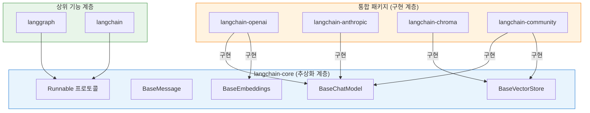
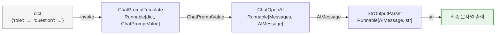
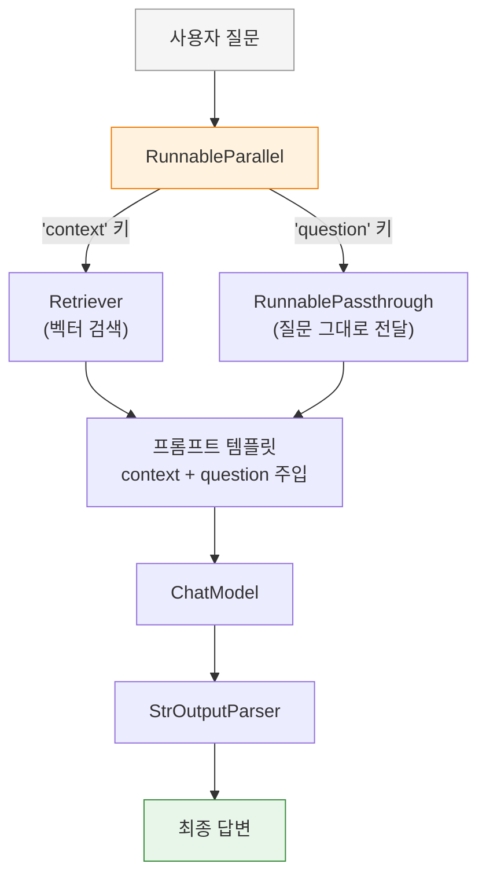
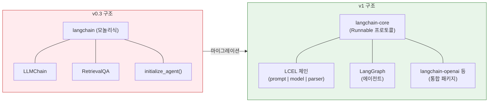

# LangChain v1 핵심 개념과 설정

> LangChain v1의 패키지 아키텍처와 설계 철학을 이해하고, Runnable 프로토콜 기반의 LCEL 체인 조합법을 익힙니다.

## 개요

이 섹션에서는 LangChain v1의 패키지 구조가 **왜** 이렇게 설계되었는지 그 철학을 파악하고, 핵심 추상화인 Runnable 프로토콜과 LCEL의 내부 동작을 이해합니다. Ch7까지 벡터 검색의 원리와 성능 최적화를 깊이 다뤘는데요, 이제 그 지식을 실제 애플리케이션으로 조립할 차례입니다. 단순 설치 가이드가 아니라, "왜 이 프레임워크가 이렇게 생겼는지"를 이해하는 것이 목표입니다.

**선수 지식**: 임베딩(Ch5), 벡터 데이터베이스(Ch6-7)의 개념, Python 가상환경과 pip 사용법

**학습 목표**:
- LangChain v1의 패키지 분리 철학과 의존성 역전 원칙을 이해한다
- Runnable 프로토콜의 핵심 메서드(`invoke`, `stream`, `batch`)와 타입 시스템을 파악한다
- LCEL의 `|` 연산자가 내부적으로 `RunnableSequence`를 생성하는 메커니즘을 이해한다
- v0.3 → v1의 실질적 Breaking Change와 마이그레이션 전략을 적용할 수 있다

## 왜 알아야 할까?

Ch7에서 HNSW 인덱스 튜닝, 벤치마킹까지 해봤다면, 이제 자연스러운 다음 질문은 "이 벡터 검색을 LLM과 어떻게 연결하지?"일 겁니다. 물론 OpenAI API + ChromaDB를 직접 호출해서 RAG를 구축할 수 있어요. 하지만 실제로 해보면 금방 깨닫게 됩니다—문서 로더, 임베딩 호출, 벡터 저장소 연결, 프롬프트 관리, LLM 호출, 출력 파싱을 모두 직접 작성하면 "배관 공사"에 시간의 70%를 쓰게 된다는 걸요.

LangChain은 이 배관 공사를 표준화된 인터페이스로 묶어주는 프레임워크입니다. 그런데 LangChain은 2022년 말 출시 이후 API가 너무 자주 바뀌어서, "LangChain 버전 지옥"이라는 별명이 붙을 정도였죠. 인터넷에서 찾은 튜토리얼 코드가 3개월 전 것이라도 이미 deprecated일 수 있었습니다.

2025년 11월에 드디어 v1.0이 정식 출시되면서 상황이 완전히 바뀌었어요. **"v2.0 전까지 Breaking Change 없음"**이라는 공식 약속이 나왔고, 패키지 구조도 명확한 설계 원칙 위에 재정립되었습니다. 이 섹션에서는 그 설계 원칙부터 파악해서, 앞으로 LangChain이 업데이트되더라도 흔들리지 않는 이해를 갖추는 것이 목표입니다.

## 핵심 개념

### 개념 1: 패키지 아키텍처 — 의존성 역전 원칙

> 💡 **비유**: 스마트폰 충전기를 떠올려 보세요. USB-C라는 **표준 인터페이스** 덕분에, 삼성이든 Apple이든 같은 케이블로 충전할 수 있습니다. LangChain의 `langchain-core`가 바로 이 USB-C 규격이에요. 각 제조사(OpenAI, Anthropic, Chroma 등)는 이 규격에 맞는 충전기(통합 패키지)를 만들면 됩니다.

LangChain v1의 패키지 구조는 단순히 "코드를 나눈 것"이 아니라, 소프트웨어 설계의 **의존성 역전 원칙(DIP)**을 따릅니다. 핵심 추상화(`langchain-core`)가 구체적 구현(OpenAI, Chroma 등)에 의존하지 않고, 반대로 구현이 추상화에 의존하는 구조예요.

> 📊 **그림 1**: LangChain v1의 패키지 의존성 구조



이 구조의 실질적인 이점이 뭘까요? Ch7에서 ChromaDB를 사용했는데, 프로덕션에서 Pinecone으로 교체해야 한다고 가정해봅시다. `langchain-core`의 `BaseVectorStore` 인터페이스가 동일하므로, 임포트 경로와 초기화 코드만 바꾸면 나머지 RAG 파이프라인은 그대로 동작합니다.

| 패키지 | 역할 | 의존 대상 |
|--------|------|----------|
| `langchain-core` | 추상 인터페이스 (Runnable, Message, Prompt 등) | 없음 (최소 의존성) |
| `langchain` | 에이전트, 체인 등 고수준 기능 | `langchain-core` |
| `langchain-openai` | OpenAI/Azure OpenAI 구현체 | `langchain-core` + `openai` |
| `langchain-anthropic` | Anthropic Claude 구현체 | `langchain-core` + `anthropic` |
| `langchain-chroma` | ChromaDB 벡터 스토어 구현체 | `langchain-core` + `chromadb` |
| `langchain-community` | 서드파티 통합 (소규모/레거시) | `langchain-core` |
| `langgraph` | 상태 기반 에이전트 오케스트레이션 | `langchain-core` |

> ⚠️ **흔한 오해**: 예전 코드에서 `from langchain.chat_models import ChatOpenAI`처럼 메인 `langchain` 패키지에서 직접 임포트하는 패턴을 많이 볼 수 있습니다. v1에서 이런 레거시 임포트 경로는 deprecated 경고와 함께 남아 있거나, `langchain-community`로 이동되었어요. 별도의 `langchain-classic`이라는 패키지가 있는 건 아닙니다. 새 코드를 작성할 때는 반드시 전용 통합 패키지에서 임포트하세요.

설치는 간단합니다. 이 코스에서 사용할 패키지를 한 번에 설치하세요:

```bash
# 가상환경 생성 및 활성화
python -m venv rag-env
source rag-env/bin/activate  # Windows: rag-env\Scripts\activate

# 핵심 패키지 + 벡터 DB (langchain-core는 자동 설치됨)
pip install langchain langchain-openai langchain-community langchain-chroma python-dotenv
```

프로젝트 루트에 `.env` 파일을 생성하고 API 키를 설정합니다:

```python
# .env 파일
OPENAI_API_KEY=sk-your-api-key-here
```

### 개념 2: Runnable 프로토콜 — 모든 것의 기반

> 💡 **비유**: 레고 브릭은 크기나 색상이 달라도 모두 같은 규격의 돌기와 홈을 가지고 있죠. 그래서 어떤 브릭이든 서로 끼울 수 있습니다. LangChain의 `Runnable`이 바로 이 "돌기와 홈" 규격입니다. 프롬프트, 모델, 파서 — 전부 `Runnable`이기 때문에 자유롭게 연결됩니다.

LangChain v1에서 가장 중요한 개념은 **`Runnable` 프로토콜**입니다. LCEL의 `|` 연산자, 스트리밍, 배치 처리 — 이 모든 것이 `Runnable` 위에 세워져 있어요.

`Runnable`은 입력 타입 `Input`을 받아 출력 타입 `Output`을 반환하는 제네릭 인터페이스입니다:

```python
class Runnable(Generic[Input, Output]):
    def invoke(self, input: Input, config: RunnableConfig = None) -> Output: ...
    def stream(self, input: Input, config: RunnableConfig = None) -> Iterator[Output]: ...
    def batch(self, inputs: list[Input], config: RunnableConfig = None) -> list[Output]: ...
    
    # 비동기 버전
    async def ainvoke(self, input: Input, config: RunnableConfig = None) -> Output: ...
    async def astream(self, input: Input, config: RunnableConfig = None) -> AsyncIterator[Output]: ...
    async def abatch(self, inputs: list[Input], config: RunnableConfig = None) -> list[Output]: ...
```

왜 이게 강력할까요? 모든 LangChain 컴포넌트가 이 인터페이스를 구현하므로, **어떤 조합이든 동일한 방식으로 실행**할 수 있습니다:

| 컴포넌트 | `Input` 타입 | `Output` 타입 |
|----------|------------|--------------|
| `ChatPromptTemplate` | `dict` | `ChatPromptValue` |
| `ChatOpenAI` | `list[BaseMessage]` | `AIMessage` |
| `StrOutputParser` | `AIMessage` | `str` |
| `RunnableSequence` (체인) | 첫 Runnable의 `Input` | 마지막 Runnable의 `Output` |

> 📊 **그림 2**: Runnable 프로토콜의 타입 흐름



이 타입 흐름을 이해하면 LCEL 체인에서 에러가 날 때 어디가 문제인지 바로 진단할 수 있습니다. 예를 들어 `ChatOpenAI` 다음에 `dict`를 입력으로 받는 컴포넌트를 연결하면, `AIMessage`와 `dict` 사이의 타입 불일치로 에러가 발생하죠.

### 개념 3: ChatModel vs LLM — 왜 Chat이 표준이 되었나

> 💡 **비유**: LLM은 "빈칸 채우기" 시험지 같고, ChatModel은 "카카오톡 대화창" 같습니다. LLM에게는 텍스트 한 덩어리를 주고 이어서 쓰라고 하지만, ChatModel에게는 역할이 구분된 메시지 목록(시스템, 사용자, AI)을 주고 응답을 받습니다.

| 구분 | LLM (`BaseLLM`) | ChatModel (`BaseChatModel`) |
|------|------------------|-----------------------------|
| 입력 | 문자열 (`str`) | 메시지 리스트 (`list[BaseMessage]`) |
| 출력 | 문자열 (`str`) | `AIMessage` 객체 |
| 예시 모델 | GPT-3 (text-davinci) | GPT-4o, Claude, Gemini |
| 사용 추세 | 레거시 | **현재 표준** |

RAG 파이프라인에서는 ChatModel을 사용합니다. 현대 LLM은 거의 모두 Chat 인터페이스를 제공하거든요. ChatModel의 반환 타입인 `AIMessage`에는 단순 텍스트 외에도 `tool_calls`, `usage_metadata`, `response_metadata` 등 풍부한 메타데이터가 포함되어 있어서, RAG 파이프라인의 모니터링과 디버깅에 매우 유용합니다.

```run:python
from langchain_openai import ChatOpenAI
from langchain_core.messages import HumanMessage, SystemMessage

# ChatModel 초기화
llm = ChatOpenAI(
    model="gpt-4o-mini",      # 모델 선택
    temperature=0,              # 결정적 출력 (RAG에 적합)
    max_tokens=500,             # 최대 출력 토큰
)

# 메시지 리스트로 호출
messages = [
    SystemMessage(content="당신은 RAG 전문가입니다."),
    HumanMessage(content="RAG란 무엇인가요? 한 문장으로 답하세요."),
]

response = llm.invoke(messages)
print(f"타입: {type(response).__name__}")
print(f"응답: {response.content}")
print(f"토큰 사용량: {response.usage_metadata}")
```

```output
타입: AIMessage
응답: RAG(Retrieval-Augmented Generation)는 외부 지식 소스에서 관련 정보를 검색하여 LLM의 응답 생성을 보강하는 기법입니다.
토큰 사용량: {'input_tokens': 38, 'output_tokens': 42, 'total_tokens': 80}
```

### 개념 4: LCEL — 파이프로 연결하는 선언적 체인

> 💡 **비유**: 유닉스의 파이프(`|`)를 아시나요? `cat file.txt | grep "error" | wc -l`처럼 명령어를 연결하듯, LCEL은 LangChain 컴포넌트를 `|` 연산자로 연결합니다. 프롬프트 → 모델 → 출력 파서를 한 줄로 조합할 수 있죠.

LCEL(LangChain Expression Language)은 LangChain의 선언적 체인 조합 문법입니다. 내부적으로 `|` 연산자는 `Runnable.__or__` 메서드를 호출하여 `RunnableSequence`를 자동 생성합니다. 이 `RunnableSequence` 자체도 `Runnable`이므로, 다시 다른 컴포넌트와 `|`로 연결할 수 있어요.

```run:python
from langchain_openai import ChatOpenAI
from langchain_core.prompts import ChatPromptTemplate
from langchain_core.output_parsers import StrOutputParser

# 1) 프롬프트 템플릿 정의
prompt = ChatPromptTemplate.from_messages([
    ("system", "당신은 {role}입니다. 간결하게 답하세요."),
    ("human", "{question}"),
])

# 2) 모델 초기화
model = ChatOpenAI(model="gpt-4o-mini", temperature=0)

# 3) 출력 파서 (AIMessage → 순수 문자열)
parser = StrOutputParser()

# 4) LCEL 파이프로 체인 조합
chain = prompt | model | parser

# 내부 구조 확인 — RunnableSequence가 생성됨
print(f"체인 타입: {type(chain).__name__}")
print(f"구성 요소: {[type(step).__name__ for step in chain.steps]}")

# 5) 실행
result = chain.invoke({
    "role": "RAG 전문가",
    "question": "임베딩이란 무엇인가요?"
})
print(f"\n응답: {result}")
```

```output
체인 타입: RunnableSequence
구성 요소: ['ChatPromptTemplate', 'ChatOpenAI', 'StrOutputParser']

응답: 임베딩은 텍스트나 데이터를 고차원 벡터 공간의 숫자 배열로 변환하여, 의미적 유사성을 수학적 거리로 표현할 수 있게 하는 기법입니다.
```

한 번 조합한 `chain` 객체는 `invoke()`, `stream()`, `batch()`, `ainvoke()` 등 표준 메서드를 모두 자동으로 지원합니다. 동기/비동기, 단건/배치 전환을 인터페이스 변경 없이 할 수 있다는 게 `Runnable` 프로토콜의 핵심 가치죠.

```python
# 스트리밍 출력 — 토큰 단위로 실시간 출력
for chunk in chain.stream({"role": "RAG 전문가", "question": "벡터 DB란?"}):
    print(chunk, end="", flush=True)

# 배치 실행 — 여러 입력을 한 번에 처리
results = chain.batch([
    {"role": "RAG 전문가", "question": "청킹이란?"},
    {"role": "RAG 전문가", "question": "리랭킹이란?"},
])

# 비동기 실행 — FastAPI 같은 비동기 서버에서 유용
import asyncio
result = asyncio.run(chain.ainvoke({"role": "RAG 전문가", "question": "HNSW란?"}))
```

#### LCEL의 고급 조합: RunnablePassthrough와 RunnableLambda

실제 RAG 파이프라인에서는 단순 직렬 체인만으로는 부족합니다. 검색 결과와 원본 질문을 동시에 프롬프트에 주입해야 하거든요. 이때 `RunnablePassthrough`와 `RunnableParallel`이 핵심 역할을 합니다.

> 📊 **그림 3**: RAG 체인에서의 RunnableParallel 활용



```python
from langchain_core.runnables import RunnablePassthrough, RunnableLambda

# 문서 포맷팅 함수를 Runnable로 변환
format_docs = RunnableLambda(lambda docs: "\n\n".join(d.page_content for d in docs))

# RAG 체인의 전형적 구조 (retriever는 다음 세션에서 구현)
rag_chain = (
    {"context": retriever | format_docs, "question": RunnablePassthrough()}
    | prompt
    | model
    | parser
)
```

이 패턴은 Ch8 전체에서 반복적으로 등장하므로, 지금 구조를 이해해두면 이후 세션이 훨씬 수월합니다.

### 개념 5: v0.3 → v1 마이그레이션 — 실질적 변경점

LangChain v1은 2025년 11월에 정식 출시되었습니다. 단순한 버전 번호 변경이 아니라, 그간의 "버전 지옥"을 해소하기 위한 구조적 개편이었죠. 기존 프로젝트를 마이그레이션하거나, 인터넷의 레거시 코드를 참고할 때 알아야 할 핵심 변경점을 정리합니다.

**1. Python 3.10 이상 필수**

모든 LangChain 패키지가 Python 3.10+를 요구합니다. `match-case`, `X | Y` 유니온 타입 등 최신 문법을 활용할 수 있어요.

**2. Pydantic v2 전면 전환**

이전에는 호환성 문제로 `langchain_core.pydantic_v1`이라는 별도 네임스페이스를 사용했지만, v1에서는 표준 Pydantic v2를 직접 사용합니다. 이 변경은 코드 전반에 영향을 미칩니다:

```python
# ❌ v0.3 이전 — 더 이상 사용하지 마세요
from langchain_core.pydantic_v1 import BaseModel, Field

# ✅ v1 — 표준 Pydantic v2 직접 사용
from pydantic import BaseModel, Field
```

Pydantic v2에서 달라진 주요 메서드:

| v1 (deprecated) | v2 (현재) | 용도 |
|-----------------|-----------|------|
| `.dict()` | `.model_dump()` | 딕셔너리 변환 |
| `.json()` | `.model_dump_json()` | JSON 문자열 변환 |
| `.schema()` | `.model_json_schema()` | JSON 스키마 추출 |
| `class Config:` | `model_config = {...}` | 모델 설정 |

**3. 레거시 체인 클래스 제거와 LCEL 표준화**

v0.3까지 존재하던 `LLMChain`, `ConversationalRetrievalChain`, `RetrievalQA` 같은 레거시 체인 클래스들이 v1에서 완전히 deprecated되었습니다. 이들은 각각 고유한 인터페이스를 가지고 있어서 조합이 어려웠는데, 이제 모두 LCEL로 대체됩니다.

```python
# ❌ v0.3 — 레거시 체인 (deprecated)
from langchain.chains import LLMChain, RetrievalQA

chain = LLMChain(llm=llm, prompt=prompt)
result = chain.run(question="RAG란?")  # .run()은 deprecated

# ✅ v1 — LCEL 체인 (권장)
chain = prompt | llm | StrOutputParser()
result = chain.invoke({"question": "RAG란?"})  # 표준 Runnable 인터페이스
```

왜 이런 결정을 했을까요? 레거시 체인들은 각각 서로 다른 메서드(`.run()`, `.call()`, `.__call__()`)와 입출력 포맷을 가지고 있어서, 체인끼리 조합하려면 중간에 변환 코드를 넣어야 했습니다. LCEL은 모든 것을 `Runnable`로 통일하여 이 문제를 근본적으로 해결한 거예요.

**4. 메시지 포맷 표준화**

v1에서는 내부 메시지 포맷이 표준 콘텐츠 블록(text, reasoning, citations, tool_calls)을 지원합니다. `AIMessage`의 `content`가 단순 문자열 뿐 아니라 구조화된 블록 리스트일 수 있어서, 멀티모달 응답이나 도구 호출 결과를 일관된 방식으로 처리할 수 있습니다.

**5. 에이전트 아키텍처 전면 개편**

LangGraph가 에이전트의 기반 런타임이 되었습니다. `initialize_agent()` 같은 레거시 API는 완전히 deprecated되었어요. 이 부분은 Ch16(에이전틱 RAG)에서 자세히 다룹니다.

> 📊 **그림 4**: v0.3에서 v1로의 아키텍처 변화



> 🔥 **실무 팁**: 기존 프로젝트를 마이그레이션할 때는 [공식 마이그레이션 가이드](https://docs.langchain.com/oss/python/migrate/langchain-v1)를 참고하세요. 가장 안전한 순서는: ① deprecated 경고가 뜨는 임포트 경로를 전용 패키지로 교체 → ② `pydantic_v1` 임포트를 표준 pydantic으로 변환 → ③ 레거시 체인(`LLMChain` 등)을 LCEL로 재작성. 한 번에 하지 말고 각 단계에서 테스트를 돌려가며 점진적으로 전환하세요.

## 실습: 직접 해보기

지금까지 배운 개념을 모두 활용하여, LangChain v1 환경 검증과 함께 **Ch7에서 다룬 벡터 검색 개념을 LCEL 체인으로 연결하는 미니 파이프라인**을 만들어봅시다.

```python
"""
LangChain v1 환경 검증 + 미니 RAG 프로토타입
- 패키지 구조 검증
- Runnable 프로토콜 확인
- LCEL 체인으로 간이 RAG 흐름 구성
"""

import os
from dotenv import load_dotenv

# 1. 환경 변수 로드
load_dotenv()

# 2. 패키지 버전 및 의존성 구조 확인
import langchain
import langchain_core
import langchain_openai

print("=" * 50)
print("LangChain v1 패키지 구조 검증")
print("=" * 50)
print(f"langchain:        {langchain.__version__}")
print(f"langchain-core:   {langchain_core.__version__}")
print(f"langchain-openai: {langchain_openai.__version__}")
print()

# 3. Runnable 프로토콜 확인 — 모든 컴포넌트가 동일 인터페이스를 구현
from langchain_openai import ChatOpenAI
from langchain_core.prompts import ChatPromptTemplate
from langchain_core.output_parsers import StrOutputParser
from langchain_core.runnables import Runnable

model = ChatOpenAI(model="gpt-4o-mini", temperature=0)
prompt = ChatPromptTemplate.from_messages([
    ("system", "당신은 {domain} 전문가입니다. 한 문장으로 답하세요."),
    ("human", "{concept}의 핵심을 설명해주세요."),
])
parser = StrOutputParser()

# 모두 Runnable인지 확인
for name, component in [("prompt", prompt), ("model", model), ("parser", parser)]:
    print(f"{name}: Runnable? {isinstance(component, Runnable)}")
print()

# 4. LCEL 체인 조합 및 내부 구조 확인
chain = prompt | model | parser
print(f"체인 타입: {type(chain).__name__}")
print(f"체인 구성: {[type(s).__name__ for s in chain.steps]}")
print()

# 5. 배치 실행 — Ch5-7에서 배운 개념들을 LangChain으로 설명 요청
concepts = [
    {"domain": "정보 검색", "concept": "임베딩(Embedding)"},
    {"domain": "데이터베이스", "concept": "벡터 데이터베이스(Vector Database)"},
    {"domain": "자연어 처리", "concept": "RAG(Retrieval-Augmented Generation)"},
]

print("LCEL 배치 실행 테스트")
print("-" * 50)
results = chain.batch(concepts)
for concept_input, result in zip(concepts, results):
    print(f"[{concept_input['concept']}]")
    print(f"  → {result}")
    print()

# 6. 스트리밍 테스트 — 토큰 단위 출력 확인
print("스트리밍 테스트")
print("-" * 50)
token_count = 0
for chunk in chain.stream({"domain": "RAG", "concept": "LCEL(LangChain Expression Language)"}):
    token_count += 1
    print(chunk, end="", flush=True)
print(f"\n(총 {token_count}개 청크 수신)")
print()

# 7. Pydantic v2 스키마 — RAG 쿼리 모델 정의
from pydantic import BaseModel, Field

class RAGQuery(BaseModel):
    """검색 증강 생성 쿼리 스키마"""
    question: str = Field(description="사용자의 질문")
    top_k: int = Field(default=3, ge=1, le=20, description="검색할 문서 수")
    threshold: float = Field(default=0.7, ge=0.0, le=1.0, description="유사도 임계값")
    filter_metadata: dict | None = Field(default=None, description="메타데이터 필터")

config = RAGQuery(query="LangChain이란?", top_k=5, threshold=0.8)  # ← 'query'는 'question'이어야 에러
# Pydantic v2가 정상 동작하는지 확인
config = RAGQuery(question="LangChain이란?", top_k=5, threshold=0.8)
print("Pydantic v2 스키마 테스트")
print("-" * 50)
print(f"model_dump():      {config.model_dump()}")
print(f"model_json_schema: {list(config.model_json_schema()['properties'].keys())}")
print()

print("✅ 모든 환경 검증 완료! RAG 파이프라인 구축 준비가 되었습니다.")
```

## 더 깊이 알아보기

### LangChain의 탄생 — 800줄짜리 사이드 프로젝트에서 시작된 혁명

LangChain의 탄생 스토리는 실리콘밸리의 전형적인 "차고 창업"에 가깝습니다. 2022년 가을, 해리슨 체이스(Harrison Chase)는 로버스트 인텔리전스(Robust Intelligence)라는 ML 검증 회사에서 퇴사를 준비하고 있었어요. 하버드에서 스포츠 분석을 전공한 그는 여러 AI 밋업에 참석하면서, 개발자들이 LLM을 활용할 때 반복적으로 겪는 문제들을 목격했죠.

"프롬프트 템플릿을 관리하는 코드, API를 호출하는 코드, 결과를 파싱하는 코드... 모두가 비슷한 코드를 처음부터 작성하고 있었습니다."

2022년 10월 16~25일 사이, 체이스는 개인 GitHub에 **단 800줄짜리 Python 패키지**를 올렸습니다. 이것이 LangChain의 시작이었죠. 불과 한 달 뒤 ChatGPT가 출시되면서 LLM에 대한 관심이 폭발했고, LangChain의 GitHub 스타는 2023년 2월 5,000개에서 4월 18,000개로 3배 이상 뛰었습니다.

2023년 4월, Benchmark가 1,000만 달러 시드 투자를, 바로 일주일 뒤 Sequoia Capital이 2억 달러 이상의 기업가치로 추가 투자를 진행했습니다. 사이드 프로젝트에서 시작한 코드가 6개월 만에 수억 달러 가치의 기업이 된 거예요.

그런데 빠른 성장에는 대가가 있었습니다. 커뮤니티의 PR을 적극적으로 머지하면서 API가 너무 자주 바뀌었고, 모든 통합 코드가 하나의 거대한 패키지에 들어 있어서 `pip install langchain`을 하면 수십 개의 불필요한 의존성이 딸려왔습니다. "LangChain 버전 지옥"이라는 말이 나올 정도였죠.

이 문제를 해결하기 위해 2024년부터 패키지 분리(langchain-core, langchain-openai 등)를 시작했고, 2025년 11월 v1.0에서 의존성 역전 원칙 기반의 아키텍처를 완성한 것입니다. 앞서 개념 1에서 배운 패키지 구조가 바로 이 역사적 교훈의 산물이에요.

> 💡 **알고 계셨나요?**: LangChain이라는 이름은 "Language"와 "Chain"의 합성어입니다. 여러 언어 모델 호출을 "체인"처럼 연결한다는 의미인데요, LCEL의 파이프 연산자(`|`)는 이 "체인" 철학을 가장 직접적으로 구현한 것이라고 할 수 있습니다. 초기 800줄 코드에는 이미 `Chain` 클래스가 있었고, 이것이 `LLMChain` → `SequentialChain` → LCEL로 진화해온 겁니다.

## 흔한 오해와 팁

> ⚠️ **흔한 오해**: "LangChain을 써야만 RAG를 만들 수 있다"고 생각하는 분이 많습니다. 사실 LangChain 없이도 OpenAI API + ChromaDB를 직접 호출하여 RAG를 구축할 수 있습니다. LangChain의 가치는 "못 하던 걸 가능하게 해주는 것"이 아니라, "반복 작업을 줄이고, 컴포넌트를 쉽게 교체할 수 있게 해주는 것"입니다. 예를 들어 OpenAI에서 Claude로 모델을 바꿀 때, LangChain 없이는 API 호출 코드를 전면 수정해야 하지만, LangChain에서는 `ChatOpenAI`를 `ChatAnthropic`으로 바꾸기만 하면 됩니다.

> ⚠️ **흔한 오해**: `temperature=0`이면 항상 동일한 출력이 나온다고 생각할 수 있지만, 실제로는 모델 업데이트나 내부 최적화(floating-point 연산 순서 변경 등)로 인해 미세하게 달라질 수 있습니다. RAG에서 `temperature=0`을 권장하는 이유는 "완전히 동일한 출력"이 아니라, "할루시네이션을 최소화"하기 위해서입니다.

> 🔥 **실무 팁**: LangChain 패키지 버전을 `requirements.txt`에 고정하세요. 특히 `langchain-core`와 `langchain` 사이의 버전 호환성이 중요합니다. `pip freeze | grep langchain`으로 현재 버전을 확인하고, `langchain>=1.0.0,<2.0.0`처럼 범위를 지정하는 것을 권장합니다.

> 🔥 **실무 팁**: 개발 초기에는 `gpt-4o-mini`를 사용하세요. 비용이 `gpt-4o` 대비 크게 저렴하면서도 RAG 파이프라인의 동작 검증에는 충분합니다. 프로덕션에서 품질을 높여야 할 때 `gpt-4o`로 전환하면 코드 변경은 모델 이름 한 줄뿐입니다.

## 핵심 정리

| 개념 | 설명 |
|------|------|
| 패키지 아키텍처 | 의존성 역전 원칙 기반. `langchain-core`(추상화) + 통합 패키지(구현) 분리 |
| Runnable 프로토콜 | 모든 컴포넌트의 공통 인터페이스. `invoke`, `stream`, `batch`, `ainvoke` 표준 메서드 제공 |
| ChatModel | 메시지 리스트 입출력, `AIMessage` 반환 (usage_metadata 포함). 현대 RAG의 표준 |
| LCEL | `prompt \| model \| parser` 형태의 파이프 조합. `RunnableSequence` 자동 생성 |
| RunnableParallel | 검색 결과와 원본 질문을 동시에 프롬프트에 주입하는 RAG 핵심 패턴 |
| Pydantic v2 | `model_dump()`, `model_json_schema()` 사용. `pydantic_v1` 네임스페이스 deprecated |
| v1 핵심 변경 | Python 3.10+, 레거시 체인 deprecated → LCEL, 에이전트 → LangGraph, Pydantic v2 전면 전환 |

## 다음 섹션 미리보기

환경 설정과 핵심 개념을 익혔으니, 다음 세션에서는 **LCEL을 활용한 RAG 체인 조합**을 본격적으로 다룹니다. 오늘 배운 `RunnableParallel`과 `RunnablePassthrough` 패턴을 사용하여, 검색된 문서 컨텍스트를 프롬프트에 주입하고 LLM이 답변을 생성하는 완전한 RAG 파이프라인을 구축합니다.

## 참고 자료

- [What's new in LangChain v1](https://docs.langchain.com/oss/python/releases/langchain-v1) - v1 출시 노트와 주요 변경사항 공식 문서
- [LangChain v1 Migration Guide](https://docs.langchain.com/oss/python/migrate/langchain-v1) - v0.3에서 v1으로의 마이그레이션 공식 가이드
- [LangChain and LangGraph 1.0 GA Announcement](https://blog.langchain.com/langchain-langgraph-1dot0/) - v1.0 정식 출시 공식 블로그 포스트
- [LangChain Expression Language (LCEL)](https://python.langchain.com/docs/concepts/lcel/) - LCEL 개념과 Runnable 인터페이스 공식 문서
- [Lessons Learned from Upgrading to LangChain 1.0 in Production](https://towardsdatascience.com/lessons-learnt-from-upgrading-to-langchain-1-0-in-production/) - 실제 프로덕션 마이그레이션 경험기
- [LangChain Conceptual Guide: Runnables](https://python.langchain.com/docs/concepts/runnables/) - Runnable 프로토콜의 설계 철학과 타입 시스템 공식 문서

---
### 🔗 Related Sessions
- [embedding](../05-임베딩-모델-이해-텍스트를-벡터로-변환/01-임베딩의-기본-개념-단어에서-문장까지.md) (prerequisite)
- [rag](../01-rag-개요-llm의-한계와-rag의-필요성/02-rag의-핵심-개념-검색-증강-생성이란.md) (prerequisite)
