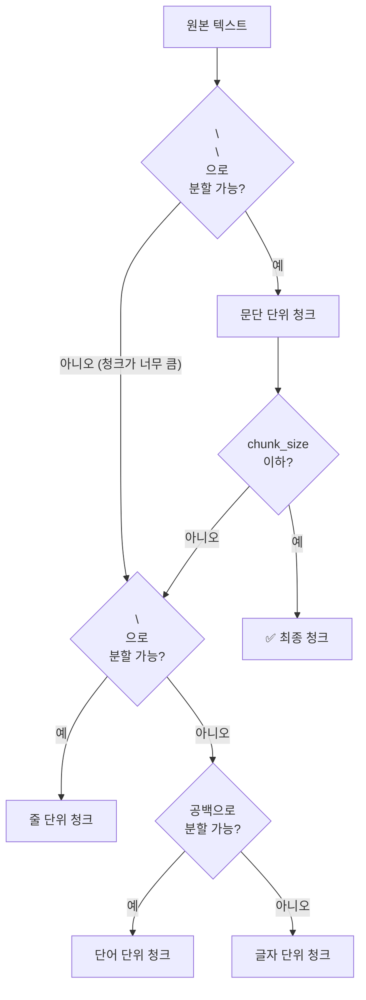
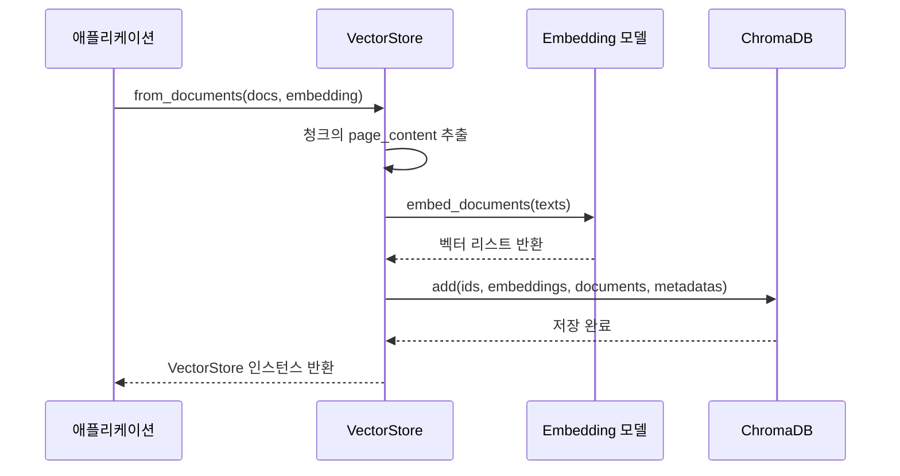
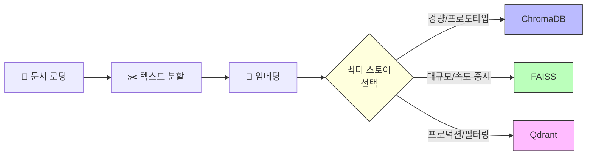

# 인덱싱 파이프라인 구축 — 문서에서 벡터 DB까지

> 문서 로딩부터 벡터 저장까지, RAG의 데이터 준비 과정 전체를 하나의 파이프라인으로 구축합니다.

## 개요

이 세션에서는 RAG 시스템의 **인덱싱 파이프라인** — 즉, 원본 문서를 벡터 데이터베이스에 저장하기까지의 전체 과정을 처음부터 끝까지 구현합니다. 앞서 [세션 8.1](08-기본-rag-파이프라인-구축-langchain으로-첫-rag-앱-만들기/01-langchain-v1-핵심-개념과-설정.md)에서 LangChain v1의 LCEL 기본기를, [세션 8.2](08-기본-rag-파이프라인-구축-langchain으로-첫-rag-앱-만들기/02-lcel-langchain-expression-language-마스터하기.md)에서 체인 조합 패턴을 익혔다면, 이번에는 그 체인에 **먹일 데이터를 준비하는 과정**을 다룹니다.

**선수 지식**:
- LangChain v1 패키지 구조와 LCEL 파이프 연산자 (세션 8.1)
- RunnablePassthrough, RunnableParallel 등 체인 조합 패턴 (세션 8.2)
- FAISS, Qdrant 등 벡터 스토어의 특징과 선택 기준 ([세션 7.5](07-벡터-데이터베이스-심화-faiss-pinecone-qdrant-비교/05-벡터-db-선택-가이드-의사결정-프레임워크.md))

**학습 목표**:
- 문서 로딩 → 텍스트 분할 → 임베딩 → 벡터 저장의 4단계 파이프라인을 구현할 수 있다
- LangChain의 Indexing API와 RecordManager를 활용하여 중복 방지 및 증분 인덱싱을 구현할 수 있다
- cleanup 모드(none, incremental, full)의 차이를 이해하고 상황에 맞게 선택할 수 있다
- ChromaDB 기반 파이프라인을 FAISS나 Qdrant로 교체하는 방법을 알 수 있다

## 왜 알아야 할까?

RAG 시스템을 이야기할 때, 대부분의 관심은 **"어떻게 검색하고 답변할까?"**에 쏠리곤 합니다. 하지만 아무리 뛰어난 검색 알고리즘을 갖추더라도, **벡터 DB에 저장된 데이터의 품질이 낮으면** 의미 있는 답변이 나올 수 없습니다. "Garbage In, Garbage Out"이 RAG에서도 예외 없이 적용되죠.

실무에서는 더 구체적인 문제가 발생합니다:

- 문서가 업데이트될 때마다 **전체를 다시 인덱싱**하면 시간과 비용이 낭비됩니다
- 같은 문서를 여러 번 넣으면 **중복 청크**가 생겨 검색 결과가 오염됩니다
- 삭제된 문서의 벡터가 DB에 남아 있으면 **오래된 정보**가 검색됩니다

이번 세션에서 배울 인덱싱 파이프라인과 LangChain Indexing API는 이 모든 문제를 체계적으로 해결해줍니다.

## 핵심 개념

### 개념 1: 인덱싱 파이프라인의 4단계

> 💡 **비유**: 도서관에 새 책이 들어오는 과정을 떠올려 보세요. 먼저 책을 **입고**하고(문서 로딩), 긴 책은 **챕터별로 나누어** 색인 카드를 만들고(텍스트 분할), 각 카드에 **분류 번호를 부여**한 뒤(임베딩), 마지막으로 서가에 **꽂아 둡니다**(벡터 저장). 이 4단계 중 하나라도 빠지면 책을 찾을 수 없겠죠?

RAG 인덱싱 파이프라인은 크게 4단계로 구성됩니다:

1. **문서 로딩(Document Loading)**: 다양한 소스에서 데이터를 `Document` 객체로 변환
2. **텍스트 분할(Text Splitting)**: 긴 문서를 검색에 적합한 작은 청크로 분할
3. **임베딩(Embedding)**: 각 청크를 고차원 벡터로 변환
4. **벡터 저장(Vector Storage)**: 벡터를 데이터베이스에 저장하고 인덱싱

> 📊 **그림 1**: RAG 인덱싱 파이프라인의 4단계


LangChain에서는 이 4단계 각각을 독립적인 컴포넌트로 제공합니다. 160개 이상의 DocumentLoader, 다양한 TextSplitter, 30개 이상의 Embedding 모델, 40개 이상의 VectorStore 통합을 조합할 수 있어서, 마치 레고 블록처럼 파이프라인을 구성할 수 있죠.

```python
# 파이프라인의 기본 골격
from langchain_community.document_loaders import WebBaseLoader
from langchain_text_splitters import RecursiveCharacterTextSplitter
from langchain_openai import OpenAIEmbeddings
from langchain_chroma import Chroma

# 1단계: 문서 로딩
loader = WebBaseLoader("https://example.com/article")
docs = loader.load()

# 2단계: 텍스트 분할
splitter = RecursiveCharacterTextSplitter(chunk_size=1000, chunk_overlap=200)
chunks = splitter.split_documents(docs)

# 3단계 + 4단계: 임베딩 & 벡터 저장 (한 번에 처리)
vectorstore = Chroma.from_documents(
    documents=chunks,
    embedding=OpenAIEmbeddings(model="text-embedding-3-small"),
)
```

> ⚠️ **흔한 오해**: "임베딩과 벡터 저장은 별도 단계로 직접 호출해야 한다"고 생각하기 쉽지만, LangChain의 `from_documents()`나 `add_documents()`가 **임베딩 생성과 저장을 한 번에** 처리해줍니다. 내부적으로 Embedding 모델을 호출한 뒤 결과를 벡터 DB에 삽입하는 거죠.

### 개념 2: 문서 로딩 — DocumentLoader의 역할

> 💡 **비유**: DocumentLoader는 **택배 기사**와 같습니다. PDF든, 웹페이지든, 데이터베이스든 — 소스가 어디인지는 상관없이, 일관된 형태(`Document` 객체)로 변환하여 "배달"해 줍니다.

LangChain의 DocumentLoader는 다양한 소스의 데이터를 `Document` 객체로 변환합니다. 모든 로더는 `.load()` 메서드를 호출하면 `List[Document]`를 반환하는 동일한 인터페이스를 가집니다.

```python
from langchain_community.document_loaders import (
    PyPDFLoader,          # PDF 파일
    TextLoader,           # 텍스트 파일
    WebBaseLoader,        # 웹페이지
    CSVLoader,            # CSV 파일
    DirectoryLoader,      # 디렉토리 전체
)

# 웹페이지 로딩 예시 — BeautifulSoup으로 특정 영역만 추출
import bs4
loader = WebBaseLoader(
    web_paths=("https://lilianweng.github.io/posts/2023-06-23-agent/",),
    bs_kwargs=dict(
        parse_only=bs4.SoupStrainer(
            class_=("post-content", "post-title", "post-header")
        )
    ),
)
docs = loader.load()
```

각 `Document` 객체는 두 가지 핵심 속성을 갖습니다:
- **`page_content`**: 실제 텍스트 내용
- **`metadata`**: 출처 정보(source, page 번호 등)를 담은 딕셔너리

[챕터 3](03-문서-로딩과-파싱-다양한-소스에서-데이터-수집/01-문서-로딩-기초-langchain-document-loaders.md)에서 다양한 문서 로더를 자세히 다뤘으니, 여기서는 파이프라인의 한 단계로서 핵심만 짚고 넘어가겠습니다.

### 개념 3: 텍스트 분할 — RecursiveCharacterTextSplitter

> 💡 **비유**: 긴 소설을 통째로 색인하면 "로미오가 죽는 장면이 어디 있지?"라는 질문에 책 전체를 건네줘야 합니다. 하지만 **챕터별, 장면별로 나눠 놓으면** 정확히 필요한 부분만 찾아줄 수 있겠죠. 텍스트 분할이 바로 이 역할을 합니다.

`RecursiveCharacterTextSplitter`는 LangChain에서 가장 널리 쓰이는 텍스트 분할기입니다. "재귀적(Recursive)"이라는 이름답게, 계층적 구분자를 순서대로 시도하면서 문서를 자연스럽게 나눕니다. 앞서 [챕터 4](04-텍스트-청킹-전략-문서-분할과-최적화/01-청킹의-중요성과-기본-원리.md)에서 배운 청킹 전략의 핵심이 바로 이 분할기에 녹아 있습니다.

> 📊 **그림 2**: RecursiveCharacterTextSplitter의 재귀적 분할 과정



기본 구분자 순서는 `["\n\n", "\n", " ", ""]`입니다. 먼저 빈 줄(문단 경계)로 나누고, 여전히 크면 줄바꿈으로, 그래도 크면 공백으로, 최후의 수단으로 글자 단위로 나눕니다.

```python
from langchain_text_splitters import RecursiveCharacterTextSplitter

text_splitter = RecursiveCharacterTextSplitter(
    chunk_size=1000,       # 청크 최대 크기 (문자 수)
    chunk_overlap=200,     # 청크 간 겹침 (문맥 유지)
    length_function=len,   # 길이 측정 함수
    add_start_index=True,  # 원본에서의 시작 위치를 메타데이터에 추가
)

chunks = text_splitter.split_documents(docs)
```

```run:python
# chunk_size와 chunk_overlap의 효과를 확인해 봅시다
from langchain_text_splitters import RecursiveCharacterTextSplitter

sample_text = """인공지능의 역사는 1950년대로 거슬러 올라갑니다.

앨런 튜링은 1950년 "계산 기계와 지능"이라는 논문을 발표했습니다.
이 논문에서 그는 유명한 튜링 테스트를 제안했죠.

1956년 다트머스 회의에서 '인공지능'이라는 용어가 처음 사용되었습니다.
존 매카시, 마빈 민스키 등이 참여한 이 회의는 AI 연구의 공식적인 시작점이 되었습니다."""

splitter = RecursiveCharacterTextSplitter(
    chunk_size=120,
    chunk_overlap=20,
    add_start_index=True,
)
chunks = splitter.create_documents([sample_text])

for i, chunk in enumerate(chunks):
    print(f"--- 청크 {i+1} (길이: {len(chunk.page_content)}) ---")
    print(f"시작 위치: {chunk.metadata.get('start_index', 'N/A')}")
    print(chunk.page_content[:80] + "...")
    print()
```

```output
--- 청크 1 (길이: 46) ---
시작 위치: 0
인공지능의 역사는 1950년대로 거슬러 올라갑니다....

--- 청크 2 (길이: 108) ---
시작 위치: 48
앨런 튜링은 1950년 "계산 기계와 지능"이라는 논문을 발표했습니다.
이 논문에서 그는 유명한 튜링 테스트를 제안했죠....

--- 청크 3 (길이: 113) ---
시작 위치: 157
1956년 다트머스 회의에서 '인공지능'이라는 용어가 처음 사용되었습니다.
존 매카시, 마빈 민스키 등이 참여한 이 회의는 AI 연...
```

`add_start_index=True`를 설정하면 각 청크가 원본 문서에서 **몇 번째 문자부터 시작하는지** 메타데이터에 기록됩니다. 나중에 검색 결과에서 원본 위치를 추적할 때 유용하죠.

> 🔥 **실무 팁**: `chunk_size`와 `chunk_overlap` 값은 정답이 없습니다. 일반적으로 `chunk_size=500~1500`, `chunk_overlap`은 `chunk_size`의 10~20%로 시작한 뒤, 실제 검색 품질을 보면서 튜닝하는 것이 가장 효과적입니다. [챕터 4](04-텍스트-청킹-전략-문서-분할과-최적화/01-청킹의-중요성과-기본-원리.md)에서 다룬 청킹 전략을 참고하세요.

### 개념 4: 임베딩 & 벡터 저장 — from_documents()

[챕터 5](05-임베딩-모델-이해-텍스트를-벡터로-변환/01-임베딩의-기본-개념-단어에서-문장까지.md)에서 배운 임베딩 모델의 원리와, [챕터 6](06-벡터-데이터베이스-기초-chromadb로-시작하기/01-벡터-데이터베이스란-왜-필요한가.md)에서 다룬 ChromaDB 기초를 여기서 LangChain 파이프라인으로 연결합니다. LangChain이 이 두 단계를 **얼마나 간결하게 연결하는지**에 집중해 보세요.

```python
from langchain_openai import OpenAIEmbeddings
from langchain_chroma import Chroma

# 임베딩 모델 설정
embeddings = OpenAIEmbeddings(model="text-embedding-3-small")

# 방법 1: from_documents() — 새 벡터 스토어 생성
vectorstore = Chroma.from_documents(
    documents=chunks,           # 분할된 청크 리스트
    embedding=embeddings,       # 임베딩 모델
    collection_name="my_docs",  # 컬렉션 이름
    persist_directory="./chroma_db",  # 영구 저장 경로
)

# 방법 2: add_documents() — 기존 벡터 스토어에 추가
vectorstore.add_documents(documents=new_chunks)
```

`from_documents()`는 내부적으로 다음을 수행합니다:

> 📊 **그림 3**: from_documents() 내부 동작



대량 문서를 인덱싱할 때는 임베딩 API 호출이 병목이 될 수 있습니다. 특히 수천 개 이상의 청크를 한 번에 임베딩하면 **rate limit**에 걸리거나 네트워크 에러가 발생하기 쉽죠. 이럴 때는 배치 크기를 조절하고 지수 백오프(exponential backoff) 패턴을 적용하는 것이 좋습니다.

```python
import time

def embed_with_retry(vectorstore, chunks, batch_size=100, max_retries=5):
    """배치 단위로 임베딩하며, rate limit 시 지수 백오프로 재시도합니다."""
    for i in range(0, len(chunks), batch_size):
        batch = chunks[i : i + batch_size]
        for attempt in range(max_retries):
            try:
                vectorstore.add_documents(batch)
                print(f"  ✅ 배치 {i // batch_size + 1} 완료 ({len(batch)}개)")
                break
            except Exception as e:
                wait = 2 ** attempt  # 1초, 2초, 4초, 8초, 16초...
                print(f"  ⚠️ 에러 발생, {wait}초 후 재시도: {e}")
                time.sleep(wait)
        else:
            raise RuntimeError(f"배치 {i // batch_size + 1} 인덱싱 실패")
```

> 🔥 **실무 팁**: 대량 인덱싱 시 `batch_size`를 100~500 정도로 설정하면 rate limit을 피하면서도 효율적으로 처리할 수 있습니다. OpenAI의 경우 분당 토큰 제한이 있으므로, 청크가 길수록 배치 크기를 줄여야 합니다. 자세한 에러 처리와 재시도 전략은 [세션 8.6](08-기본-rag-파이프라인-구축-langchain으로-첫-rag-앱-만들기/06-rag-앱-스트리밍과-에러-처리.md)에서 다룹니다.

### 개념 5: LangChain Indexing API — 중복 방지와 증분 인덱싱

> 💡 **비유**: 도서관에 매일 새 책이 들어온다고 상상해보세요. 단순한 방법은 **매일 모든 책을 다시 정리**하는 것이지만, 이건 엄청난 낭비입니다. 똑똑한 사서라면 **입고 대장(RecordManager)**을 관리하면서, 새로 온 책만 꽂고, 이미 있는 책은 건너뛰고, 폐기된 책은 빼는 방식으로 일하겠죠. LangChain의 Indexing API가 바로 이 똑똑한 사서 역할을 합니다.

실무에서는 문서가 수시로 추가·수정·삭제됩니다. 매번 전체를 다시 인덱싱하면:
- 💸 불필요한 **임베딩 API 비용**이 발생합니다
- 🔄 **중복 청크**가 벡터 DB에 쌓입니다
- 👻 삭제된 문서의 **유령 벡터**가 남습니다

LangChain의 Indexing API는 `RecordManager`와 `index()` 함수로 이 문제를 해결합니다.

```python
from langchain.indexes import SQLRecordManager, index
from langchain_core.documents import Document

# RecordManager 초기화 — SQLite로 기록 관리
namespace = "chroma/my_docs"
record_manager = SQLRecordManager(
    namespace,
    db_url="sqlite:///record_manager_cache.sql",
)
record_manager.create_schema()  # 최초 1회 스키마 생성
```

`RecordManager`는 각 문서에 대해 세 가지 정보를 추적합니다:

| 추적 항목 | 설명 |
|-----------|------|
| **문서 해시** | `page_content`와 `metadata`를 합쳐 계산한 해시값 |
| **기록 시간** | 벡터 스토어에 기록된 시각 |
| **소스 ID** | 원본 문서를 식별하는 메타데이터 키 |

#### cleanup 모드 3가지

`index()` 함수의 `cleanup` 파라미터로 세 가지 정리 전략을 선택할 수 있습니다:

> 📊 **그림 4**: cleanup 모드별 동작 비교


```run:python
# cleanup 모드별 동작을 시뮬레이션해 봅시다
modes = {
    "none": {
        "설명": "추가만, 삭제 없음",
        "중복 방지": "✅ 해시 기반",
        "변경 감지": "❌",
        "삭제 처리": "❌",
        "사용 시점": "데이터가 추가만 되는 경우",
    },
    "incremental": {
        "설명": "소스별 증분 정리",
        "중복 방지": "✅ 해시 기반",
        "변경 감지": "✅ 소스 단위",
        "삭제 처리": "✅ 변경된 소스만",
        "사용 시점": "실시간 업데이트가 필요한 경우",
    },
    "full": {
        "설명": "전체 동기화",
        "중복 방지": "✅ 해시 기반",
        "변경 감지": "✅ 전체",
        "삭제 처리": "✅ 누락된 모든 문서",
        "사용 시점": "배치 작업으로 전체 재인덱싱하는 경우",
    },
}

for mode, info in modes.items():
    print(f"[{mode}] {info['설명']}")
    print(f"  중복 방지: {info['중복 방지']}")
    print(f"  변경 감지: {info['변경 감지']}")
    print(f"  삭제 처리: {info['삭제 처리']}")
    print(f"  → 사용 시점: {info['사용 시점']}")
    print()
```

```output
[none] 추가만, 삭제 없음
  중복 방지: ✅ 해시 기반
  변경 감지: ❌
  삭제 처리: ❌
  → 사용 시점: 데이터가 추가만 되는 경우

[incremental] 소스별 증분 정리
  중복 방지: ✅ 해시 기반
  변경 감지: ✅ 소스 단위
  삭제 처리: ✅ 변경된 소스만
  → 사용 시점: 실시간 업데이트가 필요한 경우

[full] 전체 동기화
  중복 방지: ✅ 해시 기반
  변경 감지: ✅ 전체
  삭제 처리: ✅ 누락된 모든 문서
  → 사용 시점: 배치 작업으로 전체 재인덱싱하는 경우
```

`incremental` 모드에서는 `source_id_key`가 필수입니다. 이 키는 메타데이터에서 원본 문서의 출처를 식별하는 필드를 지정합니다. 예를 들어 `source_id_key="source"`로 설정하면, `metadata["source"]` 값이 같은 청크들을 하나의 소스 그룹으로 관리합니다.

```python
# incremental 모드: 변경된 소스의 이전 청크만 교체
result = index(
    docs_from_source_a,       # source_a에서 온 문서들
    record_manager,
    vectorstore,
    cleanup="incremental",
    source_id_key="source",   # metadata["source"]로 소스 식별
)
print(result)
# {'num_added': 5, 'num_updated': 0, 'num_deleted': 2, 'num_skipped': 3}

# full 모드: 이번 실행에 포함되지 않은 모든 문서 삭제
result = index(
    all_current_docs,         # 현재 유효한 전체 문서
    record_manager,
    vectorstore,
    cleanup="full",
    source_id_key="source",
)
```

## 실습: 직접 해보기

이제 배운 모든 개념을 결합하여, 웹 문서를 로딩하고 ChromaDB에 저장한 뒤 검색까지 수행하는 **완전한 인덱싱 파이프라인**을 구축해 봅시다.

### 환경 설정

```bash
pip install langchain langchain-openai langchain-chroma langchain-text-splitters \
  langchain-community beautifulsoup4 lxml
```

```python
# .env 파일에 API 키 설정 (코드에 직접 넣지 마세요!)
# OPENAI_API_KEY=sk-your-key-here

from dotenv import load_dotenv
load_dotenv()
```

### 전체 인덱싱 파이프라인

```python
"""완전한 RAG 인덱싱 파이프라인 — 문서 로딩부터 검색까지"""

import bs4
from langchain_community.document_loaders import WebBaseLoader
from langchain_text_splitters import RecursiveCharacterTextSplitter
from langchain_openai import OpenAIEmbeddings
from langchain_chroma import Chroma
from langchain.indexes import SQLRecordManager, index


# ============================================================
# 1단계: 문서 로딩
# ============================================================
loader = WebBaseLoader(
    web_paths=("https://lilianweng.github.io/posts/2023-06-23-agent/",),
    bs_kwargs=dict(
        parse_only=bs4.SoupStrainer(
            class_=("post-content", "post-title", "post-header")
        )
    ),
)
docs = loader.load()
print(f"로딩된 문서 수: {len(docs)}")
print(f"첫 문서 길이: {len(docs[0].page_content):,}자")
print(f"메타데이터: {docs[0].metadata}")


# ============================================================
# 2단계: 텍스트 분할
# ============================================================
text_splitter = RecursiveCharacterTextSplitter(
    chunk_size=1000,        # 한 청크 최대 1000자
    chunk_overlap=200,      # 인접 청크와 200자 겹침
    add_start_index=True,   # 원본 시작 위치 추적
)
chunks = text_splitter.split_documents(docs)
print(f"\n분할된 청크 수: {len(chunks)}")
print(f"첫 번째 청크 길이: {len(chunks[0].page_content)}자")
print(f"첫 번째 청크 메타데이터: {chunks[0].metadata}")


# ============================================================
# 3단계 + 4단계: 임베딩 & 벡터 저장
# ============================================================
embeddings = OpenAIEmbeddings(model="text-embedding-3-small")

# 방법 A: 간단한 방법 — from_documents()
vectorstore = Chroma.from_documents(
    documents=chunks,
    embedding=embeddings,
    collection_name="rag_tutorial",
    persist_directory="./chroma_db",
)
print(f"\n벡터 스토어에 저장된 문서 수: {vectorstore._collection.count()}")


# ============================================================
# 검색 테스트
# ============================================================
retriever = vectorstore.as_retriever(
    search_type="similarity",
    search_kwargs={"k": 3},  # 상위 3개 결과
)
results = retriever.invoke("What is agent memory?")

print(f"\n검색 결과 {len(results)}건:")
for i, doc in enumerate(results):
    print(f"\n--- 결과 {i+1} ---")
    print(f"출처: {doc.metadata.get('source', 'N/A')}")
    print(f"시작 위치: {doc.metadata.get('start_index', 'N/A')}")
    print(doc.page_content[:200] + "...")
```

### Indexing API를 활용한 증분 파이프라인

위 코드가 **1회성 인덱싱**이라면, 아래는 **반복 실행이 가능한 프로덕션용** 인덱싱 파이프라인입니다:

```python
"""Indexing API를 활용한 증분 인덱싱 파이프라인"""

from langchain_community.document_loaders import WebBaseLoader
from langchain_text_splitters import RecursiveCharacterTextSplitter
from langchain_openai import OpenAIEmbeddings
from langchain_chroma import Chroma
from langchain.indexes import SQLRecordManager, index


def create_indexing_pipeline(
    collection_name: str = "my_docs",
    db_path: str = "./chroma_db",
    record_db_url: str = "sqlite:///record_manager.sql",
):
    """인덱싱 파이프라인의 핵심 컴포넌트를 초기화합니다."""
    
    # 임베딩 모델
    embeddings = OpenAIEmbeddings(model="text-embedding-3-small")
    
    # 벡터 스토어
    vectorstore = Chroma(
        collection_name=collection_name,
        embedding_function=embeddings,
        persist_directory=db_path,
    )
    
    # RecordManager — 인덱싱 이력 관리
    namespace = f"chroma/{collection_name}"
    record_manager = SQLRecordManager(namespace, db_url=record_db_url)
    record_manager.create_schema()
    
    # 텍스트 분할기
    text_splitter = RecursiveCharacterTextSplitter(
        chunk_size=1000,
        chunk_overlap=200,
        add_start_index=True,
    )
    
    return vectorstore, record_manager, text_splitter


def index_documents(
    sources: list[str],
    vectorstore: Chroma,
    record_manager: SQLRecordManager,
    text_splitter: RecursiveCharacterTextSplitter,
    cleanup: str = "incremental",
) -> dict:
    """문서를 로딩하고 인덱싱합니다.
    
    Args:
        sources: 인덱싱할 URL 리스트
        cleanup: 정리 모드 ('none', 'incremental', 'full')
    
    Returns:
        인덱싱 결과 통계
    """
    all_chunks = []
    
    for url in sources:
        # 문서 로딩
        loader = WebBaseLoader(url)
        docs = loader.load()
        
        # 텍스트 분할
        chunks = text_splitter.split_documents(docs)
        all_chunks.extend(chunks)
        print(f"  📄 {url} → {len(chunks)}개 청크")
    
    # Indexing API로 증분 인덱싱
    result = index(
        all_chunks,
        record_manager,
        vectorstore,
        cleanup=cleanup,
        source_id_key="source",  # metadata["source"]로 소스 추적
    )
    
    return result


# ============================================================
# 사용 예시
# ============================================================
if __name__ == "__main__":
    # 파이프라인 초기화
    vectorstore, record_manager, text_splitter = create_indexing_pipeline()
    
    # 첫 번째 인덱싱
    sources = [
        "https://lilianweng.github.io/posts/2023-06-23-agent/",
        "https://lilianweng.github.io/posts/2023-03-15-prompt-engineering/",
    ]
    
    print("=== 첫 번째 인덱싱 ===")
    result = index_documents(
        sources, vectorstore, record_manager, text_splitter
    )
    print(f"\n결과: {result}")
    # {'num_added': 95, 'num_updated': 0, 'num_deleted': 0, 'num_skipped': 0}
    
    # 두 번째 인덱싱 (같은 문서 → 모두 스킵됨!)
    print("\n=== 두 번째 인덱싱 (변경 없음) ===")
    result = index_documents(
        sources, vectorstore, record_manager, text_splitter
    )
    print(f"\n결과: {result}")
    # {'num_added': 0, 'num_updated': 0, 'num_deleted': 0, 'num_skipped': 95}
    
    # 검색 테스트
    retriever = vectorstore.as_retriever(search_kwargs={"k": 3})
    results = retriever.invoke("What are the types of agent memory?")
    print(f"\n검색 결과: {len(results)}건")
    for doc in results:
        print(f"  - [{doc.metadata.get('source', '')}] {doc.page_content[:80]}...")
```

두 번째 실행에서 `num_skipped: 95`가 표시되는 것을 확인하세요. RecordManager가 해시를 비교하여 **이미 동일한 내용이 저장되어 있음**을 감지하고, 임베딩 API를 호출하지 않고 건너뛴 것입니다. 이것이 바로 Indexing API의 핵심 가치 — 불필요한 비용 절감이죠.

## 벡터 스토어 교체하기

지금까지 ChromaDB를 사용하여 인덱싱 파이프라인을 구축했습니다. 그런데 [세션 7.5](07-벡터-데이터베이스-심화-faiss-pinecone-qdrant-비교/05-벡터-db-선택-가이드-의사결정-프레임워크.md)에서 배웠듯이, 벡터 스토어마다 장단점이 다르죠. 대규모 데이터셋에서 빠른 검색이 필요하면 **FAISS**, 프로덕션 환경에서 필터링과 확장성이 필요하면 **Qdrant**가 더 적합할 수 있습니다.

LangChain의 강점이 여기서 드러나는데요 — 모든 VectorStore가 동일한 인터페이스(`from_documents()`, `as_retriever()`)를 따르기 때문에, **벡터 스토어 교체가 import문과 초기화 코드 몇 줄만 바꾸면 끝**입니다. 나머지 파이프라인은 그대로 유지되죠.

> 📊 **그림 5**: 벡터 스토어 교체 — 파이프라인의 나머지는 동일



### FAISS로 교체하기

FAISS(Facebook AI Similarity Search)는 메모리 기반으로 동작하여 **검색 속도가 매우 빠릅니다**. 별도 서버 없이 로컬 파일로 인덱스를 저장하므로, 프로토타이핑이나 중소 규모 데이터셋에 적합합니다.

```bash
# FAISS 패키지 설치
pip install langchain-community faiss-cpu
# GPU 버전: pip install faiss-gpu
```

```python
# ChromaDB → FAISS로 교체
# 변경 전:
# from langchain_chroma import Chroma
# vectorstore = Chroma.from_documents(
#     documents=chunks,
#     embedding=embeddings,
#     persist_directory="./chroma_db",
# )

# 변경 후:
from langchain_community.vectorstores import FAISS

# from_documents()로 FAISS 인덱스 생성 — 인터페이스 동일!
vectorstore = FAISS.from_documents(
    documents=chunks,           # 동일한 청크 리스트
    embedding=embeddings,       # 동일한 임베딩 모델
)

# 로컬 파일로 인덱스 저장
vectorstore.save_local("./faiss_index")

# 나중에 인덱스 불러오기
vectorstore = FAISS.load_local(
    "./faiss_index",
    embeddings,
    allow_dangerous_deserialization=True,  # pickle 역직렬화 허용
)

# 검색 — 사용법 완전히 동일
retriever = vectorstore.as_retriever(search_kwargs={"k": 3})
results = retriever.invoke("What is agent memory?")
```

> ⚠️ **흔한 오해**: FAISS의 `load_local()`에서 `allow_dangerous_deserialization=True`를 설정해야 하는 이유가 궁금할 수 있습니다. FAISS 인덱스는 내부적으로 pickle을 사용하는데, 신뢰할 수 없는 출처의 pickle 파일은 보안 위험이 있기 때문입니다. **자신이 직접 생성한 인덱스**에만 이 옵션을 사용하세요.

### Qdrant로 교체하기

Qdrant는 **메타데이터 필터링**, **스칼라/바이너리 양자화**, **분산 배포** 등 프로덕션급 기능을 지원합니다. 로컬 모드와 서버 모드를 모두 지원하므로, 개발 단계에서는 로컬로 시작하고 나중에 서버로 전환할 수 있습니다.

```bash
# Qdrant 패키지 설치
pip install langchain-qdrant qdrant-client
```

```python
# ChromaDB → Qdrant로 교체
from langchain_qdrant import QdrantVectorStore
from qdrant_client import QdrantClient

# 방법 1: 로컬 인메모리 모드 (개발/테스트용)
vectorstore = QdrantVectorStore.from_documents(
    documents=chunks,
    embedding=embeddings,
    location=":memory:",            # 인메모리 모드
    collection_name="my_docs",
)

# 방법 2: 로컬 디스크 저장 (영구 보관)
vectorstore = QdrantVectorStore.from_documents(
    documents=chunks,
    embedding=embeddings,
    path="./qdrant_db",             # 디스크 저장 경로
    collection_name="my_docs",
)

# 방법 3: Qdrant 서버 연결 (프로덕션용)
# vectorstore = QdrantVectorStore.from_documents(
#     documents=chunks,
#     embedding=embeddings,
#     url="http://localhost:6333",   # Qdrant 서버 주소
#     collection_name="my_docs",
# )

# 검색 — 역시 동일한 인터페이스
retriever = vectorstore.as_retriever(search_kwargs={"k": 3})
results = retriever.invoke("What is agent memory?")
```

### 어떤 벡터 스토어를 선택해야 할까?

[세션 7.5](07-벡터-데이터베이스-심화-faiss-pinecone-qdrant-비교/05-벡터-db-선택-가이드-의사결정-프레임워크.md)의 선택 가이드를 실제 파이프라인 관점에서 요약하면:

| 기준 | ChromaDB | FAISS | Qdrant |
|------|----------|-------|--------|
| **설치 복잡도** | 낮음 (pip만으로 OK) | 낮음 | 중간 (서버 모드 시) |
| **검색 속도** | 보통 | 매우 빠름 | 빠름 |
| **메타데이터 필터링** | 기본 지원 | 제한적 | 강력한 필터링 |
| **영구 저장** | 내장 지원 | `save_local()` 필요 | 내장 지원 |
| **프로덕션 확장** | 제한적 | 단일 노드 | 분산 클러스터 지원 |
| **추천 상황** | 프로토타입, 학습 | 대규모 로컬 검색 | 프로덕션 서비스 |

> 🔥 **실무 팁**: 프로토타입은 ChromaDB로 빠르게 만들고, 성능이 중요해지면 FAISS로, 프로덕션 배포가 필요하면 Qdrant나 Pinecone으로 전환하는 것이 일반적인 패턴입니다. LangChain의 통일된 인터페이스 덕분에 전환 비용이 매우 낮으니, 처음부터 완벽한 선택에 고민하지 마세요.

## 더 깊이 알아보기

### Indexing API의 탄생 배경

LangChain 팀은 2023년 9월, "[Syncing data sources to vector stores](https://blog.langchain.com/syncing-data-sources-to-vector-stores/)"라는 블로그 포스트에서 Indexing API를 공개했습니다. 이 기능이 만들어진 계기가 흥미로운데요 — LangChain의 공식 챗봇인 **ChatLangChain**을 운영하면서 겪은 실제 문제에서 출발했습니다.

ChatLangChain은 LangChain 문서를 벡터 DB에 넣고 질문에 답하는 RAG 챗봇이었는데, 문서가 매일 업데이트되다 보니 **매일 전체를 다시 인덱싱**해야 했습니다. 수천 페이지 분량의 문서를 매번 임베딩하는 건 시간과 비용 면에서 큰 부담이었죠. 게다가 단순히 다시 넣으면 중복 문서가 쌓이고, 삭제된 페이지의 벡터가 남아 잘못된 답변을 생성하는 문제도 있었습니다.

LangChain 팀은 이 문제를 해결하기 위해 **RecordManager** 개념을 도입했습니다. 데이터베이스 세계의 CDC(Change Data Capture)에서 영감을 받아, 각 문서의 해시와 타임스탬프를 추적하는 방식을 채택한 것이죠. 실제로 ChatLangChain에서는 **GitHub Actions로 매일 인덱싱 스크립트를 실행**하되, Postgres 기반 RecordManager로 변경분만 처리하는 방식을 도입하여 인덱싱 시간을 크게 줄였습니다.

### 문서 해시의 비밀

Indexing API가 중복을 감지하는 핵심은 **결정론적 해시(deterministic hash)** 입니다. 각 `Document`의 `page_content`와 `metadata`를 합쳐 해시를 계산하는데, 이 해시가 같으면 "동일한 문서"로 판단하여 스킵합니다. 이 덕분에 텍스트 분할 같은 변환 단계를 거치더라도 원본과의 연결이 유지됩니다.

## 흔한 오해와 팁

> ⚠️ **흔한 오해**: "`from_documents()`를 여러 번 호출하면 자동으로 중복이 제거된다"고 생각하기 쉽습니다. 실제로는 `from_documents()`는 매번 **새로 추가**합니다. 중복 방지가 필요하면 반드시 **Indexing API(`index()` 함수)**를 사용해야 합니다.

> 💡 **알고 계셨나요?**: LangChain의 `RecordManager`는 현재 `SQLRecordManager`(SQLite, PostgreSQL 등 지원)가 기본 구현체입니다. 프로덕션에서는 SQLite 대신 **PostgreSQL**을 사용하는 것이 권장됩니다. SQLite는 동시 쓰기에 제한이 있어 병렬 인덱싱 작업에서 문제가 될 수 있거든요.

> 🔥 **실무 팁**: `cleanup="incremental"`과 `cleanup="full"`을 **상황에 맞게** 사용하세요.
> - **실시간/이벤트 기반 업데이트** → `incremental`: 변경된 소스만 처리하므로 빠릅니다. 단, 로더가 전체 문서를 한 번에 반환하지 않아도 됩니다.
> - **정기 배치 작업** → `full`: 전체 문서를 넘기면, 이번에 포함되지 않은 문서는 자동 삭제합니다. 데이터 소스와 벡터 DB를 완벽히 동기화할 수 있죠.
> - **한 가지 주의**: `full` 모드는 **모든 현재 유효한 문서를 한 번에 넘겨야** 합니다. 일부만 넘기면 나머지가 삭제되니까요!

> 🔥 **실무 팁**: `chunk_size`를 정할 때 임베딩 모델의 **최대 토큰 수**도 고려하세요. `text-embedding-3-small`의 최대 입력은 8,191 토큰(약 6,000~7,000자)입니다. `chunk_size`를 이보다 크게 설정하면 임베딩이 잘릴 수 있습니다.

## 핵심 정리

| 개념 | 설명 |
|------|------|
| **인덱싱 파이프라인** | 문서 로딩 → 텍스트 분할 → 임베딩 → 벡터 저장의 4단계 과정 |
| **DocumentLoader** | 다양한 소스의 데이터를 `Document` 객체로 변환. 160+ 통합 지원 |
| **RecursiveCharacterTextSplitter** | 계층적 구분자(`\n\n` → `\n` → ` ` → `""`)로 재귀적 분할 |
| **from_documents()** | 임베딩 생성 + 벡터 저장을 한 번에 처리하는 편의 메서드 |
| **Indexing API** | `RecordManager` + `index()` 함수로 중복 방지 · 증분 인덱싱 수행 |
| **RecordManager** | 문서 해시, 기록 시간, 소스 ID를 추적하는 인덱싱 이력 관리자 |
| **cleanup="none"** | 추가만 수행, 삭제 없음. 데이터가 축적만 되는 경우 적합 |
| **cleanup="incremental"** | 변경된 소스의 이전 버전만 삭제. 실시간 업데이트에 적합. `source_id_key` 필수 |
| **cleanup="full"** | 이번 실행에 포함되지 않은 모든 문서 삭제. 배치 동기화에 적합 |
| **source_id_key** | 원본 문서를 식별하는 메타데이터 키. `incremental` 모드에서 필수 |
| **배치 임베딩 재시도** | rate limit 대응을 위해 배치 크기 조절 + 지수 백오프 패턴 적용 |
| **벡터 스토어 교체** | LangChain의 통일된 인터페이스 덕분에 Chroma → FAISS/Qdrant 교체가 import와 초기화 코드 변경만으로 가능 |

## 다음 섹션 미리보기

인덱싱 파이프라인으로 벡터 DB에 데이터를 넣었으니, 이제 그 데이터를 **꺼내서 LLM에게 전달하는 과정** — 즉 **검색 체인(Retrieval Chain)**을 구축할 차례입니다. 다음 세션에서는 `VectorStoreRetriever`를 LCEL 체인에 연결하고, 검색된 문서를 프롬프트에 효과적으로 주입하는 RAG 체인 패턴을 다룹니다.

## 참고 자료

- [LangChain RAG 공식 문서](https://docs.langchain.com/oss/python/langchain/rag) - 인덱싱 파이프라인의 전체 흐름과 API 레퍼런스를 확인할 수 있습니다
- [Syncing data sources to vector stores — LangChain Blog](https://blog.langchain.com/syncing-data-sources-to-vector-stores/) - Indexing API의 탄생 배경과 설계 철학을 다룬 공식 블로그 포스트
- [LangChain Indexing API 사용법](https://python.langchain.com/docs/how_to/indexing/) - RecordManager와 index() 함수의 상세 사용법과 cleanup 모드 설명
- [RecursiveCharacterTextSplitter 가이드](https://docs.langchain.com/oss/python/integrations/splitters/recursive_text_splitter) - 텍스트 분할기의 파라미터와 언어별 설정 가이드
- [RAG from Scratch — LangChain GitHub](https://github.com/langchain-ai/rag-from-scratch) - 인덱싱부터 검색까지 단계별로 구축하는 실습 코스
- [LangChain VectorStore 통합 목록](https://python.langchain.com/docs/integrations/vectorstores/) - FAISS, Qdrant, Pinecone 등 40+ 벡터 스토어의 LangChain 통합 가이드

---
### 🔗 Related Sessions
- [embedding](../05-임베딩-모델-이해-텍스트를-벡터로-변환/01-임베딩의-기본-개념-단어에서-문장까지.md) (prerequisite)
- [document](../03-문서-로딩과-파싱-다양한-소스에서-데이터-수집/01-문서-로딩-기초-langchain-document-loaders.md) (prerequisite)
- [page_content](../03-문서-로딩과-파싱-다양한-소스에서-데이터-수집/01-문서-로딩-기초-langchain-document-loaders.md) (prerequisite)
- [chunking](../04-텍스트-청킹-전략-문서-분할과-최적화/01-청킹의-중요성과-기본-원리.md) (prerequisite)
- [lcel](../08-기본-rag-파이프라인-구축-langchain으로-첫-rag-앱-만들기/01-langchain-v1-핵심-개념과-설정.md) (prerequisite)
- [langchain-core](../08-기본-rag-파이프라인-구축-langchain으로-첫-rag-앱-만들기/01-langchain-v1-핵심-개념과-설정.md) (prerequisite)
- [langchain-openai](../08-기본-rag-파이프라인-구축-langchain으로-첫-rag-앱-만들기/01-langchain-v1-핵심-개념과-설정.md) (prerequisite)
- [langchain-community](../08-기본-rag-파이프라인-구축-langchain으로-첫-rag-앱-만들기/01-langchain-v1-핵심-개념과-설정.md) (prerequisite)
- [runnablesequence](../08-기본-rag-파이프라인-구축-langchain으로-첫-rag-앱-만들기/01-langchain-v1-핵심-개념과-설정.md) (prerequisite)
- [runnablepassthrough](../08-기본-rag-파이프라인-구축-langchain으로-첫-rag-앱-만들기/02-lcel-langchain-expression-language-마스터하기.md) (prerequisite)
