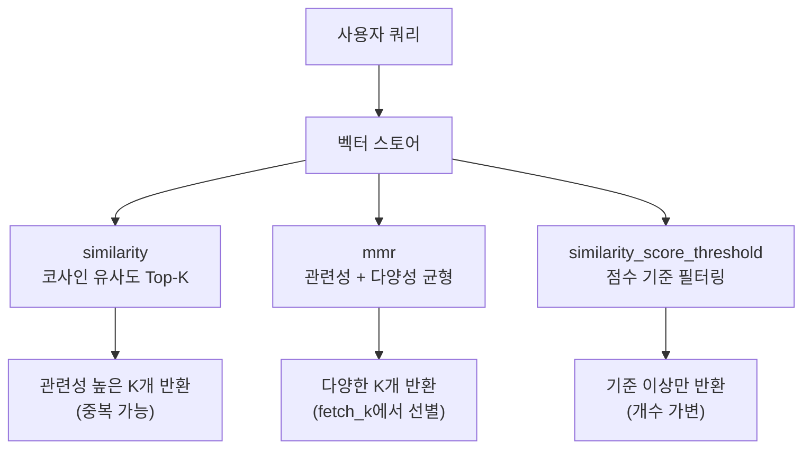
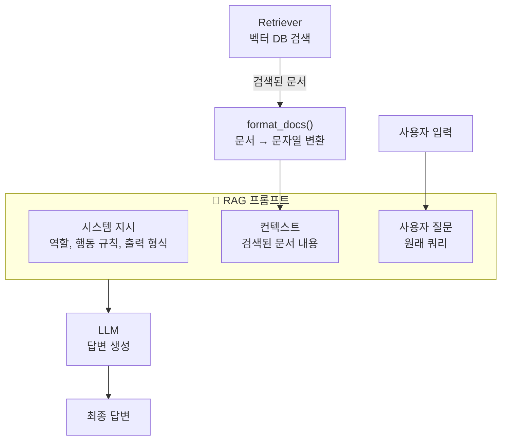
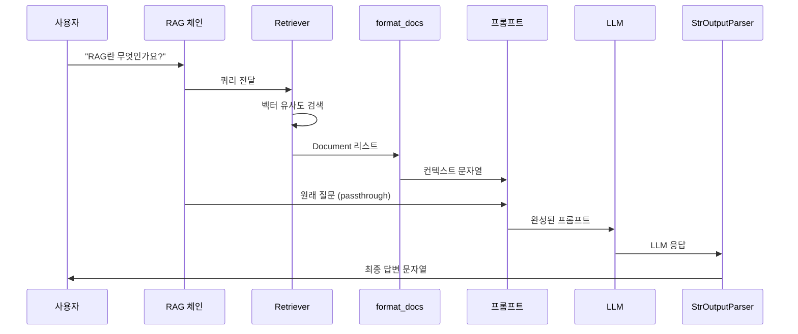
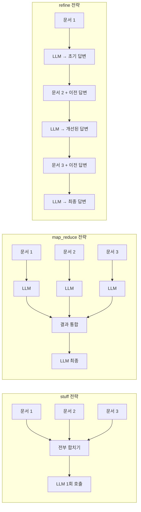

# 검색 체인 구축 — Retriever와 프롬프트 설계

> 벡터 DB에서 문서를 검색하고, 검색 결과를 프롬프트에 주입하여 LLM이 정확한 답변을 생성하도록 하는 RAG의 핵심 체인을 구축합니다.

## 개요

이 세션에서는 [세션 8.3: 인덱싱 파이프라인 구축](ch08-03)에서 벡터 DB에 저장한 문서를 **검색(Retrieval)**하고, 그 결과를 **프롬프트에 주입**하여 LLM이 답변을 생성하는 전체 흐름을 구축합니다. RAG 파이프라인의 후반부, 즉 "검색 → 생성" 단계의 핵심입니다.

**선수 지식**:
- [세션 8.1](ch08-01)의 LangChain v1 패키지 구조와 ChatModel 사용법
- [세션 8.2](ch08-02)의 LCEL 파이프 연산자, RunnablePassthrough, RunnableParallel
- [세션 8.3](ch08-03)의 `Chroma.from_documents()`를 통한 벡터 DB 인덱싱

**학습 목표**:
- VectorStoreRetriever의 3가지 `search_type`과 `search_kwargs`를 이해하고 설정할 수 있다
- RAG에 최적화된 프롬프트 템플릿을 설계할 수 있다
- 검색된 문서를 컨텍스트 문자열로 포맷팅하여 프롬프트에 주입할 수 있다
- stuff, map_reduce, refine 전략의 차이를 이해하고 상황에 맞게 선택할 수 있다

## 왜 알아야 할까?

앞서 우리는 문서를 잘게 나누고, 임베딩하고, 벡터 DB에 저장하는 **인덱싱 파이프라인**을 완성했습니다. 하지만 데이터를 저장만 해서는 아무 의미가 없죠. 사용자가 질문했을 때, 그 질문과 관련된 문서를 **정확하게 찾아내고**, 그 문서 내용을 LLM에게 **효과적으로 전달**하는 것이 RAG의 진짜 핵심입니다.

이 과정에서 두 가지 결정이 성능을 좌우합니다:

1. **어떻게 검색할 것인가?** — 단순 유사도? 다양성 고려? 점수 필터링?
2. **검색된 문서를 어떻게 LLM에게 전달할 것인가?** — 프롬프트 설계, 문서 포맷팅, 문서 결합 전략

프롬프트를 어떻게 짜느냐에 따라, 동일한 검색 결과로도 할루시네이션(Hallucination)이 생길 수도 있고, 출처까지 정확히 인용하는 신뢰할 수 있는 답변이 나올 수도 있습니다. 이번 세션에서 이 핵심 기술을 마스터합니다.

## 핵심 개념

### 개념 1: VectorStoreRetriever — 벡터 DB의 검색 창구

> 💡 **비유**: 도서관에서 책을 찾는 방법을 생각해보세요. 사서에게 "AI에 관한 책"이라고 말하면, 사서는 여러 방법으로 책을 찾아줄 수 있습니다. 제목이 가장 비슷한 책 4권을 가져다 줄 수도 있고(similarity), 비슷하면서도 다양한 관점의 책을 골라줄 수도 있고(MMR), "관련도 80% 이상인 책만 주세요"라고 기준을 정할 수도 있습니다(similarity_score_threshold). VectorStoreRetriever가 바로 이 **사서** 역할을 합니다.

[세션 8.3](ch08-03)에서 `Chroma.from_documents()`로 벡터 스토어를 만들었습니다. 이 벡터 스토어를 LCEL 체인에서 사용하려면 **Retriever** 인터페이스로 변환해야 합니다. `as_retriever()` 메서드가 바로 그 역할을 하죠.

```python
# 벡터 스토어 → Retriever 변환
retriever = vectorstore.as_retriever(
    search_type="similarity",   # 검색 방식
    search_kwargs={"k": 4}      # 검색 파라미터
)
```

#### search_type: 3가지 검색 전략

| search_type | 설명 | 언제 사용? |
|---|---|---|
| `"similarity"` (기본값) | 쿼리와 코사인 유사도가 가장 높은 k개 문서 반환 | 가장 관련성 높은 문서가 필요할 때 |
| `"mmr"` | 관련성과 **다양성**을 동시에 고려 (Maximal Marginal Relevance) | 비슷한 내용의 중복 문서를 피하고 싶을 때 |
| `"similarity_score_threshold"` | 유사도 점수가 기준치 이상인 문서만 반환 | 관련 없는 문서가 섞이는 걸 방지할 때 |

#### search_kwargs: 세부 파라미터 조정

```python
# 1) 기본 유사도 검색 — 상위 4개 문서
retriever_basic = vectorstore.as_retriever(
    search_type="similarity",
    search_kwargs={"k": 4}
)

# 2) MMR 검색 — 50개 후보 중 다양성 고려하여 5개 선택
retriever_mmr = vectorstore.as_retriever(
    search_type="mmr",
    search_kwargs={
        "k": 5,            # 최종 반환 문서 수
        "fetch_k": 50,     # MMR 알고리즘에 전달할 후보 수
        "lambda_mult": 0.7  # 1.0=관련성 중시, 0.0=다양성 중시
    }
)

# 3) 점수 기준 필터링 — 유사도 0.8 이상만
retriever_threshold = vectorstore.as_retriever(
    search_type="similarity_score_threshold",
    search_kwargs={"score_threshold": 0.8}
)
```

> 📊 **그림 1**: VectorStoreRetriever의 3가지 검색 전략 비교



> ⚠️ **흔한 오해**: `k=4`가 항상 4개 문서를 반환한다고 생각하기 쉽지만, `similarity_score_threshold` 모드에서는 기준을 넘는 문서가 4개 미만이면 **그보다 적은 수**를 반환합니다. 반면 `similarity`와 `mmr`은 항상 정확히 k개를 반환하죠.

#### MMR의 lambda_mult 이해하기

> 💡 **비유**: 뷔페에서 음식을 고른다고 상상해보세요. `lambda_mult=1.0`이면 "가장 맛있는 음식"만 고르는 거라서 스테이크만 5접시 담을 수 있습니다. `lambda_mult=0.0`이면 "최대한 다양하게" 고르는 거라서 스테이크, 샐러드, 스시, 디저트를 담겠죠. `0.7` 정도면 맛(관련성)을 우선하되 약간의 다양성도 챙기는 균형점입니다.

```run:python
# lambda_mult 값에 따른 MMR 동작 시뮬레이션
lambda_values = [1.0, 0.7, 0.25, 0.0]
for lm in lambda_values:
    if lm == 1.0:
        desc = "순수 관련성 (similarity와 동일)"
    elif lm >= 0.7:
        desc = "관련성 우선, 약간의 다양성"
    elif lm >= 0.25:
        desc = "다양성 우선, 약간의 관련성"
    else:
        desc = "최대 다양성"
    print(f"lambda_mult={lm:.1f} → {desc}")
```

```output
lambda_mult=1.0 → 순수 관련성 (similarity와 동일)
lambda_mult=0.7 → 관련성 우선, 약간의 다양성
lambda_mult=0.25 → 다양성 우선, 약간의 관련성
lambda_mult=0.0 → 최대 다양성
```

### 개념 2: RAG 프롬프트 템플릿 설계

> 💡 **비유**: 오픈북 시험을 생각해보세요. 시험지(프롬프트)에 "아래 참고 자료를 읽고 질문에 답하세요. 참고 자료에 없는 내용은 '모르겠습니다'라고 답하세요"라고 적혀 있으면, 학생(LLM)은 참고 자료(컨텍스트)만 보고 정확하게 답할 수 있습니다. 하지만 지시가 모호하면 학생은 자기가 아는 내용을 마음대로 적어버릴 수 있죠. RAG 프롬프트 설계가 바로 이 **시험지를 잘 만드는 기술**입니다.

RAG 프롬프트에는 세 가지 핵심 요소가 있습니다:

1. **시스템 지시**: LLM의 역할과 행동 규칙 정의
2. **컨텍스트**: 검색된 문서 내용 주입
3. **사용자 질문**: 원래 쿼리

```python
from langchain_core.prompts import ChatPromptTemplate

# RAG 프롬프트 템플릿
rag_prompt = ChatPromptTemplate.from_messages([
    ("system", """당신은 질문-답변 작업을 수행하는 도우미입니다.
아래 제공된 컨텍스트를 사용하여 질문에 답하세요.
답을 모르면 모른다고 말하세요.
답변은 최대 3문장으로 간결하게 작성하세요.

컨텍스트:
{context}"""),
    ("human", "{question}")
])
```

#### LangChain Hub의 rlm/rag-prompt

매번 프롬프트를 처음부터 만들 필요는 없습니다. LangChain Hub에는 커뮤니티가 검증한 프롬프트 템플릿이 있습니다. RAG용으로 가장 널리 쓰이는 것이 `rlm/rag-prompt`입니다.

```python
from langchain import hub

# Hub에서 검증된 RAG 프롬프트 가져오기
prompt = hub.pull("rlm/rag-prompt")
```

이 프롬프트는 간결하지만 핵심 지시를 포함합니다: "제공된 컨텍스트로 답하고, 모르면 모른다고 해라, 3문장 이내로."

#### 효과적인 RAG 프롬프트 설계 원칙

| 원칙 | 설명 | 예시 |
|------|------|------|
| **역할 부여** | LLM에게 명확한 역할 지정 | "당신은 기술 문서 전문가입니다" |
| **컨텍스트 경계** | 컨텍스트의 시작과 끝을 명확히 | XML 태그나 구분선 사용 |
| **답변 제약** | 컨텍스트 외 정보 사용 금지 | "컨텍스트에 없는 내용은 답하지 마세요" |
| **형식 지정** | 출력 형식 구체적 명시 | "불릿 포인트로 답하세요" |
| **분량 제한** | 답변 길이 제어 | "3문장 이내로 간결하게" |

> 📊 **그림 2**: RAG 프롬프트의 구조



### 개념 3: format_docs — 문서를 컨텍스트 문자열로 변환

Retriever가 반환하는 것은 `Document` 객체의 리스트입니다. 이걸 프롬프트에 넣으려면 **하나의 문자열**로 변환해야 합니다. 이 역할을 하는 것이 `format_docs` 함수입니다.

```python
from langchain_core.documents import Document

def format_docs(docs: list[Document]) -> str:
    """검색된 문서들을 하나의 컨텍스트 문자열로 결합"""
    return "\n\n".join(doc.page_content for doc in docs)
```

이 함수는 단순하지만, RAG 체인에서 **Retriever(Document 리스트 반환)**와 **프롬프트(문자열 필요)** 사이의 다리 역할을 합니다.

#### 메타데이터를 포함한 포맷팅

실무에서는 문서 내용만이 아니라 **출처 정보**도 함께 전달하면 LLM이 더 정확한 답변을 생성합니다.

```python
def format_docs_with_metadata(docs: list[Document]) -> str:
    """메타데이터(출처)를 포함하여 문서를 포맷팅"""
    formatted = []
    for i, doc in enumerate(docs, 1):
        source = doc.metadata.get("source", "알 수 없음")
        formatted.append(
            f"[문서 {i}] (출처: {source})\n{doc.page_content}"
        )
    return "\n\n---\n\n".join(formatted)
```

### 개념 4: LCEL로 RAG 검색 체인 조합하기

이제 핵심 재료가 모두 준비되었습니다. [세션 8.2](ch08-02)에서 배운 LCEL의 `RunnablePassthrough`와 `RunnableParallel`을 활용하여 전체 RAG 체인을 조합합니다.

> 📊 **그림 3**: LCEL RAG 체인의 데이터 흐름



```python
from langchain_core.output_parsers import StrOutputParser
from langchain_core.runnables import RunnablePassthrough

# RAG 체인 조합
rag_chain = (
    {
        "context": retriever | format_docs,      # 검색 → 포맷팅
        "question": RunnablePassthrough()         # 질문 그대로 전달
    }
    | rag_prompt    # 프롬프트에 context + question 주입
    | llm           # LLM 호출
    | StrOutputParser()  # 문자열 파싱
)

# 실행
answer = rag_chain.invoke("RAG란 무엇인가요?")
```

이 체인의 핵심 구조를 분해하면:

1. **`RunnableParallel`** (딕셔너리 `{}`): `context`와 `question`을 **병렬로** 준비
   - `context`: 사용자 쿼리 → Retriever 검색 → `format_docs`로 문자열 변환
   - `question`: 사용자 쿼리를 `RunnablePassthrough`로 그대로 통과
2. **프롬프트**: `{context}`와 `{question}` 변수에 값 주입
3. **LLM**: 완성된 프롬프트로 답변 생성
4. **StrOutputParser**: AIMessage 객체에서 문자열 추출

> 🔥 **실무 팁**: `RunnablePassthrough()` 대신 `RunnablePassthrough.assign()`을 사용하면 입력 딕셔너리를 유지하면서 새로운 키를 추가할 수 있습니다. 출처 추적이 필요할 때 특히 유용합니다.

### 개념 5: 문서 결합 전략 — stuff, map_reduce, refine

검색된 문서가 많거나 길 때, 이를 LLM에 어떻게 전달할 것인지가 중요한 전략적 선택입니다.

> 💡 **비유**: 10개 보고서를 읽고 요약해야 하는 상황을 생각해보세요.
> - **stuff**: 10개를 한꺼번에 쌓아서 읽고 한 번에 요약 (빠르지만, 보고서가 너무 많으면 못 읽음)
> - **map_reduce**: 각 보고서를 따로 요약한 뒤, 요약본들을 모아 최종 요약 (병렬 처리 가능)
> - **refine**: 첫 보고서를 읽고 요약, 그 다음 보고서를 읽으며 요약을 수정, 반복... (맥락 유지에 강함)

#### 1) stuff — 모든 문서를 하나로 합치기

```python
from langchain.chains.combine_documents import create_stuff_documents_chain
from langchain.chains import create_retrieval_chain

# stuff 전략: 모든 문서를 프롬프트에 한꺼번에 넣기
combine_docs_chain = create_stuff_documents_chain(llm, rag_prompt)
retrieval_chain = create_retrieval_chain(retriever, combine_docs_chain)

# 실행 — 결과에 answer, context, input 포함
result = retrieval_chain.invoke({"input": "RAG란 무엇인가요?"})
print(result["answer"])
```

`create_stuff_documents_chain`은 검색된 모든 문서를 `{context}` 변수에 합쳐 넣습니다. `create_retrieval_chain`은 여기에 Retriever를 연결하여 "검색 → 문서 결합 → 생성"의 전체 흐름을 만듭니다.

#### 2) map_reduce — 각 문서를 개별 처리 후 통합

```python
from langchain.chains.combine_documents import create_map_reduce_documents_chain

# 각 문서에 적용할 map 프롬프트
map_prompt = ChatPromptTemplate.from_messages([
    ("system", "다음 문서에서 질문과 관련된 핵심 내용을 추출하세요."),
    ("human", "문서: {context}\n\n질문: {question}")
])

# 개별 결과를 통합하는 reduce 프롬프트
reduce_prompt = ChatPromptTemplate.from_messages([
    ("system", "다음 요약들을 종합하여 최종 답변을 작성하세요."),
    ("human", "요약들: {context}\n\n질문: {question}")
])
```

#### 3) refine — 문서를 순차적으로 읽으며 답변 개선

```python
from langchain.chains.combine_documents import create_refine_documents_chain

# 초기 답변 프롬프트
initial_prompt = ChatPromptTemplate.from_messages([
    ("system", "다음 컨텍스트를 바탕으로 질문에 답하세요."),
    ("human", "컨텍스트: {context}\n\n질문: {question}")
])

# 답변 개선 프롬프트
refine_prompt = ChatPromptTemplate.from_messages([
    ("system", """기존 답변을 새로운 컨텍스트로 보완하세요.
기존 답변: {prev_response}"""),
    ("human", "새로운 컨텍스트: {context}\n\n질문: {question}")
])
```

> 📊 **그림 4**: 세 가지 문서 결합 전략 비교



#### 전략 비교 요약

| 전략 | LLM 호출 수 | 장점 | 단점 | 추천 상황 |
|------|-------------|------|------|-----------|
| **stuff** | 1회 | 빠르고 간단, 전체 맥락 파악 | 컨텍스트 윈도우 초과 위험 | 문서가 적고 짧을 때 (대부분의 RAG) |
| **map_reduce** | N+1회 | 병렬 처리 가능, 대량 문서 처리 | 문서 간 맥락 손실, 비용 높음 | 문서가 매우 많거나 요약 작업 |
| **refine** | N회 | 맥락 유지, 점진적 개선 | 순차 처리로 느림, 초기 편향 | 순서가 중요한 긴 문서 |

> 🔥 **실무 팁**: 실무에서 RAG Q&A 체인의 **90% 이상은 stuff 전략**을 사용합니다. 최신 LLM의 컨텍스트 윈도우가 128K 토큰 이상으로 커졌기 때문에, k=4~6 정도의 청크를 결합해도 충분히 들어갑니다. map_reduce나 refine은 문서 전체 요약처럼 특수한 경우에 사용합니다.

## 실습: 직접 해보기

이제 모든 개념을 하나로 엮어, 위키피디아 문서를 인덱싱하고 검색하여 답변하는 **완전한 RAG 검색 체인**을 구축합니다.

```python
# === 0. 패키지 설치 (최초 1회) ===
# pip install langchain langchain-openai langchain-chroma langchain-community
# pip install chromadb beautifulsoup4

# === 1. 환경 설정 ===
import os
from dotenv import load_dotenv

load_dotenv()  # .env 파일에서 OPENAI_API_KEY 로드

from langchain_openai import ChatOpenAI, OpenAIEmbeddings
from langchain_community.document_loaders import WebBaseLoader
from langchain_text_splitters import RecursiveCharacterTextSplitter
from langchain_chroma import Chroma
from langchain_core.prompts import ChatPromptTemplate
from langchain_core.output_parsers import StrOutputParser
from langchain_core.runnables import RunnablePassthrough
from langchain_core.documents import Document

# === 2. LLM과 임베딩 모델 초기화 ===
llm = ChatOpenAI(model="gpt-4o-mini", temperature=0)
embeddings = OpenAIEmbeddings(model="text-embedding-3-small")

# === 3. 문서 로딩 및 분할 (세션 8.3 복습) ===
loader = WebBaseLoader("https://en.wikipedia.org/wiki/Retrieval-augmented_generation")
docs = loader.load()

text_splitter = RecursiveCharacterTextSplitter(
    chunk_size=500,       # 청크 크기
    chunk_overlap=100,    # 오버랩
    add_start_index=True  # 원본 위치 추적
)
splits = text_splitter.split_documents(docs)

# === 4. 벡터 스토어 생성 ===
vectorstore = Chroma.from_documents(
    documents=splits,
    embedding=embeddings,
    collection_name="rag_tutorial"
)

# === 5. Retriever 설정 — MMR로 다양성 확보 ===
retriever = vectorstore.as_retriever(
    search_type="mmr",
    search_kwargs={
        "k": 4,           # 최종 반환 문서 수
        "fetch_k": 20,    # MMR 후보 문서 수
        "lambda_mult": 0.7  # 관련성 70%, 다양성 30%
    }
)

# === 6. 문서 포맷팅 함수 ===
def format_docs(docs: list[Document]) -> str:
    """검색된 문서를 출처 정보와 함께 포맷팅"""
    formatted = []
    for i, doc in enumerate(docs, 1):
        source = doc.metadata.get("source", "알 수 없음")
        formatted.append(f"[문서 {i}] (출처: {source})\n{doc.page_content}")
    return "\n\n---\n\n".join(formatted)

# === 7. RAG 프롬프트 템플릿 ===
rag_prompt = ChatPromptTemplate.from_messages([
    ("system", """당신은 정확하고 신뢰할 수 있는 질문-답변 도우미입니다.
아래 제공된 컨텍스트만을 사용하여 질문에 답하세요.

규칙:
1. 컨텍스트에 없는 정보는 절대 사용하지 마세요.
2. 답을 모르면 "제공된 문서에서 해당 정보를 찾을 수 없습니다"라고 답하세요.
3. 가능하면 출처 문서 번호를 인용하세요. (예: [문서 1] 참고)
4. 답변은 간결하되 핵심 정보를 빠뜨리지 마세요.

컨텍스트:
{context}"""),
    ("human", "{question}")
])

# === 8. LCEL RAG 체인 조합 ===
rag_chain = (
    {
        "context": retriever | format_docs,
        "question": RunnablePassthrough()
    }
    | rag_prompt
    | llm
    | StrOutputParser()
)

# === 9. 실행 ===
question = "RAG의 핵심 구성 요소는 무엇인가요?"
answer = rag_chain.invoke(question)
print(f"질문: {question}")
print(f"답변: {answer}")
```

#### 출처 추적이 가능한 RAG 체인

실무에서는 답변과 함께 **근거 문서**도 반환해야 하는 경우가 많습니다. `RunnablePassthrough.assign()`을 활용하면 됩니다.

```python
from langchain_core.runnables import RunnablePassthrough

# 출처 추적 가능한 RAG 체인
rag_chain_with_sources = (
    RunnablePassthrough.assign(
        context=lambda x: format_docs(retriever.invoke(x["question"]))
    )
    | rag_prompt
    | llm
    | StrOutputParser()
)

# 딕셔너리로 호출
result = rag_chain_with_sources.invoke({"question": "RAG란 무엇인가요?"})
```

`create_retrieval_chain`을 사용하면 검색된 원본 문서까지 자동으로 포함됩니다:

```python
from langchain.chains.combine_documents import create_stuff_documents_chain
from langchain.chains import create_retrieval_chain

# 프롬프트에서 {context} 변수 사용 (create_stuff_documents_chain 규칙)
stuff_prompt = ChatPromptTemplate.from_messages([
    ("system", """제공된 컨텍스트를 사용하여 질문에 답하세요.
모르면 모른다고 하세요. 3문장 이내로 답하세요.

{context}"""),
    ("human", "{input}")  # create_retrieval_chain은 "input" 키 사용
])

# 체인 구성
combine_docs_chain = create_stuff_documents_chain(llm, stuff_prompt)
retrieval_chain = create_retrieval_chain(retriever, combine_docs_chain)

# 실행 — answer + context + input 모두 반환
result = retrieval_chain.invoke({"input": "RAG의 장점은 무엇인가요?"})

# 답변 출력
print(f"답변: {result['answer']}")

# 검색된 문서 출처 확인
print("\n--- 참고 문서 ---")
for i, doc in enumerate(result["context"], 1):
    source = doc.metadata.get("source", "")
    print(f"[{i}] {source}: {doc.page_content[:80]}...")
```

```run:python
# create_retrieval_chain 반환값 구조 확인
result_keys = {"input": "사용자 질문", "context": "검색된 Document 리스트", "answer": "LLM 생성 답변"}
for key, desc in result_keys.items():
    print(f'result["{key}"] → {desc}')
```

```output
result["input"] → 사용자 질문
result["context"] → 검색된 Document 리스트
result["answer"] → LLM 생성 답변
```

## 더 깊이 알아보기

### "Stuff"라는 이름의 유래

LangChain의 문서 결합 전략 이름이 왜 "stuff"일까요? 이는 영어에서 "물건을 꾸겨 넣다(stuff something into)"라는 의미에서 왔습니다. 터키 요리의 속을 채우는 "stuffing"처럼, 모든 문서를 하나의 프롬프트에 **꾸겨 넣는** 방식이죠.

사실 이 세 가지 전략(stuff, map_reduce, refine)은 LangChain이 처음 만든 개념이 아닙니다. 2020년 Google의 논문 "Retrieval-Augmented Generation for Knowledge-Intensive NLP Tasks"에서 RAG의 원형이 제안된 이후, 대규모 문서를 LLM에 전달하는 방법론은 자연어 처리 커뮤니티에서 지속적으로 연구되어 왔습니다. LangChain의 창립자 Harrison Chase가 이를 **직관적인 이름으로 정리**하여 프레임워크에 통합한 것이 오늘날의 stuff/map_reduce/refine 패턴입니다.

### MMR 알고리즘의 탄생

MMR(Maximal Marginal Relevance)은 1998년 Jaime Carbonell과 Jade Goldstein이 발표한 논문 "The Use of MMR, Diversity-Based Reranking for Reordering Documents and Producing Summaries"에서 처음 제안되었습니다. 놀랍게도 이 알고리즘은 원래 **검색 엔진 결과의 중복 제거**를 위해 만들어졌는데, 25년이 지난 지금 RAG 시스템에서 **다양한 관점의 문서를 검색**하는 핵심 알고리즘으로 부활한 것입니다. 좋은 알고리즘은 시대를 초월한다는 것을 보여주는 사례입니다.

## 흔한 오해와 팁

> ⚠️ **흔한 오해**: "k 값은 클수록 좋다"고 생각하기 쉽습니다. 하지만 k를 너무 크게 설정하면 관련 없는 문서가 컨텍스트에 섞여 **오히려 답변 품질이 떨어집니다**. 이를 "lost in the middle" 문제라고 하는데, LLM은 긴 컨텍스트의 중간 부분에 있는 정보를 놓치는 경향이 있습니다. 일반적으로 k=3~6이 최적 범위이며, 청크 크기와 질문 복잡도에 따라 조정하세요.

> 💡 **알고 계셨나요?**: LangChain의 `create_retrieval_chain`은 내부적으로 LCEL 체인을 조합합니다. 즉, 우리가 `RunnableParallel`로 직접 만든 체인과 본질적으로 같은 구조입니다. 직접 LCEL로 만드는 방법과 `create_retrieval_chain`을 사용하는 방법 모두 알아두면, 상황에 따라 유연하게 선택할 수 있습니다.

> 🔥 **실무 팁**: 프롬프트에 "답을 모르면 모른다고 하세요"를 반드시 포함하세요. 이 한 줄이 할루시네이션을 크게 줄입니다. 추가로, "컨텍스트에 있는 정보만 사용하세요"도 함께 넣으면, LLM이 사전 학습된 지식 대신 검색된 문서에 집중합니다. 프로덕션 환경에서는 이 두 지시를 빠뜨리면 안 됩니다.

> 🔥 **실무 팁**: `similarity_score_threshold`를 사용할 때 점수 기준값은 임베딩 모델마다 다릅니다. OpenAI `text-embedding-3-small`의 경우 0.3~0.5가 적절한 범위입니다. 모델을 변경하면 반드시 threshold도 재조정하세요.

## 핵심 정리

| 개념 | 설명 |
|------|------|
| `as_retriever()` | 벡터 스토어를 LCEL 호환 Retriever 인터페이스로 변환 |
| `search_type` | `"similarity"` (기본), `"mmr"` (다양성), `"similarity_score_threshold"` (필터링) |
| `search_kwargs` | `k`, `fetch_k`, `lambda_mult`, `score_threshold` 등 세부 파라미터 |
| `format_docs()` | Document 리스트 → 컨텍스트 문자열 변환 함수 |
| RAG 프롬프트 3요소 | 시스템 지시 + 컨텍스트(검색 결과) + 사용자 질문 |
| `create_stuff_documents_chain` | 모든 문서를 하나의 프롬프트에 합치는 체인 생성 |
| `create_retrieval_chain` | Retriever + 문서 결합 체인을 연결하는 고수준 헬퍼 |
| stuff 전략 | LLM 1회 호출, 빠르고 간단, **RAG Q&A의 기본** |
| map_reduce 전략 | 문서별 개별 처리 후 통합, 대량 문서/요약에 적합 |
| refine 전략 | 순차적 답변 개선, 맥락 유지에 강하지만 느림 |

## 다음 섹션 미리보기

이번 세션에서 Retriever와 프롬프트를 연결하여 작동하는 RAG 체인을 만들었습니다. 하지만 아직 **스트리밍**, **대화 기록 유지**, **에러 처리** 같은 실전적인 요소가 빠져 있죠. 다음 세션 [8.5: 완전한 RAG 앱 만들기](ch08-05)에서는 이 검색 체인을 기반으로 **대화형 RAG 애플리케이션**을 완성합니다. 대화 히스토리를 반영한 컨텍스트 인식 검색과 스트리밍 출력까지 구현합니다.

## 참고 자료

- [LangChain RAG Documentation](https://docs.langchain.com/oss/python/langchain/rag) - LangChain 공식 RAG 가이드. 인덱싱부터 검색, 생성까지 전체 파이프라인을 다룹니다
- [LangChain VectorStoreRetriever API](https://api.python.langchain.com/en/latest/vectorstores/langchain_core.vectorstores.VectorStoreRetriever.html) - `as_retriever()` 메서드의 모든 파라미터와 search_type 옵션을 확인할 수 있는 API 레퍼런스
- [LangChain RAG From Scratch (GitHub)](https://github.com/langchain-ai/rag-from-scratch) - LangChain 팀이 직접 만든 RAG 튜토리얼. 단계별 Jupyter 노트북과 영상 강의 포함
- [rlm/rag-prompt — LangChain Hub](https://smith.langchain.com/hub/rlm/rag-prompt) - 커뮤니티에서 가장 많이 사용되는 RAG 프롬프트 템플릿
- [Building a RAG Chain Using LCEL (Towards Data Science)](https://towardsdatascience.com/building-a-rag-chain-using-langchain-expression-language-lcel-3688260cad05/) - LCEL을 활용한 RAG 체인 구축 과정을 상세히 설명하는 튜토리얼
- [Retrieval-Augmented Generation for Knowledge-Intensive NLP Tasks (원본 RAG 논문)](https://arxiv.org/abs/2005.11401) - RAG의 이론적 기반을 제시한 2020년 Meta AI 논문

---
### 🔗 Related Sessions
- [document](../03-문서-로딩과-파싱-다양한-소스에서-데이터-수집/01-문서-로딩-기초-langchain-document-loaders.md) (prerequisite)
- [recursivecharactertextsplitter](../04-텍스트-청킹-전략-문서-분할과-최적화/02-고정-크기-청킹과-재귀적-청킹.md) (prerequisite)
- [lcel](../08-기본-rag-파이프라인-구축-langchain으로-첫-rag-앱-만들기/01-langchain-v1-핵심-개념과-설정.md) (prerequisite)
- [chatprompttemplate](../08-기본-rag-파이프라인-구축-langchain으로-첫-rag-앱-만들기/01-langchain-v1-핵심-개념과-설정.md) (prerequisite)
- [stroutputparser](../08-기본-rag-파이프라인-구축-langchain으로-첫-rag-앱-만들기/01-langchain-v1-핵심-개념과-설정.md) (prerequisite)
- [runnablepassthrough](../08-기본-rag-파이프라인-구축-langchain으로-첫-rag-앱-만들기/02-lcel-langchain-expression-language-마스터하기.md) (prerequisite)
- [runnableparallel](../08-기본-rag-파이프라인-구축-langchain으로-첫-rag-앱-만들기/02-lcel-langchain-expression-language-마스터하기.md) (prerequisite)
