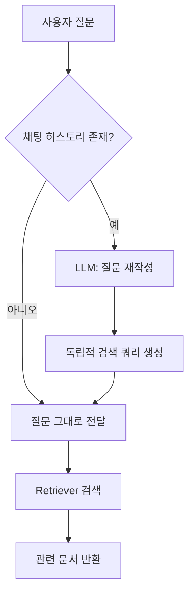
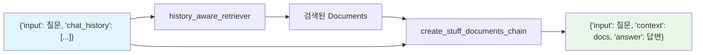
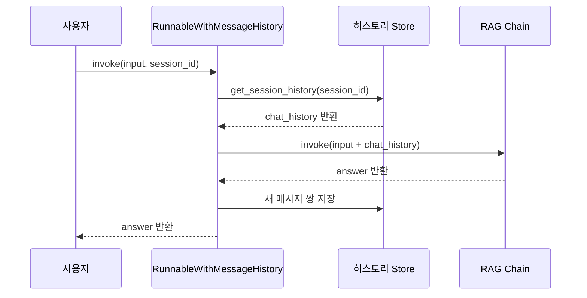
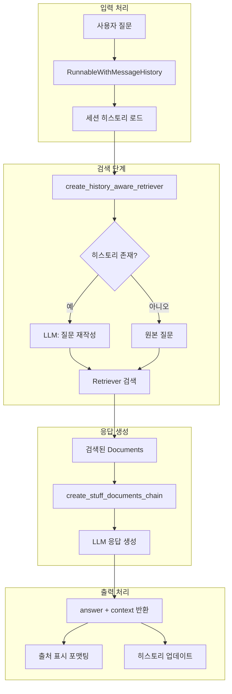

# 완성된 RAG 체인 — 질문 응답 시스템 구현

> 대화 히스토리를 기억하고, 출처를 밝히는 완전한 RAG 질문 응답 시스템을 구축합니다.

## 개요

이 세션에서는 앞서 배운 인덱싱 파이프라인(세션 8.3)과 검색 체인(세션 8.4)을 결합하여, **대화 맥락을 이해하는 완전한 RAG 질문 응답 시스템**을 구축합니다. 사용자가 "그거 좀 더 자세히 알려줘"라고 말했을 때 "그거"가 뭔지 이해하는 시스템, 그리고 답변마다 "어디서 가져온 정보인지" 출처를 밝히는 시스템을 만들어 봅니다.

**선수 지식**: 
- [세션 8.2](session-8.2)에서 배운 LCEL 체인 조합(RunnablePassthrough, RunnableParallel)
- [세션 8.3](session-8.3)에서 배운 인덱싱 파이프라인(DocumentLoader, TextSplitter, Chroma)
- [세션 8.4](session-8.4)에서 배운 VectorStoreRetriever와 RAG 프롬프트 설계

**학습 목표**:
- `create_history_aware_retriever`로 대화 맥락을 반영한 검색 체인을 구성할 수 있다
- `create_retrieval_chain`으로 검색부터 응답 생성까지 이어지는 완전한 RAG 체인을 조합할 수 있다
- 채팅 히스토리를 관리하여 멀티턴 대화형 RAG를 구현할 수 있다
- Document 메타데이터를 활용한 출처 표시(source attribution)를 구현할 수 있다

## 왜 알아야 할까?

여러분이 만든 RAG 시스템을 실제 사용자에게 배포한다고 상상해 보세요. 사용자가 이렇게 질문합니다:

> "LangChain에서 LCEL이 뭐야?"  
> "그걸 사용하면 어떤 장점이 있어?"  
> "코드 예제 좀 보여줘"

두 번째 질문의 "그걸"은 LCEL을 의미하죠. 세 번째 "코드 예제"도 LCEL의 코드 예제입니다. 하지만 [세션 8.4](session-8.4)에서 만든 단일 질문 RAG 체인은 각 질문을 **독립적으로** 처리합니다. "그걸"이 뭔지 모르는 거예요.

실제 서비스에서는 이것만으로 끝나지 않습니다. 사용자는 "이 답변 근거가 뭐야?"라고 물을 수도 있고, 할루시네이션(Hallucination)을 의심할 수도 있습니다. **출처를 밝히지 않는 RAG는 신뢰를 얻기 어렵습니다.**

이번 세션에서 만들 시스템은 이 두 가지 문제를 모두 해결합니다 — **대화 맥락 이해**와 **출처 표시**. 프로덕션 RAG 앱의 핵심 요구사항이죠.

## 핵심 개념

### 개념 1: 대화 맥락 인식 검색 — create_history_aware_retriever

> 💡 **비유**: 도서관 사서에게 질문하는 상황을 떠올려 보세요. 처음에 "양자역학 책 좀 찾아주세요"라고 하고, 이어서 "입문서로요"라고만 말해도 사서는 "양자역학 입문서"를 찾아줍니다. 이전 대화를 기억하고 있으니까요. `create_history_aware_retriever`는 바로 이 **기억하는 사서** 역할을 합니다.

[세션 8.4](session-8.4)에서 만든 검색 체인은 매번 독립적인 질문만 처리했습니다. 하지만 실제 대화에서는 대명사("그거", "그건")나 생략("더 자세히")이 빈번하죠. `create_history_aware_retriever`는 이 문제를 **질문 재작성(Query Reformulation)** 으로 해결합니다.

작동 원리는 단순합니다:

1. **채팅 히스토리가 없으면**: 사용자 질문을 그대로 리트리버에 전달
2. **채팅 히스토리가 있으면**: LLM이 히스토리 + 현재 질문을 보고, **독립적으로 이해 가능한 검색 쿼리**를 생성 → 이 쿼리로 검색

> 📊 **그림 1**: create_history_aware_retriever의 동작 흐름



핵심은 **질문 재작성 프롬프트**입니다. LLM에게 "대화 히스토리와 최신 질문을 보고, 히스토리 없이도 이해할 수 있는 독립적인 질문을 만들어줘"라고 요청하는 거죠.

```python
from langchain_core.prompts import ChatPromptTemplate, MessagesPlaceholder
from langchain.chains import create_history_aware_retriever

# 질문 재작성 프롬프트
contextualize_q_prompt = ChatPromptTemplate.from_messages([
    ("system", 
     "채팅 히스토리와 최신 사용자 질문이 주어집니다. "
     "질문이 히스토리의 맥락을 참조할 수 있습니다. "
     "히스토리 없이도 이해할 수 있는 독립적인 질문으로 재작성하세요. "
     "질문을 답하지 말고, 필요하면 재작성만 하세요. "
     "이미 독립적이면 그대로 반환하세요."),
    MessagesPlaceholder("chat_history"),  # 대화 히스토리 삽입 위치
    ("human", "{input}"),
])

# 히스토리 인식 리트리버 생성
history_aware_retriever = create_history_aware_retriever(
    llm,           # ChatOpenAI 등 LLM
    retriever,     # vectorstore.as_retriever()
    contextualize_q_prompt
)
```

`MessagesPlaceholder("chat_history")`가 핵심인데요, 이전 대화 메시지들이 이 자리에 삽입됩니다. LLM은 이 맥락을 보고 "그거"가 무엇인지, "더 자세히"가 무엇에 대한 건지 파악하여 검색 쿼리를 재구성합니다.

> ⚠️ **흔한 오해**: `create_history_aware_retriever`가 모든 대화를 기억하는 건 아닙니다. 이 함수 자체는 **상태를 저장하지 않아요**. 매번 호출할 때 `chat_history`를 명시적으로 전달해야 합니다. 히스토리 저장은 별도의 메모리 관리 계층이 담당하죠.

### 개념 2: 완전한 RAG 체인 조합 — create_retrieval_chain

> 💡 **비유**: 레스토랑의 풀코스 주문 시스템을 생각해 보세요. 손님이 주문하면(질문), 웨이터가 주방에서 재료를 가져오고(검색), 셰프가 요리하여(LLM 응답 생성), 출처와 함께 서빙합니다("이 토마토는 제주산입니다"). `create_retrieval_chain`은 이 **전체 과정을 하나로 묶는** 오케스트레이터입니다.

[세션 8.4](session-8.4)에서 LCEL로 직접 RAG 체인을 조합하는 방법을 배웠습니다. `create_retrieval_chain`은 이 패턴을 **고수준 함수**로 추상화한 것입니다. 리트리버(검색)와 문서 결합 체인(응답 생성)을 연결하여, 입력부터 최종 응답까지 한 번에 처리합니다.

```python
from langchain.chains import create_retrieval_chain
from langchain.chains.combine_documents import create_stuff_documents_chain

# 1) QA 프롬프트 — 검색된 문서를 기반으로 답변 생성
qa_prompt = ChatPromptTemplate.from_messages([
    ("system", 
     "당신은 질문 답변 어시스턴트입니다. "
     "검색된 컨텍스트를 사용하여 질문에 답하세요. "
     "답을 모르면 모른다고 말하세요. "
     "최대 3문장으로 간결하게 답변하세요.\n\n"
     "{context}"),
    MessagesPlaceholder("chat_history"),
    ("human", "{input}"),
])

# 2) 문서 결합 체인 (stuff 전략)
question_answer_chain = create_stuff_documents_chain(llm, qa_prompt)

# 3) 검색 + 응답 생성을 하나로 결합
rag_chain = create_retrieval_chain(
    history_aware_retriever,    # 위에서 만든 히스토리 인식 리트리버
    question_answer_chain       # 문서 기반 QA 체인
)
```

`create_retrieval_chain`의 반환값은 딕셔너리입니다. 단순한 문자열이 아니라 **구조화된 결과**를 돌려주는데요:

| 키 | 설명 |
|-----|------|
| `input` | 원래 사용자 질문 |
| `chat_history` | 전달된 대화 히스토리 |
| `context` | 검색된 Document 객체 리스트 |
| `answer` | LLM이 생성한 최종 답변 |

```run:python
# create_retrieval_chain 반환값 구조 시뮬레이션
result = {
    "input": "LCEL이 뭔가요?",
    "chat_history": [],
    "context": ["[Document(page_content='LCEL은 ...', metadata={'source': 'docs/lcel.md'})]"],
    "answer": "LCEL은 LangChain Expression Language의 약자로..."
}

print(f"질문: {result['input']}")
print(f"답변: {result['answer']}")
print(f"검색된 문서 수: {len(result['context'])}")
print(f"히스토리 길이: {len(result['chat_history'])}")
```

```output
질문: LCEL이 뭔가요?
답변: LCEL은 LangChain Expression Language의 약자로...
검색된 문서 수: 1
히스토리 길이: 0
```

`context` 키에 검색된 원본 Document 객체가 그대로 담겨 있다는 점이 중요합니다. 이걸로 **출처 표시**를 구현할 수 있거든요.

> 📊 **그림 2**: create_retrieval_chain의 전체 데이터 흐름



### 개념 3: 채팅 히스토리 관리 — 세션 기반 메모리

> 💡 **비유**: 카페에서 단골 손님을 떠올려 보세요. 바리스타가 "평소처럼 드릴까요?"라고 물을 수 있는 건, **그 손님의 이전 주문 기록**을 기억하고 있기 때문이죠. 채팅 히스토리 관리는 각 사용자(세션)별로 이런 **대화 기록 노트**를 관리하는 시스템입니다.

`create_retrieval_chain` 자체는 상태가 없습니다(stateless). 매번 `chat_history`를 직접 전달해야 하죠. 실제 서비스에서는 이걸 자동으로 관리해야 합니다. LangChain은 `ChatMessageHistory`와 `RunnableWithMessageHistory`를 제공합니다.

```python
from langchain_community.chat_message_histories import ChatMessageHistory
from langchain_core.runnables.history import RunnableWithMessageHistory
from langchain_core.chat_history import BaseChatMessageHistory

# 세션별 히스토리 저장소 (인메모리)
store: dict[str, BaseChatMessageHistory] = {}

def get_session_history(session_id: str) -> BaseChatMessageHistory:
    """세션 ID로 채팅 히스토리를 가져오거나 새로 생성"""
    if session_id not in store:
        store[session_id] = ChatMessageHistory()
    return store[session_id]

# RAG 체인을 메시지 히스토리로 래핑
conversational_rag_chain = RunnableWithMessageHistory(
    rag_chain,                          # create_retrieval_chain으로 만든 체인
    get_session_history,                # 히스토리 팩토리 함수
    input_messages_key="input",         # 사용자 입력 키
    history_messages_key="chat_history", # 히스토리가 주입될 키
    output_messages_key="answer",       # 응답 키 (히스토리에 저장될 값)
)
```

이제 체인을 호출할 때 `session_id`만 지정하면, 히스토리가 **자동으로 주입되고 업데이트**됩니다:

```python
# 같은 session_id로 연속 호출하면 대화가 이어짐
response1 = conversational_rag_chain.invoke(
    {"input": "LCEL이 뭔가요?"},
    config={"configurable": {"session_id": "user_123"}}
)

response2 = conversational_rag_chain.invoke(
    {"input": "그걸 사용하면 어떤 장점이 있어?"},  # "그걸" = LCEL
    config={"configurable": {"session_id": "user_123"}}
)
```

> 📊 **그림 3**: RunnableWithMessageHistory의 자동 히스토리 관리 흐름



`RunnableWithMessageHistory`가 하는 일을 정리하면:

1. `session_id`로 히스토리를 가져옴
2. 가져온 히스토리를 `chat_history` 키에 주입
3. 체인 실행 후 사용자 입력과 AI 응답을 히스토리에 추가
4. 다음 호출 때 업데이트된 히스토리가 자동으로 포함

> 🔥 **실무 팁**: 인메모리 `ChatMessageHistory`는 프로토타이핑에 적합하지만, 프로덕션에서는 서버 재시작 시 히스토리가 사라집니다. Redis, PostgreSQL, MongoDB 등 영속 저장소를 사용하세요. `langchain-community`에 `RedisChatMessageHistory`, `PostgresChatMessageHistory` 등이 준비되어 있습니다.

### 개념 4: 출처 표시 — Source Attribution

> 💡 **비유**: 뉴스 기사가 "관계자에 따르면..."이라고만 쓰면 신뢰가 떨어지죠. "산업통상자원부 공식 보도자료에 따르면..."이라고 쓰면 훨씬 신뢰감이 높아집니다. RAG에서 출처 표시는 바로 이 **"어디서 가져온 정보인지"** 를 밝히는 겁니다.

`create_retrieval_chain`이 반환하는 `context`에는 검색된 Document 객체들이 담겨 있습니다. 각 Document의 `metadata`에는 [세션 8.3](session-8.3)의 인덱싱 단계에서 저장한 소스 정보가 들어 있죠.

```python
def format_answer_with_sources(response: dict) -> str:
    """답변에 출처 정보를 추가하는 함수"""
    answer = response["answer"]
    sources = set()  # 중복 제거를 위해 set 사용
    
    for doc in response["context"]:
        # 메타데이터에서 출처 정보 추출
        source = doc.metadata.get("source", "출처 불명")
        page = doc.metadata.get("page", None)
        
        if page is not None:
            sources.add(f"{source} (p.{page})")
        else:
            sources.add(source)
    
    # 답변 + 출처 포맷팅
    source_text = "\n".join(f"  - {s}" for s in sorted(sources))
    return f"{answer}\n\n📚 출처:\n{source_text}"
```

```run:python
# 출처 표시 시뮬레이션
answer = "LCEL은 LangChain Expression Language의 약자로, 파이프 연산자(|)를 사용하여 체인을 조합하는 선언적 문법입니다."
sources = ["docs/langchain/lcel.md (p.3)", "docs/langchain/concepts.md (p.12)"]

formatted = f"{answer}\n\n📚 출처:"
for s in sources:
    formatted += f"\n  - {s}"
print(formatted)
```

```output
LCEL은 LangChain Expression Language의 약자로, 파이프 연산자(|)를 사용하여 체인을 조합하는 선언적 문법입니다.

📚 출처:
  - docs/langchain/lcel.md (p.3)
  - docs/langchain/concepts.md (p.12)
```

더 정교한 출처 표시를 위해, 인덱싱 단계에서 **풍부한 메타데이터**를 저장하는 것이 핵심입니다:

```python
from langchain_core.documents import Document

# 인덱싱 시 메타데이터를 풍부하게 설정
doc = Document(
    page_content="LCEL은 파이프 연산자로 체인을 조합합니다...",
    metadata={
        "source": "langchain_docs/lcel_guide.md",
        "page": 3,
        "author": "LangChain Team",
        "created_at": "2025-01-15",
        "chunk_id": "lcel_guide_chunk_7",
    }
)
```

> 💡 **알고 계셨나요?**: 출처 표시(Source Attribution)는 단순한 UX 개선이 아닙니다. 2023년 뉴욕의 한 변호사가 ChatGPT가 만들어낸 **존재하지 않는 판례**를 법정에 제출하여 징계를 받은 사건이 있었습니다. 이후 법률, 의료, 금융 분야에서 AI 응답의 출처 표시가 **규제 요구사항**이 되어가고 있습니다. RAG의 출처 표시는 이런 할루시네이션 리스크를 크게 줄여줍니다.

## 실습: 직접 해보기

이제 모든 개념을 결합하여, **대화형 RAG 질문 응답 시스템**을 처음부터 구축해 봅시다. 이 실습에서는 웹 문서를 로딩하여 인덱싱하고, 멀티턴 대화와 출처 표시가 가능한 완전한 RAG 앱을 만듭니다.

### 1단계: 환경 설정과 인덱싱

```python
import os
from dotenv import load_dotenv

# 환경 변수 로드 (.env 파일에 OPENAI_API_KEY 설정)
load_dotenv()

# ── 필요한 모듈 임포트 ──
from langchain_openai import ChatOpenAI, OpenAIEmbeddings
from langchain_community.document_loaders import WebBaseLoader
from langchain_text_splitters import RecursiveCharacterTextSplitter
from langchain_chroma import Chroma
from langchain_core.prompts import ChatPromptTemplate, MessagesPlaceholder
from langchain_core.messages import HumanMessage, AIMessage
from langchain.chains import create_history_aware_retriever, create_retrieval_chain
from langchain.chains.combine_documents import create_stuff_documents_chain
from langchain_community.chat_message_histories import ChatMessageHistory
from langchain_core.runnables.history import RunnableWithMessageHistory
from langchain_core.chat_history import BaseChatMessageHistory

# ── LLM 초기화 ──
llm = ChatOpenAI(model="gpt-4o-mini", temperature=0)

# ── 문서 로딩 (세션 8.3에서 배운 패턴) ──
loader = WebBaseLoader(
    web_paths=["https://lilianweng.github.io/posts/2023-06-23-agent/"],
)
docs = loader.load()

# ── 텍스트 분할 ──
text_splitter = RecursiveCharacterTextSplitter(
    chunk_size=1000,    # 1000자 단위로 분할
    chunk_overlap=200,  # 200자 겹침으로 문맥 유지
)
splits = text_splitter.split_documents(docs)

# ── 벡터 저장소 생성 (세션 8.3에서 배운 from_documents) ──
vectorstore = Chroma.from_documents(
    documents=splits,
    embedding=OpenAIEmbeddings(),
)

# ── 리트리버 생성 (세션 8.4에서 배운 패턴) ──
retriever = vectorstore.as_retriever(
    search_type="similarity",
    search_kwargs={"k": 4},  # 상위 4개 문서 검색
)
```

### 2단계: 히스토리 인식 리트리버 구성

```python
# ── 질문 재작성 프롬프트 ──
contextualize_q_system_prompt = (
    "채팅 히스토리와 최신 사용자 질문이 주어집니다. "
    "질문이 채팅 히스토리의 맥락을 참조할 수 있습니다. "
    "채팅 히스토리 없이도 이해할 수 있는 독립적인 질문으로 재작성하세요. "
    "질문에 답하지 말고, 필요하면 재작성만 하고, "
    "이미 독립적이면 그대로 반환하세요."
)

contextualize_q_prompt = ChatPromptTemplate.from_messages([
    ("system", contextualize_q_system_prompt),
    MessagesPlaceholder("chat_history"),
    ("human", "{input}"),
])

# ── 히스토리 인식 리트리버 생성 ──
history_aware_retriever = create_history_aware_retriever(
    llm, retriever, contextualize_q_prompt
)
```

### 3단계: QA 체인과 완전한 RAG 체인 조합

```python
# ── QA 프롬프트 (출처 활용을 유도하는 시스템 메시지) ──
qa_system_prompt = (
    "당신은 질문 답변 어시스턴트입니다. "
    "검색된 컨텍스트를 사용하여 질문에 답하세요. "
    "답을 모르면 모른다고 말하세요. "
    "답변 시 어떤 컨텍스트 정보를 참고했는지 간략히 언급하세요. "
    "최대 5문장으로 간결하게 답변하세요.\n\n"
    "{context}"
)

qa_prompt = ChatPromptTemplate.from_messages([
    ("system", qa_system_prompt),
    MessagesPlaceholder("chat_history"),
    ("human", "{input}"),
])

# ── 문서 결합 체인 (stuff 전략, 세션 8.4에서 배운 패턴) ──
question_answer_chain = create_stuff_documents_chain(llm, qa_prompt)

# ── 완전한 RAG 체인: 검색 → 문서 결합 → 응답 생성 ──
rag_chain = create_retrieval_chain(
    history_aware_retriever, 
    question_answer_chain
)
```

### 4단계: 세션 기반 채팅 히스토리 관리

```python
# ── 세션별 히스토리 저장소 ──
store: dict[str, BaseChatMessageHistory] = {}

def get_session_history(session_id: str) -> BaseChatMessageHistory:
    """세션 ID에 해당하는 채팅 히스토리를 반환"""
    if session_id not in store:
        store[session_id] = ChatMessageHistory()
    return store[session_id]

# ── 대화형 RAG 체인 (히스토리 자동 관리) ──
conversational_rag_chain = RunnableWithMessageHistory(
    rag_chain,
    get_session_history,
    input_messages_key="input",
    history_messages_key="chat_history",
    output_messages_key="answer",
)
```

### 5단계: 출처 표시 유틸리티와 실행

```python
def format_response(response: dict) -> str:
    """응답에 출처 정보를 추가하여 포맷팅"""
    answer = response["answer"]
    
    # 검색된 문서에서 출처 추출 (중복 제거)
    sources = []
    seen = set()
    for doc in response["context"]:
        source = doc.metadata.get("source", "알 수 없음")
        if source not in seen:
            seen.add(source)
            # 청크 일부를 미리보기로 표시
            preview = doc.page_content[:80].replace("\n", " ")
            sources.append(f"{source}\n    → \"{preview}...\"")
    
    result = f"🤖 답변:\n{answer}\n"
    if sources:
        result += "\n📚 출처:\n"
        for i, src in enumerate(sources, 1):
            result += f"  [{i}] {src}\n"
    return result


# ── 대화형 RAG 실행 ──
config = {"configurable": {"session_id": "demo_session_001"}}

# 첫 번째 질문
response1 = conversational_rag_chain.invoke(
    {"input": "Task Decomposition이 뭔가요?"},
    config=config,
)
print(format_response(response1))
print("=" * 60)

# 두 번째 질문 — "그것"이 Task Decomposition을 가리킴
response2 = conversational_rag_chain.invoke(
    {"input": "그것의 일반적인 접근 방법은 뭐가 있나요?"},
    config=config,
)
print(format_response(response2))
```

이 코드를 실행하면, 두 번째 질문의 "그것"이 첫 번째 대화에서 언급된 "Task Decomposition"으로 해석되어 관련 문서가 검색됩니다. `history_aware_retriever`가 내부적으로 "Task Decomposition의 일반적인 접근 방법"이라는 독립 쿼리로 재작성하는 것이죠.

### 6단계: LCEL로 직접 구현하기 (대안 방식)

고수준 함수 대신 [세션 8.2](session-8.2)에서 배운 LCEL 패턴으로 동일한 체인을 직접 조합할 수도 있습니다:

```python
from langchain_core.runnables import RunnablePassthrough, RunnableLambda
from langchain_core.output_parsers import StrOutputParser

def format_docs(docs: list) -> str:
    """Document 리스트를 하나의 문자열로 결합"""
    return "\n\n".join(doc.page_content for doc in docs)

def contextualize_question(input_dict: dict) -> str:
    """히스토리가 있으면 질문 재작성, 없으면 그대로 반환"""
    if not input_dict.get("chat_history"):
        return input_dict["input"]
    # 히스토리가 있으면 재작성 체인 실행
    return contextualize_q_chain.invoke(input_dict)

# 질문 재작성 체인
contextualize_q_chain = contextualize_q_prompt | llm | StrOutputParser()

# LCEL로 직접 조합한 RAG 체인
manual_rag_chain = (
    RunnablePassthrough.assign(
        context=RunnableLambda(contextualize_question) | retriever | format_docs
    )
    | qa_prompt
    | llm
    | StrOutputParser()
)
```

이 방식은 `create_retrieval_chain`보다 유연하지만, 반환값이 문자열이라 `context` Document에 직접 접근하기 어렵습니다. 출처 표시가 중요한 경우 `create_retrieval_chain`을 권장합니다.

> 📊 **그림 4**: 완전한 대화형 RAG 시스템 아키텍처



## 더 깊이 알아보기

### ConversationalRetrievalChain의 탄생과 진화

LangChain 초기(2022년 말~2023년 초)에는 대화형 RAG를 위해 `ConversationalRetrievalChain`이라는 단일 클래스가 사용되었습니다. Harrison Chase가 LangChain을 처음 만들 때, "하나의 클래스가 모든 것을 처리하는" 방식을 택했죠. 이 클래스는 질문 압축(condense question), 문서 검색, 응답 생성을 모두 내부적으로 처리했습니다.

하지만 사용자들이 점점 더 복잡한 커스터마이징을 원하면서 문제가 드러났습니다. 검색 방식만 바꾸고 싶은데 전체 클래스를 상속해야 하고, 프롬프트를 수정하려면 내부 구현을 파고들어야 했죠. LangChain 팀은 이를 해결하기 위해 2023년 중반 LCEL(LangChain Expression Language)을 도입했고, 복잡한 레거시 체인들을 **조합 가능한 작은 함수들**로 분해했습니다.

그 결과가 바로 `create_history_aware_retriever` + `create_stuff_documents_chain` + `create_retrieval_chain`의 3단 조합 패턴입니다. `ConversationalRetrievalChain`은 v0.1.17에서 deprecated 되었고, v1.0에서는 레거시 체인들이 `langchain-classic` 패키지로 분리되었습니다. 하나의 모놀리식 클래스에서 **조합 가능한 함수형 패턴**으로의 전환은 LangChain 아키텍처 철학의 근본적인 변화를 보여줍니다.

### 왜 "질문 재작성"이 핵심인가?

대화형 RAG에서 가장 직관적인 접근은 "히스토리 전체를 벡터 검색에 넘기자"일 수 있습니다. 하지만 이 방식은 잘 작동하지 않습니다. 벡터 검색은 **짧고 명확한 쿼리**에서 최고의 성능을 보이거든요. 긴 대화 히스토리를 통째로 임베딩하면 노이즈가 많아져 검색 품질이 떨어집니다.

Meta AI의 원본 RAG 논문(2020)에서도 검색 쿼리의 품질이 전체 시스템 성능에 결정적 영향을 미친다고 밝혔습니다. 이후 Microsoft의 연구팀이 "대화 맥락에서 검색 쿼리를 재작성하면 검색 품질이 크게 향상된다"는 것을 실험적으로 입증했고, 이 아이디어가 LangChain의 `create_history_aware_retriever`에 반영된 것입니다.

## 흔한 오해와 팁

> ⚠️ **흔한 오해**: "`create_retrieval_chain`은 LCEL로 직접 만든 체인보다 느리다"고 생각하는 분이 있습니다. 실제로 `create_retrieval_chain` 내부는 LCEL로 구현되어 있어 성능 차이가 없습니다. 오히려 `context` 키에 원본 Document를 보존해주므로, 출처 표시가 필요한 경우 LCEL 수동 조합보다 편리합니다.

> ⚠️ **흔한 오해**: "채팅 히스토리를 많이 넣을수록 좋다"고 생각하기 쉽습니다. 하지만 히스토리가 너무 길면 (1) LLM의 컨텍스트 윈도우를 과도하게 소비하고 (2) 질문 재작성의 품질이 오히려 떨어질 수 있습니다. 보통 최근 5~10턴 정도로 제한하는 것이 실무에서 효과적입니다.

> 💡 **알고 계셨나요?**: LangChain v0.3부터는 새로운 프로젝트에 `RunnableWithMessageHistory` 대신 **LangGraph의 영속성(persistence)** 기능을 권장하고 있습니다. LangGraph는 상태 그래프(State Graph) 기반으로 더 복잡한 대화 흐름을 관리할 수 있죠. 하지만 `RunnableWithMessageHistory`도 계속 지원되며 deprecated 예정이 아니므로, 간단한 대화형 RAG에는 여전히 좋은 선택입니다.

> 🔥 **실무 팁**: 출처 표시를 더 정교하게 하려면, 인덱싱 단계에서 메타데이터를 풍부하게 설정하세요. `source`, `page`, `chunk_id`는 기본이고, `author`, `created_at`, `section_title` 같은 필드를 추가하면 사용자에게 훨씬 유용한 출처 정보를 제공할 수 있습니다. 인덱싱은 한 번 하면 끝이지만, 부족한 메타데이터는 나중에 전체 재인덱싱을 요구합니다.

> 🔥 **실무 팁**: 질문 재작성 프롬프트를 한국어로 작성할 때, "독립적인 질문으로 재작성하세요"보다 "채팅 히스토리 없이도 이해할 수 있는 검색 쿼리를 생성하세요"라고 명시하면 검색 품질이 향상됩니다. "질문 재작성"이라고 하면 LLM이 완전한 문장을 만들려 하지만, "검색 쿼리 생성"이라고 하면 핵심 키워드 중심의 쿼리를 만들어 벡터 검색에 더 적합합니다.

## 핵심 정리

| 개념 | 설명 |
|------|------|
| `create_history_aware_retriever` | 채팅 히스토리를 참고해 질문을 재작성한 후 검색하는 리트리버. 히스토리 없으면 원본 질문 그대로 검색 |
| `create_retrieval_chain` | 리트리버 + 문서결합체인을 하나로 묶는 고수준 함수. `input`, `context`, `answer` 키를 가진 딕셔너리 반환 |
| `create_stuff_documents_chain` | 검색된 문서를 프롬프트에 삽입하여 LLM 응답을 생성하는 체인. `{context}` 플레이스홀더 필수 |
| `MessagesPlaceholder` | 프롬프트 내에서 채팅 히스토리가 동적으로 삽입되는 위치를 지정하는 템플릿 요소 |
| `RunnableWithMessageHistory` | 체인을 래핑하여 세션별 채팅 히스토리를 자동으로 주입하고 업데이트하는 래퍼 |
| `ChatMessageHistory` | 인메모리 채팅 히스토리 저장소. 프로토타이핑용. 프로덕션에는 Redis/PostgreSQL 등 사용 |
| Source Attribution | Document 메타데이터를 활용하여 답변의 근거 출처를 사용자에게 표시하는 기법 |
| 질문 재작성 (Query Reformulation) | 대화 맥락을 참고해 대명사/생략 등을 해소한 독립적 검색 쿼리를 생성하는 기법 |

## 다음 섹션 미리보기

이번 세션에서 대화형 RAG 질문 응답 시스템의 핵심을 완성했습니다. 다음 세션 **"8.6: RAG 파이프라인 통합과 스트리밍"** 에서는 지금까지 Chapter 8에서 배운 모든 요소를 하나의 프로덕션급 파이프라인으로 통합하고, `stream` 메서드를 활용한 **실시간 스트리밍 응답** 구현과 에러 핸들링, 그리고 전체 파이프라인의 성능 최적화 전략을 다룹니다. [Chapter 10](chapter-10)의 검색 품질 향상과 [Chapter 12](chapter-12)의 리랭킹 기법을 적용하기 전에, 먼저 견고한 기본 파이프라인을 확보하는 것이 핵심입니다.

## 참고 자료

- [Build a RAG Agent with LangChain — 공식 튜토리얼](https://docs.langchain.com/oss/python/langchain/rag) - LangChain 공식 문서의 RAG 구축 가이드. 최신 에이전트 기반 RAG 패턴과 도구 사용법을 포함합니다
- [LangChain RAG From Scratch (GitHub + Video)](https://github.com/langchain-ai/rag-from-scratch) - LangChain 팀이 제작한 RAG 처음부터 구축하기 시리즈. 단계별 코드와 영상 강의를 함께 제공합니다
- [create_history_aware_retriever API 레퍼런스](https://reference.langchain.com/python/langchain-classic/chains/history_aware_retriever/create_history_aware_retriever) - `create_history_aware_retriever`의 공식 API 문서. 파라미터 사양과 사용 예제를 확인할 수 있습니다
- [Migrating from ConversationalRetrievalChain](https://python.langchain.com/docs/versions/migrating_chains/conversation_retrieval_chain/) - 레거시 `ConversationalRetrievalChain`에서 새로운 패턴으로 마이그레이션하는 공식 가이드
- [Retrieval-Augmented Generation for Knowledge-Intensive NLP Tasks](https://arxiv.org/abs/2005.11401) - Meta AI의 원본 RAG 논문. 검색 쿼리 품질이 전체 시스템 성능에 미치는 영향을 실험적으로 보여줍니다
- [Citation-Aware RAG: Fine Grained Citations in Retrieval](https://www.tensorlake.ai/blog/rag-citations) - RAG에서 세밀한 출처 표시를 구현하는 방법론. 인덱싱 단계에서의 메타데이터 설계 전략을 자세히 다룹니다

---
### 🔗 Related Sessions
- [document](../03-문서-로딩과-파싱-다양한-소스에서-데이터-수집/01-문서-로딩-기초-langchain-document-loaders.md) (prerequisite)
- [metadata](../03-문서-로딩과-파싱-다양한-소스에서-데이터-수집/01-문서-로딩-기초-langchain-document-loaders.md) (prerequisite)
- [recursivecharactertextsplitter](../04-텍스트-청킹-전략-문서-분할과-최적화/02-고정-크기-청킹과-재귀적-청킹.md) (prerequisite)
- [lcel](../08-기본-rag-파이프라인-구축-langchain으로-첫-rag-앱-만들기/01-langchain-v1-핵심-개념과-설정.md) (prerequisite)
- [chatprompttemplate](../08-기본-rag-파이프라인-구축-langchain으로-첫-rag-앱-만들기/01-langchain-v1-핵심-개념과-설정.md) (prerequisite)
- [runnablepassthrough](../08-기본-rag-파이프라인-구축-langchain으로-첫-rag-앱-만들기/02-lcel-langchain-expression-language-마스터하기.md) (prerequisite)
- [runnablelambda](../08-기본-rag-파이프라인-구축-langchain으로-첫-rag-앱-만들기/02-lcel-langchain-expression-language-마스터하기.md) (prerequisite)
- [vectorstoreretriever](../08-기본-rag-파이프라인-구축-langchain으로-첫-rag-앱-만들기/04-검색-체인-구축-retriever와-프롬프트-설계.md) (prerequisite)
- [create_stuff_documents_chain](../08-기본-rag-파이프라인-구축-langchain으로-첫-rag-앱-만들기/04-검색-체인-구축-retriever와-프롬프트-설계.md) (prerequisite)
- [format_docs](../06-벡터-데이터베이스-기초-chromadb로-시작하기/05-langchain-chromadb-통합-실습.md) (prerequisite)
- [search_type](../08-기본-rag-파이프라인-구축-langchain으로-첫-rag-앱-만들기/04-검색-체인-구축-retriever와-프롬프트-설계.md) (prerequisite)
- [search_kwargs](../08-기본-rag-파이프라인-구축-langchain으로-첫-rag-앱-만들기/04-검색-체인-구축-retriever와-프롬프트-설계.md) (prerequisite)
