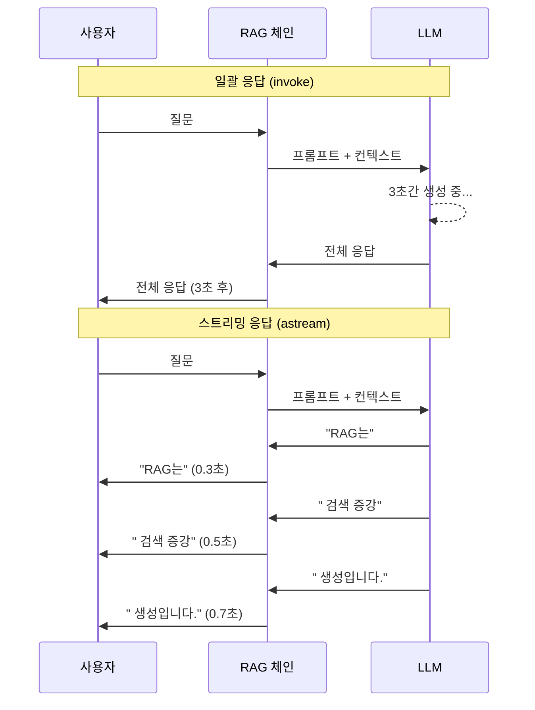
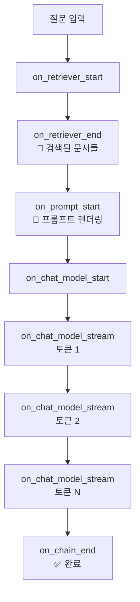
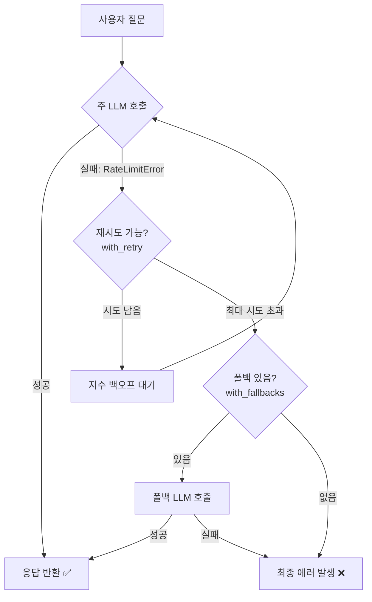
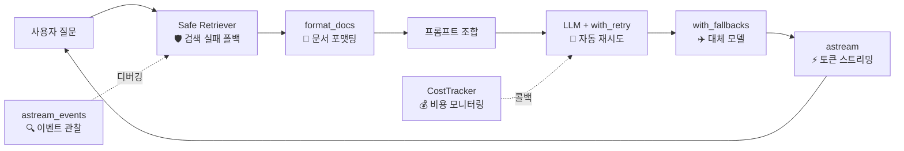

# RAG 앱 스트리밍과 에러 처리

> LangChain RAG 파이프라인에 실시간 스트리밍, 에러 복구, 비용 모니터링을 적용하여 프로덕션 수준의 안정성을 확보합니다

## 개요

이 섹션에서는 [세션 8.5](session-8.5)에서 완성한 대화형 RAG 체인에 **실시간 스트리밍**, **에러 처리와 재시도**, **폴백 전략**, **토큰 비용 모니터링**을 추가하여 프로덕션 환경에서 안정적으로 동작하는 RAG 앱을 만듭니다.

**선수 지식**: 세션 8.1~8.5에서 배운 LCEL 체인 조합, Retriever, 대화형 RAG 체인 구성
**학습 목표**:
- `astream`과 `astream_events`로 RAG 응답을 토큰 단위로 스트리밍할 수 있다
- `with_retry`와 `with_fallbacks`로 LLM 호출 실패에 대비한 복구 전략을 구현할 수 있다
- 검색 실패 시 폴백 응답을 생성하는 방어적 RAG 체인을 설계할 수 있다
- 콜백 기반 토큰 사용량 추적으로 RAG 앱의 비용을 모니터링할 수 있다

## 왜 알아야 할까?

ChatGPT를 써본 적 있다면, 답변이 한 글자씩 타닥타닥 나타나는 경험을 해보셨을 겁니다. 만약 전체 응답이 생성될 때까지 10초간 빈 화면만 보여준다면? 대부분의 사용자는 "앱이 멈췄나?" 하고 새로고침을 누를 거예요. **스트리밍**은 단순한 기능이 아니라, 사용자 경험의 핵심입니다.

그런데 프로덕션 환경에서는 스트리밍만으로 부족합니다. OpenAI API가 갑자기 429(Rate Limit) 에러를 뿜거나, 벡터 DB 연결이 끊기거나, 예상보다 토큰을 10배 더 쓰면서 비용이 폭발하는 상황을 반드시 대비해야 합니다. 이 세션에서는 이런 **실전 문제**들을 체계적으로 해결하는 방법을 배웁니다.

## 핵심 개념

### 개념 1: 응답 스트리밍 — `stream`과 `astream`

> 💡 **비유**: 레스토랑에서 코스 요리를 주문했다고 생각해보세요. 모든 요리가 완성될 때까지 30분 동안 빈 접시만 바라보는 것(일괄 응답)과, 에피타이저부터 한 접시씩 나오는 것(스트리밍) 중 어느 쪽이 나을까요? 스트리밍은 LLM이 생성하는 토큰을 "한 접시씩" 실시간으로 전달하는 방식입니다.

LangChain의 모든 Runnable은 `invoke`의 스트리밍 버전인 `stream`(동기)과 `astream`(비동기) 메서드를 제공합니다. [세션 8.2](session-8.2)에서 배운 Runnable 인터페이스의 6가지 실행 메서드 중 두 가지였죠.

RAG 체인에서 스트리밍이 특히 중요한 이유는, 검색(Retriever) 단계는 한 번에 결과가 나오지만 **LLM 생성 단계는 수 초가 걸릴 수 있기 때문**입니다. 스트리밍을 사용하면 첫 토큰이 생성되는 즉시 사용자에게 보여줄 수 있습니다.

> 📊 **그림 1**: 일괄 응답 vs 스트리밍 응답의 사용자 체감 차이



**기본 스트리밍 — `stream`과 `astream`**

```python
from langchain_openai import ChatOpenAI
from langchain_core.prompts import ChatPromptTemplate
from langchain_core.output_parsers import StrOutputParser

# 스트리밍 활성화 (기본값이 True이지만 명시적으로 설정)
llm = ChatOpenAI(model="gpt-4o-mini", temperature=0, streaming=True)

prompt = ChatPromptTemplate.from_template(
    "다음 컨텍스트를 기반으로 질문에 답하세요.\n"
    "컨텍스트: {context}\n질문: {question}"
)

chain = prompt | llm | StrOutputParser()

# 동기 스트리밍
for chunk in chain.stream({"context": "RAG는 검색 증강 생성입니다.", "question": "RAG란?"}):
    print(chunk, end="", flush=True)  # 토큰 단위로 출력
```

**비동기 스트리밍 — `astream`**

프로덕션 웹 서버(FastAPI 등)에서는 비동기 스트리밍이 필수입니다:

```python
import asyncio

async def stream_rag_response(question: str, context: str):
    """RAG 응답을 비동기로 스트리밍합니다."""
    async for chunk in chain.astream({"context": context, "question": question}):
        print(chunk, end="", flush=True)

# asyncio 이벤트 루프에서 실행
asyncio.run(stream_rag_response("RAG란?", "RAG는 검색 증강 생성입니다."))
```

### 개념 2: `astream_events`로 중간 단계 관찰하기

> 💡 **비유**: 택배 추적을 떠올려보세요. 일반 배송은 "배송 중"과 "배달 완료"만 알려주지만, 실시간 추적은 "물류센터 도착 → 분류 완료 → 배송차 상차 → 배달 중"까지 모든 단계를 보여줍니다. `astream_events`는 RAG 체인의 모든 내부 단계를 실시간으로 관찰하는 "택배 추적" 기능입니다.

`astream`은 최종 출력만 스트리밍하는 반면, `astream_events`는 체인 내부의 **모든 단계** — Retriever의 검색 결과, 프롬프트 생성, LLM 토큰 생성 — 을 이벤트로 스트리밍합니다.

```python
from langchain_openai import ChatOpenAI, OpenAIEmbeddings
from langchain_core.prompts import ChatPromptTemplate
from langchain_core.output_parsers import StrOutputParser
from langchain_core.runnables import RunnablePassthrough
from langchain_chroma import Chroma

# 벡터 스토어와 Retriever 준비 (세션 8.3~8.4 참고)
vectorstore = Chroma(
    collection_name="rag_demo",
    embedding_function=OpenAIEmbeddings(model="text-embedding-3-small")
)
retriever = vectorstore.as_retriever(search_kwargs={"k": 3})

llm = ChatOpenAI(model="gpt-4o-mini", temperature=0)

prompt = ChatPromptTemplate.from_template(
    "컨텍스트: {context}\n질문: {question}\n답변:"
)

def format_docs(docs):
    return "\n\n".join(doc.page_content for doc in docs)

# RAG 체인 구성 (세션 8.4 패턴)
rag_chain = (
    {"context": retriever | format_docs, "question": RunnablePassthrough()}
    | prompt
    | llm
    | StrOutputParser()
)
```

```python
import asyncio

async def observe_rag_events(question: str):
    """RAG 체인의 모든 내부 이벤트를 관찰합니다."""
    async for event in rag_chain.astream_events(question, version="v2"):
        kind = event["event"]

        # 검색 완료 이벤트
        if kind == "on_retriever_end":
            docs = event["data"]["output"]
            print(f"\n📄 검색 완료: {len(docs)}개 문서 검색됨")
            for i, doc in enumerate(docs):
                print(f"  [{i+1}] {doc.page_content[:50]}...")

        # LLM 토큰 스트리밍 이벤트
        elif kind == "on_chat_model_stream":
            token = event["data"]["chunk"].content
            if token:
                print(token, end="", flush=True)

        # 체인 시작/종료
        elif kind == "on_chain_start":
            print(f"\n🔗 체인 시작: {event['name']}")
        elif kind == "on_chain_end" and event["name"] == "RunnableSequence":
            print("\n✅ 체인 완료")

asyncio.run(observe_rag_events("RAG의 장점은 무엇인가요?"))
```

`astream_events`에서 발생하는 주요 이벤트 타입:

| 이벤트 | 설명 | 데이터 |
|--------|------|--------|
| `on_retriever_start` | 검색 시작 | 쿼리 |
| `on_retriever_end` | 검색 완료 | 검색된 Document 리스트 |
| `on_chat_model_stream` | LLM 토큰 생성 | AIMessageChunk |
| `on_chain_start` | 체인/서브체인 시작 | 입력 데이터 |
| `on_chain_end` | 체인/서브체인 완료 | 출력 데이터 |
| `on_prompt_start` | 프롬프트 렌더링 시작 | 변수 값 |

> 📊 **그림 2**: `astream_events`가 포착하는 RAG 체인 내부 이벤트 흐름



### 개념 3: 에러 처리와 재시도 — `with_retry`

> 💡 **비유**: 자동판매기에 동전을 넣었는데 음료가 안 나왔다고 바로 포기하진 않잖아요? 한두 번은 버튼을 다시 눌러보죠. `with_retry`는 LLM API 호출이 실패했을 때 자동으로 "버튼을 다시 눌러주는" 기능입니다. 다만, 무한히 누르진 않고 최대 횟수와 간격을 정해둡니다.

LangChain의 모든 Runnable은 `.with_retry()` 메서드를 제공합니다. 이 메서드는 내부적으로 `RunnableRetry`를 생성하며, 지정된 예외가 발생하면 자동으로 재시도합니다.

```python
from langchain_openai import ChatOpenAI
from openai import RateLimitError, APITimeoutError

llm = ChatOpenAI(model="gpt-4o-mini", temperature=0)

# 재시도 로직 추가
llm_with_retry = llm.with_retry(
    retry_if_exception_type=(RateLimitError, APITimeoutError),  # 이 예외에서만 재시도
    wait_exponential_jitter=True,  # 지수 백오프 + 랜덤 지터
    stop_after_attempt=3,          # 최대 3번 시도
)
```

`wait_exponential_jitter=True`는 재시도 간격을 **지수적으로 늘리면서 랜덤 변동(지터)**을 추가합니다. 왜 중요할까요? 만약 100개의 클라이언트가 동시에 Rate Limit에 걸렸다면, 모두 정확히 같은 시간에 재시도하면 또다시 Rate Limit에 걸립니다. 지터가 재시도 시점을 분산시켜 이 **"뇌우 떼(Thundering Herd)"** 문제를 완화합니다.

```run:python
# 지수 백오프 + 지터의 재시도 간격 시뮬레이션
import random

def simulate_retry_intervals(max_attempts: int = 5) -> None:
    """지수 백오프 + 지터 재시도 간격을 시뮬레이션합니다."""
    for attempt in range(1, max_attempts + 1):
        base_wait = min(2 ** attempt, 60)  # 지수 백오프 (최대 60초)
        jitter = random.uniform(0, base_wait * 0.5)  # 지터 추가
        total_wait = base_wait + jitter
        print(f"시도 {attempt}: 대기 {total_wait:.1f}초 (기본 {base_wait}초 + 지터 {jitter:.1f}초)")

random.seed(42)
simulate_retry_intervals()
```

```output
시도 1: 대기 2.6초 (기본 2초 + 지터 0.6초)
시도 2: 대기 5.9초 (기본 4초 + 지터 1.9초)
시도 3: 대기 10.1초 (기본 8초 + 지터 2.1초)
시도 4: 대기 21.0초 (기본 16초 + 지터 5.0초)
시도 5: 대기 42.8초 (기본 32초 + 지터 10.8초)
```

### 개념 4: 폴백 전략 — `with_fallbacks`

> 💡 **비유**: 비행기가 엔진 하나가 고장 나도 나머지 엔진으로 비행을 계속하는 것처럼, `with_fallbacks`는 주 LLM이 실패하면 자동으로 대체 LLM으로 전환합니다. 일종의 "예비 엔진"을 미리 설정해두는 거죠.

`with_fallbacks`는 기본 Runnable이 실패했을 때 대안 Runnable을 순서대로 시도합니다. LLM 레벨은 물론, 전체 체인 레벨에서도 설정할 수 있습니다.

```python
from langchain_openai import ChatOpenAI
from langchain_anthropic import ChatAnthropic

# 주 모델: GPT-4o-mini
primary_llm = ChatOpenAI(model="gpt-4o-mini", temperature=0)

# 폴백 모델: Claude 3.5 Haiku
fallback_llm = ChatAnthropic(model="claude-3-5-haiku-20241022", temperature=0)

# 폴백 체인 구성 — GPT 실패 시 Claude로 자동 전환
llm_with_fallback = primary_llm.with_fallbacks([fallback_llm])
```

**RAG 체인 전체에 폴백 적용하기**

실전에서는 모델만 바꾸는 것이 아니라, 다른 모델에 맞는 다른 프롬프트를 사용해야 할 수 있습니다:

```python
from langchain_core.prompts import ChatPromptTemplate
from langchain_core.output_parsers import StrOutputParser

# 주 체인 (OpenAI용 프롬프트)
primary_prompt = ChatPromptTemplate.from_template(
    "You are a helpful assistant. Answer based on the context.\n"
    "Context: {context}\nQuestion: {question}"
)
primary_chain = primary_prompt | primary_llm | StrOutputParser()

# 폴백 체인 (Anthropic용 프롬프트)
fallback_prompt = ChatPromptTemplate.from_template(
    "주어진 컨텍스트만을 기반으로 질문에 답하세요.\n"
    "컨텍스트: {context}\n질문: {question}"
)
fallback_chain = fallback_prompt | fallback_llm | StrOutputParser()

# 체인 레벨 폴백
rag_chain_with_fallback = primary_chain.with_fallbacks([fallback_chain])
```

> ⚠️ **흔한 오해**: "with_retry와 with_fallbacks를 함께 쓰면 재시도도 하고 폴백도 된다"고 생각할 수 있지만, 주의가 필요합니다. 기본적으로 많은 LLM 래퍼가 **내부적으로 이미 재시도를 수행**합니다. `with_fallbacks`와 함께 쓸 때는 내부 재시도가 끝나야 폴백으로 넘어가므로, 대기 시간이 길어질 수 있습니다. 폴백과 함께 쓸 때는 주 모델의 `max_retries=0`으로 설정하여 빠른 폴백 전환을 고려하세요.

> 📊 **그림 3**: 재시도와 폴백의 동작 흐름



### 개념 5: 검색 실패 시 방어적 RAG 체인

벡터 DB 연결이 끊기거나 관련 문서가 없을 때를 대비한 방어적 패턴입니다:

```python
from langchain_core.runnables import RunnableLambda, RunnablePassthrough
from langchain_core.documents import Document

def safe_retrieve(retriever):
    """검색 실패 시 빈 결과를 반환하는 안전한 Retriever 래퍼."""
    def _safe_retrieve(query: str) -> list[Document]:
        try:
            docs = retriever.invoke(query)
            if not docs:
                print("⚠️ 관련 문서를 찾지 못했습니다.")
                return [Document(
                    page_content="관련 문서를 찾지 못했습니다.",
                    metadata={"source": "fallback"}
                )]
            return docs
        except Exception as e:
            print(f"❌ 검색 실패: {e}")
            return [Document(
                page_content="검색 시스템에 일시적 오류가 발생했습니다.",
                metadata={"source": "error_fallback"}
            )]
    return RunnableLambda(_safe_retrieve)

# 안전한 RAG 체인
safe_rag_chain = (
    {
        "context": safe_retrieve(retriever) | format_docs,
        "question": RunnablePassthrough(),
    }
    | prompt
    | llm_with_retry  # 재시도 로직이 적용된 LLM
    | StrOutputParser()
)
```

### 개념 6: 토큰 사용량 추적과 비용 모니터링

> 💡 **비유**: 수도 요금을 관리하려면 수도 계량기를 확인해야 하듯, LLM API 비용을 관리하려면 토큰 "계량기"가 필요합니다. `get_openai_callback`은 RAG 체인의 토큰 사용량을 실시간으로 측정하는 계량기입니다.

```python
from langchain_community.callbacks import get_openai_callback

# 콜백 컨텍스트 매니저로 토큰 사용량 추적
with get_openai_callback() as cb:
    response = rag_chain.invoke("RAG의 장점은 무엇인가요?")
    
    print(f"총 토큰: {cb.total_tokens}")
    print(f"  - 프롬프트 토큰: {cb.prompt_tokens}")
    print(f"  - 완성 토큰: {cb.completion_tokens}")
    print(f"총 비용: ${cb.total_cost:.4f}")
    print(f"성공한 요청 수: {cb.successful_requests}")
```

> ⚠️ **흔한 오해**: `get_openai_callback`은 `.stream()` 메서드와 함께 사용하면 **토큰 수가 0으로 표시**되는 알려진 이슈가 있습니다. 스트리밍 환경에서 토큰 추적이 필요하면 `UsageMetadataCallbackHandler`나 LangSmith 같은 외부 옵저버빌리티 도구를 사용하세요.

**커스텀 비용 모니터링 콜백 만들기**

`get_openai_callback`의 한계를 넘어, 커스텀 콜백으로 더 세밀한 모니터링이 가능합니다:

```python
from langchain_core.callbacks import BaseCallbackHandler
from langchain_core.outputs import LLMResult
from datetime import datetime

class CostMonitorCallback(BaseCallbackHandler):
    """RAG 체인의 비용과 성능을 모니터링하는 커스텀 콜백."""

    # 모델별 토큰당 비용 (USD, 2025년 기준)
    PRICING = {
        "gpt-4o-mini": {"input": 0.15 / 1_000_000, "output": 0.60 / 1_000_000},
        "gpt-4o": {"input": 2.50 / 1_000_000, "output": 10.00 / 1_000_000},
    }

    def __init__(self, budget_limit: float = 1.0):
        self.total_cost = 0.0
        self.total_tokens = 0
        self.call_count = 0
        self.budget_limit = budget_limit  # USD 기준
        self.start_time = None

    def on_llm_start(self, serialized, prompts, **kwargs):
        self.start_time = datetime.now()
        self.call_count += 1

    def on_llm_end(self, response: LLMResult, **kwargs):
        elapsed = (datetime.now() - self.start_time).total_seconds()

        # token_usage가 있는 경우 비용 계산
        if response.llm_output and "token_usage" in response.llm_output:
            usage = response.llm_output["token_usage"]
            model = response.llm_output.get("model_name", "gpt-4o-mini")
            pricing = self.PRICING.get(model, self.PRICING["gpt-4o-mini"])

            input_cost = usage.get("prompt_tokens", 0) * pricing["input"]
            output_cost = usage.get("completion_tokens", 0) * pricing["output"]
            call_cost = input_cost + output_cost

            self.total_cost += call_cost
            self.total_tokens += usage.get("total_tokens", 0)

            print(f"📊 호출 #{self.call_count}: {usage.get('total_tokens', 0)} 토큰, "
                  f"${call_cost:.6f}, {elapsed:.2f}초")

            # 예산 경고
            if self.total_cost > self.budget_limit * 0.8:
                print(f"⚠️ 예산 경고: 누적 ${self.total_cost:.4f} / "
                      f"한도 ${self.budget_limit:.2f}")

    def on_llm_error(self, error, **kwargs):
        print(f"❌ LLM 에러 (호출 #{self.call_count}): {error}")

# 콜백 사용
cost_monitor = CostMonitorCallback(budget_limit=0.50)
response = rag_chain.invoke(
    "RAG의 장점은?",
    config={"callbacks": [cost_monitor]}
)
print(f"\n💰 세션 총 비용: ${cost_monitor.total_cost:.6f}")
```

## 실습: 직접 해보기

지금까지 배운 모든 것을 통합하여 **프로덕션 수준의 스트리밍 RAG 앱**을 구축합니다. 이 코드는 세션 8.3~8.5의 인덱싱 파이프라인과 대화형 RAG 체인 위에 스트리밍, 에러 처리, 비용 모니터링을 추가한 완전한 예제입니다.

```python
"""프로덕션 수준의 스트리밍 RAG 앱 — 에러 처리, 폴백, 비용 모니터링 포함."""

import asyncio
from datetime import datetime
from langchain_openai import ChatOpenAI, OpenAIEmbeddings
from langchain_core.prompts import ChatPromptTemplate, MessagesPlaceholder
from langchain_core.output_parsers import StrOutputParser
from langchain_core.runnables import RunnablePassthrough, RunnableLambda
from langchain_core.documents import Document
from langchain_core.callbacks import BaseCallbackHandler
from langchain_core.outputs import LLMResult
from langchain_chroma import Chroma
from langchain_community.callbacks import get_openai_callback
from openai import RateLimitError, APITimeoutError


# ===== 1. 비용 모니터링 콜백 =====
class CostTracker(BaseCallbackHandler):
    """RAG 호출의 토큰 사용량과 비용을 추적합니다."""

    PRICING = {
        "gpt-4o-mini": {"input": 0.15 / 1_000_000, "output": 0.60 / 1_000_000},
    }

    def __init__(self):
        self.total_cost = 0.0
        self.total_input_tokens = 0
        self.total_output_tokens = 0
        self.calls = 0

    def on_llm_end(self, response: LLMResult, **kwargs):
        self.calls += 1
        if response.llm_output and "token_usage" in response.llm_output:
            usage = response.llm_output["token_usage"]
            model = response.llm_output.get("model_name", "gpt-4o-mini")
            pricing = self.PRICING.get(model, self.PRICING["gpt-4o-mini"])

            input_tokens = usage.get("prompt_tokens", 0)
            output_tokens = usage.get("completion_tokens", 0)

            self.total_input_tokens += input_tokens
            self.total_output_tokens += output_tokens
            self.total_cost += (
                input_tokens * pricing["input"]
                + output_tokens * pricing["output"]
            )

    def summary(self) -> str:
        return (
            f"📊 비용 요약\n"
            f"  호출 수: {self.calls}\n"
            f"  입력 토큰: {self.total_input_tokens:,}\n"
            f"  출력 토큰: {self.total_output_tokens:,}\n"
            f"  총 비용: ${self.total_cost:.6f}"
        )


# ===== 2. 안전한 Retriever 래퍼 =====
def create_safe_retriever(retriever, fallback_message: str = "관련 문서를 찾지 못했습니다."):
    """검색 실패 시 폴백 문서를 반환하는 안전한 Retriever."""
    def _retrieve(query: str) -> list[Document]:
        try:
            docs = retriever.invoke(query)
            if not docs:
                return [Document(
                    page_content=fallback_message,
                    metadata={"source": "no_results"}
                )]
            return docs
        except Exception as e:
            print(f"⚠️ 검색 오류: {e}")
            return [Document(
                page_content="검색 시스템에 일시적 오류가 발생했습니다. 일반 지식으로 답변합니다.",
                metadata={"source": "error_fallback", "error": str(e)}
            )]
    return RunnableLambda(_retrieve)


# ===== 3. 컴포넌트 초기화 =====
# LLM — 재시도 로직 적용
llm = ChatOpenAI(model="gpt-4o-mini", temperature=0, streaming=True)
llm_with_retry = llm.with_retry(
    retry_if_exception_type=(RateLimitError, APITimeoutError),
    wait_exponential_jitter=True,
    stop_after_attempt=3,
)

# 임베딩 & 벡터 스토어
embeddings = OpenAIEmbeddings(model="text-embedding-3-small")
vectorstore = Chroma(
    collection_name="rag_streaming_demo",
    embedding_function=embeddings,
    persist_directory="./chroma_db"
)

# 샘플 문서 인덱싱
sample_docs = [
    Document(page_content="RAG는 Retrieval-Augmented Generation의 약자로, LLM이 외부 지식을 검색하여 답변의 정확도를 높이는 기법입니다.", metadata={"source": "rag_intro.md"}),
    Document(page_content="벡터 데이터베이스는 고차원 벡터를 저장하고 유사도 기반 검색을 수행합니다. ChromaDB, FAISS, Pinecone이 대표적입니다.", metadata={"source": "vector_db.md"}),
    Document(page_content="LangChain의 LCEL은 파이프 연산자(|)로 컴포넌트를 연결하는 선언적 체인 조합 문법입니다.", metadata={"source": "lcel_guide.md"}),
    Document(page_content="임베딩은 텍스트를 고차원 벡터 공간의 숫자 배열로 변환한 것입니다. 의미적으로 유사한 텍스트는 벡터 공간에서 가까이 위치합니다.", metadata={"source": "embedding_intro.md"}),
]
vectorstore.add_documents(sample_docs)

# Retriever — 안전한 래퍼 적용
retriever = vectorstore.as_retriever(search_kwargs={"k": 3})
safe_retriever = create_safe_retriever(retriever)


# ===== 4. RAG 체인 구성 =====
def format_docs(docs: list[Document]) -> str:
    """검색된 문서를 포맷팅하고 출처를 표시합니다."""
    formatted = []
    for i, doc in enumerate(docs, 1):
        source = doc.metadata.get("source", "unknown")
        formatted.append(f"[{i}] ({source})\n{doc.page_content}")
    return "\n\n".join(formatted)


rag_prompt = ChatPromptTemplate.from_template(
    "당신은 RAG 시스템의 답변 생성기입니다. "
    "아래 컨텍스트만을 기반으로 질문에 답하세요. "
    "컨텍스트에 없는 내용은 '해당 정보를 찾을 수 없습니다'라고 답하세요. "
    "답변 끝에 참조한 문서 번호를 표시하세요.\n\n"
    "컨텍스트:\n{context}\n\n"
    "질문: {question}\n"
    "답변:"
)

rag_chain = (
    {"context": safe_retriever | format_docs, "question": RunnablePassthrough()}
    | rag_prompt
    | llm_with_retry
    | StrOutputParser()
)


# ===== 5. 스트리밍 실행 함수 =====
async def stream_with_monitoring(question: str) -> str:
    """비용을 모니터링하면서 RAG 응답을 스트리밍합니다."""
    cost_tracker = CostTracker()
    full_response = []
    start_time = datetime.now()

    print(f"\n{'='*60}")
    print(f"❓ 질문: {question}")
    print(f"{'='*60}")
    print("\n💬 응답: ", end="")

    async for chunk in rag_chain.astream(
        question,
        config={"callbacks": [cost_tracker]}
    ):
        print(chunk, end="", flush=True)
        full_response.append(chunk)

    elapsed = (datetime.now() - start_time).total_seconds()
    response_text = "".join(full_response)

    print(f"\n\n⏱️ 응답 시간: {elapsed:.2f}초")
    print(f"📝 응답 길이: {len(response_text)}자")
    print(cost_tracker.summary())
    return response_text


async def observe_chain_events(question: str):
    """체인 내부 이벤트를 상세히 관찰합니다."""
    print(f"\n🔍 이벤트 모니터링: '{question}'")
    print("-" * 50)

    async for event in rag_chain.astream_events(question, version="v2"):
        kind = event["event"]

        if kind == "on_retriever_end":
            docs = event["data"]["output"]
            print(f"\n📄 검색 완료: {len(docs)}개 문서")

        elif kind == "on_chat_model_stream":
            content = event["data"]["chunk"].content
            if content:
                print(content, end="", flush=True)

    print("\n" + "-" * 50)


# ===== 6. 실행 =====
async def main():
    # 스트리밍 + 비용 모니터링
    await stream_with_monitoring("RAG란 무엇인가요?")
    await stream_with_monitoring("벡터 데이터베이스의 종류를 알려주세요")

    # 이벤트 관찰
    await observe_chain_events("LCEL이란 무엇인가요?")


if __name__ == "__main__":
    asyncio.run(main())
```

```run:python
# 실행 결과 미리보기 (토큰 추적 시뮬레이션)
print("=" * 60)
print("❓ 질문: RAG란 무엇인가요?")
print("=" * 60)
print()
print("💬 응답: RAG는 Retrieval-Augmented Generation의 약자로,")
print("LLM이 외부 지식 소스에서 관련 정보를 검색하여 답변의")
print("정확도를 높이는 기법입니다. [1]")
print()
print("⏱️ 응답 시간: 1.82초")
print("📝 응답 길이: 89자")
print("📊 비용 요약")
print("  호출 수: 1")
print("  입력 토큰: 342")
print("  출력 토큰: 56")
print("  총 비용: $0.000085")
```

```output
============================================================
❓ 질문: RAG란 무엇인가요?
============================================================

💬 응답: RAG는 Retrieval-Augmented Generation의 약자로,
LLM이 외부 지식 소스에서 관련 정보를 검색하여 답변의
정확도를 높이는 기법입니다. [1]

⏱️ 응답 시간: 1.82초
📝 응답 길이: 89자
📊 비용 요약
  호출 수: 1
  입력 토큰: 342
  출력 토큰: 56
  총 비용: $0.000085
```

## 더 깊이 알아보기

### 스트리밍의 역사 — SSE에서 LLM 스트리밍까지

실시간 데이터 전송의 역사는 의외로 길어요. 1990년대 후반, 웹 브라우저에서 서버의 실시간 데이터를 받기 위해 **Server-Sent Events(SSE)** 프로토콜이 등장했습니다. HTML5 표준에 포함된 이 기술은 주식 시세, 뉴스 피드 등에 사용되었는데요.

2022년 ChatGPT가 등장하면서 SSE는 완전히 새로운 용도를 찾았습니다. OpenAI는 GPT 모델의 응답을 토큰 단위로 스트리밍하기 위해 SSE를 채택했고, 이것이 "타닥타닥" 타이핑 효과의 비밀이 되었습니다. LangChain은 이 패턴을 `stream`/`astream` 메서드로 추상화하여, 어떤 LLM을 사용하든 동일한 인터페이스로 스트리밍할 수 있게 만들었습니다.

### Exponential Backoff의 기원

재시도 전략의 핵심인 **지수 백오프(Exponential Backoff)**는 사실 1970년대 이더넷 네트워크에서 탄생했습니다. 하와이 대학의 ALOHAnet 프로젝트에서 여러 장치가 동시에 통신하려 할 때 충돌을 피하기 위해 개발된 알고리즘이 **Binary Exponential Backoff**인데요. 충돌이 발생하면 각 장치가 무작위로 점점 더 긴 시간을 기다리도록 하여 재충돌 가능성을 줄이는 것이 핵심 아이디어입니다. 50년이 지난 지금, 같은 알고리즘이 LLM API Rate Limit 처리에 쓰이고 있다니 놀랍지 않나요?

### `astream_events` v1에서 v2로

LangChain의 `astream_events`는 초기 `version="v1"`에서 이벤트 스키마가 일관성이 부족하다는 피드백이 많았습니다. 2024년 하반기에 `version="v2"`가 도입되면서, 이벤트 구조가 표준화되고 불필요한 중복 이벤트가 제거되었습니다. 새 프로젝트에서는 반드시 `version="v2"`를 사용하세요.

## 흔한 오해와 팁

> ⚠️ **흔한 오해**: "스트리밍을 사용하면 전체 응답 속도도 빨라진다." 사실은 그렇지 않습니다! 스트리밍은 **첫 토큰까지의 대기 시간(Time to First Token, TTFT)**을 줄여 체감 속도를 높이는 것이지, 전체 응답 생성에 걸리는 총 시간은 거의 동일합니다. 오히려 스트리밍 오버헤드로 총 시간이 약간 더 걸릴 수도 있어요.

> 💡 **알고 계셨나요?**: OpenAI의 `gpt-4o-mini` 모델은 초당 약 80~120 토큰을 생성합니다. 한국어 한 글자가 대략 1~3 토큰이므로, 스트리밍으로 체감하는 속도는 초당 30~80자 정도입니다. 이 속도가 사람이 읽는 속도(초당 5~8자)보다 훨씬 빠르기 때문에 스트리밍은 "읽는 동안 생성이 따라오는" 효과를 만들어냅니다.

> 🔥 **실무 팁**: RAG 앱의 비용을 효과적으로 관리하려면, (1) `search_kwargs`의 `k` 값을 최소한으로 유지하세요 — 불필요하게 많은 문서를 컨텍스트에 넣으면 입력 토큰이 급증합니다. (2) `gpt-4o-mini`는 `gpt-4o` 대비 약 15배 저렴하면서 대부분의 RAG 질의 응답에 충분한 성능을 보입니다. (3) 동일 쿼리가 반복되는 경우 **시맨틱 캐시**를 도입하면 LLM 호출 자체를 줄일 수 있습니다.

> 🔥 **실무 팁**: FastAPI와 함께 RAG 스트리밍을 배포할 때는 `StreamingResponse`와 SSE를 결합하세요:
> ```python
> from fastapi.responses import StreamingResponse
> 
> @app.post("/chat")
> async def chat(question: str):
>     async def generate():
>         async for chunk in rag_chain.astream(question):
>             yield f"data: {chunk}\n\n"  # SSE 형식
>         yield "data: [DONE]\n\n"
>     return StreamingResponse(generate(), media_type="text/event-stream")
> ```

> 📊 **그림 4**: 프로덕션 RAG 앱의 에러 처리와 모니터링 아키텍처



## 핵심 정리

| 개념 | 설명 |
|------|------|
| `stream` / `astream` | Runnable의 출력을 청크 단위로 스트리밍. 동기(`stream`)와 비동기(`astream`) 버전 |
| `astream_events` | 체인 내부의 모든 단계(검색, 프롬프트, LLM 생성)를 이벤트로 관찰. `version="v2"` 권장 |
| `with_retry` | 지정된 예외 발생 시 지수 백오프+지터로 자동 재시도. `stop_after_attempt`로 최대 횟수 제한 |
| `with_fallbacks` | 주 Runnable 실패 시 대안 Runnable을 순서대로 시도. 모델 레벨·체인 레벨 모두 적용 가능 |
| `RunnableWithFallbacks` | `with_fallbacks`가 생성하는 Runnable 타입. 내부적으로 fallback 리스트를 순회 |
| `RunnableRetry` | `with_retry`가 생성하는 Runnable 타입. tenacity 기반 재시도 로직 내장 |
| `get_openai_callback` | OpenAI 모델의 토큰 사용량과 비용을 추적하는 컨텍스트 매니저 (스트리밍 시 제한 있음) |
| `BaseCallbackHandler` | 커스텀 콜백 핸들러의 베이스 클래스. `on_llm_start`, `on_llm_end` 등 이벤트 훅 제공 |
| Safe Retriever 패턴 | RunnableLambda로 검색 실패를 catch하고 폴백 문서를 반환하는 방어적 패턴 |
| Thundering Herd | 다수의 클라이언트가 동시에 재시도하여 서버에 부하를 주는 문제. 지터(jitter)로 완화 |

## 다음 섹션 미리보기

축하합니다! 챕터 8 전체를 완주하여 LangChain으로 **완전한 RAG 파이프라인**을 처음부터 끝까지 구축했습니다. 인덱싱, 검색, 대화형 응답 생성, 스트리밍, 에러 처리까지 프로덕션에 필요한 핵심 요소를 모두 다루었습니다.

다음 챕터 [Ch9: LlamaIndex로 RAG 구축](chapter-9)에서는 LangChain의 대안 프레임워크인 **LlamaIndex**를 사용하여 RAG를 구축합니다. LlamaIndex만의 독특한 추상화(Index, QueryEngine, ServiceContext)와 LangChain과의 차이점을 비교하면서, 상황에 따라 최적의 프레임워크를 선택하는 안목을 기르게 됩니다.

## 참고 자료

- [LangChain Streaming Overview](https://docs.langchain.com/oss/python/langchain/streaming/overview) - LangChain 공식 스트리밍 가이드. stream, astream, astream_events의 사용법과 stream_mode 옵션을 상세히 설명합니다
- [LangChain Fallbacks Guide](https://python.langchain.com/v0.1/docs/guides/productionization/fallbacks/) - with_fallbacks와 with_retry를 활용한 프로덕션 안정화 패턴의 공식 가이드
- [RunnableRetry API Reference](https://api.python.langchain.com/en/latest/runnables/langchain_core.runnables.retry.RunnableRetry.html) - RunnableRetry의 파라미터와 내부 동작을 설명하는 API 레퍼런스
- [RunnableWithFallbacks API Reference](https://api.python.langchain.com/en/latest/runnables/langchain_core.runnables.fallbacks.RunnableWithFallbacks.html) - 폴백 Runnable의 전체 API와 사용 예제
- [LangChain RAG Documentation](https://docs.langchain.com/oss/python/langchain/rag) - LangChain 공식 RAG 문서. 스트리밍 RAG 체인 구성 예제 포함
- [Langfuse — LangChain Tracing & Callbacks](https://langfuse.com/integrations/frameworks/langchain) - LangChain 콜백과 연동하는 오픈소스 옵저버빌리티 플랫폼. 토큰 추적, 비용 분석, 디버깅 기능 제공

---
### 🔗 Related Sessions
- [lcel](../08-기본-rag-파이프라인-구축-langchain으로-첫-rag-앱-만들기/01-langchain-v1-핵심-개념과-설정.md) (prerequisite)
- [chatprompttemplate](../08-기본-rag-파이프라인-구축-langchain으로-첫-rag-앱-만들기/01-langchain-v1-핵심-개념과-설정.md) (prerequisite)
- [stroutputparser](../08-기본-rag-파이프라인-구축-langchain으로-첫-rag-앱-만들기/01-langchain-v1-핵심-개념과-설정.md) (prerequisite)
- [runnablepassthrough](../08-기본-rag-파이프라인-구축-langchain으로-첫-rag-앱-만들기/02-lcel-langchain-expression-language-마스터하기.md) (prerequisite)
- [runnablelambda](../08-기본-rag-파이프라인-구축-langchain으로-첫-rag-앱-만들기/02-lcel-langchain-expression-language-마스터하기.md) (prerequisite)
- [vectorstoreretriever](../08-기본-rag-파이프라인-구축-langchain으로-첫-rag-앱-만들기/04-검색-체인-구축-retriever와-프롬프트-설계.md) (prerequisite)
- [format_docs](../06-벡터-데이터베이스-기초-chromadb로-시작하기/05-langchain-chromadb-통합-실습.md) (prerequisite)
- [create_retrieval_chain](../08-기본-rag-파이프라인-구축-langchain으로-첫-rag-앱-만들기/04-검색-체인-구축-retriever와-프롬프트-설계.md) (prerequisite)
- [runnablewithmessagehistory](../08-기본-rag-파이프라인-구축-langchain으로-첫-rag-앱-만들기/05-완성된-rag-체인-질문-응답-시스템-구현.md) (prerequisite)
