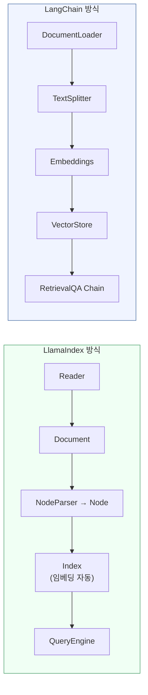
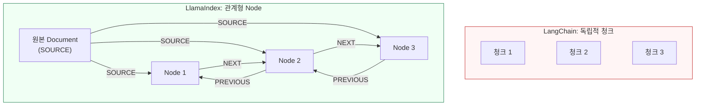
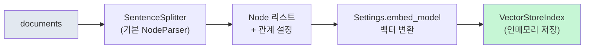

# LlamaIndex 핵심 개념 — Document, Node, Index

> LlamaIndex의 세 가지 기본 추상화를 이해하고, LangChain과의 구조적 차이를 비교하며 "데이터 중심" 설계 철학을 파악합니다.

## 개요

이 섹션에서는 LlamaIndex의 핵심 데이터 구조인 Document, Node, Index를 학습합니다. [Ch8](08-기본-rag-파이프라인-구축-langchain으로-첫-rag-앱-만들기/01-langchain-v1-핵심-개념과-설정.md)에서 LangChain으로 RAG 파이프라인을 구축해본 경험을 바탕으로, LlamaIndex가 **같은 문제를 어떻게 다르게 해결하는지** 구조적으로 비교합니다. NodeParser를 통한 자동 청킹, 노드 간 관계 그래프, 그리고 IngestionPipeline까지 — LangChain에서는 수동으로 처리해야 했던 부분들이 어떻게 추상화되어 있는지 살펴봅니다.

**선수 지식**: [Ch8: 기본 RAG 파이프라인 구축](08-기본-rag-파이프라인-구축-langchain으로-첫-rag-앱-만들기/01-langchain-v1-핵심-개념과-설정.md)에서 배운 LangChain 기반 RAG 파이프라인의 전체 흐름(문서 로딩 → 청킹 → 임베딩 → 검색 → 생성)을 이해하고 있어야 합니다. [Ch4: 텍스트 청킹 전략](04-텍스트-청킹-전략-문서-분할과-최적화/01-청킹의-중요성과-기본-원리.md)에서 다룬 청킹 개념과 [Ch5: 임베딩 모델 이해](05-임베딩-모델-이해-텍스트를-벡터로-변환/01-임베딩의-기본-개념-단어에서-문장까지.md)에서 배운 벡터 임베딩 개념도 필요합니다.

**학습 목표**:
- LlamaIndex의 Document, Node, Index 세 가지 핵심 추상화를 LangChain 대응 개념과 비교하여 설명할 수 있다
- NodeParser의 관계 그래프 시스템이 LangChain의 단순 청킹과 어떻게 다른지 구현 수준에서 이해한다
- IngestionPipeline을 활용한 자동 메타데이터 추출 파이프라인을 구성할 수 있다
- 프로젝트 요구사항에 따라 LangChain과 LlamaIndex 중 적합한 도구를 선택할 수 있다

## 왜 알아야 할까?

[Ch8](08-기본-rag-파이프라인-구축-langchain으로-첫-rag-앱-만들기/01-langchain-v1-핵심-개념과-설정.md)에서 LangChain으로 RAG 파이프라인을 구축해 보셨죠? `TextSplitter` → `Embeddings` → `VectorStore` → `RetrievalQA`로 이어지는 체인을 직접 연결하면서, 각 단계를 명시적으로 제어하는 LangChain의 방식에 익숙해졌을 겁니다.

그런데 실무에서 RAG 시스템을 운영하다 보면 이런 불편함을 느끼게 됩니다:

- 청크로 분할하면 **원본 문서와의 연결이 끊어져** 출처 추적이 어렵다
- 청크 간 **앞뒤 문맥 관계**가 사라져 검색 결과의 맥락이 부족하다
- 메타데이터를 직접 관리해야 해서, 문서가 많아질수록 **코드가 복잡해진다**

LlamaIndex는 바로 이 문제들을 **설계 수준에서 해결**합니다. 단순한 텍스트 조각이 아닌, 관계와 메타데이터를 내장한 `Node`라는 추상화를 도입하여 문서 구조를 보존하거든요. 이미 RAG 파이프라인의 전체 그림을 이해하고 있으니, LlamaIndex가 **같은 파이프라인을 어떤 다른 관점으로 구현하는지** 비교하며 배워봅시다.

> 📊 **그림 1**: LangChain vs LlamaIndex — 같은 RAG 파이프라인, 다른 추상화



두 프레임워크가 같은 목표를 향하지만, LlamaIndex는 Node 단계에서 관계 정보와 메타데이터 상속을 자동으로 처리하고, Index 생성 시 임베딩까지 한 번에 수행하는 것이 핵심 차이입니다.

## 핵심 개념

### 개념 1: Document — LangChain의 Document와 무엇이 다른가

> 💡 **비유**: LangChain의 Document가 **메모지** — 내용과 출처 스티커만 붙어 있는 — 라면, LlamaIndex의 Document는 **서류 봉투**입니다. 봉투 안에는 내용이 들어 있고, 겉면에는 라벨(메타데이터)이 붙어 있으며, 봉투끼리 **끈으로 연결(relationships)**되어 한 묶음의 서류가 흩어지지 않게 관리됩니다.

[Session 3.1](03-문서-로딩과-파싱-다양한-소스에서-데이터-수집/01-문서-로딩-기초-langchain-document-loaders.md)에서 배운 LangChain의 `Document` 객체를 떠올려 보세요. `page_content`와 `metadata` 두 필드로 구성되어 있었죠. LlamaIndex의 `Document`는 여기에 `relationships` 필드를 추가하여 **문서 간의 관계까지 표현**합니다.

| 속성 | LangChain `Document` | LlamaIndex `Document` |
|------|----------------------|----------------------|
| 텍스트 | `page_content` | `text` |
| 메타데이터 | `metadata` | `metadata` |
| 관계 정보 | ❌ 없음 | `relationships` ✅ |
| 고유 ID | ❌ 자동 생성 안 됨 | `doc_id` 자동 생성 |
| 해시값 | ❌ 없음 | `hash` 자동 계산 (중복 방지) |

이 차이가 사소해 보일 수 있지만, 수천 개의 문서를 인덱싱할 때 `hash`를 통한 중복 감지와 `relationships`를 통한 문서 간 연결이 큰 차이를 만들어냅니다.

```python
from llama_index.core import Document

# 직접 Document 생성
doc = Document(
    text="RAG는 검색 증강 생성의 약자로, LLM의 한계를 보완합니다.",
    metadata={
        "source": "rag_tutorial.pdf",
        "page": 1,
        "author": "김개발"
    }
)

# LangChain에는 없는 기능: 자동 해시로 중복 문서 감지
print(doc.hash)  # 동일 내용의 Document는 같은 해시값을 가짐
```

데이터 로더를 사용하면 파일에서 자동으로 Document를 생성할 수도 있습니다:

```python
from llama_index.core import SimpleDirectoryReader

# 디렉토리의 모든 파일을 Document로 로딩
documents = SimpleDirectoryReader("./data").load_data()
```

`SimpleDirectoryReader`는 LangChain의 `DirectoryLoader`와 비슷하지만, 20개 이상의 파일 형식을 별도 로더 설치 없이 자동 감지하고, 파일 메타데이터(생성일, 크기 등)를 자동으로 추출합니다.

### 개념 2: Node — 단순 청크를 넘어선 "관계형 청크"

> 💡 **비유**: LangChain의 청킹이 **가위로 신문을 오려 스크랩하는 것**이라면, LlamaIndex의 Node는 **위키피디아 문서의 하이퍼링크 네트워크**와 같습니다. 각 페이지(Node)가 독립적으로 존재하면서도 "이전 글", "다음 글", "상위 카테고리" 같은 링크로 서로 연결되어 있죠.

[Ch4](04-텍스트-청킹-전략-문서-분할과-최적화/01-청킹의-중요성과-기본-원리.md)에서 `RecursiveCharacterTextSplitter`로 텍스트를 분할했을 때, 결과물은 `page_content`만 가진 독립적인 텍스트 조각이었습니다. 검색으로 한 조각을 찾아도, 그 앞뒤에 어떤 내용이 있었는지 알 수 없었죠.

LlamaIndex의 Node는 이 문제를 **관계 그래프**로 해결합니다:

> 📊 **그림 2**: Node의 관계 시스템 — 단순 청크 vs 관계형 Node



```run:python
from llama_index.core.schema import TextNode, NodeRelationship, RelatedNodeInfo

# Node 직접 생성 (보통은 NodeParser가 자동 생성)
node1 = TextNode(
    text="RAG는 Retrieval-Augmented Generation의 약자입니다.",
    metadata={"source": "rag_guide.pdf", "page": 1}
)

node2 = TextNode(
    text="RAG는 검색과 생성을 결합하여 LLM의 환각을 줄입니다.",
    metadata={"source": "rag_guide.pdf", "page": 1}
)

# Node 간 관계 설정: node1 다음에 node2가 온다
node1.relationships[NodeRelationship.NEXT] = RelatedNodeInfo(
    node_id=node2.node_id
)
node2.relationships[NodeRelationship.PREVIOUS] = RelatedNodeInfo(
    node_id=node1.node_id
)

print(f"Node 1 ID: {node1.node_id[:8]}...")
print(f"Node 1 텍스트: {node1.text}")
print(f"Node 1 메타데이터: {node1.metadata}")
print(f"Node 1 → 다음 Node: {node1.relationships[NodeRelationship.NEXT].node_id[:8]}...")
print()
print("=== 관계 타입 종류 ===")
for rel in NodeRelationship:
    print(f"  {rel.name}: {rel.value}")
```

```output
Node 1 ID: a1b2c3d4...
Node 1 텍스트: RAG는 Retrieval-Augmented Generation의 약자입니다.
Node 1 메타데이터: {'source': 'rag_guide.pdf', 'page': 1}
Node 1 → 다음 Node: e5f6g7h8...

=== 관계 타입 종류 ===
  SOURCE: 1
  PREVIOUS: 2
  NEXT: 3
  PARENT: 4
  CHILD: 5
```

이 관계 정보가 실전에서 빛을 발하는 순간이 있습니다. 검색으로 `node2`가 반환되었을 때, `PREVIOUS` 관계를 따라가면 바로 앞 문맥(`node1`)도 함께 가져올 수 있거든요. LangChain에서는 이런 "윈도우 기반 컨텍스트 확장"을 직접 구현해야 했지만, LlamaIndex에서는 관계 그래프가 이미 구축되어 있어 `MetadataReplacementPostProcessor` 같은 후처리기를 바로 사용할 수 있습니다. [Ch14: 고급 청킹과 인덱싱](14-고급-청킹과-인덱싱-raptor-시멘틱-청킹-부모-자식-청킹/01-부모-자식-청킹-작게-검색하고-크게-반환하기.md)에서 다룰 부모-자식 청킹이 바로 이 관계 시스템 위에 구축됩니다.

### 개념 3: NodeParser — LangChain의 TextSplitter와 무엇이 다른가

> 💡 **비유**: LangChain의 `TextSplitter`가 **가위** — 지정한 길이에서 자르기만 하는 — 라면, LlamaIndex의 `NodeParser`는 **제본소의 자동화 라인**입니다. 잘라주는 것은 물론이고, 각 페이지에 일련번호를 매기고, 앞뒤 페이지 참조를 붙이고, 원본 정보 스탬프까지 자동으로 찍어줍니다.

LangChain과 LlamaIndex에서 청킹의 차이를 코드 수준에서 비교해봅시다:

```python
# === LangChain 방식 ===
from langchain.text_splitter import RecursiveCharacterTextSplitter

splitter = RecursiveCharacterTextSplitter(chunk_size=100, chunk_overlap=20)
chunks = splitter.split_documents(langchain_docs)
# 결과: 독립적인 Document 리스트. 원본과의 연결은 metadata에 수동으로 넣어야 함

# === LlamaIndex 방식 ===
from llama_index.core.node_parser import SentenceSplitter

parser = SentenceSplitter(chunk_size=100, chunk_overlap=20)
nodes = parser.get_nodes_from_documents(documents)
# 결과: 관계 그래프가 설정된 Node 리스트. SOURCE, PREV, NEXT 관계 자동 생성
```

LlamaIndex는 다양한 NodeParser를 제공하며, 각각 다른 분할 전략을 가지고 있습니다:

| NodeParser | LangChain 대응 | 핵심 차이 |
|------------|---------------|-----------|
| `SentenceSplitter` | `RecursiveCharacterTextSplitter` | 문장 경계 존중 + 관계 자동 설정 |
| `TokenTextSplitter` | `TokenTextSplitter` | 거의 동일 (토큰 기준 분할) |
| `SemanticSplitterNodeParser` | `SemanticChunker` | 임베딩 기반 의미적 분할 |
| `HierarchicalNodeParser` | ❌ 직접 구현 필요 | 다중 레벨 계층 트리 자동 생성 |

특히 `HierarchicalNodeParser`는 LlamaIndex만의 강력한 기능입니다. 하나의 문서를 세 가지 크기(예: 2048, 512, 128 토큰)로 동시에 분할하여 부모-자식 관계를 자동으로 구성하거든요. LangChain에서는 이런 계층적 청킹을 직접 구현해야 합니다.

```run:python
from llama_index.core import Document
from llama_index.core.node_parser import SentenceSplitter
from llama_index.core.schema import NodeRelationship

# 긴 문서 생성
doc = Document(
    text=(
        "RAG는 Retrieval-Augmented Generation의 약자입니다. "
        "이 기법은 2020년 Meta(당시 Facebook) AI Research에서 발표되었습니다. "
        "RAG의 핵심 아이디어는 간단합니다. "
        "LLM이 답변을 생성하기 전에, 외부 지식 소스에서 관련 정보를 먼저 검색하는 것이죠. "
        "이를 통해 LLM의 환각(hallucination) 문제를 크게 줄일 수 있습니다. "
        "검색된 문서는 프롬프트의 컨텍스트로 제공되어, "
        "모델이 사실에 기반한 답변을 생성하도록 돕습니다."
    ),
    metadata={"source": "rag_overview.md", "chapter": 1}
)

# SentenceSplitter로 Node 분할
parser = SentenceSplitter(chunk_size=100, chunk_overlap=20)
nodes = parser.get_nodes_from_documents([doc])

print(f"원본 Document 길이: {len(doc.text)}자")
print(f"생성된 Node 수: {len(nodes)}")
print()
for i, node in enumerate(nodes):
    print(f"--- Node {i+1} ---")
    print(f"텍스트: {node.text[:80]}...")
    print(f"메타데이터 (자동 상속): {node.metadata}")
    # 관계 정보 출력
    rels = []
    if NodeRelationship.SOURCE in node.relationships:
        rels.append("SOURCE ✓")
    if NodeRelationship.PREVIOUS in node.relationships:
        rels.append("PREV ✓")
    if NodeRelationship.NEXT in node.relationships:
        rels.append("NEXT ✓")
    print(f"관계: {', '.join(rels)}")
    print()
```

```output
원본 Document 길이: 232자
생성된 Node 수: 3

--- Node 1 ---
텍스트: RAG는 Retrieval-Augmented Generation의 약자입니다. 이 기법은 2020년 Meta(당시 Facebo...
메타데이터 (자동 상속): {'source': 'rag_overview.md', 'chapter': 1}
관계: SOURCE ✓, NEXT ✓

--- Node 2 ---
텍스트: RAG의 핵심 아이디어는 간단합니다. LLM이 답변을 생성하기 전에, 외부 지식 소스에서 관련 정보를 먼저 검색...
메타데이터 (자동 상속): {'source': 'rag_overview.md', 'chapter': 1}
관계: SOURCE ✓, PREV ✓, NEXT ✓

--- Node 3 ---
텍스트: 이를 통해 LLM의 환각(hallucination) 문제를 크게 줄일 수 있습니다. 검색된 문서는 프롬프트의 컨...
메타데이터 (자동 상속): {'source': 'rag_overview.md', 'chapter': 1}
관계: SOURCE ✓, PREV ✓
```

모든 Node가 부모 Document의 메타데이터를 자동 상속하고, SOURCE·PREVIOUS·NEXT 관계가 자동으로 설정된 것을 확인할 수 있습니다. LangChain의 `RecursiveCharacterTextSplitter`에서는 이 상속과 관계 설정을 별도로 구현해야 했죠.

### 개념 4: Index — 한 줄로 끝나는 임베딩+저장

> 💡 **비유**: LangChain에서 인덱스를 만드는 것이 **재료를 하나씩 꺼내서 요리하는 가정식**이라면, LlamaIndex의 Index는 **재료를 넣으면 완성품이 나오는 자동 요리 기계**입니다. 내부적으로 같은 과정을 거치지만, 사용자는 입력과 출력만 신경 쓰면 됩니다.

[Ch8](08-기본-rag-파이프라인-구축-langchain으로-첫-rag-앱-만들기/01-langchain-v1-핵심-개념과-설정.md)에서 LangChain으로 벡터 스토어를 구축할 때, 각 단계를 명시적으로 호출해야 했던 것을 기억하시나요?

```python
# === LangChain: 각 단계를 명시적으로 연결 ===
from langchain.text_splitter import RecursiveCharacterTextSplitter
from langchain_openai import OpenAIEmbeddings
from langchain_community.vectorstores import Chroma

splitter = RecursiveCharacterTextSplitter(chunk_size=512, chunk_overlap=50)
chunks = splitter.split_documents(documents)                    # 1단계: 분할
embeddings = OpenAIEmbeddings(model="text-embedding-3-small")   # 2단계: 임베딩 모델
vectorstore = Chroma.from_documents(chunks, embeddings)         # 3단계: 저장

# === LlamaIndex: 한 줄로 완성 ===
from llama_index.core import VectorStoreIndex

index = VectorStoreIndex.from_documents(documents)  # 분할 + 임베딩 + 저장 자동
```

LlamaIndex의 `VectorStoreIndex.from_documents()` 한 줄이 내부적으로 수행하는 작업:

1. Document를 NodeParser(기본: `SentenceSplitter`)로 Node 분할
2. 각 Node의 텍스트를 임베딩 모델로 벡터 변환
3. 벡터와 Node를 인덱스 구조에 저장

> 📊 **그림 3**: VectorStoreIndex.from_documents() 내부 동작



그런데 여기서 한 가지 궁금증이 생기지 않나요? **어떤 임베딩 모델과 LLM을 사용하는 걸까요?** LangChain에서는 매번 명시적으로 전달했는데, LlamaIndex는 어떻게 모델을 알까요? 이 부분을 제어하는 것이 바로 `Settings` 글로벌 설정 객체입니다.

### 개념 5: Settings — LangChain의 "매번 전달" vs LlamaIndex의 "한 번 설정"

LangChain에서는 LLM이나 임베딩 모델을 사용할 때마다 매번 인자로 전달해야 했습니다. `RetrievalQA.from_chain_type(llm=llm, ...)`, `Chroma.from_documents(docs, embedding=embeddings)` 처럼요. 이 방식은 명시적이지만, 프로젝트가 커지면 모델 변경 시 수십 곳을 수정해야 합니다.

LlamaIndex는 `Settings` 객체를 통해 파이프라인 전체에서 사용할 기본값을 **한 곳에서 관리**합니다:

```python
from llama_index.core import Settings
from llama_index.llms.openai import OpenAI
from llama_index.embeddings.openai import OpenAIEmbedding

# 글로벌 기본값 설정 — 이후 모든 컴포넌트가 자동 참조
Settings.llm = OpenAI(model="gpt-4o-mini", temperature=0.1)
Settings.embed_model = OpenAIEmbedding(model="text-embedding-3-small")
Settings.chunk_size = 512       # NodeParser 기본 청크 크기
Settings.chunk_overlap = 50     # NodeParser 기본 오버랩
```

이렇게 `Settings`를 설정해 두면, 이후 `VectorStoreIndex.from_documents()`나 `QueryEngine` 등에서 별도 인자 없이도 지정한 모델이 사용됩니다. 모델을 교체하고 싶다면 `Settings` 한 곳만 수정하면 되죠.

```python
# HuggingFace 임베딩으로 교체 — Settings만 변경하면 전체 파이프라인에 반영
from llama_index.embeddings.huggingface import HuggingFaceEmbedding

Settings.embed_model = HuggingFaceEmbedding(
    model_name="BAAI/bge-small-en-v1.5"
)

# 로컬 LLM (Ollama)으로 교체
from llama_index.llms.ollama import Ollama

Settings.llm = Ollama(model="llama3", request_timeout=60.0)
```

> ⚠️ **흔한 오해**: `Settings`를 설정하지 않으면 LlamaIndex가 동작하지 않는다고 생각할 수 있지만, 기본값으로 OpenAI 모델이 자동 사용됩니다. 다만 이 경우 `OPENAI_API_KEY` 환경 변수가 반드시 설정되어 있어야 합니다. 기본값에 의존하기보다 `Settings`를 명시적으로 설정하는 것이 의도를 명확히 전달하고, 비용을 제어하는 데 좋은 습관입니다.

### 개념 6: IngestionPipeline — 자동 메타데이터 추출까지 한 번에

LlamaIndex의 강력한 차별점 중 하나는 LLM을 활용한 **자동 메타데이터 추출**입니다. LangChain에서는 청킹 후 메타데이터를 수동으로 추가해야 했지만, LlamaIndex의 `IngestionPipeline`은 NodeParser와 메타데이터 추출기를 하나의 파이프라인으로 연결합니다.

```python
from llama_index.core.extractors import (
    TitleExtractor,                # 문서 제목 추출
    KeywordExtractor,              # 키워드 추출
    QuestionsAnsweredExtractor,    # 답변 가능한 질문 추출
)
from llama_index.core.node_parser import SentenceSplitter
from llama_index.core.ingestion import IngestionPipeline

# 변환 파이프라인 구성
pipeline = IngestionPipeline(
    transformations=[
        SentenceSplitter(chunk_size=512, chunk_overlap=50),
        TitleExtractor(nodes=5),           # 5개 Node를 보고 제목 추출
        KeywordExtractor(keywords=5),       # Node당 5개 키워드 추출
        QuestionsAnsweredExtractor(questions=3),  # Node당 3개 질문 생성
    ]
)

# 파이프라인 실행 — 분할 + 메타데이터 추출이 자동으로 진행
nodes = pipeline.run(documents=documents, show_progress=True)
```

이렇게 추출된 메타데이터는 검색 시 **메타데이터 필터링**과 결합하여 검색 정확도를 크게 향상시킵니다. LangChain에서 같은 기능을 구현하려면 분할 후 각 청크를 LLM에 보내 메타데이터를 추출하는 별도 코드를 작성해야 하지만, LlamaIndex에서는 파이프라인 한 줄로 해결됩니다.

`IngestionPipeline`은 캐싱도 지원합니다. `docstore`를 지정하면 이미 처리된 Document를 건너뛰어 **증분 인덱싱**이 가능해집니다:

```python
from llama_index.core.ingestion import IngestionPipeline, IngestionCache

# 캐시를 활용한 증분 파이프라인
pipeline = IngestionPipeline(
    transformations=[SentenceSplitter(chunk_size=512)],
    cache=IngestionCache(),  # 중복 Document 자동 스킵
)

# 첫 실행: 모든 문서 처리
nodes_1 = pipeline.run(documents=batch_1)

# 두 번째 실행: 새 문서만 처리 (이전 문서는 캐시에서 스킵)
nodes_2 = pipeline.run(documents=batch_1 + batch_2)  # batch_1은 건너뜀
```

> 📊 **그림 4**: IngestionPipeline — 분할부터 메타데이터 추출까지 자동화


이 기능은 [Ch10: 검색 품질 향상](10-검색-품질-향상-유사도-검색과-메타데이터-필터링/01-유사도-검색-심화-top-k와-임계값-최적화.md)에서 배울 메타데이터 필터링과 직접 연결됩니다.

### 개념 7: 설계 철학 비교 — 언제 어떤 프레임워크를 선택할까

두 프레임워크는 근본적으로 다른 철학을 가지고 있습니다. [Ch8](08-기본-rag-파이프라인-구축-langchain으로-첫-rag-앱-만들기/01-langchain-v1-핵심-개념과-설정.md)에서 LangChain의 "모듈러 체인" 방식을 경험했으니, LlamaIndex의 "데이터 중심" 방식과 비교하며 각각의 강점을 정리해 봅시다:

| 비교 항목 | LangChain | LlamaIndex |
|-----------|-----------|------------|
| **핵심 철학** | 범용 AI 워크플로 오케스트레이터 | 데이터 인덱싱 & 검색 전문가 |
| **비유** | 스위스 아미 나이프 — 다양한 도구 조합 | 정밀 메스 — 검색에 특화 |
| **청킹 결과** | 독립적 텍스트 조각 (`Document`) | 관계 그래프를 가진 `Node` |
| **인덱스 생성** | 각 단계를 명시적으로 연결 | `from_documents()` 한 줄로 완성 |
| **설정 방식** | 각 컴포넌트에 개별 전달 | `Settings` 글로벌 객체로 일괄 관리 |
| **메타데이터 추출** | 직접 구현 필요 | `IngestionPipeline`으로 자동화 |
| **강점** | 에이전트, 복잡한 체인, 다양한 통합 | 문서 검색 품질, 계층적 인덱싱 |

실제 프로젝트에서의 선택 기준은 이렇습니다:

- **문서 기반 Q&A, 기술 문서 검색** → LlamaIndex가 유리 (Node 관계, 자동 메타데이터)
- **멀티 에이전트, 복잡한 워크플로** → LangChain이 유리 (LCEL, 에이전트 프레임워크)
- **프로덕션 RAG 시스템** → 둘 다 사용하는 하이브리드가 일반적 (LlamaIndex로 검색, LangChain으로 오케스트레이션)

> ⚠️ **흔한 오해**: "LangChain과 LlamaIndex는 경쟁 관계다"라고 생각하기 쉽지만, 실제로는 **상호 보완적**입니다. 많은 프로덕션 시스템에서 LlamaIndex의 검색 파이프라인과 LangChain의 워크플로 오케스트레이션을 함께 사용합니다. LlamaIndex는 `LangchainEmbedding`, `LangchainLLM` 같은 브릿지 클래스를 공식 제공할 정도로 두 프레임워크의 통합을 적극 지원하고 있습니다.

## 실습: 직접 해보기

LlamaIndex를 설치하고, LangChain으로 구축했던 것과 동일한 파이프라인을 LlamaIndex로 구현해 봅시다. 두 코드를 비교하면서 추상화 수준의 차이를 체감해 보세요.

**1단계: 설치**

```bash
# LlamaIndex 설치 (핵심 패키지 + OpenAI 통합)
pip install llama-index llama-index-llms-openai llama-index-embeddings-openai
```

**2단계: 환경 설정과 Settings 구성**

```python
import os
from dotenv import load_dotenv
from llama_index.core import Settings
from llama_index.llms.openai import OpenAI
from llama_index.embeddings.openai import OpenAIEmbedding

# .env 파일에서 API 키 로드
load_dotenv()
# .env 파일에 아래 내용 추가:
# OPENAI_API_KEY=your-api-key-here

# Settings로 글로벌 기본값 설정
Settings.llm = OpenAI(model="gpt-4o-mini", temperature=0.1)
Settings.embed_model = OpenAIEmbedding(model="text-embedding-3-small")
Settings.chunk_size = 512
Settings.chunk_overlap = 50
```

> 🔥 **실무 팁**: `Settings`는 파이프라인 코드 최상단에서 한 번만 설정하세요. 이후 `VectorStoreIndex`, `QueryEngine` 등 모든 컴포넌트가 이 설정을 자동으로 참조합니다. 프로젝트 초기에 모델과 청크 크기를 확정해두면, 나중에 모델을 교체할 때도 `Settings` 한 곳만 수정하면 됩니다.

**3단계: Document 생성과 Node 변환 전체 흐름**

```run:python
from llama_index.core import Document, VectorStoreIndex, Settings
from llama_index.core.node_parser import SentenceSplitter
from llama_index.core.schema import NodeRelationship

# --- 1. Document 생성 ---
documents = [
    Document(
        text=(
            "벡터 데이터베이스는 고차원 벡터를 효율적으로 저장하고 검색하는 "
            "특수한 데이터베이스입니다. ChromaDB, FAISS, Pinecone 등이 "
            "대표적인 벡터 데이터베이스입니다. "
            "벡터 검색은 코사인 유사도나 유클리드 거리를 사용하여 "
            "쿼리 벡터와 가장 가까운 벡터를 찾습니다."
        ),
        metadata={"source": "vector_db_guide.md", "topic": "vector_database"}
    ),
    Document(
        text=(
            "임베딩 모델은 텍스트를 고차원 벡터로 변환하는 모델입니다. "
            "OpenAI의 text-embedding-3-small이나 오픈소스인 "
            "sentence-transformers가 널리 사용됩니다. "
            "좋은 임베딩 모델은 의미적으로 유사한 텍스트를 "
            "벡터 공간에서 가까운 위치에 배치합니다."
        ),
        metadata={"source": "embedding_guide.md", "topic": "embedding"}
    ),
]

print(f"생성된 Document 수: {len(documents)}")
for i, doc in enumerate(documents):
    print(f"\nDocument {i+1}:")
    print(f"  텍스트 길이: {len(doc.text)}자")
    print(f"  메타데이터: {doc.metadata}")
    print(f"  자동 생성 ID: {doc.doc_id[:8]}...")

# --- 2. NodeParser로 Node 변환 ---
parser = SentenceSplitter(chunk_size=100, chunk_overlap=20)
nodes = parser.get_nodes_from_documents(documents)

print(f"\n총 생성된 Node 수: {len(nodes)}")
for i, node in enumerate(nodes):
    print(f"\n--- Node {i+1} ---")
    print(f"텍스트: {node.text[:60]}...")
    print(f"메타데이터 (상속됨): {node.metadata}")

    # 관계 정보 확인
    rels = []
    if NodeRelationship.SOURCE in node.relationships:
        rels.append(f"SOURCE({node.relationships[NodeRelationship.SOURCE].node_id[:8]}...)")
    if NodeRelationship.NEXT in node.relationships:
        rels.append("NEXT ✓")
    if NodeRelationship.PREVIOUS in node.relationships:
        rels.append("PREV ✓")
    print(f"관계: {', '.join(rels)}")
```

```output
생성된 Document 수: 2

Document 1:
  텍스트 길이: 131자
  메타데이터: {'source': 'vector_db_guide.md', 'topic': 'vector_database'}
  자동 생성 ID: a1b2c3d4...

Document 2:
  텍스트 길이: 128자
  메타데이터: {'source': 'embedding_guide.md', 'topic': 'embedding'}
  자동 생성 ID: e5f6g7h8...

총 생성된 Node 수: 4

--- Node 1 ---
텍스트: 벡터 데이터베이스는 고차원 벡터를 효율적으로 저장하고 검색하는 특수한 데이터베이스입니다....
메타데이터 (상속됨): {'source': 'vector_db_guide.md', 'topic': 'vector_database'}
관계: SOURCE(a1b2c3d4...), NEXT ✓

--- Node 2 ---
텍스트: 벡터 검색은 코사인 유사도나 유클리드 거리를 사용하여 쿼리 벡터와 가장 가까운 벡터를 찾습니다....
메타데이터 (상속됨): {'source': 'vector_db_guide.md', 'topic': 'vector_database'}
관계: SOURCE(a1b2c3d4...), PREV ✓

--- Node 3 ---
텍스트: 임베딩 모델은 텍스트를 고차원 벡터로 변환하는 모델입니다. OpenAI의 text-embedding-3-s...
메타데이터 (상속됨): {'source': 'embedding_guide.md', 'topic': 'embedding'}
관계: SOURCE(e5f6g7h8...), NEXT ✓

--- Node 4 ---
텍스트: 좋은 임베딩 모델은 의미적으로 유사한 텍스트를 벡터 공간에서 가까운 위치에 배치합니다....
메타데이터 (상속됨): {'source': 'embedding_guide.md', 'topic': 'embedding'}
관계: SOURCE(e5f6g7h8...), PREV ✓
```

**4단계: Index 생성과 쿼리 — LangChain 대비 코드량 비교**

```python
from llama_index.core import VectorStoreIndex

# Node에서 바로 Index 생성 (Settings에 설정한 임베딩 모델이 자동 사용됨)
index = VectorStoreIndex(nodes)

# 또는 Document에서 한 번에 생성 (NodeParser + 임베딩 자동)
# index = VectorStoreIndex.from_documents(documents)

# QueryEngine 생성 — LangChain의 RetrievalQA에 대응
query_engine = index.as_query_engine(
    similarity_top_k=3,  # 상위 3개 Node 검색 (LangChain의 search_kwargs={"k": 3} 대응)
)

# 질문하기
response = query_engine.query("벡터 데이터베이스의 종류는?")
print(response)

# 검색된 소스 Node 확인 (LangChain의 source_documents 대응)
for node in response.source_nodes:
    print(f"[Score: {node.score:.4f}] {node.text[:50]}...")
    print(f"  출처: {node.metadata.get('source', 'N/A')}")
```

**5단계: 인덱스 영속화 — 임베딩 비용 절약**

```python
# 인덱스를 디스크에 저장
index.storage_context.persist(persist_dir="./storage")

# 다음 실행 시: 저장된 인덱스 불러오기 (임베딩 재계산 없음)
from llama_index.core import StorageContext, load_index_from_storage

storage_context = StorageContext.from_defaults(persist_dir="./storage")
index = load_index_from_storage(storage_context)

# 바로 쿼리 가능
query_engine = index.as_query_engine()
response = query_engine.query("임베딩 모델이란?")
```

> 🔥 **실무 팁**: 개발 초기에는 `VectorStoreIndex.from_documents()`로 빠르게 프로토타입을 만들고, 검색 품질을 높이는 단계에서 NodeParser 옵션과 `IngestionPipeline`의 메타데이터 추출을 세밀하게 조정하세요. 인덱스는 반드시 `persist()`로 저장하여 매번 임베딩 API를 호출하는 비용을 절약하세요.

## 더 깊이 알아보기

### LlamaIndex의 탄생 스토리

LlamaIndex의 창시자 Jerry Liu는 프린스턴 대학교에서 GAN(생성적 적대 신경망)을 연구하던 AI 엔지니어였습니다. 2022년 GPT-3가 주목받던 시기, 그는 **세일즈 봇**을 만들고 싶었는데 한 가지 큰 문제에 부딪혔습니다 — 자신의 회사 데이터를 GPT-3에게 어떻게 전달할 것인가?

당시 GPT-3의 컨텍스트 윈도우는 매우 제한적이었고, 파인튜닝은 비용이 많이 들었습니다. Jerry는 "데이터를 별도로 저장하고, 필요할 때만 검색해서 모델에 주면 되지 않을까?"라는 아이디어를 떠올렸습니다. 이것이 바로 RAG의 핵심 아이디어이자, LlamaIndex의 시작이었죠.

2022년 10월, Jerry는 당시 재직 중이던 Robust Intelligence의 사내 해커톤에서 첫 프로토타입을 만들었습니다. 처음에는 **GPT Index**라는 이름으로 시작했는데, 트리 구조로 정보를 조직화하는 단순한 인덱스였습니다. 초기에는 성장이 더뎠습니다 — 트리 인덱스 방식이 실용적이지 않았거든요.

하지만 Jerry는 포기하지 않고 벡터 검색, 다양한 인덱스 타입, 유연한 데이터 커넥터를 추가하며 프로젝트를 발전시켰습니다. 2023년 1월, 프로젝트가 변곡점을 맞이하면서 급격히 성장하기 시작했고, 2023년 3월에 정식으로 회사를 설립하며 이름을 **LlamaIndex**로 변경했습니다.

> 💡 **알고 계셨나요?**: "LlamaIndex"라는 이름은 Meta가 오픈소스로 공개한 LLaMA 모델에서 영감을 받았습니다. 당시 LLM 생태계에서 라마(Llama)가 하나의 상징이 되었고, Jerry는 "LLM을 위한 인덱스"라는 의미를 담아 LlamaIndex로 이름을 지었습니다. 원래 이름인 GPT Index에서 특정 모델(GPT)에 종속된 느낌을 벗어나려는 의도도 있었습니다.

### Document → Node 관계의 깊은 의미

LlamaIndex가 단순한 텍스트 청크 대신 Node라는 추상화를 도입한 이유는 **문서의 구조적 정보를 보존**하기 위해서입니다. 실제 문서는 제목, 소제목, 단락, 표 등 계층적 구조를 가지고 있는데, 단순 텍스트 분할은 이 구조를 완전히 무시합니다.

Node의 관계 시스템(`SOURCE`, `PREVIOUS`, `NEXT`, `PARENT`, `CHILD`)은 이 구조를 표현할 수 있는 그래프를 형성합니다. 이 그래프가 있기 때문에 [Ch14](14-고급-청킹과-인덱싱-raptor-시멘틱-청킹-부모-자식-청킹/01-부모-자식-청킹-작게-검색하고-크게-반환하기.md)에서 다룰 RAPTOR나 부모-자식 검색 같은 고급 기법이 가능해지는 것이죠.

## 흔한 오해와 팁

> ⚠️ **흔한 오해**: "LlamaIndex는 LangChain의 하위 호환이다"라고 생각하는 분들이 있습니다. 하지만 LlamaIndex는 독립적인 프레임워크로, 자체적인 LLM 통합, 데이터 로더, 쿼리 엔진을 모두 갖추고 있습니다. LangChain 없이도 완전한 RAG 시스템을 구축할 수 있습니다.

> 💡 **알고 계셨나요?**: LlamaIndex의 `SimpleDirectoryReader`는 내부적으로 20개 이상의 파일 형식을 자동 감지합니다. PDF, DOCX, PPTX, CSV, JSON, HTML 등을 별도 로더 없이 처리할 수 있죠. LlamaHub에서는 수백 개의 추가 데이터 커넥터를 제공하여 Notion, Slack, Google Drive 등 다양한 소스에서 데이터를 로딩할 수 있습니다.

> 🔥 **실무 팁**: LangChain 프로젝트에 LlamaIndex를 통합할 때는 `llama-index-core`만 설치하고 검색 부분만 LlamaIndex로 교체하는 것이 가장 안전한 접근법입니다. `index.as_retriever()`가 반환하는 retriever를 LangChain의 `RetrievalQA`에 바로 연결할 수 있습니다. 처음부터 전체를 마이그레이션하기보다, 검색 품질이 중요한 부분만 점진적으로 교체하세요.

## 핵심 정리

| 개념 | 설명 | LangChain 대응 |
|------|------|---------------|
| **Document** | 텍스트 + 메타데이터 + 관계 + 자동 해시를 가진 범용 컨테이너 | `Document` (관계·해시 없음) |
| **Node** | 관계 그래프를 가진 청크. 부모 메타데이터 자동 상속, PREV/NEXT/PARENT/CHILD 관계 | 텍스트 조각 (관계 없음) |
| **NodeParser** | 분할 + 관계 설정 + 메타데이터 상속을 자동 처리하는 변환기 | `TextSplitter` (분할만) |
| **Index** | Node를 검색 가능한 구조로 조직화. 한 줄로 분할+임베딩+저장 완성 | `VectorStore` (각 단계 명시) |
| **Settings** | LLM·임베딩·청크 설정을 글로벌로 관리 | 각 컴포넌트에 개별 전달 |
| **IngestionPipeline** | NodeParser + 메타데이터 추출 + 캐싱을 체인으로 연결 | 직접 구현 필요 |
| **설계 철학** | 데이터 인덱싱과 검색에 특화된 "정밀 메스" | 범용 오케스트레이션 "스위스 아미 나이프" |

## 다음 섹션 미리보기

이번 섹션에서 Document, Node, Index의 구조적 특징과 LangChain과의 차이를 이해했으니, 다음 섹션 **[9.2: VectorStoreIndex로 RAG 구축하기](09-llamaindex로-rag-구축-대안-프레임워크-활용/02-vectorstoreindex-인덱싱과-검색.md)**에서는 이 개념들을 실제 RAG 파이프라인으로 조합합니다. `VectorStoreIndex`를 중심으로 문서 로딩부터 쿼리 응답까지 완전한 파이프라인을 구축하고, `QueryEngine`의 다양한 설정(`response_mode`, `similarity_top_k`, `node_postprocessors`)을 통해 검색 품질을 조정하는 방법을 배웁니다.

## 참고 자료

- [LlamaIndex High-Level Concepts](https://developers.llamaindex.ai/python/framework/getting_started/concepts/) - Document, Node, Index 등 핵심 추상화의 공식 설명
- [LlamaIndex RAG Understanding Guide](https://developers.llamaindex.ai/python/framework/understanding/rag/) - 5단계 RAG 파이프라인(Loading → Indexing → Storing → Querying → Evaluation)의 공식 가이드
- [LlamaIndex Node Parser Modules](https://developers.llamaindex.ai/python/framework/module_guides/loading/node_parsers/modules/) - SentenceSplitter, SemanticSplitter 등 모든 NodeParser 타입의 사용법과 예제
- [LlamaIndex Documents and Nodes Guide](https://developers.llamaindex.ai/python/framework/module_guides/loading/documents_and_nodes/) - Document와 Node의 생성, 메타데이터, 관계 설정에 대한 상세 가이드
- [LlamaIndex Metadata Extraction](https://developers.llamaindex.ai/python/framework/module_guides/loading/documents_and_nodes/usage_metadata_extractor/) - TitleExtractor, KeywordExtractor 등 자동 메타데이터 추출 사용법
- [LlamaIndex Settings](https://developers.llamaindex.ai/python/framework/module_guides/supporting_modules/settings/) - Settings 글로벌 설정 객체의 공식 가이드
- [LangChain vs LlamaIndex: Complete RAG Framework Comparison](https://www.ibm.com/think/topics/llamaindex-vs-langchain) - IBM의 두 프레임워크 비교 분석