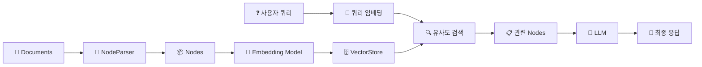
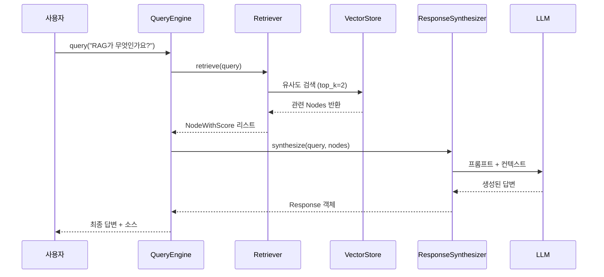
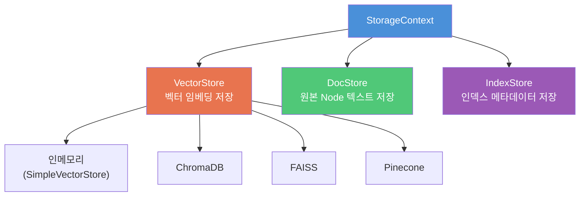

# VectorStoreIndex — 인덱싱과 검색

> LlamaIndex의 핵심 인덱스인 VectorStoreIndex로 문서를 벡터화하고, 저장하고, 검색하는 전체 흐름을 익힙니다.

## 개요

이 섹션에서는 LlamaIndex에서 가장 많이 사용되는 인덱스인 VectorStoreIndex를 깊이 있게 다룹니다. 이전 섹션에서 배운 Document와 Node 개념 위에, 실제로 벡터를 생성하고 저장하고 검색하는 과정 전체를 직접 구현해봅니다.

**선수 지식**: [세션 9.1: LlamaIndex 핵심 개념](09-llamaindex로-rag-구축-대안-프레임워크-활용/01-llamaindex-핵심-개념-document-node-index.md)에서 배운 Document, Node, Index의 관계
**학습 목표**:
- VectorStoreIndex를 생성하고 쿼리 엔진으로 질문에 답하는 흐름을 구현할 수 있다
- StorageContext를 통해 ChromaDB 같은 외부 벡터 DB와 연동할 수 있다
- 인덱스를 디스크에 저장(persist)하고 다시 로드(load)하여 재사용할 수 있다
- SimpleDirectoryReader로 다양한 파일을 한 번에 읽어 빠르게 프로토타이핑할 수 있다

## 왜 알아야 할까?

[세션 9.1](09-llamaindex로-rag-구축-대안-프레임워크-활용/01-llamaindex-핵심-개념-document-node-index.md)에서 Document → Node → Index의 개념적 흐름을 배웠죠? 하지만 실제 RAG 앱을 만들려면 한 가지 핵심 질문에 답해야 합니다. **"만든 인덱스를 어떻게 저장하고, 다시 불러오고, 실제 검색에 활용하지?"**

매번 앱을 시작할 때마다 수천 개의 문서를 다시 임베딩한다면? 시간과 비용이 어마어마하겠죠. VectorStoreIndex의 영속화(persistence)와 외부 벡터 DB 연동은 프로토타입에서 프로덕션으로 넘어가는 첫 번째 관문입니다. 또한 SimpleDirectoryReader를 활용하면 PDF, 워드, 마크다운 등 다양한 형식의 파일을 한 줄의 코드로 읽어들여 빠르게 RAG를 검증할 수 있습니다.

## 핵심 개념

### 개념 1: VectorStoreIndex — 문서를 벡터 공간에 배치하기

> 💡 **비유**: VectorStoreIndex는 **도서관의 색인 카드함**과 같습니다. 도서관에 책이 들어오면, 사서가 각 책의 핵심 내용을 카드에 적어 카드함에 정리하죠. 누군가 "AI에 관한 책 찾아주세요"라고 하면, 사서는 카드함에서 관련 카드를 빠르게 찾아 해당 책을 가져다줍니다. VectorStoreIndex가 바로 이 카드함 역할을 합니다 — 문서(책)를 임베딩(카드 내용)으로 변환해서 벡터 공간(카드함)에 정리해두는 거죠.

VectorStoreIndex는 LlamaIndex에서 가장 널리 쓰이는 인덱스 타입입니다. [세션 9.1](09-llamaindex로-rag-구축-대안-프레임워크-활용/01-llamaindex-핵심-개념-document-node-index.md)에서 배운 것처럼, 내부적으로 Document를 Node로 분할한 뒤 각 Node의 텍스트를 임베딩 벡터로 변환합니다. 쿼리가 들어오면 쿼리 역시 벡터로 변환하고, 코사인 유사도(Cosine Similarity) 같은 메트릭으로 가장 관련 있는 Node를 찾아냅니다.

> 📊 **그림 1**: VectorStoreIndex의 인덱싱 → 검색 흐름



가장 기본적인 사용법은 `from_documents()` 클래스 메서드입니다:

```python
from llama_index.core import VectorStoreIndex, Document

# Document 리스트에서 인덱스 생성
documents = [
    Document(text="RAG는 검색 증강 생성의 약자입니다."),
    Document(text="LlamaIndex는 데이터 인덱싱에 특화된 프레임워크입니다."),
]

# 인덱스 생성 (내부적으로 Node 분할 + 임베딩 자동 수행)
index = VectorStoreIndex.from_documents(documents)
```

이 한 줄이 내부적으로 수행하는 작업을 풀어보면:
1. 각 Document를 NodeParser로 분할하여 Node 생성
2. 각 Node의 텍스트를 임베딩 모델로 벡터 변환 (기본값: OpenAI `text-embedding-ada-002`)
3. 벡터와 Node를 인메모리 VectorStore에 저장

> ⚠️ **흔한 오해**: `from_documents()`가 "단순히 문서를 저장하는 것"이라고 생각하는 분이 많은데요, 실제로는 Node 분할 → 임베딩 생성 → 벡터 저장까지 전체 인덱싱 파이프라인이 한 번에 실행됩니다. 문서가 많으면 시간이 꽤 걸릴 수 있어요!

### 개념 2: QueryEngine — 인덱스에 질문하기

> 💡 **비유**: VectorStoreIndex가 도서관의 카드함이라면, QueryEngine은 **사서 선생님**입니다. 카드함(인덱스)에서 관련 카드(Node)를 찾아오고, 그 내용을 종합해서 방문자(사용자)에게 이해하기 쉬운 답변을 만들어주죠.

인덱스를 만들었으면 `as_query_engine()`으로 쿼리 엔진을 생성합니다:

```run:python
from llama_index.core import VectorStoreIndex, Document, Settings
from llama_index.llms.openai import OpenAI
from llama_index.embeddings.openai import OpenAIEmbedding

# 글로벌 설정
Settings.llm = OpenAI(model="gpt-4o-mini", temperature=0)
Settings.embed_model = OpenAIEmbedding(model="text-embedding-3-small")

# 샘플 문서
documents = [
    Document(text="RAG는 Retrieval-Augmented Generation의 약자로, "
                   "외부 지식을 검색하여 LLM 응답을 보강하는 기법입니다."),
    Document(text="LlamaIndex는 Jerry Liu가 2022년에 만든 프레임워크로, "
                   "데이터 인덱싱과 검색에 특화되어 있습니다."),
    Document(text="벡터 데이터베이스는 고차원 벡터를 저장하고 "
                   "유사도 기반 검색을 수행하는 특수 데이터베이스입니다."),
]

# 인덱스 생성 및 쿼리
index = VectorStoreIndex.from_documents(documents)
query_engine = index.as_query_engine(similarity_top_k=2)

response = query_engine.query("RAG가 무엇인가요?")
print(f"답변: {response}")
print(f"\n참조 소스 수: {len(response.source_nodes)}")
```

```output
답변: RAG는 Retrieval-Augmented Generation의 약자로, 외부 지식을 검색하여 LLM 응답을 보강하는 기법입니다.

참조 소스 수: 2
```

`similarity_top_k` 파라미터는 검색할 상위 Node의 수를 지정합니다. 기본값은 2인데요, 더 많은 컨텍스트가 필요하면 늘리고, 정밀도를 높이고 싶으면 줄이면 됩니다. [세션 10.1](10-검색-품질-향상-유사도-검색과-메타데이터-필터링/01-유사도-검색-심화-top-k와-임계값-최적화.md)에서 이 값을 조정하는 전략을 더 자세히 다룹니다.

> 📊 **그림 2**: QueryEngine 내부의 Retriever → Synthesizer 흐름



QueryEngine 내부에서는 두 가지 핵심 컴포넌트가 협력합니다:
- **Retriever**: 벡터 유사도로 관련 Node를 검색
- **ResponseSynthesizer**: 검색된 Node를 LLM에 전달하여 자연어 답변 생성

이 두 컴포넌트를 분리해서 세밀하게 제어할 수도 있습니다:

```python
from llama_index.core.retrievers import VectorIndexRetriever
from llama_index.core.query_engine import RetrieverQueryEngine
from llama_index.core import get_response_synthesizer

# Retriever 직접 구성
retriever = VectorIndexRetriever(
    index=index,
    similarity_top_k=5,  # 상위 5개 Node 검색
)

# ResponseSynthesizer 구성
response_synthesizer = get_response_synthesizer(
    response_mode="compact"  # 컨텍스트를 압축하여 LLM에 전달
)

# 커스텀 QueryEngine 조립
query_engine = RetrieverQueryEngine(
    retriever=retriever,
    response_synthesizer=response_synthesizer,
)
```

### 개념 3: SimpleDirectoryReader — 빠른 프로토타이핑의 비밀 무기

> 💡 **비유**: SimpleDirectoryReader는 **만능 파일 변환기**와 같습니다. PDF, 워드, 마크다운, CSV, 이미지, 오디오까지 — 폴더에 파일을 넣기만 하면 알아서 읽어주는 거죠. 마치 식당에서 어떤 재료를 가져와도 일단 요리해주는 만능 셰프처럼요.

SimpleDirectoryReader는 LlamaIndex에서 가장 많이 쓰이는 데이터 로더입니다. 폴더 경로만 지정하면 내부의 다양한 형식 파일들을 자동으로 파싱해서 Document 리스트로 변환합니다.

지원하는 주요 파일 형식:
| 카테고리 | 확장자 |
|----------|--------|
| 문서 | `.pdf`, `.docx`, `.pptx`, `.pptm` |
| 데이터 | `.csv`, `.ipynb` |
| 텍스트 | `.md`, `.txt`, `.epub`, `.hwp` |
| 미디어 | `.mp3`, `.mp4`, `.jpeg`, `.jpg`, `.png` |

```run:python
from llama_index.core import SimpleDirectoryReader

# 가장 기본적인 사용법 — 폴더 내 모든 파일 읽기
reader = SimpleDirectoryReader(input_dir="./data")
documents = reader.load_data()

print(f"로드된 문서 수: {len(documents)}")
print(f"첫 번째 문서 메타데이터: {documents[0].metadata}")
```

```output
로드된 문서 수: 3
첫 번째 문서 메타데이터: {'file_path': './data/guide.pdf', 'file_name': 'guide.pdf', 'file_type': 'application/pdf', 'file_size': 45231, 'creation_date': '2025-01-15', 'last_modified_date': '2025-02-20'}
```

SimpleDirectoryReader가 자동으로 추출하는 메타데이터에는 파일 경로, 이름, MIME 타입, 크기, 생성/수정 일자가 포함됩니다. 여기에 커스텀 메타데이터를 추가할 수도 있죠:

```python
# 고급 옵션 활용
reader = SimpleDirectoryReader(
    input_dir="./data",
    recursive=True,               # 하위 폴더까지 재귀적으로 읽기
    required_exts=[".pdf", ".md"], # 특정 확장자만 필터링
    num_files_limit=100,           # 최대 파일 수 제한
    num_workers=4,                 # 병렬 처리로 속도 향상
    file_metadata=lambda file_path: {  # 커스텀 메타데이터 함수
        "source": "internal_docs",
        "department": "engineering",
    },
)
documents = reader.load_data()
```

> 🔥 **실무 팁**: 대용량 파일을 다룰 때는 `iter_data()` 메서드를 사용하세요. `load_data()`는 모든 파일을 한 번에 메모리에 올리지만, `iter_data()`는 파일을 하나씩 처리해서 메모리 사용량을 크게 줄일 수 있습니다.

SimpleDirectoryReader에서 VectorStoreIndex까지, 가장 빠른 RAG 프로토타이핑 코드는 딱 5줄입니다:

```python
from llama_index.core import VectorStoreIndex, SimpleDirectoryReader

# 5줄 RAG
documents = SimpleDirectoryReader("./data").load_data()
index = VectorStoreIndex.from_documents(documents)
query_engine = index.as_query_engine()
response = query_engine.query("이 문서의 핵심 내용은?")
print(response)
```

### 개념 4: StorageContext — 벡터 DB 연동의 관문

> 💡 **비유**: StorageContext는 **물류 센터의 배송 시스템**과 같습니다. 제품(Node)을 어느 창고(VectorStore)에 보관할지, 배송 기록(DocStore)은 어디에 남길지, 재고 목록(IndexStore)은 어떻게 관리할지를 결정하는 중앙 배송 시스템이죠.

기본적으로 VectorStoreIndex는 모든 데이터를 메모리에 저장합니다. 프로토타이핑에는 편리하지만, 앱을 재시작하면 데이터가 사라지죠. StorageContext를 사용하면 데이터를 어디에 저장할지 세밀하게 제어할 수 있습니다.

StorageContext는 세 가지 저장소를 관리합니다:



**ChromaDB와 연동하는 예제**를 살펴볼까요? [Ch6: 벡터 데이터베이스 기초](06-벡터-데이터베이스-기초-chromadb로-시작하기/01-벡터-데이터베이스란-왜-필요한가.md)에서 배운 ChromaDB를 LlamaIndex와 함께 사용하는 방법입니다. ChromaVectorStore 어댑터를 통해 LlamaIndex의 StorageContext에 ChromaDB를 연결하면, 이미 익숙한 ChromaDB의 영속 저장 기능을 그대로 활용할 수 있죠:

```python
import chromadb
from llama_index.core import VectorStoreIndex, StorageContext, SimpleDirectoryReader
from llama_index.vector_stores.chroma import ChromaVectorStore

# 1. ChromaDB 클라이언트 및 컬렉션 생성
chroma_client = chromadb.PersistentClient(path="./chroma_db")
chroma_collection = chroma_client.get_or_create_collection("my_rag_collection")

# 2. ChromaVectorStore를 StorageContext에 연결
vector_store = ChromaVectorStore(chroma_collection=chroma_collection)
storage_context = StorageContext.from_defaults(vector_store=vector_store)

# 3. StorageContext를 지정하여 인덱스 생성
documents = SimpleDirectoryReader("./data").load_data()
index = VectorStoreIndex.from_documents(
    documents,
    storage_context=storage_context,  # ChromaDB에 벡터 저장
)
```

이렇게 하면 벡터가 ChromaDB의 `./chroma_db` 디렉토리에 영속적으로 저장됩니다. 앱을 재시작해도 데이터가 유지되죠!

### 개념 5: 인덱스 영속화(Persist)와 로드(Load)

> 💡 **비유**: 인덱스 영속화는 **게임의 세이브/로드**와 정확히 같습니다. 열심히 진행한 게임(인덱싱)을 세이브(persist)해두면, 나중에 로드(load)해서 바로 이어할 수 있죠. 세이브 없이 게임을 끄면? 처음부터 다시 해야 합니다.

외부 벡터 DB 없이도, LlamaIndex의 내장 영속화 기능으로 인덱스를 디스크에 저장할 수 있습니다:

**저장 (Persist)**:
```python
# 인덱스 저장 — 기본 경로는 ./storage
index.storage_context.persist(persist_dir="./storage")
```

이 한 줄이 실행되면 `./storage` 디렉토리에 다음 파일들이 생성됩니다:
- `docstore.json` — 원본 Node 텍스트와 메타데이터
- `index_store.json` — 인덱스 구조 정보
- `vector_store.json` — 임베딩 벡터 (인메모리 저장소 사용 시)
- `graph_store.json` — 그래프 관계 정보 (사용 시)

**로드 (Load)**:
```python
from llama_index.core import StorageContext, load_index_from_storage

# 저장된 인덱스 로드 — 임베딩을 다시 생성하지 않음!
storage_context = StorageContext.from_defaults(persist_dir="./storage")
index = load_index_from_storage(storage_context)

# 바로 쿼리 가능
query_engine = index.as_query_engine()
response = query_engine.query("질문...")
```

> ⚠️ **흔한 오해**: "인덱스를 로드하면 임베딩을 다시 생성하는 거 아닌가요?" — 아닙니다! `load_index_from_storage()`는 이미 계산된 벡터를 그대로 불러옵니다. 수천 개의 문서를 다시 임베딩할 필요가 없으니 시간과 API 비용을 크게 절약할 수 있습니다.

**ChromaDB 인덱스 다시 로드하기**:

외부 벡터 DB를 사용할 때는 DB 클라이언트를 다시 연결하면 됩니다:

```python
import chromadb
from llama_index.core import VectorStoreIndex
from llama_index.vector_stores.chroma import ChromaVectorStore

# 기존 ChromaDB에 재연결
db = chromadb.PersistentClient(path="./chroma_db")
chroma_collection = db.get_or_create_collection("my_rag_collection")
vector_store = ChromaVectorStore(chroma_collection=chroma_collection)

# from_vector_store로 인덱스 재구성 — 임베딩 재생성 없음!
index = VectorStoreIndex.from_vector_store(vector_store)
query_engine = index.as_query_engine()
```

> 📊 **그림 3**: 인메모리 vs 외부 벡터 DB의 영속화 흐름 비교

```mermaid
flowchart TD
    subgraph 인메모리["인메모리 저장 (기본)"]
        A1["VectorStoreIndex 생성"] --> A2["storage_context.persist()"]
        A2 --> A3["./storage/ 디렉토리<br/>JSON 파일들"]
        A3 --> A4["load_index_from_storage()"]
        A4 --> A5["인덱스 복원 완료"]
    end

    subgraph 외부DB["외부 벡터 DB (ChromaDB 등)"]
        B1["StorageContext +<br/>ChromaVectorStore"] --> B2["VectorStoreIndex 생성"]
        B2 --> B3["자동으로 DB에 저장"]
        B3 --> B4["DB 클라이언트 재연결"]
        B4 --> B5["from_vector_store()"]
        B5 --> B6["인덱스 복원 완료"]
    end
```



## 실습: 직접 해보기

이제 배운 내용을 모두 합쳐서, **문서 로딩 → 인덱싱 → 저장 → 로드 → 검색**의 전체 흐름을 구현해봅시다.

### 환경 준비

```bash
pip install llama-index llama-index-vector-stores-chroma chromadb
```

### 전체 실습 코드

```python
"""
LlamaIndex VectorStoreIndex 전체 흐름 실습
- SimpleDirectoryReader로 문서 로드
- VectorStoreIndex로 인덱싱
- ChromaDB에 영속 저장
- 인덱스 로드 및 검색
"""
import os
import chromadb
from llama_index.core import (
    VectorStoreIndex,
    SimpleDirectoryReader,
    StorageContext,
    Settings,
    Document,
)
from llama_index.llms.openai import OpenAI
from llama_index.embeddings.openai import OpenAIEmbedding
from llama_index.vector_stores.chroma import ChromaVectorStore

# ─── 1. 글로벌 설정 ───
Settings.llm = OpenAI(model="gpt-4o-mini", temperature=0)
Settings.embed_model = OpenAIEmbedding(model="text-embedding-3-small")

# ─── 2. 샘플 데이터 준비 (실제 프로젝트에서는 SimpleDirectoryReader 사용) ───
documents = [
    Document(
        text="RAG(Retrieval-Augmented Generation)는 2020년 Meta AI의 Patrick Lewis 등이 "
             "발표한 기법으로, LLM이 외부 지식 소스에서 관련 정보를 검색하여 응답 품질을 "
             "높입니다. 할루시네이션을 줄이고, 최신 정보를 반영할 수 있다는 장점이 있습니다.",
        metadata={"source": "rag_overview.md", "chapter": "introduction"},
    ),
    Document(
        text="LlamaIndex는 Jerry Liu가 2022년 11월에 'GPT Index'라는 이름으로 시작한 "
             "프레임워크입니다. 데이터 인덱싱에 특화되어 있으며, Document → Node → Index의 "
             "3단계 추상화를 통해 다양한 데이터를 LLM과 연결합니다.",
        metadata={"source": "llamaindex_intro.md", "chapter": "frameworks"},
    ),
    Document(
        text="벡터 데이터베이스는 임베딩 벡터를 저장하고 유사도 검색을 수행합니다. "
             "ChromaDB, FAISS, Pinecone, Qdrant 등이 대표적입니다. HNSW 같은 "
             "ANN 알고리즘으로 수백만 벡터에서도 밀리초 단위 검색이 가능합니다.",
        metadata={"source": "vector_db.md", "chapter": "infrastructure"},
    ),
    Document(
        text="임베딩 모델은 텍스트를 고차원 벡터로 변환합니다. OpenAI의 text-embedding-3-small, "
             "오픈소스 BAAI/bge-base-en-v1.5, sentence-transformers 등이 많이 사용됩니다. "
             "모델마다 차원 수와 성능이 다르므로 용도에 맞게 선택해야 합니다.",
        metadata={"source": "embeddings.md", "chapter": "embeddings"},
    ),
]

# ─── 3. ChromaDB 영속 저장소 설정 ───
CHROMA_PATH = "./chroma_rag_db"
chroma_client = chromadb.PersistentClient(path=CHROMA_PATH)
chroma_collection = chroma_client.get_or_create_collection("rag_essentials")

# ChromaVectorStore → StorageContext 연결
vector_store = ChromaVectorStore(chroma_collection=chroma_collection)
storage_context = StorageContext.from_defaults(vector_store=vector_store)

# ─── 4. 인덱스 생성 (임베딩 생성 + ChromaDB 저장이 자동으로 수행됨) ───
print("📦 인덱스 생성 중...")
index = VectorStoreIndex.from_documents(
    documents,
    storage_context=storage_context,
    show_progress=True,  # 진행률 표시
)
print("✅ 인덱스 생성 및 저장 완료!\n")

# ─── 5. 쿼리 엔진 생성 및 검색 ───
query_engine = index.as_query_engine(similarity_top_k=2)

questions = [
    "RAG의 주요 장점은 무엇인가요?",
    "LlamaIndex는 누가 만들었나요?",
    "벡터 데이터베이스에서 빠른 검색이 가능한 이유는?",
]

for q in questions:
    response = query_engine.query(q)
    print(f"Q: {q}")
    print(f"A: {response}\n")
    # 소스 노드 확인
    for node in response.source_nodes:
        print(f"  📄 소스: {node.metadata.get('source', 'N/A')} "
              f"(유사도: {node.score:.4f})")
    print("-" * 60)

# ─── 6. 앱 재시작 시뮬레이션: 인덱스 로드 ───
print("\n🔄 인덱스 다시 로드 중 (임베딩 재생성 없음)...")
db2 = chromadb.PersistentClient(path=CHROMA_PATH)
loaded_collection = db2.get_or_create_collection("rag_essentials")
loaded_vector_store = ChromaVectorStore(chroma_collection=loaded_collection)

# from_vector_store로 인덱스 복원
loaded_index = VectorStoreIndex.from_vector_store(loaded_vector_store)
loaded_engine = loaded_index.as_query_engine(similarity_top_k=2)

response = loaded_engine.query("임베딩 모델에는 어떤 종류가 있나요?")
print(f"Q: 임베딩 모델에는 어떤 종류가 있나요?")
print(f"A: {response}")
print("\n✅ 저장된 인덱스에서 성공적으로 검색 완료!")
```

### 인메모리 저장소를 사용한 간단한 영속화

ChromaDB 없이 내장 저장소만으로도 영속화가 가능합니다:

```python
from llama_index.core import (
    VectorStoreIndex,
    StorageContext,
    load_index_from_storage,
    Document,
)

# 인덱스 생성
documents = [Document(text="LlamaIndex 영속화 테스트 문서입니다.")]
index = VectorStoreIndex.from_documents(documents)

# 저장
PERSIST_DIR = "./storage"
index.storage_context.persist(persist_dir=PERSIST_DIR)
print(f"💾 인덱스가 {PERSIST_DIR}에 저장되었습니다.")

# 로드 (새 세션에서)
storage_context = StorageContext.from_defaults(persist_dir=PERSIST_DIR)
loaded_index = load_index_from_storage(storage_context)
print("✅ 인덱스 로드 완료!")

# 검색
engine = loaded_index.as_query_engine()
response = engine.query("이 문서는 무엇에 대한 내용인가요?")
print(f"A: {response}")
```

## 더 깊이 알아보기

### GPT Index에서 LlamaIndex로 — 탄생 이야기

VectorStoreIndex가 LlamaIndex의 "킬러 피처"가 된 데에는 흥미로운 사연이 있습니다. 2022년 10월, Jerry Liu는 당시 재직 중이던 AI 보안 스타트업 Robust Intelligence의 사내 해커톤에서 GPT-3로 세일즈 봇을 만들려 했습니다. 그런데 GPT-3의 컨텍스트 윈도우가 4,096 토큰뿐이어서 데이터를 충분히 넣을 수 없었죠.

이 문제를 해결하기 위해 Jerry는 **Tree Index**라는 아이디어를 떠올립니다 — 문서를 트리 구조로 정리해서 필요한 부분만 가져오는 방식이었습니다. 2022년 11월 8일, 그는 이 프로젝트를 'GPT Tree Index'라는 이름으로 공개했습니다.

그런데 놀랍게도, 처음 만든 Tree Index는 실전에서 잘 작동하지 않았습니다! Jerry는 곧 List Index, Keyword Index 등 다양한 인덱스를 실험했고, 결국 **벡터 기반 유사도 검색**이 가장 효과적이라는 것을 발견합니다. 이것이 바로 오늘 배운 VectorStoreIndex의 원형입니다.

프로젝트는 2023년 1월 폭발적으로 성장하기 시작했고, 이름도 'GPT Index'에서 'LlamaIndex'로 바뀌었습니다. 하나의 해커톤 프로젝트가 RAG 생태계의 핵심 프레임워크로 성장한 셈이죠.

### from_documents vs from_vector_store의 내부 동작

두 메서드의 차이를 이해하면 성능 최적화에 도움이 됩니다:

- `from_documents()`: Document → NodeParser → Embedding → VectorStore **전체 파이프라인 실행**. 기본적으로 2,048개 Node를 배치(batch)로 처리합니다. `insert_batch_size` 파라미터로 조절 가능합니다.
- `from_vector_store()`: 이미 저장된 벡터를 **참조만** 합니다. 임베딩을 다시 생성하지 않으므로 매우 빠릅니다.

## 흔한 오해와 팁

> ⚠️ **흔한 오해**: "VectorStoreIndex는 항상 OpenAI 임베딩을 써야 한다" — 아닙니다! `Settings.embed_model`을 변경하면 HuggingFace의 오픈소스 모델, Cohere 임베딩 등 어떤 모델이든 사용할 수 있습니다. 로컬에서 무료로 임베딩을 생성하고 싶다면 `HuggingFaceEmbedding(model_name="BAAI/bge-base-en-v1.5")`를 추천합니다.

> 💡 **알고 계셨나요?**: LlamaIndex의 SimpleDirectoryReader는 JSON 파일을 기본적으로 지원하지 않습니다. JSON 파일을 읽으려면 LlamaHub의 전용 JSON Loader를 별도로 설치해야 합니다. 많은 분이 "왜 JSON이 안 읽히지?" 하고 당황하시는데요, 이는 JSON의 구조적 특성상 단순 텍스트 추출이 적절하지 않기 때문입니다.

> 🔥 **실무 팁**: 인덱스를 처음 만들 때 `show_progress=True` 옵션을 반드시 사용하세요. 문서가 수백~수천 개일 때 진행 상황을 모르면 프로그램이 멈춘 건지 알 수 없거든요. 또한, 인메모리 저장소(`persist`)와 외부 벡터 DB(`StorageContext`) 중 선택할 때 기준은 간단합니다: **문서 1만 개 이하의 프로토타입이면 인메모리**, 그 이상이거나 프로덕션이면 ChromaDB나 Pinecone 같은 외부 DB를 사용하세요.

> 🔥 **실무 팁**: `similarity_top_k`의 최적값은 데이터에 따라 다르지만, 보통 **3~5**가 좋은 시작점입니다. 너무 작으면(1~2) 중요한 컨텍스트를 놓칠 수 있고, 너무 크면(10+) 노이즈가 늘어나고 LLM 토큰 비용도 올라갑니다.

## 핵심 정리

| 개념 | 설명 |
|------|------|
| `VectorStoreIndex.from_documents()` | Document → Node 분할 → 임베딩 → 벡터 저장까지 한 번에 실행 |
| `index.as_query_engine()` | Retriever + ResponseSynthesizer를 조합한 쿼리 엔진 생성 |
| `similarity_top_k` | 검색할 상위 Node 수 (기본값: 2, 실무 권장: 3~5) |
| `SimpleDirectoryReader` | 폴더 내 다양한 형식 파일을 자동으로 Document로 변환 |
| `StorageContext` | VectorStore, DocStore, IndexStore를 통합 관리하는 저장소 컨텍스트 |
| `storage_context.persist()` | 인메모리 인덱스를 디스크에 JSON 파일로 저장 |
| `load_index_from_storage()` | 저장된 인메모리 인덱스를 다시 로드 (임베딩 재생성 불필요) |
| `VectorStoreIndex.from_vector_store()` | 외부 벡터 DB에서 기존 인덱스를 로드 |
| `ChromaVectorStore` | ChromaDB를 LlamaIndex의 벡터 저장소로 사용하는 어댑터 |

## 다음 섹션 미리보기

인덱스를 만들고 검색하는 기본기를 익혔으니, 다음 세션에서는 **QueryEngine과 ChatEngine**의 차이를 살펴봅니다. QueryEngine이 "한 번의 질문-답변"에 특화되어 있다면, ChatEngine은 대화 이력을 유지하면서 **멀티턴 대화**를 지원합니다. 챗봇 형태의 RAG 앱을 만들 때 어떤 엔진을 선택해야 하는지, 그리고 각 엔진의 다양한 모드(response_mode)를 어떻게 활용하는지 배워보겠습니다.

## 참고 자료

- [LlamaIndex RAG 이해하기 — 공식 문서](https://developers.llamaindex.ai/python/framework/understanding/rag/) - VectorStoreIndex의 인덱싱과 검색 흐름을 공식 문서에서 확인할 수 있습니다
- [LlamaIndex 핵심 개념 — 공식 문서](https://developers.llamaindex.ai/python/framework/getting_started/concepts/) - Index, QueryEngine, Retriever 등 핵심 추상화의 개요를 제공합니다
- [Persisting & Loading Data — 공식 문서](https://developers.llamaindex.ai/python/framework/module_guides/storing/save_load/) - persist/load API의 상세 가이드와 원격 저장소 활용법
- [SimpleDirectoryReader — 공식 문서](https://developers.llamaindex.ai/python/framework/module_guides/loading/simpledirectoryreader/) - 지원 파일 형식, 파라미터, 커스텀 메타데이터 등 상세 레퍼런스
- [ChromaDB + LlamaIndex 연동 가이드](https://developers.llamaindex.ai/python/framework/integrations/vector_stores/chromaindexdemo/) - EphemeralClient, PersistentClient, HttpClient 별 연동 예제
- [LlamaIndex in Python: A RAG Guide — Real Python](https://realpython.com/llamaindex-examples/) - 실전 예제 중심의 LlamaIndex 튜토리얼

---
### 🔗 Related Sessions
- [embedding](../05-임베딩-모델-이해-텍스트를-벡터로-변환/01-임베딩의-기본-개념-단어에서-문장까지.md) (prerequisite)
- [document (llamaindex)](../09-llamaindex로-rag-구축-대안-프레임워크-활용/01-llamaindex-핵심-개념-document-node-index.md) (prerequisite)
- [node (llamaindex)](../09-llamaindex로-rag-구축-대안-프레임워크-활용/01-llamaindex-핵심-개념-document-node-index.md) (prerequisite)
- [textnode](../09-llamaindex로-rag-구축-대안-프레임워크-활용/01-llamaindex-핵심-개념-document-node-index.md) (prerequisite)
- [nodeparser](../09-llamaindex로-rag-구축-대안-프레임워크-활용/01-llamaindex-핵심-개념-document-node-index.md) (prerequisite)
- [sentencesplitter](../09-llamaindex로-rag-구축-대안-프레임워크-활용/01-llamaindex-핵심-개념-document-node-index.md) (prerequisite)
- [vectorstoreindex](../09-llamaindex로-rag-구축-대안-프레임워크-활용/01-llamaindex-핵심-개념-document-node-index.md) (prerequisite)
