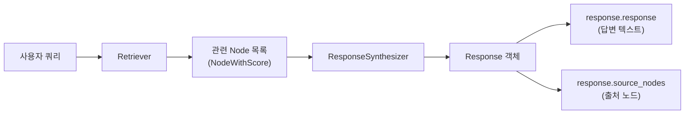
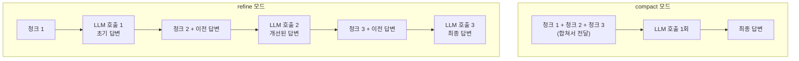
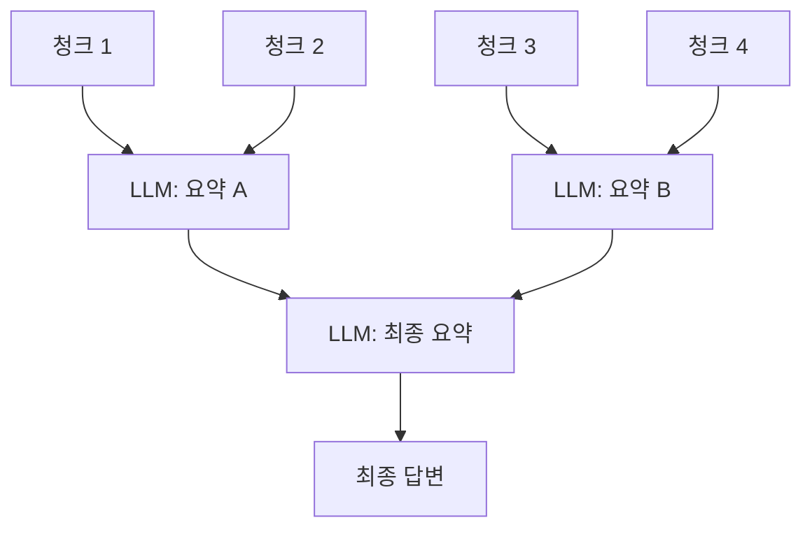
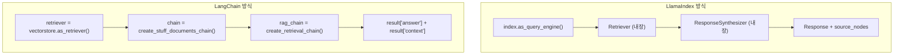

# QueryEngine과 응답 합성

> LlamaIndex의 QueryEngine 인터페이스를 마스터하고, ResponseSynthesizer의 다양한 전략으로 검색 결과를 최적의 답변으로 변환하는 방법을 배웁니다.

## 개요

이 섹션에서는 LlamaIndex RAG 파이프라인의 **후반부**, 즉 검색된 노드를 어떻게 최종 답변으로 합성하는지를 깊이 있게 다룹니다. 앞서 [세션 9.2: VectorStoreIndex — 인덱싱과 검색](09-llamaindex로-rag-구축-대안-프레임워크-활용/02-vectorstoreindex-인덱싱과-검색.md)에서 `as_query_engine()`을 간단히 사용해봤는데요, 이번에는 그 내부를 열어보고 각 부품을 직접 조립해보겠습니다.

**선수 지식**: 
- [세션 9.1](09-llamaindex로-rag-구축-대안-프레임워크-활용/01-llamaindex-핵심-개념-document-node-index.md)의 Document, Node, Index 개념
- [세션 9.2](09-llamaindex로-rag-구축-대안-프레임워크-활용/02-vectorstoreindex-인덱싱과-검색.md)의 VectorStoreIndex, `as_query_engine()` 기본 사용법

**학습 목표**:
- QueryEngine의 내부 구조(Retriever + ResponseSynthesizer)를 이해한다
- ResponseSynthesizer의 주요 응답 모드(compact, refine, tree_summarize)를 비교하고 적합한 상황에 적용할 수 있다
- 프롬프트 템플릿을 커스터마이징하여 답변 품질을 제어할 수 있다
- `response.source_nodes`를 활용하여 출처 정보를 추출하고 활용할 수 있다

## 왜 알아야 할까?

RAG 시스템에서 **검색은 절반에 불과**합니다. 아무리 좋은 문서를 찾아와도, 그 문서들을 **어떻게 조합해서 답변을 만드느냐**에 따라 최종 품질이 크게 달라지거든요.

실무에서 자주 겪는 상황을 떠올려 보세요:

- 검색된 문서가 10개인데, LLM 컨텍스트 윈도우에 다 못 넣는 경우
- 여러 문서의 정보를 종합해 하나의 긴 요약을 만들어야 하는 경우
- "이 답변의 근거가 뭐야?"라고 사용자가 물었을 때, 출처를 정확히 보여줘야 하는 경우
- 한국어로 답변해달라고 LLM에 지시하고 싶은 경우

이 모든 상황을 **ResponseSynthesizer**와 **프롬프트 커스터마이징**으로 해결할 수 있습니다. QueryEngine의 내부를 이해하면, 단순히 `as_query_engine()`을 호출하는 수준을 넘어서 **정밀하게 답변 품질을 제어**할 수 있게 됩니다.

## 핵심 개념

### 개념 1: QueryEngine의 내부 구조 — Retriever + ResponseSynthesizer

> 💡 **비유**: QueryEngine은 **도서관 사서**와 같습니다. 사서는 두 가지 일을 하죠. 먼저 질문에 관련된 책을 서가에서 **찾아오고** (Retriever), 그 책들의 내용을 읽고 종합해서 **답변을 작성**합니다 (ResponseSynthesizer). `as_query_engine()`은 이 두 역할을 한 번에 묶어주는 편의 메서드였던 거예요.

QueryEngine은 크게 두 컴포넌트로 구성됩니다:

1. **Retriever**: 인덱스에서 관련 노드를 검색
2. **ResponseSynthesizer**: 검색된 노드와 쿼리를 LLM에 전달하여 최종 응답 생성

> 📊 **그림 1**: QueryEngine의 내부 파이프라인



앞서 [세션 9.2](09-llamaindex로-rag-구축-대안-프레임워크-활용/02-vectorstoreindex-인덱싱과-검색.md)에서 `index.as_query_engine(similarity_top_k=3)`처럼 한 줄로 사용했는데, 이것은 내부적으로 아래와 같은 과정을 수행합니다:

```python
from llama_index.core import VectorStoreIndex, get_response_synthesizer
from llama_index.core.query_engine import RetrieverQueryEngine

# 고수준 API (한 줄)
query_engine = index.as_query_engine(similarity_top_k=3)

# 위와 동일한 저수준 API (분리)
retriever = index.as_retriever(similarity_top_k=3)  # Retriever 분리
response_synthesizer = get_response_synthesizer()     # ResponseSynthesizer 분리
query_engine = RetrieverQueryEngine(                   # 수동 조립
    retriever=retriever,
    response_synthesizer=response_synthesizer,
)
```

왜 굳이 분리할까요? **각 부품을 독립적으로 커스터마이징**할 수 있기 때문입니다. Retriever는 검색 방식을, ResponseSynthesizer는 응답 합성 전략을 독립적으로 교체할 수 있죠.

### 개념 2: ResponseSynthesizer의 응답 모드(Response Modes)

> 💡 **비유**: 검색된 문서 5개로 답변을 만드는 상황을 **요리**에 비유해볼게요. **compact** 모드는 재료를 한 냄비에 다 넣고 한 번에 끓이는 방식이고, **refine** 모드는 재료를 하나씩 추가하면서 맛을 점점 다듬어가는 방식이에요. **tree_summarize**는 재료를 소그룹으로 나눠 각각 소스를 만든 뒤, 그 소스들을 다시 합쳐 최종 소스를 만드는 방식이죠.

LlamaIndex는 총 **7가지** 응답 모드를 제공합니다. 먼저 전체를 한눈에 살펴본 뒤, 실무에서 가장 중요한 3가지(`compact`, `refine`, `tree_summarize`)를 상세히 다루겠습니다.

#### 7가지 응답 모드 전체 비교

| 모드 | 동작 방식 | LLM 호출 | 주 용도 |
|------|----------|----------|---------|
| `compact` | 청크를 최대한 합쳐서 전달 (기본값) | 적음 (보통 1회) | 일반 Q&A |
| `refine` | 청크별 순차적으로 답변 개선 | 청크 수만큼 | 정밀 답변 (법률/의료) |
| `tree_summarize` | 재귀적 트리 구조로 요약 | 중간 | 대량 문서 요약/종합 |
| `simple_summarize` | 컨텍스트 윈도우까지 잘라서 한 번에 | 1회 | 빠른 요약 (정보 손실 감수) |
| `accumulate` | 청크별 독립 답변 생성 후 합침 | 청크 수만큼 | 비교 분석, 다각도 답변 |
| `no_text` | LLM 호출 없이 검색된 노드만 반환 | **0회** | 검색 디버깅, 파이프라인 테스트 |
| `compact_accumulate` | compact + accumulate 결합 | 중간 | 효율적 비교 분석 |

> 💡 **알고 계셨나요?**: `no_text` 모드는 LLM을 전혀 호출하지 않고 검색된 노드만 `source_nodes`에 담아 반환합니다. 개발 중 "내 검색이 제대로 작동하는가?"를 확인할 때 **비용 0원**으로 테스트할 수 있어 매우 유용하죠. 뒤에 나오는 [개념 4](#개념-4-출처-노드source-nodes-접근과-활용)에서 실제 활용 예시를 보여드리겠습니다.

이제 실무에서 가장 자주 쓰이는 **3가지 모드**를 상세히 살펴볼게요.

#### compact (기본값)

검색된 청크들을 **최대한 하나로 합쳐서** LLM에 전달합니다. 컨텍스트 윈도우에 다 들어가면 LLM 호출 1번, 넘치면 나눠서 refine 방식으로 처리합니다.

```python
from llama_index.core import get_response_synthesizer

# compact 모드 (기본값이므로 명시하지 않아도 됨)
synth = get_response_synthesizer(response_mode="compact")
```

- **장점**: LLM 호출 횟수가 적어 빠르고 비용 효율적
- **단점**: 청크가 많으면 일부 정보가 잘릴 수 있음
- **적합한 경우**: 대부분의 일반적인 Q&A 상황

#### refine

청크를 **하나씩 순차적으로** 처리합니다. 첫 번째 청크로 초기 답변을 만들고, 두 번째 청크로 그 답변을 **개선(refine)**하고, 세 번째 청크로 또 개선하는 식입니다.

```python
# refine 모드
synth = get_response_synthesizer(response_mode="refine")
```

- **장점**: 모든 청크의 정보를 빠짐없이 반영, 상세한 답변
- **단점**: 청크 수만큼 LLM 호출 → 느리고 비용 높음
- **적합한 경우**: 정확성이 최우선인 법률/의료 문서 Q&A

> 📊 **그림 2**: compact vs refine 모드의 LLM 호출 흐름



#### tree_summarize

청크들을 **트리 구조**로 재귀적으로 요약합니다. 먼저 청크들을 그룹으로 묶어 각각 요약하고, 그 요약들을 다시 묶어 요약하는 과정을 최종 답변 하나가 남을 때까지 반복합니다.

```python
# tree_summarize 모드
synth = get_response_synthesizer(response_mode="tree_summarize")
```

- **장점**: 대량의 문서를 체계적으로 요약, 구조적 답변
- **단점**: 세부 정보가 요약 과정에서 손실될 수 있음
- **적합한 경우**: "이 문서들을 종합해서 요약해줘" 류의 요청

> 📊 **그림 3**: tree_summarize의 재귀적 요약 과정



### 개념 3: 프롬프트 템플릿 커스터마이징

> 💡 **비유**: ResponseSynthesizer의 프롬프트 템플릿은 **답안지 양식**과 같습니다. 시험에서 "간결하게 서술하시오"와 "근거를 들어 논술하시오"는 같은 문제라도 전혀 다른 답변을 유도하죠. 마찬가지로 프롬프트 템플릿을 바꾸면 LLM의 답변 스타일이 완전히 달라집니다.

LlamaIndex의 응답 합성에는 세 가지 핵심 프롬프트가 사용됩니다:

- **`text_qa_template`**: 첫 번째 청크로 초기 답변을 생성할 때 사용
- **`refine_template`**: refine/compact 모드에서 이전 답변을 개선할 때 사용
- **`summary_template`**: tree_summarize 모드에서 요약할 때 사용

```python
from llama_index.core import PromptTemplate

# 한국어 QA 프롬프트 커스터마이징
custom_qa_template = PromptTemplate(
    "아래에 컨텍스트 정보가 주어져 있습니다.\n"
    "---------------------\n"
    "{context_str}\n"
    "---------------------\n"
    "위 컨텍스트 정보만을 활용하여 다음 질문에 한국어로 답변하세요.\n"
    "컨텍스트에 답이 없으면 '제공된 정보에서 답을 찾을 수 없습니다'라고 답하세요.\n"
    "질문: {query_str}\n"
    "답변: "
)

# refine 프롬프트 커스터마이징
custom_refine_template = PromptTemplate(
    "원래 질문: {query_str}\n"
    "기존 답변: {existing_answer}\n"
    "아래에 추가 컨텍스트가 있습니다.\n"
    "---------------------\n"
    "{context_msg}\n"
    "---------------------\n"
    "추가 컨텍스트를 활용하여 기존 답변을 한국어로 개선하세요.\n"
    "추가 정보가 유용하지 않으면 기존 답변을 그대로 반환하세요.\n"
    "개선된 답변: "
)
```

프롬프트를 적용하는 방법은 두 가지입니다:

```python
# 방법 1: 고수준 API — as_query_engine()에 직접 전달
query_engine = index.as_query_engine(
    text_qa_template=custom_qa_template,
    refine_template=custom_refine_template,
)

# 방법 2: 저수준 API — get_response_synthesizer()에 전달
synth = get_response_synthesizer(
    response_mode="compact",
    text_qa_template=custom_qa_template,
    refine_template=custom_refine_template,
)
query_engine = RetrieverQueryEngine(
    retriever=index.as_retriever(similarity_top_k=3),
    response_synthesizer=synth,
)
```

이미 만들어진 QueryEngine의 프롬프트를 **사후에 교체**하는 것도 가능합니다:

```python
# 현재 사용 중인 프롬프트 확인
query_engine = index.as_query_engine()
prompts_dict = query_engine.get_prompts()
print(list(prompts_dict.keys()))
# ['response_synthesizer:text_qa_template', 'response_synthesizer:refine_template']

# 프롬프트 업데이트
query_engine.update_prompts(
    {"response_synthesizer:text_qa_template": custom_qa_template}
)
```

### 개념 4: 출처 노드(Source Nodes) 접근과 활용

> 💡 **비유**: 논문에서 주장을 할 때 **각주**를 다는 것처럼, RAG 시스템도 답변의 **근거가 된 문서 조각**을 함께 제공합니다. 이것이 바로 `source_nodes`입니다. "이 답변은 어디서 나온 거야?"라는 질문에 정확히 답할 수 있게 해주죠.

QueryEngine의 응답 객체(`Response`)에는 답변 텍스트뿐 아니라 **출처 노드 정보**가 포함됩니다:

```run:python
# source_nodes 구조 예시 (의사 코드)
# response = query_engine.query("RAG란 무엇인가요?")

# 답변 텍스트
print("=== 답변 ===")
print("RAG는 Retrieval-Augmented Generation의 약자로...")

# 출처 노드 접근
print("\n=== 출처 노드 ===")
print(f"출처 개수: 3개")
print(f"[노드 1] 유사도: 0.89 | 파일: rag_overview.pdf | 텍스트: 'RAG는 외부 지식...'")
print(f"[노드 2] 유사도: 0.82 | 파일: llm_basics.pdf | 텍스트: '대규모 언어 모델의...'")
print(f"[노드 3] 유사도: 0.75 | 파일: search_tech.pdf | 텍스트: '검색 증강 기법은...'")
```

```output
=== 답변 ===
RAG는 Retrieval-Augmented Generation의 약자로...

=== 출처 노드 ===
출처 개수: 3개
[노드 1] 유사도: 0.89 | 파일: rag_overview.pdf | 텍스트: 'RAG는 외부 지식...'
[노드 2] 유사도: 0.82 | 파일: llm_basics.pdf | 텍스트: '대규모 언어 모델의...'
[노드 3] 유사도: 0.75 | 파일: search_tech.pdf | 텍스트: '검색 증강 기법은...'
```

실제 코드에서 source_nodes를 활용하는 패턴은 다음과 같습니다:

```python
response = query_engine.query("RAG의 장점은 무엇인가요?")

# 답변 텍스트
print(response.response)

# 출처 노드 순회
for i, node_with_score in enumerate(response.source_nodes):
    node = node_with_score.node           # TextNode 객체
    score = node_with_score.score          # 유사도 점수 (float)
    text = node.text                       # 원본 텍스트
    metadata = node.metadata               # 메타데이터 딕셔너리
    node_id = node.node_id                 # 노드 고유 ID
    
    print(f"\n--- 출처 {i+1} (유사도: {score:.4f}) ---")
    print(f"파일: {metadata.get('file_name', 'N/A')}")
    print(f"텍스트 미리보기: {text[:100]}...")
```

> ⚠️ **흔한 오해**: `source_node.metadata`로 직접 접근하면 `AttributeError`가 발생합니다! `NodeWithScore`는 `node`와 `score`를 감싸는 래퍼이므로, 반드시 `source_node.node.metadata`처럼 `.node`를 거쳐야 합니다.

`no_text` 모드를 활용하면 **LLM 호출 없이 검색 결과만 확인**할 수 있어 디버깅에 매우 유용합니다:

```python
# 검색 디버깅: LLM 호출 없이 어떤 노드가 검색되는지 확인
debug_engine = index.as_query_engine(response_mode="no_text")
debug_response = debug_engine.query("RAG 파이프라인 구조")

for node_with_score in debug_response.source_nodes:
    print(f"[{node_with_score.score:.4f}] {node_with_score.node.text[:80]}...")
```

## 실습: 직접 해보기

이제 배운 내용을 종합하여, **응답 모드를 비교하고 프롬프트를 커스터마이징하는** 완전한 실습을 진행해보겠습니다.

```python
import os
from dotenv import load_dotenv

# 환경 변수 로드
load_dotenv()

from llama_index.core import (
    Document,
    VectorStoreIndex,
    PromptTemplate,
    get_response_synthesizer,
    Settings,
)
from llama_index.core.query_engine import RetrieverQueryEngine
from llama_index.llms.openai import OpenAI

# LLM 설정
Settings.llm = OpenAI(model="gpt-4o-mini", temperature=0)

# === 1. 샘플 문서 생성 ===
documents = [
    Document(
        text="RAG(Retrieval-Augmented Generation)는 2020년 Meta AI의 Patrick Lewis 등이 제안한 기법입니다. "
             "LLM이 외부 지식 소스에서 관련 정보를 검색하여 답변 생성에 활용하는 방식으로, "
             "할루시네이션을 줄이고 최신 정보를 반영할 수 있습니다.",
        metadata={"source": "rag_overview.md", "chapter": "1"},
    ),
    Document(
        text="RAG 파이프라인은 크게 인덱싱, 검색, 생성 세 단계로 구성됩니다. "
             "인덱싱 단계에서 문서를 청크로 분할하고 임베딩하여 벡터 DB에 저장합니다. "
             "검색 단계에서 쿼리와 유사한 청크를 찾고, 생성 단계에서 LLM이 답변을 합성합니다.",
        metadata={"source": "rag_pipeline.md", "chapter": "2"},
    ),
    Document(
        text="RAG의 주요 장점은 세 가지입니다. 첫째, 할루시네이션 감소 - 외부 지식에 기반하므로 "
             "허구의 정보 생성이 줄어듭니다. 둘째, 최신성 - 벡터 DB를 업데이트하면 LLM 재학습 없이 "
             "최신 정보를 반영합니다. 셋째, 출처 추적 - 답변의 근거 문서를 명시할 수 있습니다.",
        metadata={"source": "rag_benefits.md", "chapter": "1"},
    ),
    Document(
        text="Naive RAG의 한계점도 존재합니다. 검색 품질이 낮으면 잘못된 컨텍스트가 전달되어 "
             "답변 품질이 오히려 떨어질 수 있습니다. 또한 청크 크기 설정, 임베딩 모델 선택, "
             "top-k 값 조정 등 다양한 하이퍼파라미터 튜닝이 필요합니다.",
        metadata={"source": "rag_limitations.md", "chapter": "3"},
    ),
]

# 인덱스 생성
index = VectorStoreIndex.from_documents(documents)
query = "RAG의 장점과 한계점을 설명해주세요."

# === 2. 응답 모드 비교 ===
print("=" * 60)
print("1) compact 모드 (기본값)")
print("=" * 60)

compact_engine = index.as_query_engine(
    response_mode="compact",
    similarity_top_k=3,
)
compact_response = compact_engine.query(query)
print(compact_response.response)
print(f"\n출처 노드 수: {len(compact_response.source_nodes)}")

print("\n" + "=" * 60)
print("2) refine 모드")
print("=" * 60)

refine_engine = index.as_query_engine(
    response_mode="refine",
    similarity_top_k=3,
)
refine_response = refine_engine.query(query)
print(refine_response.response)

print("\n" + "=" * 60)
print("3) tree_summarize 모드")
print("=" * 60)

tree_engine = index.as_query_engine(
    response_mode="tree_summarize",
    similarity_top_k=3,
)
tree_response = tree_engine.query(query)
print(tree_response.response)

# === 3. 한국어 프롬프트 커스터마이징 ===
print("\n" + "=" * 60)
print("4) 커스텀 한국어 프롬프트")
print("=" * 60)

# 한국어 QA 프롬프트
korean_qa_template = PromptTemplate(
    "아래에 참고 자료가 주어져 있습니다.\n"
    "---------------------\n"
    "{context_str}\n"
    "---------------------\n"
    "위 참고 자료만을 근거로 질문에 답변하세요.\n"
    "규칙:\n"
    "- 반드시 한국어로 답변하세요.\n"
    "- 핵심을 불릿 포인트로 정리하세요.\n"
    "- 참고 자료에 없는 내용은 추측하지 마세요.\n"
    "\n질문: {query_str}\n"
    "답변:\n"
)

# 한국어 refine 프롬프트
korean_refine_template = PromptTemplate(
    "원래 질문: {query_str}\n"
    "기존 답변: {existing_answer}\n\n"
    "추가 참고 자료:\n"
    "---------------------\n"
    "{context_msg}\n"
    "---------------------\n"
    "추가 자료를 반영하여 기존 답변을 보완하세요.\n"
    "새로운 정보가 없으면 기존 답변을 그대로 유지하세요.\n"
    "보완된 답변:\n"
)

# 저수준 API로 조립
retriever = index.as_retriever(similarity_top_k=3)
synth = get_response_synthesizer(
    response_mode="compact",
    text_qa_template=korean_qa_template,
    refine_template=korean_refine_template,
)
custom_engine = RetrieverQueryEngine(
    retriever=retriever,
    response_synthesizer=synth,
)

custom_response = custom_engine.query(query)
print(custom_response.response)

# === 4. 출처 노드 상세 출력 ===
print("\n" + "=" * 60)
print("5) 출처 노드 상세 정보")
print("=" * 60)

for i, node_with_score in enumerate(custom_response.source_nodes):
    node = node_with_score.node
    score = node_with_score.score
    print(f"\n--- 출처 {i+1} ---")
    print(f"  유사도 점수: {score:.4f}")
    print(f"  파일: {node.metadata.get('source', 'N/A')}")
    print(f"  챕터: {node.metadata.get('chapter', 'N/A')}")
    print(f"  텍스트 미리보기: {node.text[:80]}...")
    print(f"  노드 ID: {node.node_id}")

# === 5. 프롬프트 확인 및 동적 교체 ===
print("\n" + "=" * 60)
print("6) 등록된 프롬프트 키 확인")
print("=" * 60)

prompts = custom_engine.get_prompts()
for key in prompts:
    print(f"  - {key}")
```

> 🔥 **실무 팁**: 실제 프로덕션에서는 `structured_answer_filtering=True` 옵션을 활용해보세요. 이 옵션은 refine/compact 모드에서 **질문과 관련 없는 노드를 자동으로 필터링**해줍니다. 특히 Function Calling을 지원하는 LLM(GPT-4o 등)과 함께 사용하면 효과적입니다.

```python
# 관련 없는 노드 자동 필터링
synth = get_response_synthesizer(
    response_mode="compact",
    structured_answer_filtering=True,  # 관련성 없는 노드 필터링
)
```

## 더 깊이 알아보기

### ResponseSynthesizer의 탄생 배경

LlamaIndex(당시 GPT Index)의 창시자 **Jerry Liu**는 2023년 버전 0.6.0에서 큰 아키텍처 변경을 단행했습니다. 핵심 철학은 **"상태(데이터+인덱스)와 계산(검색+합성)의 분리"**였죠. 이전에는 인덱스가 검색과 응답 생성을 모두 담당했는데, 이를 Retriever와 ResponseSynthesizer로 분리한 겁니다.

이어진 0.7.0 버전에서는 ResponseSynthesizer를 더욱 사용자 친화적으로 개선했습니다. 기존의 `ResponseBuilder`가 커스터마이징하기 어렵다는 피드백을 받아, 독립적으로 import하고 사용할 수 있는 모듈로 재설계했죠. Jerry Liu는 이를 **"Progressive Disclosure of Complexity(점진적 복잡성 노출)"**이라고 표현했는데, 초보자는 `as_query_engine()` 한 줄로 시작하고, 필요에 따라 내부 컴포넌트를 하나씩 분리하여 커스터마이징할 수 있도록 한 것입니다.

흥미로운 점은 **tree_summarize** 모드의 영감이 MapReduce 패턴에서 왔다는 것입니다. 대규모 분산 처리에서 데이터를 부분적으로 처리(Map)하고 합산(Reduce)하는 것처럼, 문서 청크를 부분 요약한 뒤 재귀적으로 합치는 방식이죠. 이 패러다임은 나중에 LangChain의 `map_reduce` 체인에서도 유사하게 등장합니다.

### LangChain과의 비교: 응답 합성 접근 방식

[챕터 8](08-기본-rag-파이프라인-구축-langchain으로-첫-rag-앱-만들기/01-langchain-v1-핵심-개념과-설정.md)에서 배운 LangChain의 체인과 비교해보면, 두 프레임워크의 설계 철학 차이가 명확하게 드러납니다:

| 항목 | LlamaIndex | LangChain |
|------|-----------|-----------|
| 추상화 수준 | `as_query_engine()` 한 줄 | LCEL로 파이프 조합 |
| 응답 합성 | 내장 ResponseSynthesizer (7가지 모드) | `create_stuff_documents_chain` 등 수동 구성 |
| 프롬프트 교체 | `update_prompts()` 메서드 | 체인 생성 시 직접 전달 |
| 출처 추적 | `response.source_nodes` 자동 포함 | 별도 설정 필요 |

> 📊 **그림 4**: LlamaIndex vs LangChain의 RAG 응답 합성 비교



LlamaIndex는 **"배터리 포함(batteries-included)"** 철학으로, 기본값만으로도 잘 동작하는 RAG를 빠르게 구축할 수 있습니다. 반면 LangChain은 LCEL로 **각 컴포넌트를 명시적으로 조합**하는 유연성이 강점이죠.

## 흔한 오해와 팁

> ⚠️ **흔한 오해**: "compact 모드는 항상 LLM을 한 번만 호출한다"고 생각하기 쉽지만, 사실은 그렇지 않습니다. 검색된 청크를 최대한 합치지만, 합친 텍스트가 컨텍스트 윈도우를 **초과하면 자동으로 분할**하여 refine 방식으로 여러 번 호출합니다. compact는 "가능한 한 적게 호출"이지, "무조건 한 번"이 아닙니다.

> 💡 **알고 계셨나요?**: `refine` 모드에서 노드가 처리되는 순서는 **유사도 점수 순**입니다. 즉, 가장 관련성 높은 노드가 먼저 초기 답변을 형성하고, 관련성이 낮은 노드들이 순차적으로 보완합니다. 이 때문에 refine 모드에서는 `similarity_top_k` 값이 답변 품질뿐 아니라 **비용과 지연시간**에도 직결됩니다.

> 🔥 **실무 팁**: 프로덕션에서는 **응답 모드를 상황에 따라 동적으로 전환**하는 패턴이 효과적입니다. 예를 들어, 단순 사실 확인 질문에는 `compact`, 긴 보고서 요약에는 `tree_summarize`, 법률 문서 분석에는 `refine`을 사용하세요. QueryEngine을 미리 여러 개 만들어두고 쿼리 유형에 따라 라우팅하면 비용과 품질을 동시에 최적화할 수 있습니다.

> 🔥 **실무 팁**: 개발 중 `no_text` 모드로 **검색 품질을 먼저 검증**하세요. LLM 비용 없이 어떤 청크가 검색되는지 확인할 수 있어, 검색 파라미터 튜닝에 매우 유용합니다. 검색이 잘 되는 걸 확인한 다음에 응답 합성 전략을 고민해도 늦지 않습니다.

## 핵심 정리

| 개념 | 설명 |
|------|------|
| **QueryEngine** | Retriever + ResponseSynthesizer를 결합한 질의응답 엔드투엔드 인터페이스 |
| **RetrieverQueryEngine** | Retriever와 ResponseSynthesizer를 수동으로 조립하는 저수준 QueryEngine |
| **ResponseSynthesizer** | 검색된 노드를 LLM으로 합성하여 최종 답변을 생성하는 컴포넌트 |
| **compact 모드** | 청크를 최대한 합쳐서 LLM 호출 최소화 (기본값) |
| **refine 모드** | 청크별 순차 개선으로 상세한 답변 생성 |
| **tree_summarize 모드** | 재귀적 트리 구조로 대량 문서 요약 |
| **no_text 모드** | LLM 호출 없이 검색된 노드만 반환 (디버깅용) |
| **text_qa_template** | 초기 답변 생성에 사용되는 프롬프트 템플릿 |
| **refine_template** | 답변 개선에 사용되는 프롬프트 템플릿 |
| **source_nodes** | 답변의 근거가 된 노드 목록 (NodeWithScore 리스트) |
| **get_prompts() / update_prompts()** | 기존 QueryEngine의 프롬프트를 확인하고 교체하는 메서드 |
| **structured_answer_filtering** | refine/compact 모드에서 관련 없는 노드를 자동 필터링 |

## 다음 섹션 미리보기

이번 섹션에서는 단일 질문에 대한 답변을 생성하는 **QueryEngine**을 집중적으로 다뤘습니다. 하지만 실제 사용자는 한 번 질문하고 끝나지 않죠 — "좀 더 자세히 알려줘", "다른 관점에서는?"처럼 **대화를 이어가고** 싶어 합니다. 다음 섹션인 [세션 9.4: ChatEngine — 멀티턴 대화 RAG](09-llamaindex로-rag-구축-대안-프레임워크-활용/04-chatengine-대화형-rag-구현.md)에서는 대화 히스토리를 유지하면서 RAG를 수행하는 **ChatEngine**을 배우고, QueryEngine과의 차이점을 비교해보겠습니다.

## 참고 자료

- [Response Synthesizer — LlamaIndex 공식 문서](https://developers.llamaindex.ai/python/framework/module_guides/querying/response_synthesizers/) - ResponseSynthesizer의 모든 응답 모드와 API를 상세히 설명하는 공식 레퍼런스
- [Response Modes — LlamaIndex 공식 문서](https://developers.llamaindex.ai/python/framework/module_guides/deploying/query_engine/response_modes/) - 7가지 응답 모드의 동작 원리와 비교
- [Prompt Usage Pattern — LlamaIndex 공식 문서](https://developers.llamaindex.ai/python/framework/module_guides/models/prompts/usage_pattern/) - 프롬프트 템플릿 커스터마이징의 모든 패턴과 고급 기법
- [LlamaIndex 핵심 개념 — 공식 문서](https://developers.llamaindex.ai/python/framework/getting_started/concepts/) - QueryEngine, ChatEngine 등 핵심 컴포넌트의 전체 아키텍처
- [LlamaIndex 0.7.0 릴리즈 — Jerry Liu](https://medium.com/llamaindex-blog/llamaindex-0-7-0-better-enabling-bottoms-up-llm-application-development-959db8f75024) - ResponseSynthesizer 분리 설계의 배경과 철학

---
### 🔗 Related Sessions
- [document (llamaindex)](../09-llamaindex로-rag-구축-대안-프레임워크-활용/01-llamaindex-핵심-개념-document-node-index.md) (prerequisite)
- [node (llamaindex)](../09-llamaindex로-rag-구축-대안-프레임워크-활용/01-llamaindex-핵심-개념-document-node-index.md) (prerequisite)
- [vectorstoreindex](../09-llamaindex로-rag-구축-대안-프레임워크-활용/01-llamaindex-핵심-개념-document-node-index.md) (prerequisite)
- [as_query_engine](../09-llamaindex로-rag-구축-대안-프레임워크-활용/02-vectorstoreindex-인덱싱과-검색.md) (prerequisite)
- [similarity_top_k](../09-llamaindex로-rag-구축-대안-프레임워크-활용/02-vectorstoreindex-인덱싱과-검색.md) (prerequisite)
