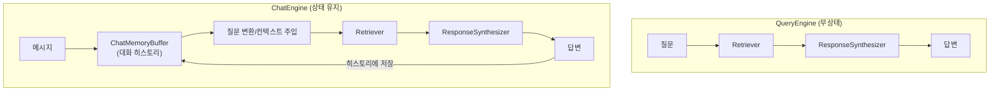
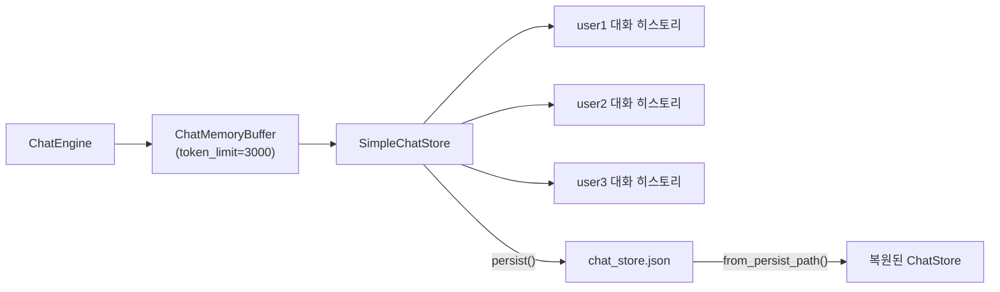
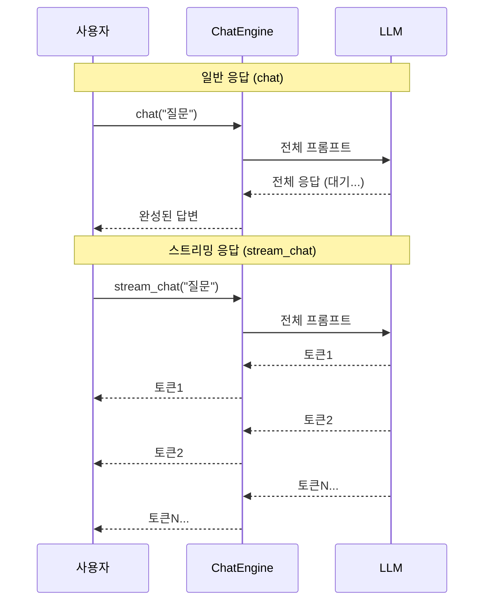

# ChatEngine — 대화형 RAG 구현

> QueryEngine이 "일문일답"이었다면, ChatEngine은 "대화"입니다. 멀티턴 채팅에서 맥락을 유지하며 데이터와 자연스럽게 대화하는 방법을 알아봅니다.

## 개요

이 섹션에서는 LlamaIndex의 ChatEngine을 사용하여 **대화형 RAG 시스템**을 구축하는 방법을 학습합니다. 앞서 [Session 9.3: QueryEngine과 응답 합성](09-llamaindex로-rag-구축-대안-프레임워크-활용/03-queryengine과-응답-합성.md)에서 배운 QueryEngine이 단일 질문에 대한 답변을 생성하는 도구였다면, ChatEngine은 여러 번의 대화를 이어가며 이전 맥락을 기억하는 **상태 유지(stateful)** 인터페이스입니다.

**선수 지식**:
- [Session 9.2](09-llamaindex로-rag-구축-대안-프레임워크-활용/02-vectorstoreindex-인덱싱과-검색.md)에서 배운 VectorStoreIndex와 검색 파이프라인
- [Session 9.3](09-llamaindex로-rag-구축-대안-프레임워크-활용/03-queryengine과-응답-합성.md)에서 배운 QueryEngine, RetrieverQueryEngine, ResponseSynthesizer의 구조
- Python의 기본적인 비동기(async/await) 문법에 대한 이해

**학습 목표**:
- ChatEngine의 세 가지 핵심 모드(`condense_question`, `context`, `condense_plus_context`)의 동작 원리와 차이를 이해한다
- `ChatMemoryBuffer`와 `SimpleChatStore`를 사용하여 대화 히스토리를 관리하고 영속화할 수 있다
- `stream_chat()`을 활용한 스트리밍 응답을 구현할 수 있다
- 멀티턴 대화에서 컨텍스트 윈도우를 효율적으로 관리하는 전략을 적용할 수 있다

## 왜 알아야 할까?

ChatGPT 이후로 사용자들은 AI와 **대화**하는 것에 익숙해졌습니다. "이 문서에서 핵심 내용이 뭐야?"라고 물은 뒤 "그중에서 두 번째 내용을 더 자세히 설명해줘"라고 이어서 질문하는 것이 자연스럽죠. 하지만 QueryEngine은 매 질문이 독립적이라서, "두 번째 내용"이 무엇인지 알지 못합니다.

실제 프로덕션 RAG 애플리케이션을 생각해보세요:
- **사내 문서 챗봇**: "휴가 정책이 뭐야?" → "연차 말고 병가는?" → "그럼 병가 신청은 어떻게 해?"
- **코드 리뷰 어시스턴트**: "이 함수의 역할이 뭐야?" → "여기서 버그 가능성은?" → "어떻게 고치면 좋을까?"
- **고객 지원 봇**: "주문 상태 확인해줘" → "배송지 변경 가능해?" → "그럼 환불은?"

이런 **연속적인 대화 흐름**에서 이전 맥락을 기억하지 못하면, 매번 처음부터 질문해야 하는 답답한 경험이 됩니다. ChatEngine은 바로 이 문제를 해결합니다.

## 핵심 개념

### 개념 1: ChatEngine vs QueryEngine — 무엇이 다른가?

> 💡 **비유**: QueryEngine은 **도서관 사서에게 쪽지로 질문하는 것**과 같습니다. 매번 새 쪽지에 질문을 적어 넘기면, 사서는 이전 쪽지를 기억하지 못합니다. 반면 ChatEngine은 **사서와 직접 대면하여 대화하는 것**과 같습니다. "아까 찾아준 그 책에서..." 하면 사서가 맥락을 기억하고 이어서 도움을 줍니다.

기술적으로 ChatEngine은 QueryEngine 위에 **대화 히스토리 관리 계층**을 추가한 것입니다. 핵심 차이를 정리하면:

| 특성 | QueryEngine | ChatEngine |
|------|-------------|------------|
| 상태 | 무상태(Stateless) | 상태 유지(Stateful) |
| 대화 히스토리 | 없음 | `ChatMemoryBuffer`로 관리 |
| 호출 방식 | `query("질문")` | `chat("메시지")` |
| 스트리밍 | `streaming=True` 설정 필요 | `stream_chat()` 전용 메서드 |
| 적합한 용도 | 단일 질의응답 | 멀티턴 대화 |

가장 기본적인 ChatEngine 생성은 놀라울 정도로 간단합니다:

```python
# QueryEngine → ChatEngine 전환은 메서드 하나 차이
query_engine = index.as_query_engine()       # 단일 질문용
chat_engine = index.as_chat_engine()         # 대화용
```

> 📊 **그림 1**: QueryEngine과 ChatEngine의 구조 비교



### 개념 2: 세 가지 ChatEngine 모드

ChatEngine의 핵심은 **"이전 대화를 어떻게 활용할 것인가?"**에 대한 전략입니다. LlamaIndex는 여러 모드를 제공하는데, 가장 중요한 세 가지를 살펴보겠습니다.

> 💡 **비유**: 세 가지 모드를 **통역사 스타일**에 비유해볼게요.
> - `condense_question`: 통역사가 대화 맥락을 파악해서 질문을 **재작성**한 뒤, 자료를 찾아줍니다. "아까 그거"를 "문서 3절의 알고리즘"으로 바꿔주는 거죠.
> - `context`: 통역사가 매번 관련 자료를 직접 **옆에 펼쳐놓고** 답합니다. 대화 자체는 기억하지만, 질문은 있는 그대로 사용합니다.
> - `condense_plus_context`: 통역사가 질문을 **재작성**하고, 그 재작성된 질문으로 **자료도 새로 찾아서** 답합니다. 가장 정교한 방식이죠.

#### condense_question 모드

이 모드는 두 단계로 동작합니다:
1. **질문 압축(Condense)**: 대화 히스토리 + 현재 메시지 → 독립적인 질문으로 재작성
2. **쿼리 실행**: 재작성된 질문으로 QueryEngine에 검색 요청

```python
chat_engine = index.as_chat_engine(
    chat_mode="condense_question",
    verbose=True  # 재작성된 질문을 콘솔에 출력
)

# 첫 번째 질문
response = chat_engine.chat("LlamaIndex의 핵심 개념이 뭐야?")

# 후속 질문 — "그중에서"가 대화 맥락에서 해석됨
response = chat_engine.chat("그중에서 Node가 뭔지 자세히 알려줘")
# 내부적으로 → "LlamaIndex의 Node 개념에 대해 자세히 설명해줘"로 재작성
```

> ⚠️ **흔한 오해**: `condense_question` 모드는 **항상** 지식 베이스를 검색합니다. 그래서 "아까 내가 뭘 물어봤지?" 같은 메타 질문에는 제대로 답하지 못합니다. 이런 메타 질문이 필요하다면 `context` 또는 `condense_plus_context` 모드를 사용하세요.

#### context 모드

이 모드는 더 직관적인 접근법을 취합니다:
1. **컨텍스트 검색**: 현재 메시지를 기반으로 관련 Node를 검색
2. **시스템 프롬프트 주입**: 검색된 텍스트를 시스템 프롬프트에 삽입
3. **LLM 호출**: 대화 히스토리 + 시스템 프롬프트(컨텍스트 포함)로 응답 생성

```python
from llama_index.core.memory import ChatMemoryBuffer

memory = ChatMemoryBuffer.from_defaults(token_limit=1500)

chat_engine = index.as_chat_engine(
    chat_mode="context",
    memory=memory,
    system_prompt=(
        "당신은 기술 문서 전문 어시스턴트입니다. "
        "항상 한국어로 답변하고, 검색된 문서를 기반으로 정확하게 답하세요.\n\n"
        "{context_str}"  # 검색된 컨텍스트가 여기에 주입됨
    ),
)
```

`context` 모드의 장점은 시스템 프롬프트를 자유롭게 커스터마이징할 수 있다는 것입니다. 또한 대화 히스토리를 그대로 LLM에 전달하기 때문에 메타 질문("내가 뭘 물어봤지?")에도 자연스럽게 응답합니다.

#### condense_plus_context 모드 (권장)

두 모드의 장점을 결합한 **가장 권장되는 모드**입니다:
1. **질문 압축**: 대화 히스토리 + 현재 메시지 → 독립 질문으로 재작성
2. **컨텍스트 검색**: 재작성된 질문으로 관련 Node 검색
3. **응답 생성**: 검색된 컨텍스트 + 대화 히스토리 + 사용자 메시지로 답변

```python
memory = ChatMemoryBuffer.from_defaults(token_limit=3900)

chat_engine = index.as_chat_engine(
    chat_mode="condense_plus_context",
    memory=memory,
    llm=llm,
    context_prompt=(
        "다음은 이전에 검색된 관련 문서입니다.\n"
        "이 정보를 활용하여 사용자의 질문에 정확하게 답변하세요.\n\n"
        "{context_str}\n\n"
        "지식 베이스에 없는 내용은 '해당 정보를 찾을 수 없습니다'라고 답하세요."
    ),
    verbose=True,
)
```

> 💡 **알고 계셨나요?**: 위 세 가지 외에도 `react` 모드가 있습니다. 이 모드는 ReAct 에이전트를 기반으로 ChatEngine이 **도구(tool)를 자율적으로 선택**하며 대화하는 방식인데요, 검색 외에도 계산, API 호출 등 다양한 도구를 조합할 수 있어 훨씬 유연합니다. `react` 모드의 에이전틱 접근법은 [Ch16: 에이전틱 RAG](16-에이전틱-rag-langgraph로-동적-검색-에이전트-구축/01-에이전틱-rag란-왜-에이전트가-필요한가.md)에서 상세히 다룹니다.

> 📊 **그림 2**: 세 가지 ChatEngine 모드의 처리 흐름 비교

```mermaid
flowchart TD
    subgraph CQ["condense_question"]
        CQ1["사용자 메시지\n+ 대화 히스토리"] --> CQ2["질문 재작성\n(LLM 호출 1)"]
        CQ2 --> CQ3["QueryEngine\n(검색 + LLM 호출 2)"]
        CQ3 --> CQ4["답변"]
    end

    subgraph CTX["context"]
        CTX1["사용자 메시지"] --> CTX2["Retriever\n(검색)"]
        CTX2 --> CTX3["시스템 프롬프트에\n컨텍스트 주입"]
        CTX3 --> CTX4["LLM 호출\n(히스토리 포함)"]
        CTX4 --> CTX5["답변"]
    end

    subgraph CPC["condense_plus_context"]
        CPC1["사용자 메시지\n+ 대화 히스토리"] --> CPC2["질문 재작성\n(LLM 호출 1)"]
        CPC2 --> CPC3["Retriever\n(재작성된 질문으로 검색)"]
        CPC3 --> CPC4["시스템 프롬프트에\n컨텍스트 주입"]
        CPC4 --> CPC5["LLM 호출\n(히스토리 포함)"]
        CPC5 --> CPC6["답변"]
    end
```



세 모드를 비교 정리하면:

| 모드 | LLM 호출 수 | 질문 재작성 | 컨텍스트 검색 | 메타 질문 대응 |
|------|------------|-----------|-------------|-------------|
| `condense_question` | 2회 | O | 원본 QueryEngine 사용 | X |
| `context` | 1회 | X | O (원본 메시지 기반) | O |
| `condense_plus_context` | 2회 | O | O (재작성 기반) | O |

### 개념 3: ChatMemoryBuffer — 대화 히스토리 관리

> 💡 **비유**: ChatMemoryBuffer는 **노트에 대화를 적어두는 비서**와 같습니다. 노트 공간(token_limit)이 한정되어 있어서, 대화가 길어지면 오래된 내용부터 지워가면서 최신 대화를 유지합니다. 마치 칠판에 새로운 내용을 쓰려면 가장 오래된 내용을 지워야 하는 것처럼요.

ChatEngine에서 가장 중요한 설계 결정 중 하나는 **대화 히스토리를 얼마나, 어떻게 보관할 것인가**입니다. 검색된 컨텍스트가 LLM의 컨텍스트 윈도우 상당 부분을 차지하기 때문에, 대화 히스토리에 할당할 토큰을 신중하게 결정해야 합니다.

```python
from llama_index.core.memory import ChatMemoryBuffer

# 기본 생성 — 토큰 제한 설정
memory = ChatMemoryBuffer.from_defaults(token_limit=3000)

# 메시지 추가
from llama_index.core.llms import ChatMessage, MessageRole

memory.put(ChatMessage(role=MessageRole.USER, content="안녕하세요!"))
memory.put(ChatMessage(role=MessageRole.ASSISTANT, content="안녕하세요! 무엇을 도와드릴까요?"))

# 히스토리 조회 — token_limit 이내의 최근 메시지만 반환
history = memory.get()

# 전체 히스토리 조회 (토큰 제한 무시)
all_history = memory.get_all()

# 히스토리 초기화
memory.reset()
```

> 🔥 **실무 팁**: `token_limit`은 LLM의 전체 컨텍스트 윈도우에서 **검색 컨텍스트 + 시스템 프롬프트 + 응답 여유분**을 뺀 나머지로 설정하세요. 예를 들어 GPT-3.5-turbo(4096 토큰)를 사용하면, 검색 컨텍스트에 ~1500토큰, 시스템 프롬프트에 ~200토큰, 응답에 ~500토큰을 할당하고, 대화 히스토리에는 ~1800토큰 정도를 배분하는 것이 적절합니다.

### 개념 4: SimpleChatStore — 대화 히스토리 영속화

애플리케이션을 재시작해도 대화를 이어가려면 히스토리를 **디스크에 저장**해야 합니다. `SimpleChatStore`는 JSON 파일로 대화를 저장하고 복원하는 기능을 제공합니다.

```python
from llama_index.core.storage.chat_store import SimpleChatStore
from llama_index.core.memory import ChatMemoryBuffer

# 1. ChatStore 생성
chat_store = SimpleChatStore()

# 2. ChatMemoryBuffer에 ChatStore 연결
chat_memory = ChatMemoryBuffer.from_defaults(
    token_limit=3000,
    chat_store=chat_store,
    chat_store_key="user1",  # 사용자별로 대화를 분리
)

# 3. ChatEngine에 메모리 연결
chat_engine = index.as_chat_engine(
    chat_mode="condense_plus_context",
    memory=chat_memory,
)

# 대화 진행...
chat_engine.chat("RAG란 무엇인가요?")

# 4. 디스크에 저장
chat_store.persist(persist_path="chat_store.json")

# --- 앱 재시작 후 ---

# 5. 디스크에서 복원
loaded_store = SimpleChatStore.from_persist_path("chat_store.json")
restored_memory = ChatMemoryBuffer.from_defaults(
    token_limit=3000,
    chat_store=loaded_store,
    chat_store_key="user1",  # 같은 키로 복원
)
```

`chat_store_key`를 사용하면 **멀티 사용자 환경**에서 각 사용자의 대화를 독립적으로 관리할 수 있습니다. 하나의 ChatStore에 `"user1"`, `"user2"` 등 서로 다른 키로 대화를 저장하고 조회하는 것이죠.

> 📊 **그림 3**: ChatMemoryBuffer와 SimpleChatStore의 관계



### 개념 5: 스트리밍 응답 구현

실시간 채팅 경험을 위해서는 응답이 한 번에 오는 것이 아니라 **토큰 단위로 실시간 전송**되어야 합니다. ChatEngine은 `stream_chat()` 메서드로 이를 지원합니다.

```python
# 동기 스트리밍
streaming_response = chat_engine.stream_chat("RAG의 장점을 설명해줘")

for token in streaming_response.response_gen:
    print(token, end="", flush=True)
print()  # 줄바꿈
```

비동기 환경(FastAPI, Streamlit 등)에서는 `astream_chat()`을 사용합니다:

```python
import asyncio

async def async_chat():
    streaming_response = await chat_engine.astream_chat(
        "RAG의 장점을 설명해줘"
    )
    async for token in streaming_response.async_response_gen():
        print(token, end="", flush=True)
    print()

asyncio.run(async_chat())
```

> 📊 **그림 4**: 스트리밍 vs 일반 응답의 사용자 경험 차이



## 실습: 직접 해보기

이제 모든 개념을 결합하여 **완전한 대화형 RAG 시스템**을 구축해봅시다. 이 실습에서는 `condense_plus_context` 모드를 사용하고, 대화 히스토리 영속화와 스트리밍 응답을 모두 포함합니다.

```python
"""
대화형 RAG 챗봇 — LlamaIndex ChatEngine 실습
condense_plus_context 모드 + 히스토리 영속화 + 스트리밍
"""
import os
from pathlib import Path

from dotenv import load_dotenv
from llama_index.core import (
    Document,
    Settings,
    VectorStoreIndex,
)
from llama_index.core.memory import ChatMemoryBuffer
from llama_index.core.storage.chat_store import SimpleChatStore
from llama_index.llms.openai import OpenAI
from llama_index.embeddings.openai import OpenAIEmbedding

# 환경 변수 로드
load_dotenv()

# --- 1. 전역 설정 ---
Settings.llm = OpenAI(model="gpt-4o-mini", temperature=0.1)
Settings.embed_model = OpenAIEmbedding(model="text-embedding-3-small")


# --- 2. 샘플 문서 준비 ---
documents = [
    Document(
        text=(
            "RAG(Retrieval-Augmented Generation)는 외부 지식 소스에서 관련 정보를 검색하여 "
            "LLM의 응답 생성을 보강하는 기법입니다. 2020년 Meta AI(당시 Facebook AI Research)의 "
            "Patrick Lewis 등이 발표한 논문에서 처음 제안되었습니다. RAG의 핵심 장점은 "
            "LLM의 할루시네이션을 줄이고, 최신 정보를 반영할 수 있다는 것입니다."
        ),
        metadata={"source": "rag_overview.md", "chapter": "1"},
    ),
    Document(
        text=(
            "임베딩(Embedding)은 텍스트를 고차원 벡터 공간의 숫자 배열로 변환한 것입니다. "
            "의미적으로 유사한 텍스트는 벡터 공간에서 가까이 위치합니다. "
            "OpenAI의 text-embedding-3-small 모델은 1536차원의 벡터를 생성하며, "
            "비용 대비 성능이 우수하여 많이 사용됩니다."
        ),
        metadata={"source": "embedding_basics.md", "chapter": "5"},
    ),
    Document(
        text=(
            "청킹(Chunking)은 긴 문서를 작은 텍스트 단위로 분할하는 과정입니다. "
            "적절한 청크 크기는 보통 256~1024 토큰이며, 오버랩을 20~50 토큰 정도 "
            "주는 것이 좋습니다. 너무 크면 노이즈가 포함되고, 너무 작으면 "
            "문맥이 손실됩니다. 시멘틱 청킹은 의미 단위로 분할하여 이 문제를 완화합니다."
        ),
        metadata={"source": "chunking_guide.md", "chapter": "4"},
    ),
]


# --- 3. 인덱스 생성 ---
index = VectorStoreIndex.from_documents(documents)


# --- 4. ChatStore + ChatMemoryBuffer 설정 ---
CHAT_STORE_PATH = "chat_store.json"

# 기존 대화가 있으면 복원, 없으면 새로 생성
if Path(CHAT_STORE_PATH).exists():
    chat_store = SimpleChatStore.from_persist_path(CHAT_STORE_PATH)
    print("기존 대화 히스토리를 복원했습니다.")
else:
    chat_store = SimpleChatStore()
    print("새로운 대화를 시작합니다.")

chat_memory = ChatMemoryBuffer.from_defaults(
    token_limit=3000,
    chat_store=chat_store,
    chat_store_key="demo_user",
)


# --- 5. ChatEngine 생성 (condense_plus_context) ---
chat_engine = index.as_chat_engine(
    chat_mode="condense_plus_context",
    memory=chat_memory,
    context_prompt=(
        "다음은 사용자의 질문과 관련된 문서입니다.\n"
        "이 정보를 기반으로 정확하고 친절하게 답변하세요.\n"
        "문서에 없는 내용은 솔직히 모른다고 답하세요.\n\n"
        "{context_str}"
    ),
    verbose=True,  # 질문 재작성 과정을 출력
)


# --- 6. 대화 실행 ---
def chat_with_streaming(message: str) -> str:
    """스트리밍으로 대화하고 전체 응답을 반환합니다."""
    print(f"\n👤 사용자: {message}")
    print("🤖 어시스턴트: ", end="", flush=True)

    streaming_response = chat_engine.stream_chat(message)
    full_response = ""
    for token in streaming_response.response_gen:
        print(token, end="", flush=True)
        full_response += token
    print("\n")

    # 대화 후 즉시 히스토리 저장
    chat_store.persist(persist_path=CHAT_STORE_PATH)
    return full_response


# 멀티턴 대화 시나리오
chat_with_streaming("RAG가 무엇인지 간단히 설명해줘")
chat_with_streaming("그게 왜 필요한 거야? 할루시네이션이랑 관련이 있어?")
chat_with_streaming("임베딩은 RAG에서 어떤 역할을 해?")

# --- 7. 대화 히스토리 확인 ---
print("=" * 50)
print("📝 저장된 대화 히스토리:")
for msg in chat_memory.get_all():
    role = "👤" if msg.role.value == "user" else "🤖"
    # 메시지 앞부분만 출력
    content_preview = msg.content[:80] + "..." if len(msg.content) > 80 else msg.content
    print(f"  {role} {content_preview}")


# --- 8. 대화 초기화 ---
# chat_engine.reset()  # 새 대화를 시작하려면 주석 해제
```

위 코드에서 주목할 점:
- **히스토리 자동 저장**: 매 대화 후 `chat_store.persist()`로 즉시 저장하여 데이터 손실을 방지합니다
- **스트리밍**: `stream_chat()`과 `response_gen` 이터레이터로 실시간 토큰 출력을 구현합니다
- **히스토리 복원**: 앱 재시작 시 `from_persist_path()`로 이전 대화를 자동 복원합니다

간단한 대화 루프를 만들어 직접 대화해보는 코드도 참고하세요:

```run:python
# ChatEngine의 chat_repl() 동작을 시뮬레이션하는 간단한 예제
# (실제로는 index.as_chat_engine()으로 생성한 엔진을 사용합니다)

# 대화 히스토리를 시뮬레이션
history = []

def simulate_chat(message: str, history: list) -> str:
    """ChatEngine의 동작을 간략히 시뮬레이션"""
    history.append({"role": "user", "content": message})

    # condense_plus_context의 질문 재작성을 시뮬레이션
    if len(history) > 1:
        condensed = f"[재작성됨] {message} (이전 맥락: {history[-2]['content'][:30]}...)"
    else:
        condensed = message

    response = f"'{condensed}'에 대한 답변입니다."
    history.append({"role": "assistant", "content": response})
    return response

# 멀티턴 대화 시연
print("=== ChatEngine 대화 흐름 시뮬레이션 ===")
print(f"대화 1: {simulate_chat('RAG란 무엇인가요?', history)}")
print(f"대화 2: {simulate_chat('그것의 장점은?', history)}")
print(f"\n히스토리 길이: {len(history)}개 메시지")
print(f"마지막 메시지: {history[-1]['content']}")
```

```output
=== ChatEngine 대화 흐름 시뮬레이션 ===
대화 1: 'RAG란 무엇인가요?'에 대한 답변입니다.
대화 2: '[재작성됨] 그것의 장점은? (이전 맥락: 'RAG란 무엇인가요?'에 대한 답변입니다...)'에 대한 답변입니다.

히스토리 길이: 4개 메시지
마지막 메시지: '[재작성됨] 그것의 장점은? (이전 맥락: 'RAG란 무엇인가요?'에 대한 답변입니다...)'에 대한 답변입니다.
```

> 💡 **알고 계셨나요?**: LlamaIndex는 `chat_engine.chat_repl()`이라는 편리한 메서드도 제공합니다. 이 메서드를 호출하면 터미널에서 바로 대화형 REPL(Read-Eval-Print Loop)이 실행되어, 프로토타이핑 시 UI 없이도 빠르게 ChatEngine을 테스트할 수 있습니다.

## 더 깊이 알아보기

### ChatEngine의 탄생 배경

LlamaIndex(초기 이름: GPT Index)는 2022년 말 Jerry Liu가 **"LLM이 자신의 데이터에 접근할 수 있게 하자"**라는 목표로 시작했습니다. 초기에는 `QueryEngine`만 있었는데, 사용자들이 곧 **멀티턴 대화**에 대한 요구를 강하게 표현했습니다. 단일 질의응답은 연구용으로는 충분했지만, 실제 제품에 적용하기엔 턱없이 부족했거든요.

이 요구에 응답하여 2023년 초 ChatEngine이 추가되었는데, 흥미로운 점은 설계 과정에서 **ChatGPT의 인터페이스에서 직접 영감을 받았다**는 것입니다. Jerry Liu는 "사용자가 ChatGPT처럼 대화하되, 자신의 데이터를 기반으로 답하는 시스템"을 핵심 비전으로 삼았습니다. 그 결과 `chat()`, `stream_chat()`, `reset()` 같은 직관적인 API가 탄생했죠.

### `condense_plus_context`가 기본이 된 이유

초기에는 `condense_question`이 가장 널리 사용되었습니다. 구현이 단순하고 QueryEngine을 그대로 재활용할 수 있었기 때문이죠. 하지만 두 가지 문제가 드러났습니다:
1. 메타 질문에 답하지 못하는 문제
2. 대화 히스토리가 응답 생성에 직접 반영되지 않는 문제

`context` 모드는 이 문제를 해결했지만, 후속 질문의 대명사("그것", "아까 그거")를 해석하지 못하는 한계가 있었습니다. `condense_plus_context`는 이 두 모드를 결합하여 **질문 재작성의 정확한 검색**과 **대화 히스토리를 포함한 자연스러운 응답**을 모두 달성한 것입니다.

### 왜 대화 히스토리 관리가 어려운가?

RAG ChatEngine에서 LLM의 컨텍스트 윈도우는 여러 용도로 나눠 써야 합니다:

$$
W_{\text{total}} = W_{\text{system}} + W_{\text{context}} + W_{\text{history}} + W_{\text{response}}
$$

- $W_{\text{total}}$: LLM의 전체 컨텍스트 윈도우 크기
- $W_{\text{system}}$: 시스템 프롬프트가 차지하는 토큰
- $W_{\text{context}}$: 검색된 문서 컨텍스트가 차지하는 토큰
- $W_{\text{history}}$: 대화 히스토리가 차지하는 토큰
- $W_{\text{response}}$: 응답 생성에 필요한 여유 토큰

이 의미하는 바는, 대화가 길어질수록 히스토리가 늘어나면서 **검색 컨텍스트에 할당할 공간이 줄어든다**는 것입니다. ChatMemoryBuffer의 `token_limit`이 바로 이 트레이드오프를 제어하는 핵심 파라미터입니다.

## 흔한 오해와 팁

> ⚠️ **흔한 오해**: "ChatEngine은 모든 대화를 영원히 기억한다." — 아닙니다. `ChatMemoryBuffer`는 `token_limit` 이내의 **최근 메시지만** 유지합니다. 오래된 대화는 자동으로 버려집니다. 전체 히스토리를 보존하려면 `SimpleChatStore`로 디스크에 별도 저장해야 합니다.

> ⚠️ **흔한 오해**: "ChatEngine 모드는 한 번 선택하면 바꿀 수 없다." — 인덱스에서 `as_chat_engine(chat_mode="...")`을 다시 호출하면 새로운 모드의 ChatEngine을 얼마든지 생성할 수 있습니다. 다만 기존 대화 히스토리는 새 엔진에 자동으로 넘어가지 않으므로, `ChatMemoryBuffer`를 공유하거나 `SimpleChatStore`를 통해 복원해야 합니다.

> 💡 **알고 계셨나요?**: LlamaIndex는 `condense_question`, `context`, `condense_plus_context` 외에도 `simple`(지식 베이스 없이 순수 LLM 대화), `react`(ReAct 에이전트 기반), `best`(LLM에 맞는 최적 모드 자동 선택) 등의 모드를 제공합니다. `best` 모드는 OpenAI 모델 사용 시 function calling 기반 에이전트를 자동 선택하여, 가장 정교한 대화 경험을 제공합니다.

> 🔥 **실무 팁**: 프로덕션에서 `SimpleChatStore`는 **단일 서버 환경에만** 적합합니다. 다중 서버 환경에서는 `RedisChatStore`나 데이터베이스 기반 ChatStore를 사용하세요. LlamaIndex는 Redis, PostgreSQL, DynamoDB 등 다양한 원격 저장소 통합을 제공합니다.

> 🔥 **실무 팁**: `verbose=True`를 설정하면 `condense_question`과 `condense_plus_context` 모드에서 **재작성된 질문을 콘솔에 출력**합니다. 디버깅 시 "왜 엉뚱한 문서가 검색되었는지" 파악하는 데 매우 유용합니다. 질문 재작성이 잘못되었다면 프롬프트 튜닝이 필요하다는 신호입니다.

## 핵심 정리

| 개념 | 설명 |
|------|------|
| **ChatEngine** | QueryEngine에 대화 히스토리 관리를 추가한 상태 유지 인터페이스 |
| **condense_question** | 대화 맥락으로 질문을 재작성 후 검색. 간단하지만 메타 질문에 약함 |
| **context** | 원본 메시지로 검색 후 시스템 프롬프트에 주입. LLM 1회 호출 |
| **condense_plus_context** | 질문 재작성 + 컨텍스트 검색 결합. 가장 균형 잡힌 모드 (권장) |
| **react** | ReAct 에이전트 기반 모드. 도구를 자율 선택하며 대화 ([Ch16](16-에이전틱-rag-langgraph로-동적-검색-에이전트-구축/01-에이전틱-rag란-왜-에이전트가-필요한가.md)에서 상세 설명) |
| **ChatMemoryBuffer** | token_limit 기반으로 최근 대화 히스토리를 관리하는 메모리 버퍼 |
| **SimpleChatStore** | 대화 히스토리를 JSON 파일로 영속화. `chat_store_key`로 멀티유저 지원 |
| **stream_chat()** | 토큰 단위 실시간 스트리밍 응답. `response_gen` 이터레이터로 소비 |
| **chat_repl()** | 터미널에서 바로 대화를 테스트할 수 있는 REPL 모드 |
| **reset()** | 대화 히스토리 초기화. 새 대화 세션 시작 시 호출 |

## 다음 섹션 미리보기

지금까지 LlamaIndex의 핵심 추상화(Document, Node, Index)부터 QueryEngine, ChatEngine까지 모두 살펴보았습니다. 다음 [Session 9.5](09-llamaindex로-rag-구축-대안-프레임워크-활용/05-langchain-vs-llamaindex-프레임워크-선택-가이드.md)에서는 **LangChain vs LlamaIndex 비교 분석**을 통해 두 프레임워크의 설계 철학, 강점, 약점을 체계적으로 비교합니다. 앞서 [Ch8: 기본 RAG 파이프라인 구축](08-기본-rag-파이프라인-구축-langchain으로-첫-rag-앱-만들기/01-langchain-v1-핵심-개념과-설정.md)에서 LangChain으로 구축했던 RAG 파이프라인과, 이번 챕터에서 LlamaIndex로 구축한 파이프라인을 나란히 놓고, **어떤 상황에서 어떤 프레임워크가 적합한지** 실전 가이드를 제시합니다.

## 참고 자료

- [LlamaIndex Chat Engines 공식 가이드](https://developers.llamaindex.ai/python/framework/module_guides/deploying/chat_engines/) - ChatEngine의 개념, 사용 가능한 모드, 기본 사용법을 소개하는 공식 문서
- [ChatEngine Usage Pattern](https://developers.llamaindex.ai/python/framework/module_guides/deploying/chat_engines/usage_pattern/) - `chat()`, `stream_chat()`, `reset()`, `chat_repl()` 등 ChatEngine의 상세 사용 패턴과 API 레퍼런스
- [Chat Engine - Condense Plus Context Mode 예제](https://developers.llamaindex.ai/python/examples/chat_engine/chat_engine_condense_plus_context/) - condense_plus_context 모드의 전체 코드 예제와 동작 설명
- [Chat Engine - Context Mode 예제](https://developers.llamaindex.ai/python/examples/chat_engine/chat_engine_context/) - context 모드의 구현 예제와 시스템 프롬프트 커스터마이징 방법
- [LlamaIndex Chat Stores 가이드](https://developers.llamaindex.ai/python/framework/module_guides/storing/chat_stores/) - SimpleChatStore를 포함한 대화 히스토리 영속화 방법과 다양한 원격 저장소 통합 가이드
- [Streaming for Chat Engine - Condense Question 예제](https://docs.llamaindex.ai/en/stable/examples/customization/streaming/chat_engine_condense_question_stream_response/) - ChatEngine 스트리밍 응답의 상세 구현 예제

---
### 🔗 Related Sessions
- [document (llamaindex)](../09-llamaindex로-rag-구축-대안-프레임워크-활용/01-llamaindex-핵심-개념-document-node-index.md) (prerequisite)
- [node (llamaindex)](../09-llamaindex로-rag-구축-대안-프레임워크-활용/01-llamaindex-핵심-개념-document-node-index.md) (prerequisite)
- [vectorstoreindex](../09-llamaindex로-rag-구축-대안-프레임워크-활용/01-llamaindex-핵심-개념-document-node-index.md) (prerequisite)
- [as_query_engine](../09-llamaindex로-rag-구축-대안-프레임워크-활용/02-vectorstoreindex-인덱싱과-검색.md) (prerequisite)
- [similarity_top_k](../09-llamaindex로-rag-구축-대안-프레임워크-활용/02-vectorstoreindex-인덱싱과-검색.md) (prerequisite)
- [queryengine (llamaindex)](../09-llamaindex로-rag-구축-대안-프레임워크-활용/03-queryengine과-응답-합성.md) (prerequisite)
- [retrieverqueryengine](../09-llamaindex로-rag-구축-대안-프레임워크-활용/02-vectorstoreindex-인덱싱과-검색.md) (prerequisite)
- [responsesynthesizer](../09-llamaindex로-rag-구축-대안-프레임워크-활용/02-vectorstoreindex-인덱싱과-검색.md) (prerequisite)
