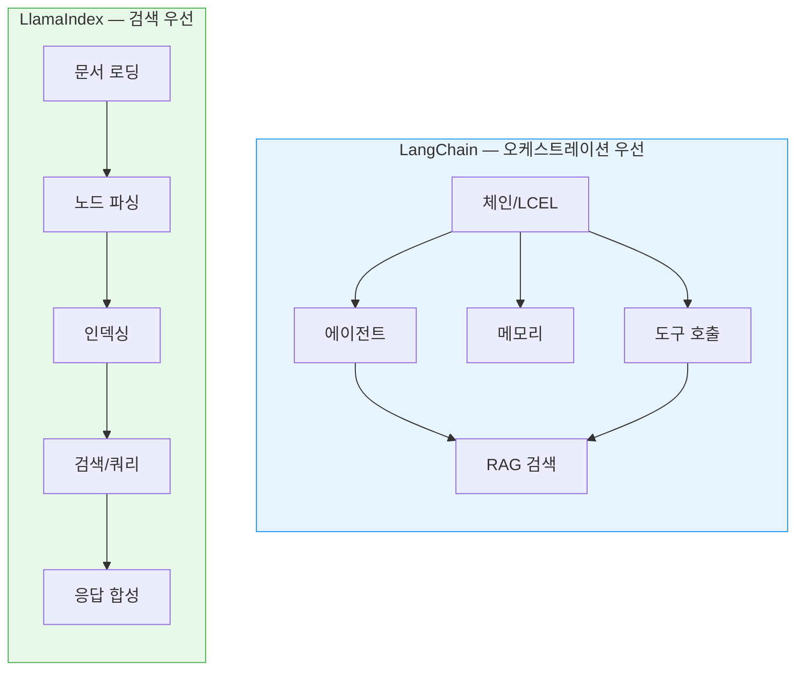
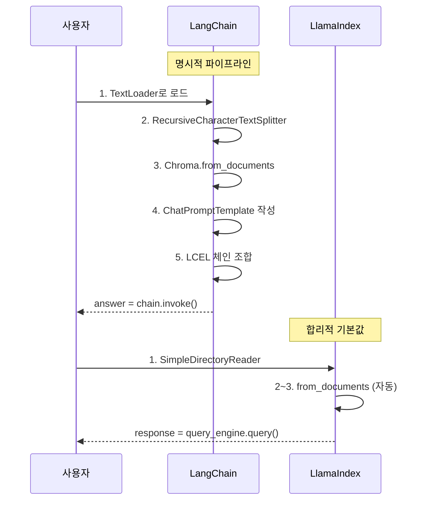
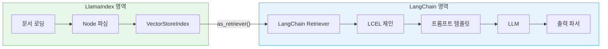
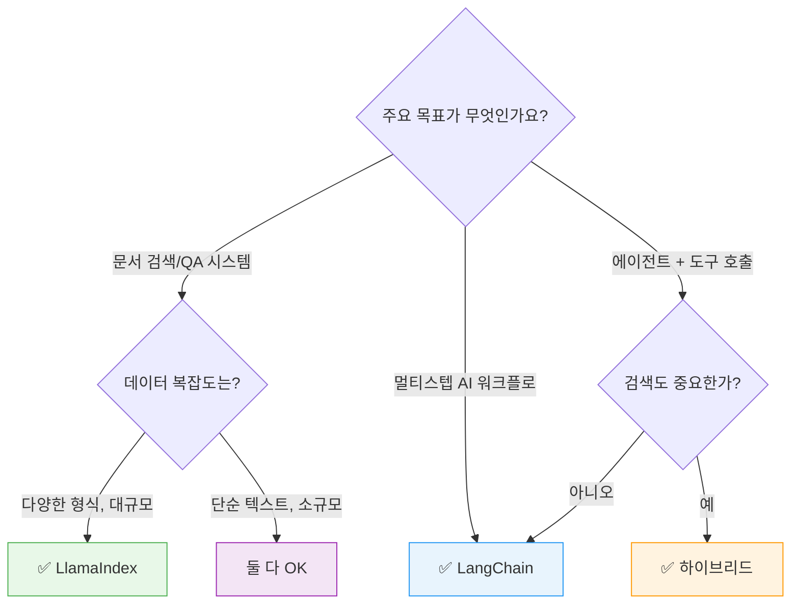

# LangChain vs LlamaIndex — 프레임워크 선택 가이드

> 두 프레임워크의 설계 철학, 코드 구조, 성능을 비교하고, 프로젝트에 맞는 최적의 선택 기준을 제시합니다.

## 개요

이 섹션에서는 지금까지 배운 LangChain(Ch8)과 LlamaIndex(Ch9)를 나란히 놓고 비교합니다. 동일한 RAG 요구사항을 두 프레임워크로 각각 구현해보고, 코드 복잡도·유연성·생태계·성능 차이를 직접 확인합니다. 나아가 두 프레임워크를 **함께 사용하는 하이브리드 패턴**까지 다룹니다.

**선수 지식**: 
- [Ch8: 기본 RAG 파이프라인 구축](08-기본-rag-파이프라인-구축-langchain으로-첫-rag-앱-만들기/01-langchain-v1-핵심-개념과-설정.md)에서 배운 LangChain LCEL 체인, RetrievalQA 패턴
- [Session 9.1](09-llamaindex로-rag-구축-대안-프레임워크-활용/01-llamaindex-핵심-개념-document-node-index.md)~[9.4](09-llamaindex로-rag-구축-대안-프레임워크-활용/04-chatengine-대화형-rag-구현.md)에서 배운 LlamaIndex의 Document/Node/Index, QueryEngine, ChatEngine

**학습 목표**:
- LangChain과 LlamaIndex의 설계 철학 차이를 명확히 이해한다
- 동일 기능을 두 프레임워크로 구현하며 코드 구조 차이를 체감한다
- LlamaIndex 인덱스를 LangChain 체인에 연결하는 하이브리드 패턴을 구현할 수 있다
- 프로젝트 특성에 따른 프레임워크 선택 기준을 세울 수 있다

## 왜 알아야 할까?

"LangChain이 좋아요, 아니면 LlamaIndex가 좋아요?"는 RAG를 시작하는 개발자들이 가장 많이 하는 질문입니다. 사실 이 질문 자체가 잘못된 건데요 — 마치 "망치가 좋아요, 드라이버가 좋아요?"라고 묻는 것과 같기 때문이죠. 도구는 목적에 따라 선택하는 거니까요.

하지만 두 프레임워크의 **차이점을 정확히 모르면** 선택 자체가 불가능합니다. 더 심각한 건, 잘못된 선택으로 프로젝트 중반에 프레임워크를 바꾸게 되면 엄청난 리팩토링 비용이 발생한다는 거예요. 이 세션을 마치면, 앞으로 어떤 RAG 프로젝트를 시작하든 **자신 있게 기술 스택을 결정**할 수 있게 됩니다.

## 핵심 개념

### 개념 1: 설계 철학 — 오케스트라 지휘자 vs 도서관 사서

> 💡 **비유**: LangChain은 **오케스트라 지휘자**입니다. 다양한 악기(LLM, 도구, 메모리, API)를 조율해서 하나의 교향곡을 만들죠. 반면 LlamaIndex는 **도서관 사서**입니다. 수만 권의 책 중에서 당신이 원하는 정보를 정확히 찾아주는 데 특화되어 있어요.

이 비유가 두 프레임워크의 핵심 차이를 꿰뚫습니다:

- **LangChain** = **오케스트레이션 우선(Orchestration-first)**: 체인, 에이전트, 메모리, 도구 호출 등 멀티 스텝 AI 워크플로를 유연하게 조합하는 데 최적화
- **LlamaIndex** = **검색 우선(Retrieval-first)**: 문서 수집(Ingestion), 인덱싱, 쿼리 라우팅 등 데이터 검색 파이프라인에 특화

> 📊 **그림 1**: 두 프레임워크의 설계 철학 비교



[Session 9.1](09-llamaindex로-rag-구축-대안-프레임워크-활용/01-llamaindex-핵심-개념-document-node-index.md)에서 배운 것처럼, LlamaIndex는 Document → Node → Index라는 **데이터 중심 파이프라인**이 뼈대입니다. 반면 [Ch8](08-기본-rag-파이프라인-구축-langchain으로-첫-rag-앱-만들기/01-langchain-v1-핵심-개념과-설정.md)에서 다룬 LangChain은 프롬프트 → LLM → 출력 파서라는 **처리 체인**이 중심이죠.

실무에서 이 차이가 어떻게 나타나는지 볼까요?

```run:python
# 두 프레임워크의 핵심 추상화 비교
comparison = {
    "LangChain": {
        "핵심 단위": "Chain (체인)",
        "데이터 표현": "Document(page_content, metadata)",
        "검색": "Retriever (인터페이스)",
        "응답 생성": "Chain에 내장 / 프롬프트 직접 구성",
        "확장 방향": "에이전트, 도구, 외부 API 연동",
    },
    "LlamaIndex": {
        "핵심 단위": "Index (인덱스)",
        "데이터 표현": "Node(text, metadata, relationships)",
        "검색": "Retriever + QueryEngine (내장)",
        "응답 생성": "ResponseSynthesizer (7가지 모드)",
        "확장 방향": "다양한 인덱스 타입, 데이터 커넥터",
    },
}

for framework, details in comparison.items():
    print(f"\n{'='*40}")
    print(f"  {framework}")
    print(f"{'='*40}")
    for key, value in details.items():
        print(f"  {key}: {value}")
```

```output

========================================
  LangChain
========================================
  핵심 단위: Chain (체인)
  데이터 표현: Document(page_content, metadata)
  검색: Retriever (인터페이스)
  응답 생성: Chain에 내장 / 프롬프트 직접 구성
  확장 방향: 에이전트, 도구, 외부 API 연동

========================================
  LlamaIndex
========================================
  핵심 단위: Index (인덱스)
  데이터 표현: Node(text, metadata, relationships)
  검색: Retriever + QueryEngine (내장)
  응답 생성: ResponseSynthesizer (7가지 모드)
  확장 방향: 다양한 인덱스 타입, 데이터 커넥터
```

### 개념 2: 코드 구조 비교 — 같은 RAG, 다른 코드

> 💡 **비유**: 같은 요리를 주문했는데, 한 식당은 코스 메뉴(LangChain — 각 단계를 직접 구성)로, 다른 식당은 셰프 추천 세트(LlamaIndex — 합리적 기본값이 세팅됨)로 내놓는 셈이에요.

동일한 요구사항 — "문서를 로드하고, 청크로 나누고, 임베딩해서 벡터 DB에 저장한 뒤, 질문에 답하기" — 을 두 프레임워크로 구현해 비교하겠습니다.

**LangChain 방식: 명시적 파이프라인 구성**

```python
# LangChain — 각 단계를 직접 연결
from langchain_community.document_loaders import TextLoader
from langchain.text_splitter import RecursiveCharacterTextSplitter
from langchain_openai import OpenAIEmbeddings, ChatOpenAI
from langchain_community.vectorstores import Chroma
from langchain_core.prompts import ChatPromptTemplate
from langchain_core.runnables import RunnablePassthrough
from langchain_core.output_parsers import StrOutputParser

# 1. 로드
loader = TextLoader("data/guide.txt")
docs = loader.load()

# 2. 분할 — 직접 설정 필요
splitter = RecursiveCharacterTextSplitter(
    chunk_size=512,
    chunk_overlap=50,
)
chunks = splitter.split_documents(docs)

# 3. 임베딩 + 벡터 저장
vectorstore = Chroma.from_documents(chunks, OpenAIEmbeddings())
retriever = vectorstore.as_retriever(search_kwargs={"k": 3})

# 4. 프롬프트 + 체인 — LCEL로 직접 조합
prompt = ChatPromptTemplate.from_template(
    "다음 컨텍스트를 참고하여 질문에 답하세요.\n\n"
    "컨텍스트: {context}\n질문: {question}"
)
llm = ChatOpenAI(model="gpt-4o-mini")

chain = (
    {"context": retriever, "question": RunnablePassthrough()}
    | prompt
    | llm
    | StrOutputParser()
)

# 실행
answer = chain.invoke("RAG의 장점은?")
```

**LlamaIndex 방식: 합리적 기본값 활용**

```python
# LlamaIndex — 최소한의 코드로 동일 결과
from llama_index.core import VectorStoreIndex, SimpleDirectoryReader

# 1~3. 로드 + 분할 + 인덱싱 — 한 줄에 자동 처리
documents = SimpleDirectoryReader("data/").load_data()
index = VectorStoreIndex.from_documents(documents)

# 4. QueryEngine — 기본값으로 바로 질의
query_engine = index.as_query_engine(similarity_top_k=3)
response = query_engine.query("RAG의 장점은?")
print(response)
```

차이가 보이시나요? LangChain은 **16줄**(import 제외)인데, LlamaIndex는 **5줄**이면 끝납니다. 하지만 이것이 LlamaIndex가 "더 좋다"는 뜻은 아닙니다. 

LangChain의 명시적 구성은 **각 단계를 세밀하게 제어**할 수 있다는 뜻이고, LlamaIndex의 간결함은 **합리적 기본값(Sensible Defaults)** 위에 세워졌기 때문이에요. [Session 9.3](09-llamaindex로-rag-구축-대안-프레임워크-활용/03-queryengine과-응답-합성.md)에서 배운 것처럼, LlamaIndex도 저수준 API로 각 컴포넌트를 분리해서 조립할 수 있지만, "빠른 프로토타이핑"에서는 기본값이 큰 힘을 발휘합니다.

> 📊 **그림 2**: 동일 RAG 파이프라인의 코드 흐름 비교



### 개념 3: 생태계와 확장성 비교

두 프레임워크의 생태계는 각각의 설계 철학을 그대로 반영합니다.

| 비교 항목 | LangChain | LlamaIndex |
|-----------|-----------|------------|
| **GitHub 스타** | 100K+ | 40K+ |
| **벡터 DB 연동** | 40개 이상 | 30개 이상 |
| **문서 로더** | 160개 이상 | LlamaHub 통해 수백 개 |
| **LLM 지원** | 거의 모든 LLM | 거의 모든 LLM |
| **에이전트** | LangGraph (강력) | 워크플로 기반 에이전트 |
| **모니터링** | LangSmith (유료) | LlamaTrace / OpenTelemetry |
| **커뮤니티** | 대규모, 자료 풍부 | 성장 중, 문서 품질 우수 |
| **패키지 구조** | langchain-core + 개별 패키지 | llama-index-core + 개별 패키지 |

흥미로운 점은 두 프레임워크 모두 2025년부터 **모놀리식 → 모듈식 패키지 구조**로 전환했다는 것입니다. LangChain은 `langchain-core`, `langchain-openai`, `langchain-community`로, LlamaIndex는 `llama-index-core`, `llama-index-llms-openai` 등으로 분리되었죠.

```run:python
# 패키지 구조 비교
packages = {
    "LangChain 설치 예시": [
        "pip install langchain-core",
        "pip install langchain-openai",
        "pip install langchain-community",
        "pip install langchain-chroma",
    ],
    "LlamaIndex 설치 예시": [
        "pip install llama-index-core",
        "pip install llama-index-llms-openai",
        "pip install llama-index-embeddings-openai",
        "pip install llama-index-vector-stores-chroma",
    ],
}

for framework, pkgs in packages.items():
    print(f"\n[{framework}]")
    for pkg in pkgs:
        print(f"  $ {pkg}")
```

```output

[LangChain 설치 예시]
  $ pip install langchain-core
  $ pip install langchain-openai
  $ pip install langchain-community
  $ pip install langchain-chroma

[LlamaIndex 설치 예시]
  $ pip install llama-index-core
  $ pip install llama-index-llms-openai
  $ pip install llama-index-embeddings-openai
  $ pip install llama-index-vector-stores-chroma
```

> ⚠️ **흔한 오해**: "LangChain이 스타가 많으니까 더 좋은 프레임워크다"라고 생각하기 쉽습니다. 하지만 GitHub 스타 수는 출시 시기, 마케팅, 초기 바이럴 효과에 크게 영향받습니다. LangChain이 먼저 폭발적 성장을 한 만큼 스타가 더 많을 뿐, 프레임워크의 품질이나 적합성과는 별개입니다.

### 개념 4: 하이브리드 패턴 — 두 프레임워크 함께 쓰기

> 💡 **비유**: 꼭 한 브랜드의 가전제품만 써야 하는 건 아니잖아요? 냉장고는 삼성, 세탁기는 LG — 각 제품의 강점을 조합하듯, **LlamaIndex의 강력한 인덱싱 + LangChain의 유연한 오케스트레이션**을 결합할 수 있습니다.

실무에서 가장 많이 쓰이는 하이브리드 패턴은 **LlamaIndex 인덱스를 LangChain Retriever로 변환**하는 것입니다.

> 📊 **그림 3**: 하이브리드 아키텍처 — LlamaIndex 인덱싱 + LangChain 오케스트레이션



핵심은 LlamaIndex의 `index.as_retriever()`가 반환하는 객체를 LangChain의 LCEL 체인에 바로 연결하는 것입니다:

```python
# 하이브리드 패턴: LlamaIndex 인덱싱 + LangChain 체인
from llama_index.core import VectorStoreIndex, SimpleDirectoryReader
from langchain_openai import ChatOpenAI
from langchain_core.prompts import ChatPromptTemplate
from langchain_core.runnables import RunnablePassthrough
from langchain_core.output_parsers import StrOutputParser

# === LlamaIndex 영역: 인덱싱 ===
documents = SimpleDirectoryReader("data/").load_data()
index = VectorStoreIndex.from_documents(documents)

# LlamaIndex Retriever를 LangChain에서 사용
# as_retriever()가 반환하는 객체는 LangChain Retriever 인터페이스와 호환
retriever = index.as_retriever(similarity_top_k=3)

# === LangChain 영역: 오케스트레이션 ===
prompt = ChatPromptTemplate.from_template(
    "당신은 친절한 AI 어시스턴트입니다.\n\n"
    "컨텍스트:\n{context}\n\n"
    "질문: {question}\n"
    "답변:"
)
llm = ChatOpenAI(model="gpt-4o-mini", temperature=0)

# LCEL 체인에 LlamaIndex retriever 연결
rag_chain = (
    {"context": retriever, "question": RunnablePassthrough()}
    | prompt
    | llm
    | StrOutputParser()
)

answer = rag_chain.invoke("RAG 파이프라인의 핵심 구성요소는?")
```

또 다른 패턴은 `LlamaIndexRetriever` 래퍼를 사용하는 방법입니다. 이 클래스는 `langchain-llamaindex` 통합 패키지에서 제공되므로, 먼저 설치가 필요합니다:

```bash
# LangChain-LlamaIndex 통합 패키지 설치
pip install langchain-llamaindex
```

```python
# langchain-llamaindex 통합 패키지에서 임포트
from langchain_llamaindex import LlamaIndexRetriever

# LlamaIndex QueryEngine을 LangChain Retriever로 래핑
llama_retriever = LlamaIndexRetriever(
    index=index,  # LlamaIndex VectorStoreIndex
)

# 이제 LangChain의 어떤 체인에서든 사용 가능
docs = llama_retriever.invoke("검색 쿼리")
```

이 하이브리드 패턴이 언제 유용할까요?

| 시나리오 | 이유 |
|----------|------|
| LlamaIndex로 이미 인덱스를 구축해둔 상태 | 인덱스를 버리지 않고 LangChain 생태계 활용 |
| 복잡한 에이전트 워크플로가 필요한 RAG | LlamaIndex 검색 + LangGraph 에이전트 조합 |
| 기존 LangChain 프로젝트에 더 나은 인덱싱 추가 | LlamaIndex의 IngestionPipeline 활용 |

> 🔥 **실무 팁**: 하이브리드 패턴은 강력하지만, 두 프레임워크의 **의존성 충돌**에 주의하세요. 특히 OpenAI 관련 패키지가 양쪽에서 다른 버전을 요구할 수 있습니다. `pip install` 시 버전 호환성을 먼저 확인하고, 가상환경을 분리하는 것이 안전합니다.

### 개념 5: 프로젝트별 선택 기준

결국 "어떤 프레임워크가 좋은가?"가 아니라 "**내 프로젝트에 어떤 프레임워크가 맞는가?**"가 올바른 질문입니다.

> 📊 **그림 4**: 프레임워크 선택 의사결정 트리



구체적인 선택 가이드를 정리하면:

**LlamaIndex를 선택하세요** — 이럴 때:
- 대규모 문서 기반 QA 시스템 (법률, 의료, 기술 문서)
- 다양한 문서 형식 (PDF, 노션, 슬랙, DB)을 다루는 프로젝트
- 인덱싱 품질과 검색 정확도가 최우선인 경우
- 빠른 프로토타이핑 → 점진적 커스터마이징이 필요한 경우
- 데이터 파이프라인(수집 → 파싱 → 인덱싱)이 복잡한 경우

**LangChain을 선택하세요** — 이럴 때:
- RAG 외에 도구 호출, API 연동, 멀티스텝 추론이 필요한 경우
- 복잡한 에이전트 워크플로 (LangGraph 활용)
- 기존 서비스/시스템과의 통합이 많은 경우
- 팀에 LangChain 경험자가 있는 경우
- 커뮤니티 자료와 레퍼런스가 풍부해야 하는 경우

**하이브리드를 선택하세요** — 이럴 때:
- 강력한 검색 + 복잡한 워크플로 **모두** 필요한 경우
- 이미 한쪽 프레임워크로 구축된 인프라에 다른 쪽 기능을 추가할 때

## 실습: 직접 해보기

동일한 문서 세트에 대해 LangChain과 LlamaIndex로 RAG를 각각 구현하고, 결과를 비교하는 완전한 코드입니다.

```python
"""
LangChain vs LlamaIndex — 동일 데이터로 RAG 비교 실습
필요 패키지:
  pip install langchain-core langchain-openai langchain-chroma
  pip install llama-index-core llama-index-llms-openai llama-index-embeddings-openai
  pip install chromadb
"""

import os
import time
from dotenv import load_dotenv

load_dotenv()  # .env 파일에서 OPENAI_API_KEY 로드

# === 공통: 테스트 문서 준비 ===
SAMPLE_TEXTS = [
    "RAG는 Retrieval-Augmented Generation의 약자로, 검색 증강 생성이라고 번역됩니다. "
    "LLM이 외부 데이터를 참조하여 더 정확한 답변을 생성하도록 돕는 기법입니다.",
    "벡터 데이터베이스는 임베딩 벡터를 효율적으로 저장하고 유사도 검색을 수행합니다. "
    "ChromaDB, FAISS, Pinecone 등이 대표적인 벡터 DB입니다.",
    "청킹(Chunking)은 긴 문서를 작은 텍스트 조각으로 나누는 과정입니다. "
    "고정 크기 청킹, 시멘틱 청킹, 재귀적 분할 등의 전략이 있습니다.",
    "임베딩 모델은 텍스트를 고차원 벡터로 변환합니다. "
    "OpenAI의 text-embedding-3-small, Sentence Transformers 등이 널리 사용됩니다.",
    "LangChain은 LLM 애플리케이션의 오케스트레이션 프레임워크이고, "
    "LlamaIndex는 데이터 인덱싱과 검색에 특화된 프레임워크입니다.",
]

QUERY = "RAG에서 벡터 데이터베이스의 역할은 무엇인가요?"


# ============================================
# 방법 1: LangChain으로 RAG 구현
# ============================================
def rag_with_langchain(texts: list[str], query: str) -> dict:
    """LangChain을 사용한 RAG 파이프라인"""
    from langchain_core.documents import Document
    from langchain.text_splitter import RecursiveCharacterTextSplitter
    from langchain_openai import OpenAIEmbeddings, ChatOpenAI
    from langchain_community.vectorstores import Chroma
    from langchain_core.prompts import ChatPromptTemplate
    from langchain_core.runnables import RunnablePassthrough
    from langchain_core.output_parsers import StrOutputParser

    start = time.time()

    # 문서 생성
    docs = [Document(page_content=t) for t in texts]

    # 텍스트 분할 (직접 설정)
    splitter = RecursiveCharacterTextSplitter(
        chunk_size=200,
        chunk_overlap=20,
    )
    chunks = splitter.split_documents(docs)

    # 벡터 스토어 생성
    vectorstore = Chroma.from_documents(
        chunks,
        OpenAIEmbeddings(model="text-embedding-3-small"),
        collection_name="langchain_demo",
    )
    retriever = vectorstore.as_retriever(search_kwargs={"k": 2})

    # LCEL 체인 구성
    prompt = ChatPromptTemplate.from_template(
        "다음 컨텍스트를 참고하여 질문에 한국어로 답하세요.\n\n"
        "컨텍스트:\n{context}\n\n질문: {question}"
    )
    llm = ChatOpenAI(model="gpt-4o-mini", temperature=0)

    chain = (
        {"context": retriever, "question": RunnablePassthrough()}
        | prompt
        | llm
        | StrOutputParser()
    )

    answer = chain.invoke(query)
    elapsed = time.time() - start

    # 정리
    vectorstore.delete_collection()

    return {"answer": answer, "elapsed": round(elapsed, 2), "chunks": len(chunks)}


# ============================================
# 방법 2: LlamaIndex로 RAG 구현
# ============================================
def rag_with_llamaindex(texts: list[str], query: str) -> dict:
    """LlamaIndex를 사용한 RAG 파이프라인"""
    from llama_index.core import VectorStoreIndex, Document, Settings
    from llama_index.llms.openai import OpenAI
    from llama_index.embeddings.openai import OpenAIEmbedding

    start = time.time()

    # Settings 전역 설정 (LlamaIndex 방식)
    Settings.llm = OpenAI(model="gpt-4o-mini", temperature=0)
    Settings.embed_model = OpenAIEmbedding(model_name="text-embedding-3-small")
    Settings.chunk_size = 200
    Settings.chunk_overlap = 20

    # 문서 → 인덱스 (분할/임베딩 자동)
    documents = [Document(text=t) for t in texts]
    index = VectorStoreIndex.from_documents(documents)

    # QueryEngine으로 질의
    query_engine = index.as_query_engine(similarity_top_k=2)
    response = query_engine.query(query)

    elapsed = time.time() - start

    return {
        "answer": str(response),
        "elapsed": round(elapsed, 2),
        "sources": len(response.source_nodes),
    }


# ============================================
# 비교 실행
# ============================================
if __name__ == "__main__":
    print("=" * 60)
    print("  LangChain vs LlamaIndex — 동일 데이터 RAG 비교")
    print("=" * 60)
    print(f"\n질문: {QUERY}\n")

    # LangChain 실행
    print("[1] LangChain으로 실행 중...")
    lc_result = rag_with_langchain(SAMPLE_TEXTS, QUERY)
    print(f"  답변: {lc_result['answer'][:100]}...")
    print(f"  청크 수: {lc_result['chunks']}개")
    print(f"  소요 시간: {lc_result['elapsed']}초")

    print()

    # LlamaIndex 실행
    print("[2] LlamaIndex로 실행 중...")
    li_result = rag_with_llamaindex(SAMPLE_TEXTS, QUERY)
    print(f"  답변: {li_result['answer'][:100]}...")
    print(f"  소스 노드: {li_result['sources']}개")
    print(f"  소요 시간: {li_result['elapsed']}초")

    print("\n" + "=" * 60)
    print("  비교 결과")
    print("=" * 60)
    print(f"  LangChain 코드 라인 수:  ~40줄 (설정 포함)")
    print(f"  LlamaIndex 코드 라인 수: ~20줄 (설정 포함)")
    print(f"  답변 품질: 두 프레임워크 모두 동일 LLM/임베딩 사용 → 유사")
```

> 💡 **알고 계셨나요?**: 위 실습에서 두 프레임워크가 동일한 LLM과 임베딩 모델을 사용하기 때문에 **답변 품질 자체는 거의 동일**합니다. 프레임워크는 "어떻게 연결하느냐"의 차이이지, 최종 답변을 생성하는 건 결국 LLM이니까요. 차이가 나는 건 코드 복잡도, 커스터마이징 용이성, 그리고 확장성입니다.

## 더 깊이 알아보기

### 두 프레임워크의 탄생 이야기

놀랍게도, LangChain과 LlamaIndex는 같은 시기, 같은 회사에서 탄생했습니다.

**2022년 10월**, Harrison Chase는 ML 스타트업 Robust Intelligence에서 일하며 GPT 모델로 사내 Notion/Slack 데이터를 검색하는 실험을 하고 있었습니다. 그는 개발자들이 LLM 애플리케이션을 만들 때 매번 비슷한 보일러플레이트 코드를 작성하는 것을 보고, **공통 추상화가 필요하다**고 느꼈습니다. 2022년 10월 16~25일, 단 열흘 만에 첫 버전을 만들어 오픈소스로 공개했죠. 첫 커밋은 Python의 `formatter.format`을 감싼 프롬프트 템플릿이었습니다 — 이것이 LangChain의 시작이었습니다.

거의 같은 시기인 **2022년 11월**, 역시 Robust Intelligence에서 ML 연구원으로 일하던 Jerry Liu는 회사 해커톤에서 GPT-3의 4,096 토큰 컨텍스트 윈도우 한계에 부딪혔습니다. 영업 데이터를 GPT에 넣고 싶었지만, 데이터가 너무 컸거든요. 그래서 정보를 **트리 구조로 조직화**하는 "GPT Tree Index"를 만들었습니다. 이것이 바로 LlamaIndex(구 GPT Index)의 시작입니다.

같은 회사에서, 같은 문제(LLM에 외부 데이터를 연결하기)를 마주한 두 사람이 **정반대 방향**에서 접근한 것이 흥미롭습니다. Harrison은 "체인을 유연하게 조합하는 프레임워크"를, Jerry는 "데이터를 효율적으로 인덱싱하는 도구"를 만들었으니까요.

2023년 1월, 두 프로젝트 모두 독립 회사로 분리되었고, 2023년 11월 ChatGPT의 폭발적 성장과 함께 나란히 급성장했습니다. LangChain은 GitHub 스타가 2023년 2월 5K에서 4월 18K로 3배 증가했고, LlamaIndex도 비슷한 속도로 성장했습니다.

### 왜 두 프레임워크가 공존하는가?

두 프레임워크가 경쟁하면서도 공존하는 이유는 **RAG 문제 자체가 두 가지 독립적인 어려움**으로 이루어져 있기 때문입니다:

1. **검색 문제** (어떻게 관련 정보를 정확히 찾을 것인가?) → LlamaIndex의 영역
2. **오케스트레이션 문제** (찾은 정보로 어떻게 복잡한 워크플로를 만들 것인가?) → LangChain의 영역

이는 마치 데이터베이스(PostgreSQL)와 웹 프레임워크(Django)가 공존하는 것과 같습니다. 각각 다른 문제를 풀기 때문이죠.

## 흔한 오해와 팁

> ⚠️ **흔한 오해**: "LlamaIndex는 간단한 프로젝트용이고, LangChain은 복잡한 프로젝트용이다"라는 인식이 있습니다. 이건 반만 맞는 말입니다. LlamaIndex의 고수준 API가 간결해서 그렇게 보이지만, [Session 9.3](09-llamaindex로-rag-구축-대안-프레임워크-활용/03-queryengine과-응답-합성.md)에서 다룬 것처럼 저수준 API(`RetrieverQueryEngine`, `ResponseSynthesizer` 직접 조합)를 사용하면 LangChain 못지않게 세밀한 제어가 가능합니다. "간결하다"와 "단순하다"는 다릅니다.

> 💡 **알고 계셨나요?**: LangChain의 창시자 Harrison Chase와 LlamaIndex의 창시자 Jerry Liu는 같은 회사(Robust Intelligence) 출신입니다. 두 프레임워크가 비슷한 시기에 등장한 건 우연이 아니라, 같은 환경에서 같은 문제를 경험했기 때문이에요. 실제로 두 팀은 초기부터 공식적으로 상호 연동을 지원했습니다.

> 🔥 **실무 팁**: 프레임워크 선택에 너무 고민하지 마세요. 어차피 핵심 로직(임베딩 모델, 벡터 DB, LLM)은 동일합니다. 3~4시간이면 두 프레임워크 모두 프로토타입을 만들 수 있으니, **둘 다 만들어보고 비교**하는 것이 가장 확실한 방법입니다. 특히 팀 내 경험치와 기존 인프라가 선택에 가장 큰 영향을 미치는 요소입니다.

> 🔥 **실무 팁**: 2025년 이후 가장 현실적인 조합은 "**LlamaIndex로 데이터 파이프라인, LangGraph로 에이전트 워크플로**"입니다. LangGraph는 LangChain 생태계의 에이전트 프레임워크로, 상태 기반 그래프 워크플로에 강합니다. [Ch16: 에이전틱 RAG](16-에이전틱-rag-langgraph로-동적-검색-에이전트-구축/01-에이전틱-rag란-왜-에이전트가-필요한가.md)에서 자세히 다룰 예정입니다.

## 핵심 정리

| 개념 | 설명 |
|------|------|
| LangChain 설계 철학 | 오케스트레이션 우선 — 체인, 에이전트, 도구로 멀티스텝 워크플로 구성 |
| LlamaIndex 설계 철학 | 검색 우선 — Document→Node→Index 데이터 파이프라인 특화 |
| 코드 복잡도 차이 | LangChain은 명시적 구성(유연), LlamaIndex는 합리적 기본값(간결) |
| 하이브리드 패턴 | `index.as_retriever()`로 LlamaIndex 인덱스를 LangChain 체인에 연결 |
| `LlamaIndexRetriever` | `langchain-llamaindex` 패키지가 제공하는 래퍼 — QueryEngine을 Retriever로 변환 |
| 선택 기준 (검색 중심) | 문서 QA, 대규모 인덱싱, 빠른 프로토타입 → LlamaIndex |
| 선택 기준 (워크플로 중심) | 에이전트, 도구 호출, 외부 API 연동 → LangChain |
| 선택 기준 (둘 다 필요) | 하이브리드 패턴으로 각 프레임워크의 강점 결합 |

## 다음 섹션 미리보기

이것으로 Ch9 "LlamaIndex로 RAG 구축"을 마무리합니다! Ch8과 Ch9를 통해 두 대표 프레임워크로 RAG를 구축하는 방법을 모두 배웠습니다.

다음 [Ch10: 검색 품질 향상](10-검색-품질-향상-유사도-검색과-메타데이터-필터링/01-유사도-검색-심화-top-k와-임계값-최적화.md)에서는 프레임워크에 관계없이 **검색 자체의 품질을 높이는 방법**에 집중합니다. 유사도 검색(Cosine Similarity, MMR)과 메타데이터 필터링을 활용해서, "관련 있는 문서를 더 정확하게 찾는" 기술을 다루게 됩니다. 어떤 프레임워크를 선택하든 검색 품질이 RAG 성능의 핵심이니까요!

## 참고 자료

- [LlamaIndex RAG 공식 문서](https://developers.llamaindex.ai/python/framework/understanding/rag/) - LlamaIndex의 5단계 RAG 아키텍처와 핵심 컴포넌트 설명
- [LangChain RAG 공식 문서](https://docs.langchain.com/oss/python/langchain/rag) - LangChain의 RAG 체인/에이전트 패턴과 40+ 벡터 스토어 연동 가이드
- [LangChain의 LlamaIndex 연동 문서](https://docs.langchain.com/oss/python/integrations/providers/llama_index) - `LlamaIndexRetriever` 등 하이브리드 패턴 공식 가이드
- [LlamaIndex 탄생 1주년 회고 (Jerry Liu)](https://www.llamaindex.ai/blog/llamaindex-turns-1-f69dcdd45fe3) - GPT Index에서 LlamaIndex로의 여정과 프레임워크 설계 철학
- [LangChain 3주년 회고 (Harrison Chase)](https://blog.langchain.com/three-years-langchain/) - LangChain의 진화와 LCEL, LangGraph로의 확장 이야기
- [IBM — LlamaIndex vs LangChain: What's the difference?](https://www.ibm.com/think/topics/llamaindex-vs-langchain) - 두 프레임워크의 객관적 비교 분석

---
### 🔗 Related Sessions
- [lcel](../08-기본-rag-파이프라인-구축-langchain으로-첫-rag-앱-만들기/01-langchain-v1-핵심-개념과-설정.md) (prerequisite)
- [chatprompttemplate](../08-기본-rag-파이프라인-구축-langchain으로-첫-rag-앱-만들기/01-langchain-v1-핵심-개념과-설정.md) (prerequisite)
- [vectorstoreindex](../09-llamaindex로-rag-구축-대안-프레임워크-활용/01-llamaindex-핵심-개념-document-node-index.md) (prerequisite)
- [runnablepassthrough](../08-기본-rag-파이프라인-구축-langchain으로-첫-rag-앱-만들기/02-lcel-langchain-expression-language-마스터하기.md) (prerequisite)
- [as_retriever](../06-벡터-데이터베이스-기초-chromadb로-시작하기/05-langchain-chromadb-통합-실습.md) (prerequisite)
- [as_query_engine](../09-llamaindex로-rag-구축-대안-프레임워크-활용/02-vectorstoreindex-인덱싱과-검색.md) (prerequisite)
- [retrieverqueryengine](../09-llamaindex로-rag-구축-대안-프레임워크-활용/02-vectorstoreindex-인덱싱과-검색.md) (prerequisite)
- [responsesynthesizer](../09-llamaindex로-rag-구축-대안-프레임워크-활용/02-vectorstoreindex-인덱싱과-검색.md) (prerequisite)
- [simpledirectoryreader](../09-llamaindex로-rag-구축-대안-프레임워크-활용/02-vectorstoreindex-인덱싱과-검색.md) (prerequisite)
