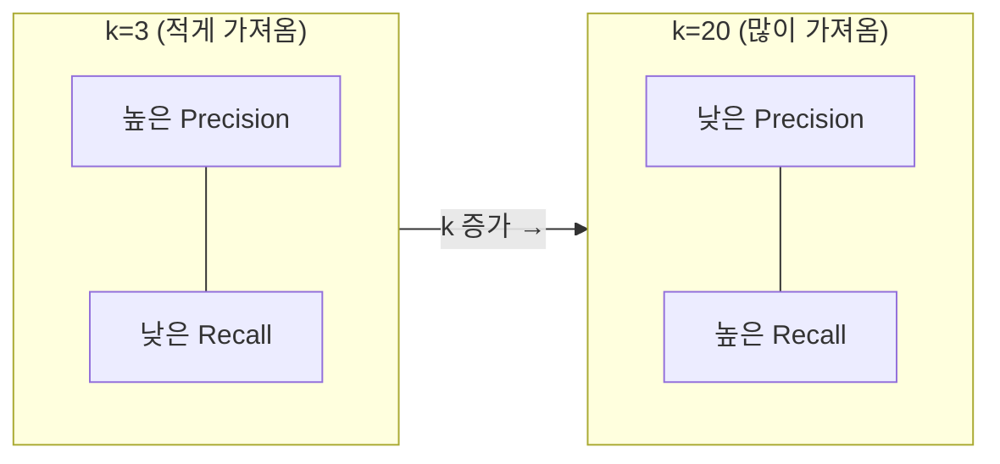
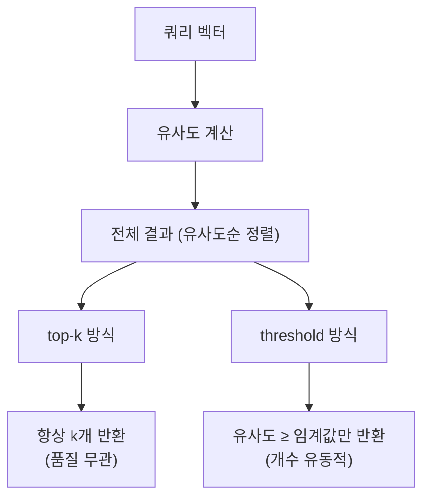
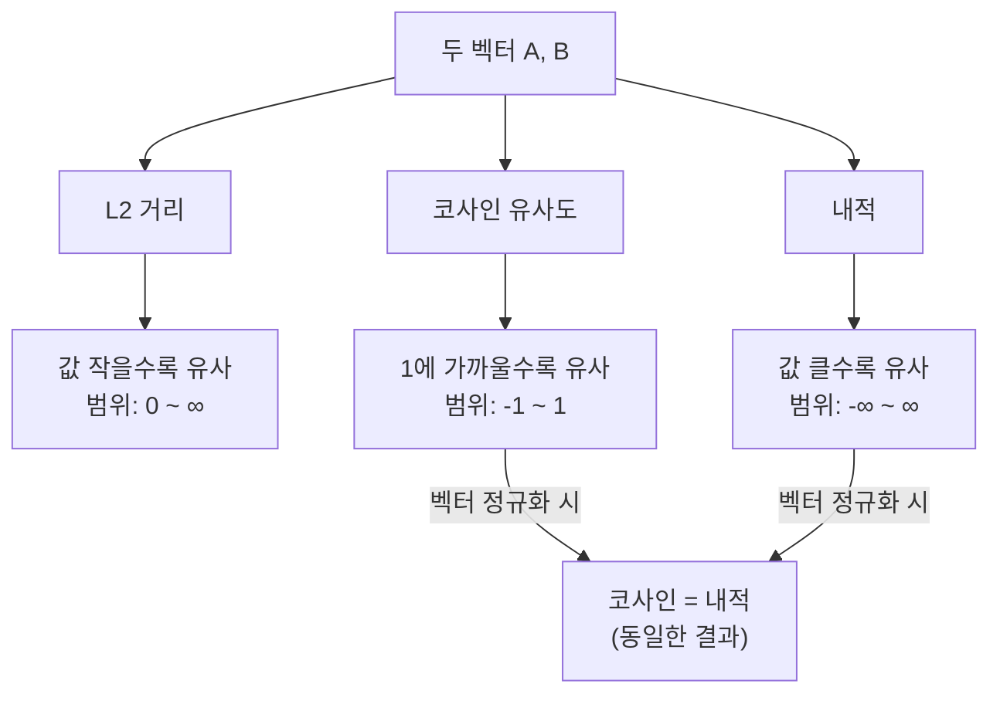
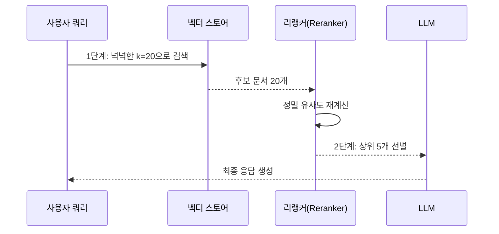

# 유사도 검색 심화 — top-k와 임계값 최적화

> 검색 결과의 양과 질, 두 마리 토끼를 잡는 파라미터 튜닝 전략

## 개요

이 섹션에서는 벡터 검색의 핵심 파라미터인 `top-k`와 유사도 임계값(score threshold)을 깊이 있게 다룹니다. 앞서 Ch6~Ch8에서 기본적인 벡터 검색을 구현해 보았다면, 이제는 **검색 품질을 정밀하게 제어**하는 방법을 배울 차례입니다. 또한 거리 메트릭(L2, 코사인, 내적)이 검색 결과에 미치는 영향을 비교하고, 상황에 맞는 최적의 설정을 찾는 방법론을 실습합니다.

**선수 지식**: Ch6에서 배운 ChromaDB 기본 사용법, Ch8에서 구축한 LangChain 기반 RAG 파이프라인, 임베딩과 벡터 유사도의 기본 개념(Ch5), Precision@k와 Recall@k의 정의(Ch7.4)
**학습 목표**:
- `top-k` 파라미터가 Precision과 Recall에 미치는 영향을 이해하고 설명할 수 있다
- `similarity_score_threshold`를 활용하여 품질 기반 검색을 구현할 수 있다
- L2, 코사인 유사도, 내적(Inner Product) 메트릭의 차이를 이해하고 적절히 선택할 수 있다
- 실제 데이터에서 최적의 k값과 임계값을 결정하는 방법론을 적용할 수 있다

## 왜 알아야 할까?

RAG 시스템에서 검색은 **생성 품질의 상한선**을 결정합니다. 아무리 뛰어난 LLM을 사용하더라도, 검색 단계에서 관련 없는 문서가 섞여 들어오면 할루시네이션(Hallucination)이 발생하고, 정작 필요한 문서가 빠지면 불완전한 답변이 만들어지죠.

실무에서 흔히 겪는 상황을 생각해 볼까요? "고객 문의 챗봇이 엉뚱한 답변을 자꾸 해요"라는 피드백의 원인 중 상당수는 **검색 파라미터 미세 조정 부재**에서 옵니다. `k=4`라는 LangChain 기본값을 그대로 쓰는 것과, 데이터 특성에 맞게 `k`와 임계값을 최적화하는 것은 답변 품질에 극적인 차이를 만들어냅니다.

이 세션에서 배울 파라미터 튜닝은 코드 한두 줄의 변경이지만, RAG 시스템의 전체 성능을 좌우하는 **가장 비용 효율적인 최적화 수단**입니다.

## 핵심 개념

### 개념 1: top-k 파라미터와 Precision-Recall 트레이드오프

> 💡 **비유**: 도서관에서 리포트 자료를 찾는다고 상상해 보세요. 사서에게 "관련 책 3권만 골라주세요"라고 하면 꼭 필요한 핵심 자료를 받겠지만, 놓치는 책이 있을 수 있습니다. 반면 "관련될 만한 책 20권 다 가져다주세요"라고 하면 필요한 책은 거의 다 포함되지만, 그 속에서 진짜 유용한 걸 골라내는 데 시간이 걸리죠. top-k는 바로 이 **"몇 권을 가져올까?"**를 결정하는 파라미터입니다.

`top-k`는 벡터 검색에서 쿼리와 가장 유사한 상위 k개의 문서를 반환하도록 하는 파라미터입니다. LangChain에서는 기본값이 `k=4`인데요, 이 숫자 하나가 [Ch7.4에서 배운 Precision@k와 Recall@k](ch07/session_04.md)에 정반대 방향으로 영향을 미칩니다:

- **k를 줄이면** → 반환 문서가 적어 Precision이 올라가지만, 놓치는 관련 문서가 늘어 Recall이 떨어집니다
- **k를 늘리면** → 관련 문서를 더 많이 잡아내 Recall은 올라가지만, 노이즈 문서도 함께 섞여 Precision이 떨어집니다

이것이 바로 **Precision-Recall 트레이드오프**입니다. Ch7.4에서는 이 메트릭들을 RAG 파이프라인 전체의 벤치마크 도구로 다뤘다면, 여기서는 **k라는 단일 파라미터를 돌려가며 두 메트릭이 어떻게 반응하는지** 관찰하고, 최적의 균형점을 찾는 데 집중합니다.

> 📊 **그림 1**: top-k 값에 따른 Precision-Recall 트레이드오프



```run:python
# top-k에 따른 Precision-Recall 트레이드오프 시뮬레이션
# 전체 100개 문서 중 관련 문서가 10개인 상황을 가정합니다

def simulate_precision_recall(k_values: list[int], total_relevant: int = 10):
    """k값에 따른 Precision@k, Recall@k 변화를 관찰합니다."""
    # 유사도 순으로 정렬된 결과에서 관련 문서가 등장하는 위치 (가정)
    relevant_positions = [1, 2, 4, 6, 8, 12, 15, 22, 35, 50]

    print(f"{'k':>3} | {'Precision':>10} | {'Recall':>8} | 시각화")
    print("-" * 50)

    for k in k_values:
        # 상위 k개 중 관련 문서 수 계산
        retrieved_relevant = sum(1 for pos in relevant_positions if pos <= k)
        precision = retrieved_relevant / k
        recall = retrieved_relevant / total_relevant

        # 막대 그래프로 시각화
        p_bar = "█" * int(precision * 20)
        r_bar = "█" * int(recall * 20)
        print(f"k={k:>2} | P={precision:.2f} {p_bar:<20} | R={recall:.2f} {r_bar}")

k_values = [1, 3, 5, 10, 15, 20, 50]
simulate_precision_recall(k_values)
```

```output
  k |  Precision |   Recall | 시각화
--------------------------------------------------
k= 1 | P=1.00 ████████████████████ | R=0.10 ██
k= 3 | P=0.67 █████████████        | R=0.20 ████
k= 5 | P=0.60 ████████████         | R=0.30 ██████
k=10 | P=0.50 ██████████           | R=0.50 ██████████
k=15 | P=0.40 ████████             | R=0.60 ████████████
k=20 | P=0.35 ███████              | R=0.70 ██████████████
k=50 | P=0.20 ████                 | R=1.00 ████████████████████
```

결과를 보면, `k=1`일 때 Precision은 완벽하지만 Recall은 0.10에 불과합니다. 반면 `k=50`으로 늘리면 관련 문서를 전부 찾아내지만(Recall=1.00), 전체 결과의 80%가 노이즈입니다. **실무에서는 보통 `k=3~10` 범위에서 시작**해서 평가 메트릭을 보며 조정합니다.

핵심은, 벤치마크에서 "우리 시스템의 Recall@5가 0.3이다"라는 **진단**을 했다면, 그 다음 할 일이 바로 여기서 다루는 **파라미터 조정**이라는 겁니다. k를 올려서 Recall을 끌어올릴지, 아니면 k는 유지하되 임베딩 모델이나 청킹 전략을 바꿀지 — 이런 판단의 출발점이 k 튜닝입니다.

> 🔥 **실무 팁**: 프로덕션 RAG 시스템에서 k값을 정할 때의 경험적 가이드라인입니다. 좁은 도메인(사내 FAQ 등)에서는 `k=3~5`로 Precision을 높이고, 넓은 도메인(일반 지식 검색)에서는 `k=10~20`으로 Recall을 확보한 뒤 리랭킹(Reranking)으로 정밀도를 보완하는 2단계 전략이 효과적입니다.

### 개념 2: similarity_score_threshold — 품질 기반 필터링

> 💡 **비유**: top-k가 "상위 몇 개를 가져와"라는 **수량 기반** 지시라면, similarity_score_threshold는 "이 정도 수준은 되는 것만 가져와"라는 **품질 기반** 지시입니다. 시험에 비유하면, top-k는 "상위 5명을 뽑아라"이고, 임계값은 "80점 이상만 합격"인 셈이죠. 합격 커트라인을 쓰면, 지원자가 많든 적든 일정 수준이 보장됩니다.

> 📊 **그림 2**: top-k vs similarity_score_threshold 비교



LangChain에서는 `search_type="similarity_score_threshold"`를 지정하면, 유사도 점수가 특정 임계값 이상인 문서만 반환합니다. 이 방식의 장점은 **검색 결과의 수가 쿼리마다 유동적**이라는 점입니다. 관련 문서가 많으면 많이 반환하고, 관련 문서가 거의 없으면 적게(혹은 0개) 반환하죠.

```python
from langchain_chroma import Chroma
from langchain_openai import OpenAIEmbeddings

# 벡터 스토어 생성 (Ch6, Ch8에서 다룬 내용)
vectorstore = Chroma(
    collection_name="my_docs",
    embedding_function=OpenAIEmbeddings()
)

# 방법 1: 기본 top-k 검색 (수량 기반)
retriever_topk = vectorstore.as_retriever(
    search_type="similarity",        # 기본값
    search_kwargs={"k": 5}            # 상위 5개 반환
)

# 방법 2: 유사도 임계값 검색 (품질 기반)
retriever_threshold = vectorstore.as_retriever(
    search_type="similarity_score_threshold",
    search_kwargs={
        "score_threshold": 0.7        # 유사도 0.7 이상만 반환
    }
)

# 방법 3: top-k + 임계값 조합 (실무에서 가장 많이 쓰는 패턴)
retriever_combined = vectorstore.as_retriever(
    search_type="similarity_score_threshold",
    search_kwargs={
        "score_threshold": 0.6,       # 최소 품질 보장
        "k": 10                        # 최대 반환 수 제한
    }
)
```

임계값을 설정할 때 주의할 점이 있습니다. **유사도 점수의 범위와 의미는 거리 메트릭에 따라 완전히 달라집니다.** 코사인 유사도에서 0.7은 꽤 높은 관련성을 의미하지만, L2 거리에서는 점수 해석 방식 자체가 다르거든요. 이 차이를 이해하려면 다음 개념으로 넘어가야 합니다.

> ⚠️ **흔한 오해**: `similarity_score_threshold`를 설정하면 "관련 없는 문서가 절대 나오지 않는다"고 생각하기 쉽습니다. 하지만 임계값은 **벡터 공간에서의 거리**를 기준으로 필터링하는 것이지, 실제 의미적 관련성을 100% 보장하는 건 아닙니다. 임베딩 모델의 한계로 유사도가 높지만 실제로는 관련 없는 문서가 포함될 수 있고(false positive), 관련 있지만 유사도가 낮은 문서가 빠질 수도 있습니다(false negative).

### 개념 3: 거리 메트릭 비교 — L2, 코사인, 내적

> 💡 **비유**: 두 사람이 얼마나 비슷한지를 측정하는 방법이 여러 가지인 것과 같습니다. **키 차이로 비교**(L2 — 절대적 거리)할 수도 있고, **취향이 얼마나 같은 방향인지**(코사인 — 방향 유사도)로 비교할 수도 있고, **공통 관심사가 얼마나 강한지**(내적 — 방향 + 크기 결합)로 비교할 수도 있죠.

벡터 검색에서 사용하는 세 가지 주요 거리 메트릭을 비교해 보겠습니다:

| 메트릭 | 수식 | 범위 | 낮을수록? | 대표 사용처 |
|--------|------|------|-----------|-------------|
| **L2 (유클리드 거리)** | $d = \sqrt{\sum(a_i - b_i)^2}$ | $[0, \infty)$ | 더 유사 | ChromaDB 기본값 |
| **코사인 유사도** | $\cos\theta = \frac{A \cdot B}{\|A\| \|B\|}$ | $[-1, 1]$ | 1에 가까울수록 유사 | 텍스트 임베딩 |
| **내적 (Inner Product)** | $IP = \sum a_i \cdot b_i$ | $(-\infty, \infty)$ | 클수록 유사 | 추천 시스템 |

여기서 중요한 관계가 하나 있습니다. **벡터를 정규화(단위 벡터로 변환)하면, 코사인 유사도와 내적은 동일한 결과를 냅니다.** FAISS에서는 코사인 유사도를 직접 지원하지 않는데, 그 대신 벡터를 정규화한 뒤 내적(IndexFlatIP)으로 검색하면 코사인 유사도와 같은 효과를 얻을 수 있습니다.

> 📊 **그림 3**: 거리 메트릭별 유사도 해석 방식



```run:python
import numpy as np

# 3개의 예시 벡터
query = np.array([1.0, 2.0, 3.0])
doc_a = np.array([1.0, 2.0, 2.8])    # 쿼리와 매우 유사
doc_b = np.array([3.0, 1.0, 0.5])    # 쿼리와 방향이 다름

def l2_distance(a, b):
    """유클리드(L2) 거리 — 작을수록 유사"""
    return np.sqrt(np.sum((a - b) ** 2))

def cosine_similarity(a, b):
    """코사인 유사도 — 1에 가까울수록 유사"""
    return np.dot(a, b) / (np.linalg.norm(a) * np.linalg.norm(b))

def inner_product(a, b):
    """내적 — 클수록 유사 (정규화 시 코사인과 동일)"""
    return np.dot(a, b)

# 원본 벡터로 비교
print("=== 원본 벡터 ===")
print(f"doc_a  L2: {l2_distance(query, doc_a):.4f}, 코사인: {cosine_similarity(query, doc_a):.4f}, 내적: {inner_product(query, doc_a):.4f}")
print(f"doc_b  L2: {l2_distance(query, doc_b):.4f}, 코사인: {cosine_similarity(query, doc_b):.4f}, 내적: {inner_product(query, doc_b):.4f}")

# 정규화 후 비교
query_n = query / np.linalg.norm(query)
doc_a_n = doc_a / np.linalg.norm(doc_a)
doc_b_n = doc_b / np.linalg.norm(doc_b)

print("\n=== 정규화 후 ===")
print(f"doc_a  코사인: {cosine_similarity(query_n, doc_a_n):.4f}, 내적: {inner_product(query_n, doc_a_n):.4f}")
print(f"doc_b  코사인: {cosine_similarity(query_n, doc_b_n):.4f}, 내적: {inner_product(query_n, doc_b_n):.4f}")
print("\n→ 정규화 후 코사인 유사도와 내적이 동일해집니다!")
```

```output
=== 원본 벡터 ===
doc_a  L2: 0.2000, 코사인: 0.9997, 내적: 13.4000
doc_b  L2: 3.5000, 코사인: 0.5765, 내적: 6.5000

=== 정규화 후 ===
doc_a  코사인: 0.9997, 내적: 0.9997
doc_b  코사인: 0.5765, 내적: 0.5765

→ 정규화 후 코사인 유사도와 내적이 동일해집니다!
```

그렇다면 **어떤 메트릭을 골라야 할까요?** 텍스트 임베딩에서는 거의 대부분 **코사인 유사도**가 가장 적합합니다. 텍스트의 의미적 유사성은 벡터의 **방향**(어떤 주제인가)이 중요하지, **크기**(문서 길이 등의 영향)가 중요한 게 아니기 때문입니다.

그런데 ChromaDB의 기본 거리 메트릭은 L2입니다. 이건 의외인데요, 텍스트 임베딩에서는 코사인 유사도가 더 적합한 경우가 많기 때문에, **컬렉션 생성 시 명시적으로 코사인을 지정**하는 것이 좋습니다:

```python
import chromadb

client = chromadb.Client()

# ChromaDB에서 코사인 유사도를 사용하도록 설정
collection = client.create_collection(
    name="my_collection",
    metadata={"hnsw:space": "cosine"}  # 기본값 "l2" 대신 "cosine" 지정
)
```

### 개념 4: 최적 k값 결정 방법론

실무에서 k값을 결정하는 데는 몇 가지 체계적인 방법이 있습니다:

**1. 평가 데이터셋 기반 최적화**

소규모 평가 데이터셋(쿼리-정답 문서 쌍)을 만들고, 다양한 k값에 대해 [Ch7.4에서 배운 평가 메트릭](ch07/session_04.md)을 측정하여 최적점을 찾습니다. 여기서 핵심은 단순히 "Recall이 높은 k"를 고르는 게 아니라, **LLM 컨텍스트 비용과 응답 품질 사이의 균형**을 함께 고려하는 것입니다.

**2. 유사도 점수 분포 분석**

실제 쿼리에 대한 유사도 점수 분포를 시각화하면, 관련 문서와 비관련 문서 사이에 **자연스러운 경계**가 보이는 경우가 많습니다. 이 경계가 임계값 설정의 힌트가 됩니다.

**3. 2단계 검색 전략 (Retrieve → Rerank)**

실무에서 가장 많이 쓰이는 패턴입니다. 첫 단계에서 넉넉한 k(예: 20~50)로 후보군을 가져오고, 두 번째 단계에서 리랭커(Reranker)로 상위 3~5개를 추려내는 방식이죠. 이 전략은 Ch12에서 자세히 다룹니다.

> 📊 **그림 4**: 2단계 검색 전략 (Retrieve → Rerank) 흐름



```python
# 2단계 검색의 1단계: 넉넉한 k로 후보군 확보
retriever = vectorstore.as_retriever(
    search_type="similarity",
    search_kwargs={
        "k": 20  # 리랭킹을 위해 넉넉하게 가져옴
    }
)

# 2단계: 리랭커로 정밀 선별 (Ch12에서 상세 구현)
# reranker = CohereRerank(top_n=5)
# final_docs = reranker.compress_documents(candidates, query)
```

## 실습: 직접 해보기

다양한 검색 전략을 직접 비교해 보겠습니다. ChromaDB에 샘플 문서를 넣고, `top-k`, `similarity_score_threshold`, 거리 메트릭을 바꿔가며 결과 차이를 확인합니다.

```python
# 필요한 패키지 설치
# pip install langchain langchain-chroma langchain-openai chromadb

import os
from dotenv import load_dotenv
from langchain_chroma import Chroma
from langchain_openai import OpenAIEmbeddings
from langchain_core.documents import Document

load_dotenv()  # .env에서 OPENAI_API_KEY 로드

# --- 1단계: 샘플 문서 준비 ---
documents = [
    Document(page_content="RAG는 검색 증강 생성의 약자로, 외부 지식을 활용하여 LLM의 응답을 향상시킵니다.",
             metadata={"topic": "rag", "difficulty": "beginner"}),
    Document(page_content="벡터 데이터베이스는 고차원 벡터를 효율적으로 저장하고 검색하는 데 특화된 데이터베이스입니다.",
             metadata={"topic": "vector_db", "difficulty": "beginner"}),
    Document(page_content="코사인 유사도는 두 벡터 사이의 각도를 기반으로 유사성을 측정하며, 텍스트 검색에 널리 사용됩니다.",
             metadata={"topic": "similarity", "difficulty": "intermediate"}),
    Document(page_content="FAISS는 Meta AI가 개발한 오픈소스 벡터 검색 라이브러리로, 수십억 개의 벡터도 빠르게 검색할 수 있습니다.",
             metadata={"topic": "vector_db", "difficulty": "intermediate"}),
    Document(page_content="프롬프트 엔지니어링은 LLM에 효과적인 지시를 작성하는 기법으로, RAG와는 다른 접근법입니다.",
             metadata={"topic": "prompt", "difficulty": "beginner"}),
    Document(page_content="임베딩 모델은 텍스트를 고차원 벡터로 변환하며, 의미적으로 유사한 텍스트는 가까운 벡터로 매핑됩니다.",
             metadata={"topic": "embedding", "difficulty": "intermediate"}),
    Document(page_content="청킹은 긴 문서를 작은 단위로 나누는 과정으로, 검색 품질에 큰 영향을 미칩니다.",
             metadata={"topic": "chunking", "difficulty": "beginner"}),
    Document(page_content="BM25는 키워드 빈도를 기반으로 문서를 검색하는 전통적 알고리즘으로, 벡터 검색과 결합하면 효과적입니다.",
             metadata={"topic": "search", "difficulty": "intermediate"}),
]

# --- 2단계: ChromaDB에 코사인 유사도로 벡터 스토어 생성 ---
embeddings = OpenAIEmbeddings(model="text-embedding-3-small")

vectorstore = Chroma.from_documents(
    documents=documents,
    embedding=embeddings,
    collection_metadata={"hnsw:space": "cosine"}  # 코사인 유사도 사용
)

query = "벡터 검색에서 유사도는 어떻게 측정하나요?"

# --- 3단계: 다양한 검색 전략 비교 ---

# 전략 A: top-k=3 (적은 수 — 높은 Precision 기대)
print("=== 전략 A: top-k=3 ===")
results_a = vectorstore.similarity_search_with_score(query, k=3)
for doc, score in results_a:
    print(f"  [{score:.4f}] {doc.page_content[:50]}...")

# 전략 B: top-k=6 (많은 수 — 높은 Recall 기대)
print("\n=== 전략 B: top-k=6 ===")
results_b = vectorstore.similarity_search_with_score(query, k=6)
for doc, score in results_b:
    print(f"  [{score:.4f}] {doc.page_content[:50]}...")

# 전략 C: 유사도 임계값 검색
print("\n=== 전략 C: similarity_score_threshold=0.4 ===")
retriever_c = vectorstore.as_retriever(
    search_type="similarity_score_threshold",
    search_kwargs={"score_threshold": 0.4}
)
results_c = retriever_c.invoke(query)
for doc in results_c:
    print(f"  {doc.page_content[:50]}...")
print(f"  → 반환된 문서 수: {len(results_c)}개 (임계값 기반이라 유동적)")

# 전략 D: 점수 분포 분석
print("\n=== 점수 분포 분석 (전체 문서) ===")
all_results = vectorstore.similarity_search_with_score(query, k=len(documents))
for i, (doc, score) in enumerate(all_results, 1):
    bar = "█" * int(score * 40)  # 간단한 막대 그래프
    print(f"  {i}. [{score:.4f}] {bar} | {doc.page_content[:40]}...")

# 정리
vectorstore.delete_collection()
```

이 실습에서 **점수 분포 분석**에 주목하세요. 전체 문서의 유사도 점수를 한눈에 보면, 어디에 자연스러운 "끊김"이 있는지 파악할 수 있습니다. 이 끊김 지점이 임계값 후보가 되고, 그 위의 문서 수가 적정 k값의 힌트가 됩니다.

## 더 깊이 알아보기

### 벡터 검색의 탄생 — FAISS 이야기

벡터 유사도 검색의 역사는 2017년 Meta(당시 Facebook) AI Research에서 공개한 **FAISS(Facebook AI Similarity Search)**로 큰 전환점을 맞이합니다. FAISS 이전에도 벡터 검색 라이브러리는 존재했지만, 수십억 개의 벡터를 단일 서버에서 밀리초 단위로 검색하는 것은 불가능에 가까웠습니다.

FAISS를 만든 핵심 인물은 **Hervé Jégou**와 **Matthijs Douze**인데, 이들은 원래 이미지 검색을 연구하던 컴퓨터 비전 연구자였습니다. 구글에서 이미지를 검색할 때, 수십억 장의 이미지 각각과 쿼리 이미지의 유사도를 일일이 비교하는 건 현실적이지 않죠. 이 문제를 GPU 가속과 양자화(Quantization) 기법으로 해결한 것이 FAISS의 핵심 기여입니다.

흥미로운 점은, FAISS가 처음부터 **정확한 검색(exact search)**과 **근사 검색(approximate search)** 두 가지를 모두 지원하도록 설계되었다는 것입니다. `IndexFlatL2`와 `IndexFlatIP`는 모든 벡터를 전수 비교하는 정확한 검색이고, `IndexIVFFlat`, `IndexHNSW` 등은 약간의 정확도를 희생하고 속도를 극적으로 높이는 근사 검색입니다. 이 트레이드오프 — **정확도 vs 속도** — 는 top-k의 **Precision vs Recall 트레이드오프**와 묘하게 닮아 있죠.

### 코사인 유사도의 기원

코사인 유사도가 정보 검색(Information Retrieval) 분야에서 표준이 된 것은 1960~70년대 **Gerard Salton**의 연구까지 거슬러 올라갑니다. Salton은 코넬대학교에서 SMART 정보 검색 시스템을 개발하면서, 문서를 벡터 공간에 표현하는 **벡터 공간 모델(Vector Space Model)**을 제안했습니다. 이 모델에서 문서와 쿼리의 유사도를 측정하는 가장 자연스러운 방법이 바로 코사인 유사도였죠.

왜 유클리드 거리가 아니라 코사인이었을까요? 그 이유는 문서의 **길이 정규화** 때문입니다. 같은 주제를 다루는 긴 문서와 짧은 문서는, TF-IDF 벡터의 크기(magnitude)는 크게 다르지만 방향(direction)은 비슷합니다. 코사인 유사도는 벡터의 크기를 무시하고 방향만 비교하기 때문에, 문서 길이에 영향받지 않는 공정한 비교가 가능했던 겁니다.

> 💡 **알고 계셨나요?**: Gerard Salton은 "정보 검색의 아버지"로 불리며, 그의 이름을 딴 **Salton Award**는 정보 검색 분야 최고 권위의 상입니다. 오늘날 RAG 시스템의 검색 단계는 50년 전 Salton이 놓은 이론적 기반 위에 서 있는 셈입니다.

## 흔한 오해와 팁

> ⚠️ **흔한 오해**: "k값은 크면 클수록 좋다"고 생각하기 쉽습니다. 하지만 k를 지나치게 키우면 세 가지 문제가 생깁니다. 첫째, 관련 없는 문서가 LLM 컨텍스트에 섞여 **할루시네이션을 유발**합니다. 둘째, 컨텍스트 윈도우를 불필요하게 차지해 **비용이 증가**합니다. 셋째, LLM이 긴 컨텍스트 중간에 있는 정보를 잘 활용하지 못하는 **"Lost in the Middle" 현상**이 발생할 수 있습니다.

> 💡 **알고 계셨나요?**: LangChain의 `similarity_search_with_score()` 메서드가 반환하는 점수는 벡터 스토어 구현마다 의미가 다릅니다. ChromaDB는 **거리(distance)**를 반환하므로 값이 작을수록 유사하고, 일부 구현은 **유사도(similarity)**를 반환하므로 값이 클수록 유사합니다. 점수를 비교하기 전에 반드시 사용 중인 벡터 스토어의 점수 체계를 확인하세요.

> 🔥 **실무 팁**: 최적 파라미터를 빠르게 찾으려면, 먼저 20~30개의 대표 쿼리와 기대 정답 문서 쌍으로 **미니 평가 세트**를 만드세요. 그리고 k를 [3, 5, 10, 15, 20], 임계값을 [0.3, 0.5, 0.7] 등으로 그리드 서치하여 [Ch7.4의 평가 메트릭](ch07/session_04.md)으로 비교하면 됩니다. 이 과정은 한 번만 해두면 같은 도메인에서 재사용할 수 있습니다.

## 핵심 정리

| 개념 | 설명 |
|------|------|
| **top-k** | 쿼리와 가장 유사한 상위 k개 문서를 반환. LangChain 기본값 k=4 |
| **Precision-Recall 트레이드오프** | k↓ → Precision↑ Recall↓, k↑ → Recall↑ Precision↓. 도메인에 맞는 균형점 찾기가 핵심 |
| **similarity_score_threshold** | 유사도 점수 기준으로 문서를 필터링. 반환 수가 유동적 |
| **L2 (유클리드) 거리** | 벡터 간 절대적 거리. ChromaDB 기본값. 값이 작을수록 유사 |
| **코사인 유사도** | 벡터 간 방향 유사도. 텍스트 임베딩에 가장 적합. 1에 가까울수록 유사 |
| **내적 (Inner Product)** | 방향 + 크기. 정규화 시 코사인 유사도와 동일 |
| **2단계 검색 전략** | 넉넉한 k로 후보 확보 → 리랭커로 정밀 선별 |

## 다음 섹션 미리보기

top-k와 임계값으로 검색 결과의 "양"을 조절하는 법을 배웠다면, 다음 세션에서는 검색 결과의 **"다양성"**을 확보하는 방법을 다룹니다. **MMR(Maximal Marginal Relevance)**은 유사도가 높은 문서만 모으면 중복된 내용이 많아지는 문제를 해결하는 알고리즘입니다. "관련성은 높되, 서로 겹치지 않는" 검색 결과를 만드는 방법을 알아보겠습니다.

## 참고 자료

- [FAISS — MetricType and Distances (공식 Wiki)](https://github.com/facebookresearch/faiss/wiki/MetricType-and-distances) - FAISS에서 지원하는 거리 메트릭의 수학적 정의와 사용법을 상세히 설명합니다
- [LangChain: How to Use a Vectorstore as a Retriever](https://python.langchain.com/docs/how_to/vectorstore_retriever/) - `as_retriever()`의 `search_type`, `search_kwargs` 파라미터 사용법 공식 가이드
- [ChromaDB — Configure Collections (거리 함수 설정)](https://docs.trychroma.com/docs/collections/configure) - ChromaDB에서 L2, 코사인, 내적 메트릭을 설정하는 방법
- [The Faiss Library (arXiv 2024)](https://arxiv.org/html/2401.08281v4) - FAISS 라이브러리의 설계 철학과 벡터 인덱싱 기법에 대한 포괄적인 기술 논문
- [Pinecone FAISS Tutorial — Introduction to Facebook AI Similarity Search](https://www.pinecone.io/learn/series/faiss/faiss-tutorial/) - FAISS의 인덱스 유형과 검색 방식을 단계별로 설명하는 실습 튜토리얼