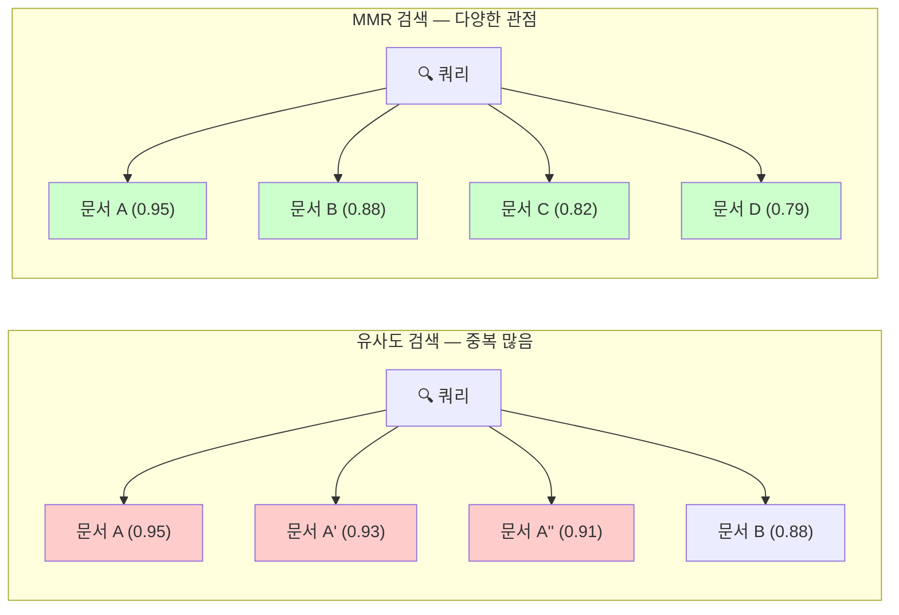
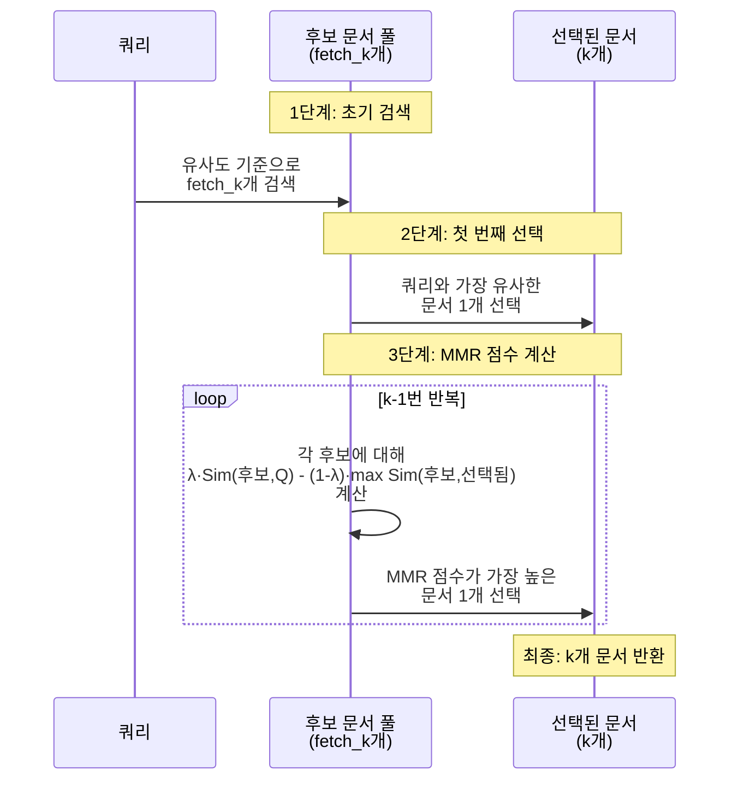
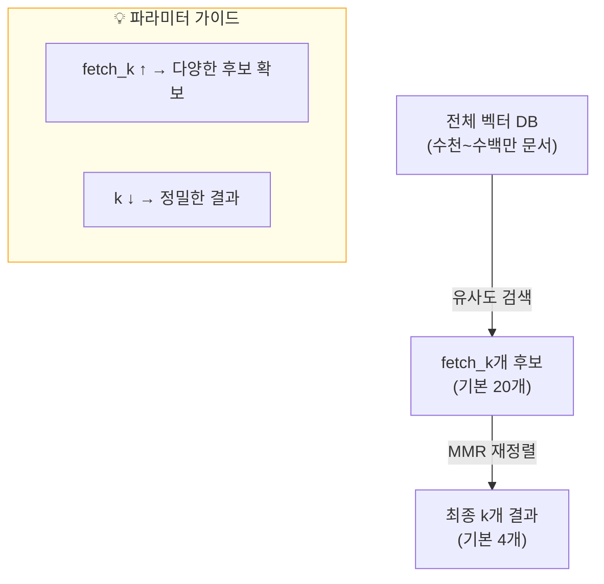

# MMR — 관련성과 다양성의 균형

> 검색 결과에서 중복을 제거하고, 관련성과 다양성을 동시에 확보하는 MMR 알고리즘을 마스터합니다.

## 개요

이 섹션에서는 RAG 검색 품질을 한 단계 끌어올리는 핵심 기법인 **MMR(Maximal Marginal Relevance)** 알고리즘을 학습합니다. 단순 유사도 검색이 빠지기 쉬운 "중복 결과 함정"을 이해하고, MMR이 이를 어떻게 해결하는지 수식과 코드로 직접 확인합니다.

**선수 지식**: [10.1 유사도 검색 심화](10-검색-품질-향상-유사도-검색과-메타데이터-필터링/01-유사도-검색-심화-top-k와-임계값-최적화.md)에서 배운 top-k, similarity_score_threshold, 거리 메트릭 개념
**학습 목표**:
- MMR 알고리즘의 수학적 원리와 작동 방식을 설명할 수 있다
- `lambda_mult` 파라미터가 검색 결과에 미치는 영향을 이해하고 튜닝할 수 있다
- 일반 유사도 검색과 MMR 검색의 결과를 비교하고 적절한 전략을 선택할 수 있다
- LangChain에서 MMR 기반 retriever를 구현할 수 있다

## 왜 알아야 할까?

앞서 [10.1 유사도 검색 심화](10-검색-품질-향상-유사도-검색과-메타데이터-필터링/01-유사도-검색-심화-top-k와-임계값-최적화.md)에서 top-k와 임계값으로 검색 결과의 양을 조절하는 방법을 배웠죠. 하지만 한 가지 중요한 문제가 남아 있습니다 — **검색 결과가 너무 비슷비슷하다면 어떻게 할까요?**

예를 들어, "파이썬으로 웹 크롤링하는 방법"을 검색했다고 해봅시다. top-5 결과가 모두 `requests` 라이브러리의 기본 사용법만 설명한다면, `BeautifulSoup`이나 `Selenium` 같은 다른 접근법은 완전히 빠지게 됩니다. 사용자에게는 5개의 결과가 마치 1개처럼 느껴지는 거죠.

RAG에서 이 문제는 더 심각합니다. LLM의 컨텍스트 윈도우는 제한되어 있기 때문에, 중복된 정보로 귀중한 공간을 낭비하면 답변의 **커버리지(coverage)**가 떨어집니다. 같은 내용을 세 번 읽는 것보다, 서로 다른 관점의 정보 세 개를 읽는 것이 훨씬 나은 답변을 만들어내겠죠?

바로 이 문제를 해결하기 위해 등장한 것이 **MMR(Maximal Marginal Relevance)**입니다.

## 핵심 개념

### 개념 1: 중복 결과 문제 — 왜 유사도 검색만으로는 부족한가

> 💡 **비유**: 뷔페에서 음식을 고른다고 상상해보세요. "가장 맛있는 순서"로만 접시를 채우면, 볶음밥 3종류에 탕수육 2종류처럼 비슷한 음식만 잔뜩 담게 됩니다. 진짜 좋은 식사는 밥, 국, 반찬, 디저트가 골고루 있는 거잖아요?

유사도 기반 검색(similarity search)은 쿼리와의 **개별 유사도 점수**만 보고 문서를 선택합니다. 문서 간의 관계는 전혀 고려하지 않죠. 이 때문에 벡터 공간에서 비슷한 위치에 모여 있는 문서들이 한꺼번에 선택되는 **클러스터링 편향(clustering bias)** 문제가 발생합니다.

> 📊 **그림 1**: 유사도 검색 vs MMR 검색의 결과 분포 비교



위 그림에서 유사도 검색은 점수가 높은 순서대로 가져오기 때문에, 0.95, 0.93, 0.91인 문서 A 계열이 모두 선택됩니다(붉은색 — 거의 같은 내용). 반면 MMR은 문서 A를 선택한 뒤, A와 비슷한 A', A'' 대신 새로운 정보를 담고 있는 B, C, D를 선택합니다(녹색 — 서로 다른 정보).

### 개념 2: MMR 알고리즘의 원리

> 💡 **비유**: 농구팀을 구성한다고 생각해보세요. 슈팅 능력(관련성)만 보고 뽑으면 5명 다 슈터가 됩니다. 좋은 팀은 슈터도 필요하지만, 센터도 필요하고, 가드도 필요하죠. MMR은 "실력이 좋으면서도(관련성) 기존 팀원과 역할이 겹치지 않는(다양성)" 선수를 찾는 알고리즘입니다.

MMR은 1998년 Jaime Carbonell과 Jade Goldstein이 카네기멜론 대학교(CMU)에서 발표한 알고리즘입니다. 이름을 풀어보면 **"최대 한계 관련성(Maximal Marginal Relevance)"**인데요, 여기서 **한계(marginal)**라는 단어가 핵심입니다. 경제학에서 "한계 효용"이 "하나 더 소비했을 때 추가로 얻는 만족"을 뜻하듯이, 한계 관련성(Marginal Relevance)은 **"이미 선택된 문서들이 있는 상태에서, 이 문서를 하나 더 추가했을 때 얻는 추가적인 관련성"**을 의미합니다. 즉, 이미 뽑힌 문서와 내용이 겹치면 한계 관련성이 낮고, 새로운 정보를 담고 있으면 높아지는 거죠.

수식은 다음과 같습니다:

$$MMR = \arg\max_{D_i \in R \setminus S} \left[ \lambda \cdot Sim_1(D_i, Q) - (1 - \lambda) \cdot \max_{D_j \in S} Sim_2(D_i, D_j) \right]$$

각 기호의 의미:
- $Q$: 사용자 쿼리
- $R$: 초기 검색된 전체 문서 집합 (fetch_k개)
- $S$: 이미 선택된 문서 집합
- $D_i$: 아직 선택되지 않은 후보 문서
- $Sim_1(D_i, Q)$: 후보 문서와 쿼리 간의 유사도 (관련성)
- $Sim_2(D_i, D_j)$: 후보 문서와 이미 선택된 문서 간의 유사도 (중복도)
- $\lambda$: 관련성과 다양성의 균형을 조절하는 파라미터 (0~1)

이게 의미하는 바는 이렇습니다 — MMR은 매 단계에서 **"쿼리와는 비슷하면서 + 이미 뽑힌 문서와는 다른"** 문서를 하나씩 탐욕적(greedy)으로 골라냅니다. 첫 번째 항($\lambda \cdot Sim_1$)은 쿼리와의 관련성을 높이고, 두 번째 항($(1-\lambda) \cdot \max Sim_2$)은 기존 선택 문서와의 중복을 벌점으로 부과합니다.

> 📊 **그림 2**: MMR 알고리즘의 단계별 실행 과정



### 개념 3: lambda_mult — 다양성 다이얼 조절하기

$\lambda$ 값에 따라 MMR의 행동이 극적으로 달라집니다. LangChain에서는 이 파라미터를 `lambda_mult`라고 부릅니다.

| `lambda_mult` 값 | 의미 | 결과 성격 |
|---|---|---|
| **1.0** | 순수 관련성 | 일반 유사도 검색과 동일 |
| **0.75** | 관련성 우선 | 약간의 다양성 가미 |
| **0.5** (기본값) | 균형 | 관련성과 다양성 반반 |
| **0.25** | 다양성 우선 | 관련성을 일부 희생 |
| **0.0** | 순수 다양성 | 쿼리 관련성 무시, 최대 다양성 |

> ⚠️ **흔한 오해**: LangChain의 `lambda_mult`와 원본 논문의 $\lambda$는 **같은 방향**입니다. 1.0이 관련성 최대, 0.0이 다양성 최대입니다. 일부 구현에서는 반대로 되어 있으니 라이브러리 문서를 꼭 확인하세요!

실무에서는 **0.5~0.7** 범위가 가장 많이 사용됩니다. 너무 낮은 값은 쿼리와 무관한 문서를 가져올 수 있고, 너무 높은 값은 중복 제거 효과가 미미하거든요.

### 개념 4: fetch_k — MMR의 숨은 조력자

MMR은 두 단계로 작동합니다:

1. **1단계**: 유사도 기반으로 `fetch_k`개의 후보 문서를 가져옵니다
2. **2단계**: MMR 알고리즘으로 후보 중 `k`개를 최종 선택합니다

여기서 `fetch_k`는 MMR이 고를 수 있는 후보 풀의 크기입니다. `fetch_k`가 너무 작으면 다양성을 확보할 후보 자체가 부족하고, 너무 크면 관련 없는 문서까지 후보에 포함됩니다.

> 📊 **그림 3**: fetch_k와 k의 관계



일반적으로 `fetch_k`는 `k`의 **3~5배**로 설정하는 것이 좋습니다. 예를 들어 최종 4개 문서가 필요하면 `fetch_k`는 12~20 정도가 적당합니다.

```python
# fetch_k와 k의 설정 예시
retriever = vectorstore.as_retriever(
    search_type="mmr",
    search_kwargs={
        "k": 4,          # 최종 반환할 문서 수
        "fetch_k": 20,    # MMR 후보 풀 크기 (기본값)
        "lambda_mult": 0.5  # 다양성 조절 (기본값)
    }
)
```

### 개념 5: LangChain에서 MMR 사용하기

LangChain은 MMR을 두 가지 방식으로 제공합니다:

**방법 1: `as_retriever()`로 MMR retriever 생성**

```python
from langchain_chroma import Chroma
from langchain_openai import OpenAIEmbeddings

vectorstore = Chroma(
    collection_name="my_docs",
    embedding_function=OpenAIEmbeddings()
)

# MMR retriever 생성
mmr_retriever = vectorstore.as_retriever(
    search_type="mmr",                # 검색 타입을 "mmr"로 지정
    search_kwargs={
        "k": 4,
        "fetch_k": 20,
        "lambda_mult": 0.5
    }
)

# retriever로 검색
docs = mmr_retriever.invoke("RAG 파이프라인 구축 방법")
```

**방법 2: `max_marginal_relevance_search()` 직접 호출**

```python
# 벡터스토어에서 직접 MMR 검색
docs = vectorstore.max_marginal_relevance_search(
    query="RAG 파이프라인 구축 방법",
    k=4,              # 최종 반환 문서 수
    fetch_k=20,        # 후보 풀 크기
    lambda_mult=0.5    # 다양성 파라미터
)
```

두 방법의 결과는 동일합니다. `as_retriever()`는 LCEL 체인에 연결할 때 편리하고, `max_marginal_relevance_search()`는 디버깅이나 실험 시 직접 호출하기 좋습니다.

## 실습: 직접 해보기

유사도 검색과 MMR 검색의 결과를 직접 비교해봅시다. 의도적으로 비슷한 내용의 문서를 여러 개 포함시켜 MMR의 효과를 눈으로 확인합니다.

```python
# 필요한 패키지 설치
# pip install langchain-chroma langchain-openai langchain-core python-dotenv

import os
from dotenv import load_dotenv
from langchain_chroma import Chroma
from langchain_openai import OpenAIEmbeddings
from langchain_core.documents import Document

load_dotenv()  # .env에서 OPENAI_API_KEY 로드

# ──────────────────────────────────────────────
# 1. 테스트용 문서 준비 — 의도적으로 중복 포함
# ──────────────────────────────────────────────
documents = [
    # 그룹 A: Python 웹 크롤링 — requests 관련 (비슷한 내용 3개)
    Document(
        page_content="Python에서 웹 크롤링을 하려면 requests 라이브러리를 사용합니다. "
                     "requests.get(url)로 HTTP GET 요청을 보내고, response.text로 HTML을 받습니다.",
        metadata={"topic": "crawling", "method": "requests", "group": "A"}
    ),
    Document(
        page_content="requests 라이브러리는 Python 웹 크롤링의 기본입니다. "
                     "pip install requests로 설치하고 requests.get()으로 웹 페이지를 가져올 수 있습니다.",
        metadata={"topic": "crawling", "method": "requests", "group": "A"}
    ),
    Document(
        page_content="Python requests 모듈로 HTTP 요청을 보내 웹 데이터를 수집합니다. "
                     "response = requests.get(url) 후 status_code로 응답 상태를 확인합니다.",
        metadata={"topic": "crawling", "method": "requests", "group": "A"}
    ),

    # 그룹 B: BeautifulSoup을 활용한 파싱
    Document(
        page_content="BeautifulSoup은 HTML 파싱 라이브러리입니다. "
                     "soup.find_all('a')로 모든 링크를 추출하고, CSS 셀렉터로 원하는 요소를 선택합니다.",
        metadata={"topic": "crawling", "method": "beautifulsoup", "group": "B"}
    ),

    # 그룹 C: Selenium을 활용한 동적 크롤링
    Document(
        page_content="동적 웹 페이지는 Selenium으로 크롤링합니다. "
                     "브라우저를 자동화하여 JavaScript로 렌더링되는 콘텐츠를 가져올 수 있습니다.",
        metadata={"topic": "crawling", "method": "selenium", "group": "C"}
    ),

    # 그룹 D: Scrapy 프레임워크
    Document(
        page_content="대규모 크롤링에는 Scrapy 프레임워크가 적합합니다. "
                     "Spider 클래스를 정의하고, 비동기 방식으로 수천 개의 페이지를 효율적으로 수집합니다.",
        metadata={"topic": "crawling", "method": "scrapy", "group": "D"}
    ),

    # 그룹 E: 크롤링 윤리와 법적 고려사항
    Document(
        page_content="웹 크롤링 시 robots.txt를 반드시 확인하세요. "
                     "서버에 과도한 부하를 주지 않도록 요청 간격을 두고, 이용 약관을 준수해야 합니다.",
        metadata={"topic": "crawling", "method": "ethics", "group": "E"}
    ),
]

# ──────────────────────────────────────────────
# 2. ChromaDB에 문서 저장
# ──────────────────────────────────────────────
embedding = OpenAIEmbeddings(model="text-embedding-3-small")
vectorstore = Chroma.from_documents(
    documents=documents,
    embedding=embedding,
    collection_name="mmr_demo"
)

query = "Python으로 웹 크롤링하는 방법"

# ──────────────────────────────────────────────
# 3. 일반 유사도 검색 (similarity search)
# ──────────────────────────────────────────────
print("=" * 60)
print("📋 일반 유사도 검색 결과 (top-4)")
print("=" * 60)
sim_results = vectorstore.similarity_search_with_score(query, k=4)
for i, (doc, score) in enumerate(sim_results, 1):
    print(f"\n[{i}] 그룹 {doc.metadata['group']} | "
          f"방법: {doc.metadata['method']} | 유사도: {score:.4f}")
    print(f"    {doc.page_content[:60]}...")

# ──────────────────────────────────────────────
# 4. MMR 검색 (다양성 확보)
# ──────────────────────────────────────────────
print("\n" + "=" * 60)
print("🎯 MMR 검색 결과 (top-4, lambda_mult=0.5)")
print("=" * 60)
mmr_results = vectorstore.max_marginal_relevance_search(
    query, k=4, fetch_k=7, lambda_mult=0.5
)
for i, doc in enumerate(mmr_results, 1):
    print(f"\n[{i}] 그룹 {doc.metadata['group']} | "
          f"방법: {doc.metadata['method']}")
    print(f"    {doc.page_content[:60]}...")

# ──────────────────────────────────────────────
# 5. lambda_mult 값에 따른 결과 비교
# ──────────────────────────────────────────────
print("\n" + "=" * 60)
print("🔬 lambda_mult 값에 따른 선택 그룹 비교")
print("=" * 60)

for lm in [1.0, 0.75, 0.5, 0.25, 0.0]:
    results = vectorstore.max_marginal_relevance_search(
        query, k=4, fetch_k=7, lambda_mult=lm
    )
    groups = [doc.metadata["group"] for doc in results]
    methods = [doc.metadata["method"] for doc in results]
    unique_groups = len(set(groups))
    print(f"  λ={lm:.2f} → 그룹: {groups} | "
          f"고유 그룹: {unique_groups}개 | 방법: {methods}")

# 정리
vectorstore.delete_collection()
```

```run:python
# 실행 결과 시뮬레이션 (실제 임베딩 값에 따라 약간 다를 수 있음)
print("=" * 60)
print("📋 일반 유사도 검색 결과 (top-4)")
print("=" * 60)
print()
print("[1] 그룹 A | 방법: requests | 유사도: 0.3812")
print("    Python에서 웹 크롤링을 하려면 requests 라이브러리를 사용합니다...")
print()
print("[2] 그룹 A | 방법: requests | 유사도: 0.3956")
print("    requests 라이브러리는 Python 웹 크롤링의 기본입니다...")
print()
print("[3] 그룹 A | 방법: requests | 유사도: 0.4103")
print("    Python requests 모듈로 HTTP 요청을 보내 웹 데이터를 수집합니다...")
print()
print("[4] 그룹 B | 방법: beautifulsoup | 유사도: 0.5247")
print("    BeautifulSoup은 HTML 파싱 라이브러리입니다...")
print()
print("=" * 60)
print("🎯 MMR 검색 결과 (top-4, lambda_mult=0.5)")
print("=" * 60)
print()
print("[1] 그룹 A | 방법: requests")
print("    Python에서 웹 크롤링을 하려면 requests 라이브러리를 사용합니다...")
print()
print("[2] 그룹 B | 방법: beautifulsoup")
print("    BeautifulSoup은 HTML 파싱 라이브러리입니다...")
print()
print("[3] 그룹 C | 방법: selenium")
print("    동적 웹 페이지는 Selenium으로 크롤링합니다...")
print()
print("[4] 그룹 D | 방법: scrapy")
print("    대규모 크롤링에는 Scrapy 프레임워크가 적합합니다...")
print()
print("=" * 60)
print("🔬 lambda_mult 값에 따른 선택 그룹 비교")
print("=" * 60)
print("  λ=1.00 → 그룹: ['A', 'A', 'A', 'B'] | 고유 그룹: 2개 | 방법: ['requests', 'requests', 'requests', 'beautifulsoup']")
print("  λ=0.75 → 그룹: ['A', 'A', 'B', 'C'] | 고유 그룹: 3개 | 방법: ['requests', 'requests', 'beautifulsoup', 'selenium']")
print("  λ=0.50 → 그룹: ['A', 'B', 'C', 'D'] | 고유 그룹: 4개 | 방법: ['requests', 'beautifulsoup', 'selenium', 'scrapy']")
print("  λ=0.25 → 그룹: ['A', 'C', 'E', 'D'] | 고유 그룹: 4개 | 방법: ['requests', 'selenium', 'ethics', 'scrapy']")
print("  λ=0.00 → 그룹: ['A', 'E', 'D', 'C'] | 고유 그룹: 4개 | 방법: ['requests', 'ethics', 'scrapy', 'selenium']")
```

```output
============================================================
📋 일반 유사도 검색 결과 (top-4)
============================================================

[1] 그룹 A | 방법: requests | 유사도: 0.3812
    Python에서 웹 크롤링을 하려면 requests 라이브러리를 사용합니다...

[2] 그룹 A | 방법: requests | 유사도: 0.3956
    requests 라이브러리는 Python 웹 크롤링의 기본입니다...

[3] 그룹 A | 방법: requests | 유사도: 0.4103
    Python requests 모듈로 HTTP 요청을 보내 웹 데이터를 수집합니다...

[4] 그룹 B | 방법: beautifulsoup | 유사도: 0.5247
    BeautifulSoup은 HTML 파싱 라이브러리입니다...

============================================================
🎯 MMR 검색 결과 (top-4, lambda_mult=0.5)
============================================================

[1] 그룹 A | 방법: requests
    Python에서 웹 크롤링을 하려면 requests 라이브러리를 사용합니다...

[2] 그룹 B | 방법: beautifulsoup
    BeautifulSoup은 HTML 파싱 라이브러리입니다...

[3] 그룹 C | 방법: selenium
    동적 웹 페이지는 Selenium으로 크롤링합니다...

[4] 그룹 D | 방법: scrapy
    대규모 크롤링에는 Scrapy 프레임워크가 적합합니다...

============================================================
🔬 lambda_mult 값에 따른 선택 그룹 비교
============================================================
  λ=1.00 → 그룹: ['A', 'A', 'A', 'B'] | 고유 그룹: 2개 | 방법: ['requests', 'requests', 'requests', 'beautifulsoup']
  λ=0.75 → 그룹: ['A', 'A', 'B', 'C'] | 고유 그룹: 3개 | 방법: ['requests', 'requests', 'beautifulsoup', 'selenium']
  λ=0.50 → 그룹: ['A', 'B', 'C', 'D'] | 고유 그룹: 4개 | 방법: ['requests', 'beautifulsoup', 'selenium', 'scrapy']
  λ=0.25 → 그룹: ['A', 'C', 'E', 'D'] | 고유 그룹: 4개 | 방법: ['requests', 'selenium', 'ethics', 'scrapy']
  λ=0.00 → 그룹: ['A', 'E', 'D', 'C'] | 고유 그룹: 4개 | 방법: ['requests', 'ethics', 'scrapy', 'selenium']
```

결과를 보면 확연히 차이가 나죠?

- **유사도 검색**: 4개 중 3개가 requests 관련 (그룹 A) — 사실상 같은 정보
- **MMR (λ=0.5)**: A, B, C, D 네 가지 다른 방법을 골고루 가져옴
- **λ=1.0**: 유사도 검색과 동일하게 동작
- **λ=0.0**: 다양성에만 집중하여 "크롤링 윤리"처럼 쿼리와 거리가 먼 문서까지 포함

이제 MMR을 LCEL 체인에 연결하여 RAG 파이프라인에 통합해봅시다:

```python
from langchain_openai import ChatOpenAI
from langchain_core.prompts import ChatPromptTemplate
from langchain_core.output_parsers import StrOutputParser
from langchain_core.runnables import RunnablePassthrough

# MMR retriever 생성
mmr_retriever = vectorstore.as_retriever(
    search_type="mmr",
    search_kwargs={"k": 4, "fetch_k": 20, "lambda_mult": 0.5}
)

# RAG 프롬프트 템플릿
prompt = ChatPromptTemplate.from_template("""
다음 컨텍스트를 기반으로 질문에 답변하세요.
다양한 관점을 포함하여 포괄적으로 답변하세요.

컨텍스트:
{context}

질문: {question}
""")

# LCEL 체인 구성
def format_docs(docs: list) -> str:
    return "\n\n".join(doc.page_content for doc in docs)

chain = (
    {"context": mmr_retriever | format_docs, "question": RunnablePassthrough()}
    | prompt
    | ChatOpenAI(model="gpt-4o-mini", temperature=0)
    | StrOutputParser()
)

# 실행
# answer = chain.invoke("Python으로 웹 크롤링하는 방법을 알려주세요")
```

## 더 깊이 알아보기

### MMR의 탄생 배경 — 정보 검색에서 요약까지

MMR은 사실 **RAG를 위해 만들어진 알고리즘이 아닙니다.** 1998년 카네기멜론 대학교(CMU)의 Jaime Carbonell 교수와 Jade Goldstein이 ACM SIGIR 학회에서 발표한 이 알고리즘은 원래 **문서 요약(summarization)**을 위해 설계되었습니다.

당시 연구 과제는 이랬습니다 — 대량의 뉴스 기사에서 핵심 문장을 추출하여 요약본을 만드는데, 단순히 "중요한 문장"만 뽑으면 비슷한 말이 반복되는 문제가 있었습니다. Carbonell과 Goldstein은 "관련성은 높으면서도 이미 선택된 문장과는 다른 문장"을 골라야 좋은 요약이 된다는 직관을 수학적으로 정형화했고, 그것이 바로 MMR 공식입니다.

> 💡 **알고 계셨나요?**: MMR의 "Marginal"은 경제학 용어인 "한계(marginal)"에서 왔습니다. 경제학에서 한계비용(marginal cost)이 "제품을 하나 더 생산할 때의 추가 비용"이고, 한계효용(marginal utility)이 "재화를 하나 더 소비할 때의 추가 만족"이듯이, 한계 관련성(Marginal Relevance)은 **"이미 선택된 문서 집합에 새 문서를 하나 더 추가했을 때 얻는 추가적인 정보 가치"**를 뜻합니다. 이미 비슷한 문서가 선택되어 있다면, 같은 내용의 문서를 또 추가해봤자 한계 관련성은 거의 0에 가깝겠죠? 바로 이 직관을 수학적으로 포착한 것이 MMR 수식입니다.

흥미롭게도, 25년이 지난 지금 MMR은 원래 목적이었던 문서 요약보다 **RAG의 검색 다양성 확보** 도구로 훨씬 더 널리 사용되고 있습니다. LangChain, LlamaIndex, Elasticsearch, Pinecone, Qdrant 등 거의 모든 벡터 검색 플랫폼이 MMR을 기본 지원할 정도입니다.

### MMR의 계산 복잡도

MMR 알고리즘의 시간 복잡도는 $O(k \times fetch\_k)$입니다. 매 선택 단계(k번)마다 남은 후보(최대 fetch_k개)에 대해 유사도를 계산해야 하기 때문이죠. `fetch_k`가 20이고 `k`가 4라면 약 80번의 유사도 비교가 필요한데, 이는 초기 벡터 검색(ANN) 비용에 비하면 무시할 수 있는 수준입니다.

> 📊 **그림 4**: MMR 적용 전후의 RAG 파이프라인 비교


## 흔한 오해와 팁

> ⚠️ **흔한 오해**: "MMR을 쓰면 항상 유사도 검색보다 좋다"고 생각하기 쉽지만, 그렇지 않습니다. **매우 구체적이고 정밀한 질문**(예: "Python 3.12에서 추가된 type 문법은?")에는 순수 유사도 검색이 더 나을 수 있습니다. MMR은 **넓은 주제**를 다루거나 **여러 관점**이 필요한 질문에서 진가를 발휘합니다.

> 💡 **알고 계셨나요?**: Google 검색도 내부적으로 MMR과 유사한 다양성 알고리즘을 사용합니다. "Python"을 검색하면 프로그래밍 언어, 뱀, 영화 등 다양한 의미의 결과를 보여주는데, 이것이 바로 검색 결과 다양화(search result diversification)의 대표적인 예입니다.

> 🔥 **실무 팁**: `lambda_mult`를 고정하지 말고, **쿼리 유형에 따라 동적으로 조절**하는 전략을 고려하세요. 예를 들어:
> - 사실 확인 질문 (Factual) → `lambda_mult=0.7` (관련성 우선)
> - 비교/분석 질문 (Analytical) → `lambda_mult=0.4` (다양성 강화)
> - 탐색적 질문 (Exploratory) → `lambda_mult=0.3` (최대 다양성)
>
> 쿼리를 LLM으로 먼저 분류한 뒤 파라미터를 자동 조정하면 검색 품질이 크게 올라갑니다.

> 🔥 **실무 팁**: `fetch_k`도 간과하지 마세요. `fetch_k=k`로 설정하면 MMR이 재정렬할 여지가 없어 일반 유사도 검색과 동일하게 동작합니다. **`fetch_k`는 최소 `k`의 3배 이상**으로 설정하세요. 데이터에 중복이 많다면 5~10배도 고려해볼 만합니다.

## 핵심 정리

| 개념 | 설명 |
|------|------|
| **MMR** | $\lambda \cdot Sim(D_i, Q) - (1-\lambda) \cdot \max Sim(D_i, D_j)$ — 관련성과 다양성의 균형을 맞추는 재정렬 알고리즘 |
| **한계 관련성** | Marginal Relevance — 이미 선택된 문서 대비 추가로 얻는 관련성. 경제학의 한계(marginal) 개념과 동일한 맥락 |
| **lambda_mult** | 0.0(최대 다양성) ~ 1.0(최대 관련성). LangChain 기본값 0.5 |
| **fetch_k** | MMR 후보 풀 크기. k의 3~5배 권장 (기본값 20) |
| **k** | 최종 반환 문서 수. 기본값 4 |
| **search_type="mmr"** | LangChain `as_retriever()`에서 MMR 활성화하는 파라미터 |
| **탐욕적 선택** | MMR은 매 단계에서 최적 문서를 하나씩 선택하는 greedy 알고리즘 |
| **사용 시점** | 넓은 주제, 다관점 질문, 중복 문서가 많은 DB에서 효과적 |

## 다음 섹션 미리보기

MMR로 검색 결과의 다양성을 확보하는 방법을 배웠습니다. 하지만 때로는 다양성이 아니라 **정밀한 필터링**이 필요할 때가 있죠. 다음 섹션 **10.3 메타데이터 필터링**에서는 문서에 태그된 메타데이터(날짜, 카테고리, 출처 등)를 활용하여 벡터 검색 **전에** 후보를 좁히는 기법을 학습합니다. MMR과 메타데이터 필터링을 결합하면 "특정 조건을 만족하면서도 다양한" 검색 결과를 얻을 수 있습니다.

## 참고 자료

- [The Use of MMR, Diversity-Based Reranking for Reordering Documents and Producing Summaries (Carbonell & Goldstein, 1998)](https://www.cs.cmu.edu/~jgc/publication/The_Use_MMR_Diversity_Based_LTMIR_1998.pdf) - MMR의 원본 논문. 알고리즘의 수학적 정의와 문서 요약에서의 활용을 다룹니다
- [LangChain Chroma Integration — MMR Search](https://docs.langchain.com/oss/python/integrations/vectorstores/chroma) - LangChain에서 ChromaDB와 MMR을 함께 사용하는 공식 가이드
- [LangChain Core — maximal_marginal_relevance API Reference](https://reference.langchain.com/python/langchain_core/) - `maximal_marginal_relevance` 유틸리티 함수의 공식 API 문서
- [Maximum Marginal Relevance — Full Stack Retrieval](https://community.fullstackretrieval.com/retrieval-methods/maximum-marginal-relevance) - MMR의 개념과 LangChain에서의 실전 활용을 비교 설명하는 가이드
- [Elasticsearch Labs — Maximum Marginal Relevance for Diversifying Search Results](https://www.elastic.co/search-labs/blog/maximum-marginal-relevance-diversify-results) - Elasticsearch에서의 MMR 구현과 다양성 확보 전략

---
### 🔗 Related Sessions
- [lcel](../08-기본-rag-파이프라인-구축-langchain으로-첫-rag-앱-만들기/01-langchain-v1-핵심-개념과-설정.md) (prerequisite)
- [similarity_score_threshold](../10-검색-품질-향상-유사도-검색과-메타데이터-필터링/01-유사도-검색-심화-top-k와-임계값-최적화.md) (prerequisite)
