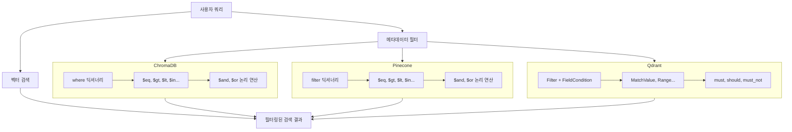
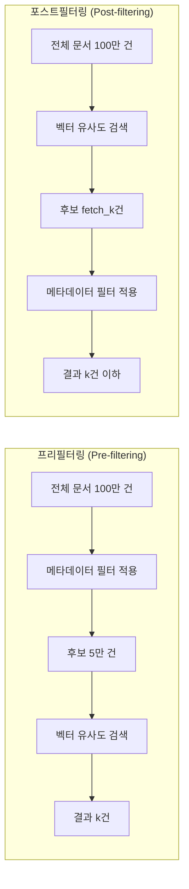
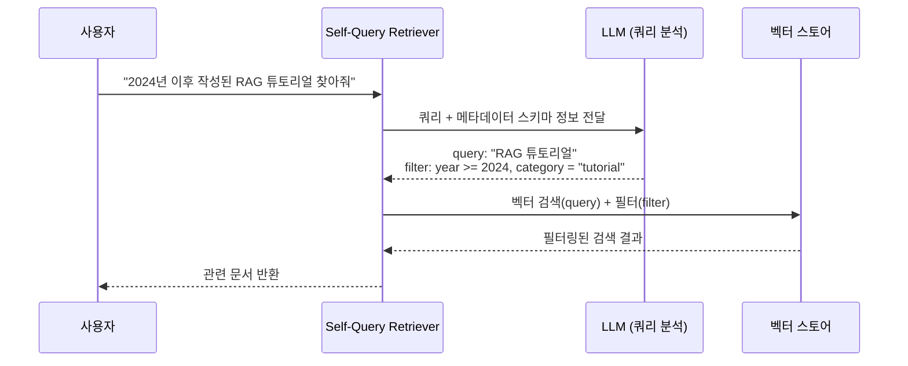
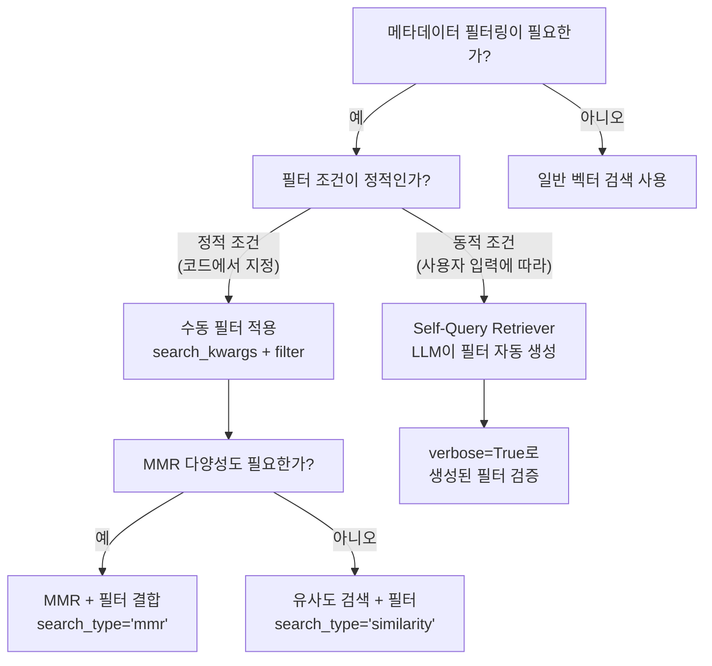

# 메타데이터 필터링 — 구조화된 검색

> 벡터 유사도만으로는 부족할 때, 메타데이터라는 "라벨"로 검색 후보를 좁혀 정밀도를 높이는 방법을 배웁니다.

## 개요

이 섹션에서는 벡터 검색에 **구조화된 메타데이터 필터**를 결합하여 검색 정밀도를 크게 향상시키는 방법을 학습합니다. 앞서 [10.1: 유사도 검색 심화](10.1)에서 top-k와 임계값으로 결과 수를 조절하고, [10.2: MMR](10.2)에서 다양성을 확보하는 방법을 배웠는데요. 이번에는 "어떤 문서를 검색 대상에 포함할 것인가"를 **메타데이터 조건**으로 제어하는 전략을 다룹니다. 특히 [10.2: MMR](10.2)의 다음 섹션 미리보기에서 예고한 **MMR과 메타데이터 필터링의 결합 전략**도 함께 살펴봅니다.

**선수 지식**: 
- 벡터 데이터베이스의 기본 구조와 문서 저장 (Ch6~7)
- top-k, similarity_score_threshold 검색 방식 (Session 10.1)
- MMR 검색과 fetch_k 개념 (Session 10.2)

**학습 목표**:
- 효과적인 메타데이터 스키마를 설계할 수 있다 (출처, 날짜, 카테고리, 작성자)
- ChromaDB, Pinecone, Qdrant 등 주요 벡터 DB의 필터 문법을 비교하고 사용할 수 있다
- 메타데이터 필터와 벡터 검색을 결합하는 전략(프리필터링 vs 포스트필터링)을 이해한다
- MMR과 메타데이터 필터를 결합하여 범위 제한과 다양성을 동시에 확보할 수 있다
- LangChain의 Self-Query Retriever를 활용하여 자연어 쿼리를 자동으로 필터로 변환할 수 있다

## 왜 알아야 할까?

여러분이 대형 도서관에서 "인공지능에 관한 최신 한국어 논문"을 찾는다고 상상해 보세요. 모든 책을 일일이 넘겨보면서 내용이 비슷한 것을 고르는 건 비효율적이겠죠? 대신 사서에게 "2024년 이후, 한국어, AI 분야"라고 조건을 말하면 해당 서가만 안내해 줄 겁니다. **메타데이터 필터링**이 바로 이 사서의 역할입니다.

실무 RAG 시스템에서는 수십만~수백만 개의 문서 청크가 벡터 DB에 저장되어 있는데요. 벡터 유사도만으로 검색하면 의미적으로 비슷하지만 **전혀 엉뚱한 맥락의 문서**가 섞여 들어올 수 있습니다. 예를 들어:

- "2024년 매출 보고서"를 질문했는데 **2020년** 보고서가 검색됨
- "마케팅팀 가이드라인"을 질문했는데 **개발팀** 문서가 검색됨  
- "공식 정책 문서"를 질문했는데 **비공식 메모**가 검색됨

메타데이터 필터링을 적용하면 이런 문제를 원천적으로 차단할 수 있습니다. 그리고 [10.2: MMR](10.2)에서 배운 다양성 확보 전략과 결합하면, "올바른 범위 안에서 다양한 관점의 문서"를 검색할 수 있어 더욱 강력해지죠. 실제로 많은 프로덕션 RAG 시스템이 메타데이터 필터링을 기본 전략으로 채택하고 있거든요.

## 핵심 개념

### 개념 1: 메타데이터 스키마 설계

> 💡 **비유**: 메타데이터는 택배 상자에 붙이는 **운송장 라벨**과 같습니다. 상자 안의 내용물(벡터)이 아무리 중요해도, 라벨(메타데이터) 없이는 올바른 수신자에게 효율적으로 배송할 수 없죠. 잘 설계된 라벨이 있으면 물류센터에서 자동 분류가 가능하듯, 잘 설계된 메타데이터가 있으면 벡터 DB가 검색 대상을 빠르게 좁힐 수 있습니다.

문서를 벡터 DB에 저장할 때, `page_content`(텍스트 내용) 외에 **metadata** 딕셔너리를 함께 저장할 수 있습니다. [Session 3.1](3.1)에서 `Document` 객체를 배웠을 때 이미 이 구조를 접했는데요, 이제 이 메타데이터를 **검색 필터**로 활용하는 것이 핵심입니다.

효과적인 메타데이터 스키마를 설계할 때는 네 가지 핵심 카테고리를 고려합니다:

| 카테고리 | 필드 예시 | 데이터 타입 | 활용 시나리오 |
|----------|-----------|-------------|---------------|
| **출처(Source)** | `source`, `file_name`, `url` | string | 특정 문서/출처에서만 검색 |
| **시간(Temporal)** | `created_at`, `updated_at`, `year` | string/int | 최신 정보 우선 검색, 기간 필터 |
| **분류(Category)** | `category`, `department`, `topic` | string | 주제별, 부서별 검색 범위 제한 |
| **속성(Attribute)** | `author`, `language`, `version` | string/float | 특정 작성자, 언어 필터 |

```python
from langchain_core.documents import Document

# 잘 설계된 메타데이터 예시
doc = Document(
    page_content="RAG 시스템은 검색과 생성을 결합하여...",
    metadata={
        # 출처 정보
        "source": "rag_guide_v2.pdf",
        "url": "https://example.com/docs/rag-guide",
        # 시간 정보
        "year": 2025,
        "created_at": "2025-03-01",
        # 분류 정보
        "category": "technical_guide",
        "department": "ai_team",
        # 속성 정보
        "author": "김철수",
        "language": "ko",
        "version": 2.0,
    }
)
```

> ⚠️ **흔한 오해**: "메타데이터를 많이 넣을수록 좋다"고 생각하기 쉬운데, 사실 그렇지 않습니다. 필터링에 실제로 사용하지 않을 메타데이터는 저장 공간만 차지하고, 인덱싱 성능에도 영향을 줍니다. **실제 쿼리 패턴을 먼저 분석**하고, 그에 맞는 필드만 선별하세요.

### 개념 2: 벡터 DB별 필터 문법 비교

> 💡 **비유**: SQL에서 `WHERE` 절이 데이터를 조건부로 걸러내듯, 벡터 DB의 메타데이터 필터도 같은 역할을 합니다. 다만 각 벡터 DB마다 "방언"이 조금씩 다른 것이죠 — 영어의 미국식과 영국식처럼요.

주요 벡터 DB들은 모두 메타데이터 필터링을 지원하지만, 문법이 조금씩 다릅니다. 대표적인 세 가지를 비교해 보겠습니다.

> 📊 **그림 1**: 벡터 DB별 메타데이터 필터 처리 방식



#### ChromaDB 필터 문법

ChromaDB는 MongoDB 스타일의 `where` 딕셔너리를 사용합니다. 가장 직관적인 문법 중 하나입니다.

```python
import chromadb

client = chromadb.Client()
collection = client.create_collection("documents")

# 기본 등호 필터 — 가장 간단한 형태
results = collection.query(
    query_texts=["RAG 시스템 구축 방법"],
    n_results=5,
    where={"category": "technical_guide"}  # category가 정확히 일치
)

# 비교 연산자 사용
results = collection.query(
    query_texts=["최신 AI 트렌드"],
    n_results=5,
    where={"year": {"$gte": 2024}}  # 2024년 이후 문서만
)

# 복합 조건 — $and로 여러 조건 결합
results = collection.query(
    query_texts=["RAG 평가 방법"],
    n_results=5,
    where={
        "$and": [
            {"category": "technical_guide"},
            {"year": {"$gte": 2024}},
            {"language": {"$eq": "ko"}}
        ]
    }
)
```

ChromaDB가 지원하는 주요 연산자:

| 연산자 | 의미 | 예시 |
|--------|------|------|
| `$eq` | 같음 | `{"year": {"$eq": 2025}}` |
| `$ne` | 같지 않음 | `{"status": {"$ne": "draft"}}` |
| `$gt`, `$gte` | 초과, 이상 | `{"year": {"$gt": 2023}}` |
| `$lt`, `$lte` | 미만, 이하 | `{"score": {"$lte": 0.8}}` |
| `$in`, `$nin` | 포함/미포함 | `{"category": {"$in": ["guide", "tutorial"]}}` |

#### Pinecone 필터 문법

Pinecone도 MongoDB 스타일의 `filter` 딕셔너리를 사용하는데, ChromaDB와 매우 유사합니다.

```python
# Pinecone 쿼리 시 필터 적용
results = index.query(
    vector=query_embedding,
    top_k=5,
    include_metadata=True,
    filter={
        "$and": [
            {"category": {"$eq": "technical_guide"}},
            {"year": {"$gte": 2024}}
        ]
    }
)
```

#### Qdrant 필터 문법

Qdrant는 Python 객체 기반의 타입 안전한 필터 문법을 제공합니다. 조금 더 명시적이지만, 자동 완성과 타입 체크의 이점이 있습니다.

```python
from qdrant_client import QdrantClient, models

client = QdrantClient(":memory:")

# Qdrant 필터 — Python 객체 기반
results = client.query_points(
    collection_name="documents",
    query=query_embedding,
    query_filter=models.Filter(
        must=[  # AND 조건
            models.FieldCondition(
                key="category",
                match=models.MatchValue(value="technical_guide")
            ),
            models.FieldCondition(
                key="year",
                range=models.Range(gte=2024)
            ),
        ]
    ),
    limit=5,
)
```

> 🔥 **실무 팁**: 벡터 DB를 선택할 때 메타데이터 필터링 성능도 중요한 기준입니다. Pinecone은 벡터 인덱스와 메타데이터 인덱스를 통합하여 **단일 단계 필터링(single-stage filtering)**을 지원하고, Qdrant는 자주 필터링하는 필드에 **페이로드 인덱스**를 생성해 성능을 최적화할 수 있습니다.

### 개념 3: 프리필터링 vs 포스트필터링

> 💡 **비유**: 식당에서 음식을 주문할 때를 생각해 보세요. **프리필터링**은 "채식 메뉴판"만 받아서 그 안에서 고르는 것이고, **포스트필터링**은 전체 메뉴에서 음식을 고른 뒤 "아, 이건 채식이 아니네" 하고 빼는 방식입니다.

메타데이터 필터를 적용하는 타이밍에 따라 검색 결과가 크게 달라집니다. 이것은 벡터 DB 내부의 동작 방식과 직결되는 중요한 개념입니다.

> 📊 **그림 2**: 프리필터링과 포스트필터링 비교



| 방식 | 장점 | 단점 | 적합한 상황 |
|------|------|------|-------------|
| **프리필터링** | 필터 조건 확실히 충족, 불필요한 계산 제거 | HNSW 그래프 연결 끊김으로 정확도 저하 가능 | 필터링 비율이 낮을 때 (후보가 많이 남을 때) |
| **포스트필터링** | 벡터 검색 정확도 유지 | k개 미만 결과 반환 가능 | 필터링 비율이 높을 때 (소수만 걸러낼 때) |

FAISS는 네이티브 필터링을 지원하지 않아서, LangChain에서 **포스트필터링** 방식으로 구현합니다. `fetch_k`개를 먼저 가져온 뒤 필터를 적용하므로, `fetch_k`를 `k`보다 충분히 크게 설정해야 합니다.

```python
from langchain_community.vectorstores import FAISS

# FAISS에서의 메타데이터 필터링 — 포스트필터링 방식
retriever = vectorstore.as_retriever(
    search_kwargs={
        "k": 4,
        "fetch_k": 20,  # 20개를 먼저 가져온 뒤 필터 적용
        "filter": {"category": "technical_guide"}
    }
)
```

### 개념 4: MMR과 메타데이터 필터의 결합

[10.2: MMR](10.2)에서 배운 MMR은 검색 결과의 **다양성**을 확보하는 전략이었죠. 메타데이터 필터링은 검색 **범위**를 제한하는 전략이고요. 이 둘을 결합하면 "올바른 범위 안에서 다양한 관점의 문서를 검색"할 수 있어 프로덕션 RAG 시스템에서 매우 흔하게 사용되는 패턴입니다.

> 💡 **비유**: 대형 서점에서 책을 고를 때, 먼저 "프로그래밍" 코너로 가서(메타데이터 필터) 그 안에서 서로 다른 저자, 다른 관점의 책을 골라(MMR) 균형 잡힌 참고 자료를 확보하는 것과 같습니다.

LangChain의 `as_retriever()`에서 `search_type="mmr"`과 `filter`를 함께 지정하면 됩니다:

```python
from langchain_chroma import Chroma
from langchain_openai import OpenAIEmbeddings

vectorstore = Chroma.from_documents(
    documents=docs,
    embedding=OpenAIEmbeddings(),
    collection_name="my_collection"
)

# MMR + 메타데이터 필터 결합 리트리버
retriever = vectorstore.as_retriever(
    search_type="mmr",  # Session 10.2에서 배운 MMR 적용
    search_kwargs={
        "k": 4,            # 최종 반환 문서 수
        "fetch_k": 20,     # MMR 후보 풀 크기
        "lambda_mult": 0.5, # 관련성(1.0)과 다양성(0.0)의 균형
        "filter": {"category": "policy"}  # 정책 문서만 대상
    }
)

# 이제 검색하면 policy 카테고리 문서 중에서 MMR로 다양한 결과를 반환
results = retriever.invoke("회사 정책에 대해 알려주세요")
```

이 패턴의 동작 순서는 다음과 같습니다:

1. 메타데이터 필터(`category == "policy"`)로 검색 대상을 좁힘
2. 필터를 통과한 문서 중 `fetch_k=20`개를 벡터 유사도 순으로 가져옴
3. MMR 알고리즘이 `lambda_mult=0.5` 기준으로 관련성과 다양성을 균형 있게 평가
4. 최종 `k=4`개의 다양하면서도 관련성 높은 문서를 반환

> 💡 **알고 계셨나요?**: [10.2: MMR](10.2)에서 배운 MMR과 메타데이터 필터링은 서로 보완적입니다. 메타데이터 필터로 **검색 범위**를 좁히고, MMR로 **결과의 다양성**을 확보하면 더욱 질 좋은 검색 결과를 얻을 수 있습니다. 필터링으로 후보 풀이 줄어들면 `fetch_k`도 그에 맞게 조절하는 것이 좋아요 — 필터 후 남는 문서 수보다 `fetch_k`가 크면 의미가 없으니까요.

### 개념 5: Self-Query Retriever — 자연어를 필터로 변환

> 💡 **비유**: 도서관에서 "2024년에 나온 AI 분야 한국어 책"이라고 말하면, 사서가 알아서 연도=2024, 분야=AI, 언어=한국어로 조건을 분해해서 검색하죠? **Self-Query Retriever**가 바로 이 똑똑한 사서 역할을 합니다. LLM이 사용자의 자연어 쿼리를 분석해서 벡터 검색 부분과 메타데이터 필터 부분을 자동으로 분리해 주거든요.

> 📊 **그림 3**: Self-Query Retriever의 동작 흐름



Self-Query Retriever는 세 가지 핵심 요소로 구성됩니다:

1. **LLM**: 사용자 쿼리를 분석하여 검색어와 필터를 분리
2. **AttributeInfo**: 메타데이터 필드의 이름, 설명, 타입 정보
3. **벡터 스토어**: 실제 필터링 검색을 수행하는 벡터 DB

```python
from langchain.chains.query_constructor.schema import AttributeInfo
from langchain.retrievers.self_query.base import SelfQueryRetriever
from langchain_openai import ChatOpenAI

# 1. 메타데이터 필드 정보 정의
metadata_field_info = [
    AttributeInfo(
        name="category",
        description="문서의 카테고리. 'tutorial', 'guide', 'reference', 'blog' 중 하나",
        type="string",
    ),
    AttributeInfo(
        name="year",
        description="문서가 작성된 연도",
        type="integer",
    ),
    AttributeInfo(
        name="author",
        description="문서 작성자의 이름",
        type="string",
    ),
    AttributeInfo(
        name="language",
        description="문서의 언어. 'ko' 또는 'en'",
        type="string",
    ),
]

# 2. Self-Query Retriever 생성
llm = ChatOpenAI(model="gpt-4o-mini", temperature=0)

self_query_retriever = SelfQueryRetriever.from_llm(
    llm=llm,
    vectorstore=vectorstore,
    document_contents="기술 문서, 튜토리얼, 가이드 등 개발 관련 문서",
    metadata_field_info=metadata_field_info,
    verbose=True,  # 생성된 필터를 확인할 수 있음
)

# 3. 자연어 쿼리로 검색 — LLM이 알아서 필터를 추출
results = self_query_retriever.invoke(
    "2024년 이후에 작성된 한국어 RAG 튜토리얼"
)
# 내부적으로 생성되는 구조화된 쿼리:
# query: "RAG 튜토리얼"
# filter: Comparison(comparator=gte, attribute=year, value=2024)
#     AND Comparison(comparator=eq, attribute=language, value="ko")
#     AND Comparison(comparator=eq, attribute=category, value="tutorial")
```

> ⚠️ **흔한 오해**: Self-Query Retriever가 항상 완벽하게 필터를 추출한다고 기대하면 안 됩니다. LLM 기반이기 때문에 모호한 쿼리에서는 필터를 잘못 생성하거나 누락할 수 있어요. `verbose=True`로 생성된 필터를 확인하면서 **AttributeInfo의 description을 구체적으로** 작성하는 것이 핵심입니다.

## 실습: 직접 해보기

기술 문서 컬렉션에 메타데이터를 설계하고, 다양한 필터링 전략을 적용해 보겠습니다.

```python
# 필요한 패키지 설치
# pip install langchain langchain-chroma langchain-openai python-dotenv

import os
from dotenv import load_dotenv
from langchain_core.documents import Document
from langchain_chroma import Chroma
from langchain_openai import OpenAIEmbeddings

load_dotenv()

# ===== 1단계: 메타데이터가 풍부한 문서 준비 =====
documents = [
    Document(
        page_content="RAG는 Retrieval-Augmented Generation의 약자로, 외부 지식을 검색하여 LLM의 응답을 보강하는 기법입니다.",
        metadata={"category": "guide", "year": 2024, "author": "김철수", "language": "ko", "department": "ai_team"}
    ),
    Document(
        page_content="LangChain은 LLM 애플리케이션 개발을 위한 프레임워크입니다. 체인, 에이전트, 메모리 등의 추상화를 제공합니다.",
        metadata={"category": "tutorial", "year": 2025, "author": "이영희", "language": "ko", "department": "ai_team"}
    ),
    Document(
        page_content="ChromaDB is an open-source vector database optimized for AI applications with built-in embedding support.",
        metadata={"category": "reference", "year": 2025, "author": "John Doe", "language": "en", "department": "infra_team"}
    ),
    Document(
        page_content="벡터 검색의 품질을 높이려면 적절한 청킹 전략과 임베딩 모델 선택이 중요합니다.",
        metadata={"category": "guide", "year": 2024, "author": "박지민", "language": "ko", "department": "ai_team"}
    ),
    Document(
        page_content="FAISS는 Facebook AI Research에서 만든 고성능 벡터 유사도 검색 라이브러리입니다.",
        metadata={"category": "reference", "year": 2023, "author": "김철수", "language": "ko", "department": "infra_team"}
    ),
    Document(
        page_content="프로덕션 RAG 시스템에서는 모니터링, 캐싱, 에러 핸들링이 필수적입니다.",
        metadata={"category": "blog", "year": 2025, "author": "이영희", "language": "ko", "department": "devops_team"}
    ),
    Document(
        page_content="Pinecone provides a fully managed vector database with single-stage metadata filtering for production use.",
        metadata={"category": "reference", "year": 2025, "author": "Jane Smith", "language": "en", "department": "infra_team"}
    ),
    Document(
        page_content="RAG 평가에는 Faithfulness, Answer Relevancy, Context Precision 등의 메트릭을 사용합니다.",
        metadata={"category": "tutorial", "year": 2024, "author": "박지민", "language": "ko", "department": "ai_team"}
    ),
]

# ===== 2단계: 벡터 스토어 생성 =====
vectorstore = Chroma.from_documents(
    documents=documents,
    embedding=OpenAIEmbeddings(),
    collection_name="tech_docs"
)

print(f"총 {vectorstore._collection.count()}개 문서가 저장되었습니다.")
```

```output
총 8개 문서가 저장되었습니다.
```

이제 다양한 필터링 전략을 실험해 보겠습니다.

```run:python
# ===== 3단계: 기본 메타데이터 필터링 =====

# 필터 없이 검색
results_no_filter = vectorstore.similarity_search(
    "RAG 시스템 구축", k=3
)
print("=== 필터 없이 검색 ===")
for doc in results_no_filter:
    print(f"  [{doc.metadata['year']}] [{doc.metadata['category']}] {doc.page_content[:50]}...")

print()

# 카테고리 필터 적용
results_filtered = vectorstore.similarity_search(
    "RAG 시스템 구축",
    k=3,
    filter={"category": "tutorial"}  # tutorial 카테고리만
)
print("=== category='tutorial' 필터 적용 ===")
for doc in results_filtered:
    print(f"  [{doc.metadata['year']}] [{doc.metadata['category']}] {doc.page_content[:50]}...")
```

```output
=== 필터 없이 검색 ===
  [2024] [guide] RAG는 Retrieval-Augmented Generation의 약자로, 외부 지식을...
  [2025] [blog] 프로덕션 RAG 시스템에서는 모니터링, 캐싱, 에러 핸들링이 필수적입니다....
  [2024] [tutorial] RAG 평가에는 Faithfulness, Answer Relevancy, Context...

=== category='tutorial' 필터 적용 ===
  [2024] [tutorial] RAG 평가에는 Faithfulness, Answer Relevancy, Context...
  [2025] [tutorial] LangChain은 LLM 애플리케이션 개발을 위한 프레임워크입니다. 체인, 에이...
```

```run:python
# ===== 4단계: 복합 조건 필터링 =====

# 2024년 이후 + 한국어 + ai_team 문서만 검색
results_complex = vectorstore.similarity_search(
    "벡터 검색 품질 향상",
    k=4,
    filter={
        "$and": [
            {"year": {"$gte": 2024}},
            {"language": "ko"},
            {"department": "ai_team"}
        ]
    }
)
print("=== 복합 조건: year>=2024 AND language=ko AND department=ai_team ===")
for doc in results_complex:
    meta = doc.metadata
    print(f"  [{meta['year']}] [{meta['department']}] [{meta['language']}] {doc.page_content[:45]}...")

print(f"\n총 {len(results_complex)}건 검색됨")
```

```output
=== 복합 조건: year>=2024 AND language=ko AND department=ai_team ===
  [2024] [ai_team] [ko] RAG는 Retrieval-Augmented Generation의 약자로,...
  [2024] [ai_team] [ko] 벡터 검색의 품질을 높이려면 적절한 청킹 전략과 임베딩 모델 선택이...
  [2025] [ai_team] [ko] LangChain은 LLM 애플리케이션 개발을 위한 프레임워크입니다....
  [2024] [ai_team] [ko] RAG 평가에는 Faithfulness, Answer Relevancy,...

총 4건 검색됨
```

```run:python
# ===== 5단계: MMR + 메타데이터 필터 결합 =====

# Session 10.2에서 배운 MMR과 메타데이터 필터를 결합
# 메타데이터로 범위를 좁히고, MMR로 다양성을 확보하는 프로덕션 패턴
retriever = vectorstore.as_retriever(
    search_type="mmr",
    search_kwargs={
        "k": 3,
        "fetch_k": 10,       # MMR 후보 풀 크기
        "lambda_mult": 0.5,  # 관련성과 다양성 균형
        "filter": {"language": "ko"}  # 한국어 문서만
    }
)

results_mmr_filter = retriever.invoke("RAG 시스템에 대해 알려주세요")
print("=== MMR + 한국어 필터 결합 ===")
for doc in results_mmr_filter:
    meta = doc.metadata
    print(f"  [{meta['category']}] [{meta['author']}] {doc.page_content[:50]}...")

print()

# 부서 + 카테고리 필터와 MMR 결합 — 더 세밀한 범위 제한
retriever_strict = vectorstore.as_retriever(
    search_type="mmr",
    search_kwargs={
        "k": 4,
        "fetch_k": 20,
        "lambda_mult": 0.7,  # 관련성에 좀 더 가중치
        "filter": {
            "$and": [
                {"department": "ai_team"},
                {"category": {"$in": ["guide", "tutorial"]}}
            ]
        }
    }
)

results_strict = retriever_strict.invoke("RAG 시스템 구축 가이드")
print("=== MMR + 부서/카테고리 복합 필터 결합 ===")
for doc in results_strict:
    meta = doc.metadata
    print(f"  [{meta['department']}] [{meta['category']}] {doc.page_content[:50]}...")
```

```output
=== MMR + 한국어 필터 결합 ===
  [guide] [김철수] RAG는 Retrieval-Augmented Generation의 약자로, 외부 지식을...
  [blog] [이영희] 프로덕션 RAG 시스템에서는 모니터링, 캐싱, 에러 핸들링이 필수적입니다....
  [tutorial] [박지민] RAG 평가에는 Faithfulness, Answer Relevancy, Context...

=== MMR + 부서/카테고리 복합 필터 결합 ===
  [ai_team] [guide] RAG는 Retrieval-Augmented Generation의 약자로, 외부 지식을...
  [ai_team] [guide] 벡터 검색의 품질을 높이려면 적절한 청킹 전략과 임베딩 모델 선택이...
  [ai_team] [tutorial] LangChain은 LLM 애플리케이션 개발을 위한 프레임워크입니다....
  [ai_team] [tutorial] RAG 평가에는 Faithfulness, Answer Relevancy,...
```

```python
# ===== 6단계: Self-Query Retriever 활용 =====
from langchain.chains.query_constructor.schema import AttributeInfo
from langchain.retrievers.self_query.base import SelfQueryRetriever
from langchain_openai import ChatOpenAI

# 메타데이터 필드 정보 정의 — description을 구체적으로 작성하는 것이 핵심
metadata_field_info = [
    AttributeInfo(
        name="category",
        description="문서의 카테고리. 가능한 값: 'guide'(가이드), 'tutorial'(튜토리얼), 'reference'(레퍼런스), 'blog'(블로그)",
        type="string",
    ),
    AttributeInfo(
        name="year",
        description="문서가 작성된 연도. 2023, 2024, 2025 등의 정수값",
        type="integer",
    ),
    AttributeInfo(
        name="author",
        description="문서 작성자의 이름",
        type="string",
    ),
    AttributeInfo(
        name="language",
        description="문서의 언어. 'ko'(한국어) 또는 'en'(영어)",
        type="string",
    ),
    AttributeInfo(
        name="department",
        description="문서가 속한 부서. 'ai_team', 'infra_team', 'devops_team' 중 하나",
        type="string",
    ),
]

# Self-Query Retriever 생성
llm = ChatOpenAI(model="gpt-4o-mini", temperature=0)

self_query_retriever = SelfQueryRetriever.from_llm(
    llm=llm,
    vectorstore=vectorstore,
    document_contents="기술 문서, 튜토리얼, 가이드 등 소프트웨어 개발 관련 문서 모음",
    metadata_field_info=metadata_field_info,
    verbose=True,
)

# 자연어로 검색 — LLM이 자동으로 필터를 생성
results = self_query_retriever.invoke(
    "김철수가 작성한 2024년 가이드 문서를 찾아줘"
)
# LLM이 내부적으로 다음과 같은 구조화된 쿼리를 생성:
# query: ""  (의미적 검색어 없음)
# filter: author == "김철수" AND year == 2024 AND category == "guide"

print("=== Self-Query: '김철수가 작성한 2024년 가이드 문서' ===")
for doc in results:
    meta = doc.metadata
    print(f"  [{meta['year']}] [{meta['author']}] [{meta['category']}] {doc.page_content[:50]}...")
```

## 더 깊이 알아보기

### 메타데이터 필터링의 "잃어버린 WHERE 절" 이야기

벡터 데이터베이스에서 메타데이터 필터링이 당연하게 느껴지지만, 사실 이 기능이 자리 잡기까지는 흥미로운 과정이 있었습니다.

전통적인 관계형 데이터베이스(SQL)에서 `WHERE` 절은 기본 중의 기본이었죠. 하지만 초기 벡터 검색 엔진들은 순수하게 **벡터 유사도**만을 다뤘습니다. ANN(Approximate Nearest Neighbor) 알고리즘, 특히 HNSW 같은 그래프 기반 인덱스는 벡터 공간에서의 근접성만 고려하도록 설계되었거든요. 여기에 메타데이터 필터를 끼워 넣는 것은 생각보다 쉽지 않은 엔지니어링 과제였습니다.

Pinecone의 기술 블로그에서 이를 **"잃어버린 WHERE 절(The Missing WHERE Clause)"**이라고 표현했는데요. HNSW 그래프에서 프리필터링을 적용하면 그래프의 연결(edge)이 끊어져 검색 정확도가 떨어지고, 포스트필터링을 적용하면 원하는 수의 결과를 보장할 수 없는 딜레마가 있었습니다.

이 문제를 해결하기 위해 각 벡터 DB는 독자적인 방법을 발전시켰습니다. Pinecone은 벡터 인덱스와 메타데이터 인덱스를 하나로 합친 **단일 단계 필터링**을, Qdrant는 필터 카디널리티에 따라 프리/포스트 필터링을 **자동 선택**하는 최적화를 도입했죠. "벡터 검색 + 구조화된 필터"라는 오늘날 당연해 보이는 조합이 실은 상당한 기술적 혁신의 결과물인 셈입니다.

### 메타데이터 인덱싱과 성능

대규모 데이터에서 메타데이터 필터링의 성능은 **인덱싱 전략**에 크게 좌우됩니다. Qdrant를 예로 들면, 자주 필터링하는 필드에 페이로드 인덱스를 생성해야 최적 성능을 낼 수 있습니다:

```python
# Qdrant에서 페이로드 인덱스 생성 — 자주 필터하는 필드에 적용
from qdrant_client import QdrantClient, models

client = QdrantClient(url="http://localhost:6333")

# keyword 타입 인덱스 — 카테고리, 부서 등 문자열 필드에 적합
client.create_payload_index(
    collection_name="documents",
    field_name="category",
    field_schema=models.PayloadSchemaType.KEYWORD,
)

# integer 타입 인덱스 — 연도 등 숫자 필드에 적합
client.create_payload_index(
    collection_name="documents",
    field_name="year",
    field_schema=models.PayloadSchemaType.INTEGER,
)
```

> 📊 **그림 4**: 메타데이터 필터링 전략 선택 가이드



## 흔한 오해와 팁

> ⚠️ **흔한 오해**: "메타데이터 필터링은 벡터 검색보다 항상 빠르다"고 생각하기 쉽지만, 반드시 그렇지는 않습니다. 인덱스가 없는 메타데이터 필드에 대한 프리필터링은 전체 문서를 스캔해야 하므로 오히려 느려질 수 있어요. **자주 사용하는 필터 필드에는 반드시 인덱스를 생성**하세요.

> ⚠️ **흔한 오해**: FAISS에서 `filter` 파라미터를 사용할 때, `k=4`로 설정했는데 결과가 4개 미만으로 돌아오는 경우가 있습니다. FAISS는 포스트필터링이라 `fetch_k`개를 먼저 가져온 뒤 필터를 적용하기 때문이에요. `fetch_k`를 충분히 크게(예: `k`의 4~5배) 설정하면 해결됩니다.

> 💡 **알고 계셨나요?**: Self-Query Retriever의 `AttributeInfo`에서 `description`이 가장 중요한 필드입니다. LLM이 이 설명을 읽고 사용자 쿼리에서 어떤 메타데이터 필터를 추출할지 결정하거든요. "문서의 카테고리"보다 "문서의 카테고리. 가능한 값: 'guide', 'tutorial', 'reference', 'blog'"처럼 **가능한 값을 명시**하면 필터 생성 정확도가 크게 올라갑니다.

> 🔥 **실무 팁**: 프로덕션에서는 메타데이터 스키마를 **문서 수집 파이프라인 단계**에서 자동으로 추출하도록 설계하세요. 파일명에서 부서명을, 파일 속성에서 작성일을, 디렉토리 구조에서 카테고리를 자동 추출하면 일관성 있는 메타데이터를 유지할 수 있습니다.

> 🔥 **실무 팁**: 날짜 필터링 시 문자열(`"2025-03-01"`)보다 **정수(연도: 2025)나 타임스탬프**를 사용하세요. 문자열 비교는 범위 쿼리(`$gte`, `$lte`)에서 예상과 다르게 동작할 수 있습니다.

## 핵심 정리

| 개념 | 설명 |
|------|------|
| **메타데이터 스키마** | 출처·시간·분류·속성 4가지 카테고리로 설계하며, 실제 쿼리 패턴에 맞는 필드만 선별 |
| **ChromaDB 필터** | `where` 딕셔너리 사용, `$eq/$gte/$in` 등 연산자, `$and/$or` 논리 결합 |
| **Pinecone 필터** | `filter` 딕셔너리 사용, MongoDB 스타일 문법, 단일 단계 필터링으로 고성능 |
| **Qdrant 필터** | `Filter` + `FieldCondition` Python 객체, `must/should/must_not` 논리 연산 |
| **프리필터링** | 메타데이터 필터 → 벡터 검색 순서. 필터 후 후보가 많을 때 적합 |
| **포스트필터링** | 벡터 검색 → 메타데이터 필터 순서. FAISS에서 사용, `fetch_k`를 크게 설정 필요 |
| **LangChain 통합 API** | `as_retriever(search_kwargs={"filter": ...})`로 벡터 DB 무관하게 필터 적용 |
| **MMR + 필터 결합** | `search_type="mmr"` + `filter`로 범위 제한과 다양성 확보를 동시에 달성하는 프로덕션 패턴 |
| **Self-Query Retriever** | LLM이 자연어 쿼리에서 검색어와 메타데이터 필터를 자동 분리. `AttributeInfo` 설계가 핵심 |

## 다음 섹션 미리보기

지금까지 단일 벡터 스토어 안에서 메타데이터 필터와 MMR을 결합하여 검색 정밀도를 높이는 방법을 배웠는데요, 다음 섹션에서는 **다중 벡터 검색과 MultiVector Retriever**를 다룹니다. 하나의 문서에 여러 검색용 표현(요약, 가상 질문 등)을 생성하고 원본을 별도 저장하여, 검색 정밀도와 컨텍스트 풍부함을 동시에 확보하는 전략을 배울 거예요. 메타데이터 필터링이 "어떤 문서를 검색할지" 범위를 좁히는 전략이었다면, MultiVector Retriever는 "어떤 표현으로 검색할지" 검색 자체의 품질을 높이는 접근입니다.

## 참고 자료

- [Metadata Filtering - Chroma Docs](https://docs.trychroma.com/docs/querying-collections/metadata-filtering) - ChromaDB의 공식 메타데이터 필터링 문서. `where` 절 문법과 모든 연산자를 정리
- [Filter with metadata - Pinecone Docs](https://docs.pinecone.io/guides/data/filter-with-metadata) - Pinecone의 메타데이터 필터 공식 가이드. MongoDB 스타일 쿼리 문법과 단일 단계 필터링 설명
- [A Complete Guide to Filtering in Vector Search - Qdrant](https://qdrant.tech/articles/vector-search-filtering/) - Qdrant의 벡터 검색 필터링 완전 가이드. 프리/포스트 필터링과 성능 최적화 전략
- [The Missing WHERE Clause in Vector Search - Pinecone](https://www.pinecone.io/learn/vector-search-filtering/) - 벡터 검색에서 메타데이터 필터링이 왜 어려운지, 프리/포스트 필터링의 트레이드오프를 설명하는 기술 아티클
- [How to do "self-querying" retrieval - LangChain](https://python.langchain.com/docs/how_to/self_query/) - LangChain Self-Query Retriever의 공식 How-to 가이드
- [SelfQueryRetriever API Reference](https://api.python.langchain.com/en/latest/retrievers/langchain.retrievers.self_query.base.SelfQueryRetriever.html) - SelfQueryRetriever 클래스의 전체 파라미터와 메서드 레퍼런스

---
### 🔗 Related Sessions
- [document](../03-문서-로딩과-파싱-다양한-소스에서-데이터-수집/01-문서-로딩-기초-langchain-document-loaders.md) (prerequisite)
- [page_content](../03-문서-로딩과-파싱-다양한-소스에서-데이터-수집/01-문서-로딩-기초-langchain-document-loaders.md) (prerequisite)
- [mmr](../10-검색-품질-향상-유사도-검색과-메타데이터-필터링/02-mmr-관련성과-다양성의-균형.md) (prerequisite)
- [similarity_score_threshold](../10-검색-품질-향상-유사도-검색과-메타데이터-필터링/01-유사도-검색-심화-top-k와-임계값-최적화.md) (prerequisite)
- [as_retriever](../06-벡터-데이터베이스-기초-chromadb로-시작하기/05-langchain-chromadb-통합-실습.md) (prerequisite)
- [fetch_k](../06-벡터-데이터베이스-기초-chromadb로-시작하기/05-langchain-chromadb-통합-실습.md) (prerequisite)
- [lambda_mult](../06-벡터-데이터베이스-기초-chromadb로-시작하기/05-langchain-chromadb-통합-실습.md) (prerequisite)
