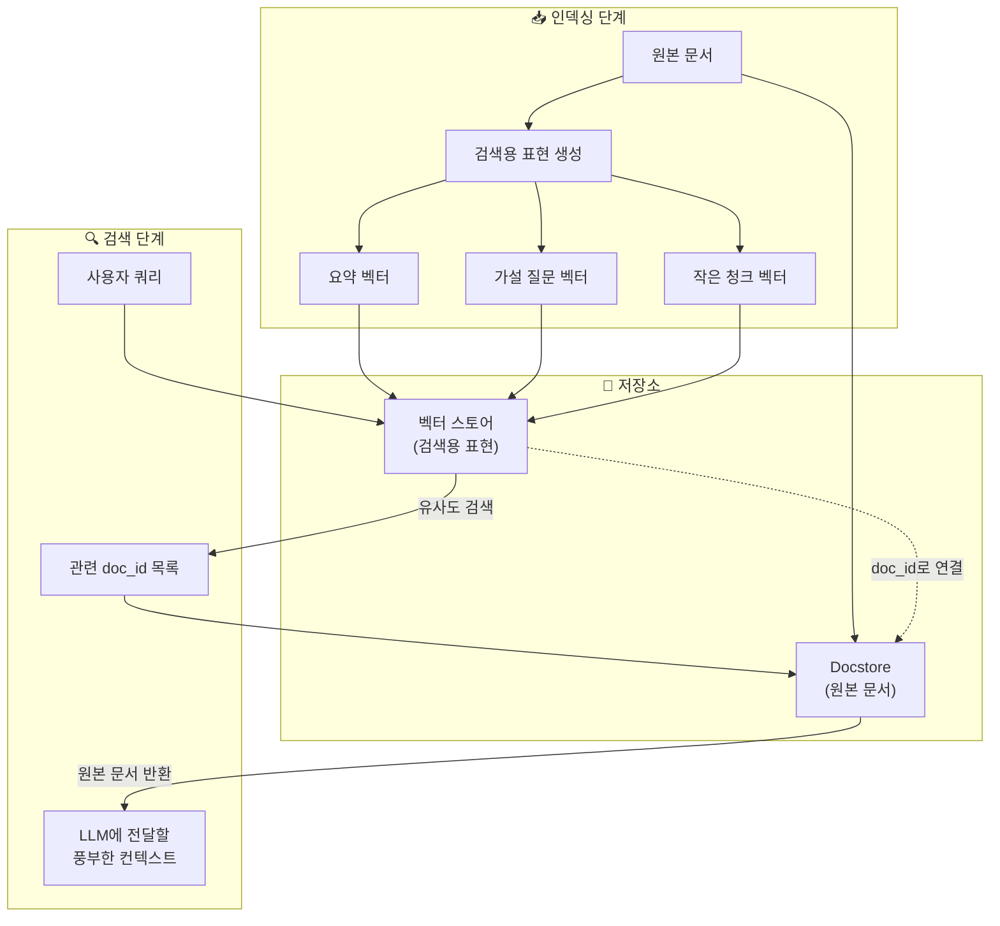
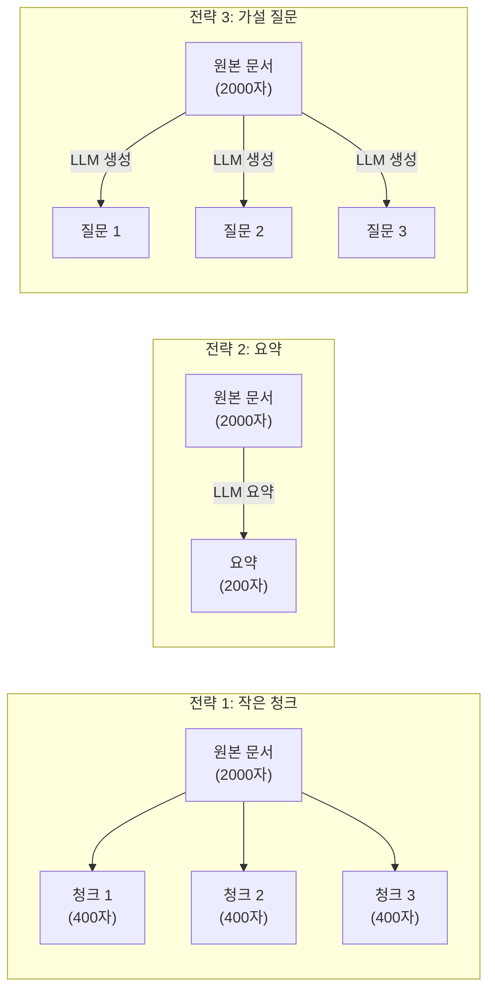
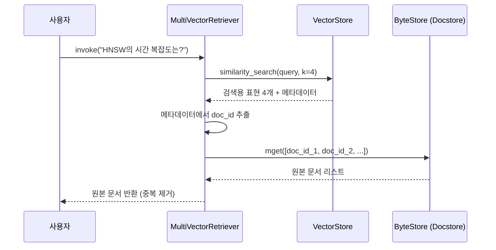
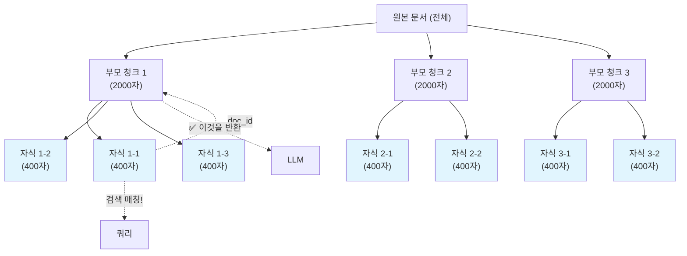

# 다중 벡터 검색과 MultiVector Retriever

> 하나의 문서에 여러 표현을 만들어 검색하고, 원본 문서를 반환하는 고급 검색 전략

## 개요

이 섹션에서는 하나의 문서에 대해 여러 개의 벡터 표현(요약, 가설 질문, 작은 청크)을 생성하고, 검색 시에는 이 표현들로 찾되 LLM에게는 원본 전체 문서를 전달하는 **다중 벡터 검색(Multi-Vector Retrieval)** 전략을 학습합니다. LangChain의 `MultiVectorRetriever`와 `ParentDocumentRetriever`를 직접 구현하며, 검색 정밀도와 컨텍스트 풍부함을 동시에 확보하는 방법을 익힙니다.

**선수 지식**: [10.1 유사도 검색 심화](10-검색-품질-향상-유사도-검색과-메타데이터-필터링/01-유사도-검색-심화-top-k와-임계값-최적화.md)에서 배운 top-k와 유사도 임계값, [10.2 MMR](10-검색-품질-향상-유사도-검색과-메타데이터-필터링/02-mmr-관련성과-다양성의-균형.md)에서 배운 다양성 확보 전략, [10.3 메타데이터 필터링](10-검색-품질-향상-유사도-검색과-메타데이터-필터링/03-메타데이터-필터링-구조화된-검색.md)에서 배운 구조화된 검색 기법
**학습 목표**:
- 다중 벡터 검색의 필요성과 세 가지 전략(작은 청크, 요약, 가설 질문)을 이해할 수 있다
- `MultiVectorRetriever`를 사용하여 요약 기반, 가설 질문 기반 검색을 구현할 수 있다
- `ParentDocumentRetriever`로 작은 청크 검색 → 큰 청크 반환 전략을 구현할 수 있다
- 각 전략의 트레이드오프를 파악하고 상황에 맞는 전략을 선택할 수 있다

## 왜 알아야 할까?

앞서 배운 검색 기법들에는 근본적인 딜레마가 하나 있습니다. **청크를 작게 만들면 임베딩이 정밀해지지만 LLM에 전달되는 맥락이 부족하고, 청크를 크게 만들면 맥락은 풍부하지만 검색 정밀도가 떨어진다**는 것이죠.

예를 들어볼까요? 500페이지짜리 기술 문서에서 "HNSW 알고리즘의 시간 복잡도"를 검색한다고 해봅시다. 청크가 100자짜리라면 "O(log N)"이 포함된 정확한 문장을 찾겠지만, 그 문장만으로는 전체 맥락을 파악하기 어렵습니다. 반대로 5000자짜리 청크라면 풍부한 맥락을 제공하지만, 임베딩이 여러 주제를 뭉뚱그리게 되어 검색 정확도가 떨어집니다.

다중 벡터 검색은 이 딜레마를 근본적으로 해결합니다. **"검색용 표현"과 "LLM에 전달할 원본"을 분리**하는 거죠. 마치 도서관에서 책을 찾을 때 색인 카드(검색용)로 위치를 파악하고, 실제로는 책 전체(원본)를 가져오는 것과 같습니다. 프로덕션 RAG 시스템에서 검색 품질을 한 단계 끌어올리는 핵심 기법이며, LangChain 공식 문서에서도 고급 검색 전략의 대표 사례로 소개하고 있습니다.

## 핵심 개념

### 개념 1: 다중 벡터 검색의 원리 — 검색과 생성의 분리

> 💡 **비유**: 영화 예고편과 영화 본편을 생각해보세요. 관객은 **2분짜리 예고편**(작은 표현)을 보고 영화를 선택하지만, 실제로 보는 것은 **2시간짜리 본편**(원본 문서)입니다. 예고편은 영화의 핵심을 압축해서 "이 영화가 내 취향인가?"를 빠르게 판단하게 해주죠. 다중 벡터 검색도 마찬가지입니다 — 작고 정밀한 표현으로 관련 문서를 찾고, LLM에게는 풍부한 원본을 전달합니다.

다중 벡터 검색의 핵심 아이디어는 간단합니다:

1. **인덱싱 단계**: 각 문서에 대해 여러 개의 "검색용 표현"을 만들어 벡터 스토어에 저장
2. **매핑 관리**: 각 검색용 표현이 어떤 원본 문서에 해당하는지 ID로 연결
3. **검색 단계**: 쿼리와 검색용 표현을 비교하여 관련 문서 ID를 찾음
4. **반환 단계**: 찾은 ID에 해당하는 원본 문서를 docstore에서 가져와 LLM에 전달

> 📊 **그림 1**: 다중 벡터 검색의 전체 흐름 — 검색용 표현과 원본 문서의 분리



이 구조에서 핵심은 **두 개의 저장소**입니다:
- **벡터 스토어(VectorStore)**: 검색용 표현(요약, 질문, 작은 청크)의 임베딩을 저장
- **문서 저장소(Docstore)**: 원본 전체 문서를 `doc_id`를 키로 저장

LangChain의 `MultiVectorRetriever`는 이 두 저장소를 연결하는 역할을 합니다. 검색용 표현의 메타데이터에 `doc_id`를 기록해두고, 검색 결과에서 `doc_id`를 추출하여 docstore에서 원본을 가져오는 거죠.

### 개념 2: 세 가지 다중 벡터 전략

하나의 문서에서 여러 검색용 표현을 만드는 전략은 크게 세 가지입니다.

> 📊 **그림 2**: 세 가지 다중 벡터 전략 비교



**전략 1: 작은 청크 (Smaller Chunks)**

가장 직관적인 방법입니다. 원본 문서를 큰 청크("부모")로 나누고, 각 부모를 다시 작은 청크("자식")로 분할합니다. 자식 청크로 검색하되, 부모 청크를 반환합니다. `ParentDocumentRetriever`가 이 전략을 구현합니다.

```python
from langchain.text_splitter import RecursiveCharacterTextSplitter

# 부모 청크: 2000자 — LLM에 전달할 풍부한 맥락
parent_splitter = RecursiveCharacterTextSplitter(chunk_size=2000, chunk_overlap=200)

# 자식 청크: 400자 — 검색 정밀도를 높이는 작은 단위
child_splitter = RecursiveCharacterTextSplitter(chunk_size=400, chunk_overlap=50)
```

**전략 2: 요약 (Summary)**

LLM을 사용하여 각 문서의 핵심을 요약하고, 이 요약문의 임베딩으로 검색합니다. 요약은 문서의 핵심 주제를 압축하므로 의미적 검색에 유리합니다.

```python
from langchain_core.prompts import ChatPromptTemplate
from langchain_openai import ChatOpenAI

# 요약 생성 체인
prompt = ChatPromptTemplate.from_template(
    "다음 문서의 핵심 내용을 2-3문장으로 요약하세요:\n\n{doc}"
)
llm = ChatOpenAI(model="gpt-4o-mini")
summary_chain = prompt | llm  # LCEL 파이프라인
```

**전략 3: 가설 질문 (Hypothetical Questions)**

각 문서에 대해 "이 문서가 답변할 수 있는 질문"을 LLM으로 생성합니다. 사용자의 쿼리도 질문 형태이므로, **질문 대 질문** 비교가 되어 의미적 매칭이 훨씬 정확해집니다.

```python
# 가설 질문 생성 체인
question_prompt = ChatPromptTemplate.from_template(
    "다음 문서 내용을 바탕으로, 이 문서가 답변할 수 있는 "
    "질문 3개를 생성하세요. 각 질문을 줄바꿈으로 구분하세요:\n\n{doc}"
)
question_chain = question_prompt | llm
```

> ⚠️ **흔한 오해**: "가설 질문 전략이 항상 최고"라고 생각하기 쉽지만, 실제로는 데이터 특성에 따라 다릅니다. 기술 문서처럼 명확한 Q&A 패턴이 있는 경우에는 가설 질문이 효과적이지만, 서사적인 텍스트나 코드 문서에서는 요약 전략이 더 나을 수 있습니다. **인덱싱 비용도 고려하세요** — 가설 질문은 문서당 LLM 호출이 필요하므로 대규모 코퍼스에서는 비용이 급증합니다.

### 개념 3: MultiVectorRetriever — 핵심 구현 클래스

> 💡 **비유**: `MultiVectorRetriever`는 **비서**와 같습니다. 비서는 방대한 서류 캐비닛(docstore)과 정리된 인덱스 카드 파일(벡터 스토어)을 관리하죠. 누군가 "작년 매출 보고서 있어?"라고 물으면, 비서는 인덱스 카드를 훑어 관련 서류의 위치를 찾고(벡터 검색), 캐비닛에서 원본 서류 전체를 꺼내줍니다(docstore 조회).

`MultiVectorRetriever`는 LangChain에서 다중 벡터 검색을 구현하는 핵심 클래스입니다. 주요 파라미터를 살펴보겠습니다:

```python
from langchain.retrievers.multi_vector import MultiVectorRetriever
from langchain.storage import InMemoryByteStore
from langchain_chroma import Chroma
from langchain_openai import OpenAIEmbeddings

# 1. 벡터 스토어: 검색용 표현의 임베딩 저장
vectorstore = Chroma(
    collection_name="summaries",
    embedding_function=OpenAIEmbeddings()
)

# 2. Docstore: 원본 문서 저장 (메모리 기반)
store = InMemoryByteStore()

# 3. MultiVectorRetriever 생성
retriever = MultiVectorRetriever(
    vectorstore=vectorstore,  # 검색용 벡터 스토어
    byte_store=store,         # 원본 문서 저장소
    id_key="doc_id",          # 문서 ID 메타데이터 키 (기본값: "doc_id")
)
```

핵심 파라미터:

| 파라미터 | 타입 | 설명 |
|---------|------|------|
| `vectorstore` | `VectorStore` | 검색용 표현의 임베딩을 저장하는 벡터 스토어 |
| `byte_store` | `ByteStore` | 원본 문서를 저장하는 바이트 스토어 |
| `id_key` | `str` | 검색용 표현과 원본 문서를 연결하는 메타데이터 키 (기본값: `"doc_id"`) |
| `search_type` | `str` | 검색 방식 — `"similarity"`, `"mmr"`, `"similarity_score_threshold"` |
| `search_kwargs` | `dict` | 검색 파라미터 (top-k, fetch_k, lambda_mult 등) |

#### `byte_store` vs `docstore` — 헷갈리기 쉬운 두 저장소

`MultiVectorRetriever`와 `ParentDocumentRetriever`를 보면, 하나는 `byte_store`를 쓰고 다른 하나는 `docstore`를 쓰는데요. 이름도 비슷하고 역할도 비슷해 보여서 혼동하기 쉽습니다. 핵심 차이는 **저장 방식**에 있습니다.

| 구분 | `byte_store` (`InMemoryByteStore`) | `docstore` (`InMemoryStore`) |
|------|------|------|
| **사용 클래스** | `MultiVectorRetriever` | `ParentDocumentRetriever` |
| **저장 형태** | 바이트로 직렬화하여 저장 | `Document` 객체를 그대로 저장 |
| **내부 인터페이스** | `BaseStore[str, bytes]` | `BaseStore[str, Document]` |
| **Import 경로** | `from langchain.storage import InMemoryByteStore` | `from langchain.storage import InMemoryStore` |
| **프로덕션 대안** | `RedisStore` 등 바이트 기반 백엔드 | `RedisStore` 등 (Document 직렬화 래퍼) |
| **사용 시점** | 직접 `doc_id` 매핑을 관리할 때 | 자동 부모-자식 분할을 사용할 때 |

실질적으로 둘 다 "원본 문서를 `doc_id`로 저장하고 꺼내는" 같은 목적을 수행합니다. `ParentDocumentRetriever`는 내부적으로 `add_documents()` 호출 시 부모 청크를 자동으로 docstore에 넣어주므로 `InMemoryStore`(Document 객체 저장)를 사용하고, `MultiVectorRetriever`는 좀 더 범용적으로 바이트 직렬화를 통해 다양한 데이터를 저장할 수 있는 `InMemoryByteStore`를 사용합니다.

> 📊 **그림 3**: MultiVectorRetriever의 내부 동작 흐름



문서를 등록하는 방법도 중요합니다. 검색용 표현과 원본 문서를 각각 다른 저장소에 넣어야 하죠:

```python
import uuid
from langchain_core.documents import Document

# 원본 문서 목록
original_docs = [doc1, doc2, doc3]

# 각 문서에 고유 ID 부여
doc_ids = [str(uuid.uuid4()) for _ in original_docs]

# 검색용 표현 (예: 요약문)에 doc_id 메타데이터 추가
summary_docs = [
    Document(
        page_content=summary,
        metadata={"doc_id": doc_id}  # 원본과 연결하는 키
    )
    for summary, doc_id in zip(summaries, doc_ids)
]

# 1) 검색용 표현을 벡터 스토어에 추가
retriever.vectorstore.add_documents(summary_docs)

# 2) 원본 문서를 docstore에 추가
retriever.docstore.mset(list(zip(doc_ids, original_docs)))
```

### 개념 4: ParentDocumentRetriever — 작은 청크 검색, 큰 청크 반환

`ParentDocumentRetriever`는 `MultiVectorRetriever`를 상속한 특수 클래스입니다. "작은 청크" 전략을 자동화해주죠. 직접 요약을 만들거나 가설 질문을 생성할 필요 없이, **텍스트 분할기(splitter)만 지정하면** 부모-자식 청크 관계를 자동으로 관리합니다.

> 💡 **비유**: 백과사전을 검색한다고 상상해보세요. 색인(index)에서 "양자역학"이라는 키워드를 찾으면, 색인은 해당 단어가 등장하는 **문장의 위치**를 알려줍니다. 하지만 실제로 읽는 것은 그 문장이 속한 **전체 항목**(article)이죠. `ParentDocumentRetriever`가 바로 이 방식입니다 — 작은 단위로 검색하되 큰 단위를 반환합니다.

```python
from langchain.retrievers import ParentDocumentRetriever
from langchain.storage import InMemoryStore
from langchain.text_splitter import RecursiveCharacterTextSplitter
from langchain_chroma import Chroma
from langchain_openai import OpenAIEmbeddings

# 부모 청크 분할기: LLM에 전달될 큰 청크
parent_splitter = RecursiveCharacterTextSplitter(
    chunk_size=2000,
    chunk_overlap=200
)

# 자식 청크 분할기: 검색에 사용될 작은 청크
child_splitter = RecursiveCharacterTextSplitter(
    chunk_size=400,
    chunk_overlap=50
)

vectorstore = Chroma(
    collection_name="parent_doc_store",
    embedding_function=OpenAIEmbeddings()
)

store = InMemoryStore()  # 부모 문서 저장소 (Document 객체를 그대로 저장)

# ParentDocumentRetriever 생성
parent_retriever = ParentDocumentRetriever(
    vectorstore=vectorstore,
    docstore=store,           # byte_store가 아닌 docstore 파라미터 사용
    child_splitter=child_splitter,
    parent_splitter=parent_splitter,  # 생략하면 원본 전체를 부모로 사용
)

# 문서 추가 — 내부적으로 부모/자식 분할 및 매핑 자동 처리
parent_retriever.add_documents(documents)
```

`parent_splitter`를 생략하면 원본 문서 전체가 "부모"가 됩니다. 즉, 작은 청크로 검색한 뒤 원본 전체 문서를 반환하는 거죠. `parent_splitter`를 지정하면, 원본을 먼저 큰 청크(부모)로 나누고, 각 부모를 다시 작은 청크(자식)로 나눕니다.

이 부모-자식 청크 전략은 여기서 기본 사용법을 익히지만, 더 고급 활용법이 궁금하다면 [Ch14 고급 청킹과 인덱싱 — 부모-자식 청킹](14-고급-청킹과-인덱싱-raptor-시멘틱-청킹-부모-자식-청킹/01-부모-자식-청킹-작게-검색하고-크게-반환하기.md)에서 RAPTOR, 시멘틱 청킹 등과 함께 심화된 부모-자식 청킹 전략을 깊이 다룹니다.

> 📊 **그림 4**: ParentDocumentRetriever의 부모-자식 청크 구조



## 실습: 직접 해보기

세 가지 전략을 모두 구현하고 비교하는 완전한 실습 코드입니다.

### 환경 설정과 샘플 데이터 준비

```python
# 필수 패키지 설치
# pip install langchain langchain-openai langchain-chroma chromadb

import os
import uuid
from langchain_core.documents import Document
from langchain.text_splitter import RecursiveCharacterTextSplitter
from langchain_openai import OpenAIEmbeddings, ChatOpenAI
from langchain_chroma import Chroma
from langchain.storage import InMemoryByteStore, InMemoryStore
from langchain.retrievers.multi_vector import MultiVectorRetriever
from langchain.retrievers import ParentDocumentRetriever
from langchain_core.prompts import ChatPromptTemplate
from langchain_core.output_parsers import StrOutputParser

# 환경 변수 설정 (.env 파일 또는 직접 설정)
# os.environ["OPENAI_API_KEY"] = "your-api-key"

# 샘플 RAG 관련 문서 — 실제 프로젝트에서는 문서 로더로 불러옵니다
docs = [
    Document(
        page_content=(
            "벡터 데이터베이스는 고차원 벡터를 효율적으로 저장하고 검색하는 "
            "특수한 데이터베이스입니다. 전통적인 관계형 데이터베이스가 행과 열로 "
            "데이터를 구조화하는 반면, 벡터 데이터베이스는 수백~수천 차원의 벡터를 "
            "인덱싱합니다. HNSW(Hierarchical Navigable Small World) 알고리즘은 "
            "그래프 기반 인덱싱으로 O(log N) 시간 복잡도의 근사 최근접 이웃 검색을 "
            "제공합니다. ChromaDB, Pinecone, Qdrant, FAISS 등이 대표적인 "
            "벡터 데이터베이스이며, 각각 특화된 장점이 있습니다. "
            "ChromaDB는 가볍고 로컬에서 쉽게 시작할 수 있어 프로토타이핑에 적합하고, "
            "Pinecone은 완전 관리형 서비스로 프로덕션 환경에 강점이 있습니다."
        ),
        metadata={"source": "vector_db_guide", "chapter": "6"}
    ),
    Document(
        page_content=(
            "임베딩 모델은 텍스트를 고정 길이의 밀집 벡터로 변환합니다. "
            "OpenAI의 text-embedding-3-small 모델은 1536차원 벡터를 생성하며, "
            "text-embedding-3-large는 3072차원까지 지원합니다. "
            "오픈소스 대안으로는 Sentence Transformers의 all-MiniLM-L6-v2가 있으며 "
            "384차원 벡터를 생성합니다. 임베딩 모델 선택 시 고려해야 할 요소는 "
            "차원 수, 지원 언어, 최대 토큰 수, 그리고 비용입니다. "
            "한국어 텍스트에는 다국어 모델이나 한국어 특화 모델을 사용하는 것이 "
            "좋습니다. 코사인 유사도가 가장 널리 사용되는 거리 메트릭이며, "
            "정규화된 벡터에서는 내적(dot product)과 동일한 결과를 줍니다."
        ),
        metadata={"source": "embedding_guide", "chapter": "5"}
    ),
    Document(
        page_content=(
            "RAG(Retrieval-Augmented Generation)는 외부 지식 소스에서 관련 정보를 "
            "검색하여 LLM의 응답 생성을 보강하는 기법입니다. 2020년 Meta AI의 "
            "Patrick Lewis 등이 발표한 논문에서 처음 제안되었습니다. "
            "기본 RAG 파이프라인은 크게 세 단계로 구성됩니다: "
            "1) 인덱싱 — 문서를 청크로 나누고 임베딩하여 벡터 DB에 저장, "
            "2) 검색 — 사용자 쿼리와 유사한 청크를 벡터 DB에서 검색, "
            "3) 생성 — 검색된 청크를 컨텍스트로 LLM에 전달하여 답변 생성. "
            "이 구조는 LLM의 환각(hallucination)을 줄이고 최신 정보를 반영할 수 "
            "있게 해줍니다. LangChain과 LlamaIndex가 대표적인 RAG 프레임워크입니다."
        ),
        metadata={"source": "rag_overview", "chapter": "1"}
    ),
]
```

### 전략 1: ParentDocumentRetriever — 작은 청크 검색, 큰 청크 반환

```run:python
# === 전략 1: ParentDocumentRetriever 실습 ===
from langchain.retrievers import ParentDocumentRetriever
from langchain.storage import InMemoryStore
from langchain.text_splitter import RecursiveCharacterTextSplitter
from langchain_chroma import Chroma
from langchain_openai import OpenAIEmbeddings

# 부모 분할기: 큰 청크 (LLM에 전달될 컨텍스트)
parent_splitter = RecursiveCharacterTextSplitter(
    chunk_size=1000,
    chunk_overlap=100
)

# 자식 분할기: 작은 청크 (검색 정밀도 극대화)
child_splitter = RecursiveCharacterTextSplitter(
    chunk_size=200,
    chunk_overlap=30
)

vectorstore = Chroma(
    collection_name="parent_child",
    embedding_function=OpenAIEmbeddings()
)
store = InMemoryStore()

parent_retriever = ParentDocumentRetriever(
    vectorstore=vectorstore,
    docstore=store,
    child_splitter=child_splitter,
    parent_splitter=parent_splitter,
)

# 문서 추가 — 내부적으로 부모/자식 분할 자동 처리
parent_retriever.add_documents(docs)

# 벡터 스토어에 저장된 자식 청크 수 확인
child_docs = vectorstore.similarity_search("벡터", k=100)
print(f"벡터 스토어의 자식 청크 수: {len(child_docs)}")
print(f"자식 청크 예시 (첫 100자): {child_docs[0].page_content[:100]}...")
print(f"자식 청크 길이: {len(child_docs[0].page_content)}자")
print()

# 검색 실행 — 자식 청크로 검색하되 부모 청크를 반환
results = parent_retriever.invoke("HNSW 알고리즘의 시간 복잡도")
print(f"반환된 부모 청크 수: {len(results)}")
print(f"부모 청크 길이: {len(results[0].page_content)}자")
print(f"부모 청크 내용 (첫 200자):\n{results[0].page_content[:200]}...")
```

```output
벡터 스토어의 자식 청크 수: 12
자식 청크 예시 (첫 100자): 벡터 데이터베이스는 고차원 벡터를 효율적으로 저장하고 검색하는 특수한 데이터베이스입니다. 전통적인 관계형 데이터베이스가 행과 열로 데이터를 구조화하는 반면, 벡터 데이터베이스는...
자식 청크 길이: 198자
​
반환된 부모 청크 수: 1
부모 청크 길이: 542자
부모 청크 내용 (첫 200자):
벡터 데이터베이스는 고차원 벡터를 효율적으로 저장하고 검색하는 특수한 데이터베이스입니다. 전통적인 관계형 데이터베이스가 행과 열로 데이터를 구조화하는 반면, 벡터 데이터베이스는 수백~수천 차원의 벡터를 인덱싱합니다. HNSW(Hierarchical Nav...
```

자식 청크(약 200자)로 정밀하게 검색하되, 반환되는 것은 부모 청크(약 500자 이상)입니다. 검색 정밀도와 컨텍스트 풍부함을 동시에 확보하는 거죠!

### 전략 2: 요약 기반 MultiVectorRetriever

```run:python
# === 전략 2: 요약 기반 MultiVectorRetriever ===
import uuid
from langchain.retrievers.multi_vector import MultiVectorRetriever
from langchain.storage import InMemoryByteStore
from langchain_core.documents import Document
from langchain_core.prompts import ChatPromptTemplate
from langchain_core.output_parsers import StrOutputParser
from langchain_openai import ChatOpenAI, OpenAIEmbeddings
from langchain_chroma import Chroma

llm = ChatOpenAI(model="gpt-4o-mini", temperature=0)

# 요약 생성 체인 (LCEL)
summary_prompt = ChatPromptTemplate.from_template(
    "다음 문서의 핵심 내용을 검색에 최적화된 2-3문장으로 요약하세요. "
    "주요 키워드를 반드시 포함하세요:\n\n{doc}"
)
summary_chain = summary_prompt | llm | StrOutputParser()

# 각 문서의 요약 생성 (배치 처리)
summaries = summary_chain.batch(
    [{"doc": doc.page_content} for doc in docs],
    config={"max_concurrency": 3}  # 병렬 처리
)

# MultiVectorRetriever 설정
vectorstore = Chroma(
    collection_name="summaries",
    embedding_function=OpenAIEmbeddings()
)
store = InMemoryByteStore()

retriever = MultiVectorRetriever(
    vectorstore=vectorstore,
    byte_store=store,
    id_key="doc_id",
)

# 고유 ID 생성 및 문서 등록
doc_ids = [str(uuid.uuid4()) for _ in docs]

# 요약문을 검색용 Document로 변환 (doc_id 메타데이터 포함)
summary_docs = [
    Document(page_content=summary, metadata={"doc_id": doc_id})
    for summary, doc_id in zip(summaries, doc_ids)
]

# 벡터 스토어에 요약문 추가
retriever.vectorstore.add_documents(summary_docs)

# Docstore에 원본 문서 추가
retriever.docstore.mset(list(zip(doc_ids, docs)))

# 요약 확인
for i, summary in enumerate(summaries):
    print(f"[문서 {i+1} 요약] {summary[:80]}...")

# 검색 실행
print()
results = retriever.invoke("임베딩 모델의 차원 수와 선택 기준")
print(f"검색 결과 수: {len(results)}")
print(f"반환된 원본 문서 (첫 150자): {results[0].page_content[:150]}...")
```

```output
[문서 1 요약] 벡터 데이터베이스는 HNSW 알고리즘을 통해 O(log N) 시간 복잡도로 고차원 벡터를 검색하며, ChromaDB, Pin...
[문서 2 요약] 임베딩 모델은 텍스트를 밀집 벡터로 변환하며, OpenAI의 text-embedding-3-small(1536차원)과 오픈소스 a...
[문서 3 요약] RAG는 2020년 Meta AI가 제안한 기법으로, 인덱싱-검색-생성 3단계 파이프라인을 통해 LLM의 환각을 줄이고 ...
​
검색 결과 수: 1
반환된 원본 문서 (첫 150자): 임베딩 모델은 텍스트를 고정 길이의 밀집 벡터로 변환합니다. OpenAI의 text-embedding-3-small 모델은 1536차원 벡터를 생성하며, text-embedding-3-large는 3072차원까지 지원합...
```

### 전략 3: 가설 질문 기반 MultiVectorRetriever

```run:python
# === 전략 3: 가설 질문 기반 MultiVectorRetriever ===
import uuid
from langchain.retrievers.multi_vector import MultiVectorRetriever
from langchain.storage import InMemoryByteStore
from langchain_core.documents import Document
from langchain_core.prompts import ChatPromptTemplate
from langchain_core.output_parsers import StrOutputParser
from langchain_openai import ChatOpenAI, OpenAIEmbeddings
from langchain_chroma import Chroma

llm = ChatOpenAI(model="gpt-4o-mini", temperature=0)

# 가설 질문 생성 체인
question_prompt = ChatPromptTemplate.from_template(
    "다음 문서 내용을 기반으로, 이 문서가 답변할 수 있는 질문 3개를 "
    "생성하세요. 줄바꿈으로 구분하세요:\n\n{doc}"
)
question_chain = question_prompt | llm | StrOutputParser()

# 각 문서에 대한 가설 질문 생성
hypothetical_questions = question_chain.batch(
    [{"doc": doc.page_content} for doc in docs],
    config={"max_concurrency": 3}
)

# MultiVectorRetriever 설정
vectorstore = Chroma(
    collection_name="hypo_questions",
    embedding_function=OpenAIEmbeddings()
)
store = InMemoryByteStore()

retriever = MultiVectorRetriever(
    vectorstore=vectorstore,
    byte_store=store,
    id_key="doc_id",
)

doc_ids = [str(uuid.uuid4()) for _ in docs]

# 가설 질문을 개별 Document로 변환
question_docs = []
for questions_text, doc_id in zip(hypothetical_questions, doc_ids):
    # 줄바꿈으로 분리된 질문들을 각각 Document로 변환
    for question in questions_text.strip().split("\n"):
        question = question.strip().lstrip("0123456789.-) ")  # 번호 제거
        if question:  # 빈 줄 건너뛰기
            question_docs.append(
                Document(
                    page_content=question,
                    metadata={"doc_id": doc_id}
                )
            )

# 벡터 스토어에 가설 질문 추가
retriever.vectorstore.add_documents(question_docs)
# Docstore에 원본 문서 추가
retriever.docstore.mset(list(zip(doc_ids, docs)))

# 생성된 가설 질문 확인
print(f"총 생성된 가설 질문 수: {len(question_docs)}")
print("\n--- 생성된 가설 질문 예시 ---")
for qd in question_docs[:5]:
    print(f"  Q: {qd.page_content}")

# 검색 실행 — 질문 대 질문 매칭
print()
results = retriever.invoke("벡터 데이터베이스에서 어떤 검색 알고리즘을 쓰나요?")
print(f"검색 결과 수: {len(results)}")
print(f"반환된 원본 (첫 100자): {results[0].page_content[:100]}...")
```

```output
총 생성된 가설 질문 수: 9
​
--- 생성된 가설 질문 예시 ---
  Q: 벡터 데이터베이스는 기존 관계형 데이터베이스와 어떤 점에서 다른가요?
  Q: HNSW 알고리즘은 어떤 방식으로 벡터 검색 속도를 높이나요?
  Q: ChromaDB와 Pinecone의 주요 차이점은 무엇인가요?
  Q: OpenAI의 임베딩 모델들은 각각 몇 차원의 벡터를 생성하나요?
  Q: 한국어 텍스트에 적합한 임베딩 모델은 어떻게 선택해야 하나요?
​
검색 결과 수: 1
반환된 원본 (첫 100자): 벡터 데이터베이스는 고차원 벡터를 효율적으로 저장하고 검색하는 특수한 데이터베이스입니다. 전통적인 관계형 데이터베이스가 행과 열로...
```

사용자의 질문 "벡터 데이터베이스에서 어떤 검색 알고리즘을 쓰나요?"가 가설 질문 "HNSW 알고리즘은 어떤 방식으로 벡터 검색 속도를 높이나요?"와 의미적으로 매칭되어, 정확한 원본 문서가 반환되었습니다. 질문 대 질문 비교의 힘이죠!

### 세 전략 비교 실험

```python
# === 세 전략의 검색 결과 비교 ===

test_queries = [
    "RAG의 세 단계 파이프라인은 무엇인가요?",
    "코사인 유사도와 내적의 관계는?",
    "프로덕션에 적합한 벡터 DB는?",
]

strategies = {
    "ParentDocument": parent_retriever,
    "Summary": summary_retriever,     # 전략 2에서 생성한 retriever
    "HypoQuestions": question_retriever,  # 전략 3에서 생성한 retriever
}

for query in test_queries:
    print(f"\n{'='*60}")
    print(f"쿼리: {query}")
    print(f"{'='*60}")
    for name, ret in strategies.items():
        results = ret.invoke(query)
        if results:
            # 반환된 원본 문서의 출처 확인
            source = results[0].metadata.get("source", "N/A")
            print(f"  [{name:15s}] → 출처: {source}, 길이: {len(results[0].page_content)}자")
        else:
            print(f"  [{name:15s}] → 결과 없음")
```

> 🔥 **실무 팁**: 프로덕션에서는 `InMemoryByteStore` 대신 영속적인 저장소를 사용하세요. Redis, PostgreSQL, 또는 MongoDB를 docstore로 활용하면 서버 재시작 후에도 원본 문서가 유지됩니다. LangChain의 `RedisStore`나 커스텀 `BaseStore` 구현을 고려하세요.

## 더 깊이 알아보기

### 다중 표현 인덱싱의 탄생 — "RAG From Scratch" 시리즈

다중 벡터 검색의 개념은 RAG 연구 초기부터 존재했지만, 이를 체계적으로 정리하고 대중화한 것은 LangChain의 엔지니어 **Lance Martin**입니다. 스탠포드 대학에서 응용 머신러닝 박사 학위를 받은 그는 2024년 초 "RAG From Scratch"라는 비디오 시리즈를 제작했는데, 12~14번째 에피소드에서 **Multi-Representation Indexing**을 소개하며 핵심 아이디어를 설명했습니다.

그가 강조한 핵심 통찰은 이것이었습니다: *"청크 크기(chunk size)와 청크 수(chunk number)는 많은 사용자가 설정하기 어려워하는 취약한 파라미터다. 검색용 표현과 생성용 문서를 분리하면 이 문제를 근본적으로 해결할 수 있다."*

이 아이디어는 사실 정보 검색(Information Retrieval) 분야의 오래된 원칙에 뿌리를 두고 있습니다. 1970년대부터 도서관학에서는 **서지 레코드(bibliographic record)**와 **원본 자료(full text)**를 분리해서 관리했거든요. 색인 카드에는 제목, 저자, 키워드 같은 압축된 정보를 넣고, 실제 열람 시에는 원본을 제공하는 방식이죠. 다중 벡터 검색은 이 고전적 원칙의 현대적 재해석이라 할 수 있습니다.

### Proposition Indexing — 더 나아간 표현 전략

2023년 Tian Chen 등이 발표한 "Dense X Retrieval" 논문에서는 **Proposition**(명제)이라는 개념을 제안했습니다. 문장이나 청크 대신, LLM을 사용하여 각 문서에서 **독립적으로 이해 가능한 사실 진술문**을 추출하고 이를 검색 단위로 사용하는 것이죠. 예를 들어 "HNSW는 2016년 Malkov와 Yashunin이 제안한 그래프 기반 ANN 알고리즘으로, O(log N) 시간 복잡도를 달성한다"처럼 하나의 완결된 사실을 임베딩합니다. 이는 가설 질문 전략의 변형으로, 더 세밀한 검색 단위를 제공합니다.

## 흔한 오해와 팁

> ⚠️ **흔한 오해**: "`MultiVectorRetriever`를 쓰면 항상 검색 품질이 좋아진다"고 생각하기 쉽지만, 요약이나 가설 질문의 **품질이 낮으면** 오히려 검색 성능이 떨어질 수 있습니다. LLM이 문서의 핵심을 놓치는 요약을 생성하거나, 실제 사용자 쿼리와 동떨어진 가설 질문을 만들면 역효과가 납니다. 반드시 생성된 표현의 품질을 샘플링하여 검증하세요.

> 💡 **알고 계셨나요?**: `ParentDocumentRetriever`는 내부적으로 `MultiVectorRetriever`를 상속합니다. 즉, `ParentDocumentRetriever`에서도 `search_type="mmr"`이나 `search_kwargs={"k": 5}`를 그대로 사용할 수 있습니다. [10.2 MMR](10-검색-품질-향상-유사도-검색과-메타데이터-필터링/02-mmr-관련성과-다양성의-균형.md)에서 배운 다양성 확보 전략을 부모-자식 검색에도 결합할 수 있는 거죠!

> 🔥 **실무 팁**: 세 가지 전략을 **결합**하는 것도 가능합니다. 한 문서에 대해 요약 + 가설 질문 + 작은 청크를 모두 생성하여 같은 `doc_id`로 연결하면, 다양한 관점의 쿼리에 모두 대응할 수 있습니다. 다만 인덱싱 비용과 벡터 스토어 크기가 비례해서 증가하므로, 문서 수가 많은 경우 전략을 선별적으로 적용하세요.

> 🔥 **실무 팁**: `InMemoryByteStore`와 `InMemoryStore`는 프로토타이핑에만 사용하세요. 프로덕션에서는 프로세스 종료 시 모든 원본 문서가 사라집니다. Redis(`from langchain_community.storage import RedisStore`), PostgreSQL, MongoDB 등의 영속 저장소를 docstore로 교체하면 재인덱싱 없이 안정적으로 운영할 수 있습니다.

## 핵심 정리

| 개념 | 설명 |
|------|------|
| 다중 벡터 검색 | 검색용 표현과 생성용 원본을 분리하여, 정밀한 검색과 풍부한 컨텍스트를 동시에 확보하는 전략 |
| `MultiVectorRetriever` | 벡터 스토어(검색)와 byte_store(원본)를 `doc_id`로 연결하는 LangChain 핵심 클래스 |
| `ParentDocumentRetriever` | `MultiVectorRetriever`를 상속하여 부모-자식 청크 분할과 매핑을 자동화하는 클래스 |
| 작은 청크 전략 | 작은 청크로 검색 → 부모 청크(또는 원본) 반환. 가장 간단하고 추가 LLM 비용 없음 |
| 요약 전략 | LLM으로 문서 요약을 생성하여 검색. 핵심 주제 압축에 유리하지만 인덱싱 비용 발생 |
| 가설 질문 전략 | LLM으로 문서가 답할 수 있는 질문을 생성. 질문-질문 매칭으로 높은 검색 정확도 |
| `byte_store` | `MultiVectorRetriever`가 사용하는 바이트 직렬화 기반 원본 문서 저장소 (`InMemoryByteStore`) |
| `docstore` | `ParentDocumentRetriever`가 사용하는 Document 객체 기반 저장소 (`InMemoryStore`) |
| `id_key` | 검색용 표현의 메타데이터에서 원본 문서 ID를 찾는 키 (기본값: `"doc_id"`) |

## 다음 섹션 미리보기

지금까지 하나의 검색 전략을 깊이 파고들었다면, 다음 세션에서는 시야를 넓혀 **앙상블 검색과 다중 인덱스 전략**을 학습합니다. `EnsembleRetriever`로 BM25 키워드 검색과 벡터 검색을 결합하고, 여러 인덱스의 결과를 RRF(Reciprocal Rank Fusion)로 병합하는 방법을 실습합니다. 이 세션에서 배운 `MultiVectorRetriever`를 앙상블의 한 요소로 활용하면, 검색 품질을 더욱 끌어올릴 수 있습니다.

## 참고 자료

- [How to retrieve using multiple vectors per document — LangChain 공식 문서](https://python.langchain.com/docs/how_to/multi_vector/) - MultiVectorRetriever의 세 가지 전략(작은 청크, 요약, 가설 질문)을 코드와 함께 설명하는 공식 하우투 가이드
- [How to use the Parent Document Retriever — LangChain 공식 문서](https://python.langchain.com/docs/how_to/parent_document_retriever/) - ParentDocumentRetriever의 설정과 사용법을 단계별로 안내하는 공식 가이드
- [RAG From Scratch — LangChain GitHub 리포지토리](https://github.com/langchain-ai/rag-from-scratch) - Lance Martin이 제작한 RAG 기법 시리즈. 12~14번째 노트북에서 Multi-Representation Indexing을 다룸
- [MultiVectorRetriever API Reference — LangChain](https://python.langchain.com/api_reference/langchain/retrievers/langchain.retrievers.multi_vector.MultiVectorRetriever.html) - MultiVectorRetriever의 전체 파라미터와 메서드를 정리한 API 레퍼런스
- [Retrieval-Augmented Generation for Knowledge-Intensive NLP Tasks (Original RAG Paper)](https://arxiv.org/abs/2005.11401) - 2020년 Meta AI의 RAG 원본 논문. 검색-생성 분리 아키텍처의 이론적 기반

---
### 🔗 Related Sessions
- [embedding](../05-임베딩-모델-이해-텍스트를-벡터로-변환/01-임베딩의-기본-개념-단어에서-문장까지.md) (prerequisite)
- [chunking](../04-텍스트-청킹-전략-문서-분할과-최적화/01-청킹의-중요성과-기본-원리.md) (prerequisite)
- [recursivecharactertextsplitter](../04-텍스트-청킹-전략-문서-분할과-최적화/02-고정-크기-청킹과-재귀적-청킹.md) (prerequisite)
- [mmr](../10-검색-품질-향상-유사도-검색과-메타데이터-필터링/02-mmr-관련성과-다양성의-균형.md) (prerequisite)
- [lcel](../08-기본-rag-파이프라인-구축-langchain으로-첫-rag-앱-만들기/01-langchain-v1-핵심-개념과-설정.md) (prerequisite)
- [similarity_score_threshold](../10-검색-품질-향상-유사도-검색과-메타데이터-필터링/01-유사도-검색-심화-top-k와-임계값-최적화.md) (prerequisite)
- [fetch_k](../06-벡터-데이터베이스-기초-chromadb로-시작하기/05-langchain-chromadb-통합-실습.md) (prerequisite)
- [lambda_mult](../06-벡터-데이터베이스-기초-chromadb로-시작하기/05-langchain-chromadb-통합-실습.md) (prerequisite)
