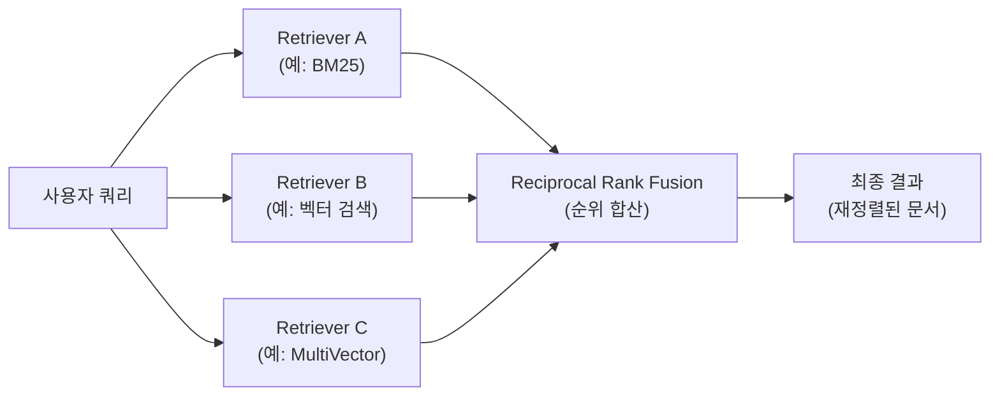
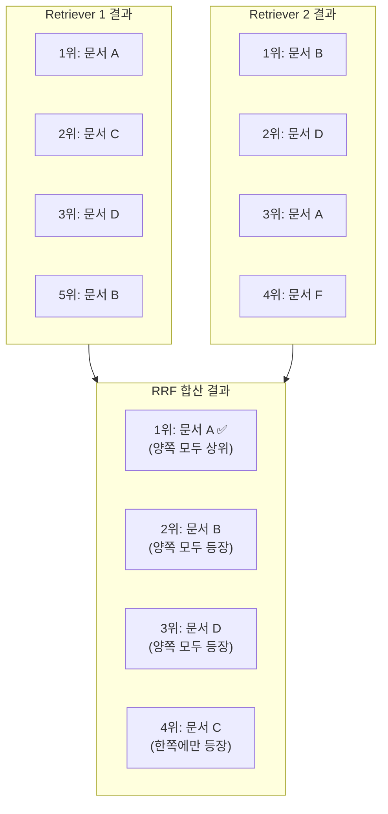
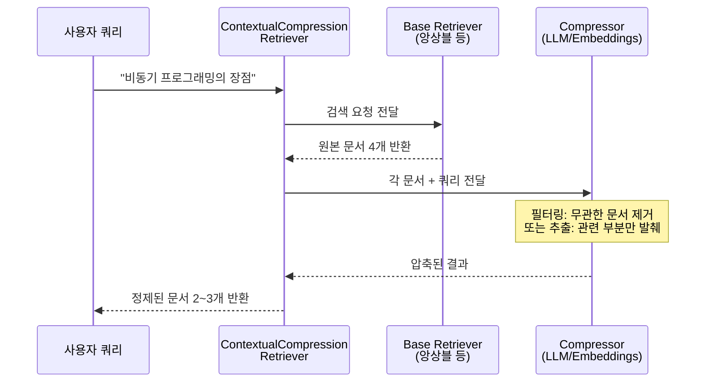
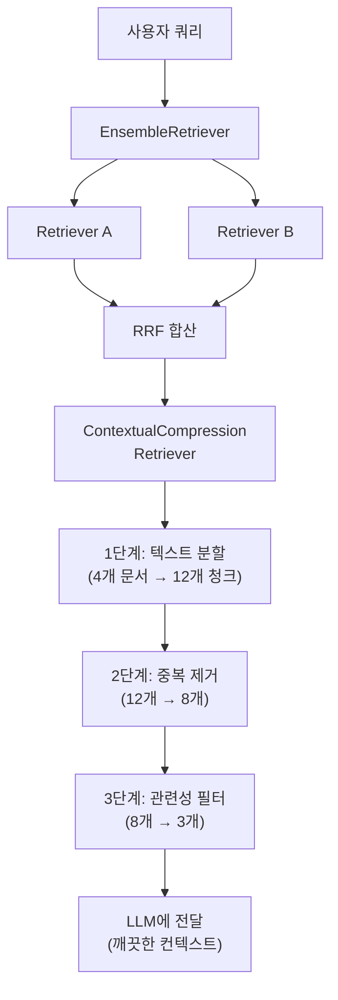

# 앙상블 검색과 Retriever 조합

> 여러 검색기의 장점을 하나로 결합하고, 검색 결과를 압축·정제하여 RAG 파이프라인의 최종 검색 품질을 극대화하는 방법을 배웁니다.

## 개요

이 섹션에서는 LangChain의 `EnsembleRetriever`로 여러 검색기를 조합하는 패턴을 살펴보고, `ContextualCompressionRetriever`와 `DocumentCompressorPipeline`으로 검색 결과에서 불필요한 정보를 걸러내는 압축 기법을 깊이 있게 학습합니다. 앞서 [10.1: 유사도 검색 심화](10-검색-품질-향상-유사도-검색과-메타데이터-필터링/01-유사도-검색-심화-top-k와-임계값-최적화.md)에서 배운 top-k/임계값 최적화, [10.2: MMR](10-검색-품질-향상-유사도-검색과-메타데이터-필터링/02-mmr-관련성과-다양성의-균형.md)의 다양성 확보, [10.3: 메타데이터 필터링](10-검색-품질-향상-유사도-검색과-메타데이터-필터링/03-메타데이터-필터링-구조화된-검색.md)의 구조화된 검색, [10.4: 다중 벡터 검색](10-검색-품질-향상-유사도-검색과-메타데이터-필터링/04-다중-벡터-검색과-multivector-retriever.md)의 MultiVectorRetriever까지 — 이번 섹션은 그 모든 기법을 **조합하고 정제하는 마지막 퍼즐 조각**입니다.

**선수 지식**: 
- top-k, similarity_score_threshold, MMR의 동작 원리 (Session 10.1~10.2)
- 메타데이터 필터링과 Self-Query Retriever (Session 10.3)
- MultiVectorRetriever와 ParentDocumentRetriever (Session 10.4)

**학습 목표**:
- EnsembleRetriever로 여러 Retriever를 결합하는 패턴을 이해하고 구현할 수 있다
- Reciprocal Rank Fusion(RRF) 알고리즘의 원리를 이해하고 가중치를 조절할 수 있다
- ContextualCompressionRetriever로 검색 결과를 압축·필터링할 수 있다
- DocumentCompressorPipeline으로 다단계 압축 파이프라인을 설계할 수 있다

## 왜 알아야 할까?

실무에서 RAG 시스템을 운영하다 보면 두 가지 문제를 빠르게 만나게 됩니다.

**첫째, 한 가지 검색 방식만으로는 부족합니다.** 벡터 검색은 의미적 유사성에 강하지만 정확한 키워드에 약하고, BM25 같은 키워드 검색은 그 반대입니다. MultiVectorRetriever는 요약 기반 검색에 뛰어나지만 단순 키워드 쿼리에는 과한 경우도 있죠. `EnsembleRetriever`는 이런 서로 다른 Retriever들을 하나로 결합하여 양쪽의 장점을 취합니다. (BM25의 원리와 하이브리드 검색 전략은 [Chapter 11: 하이브리드 검색](11-하이브리드-검색-bm25-키워드-검색과-벡터-검색-결합/01-bm25-키워드-검색-전통적-정보-검색의-힘.md)에서 본격적으로 다룹니다.)

**둘째, 검색 결과에 노이즈가 너무 많습니다.** 검색된 청크가 아무리 관련성이 높아도, 500토큰짜리 청크 안에서 실제로 필요한 정보는 한두 문장뿐인 경우가 많거든요. 이런 노이즈를 LLM에 그대로 전달하면 토큰 비용이 늘고, 할루시네이션(Hallucination) 위험도 높아집니다. **이번 섹션의 진짜 주인공은 바로 이 문제를 해결하는 `ContextualCompressionRetriever`와 `DocumentCompressorPipeline`입니다.**

## 핵심 개념

### 개념 1: EnsembleRetriever — 여러 검색기를 하나로

> 💡 **비유**: 레스토랑에서 메뉴를 고를 때, 맛집 블로거의 추천과 미슐랭 가이드의 평가를 함께 참고하면 더 좋은 선택을 하게 되죠? EnsembleRetriever는 여러 "미식 평론가"의 의견을 종합하여 최종 순위를 매기는 역할을 합니다.

LangChain의 `EnsembleRetriever`는 여러 Retriever의 검색 결과를 받아서, **Reciprocal Rank Fusion(RRF)** 알고리즘으로 결과를 합산·재정렬합니다. 어떤 종류의 Retriever든 조합할 수 있다는 게 핵심입니다 — BM25와 벡터 검색기, [10.4](10-검색-품질-향상-유사도-검색과-메타데이터-필터링/04-다중-벡터-검색과-multivector-retriever.md)에서 배운 MultiVectorRetriever, 심지어 MMR 기반 검색기까지 자유롭게 결합할 수 있죠.

```python
from langchain_community.retrievers import BM25Retriever
from langchain.retrievers import EnsembleRetriever
from langchain_chroma import Chroma
from langchain_openai import OpenAIEmbeddings

# 1. 문서 준비
docs = [...]  # Document 객체 리스트

# 2. 키워드 검색기 (BM25 — Ch11에서 원리를 자세히 다룹니다)
bm25_retriever = BM25Retriever.from_documents(docs, k=4)

# 3. 벡터 검색기 (의미 기반)
vectorstore = Chroma.from_documents(docs, OpenAIEmbeddings())
vector_retriever = vectorstore.as_retriever(search_kwargs={"k": 4})

# 4. 앙상블 — 키워드 40%, 벡터 60% 가중치
ensemble_retriever = EnsembleRetriever(
    retrievers=[bm25_retriever, vector_retriever],
    weights=[0.4, 0.6],  # 가중치 합이 1일 필요 없지만, 관례적으로 1로 맞춤
)

# 5. 검색 실행
results = ensemble_retriever.invoke("비동기 프로그래밍 패턴")
```

핵심 파라미터를 정리하면:

| 파라미터 | 설명 | 기본값 |
|----------|------|--------|
| `retrievers` | 결합할 Retriever 리스트 (2개 이상 가능) | 필수 |
| `weights` | 각 Retriever의 가중치 리스트 | 균등 배분 |
| `c` | RRF 상수 (순위 스무딩) | 60 |
| `id_key` | 문서 중복 제거용 메타데이터 키 | `None` |

> 📊 **그림 1**: EnsembleRetriever의 Retriever 조합 흐름



> 🔥 **실무 팁**: EnsembleRetriever에 2개 이상의 검색기를 넣을 수 있습니다. 예를 들어 `[bm25_retriever, vector_retriever, mmr_retriever]`처럼 3개를 결합하면 키워드 매칭 + 의미 유사도 + 다양성을 모두 확보할 수 있습니다. Session 10.4에서 배운 `MultiVectorRetriever`도 앙상블의 한 요소로 활용하면 효과적입니다.

### 개념 2: Reciprocal Rank Fusion(RRF) — 순위를 점수로 바꾸는 마법

> 💡 **비유**: 올림픽 다이빙에서 여러 심판의 점수를 단순 평균 내면 한 심판의 극단적 점수에 흔들립니다. 그래서 최고·최저 점수를 빼고 계산하죠. RRF도 비슷합니다 — 원래 점수(코사인 유사도, BM25 스코어)의 크기는 무시하고, **순위**만으로 최종 점수를 계산합니다. 이렇게 하면 서로 다른 스케일의 점수를 자연스럽게 합칠 수 있습니다.

RRF의 수식은 놀랍도록 간단합니다:

$$RRF(d) = \sum_{r \in R} \frac{w_r}{c + rank_r(d)}$$

- $d$: 문서
- $R$: 검색기 집합
- $w_r$: 검색기 $r$의 가중치
- $c$: 스무딩 상수 (기본 60)
- $rank_r(d)$: 검색기 $r$에서 문서 $d$의 순위 (1부터 시작)

이게 의미하는 바는 이렇습니다: 어떤 문서가 Retriever A에서 1위, Retriever B에서 3위라면, 가중치가 `[0.4, 0.6]`일 때 RRF 점수는 `0.4/(60+1) + 0.6/(60+3) = 0.01608`이 됩니다. 반면 A에서만 1위이고 B에는 안 나타난 문서는 `0.4/(60+1) = 0.00656`으로 점수가 낮아집니다. **여러 검색기에서 고르게 상위에 나타나는 문서가 유리한 구조**입니다.

```run:python
# RRF 점수 계산 예시
def rrf_score(ranks: dict[str, int], weights: dict[str, float], c: int = 60) -> float:
    """Reciprocal Rank Fusion 점수 계산"""
    return sum(weights[r] / (c + rank) for r, rank in ranks.items())

# 문서 A: Retriever1 1위, Retriever2 3위
doc_a = rrf_score(
    ranks={"r1": 1, "r2": 3},
    weights={"r1": 0.4, "r2": 0.6}
)

# 문서 B: Retriever1 5위, Retriever2 1위
doc_b = rrf_score(
    ranks={"r1": 5, "r2": 1},
    weights={"r1": 0.4, "r2": 0.6}
)

# 문서 C: Retriever1에만 2위
doc_c = rrf_score(
    ranks={"r1": 2},
    weights={"r1": 0.4, "r2": 0.6}
)

print(f"문서 A (R1: 1위, R2: 3위): {doc_a:.5f}")
print(f"문서 B (R1: 5위, R2: 1위): {doc_b:.5f}")
print(f"문서 C (R1만 2위):         {doc_c:.5f}")
print(f"\n최종 순위: A > B > C (양쪽에서 고르게 상위인 A가 1위)")
```

```output
문서 A (R1: 1위, R2: 3위): 0.01608
문서 B (R1: 5위, R2: 1위): 0.01598
문서 C (R1만 2위):         0.00645

최종 순위: A > B > C (양쪽에서 고르게 상위인 A가 1위)
```

> 📊 **그림 2**: RRF가 서로 다른 검색 결과를 합산하는 과정



### 개념 3: ContextualCompressionRetriever — 검색 결과를 압축하라

> 💡 **비유**: 도서관에서 책을 빌려왔는데, 실제로 필요한 건 300페이지 책의 5페이지뿐이라면? ContextualCompressionRetriever는 사서가 "이 질문에 관련된 부분만 형광펜으로 칠해서" 돌려주는 것과 같습니다. 검색 결과에서 쿼리와 실제로 관련 있는 부분만 추출하거나, 관련 없는 문서를 통째로 걸러냅니다.

`ContextualCompressionRetriever`는 기본 Retriever(base_retriever)가 가져온 결과를 **압축기(compressor)**가 후처리하는 래퍼(wrapper) 패턴입니다. 이 패턴이 강력한 이유는 **어떤 Retriever와도 결합할 수 있다**는 것입니다 — 단일 벡터 검색기든, 위에서 만든 EnsembleRetriever든, 무엇이든 base_retriever로 감쌀 수 있죠.

압축에는 크게 두 가지 전략이 있습니다:

1. **문서 필터링(Document Filtering)**: 관련 없는 문서를 통째로 제거
2. **내용 추출(Content Extraction)**: 문서 안에서 관련 부분만 발췌

LangChain은 이를 위한 다양한 압축기를 제공합니다:

| 압축기 | 전략 | 방식 | 속도 | 비용 |
|--------|------|------|------|------|
| `LLMChainExtractor` | 추출 | LLM이 관련 문장만 추출 | 느림 | 높음 |
| `LLMChainFilter` | 필터링 | LLM이 관련/무관 이진 판단 | 느림 | 중간 |
| `EmbeddingsFilter` | 필터링 | 임베딩 유사도 기반 | 빠름 | 낮음 |
| `CrossEncoderReranker` | 필터링+재정렬 | Cross-Encoder로 재점수 | 중간 | 낮음 |
| `FlashrankRerank` | 필터링+재정렬 | 경량 리랭커 | 빠름 | 무료 |

구체적으로 어떤 차이가 있을까요? 쿼리가 "비동기 프로그래밍의 장점"이고, 검색된 문서가 아래와 같다고 합시다:

> *"Python의 asyncio 모듈은 비동기 I/O를 위한 표준 라이브러리입니다. async/await 구문을 사용하여 동시성 코드를 작성할 수 있으며, 이벤트 루프 기반으로 동작합니다. asyncio.run()이 메인 진입점입니다."*

- **`LLMChainExtractor` 적용 후**: *"async/await 구문을 사용하여 동시성 코드를 작성할 수 있으며, 이벤트 루프 기반으로 동작합니다."* → 관련 문장만 추출
- **`EmbeddingsFilter` 적용 후**: 유사도가 임계값 이상이면 문서 전체 유지, 미만이면 통째로 제거
- **`LLMChainFilter` 적용 후**: LLM이 "관련 있음"으로 판단하면 전체 유지, "무관"이면 제거

```python
from langchain.retrievers import ContextualCompressionRetriever
from langchain.retrievers.document_compressors import LLMChainExtractor
from langchain_openai import ChatOpenAI

# 방법 1: LLM 기반 추출 — 가장 정확하지만 비용 높음
llm = ChatOpenAI(temperature=0, model="gpt-4o-mini")
compressor = LLMChainExtractor.from_llm(llm)

compression_retriever = ContextualCompressionRetriever(
    base_compressor=compressor,
    base_retriever=ensemble_retriever,  # 어떤 Retriever든 가능
)

# 검색 실행 — 관련 부분만 추출된 결과 반환
compressed_docs = compression_retriever.invoke("비동기 프로그래밍의 장점")
```

```python
from langchain.retrievers.document_compressors import EmbeddingsFilter
from langchain_openai import OpenAIEmbeddings

# 방법 2: 임베딩 기반 필터링 — 빠르고 저렴
embeddings_filter = EmbeddingsFilter(
    embeddings=OpenAIEmbeddings(),
    similarity_threshold=0.76,  # 이 값 미만의 문서는 제거
)

fast_compression_retriever = ContextualCompressionRetriever(
    base_compressor=embeddings_filter,
    base_retriever=ensemble_retriever,
)
```

> 📊 **그림 3**: ContextualCompressionRetriever의 동작 흐름



### 개념 4: DocumentCompressorPipeline — 다단계 압축 파이프라인

> 💡 **비유**: 정수기를 생각해보세요. 물이 필터 하나만 통과하는 게 아니라, 침전 → 활성탄 → 역삼투 → UV 살균 여러 단계를 거치면서 점점 깨끗해지죠? DocumentCompressorPipeline도 마찬가지입니다. 여러 압축 단계를 순차적으로 연결하여 검색 결과를 단계별로 정제합니다.

`DocumentCompressorPipeline`은 여러 변환기(transformer)와 압축기를 순서대로 체이닝합니다. 각 단계가 이전 단계의 출력을 입력으로 받아 점진적으로 결과를 정제하는 구조입니다.

대표적인 파이프라인 구성을 살펴보죠:

```python
from langchain.retrievers.document_compressors import (
    DocumentCompressorPipeline,
    EmbeddingsFilter,
)
from langchain_community.document_transformers import EmbeddingsRedundantFilter
from langchain.text_splitter import CharacterTextSplitter
from langchain_openai import OpenAIEmbeddings

embeddings = OpenAIEmbeddings()

# 1단계: 긴 청크를 작은 단위로 분할
splitter = CharacterTextSplitter(
    chunk_size=300, chunk_overlap=0, separator=". "
)

# 2단계: 중복·유사 청크 제거 (임베딩 코사인 유사도 기반)
redundant_filter = EmbeddingsRedundantFilter(embeddings=embeddings)

# 3단계: 쿼리와 관련성 낮은 청크 제거
relevant_filter = EmbeddingsFilter(
    embeddings=embeddings, 
    similarity_threshold=0.76  # 유사도 0.76 미만 필터링
)

pipeline_compressor = DocumentCompressorPipeline(
    transformers=[splitter, redundant_filter, relevant_filter]
)
```

각 단계에서 문서가 어떻게 변환되는지 구체적으로 보면:

```run:python
# 파이프라인 각 단계의 효과 시뮬레이션
stages = [
    ("원본 검색 결과", 4, "검색기가 반환한 문서"),
    ("1단계: 텍스트 분할", 12, "긴 청크 → 문장 단위 분할"),
    ("2단계: 중복 제거", 8, "유사한 내용의 청크 병합/제거"),
    ("3단계: 관련성 필터", 3, "쿼리와 무관한 청크 제거"),
]

for stage, count, desc in stages:
    bar = "█" * count + "░" * (12 - count)
    print(f"{stage:20s} | {bar} | {count:2d}개 — {desc}")

print(f"\n압축률: {4}개 문서 → {3}개 핵심 청크 (노이즈 75% 제거)")
```

```output
원본 검색 결과            | ████░░░░░░░░ |  4개 — 검색기가 반환한 문서
1단계: 텍스트 분할        | ████████████ | 12개 — 긴 청크 → 문장 단위 분할
2단계: 중복 제거          | ████████░░░░ |  8개 — 유사한 내용의 청크 병합/제거
3단계: 관련성 필터        | ███░░░░░░░░░ |  3개 — 쿼리와 무관한 청크 제거

압축률: 4개 문서 → 3개 핵심 청크 (노이즈 75% 제거)
```

왜 분할을 먼저 할까요? 긴 문서에서 관련 없는 문장과 관련 있는 문장이 섞여 있으면, 문서 단위 필터링으로는 관련 문장까지 버리게 됩니다. 먼저 잘게 쪼갠 뒤 필터링하면, **문장 수준의 정밀한 추출**이 가능해집니다.

이 파이프라인은 LLM 호출 없이 임베딩만으로 동작하므로 **빠르고 비용 효율적**입니다. 용도별 파이프라인 구성 예시를 정리하면:

| 목적 | 파이프라인 구성 | 특징 |
|------|---------------|------|
| 비용 최소화 | 분할 → 중복 제거 → EmbeddingsFilter | LLM 호출 없음, 가장 빠름 |
| 균형 잡힌 품질 | 분할 → 중복 제거 → FlashrankRerank | 경량 리랭커로 정확도 향상 |
| 최고 품질 | 분할 → EmbeddingsFilter → LLMChainExtractor | 2단계 필터 + LLM 추출 |

[12장: 리랭킹으로 검색 정확도 높이기](12-리랭킹으로-검색-정확도-높이기-cohere-rerank-활용/01-리랭킹의-원리-왜-초기-검색으로는-부족한가.md)에서 배울 Cohere Rerank이나 Cross-Encoder를 파이프라인에 추가하면 더욱 강력한 검색 파이프라인을 구축할 수 있습니다.

> 📊 **그림 4**: 전체 검색 파이프라인 — 앙상블 + 다단계 압축



## 실습: 직접 해보기

실제 문서 데이터로 Retriever 조합 + 다단계 압축 파이프라인을 구축해봅시다. 이 실습에서는 Python 공식 문서 스타일의 예제 문서를 활용합니다.

```python
# 필요한 패키지 설치
# pip install langchain langchain-openai langchain-chroma langchain-community rank-bm25

import os
from langchain_core.documents import Document
from langchain_community.retrievers import BM25Retriever
from langchain.retrievers import EnsembleRetriever
from langchain.retrievers import ContextualCompressionRetriever
from langchain.retrievers.document_compressors import (
    DocumentCompressorPipeline,
    EmbeddingsFilter,
)
from langchain_community.document_transformers import EmbeddingsRedundantFilter
from langchain.text_splitter import CharacterTextSplitter
from langchain_chroma import Chroma
from langchain_openai import OpenAIEmbeddings

# --- 1단계: 예제 문서 준비 ---
documents = [
    Document(
        page_content="Python의 asyncio 모듈은 비동기 I/O를 위한 표준 라이브러리입니다. "
        "async/await 구문을 사용하여 동시성 코드를 작성할 수 있으며, "
        "이벤트 루프 기반으로 동작합니다. asyncio.run()이 메인 진입점입니다.",
        metadata={"source": "python-docs", "topic": "asyncio", "chapter": "async"}
    ),
    Document(
        page_content="FastAPI는 Python 웹 프레임워크로, 내부적으로 Starlette과 Pydantic을 활용합니다. "
        "비동기 프로그래밍을 기본 지원하며 async def로 엔드포인트를 정의합니다. "
        "자동 API 문서 생성(Swagger UI)이 큰 장점입니다.",
        metadata={"source": "fastapi-docs", "topic": "web", "chapter": "async"}
    ),
    Document(
        page_content="threading 모듈은 Python에서 스레드 기반 병렬 처리를 제공합니다. "
        "GIL(Global Interpreter Lock) 때문에 CPU 바운드 작업에서는 효과가 제한적이지만, "
        "I/O 바운드 작업에서는 여전히 유용합니다.",
        metadata={"source": "python-docs", "topic": "threading", "chapter": "concurrency"}
    ),
    Document(
        page_content="multiprocessing 모듈은 GIL 제한을 우회하여 진정한 병렬 처리를 수행합니다. "
        "각 프로세스는 독립적인 메모리 공간을 가지므로 데이터 공유에 주의해야 합니다. "
        "Pool과 Process 클래스가 핵심 인터페이스입니다.",
        metadata={"source": "python-docs", "topic": "multiprocessing", "chapter": "concurrency"}
    ),
    Document(
        page_content="Django는 Python의 대표적인 웹 프레임워크로, MTV 패턴을 따릅니다. "
        "ORM, 관리자 패널, 인증 시스템 등 배터리 포함 철학을 지향합니다. "
        "Django 4.1부터 비동기 뷰를 공식 지원합니다.",
        metadata={"source": "django-docs", "topic": "web", "chapter": "web-framework"}
    ),
    Document(
        page_content="async/await은 Python 3.5에서 도입된 비동기 프로그래밍 구문입니다. "
        "코루틴(coroutine)을 정의하고 실행하는 데 사용되며, "
        "기존 콜백 지옥 문제를 해결합니다. yield from에서 발전한 문법입니다.",
        metadata={"source": "python-docs", "topic": "asyncio", "chapter": "async"}
    ),
    Document(
        page_content="SQLAlchemy는 Python ORM 라이브러리로 데이터베이스 작업을 객체 지향적으로 처리합니다. "
        "2.0 버전부터 비동기 세션(AsyncSession)을 지원하여 asyncio와 통합이 가능합니다. "
        "create_async_engine으로 비동기 엔진을 생성합니다.",
        metadata={"source": "sqlalchemy-docs", "topic": "database", "chapter": "async"}
    ),
]

# --- 2단계: 검색기 생성 ---
bm25_retriever = BM25Retriever.from_documents(documents, k=4)  # 키워드 검색
embeddings = OpenAIEmbeddings()
vectorstore = Chroma.from_documents(documents, embeddings)
vector_retriever = vectorstore.as_retriever(search_kwargs={"k": 4})  # 벡터 검색

# --- 3단계: 앙상블 검색기 생성 ---
ensemble_retriever = EnsembleRetriever(
    retrievers=[bm25_retriever, vector_retriever],
    weights=[0.4, 0.6],  # 의미 검색에 약간 더 가중치
)

# --- 4단계: 다단계 압축 파이프라인 구성 ---
splitter = CharacterTextSplitter(chunk_size=200, chunk_overlap=0, separator=". ")
redundant_filter = EmbeddingsRedundantFilter(embeddings=embeddings)
relevant_filter = EmbeddingsFilter(
    embeddings=embeddings,
    similarity_threshold=0.75,  # 유사도 0.75 미만은 제거
)

pipeline_compressor = DocumentCompressorPipeline(
    transformers=[splitter, redundant_filter, relevant_filter]
)

# --- 5단계: 최종 압축 Retriever ---
final_retriever = ContextualCompressionRetriever(
    base_compressor=pipeline_compressor,
    base_retriever=ensemble_retriever,
)

# --- 6단계: 검색 비교 ---
query = "Python 비동기 프로그래밍 방법"

# 6a. 앙상블 검색 (압축 전)
ensemble_results = ensemble_retriever.invoke(query)
print("=== 앙상블 검색 결과 (압축 전) ===")
for i, doc in enumerate(ensemble_results, 1):
    print(f"{i}. [{doc.metadata['source']}] {doc.page_content[:60]}...")

print()

# 6b. 앙상블 + 다단계 압축 (압축 후)
compressed_results = final_retriever.invoke(query)
print("=== 앙상블 + 다단계 압축 결과 ===")
print(f"압축 전: {len(ensemble_results)}개 문서 → 압축 후: {len(compressed_results)}개 청크")
for i, doc in enumerate(compressed_results, 1):
    print(f"{i}. [{doc.metadata['source']}] {doc.page_content[:80]}...")

print()
print("💡 압축 전후 비교: 노이즈가 제거되고 쿼리 관련 내용만 남았습니다.")
```

### 압축기별 비교 실험

어떤 압축기가 본인의 데이터에 적합한지 실험하는 패턴입니다:

```python
from langchain.retrievers.document_compressors import (
    LLMChainExtractor,
    LLMChainFilter,
    EmbeddingsFilter,
)
from langchain_openai import ChatOpenAI, OpenAIEmbeddings

llm = ChatOpenAI(temperature=0, model="gpt-4o-mini")
embeddings = OpenAIEmbeddings()

# 압축기별 비교
compressors = {
    "EmbeddingsFilter (빠름/저렴)": EmbeddingsFilter(
        embeddings=embeddings, similarity_threshold=0.75
    ),
    "LLMChainFilter (중간)": LLMChainFilter.from_llm(llm),
    "LLMChainExtractor (정확/비쌈)": LLMChainExtractor.from_llm(llm),
}

query = "Python 비동기 프로그래밍 방법"

for name, compressor in compressors.items():
    ccr = ContextualCompressionRetriever(
        base_compressor=compressor,
        base_retriever=ensemble_retriever,
    )
    results = ccr.invoke(query)
    print(f"[{name}]")
    print(f"  결과 수: {len(results)}개")
    if results:
        # 첫 번째 결과의 길이로 압축 정도 확인
        print(f"  첫 결과 길이: {len(results[0].page_content)}자")
    print()
```

## 더 깊이 알아보기

### RRF의 탄생 — 놀라울 정도로 단순한 승리

Reciprocal Rank Fusion은 2009년 워털루 대학교의 Gordon V. Cormack, Charles L. A. Clarke, Stefan Büttcher가 ACM SIGIR 학회에서 발표한 논문 *"Reciprocal rank fusion outperforms condorcet and individual rank learning methods"*에서 처음 제안되었습니다.

놀라운 점은, 당시 정보 검색 분야에서는 다중 검색 결과를 합치기 위해 **Condorcet 투표법**(프랑스 수학자 콩도르세의 사회 선택 이론에서 유래)이나 복잡한 머신러닝 기반 랭크 학습(Learn-to-Rank) 방법이 주류였다는 것입니다. RRF는 이런 복잡한 방법들보다 **단 한 줄의 수식으로 더 좋은 성능**을 보여주었습니다. 저자들은 "때로는 가장 단순한 해법이 최선"이라는 오컴의 면도날(Occam's razor) 원칙을 입증한 셈이죠.

RRF 상수 `c`가 60인 이유도 흥미롭습니다. 원 논문에서 TREC 데이터셋을 대상으로 실험한 결과 `c=60`이 가장 안정적이었기 때문인데요, 검색 결과가 적은 경우(예: 각 검색기에서 5개 미만) `c` 값을 낮추면(예: 10~20) 상위 순위의 영향력을 키울 수 있습니다.

### Contextual Compression의 발상

LangChain 팀은 2023년 블로그 포스트 *"Improving Document Retrieval with Contextual Compression"*에서 이 개념을 처음 공개했습니다. 핵심 통찰은 간단합니다: "검색은 문서 단위로 하지만, LLM이 실제로 필요한 건 문장 단위"라는 것. 기존에는 검색된 청크를 그대로 프롬프트에 넣었지만, 긴 청크 속에 관련 없는 문장이 섞여 있으면 LLM이 혼란을 겪거나 토큰을 낭비합니다. 이를 해결하기 위해 **검색 후 압축**이라는 후처리 패턴이 탄생했습니다.

2024년에는 RRF를 RAG에 적용한 **RAG-Fusion** 논문(Zackary Rackauckas)이 발표되어, LLM이 사용자 쿼리에서 여러 하위 쿼리를 생성하고 각각의 검색 결과를 RRF로 합산하는 기법이 주목받았습니다. 이 접근법은 기본 RAG 대비 답변 정확도를 8~10%, 포괄성을 30~40% 향상시킨 것으로 보고되었습니다.

### 🔄 LlamaIndex에서의 검색 품질 향상

이번 챕터에서 다룬 LangChain의 검색 품질 향상 기법들은 LlamaIndex에서도 동등한 기능으로 제공됩니다. [9.5: 프레임워크 비교](09-llamaindex로-rag-구축-대안-프레임워크-활용/05-langchain-vs-llamaindex-프레임워크-선택-가이드.md)에서 배운 것처럼 두 프레임워크는 설계 철학은 다르지만 핵심 기능은 대응됩니다.

| LangChain | LlamaIndex 동등 기능 | 설명 |
|-----------|---------------------|------|
| `EnsembleRetriever` | `QueryFusionRetriever` | 여러 검색기 결과를 RRF로 결합 |
| `ContextualCompressionRetriever` | `NodePostprocessor` 체이닝 | 검색 결과 후처리 파이프라인 |
| `EmbeddingsFilter` | `SimilarityPostprocessor` | 유사도 임계값 기반 노드 필터링 |
| `CrossEncoderReranker` | `SentenceTransformerRerank` | Cross-Encoder 모델로 재점수 |
| `FlashrankRerank` | `CohereRerank` | 외부 리랭킹 서비스 활용 |
| `DocumentCompressorPipeline` | 여러 `NodePostprocessor`를 리스트로 전달 | 다단계 후처리 파이프라인 |

LlamaIndex에서는 `QueryEngine` 생성 시 `node_postprocessors` 파라미터에 후처리기 리스트를 전달하는 방식으로, LangChain의 `DocumentCompressorPipeline`과 유사한 다단계 파이프라인을 구성합니다:

```python
# LlamaIndex 스타일 (참고용)
from llama_index.core.postprocessor import SimilarityPostprocessor
from llama_index.postprocessor.cohere_rerank import CohereRerank

query_engine = index.as_query_engine(
    node_postprocessors=[
        SimilarityPostprocessor(similarity_cutoff=0.7),  # 유사도 필터
        CohereRerank(top_n=3),                           # 리랭킹
    ]
)
```

> 💡 두 프레임워크의 검색 품질 향상 전략을 비교하고 싶다면, [9.5: LangChain vs LlamaIndex 비교](09-llamaindex로-rag-구축-대안-프레임워크-활용/05-langchain-vs-llamaindex-프레임워크-선택-가이드.md)의 프레임워크 비교 표를 참고하세요.

## 흔한 오해와 팁

> ⚠️ **흔한 오해**: "EnsembleRetriever의 가중치 합은 반드시 1이어야 한다." 사실 가중치 합이 1일 필요는 없습니다. `weights=[2, 3]`도 유효하며, 내부적으로 비율만 사용됩니다. 다만 관례적으로 합을 1로 맞추면 직관적으로 각 검색기의 기여도를 파악하기 쉽습니다.

> ⚠️ **흔한 오해**: "ContextualCompressionRetriever는 항상 결과를 개선한다." 아닙니다. `EmbeddingsFilter`의 `similarity_threshold`를 너무 높게 잡으면 관련 문서까지 필터링되어 오히려 검색 품질이 떨어집니다. 반대로 너무 낮으면 압축 효과가 없죠. 0.7~0.8 사이에서 시작하여 점진적으로 조절하세요.

> 💡 **알고 계셨나요?**: BM25Retriever를 사용하려면 `rank-bm25` 패키지가 필요합니다(`pip install rank-bm25`). BM25의 원리(TF-IDF 발전형, 문서 길이 정규화 등)와 하이브리드 검색의 깊은 분석은 [Chapter 11: 하이브리드 검색](11-하이브리드-검색-bm25-키워드-검색과-벡터-검색-결합/01-bm25-키워드-검색-전통적-정보-검색의-힘.md)에서 본격적으로 다루니, 여기서는 "키워드 기반 검색기"로 이해하고 넘어가도 충분합니다.

> 🔥 **실무 팁**: 프로덕션 환경에서 `LLMChainExtractor`는 문서마다 LLM API를 호출하므로 비용과 지연이 큽니다. 대신 `EmbeddingsFilter`(유사도 기반)나 `FlashrankRerank`(경량 리랭커)로 1차 필터링을 하고, 최종 단계에서만 LLM 압축을 적용하는 **2단계 전략**이 비용 대비 효과적입니다.

> 🔥 **실무 팁**: `DocumentCompressorPipeline`에서 `similarity_threshold`는 데이터 특성에 따라 크게 달라집니다. 기술 문서처럼 용어가 비슷한 도메인에서는 0.8 이상으로 높여야 실질적인 필터링이 되고, 다양한 주제가 섞인 데이터에서는 0.7 정도면 충분합니다. 반드시 본인의 데이터로 실험하세요.

## 핵심 정리

| 개념 | 설명 |
|------|------|
| `EnsembleRetriever` | 여러 Retriever의 결과를 RRF로 합산·재정렬하는 메타 검색기 |
| Reciprocal Rank Fusion (RRF) | 순위 기반 점수 합산 알고리즘. 원본 점수 스케일에 무관하게 동작 |
| `weights` | 각 검색기의 기여도 조절. 도메인 특성에 맞게 튜닝 |
| `ContextualCompressionRetriever` | 기본 Retriever + 압축기로 검색 후 결과를 정제하는 래퍼 |
| `LLMChainExtractor` | LLM으로 관련 문장만 추출 (가장 정확하지만 비용 높음) |
| `EmbeddingsFilter` | 임베딩 유사도 기반 문서 필터링 (빠르고 저렴) |
| `DocumentCompressorPipeline` | 분할 → 중복 제거 → 관련성 필터 등 다단계 압축 체이닝 |
| LlamaIndex 대응 | `NodePostprocessor`, `SimilarityPostprocessor`, `CohereRerank` 등 |

## 다음 섹션 미리보기

이번 챕터에서 배운 유사도 검색 최적화, MMR, 메타데이터 필터링, 다중 벡터 검색, 그리고 앙상블 검색과 압축까지 — 검색 품질을 높이는 다양한 기법을 살펴보았습니다. 다음 [Chapter 11: 하이브리드 검색](11-하이브리드-검색-bm25-키워드-검색과-벡터-검색-결합/01-bm25-키워드-검색-전통적-정보-검색의-힘.md)에서는 이번 세션에서 간략히 사용한 BM25 키워드 검색의 원리를 깊이 파고들며, Sparse Vector와 Dense Vector의 결합, 그리고 벡터 데이터베이스 자체의 하이브리드 검색 기능(Pinecone, Qdrant 등)을 활용하는 방법을 본격적으로 학습합니다.

## 참고 자료

- [LangChain EnsembleRetriever 공식 문서](https://python.langchain.com/api_reference/langchain/retrievers/langchain.retrievers.ensemble.EnsembleRetriever.html) - EnsembleRetriever의 전체 API 레퍼런스와 사용 예시
- [LangChain Contextual Compression 공식 가이드](https://python.langchain.com/v0.2/docs/how_to/contextual_compression/) - ContextualCompressionRetriever의 다양한 압축기 사용법
- [Improving Document Retrieval with Contextual Compression (LangChain Blog)](https://blog.langchain.com/improving-document-retrieval-with-contextual-compression/) - Contextual Compression 개념의 탄생 배경과 설계 철학
- [Reciprocal Rank Fusion outperforms Condorcet and Individual Rank Learning Methods (Cormack et al., 2009)](https://dl.acm.org/doi/10.1145/1571941.1572114) - RRF 알고리즘의 원본 논문
- [RAG-Fusion: a New Take on Retrieval-Augmented Generation (2024)](https://arxiv.org/abs/2402.03367) - RRF를 RAG에 적용한 RAG-Fusion 기법 논문
- [LlamaIndex Node Postprocessor 공식 문서](https://docs.llamaindex.ai/en/stable/module_guides/querying/node_postprocessors/) - LlamaIndex의 검색 결과 후처리 기법 가이드

---
### 🔗 Related Sessions
- [embedding](../05-임베딩-모델-이해-텍스트를-벡터로-변환/01-임베딩의-기본-개념-단어에서-문장까지.md) (prerequisite)
- [mmr](../10-검색-품질-향상-유사도-검색과-메타데이터-필터링/02-mmr-관련성과-다양성의-균형.md) (prerequisite)
- [similarity_score_threshold](../10-검색-품질-향상-유사도-검색과-메타데이터-필터링/01-유사도-검색-심화-top-k와-임계값-최적화.md) (prerequisite)
- [multivectorretriever](../10-검색-품질-향상-유사도-검색과-메타데이터-필터링/04-다중-벡터-검색과-multivector-retriever.md) (prerequisite)
