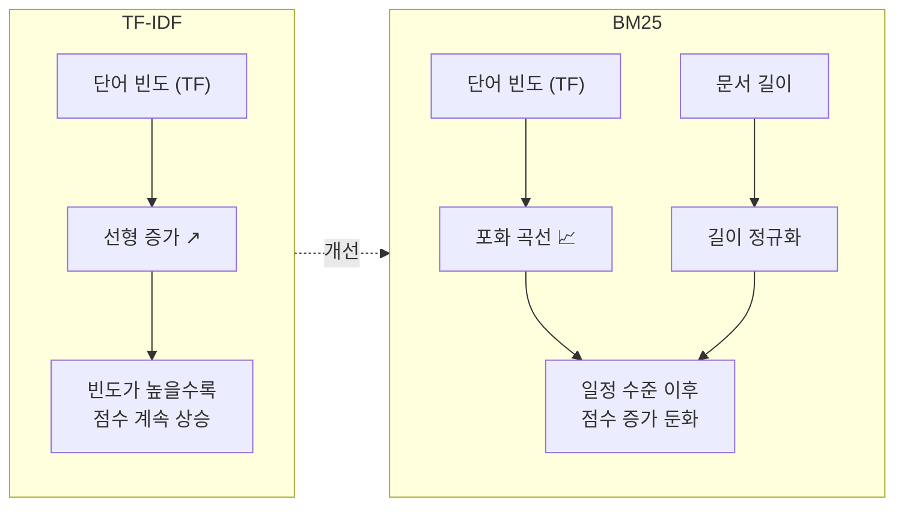
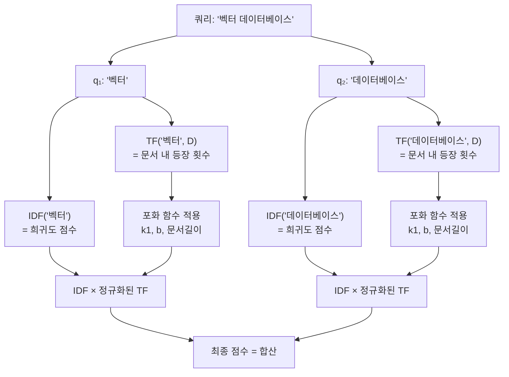
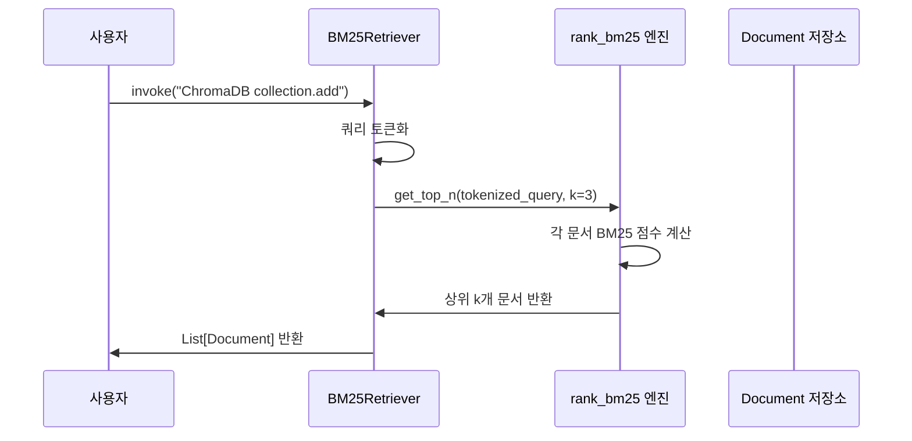
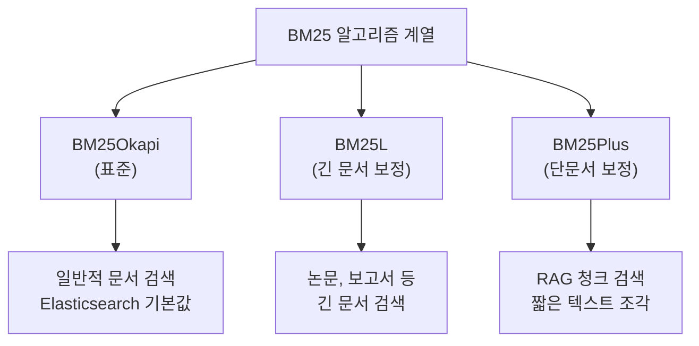

# BM25 키워드 검색 — 전통적 정보 검색의 힘

> 벡터 검색이 의미를 이해한다면, BM25는 단어 자체를 정확히 찾아냅니다. 30년 넘게 검색 엔진의 핵심이었던 BM25 알고리즘을 이해하고 Python으로 직접 구현해봅니다.

## 개요

이 섹션에서는 키워드 기반 검색의 대표 알고리즘인 BM25(Best Matching 25)를 학습합니다. 앞서 [Ch5: 임베딩 모델 이해](ch05/session1.md)와 [Ch10: 검색 품질 향상](ch10/session1.md)에서 벡터 유사도 검색을 깊이 다뤘는데요, 이번에는 그 반대편에 있는 키워드 검색의 세계로 들어갑니다. BM25는 단순해 보이지만, 특정 상황에서는 벡터 검색을 압도하는 성능을 보여줍니다.

**선수 지식**: 벡터 검색의 기본 개념(Ch5), 코사인 유사도(Cosine Similarity), LangChain Retriever 인터페이스(Ch8)
**학습 목표**:
- TF-IDF의 한계를 이해하고 BM25가 이를 어떻게 개선했는지 설명할 수 있다
- BM25의 핵심 파라미터(k1, b)의 역할을 직관적으로 이해한다
- `rank-bm25` 라이브러리와 LangChain `BM25Retriever`를 활용할 수 있다
- 벡터 검색 대비 키워드 검색이 더 유리한 시나리오를 구분할 수 있다

## 왜 알아야 할까?

여러분이 RAG 시스템을 만들었다고 가정해봅시다. 사용자가 "Python의 `asyncio.gather` 함수 사용법"을 질문합니다. 벡터 검색은 "비동기 프로그래밍", "동시성 처리" 같은 의미적으로 유사한 문서를 잘 찾아내지만, 정작 `asyncio.gather`라는 **정확한 함수명**이 포함된 문서를 놓칠 수 있습니다. 왜냐하면 임베딩 모델은 코드 토큰이나 고유명사를 의미 공간에서 정확히 구분하지 못하는 경우가 많기 때문이죠.

이런 상황에서 BM25는 빛을 발합니다. "asyncio.gather"라는 **정확한 키워드**가 포함된 문서를 확실하게 찾아줍니다. 실무에서 RAG를 운영하면 벡터 검색만으로는 해결할 수 없는 사각지대가 반드시 존재합니다. 고유명사, 제품 코드, 에러 메시지, API 이름 등 정확한 문자열 매칭이 필요한 순간이 그렇습니다. 2025~2026년 현재, 프로덕션 RAG 시스템을 운영하는 기업들은 대부분 BM25와 벡터 검색을 **함께** 사용하는 하이브리드 검색 전략을 채택하고 있습니다.

## 핵심 개념

### 개념 1: TF-IDF에서 BM25로 — 검색의 진화

> 💡 **비유**: 도서관에서 책을 찾는 사서를 상상해보세요. "머신러닝"이라는 단어가 100번 등장하는 500페이지짜리 두꺼운 교과서와, 10번 등장하는 20페이지짜리 핵심 요약집이 있습니다. 단순히 단어 빈도만 보면 교과서가 훨씬 관련성이 높아 보이겠죠? 하지만 실제로는 요약집이 더 집중적으로 해당 주제를 다루고 있을 수 있습니다. BM25는 이런 상황을 현명하게 처리하는 "경험 많은 사서"와 같습니다.

**TF-IDF의 문제점**부터 살펴보겠습니다. TF-IDF(Term Frequency-Inverse Document Frequency)는 단어의 빈도(TF)와 희귀성(IDF)을 곱해서 문서의 관련성을 평가합니다. 직관적이고 간단하지만 두 가지 치명적인 문제가 있습니다:

1. **단어 빈도의 무한 증가**: "머신러닝"이라는 단어가 10번 나온 문서와 100번 나온 문서의 점수 차이가 10배가 됩니다. 하지만 현실에서 100번 등장한다고 10배 더 관련성이 높을까요? 아닙니다.
2. **문서 길이 무시**: 1000단어 문서에서 "머신러닝"이 10번 나온 것과, 100단어 문서에서 10번 나온 것을 동일하게 취급합니다.

BM25는 이 두 문제를 **단어 빈도 포화(Term Frequency Saturation)**와 **문서 길이 정규화(Document Length Normalization)**로 해결합니다.

> 📊 **그림 1**: TF-IDF vs BM25의 단어 빈도 처리 방식 비교



### 개념 2: BM25 수식 파헤치기

BM25의 핵심 수식을 이해해봅시다. 겁먹지 마세요 — 각 부분이 무엇을 하는지 하나씩 분해하면 아주 직관적입니다.

$$\text{score}(D, Q) = \sum_{i=1}^{n} \text{IDF}(q_i) \cdot \frac{f(q_i, D) \cdot (k_1 + 1)}{f(q_i, D) + k_1 \cdot \left(1 - b + b \cdot \frac{|D|}{\text{avgdl}}\right)}$$

각 기호가 의미하는 바는 다음과 같습니다:

| 기호 | 의미 | 역할 |
|------|------|------|
| $Q$ | 검색 쿼리 | 사용자가 입력한 검색어 |
| $q_i$ | 쿼리의 i번째 단어 | 각 단어별로 점수를 계산 |
| $D$ | 평가 대상 문서 | 이 문서가 얼마나 관련 있는지 |
| $f(q_i, D)$ | 문서 D에서 단어 $q_i$의 등장 횟수 | 단어 빈도 (TF) |
| $\|D\|$ | 문서 D의 길이 (단어 수) | 문서가 얼마나 긴지 |
| $\text{avgdl}$ | 전체 문서의 평균 길이 | 길이 비교 기준 |
| $k_1$ | TF 포화 파라미터 (기본값: 1.2~2.0) | 단어 빈도 영향력 조절 |
| $b$ | 문서 길이 정규화 파라미터 (기본값: 0.75) | 길이 보정 정도 조절 |
| $\text{IDF}(q_i)$ | 역문서 빈도 | 희귀한 단어에 높은 가중치 |

> 💡 **비유**: BM25 수식을 레스토랑 평가에 비유해볼까요? IDF는 "얼마나 특별한 메뉴인지"(흔한 메뉴보다 희귀한 메뉴가 더 차별화됨), TF 포화는 "같은 메뉴를 여러 번 먹어봤다고 평가가 무한히 올라가지 않는 것"(세 번째까지는 확신이 늘지만, 열 번째는 세 번째와 큰 차이 없음), 문서 길이 정규화는 "메뉴가 100개인 뷔페와 10개인 전문점을 공정하게 비교하는 것"입니다.

**k1 파라미터**의 직관적 이해: k1은 "단어가 몇 번 나오면 충분한가"를 결정합니다. k1=0이면 단어 빈도를 완전히 무시하고 IDF만 봅니다. k1이 커질수록 빈도 차이에 더 민감해집니다. 실무에서는 1.2~2.0 사이가 가장 잘 작동합니다.

**b 파라미터**의 직관적 이해: b는 "문서 길이를 얼마나 신경 쓸 것인가"를 결정합니다. b=0이면 문서 길이를 완전히 무시합니다. b=1이면 길이 차이를 최대한 반영합니다. 기본값 0.75는 적당한 균형점이죠.

> 📊 **그림 2**: BM25 점수 계산 흐름



### 개념 3: rank-bm25로 BM25 직접 사용하기

이제 이론을 코드로 옮겨봅시다. Python에서 BM25를 가장 쉽게 사용할 수 있는 라이브러리는 `rank-bm25`입니다. LangChain의 `BM25Retriever`도 내부적으로 이 라이브러리를 사용하고 있죠.

먼저 설치합니다:

```python
pip install rank-bm25
```

기본 사용법을 살펴보겠습니다:

```run:python
from rank_bm25 import BM25Okapi

# 검색 대상 문서 (코퍼스)
corpus = [
    "파이썬으로 웹 크롤링하는 방법",
    "자바스크립트 비동기 프로그래밍 가이드",
    "파이썬 asyncio.gather 함수 사용법",
    "머신러닝 모델 학습과 평가",
    "파이썬 데이터 분석 pandas 라이브러리",
]

# 토큰화: BM25는 전처리를 직접 해야 합니다
tokenized_corpus = [doc.split() for doc in corpus]

# BM25 인덱스 생성
bm25 = BM25Okapi(tokenized_corpus)

# 검색 쿼리
query = "파이썬 asyncio.gather"
tokenized_query = query.split()

# 각 문서의 BM25 점수 계산
scores = bm25.get_scores(tokenized_query)

for i, (doc, score) in enumerate(zip(corpus, scores)):
    print(f"[{i}] 점수: {score:.4f} | {doc}")
```

```output
[0] 점수: 0.4361 | 파이썬으로 웹 크롤링하는 방법
[1] 점수: 0.0000 | 자바스크립트 비동기 프로그래밍 가이드
[2] 점수: 0.9808 | 파이썬 asyncio.gather 함수 사용법
[3] 점수: 0.0000 | 머신러닝 모델 학습과 평가
[4] 점수: 0.4361 | 파이썬 데이터 분석 pandas 라이브러리
```

결과를 보면 `asyncio.gather`라는 정확한 키워드가 포함된 문서 [2]가 가장 높은 점수를 받았습니다. "파이썬"이 포함된 문서 [0], [4]도 일부 점수를 받았고, 관련 없는 문서 [1], [3]은 0점입니다. 이것이 바로 키워드 검색의 강점이죠 — 정확한 용어를 **확실하게** 매칭합니다.

> ⚠️ **흔한 오해**: "BM25는 단순한 문자열 매칭이다"라고 생각하기 쉽지만, 그렇지 않습니다. BM25는 단어 빈도, 문서 길이, 역문서 빈도를 모두 고려하는 **통계적 랭킹 알고리즘**입니다. 단순 매칭(CTRL+F)과는 차원이 다릅니다.

### 개념 4: LangChain BM25Retriever — RAG와 통합하기

LangChain은 `BM25Retriever`를 제공하여 기존 RAG 파이프라인에 BM25를 쉽게 통합할 수 있게 해줍니다. 설치부터 해봅시다:

```python
pip install langchain-community rank-bm25
```

LangChain의 Document 객체와 함께 사용하는 방법입니다:

```run:python
from langchain_community.retrievers import BM25Retriever
from langchain_core.documents import Document

# Document 객체 리스트 생성
docs = [
    Document(
        page_content="ChromaDB는 오픈소스 벡터 데이터베이스입니다.",
        metadata={"source": "chroma_docs.md", "chapter": 6}
    ),
    Document(
        page_content="FAISS는 Facebook이 개발한 유사도 검색 라이브러리입니다.",
        metadata={"source": "faiss_docs.md", "chapter": 7}
    ),
    Document(
        page_content="Pinecone은 관리형 벡터 데이터베이스 서비스입니다.",
        metadata={"source": "pinecone_docs.md", "chapter": 7}
    ),
    Document(
        page_content="ChromaDB의 collection.add() 메서드로 문서를 추가합니다.",
        metadata={"source": "chroma_api.md", "chapter": 6}
    ),
    Document(
        page_content="벡터 검색은 코사인 유사도로 가장 가까운 문서를 찾습니다.",
        metadata={"source": "search_basics.md", "chapter": 10}
    ),
]

# BM25Retriever 생성 (상위 3개 결과 반환)
retriever = BM25Retriever.from_documents(docs, k=3)

# 검색 실행
results = retriever.invoke("ChromaDB collection.add 사용법")

for doc in results:
    print(f"[{doc.metadata['source']}] {doc.page_content}")
```

```output
[chroma_api.md] ChromaDB의 collection.add() 메서드로 문서를 추가합니다.
[chroma_docs.md] ChromaDB는 오픈소스 벡터 데이터베이스입니다.
[search_basics.md] 벡터 검색은 코사인 유사도로 가장 가까운 문서를 찾습니다.
```

"ChromaDB"와 "collection.add"라는 키워드가 정확히 매칭되어, API 문서가 1위로 검색되었습니다. 벡터 검색이었다면 "문서를 추가하는 방법"이라는 의미에 집중하여 다른 결과를 줄 수도 있었겠죠.

> 📊 **그림 3**: BM25Retriever의 LangChain 통합 흐름



**BM25Plus 변형**도 사용할 수 있습니다. BM25Plus는 짧은 문서에 대한 편향을 줄여주어, RAG에서 흔히 사용하는 짧은 청크 검색에 특히 유용합니다:

```python
# BM25Plus 변형 사용 — 짧은 청크에 유리
retriever_plus = BM25Retriever.from_documents(
    docs,
    k=3,
    bm25_variant="plus",        # BM25Plus 활성화
    bm25_params={"delta": 0.5}, # delta: 최소 보정값
)
```

### 개념 5: 벡터 검색 vs BM25 — 언제 무엇을 쓸까?

두 검색 방식의 장단점을 명확히 이해하는 것이 중요합니다. 각각이 빛나는 시나리오가 다르거든요.

> 💡 **비유**: 벡터 검색은 "맥락을 읽는 번역가"와 같고, BM25는 "정확한 단어를 찾는 색인 전문가"와 같습니다. 번역가는 "행복"과 "기쁨"이 같은 뜻임을 알지만, 색인 전문가는 "행복"이라는 정확한 단어가 어디에 있는지를 정확하게 찾아냅니다. 최고의 검색 시스템은 둘 다 고용합니다.

| 시나리오 | BM25 우수 | 벡터 검색 우수 |
|----------|-----------|---------------|
| 고유명사 검색 ("ChromaDB") | ✅ 정확한 매칭 | ❌ 임베딩에서 구분 어려움 |
| 코드/API 이름 ("asyncio.gather") | ✅ 토큰 단위 매칭 | ❌ 코드 토큰 임베딩 부정확 |
| 에러 메시지 검색 | ✅ 정확한 문자열 매칭 | ❌ 에러 코드 혼동 가능 |
| 동의어/유사 개념 검색 | ❌ 다른 단어면 매칭 불가 | ✅ 의미적 유사성 포착 |
| 다국어/번역 검색 | ❌ 언어가 다르면 불가 | ✅ 다국어 임베딩 가능 |
| 자연어 질문 검색 | ❌ 단어 겹침에 의존 | ✅ 질문 의도 파악 |
| 약어/축약어 | ✅ 정확한 매칭 | ❌ 임베딩에서 손실 가능 |
| 오타가 포함된 검색 | ❌ 오타면 매칭 실패 | ✅ 의미로 보완 가능 |

```run:python
# BM25가 벡터 검색보다 우수한 대표적 사례 시뮬레이션
test_cases = {
    "고유명사": {
        "query": "Qdrant",
        "docs": ["Qdrant는 Rust로 작성된 벡터 DB입니다", "벡터 데이터베이스는 유사도 검색을 합니다"],
        "expected_winner": "BM25",
    },
    "에러 메시지": {
        "query": "IndexError: list index out of range",
        "docs": ["IndexError: list index out of range 해결법", "리스트 인덱스 범위 초과 오류 대처"],
        "expected_winner": "BM25",
    },
    "의미 검색": {
        "query": "문서를 작은 조각으로 나누기",
        "docs": ["텍스트 청킹 전략 가이드", "문서 분할과 최적화 방법"],
        "expected_winner": "벡터 검색",
    },
}

for case_name, case in test_cases.items():
    from rank_bm25 import BM25Okapi
    tokenized = [doc.split() for doc in case["docs"]]
    bm25 = BM25Okapi(tokenized)
    scores = bm25.get_scores(case["query"].split())
    winner_idx = scores.argmax()
    print(f"[{case_name}] 쿼리: '{case['query']}'")
    print(f"  BM25 1위: '{case['docs'][winner_idx]}' (점수: {scores[winner_idx]:.4f})")
    print(f"  이 시나리오 유리: {case['expected_winner']}")
    print()
```

```output
[고유명사] 쿼리: 'Qdrant'
  BM25 1위: 'Qdrant는 Rust로 작성된 벡터 DB입니다' (점수: 0.6931)
  이 시나리오 유리: BM25

[에러 메시지] 쿼리: 'IndexError: list index out of range'
  BM25 1위: 'IndexError: list index out of range 해결법' (점수: 2.4404)
  이 시나리오 유리: BM25

[의미 검색] 쿼리: '문서를 작은 조각으로 나누기'
  BM25 1위: '문서 분할과 최적화 방법' (점수: 0.4055)
  이 시나리오 유리: 벡터 검색
```

## 실습: 직접 해보기

실제 RAG 시나리오를 모사하여, 기술 문서 코퍼스에서 BM25 검색을 구현해봅시다. 토큰화 전처리도 포함한 완전한 예제입니다.

```python
"""
BM25 키워드 검색 실습 — 기술 문서 검색 시스템
필요 패키지: pip install rank-bm25 langchain-community langchain-core
"""
from rank_bm25 import BM25Okapi
from langchain_community.retrievers import BM25Retriever
from langchain_core.documents import Document


# ── 1. 기술 문서 코퍼스 준비 ──
tech_docs = [
    Document(
        page_content="LangChain의 LCEL(LangChain Expression Language)은 파이프 연산자(|)로 "
        "컴포넌트를 연결하는 선언적 문법입니다. RunnablePassthrough, RunnableParallel "
        "등의 유틸리티를 제공합니다.",
        metadata={"source": "langchain_lcel.md", "topic": "LCEL"},
    ),
    Document(
        page_content="ChromaDB에서 collection.query() 메서드를 사용하면 벡터 유사도 검색을 "
        "수행할 수 있습니다. n_results 파라미터로 반환할 문서 수를 지정합니다.",
        metadata={"source": "chromadb_query.md", "topic": "ChromaDB"},
    ),
    Document(
        page_content="텍스트 임베딩은 자연어를 고차원 벡터 공간의 숫자 배열로 변환하는 과정입니다. "
        "의미적으로 유사한 텍스트는 벡터 공간에서 가까이 위치합니다.",
        metadata={"source": "embedding_intro.md", "topic": "임베딩"},
    ),
    Document(
        page_content="RecursiveCharacterTextSplitter는 LangChain에서 가장 권장되는 텍스트 "
        "분할기입니다. chunk_size와 chunk_overlap 파라미터로 청크 크기를 조절합니다.",
        metadata={"source": "text_splitter.md", "topic": "청킹"},
    ),
    Document(
        page_content="FAISS(Facebook AI Similarity Search)는 대규모 벡터 검색을 위한 "
        "라이브러리입니다. IndexFlatL2, IndexIVFFlat 등 다양한 인덱스를 제공합니다.",
        metadata={"source": "faiss_guide.md", "topic": "FAISS"},
    ),
    Document(
        page_content="OpenAI의 text-embedding-3-small 모델은 1536차원 벡터를 생성합니다. "
        "비용 대비 성능이 우수하여 RAG 시스템에서 많이 사용됩니다.",
        metadata={"source": "openai_embedding.md", "topic": "임베딩"},
    ),
    Document(
        page_content="RAGAS 프레임워크는 Faithfulness, Answer Relevancy, Context Precision, "
        "Context Recall 등의 메트릭으로 RAG 시스템을 자동 평가합니다.",
        metadata={"source": "ragas_eval.md", "topic": "평가"},
    ),
    Document(
        page_content="에러: ValueError: Could not import chromadb python package. "
        "해결법: pip install chromadb 명령어로 패키지를 설치하세요.",
        metadata={"source": "troubleshooting.md", "topic": "에러"},
    ),
]


# ── 2. rank-bm25 직접 사용 ──
print("=" * 60)
print("📌 rank-bm25 직접 사용")
print("=" * 60)

# 토큰화 (간단한 공백 분할)
corpus_texts = [doc.page_content for doc in tech_docs]
tokenized_corpus = [text.split() for text in corpus_texts]

# BM25 인덱스 생성 (k1=1.5, b=0.75 기본값)
bm25 = BM25Okapi(tokenized_corpus, k1=1.5, b=0.75)

# 다양한 쿼리로 테스트
queries = [
    "ChromaDB collection.query 사용법",          # 고유명사 + API 이름
    "RecursiveCharacterTextSplitter chunk_size",  # 클래스명 + 파라미터
    "ValueError chromadb import 에러",            # 에러 메시지
    "텍스트를 숫자로 변환하는 방법",                # 의미적 질문 (BM25 약점)
]

for query in queries:
    tokenized_query = query.split()
    scores = bm25.get_scores(tokenized_query)

    # 상위 2개 결과
    top_indices = scores.argsort()[-2:][::-1]

    print(f"\n🔍 쿼리: '{query}'")
    for idx in top_indices:
        if scores[idx] > 0:
            print(f"  📄 [{tech_docs[idx].metadata['source']}] "
                  f"점수: {scores[idx]:.4f}")
            print(f"     {corpus_texts[idx][:60]}...")


# ── 3. LangChain BM25Retriever 사용 ──
print("\n" + "=" * 60)
print("📌 LangChain BM25Retriever 사용")
print("=" * 60)

# BM25Retriever 생성
lc_retriever = BM25Retriever.from_documents(
    tech_docs,
    k=3,  # 상위 3개 반환
)

# Retriever 인터페이스로 검색
query = "FAISS IndexFlatL2 벡터 검색"
results = lc_retriever.invoke(query)

print(f"\n🔍 쿼리: '{query}'")
for i, doc in enumerate(results, 1):
    print(f"  {i}. [{doc.metadata['source']}] {doc.page_content[:60]}...")


# ── 4. 커스텀 전처리 함수 적용 ──
print("\n" + "=" * 60)
print("📌 커스텀 전처리 함수 적용")
print("=" * 60)

def korean_preprocess(text: str) -> list[str]:
    """간단한 한국어 전처리: 소문자 변환 + 특수문자 기반 분리"""
    import re
    # 소문자 변환 (영문 키워드 대소문자 통일)
    text = text.lower()
    # 알파벳, 한글, 숫자 외 문자를 공백으로 치환
    text = re.sub(r"[^\w가-힣]", " ", text)
    # 공백 기준 토큰화 후 빈 문자열 제거
    tokens = [t for t in text.split() if len(t) > 1]
    return tokens

# 전처리 함수를 적용한 Retriever
lc_retriever_custom = BM25Retriever.from_documents(
    tech_docs,
    k=3,
    preprocess_func=korean_preprocess,
)

query = "chromadb query 메서드"
results = lc_retriever_custom.invoke(query)

print(f"\n🔍 쿼리 (전처리 적용): '{query}'")
for i, doc in enumerate(results, 1):
    print(f"  {i}. [{doc.metadata['source']}] {doc.page_content[:60]}...")
```

> 🔥 **실무 팁**: 한국어 BM25 검색의 성능을 높이려면 형태소 분석기(`konlpy`의 `Okt`, `Mecab` 등)를 전처리 함수로 사용하세요. "데이터베이스를" → ["데이터베이스"]로 어간을 추출하면 매칭률이 크게 올라갑니다. 다만 이번 실습에서는 의존성을 최소화하기 위해 간단한 공백 분할을 사용했습니다.

## 더 깊이 알아보기

### BM25의 탄생 — Okapi 시스템과 TREC 대회

BM25의 "BM"은 **Best Matching**의 약자이고, "25"는 이 공식이 확률적 검색 프레임워크의 25번째 변형이었기 때문에 붙은 이름입니다. 이 알고리즘의 역사는 1970~80년대 영국 런던 시티 대학교(City, University of London)로 거슬러 올라갑니다.

**Stephen E. Robertson**과 **Karen Spärck Jones**는 확률적 정보 검색 프레임워크(Probabilistic Relevance Framework)를 연구했는데요, 이 프레임워크에서 수많은 랭킹 함수 변형이 탄생했고, 그중 25번째가 바로 BM25였습니다. "Okapi"라는 이름은 이 알고리즘을 처음 구현한 정보 검색 시스템의 이름에서 온 것입니다. Okapi는 아프리카에 사는 기린과의 동물인데, 왜 이 이름을 붙였는지는 명확하지 않지만, 당시 런던 시티 대학교의 연구자들이 선택한 것으로 알려져 있습니다.

BM25가 본격적으로 주목받은 계기는 **TREC(Text REtrieval Conference)** 대회였습니다. 미국 NIST에서 주최한 이 대회에서 BM25 기반 시스템이 뛰어난 성능을 보이면서, 전 세계 검색 엔진 개발자들이 이 알고리즘을 채택하기 시작했습니다. 이후 Elasticsearch, Apache Lucene, Apache Solr 등 현대 검색 엔진의 기본 랭킹 함수로 자리잡게 되었죠.

Stephen Robertson은 이 공헌을 인정받아 2000년에 ACM의 **Gerard Salton Award**를 수상했습니다. 이 상은 정보 검색 분야에서 3년마다 한 번 수여되는 최고 권위의 상입니다. 30년이 넘는 세월이 지났지만, BM25는 여전히 Elasticsearch의 기본 랭킹 함수로 사용되고 있을 만큼 그 설계가 탁월했습니다.

> 💡 **알고 계셨나요?**: Karen Spärck Jones는 IDF(Inverse Document Frequency) 개념을 1972년에 처음 제안한 인물이기도 합니다. 그녀의 연구 없이는 TF-IDF도, BM25도 존재하지 않았을 것입니다. 그녀는 "Computing is too important to be left to men"이라는 유명한 말을 남기기도 했죠.

### BM25 변형들

`rank-bm25` 라이브러리는 세 가지 BM25 변형을 제공합니다:

| 변형 | 특징 | 적합한 상황 |
|------|------|------------|
| **BM25Okapi** | 표준 BM25, 가장 널리 사용 | 일반적인 문서 검색 |
| **BM25L** | 긴 문서에 대한 페널티 완화 | 문서 길이 편차가 큰 코퍼스 |
| **BM25Plus** | 매칭 단어에 항상 양의 점수 보장 | 짧은 청크, RAG 환경 |

> 📊 **그림 4**: BM25 변형별 특성 비교



## 흔한 오해와 팁

> ⚠️ **흔한 오해**: "BM25는 옛날 기술이니까 딥러닝 임베딩보다 무조건 열등하다"고 생각하기 쉽습니다. 하지만 실제로는 정확한 키워드 매칭이 필요한 시나리오에서 BM25가 벡터 검색을 앞서는 경우가 많습니다. 특히 코드 검색, 에러 메시지 검색, 제품 코드 검색 등에서 두드러집니다. BM25는 "오래된" 것이 아니라 "검증된" 것입니다.

> 💡 **알고 계셨나요?**: BM25는 사실 **Elasticsearch, Apache Solr의 기본 랭킹 알고리즘**입니다. 구글 검색 이전 세대의 대부분의 검색 엔진이 BM25를 핵심으로 사용했고, 현재도 키워드 검색의 백본으로 사용되고 있습니다. Lucene은 2015년에 기본 랭킹 함수를 TF-IDF에서 BM25로 교체했을 정도입니다.

> 🔥 **실무 팁**: BM25의 `k1`과 `b` 파라미터 튜닝이 성능에 큰 영향을 미칩니다. 기본값(k1=1.5, b=0.75)이 대부분 잘 작동하지만, 코퍼스 특성에 따라 조정해보세요. 짧은 청크 위주의 RAG라면 `b`를 낮추고(예: 0.3~0.5), 다양한 길이의 문서가 섞여 있다면 기본값을 유지하는 것이 좋습니다. `rank-bm25`에서는 `BM25Okapi(tokenized_corpus, k1=1.2, b=0.5)` 형태로 직접 지정할 수 있습니다.

## 핵심 정리

| 개념 | 설명 |
|------|------|
| BM25 | TF-IDF를 개선한 확률적 랭킹 알고리즘. 단어 빈도 포화와 문서 길이 정규화가 핵심 |
| k1 파라미터 | 단어 빈도의 포화 속도를 조절 (기본값 1.2~2.0). 값이 클수록 빈도 차이에 민감 |
| b 파라미터 | 문서 길이 정규화 강도 조절 (기본값 0.75). b=0이면 길이 무시, b=1이면 완전 정규화 |
| IDF | 역문서 빈도. 전체 문서 중 해당 단어가 나타나는 문서가 적을수록 높은 점수 |
| rank-bm25 | Python BM25 구현 라이브러리. BM25Okapi, BM25L, BM25Plus 세 가지 변형 제공 |
| BM25Retriever | LangChain의 BM25 래퍼. `from_documents()`, `from_texts()`로 생성, `invoke()`로 검색 |
| BM25Plus | 매칭 단어에 항상 양의 점수를 보장하는 BM25 변형. 짧은 청크 검색에 유리 |
| BM25 강점 시나리오 | 고유명사, 코드/API 이름, 에러 메시지, 약어 등 정확한 키워드 매칭이 필요한 경우 |

## 다음 섹션 미리보기

BM25의 원리와 사용법을 익혔으니, 이제 본격적으로 **벡터 검색과 BM25를 결합하는 하이브리드 검색**을 구현할 차례입니다. 다음 섹션 [11.2: 하이브리드 검색 구현]에서는 LangChain의 `EnsembleRetriever`를 활용하여 두 검색 방식의 결과를 가중치 기반으로 합치는 방법을 학습합니다. 각 검색 방식이 서로의 약점을 어떻게 보완하는지 직접 확인하게 될 것입니다.

## 참고 자료

- [BM25 integration — LangChain 공식 문서](https://docs.langchain.com/oss/python/integrations/retrievers/bm25) - BM25Retriever의 설치, 사용법, BM25Plus 변형 등 공식 가이드
- [rank_bm25 — GitHub 리포지토리](https://github.com/dorianbrown/rank_bm25) - BM25Okapi, BM25L, BM25Plus 구현이 포함된 Python 라이브러리
- [Okapi BM25 — Wikipedia](https://en.wikipedia.org/wiki/Okapi_BM25) - BM25의 수학적 공식, 역사, 파라미터 설명
- [The Probabilistic Relevance Framework: BM25 and Beyond](https://www.staff.city.ac.uk/~sbrp622/papers/foundations_bm25_review.pdf) - Stephen Robertson의 BM25 원전 논문. 확률적 검색 프레임워크의 이론적 기반
- [Practical BM25 — Elastic Blog](https://www.elastic.co/blog/practical-bm25-part-2-the-bm25-algorithm-and-its-variables) - Elasticsearch의 BM25 구현과 파라미터 튜닝 실무 가이드
- [LangChain RAG From Scratch](https://github.com/langchain-ai/rag-from-scratch) - LangChain 팀의 RAG 구현 튜토리얼 시리즈

---
### 🔗 Related Sessions
- [document](../03-문서-로딩과-파싱-다양한-소스에서-데이터-수집/01-문서-로딩-기초-langchain-document-loaders.md) (prerequisite)
- [page_content](../03-문서-로딩과-파싱-다양한-소스에서-데이터-수집/01-문서-로딩-기초-langchain-document-loaders.md) (prerequisite)
