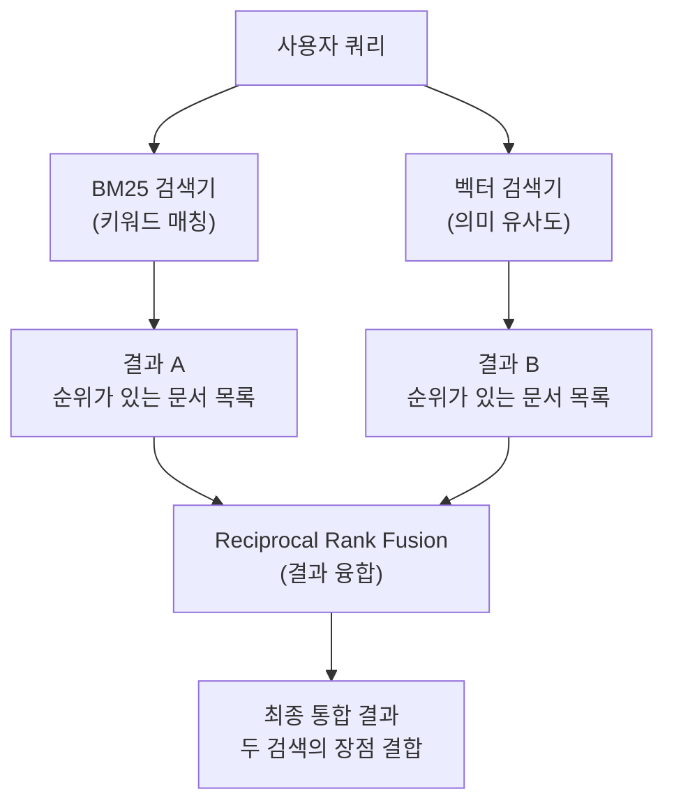
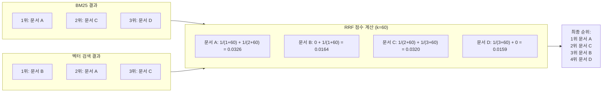
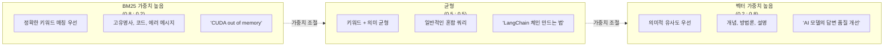
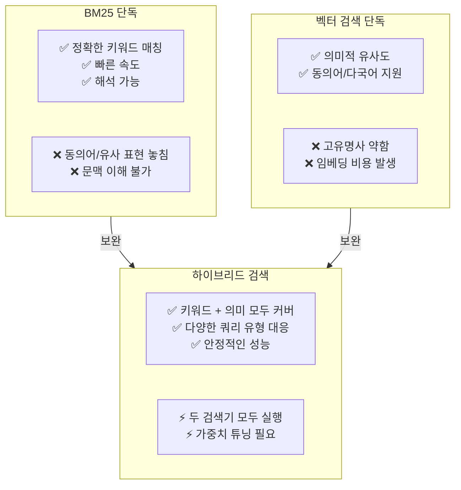

# 하이브리드 검색 구현 — 두 세계의 장점 결합

> BM25 키워드 검색과 벡터 유사도 검색을 하나로 합쳐, 각각의 약점을 보완하는 하이브리드 검색 전략을 구현합니다.

## 개요

이 섹션에서는 [세션 11.1: BM25 키워드 검색](11-하이브리드-검색-bm25-키워드-검색과-벡터-검색-결합/01-bm25-키워드-검색-전통적-정보-검색의-힘.md)에서 배운 BM25 검색기와 기존의 벡터 검색기를 **하나의 파이프라인으로 결합**하는 방법을 배웁니다. LangChain의 `EnsembleRetriever`를 활용해 두 검색 결과를 융합하고, 그 핵심 알고리즘인 Reciprocal Rank Fusion(RRF)의 원리를 깊이 이해합니다.

**선수 지식**:
- BM25 알고리즘의 원리와 `BM25Retriever` 사용법 (세션 11.1)
- 벡터 데이터베이스와 유사도 검색 기본 개념 (챕터 6-7)
- LangChain Retriever 인터페이스 (챕터 8)

**학습 목표**:
- EnsembleRetriever로 BM25와 벡터 검색을 결합하는 하이브리드 검색을 구현할 수 있다
- Reciprocal Rank Fusion(RRF) 알고리즘의 수학적 원리를 이해한다
- `weights` 파라미터를 조정하여 검색 특성을 튜닝할 수 있다
- 런타임에 가중치를 동적으로 변경하는 방법을 적용할 수 있다

## 왜 알아야 할까?

앞서 세션 11.1에서 BM25가 고유명사, 에러 메시지, 코드 스니펫 같은 **정확한 키워드 매칭**에 강하다는 것을 확인했죠. 반면 [챕터 5](05-임베딩-모델-이해-텍스트를-벡터로-변환/01-임베딩의-기본-개념-단어에서-문장까지.md)에서 배운 벡터 검색은 "운동화"로 검색해도 "스니커즈", "러닝화"를 찾아주는 **의미적 이해**가 강점이었습니다.

그런데 현실의 사용자 쿼리는 이 두 가지가 뒤섞여 있습니다. "LangChain의 LCEL 파이프라인에서 에러가 발생할 때 디버깅하는 방법"이라는 질문을 생각해보세요. "LangChain", "LCEL"은 정확한 키워드 매칭이 필요하고, "디버깅하는 방법"은 의미적 검색이 더 효과적입니다.

실제로 많은 프로덕션 RAG 시스템이 **하이브리드 검색**을 기본 전략으로 채택하고 있는데요. Elasticsearch, Pinecone, Qdrant 같은 상용 벡터 DB들도 하이브리드 검색을 핵심 기능으로 제공합니다. 왜냐하면 하이브리드 검색이 단일 검색 방식보다 **일관되게 더 나은 성능**을 보여주기 때문이거든요.

## 핵심 개념

### 개념 1: 하이브리드 검색 — 두 명의 탐정에게 동시에 수사를 맡기기

> 💡 **비유**: 미제 사건을 해결하기 위해 **두 명의 탐정**을 고용했다고 상상해보세요. **탐정 A**는 물증 전문가입니다. 지문, 일련번호, 차량 번호판처럼 **정확히 일치하는 증거**를 추적하죠(BM25). **탐정 B**는 프로파일러입니다. 사건의 맥락과 패턴을 읽고, "이런 유형의 범인은 이런 장소에 있을 가능성이 높다"고 **맥락적 추론**을 합니다(벡터 검색). 하이브리드 검색은 **두 탐정의 보고서를 합쳐서, 물증과 맥락 분석이 모두 가리키는 용의자를 최우선으로 올리는 것**과 같습니다. 한 탐정만으로는 놓칠 수 있는 단서를, 함께 일하면 잡아낼 수 있거든요.

하이브리드 검색(Hybrid Search)은 서로 다른 검색 패러다임을 **병렬로 실행**하고, 그 결과를 **하나의 통합된 랭킹**으로 합치는 전략입니다. 가장 일반적인 조합은 BM25(키워드 기반) + 벡터 검색(의미 기반)이죠.

> 📊 **그림 1**: 하이브리드 검색의 전체 흐름



각 검색기는 독립적으로 쿼리를 처리하고 **자체적인 랭킹**을 만듭니다. 핵심은 이 두 개의 서로 다른 랭킹을 어떻게 하나로 합치느냐인데요 — 여기서 RRF 알고리즘이 등장합니다.

### 개념 2: Reciprocal Rank Fusion(RRF) — 순위만으로 공정하게 합치기

> 💡 **비유**: 두 명의 음식 평론가가 각자 맛집 Top 10을 뽑았다고 해볼게요. 평론가 A는 100점 만점으로, 평론가 B는 별 5개 만점으로 점수를 매겼습니다. 점수 체계가 다르니 단순히 더할 수가 없죠? RRF는 이런 상황에서 **점수는 무시하고 "몇 등인가"만 보고** 합치는 방법입니다. 1등에 뽑힌 식당은 높은 점수를, 10등은 낮은 점수를 받되, 두 평론가 모두에게 높은 순위를 받은 식당이 최종 1등이 됩니다.

RRF의 핵심 아이디어는 놀라울 만큼 단순합니다. **원래 점수(score)는 완전히 무시하고, 순위(rank)만 사용**한다는 거죠. 왜 이렇게 할까요?

BM25 점수는 0~수십 범위이고, 코사인 유사도는 0~1 범위입니다. 이 점수들을 직접 비교하거나 더하는 건 "사과 3개와 오렌지 2개를 더하면?"과 비슷한 문제예요. 정규화(normalization)를 해도 분포가 다르면 왜곡이 생기거든요. RRF는 이 문제를 깔끔하게 해결합니다.

**RRF 공식:**

$$RRF\_score(d) = \sum_{r \in R} \frac{w_r}{rank_r(d) + k}$$

- $d$: 문서
- $R$: 검색기 집합 (예: BM25, 벡터 검색)
- $w_r$: 검색기 $r$의 가중치
- $rank_r(d)$: 검색기 $r$에서 문서 $d$의 순위 (1부터 시작)
- $k$: 스무딩 상수 (기본값 60)

이 공식이 의미하는 바는, 순위가 높을수록(숫자가 작을수록) 큰 점수를 받되, **상수 $k$가 상위 순위와 하위 순위 간의 점수 차이를 완만하게** 만들어준다는 겁니다.

> 📊 **그림 2**: RRF 알고리즘의 동작 원리



위 예시에서 문서 A는 BM25에서 1위, 벡터 검색에서 2위로 **두 검색기 모두에서 상위권**이라 최종 1위가 됩니다. 문서 B는 벡터 검색 1위지만 BM25에 없어서 3위로 밀렸죠. 이것이 RRF의 핵심입니다 — **여러 검색기에서 골고루 높은 순위를 받은 문서가 유리**합니다.

간단한 코드로 RRF를 직접 구현해보겠습니다. 이 함수는 LangChain과 무관한 **커스텀 구현**으로, RRF의 원리를 이해하기 위한 것입니다:

```run:python
def reciprocal_rank_fusion(
    rankings: list[list[str]],   # 각 검색기의 결과 (문서 ID 순위 리스트)
    weights: list[float] = None, # 각 검색기의 가중치
    k: int = 60                  # 스무딩 상수
) -> list[tuple[str, float]]:
    """커스텀 가중 RRF 알고리즘 구현 (교육용)"""
    if weights is None:
        weights = [1.0] * len(rankings)  # 기본: 동일 가중치

    # 각 문서의 RRF 점수를 누적
    rrf_scores: dict[str, float] = {}
    for rank_list, weight in zip(rankings, weights):
        for rank, doc_id in enumerate(rank_list, start=1):
            if doc_id not in rrf_scores:
                rrf_scores[doc_id] = 0.0
            rrf_scores[doc_id] += weight / (rank + k)

    # 점수 내림차순 정렬
    sorted_results = sorted(rrf_scores.items(), key=lambda x: x[1], reverse=True)
    return sorted_results

# BM25 검색 결과와 벡터 검색 결과
bm25_results = ["doc_A", "doc_C", "doc_D", "doc_E"]
vector_results = ["doc_B", "doc_A", "doc_C", "doc_F"]

# 동일 가중치로 RRF 수행
results = reciprocal_rank_fusion([bm25_results, vector_results])
print("=== RRF 결과 (동일 가중치) ===")
for doc_id, score in results:
    print(f"  {doc_id}: {score:.6f}")

# BM25에 가중치 0.7, 벡터에 0.3
results_weighted = reciprocal_rank_fusion(
    [bm25_results, vector_results],
    weights=[0.7, 0.3]
)
print("\n=== RRF 결과 (BM25=0.7, Vector=0.3) ===")
for doc_id, score in results_weighted:
    print(f"  {doc_id}: {score:.6f}")
```

```output
=== RRF 결과 (동일 가중치) ===
  doc_A: 0.032520
  doc_C: 0.032043
  doc_B: 0.016393
  doc_D: 0.015873
  doc_E: 0.015625
  doc_F: 0.015625

=== RRF 결과 (BM25=0.7, Vector=0.3) ===
  doc_A: 0.016247
  doc_C: 0.016100
  doc_D: 0.011111
  doc_B: 0.004918
  doc_E: 0.010938
  doc_F: 0.004688
```

동일 가중치에서는 두 검색기에 모두 등장한 문서 A, C가 최상위입니다. 가중치를 BM25 쪽으로 기울이면 BM25에만 있던 문서 D의 순위가 올라가고, 벡터 검색에만 있던 문서 B, F의 순위가 내려가는 걸 확인할 수 있죠.

### 개념 3: EnsembleRetriever — LangChain에서 하이브리드 검색 구현하기

LangChain은 하이브리드 검색을 위한 `EnsembleRetriever` 클래스를 제공합니다. 내부적으로 `weighted_reciprocal_rank`라는 메서드를 통해 **가중 RRF(Weighted Reciprocal Rank Fusion)**를 수행하는데요, 이것은 LangChain이 자체적으로 구현한 내부 알고리즘입니다. 위에서 우리가 직접 만든 커스텀 RRF 함수와 원리는 동일하지만, `EnsembleRetriever`가 이를 내부적으로 처리해주므로 사용자가 직접 호출할 필요는 없습니다.

아래 예제에서는 [챕터 6](06-벡터-데이터베이스-기초-chromadb로-시작하기/01-벡터-데이터베이스란-왜-필요한가.md)에서 다룬 벡터 데이터베이스 중 **FAISS**를 사용해 벡터 검색기를 생성합니다. ChromaDB, Pinecone, Qdrant 등 [챕터 7](07-벡터-데이터베이스-심화-faiss-pinecone-qdrant-비교/01-faiss-대규모-벡터-검색의-표준.md)에서 배운 다른 벡터 DB를 사용하더라도 `.as_retriever()` 인터페이스가 동일하므로, 벡터 스토어 생성 부분만 교체하면 됩니다.

```python
from langchain.retrievers import EnsembleRetriever
from langchain_community.retrievers import BM25Retriever
from langchain_community.vectorstores import FAISS
from langchain_openai import OpenAIEmbeddings

# 1. 문서 준비
docs = [...]  # Document 객체 리스트

# 2. BM25 검색기 생성
bm25_retriever = BM25Retriever.from_documents(docs, k=5)

# 3. 벡터 검색기 생성 (FAISS 사용 — Ch6에서 학습)
embedding = OpenAIEmbeddings()
vectorstore = FAISS.from_documents(docs, embedding)
vector_retriever = vectorstore.as_retriever(search_kwargs={"k": 5})

# 4. 하이브리드 검색기 생성 — 이 한 줄이 핵심!
# 내부적으로 weighted_reciprocal_rank 메서드가 RRF를 수행합니다
ensemble_retriever = EnsembleRetriever(
    retrievers=[bm25_retriever, vector_retriever],
    weights=[0.5, 0.5],  # BM25와 벡터 검색의 가중치
)

# 5. 검색 실행
results = ensemble_retriever.invoke("LangChain LCEL 디버깅 방법")
```

`EnsembleRetriever`의 주요 파라미터를 정리하면:

| 파라미터 | 설명 | 기본값 |
|----------|------|--------|
| `retrievers` | 결합할 검색기 리스트 | 필수 |
| `weights` | 각 검색기의 가중치 리스트 | 동일 가중치 |
| `c` | RRF 상수 $k$ (높을수록 순위 간 점수 차이 완만) | `60` |

> ⚠️ **흔한 오해**: `weights=[0.5, 0.5]`라고 해서 "BM25 결과 50%, 벡터 결과 50%를 섞는다"는 뜻이 아닙니다! 가중치는 `EnsembleRetriever` 내부의 `weighted_reciprocal_rank` 알고리즘에서 각 검색기의 **순위 점수에 곱해지는 계수**입니다. 결과 개수를 반으로 나누는 게 아니라, 점수 기여도를 조절하는 거예요.

### 개념 4: 가중치 튜닝 — 상황에 맞는 최적의 밸런스 찾기

> 💡 **비유**: 오디오 믹싱 콘솔을 생각해보세요. 보컬(BM25)과 반주(벡터 검색)의 볼륨을 각각 조절해서 최적의 사운드를 만드는 거예요. 락 공연에선 기타를 키우고, 발라드에선 보컬을 키우듯이, **쿼리의 성격에 따라 최적의 가중치가 달라집니다.**

가중치 설정의 일반적인 가이드라인은 다음과 같습니다:

| 시나리오 | 권장 가중치 (BM25 : Vector) | 이유 |
|----------|---------------------------|------|
| 고유명사, 에러 코드 검색 | 0.7 : 0.3 | 정확한 키워드 매칭 우선 |
| 개념/방법론 질문 | 0.3 : 0.7 | 의미적 유사도가 더 중요 |
| 일반적인 혼합 쿼리 | 0.5 : 0.5 | 균형 잡힌 기본값 |
| 코드 검색 | 0.6 : 0.4 | 함수명, 변수명 정확 매칭 중요 |

LangChain에서는 `ConfigurableField`를 사용해 **런타임에 가중치를 동적으로 변경**할 수 있습니다:

```python
from langchain_core.runnables import ConfigurableField

# 가중치를 런타임에 설정 가능하도록 구성
configurable_retriever = EnsembleRetriever(
    retrievers=[bm25_retriever, vector_retriever],
    weights=[0.5, 0.5],  # 기본값
).configurable_fields(
    weights=ConfigurableField(
        id="ensemble_weights",
        name="Ensemble Weights",
        description="BM25와 벡터 검색의 가중치",
    )
)

# 키워드 중심 쿼리 → BM25 가중치 높이기
keyword_results = configurable_retriever.invoke(
    "RuntimeError: CUDA out of memory",
    config={"configurable": {"ensemble_weights": [0.8, 0.2]}}
)

# 의미 중심 쿼리 → 벡터 가중치 높이기
semantic_results = configurable_retriever.invoke(
    "GPU 메모리 부족 문제를 해결하는 방법",
    config={"configurable": {"ensemble_weights": [0.3, 0.7]}}
)
```

> 📊 **그림 3**: 가중치에 따른 검색 특성 변화



## 실습: 직접 해보기

실제 문서로 하이브리드 검색을 구현하고, 가중치에 따른 결과 차이를 확인해봅시다. 벡터 검색기는 [챕터 6](06-벡터-데이터베이스-기초-chromadb로-시작하기/01-벡터-데이터베이스란-왜-필요한가.md)에서 구축한 것과 같은 방식으로 **FAISS 기반**으로 생성합니다. 이미 ChromaDB나 Qdrant 등 다른 벡터 DB를 사용 중이라면, 해당 벡터 스토어의 `.as_retriever()`를 그대로 사용하면 됩니다.

```python
# 필요한 패키지 설치
# pip install langchain langchain-community langchain-openai faiss-cpu rank-bm25

import os
from langchain_core.documents import Document
from langchain_community.retrievers import BM25Retriever
from langchain_community.vectorstores import FAISS
from langchain_openai import OpenAIEmbeddings
from langchain.retrievers import EnsembleRetriever
from langchain_core.runnables import ConfigurableField

# 환경 변수 설정 (실제 사용 시 .env 파일에서 로드)
# os.environ["OPENAI_API_KEY"] = "your-api-key"

# ── 1. 샘플 문서 준비 ──────────────────────────────
docs = [
    Document(
        page_content="LangChain의 LCEL(LangChain Expression Language)은 파이프 연산자(|)로 "
        "컴포넌트를 선언적으로 연결합니다. chain = prompt | llm | parser 형태로 작성합니다.",
        metadata={"source": "langchain_docs", "topic": "LCEL"}
    ),
    Document(
        page_content="RAG 파이프라인에서 검색 품질을 높이려면 하이브리드 검색이 효과적입니다. "
        "키워드 검색과 벡터 검색을 결합하면 정확도와 재현율 모두 개선됩니다.",
        metadata={"source": "rag_guide", "topic": "hybrid_search"}
    ),
    Document(
        page_content="RuntimeError: CUDA out of memory. Tried to allocate 2.00 GiB. "
        "GPU 0 has a total capacity of 8.00 GiB. 이 에러는 배치 크기를 줄이거나 "
        "gradient checkpointing을 사용하면 해결할 수 있습니다.",
        metadata={"source": "error_guide", "topic": "cuda_error"}
    ),
    Document(
        page_content="임베딩 모델은 텍스트를 고차원 벡터로 변환합니다. "
        "OpenAI의 text-embedding-3-small 모델은 1536차원 벡터를 생성하며, "
        "의미적으로 유사한 텍스트는 벡터 공간에서 가까이 위치합니다.",
        metadata={"source": "embedding_docs", "topic": "embedding"}
    ),
    Document(
        page_content="BM25는 TF-IDF를 개선한 알고리즘으로, 단어 빈도 포화(term frequency saturation)와 "
        "문서 길이 정규화를 적용합니다. k1=1.5, b=0.75가 일반적인 기본값입니다.",
        metadata={"source": "ir_textbook", "topic": "bm25"}
    ),
    Document(
        page_content="딥러닝 모델의 메모리 사용량을 줄이는 방법에는 mixed precision training, "
        "gradient accumulation, model parallelism 등이 있습니다. "
        "특히 대규모 언어 모델 학습 시 필수적인 기법들입니다.",
        metadata={"source": "ml_guide", "topic": "memory_optimization"}
    ),
    Document(
        page_content="Reciprocal Rank Fusion(RRF)은 여러 검색 결과를 순위 기반으로 합치는 "
        "알고리즘입니다. score = 1/(rank + k)로 계산하며, k=60이 일반적입니다. "
        "점수 정규화 없이도 효과적으로 결과를 융합합니다.",
        metadata={"source": "ir_paper", "topic": "rrf"}
    ),
]

# ── 2. BM25 검색기 생성 ─────────────────────────────
bm25_retriever = BM25Retriever.from_documents(docs, k=4)

# ── 3. 벡터 검색기 생성 (FAISS 기반 — Ch6 참고) ────
embedding = OpenAIEmbeddings(model="text-embedding-3-small")
vectorstore = FAISS.from_documents(docs, embedding)
vector_retriever = vectorstore.as_retriever(search_kwargs={"k": 4})

# ── 4. 하이브리드 검색기 생성 ───────────────────────
# EnsembleRetriever 내부의 weighted_reciprocal_rank가 RRF를 수행
ensemble_retriever = EnsembleRetriever(
    retrievers=[bm25_retriever, vector_retriever],
    weights=[0.5, 0.5],  # 기본 균형 가중치
    c=60,                 # RRF 상수
)

# ── 5. 런타임 가중치 변경을 위한 설정 ───────────────
configurable_ensemble = ensemble_retriever.configurable_fields(
    weights=ConfigurableField(
        id="search_weights",
        name="Search Weights",
        description="[BM25 가중치, 벡터 가중치]",
    )
)


# ── 6. 다양한 쿼리와 가중치로 테스트 ────────────────
def test_hybrid_search(query: str, weights: list[float], label: str):
    """하이브리드 검색 결과를 출력하는 헬퍼 함수"""
    results = configurable_ensemble.invoke(
        query,
        config={"configurable": {"search_weights": weights}}
    )
    print(f"\n{'='*60}")
    print(f"쿼리: {query}")
    print(f"가중치: BM25={weights[0]}, Vector={weights[1]} ({label})")
    print(f"{'='*60}")
    for i, doc in enumerate(results, 1):
        # 내용을 50자로 줄여서 표시
        preview = doc.page_content[:50] + "..."
        print(f"  {i}위: [{doc.metadata['topic']}] {preview}")


# 테스트 1: 정확한 에러 메시지 — BM25가 유리한 쿼리
test_hybrid_search(
    "RuntimeError: CUDA out of memory",
    weights=[0.8, 0.2],
    label="키워드 우선"
)

# 테스트 2: 개념적 질문 — 벡터 검색이 유리한 쿼리
test_hybrid_search(
    "GPU 메모리가 부족할 때 어떻게 해야 하나요?",
    weights=[0.2, 0.8],
    label="의미 우선"
)

# 테스트 3: 혼합 쿼리 — 균형 가중치
test_hybrid_search(
    "BM25와 벡터 검색을 합치는 방법",
    weights=[0.5, 0.5],
    label="균형"
)
```

위 코드를 실행하면, 같은 의도의 쿼리라도 **표현 방식에 따라 최적의 가중치가 달라지는 것**을 확인할 수 있습니다. 정확한 에러 메시지를 검색할 때는 BM25 가중치를 높이면 에러 관련 문서가 1위로 올라오고, "GPU 메모리 부족"처럼 자연어로 질문하면 벡터 가중치를 높이는 것이 의미적으로 관련된 여러 문서를 함께 찾아줍니다.

> 🔥 **실무 팁**: 처음에는 `weights=[0.5, 0.5]`로 시작하세요. 그 다음 실제 쿼리 로그를 분석해서, 키워드 검색이 더 정확한 쿼리가 많으면 BM25 가중치를 올리고, 의미 검색이 나은 경우가 많으면 벡터 가중치를 올리세요. RAGAS 같은 평가 프레임워크([챕터 17](17-rag-평가-ragas-프레임워크로-시스템-성능-측정/01-rag-평가란-무엇을-어떻게-측정할-것인가.md))로 정량적으로 최적 가중치를 찾을 수도 있습니다.

## 더 깊이 알아보기

### RRF의 탄생 이야기

Reciprocal Rank Fusion은 2009년 캐나다 워터루 대학교의 **Gordon V. Cormack**, **Charles L. A. Clarke**, **Stefan Büttcher**가 발표한 논문에서 처음 제안되었습니다. 당시 정보 검색(IR) 분야에서는 여러 검색 시스템의 결과를 합치는 "랭크 퓨전(rank fusion)" 문제가 오래된 연구 주제였는데요.

기존 방법들은 꽤 복잡했습니다. **콩도르세 퓨전(Condorcet Fuse)**은 투표 이론에서 빌려온 방법으로, 모든 문서 쌍을 비교하는 복잡한 과정을 거쳤고, **기계학습 기반 방법**은 학습 데이터가 필요했죠.

놀랍게도, Cormack 팀이 제안한 RRF는 공식이 **한 줄**에 불과한 아주 단순한 방법이었습니다. 그런데 실험 결과, 이 단순한 공식이 복잡한 콩도르세 퓨전보다 **일관되게 더 나은 성능**을 보여주었죠. 논문 제목 자체가 "Reciprocal Rank Fusion Outperforms Condorcet and Individual Rank Learning Methods"(RRF가 콩도르세와 개별 랭크 학습 방법을 능가한다)입니다.

상수 $k=60$은 어떻게 정해졌을까요? 논문에서 여러 값을 실험했는데, $k=60$이 다양한 데이터셋에서 가장 안정적인 결과를 보여줬기에 기본값이 되었습니다. LangChain의 `EnsembleRetriever`도 이 값을 기본값(`c=60`)으로 사용합니다.

이 논문이 발표된 지 15년이 지난 지금도, RRF는 Elasticsearch, OpenSearch, Azure AI Search, Pinecone 등 **거의 모든 주요 검색 엔진에서 하이브리드 검색의 표준 알고리즘**으로 채택되어 있습니다. 단순함의 위력을 보여주는 좋은 사례죠.

### 스무딩 상수 $k$의 역할

$k$ 값은 상위 순위와 하위 순위의 점수 차이를 조절합니다. $k$가 작으면 1위와 2위의 점수 차이가 크고(상위 결과에 집중), $k$가 크면 순위 간 점수 차이가 완만해집니다(하위 결과도 고려). 직접 비교해볼까요?

```run:python
# k값에 따른 RRF 점수 분포 비교
print("순위 | k=1        | k=60       | k=200")
print("-" * 50)
for rank in [1, 2, 3, 5, 10, 50]:
    score_k1 = 1 / (rank + 1)
    score_k60 = 1 / (rank + 60)
    score_k200 = 1 / (rank + 200)
    print(f"{rank:4d} | {score_k1:.6f}   | {score_k60:.6f}   | {score_k200:.6f}")

# 1위 대비 10위의 점수 비율
print(f"\n1위 대비 10위 점수 비율:")
print(f"  k=1:   {(1/(10+1)) / (1/(1+1)) * 100:.1f}%")
print(f"  k=60:  {(1/(10+60)) / (1/(1+60)) * 100:.1f}%")
print(f"  k=200: {(1/(10+200)) / (1/(1+200)) * 100:.1f}%")
```

```output
순위 | k=1        | k=60       | k=200
--------------------------------------------------
   1 | 0.500000   | 0.016393   | 0.004975
   2 | 0.333333   | 0.016129   | 0.004950
   3 | 0.250000   | 0.015873   | 0.004926
   5 | 0.166667   | 0.015385   | 0.004878
  10 | 0.090909   | 0.014286   | 0.004762
  50 | 0.019608   | 0.009091   | 0.004000

1위 대비 10위 점수 비율:
  k=1:   18.2%
  k=60:  87.1%
  k=200: 95.7%
```

$k=1$이면 10위 문서의 점수가 1위의 18.2%에 불과하지만, $k=60$이면 87.1%나 되죠. 대부분의 경우 기본값 60이 잘 작동하지만, **검색 결과 상위 몇 개만 중요한 경우** $k$를 낮추는 것을 고려해볼 수 있습니다.

## 흔한 오해와 팁

> ⚠️ **흔한 오해**: "하이브리드 검색은 항상 단일 검색보다 낫다"라고 생각하기 쉽지만, 반드시 그렇지는 않습니다. 쿼리가 **순수하게 키워드 매칭만 필요한 경우**(예: 정확한 에러 코드 검색) BM25 단독이 더 나을 수 있고, **순수하게 의미 검색만 필요한 경우**(예: 추상적인 개념 질문) 벡터 검색 단독이 더 효율적일 수 있습니다. 하이브리드 검색은 "쿼리 유형이 혼재된 실제 환경"에서 **평균적으로 가장 안정적인** 선택입니다.

> 💡 **알고 계셨나요?**: RRF가 "점수를 무시하고 순위만 본다"는 특성은 단점이 되기도 합니다. 1위와 2위의 실제 관련도 차이가 아주 큰 경우에도 RRF는 이를 구분하지 못하거든요. 이런 한계를 보완하기 위해 **Convex Combination(선형 결합)** 방식도 사용됩니다 — 이 방법은 원래 점수를 정규화한 뒤 가중 합산합니다. 다만 정규화가 까다롭기 때문에, 실무에서는 RRF가 더 많이 쓰입니다.

> 🔥 **실무 팁**: `EnsembleRetriever`의 각 검색기에 전달하는 `k` (반환 문서 수)를 **최종 원하는 수보다 넉넉하게** 설정하세요. 예를 들어 최종적으로 5개 문서가 필요하다면, 각 검색기는 `k=10`으로 설정하는 것이 좋습니다. 이렇게 해야 RRF가 충분한 후보 풀에서 최적의 조합을 찾을 수 있습니다. 후보가 너무 적으면 융합의 효과가 떨어지거든요.

> 📊 **그림 4**: 하이브리드 검색의 장단점 비교



## 핵심 정리

| 개념 | 설명 |
|------|------|
| 하이브리드 검색 | BM25(키워드)와 벡터(의미) 검색을 병렬 실행 후 결과를 융합하는 전략 |
| Reciprocal Rank Fusion (RRF) | 원래 점수 대신 **순위**만으로 여러 결과를 합치는 알고리즘. 점수 정규화 불필요 |
| RRF 공식 | $score(d) = \sum w_r / (rank_r(d) + k)$, 기본 $k=60$ |
| EnsembleRetriever | LangChain에서 내부 `weighted_reciprocal_rank` 메서드로 가중 RRF를 수행하는 하이브리드 검색 클래스 |
| `weights` 파라미터 | 각 검색기의 RRF 점수 기여도 조절. 쿼리 특성에 따라 튜닝 |
| `c` 파라미터 | RRF 상수 $k$. 높을수록 순위 간 점수 차이가 완만. 기본값 60 |
| ConfigurableField | 런타임에 가중치를 동적으로 변경할 수 있게 해주는 LangChain 기능 |

## 다음 섹션 미리보기

이번 세션에서 RRF 기반 하이브리드 검색을 구현했지만, 한 가지 의문이 남습니다 — **최적의 가중치를 어떻게 체계적으로 찾을 수 있을까요?** 다음 세션에서는 다양한 검색 전략의 성능을 **정량적으로 평가하고 비교**하는 방법을 다루며, 하이브리드 검색이 실제로 얼마나 효과적인지 데이터로 확인해봅니다.

## 참고 자료

- [Reciprocal Rank Fusion outperforms Condorcet and Individual Rank Learning Methods (Cormack et al., 2009)](https://dl.acm.org/doi/10.1145/1571941.1572114) — RRF 알고리즘의 원본 논문. $k=60$의 근거와 다른 융합 방법과의 비교 실험을 포함합니다.
- [LangChain EnsembleRetriever API 문서](https://python.langchain.com/api_reference/langchain/retrievers/langchain.retrievers.ensemble.EnsembleRetriever.html) — EnsembleRetriever의 공식 API 레퍼런스. weights, c 파라미터와 ConfigurableField 사용법을 확인할 수 있습니다.
- [LangChain BM25 Integration 문서](https://docs.langchain.com/oss/python/integrations/retrievers/bm25) — BM25Retriever와 EnsembleRetriever를 결합하는 공식 가이드.
- [Azure AI Search — Hybrid Search Scoring (RRF)](https://learn.microsoft.com/en-us/azure/search/hybrid-search-ranking) — 프로덕션 환경에서 RRF가 어떻게 활용되는지 Microsoft의 구현 사례를 확인할 수 있습니다.
- [LangChain RAG From Scratch (GitHub)](https://github.com/langchain-ai/rag-from-scratch) — RAG 파이프라인을 처음부터 구축하는 공식 튜토리얼 시리즈. 하이브리드 검색 예제 포함.

---
### 🔗 Related Sessions
- [bm25retriever](../11-하이브리드-검색-bm25-키워드-검색과-벡터-검색-결합/01-bm25-키워드-검색-전통적-정보-검색의-힘.md) (prerequisite)
