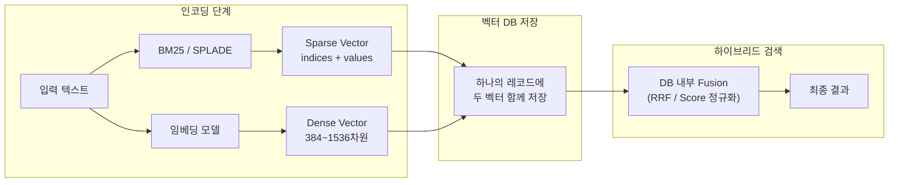
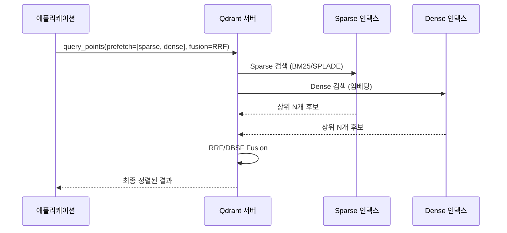
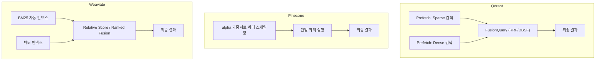
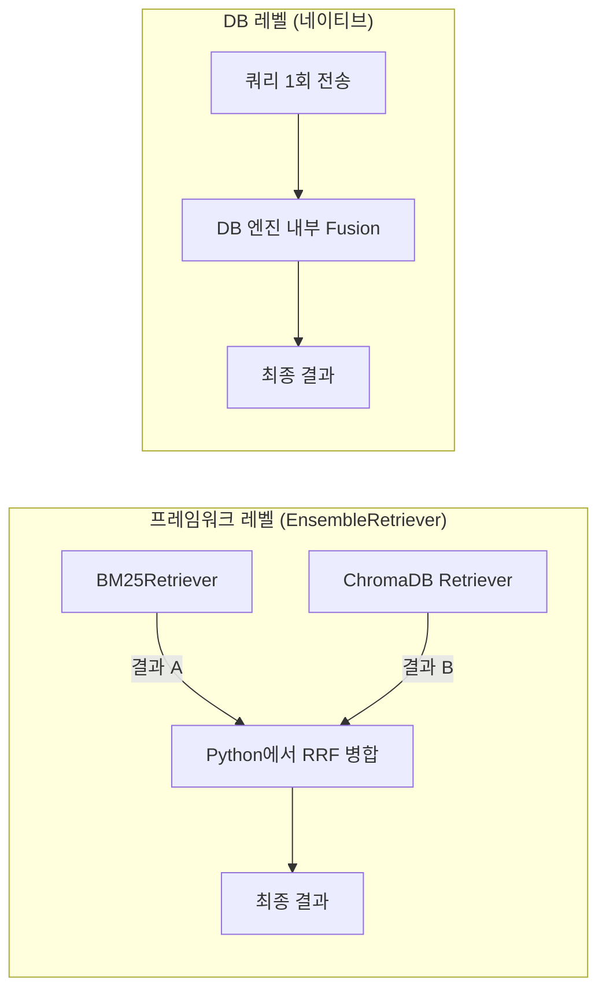

# 벡터 DB 네이티브 하이브리드 검색

> 벡터 데이터베이스가 자체적으로 제공하는 하이브리드 검색 기능을 활용하여, 프레임워크 없이도 DB 레벨에서 키워드+시멘틱 검색을 결합하는 방법을 배웁니다.

## 개요

이 섹션에서는 앞서 [세션 11.2: 하이브리드 검색 구현](session-11-2)에서 LangChain `EnsembleRetriever`를 사용해 프레임워크 레벨에서 하이브리드 검색을 구현한 것과 달리, **벡터 데이터베이스 자체가 제공하는 네이티브 하이브리드 검색** 기능을 학습합니다. Qdrant를 메인으로 sparse-dense 하이브리드 검색 API를 깊이 있게 다루고, Pinecone과 Weaviate의 접근 방식은 비교표로 정리합니다.

**선수 지식**: BM25 알고리즘의 원리([세션 11.1](session-11-1)), Reciprocal Rank Fusion과 EnsembleRetriever([세션 11.2](session-11-2)), 벡터 데이터베이스의 기본 개념([챕터 6-7](chapter-6))
**학습 목표**:
- BM25/SPLADE 가중치를 sparse vector 형태로 인코딩하여 벡터 DB에 저장하는 원리를 이해한다
- Qdrant의 Prefetch + Fusion Query API로 sparse-dense 하이브리드 검색을 구현할 수 있다
- Pinecone, Weaviate 등 다른 벡터 DB의 하이브리드 검색 API 차이를 파악한다
- 프레임워크 레벨 vs DB 레벨 하이브리드 검색의 차이를 파악하고 상황에 맞게 선택할 수 있다

## 왜 알아야 할까?

앞서 세션 11.2에서 LangChain `EnsembleRetriever`로 하이브리드 검색을 구현했는데요, 한 가지 궁금한 점이 생기지 않나요? "BM25 검색과 벡터 검색을 따로 실행한 다음 Python에서 합치는 건... 비효율적이지 않을까?"

맞습니다. 프레임워크 레벨 하이브리드 검색은 두 개의 검색 시스템을 별도로 운영하고 결과를 애플리케이션에서 병합하는 방식이거든요. 문서가 수만 건이면 괜찮지만, **수백만~수억 건** 규모가 되면 이야기가 달라집니다. 네트워크 왕복이 두 번 필요하고, 메모리에서 결과를 병합하는 오버헤드도 생기죠.

반면, 벡터 DB 네이티브 하이브리드 검색은 **데이터베이스 엔진 내부에서** sparse와 dense 검색을 동시에 수행하고, 결과 융합까지 한 번의 쿼리로 처리합니다. 마치 한 명의 셰프가 두 가지 요리를 동시에 만드는 것과, 두 명의 셰프가 각자 요리를 만든 뒤 합치는 것의 차이라고 할 수 있어요.

프로덕션 RAG 시스템에서는 이런 DB 네이티브 하이브리드 검색이 **지연시간(latency) 감소**, **인프라 단순화**, **일관된 스코어링**이라는 실질적인 이점을 제공합니다. 실무에서 벡터 DB를 선택할 때 네이티브 하이브리드 검색 지원 여부가 중요한 기준이 되는 이유이기도 하죠.

## 핵심 개념

### 개념 1: 키워드 정보를 Sparse Vector로 인코딩하기

> 💡 **비유**: Dense Vector가 문장의 "느낌"을 포착하는 인상파 그림이라면, Sparse Vector는 문장에 등장하는 "단어 목록"을 체크리스트로 만든 것입니다. 3만 개의 칸이 있는 체크리스트에서 해당 문서에 나오는 단어 칸만 점수를 적고, 나머지는 0으로 비워두는 거죠.

[챕터 5](chapter-5)에서 Sparse Vector를 '대부분의 값이 0인 고차원 벡터'로 배웠죠. 벡터 DB 네이티브 하이브리드 검색에서는 이 sparse vector를 **BM25나 SPLADE의 단어 가중치를 인코딩하는 그릇**으로 활용합니다. 즉, [세션 11.1](session-11-1)에서 배운 BM25 점수나, 학습 기반 모델인 SPLADE의 토큰 가중치를 sparse vector 형태로 변환하여 벡터 DB에 저장하고, dense vector와 함께 하나의 쿼리로 검색하는 방식입니다.

구체적으로, 어휘(vocabulary) 크기가 3만 개라면 3만 차원의 벡터가 되는데, 한 문서에 포함된 단어는 수십~수백 개뿐이니 나머지는 모두 0입니다. 그래서 효율적으로 저장하기 위해 **indices**(0이 아닌 위치)와 **values**(해당 위치의 값) 두 배열로 표현하죠.

```python
# BM25 가중치를 sparse vector 형태로 인코딩한 예시
sparse_vector = {
    "indices": [102, 1847, 29541],   # 어휘 사전에서의 단어 위치
    "values":  [0.82, 0.45, 0.31]    # 해당 단어의 BM25/SPLADE 가중치
}
# 3만 차원 중 3개만 값이 있음 → "sparse"(희소)
```

Sparse Vector를 생성하는 방법은 크게 두 가지입니다:

| 방법 | 설명 | 특징 |
|------|------|------|
| **BM25** | 전통적 TF-IDF 계열 알고리즘 | 빠르고 단순, 정확한 키워드 매칭 |
| **SPLADE** | 학습 기반 sparse 임베딩 모델 | 단어 확장(expansion) 가능, 더 정확 |

**SPLADE**(SParse Lexical AnD Expansion)는 BERT 기반 트랜스포머를 활용해 단어 가중치를 **학습**하는 sparse 임베딩 모델입니다. BM25가 단순히 문서에 등장하는 단어의 빈도와 희귀도만 반영하는 반면, SPLADE는 두 가지 핵심 차이가 있습니다:

1. **가중치 학습**: 검색 품질을 최적화하도록 단어 중요도를 신경망이 학습합니다
2. **단어 확장(Term Expansion)**: 쿼리나 문서에 직접 등장하지 않는 관련 단어까지 sparse vector에 포함시킵니다. 예를 들어 "강아지"가 포함된 문서에 "반려동물", "펫" 같은 관련 단어도 약한 가중치로 추가하는 거죠

> 📊 **그림 1**: BM25/SPLADE 가중치를 Sparse Vector로 인코딩하여 Dense Vector와 함께 저장



### 개념 2: Qdrant — Prefetch + Fusion Query API

> 💡 **비유**: Qdrant의 하이브리드 검색은 마치 **2단계 요리 대회** 같습니다. 1차 예선(Prefetch)에서 키워드팀과 시멘틱팀이 각각 후보를 뽑고, 결승(Fusion)에서 두 팀의 후보를 종합 평가하여 최종 순위를 매기는 방식이에요.

Qdrant는 v1.10부터 도입된 **Query API**를 통해 하이브리드 검색을 단일 요청으로 처리합니다. 세 벡터 DB 중 가장 유연한 구조를 제공하기 때문에, 이번 섹션에서는 Qdrant를 중심으로 깊이 있게 살펴보겠습니다. (각 벡터 DB의 기본 특성과 아키텍처 비교는 [챕터 7](chapter-7)을 참고하세요.)

핵심은 `prefetch`와 `FusionQuery`의 조합입니다:

1. **Prefetch**: sparse 검색과 dense 검색을 각각 실행하여 후보군을 수집
2. **Fusion**: 두 후보군을 RRF 또는 DBSF 알고리즘으로 병합하여 최종 순위 결정

> 📊 **그림 2**: Qdrant Prefetch + Fusion 하이브리드 검색 흐름



**컬렉션 생성** — sparse와 dense 벡터를 모두 저장할 수 있도록 설정합니다:

```python
from qdrant_client import QdrantClient, models

client = QdrantClient("http://localhost:6333")

# sparse + dense 벡터를 모두 지원하는 컬렉션 생성
client.create_collection(
    collection_name="hybrid_docs",
    vectors_config={
        "dense": models.VectorParams(
            size=384,                       # 임베딩 모델 차원 수
            distance=models.Distance.COSINE
        )
    },
    sparse_vectors_config={
        "sparse": models.SparseVectorParams(
            # sparse 벡터는 크기/거리 지정 불필요 — 자동 처리
        )
    },
)
```

**데이터 업서트** — 각 문서에 dense와 sparse 벡터를 함께 저장합니다:

```python
# 포인트 업서트 (dense + sparse 벡터 함께 저장)
client.upsert(
    collection_name="hybrid_docs",
    points=[
        models.PointStruct(
            id=1,
            vector={
                "dense": [0.12, -0.45, 0.78, ...],  # 임베딩 모델 출력
                "sparse": models.SparseVector(
                    indices=[102, 1847, 29541],       # 단어 인덱스
                    values=[0.82, 0.45, 0.31]         # BM25/SPLADE 가중치
                )
            },
            payload={"text": "RAG는 검색 증강 생성 기법입니다."}
        )
    ]
)
```

**하이브리드 검색 쿼리** — `prefetch`로 각 검색을 실행하고, `FusionQuery`로 결합합니다:

```python
# Prefetch + Fusion으로 하이브리드 검색 실행
results = client.query_points(
    collection_name="hybrid_docs",
    prefetch=[
        # 1단계: Sparse 검색 (키워드 매칭)
        models.Prefetch(
            query=models.SparseVector(
                indices=[102, 1847],
                values=[0.9, 0.5]
            ),
            using="sparse",
            limit=20,                   # sparse 후보 20개
        ),
        # 1단계: Dense 검색 (시멘틱 매칭)
        models.Prefetch(
            query=[0.12, -0.45, 0.78, ...],  # 쿼리 임베딩 벡터
            using="dense",
            limit=20,                   # dense 후보 20개
        ),
    ],
    # 2단계: 두 결과를 RRF로 융합
    query=models.FusionQuery(fusion=models.Fusion.RRF),
    limit=5,                            # 최종 반환 개수
)
```

Qdrant는 두 가지 Fusion 알고리즘을 제공합니다:
- **RRF** (Reciprocal Rank Fusion): 순위 기반 융합. [세션 11.2](session-11-2)에서 배운 것과 동일한 알고리즘
- **DBSF** (Distribution-Based Score Fusion): 각 검색의 점수 분포를 정규화한 뒤 합산. 점수 스케일이 다를 때 더 안정적

> 🔥 **실무 팁**: Qdrant의 `prefetch`는 중첩(nesting)이 가능합니다. 예를 들어, 첫 번째 prefetch에서 sparse+dense 결과를 RRF로 합치고, 두 번째 단계에서 ColBERT 같은 late-interaction 모델로 리랭킹하는 **다단계 파이프라인**을 하나의 쿼리로 구성할 수 있습니다.

### 개념 3: Pinecone과 Weaviate — 하이브리드 검색 API 비교

[챕터 7](chapter-7)에서 Qdrant, Pinecone, Weaviate의 기본 아키텍처와 특성을 비교했는데요, 여기서는 **하이브리드 검색 API의 차이점**에만 집중하겠습니다.

**Pinecone**은 하나의 레코드에 `values`(dense)와 `sparse_values`(sparse)를 함께 저장하는 단일 인덱스 방식입니다. 쿼리 시 사용자가 직접 `alpha` 가중치를 벡터에 곱해서 비율을 조절합니다:

```python
# Pinecone: 사용자가 직접 가중치 스케일링
def hybrid_scale(dense, sparse, alpha):
    """alpha=1.0 → 순수 시멘틱, alpha=0.0 → 순수 키워드"""
    scaled_dense = [v * alpha for v in dense]
    scaled_sparse = {
        "indices": sparse["indices"],
        "values": [v * (1 - alpha) for v in sparse["values"]]
    }
    return scaled_dense, scaled_sparse

hdense, hsparse = hybrid_scale(query_dense, query_sparse, alpha=0.7)
results = index.query(vector=hdense, sparse_vector=hsparse, top_k=5)
```

**Weaviate**는 가장 간결한 API를 제공합니다. 별도의 sparse 벡터 생성 없이, 텍스트를 저장하면 BM25 인덱스가 자동으로 생성되고 `hybrid()` 메서드 하나로 끝납니다:

```python
# Weaviate: BM25 인덱스 자동 구축, 한 줄로 하이브리드 검색
response = docs.query.hybrid(
    query="RAG 파이프라인 구축 방법",
    alpha=0.5,          # 0.0=키워드, 1.0=벡터
    fusion_type=HybridFusion.RELATIVE_SCORE,
    limit=5,
)
```

아래 표는 세 DB의 하이브리드 검색 API 핵심 차이를 요약한 것입니다:

| 비교 항목 | Qdrant | Pinecone | Weaviate |
|-----------|--------|----------|----------|
| **Sparse 벡터 관리** | 직접 생성·저장 | 직접 생성·저장 | BM25 인덱스 자동 생성 |
| **Fusion 방식** | RRF / DBSF (서버 내부) | 쿼리 벡터에 alpha 곱셈 (클라이언트) | Relative Score / Ranked (서버 내부) |
| **가중치 조절** | Prefetch limit으로 간접 조절 | `alpha`로 벡터 스케일링 | `alpha` 파라미터 |
| **거리 메트릭 제약** | 없음 | `dotproduct` 필수 | 없음 |
| **다단계 파이프라인** | Prefetch 중첩 가능 | 불가 | 불가 |
| **SPLADE 지원** | 네이티브 | sparse_values로 저장 | 자체 BM25만 (SPLADE 비공식) |
| **점수 분해 확인** | 제한적 | 제한적 | `explain_score=True` 지원 |

> 📊 **그림 3**: 세 벡터 DB의 하이브리드 검색 아키텍처 비교



> ⚠️ **흔한 오해**: Pinecone의 `alpha`와 Weaviate의 `alpha`는 방향이 **같습니다** — 둘 다 1.0이면 순수 벡터 검색, 0.0이면 순수 키워드 검색입니다. 하지만 구현 방식이 다릅니다. Pinecone은 쿼리 벡터 자체에 가중치를 곱하는 클라이언트 방식이고, Weaviate는 DB 내부에서 점수 결합 시 가중치를 적용하는 서버 방식입니다.

### 개념 4: 프레임워크 레벨 vs DB 레벨 하이브리드 검색

이제 핵심 질문입니다: 세션 11.2에서 배운 **LangChain EnsembleRetriever**(프레임워크 레벨)와 이번에 배운 **DB 네이티브 하이브리드 검색** 중 어떤 것을 선택해야 할까요?

> 📊 **그림 4**: 프레임워크 레벨 vs DB 레벨 하이브리드 검색 아키텍처



| 비교 항목 | 프레임워크 레벨 | DB 레벨 |
|-----------|----------------|---------|
| **네트워크 왕복** | 2회 (BM25 + Vector 별도) | 1회 |
| **결과 융합 위치** | 애플리케이션 메모리 | DB 엔진 내부 |
| **Sparse 벡터 관리** | 불필요 (BM25 라이브러리 사용) | 직접 생성/저장 필요 (Weaviate 제외) |
| **유연성** | 높음 — 검색기 자유 조합 | 해당 DB 기능에 제한 |
| **지연시간 (대규모)** | 상대적으로 높음 | 낮음 (단일 쿼리) |
| **설정 복잡도** | 낮음 | 중간~높음 (DB에 따라 상이) |
| **적합한 규모** | 프로토타입, 소규모 | 프로덕션, 대규모 |
| **DB 의존성** | 없음 (DB 교체 가능) | 높음 (특정 DB에 종속) |

**선택 가이드**:
- **프로토타이핑/학습** → EnsembleRetriever (빠르게 시작, DB 독립적)
- **프로덕션 + 유연한 파이프라인** → Qdrant Prefetch + Fusion (다단계 중첩 가능)
- **프로덕션 + 서버리스** → Pinecone sparse_values (인프라 관리 최소화)
- **빠른 구현 + 프로덕션** → Weaviate hybrid (가장 간결한 API)

## 실습: 직접 해보기

Qdrant를 로컬로 실행하여 sparse-dense 하이브리드 검색을 처음부터 끝까지 구현해봅시다. BM25 가중치를 sparse vector로 인코딩하고, 임베딩 모델의 dense vector와 함께 저장한 뒤, Prefetch + Fusion으로 하이브리드 검색을 실행합니다.

```python
# 필요한 패키지 설치
# pip install qdrant-client fastembed

from qdrant_client import QdrantClient, models

# ──────────────────────────────────────────────
# 1단계: 인메모리 Qdrant 클라이언트 생성 (설치 없이 테스트 가능)
# ──────────────────────────────────────────────
client = QdrantClient(":memory:")  # 로컬 테스트용 인메모리 모드

# ──────────────────────────────────────────────
# 2단계: Sparse + Dense 벡터를 저장할 컬렉션 생성
# ──────────────────────────────────────────────
client.create_collection(
    collection_name="rag_docs",
    vectors_config={
        "dense": models.VectorParams(
            size=384,                           # all-MiniLM-L6-v2 차원
            distance=models.Distance.COSINE,
        )
    },
    sparse_vectors_config={
        "sparse": models.SparseVectorParams()   # sparse는 크기 지정 불필요
    },
)

# ──────────────────────────────────────────────
# 3단계: 샘플 문서 준비
# ──────────────────────────────────────────────
documents = [
    "RAG는 Retrieval-Augmented Generation의 약자로, LLM에 외부 지식을 제공합니다.",
    "BM25는 키워드 빈도와 문서 길이를 고려하는 전통적 정보 검색 알고리즘입니다.",
    "FAISS는 Facebook AI Research가 개발한 고속 벡터 유사도 검색 라이브러리입니다.",
    "ChromaDB는 AI 애플리케이션을 위한 오픈소스 임베딩 데이터베이스입니다.",
    "LangChain의 EnsembleRetriever는 여러 검색기를 결합하는 하이브리드 검색 도구입니다.",
    "코사인 유사도는 두 벡터 사이의 각도로 유사성을 측정하는 방법입니다.",
    "HNSW는 대규모 벡터 검색에 널리 사용되는 그래프 기반 ANN 알고리즘입니다.",
    "Qdrant는 Rust로 작성된 고성능 벡터 검색 엔진입니다.",
]

# ──────────────────────────────────────────────
# 4단계: Dense 임베딩 생성 (fastembed 사용)
# ──────────────────────────────────────────────
from fastembed import TextEmbedding

dense_model = TextEmbedding("sentence-transformers/all-MiniLM-L6-v2")
dense_vectors = list(dense_model.embed(documents))

# ──────────────────────────────────────────────
# 5단계: BM25 가중치를 Sparse Vector로 인코딩
# ──────────────────────────────────────────────
from collections import Counter
import hashlib

def simple_sparse_encode(text: str) -> models.SparseVector:
    """단어 빈도 기반으로 BM25 스타일 가중치를 sparse vector로 인코딩"""
    words = text.lower().split()
    word_counts = Counter(words)
    indices = []
    values = []
    for word, count in word_counts.items():
        # 단어를 해시하여 어휘 사전 인덱스로 변환
        idx = int(hashlib.md5(word.encode()).hexdigest(), 16) % 30000
        indices.append(idx)
        values.append(float(count))
    return models.SparseVector(indices=indices, values=values)

# ──────────────────────────────────────────────
# 6단계: 데이터 업서트 (dense + sparse 벡터 함께 저장)
# ──────────────────────────────────────────────
points = []
for i, (doc, dense_vec) in enumerate(zip(documents, dense_vectors)):
    points.append(
        models.PointStruct(
            id=i,
            vector={
                "dense": dense_vec.tolist(),
                "sparse": simple_sparse_encode(doc),  # BM25 가중치 → sparse vector
            },
            payload={"text": doc},
        )
    )

client.upsert(collection_name="rag_docs", points=points)
```

```run:python
# ──────────────────────────────────────────────
# 7단계: 하이브리드 검색 실행 및 결과 비교
# ──────────────────────────────────────────────

query = "벡터 검색 알고리즘"

# 쿼리의 dense 벡터 생성
query_dense = list(dense_model.embed([query]))[0].tolist()
query_sparse = simple_sparse_encode(query)

# (A) Dense 검색만
dense_results = client.query_points(
    collection_name="rag_docs",
    query=query_dense,
    using="dense",
    limit=3,
)

# (B) Sparse 검색만
sparse_results = client.query_points(
    collection_name="rag_docs",
    query=query_sparse,
    using="sparse",
    limit=3,
)

# (C) 하이브리드 검색 (Prefetch + RRF Fusion)
hybrid_results = client.query_points(
    collection_name="rag_docs",
    prefetch=[
        models.Prefetch(query=query_sparse, using="sparse", limit=5),
        models.Prefetch(query=query_dense, using="dense", limit=5),
    ],
    query=models.FusionQuery(fusion=models.Fusion.RRF),
    limit=3,
)

print("=" * 60)
print(f"쿼리: '{query}'")
print("=" * 60)

print("\n🔵 [Dense 검색 — 시멘틱 매칭]")
for p in dense_results.points:
    print(f"  Score: {p.score:.4f} | {p.payload['text'][:50]}...")

print("\n🟡 [Sparse 검색 — 키워드 매칭]")
for p in sparse_results.points:
    print(f"  Score: {p.score:.4f} | {p.payload['text'][:50]}...")

print("\n🟢 [하이브리드 검색 — RRF Fusion]")
for p in hybrid_results.points:
    print(f"  Score: {p.score:.4f} | {p.payload['text'][:50]}...")
```

```output
============================================================
쿼리: '벡터 검색 알고리즘'
============================================================

🔵 [Dense 검색 — 시멘틱 매칭]
  Score: 0.6821 | HNSW는 대규모 벡터 검색에 널리 사용되는 그래프 기반 ANN 알고리즘입니다...
  Score: 0.6234 | 코사인 유사도는 두 벡터 사이의 각도로 유사성을 측정하는 방법입니다...
  Score: 0.5917 | FAISS는 Facebook AI Research가 개발한 고속 벡터 유사도 검색 라이브...

🟡 [Sparse 검색 — 키워드 매칭]
  Score: 3.0000 | HNSW는 대규모 벡터 검색에 널리 사용되는 그래프 기반 ANN 알고리즘입니다...
  Score: 2.0000 | BM25는 키워드 빈도와 문서 길이를 고려하는 전통적 정보 검색 알고리즘입니...
  Score: 2.0000 | FAISS는 Facebook AI Research가 개발한 고속 벡터 유사도 검색 라이브...

🟢 [하이브리드 검색 — RRF Fusion]
  Score: 0.0323 | HNSW는 대규모 벡터 검색에 널리 사용되는 그래프 기반 ANN 알고리즘입니다...
  Score: 0.0310 | FAISS는 Facebook AI Research가 개발한 고속 벡터 유사도 검색 라이브...
  Score: 0.0296 | 코사인 유사도는 두 벡터 사이의 각도로 유사성을 측정하는 방법입니다...
```

결과를 보면 흥미로운 점을 발견할 수 있습니다. Dense 검색은 "벡터"와 의미적으로 관련된 "코사인 유사도"를 높게 평가하고, Sparse 검색은 "검색", "알고리즘" 같은 키워드가 정확히 일치하는 문서를 우선합니다. 하이브리드 검색은 두 관점을 종합하여 가장 균형 잡힌 결과를 반환하죠.

## 더 깊이 알아보기

### SPLADE의 탄생 — 키워드 검색의 신경망 혁명

2021년, 프랑스 네이버 랩스(Naver Labs Europe)의 연구팀이 SIGIR 학회에서 **SPLADE**(SParse Lexical AnD Expansion model)를 발표했습니다. 당시 정보 검색(IR) 분야에서는 dense retrieval이 대세였는데, SPLADE 팀은 "sparse 벡터도 학습할 수 있지 않을까?"라는 역발상에서 출발했어요.

BERT의 Masked Language Model(MLM) 헤드를 활용해 각 토큰이 어휘 전체에 대해 갖는 중요도를 계산하고, 여기에 **sparsity regularization**(희소성 정규화)을 적용하여 대부분의 값을 0으로 만드는 것이 핵심 아이디어였습니다. 놀랍게도, 이 학습된 sparse 벡터는 BM25보다 검색 품질이 뛰어나면서도, dense 벡터의 장점인 "단어 확장"까지 수행할 수 있었죠.

예를 들어 "자동차 연비"라는 문서에 대해 SPLADE는 "차량", "fuel", "경제성" 같은 관련 단어도 sparse 벡터에 포함시킵니다. BM25는 문서에 정확히 등장하는 단어만 인덱싱하니, 이것은 상당한 차별점이었습니다.

### 벡터 DB 하이브리드 검색의 역사

벡터 DB 네이티브 하이브리드 검색의 역사는 의외로 짧습니다. Weaviate가 2022년에 하이브리드 검색을 처음 도입했고, Qdrant는 2023년에 sparse vector를 지원하기 시작했으며, 2024년 v1.10에서 현재의 Query API를 완성했습니다. Pinecone은 비교적 일찍 sparse_values를 지원했지만, 가중치 조절은 사용자 코드에서 직접 해야 하는 형태였죠.

이렇게 각 DB마다 하이브리드 검색의 철학이 다른 이유는, 검색 품질을 극대화하는 "최적의 방법"에 대한 합의가 아직 없기 때문입니다. 이 분야는 지금도 빠르게 진화하고 있어요.

## 흔한 오해와 팁

> ⚠️ **흔한 오해**: "DB 네이티브 하이브리드 검색이 항상 EnsembleRetriever보다 좋다"고 생각하기 쉽지만, 그렇지 않습니다. 데이터가 수만 건 이하의 소규모이고 프로토타이핑 단계라면, EnsembleRetriever가 더 빠르게 시작할 수 있고 DB를 자유롭게 교체할 수 있습니다. DB 네이티브의 장점은 **대규모 프로덕션**에서 지연시간과 인프라 복잡도가 중요해질 때 두드러집니다.

> 💡 **알고 계셨나요?**: Qdrant는 Rust로 작성되어 있고 "퀀트"라고 읽습니다 — 이름은 "양자(Quantum)"에서 영감을 받았습니다. Weaviate는 네덜란드 암스테르담에서 시작된 오픈소스 프로젝트로, 이름은 "weave"(엮다)와 "create"의 합성어입니다. 각각의 이름처럼 Qdrant는 고성능 연산에, Weaviate는 데이터 연결에 철학적 초점을 두고 있죠.

> 🔥 **실무 팁**: Weaviate를 사용한다면 하이브리드 검색에서 `explain_score=True`를 활용하세요. 각 결과가 BM25와 벡터 검색에서 각각 몇 점을 받았는지 볼 수 있어서, `alpha` 값을 튜닝할 때 매우 유용합니다. Pinecone이나 Qdrant에서는 이런 세부 점수 분해를 보기 어렵습니다.

> 🔥 **실무 팁**: Pinecone에서 하이브리드 검색을 사용할 때, `pinecone-text`의 `BM25Encoder.default()`를 호출하면 MS MARCO 데이터셋에서 사전 학습된 파라미터를 바로 사용할 수 있습니다. 영어 문서라면 커스텀 학습 없이도 합리적인 성능을 얻을 수 있죠. 한국어의 경우에는 반드시 `fit()`으로 자체 코퍼스를 학습시켜야 합니다.

## 핵심 정리

| 개념 | 설명 |
|------|------|
| **Sparse Vector 인코딩** | BM25/SPLADE의 단어 가중치를 indices+values 형태의 sparse vector로 변환하여 벡터 DB에 저장 |
| **SPLADE** | SParse Lexical AnD Expansion. BERT 기반으로 단어 가중치를 학습하고, 쿼리/문서에 없는 관련 용어까지 확장하는 학습 기반 sparse 임베딩 모델 |
| **Qdrant Prefetch + Fusion** | sparse/dense 검색을 Prefetch로 병렬 실행 후, RRF/DBSF로 서버 내 융합. 중첩으로 다단계 파이프라인 구성 가능 |
| **Pinecone sparse_values** | dense 벡터와 sparse 벡터를 한 레코드에 저장. 클라이언트에서 alpha로 벡터 스케일링 (dotproduct 필수) |
| **Weaviate hybrid()** | BM25 인덱스 자동 생성. alpha와 fusion_type으로 간결하게 하이브리드 검색 실행 |
| **프레임워크 vs DB 레벨** | 프레임워크는 유연하지만 오버헤드 있음. DB 네이티브는 저지연이지만 DB에 종속 |
| **DBSF** | Distribution-Based Score Fusion. 점수 분포를 정규화 후 합산하는 Qdrant 전용 알고리즘 |
| **Relative Score Fusion** | Weaviate의 기본 융합 알고리즘. 각 검색 결과의 점수를 정규화하여 가중 합산 |

## 다음 섹션 미리보기

다음 세션 11.4에서는 이번에 학습한 하이브리드 검색들의 **성능을 정량적으로 비교 평가**합니다. BM25 단독, 벡터 단독, EnsembleRetriever 하이브리드, DB 네이티브 하이브리드를 동일한 데이터셋으로 테스트하고, 어떤 쿼리 유형에서 어떤 방식이 강점을 보이는지 분석합니다. 이를 통해 실제 프로젝트에서 최적의 하이브리드 검색 전략을 선택하는 기준을 세울 수 있게 됩니다.

## 참고 자료

- [Qdrant Hybrid Queries Documentation](https://qdrant.tech/documentation/concepts/hybrid-queries/) - Prefetch, Fusion, DBSF 등 Qdrant 하이브리드 검색의 공식 레퍼런스
- [Qdrant Hybrid Search Revamped — Building with Query API](https://qdrant.tech/articles/hybrid-search/) - Query API를 활용한 하이브리드 검색 구축 가이드와 코드 예제
- [Pinecone Hybrid Search Guide](https://docs.pinecone.io/guides/search/hybrid-search) - sparse_values, alpha 가중치, 단일/분리 인덱스 방식의 공식 문서
- [Weaviate Hybrid Search Documentation](https://docs.weaviate.io/weaviate/search/hybrid) - alpha, fusion_type 등 Weaviate 하이브리드 검색 공식 문서
- [Weaviate Hybrid Search Fusion Algorithms](https://weaviate.io/blog/hybrid-search-fusion-algorithms) - Relative Score Fusion과 Ranked Fusion의 차이점 심화 설명
- [SPLADE v2 Paper (arXiv)](https://arxiv.org/abs/2109.10086) - SPLADE 모델의 원본 논문. 학습된 sparse 표현의 이론적 배경
- [Qdrant Sparse Vectors 가이드](https://qdrant.tech/articles/sparse-vectors/) - Sparse Vector의 개념과 BM25/SPLADE 비교

---
### 🔗 Related Sessions
- [reciprocal rank fusion](../11-하이브리드-검색-bm25-키워드-검색과-벡터-검색-결합/02-하이브리드-검색-구현-두-세계의-장점-결합.md) (prerequisite)
- [ensembleretriever](../11-하이브리드-검색-bm25-키워드-검색과-벡터-검색-결합/02-하이브리드-검색-구현-두-세계의-장점-결합.md) (prerequisite)
