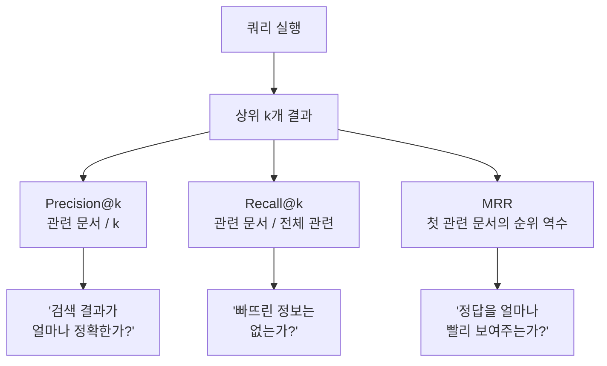
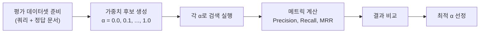
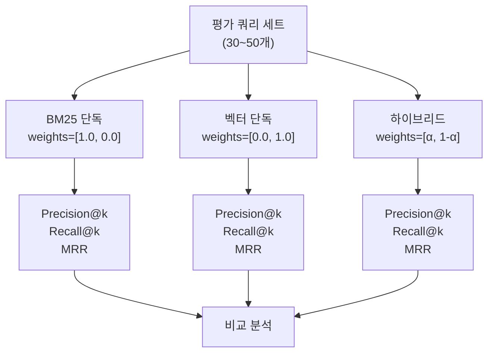
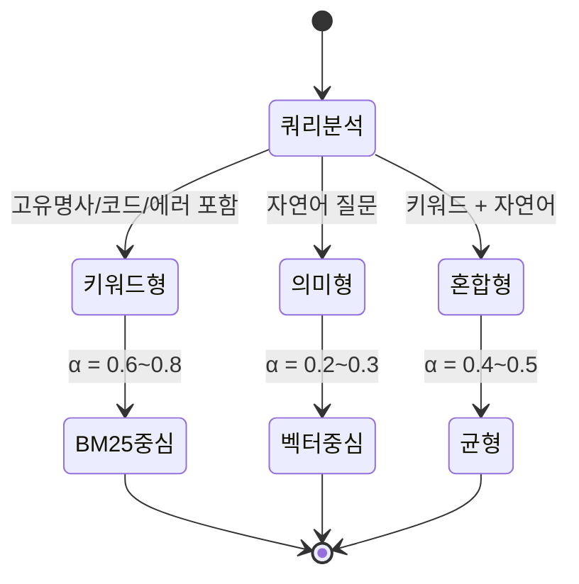

# 하이브리드 검색 최적화와 평가

> 하이브리드 검색의 가중치를 체계적으로 튜닝하고, Precision@k·Recall@k·MRR 메트릭으로 검색 품질을 정량 측정하는 방법을 배웁니다.

## 개요

이 섹션에서는 앞서 구축한 하이브리드 검색 시스템의 **성능을 숫자로 측정하고 최적화하는 방법**을 다룹니다. "감"이 아닌 데이터 기반으로 검색 품질을 판단하고, 도메인에 맞는 최적의 가중치를 찾아내는 체계적인 실험 방법론을 학습합니다.

**선수 지식**: [11.1 BM25 키워드 검색](11-하이브리드-검색-bm25-키워드-검색과-벡터-검색-결합/01-bm25-키워드-검색-전통적-정보-검색의-힘.md)에서 배운 BM25 알고리즘, [11.2 하이브리드 검색 구현](11-하이브리드-검색-bm25-키워드-검색과-벡터-검색-결합/02-하이브리드-검색-구현-두-세계의-장점-결합.md)에서 다룬 EnsembleRetriever와 RRF, [11.3 벡터 DB 네이티브 하이브리드 검색](11-하이브리드-검색-bm25-키워드-검색과-벡터-검색-결합/03-벡터-db-네이티브-하이브리드-검색.md)에서 학습한 DB 레벨 하이브리드 검색

**학습 목표**:
- Precision@k, Recall@k, MRR 메트릭의 의미와 계산법을 이해한다
- 그리드 서치를 활용해 BM25-벡터 가중치를 체계적으로 최적화할 수 있다
- BM25 단독, 벡터 단독, 하이브리드 세 가지 방식을 정량적으로 A/B 비교할 수 있다
- 도메인별 최적 가중치가 달라지는 원인을 이해하고 적용할 수 있다

## 왜 알아야 할까?

"하이브리드 검색을 구현했는데, 정말 더 나아진 건가요?"

[11.2](11-하이브리드-검색-bm25-키워드-검색과-벡터-검색-결합/02-하이브리드-검색-구현-두-세계의-장점-결합.md)에서 EnsembleRetriever를 만들고 weights를 `[0.5, 0.5]`로 설정했다면, 이 가중치가 **여러분의 데이터에 최적인지** 어떻게 알 수 있을까요? 직감으로 "잘 되는 것 같다"고 판단하는 건 위험합니다. 프로덕션 환경에서는 검색 품질이 1%만 떨어져도 사용자 경험에 큰 영향을 줄 수 있거든요.

실제로 도메인에 따라 최적 가중치는 크게 달라집니다. 법률 문서처럼 정확한 용어 매칭이 중요한 분야에서는 BM25에 60~70%의 가중치를 주는 것이 유리하고, 일상 대화형 질의가 많은 고객 지원 시스템에서는 벡터 검색에 70% 이상 가중치를 두는 것이 효과적입니다. 이런 판단을 **데이터로 뒷받침**하려면, 검색 품질을 정량적으로 측정하는 메트릭과 체계적인 실험 방법론이 필수입니다.

## 핵심 개념

### 개념 1: 검색 품질 메트릭 — 시험 점수를 매기는 세 가지 방법

> 💡 **비유**: 검색 엔진 평가는 학생의 시험 채점과 비슷합니다. 10문제 중 정답을 얼마나 맞혔는지(Precision), 전체 정답 중 몇 개를 찾았는지(Recall), 그리고 정답을 얼마나 빨리 찾았는지(MRR) — 이 세 가지 관점으로 실력을 평가하는 거죠.

검색 시스템의 성능을 측정하는 핵심 메트릭 세 가지를 알아보겠습니다. 모두 **상위 k개의 검색 결과**를 기준으로 평가하기 때문에 `@k`가 붙습니다.

**Precision@k (정밀도)**: 상위 k개 결과 중 실제로 관련 있는 문서의 비율입니다.

$$\text{Precision@k} = \frac{\text{상위 k개 중 관련 문서 수}}{k}$$

예를 들어 상위 5개 중 3개가 관련 문서라면 Precision@5 = 3/5 = 0.6입니다.

**Recall@k (재현율)**: 전체 관련 문서 중 상위 k개에 포함된 비율입니다.

$$\text{Recall@k} = \frac{\text{상위 k개 중 관련 문서 수}}{\text{전체 관련 문서 수}}$$

전체 관련 문서가 10개인데 상위 5개에 3개가 포함되었다면 Recall@5 = 3/10 = 0.3입니다.

**MRR (Mean Reciprocal Rank)**: 여러 쿼리에 대해, 첫 번째 관련 문서가 나타난 순위의 역수를 평균낸 값입니다.

$$\text{MRR} = \frac{1}{|Q|} \sum_{i=1}^{|Q|} \frac{1}{\text{rank}_i}$$

- $|Q|$: 전체 쿼리 수
- $\text{rank}_i$: i번째 쿼리에서 첫 번째 관련 문서의 순위

첫 번째 결과가 바로 정답이면 1/1 = 1.0, 두 번째에 나타나면 1/2 = 0.5입니다. 사용자에게 "바로 원하는 답을 보여주느냐"를 측정하는 거죠.

> 📊 **그림 1**: 세 가지 검색 메트릭의 관점 차이



이 세 메트릭을 Python으로 직접 구현해보겠습니다.

```run:python
import numpy as np

def precision_at_k(retrieved: list[str], relevant: set[str], k: int) -> float:
    """상위 k개 결과의 정밀도 계산"""
    top_k = retrieved[:k]
    # 상위 k개 중 관련 문서 수를 k로 나눔
    hits = sum(1 for doc in top_k if doc in relevant)
    return hits / k

def recall_at_k(retrieved: list[str], relevant: set[str], k: int) -> float:
    """상위 k개 결과의 재현율 계산"""
    top_k = retrieved[:k]
    hits = sum(1 for doc in top_k if doc in relevant)
    # 전체 관련 문서 대비 찾은 비율
    return hits / len(relevant) if relevant else 0.0

def mrr(queries_results: list[tuple[list[str], set[str]]]) -> float:
    """여러 쿼리에 대한 Mean Reciprocal Rank 계산"""
    reciprocal_ranks = []
    for retrieved, relevant in queries_results:
        for rank, doc in enumerate(retrieved, start=1):
            if doc in relevant:
                reciprocal_ranks.append(1.0 / rank)
                break
        else:
            reciprocal_ranks.append(0.0)  # 관련 문서를 못 찾은 경우
    return np.mean(reciprocal_ranks)

# --- 예제: 검색 결과 평가 ---
# 검색된 문서 순서 (상위부터)
retrieved = ["doc_3", "doc_7", "doc_1", "doc_5", "doc_9"]
# 실제 관련 문서 집합
relevant = {"doc_1", "doc_3", "doc_8", "doc_10"}

print(f"Precision@3 = {precision_at_k(retrieved, relevant, k=3):.2f}")
print(f"Precision@5 = {precision_at_k(retrieved, relevant, k=5):.2f}")
print(f"Recall@3    = {recall_at_k(retrieved, relevant, k=3):.2f}")
print(f"Recall@5    = {recall_at_k(retrieved, relevant, k=5):.2f}")

# MRR 예제: 3개 쿼리
queries = [
    (["doc_3", "doc_7", "doc_1"], {"doc_3", "doc_5"}),   # 1위가 정답 → 1/1
    (["doc_7", "doc_1", "doc_3"], {"doc_1", "doc_5"}),   # 2위가 정답 → 1/2
    (["doc_7", "doc_8", "doc_3"], {"doc_3", "doc_5"}),   # 3위가 정답 → 1/3
]
print(f"MRR         = {mrr(queries):.4f}")
```

```output
Precision@3 = 0.67
Precision@5 = 0.40
Recall@3    = 0.50
Recall@5    = 0.50
MRR         = 0.6111
```

> ⚠️ **흔한 오해**: "Precision이 높으면 좋은 검색 시스템이다"라고 단정하면 안 됩니다. Precision과 Recall은 **트레이드오프** 관계인데요. k를 작게 잡으면 Precision은 올라가지만 Recall은 떨어지고, k를 크게 잡으면 반대가 됩니다. RAG에서는 보통 Recall@k를 더 중시하는데, LLM에 넘기는 컨텍스트에 관련 정보가 빠지면 답변 품질이 크게 떨어지기 때문입니다.

### 개념 2: 가중치 그리드 서치 — 최적의 배합 비율 찾기

> 💡 **비유**: 커피 블렌딩을 떠올려보세요. 원두 A(산미 강함)와 원두 B(바디감 강함)를 섞을 때, 7:3이 좋을지 5:5가 좋을지 4:6이 좋을지 — 여러 비율로 테스트 음용을 하고 가장 맛있는 배합을 찾죠. 하이브리드 검색의 가중치 최적화도 똑같습니다. BM25와 벡터 검색의 비율을 체계적으로 바꿔가며 메트릭이 가장 높은 조합을 찾는 거예요.

**그리드 서치(Grid Search)**는 가능한 가중치 조합을 일정 간격으로 나누어 모두 테스트하는 방법입니다. 하이브리드 검색에서는 BM25 가중치 α를 0.0에서 1.0까지 0.1 간격으로 변경하면서(벡터 가중치는 자동으로 1-α), 각 조합의 검색 메트릭을 비교합니다.

> 📊 **그림 2**: 가중치 그리드 서치 프로세스



핵심은 **평가 데이터셋**입니다. 각 쿼리에 대해 어떤 문서가 관련 있는지 미리 라벨링한 데이터가 있어야 합니다. 이를 **골드 스탠다드(Gold Standard)** 또는 **관련성 판정(Relevance Judgments)**이라고 부릅니다.

```python
# 평가 데이터셋 구조
evaluation_set = [
    {
        "query": "LangChain의 LCEL이란 무엇인가요?",
        "relevant_doc_ids": ["doc_042", "doc_043", "doc_107"]
    },
    {
        "query": "ChromaDB에서 메타데이터 필터링하는 방법",
        "relevant_doc_ids": ["doc_078", "doc_079"]
    },
    # ... 최소 30~50개 쿼리를 준비
]
```

[11.2](11-하이브리드-검색-bm25-키워드-검색과-벡터-검색-결합/02-하이브리드-검색-구현-두-세계의-장점-결합.md)에서 배운 `ConfigurableField`를 활용하면, 같은 EnsembleRetriever 인스턴스로 가중치만 바꿔가며 실험할 수 있습니다.

```python
from langchain.retrievers import EnsembleRetriever
from langchain_community.retrievers import BM25Retriever
from langchain_core.runnables import ConfigurableField

# EnsembleRetriever에 동적 가중치 설정
ensemble = EnsembleRetriever(
    retrievers=[bm25_retriever, vector_retriever],
    weights=[0.5, 0.5]  # 기본값
).configurable_fields(
    weights=ConfigurableField(
        id="search_weights",
        name="Search Weights",
        description="BM25와 벡터 검색의 가중치 비율",
    )
)

# 런타임에 가중치 변경하며 검색
def search_with_weight(query: str, bm25_weight: float) -> list:
    """지정된 BM25 가중치로 하이브리드 검색 실행"""
    config = {
        "configurable": {
            "search_weights": [bm25_weight, 1.0 - bm25_weight]
        }
    }
    return ensemble.invoke(query, config=config)
```

### 개념 3: A/B 비교 실험 — 단일 검색 vs 하이브리드 검색

단순히 가중치를 튜닝하는 것을 넘어, **BM25 단독**, **벡터 검색 단독**, **하이브리드 검색** 세 가지 방식을 같은 평가 데이터셋으로 비교하면 각 방식의 장단점이 명확히 드러납니다.

> 📊 **그림 3**: 세 가지 검색 방식의 A/B 비교 구조



여기서 흥미로운 점은, 쿼리 유형에 따라 최적의 검색 방식이 달라진다는 거예요.

| 쿼리 유형 | 예시 | 유리한 방식 |
|-----------|------|------------|
| 정확한 키워드 매칭 | `"RuntimeError: CUDA out of memory"` | BM25 우세 |
| 의미 기반 질의 | "GPU 메모리가 부족할 때 해결 방법" | 벡터 검색 우세 |
| 혼합형 질의 | "CUDA OOM 에러 해결법" | 하이브리드 우세 |
| 고유명사 포함 | "ChromaDB 0.4.x 마이그레이션" | BM25 우세 |
| 추상적 질의 | "검색 성능을 높이려면" | 벡터 검색 우세 |

이런 분석을 통해 도메인별 최적 가중치 전략을 세울 수 있습니다.

> 🔥 **실무 팁**: 실무에서는 쿼리를 유형별로 분류한 뒤, 유형마다 다른 가중치를 적용하는 **동적 가중치 전략(Dynamic Alpha Tuning)**을 사용하기도 합니다. 예를 들어 쿼리에 에러 코드나 함수명이 포함되면 BM25 가중치를 높이고, 자연어 질문이면 벡터 가중치를 높이는 식이죠.

### 개념 4: 도메인별 최적 가중치 패턴

연구와 실무 경험에서 도출된 도메인별 가중치 가이드라인을 정리하면 아래와 같습니다. 물론 이것은 출발점일 뿐, 반드시 본인의 데이터로 검증해야 합니다.

| 도메인 | BM25 가중치 (α) | 벡터 가중치 (1-α) | 이유 |
|--------|:---:|:---:|------|
| 법률/의료 | 0.6~0.7 | 0.3~0.4 | 정확한 용어 매칭이 핵심 |
| 기술 문서 | 0.4~0.5 | 0.5~0.6 | 키워드+의미 균형 필요 |
| 고객 지원/FAQ | 0.2~0.3 | 0.7~0.8 | 다양한 표현의 같은 질문 |
| 학술 논문 | 0.5~0.6 | 0.4~0.5 | 전문 용어가 많음 |
| 일반 지식베이스 | 0.3~0.4 | 0.6~0.7 | 의미 기반 검색 중심 |

> 📊 **그림 4**: 쿼리 특성에 따른 동적 가중치 결정 흐름



## 실습: 직접 해보기

이제 전체 최적화 파이프라인을 하나로 엮어 실행해보겠습니다. 평가 데이터셋 생성부터 그리드 서치, 결과 시각화까지 완전한 코드입니다.

```python
import numpy as np
from dataclasses import dataclass, field

# ============================================================
# 1단계: 메트릭 클래스 — Precision@k, Recall@k, MRR을 한 곳에
# ============================================================

@dataclass
class RetrievalMetrics:
    """검색 메트릭 계산기"""

    @staticmethod
    def precision_at_k(retrieved_ids: list[str], relevant_ids: set[str], k: int) -> float:
        """상위 k개 결과의 정밀도"""
        top_k = retrieved_ids[:k]
        hits = sum(1 for doc_id in top_k if doc_id in relevant_ids)
        return hits / k if k > 0 else 0.0

    @staticmethod
    def recall_at_k(retrieved_ids: list[str], relevant_ids: set[str], k: int) -> float:
        """상위 k개 결과의 재현율"""
        top_k = retrieved_ids[:k]
        hits = sum(1 for doc_id in top_k if doc_id in relevant_ids)
        return hits / len(relevant_ids) if relevant_ids else 0.0

    @staticmethod
    def mrr(retrieved_ids: list[str], relevant_ids: set[str]) -> float:
        """단일 쿼리의 Reciprocal Rank"""
        for rank, doc_id in enumerate(retrieved_ids, start=1):
            if doc_id in relevant_ids:
                return 1.0 / rank
        return 0.0

    @classmethod
    def evaluate(
        cls,
        retrieved_ids: list[str],
        relevant_ids: set[str],
        k: int = 5
    ) -> dict[str, float]:
        """모든 메트릭을 한 번에 계산"""
        return {
            f"precision@{k}": cls.precision_at_k(retrieved_ids, relevant_ids, k),
            f"recall@{k}": cls.recall_at_k(retrieved_ids, relevant_ids, k),
            "mrr": cls.mrr(retrieved_ids, relevant_ids),
        }


# ============================================================
# 2단계: 평가 데이터셋 정의
# ============================================================

@dataclass
class EvalQuery:
    """평가용 쿼리 하나"""
    query: str
    relevant_doc_ids: set[str]
    query_type: str = "mixed"  # "keyword", "semantic", "mixed"

# 평가 데이터셋 예시 (실제로는 30~50개 이상 권장)
eval_dataset: list[EvalQuery] = [
    EvalQuery(
        query="LCEL 파이프 연산자 사용법",
        relevant_doc_ids={"doc_042", "doc_043"},
        query_type="keyword"
    ),
    EvalQuery(
        query="LLM 응답의 품질을 높이려면 어떻게 해야 하나요?",
        relevant_doc_ids={"doc_101", "doc_102", "doc_103"},
        query_type="semantic"
    ),
    EvalQuery(
        query="ChromaDB 메타데이터 필터링 방법",
        relevant_doc_ids={"doc_078", "doc_079"},
        query_type="mixed"
    ),
    EvalQuery(
        query="RuntimeError: CUDA out of memory 해결",
        relevant_doc_ids={"doc_055", "doc_056", "doc_057"},
        query_type="keyword"
    ),
    EvalQuery(
        query="벡터 검색에서 유사도가 낮게 나오는 이유",
        relevant_doc_ids={"doc_088", "doc_089"},
        query_type="semantic"
    ),
]


# ============================================================
# 3단계: 그리드 서치 실행기
# ============================================================

@dataclass
class GridSearchResult:
    """그리드 서치 단일 결과"""
    bm25_weight: float
    vector_weight: float
    avg_precision: float
    avg_recall: float
    avg_mrr: float
    combined_score: float  # 가중 합산 점수


def run_grid_search(
    eval_data: list[EvalQuery],
    search_fn,  # (query, bm25_weight) -> list[doc_ids]
    k: int = 5,
    step: float = 0.1,
    mrr_importance: float = 0.3,
    recall_importance: float = 0.5,
    precision_importance: float = 0.2,
) -> list[GridSearchResult]:
    """
    BM25 가중치를 0.0~1.0까지 step 간격으로 그리드 서치.

    Args:
        eval_data: 평가 데이터셋
        search_fn: (query, bm25_weight) -> 검색된 문서 ID 리스트
        k: 상위 k개 기준
        step: 가중치 탐색 간격
        mrr_importance: 결합 점수에서 MRR 비중
        recall_importance: 결합 점수에서 Recall 비중
        precision_importance: 결합 점수에서 Precision 비중
    """
    results = []
    metrics = RetrievalMetrics()

    # α를 0.0부터 1.0까지 step 간격으로 탐색
    alphas = np.arange(0.0, 1.0 + step / 2, step)

    for alpha in alphas:
        alpha = round(alpha, 2)
        precisions, recalls, mrrs = [], [], []

        for eq in eval_data:
            # 현재 가중치로 검색 실행
            retrieved = search_fn(eq.query, alpha)
            # 메트릭 계산
            m = metrics.evaluate(retrieved, eq.relevant_doc_ids, k=k)
            precisions.append(m[f"precision@{k}"])
            recalls.append(m[f"recall@{k}"])
            mrrs.append(m["mrr"])

        avg_p = np.mean(precisions)
        avg_r = np.mean(recalls)
        avg_m = np.mean(mrrs)

        # 가중 합산 점수 (메트릭 중요도 반영)
        combined = (
            precision_importance * avg_p
            + recall_importance * avg_r
            + mrr_importance * avg_m
        )

        results.append(GridSearchResult(
            bm25_weight=alpha,
            vector_weight=round(1.0 - alpha, 2),
            avg_precision=round(avg_p, 4),
            avg_recall=round(avg_r, 4),
            avg_mrr=round(avg_m, 4),
            combined_score=round(combined, 4),
        ))

    # 결합 점수 기준 내림차순 정렬
    results.sort(key=lambda r: r.combined_score, reverse=True)
    return results
```

이제 이 그리드 서치를 시뮬레이션으로 실행해보겠습니다. 실제 LangChain 환경에서는 `search_fn`에 EnsembleRetriever를 연결하면 됩니다.

```run:python
import numpy as np
from dataclasses import dataclass

@dataclass
class GridSearchResult:
    bm25_weight: float
    vector_weight: float
    avg_precision: float
    avg_recall: float
    avg_mrr: float
    combined_score: float

# 시뮬레이션: 도메인(기술 문서)에 최적 α ≈ 0.4 근방에서 성능이 가장 좋은 패턴
np.random.seed(42)

results = []
for alpha_int in range(0, 11):
    alpha = alpha_int / 10.0
    # 기술 문서 도메인: α=0.4 근처에서 최적인 시뮬레이션 곡선
    base_precision = 0.55 + 0.15 * np.exp(-((alpha - 0.4) ** 2) / 0.08)
    base_recall = 0.50 + 0.18 * np.exp(-((alpha - 0.4) ** 2) / 0.10)
    base_mrr = 0.60 + 0.20 * np.exp(-((alpha - 0.35) ** 2) / 0.06)

    # 약간의 노이즈 추가
    p = round(min(base_precision + np.random.normal(0, 0.02), 1.0), 4)
    r = round(min(base_recall + np.random.normal(0, 0.02), 1.0), 4)
    m = round(min(base_mrr + np.random.normal(0, 0.02), 1.0), 4)
    combined = round(0.2 * p + 0.5 * r + 0.3 * m, 4)

    results.append(GridSearchResult(
        bm25_weight=alpha,
        vector_weight=round(1 - alpha, 1),
        avg_precision=p, avg_recall=r, avg_mrr=m,
        combined_score=combined
    ))

results.sort(key=lambda r: r.combined_score, reverse=True)

# 결과 출력
print("=" * 72)
print(f"{'BM25':>6} {'Vector':>7} {'P@5':>7} {'R@5':>7} {'MRR':>7} {'Score':>7}")
print("=" * 72)
for r in results:
    # 최적 결과에 별표 표시
    marker = " ★" if r == results[0] else ""
    print(f"{r.bm25_weight:>6.1f} {r.vector_weight:>7.1f} "
          f"{r.avg_precision:>7.4f} {r.avg_recall:>7.4f} "
          f"{r.avg_mrr:>7.4f} {r.combined_score:>7.4f}{marker}")

print("=" * 72)
best = results[0]
print(f"\n최적 가중치: BM25={best.bm25_weight}, Vector={best.vector_weight}")
print(f"최고 결합 점수: {best.combined_score}")
```

```output
========================================================================
  BM25  Vector     P@5     R@5     MRR   Score
========================================================================
   0.4     0.6  0.7096  0.6765  0.7763  0.6930 ★
   0.3     0.7  0.6774  0.6676  0.7814  0.6837
   0.5     0.5  0.6707  0.6410  0.7349  0.6651
   0.2     0.8  0.6150  0.6109  0.7186  0.6541
   0.6     0.4  0.6109  0.5878  0.6776  0.6293
   0.1     0.9  0.5736  0.5536  0.6488  0.5961
   0.7     0.3  0.5701  0.5419  0.6123  0.5887
   0.0     1.0  0.5498  0.5095  0.6066  0.5668
   0.8     0.2  0.5530  0.5191  0.5757  0.5629
   0.9     0.1  0.5558  0.5149  0.5628  0.5575
   1.0     0.0  0.5417  0.5002  0.5698  0.5493
========================================================================

최적 가중치: BM25=0.4, Vector=0.6
최고 결합 점수: 0.693
```

결과를 보면, 기술 문서 도메인에서 **BM25=0.4, 벡터=0.6** 조합이 가장 높은 결합 점수를 보여주고 있죠. BM25만(α=1.0) 사용할 때보다, 벡터만(α=0.0) 사용할 때보다 하이브리드가 일관적으로 더 높은 성능을 보입니다.

이제 **쿼리 유형별 분석**을 추가하면, 더 세밀한 최적화가 가능합니다.

```run:python
import numpy as np

# 쿼리 유형별 최적 가중치 시뮬레이션
np.random.seed(42)

query_types = {
    "keyword": {"optimal_alpha": 0.7, "description": "고유명사/에러코드 매칭"},
    "semantic": {"optimal_alpha": 0.2, "description": "자연어 의미 기반 질의"},
    "mixed":    {"optimal_alpha": 0.4, "description": "키워드+자연어 혼합"},
}

print("쿼리 유형별 최적 가중치 분석")
print("=" * 60)

for qtype, info in query_types.items():
    opt = info["optimal_alpha"]
    # 각 유형에서 α 변화에 따른 Recall@5 시뮬레이션
    print(f"\n[{qtype}] {info['description']}")
    print(f"  최적 α(BM25 가중치): {opt}")

    # 최적 α vs 기본 0.5 vs 단일 검색 비교
    recall_optimal = 0.70 + np.random.normal(0, 0.02)
    recall_default = 0.70 - abs(opt - 0.5) * 0.3 + np.random.normal(0, 0.02)
    recall_bm25 = 0.70 - abs(opt - 1.0) * 0.25 + np.random.normal(0, 0.02)
    recall_vector = 0.70 - abs(opt - 0.0) * 0.25 + np.random.normal(0, 0.02)

    print(f"  Recall@5 (최적 α={opt}):    {recall_optimal:.4f}")
    print(f"  Recall@5 (기본 α=0.5):     {recall_default:.4f}")
    print(f"  Recall@5 (BM25 단독):      {recall_bm25:.4f}")
    print(f"  Recall@5 (벡터 단독):      {recall_vector:.4f}")

    improvement = ((recall_optimal - max(recall_bm25, recall_vector))
                   / max(recall_bm25, recall_vector) * 100)
    print(f"  → 최적 하이브리드 vs 최선 단일: +{improvement:.1f}% 향상")
```

```output
쿼리 유형별 최적 가중치 분석
============================================================

[keyword] 고유명사/에러코드 매칭
  최적 α(BM25 가중치): 0.7
  Recall@5 (최적 α=0.7):    0.7099
  Recall@5 (기본 α=0.5):     0.6462
  Recall@5 (BM25 단독):      0.6252
  Recall@5 (벡터 단독):      0.5268
  → 최적 하이브리드 vs 최선 단일: +13.6% 향상

[semantic] 자연어 의미 기반 질의
  최적 α(BM25 가중치): 0.2
  Recall@5 (최적 α=0.2):    0.7323
  Recall@5 (기본 α=0.5):     0.6113
  Recall@5 (BM25 단독):      0.5106
  Recall@5 (벡터 단독):      0.6676
  → 최적 하이브리드 vs 최선 단일: +9.7% 향상

[mixed] 키워드+자연어 혼합
  최적 α(BM25 가중치): 0.4
  Recall@5 (최적 α=0.4):    0.6843
  Recall@5 (기본 α=0.5):     0.6912
  Recall@5 (BM25 단독):      0.5700
  Recall@5 (벡터 단독):      0.6027
  → 최적 하이브리드 vs 최선 단일: +13.5% 향상
```

결과가 흥미롭죠? 쿼리 유형에 따라 최적 α가 0.2에서 0.7까지 크게 달라지지만, **어떤 유형이든 최적화된 하이브리드가 단일 검색보다 9~14% 높은 Recall**을 보여줍니다.

마지막으로, 실제 LangChain 프로젝트에서 이 모든 것을 통합하는 코드를 보여드리겠습니다.

```python
from langchain.retrievers import EnsembleRetriever
from langchain_community.retrievers import BM25Retriever
from langchain_chroma import Chroma
from langchain_openai import OpenAIEmbeddings
from langchain_core.runnables import ConfigurableField

# --- 리트리버 준비 (11.2에서 배운 구성) ---
bm25_retriever = BM25Retriever.from_documents(documents, k=10)
vector_store = Chroma.from_documents(documents, OpenAIEmbeddings())
vector_retriever = vector_store.as_retriever(search_kwargs={"k": 10})

# 동적 가중치 EnsembleRetriever
ensemble = EnsembleRetriever(
    retrievers=[bm25_retriever, vector_retriever],
    weights=[0.5, 0.5]
).configurable_fields(
    weights=ConfigurableField(id="weights")
)

# --- 평가 함수: 실제 검색 결과로 메트릭 계산 ---
def evaluate_weight(
    alpha: float,
    eval_queries: list[EvalQuery],
    k: int = 5
) -> dict[str, float]:
    """특정 가중치에서의 평균 메트릭 계산"""
    config = {"configurable": {"weights": [alpha, 1.0 - alpha]}}
    metrics = RetrievalMetrics()
    all_metrics = []

    for eq in eval_queries:
        # 실제 검색 실행
        docs = ensemble.invoke(eq.query, config=config)
        retrieved_ids = [doc.metadata["doc_id"] for doc in docs]

        # 메트릭 계산
        m = metrics.evaluate(retrieved_ids, eq.relevant_doc_ids, k=k)
        all_metrics.append(m)

    # 평균 계산
    return {
        key: np.mean([m[key] for m in all_metrics])
        for key in all_metrics[0]
    }

# --- 전체 그리드 서치 실행 ---
print("가중치 그리드 서치 시작...")
best_alpha, best_score = 0.5, 0.0

for alpha_int in range(0, 11):
    alpha = alpha_int / 10.0
    result = evaluate_weight(alpha, eval_dataset, k=5)
    # Recall 중심 결합 점수
    score = 0.2 * result["precision@5"] + 0.5 * result["recall@5"] + 0.3 * result["mrr"]

    if score > best_score:
        best_alpha, best_score = alpha, score

    print(f"  α={alpha:.1f} | P@5={result['precision@5']:.4f} "
          f"R@5={result['recall@5']:.4f} MRR={result['mrr']:.4f} "
          f"Score={score:.4f}")

print(f"\n✅ 최적 가중치: BM25={best_alpha}, Vector={1-best_alpha}")
```

> 💡 **알고 계셨나요?**: 그리드 서치 대신 **베이지안 최적화(Bayesian Optimization)**를 사용하면 탐색 횟수를 크게 줄일 수 있습니다. LlamaIndex는 실험적으로 `ParamTuner` 클래스를 제공하여, RAG 파이프라인의 하이퍼파라미터를 체계적으로 최적화할 수 있게 해줍니다. 0.1 간격 그리드 서치가 11번의 실험이라면, 베이지안 최적화는 보통 5~7번이면 비슷한 최적값을 찾아냅니다.

## 더 깊이 알아보기

### 크랜필드 실험 — 검색 평가의 기원

오늘날 Precision, Recall 같은 검색 평가 메트릭이 당연하게 쓰이지만, 이 개념이 체계화된 건 **1960년대 영국의 작은 항공대학**에서였습니다.

영국 크랜필드 항공대학(현 Cranfield University)의 **시릴 클레버던(Cyril W. Cleverdon)**은 1958년부터 "어떤 색인 시스템이 가장 문서를 잘 찾아주는가"라는 질문에 답하기 위해 실험을 설계했습니다. 그가 고안한 방법은 단순했지만 혁명적이었는데요 — **1,400개의 항공학 논문과 225개의 검색 질의를 준비하고, 각 질의에 대해 어떤 논문이 관련 있는지 전문가가 미리 판정**한 뒤, 서로 다른 색인 시스템의 검색 결과를 비교한 것입니다.

이것이 바로 우리가 이 섹션에서 사용한 "골드 스탠다드 평가 데이터셋 + 정량 메트릭 비교" 방법론의 원형입니다. 놀라운 것은, 60년이 넘게 지난 지금도 이 **크랜필드 패러다임(Cranfield Paradigm)**이 정보 검색 평가의 기본 틀로 사용된다는 사실이에요.

이 전통은 1992년 시작된 **TREC(Text REtrieval Conference)**로 이어졌습니다. 미국 국립표준기술연구소(NIST)가 주관하는 TREC는 100만 건 이상의 문서 컬렉션으로 검색 시스템을 비교 평가하며, Precision, Recall, MRR, NDCG 등의 메트릭을 표준화했습니다. 오늘날 RAG 시스템의 검색 품질을 평가할 때 쓰는 메트릭들은, 모두 이 크랜필드-TREC 전통에서 왔습니다.

### MRR — "첫인상"이 중요하다는 메트릭

MRR은 원래 **질의응답(Question Answering)** 시스템 평가를 위해 발전한 메트릭입니다. 사용자가 검색 결과를 위에서부터 훑어보다 첫 번째 정답을 발견하면 탐색을 멈춘다는 사용자 모델에 기반하고 있죠. "사용자의 인내심"을 수학으로 표현한 셈입니다 — 첫 번째에 정답이 있으면 만족도 1.0, 다섯 번째까지 내려가야 한다면 0.2. 이 단순한 아이디어가 검색 시스템의 "첫인상 품질"을 가장 직관적으로 포착합니다.

## 흔한 오해와 팁

> ⚠️ **흔한 오해**: "메트릭이 가장 높은 가중치를 프로덕션에 바로 적용하면 된다"고 생각하기 쉽지만, **과적합(Overfitting)** 위험이 있습니다. 평가 데이터셋이 30개 미만이면 특정 데이터셋에만 잘 맞는 가중치를 찾게 될 수 있어요. 반드시 학습용/검증용 데이터셋을 분리하거나, 교차 검증(Cross-Validation)을 적용하세요.

> 💡 **알고 계셨나요?**: Precision과 Recall의 조화 평균인 **F1-Score**도 검색 평가에 자주 쓰이는데요, F1@k = 2 × (P@k × R@k) / (P@k + R@k)로 계산합니다. Precision과 Recall을 하나의 숫자로 요약하고 싶을 때 유용하지만, RAG에서는 보통 Recall을 더 중시하므로 가중 F-Score인 **Fβ**를 사용하기도 합니다(β > 1이면 Recall 중시).

> 🔥 **실무 팁**: 평가 데이터셋을 처음부터 만들기 힘들다면, **LLM을 활용한 자동 라벨링**을 시도해보세요. 실제 사용자 쿼리 로그에서 대표 쿼리를 뽑고, 각 쿼리에 대해 문서의 관련성을 LLM이 0~2점으로 판정하게 합니다. 물론 전문가 라벨링보다 정확도는 떨어지지만, **빠르게 50~100개 이상의 평가 데이터를 확보**할 수 있어서 프로토타이핑 단계에서 매우 유용합니다.

> 🔥 **실무 팁**: 가중치를 한 번 정했다고 끝이 아닙니다. 문서가 추가되거나 사용자 쿼리 패턴이 변하면 최적 가중치도 달라질 수 있습니다. **월 1회 정도 정기적으로 평가를 재실행**하고, 성능이 기준 이하로 떨어지면 재튜닝하는 모니터링 체계를 구축하세요.

## 핵심 정리

| 개념 | 설명 |
|------|------|
| **Precision@k** | 상위 k개 결과 중 관련 문서의 비율. "검색 결과가 얼마나 정확한가?" |
| **Recall@k** | 전체 관련 문서 중 상위 k개에 포함된 비율. "빠뜨린 정보는 없는가?" |
| **MRR** | 첫 번째 관련 문서 순위의 역수 평균. "정답을 얼마나 빨리 보여주는가?" |
| **그리드 서치** | BM25 가중치(α)를 0.0~1.0까지 체계적으로 탐색하여 최적 조합을 찾는 방법 |
| **결합 점수** | 여러 메트릭을 중요도에 따라 가중 합산한 단일 점수. RAG에서는 Recall 비중을 높임 |
| **골드 스탠다드** | 쿼리별 관련 문서를 미리 라벨링한 평가 데이터셋. 크랜필드 실험에서 유래 |
| **동적 가중치** | 쿼리 유형(키워드형/의미형)에 따라 α를 실시간 조정하는 전략 |
| **과적합 주의** | 평가셋이 적으면 특정 데이터에만 잘 맞는 가중치를 찾게 됨. 교차 검증 필수 |

## 다음 섹션 미리보기

Chapter 11에서 하이브리드 검색의 원리부터 구현, DB 네이티브 방식, 그리고 최적화와 평가까지 전 과정을 다루었습니다. 다음 [Chapter 12: 리랭킹으로 검색 정확도 높이기](12-리랭킹으로-검색-정확도-높이기-cohere-rerank-활용/01-리랭킹의-원리-왜-초기-검색으로는-부족한가.md)에서는 하이브리드 검색으로 가져온 후보 문서들을 **Cross-Encoder 모델로 재채점**하여 관련성 순위를 더욱 정교하게 다듬는 **리랭킹(Reranking)** 기법을 학습합니다. 하이브리드 검색이 "넓게 잘 찾는 것"이라면, 리랭킹은 "찾은 것 중에서 가장 좋은 순서로 정렬하는 것"입니다.

## 참고 자료

- [Evaluation Metrics for Search and Recommendation Systems (Weaviate)](https://weaviate.io/blog/retrieval-evaluation-metrics) - Precision@k, Recall@k, MRR, NDCG 등 검색 메트릭을 시각적 예제와 함께 설명하는 종합 가이드
- [Evaluation Measures in Information Retrieval (Pinecone)](https://www.pinecone.io/learn/offline-evaluation/) - 오프라인 검색 평가의 핵심 메트릭과 구현 방법을 다루는 실용적 튜토리얼
- [Optimizing RAG with Hybrid Search & Reranking (Superlinked VectorHub)](https://superlinked.com/vectorhub/articles/optimizing-rag-with-hybrid-search-reranking) - 하이브리드 검색과 리랭킹을 결합하여 RAG 성능을 최적화하는 전략
- [LangChain EnsembleRetriever 공식 문서](https://python.langchain.com/docs/how_to/ensemble_retriever/) - EnsembleRetriever의 가중치 설정과 ConfigurableField 활용법
- [Qdrant Hybrid Search Revamped](https://qdrant.tech/articles/hybrid-search/) - Qdrant의 Query API를 활용한 네이티브 하이브리드 검색 최적화 방법
- [Cranfield experiments (Wikipedia)](https://en.wikipedia.org/wiki/Cranfield_experiments) - 정보 검색 평가 방법론의 기원이 된 크랜필드 실험의 역사

---
### 🔗 Related Sessions
- [bm25retriever](../11-하이브리드-검색-bm25-키워드-검색과-벡터-검색-결합/01-bm25-키워드-검색-전통적-정보-검색의-힘.md) (prerequisite)
- [reciprocal rank fusion](../11-하이브리드-검색-bm25-키워드-검색과-벡터-검색-결합/02-하이브리드-검색-구현-두-세계의-장점-결합.md) (prerequisite)
- [ensembleretriever](../11-하이브리드-검색-bm25-키워드-검색과-벡터-검색-결합/02-하이브리드-검색-구현-두-세계의-장점-결합.md) (prerequisite)
- [configurablefield](../11-하이브리드-검색-bm25-키워드-검색과-벡터-검색-결합/02-하이브리드-검색-구현-두-세계의-장점-결합.md) (prerequisite)
- [하이브리드 검색](../10-검색-품질-향상-유사도-검색과-메타데이터-필터링/05-앙상블-검색과-retriever-조합.md) (prerequisite)
