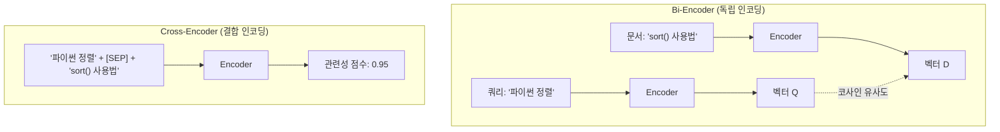
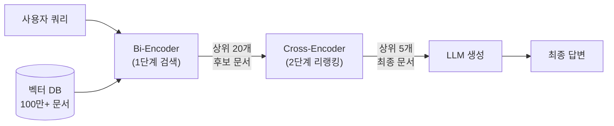

# 리랭킹의 원리 — 왜 초기 검색으로는 부족한가

> 벡터 검색이 놓치는 것들을 잡아내는 2단계 검색의 비밀

## 개요

이 섹션에서는 RAG 파이프라인에서 검색 품질을 한 단계 끌어올리는 **리랭킹(Reranking)**의 핵심 원리를 학습합니다. 왜 임베딩 기반 검색만으로는 부족한지, 그리고 Bi-Encoder와 Cross-Encoder라는 두 가지 모델 구조가 어떻게 다른 역할을 수행하는지 알아봅니다.

**선수 지식**: 
- [Ch5: 임베딩 모델 이해](05-임베딩-모델-이해-텍스트를-벡터로-변환/01-임베딩의-기본-개념-단어에서-문장까지.md)에서 배운 임베딩과 코사인 유사도 개념
- [Ch10: 검색 품질 향상](10-검색-품질-향상-유사도-검색과-메타데이터-필터링/01-유사도-검색-심화-top-k와-임계값-최적화.md)에서 다룬 유사도 검색의 한계
- [Ch11: 하이브리드 검색](11-하이브리드-검색-bm25-키워드-검색과-벡터-검색-결합/01-bm25-키워드-검색-전통적-정보-검색의-힘.md)에서 배운 키워드+벡터 결합 검색

**학습 목표**:
- 임베딩 기반 1단계 검색의 구조적 한계를 설명할 수 있다
- Bi-Encoder와 Cross-Encoder의 아키텍처 차이를 이해한다
- 2단계 검색(Retrieve-then-Rerank) 패턴의 작동 원리를 설명할 수 있다
- 리랭킹 전후의 검색 결과 품질 차이를 직접 확인할 수 있다

## 왜 알아야 할까?

여러분이 도서관에서 "한국 경제 성장의 원인"이라는 주제로 리포트를 쓴다고 상상해보세요. 사서에게 부탁하면 관련 책 20권을 빠르게 골라줄 겁니다. 하지만 그 20권 모두가 정말 여러분의 리포트에 딱 맞는 건 아니죠. 어떤 책은 "한국 경제"라는 단어가 들어있지만 실제로는 북한 경제 비교서이고, 어떤 책은 제목과 달리 일본 경제가 주제일 수도 있거든요.

이때 해당 분야 교수님이 그 20권을 한 권씩 훑어보고 "이 5권이 네 리포트에 가장 적합해"라고 재정렬해주면 어떨까요? 이것이 바로 **리랭킹**이 하는 일입니다.

RAG 파이프라인에서 벡터 검색은 빠르지만, "대략적으로 비슷한" 문서를 가져옵니다. 실무에서는 이 차이가 생성 답변의 품질을 좌우하는데요. Pinecone의 벤치마크에 따르면, 리랭킹을 추가하는 것만으로도 검색 정확도(MRR@10)가 **평균 20~30% 향상**됩니다. 단 한 줄의 코드 추가로 이 정도의 개선을 얻을 수 있다면, 안 쓸 이유가 없겠죠?

## 핵심 개념

### 개념 1: 1단계 검색의 한계 — 빠르지만 정확하지 않은 이유

> 💡 **비유**: 벡터 검색은 마치 도서관의 분류 시스템과 같습니다. "한국 경제"라는 키워드로 같은 서가에 꽂혀 있는 책을 빠르게 찾아주지만, 각 책이 실제로 내 질문에 얼마나 잘 답하는지까지는 판단하지 못합니다.

앞서 배운 임베딩 기반 검색(Bi-Encoder 방식)은 다음과 같은 구조로 동작합니다:

1. **문서 임베딩**: 모든 문서를 미리 벡터로 변환해둠
2. **쿼리 임베딩**: 사용자 질문을 벡터로 변환
3. **유사도 계산**: 코사인 유사도 등으로 가장 가까운 벡터를 찾음

이 방식이 **빠른 이유**는 쿼리와 문서를 **독립적으로** 인코딩하기 때문입니다. 문서 벡터는 미리 계산해두니까, 검색 시에는 쿼리 벡터 하나만 계산하면 되죠. 수백만 건의 문서에서도 밀리초 단위로 검색이 가능합니다.

하지만 여기에 구조적 한계가 있습니다. 쿼리와 문서를 **따로따로** 인코딩하기 때문에, 둘 사이의 **미묘한 상호작용**을 포착하지 못합니다. 예를 들어볼까요?

```run:python
# Bi-Encoder 검색의 한계와 리랭킹 효과를 보여주는 예시
query = "파이썬에서 리스트를 정렬하는 방법"

# 벡터 검색 결과 (유사도 순)
search_results = [
    {"rank": 1, "score": 0.92, "text": "파이썬 리스트의 sort() 메서드와 sorted() 함수를 사용하면 리스트를 정렬할 수 있습니다.", "relevant": True},
    {"rank": 2, "score": 0.89, "text": "파이썬에서 리스트는 가변(mutable) 자료구조로, 다양한 메서드를 제공합니다.", "relevant": False},
    {"rank": 3, "score": 0.87, "text": "자바에서 ArrayList를 정렬하려면 Collections.sort()를 사용합니다.", "relevant": False},
    {"rank": 4, "score": 0.85, "text": "파이썬 리스트 정렬 시 key 매개변수로 커스텀 정렬 기준을 지정할 수 있습니다.", "relevant": True},
    {"rank": 5, "score": 0.83, "text": "파이썬의 sorted() 함수는 Timsort 알고리즘을 사용하며, 안정 정렬을 보장합니다.", "relevant": True},
]

# 1단계: Bi-Encoder 결과
print("=== 1단계: Bi-Encoder 검색 결과 ===")
print(f"쿼리: {query}\n")
for r in search_results:
    icon = "✅ 관련" if r["relevant"] else "❌ 무관"
    print(f"  #{r['rank']} (유사도: {r['score']}) {icon}")
    print(f"     {r['text'][:50]}...")

top3_relevant = sum(1 for r in search_results[:3] if r["relevant"])
print(f"\n  → 상위 3개 중 관련 문서: {top3_relevant}개 (Precision@3 = {top3_relevant/3*100:.0f}%)")

# 2단계: Cross-Encoder 리랭킹 시뮬레이션
reranked = [
    {"new_rank": 1, "score": 0.97, "orig": 1, "text": search_results[0]["text"]},
    {"new_rank": 2, "score": 0.94, "orig": 4, "text": search_results[3]["text"]},
    {"new_rank": 3, "score": 0.91, "orig": 5, "text": search_results[4]["text"]},
    {"new_rank": 4, "score": 0.15, "orig": 2, "text": search_results[1]["text"]},
    {"new_rank": 5, "score": 0.08, "orig": 3, "text": search_results[2]["text"]},
]

print("\n=== 2단계: Cross-Encoder 리랭킹 결과 ===\n")
for r in reranked[:3]:  # 상위 3개만 출력
    print(f"  #{r['new_rank']} (관련성: {r['score']:.2f}, 원래 #{r['orig']}위) ✅")
    print(f"     {r['text'][:50]}...")

print(f"\n  → 상위 3개 모두 관련 문서! (Precision@3 = 100%)")
print(f"\n📊 리랭킹 효과: Precision@3 {top3_relevant/3*100:.0f}% → 100%")
```

```output
=== 1단계: Bi-Encoder 검색 결과 ===
쿼리: 파이썬에서 리스트를 정렬하는 방법

  #1 (유사도: 0.92) ✅ 관련
     파이썬 리스트의 sort() 메서드와 sorted() 함수를 사용하면 리스트를 정렬...
  #2 (유사도: 0.89) ❌ 무관
     파이썬에서 리스트는 가변(mutable) 자료구조로, 다양한 메서드를 제공합니다...
  #3 (유사도: 0.87) ❌ 무관
     자바에서 ArrayList를 정렬하려면 Collections.sort()를 사용합니다...
  #4 (유사도: 0.85) ✅ 관련
     파이썬 리스트 정렬 시 key 매개변수로 커스텀 정렬 기준을 지정할 수 있습니다...
  #5 (유사도: 0.83) ✅ 관련
     파이썬의 sorted() 함수는 Timsort 알고리즘을 사용하며, 안정 정렬을 보장합...

  → 상위 3개 중 관련 문서: 1개 (Precision@3 = 33%)

=== 2단계: Cross-Encoder 리랭킹 결과 ===

  #1 (관련성: 0.97, 원래 #1위) ✅
     파이썬 리스트의 sort() 메서드와 sorted() 함수를 사용하면 리스트를 정렬...
  #2 (관련성: 0.94, 원래 #4위) ✅
     파이썬 리스트 정렬 시 key 매개변수로 커스텀 정렬 기준을 지정할 수 있습니다...
  #3 (관련성: 0.91, 원래 #5위) ✅
     파이썬의 sorted() 함수는 Timsort 알고리즘을 사용하며, 안정 정렬을 보장합...

  → 상위 3개 모두 관련 문서! (Precision@3 = 100%)

📊 리랭킹 효과: Precision@3 33% → 100%
```

결과를 보면, Bi-Encoder만 사용했을 때 상위 3개 중 관련 문서는 1개뿐이었습니다. 2번 결과는 "파이썬"과 "리스트"라는 단어가 있어서 높은 유사도를 받았지만, 정렬과는 무관하죠. 3번은 "정렬"이라는 개념이 있지만 자바 이야기입니다. 반면 4, 5번은 파이썬 정렬에 직접적으로 관련된 문서인데 뒤로 밀려나 있었습니다.

Cross-Encoder 리랭킹을 적용하자, 쿼리와 문서의 **의미적 관련성**을 정확히 파악하여 관련 문서 3개가 모두 상위로 올라왔습니다. **토큰 수준의 유사성**이 아닌 **의미 수준의 관련성**으로 재정렬한 결과죠.

### 개념 2: Bi-Encoder vs Cross-Encoder — 구조가 성능을 결정한다

> 💡 **비유**: Bi-Encoder는 두 사람의 **이력서만 보고** 궁합을 판단하는 것이고, Cross-Encoder는 두 사람을 **직접 대면시켜** 대화를 나누게 한 뒤 궁합을 판단하는 것입니다. 당연히 후자가 더 정확하지만, 모든 조합을 대면시키려면 시간이 오래 걸리겠죠.

두 모델의 핵심 차이는 **입력 방식**에 있습니다:

> 📊 **그림 1**: Bi-Encoder와 Cross-Encoder의 아키텍처 비교



**Bi-Encoder (임베딩 모델)**
- 쿼리와 문서를 **각각 독립적으로** 인코딩
- 결과: 각각의 벡터 → 코사인 유사도로 비교
- 장점: 문서 벡터를 미리 계산 → 초고속 검색
- 단점: 쿼리-문서 간 세밀한 상호작용을 놓침

**Cross-Encoder (리랭킹 모델)**
- 쿼리와 문서를 **하나의 입력으로 결합**하여 동시에 처리
- 결과: 관련성 점수(0~1) 직접 출력
- 장점: 단어 간 교차 어텐션(Cross-Attention)으로 미묘한 관계 포착
- 단점: 모든 쿼리-문서 쌍마다 추론 필요 → 느림

Cross-Encoder가 더 정확한 이유는 **셀프 어텐션(Self-Attention)** 메커니즘에 있습니다. 쿼리와 문서의 모든 토큰이 서로를 직접 참조할 수 있기 때문에, "파이썬"이라는 단어가 "정렬"과 함께 올 때와 "자료구조"와 함께 올 때의 맥락 차이를 구분할 수 있습니다.

```run:python
# Bi-Encoder vs Cross-Encoder 처리 시간 비교 (개념적)
import time

# 시나리오: 1000개 문서에서 검색
num_documents = 1000
bi_encoder_time_per_doc = 0.001   # 미리 계산된 벡터 비교 (밀리초)
cross_encoder_time_per_doc = 50   # 쌍마다 추론 필요 (밀리초)

bi_total = num_documents * bi_encoder_time_per_doc
cross_total = num_documents * cross_encoder_time_per_doc

print("=== 처리 시간 비교 (1,000개 문서) ===")
print(f"Bi-Encoder:    {bi_total:.1f}ms ({bi_total/1000:.2f}초)")
print(f"Cross-Encoder: {cross_total:,.0f}ms ({cross_total/1000:.0f}초)")
print(f"\nCross-Encoder는 Bi-Encoder보다 약 {cross_total/bi_total:,.0f}배 느림")
print(f"\n→ 그래서 Cross-Encoder는 '전체 검색'이 아니라")
print(f"  '상위 N개 재정렬'에만 사용합니다!")
```

```output
=== 처리 시간 비교 (1,000개 문서) ===
Bi-Encoder:    1.0ms (0.00초)
Cross-Encoder: 50,000ms (50초)

Cross-Encoder는 Bi-Encoder보다 약 50,000배 느림

→ 그래서 Cross-Encoder는 '전체 검색'이 아니라
  '상위 N개 재정렬'에만 사용합니다!
```

### 개념 3: 2단계 검색 — Retrieve-then-Rerank 패턴

> 💡 **비유**: 이 패턴은 채용 과정과 완벽히 일치합니다. **1차 서류 심사**(Bi-Encoder)에서 수천 명의 지원자를 빠르게 100명으로 줄이고, **2차 면접**(Cross-Encoder)에서 그 100명을 꼼꼼히 평가해 최종 10명을 선발하는 거죠. 모든 지원자를 면접 보는 건 비현실적이지만, 서류 심사만으로 최종 후보를 결정하는 것도 위험합니다.

2단계 검색(Retrieve-then-Rerank)의 핵심은 **속도와 정확도의 균형**입니다:

| 단계 | 모델 | 대상 | 목표 | 속도 |
|------|------|------|------|------|
| 1단계: Retrieve | Bi-Encoder | 전체 문서 (수백만) | 높은 재현율(Recall) | 매우 빠름 |
| 2단계: Rerank | Cross-Encoder | 상위 20~100개 | 높은 정밀도(Precision) | 느리지만 소량 |

> 📊 **그림 2**: Retrieve-then-Rerank 파이프라인 흐름



이 패턴을 코드로 표현하면 다음과 같습니다:

```python
# 2단계 검색 패턴의 의사 코드 (pseudo-code)
from typing import list

def retrieve_then_rerank(
    query: str,
    vector_store,         # 벡터 DB (Bi-Encoder 기반)
    reranker,             # Cross-Encoder 리랭커
    initial_k: int = 20,  # 1단계에서 가져올 문서 수
    final_k: int = 5      # 최종 반환할 문서 수
) -> list[dict]:
    # 1단계: Bi-Encoder로 빠르게 후보 검색 (높은 재현율)
    candidates = vector_store.similarity_search(query, k=initial_k)
    
    # 2단계: Cross-Encoder로 후보를 재정렬 (높은 정밀도)
    reranked = reranker.rerank(query, candidates, top_n=final_k)
    
    return reranked
```

왜 `initial_k`를 `final_k`보다 훨씬 크게 설정할까요? 1단계에서 넉넉하게 가져와야 2단계에서 **진짜 관련 있는 문서를 놓치지 않기** 때문입니다. 보통 `initial_k`는 `final_k`의 3~5배로 설정합니다.

> ⚠️ **흔한 오해**: "리랭킹을 쓰면 1단계 검색은 대충 해도 되나요?" — 아닙니다! 리랭킹은 1단계에서 **가져온 문서 안에서만** 재정렬합니다. 1단계에서 관련 문서를 아예 놓치면 리랭커가 아무리 뛰어나도 복구할 수 없습니다. 1단계의 재현율(Recall)이 높을수록 리랭킹의 효과도 커집니다.

## 실습: 직접 해보기

리랭킹의 효과를 직접 눈으로 확인해봅시다. Cohere Rerank API와 오픈소스 Cross-Encoder 모델 두 가지를 비교합니다.

### 방법 1: Cohere Rerank API 사용

```python
# 필요한 패키지 설치
# pip install cohere

import cohere
import os

# Cohere 클라이언트 초기화
co = cohere.ClientV2(os.getenv("COHERE_API_KEY"))

# 쿼리와 검색 후보 문서
query = "RAG 시스템에서 할루시네이션을 줄이는 방법"

# 1단계 벡터 검색 결과를 시뮬레이션
documents = [
    "RAG는 Retrieval-Augmented Generation의 약자로, 외부 지식을 활용하는 기법입니다.",
    "할루시네이션을 줄이려면 검색된 문서의 관련성을 높이고, 프롬프트에 '모르면 모른다고 답하라'는 지시를 추가하세요.",
    "LLM의 파라미터 수가 많을수록 일반적으로 성능이 향상됩니다.",
    "RAG 파이프라인에서 청크 크기를 적절히 조절하면 검색 품질이 개선됩니다.",
    "GPT-4는 OpenAI가 개발한 대규모 언어 모델입니다.",
    "컨텍스트 윈도우에 관련 없는 문서가 포함되면 오히려 할루시네이션이 증가합니다. 리랭킹으로 관련 문서만 선별하는 것이 효과적입니다.",
    "벡터 데이터베이스는 고차원 벡터를 효율적으로 저장하고 검색합니다.",
    "Faithfulness 메트릭은 생성된 답변이 검색된 컨텍스트에 기반한 정도를 측정합니다.",
]

# Cohere Rerank 호출
results = co.rerank(
    model="rerank-v3.5",       # 다국어 지원 모델
    query=query,
    documents=documents,
    top_n=4,                   # 상위 4개만 반환
)

# 결과 출력
print(f"쿼리: {query}\n")
print("=== 리랭킹 결과 (Cohere Rerank v3.5) ===\n")
for idx, result in enumerate(results.results):
    print(f"  #{idx + 1} (관련성: {result.relevance_score:.4f})")
    print(f"     원래 순위: {result.index + 1}번째 문서")
    print(f"     {documents[result.index][:60]}...")
    print()
```

### 방법 2: 오픈소스 Cross-Encoder 사용

API 키 없이도 사용할 수 있는 오픈소스 대안입니다:

```python
# 필요한 패키지 설치
# pip install sentence-transformers

from sentence_transformers import CrossEncoder

# Cross-Encoder 모델 로드 (MS MARCO 데이터셋으로 학습된 모델)
model = CrossEncoder("cross-encoder/ms-marco-MiniLM-L6-v2")

# 동일한 쿼리와 문서
query = "RAG 시스템에서 할루시네이션을 줄이는 방법"

documents = [
    "RAG는 Retrieval-Augmented Generation의 약자로, 외부 지식을 활용하는 기법입니다.",
    "할루시네이션을 줄이려면 검색된 문서의 관련성을 높이고, 프롬프트에 '모르면 모른다고 답하라'는 지시를 추가하세요.",
    "LLM의 파라미터 수가 많을수록 일반적으로 성능이 향상됩니다.",
    "RAG 파이프라인에서 청크 크기를 적절히 조절하면 검색 품질이 개선됩니다.",
    "GPT-4는 OpenAI가 개발한 대규모 언어 모델입니다.",
    "컨텍스트 윈도우에 관련 없는 문서가 포함되면 오히려 할루시네이션이 증가합니다. 리랭킹으로 관련 문서만 선별하는 것이 효과적입니다.",
    "벡터 데이터베이스는 고차원 벡터를 효율적으로 저장하고 검색합니다.",
    "Faithfulness 메트릭은 생성된 답변이 검색된 컨텍스트에 기반한 정도를 측정합니다.",
]

# Cross-Encoder의 rank() 메서드로 리랭킹
ranks = model.rank(query, documents)

# 결과 출력
print(f"쿼리: {query}\n")
print("=== 리랭킹 결과 (Cross-Encoder: ms-marco-MiniLM-L6-v2) ===\n")
for idx, rank in enumerate(ranks[:4]):  # 상위 4개만 출력
    print(f"  #{idx + 1} (점수: {rank['score']:.4f})")
    print(f"     원래 순위: {rank['corpus_id'] + 1}번째 문서")
    print(f"     {documents[rank['corpus_id']][:60]}...")
    print()
```

### 리랭킹 전후 비교

리랭킹이 순위를 어떻게 바꾸는지 한눈에 비교해봅시다:

```run:python
# 리랭킹 전후 비교 시뮬레이션
query = "RAG 시스템에서 할루시네이션을 줄이는 방법"

# 벡터 검색 결과 (Bi-Encoder 유사도 순)
before = [
    {"rank": 1, "doc": "RAG는 Retrieval-Augmented Generation의 약자...", "relevant": False},
    {"rank": 2, "doc": "할루시네이션을 줄이려면 관련성을 높이고...", "relevant": True},
    {"rank": 3, "doc": "LLM의 파라미터 수가 많을수록...", "relevant": False},
    {"rank": 4, "doc": "청크 크기를 적절히 조절하면...", "relevant": False},
    {"rank": 5, "doc": "GPT-4는 OpenAI가 개발한...", "relevant": False},
    {"rank": 6, "doc": "관련 없는 문서가 포함되면 할루시네이션 증가...", "relevant": True},
    {"rank": 7, "doc": "벡터 데이터베이스는 고차원 벡터를...", "relevant": False},
    {"rank": 8, "doc": "Faithfulness 메트릭은 생성된 답변이...", "relevant": True},
]

# 리랭킹 결과 (Cross-Encoder 관련성 순)
after = [
    {"rank": 1, "doc": "할루시네이션을 줄이려면 관련성을 높이고...", "relevant": True},
    {"rank": 2, "doc": "관련 없는 문서가 포함되면 할루시네이션 증가...", "relevant": True},
    {"rank": 3, "doc": "Faithfulness 메트릭은 생성된 답변이...", "relevant": True},
    {"rank": 4, "doc": "청크 크기를 적절히 조절하면...", "relevant": False},
]

print(f"쿼리: {query}\n")

print("📋 리랭킹 전 (Bi-Encoder, 상위 4개)")
relevant_in_top4_before = sum(1 for r in before[:4] if r["relevant"])
for r in before[:4]:
    icon = "✅" if r["relevant"] else "❌"
    print(f"  #{r['rank']} {icon} {r['doc']}")
print(f"  → 상위 4개 중 관련 문서: {relevant_in_top4_before}개\n")

print("📋 리랭킹 후 (Cross-Encoder, 상위 4개)")
relevant_in_top4_after = sum(1 for r in after if r["relevant"])
for idx, r in enumerate(after):
    icon = "✅" if r["relevant"] else "❌"
    print(f"  #{idx + 1} {icon} {r['doc']}")
print(f"  → 상위 4개 중 관련 문서: {relevant_in_top4_after}개\n")

precision_before = relevant_in_top4_before / 4 * 100
precision_after = relevant_in_top4_after / 4 * 100
print(f"📊 Precision@4 변화: {precision_before:.0f}% → {precision_after:.0f}%")
print(f"   개선율: +{precision_after - precision_before:.0f}%p")
```

```output
쿼리: RAG 시스템에서 할루시네이션을 줄이는 방법

📋 리랭킹 전 (Bi-Encoder, 상위 4개)
  #1 ❌ RAG는 Retrieval-Augmented Generation의 약자...
  #2 ✅ 할루시네이션을 줄이려면 관련성을 높이고...
  #3 ❌ LLM의 파라미터 수가 많을수록...
  #4 ❌ 청크 크기를 적절히 조절하면...
  → 상위 4개 중 관련 문서: 1개

📋 리랭킹 후 (Cross-Encoder, 상위 4개)
  #1 ✅ 할루시네이션을 줄이려면 관련성을 높이고...
  #2 ✅ 관련 없는 문서가 포함되면 할루시네이션 증가...
  #3 ✅ Faithfulness 메트릭은 생성된 답변이...
  #4 ❌ 청크 크기를 적절히 조절하면...
  → 상위 4개 중 관련 문서: 3개

📊 Precision@4 변화: 25% → 75%
   개선율: +50%p
```

리랭킹 전에는 상위 4개 중 관련 문서가 1개뿐이었지만, 리랭킹 후에는 3개로 늘어났습니다. LLM에 전달되는 컨텍스트의 품질이 확 달라지겠죠?

## 더 깊이 알아보기

### SBERT의 탄생 — 65시간을 5초로

리랭킹과 Bi-Encoder/Cross-Encoder의 구분이 명확해진 결정적 계기는 2019년 **Nils Reimers**와 **Iryna Gurevych**가 발표한 [Sentence-BERT(SBERT)](https://arxiv.org/abs/1908.10084) 논문입니다.

당시 BERT는 놀라운 자연어 이해 능력을 보여주고 있었지만, 치명적인 문제가 있었습니다. 10,000개의 문장에서 가장 유사한 쌍을 찾으려면 약 **5,000만 번의 추론**이 필요했고, 이는 V100 GPU로 **약 65시간**이 걸리는 작업이었거든요!

Reimers는 이 문제를 해결하기 위해 BERT를 **샴 네트워크(Siamese Network)** 구조로 변형했습니다. 문장을 독립적으로 인코딩한 뒤 코사인 유사도로 비교하는 방식, 즉 Bi-Encoder 구조를 도입한 것이죠. 결과적으로 같은 작업이 **불과 5초**만에 가능해졌습니다!

하지만 Reimers 자신도 인정한 것처럼, 이 속도의 대가는 **정확도 하락**이었습니다. 그래서 그의 논문과 sentence-transformers 라이브러리에는 처음부터 **Retrieve & Re-Rank** 패턴이 함께 제안되었습니다. Bi-Encoder로 빠르게 후보를 찾고, Cross-Encoder로 정밀하게 재정렬하는 — 오늘날 RAG의 표준이 된 패턴이 바로 여기서 시작된 겁니다.

### 정보 검색의 2단계 패턴 — 사실 아주 오래된 아이디어

사실 2단계 검색은 정보 검색(Information Retrieval) 분야에서 **수십 년 전부터** 사용되던 개념입니다. 검색 엔진은 오래전부터 빠른 인덱스 조회(BM25 등)로 후보를 추리고, 복잡한 랭킹 모델로 재정렬하는 **cascading retrieval** 방식을 써왔습니다. 딥러닝 시대에 Bi-Encoder와 Cross-Encoder라는 새로운 옷을 입었을 뿐, 핵심 철학은 동일합니다: **"넓게 잡고, 좁혀서 고른다."**

## 흔한 오해와 팁

> ⚠️ **흔한 오해**: "Cross-Encoder가 더 정확하니까 처음부터 Cross-Encoder로 검색하면 되지 않나요?" — 이론적으로는 가능하지만, 100만 개 문서 × 1개 쿼리 = 100만 번의 추론이 필요합니다. 현실적으로 불가능한 시간이 걸리죠. Cross-Encoder는 반드시 **사전 필터링된 소규모 후보 집합**에만 적용해야 합니다.

> 💡 **알고 계셨나요?**: Cohere의 Rerank 모델은 v3.5부터 **100개 이상의 언어**를 단일 모델로 지원합니다. 한국어 문서도 별도 설정 없이 바로 리랭킹할 수 있습니다. 또한 v4.0부터는 쿼리 토큰 제한이 16,384로 대폭 확장되어 긴 쿼리도 처리 가능합니다.

> 🔥 **실무 팁**: Cohere Rerank의 관련성 점수(relevance_score)는 0~1 사이 값이지만, **선형적으로 해석하면 안 됩니다**. 0.91점이 0.45점보다 "두 배 관련 있다"는 의미가 아닙니다. 필터링 임계값을 정하려면, 30~50개의 대표 쿼리로 테스트한 뒤 경계선에 해당하는 점수의 평균을 사용하세요.

> 🔥 **실무 팁**: 리랭킹의 `initial_k`(1단계에서 가져올 문서 수)를 너무 크게 설정하면 비용과 지연 시간이 늘어나고, 너무 작게 설정하면 관련 문서를 놓칩니다. 일반적으로 `final_k`의 **3~5배**가 적절한 시작점입니다. 예: 최종 5개가 필요하면 `initial_k=20` 정도로 시작하세요.

## 핵심 정리

| 개념 | 설명 |
|------|------|
| 리랭킹(Reranking) | 초기 검색 결과를 더 정밀한 모델로 재정렬하여 관련성을 높이는 기법 |
| Bi-Encoder | 쿼리와 문서를 독립적으로 인코딩. 빠르지만 상호작용 포착에 한계 |
| Cross-Encoder | 쿼리와 문서를 동시에 입력받아 관련성 점수를 직접 출력. 정확하지만 느림 |
| Retrieve-then-Rerank | 1단계(Bi-Encoder, 높은 재현율) + 2단계(Cross-Encoder, 높은 정밀도) |
| initial_k vs final_k | 1단계에서 넉넉히 가져오고(initial_k), 2단계에서 정밀하게 줄임(final_k) |
| Cohere Rerank | 상용 리랭킹 API. v3.5/v4.0 모델, 100+ 언어 지원 |
| sentence-transformers CrossEncoder | 오픈소스 Cross-Encoder 구현. ms-marco 모델 등 다양한 사전학습 모델 제공 |

## 다음 섹션 미리보기

이번 섹션에서 리랭킹의 원리와 Bi-Encoder/Cross-Encoder의 차이를 이해했으니, 다음 섹션 [12.2: Cohere Rerank API 통합](12-리랭킹으로-검색-정확도-높이기-cohere-rerank-활용/02-cohere-rerank-api-활용.md)에서는 Cohere Rerank를 실제 RAG 파이프라인에 통합하는 방법을 실습합니다. LangChain의 `CohereRerank` 리트리버를 활용하여, 벡터 검색 → 리랭킹 → LLM 생성까지 이어지는 완전한 파이프라인을 구축해볼 예정입니다.

## 참고 자료

- [Rerankers and Two-Stage Retrieval | Pinecone](https://www.pinecone.io/learn/series/rag/rerankers/) - 2단계 검색 패턴의 원리와 실전 구현 가이드. 아키텍처 다이어그램 포함
- [Cohere Rerank Overview](https://docs.cohere.com/docs/rerank-overview) - Cohere Rerank 모델의 공식 문서. API 사용법과 지원 언어 목록
- [Retrieve & Re-Rank — Sentence Transformers](https://sbert.net/examples/sentence_transformer/applications/retrieve_rerank/README.html) - SBERT 공식 문서의 Retrieve & Re-Rank 가이드. Bi-Encoder + Cross-Encoder 조합 패턴 설명
- [Cross-Encoders — Sentence Transformers](https://sbert.net/examples/cross_encoder/applications/README.html) - Cross-Encoder의 개념과 활용 사례. 코드 예제 포함
- [Best Practices for using Rerank | Cohere](https://docs.cohere.com/docs/reranking-best-practices) - Cohere Rerank 사용 시 최적의 파라미터 설정과 점수 해석 가이드
- [Sentence-BERT: Sentence Embeddings using Siamese BERT-Networks](https://arxiv.org/abs/1908.10084) - Bi-Encoder/Cross-Encoder 구분의 원점이 된 SBERT 원본 논문

---
### 🔗 Related Sessions
- [embedding](../05-임베딩-모델-이해-텍스트를-벡터로-변환/01-임베딩의-기본-개념-단어에서-문장까지.md) (prerequisite)
- [vector_database](../06-벡터-데이터베이스-기초-chromadb로-시작하기/01-벡터-데이터베이스란-왜-필요한가.md) (prerequisite)
