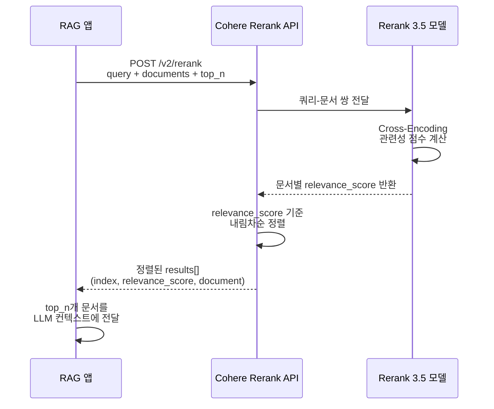
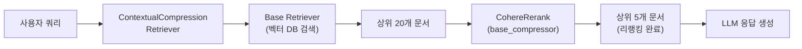
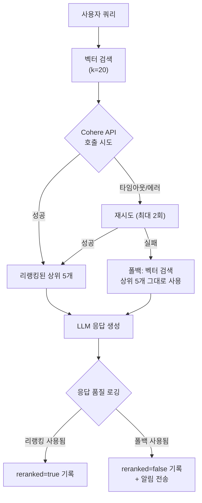
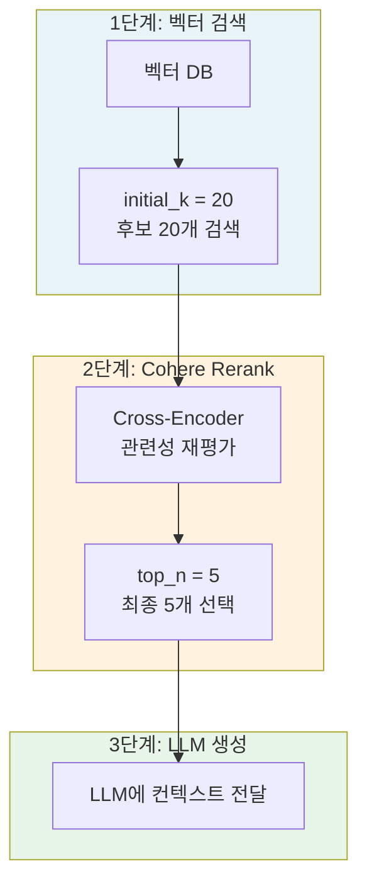
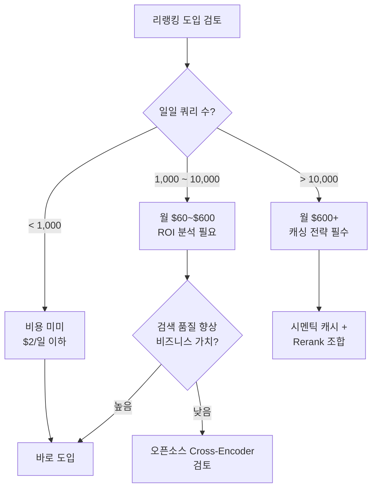

# Cohere Rerank API 활용

> Cohere Rerank 3.5 모델을 RAG 파이프라인에 통합하여 검색 정확도를 극적으로 높이는 실전 가이드

## 개요

이 섹션에서는 Cohere Rerank API의 구체적인 사용법을 학습합니다. API 호출 방법, 응답 구조의 해석, 그리고 LangChain의 `ContextualCompressionRetriever`를 활용한 RAG 파이프라인 통합까지 단계별로 실습합니다. 나아가 에러 처리, 배치 리랭킹, 점수 분포 분석 등 **프로덕션 레벨의 구현 패턴**도 함께 다룹니다.

**선수 지식**: [12.1: 리랭킹의 원리](12-리랭킹으로-검색-정확도-높이기-cohere-rerank-활용/01-리랭킹의-원리-왜-초기-검색으로는-부족한가.md)에서 배운 Bi-Encoder vs Cross-Encoder의 차이, Retrieve-then-Rerank 2단계 패턴
**학습 목표**:
- Cohere Rerank API의 요청/응답 구조를 이해하고 직접 호출할 수 있다
- `relevance_score`의 의미를 정확히 해석하고, 점수 분포 분석을 통해 임계값을 설정할 수 있다
- LangChain `CohereRerank`와 `ContextualCompressionRetriever`를 조합하여 RAG 파이프라인에 리랭킹을 통합할 수 있다
- `top_n`, `max_tokens_per_doc` 등 핵심 파라미터를 상황에 맞게 튜닝할 수 있다
- 에러 처리, 폴백 전략, 배치 리랭킹 등 프로덕션 환경의 실전 패턴을 적용할 수 있다
- 리랭킹 도입 시 비용 구조를 이해하고 최적화할 수 있다

## 왜 알아야 할까?

앞서 [12.1: 리랭킹의 원리](12-리랭킹으로-검색-정확도-높이기-cohere-rerank-활용/01-리랭킹의-원리-왜-초기-검색으로는-부족한가.md)에서 Bi-Encoder의 구조적 한계를 살펴봤죠. 쿼리와 문서를 독립적으로 인코딩하기 때문에, 미묘한 의미 차이를 놓치는 경우가 많았습니다. Cross-Encoder가 이 문제를 해결한다는 것도 배웠고요.

그런데 실무에서는 "원리를 안다"와 "실제로 적용한다" 사이에 꽤 큰 간극이 있습니다. 직접 Cross-Encoder 모델을 학습시키고 운영하려면 GPU 인프라, 모델 관리, 버전 업데이트 같은 부담이 따르거든요. **Cohere Rerank API는 이 간극을 단 몇 줄의 코드로 메워줍니다.** API 한 번 호출로 세계 최고 수준의 리랭킹 성능을 즉시 사용할 수 있죠.

하지만 "API 호출 한 줄"만으로 프로덕션 시스템이 완성되진 않습니다. 실제로 서비스에 리랭킹을 도입하면 수많은 현실적 질문에 부딪히게 됩니다. API가 타임아웃되면 어떻게 하죠? 점수가 모두 낮으면 그대로 반환해도 될까요? 수백 건의 쿼리를 동시에 처리해야 하면? 이 섹션에서는 이런 **실전 과제들**까지 함께 다룹니다.

## 핵심 개념

### 개념 1: Cohere Rerank 3.5 모델과 API 구조

> 💡 **비유**: Cohere Rerank API는 마치 **전문 소믈리에 서비스**와 같습니다. 와인 셀러(벡터 DB)에서 후보 와인 10병을 꺼내왔다면, 소믈리에(Rerank API)에게 "오늘 메뉴에 가장 잘 어울리는 순서대로 정렬해주세요"라고 요청하는 거예요. 소믈리에는 각 와인을 메뉴와 직접 비교해보고, 궁합 점수(relevance_score)와 함께 최적의 순서를 알려줍니다.

Cohere Rerank API는 쿼리와 문서 목록을 입력받아, 각 문서에 관련성 점수(`relevance_score`)를 매겨 정렬된 결과를 반환합니다. 현재 사용 가능한 모델은 다음과 같습니다:

| 모델 | 식별자 | 특징 |
|------|--------|------|
| Rerank 4.0 Pro | `rerank-v4.0-pro` | 최신, 32K 컨텍스트, 자기 학습 |
| Rerank 4.0 Fast | `rerank-v4.0-fast` | 4.0의 경량 버전 |
| Rerank 3.5 | `rerank-v3.5` | 다국어 100+, 4K 컨텍스트 |
| Rerank 3.0 | `rerank-english-v3.0` | 영어 전용 |

> 🔥 **실무 팁**: 본 세션에서는 다국어 지원과 안정성이 검증된 **`rerank-v3.5`를 기준으로 실습**합니다. 한국어를 포함한 다국어 문서를 다루는 RAG라면 3.5가 가장 안전한 선택입니다. 최신 Rerank 4.0 모델은 영어 중심 워크로드에서 추가 성능 향상을 제공하며, 32K 컨텍스트 윈도우가 필요하거나 자기 학습(self-learning)을 활용하고 싶은 경우에 적합합니다.

> 📊 **그림 1**: Cohere Rerank API 호출 흐름



API 호출의 핵심 파라미터를 살펴보겠습니다:

```python
import cohere

# Cohere 클라이언트 초기화
co = cohere.ClientV2(api_key="YOUR_COHERE_API_KEY")

# Rerank API 호출
response = co.rerank(
    model="rerank-v3.5",           # 사용할 모델
    query="RAG에서 청킹 전략이 중요한 이유는?",  # 검색 쿼리
    documents=[                     # 리랭킹할 문서 목록 (최대 1,000개)
        "청킹은 문서를 작은 단위로 나누는 과정입니다.",
        "RAG 시스템에서 청크 크기는 검색 품질에 직접적인 영향을 미칩니다.",
        "벡터 데이터베이스는 고차원 벡터를 저장합니다.",
        "적절한 청킹 전략은 컨텍스트 보존과 검색 정밀도의 균형을 맞춥니다.",
        "LLM은 토큰 제한이 있어서 긴 문서를 한 번에 처리하기 어렵습니다.",
    ],
    top_n=3,                        # 상위 N개만 반환
    max_tokens_per_doc=4096,        # 문서당 최대 토큰 수
)
```

응답 구조는 다음과 같습니다:

```run:python
# 응답 결과 해석 (시뮬레이션)
results = [
    {"index": 3, "relevance_score": 0.9823},
    {"index": 1, "relevance_score": 0.9541},
    {"index": 4, "relevance_score": 0.7102},
]

documents = [
    "청킹은 문서를 작은 단위로 나누는 과정입니다.",
    "RAG 시스템에서 청크 크기는 검색 품질에 직접적인 영향을 미칩니다.",
    "벡터 데이터베이스는 고차원 벡터를 저장합니다.",
    "적절한 청킹 전략은 컨텍스트 보존과 검색 정밀도의 균형을 맞춥니다.",
    "LLM은 토큰 제한이 있어서 긴 문서를 한 번에 처리하기 어렵습니다.",
]

print("=== Rerank 결과 ===")
for r in results:
    idx = r["index"]
    score = r["relevance_score"]
    print(f"\n[순위 {results.index(r)+1}] 점수: {score:.4f}")
    print(f"  문서 #{idx}: {documents[idx][:50]}...")
```

```output
=== Rerank 결과 ===

[순위 1] 점수: 0.9823
  문서 #3: 적절한 청킹 전략은 컨텍스트 보존과 검색 정밀도의 균형을 맞춥니다....

[순위 2] 점수: 0.9541
  문서 #1: RAG 시스템에서 청크 크기는 검색 품질에 직접적인 영향을 미칩니다....

[순위 3] 점수: 0.7102
  문서 #4: LLM은 토큰 제한이 있어서 긴 문서를 한 번에 처리하기 어렵습니다....
```

주목할 점이 있습니다. 원래 벡터 검색에서는 "벡터 데이터베이스는 고차원 벡터를 저장합니다"(문서 #2)처럼 키워드가 겹치지만 실제로는 관련 없는 문서가 상위에 올 수 있었는데, 리랭킹 후에는 쿼리의 **의도**(왜 청킹이 중요한가)에 정확히 부합하는 문서들이 상위로 올라왔죠.

### 개념 2: relevance_score 올바르게 해석하기

> 💡 **비유**: `relevance_score`는 시험 점수가 아니라 **경주 순위표**에 더 가깝습니다. 0.9점짜리 문서가 0.45점짜리 문서보다 "2배 더 관련있다"고 해석하면 안 됩니다. 마라톤에서 1등이 2시간 5분, 2등이 2시간 10분으로 들어왔다고 해서 1등이 2등보다 "2배 빠른" 건 아니잖아요? 중요한 건 **순서**입니다.

`relevance_score`에 대해 Cohere 공식 문서에서도 분명히 강조하는 내용이 있습니다:

> ⚠️ **흔한 오해**: `relevance_score`가 0.9인 문서가 0.45인 문서보다 2배 더 관련성이 높다고 해석하는 것은 **정확하지 않습니다**. 이 점수는 절대적 비율 척도가 아니라 **상대적 순서**를 나타내는 값입니다. 점수 간 비율이 아닌, 점수 간 **순서**에 집중하세요.

`relevance_score`의 특성을 정리하면:

- **범위**: 0.0 ~ 1.0
- **해석**: 1.0에 가까울수록 쿼리와 높은 관련성
- **용도**: 문서 간 **상대적 순서 비교**에 사용
- **주의**: 절대적 관련성의 비율로 해석하면 안 됨

그렇다면 `relevance_score`를 어떻게 실무에서 활용할까요? 단순 임계값 필터링을 넘어서, **점수 분포 분석**이 훨씬 효과적입니다:

```python
# relevance_score 기반 필터링 — 기본 방식
RELEVANCE_THRESHOLD = 0.5  # 실험적으로 결정한 임계값

filtered_results = [
    r for r in response.results
    if r.relevance_score >= RELEVANCE_THRESHOLD
]

print(f"원본: {len(response.results)}개 → 필터링 후: {len(filtered_results)}개")
```

기본 임계값은 프로젝트마다 실험적으로 조정해야 합니다. 법률 문서 검색처럼 정밀도가 중요한 경우 0.7 이상으로 높게, 탐색적 검색의 경우 0.3 정도로 낮게 설정하는 식이죠.

하지만 프로덕션에서는 고정 임계값만으로는 부족한 경우가 많습니다. **쿼리마다 점수 분포가 다르기 때문**인데요. 어떤 쿼리는 전체 문서가 0.9 이상이고, 어떤 쿼리는 가장 높은 점수가 0.4일 수 있습니다. 이럴 때는 **점수 갭(score gap) 분석**이 유용합니다:

```run:python
# 점수 갭 분석을 통한 동적 필터링
scores = [0.95, 0.91, 0.88, 0.42, 0.38, 0.15, 0.08]

# 인접 점수 간 차이(갭) 계산
gaps = []
for i in range(len(scores) - 1):
    gap = scores[i] - scores[i + 1]
    gaps.append({"position": f"{i+1}→{i+2}", "gap": gap})

print("=== 점수 갭 분석 ===")
for g in gaps:
    bar = "█" * int(g["gap"] * 50)  # 시각적 표시
    print(f"  순위 {g['position']}: 갭 {g['gap']:.2f} {bar}")

# 가장 큰 갭의 위치 = 자연스러운 컷오프 지점
max_gap = max(gaps, key=lambda x: x["gap"])
print(f"\n→ 최대 갭 위치: 순위 {max_gap['position']} (갭: {max_gap['gap']:.2f})")
print(f"→ 상위 3개 문서가 나머지와 뚜렷하게 구분됩니다")
```

```output
=== 점수 갭 분석 ===
  순위 1→2: 갭 0.04 ██
  순위 2→3: 갭 0.03 █
  순위 3→4: 갭 0.46 ███████████████████████
  순위 4→5: 갭 0.04 ██
  순위 5→6: 갭 0.23 ███████████
  순위 6→7: 갭 0.07 ███

→ 최대 갭 위치: 순위 3→4 (갭: 0.46)
→ 상위 3개 문서가 나머지와 뚜렷하게 구분됩니다
```

3번째와 4번째 문서 사이에 0.46이라는 큰 갭이 보이죠? 이 지점이 "관련 있는 문서"와 "관련 없는 문서"의 자연스러운 경계입니다. 이런 동적 분석을 활용하면 쿼리마다 최적의 컷오프를 자동으로 결정할 수 있습니다:

```python
def dynamic_filter(results, min_gap_ratio=0.3):
    """점수 갭 분석으로 자연스러운 컷오프를 찾습니다."""
    if len(results) <= 1:
        return results

    scores = [r.relevance_score for r in results]
    max_score = scores[0]

    for i in range(len(scores) - 1):
        gap = scores[i] - scores[i + 1]
        # 최고 점수 대비 상대적으로 큰 갭이면 컷오프
        if gap / max_score >= min_gap_ratio:
            return results[:i + 1]

    return results  # 뚜렷한 갭이 없으면 전체 반환
```

### 개념 3: LangChain CohereRerank 통합

> 💡 **비유**: LangChain의 `ContextualCompressionRetriever`는 **품질 관리 필터**와 같습니다. 공장(벡터 DB)에서 제품(문서)이 나오면, 품질 검사원(CohereRerank)이 기준에 미달하는 제품을 걸러내고, 최고 품질 순으로 정렬해서 출하하는 거예요. 기존 공장 라인(retriever)을 바꿀 필요 없이, 검사 단계만 추가하면 됩니다.

LangChain에서 Cohere Rerank를 통합하는 핵심은 `ContextualCompressionRetriever`입니다. 이 클래스는 기존 retriever를 감싸서, 검색 결과를 "압축"(실제로는 리랭킹 + 필터링)하는 역할을 합니다. 여기서 `base_retriever`는 [Ch8: 벡터 스토어 구축](08-기본-rag-파이프라인-구축-langchain으로-첫-rag-앱-만들기/01-langchain-v1-핵심-개념과-설정.md)에서 만든 `vectorstore.as_retriever()`를 그대로 사용하면 됩니다. 이미 구축한 벡터 스토어 위에 리랭킹 레이어만 얹는 것이죠.

> 📊 **그림 2**: LangChain에서의 리랭킹 통합 아키텍처



먼저 필요한 패키지를 설치합니다:

```bash
pip install langchain-cohere langchain-openai langchain-chroma langchain-text-splitters
```

그리고 통합 코드를 작성합니다:

```python
import os
from langchain_cohere import CohereRerank
from langchain.retrievers.contextual_compression import ContextualCompressionRetriever
from langchain_openai import OpenAIEmbeddings
from langchain_chroma import Chroma
from langchain_text_splitters import RecursiveCharacterTextSplitter

# 환경 변수 설정 (.env 파일에서 로드하는 것을 권장)
# os.environ["COHERE_API_KEY"] = "your-cohere-api-key"
# os.environ["OPENAI_API_KEY"] = "your-openai-api-key"

# 1. 샘플 문서 준비
documents = [
    "RAG는 Retrieval-Augmented Generation의 약자로, 외부 지식을 검색하여 LLM 응답을 보강하는 기법입니다.",
    "벡터 데이터베이스는 임베딩 벡터를 효율적으로 저장하고 유사도 검색을 수행합니다.",
    "청킹 전략에는 고정 크기 청킹, 재귀적 청킹, 시멘틱 청킹 등이 있습니다.",
    "Cohere Rerank는 Cross-Encoder 기반으로 쿼리와 문서의 관련성을 정밀하게 평가합니다.",
    "LangChain의 LCEL을 사용하면 파이프 연산자로 컴포넌트를 선언적으로 연결할 수 있습니다.",
    "리랭킹은 초기 검색 결과를 재정렬하여 가장 관련성 높은 문서를 상위로 올리는 기법입니다.",
    "임베딩 모델은 텍스트를 고차원 벡터 공간의 숫자 배열로 변환합니다.",
    "RAG 시스템의 검색 품질을 높이려면 리랭킹이 가장 효과적인 방법 중 하나입니다.",
]

# 2. 벡터 스토어 생성
text_splitter = RecursiveCharacterTextSplitter(chunk_size=200, chunk_overlap=20)
embeddings = OpenAIEmbeddings(model="text-embedding-3-small")
vectorstore = Chroma.from_texts(documents, embedding=embeddings)

# 3. 기본 retriever 생성 (넉넉하게 검색)
# 💡 실제 프로젝트에서는 Ch8에서 구축한 벡터 스토어를 그대로 사용합니다:
#    vectorstore = Chroma(persist_directory="./chroma_db", embedding_function=embeddings)
base_retriever = vectorstore.as_retriever(search_kwargs={"k": 6})

# 4. CohereRerank 설정
cohere_rerank = CohereRerank(
    model="rerank-v3.5",   # 모델명 필수 지정
    top_n=3,               # 리랭킹 후 상위 3개만 반환
)

# 5. ContextualCompressionRetriever로 통합
compression_retriever = ContextualCompressionRetriever(
    base_compressor=cohere_rerank,     # 리랭커를 compressor로 지정
    base_retriever=base_retriever,     # 기존 retriever를 base로 지정
)

# 6. 리랭킹된 결과 조회
query = "RAG에서 리랭킹이 왜 필요한가요?"
reranked_docs = compression_retriever.invoke(query)

for i, doc in enumerate(reranked_docs):
    print(f"[{i+1}] {doc.page_content[:60]}...")
```

여기서 핵심 포인트는 다음과 같습니다:

1. **`model` 파라미터는 필수**: `CohereRerank` 생성 시 모델명을 반드시 지정해야 합니다
2. **`top_n`으로 결과 수 제한**: base retriever가 6개를 가져오면, reranker가 상위 3개만 남깁니다
3. **기존 코드 최소 변경**: `base_retriever`를 `compression_retriever`로 교체하기만 하면 됩니다

### 개념 4: 프로덕션 에러 처리와 폴백 전략

실제 서비스에서는 외부 API 호출이 항상 성공한다고 가정할 수 없습니다. Cohere API가 타임아웃되거나, 일시적으로 장애가 발생하면 전체 RAG 파이프라인이 멈춰버리죠. **리랭킹은 "있으면 좋지만 없어도 동작해야 하는" 보조 단계**이기 때문에, 적절한 폴백 전략이 필수입니다.

> 💡 **비유**: 이건 네비게이션에서 실시간 교통정보가 끊겼을 때와 비슷합니다. 교통정보 없이도 기본 경로(벡터 검색 결과)로 목적지에 갈 수 있어야 하죠. 교통정보(리랭킹)가 있으면 최적 경로를 알려주지만, 없다고 차를 세우면 안 됩니다.

> 📊 **그림 3**: 리랭킹 폴백 전략 플로우



```python
import cohere
import logging
import time

logger = logging.getLogger(__name__)

class RerankWithFallback:
    """프로덕션용 리랭킹 래퍼 — 에러 시 벡터 검색 결과로 폴백합니다."""

    def __init__(
        self,
        api_key: str,
        model: str = "rerank-v3.5",
        max_retries: int = 2,
        timeout: float = 10.0,
    ):
        self.client = cohere.ClientV2(
            api_key=api_key,
            timeout=timeout,
        )
        self.model = model
        self.max_retries = max_retries

    def rerank(
        self,
        query: str,
        documents: list[str],
        top_n: int = 5,
    ) -> tuple[list[dict], bool]:
        """
        리랭킹을 시도하고, 실패 시 원본 순서를 반환합니다.
        Returns: (결과 리스트, 리랭킹 성공 여부)
        """
        for attempt in range(self.max_retries + 1):
            try:
                response = self.client.rerank(
                    model=self.model,
                    query=query,
                    documents=documents,
                    top_n=top_n,
                )
                return [
                    {"index": r.index, "score": r.relevance_score}
                    for r in response.results
                ], True

            except cohere.errors.TooManyRequestsError:
                # 레이트 리밋 — 잠시 대기 후 재시도
                wait = 2 ** attempt
                logger.warning(f"Rate limited. {wait}초 후 재시도 ({attempt+1}/{self.max_retries+1})")
                time.sleep(wait)

            except (cohere.errors.ServiceUnavailableError, TimeoutError) as e:
                logger.warning(f"Rerank API 에러: {e} ({attempt+1}/{self.max_retries+1})")
                if attempt < self.max_retries:
                    time.sleep(1)

            except Exception as e:
                logger.error(f"예상치 못한 에러: {e}")
                break

        # 폴백: 원본 순서 그대로 상위 top_n개 반환
        logger.warning("리랭킹 폴백 — 벡터 검색 결과를 그대로 사용합니다")
        return [
            {"index": i, "score": 0.0} for i in range(min(top_n, len(documents)))
        ], False
```

이 패턴의 핵심은 `rerank()` 메서드가 항상 **결과를 반환한다**는 것입니다. 두 번째 반환값인 `bool`은 리랭킹 성공 여부를 나타내므로, 모니터링 시스템에서 폴백 비율을 추적할 수 있습니다.

### 개념 5: 핵심 파라미터 튜닝 전략

리랭킹 성능을 최적화하려면 몇 가지 파라미터를 상황에 맞게 조정해야 합니다.

> 📊 **그림 4**: initial_k와 top_n의 관계



**`initial_k` (base retriever의 k값)**

벡터 검색에서 가져올 초기 후보 수입니다. 이 값이 클수록 리랭킹할 후보 풀이 넓어져서 정확도가 올라가지만, API 비용과 지연 시간도 증가합니다.

Cohere Rerank의 과금 단위를 이해하는 게 중요합니다. 과금은 **search unit** 단위로 이루어지는데, **1 search unit = 1 쿼리 + 최대 100개 문서(각 500토큰 이하)** 입니다. 100개 이하의 짧은 문서를 리랭킹한다면, `initial_k`를 늘려도 비용은 동일합니다:

```run:python
# initial_k에 따른 비용 시뮬레이션 (문서 ≤100개, 각 500토큰 이하 기준)
cost_per_search = 2.0 / 1000  # $2.00 per 1,000 searches (2025년 기준)

scenarios = [
    {"initial_k": 10, "daily_queries": 1000},
    {"initial_k": 20, "daily_queries": 1000},
    {"initial_k": 50, "daily_queries": 1000},
    {"initial_k": 100, "daily_queries": 1000},
]

print("initial_k | 일일 쿼리 | 일일 비용 | 월간 비용(30일)")
print("-" * 55)
for s in scenarios:
    daily_cost = s["daily_queries"] * cost_per_search
    monthly_cost = daily_cost * 30
    print(f"  {s['initial_k']:>5}   |  {s['daily_queries']:>6}  | ${daily_cost:>6.2f}  | ${monthly_cost:>7.2f}")
```

```output
initial_k | 일일 쿼리 | 일일 비용 | 월간 비용(30일)
-------------------------------------------------------
     10   |    1000  |  $ 2.00  | $   60.00
     20   |    1000  |  $ 2.00  | $   60.00
     50   |    1000  |  $ 2.00  | $   60.00
    100   |    1000  |  $ 2.00  | $   60.00
```

잠깐, 결과가 같죠? 여기서 중요한 사실이 드러납니다. 문서가 100개 이하이고 각 문서가 500토큰 이내라면, 모두 **1 search unit**으로 처리됩니다. 다만 문서가 100개를 초과하거나, 개별 문서가 500토큰(쿼리 포함)을 넘으면 자동으로 분할되어 추가 search unit이 소모됩니다.

> 🔥 **실무 팁**: `initial_k`는 20~50 범위에서 시작하세요. 100개 이하라면 비용 차이가 없으므로, 품질 향상에 집중하는 게 유리합니다. 다만 문서가 길면(500토큰 초과) 자동으로 청크 분할되어 추가 비용이 발생하니, `max_tokens_per_doc`으로 제어하세요.

**`top_n` (최종 반환 문서 수)**

LLM에 전달할 최종 문서 수입니다. 너무 적으면 필요한 정보를 놓칠 수 있고, 너무 많으면 컨텍스트 윈도우를 낭비합니다.

```python
# 용도별 top_n 가이드
config_by_use_case = {
    "간단한 QA": {"top_n": 3, "initial_k": 10},
    "종합 보고서 생성": {"top_n": 7, "initial_k": 30},
    "법률/의료 문서 검색": {"top_n": 5, "initial_k": 50},
    "대화형 챗봇": {"top_n": 3, "initial_k": 15},
}
```

**`max_tokens_per_doc` (문서당 최대 토큰 수)**

기본값은 4,096토큰입니다. 긴 문서는 자동으로 잘리는데, 각 잘린 청크가 별도 문서로 카운트되므로 비용에 영향을 줍니다.

### 개념 6: 비용 구조와 배치 최적화

Cohere Rerank의 가격 정책을 정확히 이해하면 비용을 효과적으로 관리할 수 있습니다. (2025년 기준이며, 최신 가격은 [Cohere Pricing](https://cohere.com/pricing) 페이지를 참조하세요.)

| 항목 | 내용 |
|------|------|
| 기본 요금 | $2.00 / 1,000 search units |
| 1 search unit | 1 쿼리 + 최대 100개 문서 (각 500토큰 이하) |
| 초과 문서 | 100개 초과 시 추가 100개마다 +1 search unit |
| 문서 분할 규칙 | 500토큰(쿼리 포함) 초과 시 자동 청크 분할, 각 청크가 별도 문서로 카운트 |
| 최대 문서 수 | 1회 호출당 최대 1,000개 |

> 💡 **알고 계셨나요?**: search unit은 단순한 "호출 횟수"가 아닙니다. 같은 1회 API 호출이라도, 문서 수가 150개면 2 search units, 각 문서가 1,000토큰이면 자동 분할로 더 많은 units가 소모될 수 있습니다. 정확한 비용 예측을 위해서는 **문서 수 × 문서 길이**를 함께 고려해야 합니다.

> 📊 **그림 5**: 비용 최적화 의사결정 플로우



비용 최적화를 위한 실전 전략 — 단순 캐시를 넘어서 **배치 리랭킹**과 **비동기 처리**까지 다룹니다:

```python
import hashlib
import asyncio
from concurrent.futures import ThreadPoolExecutor

# ──────────────────────────────────────
# 전략 1: 시멘틱 캐시로 중복 쿼리 방지
# ──────────────────────────────────────
query_cache: dict[str, list] = {}

def cached_rerank(query: str, documents: list[str], top_n: int = 3) -> list:
    """동일 쿼리에 대한 리랭킹 결과를 캐싱합니다."""
    cache_key = hashlib.md5(
        f"{query}:{','.join(documents)}".encode()
    ).hexdigest()

    if cache_key in query_cache:
        return query_cache[cache_key]  # 캐시 히트 — API 호출 없음

    response = co.rerank(
        model="rerank-v3.5",
        query=query,
        documents=documents,
        top_n=top_n,
    )
    query_cache[cache_key] = response.results
    return response.results

# ──────────────────────────────────────
# 전략 2: max_tokens_per_doc 제한으로 청크 분할 방지
# ──────────────────────────────────────
response = co.rerank(
    model="rerank-v3.5",
    query="검색 쿼리",
    documents=long_documents,
    top_n=5,
    max_tokens_per_doc=512,  # 500토큰 이하로 제한하여 분할 방지
)

# ──────────────────────────────────────
# 전략 3: 배치 리랭킹 — 여러 쿼리를 병렬 처리
# ──────────────────────────────────────
def batch_rerank(
    queries: list[str],
    documents: list[str],
    top_n: int = 5,
    max_workers: int = 5,
) -> dict[str, list]:
    """여러 쿼리를 ThreadPoolExecutor로 병렬 리랭킹합니다."""
    results = {}

    def _rerank_single(query: str) -> tuple[str, list]:
        resp = co.rerank(
            model="rerank-v3.5",
            query=query,
            documents=documents,
            top_n=top_n,
        )
        return query, resp.results

    with ThreadPoolExecutor(max_workers=max_workers) as executor:
        futures = [executor.submit(_rerank_single, q) for q in queries]
        for future in futures:
            query, result = future.result()
            results[query] = result

    return results

# 사용 예시: 관련 질문 그룹을 한 번에 리랭킹
related_queries = [
    "RAG에서 청킹 전략의 중요성",
    "최적의 청크 크기는?",
    "청킹과 검색 품질의 관계",
]
batch_results = batch_rerank(related_queries, documents, top_n=3)
```

> 🔥 **실무 팁**: 배치 리랭킹에서 `max_workers`를 너무 높게 설정하면 Cohere API의 레이트 리밋에 걸릴 수 있습니다. 프리 티어는 분당 100회, 프로덕션 티어도 분당 10,000회 제한이 있으니, `max_workers=5` 정도에서 시작하여 점진적으로 늘리세요.

## 실습: 직접 해보기

이제 Cohere Rerank API를 활용한 완전한 RAG 파이프라인을 구축해보겠습니다. 벡터 검색만 사용한 결과와 리랭킹을 적용한 결과를 비교해서, 품질 차이를 직접 확인합니다.

```python
"""
Cohere Rerank를 활용한 RAG 파이프라인 실습
필요 패키지: pip install langchain-cohere langchain-openai langchain-chroma langchain-text-splitters
"""
import os
from dotenv import load_dotenv
from langchain_openai import OpenAIEmbeddings, ChatOpenAI
from langchain_cohere import CohereRerank
from langchain_chroma import Chroma
from langchain.retrievers.contextual_compression import ContextualCompressionRetriever
from langchain_text_splitters import RecursiveCharacterTextSplitter
from langchain_core.prompts import ChatPromptTemplate
from langchain_core.output_parsers import StrOutputParser
from langchain_core.runnables import RunnablePassthrough

# 환경 변수 로드
load_dotenv()

# ──────────────────────────────────────
# 1. 샘플 문서 준비 (RAG 관련 기술 문서)
# ──────────────────────────────────────
raw_documents = [
    "RAG(Retrieval-Augmented Generation)는 2020년 Facebook AI Research(현 Meta AI)의 "
    "Patrick Lewis 등이 발표한 논문에서 처음 제안되었습니다. 핵심 아이디어는 LLM이 답변을 "
    "생성하기 전에 외부 지식 소스에서 관련 정보를 검색하여 참조하게 하는 것입니다.",

    "임베딩(Embedding)은 텍스트를 고차원 벡터로 변환하는 과정입니다. OpenAI의 "
    "text-embedding-3-small 모델은 1536차원의 벡터를 생성하며, 의미적으로 유사한 "
    "텍스트는 벡터 공간에서 가까운 위치에 매핑됩니다.",

    "리랭킹(Reranking)은 초기 검색 결과를 Cross-Encoder 모델로 재평가하여 관련성 "
    "순서를 재조정하는 기법입니다. Bi-Encoder의 독립 인코딩 한계를 보완하여, "
    "쿼리와 문서의 미묘한 의미적 상호작용을 포착할 수 있습니다.",

    "Cohere Rerank 3.5는 100개 이상의 언어를 지원하는 다국어 리랭킹 모델입니다. "
    "API 한 번 호출로 최대 1,000개 문서를 리랭킹할 수 있으며, 문서당 최대 4,096 "
    "토큰을 처리합니다.",

    "ChromaDB는 오픈소스 벡터 데이터베이스로, 임베딩 저장과 유사도 검색에 최적화되어 "
    "있습니다. 메모리 내 실행이 가능해 프로토타이핑에 적합합니다.",

    "BM25는 키워드 빈도(TF)와 역문서 빈도(IDF)를 기반으로 하는 전통적 검색 알고리즘입니다. "
    "정확한 키워드 매칭에는 강하지만, 의미적 유사도를 파악하지 못하는 한계가 있습니다.",

    "LangChain의 ContextualCompressionRetriever는 기존 retriever를 감싸서 검색 결과를 "
    "후처리하는 래퍼입니다. CohereRerank를 base_compressor로 지정하면, 검색된 문서가 "
    "자동으로 리랭킹되어 반환됩니다.",

    "하이브리드 검색은 벡터 검색(Dense Retrieval)과 키워드 검색(Sparse Retrieval)을 "
    "결합한 방법입니다. 두 방식의 장점을 취하여 더 넓은 범위의 관련 문서를 찾을 수 있습니다.",

    "RAG 평가에는 Faithfulness(충실도), Answer Relevancy(답변 관련성), "
    "Context Precision(컨텍스트 정밀도), Context Recall(컨텍스트 재현율) 등의 "
    "메트릭이 사용됩니다. RAGAS 프레임워크가 이를 자동화합니다.",

    "프롬프트 캐싱은 반복되는 시스템 프롬프트를 캐싱하여 API 호출 비용과 지연 시간을 "
    "줄이는 기법입니다. Anthropic Claude에서 지원하는 기능 중 하나입니다.",
]

# ──────────────────────────────────────
# 2. 벡터 스토어 구축
# ──────────────────────────────────────
embeddings = OpenAIEmbeddings(model="text-embedding-3-small")

# 문서를 벡터 스토어에 저장
# 💡 실제 프로젝트에서는 Ch8에서 구축한 벡터 스토어를 로드합니다:
#    vectorstore = Chroma(persist_directory="./chroma_db", embedding_function=embeddings)
vectorstore = Chroma.from_texts(
    texts=raw_documents,
    embedding=embeddings,
    collection_name="rag_rerank_demo",
)

# ──────────────────────────────────────
# 3. 리랭킹 없는 기본 검색 vs 리랭킹 검색 비교
# ──────────────────────────────────────
query = "Cohere Rerank를 LangChain에서 어떻게 사용하나요?"

# 방법 A: 기본 벡터 검색 (리랭킹 없음)
base_retriever = vectorstore.as_retriever(search_kwargs={"k": 5})
base_results = base_retriever.invoke(query)

print("=" * 60)
print("📋 [방법 A] 벡터 검색만 사용한 결과")
print("=" * 60)
for i, doc in enumerate(base_results):
    print(f"\n[{i+1}] {doc.page_content[:80]}...")

# 방법 B: CohereRerank 적용
cohere_rerank = CohereRerank(
    model="rerank-v3.5",
    top_n=3,  # 상위 3개만 반환
)

compression_retriever = ContextualCompressionRetriever(
    base_compressor=cohere_rerank,
    base_retriever=vectorstore.as_retriever(search_kwargs={"k": 8}),  # 넉넉하게 8개 검색
)

reranked_results = compression_retriever.invoke(query)

print("\n" + "=" * 60)
print("🏆 [방법 B] CohereRerank 적용 결과 (top_n=3)")
print("=" * 60)
for i, doc in enumerate(reranked_results):
    # relevance_score는 metadata에 포함됨
    score = doc.metadata.get("relevance_score", "N/A")
    print(f"\n[{i+1}] (점수: {score})")
    print(f"    {doc.page_content[:80]}...")

# ──────────────────────────────────────
# 4. 리랭킹된 결과로 RAG 체인 구성 (LCEL)
# ──────────────────────────────────────
llm = ChatOpenAI(model="gpt-4o-mini", temperature=0)

# 프롬프트 템플릿
prompt = ChatPromptTemplate.from_template("""
다음 컨텍스트를 기반으로 질문에 답변하세요.
컨텍스트에 없는 내용은 "제공된 정보에서는 확인할 수 없습니다"라고 답하세요.

컨텍스트:
{context}

질문: {question}

답변:""")

# 문서를 텍스트로 변환하는 헬퍼
def format_docs(docs: list) -> str:
    return "\n\n".join(doc.page_content for doc in docs)

# LCEL 체인 구성: 리랭킹 retriever → 프롬프트 → LLM → 파서
rag_chain = (
    {"context": compression_retriever | format_docs, "question": RunnablePassthrough()}
    | prompt
    | llm
    | StrOutputParser()
)

# 체인 실행
answer = rag_chain.invoke(query)
print("\n" + "=" * 60)
print("💬 RAG 응답 (리랭킹 적용)")
print("=" * 60)
print(answer)

# ──────────────────────────────────────
# 5. 리랭킹 전후 결과 품질 정량 비교
# ──────────────────────────────────────
print("\n" + "=" * 60)
print("📊 리랭킹 전후 비교 분석")
print("=" * 60)

# 정답에 해당하는 문서 인덱스 (수동 라벨링)
relevant_doc_keywords = ["ContextualCompressionRetriever", "CohereRerank", "Cohere Rerank"]

def count_relevant(docs, keywords):
    """검색 결과 중 관련 문서 비율을 계산합니다."""
    relevant = sum(
        1 for doc in docs
        if any(kw in doc.page_content for kw in keywords)
    )
    return relevant, len(docs)

base_rel, base_total = count_relevant(base_results, relevant_doc_keywords)
rerank_rel, rerank_total = count_relevant(reranked_results, relevant_doc_keywords)

print(f"벡터 검색: {base_rel}/{base_total} 관련 문서 (정밀도: {base_rel/base_total:.0%})")
print(f"리랭킹:    {rerank_rel}/{rerank_total} 관련 문서 (정밀도: {rerank_rel/rerank_total:.0%})")
```

이 실습에서 확인할 수 있는 핵심 포인트:

1. **방법 A(벡터만)**: "리랭킹" 키워드가 포함된 문서가 상위에 오지만, 실제 LangChain 통합 방법과 무관한 문서가 섞일 수 있음
2. **방법 B(리랭킹)**: 쿼리의 **실제 의도**(LangChain에서의 사용법)에 부합하는 문서가 정확히 상위로 올라옴
3. **LCEL 체인**: `compression_retriever`를 LCEL 파이프라인에 자연스럽게 연결하여 완전한 RAG 시스템 구성
4. **정량 비교**: 단순히 "좋아 보인다"가 아니라, 정밀도 수치로 개선 효과를 검증

## 더 깊이 알아보기

### Cohere와 "Attention Is All You Need"

Cohere Rerank를 만든 회사 Cohere의 탄생 스토리는 AI 역사의 가장 중요한 논문과 직접 연결됩니다. Cohere의 공동 창업자이자 CEO인 **Aidan Gomez**는 2017년 발표된 전설적인 논문 "Attention Is All You Need"의 **8명의 공저자 중 한 명**입니다. 이 논문은 Transformer 아키텍처를 세상에 소개했고, GPT, BERT, 그리고 현재의 모든 LLM의 기반이 된 연구죠.

Gomez는 당시 Google Brain에서 인턴으로 이 논문에 참여했는데요, 논문 이후 토론토 대학교로 돌아가 동문인 **Ivan Zhang**과 **Nick Frosst**(Geoffrey Hinton의 Google AI 랩 초기 멤버)와 함께 2019년에 Cohere를 설립했습니다.

흥미로운 점은 "Attention Is All You Need"의 8명의 저자 중 상당수가 각자 AI 회사를 창업했다는 사실입니다. Transformer의 발명자들이 그 기술을 가장 잘 활용하는 제품을 만들고 있는 셈이죠. Cohere Rerank 역시 Transformer의 Cross-Attention 메커니즘을 검색 품질 향상에 특화시킨 것으로, 논문의 핵심 아이디어가 실제 제품으로 이어진 대표적인 사례입니다.

### 리랭킹 모델의 진화

Rerank 모델은 빠르게 진화하고 있습니다. Cohere Rerank 3.0(2024)은 영어와 다국어 버전이 분리되어 있었지만, Rerank 3.5(2024 말)에서는 단일 모델로 100개 이상의 언어를 지원하게 되었습니다. 2025년 말에는 Rerank 4.0이 출시되어 32K 컨텍스트 윈도우와 **자기 학습(self-learning)** 기능까지 추가되었죠. 자기 학습이란 사용자의 피드백 데이터를 바탕으로 모델이 특정 도메인에 스스로 적응하는 기능입니다.

## 흔한 오해와 팁

> ⚠️ **흔한 오해**: "Rerank API가 비싸서 프로덕션에서 쓸 수 없다"고 생각하는 분이 많습니다. 하지만 실제로 계산해보면, 일일 1,000건 쿼리 기준 월 $60 정도입니다(2025년 기준). 리랭킹 없이 검색 품질을 높이려면 더 큰 임베딩 모델, 더 복잡한 청킹 전략, 더 많은 실험이 필요한데, 이 엔지니어링 비용과 비교하면 API 비용은 오히려 경제적인 경우가 많습니다.

> ⚠️ **흔한 오해**: "리랭킹을 추가하면 지연 시간이 크게 늘어난다"는 우려도 자주 듣습니다. Cohere Rerank API의 응답 시간은 보통 **100~300ms** 수준인데, 이는 LLM 응답 생성 시간(1~5초)에 비하면 미미합니다. 사용자 체감 지연은 거의 없으면서도 검색 품질은 크게 올라가는 거죠. 단, 문서 수가 500개를 넘기면 지연이 눈에 띄게 증가하니, `initial_k`를 100 이하로 유지하는 걸 권장합니다.

> 💡 **알고 계셨나요?**: Cohere Rerank의 `documents` 파라미터에 단순 문자열 리스트뿐만 아니라 **YAML 형식의 구조화 데이터**도 전달할 수 있습니다. 예를 들어 제목, 본문, 메타데이터가 포함된 JSON/YAML 문자열을 보내면, 모델이 구조를 이해하고 더 정확한 리랭킹을 수행합니다. 테이블 형태의 데이터나 상품 정보처럼 필드가 구분된 데이터에 특히 유용합니다.

> 🔥 **실무 팁**: LangChain에서 `CohereRerank`를 사용할 때, `base_retriever`의 `k` 값과 `CohereRerank`의 `top_n` 값의 비율을 **3:1 ~ 5:1**로 유지하세요. 예를 들어 최종 5개 문서가 필요하면 `k=15~25`로 설정합니다. 이렇게 하면 리랭커가 충분한 후보 풀에서 최적의 문서를 선별할 수 있고, 비용도 1 search unit 범위 내에서 해결됩니다.

> 🔥 **실무 팁**: `from langchain.retrievers.document_compressors import CohereRerank`라는 **구 import 경로는 deprecated**되었습니다. 반드시 `from langchain_cohere import CohereRerank`를 사용하세요. `langchain-cohere` 패키지를 별도로 설치해야 하며, Cohere SDK v5 이상이 자동으로 함께 설치됩니다.

## 핵심 정리

| 개념 | 설명 |
|------|------|
| Cohere Rerank 3.5 | 100+ 언어 지원 다국어 리랭킹 모델, 4K 토큰 컨텍스트 |
| Rerank 4.0 Pro/Fast | 최신 모델, 32K 컨텍스트 + 자기 학습. 영어 중심 워크로드에 강점 |
| `relevance_score` | 0~1 범위의 관련성 점수. **절대적 비율이 아닌 상대적 순서**로 해석 |
| 점수 갭 분석 | 인접 점수 간 차이를 분석하여 관련/비관련 문서의 자연스러운 경계를 탐지 |
| `top_n` | 리랭킹 후 반환할 최종 문서 수. 미지정 시 전체 반환 |
| `max_tokens_per_doc` | 문서당 최대 토큰(기본 4,096). 초과 시 자동 분할 → 추가 비용 |
| `CohereRerank` | LangChain의 Cohere 리랭킹 래퍼. `langchain-cohere` 패키지에서 import |
| `ContextualCompressionRetriever` | 기존 retriever + compressor(reranker) 조합 패턴 |
| 폴백 전략 | API 장애 시 벡터 검색 결과로 자동 폴백 — 서비스 가용성 보장 |
| 배치 리랭킹 | ThreadPoolExecutor로 여러 쿼리를 병렬 처리하여 처리량 극대화 |
| 과금 단위 (search unit) | $2.00 / 1,000 units (1 unit = 1 쿼리 + ≤100 문서, 각 ≤500토큰). 2025년 기준 |
| initial_k : top_n 비율 | 3:1 ~ 5:1 권장 (예: k=15, top_n=5) |

## 다음 섹션 미리보기

Cohere Rerank는 강력하지만, API 의존성과 비용이 발생합니다. 만약 **오프라인 환경**이나 **비용이 민감한 상황**이라면 어떻게 해야 할까요? 다음 섹션 [12.3: 오픈소스 Cross-Encoder 리랭킹](12-리랭킹으로-검색-정확도-높이기-cohere-rerank-활용/03-오픈소스-cross-encoder-리랭킹.md)에서는 `sentence-transformers`의 Cross-Encoder 모델을 로컬에서 실행하여, 외부 API 없이도 리랭킹을 구현하는 방법을 다룹니다. Cohere와의 성능 차이, 로컬 실행의 장단점까지 직접 비교해볼 예정입니다.

## 참고 자료

- [Cohere Rerank Overview — 공식 문서](https://docs.cohere.com/docs/rerank-overview) - Rerank API의 전체 개요, 모델 버전별 특징, 사용 사례를 설명하는 공식 가이드
- [Cohere Rerank API Reference (v2)](https://docs.cohere.com/reference/rerank) - API 요청/응답 스키마, 파라미터 상세 설명, 에러 코드 등 기술 레퍼런스
- [Cohere Rerank on LangChain — 통합 가이드](https://docs.cohere.com/docs/rerank-on-langchain) - LangChain에서 CohereRerank를 설정하고 사용하는 공식 통합 예제
- [LangChain Cohere Reranker Integration](https://docs.langchain.com/oss/python/integrations/retrievers/cohere-reranker) - LangChain 공식 문서의 Cohere 리랭커 통합 페이지
- [Cohere Pricing](https://cohere.com/pricing) - Rerank 포함 전체 모델 가격 정책 (search unit 기반 과금 상세 설명)
- [Announcing Rerank 3.5 — Cohere Changelog](https://docs.cohere.com/changelog/rerank-v3.5) - Rerank 3.5 출시 노트와 개선사항

---
### 🔗 Related Sessions
- [reranking](../02-rag-아키텍처-핵심-컴포넌트와-파이프라인-구조/03-advanced-rag-검색-전후-최적화-전략.md) (prerequisite)
- [lcel](../08-기본-rag-파이프라인-구축-langchain으로-첫-rag-앱-만들기/01-langchain-v1-핵심-개념과-설정.md) (prerequisite)
- [cross-encoder](../12-리랭킹으로-검색-정확도-높이기-cohere-rerank-활용/01-리랭킹의-원리-왜-초기-검색으로는-부족한가.md) (prerequisite)
- [bi-encoder](../12-리랭킹으로-검색-정확도-높이기-cohere-rerank-활용/01-리랭킹의-원리-왜-초기-검색으로는-부족한가.md) (prerequisite)
- [retrieve-then-rerank](../12-리랭킹으로-검색-정확도-높이기-cohere-rerank-활용/01-리랭킹의-원리-왜-초기-검색으로는-부족한가.md) (prerequisite)
- [initial_k](../12-리랭킹으로-검색-정확도-높이기-cohere-rerank-활용/01-리랭킹의-원리-왜-초기-검색으로는-부족한가.md) (prerequisite)
- [final_k](../12-리랭킹으로-검색-정확도-높이기-cohere-rerank-활용/01-리랭킹의-원리-왜-초기-검색으로는-부족한가.md) (prerequisite)
