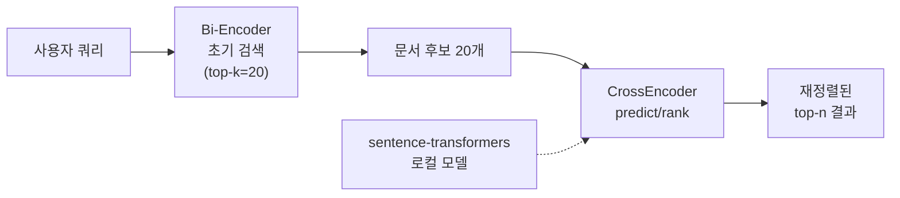
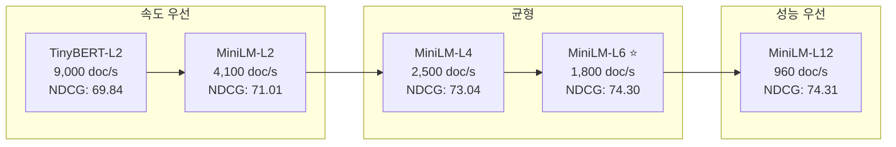
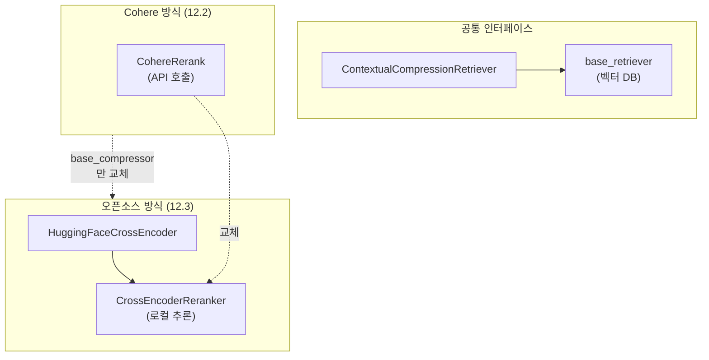

# 오픈소스 Cross-Encoder 리랭킹

> SentenceTransformers CrossEncoder로 API 없이 로컬에서 리랭킹을 구현하고, Cohere Rerank와의 성능·비용·지연시간을 비교합니다.

## 개요

이 섹션에서는 오픈소스 Cross-Encoder 모델을 로컬 환경에서 실행하여 리랭킹을 구현하는 방법을 학습합니다. [앞서 12.2: Cohere Rerank API 활용](12-리랭킹으로-검색-정확도-높이기-cohere-rerank-활용/02-cohere-rerank-api-활용.md)에서 API 기반 리랭킹을 다뤘다면, 이번에는 **API 호출 없이** 내 컴퓨터에서 직접 리랭킹 모델을 돌리는 방법을 배웁니다.

**선수 지식**: 
- [12.1: 리랭킹의 원리](12-리랭킹으로-검색-정확도-높이기-cohere-rerank-활용/01-리랭킹의-원리-왜-초기-검색으로는-부족한가.md)에서 배운 Bi-Encoder vs Cross-Encoder 개념
- [12.2: Cohere Rerank API 활용](12-리랭킹으로-검색-정확도-높이기-cohere-rerank-활용/02-cohere-rerank-api-활용.md)에서 다룬 `ContextualCompressionRetriever` 패턴

**학습 목표**:
- SentenceTransformers 라이브러리의 `CrossEncoder` 클래스 사용법을 익힌다
- MS MARCO 기반 사전 학습 모델들의 특성과 선택 기준을 이해한다
- LangChain에 오픈소스 Cross-Encoder를 통합하는 방법을 구현한다
- Cohere Rerank API와 오픈소스 모델의 성능·비용·지연시간을 정량적으로 비교한다

## 왜 알아야 할까?

Cohere Rerank는 강력하지만, 실전에서는 몇 가지 고민이 생기거든요.

**비용 문제**: 매일 수만 건의 검색 요청을 처리하는 서비스라면, API 호출 비용이 빠르게 누적됩니다. 1,000건당 $2라는 가격이 소규모 프로젝트에는 괜찮지만, 대규모 서비스에서는 월 수백만 원이 될 수 있죠.

**지연시간 문제**: API 호출에는 네트워크 왕복 시간이 포함됩니다. 사내 보안 정책으로 외부 API 호출이 제한되는 환경도 있고요.

**데이터 프라이버시**: 의료 기록, 법률 문서, 기업 기밀 등 민감한 데이터를 외부 서버로 보낼 수 없는 경우가 많습니다.

오픈소스 Cross-Encoder 모델은 이 세 가지 문제를 한꺼번에 해결합니다. 내 서버에서 직접 실행하니 비용은 인프라 비용만, 지연시간은 네트워크 지연 없이 모델 추론 시간만, 데이터는 내 서버 밖으로 나가지 않습니다.

## 핵심 개념

### 개념 1: SentenceTransformers CrossEncoder — 리랭킹의 스위스 아미 나이프

> 💡 **비유**: [12.2](12-리랭킹으로-검색-정확도-높이기-cohere-rerank-활용/02-cohere-rerank-api-활용.md)에서 Cohere Rerank를 미슐랭 레스토랑의 **전문 소믈리에에게 와인 평가를 위탁**하는 것에 비유했었죠? 오픈소스 Cross-Encoder는 **소믈리에 자격증을 직접 따서 내 레스토랑에서 와인을 평가하는 것**과 같습니다. 초기 투자(자격증 취득 = 모델 다운로드, GPU 설정)는 필요하지만, 이후로는 외부 소믈리에를 부르지 않고도 원하는 만큼 와인을 감별할 수 있죠.

SentenceTransformers는 Nils Reimers가 개발한 Python 라이브러리로, Bi-Encoder와 Cross-Encoder 모델을 모두 지원합니다. `CrossEncoder` 클래스는 쿼리-문서 쌍을 입력받아 관련성 점수를 출력하는데, 사용법이 놀라울 정도로 간단합니다.

먼저 라이브러리를 설치합니다:

```bash
pip install sentence-transformers
```

기본적인 Cross-Encoder 사용법을 살펴보겠습니다:

```run:python
from sentence_transformers import CrossEncoder

# 모델명을 상수로 정의 (코드 컨벤션: UPPER_SNAKE_CASE)
RERANK_MODEL = "cross-encoder/ms-marco-MiniLM-L-6-v2"

# MS MARCO로 학습된 Cross-Encoder 모델 로드
model = CrossEncoder(RERANK_MODEL)

# 쿼리와 문서 쌍의 관련성 점수 예측
query = "RAG 시스템에서 리랭킹이 필요한 이유는?"
documents = [
    "리랭킹은 초기 검색 결과를 Cross-Encoder로 재채점하여 정확도를 높이는 기법입니다.",
    "벡터 데이터베이스는 고차원 벡터를 효율적으로 저장합니다.",
    "Cross-Encoder는 쿼리와 문서를 함께 처리하여 Bi-Encoder보다 정확한 관련성을 판단합니다.",
]

# predict()는 (쿼리, 문서) 쌍의 리스트를 입력받음
pairs = [(query, doc) for doc in documents]
scores = model.predict(pairs)

# 각 문서의 관련성 점수 출력
for i, (doc, score) in enumerate(zip(documents, scores)):
    print(f"문서 {i+1} [{score:>8.4f}] {doc}")
```

```output
문서 1 [  7.7652] 리랭킹은 초기 검색 결과를 Cross-Encoder로 재채점하여 정확도를 높이는 기법입니다.
문서 2 [ -4.1283] 벡터 데이터베이스는 고차원 벡터를 효율적으로 저장합니다.
문서 3 [  5.3419] Cross-Encoder는 쿼리와 문서를 함께 처리하여 Bi-Encoder보다 정확한 관련성을 판단합니다.
```

> ⚠️ **흔한 오해**: MS MARCO 모델의 출력 점수는 0~1 사이가 아닙니다! 로짓(logit) 값을 출력하기 때문에 음수도 나올 수 있어요. 점수의 **절대값**보다는 **상대적 순서(ranking)**가 중요합니다. 0~1 범위가 필요하다면 `torch.nn.Sigmoid()`를 적용하면 됩니다.

`predict()` 외에도 `rank()` 메서드를 쓰면 정렬까지 한 번에 처리할 수 있습니다:

```run:python
from sentence_transformers import CrossEncoder

# 모델명 상수 정의
RERANK_MODEL = "cross-encoder/ms-marco-MiniLM-L-6-v2"

model = CrossEncoder(RERANK_MODEL)

query = "RAG 시스템에서 리랭킹이 필요한 이유는?"
documents = [
    "리랭킹은 초기 검색 결과를 Cross-Encoder로 재채점하여 정확도를 높이는 기법입니다.",
    "벡터 데이터베이스는 고차원 벡터를 효율적으로 저장합니다.",
    "Cross-Encoder는 쿼리와 문서를 함께 처리하여 Bi-Encoder보다 정확한 관련성을 판단합니다.",
]

# rank()는 정렬된 결과를 바로 반환
results = model.rank(query, documents, top_k=2)

for result in results:
    idx = result["corpus_id"]
    score = result["score"]
    print(f"[{score:.4f}] (문서 {idx}) {documents[idx][:50]}...")
```

```output
[7.7652] (문서 0) 리랭킹은 초기 검색 결과를 Cross-Encoder로 재채점하여 정확도를 높이는...
[5.3419] (문서 2) Cross-Encoder는 쿼리와 문서를 함께 처리하여 Bi-Encoder보다 정확한...
```

> 📊 **그림 1**: 오픈소스 Cross-Encoder 리랭킹 흐름



### 개념 2: MS MARCO 모델 패밀리 — 용도에 맞는 모델 고르기

> 💡 **비유**: MS MARCO 모델 패밀리는 **자동차 라인업**과 비슷합니다. TinyBERT-L2는 연비 좋은 경차(초고속, 적당한 성능), MiniLM-L6는 가성비 좋은 중형차(빠르면서 성능도 좋음), MiniLM-L12는 고급 세단(최고 성능, 약간 느림)이죠. 어떤 차를 살지는 여러분의 "도로 사정(사용 환경)"에 달렸습니다.

SentenceTransformers에서 제공하는 MS MARCO Cross-Encoder 모델들은 Microsoft의 대규모 검색 데이터셋인 MS MARCO(Microsoft MAchine Reading COmprehension)로 학습되었습니다. 각 모델은 레이어 수에 따라 속도와 성능의 트레이드오프가 다릅니다:

| 모델 | NDCG@10 | MRR@10 | 처리 속도 (문서/초) | 특징 |
|------|---------|--------|-------------------|------|
| `ms-marco-TinyBERT-L2-v2` | 69.84 | 32.56 | ~9,000 | 초고속, 엣지 디바이스 |
| `ms-marco-MiniLM-L2-v2` | 71.01 | 34.85 | ~4,100 | 빠른 응답 우선 |
| `ms-marco-MiniLM-L4-v2` | 73.04 | 37.70 | ~2,500 | 균형잡힌 선택 |
| **`ms-marco-MiniLM-L6-v2`** | **74.30** | **39.01** | **~1,800** | **가장 인기, 가성비 최고** |
| `ms-marco-MiniLM-L12-v2` | 74.31 | 39.02 | ~960 | L6와 거의 동일 성능 |
| `ms-marco-electra-base` | 71.99 | 36.41 | ~340 | ELECTRA 기반 |

> 🔥 **실무 팁**: **`ms-marco-MiniLM-L6-v2`가 사실상 표준 선택지입니다.** L12와 NDCG@10 차이가 0.01밖에 안 되는데 속도는 거의 2배 빠르거든요. "어떤 모델 쓸까?" 고민된다면 L6부터 시작하세요.

> 📊 **그림 2**: MS MARCO 모델 패밀리 — 성능 vs 속도 트레이드오프



MS MARCO 외에도 주목할 만한 오픈소스 리랭커 모델들이 있습니다:

| 모델 | 특징 | 추천 용도 |
|------|------|----------|
| `BAAI/bge-reranker-v2-m3` | 다국어 지원, 0.6B 파라미터 | 한국어·다국어 RAG |
| `BAAI/bge-reranker-large` | 높은 정확도 | 영어 중심 고정밀 검색 |
| `mixedbread-ai/mxbai-rerank-large-v1` | BEIR 벤치마크 최상위 | 다양한 도메인 |
| `jinaai/jina-reranker-v2-base-multilingual` | 다국어 + 긴 문서 | 다국어 장문 처리 |

### 개념 3: LangChain에 오픈소스 Cross-Encoder 통합하기

> 💡 **비유**: [12.2](12-리랭킹으로-검색-정확도-높이기-cohere-rerank-활용/02-cohere-rerank-api-활용.md)에서 Cohere Rerank를 LangChain에 연결한 것이 **외부 전문 소믈리에에게 와인 선별을 위탁**한 것이었다면, 이번에는 **자격증을 갖춘 소믈리에를 우리 레스토랑에 상주시키는 것**과 같습니다. 같은 `ContextualCompressionRetriever` 인터페이스를 쓰되, 내부 엔진만 바꾸는 거죠.

LangChain은 `langchain-community` 패키지를 통해 `HuggingFaceCrossEncoder`와 `CrossEncoderReranker`를 제공합니다. Cohere 리랭킹 코드와 구조가 거의 동일해서, 교체가 매우 쉽습니다:

```bash
pip install langchain langchain-community sentence-transformers
```

```python
from langchain.retrievers import ContextualCompressionRetriever
from langchain.retrievers.document_compressors import CrossEncoderReranker
from langchain_community.cross_encoders import HuggingFaceCrossEncoder

# 모델명 상수 정의 (코드 컨벤션: UPPER_SNAKE_CASE)
RERANK_MODEL = "cross-encoder/ms-marco-MiniLM-L-6-v2"

# 1. 오픈소스 Cross-Encoder 모델 로드
model = HuggingFaceCrossEncoder(
    model_name=RERANK_MODEL,
    model_kwargs={"device": "cpu"},  # GPU 사용 시: "cuda"
)

# 2. CrossEncoderReranker 생성 (Cohere의 CohereRerank 대체)
compressor = CrossEncoderReranker(
    model=model,
    top_n=3,  # 상위 3개만 반환
)

# 3. ContextualCompressionRetriever로 기존 retriever 래핑
#    (base_retriever는 이전 챕터에서 만든 벡터 DB 리트리버)
compression_retriever = ContextualCompressionRetriever(
    base_compressor=compressor,
    base_retriever=retriever,  # 기존 벡터 검색 리트리버
)

# 4. 사용법은 동일!
results = compression_retriever.invoke("RAG에서 청킹 전략의 중요성은?")
```

[12.2](12-리랭킹으로-검색-정확도-높이기-cohere-rerank-활용/02-cohere-rerank-api-활용.md)에서 작성한 Cohere 리랭킹 코드와 비교해 보면, 바뀐 부분은 **딱 두 줄**뿐입니다:

> 📊 **그림 3**: Cohere Rerank vs 오픈소스 Cross-Encoder 교체 포인트



### 개념 4: Cohere vs 오픈소스 — 정량 비교

어떤 리랭커를 선택할지는 프로젝트 상황에 따라 달라집니다. 주요 비교 축을 정리해 볼까요?

| 비교 항목 | Cohere Rerank 3.5 | ms-marco-MiniLM-L6-v2 | bge-reranker-v2-m3 |
|----------|-------------------|----------------------|-------------------|
| **성능 (NDCG@10)** | ~75+ (비공개) | 74.30 | 유사 수준 |
| **다국어 지원** | 100+ 언어 | 영어 중심 | 다국어 지원 |
| **지연시간** | 50~200ms (네트워크 포함) | 10~50ms (GPU) | 50~100ms (GPU) |
| **비용** | $2 / 1,000 검색 | GPU 인프라 비용만 | GPU 인프라 비용만 |
| **데이터 프라이버시** | 외부 전송 필요 | 완전 로컬 | 완전 로컬 |
| **설정 난이도** | API 키만 있으면 됨 | GPU 환경 구축 필요 | GPU 환경 구축 필요 |
| **파인튜닝** | 불가 | 가능 | 가능 |
| **모델 크기** | — | ~80MB | ~2.2GB |

```run:python
# 비용 비교 시뮬레이션
daily_queries = 10000       # 일일 검색 쿼리 수
docs_per_query = 20         # 쿼리당 리랭킹 문서 수
days_per_month = 30

# Cohere 비용 (search_unit 기준)
cohere_cost_per_search = 2.0 / 1000  # $2 per 1,000 searches
monthly_cohere_cost = daily_queries * days_per_month * cohere_cost_per_search

# 오픈소스 비용 (AWS g4dn.xlarge GPU 인스턴스 기준)
gpu_instance_hourly = 0.526  # USD/hour
monthly_gpu_cost = gpu_instance_hourly * 24 * days_per_month

print(f"=== 월간 비용 비교 (일 {daily_queries:,}건 기준) ===")
print(f"Cohere Rerank:  ${monthly_cohere_cost:,.0f}/월")
print(f"오픈소스 (GPU): ${monthly_gpu_cost:,.0f}/월")
print(f"절감액:         ${monthly_cohere_cost - monthly_gpu_cost:,.0f}/월 ({(1 - monthly_gpu_cost/monthly_cohere_cost)*100:.0f}% 절감)")
```

```output
=== 월간 비용 비교 (일 10,000건 기준) ===
Cohere Rerank:  $600/월
오픈소스 (GPU): $379/월
절감액:         $221/월 (37% 절감)
```

> 💡 **알고 계셨나요?**: 쿼리 볼륨이 커질수록 오픈소스의 비용 이점은 더 커집니다. 일 10만 건이면 Cohere는 $6,000/월이지만, GPU 인스턴스 비용은 동일하게 $379/월이거든요. 이때 절감률은 **94%**에 달합니다!

## 실습: 직접 해보기

실제로 오픈소스 Cross-Encoder를 RAG 파이프라인에 통합하는 전체 과정을 구현해 보겠습니다. Cohere 리랭킹과 오픈소스 리랭킹의 결과를 나란히 비교하는 코드입니다.

```python
"""
오픈소스 Cross-Encoder 리랭킹 실습
- SentenceTransformers CrossEncoder로 로컬 리랭킹 구현
- LangChain 통합 및 Cohere 대비 성능 비교
"""
import time
from sentence_transformers import CrossEncoder
from langchain_community.document_loaders import TextLoader
from langchain_text_splitters import RecursiveCharacterTextSplitter
from langchain_openai import OpenAIEmbeddings
from langchain_chroma import Chroma
from langchain.retrievers import ContextualCompressionRetriever
from langchain.retrievers.document_compressors import CrossEncoderReranker
from langchain_community.cross_encoders import HuggingFaceCrossEncoder
from langchain_core.documents import Document

# ============================================================
# 모델명 상수 정의 (코드 컨벤션: UPPER_SNAKE_CASE)
# ============================================================
RERANK_MODEL = "cross-encoder/ms-marco-MiniLM-L-6-v2"
MULTILINGUAL_RERANK_MODEL = "BAAI/bge-reranker-v2-m3"
EMBEDDING_MODEL = "text-embedding-3-small"

# ============================================================
# 1단계: 샘플 문서와 벡터 스토어 준비
# ============================================================

# RAG 관련 샘플 문서들
sample_docs = [
    Document(page_content="RAG(Retrieval-Augmented Generation)는 외부 지식을 검색하여 LLM의 응답을 보강하는 기법입니다. "
             "2020년 Facebook AI Research에서 처음 제안했으며, 할루시네이션을 줄이는 데 효과적입니다.",
             metadata={"source": "rag_overview.txt", "chapter": 1}),
    Document(page_content="벡터 데이터베이스는 임베딩 벡터를 저장하고 유사도 검색을 수행합니다. "
             "ChromaDB, FAISS, Pinecone, Qdrant 등이 대표적이며, HNSW 알고리즘을 주로 사용합니다.",
             metadata={"source": "vector_db.txt", "chapter": 6}),
    Document(page_content="리랭킹(Reranking)은 초기 검색 결과를 Cross-Encoder 모델로 재채점하여 "
             "검색 정확도를 높이는 2단계 검색 기법입니다. Bi-Encoder의 한계를 보완합니다.",
             metadata={"source": "reranking.txt", "chapter": 12}),
    Document(page_content="텍스트 청킹은 긴 문서를 작은 단위로 분할하는 과정입니다. "
             "고정 크기 청킹, 의미 기반 청킹, 재귀적 청킹 등 다양한 전략이 있습니다.",
             metadata={"source": "chunking.txt", "chapter": 4}),
    Document(page_content="Cross-Encoder는 쿼리와 문서를 동시에 입력받아 관련성 점수를 직접 출력합니다. "
             "Bi-Encoder보다 정확하지만, 모든 문서 쌍을 개별 처리해야 해서 속도가 느립니다.",
             metadata={"source": "cross_encoder.txt", "chapter": 12}),
    Document(page_content="HyDE는 LLM이 가상의 답변을 생성한 후 그 임베딩으로 검색하는 기법입니다. "
             "질문과 답변 사이의 임베딩 갭을 줄여 검색 품질을 향상시킵니다.",
             metadata={"source": "hyde.txt", "chapter": 13}),
    Document(page_content="RAGAS 프레임워크는 Faithfulness, Answer Relevancy, Context Precision, "
             "Context Recall 등의 메트릭으로 RAG 시스템 성능을 자동 평가합니다.",
             metadata={"source": "ragas.txt", "chapter": 17}),
    Document(page_content="Cohere Rerank API는 강력한 리랭킹 성능을 제공하지만 API 호출 비용과 "
             "네트워크 지연이 발생합니다. 오픈소스 Cross-Encoder는 로컬에서 무료로 실행 가능합니다.",
             metadata={"source": "rerank_comparison.txt", "chapter": 12}),
]

# 벡터 스토어 생성
embeddings = OpenAIEmbeddings(model=EMBEDDING_MODEL)
vectorstore = Chroma.from_documents(sample_docs, embeddings)
base_retriever = vectorstore.as_retriever(search_kwargs={"k": 5})

# ============================================================
# 2단계: 오픈소스 Cross-Encoder 리랭킹 설정
# ============================================================

# 방법 A: SentenceTransformers 직접 사용
print("=" * 60)
print("방법 A: SentenceTransformers CrossEncoder 직접 사용")
print("=" * 60)

cross_encoder = CrossEncoder(RERANK_MODEL)

query = "리랭킹이 RAG 검색 정확도를 어떻게 향상시키나요?"

# 초기 검색
initial_docs = base_retriever.invoke(query)
print(f"\n📋 초기 검색 결과 ({len(initial_docs)}건):")
for i, doc in enumerate(initial_docs):
    print(f"  {i+1}. [{doc.metadata['source']}] {doc.page_content[:60]}...")

# Cross-Encoder로 리랭킹
pairs = [(query, doc.page_content) for doc in initial_docs]
start_time = time.time()
scores = cross_encoder.predict(pairs)
rerank_time = time.time() - start_time

# 점수 기준으로 정렬
scored_docs = sorted(
    zip(initial_docs, scores), 
    key=lambda x: x[1], 
    reverse=True
)

print(f"\n🔄 리랭킹 결과 (소요 시간: {rerank_time*1000:.1f}ms):")
for i, (doc, score) in enumerate(scored_docs[:3]):
    print(f"  {i+1}. [{score:.4f}] [{doc.metadata['source']}] {doc.page_content[:60]}...")

# ============================================================
# 3단계: LangChain 통합 방식
# ============================================================

print("\n" + "=" * 60)
print("방법 B: LangChain CrossEncoderReranker 통합")
print("=" * 60)

# HuggingFaceCrossEncoder로 LangChain 래핑
hf_model = HuggingFaceCrossEncoder(
    model_name=RERANK_MODEL,
    model_kwargs={"device": "cpu"},
)

# CrossEncoderReranker 생성
compressor = CrossEncoderReranker(
    model=hf_model,
    top_n=3,  # 상위 3개 반환
)

# ContextualCompressionRetriever로 통합
compression_retriever = ContextualCompressionRetriever(
    base_compressor=compressor,
    base_retriever=base_retriever,
)

# 한 줄로 리랭킹 검색!
start_time = time.time()
reranked_docs = compression_retriever.invoke(query)
total_time = time.time() - start_time

print(f"\n🎯 LangChain 리랭킹 결과 ({len(reranked_docs)}건, {total_time*1000:.1f}ms):")
for i, doc in enumerate(reranked_docs):
    print(f"  {i+1}. [{doc.metadata['source']}] {doc.page_content[:60]}...")

# ============================================================
# 4단계: 다국어 모델 비교 (한국어 RAG에 중요!)
# ============================================================

print("\n" + "=" * 60)
print("방법 C: 다국어 모델 (bge-reranker-v2-m3) 비교")
print("=" * 60)

# 다국어 모델 로드
multilingual_model = HuggingFaceCrossEncoder(
    model_name=MULTILINGUAL_RERANK_MODEL,
    model_kwargs={"device": "cpu"},
)

multilingual_compressor = CrossEncoderReranker(
    model=multilingual_model,
    top_n=3,
)

multilingual_retriever = ContextualCompressionRetriever(
    base_compressor=multilingual_compressor,
    base_retriever=base_retriever,
)

start_time = time.time()
multilingual_results = multilingual_retriever.invoke(query)
multi_time = time.time() - start_time

print(f"\n🌍 다국어 리랭킹 결과 ({len(multilingual_results)}건, {multi_time*1000:.1f}ms):")
for i, doc in enumerate(multilingual_results):
    print(f"  {i+1}. [{doc.metadata['source']}] {doc.page_content[:60]}...")

# ============================================================
# 5단계: 지연시간 벤치마크
# ============================================================

print("\n" + "=" * 60)
print("지연시간 벤치마크 (10회 평균)")
print("=" * 60)

import numpy as np

models_to_test = {
    "MiniLM-L6": CrossEncoder(RERANK_MODEL),
}

for model_name, model_instance in models_to_test.items():
    latencies = []
    for _ in range(10):
        start = time.time()
        model_instance.predict(pairs)
        latencies.append((time.time() - start) * 1000)
    
    print(f"  {model_name}: 평균 {np.mean(latencies):.1f}ms, "
          f"p50 {np.median(latencies):.1f}ms, "
          f"p99 {np.percentile(latencies, 99):.1f}ms")

print("\n✅ 실습 완료!")
```

## 더 깊이 알아보기

### MS MARCO 데이터셋의 탄생 스토리

MS MARCO(Microsoft MAchine Reading COmprehension)는 2016년 Microsoft가 공개한 대규모 읽기 이해 데이터셋입니다. 재미있는 점은, 이 데이터셋이 원래 **기계 독해(Machine Reading Comprehension)** 연구를 위해 만들어졌다는 거예요. Bing 검색 엔진의 실제 사용자 질의 100만 건과 그에 대한 실제 검색 결과 문서를 모아서 구성했습니다.

그런데 연구자들이 이 데이터를 **문서 검색과 리랭킹 벤치마크**로 활용하기 시작하면서, 정보 검색(Information Retrieval) 분야의 사실상 표준 벤치마크가 되었습니다. SentenceTransformers의 Cross-Encoder 모델들이 모두 "ms-marco"라는 접두사를 달고 있는 이유가 바로 이것이죠.

### Nils Reimers와 SentenceTransformers

SentenceTransformers 라이브러리의 창시자 Nils Reimers는 독일 다름슈타트 공과대학교(TU Darmstadt)의 UKP Lab 출신 연구자입니다. 2019년 "Sentence-BERT: Sentence Embeddings using Siamese BERT-Networks" 논문을 발표하면서 이 라이브러리를 만들었는데, 핵심 아이디어는 간단했어요. BERT를 사용해서 문장 임베딩을 효율적으로 만들자는 것이었죠.

흥미로운 점은, Reimers가 Cross-Encoder와 Bi-Encoder의 **상호 보완적 관계**를 일찍부터 강조했다는 것입니다. Bi-Encoder로 빠르게 후보를 뽑고, Cross-Encoder로 정확하게 재정렬하는 "Retrieve & Re-Rank" 패턴을 라이브러리 초기부터 공식 예제로 제공했어요. 이 패턴이 오늘날 RAG 시스템의 표준이 된 겁니다.

### 오픈소스 리랭커의 급성장

2023~2025년 사이에 오픈소스 리랭커 생태계가 폭발적으로 성장했습니다. BAAI(Beijing Academy of Artificial Intelligence)의 BGE 시리즈, Jina AI의 다국어 리랭커, MixedBread AI의 mxbai-rerank 등이 BEIR 벤치마크에서 상용 API와 대등하거나 더 높은 성능을 보여주고 있거든요. 특히 `mxbai-rerank-large-v1`은 BEIR에서 Cohere와 Voyage를 제치고 최상위권을 기록하기도 했습니다.

## 흔한 오해와 팁

> ⚠️ **흔한 오해**: "오픈소스 모델은 상용 API보다 무조건 성능이 떨어진다"는 것은 사실이 아닙니다. BEIR 벤치마크 기준으로 `mxbai-rerank-large-v1`(57.49)이 Cohere와 Voyage를 앞서는 결과도 있습니다. 물론 특정 도메인에서는 Cohere가 더 나을 수 있지만, **보편적 우위는 없습니다**.

> 💡 **알고 계셨나요?**: `ms-marco-MiniLM-L6-v2`의 모델 파일 크기는 약 80MB에 불과합니다. 최초 실행 시 Hugging Face Hub에서 자동 다운로드되며, 이후에는 `~/.cache/huggingface/` 디렉토리에 캐시됩니다. 노트북에서도 충분히 돌릴 수 있는 크기죠.

> 🔥 **실무 팁**: **한국어 RAG를 구축한다면 `BAAI/bge-reranker-v2-m3`를 강력히 추천합니다.** MS MARCO 모델은 영어 데이터로만 학습되어 한국어 성능이 제한적인 반면, BGE v2 M3는 다국어 학습 데이터를 포함하고 있어 한국어 쿼리-문서 관련성 판단이 훨씬 정확합니다. 모델 크기(~2.2GB)가 크다는 점만 고려하세요.

> 🔥 **실무 팁**: GPU가 없는 환경이라면 `ms-marco-TinyBERT-L2-v2`가 구원자입니다. CPU에서도 초당 ~9,000건을 처리할 수 있어서, 프로토타이핑이나 소규모 서비스에는 충분합니다. 성능 손실(NDCG 69.84 vs L6의 74.30)은 있지만, 리랭킹을 아예 안 하는 것보다는 훨씬 낫습니다.

## 핵심 정리

| 개념 | 설명 |
|------|------|
| `CrossEncoder` | SentenceTransformers의 Cross-Encoder 클래스. `predict()`와 `rank()` 메서드로 쿼리-문서 관련성 점수 계산 |
| `ms-marco-MiniLM-L6-v2` | 가장 널리 쓰이는 오픈소스 리랭킹 모델. NDCG@10: 74.30, ~1,800 문서/초 |
| `HuggingFaceCrossEncoder` | LangChain에서 오픈소스 Cross-Encoder를 래핑하는 클래스 (`langchain-community`) |
| `CrossEncoderReranker` | LangChain의 리랭킹 컴프레서. `CohereRerank` 대신 교체하여 사용 |
| `bge-reranker-v2-m3` | BAAI의 다국어 리랭커. 한국어 RAG에 추천 (0.6B 파라미터) |
| Cohere vs 오픈소스 | 소규모·빠른 시작 → Cohere / 대규모·프라이버시·비용절감 → 오픈소스 |
| `predict()` vs `rank()` | `predict()`는 점수 배열 반환, `rank()`는 정렬된 결과 + corpus_id 반환 |
| 모델 선택 기준 | 속도 → TinyBERT-L2 / 균형 → MiniLM-L6 / 다국어 → bge-v2-m3 |

## 다음 섹션 미리보기

지금까지 Cohere API와 오픈소스 모델, 두 가지 리랭킹 방법을 모두 배웠습니다. 다음 [12.4: 리랭킹 성능 측정과 최적화](12-리랭킹으로-검색-정확도-높이기-cohere-rerank-활용/04-리랭킹-파이프라인-최적화-실전-통합.md)에서는 리랭킹 전후의 검색 품질 변화를 **NDCG, MRR, Hit Rate** 같은 메트릭으로 정량적으로 측정하고, `initial_k`와 `top_n` 파라미터를 최적화하는 실전 전략을 다룹니다. "리랭킹을 적용하면 정말 좋아지나요?"라는 질문에 숫자로 답할 수 있게 될 거예요.

## 참고 자료

- [Sentence Transformers 공식 문서 — Cross-Encoder 사용법](https://sbert.net/docs/cross_encoder/usage/usage.html) - CrossEncoder 클래스의 predict(), rank() 등 전체 API 레퍼런스
- [Sentence Transformers — 사전 학습 Cross-Encoder 모델 목록](https://sbert.net/docs/cross_encoder/pretrained_models.html) - MS MARCO 모델 패밀리의 성능 벤치마크와 처리 속도 비교표
- [Hugging Face — cross-encoder/ms-marco-MiniLM-L6-v2 모델 카드](https://huggingface.co/cross-encoder/ms-marco-MiniLM-L6-v2) - 가장 인기 있는 리랭킹 모델의 상세 사양과 사용 예제
- [BAAI/bge-reranker-v2-m3 모델 카드](https://huggingface.co/BAAI/bge-reranker-v2-m3) - 다국어 리랭킹 모델의 벤치마크 결과와 사용법
- [LangChain — HuggingFaceCrossEncoder API 문서](https://python.langchain.com/api_reference/community/cross_encoders/langchain_community.cross_encoders.huggingface.HuggingFaceCrossEncoder.html) - LangChain에서 오픈소스 Cross-Encoder를 사용하는 공식 가이드
- [Cohere Rerank 공식 문서](https://docs.cohere.com/docs/rerank-overview) - 상용 API와의 비교 시 참고할 Cohere Rerank 스펙

---
### 🔗 Related Sessions
- [reranking](../02-rag-아키텍처-핵심-컴포넌트와-파이프라인-구조/03-advanced-rag-검색-전후-최적화-전략.md) (prerequisite)
- [cross-encoder](../12-리랭킹으로-검색-정확도-높이기-cohere-rerank-활용/01-리랭킹의-원리-왜-초기-검색으로는-부족한가.md) (prerequisite)
- [bi-encoder](../12-리랭킹으로-검색-정확도-높이기-cohere-rerank-활용/01-리랭킹의-원리-왜-초기-검색으로는-부족한가.md) (prerequisite)
- [retrieve-then-rerank](../12-리랭킹으로-검색-정확도-높이기-cohere-rerank-활용/01-리랭킹의-원리-왜-초기-검색으로는-부족한가.md) (prerequisite)
- [coherererank](../12-리랭킹으로-검색-정확도-높이기-cohere-rerank-활용/02-cohere-rerank-api-활용.md) (prerequisite)
- [contextualcompressionretriever](../12-리랭킹으로-검색-정확도-높이기-cohere-rerank-활용/02-cohere-rerank-api-활용.md) (prerequisite)
