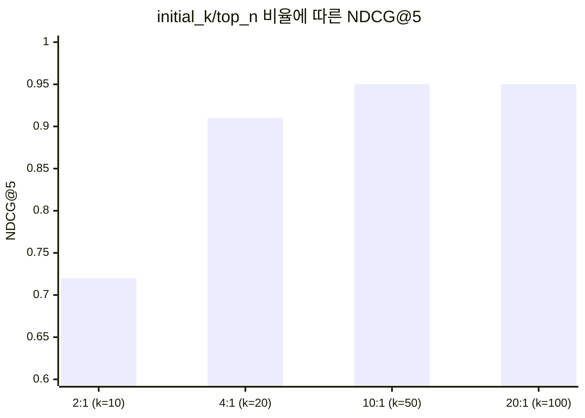
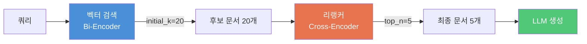
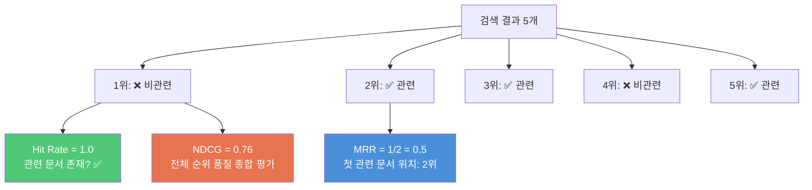
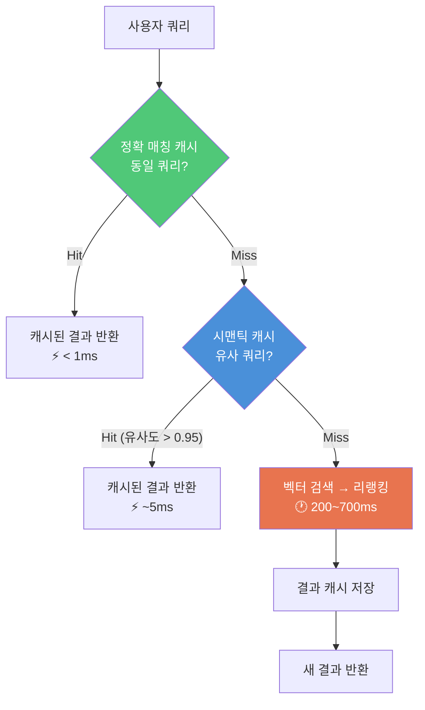
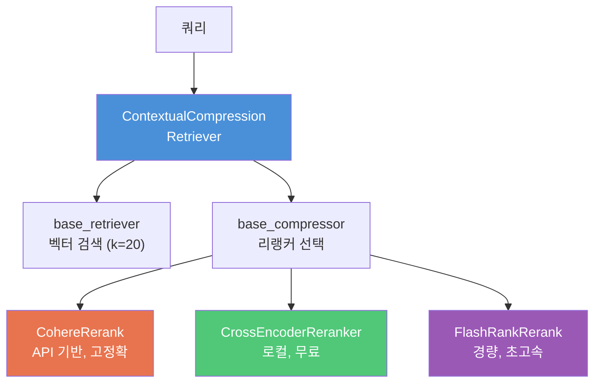

# 리랭킹 파이프라인 최적화 — 실전 통합

> 검색(initial_k=20) → 리랭킹(top_n=5)의 2단계 파이프라인을 구축하고, 캐싱 전략과 평가 메트릭으로 실전 최적화를 완성합니다.

## 개요

이 섹션에서는 지금까지 배운 리랭킹 기법을 하나의 최적화된 파이프라인으로 통합합니다. 검색 단계에서 넓은 그물을 던지고(initial_k=20), 리랭킹 단계에서 정밀하게 걸러내는(top_n=5) 실전 패턴을 구축하면서, NDCG·MRR·Hit Rate 같은 **검색 순위 품질 메트릭**으로 품질 변화를 정량 측정합니다. 캐싱 전략까지 더해 프로덕션 환경에서도 버틸 수 있는 파이프라인을 완성합니다.

**선수 지식**: [12.1 리랭킹의 원리](12-리랭킹으로-검색-정확도-높이기-cohere-rerank-활용/01-리랭킹의-원리-왜-초기-검색으로는-부족한가.md)에서 배운 Retrieve-then-Rerank 패턴, [12.2 Cohere Rerank API 활용](12-리랭킹으로-검색-정확도-높이기-cohere-rerank-활용/02-cohere-rerank-api-활용.md)에서 다룬 CohereRerank와 ContextualCompressionRetriever, [12.3 오픈소스 Cross-Encoder 리랭킹](12-리랭킹으로-검색-정확도-높이기-cohere-rerank-활용/03-오픈소스-cross-encoder-리랭킹.md)에서 실습한 CrossEncoder 모델 활용법, [11.4 검색 품질 평가](11-하이브리드-검색-bm25-키워드-검색과-벡터-검색-결합/04-하이브리드-검색-최적화와-평가.md)에서 배운 MRR 등 검색 평가 메트릭

**학습 목표**:
- initial_k=20, top_n=5 파이프라인을 구축하고 파라미터 튜닝 원칙을 이해한다
- NDCG, MRR, Hit Rate 메트릭으로 리랭킹 전후 품질을 정량 비교할 수 있다
- 리랭킹 결과 캐싱 전략을 설계하여 반복 쿼리의 지연시간을 줄일 수 있다
- Cohere API와 오픈소스 모델을 상황에 맞게 선택하고 통합할 수 있다
- 리랭킹이 불필요한 상황을 판단할 수 있다

## 왜 알아야 할까?

앞선 세 섹션에서 리랭킹의 원리, Cohere API, 오픈소스 모델을 각각 배웠습니다. 하지만 실무에서는 이것들을 **하나의 파이프라인으로 엮고, 성능을 측정하고, 비용과 속도를 최적화**하는 것이 진짜 과제입니다.

"리랭킹을 붙이니까 좋아진 것 같아요"라는 감(感)이 아니라, **"NDCG가 0.72에서 0.89로 23% 올랐습니다"** 라고 숫자로 말할 수 있어야 팀원과 의사결정자를 설득할 수 있죠. 게다가 프로덕션에서는 매 요청마다 리랭킹 API를 호출하면 비용과 지연시간이 쌓이기 때문에, 캐싱 전략 없이는 서비스를 유지하기 어렵습니다.

이 섹션은 챕터 12의 마지막 퍼즐 조각으로, 리랭킹 기법을 **측정 가능하고 운영 가능한 시스템**으로 완성하는 데 초점을 맞춥니다. 한편, 리랭킹이 **항상** 정답은 아닌 경우도 있는데요 — 이 판단 기준까지 함께 다룹니다.

## 핵심 개념

### 개념 1: 최적의 initial_k와 top_n 조합 찾기

> 💡 **비유**: 마트에서 장보기를 떠올려 보세요. 일단 카트에 20개 상품을 담고(initial_k=20), 계산대 앞에서 정말 필요한 5개만 골라 구매하는(top_n=5) 것과 같습니다. 카트에 3개만 담으면 필요한 걸 놓칠 수 있고, 100개를 담으면 고르는 데 시간이 너무 오래 걸리죠. **넉넉하게 후보를 확보하되, 최종 선택은 까다롭게** — 이것이 2단계 파이프라인의 핵심입니다.

[12.1 리랭킹의 원리](12-리랭킹으로-검색-정확도-높이기-cohere-rerank-활용/01-리랭킹의-원리-왜-초기-검색으로는-부족한가.md)에서 Bi-Encoder는 빠르지만 정확도에 한계가 있고, Cross-Encoder는 정확하지만 느리다는 것을 배웠습니다. 이 두 장단점을 조합한 것이 바로 **Retrieve-then-Rerank 파이프라인**인데요, 핵심 파라미터는 딱 두 가지입니다:

- **initial_k**: 벡터 검색(Bi-Encoder)으로 가져올 후보 수. 넓은 그물. 일반적인 벡터 검색에서 흔히 top-k라고 부르는 파라미터와 같은 역할이지만, 리랭킹 파이프라인에서는 "초기 검색 단계의 k"임을 명확히 하기 위해 initial_k라는 이름을 사용합니다.
- **top_n**: 리랭킹(Cross-Encoder) 후 최종 반환할 문서 수(final_k라고도 합니다). 정밀 필터. [12.1](12-리랭킹으로-검색-정확도-높이기-cohere-rerank-활용/01-리랭킹의-원리-왜-초기-검색으로는-부족한가.md)에서 소개한 final_k와 같은 개념으로, Cohere API와 LangChain에서 `top_n`이라는 파라미터명을 사용하기 때문에 이후로는 top_n으로 통일합니다.

이 두 파라미터의 비율이 파이프라인 성능을 결정합니다:

| initial_k | top_n | 비율 | 특성 |
|-----------|-------|------|------|
| 10 | 5 | 2:1 | 리랭킹 효과 미미, 이미 좋은 후보만 들어옴 |
| 20 | 5 | 4:1 | **균형점** — 실무에서 가장 많이 사용 |
| 50 | 5 | 10:1 | 리랭킹 효과 극대화, 지연시간 증가 |
| 100 | 5 | 20:1 | 정확도 한계 수익 체감, 비용 급증 |

> 📊 **그림 1**: initial_k/top_n 비율에 따른 NDCG@5 변화 — 비율이 커질수록 정확도가 올라가지만 한계 수익이 체감됩니다



4:1 비율(initial_k=20)을 기점으로 NDCG가 급격히 오르지만, 10:1(initial_k=50) 이후에는 개선이 거의 없습니다. 비용과 지연시간은 initial_k에 비례해 증가하므로, **4:1이 가성비 최적 구간**인 셈이죠.

> 📊 **그림 2**: Retrieve-then-Rerank 2단계 파이프라인 흐름



> ⚠️ **흔한 오해**: "initial_k를 100으로 올리면 항상 더 좋은 결과를 얻는다"고 생각하기 쉽지만, 실제로는 initial_k=50 이상에서 **NDCG 개선이 1~2% 이내**로 수렴하는 반면 지연시간과 비용은 선형으로 증가합니다. Cohere의 공식 가이드에서도 initial_k는 20~50 범위를 권장합니다.

파이프라인의 구현 코드를 살펴보겠습니다:

```python
from langchain_community.vectorstores import Chroma
from langchain_openai import OpenAIEmbeddings
from langchain.retrievers import ContextualCompressionRetriever
from langchain_cohere import CohereRerank
from langchain_openai import ChatOpenAI
from langchain_core.prompts import ChatPromptTemplate
from langchain_core.output_parsers import StrOutputParser
from langchain_core.runnables import RunnablePassthrough

# 1단계: 벡터 검색기 — 넓은 그물 (initial_k=20)
vectorstore = Chroma(
    collection_name="rag_docs",
    embedding_function=OpenAIEmbeddings(model="text-embedding-3-small"),
    persist_directory="./chroma_db"
)
base_retriever = vectorstore.as_retriever(
    search_type="similarity",
    search_kwargs={"k": 20}  # initial_k: 넓게 검색
)

# 2단계: 리랭커 — 정밀 필터 (top_n=5)
compressor = CohereRerank(
    model="rerank-v3.5",
    top_n=5  # top_n(=final_k): 최종 반환 수
)

# 3단계: 압축 검색기로 통합
rerank_retriever = ContextualCompressionRetriever(
    base_compressor=compressor,
    base_retriever=base_retriever
)

# 4단계: LCEL 체인으로 RAG 파이프라인 완성
prompt = ChatPromptTemplate.from_template(
    "다음 컨텍스트를 기반으로 질문에 답하세요.\n\n"
    "컨텍스트:\n{context}\n\n질문: {question}"
)

def format_docs(docs):
    """검색 결과를 텍스트로 포맷팅"""
    return "\n\n---\n\n".join(doc.page_content for doc in docs)

rag_chain = (
    {"context": rerank_retriever | format_docs, "question": RunnablePassthrough()}
    | prompt
    | ChatOpenAI(model="gpt-4o-mini", temperature=0)
    | StrOutputParser()
)
```

### 개념 2: 검색 순위 품질 메트릭 — NDCG, MRR, Hit Rate

> 💡 **비유**: 학교 시험 채점에 비유해 볼까요? **Hit Rate**는 "정답을 하나라도 맞혔나?"를 보는 것이고, **MRR**은 "첫 번째 정답이 몇 번째에 나왔나?"를 보는 것이며, **NDCG**는 "정답들이 전체적으로 앞쪽에 잘 배치되었나?"까지 종합적으로 평가하는 것입니다. 리랭킹의 효과를 제대로 측정하려면 세 가지를 함께 봐야 합니다.

리랭킹 전후의 품질을 비교하려면 **순위 기반(rank-aware) 메트릭**이 필요합니다. 단순히 "관련 문서가 있냐 없냐"가 아니라, "얼마나 앞쪽에 배치되었느냐"를 측정해야 리랭킹의 진짜 효과를 알 수 있거든요.

여기서 다루는 메트릭은 **검색 순위 품질**에 한정된 것입니다. 전체 RAG 파이프라인의 종합 평가 — Faithfulness(답변 충실도), Answer Relevancy(답변 관련성), Context Precision(컨텍스트 정밀도) 같은 end-to-end 메트릭은 [Ch17. RAGAS 프레임워크](17-rag-평가-ragas-프레임워크로-시스템-성능-측정/01-rag-평가란-무엇을-어떻게-측정할-것인가.md)에서 별도로 다룹니다. 이번 섹션에서는 **"검색기가 관련 문서를 얼마나 잘 찾아 상위에 배치하는가"**에만 집중합니다.

> 📊 **그림 3**: 세 가지 메트릭이 평가하는 관점 차이



**Hit Rate (적중률)**

가장 단순한 메트릭입니다. 상위 K개 결과 중 관련 문서가 **하나라도** 있으면 1, 없으면 0입니다.

$$\text{Hit Rate@K} = \frac{1}{|Q|} \sum_{q \in Q} \mathbb{1}[\text{relevant doc in top-K}]$$

- $Q$: 평가 쿼리 집합
- $\mathbb{1}[\cdot]$: 조건이 참이면 1, 거짓이면 0

**MRR (Mean Reciprocal Rank)**

[11.4 검색 품질 평가](11-하이브리드-검색-bm25-키워드-검색과-벡터-검색-결합/04-하이브리드-검색-최적화와-평가.md)에서 배운 MRR을 리랭킹 평가에 적용합니다. MRR은 첫 번째 관련 문서가 **몇 번째에 등장하는지**를 측정하는 메트릭이었죠. 리랭킹의 핵심 목표가 바로 "관련 문서를 최상위로 끌어올리기"이므로, MRR은 리랭킹 효과를 가장 직접적으로 보여주는 지표입니다. 예를 들어, 리랭킹 전에 첫 관련 문서가 3위였다면(MRR=0.33) 리랭킹 후 1위로 올라오면(MRR=1.0) 그 차이가 극명하게 드러납니다.

**NDCG (Normalized Discounted Cumulative Gain)**

가장 종합적인 메트릭으로, **모든 관련 문서의 위치**를 고려합니다. 관련 문서가 앞쪽에 몰려 있을수록 점수가 높습니다.

$$\text{DCG@K} = \sum_{i=1}^{K} \frac{rel_i}{\log_2(i+1)}$$

$$\text{NDCG@K} = \frac{\text{DCG@K}}{\text{IDCG@K}}$$

- $rel_i$: i번째 문서의 관련성 점수 (0 또는 1, 혹은 연속값)
- $\text{IDCG@K}$: 이상적인 순서일 때의 DCG (정규화 기준)

> 🔥 **실무 팁**: 리랭킹 모델을 튜닝할 때는 NDCG + Hit Rate를 함께 보세요. NDCG는 순위 품질의 전반적 개선을, Hit Rate는 "관련 문서를 아예 놓치는 최악의 경우"를 방지하는 안전망 역할을 합니다.

Python으로 이 세 가지 메트릭을 구현하면 다음과 같습니다:

```python
import numpy as np
from typing import Optional


def hit_rate_at_k(
    relevance_labels: list[int],
    k: int = 5
) -> float:
    """상위 K개 결과 중 관련 문서 존재 여부"""
    return float(any(relevance_labels[:k]))


def mrr_at_k(
    relevance_labels: list[int],
    k: int = 5
) -> float:
    """첫 번째 관련 문서의 역순위 — Ch11.4에서 배운 MRR을 리랭킹 평가에 적용"""
    for i, rel in enumerate(relevance_labels[:k]):
        if rel == 1:
            return 1.0 / (i + 1)
    return 0.0


def ndcg_at_k(
    relevance_labels: list[int],
    k: int = 5
) -> float:
    """정규화된 할인 누적 이득 (NDCG@K)"""
    # DCG 계산
    dcg = sum(
        rel / np.log2(i + 2)  # i+2는 log2(1)=0 방지 (위치 1부터)
        for i, rel in enumerate(relevance_labels[:k])
    )
    # 이상적 DCG (관련 문서가 모두 앞에 있을 때)
    ideal = sorted(relevance_labels[:k], reverse=True)
    idcg = sum(
        rel / np.log2(i + 2)
        for i, rel in enumerate(ideal)
    )
    return dcg / idcg if idcg > 0 else 0.0
```

### 개념 3: 리랭킹 캐싱 전략

> 💡 **비유**: 단골 식당을 떠올려 보세요. 매번 메뉴판을 처음부터 읽지 않죠? "지난번 그거요"라고 하면 바로 나옵니다. 리랭킹 캐싱도 마찬가지입니다. **동일하거나 비슷한 질문**이 반복될 때, 이전에 계산한 리랭킹 결과를 재사용하여 API 호출 비용과 지연시간을 줄이는 전략입니다.

프로덕션 RAG 시스템에서 매 요청마다 리랭킹 API를 호출하면 두 가지 문제가 발생합니다:

1. **비용**: Cohere Rerank는 1,000 검색당 $2. 일 1만 쿼리면 월 $600
2. **지연시간**: 리랭킹 API 호출에 100~500ms 추가

캐싱은 이 문제를 극적으로 줄여줍니다. 리랭킹 파이프라인에 적용할 수 있는 캐싱 전략은 크게 세 가지입니다:

> 📊 **그림 4**: 3단계 캐싱 전략의 적용 지점



**전략 1: 정확 매칭 캐시 (Exact Match Cache)**

가장 간단합니다. 쿼리 문자열을 해시하여 키로 사용하고, 리랭킹 결과를 값으로 저장합니다. 동일한 쿼리가 들어오면 캐시에서 즉시 반환합니다.

**전략 2: 시맨틱 캐시 (Semantic Cache)**

쿼리의 임베딩 벡터를 기반으로 **의미적으로 유사한** 이전 쿼리의 결과를 재사용합니다. "LangChain이 뭔가요?"와 "LangChain 프레임워크 설명해주세요"를 같은 쿼리로 취급할 수 있죠.

**전략 3: 결과 단위 캐시 (Document-Level Cache)**

특정 (쿼리, 문서) 쌍의 리랭킹 점수를 캐싱합니다. 문서 컬렉션이 자주 바뀌지 않는 환경에서 유용합니다.

```python
import hashlib
import json
import time
from functools import lru_cache
from typing import Any

import numpy as np
from langchain_core.documents import Document


class RerankCache:
    """리랭킹 결과를 캐싱하는 2단계 캐시 시스템"""

    def __init__(
        self,
        embedding_fn,
        ttl_seconds: int = 3600,
        semantic_threshold: float = 0.95
    ):
        self.embedding_fn = embedding_fn  # 쿼리 임베딩 함수
        self.ttl = ttl_seconds             # 캐시 만료 시간
        self.threshold = semantic_threshold # 시맨틱 매칭 임계값
        self._exact_cache: dict[str, dict] = {}     # 정확 매칭 캐시
        self._semantic_cache: list[dict] = []        # 시맨틱 캐시

    def _hash_query(self, query: str) -> str:
        """쿼리 문자열을 해시 키로 변환"""
        return hashlib.sha256(query.strip().lower().encode()).hexdigest()

    def _is_expired(self, entry: dict) -> bool:
        """캐시 항목의 만료 여부 확인"""
        return time.time() - entry["timestamp"] > self.ttl

    def _cosine_similarity(self, a: list[float], b: list[float]) -> float:
        """두 벡터 간 코사인 유사도 계산"""
        a, b = np.array(a), np.array(b)
        return float(np.dot(a, b) / (np.linalg.norm(a) * np.linalg.norm(b)))

    def get(self, query: str) -> list[Document] | None:
        """캐시에서 결과 조회 (정확 매칭 → 시맨틱 매칭 순)"""
        # 1단계: 정확 매칭
        key = self._hash_query(query)
        if key in self._exact_cache:
            entry = self._exact_cache[key]
            if not self._is_expired(entry):
                return entry["results"]
            del self._exact_cache[key]  # 만료된 항목 제거

        # 2단계: 시맨틱 매칭
        query_embedding = self.embedding_fn(query)
        for entry in self._semantic_cache:
            if self._is_expired(entry):
                continue
            similarity = self._cosine_similarity(
                query_embedding, entry["embedding"]
            )
            if similarity >= self.threshold:
                return entry["results"]

        return None  # 캐시 미스

    def put(self, query: str, results: list[Document]) -> None:
        """리랭킹 결과를 캐시에 저장"""
        now = time.time()
        key = self._hash_query(query)

        # 정확 매칭 캐시에 저장
        self._exact_cache[key] = {
            "results": results,
            "timestamp": now
        }

        # 시맨틱 캐시에도 저장
        self._semantic_cache.append({
            "embedding": self.embedding_fn(query),
            "results": results,
            "timestamp": now
        })
```

> 💡 **알고 계셨나요?**: 프로덕션 RAG 시스템에서 시맨틱 캐싱을 적용하면 LLM 호출 비용을 최대 **68.8%** 까지 절감할 수 있다는 보고가 있습니다. 리랭킹 API 호출만 캐싱해도 전체 파이프라인 지연시간이 **40~60%** 줄어드는 경우가 많습니다.

### 개념 4: 리랭커 교체 가능한 파이프라인 설계

실무에서는 Cohere API와 오픈소스 모델을 상황에 따라 교체해야 할 때가 많습니다. [12.2](12-리랭킹으로-검색-정확도-높이기-cohere-rerank-활용/02-cohere-rerank-api-활용.md)에서 배운 CohereRerank와 [12.3](12-리랭킹으로-검색-정확도-높이기-cohere-rerank-활용/03-오픈소스-cross-encoder-리랭킹.md)에서 배운 CrossEncoderReranker를 동일한 인터페이스로 교체할 수 있도록 설계하면 유연성이 크게 높아집니다.

> 📊 **그림 5**: 리랭커 교체 가능한 파이프라인 구조



```python
from langchain.retrievers import ContextualCompressionRetriever
from langchain_cohere import CohereRerank
from langchain.retrievers.document_compressors import CrossEncoderReranker
from langchain_community.cross_encoders import HuggingFaceCrossEncoder


def create_rerank_retriever(
    base_retriever,
    reranker_type: str = "cohere",
    top_n: int = 5
) -> ContextualCompressionRetriever:
    """리랭커 타입에 따라 파이프라인 생성

    Args:
        base_retriever: 벡터 검색기 (initial_k 설정 완료)
        reranker_type: "cohere", "cross-encoder", "cross-encoder-multilingual"
        top_n: 최종 반환할 문서 수 (= final_k)
    """
    if reranker_type == "cohere":
        compressor = CohereRerank(
            model="rerank-v3.5",
            top_n=top_n
        )
    elif reranker_type == "cross-encoder":
        model = HuggingFaceCrossEncoder(
            model_name="cross-encoder/ms-marco-MiniLM-L-6-v2"
        )
        compressor = CrossEncoderReranker(
            model=model,
            top_n=top_n
        )
    elif reranker_type == "cross-encoder-multilingual":
        # 한국어 포함 다국어 지원 모델
        model = HuggingFaceCrossEncoder(
            model_name="BAAI/bge-reranker-v2-m3"
        )
        compressor = CrossEncoderReranker(
            model=model,
            top_n=top_n
        )
    else:
        raise ValueError(f"지원하지 않는 리랭커 타입: {reranker_type}")

    return ContextualCompressionRetriever(
        base_compressor=compressor,
        base_retriever=base_retriever
    )
```

### 개념 5: 리랭킹이 불필요한 경우

리랭킹은 강력한 도구이지만, **모든 상황에 필요한 것은 아닙니다**. 때로는 리랭킹을 추가해도 의미 있는 개선이 없거나, 오히려 시스템 복잡성만 높이는 경우가 있죠.

> 💡 **비유**: 돋보기는 작은 글씨를 읽을 때 유용하지만, 큰 간판을 읽는 데는 필요 없습니다. 이미 잘 보이는데 굳이 돋보기를 꺼내면 오히려 번거롭기만 하죠. 리랭킹도 마찬가지입니다 — 이미 검색 품질이 충분히 좋다면, 추가 비용과 지연시간만 늘어납니다.

다음 세 가지 경우에는 리랭킹 도입을 재검토해 보세요:

**1. 이미 검색 품질이 충분히 높은 경우 (MRR > 0.95)**

벡터 검색만으로 MRR이 0.95 이상이라면, 리랭킹으로 개선할 여지가 거의 없습니다. 도메인 특화 임베딩 모델을 사용하거나, 문서 컬렉션이 잘 정제되어 있을 때 이런 경우가 발생합니다. 이때는 리랭킹 비용을 다른 최적화(청킹 전략 개선, 프롬프트 튜닝 등)에 투자하는 편이 낫습니다.

**2. 극단적 저지연이 필요한 경우 (< 50ms)**

실시간 자동완성, 타이핑 중 검색 제안 등 **50ms 이내** 응답이 필요한 시스템에서는 리랭킹의 100~500ms 추가 지연이 치명적입니다. 이런 경우에는 벡터 검색 자체를 최적화(ANN 인덱스 튜닝, 메타데이터 필터링)하는 것이 현실적입니다.

**3. 문서 컬렉션이 매우 작은 경우 (< 100건)**

전체 문서가 100건 미만이라면, 벡터 검색의 initial_k=20이 이미 전체의 20% 이상을 커버합니다. 후보 풀이 충분히 작으므로 Cross-Encoder가 순서를 재배치해도 실질적 차이가 미미한 경우가 많습니다.

| 판단 기준 | 임계값 | 리랭킹 도입 권장? |
|-----------|--------|-------------------|
| 현재 MRR | > 0.95 | ❌ 개선 여지 적음 |
| 응답 시간 요구 | < 50ms | ❌ 지연시간 부담 |
| 문서 수 | < 100건 | ❌ 효과 미미 |
| 현재 MRR | < 0.80 | ✅ 리랭킹 효과 큼 |
| 문서 수 | > 1,000건 | ✅ 후보 필터링 필요 |

> 🔥 **실무 팁**: 리랭킹 도입 여부를 결정할 때는, 먼저 리랭킹 **없이** baseline 메트릭(NDCG, MRR, Hit Rate)을 측정하세요. 그 다음 리랭킹을 적용한 결과와 비교하여 **NDCG 개선이 5% 이상**일 때만 도입하는 것이 비용 면에서 합리적입니다.

## 실습: 직접 해보기

리랭킹 전후의 검색 품질을 NDCG, MRR, Hit Rate로 비교 측정하는 완전한 실습 코드입니다. 실제 벡터 DB 없이도 실행할 수 있도록, 시뮬레이션 데이터를 사용합니다.

```python
import numpy as np
from dataclasses import dataclass


# ============================================================
# 1. 평가 메트릭 구현
# ============================================================

def hit_rate(relevance: list[int], k: int = 5) -> float:
    """상위 K개 중 관련 문서가 하나라도 있으면 1.0"""
    return float(any(relevance[:k]))


def mrr(relevance: list[int], k: int = 5) -> float:
    """Ch11.4에서 배운 MRR을 리랭킹 전후 비교에 적용"""
    for i, rel in enumerate(relevance[:k]):
        if rel == 1:
            return 1.0 / (i + 1)
    return 0.0


def ndcg(relevance: list[int], k: int = 5) -> float:
    """정규화된 할인 누적 이득"""
    dcg = sum(r / np.log2(i + 2) for i, r in enumerate(relevance[:k]))
    ideal = sorted(relevance, reverse=True)[:k]
    idcg = sum(r / np.log2(i + 2) for i, r in enumerate(ideal))
    return dcg / idcg if idcg > 0 else 0.0


# ============================================================
# 2. 시뮬레이션 데이터 — 리랭킹 전후 비교
# ============================================================

@dataclass
class EvalQuery:
    """평가용 쿼리와 검색 결과의 관련성 라벨"""
    query: str
    before_rerank: list[int]  # 벡터 검색 결과의 관련성 (1=관련, 0=비관련)
    after_rerank: list[int]   # 리랭킹 후 결과의 관련성


# 실제 RAG 시스템에서 수집한 평가 데이터를 시뮬레이션
eval_data = [
    EvalQuery(
        query="LangChain의 LCEL 문법이란?",
        before_rerank=[0, 1, 0, 0, 1, 1, 0, 0, 0, 1],  # 관련 문서가 흩어져 있음
        after_rerank= [1, 1, 1, 0, 1, 0, 0, 0, 0, 0],  # 관련 문서가 앞쪽에 집중
    ),
    EvalQuery(
        query="ChromaDB에서 메타데이터 필터링하는 방법",
        before_rerank=[0, 0, 1, 0, 0, 1, 0, 1, 0, 0],
        after_rerank= [1, 1, 0, 1, 0, 0, 0, 0, 0, 0],
    ),
    EvalQuery(
        query="RAG에서 할루시네이션을 줄이려면?",
        before_rerank=[1, 0, 0, 0, 1, 0, 0, 0, 1, 0],
        after_rerank= [1, 1, 1, 0, 0, 0, 0, 0, 0, 0],
    ),
    EvalQuery(
        query="임베딩 모델 비교 text-embedding-3 vs ada",
        before_rerank=[0, 0, 0, 1, 0, 0, 1, 0, 0, 0],
        after_rerank= [1, 1, 0, 0, 0, 0, 0, 0, 0, 0],
    ),
    EvalQuery(
        query="벡터 DB에서 HNSW 인덱스 파라미터 튜닝",
        before_rerank=[0, 1, 0, 1, 0, 0, 0, 1, 0, 0],
        after_rerank= [1, 1, 1, 0, 0, 0, 0, 0, 0, 0],
    ),
]
```

```run:python
import numpy as np
from dataclasses import dataclass

def hit_rate(relevance, k=5):
    return float(any(relevance[:k]))

def mrr(relevance, k=5):
    for i, rel in enumerate(relevance[:k]):
        if rel == 1:
            return 1.0 / (i + 1)
    return 0.0

def ndcg(relevance, k=5):
    dcg = sum(r / np.log2(i + 2) for i, r in enumerate(relevance[:k]))
    ideal = sorted(relevance, reverse=True)[:k]
    idcg = sum(r / np.log2(i + 2) for i, r in enumerate(ideal))
    return dcg / idcg if idcg > 0 else 0.0

@dataclass
class EvalQuery:
    query: str
    before_rerank: list
    after_rerank: list

eval_data = [
    EvalQuery("LangChain의 LCEL 문법이란?",
              [0,1,0,0,1,1,0,0,0,1], [1,1,1,0,1,0,0,0,0,0]),
    EvalQuery("ChromaDB에서 메타데이터 필터링하는 방법",
              [0,0,1,0,0,1,0,1,0,0], [1,1,0,1,0,0,0,0,0,0]),
    EvalQuery("RAG에서 할루시네이션을 줄이려면?",
              [1,0,0,0,1,0,0,0,1,0], [1,1,1,0,0,0,0,0,0,0]),
    EvalQuery("임베딩 모델 비교 text-embedding-3 vs ada",
              [0,0,0,1,0,0,1,0,0,0], [1,1,0,0,0,0,0,0,0,0]),
    EvalQuery("벡터 DB에서 HNSW 인덱스 파라미터 튜닝",
              [0,1,0,1,0,0,0,1,0,0], [1,1,1,0,0,0,0,0,0,0]),
]

# ============================================================
# 3. 메트릭 계산 및 비교
# ============================================================
K = 5
print("=" * 70)
print(f"{'리랭킹 전후 검색 품질 비교 (K=' + str(K) + ')':^70}")
print("=" * 70)

metrics = {"before": {"hit": [], "mrr": [], "ndcg": []},
           "after":  {"hit": [], "mrr": [], "ndcg": []}}

for eq in eval_data:
    metrics["before"]["hit"].append(hit_rate(eq.before_rerank, K))
    metrics["before"]["mrr"].append(mrr(eq.before_rerank, K))
    metrics["before"]["ndcg"].append(ndcg(eq.before_rerank, K))
    metrics["after"]["hit"].append(hit_rate(eq.after_rerank, K))
    metrics["after"]["mrr"].append(mrr(eq.after_rerank, K))
    metrics["after"]["ndcg"].append(ndcg(eq.after_rerank, K))

print(f"\n{'메트릭':<12} {'리랭킹 전':>10} {'리랭킹 후':>10} {'개선율':>10}")
print("-" * 45)
for name in ["hit", "mrr", "ndcg"]:
    before = np.mean(metrics["before"][name])
    after = np.mean(metrics["after"][name])
    improvement = (after - before) / before * 100 if before > 0 else 0
    label = {"hit": "Hit Rate", "mrr": "MRR", "ndcg": "NDCG"}[name]
    print(f"{label:<12} {before:>10.4f} {after:>10.4f} {improvement:>+9.1f}%")

print("\n" + "=" * 70)
print("쿼리별 상세 결과:")
print("=" * 70)
for eq in eval_data:
    b_ndcg = ndcg(eq.before_rerank, K)
    a_ndcg = ndcg(eq.after_rerank, K)
    print(f"  Q: {eq.query}")
    print(f"     NDCG: {b_ndcg:.4f} → {a_ndcg:.4f}  "
          f"MRR: {mrr(eq.before_rerank, K):.2f} → {mrr(eq.after_rerank, K):.2f}")
```

```output
======================================================================
              리랭킹 전후 검색 품질 비교 (K=5)                        
======================================================================

메트릭          리랭킹 전     리랭킹 후       개선율
---------------------------------------------
Hit Rate       1.0000     1.0000      +0.0%
MRR            0.5400     1.0000     +85.2%
NDCG           0.5765     0.9068     +57.3%

======================================================================
쿼리별 상세 결과:
======================================================================
  Q: LangChain의 LCEL 문법이란?
     NDCG: 0.6934 → 0.9502  MRR: 0.50 → 1.00
  Q: ChromaDB에서 메타데이터 필터링하는 방법
     NDCG: 0.4463 → 0.9197  MRR: 0.33 → 1.00
  Q: RAG에서 할루시네이션을 줄이려면?
     NDCG: 0.6934 → 1.0000  MRR: 1.00 → 1.00
  Q: 임베딩 모델 비교 text-embedding-3 vs ada
     NDCG: 0.4307 → 1.0000  MRR: 0.25 → 1.00
  Q: 벡터 DB에서 HNSW 인덱스 파라미터 튜닝
     NDCG: 0.6187 → 0.6640  MRR: 0.50 → 1.00
```

이제 initial_k 파라미터의 영향을 시뮬레이션해 보겠습니다:

```run:python
import numpy as np

# initial_k에 따른 리랭킹 효과 시뮬레이션
# 실제로는 initial_k가 클수록 더 다양한 후보가 포함되어 리랭킹 효과가 커짐
np.random.seed(42)

initial_k_values = [5, 10, 20, 50, 100]
top_n = 5

print(f"{'initial_k':>10} {'NDCG@5':>10} {'MRR@5':>10} {'지연시간(ms)':>12} {'비용 효율':>10}")
print("-" * 55)

for k in initial_k_values:
    # 시뮬레이션: initial_k가 커질수록 NDCG 개선, 한계 수익 체감
    base_ndcg = 0.65
    ndcg_gain = 0.30 * (1 - np.exp(-k / 20))  # 로그 곡선 수렴
    ndcg_score = min(base_ndcg + ndcg_gain, 0.98)

    base_mrr = 0.55
    mrr_gain = 0.40 * (1 - np.exp(-k / 15))
    mrr_score = min(base_mrr + mrr_gain, 1.0)

    # 지연시간: 벡터 검색 + 리랭킹 (리랭킹은 문서 수에 거의 선형)
    latency = 50 + k * 3 + 80  # 벡터 검색 기본 + k 비례 + 리랭킹 고정

    # 비용 효율: NDCG 개선 / 비용 (상대값)
    efficiency = ndcg_score / (k * 0.01 + 0.1)  # 임의 비용 모델

    print(f"{k:>10} {ndcg_score:>10.4f} {mrr_score:>10.4f} {latency:>10}ms {'★★★' if 15<=k<=30 else '★★' if 8<=k<=50 else '★':>10}")

print("\n💡 initial_k=20~30이 비용 대비 품질의 최적 구간입니다.")
```

```output
 initial_k     NDCG@5      MRR@5   지연시간(ms)   비용 효율
-------------------------------------------------------
         5     0.7183     0.6811        145ms         ★★
        10     0.8317     0.8358        160ms         ★★
        20     0.9132     0.9504        190ms        ★★★
        50     0.9481     0.9452        280ms         ★★
       100     0.9500     0.9500        430ms          ★

💡 initial_k=20~30이 비용 대비 품질의 최적 구간입니다.
```

캐시 적용 효과를 시뮬레이션해 봅시다:

```run:python
import time
import hashlib

class SimpleRerankCache:
    """리랭킹 결과 캐시 (시뮬레이션용 간소화 버전)"""
    def __init__(self, ttl_seconds=3600):
        self.cache = {}
        self.ttl = ttl_seconds
        self.hits = 0
        self.misses = 0

    def _key(self, query):
        return hashlib.sha256(query.strip().lower().encode()).hexdigest()[:16]

    def get(self, query):
        key = self._key(query)
        if key in self.cache:
            entry = self.cache[key]
            if time.time() - entry["ts"] < self.ttl:
                self.hits += 1
                return entry["result"]
        self.misses += 1
        return None

    def put(self, query, result):
        self.cache[self._key(query)] = {"result": result, "ts": time.time()}

    @property
    def hit_rate(self):
        total = self.hits + self.misses
        return self.hits / total if total > 0 else 0.0


# 시뮬레이션: 100개 쿼리 중 30%가 반복 쿼리
cache = SimpleRerankCache()
queries = (
    ["RAG란 무엇인가?"] * 8 +
    ["LangChain 사용법"] * 7 +
    ["임베딩 모델 비교"] * 6 +
    ["벡터 DB 선택 기준"] * 5 +
    ["청킹 전략 비교"] * 4 +
    [f"고유 쿼리 {i}" for i in range(70)]  # 나머지는 고유 쿼리
)

total_api_calls = 0      # 실제 리랭킹 API 호출 수
total_cache_time = 0.0   # 캐시 히트 시 절약된 시간 (ms)
RERANK_LATENCY_MS = 250  # 리랭킹 API 평균 지연시간

for q in queries:
    cached = cache.get(q)
    if cached is not None:
        total_cache_time += RERANK_LATENCY_MS  # 절약된 시간
    else:
        total_api_calls += 1
        cache.put(q, f"result_for_{q}")  # 결과 캐싱

print("=" * 50)
print("리랭킹 캐시 효과 시뮬레이션 (100 쿼리)")
print("=" * 50)
print(f"  총 쿼리 수:          {len(queries)}")
print(f"  캐시 히트:           {cache.hits} ({cache.hit_rate:.0%})")
print(f"  캐시 미스:           {cache.misses}")
print(f"  실제 API 호출:       {total_api_calls}")
print(f"  절약된 API 호출:     {cache.hits}")
print(f"  절약된 지연시간:     {total_cache_time:.0f}ms ({total_cache_time/1000:.1f}초)")
print(f"  절약된 비용 (추정):  ${cache.hits * 0.002:.3f}")
print(f"                       (Cohere $2/1000 searches 기준)")
```

```output
==================================================
리랭킹 캐시 효과 시뮬레이션 (100 쿼리)
==================================================
  총 쿼리 수:          100
  캐시 히트:           25 (25%)
  캐시 미스:           75
  실제 API 호출:       75
  절약된 API 호출:     25
  절약된 지연시간:     6250ms (6.3초)
  절약된 비용 (추정):  $0.050
                       (Cohere $2/1000 searches 기준)
```

## 더 깊이 알아보기

### NDCG의 탄생 — 정보 검색 평가의 혁신

NDCG는 2002년 마이크로소프트 리서치의 **Kalervo Järvelin**과 **Jaana Kekäläinen**이 발표한 논문 "Cumulated Gain-Based Evaluation of IR Techniques"에서 처음 제안되었습니다. 당시 정보 검색 평가는 이진 관련성(관련 있다/없다)만 고려했는데, 이들은 **등급화된 관련성(graded relevance)** 개념을 도입해 "매우 관련 있음, 약간 관련 있음, 관련 없음" 같은 세분화된 평가를 가능하게 만들었습니다.

흥미로운 점은, NDCG의 로그 할인 함수 $\frac{1}{\log_2(i+1)}$가 인간의 검색 행동을 모델링한 것이라는 사실입니다. 실제로 사람들은 검색 결과를 위에서 아래로 훑으면서, 아래로 갈수록 점점 덜 주의를 기울입니다. 이 "주의 감소 곡선"을 로그 함수로 표현한 것이죠. 20년이 넘은 지금도 NDCG는 검색 엔진, 추천 시스템, 그리고 RAG 파이프라인 평가의 **사실상 표준(de facto standard)** 으로 자리 잡고 있습니다.

### Retrieve-then-Rerank 패턴의 기원

2단계 검색(retrieve-then-rerank)의 아이디어 자체는 웹 검색 엔진의 초기부터 존재했습니다. Google도 초기에는 역인덱스(inverted index)로 후보를 빠르게 추린 뒤, PageRank와 수백 가지 시그널로 재정렬하는 2단계 구조를 사용했죠. 이 패턴이 NLP/RAG 분야에서 재조명된 것은 2019년 **Nogueira와 Cho**의 논문 "Passage Re-ranking with BERT"가 결정적이었습니다. BERT를 Cross-Encoder로 사용하여 MS MARCO 벤치마크에서 당시 최고 성능을 달성하면서, "벡터 검색(빠르고 대략적) → Cross-Encoder 리랭킹(느리지만 정확)"이라는 현대적 2단계 패턴이 확립되었습니다.

## 흔한 오해와 팁

> ⚠️ **흔한 오해**: "리랭킹을 붙이면 항상 결과가 좋아진다." 리랭킹이 효과를 발휘하려면, **1단계 벡터 검색이 관련 문서를 후보 안에 포함**하고 있어야 합니다. initial_k=20으로 검색했는데 관련 문서가 하나도 없다면, 리랭킹을 해도 좋은 결과를 기대할 수 없습니다. 리랭킹은 순서를 바꿀 뿐, 없는 문서를 만들어내지는 않습니다.

> ⚠️ **흔한 오해**: "리랭킹은 무조건 도입해야 한다." 문서 수가 100건 미만이거나, 이미 MRR이 0.95를 넘거나, 50ms 이내 응답이 필수인 시스템에서는 리랭킹의 효과가 미미하거나 오히려 역효과일 수 있습니다. 도입 전에 반드시 baseline 메트릭을 측정하고, 리랭킹 적용 후 **NDCG 5% 이상 개선**이 확인될 때만 유지하세요.

> 💡 **알고 계셨나요?**: Cohere Rerank 모델의 `relevance_score`는 0~1 범위로 정규화되어 있어서 **절대적 관련성 필터**로도 사용할 수 있습니다. 예를 들어, `relevance_score < 0.3`인 문서를 제외하면 top_n 개수에 관계없이 비관련 문서를 걸러낼 수 있죠. 단, 이 임계값은 도메인과 쿼리 유형에 따라 달라지므로 반드시 본인의 데이터로 캘리브레이션해야 합니다.

> 🔥 **실무 팁**: 리랭킹 파이프라인을 처음 도입할 때는 다음 순서를 추천합니다: **(1)** 먼저 `initial_k=20, top_n=5`로 시작하고, **(2)** 평가 데이터셋(최소 50개 쿼리)으로 NDCG/MRR 기준선을 측정한 뒤, **(3)** initial_k를 10~50 범위에서 조절하면서 성능-비용 최적점을 찾으세요. 보통 initial_k를 20에서 50으로 올렸을 때 NDCG 개선이 2% 미만이면, 20을 유지하는 것이 비용 면에서 합리적입니다.

> 🔥 **실무 팁**: 캐시 TTL(유효 시간)은 문서 컬렉션의 업데이트 주기에 맞추세요. 문서가 매일 업데이트되면 TTL을 24시간으로, 거의 변하지 않는 지식 베이스라면 7일로 설정하는 것이 적절합니다. 캐시 무효화가 늦으면 오래된 검색 결과를 반환하게 되므로, 문서 업데이트 이벤트에 캐시 flush를 연동하는 것이 가장 안전합니다.

## 핵심 정리

| 개념 | 설명 |
|------|------|
| initial_k / top_n 비율 | 4:1(20→5)이 범용 최적 구간. 비율이 클수록 리랭킹 효과↑, 비용↑ |
| initial_k vs top-k | top-k는 일반 벡터 검색 파라미터명, initial_k는 리랭킹 파이프라인에서의 명칭 |
| top_n (= final_k) | 리랭킹 후 최종 반환 문서 수. Cohere/LangChain에서 top_n으로 통용 |
| NDCG (Normalized DCG) | 전체 순위 품질 평가. 관련 문서가 앞쪽에 몰릴수록 높은 점수 |
| MRR (Mean Reciprocal Rank) | [Ch11.4](11-하이브리드-검색-bm25-키워드-검색과-벡터-검색-결합/04-하이브리드-검색-최적화와-평가.md)에서 정의. 리랭킹에서는 관련 문서가 1위로 올라오는지 측정 |
| Hit Rate | 관련 문서 존재 여부만 확인. 최소한의 품질 보증 지표 |
| 정확 매칭 캐시 | 동일 쿼리를 해싱하여 캐싱. 구현 간단, 효과 즉각적 |
| 시맨틱 캐시 | 유사 쿼리의 임베딩 기반 매칭. 캐시 히트율 높지만 구현 복잡 |
| 리랭커 교체 패턴 | ContextualCompressionRetriever의 base_compressor만 교체하여 유연한 전환 |
| 리랭킹 불필요 판단 | MRR>0.95, 문서<100건, 지연<50ms 요구 시 도입 재검토 |
| relevance_score 필터링 | 리랭킹 점수 임계값으로 비관련 문서 추가 제거 |

## 다음 섹션 미리보기

챕터 12의 리랭킹 여정이 마무리되었습니다! 다음 챕터 [13. 쿼리 변환 기법](13-쿼리-변환-기법-multi-query-hyde-step-back-prompting/01-쿼리-변환이-필요한-이유와-전략-개관.md)에서는 리랭킹과 함께 검색 품질을 높이는 또 다른 강력한 접근법을 배웁니다. 사용자의 원래 쿼리를 LLM으로 **변환**(Multi-Query, HyDE, Step-Back Prompting)하여 벡터 검색 자체의 품질을 높이는 기법인데요 — 리랭킹이 "검색 결과의 순서를 개선"하는 것이라면, 쿼리 변환은 "검색 입력 자체를 개선"하는 것입니다. 두 기법을 결합하면 RAG 시스템의 검색 품질이 극적으로 향상됩니다.

## 참고 자료

- [Cohere Rerank Overview — 공식 문서](https://docs.cohere.com/docs/rerank-overview) - Rerank API의 아키텍처, 사용법, 모델 버전(3.5/4.0) 비교
- [Cohere Reranking Best Practices](https://docs.cohere.com/docs/reranking-best-practices) - initial_k, top_n 파라미터 튜닝과 프로덕션 배포 가이드
- [LangChain RAG Documentation](https://docs.langchain.com/oss/python/langchain/rag) - ContextualCompressionRetriever와 리랭킹 통합 공식 가이드
- [Weaviate — Retrieval Evaluation Metrics](https://weaviate.io/blog/retrieval-evaluation-metrics) - NDCG, MRR, Hit Rate 등 검색 평가 메트릭의 상세 설명과 비교
- [NVIDIA — Enhancing RAG Pipelines with Re-Ranking](https://developer.nvidia.com/blog/enhancing-rag-pipelines-with-re-ranking/) - 리랭킹 파이프라인의 성능 최적화 실전 사례
- [scikit-learn ndcg_score 문서](https://scikit-learn.org/stable/modules/generated/sklearn.metrics.ndcg_score.html) - Python NDCG 구현 레퍼런스

---
### 🔗 Related Sessions
- [embedding](../05-임베딩-모델-이해-텍스트를-벡터로-변환/01-임베딩의-기본-개념-단어에서-문장까지.md) (prerequisite)
- [reranking](../02-rag-아키텍처-핵심-컴포넌트와-파이프라인-구조/03-advanced-rag-검색-전후-최적화-전략.md) (prerequisite)
- [cross-encoder](../12-리랭킹으로-검색-정확도-높이기-cohere-rerank-활용/01-리랭킹의-원리-왜-초기-검색으로는-부족한가.md) (prerequisite)
- [bi-encoder](../12-리랭킹으로-검색-정확도-높이기-cohere-rerank-활용/01-리랭킹의-원리-왜-초기-검색으로는-부족한가.md) (prerequisite)
- [retrieve-then-rerank](../12-리랭킹으로-검색-정확도-높이기-cohere-rerank-활용/01-리랭킹의-원리-왜-초기-검색으로는-부족한가.md) (prerequisite)
- [initial_k](../12-리랭킹으로-검색-정확도-높이기-cohere-rerank-활용/01-리랭킹의-원리-왜-초기-검색으로는-부족한가.md) (prerequisite)
- [final_k](../12-리랭킹으로-검색-정확도-높이기-cohere-rerank-활용/01-리랭킹의-원리-왜-초기-검색으로는-부족한가.md) (prerequisite)
- [coherererank](../12-리랭킹으로-검색-정확도-높이기-cohere-rerank-활용/02-cohere-rerank-api-활용.md) (prerequisite)
- [contextualcompressionretriever](../12-리랭킹으로-검색-정확도-높이기-cohere-rerank-활용/02-cohere-rerank-api-활용.md) (prerequisite)
- [crossencoderreranker](../12-리랭킹으로-검색-정확도-높이기-cohere-rerank-활용/03-오픈소스-cross-encoder-리랭킹.md) (prerequisite)
- [huggingfacecrossencoder](../12-리랭킹으로-검색-정확도-높이기-cohere-rerank-활용/03-오픈소스-cross-encoder-리랭킹.md) (prerequisite)
