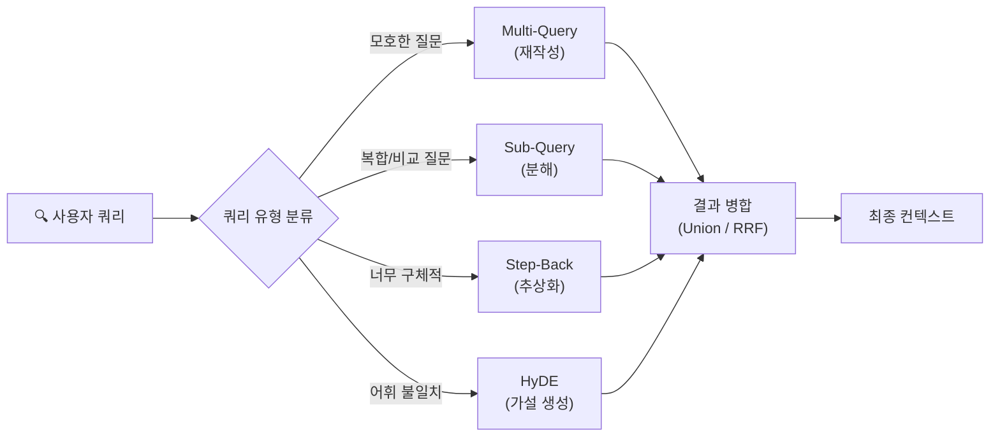
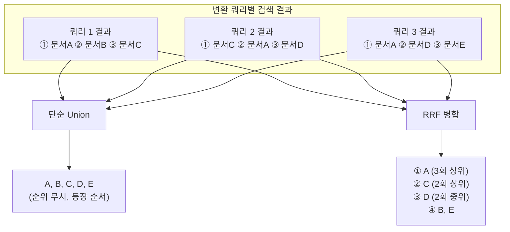
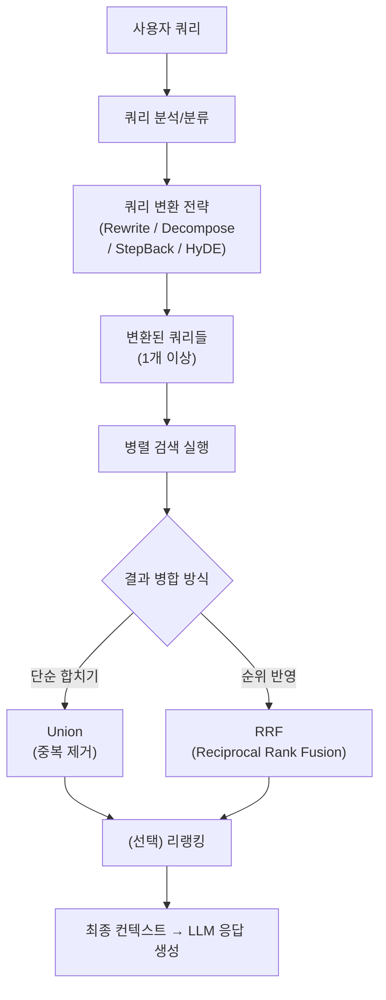

# 쿼리 변환이 필요한 이유와 전략 개관

> 사용자의 질문을 그대로 검색에 던지면 왜 엉뚱한 결과가 돌아올까? 쿼리 변환이 RAG 검색 품질을 극적으로 바꾸는 원리를 알아봅니다.

## 개요

이 섹션에서는 RAG 시스템에서 사용자 쿼리가 검색 품질에 미치는 영향을 분석하고, 쿼리를 변환하는 네 가지 핵심 전략(재작성, 분해, 확장, 가설 생성)을 살펴봅니다. 각 전략이 어떤 상황에 적합한지 판단하는 기준을 세우고, 변환된 쿼리의 검색 결과를 병합하는 방법(Union vs RRF)까지 포함한 쿼리 변환 파이프라인의 뼈대를 구현해 봅니다.

**선수 지식**: [Ch10~12] 유사도 검색, 하이브리드 검색, 리랭킹 등 검색 품질 향상 기법의 기본 개념
**학습 목표**:
- 사용자 쿼리의 4가지 문제 유형(모호성, 구어체, 복합 질문, 어휘 불일치)을 식별할 수 있다
- 쿼리 변환의 네 가지 핵심 전략을 구분하고 각 전략의 적합한 시나리오를 판단할 수 있다
- 검색 결과 병합 방식(단순 Union vs RRF)의 차이를 이해하고 RRF를 구현할 수 있다
- 쿼리 변환 파이프라인의 기본 구조를 이해하고 구현할 수 있다

## 왜 알아야 할까?

여러분이 도서관에서 책을 찾는다고 상상해 보세요. 사서에게 "그거 있잖아, 요즘 핫한 AI 책"이라고 말하면 어떻게 될까요? 사서는 "AI 분야가 워낙 넓은데, 어떤 주제요? 머신러닝? 생성형 AI? 대상 독자 수준은요?"라고 되물을 겁니다.

RAG 시스템도 마찬가지입니다. 벡터 데이터베이스는 친절한 사서가 아니거든요. 사용자가 던진 질문을 **문자 그대로** 임베딩해서 검색하기 때문에, 질문이 모호하거나 너무 구어체이면 엉뚱한 문서를 가져옵니다.

실제로 RAG 시스템의 성능 문제 중 상당수가 검색 단계에서 발생하는데, 그 원인의 핵심이 바로 **쿼리 품질**입니다. 앞서 Ch10~12에서 검색 알고리즘과 리랭킹으로 검색 품질을 높이는 방법을 배웠죠? 이번 챕터에서는 그보다 **한 단계 앞**, 즉 검색 요청을 보내기 전에 쿼리 자체를 개선하는 **Pre-retrieval 최적화** 기법을 다룹니다. 검색 엔진을 아무리 좋은 것으로 바꿔도, 검색어가 부실하면 결과도 부실할 수밖에 없으니까요.

## 핵심 개념

### 개념 1: 사용자 쿼리의 4가지 문제 유형

> 💡 **비유**: 내비게이션에 목적지를 입력할 때를 생각해 보세요. "그 유명한 맛집"이라고 치면 내비게이션이 찾아줄까요? "서울시 강남구 역삼동 OO식당"처럼 정확하게 입력해야 제대로 안내하죠. RAG의 검색도 정확히 같은 원리입니다.

사용자 쿼리가 검색 품질을 떨어뜨리는 대표적인 문제 유형을 살펴보겠습니다.

**1. 모호성(Ambiguity)**
사용자가 의도를 명확히 표현하지 않는 경우입니다.

```python
# 모호한 쿼리 예시
vague_query = "트랜스포머가 뭐야?"
# 의도: Transformer 모델 아키텍처? 영화 트랜스포머? 전기 변압기?
```

**2. 구어체/비형식적 표현(Colloquial)**
일상 대화체로 질문해서 문서의 기술 용어와 매칭이 안 되는 경우입니다.

```python
# 구어체 쿼리 vs 문서 용어
colloquial_query = "임베딩이 자꾸 이상하게 나와요"
# 문서에는 "임베딩 품질 저하", "벡터 표현 정확도" 같은 용어로 기술됨
```

**3. 복합 질문(Complex/Multi-hop)**
하나의 질문에 여러 하위 질문이 섞여 있는 경우입니다.

```python
# 복합 질문 예시
complex_query = "ChromaDB와 Pinecone의 성능 차이와 각각의 가격 정책은?"
# 실제로는 4개의 하위 질문:
# 1) ChromaDB 성능  2) Pinecone 성능  3) ChromaDB 가격  4) Pinecone 가격
```

**4. 어휘 불일치(Vocabulary Mismatch)**
사용자가 쓰는 단어와 문서에 있는 단어가 다른 경우입니다. 이건 임베딩 기반 검색에서도 완전히 해결되지 않는 문제거든요.

```python
# 어휘 불일치 예시
user_query = "RAG에서 답변이 틀리는 문제"
# 문서에서는 이를 "할루시네이션(Hallucination)" 또는 "Faithfulness 저하"라고 표현
```

### 개념 2: 쿼리 변환의 네 가지 핵심 전략

> 💡 **비유**: 쿼리 변환 전략은 마치 **통역사의 번역 전략**과 비슷합니다. 어떤 통역사는 같은 말을 여러 방식으로 바꿔 전달하고(재작성), 어떤 통역사는 긴 말을 짧게 쪼개서 전달하고(분해), 어떤 통역사는 배경 지식을 추가해서 전달하고(확장), 또 어떤 통역사는 "아마 이런 답변을 원하실 텐데요"라며 예상 답변부터 만들어 봅니다(가설 생성).

> 📊 **그림 1**: 쿼리 문제 유형과 변환 전략의 매핑



#### 전략 1: 쿼리 재작성 (Query Rewriting / Multi-Query)

원래 질문을 **여러 관점에서 다시 표현**하는 전략입니다. LLM에게 "이 질문을 3가지 다른 방식으로 다시 써줘"라고 요청하면, 각각의 변형 쿼리로 검색해서 결과를 합칩니다.

```python
# Multi-Query 개념 예시
original = "RAG 시스템에서 검색 품질을 높이는 방법은?"

rewritten_queries = [
    "RAG retrieval 정확도를 개선하는 기법은 무엇인가?",
    "검색 증강 생성에서 문서 검색 성능을 최적화하는 전략은?",
    "RAG 파이프라인의 retriever 성능을 향상시키는 방법은?",
]
# → 3개의 쿼리로 각각 검색 → 결과 합치기 (Union 또는 RRF)
```

**적합한 시나리오**: 쿼리가 모호하거나, 하나의 표현으로는 관련 문서를 모두 찾기 어려울 때

#### 전략 2: 쿼리 분해 (Query Decomposition / Sub-Query)

복합 질문을 **작은 하위 질문으로 분리**하는 전략입니다.

```python
# 쿼리 분해 개념 예시
original = "ChromaDB와 FAISS의 검색 속도와 확장성을 비교해줘"

sub_queries = [
    "ChromaDB의 검색 속도 벤치마크는?",
    "FAISS의 검색 속도 벤치마크는?",
    "ChromaDB의 확장성은 어느 수준인가?",
    "FAISS의 확장성은 어느 수준인가?",
]
# → 각 하위 질문별로 검색 → 결과 종합
```

**적합한 시나리오**: 비교 질문, 다단계 추론이 필요한 질문(Multi-hop)

#### 전략 3: 쿼리 확장/추상화 (Step-Back Prompting)

구체적인 질문을 **한 단계 추상화**하여, 더 넓은 맥락의 배경 지식부터 검색하는 전략입니다.

```python
# Step-Back Prompting 개념 예시
original = "LangChain의 MultiQueryRetriever에서 generated_queries 파라미터의 기본값은?"

step_back = "LangChain MultiQueryRetriever의 주요 파라미터와 설정 방법은?"
# → 추상화된 질문으로 넓은 범위의 문서를 먼저 검색
# → 원본 질문과 함께 LLM에 전달
```

**적합한 시나리오**: 지나치게 구체적인 질문, 전문 용어가 많은 질문, 배경 지식이 필요한 질문

#### 전략 4: 가설 문서 생성 (HyDE — Hypothetical Document Embeddings)

질문에 대한 **가상의 답변 문서를 먼저 생성**하고, 그 가상 문서의 임베딩으로 검색하는 전략입니다. 질문-문서 간의 의미 갭을 줄이는 독특한 접근법이죠.

```python
# HyDE 개념 예시
original = "RAG에서 청킹 크기가 검색에 미치는 영향은?"

# LLM이 생성한 가설 문서 (정확하지 않아도 됨)
hypothetical_doc = """
청킹 크기는 RAG 시스템의 검색 품질에 직접적인 영향을 미칩니다.
청크가 너무 크면 관련 없는 정보가 포함되어 노이즈가 증가하고,
청크가 너무 작으면 문맥이 부족하여 의미 파악이 어려워집니다.
일반적으로 256~1024 토큰 범위가 권장되며...
"""
# → 이 가설 문서를 임베딩 → 실제 문서와 유사도 비교
# → "문서 ↔ 문서" 비교이므로 "질문 ↔ 문서" 비교보다 매칭이 잘 됨
```

**적합한 시나리오**: 질문과 문서의 어휘/스타일이 크게 다를 때, 전문 영역 검색

### 개념 3: 전략 선택 가이드 — 언제 어떤 전략을 쓸까?

네 가지 전략 중 어떤 것을 선택할지는 쿼리의 **문제 유형**에 따라 달라집니다. 아래 표를 참고하세요.

| 쿼리 문제 유형 | 추천 전략 | 이유 |
|---|---|---|
| 모호한 질문 | Multi-Query (재작성) | 다양한 관점으로 검색 커버리지 확대 |
| 복합/비교 질문 | Sub-Query (분해) | 각 하위 질문별로 정확한 문서 검색 |
| 너무 구체적인 질문 | Step-Back (추상화) | 넓은 맥락에서 관련 정보 탐색 |
| 어휘 불일치 | HyDE (가설 생성) | 문서 스타일의 텍스트로 검색 |
| 구어체 질문 | Multi-Query + HyDE | 표현 다양화 + 문서 스타일 매칭 |

> 🔥 **실무 팁**: 실무에서는 이 전략들을 **개별적으로만** 쓰는 것이 아니라 **조합**해서 사용하는 경우가 많습니다. 예를 들어, Multi-Query로 여러 쿼리를 생성한 뒤 RAG-Fusion의 Reciprocal Rank Fusion(RRF)으로 결과를 합치면, 단일 전략보다 답변 정확도가 8~10%, 포괄성이 30~40% 향상된다는 연구 결과가 있습니다. RRF가 정확히 어떻게 동작하는지는 바로 다음 개념에서 살펴보겠습니다.

### 개념 4: 검색 결과 병합 — Union vs RRF

여러 변환 쿼리로 검색하면 각 쿼리마다 결과 리스트가 나옵니다. 이 여러 결과를 **어떻게 하나로 합치느냐**가 최종 검색 품질을 크게 좌우하는데요, 크게 두 가지 방식이 있습니다.

> 💡 **비유**: 여러 명의 친구에게 "맛집 추천해줘"라고 물었다고 해보세요. **단순 합치기(Union)**는 친구들이 추천한 식당을 중복 제거해서 쭉 나열하는 것이고, **RRF**는 "여러 친구가 공통으로 1순위에 꼽은 식당"을 맨 위로 올리는 겁니다. 당연히 후자가 더 신뢰할 만하겠죠?

#### 방법 1: 단순 Union (합집합)

각 쿼리의 검색 결과를 합쳐서 중복을 제거하는 가장 단순한 방식입니다. 구현이 쉽지만, 문서의 **순위 정보를 완전히 무시**한다는 한계가 있습니다. 쿼리 A에서 1위인 문서와 10위인 문서가 동등하게 취급되거든요.

```python
# 단순 Union 방식
def unique_union(results_list: list[list[str]]) -> list[str]:
    """여러 검색 결과를 합치고 중복을 제거합니다."""
    seen = set()
    merged = []
    for results in results_list:
        for doc in results:
            if doc not in seen:
                seen.add(doc)
                merged.append(doc)
    return merged
```

#### 방법 2: Reciprocal Rank Fusion (RRF)

RRF는 각 문서의 **순위 정보를 활용**하여 병합하는 알고리즘입니다. 핵심 공식은 아주 간단합니다:

$$\text{RRF}(d) = \sum_{q \in Q} \frac{1}{\text{rank}_q(d) + k}$$

- $d$: 문서
- $Q$: 쿼리 집합 (변환된 쿼리들)
- $\text{rank}_q(d)$: 쿼리 $q$의 결과에서 문서 $d$의 순위 (1부터 시작)
- $k$: 상수 (보통 60, 하위 순위 문서에 지나치게 낮은 점수가 매겨지는 것을 방지)

이 공식이 의미하는 바는 이렇습니다: 여러 쿼리에서 **공통으로 상위에 랭크된 문서**는 RRF 점수가 높아져 자연스럽게 최종 결과의 상위로 올라옵니다. 반면 한 쿼리에서만 높은 순위를 차지한 문서는 상대적으로 점수가 낮아지죠.

```python
def reciprocal_rank_fusion(
    results_list: list[list[str]],
    k: int = 60,
) -> list[str]:
    """
    Reciprocal Rank Fusion으로 여러 검색 결과를 병합합니다.
    
    Args:
        results_list: 각 쿼리의 검색 결과 리스트 (순위 순서대로 정렬)
        k: RRF 상수 (기본값 60)
    
    Returns:
        RRF 점수 기준으로 재정렬된 문서 리스트
    """
    rrf_scores: dict[str, float] = {}
    
    for results in results_list:
        for rank, doc in enumerate(results, start=1):
            # 각 문서에 1/(rank + k) 점수를 누적
            rrf_scores[doc] = rrf_scores.get(doc, 0.0) + 1.0 / (rank + k)
    
    # RRF 점수가 높은 순으로 정렬
    sorted_docs = sorted(rrf_scores.keys(), key=lambda d: rrf_scores[d], reverse=True)
    return sorted_docs
```

> 📊 **그림 2**: Union vs RRF 결과 병합 비교



위 예시에서 문서 A는 세 쿼리 모두에서 상위에 등장하므로 RRF 점수가 가장 높습니다. 단순 Union에서는 이런 **교차 순위 신호**를 놓치게 되죠.

이 두 병합 방식의 차이를 실제 데이터로 확인해 봅시다.

```run:python
# Union vs RRF 비교 시뮬레이션

def unique_union(results_list):
    """단순 합집합 — 중복 제거, 등장 순서 유지"""
    seen = set()
    merged = []
    for results in results_list:
        for doc in results:
            if doc not in seen:
                seen.add(doc)
                merged.append(doc)
    return merged

def reciprocal_rank_fusion(results_list, k=60):
    """RRF — 순위 정보를 활용한 병합"""
    rrf_scores = {}
    for results in results_list:
        for rank, doc in enumerate(results, start=1):
            rrf_scores[doc] = rrf_scores.get(doc, 0.0) + 1.0 / (rank + k)
    sorted_docs = sorted(rrf_scores.keys(), key=lambda d: rrf_scores[d], reverse=True)
    return sorted_docs, rrf_scores

# 3개의 변환 쿼리로 검색한 결과 (시뮬레이션)
query1_results = ["RAG 청킹 가이드", "벡터 검색 최적화", "임베딩 모델 비교"]
query2_results = ["임베딩 모델 비교", "RAG 청킹 가이드", "LLM 컨텍스트 윈도우"]
query3_results = ["RAG 청킹 가이드", "LLM 컨텍스트 윈도우", "시멘틱 청킹 기법"]

all_results = [query1_results, query2_results, query3_results]

# 단순 Union
union_result = unique_union(all_results)
print("📋 단순 Union 결과 (순위 정보 없음):")
for i, doc in enumerate(union_result, 1):
    print(f"  {i}. {doc}")

print()

# RRF
rrf_result, scores = reciprocal_rank_fusion(all_results)
print("🏆 RRF 결과 (순위 반영):")
for i, doc in enumerate(rrf_result, 1):
    print(f"  {i}. {doc} (점수: {scores[doc]:.6f})")

print(f"\n→ 'RAG 청킹 가이드'가 3개 쿼리 모두에서 상위 → RRF 1위!")
```

```output
📋 단순 Union 결과 (순위 정보 없음):
  1. RAG 청킹 가이드
  2. 벡터 검색 최적화
  3. 임베딩 모델 비교
  4. LLM 컨텍스트 윈도우
  5. 시멘틱 청킹 기법

🏆 RRF 결과 (순위 반영):
  1. RAG 청킹 가이드 (점수: 0.048454)
  2. 임베딩 모델 비교 (점수: 0.032520)
  3. LLM 컨텍스트 윈도우 (점수: 0.032258)
  4. 벡터 검색 최적화 (점수: 0.016129)
  5. 시멘틱 청킹 기법 (점수: 0.016129)

→ 'RAG 청킹 가이드'가 3개 쿼리 모두에서 상위 → RRF 1위!
```

RRF는 이처럼 **"여러 관점에서 공통적으로 중요한 문서"**를 자연스럽게 상위로 끌어올립니다. 이 결합이 바로 **RAG-Fusion** 기법의 핵심이고, 다음 섹션 13.2에서 Multi-Query Retriever를 구현할 때 단순 Union과 RRF를 직접 비교해 볼 예정입니다.

### 개념 5: 쿼리 변환 파이프라인 구조

쿼리 변환은 RAG 파이프라인에서 **검색 전(Pre-retrieval)** 단계에 위치합니다. 전체 흐름을 살펴보겠습니다.

> 📊 **그림 3**: 쿼리 변환 파이프라인의 전체 흐름



이 파이프라인에서 핵심은 **쿼리 분석** 단계입니다. 모든 쿼리에 동일한 변환을 적용하는 것보다, 쿼리 유형을 먼저 판단하고 적합한 전략을 선택하는 것이 훨씬 효과적이거든요. 그리고 결과 병합 단계에서 Union 대신 RRF를 선택하면, 추가 비용 없이 검색 품질을 한 단계 더 높일 수 있습니다.

## 실습: 직접 해보기

이제 간단한 쿼리 변환 파이프라인을 직접 구현해 보겠습니다. LLM을 활용해 네 가지 전략을 모두 체험할 수 있는 코드입니다.

```python
# 필요한 패키지 설치
# pip install langchain-openai langchain-core python-dotenv

import os
from dotenv import load_dotenv
from langchain_openai import ChatOpenAI
from langchain_core.prompts import ChatPromptTemplate
from langchain_core.output_parsers import StrOutputParser

load_dotenv()

# LLM 초기화
llm = ChatOpenAI(model="gpt-4o-mini", temperature=0.7)


# ── 전략 1: Multi-Query (쿼리 재작성) ──
def generate_multi_queries(original_query: str, n: int = 3) -> list[str]:
    """원본 쿼리를 여러 관점에서 재작성합니다."""
    prompt = ChatPromptTemplate.from_messages([
        ("system", 
         "당신은 검색 쿼리 최적화 전문가입니다. "
         "사용자의 질문을 {n}가지 다른 관점에서 재작성하세요. "
         "각 쿼리는 줄바꿈으로 구분하세요. 번호는 붙이지 마세요."),
        ("human", "{query}")
    ])
    chain = prompt | llm | StrOutputParser()
    result = chain.invoke({"query": original_query, "n": n})
    # 줄바꿈으로 분리하여 리스트로 반환
    queries = [q.strip() for q in result.strip().split("\n") if q.strip()]
    return queries


# ── 전략 2: Sub-Query (쿼리 분해) ──
def decompose_query(original_query: str) -> list[str]:
    """복합 질문을 하위 질문들로 분해합니다."""
    prompt = ChatPromptTemplate.from_messages([
        ("system",
         "당신은 질문 분석 전문가입니다. "
         "복합적인 질문을 독립적으로 검색 가능한 하위 질문들로 분해하세요. "
         "각 하위 질문은 줄바꿈으로 구분하세요. 번호는 붙이지 마세요."),
        ("human", "{query}")
    ])
    chain = prompt | llm | StrOutputParser()
    result = chain.invoke({"query": original_query})
    sub_queries = [q.strip() for q in result.strip().split("\n") if q.strip()]
    return sub_queries


# ── 전략 3: Step-Back Prompting (추상화) ──
def step_back_query(original_query: str) -> str:
    """구체적인 질문을 한 단계 추상화합니다."""
    prompt = ChatPromptTemplate.from_messages([
        ("system",
         "당신은 질문 추상화 전문가입니다. "
         "주어진 구체적인 질문을 한 단계 뒤로 물러서서, "
         "더 넓은 맥락의 배경 질문으로 변환하세요. "
         "추상화된 질문 하나만 출력하세요."),
        ("human", "{query}")
    ])
    chain = prompt | llm | StrOutputParser()
    return chain.invoke({"query": original_query}).strip()


# ── 전략 4: HyDE (가설 문서 생성) ──
def generate_hypothetical_document(original_query: str) -> str:
    """질문에 대한 가상의 답변 문서를 생성합니다."""
    prompt = ChatPromptTemplate.from_messages([
        ("system",
         "당신은 기술 문서 작성 전문가입니다. "
         "주어진 질문에 대한 답변이 될 만한 기술 문서 단락을 작성하세요. "
         "정확하지 않아도 괜찮으니, 관련 용어와 개념을 풍부하게 포함하세요. "
         "3~5문장으로 작성하세요."),
        ("human", "{query}")
    ])
    chain = prompt | llm | StrOutputParser()
    return chain.invoke({"query": original_query}).strip()


# ── 결과 병합: RRF (Reciprocal Rank Fusion) ──
def reciprocal_rank_fusion(
    results_list: list[list[str]],
    k: int = 60,
) -> list[str]:
    """
    Reciprocal Rank Fusion으로 여러 검색 결과를 병합합니다.
    
    Args:
        results_list: 각 쿼리의 검색 결과 리스트 (순위 순서대로 정렬)
        k: RRF 상수 (기본값 60)
    
    Returns:
        RRF 점수 기준으로 재정렬된 문서 리스트
    """
    rrf_scores: dict[str, float] = {}
    
    for results in results_list:
        for rank, doc in enumerate(results, start=1):
            rrf_scores[doc] = rrf_scores.get(doc, 0.0) + 1.0 / (rank + k)
    
    sorted_docs = sorted(rrf_scores.keys(), key=lambda d: rrf_scores[d], reverse=True)
    return sorted_docs
```

위 함수들을 실제로 실행해 봅시다.

```run:python
# 각 전략을 테스트하는 예시 (위 함수들이 정의되어 있다고 가정)
# 실제 LLM 호출 대신, 전략별 예상 출력을 보여드립니다.

# ── Multi-Query 예시 ──
original = "RAG에서 청킹 전략이 검색에 미치는 영향은?"
print("=" * 60)
print(f"[원본 쿼리] {original}")
print("=" * 60)

print("\n📌 전략 1: Multi-Query (재작성)")
multi_queries = [
    "텍스트 청킹 크기가 RAG 검색 정확도에 어떤 영향을 주는가?",
    "문서 분할 전략에 따른 벡터 검색 성능 차이는?",
    "RAG 파이프라인에서 chunk size 최적화 방법은?",
]
for i, q in enumerate(multi_queries, 1):
    print(f"  {i}. {q}")

print("\n📌 전략 2: Sub-Query (분해)")
sub_queries = [
    "RAG에서 사용되는 청킹 전략의 종류는?",
    "청킹 크기가 임베딩 품질에 미치는 영향은?",
    "청킹 방식이 검색 재현율에 미치는 영향은?",
]
for i, q in enumerate(sub_queries, 1):
    print(f"  {i}. {q}")

print("\n📌 전략 3: Step-Back (추상화)")
step_back = "RAG 시스템에서 데이터 전처리가 검색 품질에 미치는 영향은?"
print(f"  → {step_back}")

print("\n📌 전략 4: HyDE (가설 문서)")
hyde_doc = (
    "청킹 전략은 RAG 시스템의 검색 품질을 결정하는 핵심 요소입니다. "
    "고정 크기 청킹은 구현이 간단하지만 의미 단위를 무시할 수 있으며, "
    "시멘틱 청킹은 의미 경계를 존중하여 검색 정확도를 높입니다. "
    "일반적으로 256~1024 토큰 범위가 적정하며, "
    "오버랩을 10~20% 설정하면 문맥 손실을 줄일 수 있습니다."
)
print(f"  → {hyde_doc}")
```

```output
============================================================
[원본 쿼리] RAG에서 청킹 전략이 검색에 미치는 영향은?
============================================================

📌 전략 1: Multi-Query (재작성)
  1. 텍스트 청킹 크기가 RAG 검색 정확도에 어떤 영향을 주는가?
  2. 문서 분할 전략에 따른 벡터 검색 성능 차이는?
  3. RAG 파이프라인에서 chunk size 최적화 방법은?

📌 전략 2: Sub-Query (분해)
  1. RAG에서 사용되는 청킹 전략의 종류는?
  2. 청킹 크기가 임베딩 품질에 미치는 영향은?
  3. 청킹 방식이 검색 재현율에 미치는 영향은?

📌 전략 3: Step-Back (추상화)
  → RAG 시스템에서 데이터 전처리가 검색 품질에 미치는 영향은?

📌 전략 4: HyDE (가설 문서)
  → 청킹 전략은 RAG 시스템의 검색 품질을 결정하는 핵심 요소입니다. 고정 크기 청킹은 구현이 간단하지만 의미 단위를 무시할 수 있으며, 시멘틱 청킹은 의미 경계를 존중하여 검색 정확도를 높입니다. 일반적으로 256~1024 토큰 범위가 적정하며, 오버랩을 10~20% 설정하면 문맥 손실을 줄일 수 있습니다.
```

이제 네 가지 전략을 하나의 파이프라인으로 통합해 봅시다. 쿼리 유형에 따라 적절한 전략을 자동 선택하고, RRF로 결과를 병합하는 라우터입니다.

```python
from enum import Enum


class QueryType(str, Enum):
    """쿼리 유형 분류"""
    AMBIGUOUS = "ambiguous"           # 모호한 질문
    COMPLEX = "complex"               # 복합/비교 질문
    TOO_SPECIFIC = "too_specific"     # 너무 구체적인 질문
    VOCAB_MISMATCH = "vocab_mismatch" # 어휘 불일치
    SIMPLE = "simple"                 # 변환 불필요


def classify_query(query: str) -> QueryType:
    """LLM을 사용해 쿼리 유형을 분류합니다."""
    prompt = ChatPromptTemplate.from_messages([
        ("system",
         "사용자 쿼리를 분석하여 다음 유형 중 하나로 분류하세요:\n"
         "- ambiguous: 의도가 불명확하거나 여러 해석이 가능\n"
         "- complex: 여러 하위 질문이 포함된 복합 질문\n"
         "- too_specific: 매우 구체적이어서 직접 매칭이 어려운 질문\n"
         "- vocab_mismatch: 구어체이거나 문서 용어와 다른 표현 사용\n"
         "- simple: 명확하고 단순한 질문\n"
         "유형 이름만 출력하세요."),
        ("human", "{query}")
    ])
    chain = prompt | llm | StrOutputParser()
    result = chain.invoke({"query": query}).strip().lower()
    
    # 분류 결과를 QueryType으로 변환
    for qt in QueryType:
        if qt.value in result:
            return qt
    return QueryType.SIMPLE  # 기본값


def transform_query(query: str, use_rrf: bool = True) -> dict:
    """
    쿼리 유형에 따라 적절한 변환 전략을 적용합니다.
    
    Args:
        query: 사용자 원본 쿼리
        use_rrf: True이면 RRF로 병합, False이면 단순 Union
    """
    query_type = classify_query(query)
    
    result = {
        "original_query": query,
        "query_type": query_type.value,
        "strategy": "",
        "transformed_queries": [],
        "merge_method": "rrf" if use_rrf else "union",
    }
    
    if query_type == QueryType.AMBIGUOUS:
        result["strategy"] = "multi_query"
        result["transformed_queries"] = generate_multi_queries(query)
        
    elif query_type == QueryType.COMPLEX:
        result["strategy"] = "decomposition"
        result["transformed_queries"] = decompose_query(query)
        
    elif query_type == QueryType.TOO_SPECIFIC:
        result["strategy"] = "step_back"
        step_back = step_back_query(query)
        result["transformed_queries"] = [step_back, query]  # 추상화 + 원본
        
    elif query_type == QueryType.VOCAB_MISMATCH:
        result["strategy"] = "hyde"
        hyde_doc = generate_hypothetical_document(query)
        result["transformed_queries"] = [hyde_doc]  # 가설 문서로 검색
        
    else:  # SIMPLE
        result["strategy"] = "none"
        result["transformed_queries"] = [query]  # 원본 그대로
    
    return result


def merge_search_results(
    results_list: list[list[str]],
    method: str = "rrf",
    k: int = 60,
) -> list[str]:
    """
    여러 검색 결과를 지정된 방식으로 병합합니다.
    
    Args:
        results_list: 각 쿼리의 검색 결과
        method: "rrf" 또는 "union"
        k: RRF 상수 (method="rrf"일 때만 사용)
    """
    if method == "rrf":
        return reciprocal_rank_fusion(results_list, k=k)
    else:
        # 단순 Union (중복 제거)
        seen = set()
        merged = []
        for results in results_list:
            for doc in results:
                if doc not in seen:
                    seen.add(doc)
                    merged.append(doc)
        return merged
```

```run:python
# 통합 파이프라인 테스트 결과 시뮬레이션
test_queries = [
    ("트랜스포머가 뭐야?", "ambiguous", "multi_query"),
    ("FAISS와 ChromaDB의 속도, 확장성, 가격을 비교해줘", "complex", "decomposition"),
    ("LangChain CharacterTextSplitter의 separator 기본값은?", "too_specific", "step_back"),
    ("임베딩이 자꾸 이상하게 나와요", "vocab_mismatch", "hyde"),
]

for query, qtype, strategy in test_queries:
    print(f"쿼리: \"{query}\"")
    print(f"  → 유형: {qtype} | 전략: {strategy} | 병합: rrf")
    print()
```

```output
쿼리: "트랜스포머가 뭐야?"
  → 유형: ambiguous | 전략: multi_query | 병합: rrf

쿼리: "FAISS와 ChromaDB의 속도, 확장성, 가격을 비교해줘"
  → 유형: complex | 전략: decomposition | 병합: rrf

쿼리: "LangChain CharacterTextSplitter의 separator 기본값은?"
  → 유형: too_specific | 전략: step_back | 병합: rrf

쿼리: "임베딩이 자꾸 이상하게 나와요"
  → 유형: vocab_mismatch | 전략: hyde | 병합: rrf
```

## 더 깊이 알아보기

### 쿼리 변환의 탄생 배경

쿼리 변환이라는 아이디어는 사실 RAG보다 훨씬 오래전부터 존재했습니다. 1990년대 전통적인 정보 검색(Information Retrieval) 분야에서 이미 **쿼리 확장(Query Expansion)**이라는 기법이 연구되었거든요. Rocchio 알고리즘(1971)이 대표적인데, 검색 결과에서 관련 문서의 키워드를 원래 쿼리에 추가하는 **관련성 피드백(Relevance Feedback)** 방식이었습니다.

하지만 LLM의 등장이 판도를 완전히 바꿨습니다. 2022년 12월, Carnegie Mellon University의 Luyu Gao 등이 발표한 **HyDE** 논문("Precise Zero-Shot Dense Retrieval without Relevance Labels")은 LLM으로 가설 문서를 생성하는 혁신적인 아이디어를 제시했습니다. 놀라운 점은, LLM이 생성한 가설 문서가 **부정확한 내용을 포함하더라도** 임베딩 과정에서 관련 용어와 패턴이 보존되어 검색 품질이 향상된다는 것이었습니다.

이어서 2023년 10월, Google DeepMind의 Huaixiu Steven Zheng 등이 **Step-Back Prompting** 논문("Take a Step Back: Evoking Reasoning via Abstraction in Large Language Models")을 발표했습니다. "구체적인 문제를 풀기 전에 한 발 물러서서 원리를 먼저 파악하라"는 이 단순한 아이디어가 MMLU 물리·화학 문제에서 7~11%의 성능 향상을 이끌어냈습니다.

### RRF의 기원

Reciprocal Rank Fusion은 사실 LLM 시대 이전인 2009년에 탄생했습니다. 캐나다 워털루 대학교의 Gordon V. Cormack 등이 발표한 논문 "Reciprocal Rank Fusion Outperforms Condorcet and Individual Rank Learning Methods"에서 처음 제안되었는데요, 원래는 여러 검색 엔진의 결과를 합치는 **메타 검색(Metasearch)** 문제를 해결하기 위한 알고리즘이었습니다. 흥미로운 점은, 이 단순한 공식이 훨씬 복잡한 학습 기반 랭킹 모델보다 안정적인 성능을 보여줬다는 것입니다. 15년이 지난 지금, RAG-Fusion에서 다시 주목받고 있죠.

LangChain 팀은 이러한 학술 연구를 재빨리 프레임워크에 통합했습니다. LangChain 공식 블로그의 ["Query Transformations"](https://blog.langchain.com/query-transformations/) 포스트와 [RAG From Scratch](https://github.com/langchain-ai/rag-from-scratch) 시리즈에서 이 기법들의 실용적인 구현 방법을 소개했죠. 덕분에 학술 논문의 아이디어가 빠르게 실무에 적용될 수 있었습니다.

> 💡 **알고 계셨나요?**: HyDE 논문의 핵심 통찰은 "질문과 문서는 본질적으로 다른 유형의 텍스트"라는 관찰에서 출발했습니다. 질문은 짧고 의문형이지만, 문서는 길고 서술형이죠. 이 **스타일 갭**을 가설 문서로 메꾸는 것이 HyDE의 핵심 아이디어입니다.

## 흔한 오해와 팁

> ⚠️ **흔한 오해**: "쿼리 변환은 항상 검색 품질을 높인다"고 생각하기 쉽지만, 사실은 그렇지 않습니다. 이미 명확하고 잘 구조화된 쿼리에 불필요한 변환을 적용하면 오히려 **노이즈가 추가**되어 검색 품질이 떨어질 수 있습니다. 특히 HyDE는 LLM이 해당 도메인에 대한 지식이 부족하면 엉뚱한 가설 문서를 생성하여 검색을 방해할 수 있거든요. 따라서 쿼리 유형을 먼저 분류하고, 변환이 **필요한 경우에만** 적용하는 것이 중요합니다.

> ⚠️ **흔한 오해**: "RRF의 k값은 아무거나 써도 된다"고 생각할 수 있지만, k값은 결과에 영향을 줍니다. k가 작으면(예: 1) 상위 순위의 영향력이 극대화되어 소수 문서에 점수가 집중되고, k가 크면(예: 1000) 순위 간 점수 차이가 미미해져서 사실상 단순 빈도 카운팅에 가까워집니다. 논문에서 제안한 **k=60**이 대부분의 시나리오에서 잘 작동하므로, 특별한 이유가 없다면 이 기본값을 사용하세요.

> 🔥 **실무 팁**: 쿼리 변환에서 가장 비용 효율적인 전략은 **Multi-Query + RRF 조합(= RAG-Fusion)**입니다. 구현이 간단하고, 대부분의 쿼리 유형에서 안정적인 성능 개선을 보여주거든요. 반면 HyDE는 LLM 호출이 추가로 필요해서 지연 시간이 늘어나니, 지연 시간에 민감한 서비스에서는 쿼리 유형별로 선택적으로 적용하세요.

## 핵심 정리

| 개념 | 설명 |
|------|------|
| 쿼리 변환 | 사용자 쿼리를 검색에 최적화된 형태로 변환하는 Pre-retrieval 기법 |
| Multi-Query (재작성) | 하나의 질문을 여러 관점에서 재작성하여 검색 커버리지를 확대 |
| Sub-Query (분해) | 복합 질문을 독립적인 하위 질문으로 분리하여 각각 검색 |
| Step-Back Prompting | 구체적 질문을 추상화하여 배경 지식부터 검색 |
| HyDE | LLM이 가설 답변 문서를 생성하고, 그 임베딩으로 검색하여 의미 갭 해소 |
| Union (단순 합집합) | 여러 검색 결과를 중복 제거하여 합치는 방식. 순위 정보를 활용하지 않음 |
| RRF (Reciprocal Rank Fusion) | 각 문서의 순위를 `1/(rank+k)`로 변환·합산하여 교차 순위 신호를 반영하는 병합 알고리즘 |
| RAG-Fusion | Multi-Query + RRF 조합으로, 쿼리 다양화와 순위 기반 병합을 결합한 기법 |
| 쿼리 분류 | 쿼리 유형(모호/복합/구체/불일치)을 먼저 판단하고 적합한 전략을 선택하는 라우팅 |

## 다음 섹션 미리보기

이번 섹션에서는 쿼리 변환의 전체 그림을 조감하고, RRF 알고리즘까지 직접 구현해 봤습니다. 다음 섹션 **"Multi-Query Retriever로 검색 커버리지 넓히기"**에서는 가장 실용적이고 널리 쓰이는 전략인 Multi-Query를 LangChain의 `MultiQueryRetriever`로 본격 구현합니다. 실제 벡터 DB와 연동하여 쿼리 재작성이 검색 결과를 어떻게 바꾸는지 직접 확인하고, 결과 병합 시 단순 Union과 RRF의 검색 품질 차이도 비교해 보겠습니다.

## 참고 자료

- [Query Transformations — LangChain Blog](https://blog.langchain.com/query-transformations/) - LangChain 공식 블로그의 쿼리 변환 기법 개관. Multi-Query, Step-Back, HyDE 등을 프레임워크 관점에서 설명
- [RAG From Scratch — LangChain GitHub](https://github.com/langchain-ai/rag-from-scratch) - LangChain 팀이 만든 RAG 기초부터 고급까지의 실습 노트북 시리즈. 쿼리 변환 파트 포함
- [Precise Zero-Shot Dense Retrieval without Relevance Labels (HyDE)](https://arxiv.org/abs/2212.10496) - Luyu Gao et al., 2022. HyDE의 원본 논문으로, 가설 문서 임베딩 기법의 이론적 근거와 실험 결과 제시
- [Take a Step Back: Evoking Reasoning via Abstraction in Large Language Models](https://arxiv.org/abs/2310.06117) - Google DeepMind, 2023. Step-Back Prompting의 원본 논문
- [RAG-Fusion: a New Take on Retrieval-Augmented Generation](https://arxiv.org/abs/2402.03367) - Zackary Rackauckas, 2024. Multi-Query + RRF 조합의 효과를 실증한 논문
- [Reciprocal Rank Fusion Outperforms Condorcet and Individual Rank Learning Methods](https://plg.uwaterloo.ca/~gvcormac/cormacksigir09-rrf.pdf) - Cormack et al., 2009. RRF 알고리즘의 원본 논문. 메타 검색에서의 단순하지만 강력한 랭킹 병합 기법
- [Retrieval-Augmented Generation for Large Language Models: A Survey](https://arxiv.org/abs/2312.10997) - RAG 기법 전반을 체계적으로 정리한 서베이 논문. 쿼리 변환 기법도 포괄적으로 다룸

---
### 🔗 Related Sessions
- [embedding](../05-임베딩-모델-이해-텍스트를-벡터로-변환/01-임베딩의-기본-개념-단어에서-문장까지.md) (prerequisite)
- [reranking](../02-rag-아키텍처-핵심-컴포넌트와-파이프라인-구조/03-advanced-rag-검색-전후-최적화-전략.md) (prerequisite)
- [rag](../01-rag-개요-llm의-한계와-rag의-필요성/02-rag의-핵심-개념-검색-증강-생성이란.md) (prerequisite)
