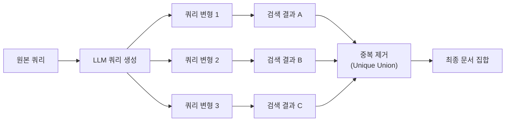
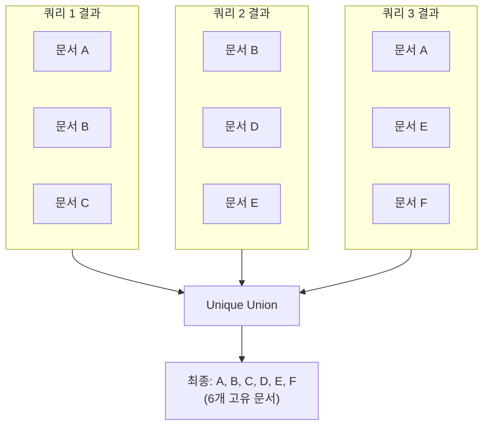
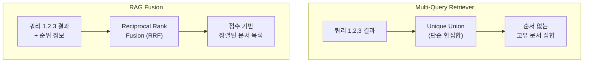

# Multi-Query Retriever — 다각도 검색

> 하나의 질문을 여러 관점으로 변환하여 검색 커버리지를 극대화하는 Multi-Query Retrieval 기법을 구현합니다.

## 개요

이 섹션에서는 사용자의 단일 쿼리를 LLM으로 여러 관점의 쿼리로 자동 변환하고, 각각으로 검색한 결과를 병합하여 더 풍부한 컨텍스트를 확보하는 Multi-Query Retriever를 구현합니다. LangChain의 `MultiQueryRetriever`를 활용해 실제 벡터 DB와 연동하고, 검색 커버리지 향상 효과를 직접 측정해 봅니다.

**선수 지식**: [13.1 쿼리 변환이 필요한 이유와 전략 개관](ch13/session1.md)에서 배운 쿼리 변환 전략의 개념, ChatPromptTemplate과 LCEL 체인 구성 방법
**학습 목표**:
- Multi-Query Retriever의 동작 원리와 내부 구조를 이해한다
- LangChain `MultiQueryRetriever`를 벡터 DB와 연동하여 구현할 수 있다
- LLM 프롬프트를 커스터마이징하여 쿼리 생성 품질을 제어할 수 있다
- 단일 쿼리 대비 Multi-Query의 검색 커버리지 향상 효과를 측정할 수 있다

## 왜 알아야 할까?

앞서 [13.1](ch13/session1.md)에서 살펴본 것처럼, 사용자의 쿼리는 종종 하나의 관점에 치우쳐 있습니다. "트랜스포머 모델의 성능이 좋은 이유는?"이라는 질문을 생각해 보세요. 이 질문 하나로 벡터 검색을 수행하면 "성능"이라는 키워드 근처의 문서만 가져옵니다. 하지만 실제로 답변에 필요한 정보는 "셀프 어텐션 메커니즘", "병렬 처리 구조", "사전 학습 전략" 등 여러 측면에 걸쳐 있죠.

Multi-Query Retriever는 이 문제를 정면으로 해결합니다. LLM이 원본 질문을 여러 관점에서 재작성하고, 각 쿼리로 독립 검색한 뒤 결과를 합칩니다. 마치 **도서관에서 한 가지 주제를 조사할 때 사서 여러 명에게 각각 다른 표현으로 질문하는 것**과 같습니다. 한 사서는 "셀프 어텐션" 섹션에서, 다른 사서는 "병렬 연산" 선반에서, 또 다른 사서는 "BERT와 GPT 비교" 코너에서 관련 자료를 찾아다 줍니다.

실무에서 Multi-Query는 구현이 간단하면서도 검색 재현율(Recall)을 눈에 띄게 끌어올리는 가성비 좋은 기법으로, 프로덕션 RAG 시스템에서 가장 널리 채택되는 Pre-retrieval 최적화 중 하나입니다.

## 핵심 개념

### 개념 1: Multi-Query의 동작 원리

> 💡 **비유**: Multi-Query는 **같은 영화를 리뷰 사이트 여러 곳에서 검색하는 것**과 비슷합니다. "인셉션 평가"라고만 검색하면 제한된 리뷰만 나오지만, "인셉션 관객 반응", "크리스토퍼 놀란 인셉션 분석", "인셉션 꿈 해석"으로 각각 검색하면 훨씬 다양하고 풍부한 정보를 얻게 됩니다.

Multi-Query Retriever의 핵심 흐름은 세 단계입니다:

1. **쿼리 생성(Query Generation)**: LLM이 원본 질문에서 N개(기본 3개)의 다른 관점 쿼리를 생성
2. **병렬 검색(Parallel Retrieval)**: 각 생성된 쿼리로 벡터 DB에서 독립적으로 검색
3. **결과 병합(Result Merging)**: 모든 검색 결과의 고유 합집합(Unique Union)을 반환

> 📊 **그림 1**: Multi-Query Retriever의 전체 처리 흐름



이 과정에서 핵심은 **중복 제거**입니다. 서로 다른 쿼리로 검색해도 같은 문서가 반복 검색될 수 있는데요, Multi-Query Retriever는 문서의 `page_content`를 기준으로 중복을 판별하여 고유한 문서만 남깁니다.

### 개념 2: LangChain의 MultiQueryRetriever 내부 구조

> 💡 **비유**: `MultiQueryRetriever`는 **팀 리더**와 같습니다. 팀 리더(Retriever)가 부하 직원(LLM)에게 "이 질문을 세 가지 방식으로 바꿔봐"라고 지시하고, 각 버전으로 자료실(VectorStore)에 검색 요청을 보낸 뒤, 모아진 자료에서 중복을 빼고 정리해서 보고하는 거죠.

LangChain의 `MultiQueryRetriever`는 내부적으로 다음 컴포넌트로 구성됩니다:

```python
from langchain.retrievers.multi_query import MultiQueryRetriever

# MultiQueryRetriever의 주요 속성
# retriever: 기본 벡터 스토어 리트리버 (BaseRetriever)
# llm_chain: 쿼리 생성용 LLM 체인 (LLMChain)
# parser_key: 출력 파서 키 (기본값: "lines")
# include_original: 원본 쿼리 포함 여부 (기본값: False)
```

가장 중요한 메서드는 두 가지입니다:

- **`generate_queries(question)`**: LLM을 호출하여 다중 쿼리를 생성
- **`unique_union(documents)`**: 검색된 문서 리스트들의 고유 합집합을 반환

`from_llm` 클래스 메서드를 통해 손쉽게 인스턴스를 생성할 수 있습니다:

```python
from langchain_openai import ChatOpenAI
from langchain.retrievers.multi_query import MultiQueryRetriever

llm = ChatOpenAI(model="gpt-4o-mini", temperature=0)

# 가장 간단한 생성 방법
multi_retriever = MultiQueryRetriever.from_llm(
    retriever=vectorstore.as_retriever(),  # 기본 리트리버
    llm=llm,                               # 쿼리 생성용 LLM
)
```

### 개념 3: 기본 프롬프트와 쿼리 생성 로직

Multi-Query Retriever의 성능은 **LLM에게 어떤 프롬프트를 주느냐**에 크게 좌우됩니다. LangChain은 다음과 같은 기본 프롬프트를 내장하고 있습니다:

```python
# LangChain의 DEFAULT_QUERY_PROMPT (내부 구현)
DEFAULT_QUERY_PROMPT = PromptTemplate(
    input_variables=["question"],
    template="""You are an AI language model assistant. Your task is
to generate 3 different versions of the given user question to retrieve
relevant documents from a vector database. By generating multiple
perspectives on the user question, your goal is to help the user
overcome some of the limitations of distance-based similarity search.
Provide these alternative questions separated by newlines.
Original question: {question}""",
)
```

이 프롬프트의 핵심 설계를 살펴보면:
- **"3 different versions"**: 기본적으로 3개의 변형 쿼리를 생성하도록 지시
- **"multiple perspectives"**: 단순 패러프레이징이 아닌 **관점 변환**을 요구
- **"distance-based similarity search"**: LLM에게 벡터 검색의 한계를 인지시켜 더 효과적인 쿼리 변환을 유도
- **"separated by newlines"**: `LineListOutputParser`가 줄바꿈 기준으로 파싱할 수 있도록 지정

생성된 쿼리를 실제로 확인하려면 로깅을 활성화하면 됩니다:

```run:python
import logging

# MultiQueryRetriever의 내부 로거 설정
logging.basicConfig()
logger = logging.getLogger("langchain.retrievers.multi_query")
logger.setLevel(logging.INFO)

print("로깅 설정 완료 — 쿼리 생성 시 INFO 레벨로 생성된 쿼리가 출력됩니다.")
print(f"로거 이름: {logger.name}")
print(f"로그 레벨: {logging.getLevelName(logger.level)}")
```

```output
로깅 설정 완료 — 쿼리 생성 시 INFO 레벨로 생성된 쿼리가 출력됩니다.
로거 이름: langchain.retrievers.multi_query
로그 레벨: INFO
```

### 개념 4: 커스텀 프롬프트 설계

기본 프롬프트는 범용적이지만, 도메인에 맞게 커스터마이징하면 훨씬 효과적인 쿼리를 생성할 수 있습니다. 예를 들어, 한국어 RAG 시스템이라면 한국어로 프롬프트를 작성하고 도메인 특화 지시를 추가할 수 있죠.

```python
from langchain_core.prompts import ChatPromptTemplate
from langchain_core.output_parsers import BaseOutputParser
from typing import List

# 커스텀 출력 파서: 줄바꿈 기준으로 쿼리 분리
class LineListOutputParser(BaseOutputParser[List[str]]):
    """줄바꿈으로 구분된 LLM 출력을 리스트로 변환합니다."""

    def parse(self, text: str) -> List[str]:
        lines = text.strip().split("\n")
        # 빈 줄과 번호 매기기 제거
        return [
            line.strip().lstrip("0123456789.-) ").strip()
            for line in lines
            if line.strip()
        ]

# 한국어 커스텀 프롬프트
CUSTOM_MULTI_QUERY_PROMPT = ChatPromptTemplate.from_messages([
    ("system", """당신은 RAG 시스템의 쿼리 변환 전문가입니다.
사용자의 질문을 벡터 데이터베이스 검색에 최적화된 5가지 다른 관점의 질문으로 변환하세요.

규칙:
1. 각 질문은 원본과 다른 키워드와 표현을 사용할 것
2. 구체적인 질문과 추상적인 질문을 섞을 것
3. 동의어, 관련 용어, 상위/하위 개념을 활용할 것
4. 각 질문을 줄바꿈으로 구분하여 출력할 것
5. 번호를 붙이지 말 것"""),
    ("human", "원본 질문: {question}"),
])

output_parser = LineListOutputParser()
```

> ⚠️ **흔한 오해**: "쿼리를 많이 생성할수록 무조건 좋다"고 생각하기 쉽지만, 실제로는 3~5개가 최적입니다. 쿼리가 너무 많으면 LLM 호출 비용이 늘어나고, 원본 의도에서 벗어나는 노이즈 쿼리가 섞여 오히려 검색 정밀도(Precision)가 떨어질 수 있습니다.

### 개념 5: 중복 제거와 결과 병합 전략

Multi-Query에서 가장 중요한 후처리는 **중복 제거(Deduplication)**입니다. 서로 다른 쿼리 변형으로 검색해도 같은 문서가 여러 번 반환되는 경우가 흔하거든요.

> 📊 **그림 2**: 중복 제거 과정



LangChain의 `MultiQueryRetriever`는 내부적으로 `unique_union` 메서드를 사용하여 `page_content` 기준으로 중복을 제거합니다:

```python
# LangChain 내부 unique_union 구현 원리 (간소화)
def unique_union(documents: list[list]) -> list:
    """여러 검색 결과 리스트에서 고유 문서만 추출합니다."""
    seen = set()
    unique_docs = []
    for doc_list in documents:
        for doc in doc_list:
            if doc.page_content not in seen:
                seen.add(doc.page_content)
                unique_docs.append(doc)
    return unique_docs
```

이 방식은 간단하고 빠르지만, 한 가지 주의할 점이 있습니다. `page_content`가 **정확히 동일한** 경우에만 중복으로 판별하기 때문에, 내용은 같지만 공백이나 포맷이 다른 경우는 중복으로 인식하지 못합니다. 일반적으로 같은 벡터 DB에서 검색하므로 이 문제가 발생할 일은 드물지만, 여러 소스를 병합하는 경우에는 추가적인 유사도 기반 중복 제거가 필요할 수 있습니다.

## 실습: 직접 해보기

이제 실제로 벡터 DB를 구축하고 Multi-Query Retriever를 적용하여 단일 쿼리 대비 검색 커버리지가 얼마나 향상되는지 측정해 보겠습니다.

### 환경 설정과 데이터 준비

```python
# 필요한 패키지 설치
# pip install langchain langchain-openai langchain-chroma chromadb

import os
from dotenv import load_dotenv

load_dotenv()  # .env 파일에서 OPENAI_API_KEY 로드

from langchain_openai import ChatOpenAI, OpenAIEmbeddings
from langchain_chroma import Chroma
from langchain_core.documents import Document

# LLM과 임베딩 모델 초기화
llm = ChatOpenAI(model="gpt-4o-mini", temperature=0)
embeddings = OpenAIEmbeddings(model="text-embedding-3-small")

# 예시 문서 생성 — RAG 시스템 관련 기술 문서 모음
documents = [
    Document(
        page_content="RAG 시스템에서 벡터 검색은 코사인 유사도를 사용하여 쿼리와 문서 간의 의미적 유사성을 측정합니다. "
        "임베딩 벡터 간 각도가 작을수록 두 텍스트의 의미가 유사하다고 판단합니다.",
        metadata={"topic": "vector_search", "section": "similarity"}
    ),
    Document(
        page_content="청킹 전략은 RAG 성능에 큰 영향을 미칩니다. 고정 크기 청킹은 구현이 간단하지만, "
        "시멘틱 청킹은 의미 단위로 분할하여 검색 품질을 높일 수 있습니다.",
        metadata={"topic": "chunking", "section": "strategy"}
    ),
    Document(
        page_content="HNSW(Hierarchical Navigable Small World) 인덱스는 그래프 기반 근사 최근접 이웃 탐색 알고리즘으로, "
        "대규모 벡터 검색에서 빠른 속도와 높은 정확도를 제공합니다.",
        metadata={"topic": "indexing", "section": "hnsw"}
    ),
    Document(
        page_content="LLM의 할루시네이션 문제를 해결하기 위해 RAG는 외부 지식 소스에서 검색한 문서를 "
        "컨텍스트로 제공합니다. 이를 통해 LLM이 사실에 기반한 답변을 생성할 수 있습니다.",
        metadata={"topic": "hallucination", "section": "solution"}
    ),
    Document(
        page_content="임베딩 모델은 텍스트를 고차원 벡터 공간에 매핑합니다. OpenAI의 text-embedding-3-small은 "
        "1536차원의 벡터를 생성하며, 비용 대비 우수한 성능을 보여줍니다.",
        metadata={"topic": "embedding", "section": "model"}
    ),
    Document(
        page_content="BM25는 키워드 매칭 기반의 전통적 검색 알고리즘으로, 벡터 검색이 놓치는 정확한 키워드 매칭에 강점이 있습니다. "
        "하이브리드 검색은 BM25와 벡터 검색을 결합하여 두 방식의 장점을 취합니다.",
        metadata={"topic": "hybrid_search", "section": "bm25"}
    ),
    Document(
        page_content="프롬프트 엔지니어링은 RAG 시스템의 생성 품질을 좌우합니다. 검색된 컨텍스트를 효과적으로 "
        "활용하도록 시스템 프롬프트를 설계하면 답변의 정확성과 관련성이 크게 향상됩니다.",
        metadata={"topic": "prompt_engineering", "section": "design"}
    ),
    Document(
        page_content="리랭킹은 초기 검색 결과를 Cross-Encoder 모델로 재평가하여 관련성 순으로 재정렬하는 기법입니다. "
        "Cohere Rerank이나 bge-reranker 같은 모델이 널리 사용됩니다.",
        metadata={"topic": "reranking", "section": "cross_encoder"}
    ),
    Document(
        page_content="RAG 평가에서 Faithfulness는 생성된 답변이 검색된 컨텍스트에 얼마나 충실한지를 측정합니다. "
        "RAGAS 프레임워크는 이를 자동으로 평가하는 메트릭을 제공합니다.",
        metadata={"topic": "evaluation", "section": "faithfulness"}
    ),
    Document(
        page_content="벡터 데이터베이스의 성능은 인덱싱 알고리즘, 차원 수, 데이터 규모에 따라 달라집니다. "
        "ChromaDB는 개발과 프로토타이핑에, Pinecone은 프로덕션 환경에 적합합니다.",
        metadata={"topic": "vector_db", "section": "comparison"}
    ),
]

# ChromaDB 벡터 스토어 생성
vectorstore = Chroma.from_documents(
    documents=documents,
    embedding=embeddings,
    collection_name="rag_demo"
)

print(f"벡터 스토어에 {vectorstore._collection.count()}개 문서 저장 완료")
```

### 단일 쿼리 vs Multi-Query 비교

```python
import logging
from langchain.retrievers.multi_query import MultiQueryRetriever

# 로깅 설정 — 생성된 쿼리를 확인할 수 있습니다
logging.basicConfig()
logging.getLogger("langchain.retrievers.multi_query").setLevel(logging.INFO)

# 1단계: 단일 쿼리로 검색
query = "RAG 시스템의 검색 성능을 높이려면 어떻게 해야 하나요?"

base_retriever = vectorstore.as_retriever(search_kwargs={"k": 3})
single_results = base_retriever.invoke(query)

print("=" * 60)
print("📌 [단일 쿼리 검색 결과]")
print(f"   검색된 문서 수: {len(single_results)}개")
for i, doc in enumerate(single_results, 1):
    print(f"\n   문서 {i} [{doc.metadata['topic']}]:")
    print(f"   {doc.page_content[:80]}...")

# 2단계: Multi-Query Retriever로 검색
multi_retriever = MultiQueryRetriever.from_llm(
    retriever=base_retriever,
    llm=llm,
)

multi_results = multi_retriever.invoke(query)

print("\n" + "=" * 60)
print("🔍 [Multi-Query 검색 결과]")
print(f"   검색된 고유 문서 수: {len(multi_results)}개")
for i, doc in enumerate(multi_results, 1):
    print(f"\n   문서 {i} [{doc.metadata['topic']}]:")
    print(f"   {doc.page_content[:80]}...")

# 커버리지 비교
single_topics = {doc.metadata["topic"] for doc in single_results}
multi_topics = {doc.metadata["topic"] for doc in multi_results}
new_topics = multi_topics - single_topics

print("\n" + "=" * 60)
print("📊 [커버리지 비교]")
print(f"   단일 쿼리 토픽: {single_topics}")
print(f"   Multi-Query 토픽: {multi_topics}")
print(f"   새로 발견된 토픽: {new_topics}")
print(f"   커버리지 향상: {len(multi_topics) - len(single_topics)}개 토픽 추가")
```

### 커스텀 프롬프트 적용

```python
from langchain_core.prompts import ChatPromptTemplate
from langchain_core.output_parsers import BaseOutputParser
from typing import List

# 커스텀 출력 파서
class LineListOutputParser(BaseOutputParser[List[str]]):
    """줄바꿈으로 구분된 LLM 출력을 리스트로 파싱합니다."""

    def parse(self, text: str) -> List[str]:
        lines = text.strip().split("\n")
        return [
            line.strip().lstrip("0123456789.-) ").strip()
            for line in lines
            if line.strip()
        ]

# 도메인 특화 한국어 프롬프트
CUSTOM_PROMPT = ChatPromptTemplate.from_messages([
    ("system", """당신은 AI/ML 기술 문서 검색을 위한 쿼리 변환 전문가입니다.
사용자의 질문을 벡터 데이터베이스에서 관련 문서를 찾기 위한 4개의 다른 관점의 질문으로 변환하세요.

변환 전략:
1. 원본 질문의 핵심 개념을 다른 기술 용어로 재표현
2. 더 구체적인 하위 질문으로 분해
3. 더 추상적인 상위 개념으로 확장
4. 실용적/구현 관점에서 재구성

출력 형식: 각 질문을 줄바꿈으로 구분하여 출력. 번호 없이."""),
    ("human", "원본 질문: {question}"),
])

output_parser = LineListOutputParser()

# LCEL 체인으로 쿼리 생성 파이프라인 구성
llm_chain = CUSTOM_PROMPT | llm | output_parser

# 커스텀 프롬프트를 적용한 MultiQueryRetriever
custom_retriever = MultiQueryRetriever(
    retriever=base_retriever,
    llm_chain=llm_chain,
    parser_key="lines",  # LineListOutputParser 사용 시
)

# include_original=True로 원본 쿼리도 포함 가능
# custom_retriever.include_original = True

custom_results = custom_retriever.invoke(query)

print(f"커스텀 Multi-Query 검색 결과: {len(custom_results)}개 고유 문서")
for i, doc in enumerate(custom_results, 1):
    print(f"  문서 {i} [{doc.metadata['topic']}]: {doc.page_content[:60]}...")
```

### 검색 커버리지 정량 측정

```run:python
# 커버리지 측정 유틸리티 함수
def measure_coverage(
    single_docs: list,
    multi_docs: list,
    all_docs: list,
) -> dict:
    """단일 쿼리 대비 Multi-Query의 커버리지 향상을 측정합니다."""
    total = len(all_docs)
    single_count = len(single_docs)
    multi_count = len(multi_docs)

    # 토픽 커버리지
    all_topics = {doc.metadata["topic"] for doc in all_docs}
    single_topics = {doc.metadata["topic"] for doc in single_docs}
    multi_topics = {doc.metadata["topic"] for doc in multi_docs}

    return {
        "전체 문서 수": total,
        "단일 쿼리 검색 수": single_count,
        "Multi-Query 검색 수": multi_count,
        "검색량 증가율": f"{((multi_count - single_count) / single_count) * 100:.1f}%",
        "전체 토픽 수": len(all_topics),
        "단일 쿼리 토픽 커버리지": f"{len(single_topics)}/{len(all_topics)} ({len(single_topics)/len(all_topics)*100:.0f}%)",
        "Multi-Query 토픽 커버리지": f"{len(multi_topics)}/{len(all_topics)} ({len(multi_topics)/len(all_topics)*100:.0f}%)",
    }

# 시뮬레이션 데이터로 측정 예시
from types import SimpleNamespace

# 시뮬레이션: 단일 쿼리가 3개, Multi-Query가 6개 문서를 검색한 상황
single_sim = [
    SimpleNamespace(metadata={"topic": "vector_search"}),
    SimpleNamespace(metadata={"topic": "embedding"}),
    SimpleNamespace(metadata={"topic": "vector_db"}),
]
multi_sim = [
    SimpleNamespace(metadata={"topic": "vector_search"}),
    SimpleNamespace(metadata={"topic": "embedding"}),
    SimpleNamespace(metadata={"topic": "vector_db"}),
    SimpleNamespace(metadata={"topic": "reranking"}),
    SimpleNamespace(metadata={"topic": "hybrid_search"}),
    SimpleNamespace(metadata={"topic": "chunking"}),
]
all_sim = [SimpleNamespace(metadata={"topic": t}) for t in [
    "vector_search", "chunking", "indexing", "hallucination",
    "embedding", "hybrid_search", "prompt_engineering",
    "reranking", "evaluation", "vector_db"
]]

metrics = measure_coverage(single_sim, multi_sim, all_sim)
for key, value in metrics.items():
    print(f"  {key}: {value}")
```

```output
  전체 문서 수: 10
  단일 쿼리 검색 수: 3
  Multi-Query 검색 수: 6
  검색량 증가율: 100.0%
  전체 토픽 수: 10
  단일 쿼리 토픽 커버리지: 3/10 (30%)
  Multi-Query 토픽 커버리지: 6/10 (60%)
```

> 🔥 **실무 팁**: 프로덕션 환경에서는 `include_original=True`를 설정하여 원본 쿼리도 검색에 포함하는 것이 안전합니다. LLM이 생성한 변형 쿼리가 원본 의도를 벗어나는 경우에도 원본 쿼리의 결과가 보장되거든요.

## 더 깊이 알아보기

### Multi-Query의 기원: 정보 검색의 오랜 숙제

Multi-Query 기법의 뿌리는 사실 LLM 이전으로 거슬러 올라갑니다. 정보 검색(Information Retrieval) 분야에서는 1990년대부터 **쿼리 확장(Query Expansion)**이라는 개념이 연구되었습니다. 사용자의 검색어에 동의어나 관련 용어를 자동으로 추가하여 검색 결과를 개선하는 기법이었죠.

2005년 구글 학술 검색 팀은 "의료 정보 검색에서 전문 용어와 일상 용어 사이의 갭"이 검색 실패의 주요 원인임을 밝혔습니다. 환자가 "머리가 띵하다"라고 검색하면 "편두통(migraine)"이라는 전문 용어로 작성된 의학 문서를 찾기 어려웠던 거죠. 이것이 바로 **어휘 불일치(Vocabulary Mismatch)** 문제인데, 앞서 [13.1](ch13/session1.md)에서 배운 쿼리 변환이 필요한 네 가지 이유 중 하나입니다.

LLM의 등장은 이 오래된 문제에 혁명적 해법을 제시했습니다. 과거에는 WordNet 같은 동의어 사전이나 통계적 방법으로 쿼리를 확장했지만, LLM은 문맥을 이해하고 **진짜 다른 관점**에서 질문을 재구성할 수 있게 되었거든요. LangChain의 `MultiQueryRetriever`는 2023년 초에 도입되었으며, Harrison Chase가 "RAG from Scratch" 시리즈에서 이 기법을 소개하면서 RAG 커뮤니티에서 빠르게 표준 패턴으로 자리잡았습니다.

### RAG Fusion과의 관계

Multi-Query와 자주 비교되는 기법이 **RAG Fusion**입니다. RAG Fusion은 Multi-Query와 동일하게 여러 쿼리를 생성하지만, 결과를 단순 합집합이 아닌 **Reciprocal Rank Fusion(RRF)**으로 병합합니다. RRF는 각 쿼리에서의 순위를 종합하여 최종 순위를 계산하는 방식으로, 여러 쿼리에서 공통으로 상위에 랭크된 문서에 더 높은 점수를 부여합니다.

> 📊 **그림 3**: Multi-Query vs RAG Fusion 결과 병합 방식 비교



Multi-Query는 구현이 간단하고 "더 많은 문서를 찾는 것"에 초점을 맞추는 반면, RAG Fusion은 "더 관련성 높은 순서로 정렬하는 것"까지 다룹니다. 실무에서는 두 기법을 결합하여 사용하기도 합니다.

## 흔한 오해와 팁

> ⚠️ **흔한 오해**: "Multi-Query를 쓰면 항상 검색 결과가 좋아진다"는 오해가 있습니다. 실제로는 질문이 매우 구체적이고 명확한 경우(예: "Python 3.12의 GIL 변경사항"), 단일 쿼리가 더 정확할 수 있습니다. Multi-Query는 질문이 모호하거나 여러 측면을 포괄해야 할 때 진가를 발휘합니다. 불필요하게 사용하면 LLM 호출 비용만 늘어나고 검색 지연이 증가합니다.

> 💡 **알고 계셨나요?**: LangChain의 `MultiQueryRetriever` 소스 코드를 보면, `generate_queries` 메서드는 기본적으로 `LineListOutputParser`라는 단순 파서를 사용합니다. 이 파서는 LLM 출력을 줄바꿈(`\n`) 기준으로 분리하는 것이 전부입니다. 그래서 가끔 LLM이 "1. 질문..." 형식으로 번호를 붙이면 번호까지 쿼리에 포함되는 문제가 발생할 수 있습니다. 커스텀 파서에서 번호 제거 로직을 추가하는 것이 좋습니다.

> 🔥 **실무 팁**: Multi-Query의 LLM 호출은 검색마다 발생하므로, 비용과 지연시간이 우려된다면 두 가지 전략이 있습니다. 첫째, `temperature=0`으로 설정하면 동일 쿼리에 대해 동일한 변형이 생성되어 **캐싱**이 가능합니다. 둘째, 쿼리 생성에는 비용이 낮은 경량 모델(예: `gpt-4o-mini`)을 사용하고, 최종 답변 생성에만 고성능 모델을 사용하는 **모델 분리 전략**이 효과적입니다.

## 핵심 정리

| 개념 | 설명 |
|------|------|
| Multi-Query Retriever | LLM으로 하나의 쿼리를 여러 관점으로 변환하고, 각각의 검색 결과를 합쳐 커버리지를 높이는 기법 |
| `from_llm()` | LLM과 기본 Retriever만으로 MultiQueryRetriever를 생성하는 클래스 메서드 |
| DEFAULT_QUERY_PROMPT | "3개의 다른 관점"으로 쿼리를 생성하도록 지시하는 LangChain 내장 프롬프트 |
| Unique Union | `page_content` 기준으로 중복을 제거하여 고유 문서만 남기는 결과 병합 방식 |
| `include_original` | 원본 쿼리도 검색에 포함할지 결정하는 옵션 (기본값 `False`, 실무에서는 `True` 권장) |
| LineListOutputParser | LLM 출력을 줄바꿈 기준으로 파싱하는 기본 출력 파서 |
| 커스텀 프롬프트 | 도메인, 언어, 쿼리 수를 맞춤 설정하여 쿼리 생성 품질을 높이는 방법 |
| 검색 커버리지 | Multi-Query 적용 시 단일 쿼리 대비 검색되는 고유 문서/토픽의 비율 |

## 다음 섹션 미리보기

이번 섹션에서 Multi-Query가 "여러 관점에서 같은 질문을 재구성"하는 기법이라면, 다음 섹션에서 배울 **HyDE(Hypothetical Document Embeddings)**는 완전히 다른 접근을 취합니다. HyDE는 LLM에게 "가설적 답변"을 먼저 생성하게 하고, 그 답변의 임베딩으로 검색하는 기법입니다. 쿼리가 짧고 질문 형태인 반면 문서는 길고 서술적이라는 **쿼리-문서 간 임베딩 공간의 비대칭성**을 해결하는 독창적인 방법인데요, 어떻게 "가짜 답변"이 진짜 문서를 더 잘 찾아내는지 함께 살펴보겠습니다.

## 참고 자료

- [LangChain MultiQueryRetriever 공식 How-to 가이드](https://python.langchain.com/docs/how_to/MultiQueryRetriever/) - MultiQueryRetriever의 기본 사용법과 커스텀 프롬프트 예제를 공식 문서에서 확인할 수 있습니다
- [LangChain RAG from Scratch GitHub 리포지토리](https://github.com/langchain-ai/rag-from-scratch) - Harrison Chase의 RAG 기초부터 Multi-Query까지 단계별 구현 노트북 모음
- [NirDiamant/RAG_Techniques — Query Transformations](https://github.com/NirDiamant/RAG_Techniques/blob/main/all_rag_techniques/query_transformations.ipynb) - Multi-Query를 포함한 다양한 쿼리 변환 기법의 구현 예제
- [MultiQueryRetriever API 레퍼런스](https://python.langchain.com/api_reference/langchain/retrievers/langchain.retrievers.multi_query.MultiQueryRetriever.html) - 클래스 속성, 메서드, 파라미터의 상세 API 문서
- [Retrieval-Augmented Generation for Knowledge-Intensive NLP Tasks](https://arxiv.org/abs/2005.11401) - RAG의 원본 논문. Multi-Query가 해결하고자 하는 검색 품질 문제의 이론적 배경

---
### 🔗 Related Sessions
- [page_content](../03-문서-로딩과-파싱-다양한-소스에서-데이터-수집/01-문서-로딩-기초-langchain-document-loaders.md) (prerequisite)
- [chatprompttemplate](../08-기본-rag-파이프라인-구축-langchain으로-첫-rag-앱-만들기/01-langchain-v1-핵심-개념과-설정.md) (prerequisite)
- [stroutputparser](../08-기본-rag-파이프라인-구축-langchain으로-첫-rag-앱-만들기/01-langchain-v1-핵심-개념과-설정.md) (prerequisite)
- [query_transformation](../13-쿼리-변환-기법-multi-query-hyde-step-back-prompting/01-쿼리-변환이-필요한-이유와-전략-개관.md) (prerequisite)
