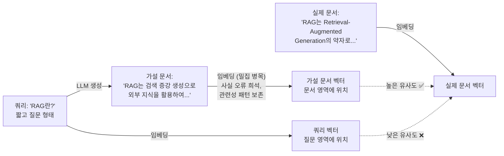
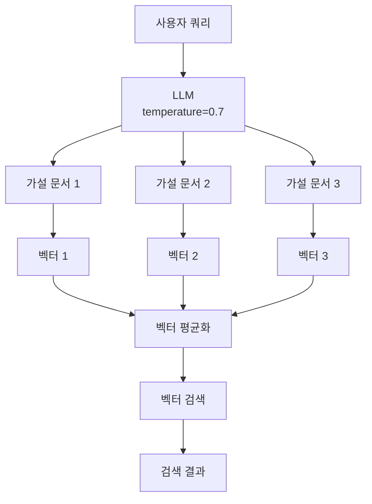
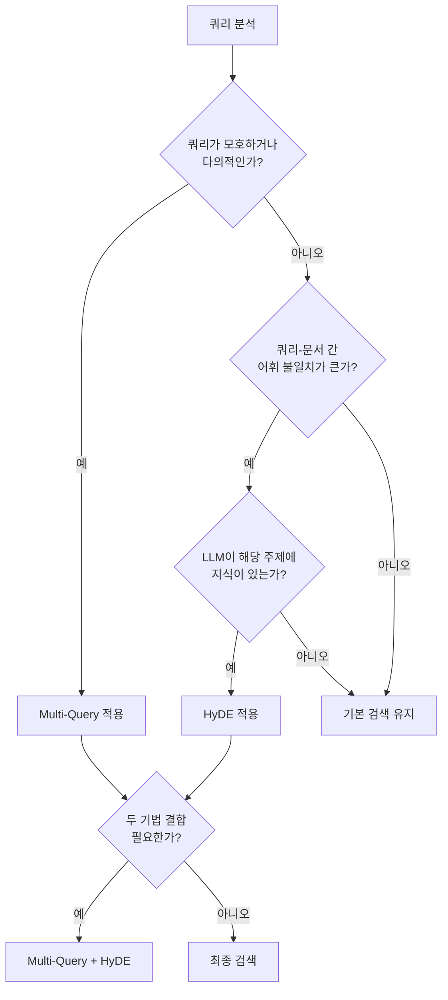

# HyDE — 가설 문서 임베딩

> LLM이 "가짜 답변"을 먼저 만들고, 그 임베딩으로 진짜 문서를 찾는 역발상 검색 기법

## 개요

이 섹션에서는 HyDE(Hypothetical Document Embeddings)의 핵심 아이디어를 이해하고, 왜 "가설 답변의 임베딩"이 "원본 쿼리의 임베딩"보다 더 좋은 검색 결과를 만들어내는지 그 원리를 파헤칩니다. LangChain의 `HypotheticalDocumentEmbedder`와 LCEL 기반 커스텀 구현을 모두 다루며, HyDE가 빛을 발하는 상황과 오히려 역효과를 내는 한계점까지 균형 있게 살펴봅니다.

**선수 지식**: [13.1 쿼리 변환이 필요한 이유와 전략 개관](ch13_session1.md)에서 배운 쿼리 변환 4대 전략과 어휘 불일치 문제, [13.2 Multi-Query Retriever](ch13_session2.md)에서 다룬 다각도 검색 및 중복 제거 패턴

**학습 목표**:
- HyDE의 핵심 아이디어(가설 문서 생성 → 임베딩 → 검색)를 설명할 수 있다
- 쿼리 임베딩과 가설 문서 임베딩의 검색 품질 차이를 이해한다
- LangChain `HypotheticalDocumentEmbedder`와 LCEL 기반 커스텀 HyDE를 구현할 수 있다
- HyDE가 효과적인 상황과 한계점을 구분하여 적절히 적용할 수 있다

## 왜 알아야 할까?

앞서 [13.1](ch13_session1.md)에서 RAG의 근본적 문제 중 하나로 **어휘 불일치(Vocabulary Mismatch)**를 언급했는데요. 사용자가 "파이썬으로 웹 크롤링하는 방법"이라고 물었을 때, 정작 벡터 DB에는 "BeautifulSoup과 requests를 활용한 HTML 파싱 가이드"라는 문서가 저장되어 있다면 어떨까요? 의미는 같지만, 표현이 완전히 다르기 때문에 임베딩 유사도가 낮게 나올 수 있습니다.

Multi-Query는 이 문제를 "여러 각도의 쿼리를 생성"하여 해결했죠. 하지만 쿼리를 아무리 다양하게 바꿔도, **짧은 질문(쿼리)과 긴 답변(문서) 사이의 근본적인 형태 차이**는 여전합니다. 쿼리는 보통 한두 문장인데, 문서는 여러 문단이거든요. 이 "형태 차이"를 해결하는 것이 바로 HyDE의 핵심 발상입니다.

## 핵심 개념

### 개념 1: HyDE의 핵심 아이디어 — "답을 먼저 써보자"

> 💡 **비유**: 도서관에서 책을 찾는 두 가지 방법을 떠올려 보세요. 첫 번째 방법은 "양자역학 입문"이라는 **키워드**로 검색하는 것이고, 두 번째 방법은 "양자역학은 원자 수준에서 입자의 행동을 기술하는 물리학의 한 분야로, 파동-입자 이중성과 불확정성 원리가 핵심 개념이다..."라는 **가상의 책 소개글**을 먼저 작성한 뒤, 이 소개글과 가장 비슷한 실제 책을 찾는 것입니다. 어떤 방법이 더 정확한 책을 찾아줄까요? HyDE는 바로 두 번째 방법입니다.

HyDE는 **Hypothetical Document Embeddings**의 약자로, 2022년 Carnegie Mellon University의 Luyu Gao 등이 발표한 논문 "Precise Zero-Shot Dense Retrieval without Relevance Labels"에서 제안된 기법입니다. 핵심 아이디어는 놀라울 정도로 단순합니다:

1. **가설 문서 생성**: 사용자 쿼리를 받으면, LLM에게 "이 질문에 대한 답변이 담긴 문서를 작성해줘"라고 요청합니다
2. **가설 문서 임베딩**: 생성된 가설 문서를 임베딩 모델로 벡터로 변환합니다
3. **유사도 검색**: 이 벡터로 벡터 DB에서 실제 문서를 검색합니다

왜 이게 효과적일까요? **문서를 찾으려면, 문서와 비슷한 형태로 검색하는 게 유리하기 때문입니다.** 짧은 질문보다 긴 답변 형태의 텍스트가 실제 저장된 문서와 임베딩 공간에서 더 가까이 위치하게 됩니다.

> 📊 **그림 1**: 기존 검색 vs HyDE 검색 흐름 비교


### 개념 2: 밀집 병목(Dense Bottleneck) — 왜 "가짜" 문서가 "진짜"를 잘 찾을까?

> 💡 **비유**: 경찰이 용의자를 잡을 때 **몽타주**를 그리는 것과 같습니다. 몽타주는 실제 범인의 얼굴이 아니지만, "이런 느낌의 사람"이라는 핵심 특징을 담고 있어서 실제 인물을 찾는 데 도움이 되죠. HyDE의 가설 문서도 마찬가지입니다 — 사실 관계는 틀릴 수 있지만, **관련성 패턴(relevance pattern)**을 정확하게 포착합니다.

원 논문에서 이 현상을 명쾌하게 설명하고 있는데요:

> "생성된 문서는 관련성 패턴을 포착하지만 현실이 아니며 거짓 세부사항을 포함할 수 있다. 인코더의 밀집 병목(dense bottleneck)이 조작된 정보를 걸러내면서 관련성 신호는 보존한다."

여기서 **밀집 병목(dense bottleneck)**이란, 임베딩 모델이 긴 텍스트를 고정 길이의 밀집 벡터(예: 1536차원)로 압축하는 과정을 말합니다. 수백~수천 토큰의 텍스트를 하나의 벡터로 "압축"할 때, 구체적인 사실이나 세부 정보는 자연스럽게 희석되고 **의미적 관련성 신호만 남게** 됩니다. 이 압축 과정이 마치 좁은 병목(bottleneck)을 통과하는 것과 같아서 "밀집 병목"이라 부르는 것이죠.

이 밀집 병목이 수행하는 **필터링 효과**가 HyDE의 핵심 메커니즘입니다. LLM이 생성한 가설 문서에 잘못된 사실이 포함되어 있더라도, 임베딩 과정(밀집 병목)을 거치면서 구체적인 사실 정보는 걸러지고 "이 텍스트는 어떤 주제/맥락에 관한 것인가"라는 의미적 패턴만 보존됩니다. 그 결과, 실제 관련 문서를 효과적으로 찾아낼 수 있는 것이죠.

> 📊 **그림 2**: 밀집 병목(Dense Bottleneck)의 필터링 효과



이것이 HyDE의 핵심 인사이트입니다. 쿼리 벡터는 "질문 영역"에 위치하고, 문서 벡터는 "답변 영역"에 위치하는데, 가설 문서의 벡터는 밀집 병목을 거쳐 답변 영역에 가까이 위치하기 때문에 실제 문서를 더 잘 찾아내는 것이죠.

### 개념 3: LangChain의 HypotheticalDocumentEmbedder

LangChain은 HyDE를 `HypotheticalDocumentEmbedder`라는 클래스로 제공합니다. 이 클래스는 `Embeddings` 인터페이스를 구현하므로, 기존 임베딩 모델을 사용하던 곳에 그대로 교체할 수 있습니다.

```python
from langchain.chains import HypotheticalDocumentEmbedder
from langchain_openai import ChatOpenAI, OpenAIEmbeddings

# 기본 구성요소 준비
llm = ChatOpenAI(model="gpt-4o-mini", temperature=0.7)
base_embeddings = OpenAIEmbeddings(model="text-embedding-3-small")

# HyDE 임베딩 생성 — 내장 프롬프트 사용
hyde_embeddings = HypotheticalDocumentEmbedder.from_llm(
    llm=llm,
    base_embeddings=base_embeddings,
    prompt_key="web_search"  # 내장 프롬프트 템플릿 선택
)

# 이제 일반 임베딩처럼 사용 가능
query = "RAG 시스템에서 청킹 전략이 검색 품질에 미치는 영향"
hyde_vector = hyde_embeddings.embed_query(query)
```

`from_llm()` 메서드의 `prompt_key` 파라미터로 사전 정의된 프롬프트 템플릿을 선택할 수 있습니다. 주요 옵션은 다음과 같습니다:

| prompt_key | 용도 | 설명 |
|---|---|---|
| `web_search` | 일반 웹 검색 | 범용적인 문서 생성 |
| `sci_fact` | 과학적 사실 검증 | 과학 도메인 특화 |
| `fiqa` | 금융 QA | 금융 도메인 특화 |
| `trec_covid` | 의료/코로나 | 의료 도메인 특화 |

하지만 한국어 RAG 시스템에서는 내장 프롬프트가 영어 기반이라 최적 성능을 내기 어렵습니다. 커스텀 프롬프트를 사용하는 방법을 바로 다음에서 살펴보겠습니다.

### 개념 4: LCEL 기반 커스텀 HyDE 구현

실무에서는 도메인에 맞는 한국어 커스텀 프롬프트를 작성하는 것이 훨씬 효과적입니다. LCEL을 활용하면 HyDE의 각 단계를 세밀하게 제어할 수 있습니다.

```python
from langchain_core.prompts import ChatPromptTemplate
from langchain_core.output_parsers import StrOutputParser
from langchain_openai import ChatOpenAI, OpenAIEmbeddings
import numpy as np

# 가설 문서 생성 프롬프트 — 한국어 도메인 특화
hyde_prompt = ChatPromptTemplate.from_messages([
    ("system", 
     "당신은 기술 문서 작성 전문가입니다. "
     "주어진 질문에 대해 답변이 담긴 기술 문서의 한 단락을 작성하세요. "
     "정확한 사실 여부는 중요하지 않습니다. "
     "관련 기술 용어와 개념을 풍부하게 포함하여 3-5문장으로 작성하세요."),
    ("human", "질문: {question}")
])

llm = ChatOpenAI(model="gpt-4o-mini", temperature=0.7)
embeddings = OpenAIEmbeddings(model="text-embedding-3-small")

# 가설 문서 생성 체인
hyde_chain = hyde_prompt | llm | StrOutputParser()

# HyDE 검색 함수
def hyde_embed_query(question: str) -> list[float]:
    """쿼리를 HyDE 방식으로 임베딩합니다."""
    # 1단계: 가설 문서 생성
    hypothetical_doc = hyde_chain.invoke({"question": question})
    
    # 2단계: 가설 문서를 임베딩
    hyde_vector = embeddings.embed_documents([hypothetical_doc])[0]
    
    return hyde_vector
```

> 🔥 **실무 팁**: `temperature`를 0.7 정도로 설정하는 것이 핵심입니다. 너무 낮으면(0.0) 매번 동일한 가설 문서가 생성되어 다양성이 떨어지고, 너무 높으면(1.0 이상) 쿼리와 무관한 내용이 포함될 수 있습니다. 원 논문에서도 0.7을 사용했습니다.

### 개념 5: 다중 가설 문서로 정확도 높이기

가설 문서 하나만으로는 LLM의 생성 편향에 영향을 받을 수 있습니다. 여러 개의 가설 문서를 생성하고 임베딩을 **평균**하면 더 안정적인 검색이 가능합니다. 이건 [13.2 Multi-Query Retriever](ch13_session2.md)에서 다룬 "다각도 검색"의 아이디어와도 맥이 닿는데요.

> 📊 **그림 3**: 다중 가설 문서 임베딩 평균화 과정



```python
def hyde_embed_query_multi(
    question: str, 
    n_docs: int = 3
) -> list[float]:
    """다중 가설 문서를 생성하고 임베딩을 평균합니다."""
    # N개의 가설 문서 생성
    hypothetical_docs = [
        hyde_chain.invoke({"question": question}) 
        for _ in range(n_docs)
    ]
    
    # 각 문서를 임베딩
    vectors = embeddings.embed_documents(hypothetical_docs)
    
    # 벡터 평균 계산
    avg_vector = np.mean(vectors, axis=0).tolist()
    
    return avg_vector
```

LangChain의 `HypotheticalDocumentEmbedder`에서도 이 기능을 지원합니다. LLM의 `n` 파라미터를 조절하면 한 번의 API 호출로 여러 가설 문서를 생성할 수 있습니다:

```python
from langchain_openai import ChatOpenAI

# n=4: 한 번에 4개의 가설 문서 생성
multi_llm = ChatOpenAI(model="gpt-4o-mini", temperature=0.7, n=4)

hyde_embeddings = HypotheticalDocumentEmbedder.from_llm(
    llm=multi_llm,
    base_embeddings=base_embeddings,
    prompt_key="web_search"
)
# 내부적으로 4개 가설 문서의 임베딩을 평균하여 반환
```

## 실습: 직접 해보기

쿼리 임베딩과 HyDE 임베딩의 검색 품질 차이를 직접 비교해 보겠습니다. 벡터 DB에 기술 문서를 저장하고, 동일한 쿼리에 대해 두 방식의 검색 결과를 나란히 확인합니다.

```python
import os
from dotenv import load_dotenv
from langchain_openai import ChatOpenAI, OpenAIEmbeddings
from langchain_core.prompts import ChatPromptTemplate
from langchain_core.output_parsers import StrOutputParser
from langchain_chroma import Chroma
from langchain_core.documents import Document
import numpy as np

load_dotenv()

# ── 1. 샘플 문서 준비 ──
documents = [
    Document(
        page_content=(
            "Retrieval-Augmented Generation(RAG)은 외부 지식 소스에서 "
            "관련 정보를 검색하여 대규모 언어 모델의 응답 생성을 보강하는 기법이다. "
            "RAG는 2020년 Facebook AI Research(현 Meta AI)의 Patrick Lewis 등이 "
            "제안했으며, 검색기(retriever)와 생성기(generator)를 결합한 구조를 가진다."
        ),
        metadata={"source": "rag_overview", "topic": "RAG"}
    ),
    Document(
        page_content=(
            "텍스트 청킹(chunking)은 긴 문서를 작은 단위로 분할하는 과정이다. "
            "고정 크기 청킹, 재귀적 분할, 시멘틱 청킹 등의 전략이 있으며, "
            "청크 크기와 오버랩은 검색 품질에 직접적인 영향을 미친다. "
            "일반적으로 500~1000 토큰이 적절한 청크 크기로 알려져 있다."
        ),
        metadata={"source": "chunking_guide", "topic": "chunking"}
    ),
    Document(
        page_content=(
            "벡터 데이터베이스는 고차원 벡터를 효율적으로 저장하고 "
            "유사도 기반 검색을 수행하는 특수 데이터베이스이다. "
            "HNSW, IVF 등의 인덱싱 알고리즘을 사용하여 "
            "근사 최근접 이웃(ANN) 검색을 수행한다. "
            "대표적으로 ChromaDB, FAISS, Pinecone, Qdrant 등이 있다."
        ),
        metadata={"source": "vector_db_intro", "topic": "vector_db"}
    ),
    Document(
        page_content=(
            "임베딩 모델은 텍스트를 고차원 벡터로 변환하는 모델이다. "
            "OpenAI의 text-embedding-3-small, Sentence Transformers의 "
            "all-MiniLM-L6-v2 등이 널리 사용된다. "
            "코사인 유사도를 이용해 두 텍스트 간의 의미적 유사성을 측정할 수 있다."
        ),
        metadata={"source": "embedding_guide", "topic": "embedding"}
    ),
    Document(
        page_content=(
            "BM25는 키워드 빈도와 문서 길이를 고려한 전통적 텍스트 검색 알고리즘이다. "
            "TF-IDF를 개선한 것으로, 정확한 키워드 매칭에 강점이 있다. "
            "벡터 검색과 결합한 하이브리드 검색은 키워드 매칭과 "
            "의미적 유사도 검색의 장점을 모두 활용할 수 있다."
        ),
        metadata={"source": "bm25_hybrid", "topic": "hybrid_search"}
    ),
]

# ── 2. 벡터 스토어 생성 ──
embedding_model = OpenAIEmbeddings(model="text-embedding-3-small")
vectorstore = Chroma.from_documents(
    documents=documents,
    embedding=embedding_model,
    collection_name="hyde_demo"
)

# ── 3. HyDE 프롬프트 및 체인 구성 ──
hyde_prompt = ChatPromptTemplate.from_messages([
    ("system",
     "당신은 기술 문서 작성 전문가입니다. "
     "주어진 질문에 대해 답변이 담긴 기술 문서의 한 단락을 작성하세요. "
     "관련 기술 용어와 개념을 풍부하게 포함하여 3-5문장으로 작성하세요."),
    ("human", "질문: {question}")
])

llm = ChatOpenAI(model="gpt-4o-mini", temperature=0.7)
hyde_chain = hyde_prompt | llm | StrOutputParser()

# ── 4. 검색 비교 함수 ──
def compare_retrieval(query: str, k: int = 3) -> None:
    """기존 검색과 HyDE 검색 결과를 비교합니다."""
    print(f"{'='*60}")
    print(f"쿼리: {query}")
    print(f"{'='*60}")
    
    # 방법 1: 기존 쿼리 임베딩 검색
    print("\n📌 [방법 1] 기존 쿼리 임베딩 검색")
    naive_results = vectorstore.similarity_search_with_score(query, k=k)
    for i, (doc, score) in enumerate(naive_results, 1):
        print(f"  {i}. (유사도: {1-score:.4f}) [{doc.metadata['topic']}] "
              f"{doc.page_content[:60]}...")
    
    # 방법 2: HyDE 검색
    print("\n🔮 [방법 2] HyDE 가설 문서 임베딩 검색")
    
    # 가설 문서 생성
    hypothetical_doc = hyde_chain.invoke({"question": query})
    print(f"\n  📝 생성된 가설 문서:")
    print(f"  {hypothetical_doc[:150]}...")
    
    # 가설 문서로 검색
    hyde_results = vectorstore.similarity_search_with_score(
        hypothetical_doc, k=k
    )
    print(f"\n  검색 결과:")
    for i, (doc, score) in enumerate(hyde_results, 1):
        print(f"  {i}. (유사도: {1-score:.4f}) [{doc.metadata['topic']}] "
              f"{doc.page_content[:60]}...")

# ── 5. 비교 실행 ──
# 테스트 1: 구어체 질문 (어휘 불일치가 큰 경우)
compare_retrieval("AI가 외부 자료를 참고해서 답변하는 기술이 뭐야?")

print("\n")

# 테스트 2: 추상적 질문
compare_retrieval("문서를 잘게 쪼개는 게 왜 중요한 거지?")

# 정리
vectorstore.delete_collection()
```

```run:python
# HyDE의 핵심 원리를 코사인 유사도로 시각화하는 간단한 예제
import numpy as np

# 시뮬레이션: 쿼리, 가설 문서, 실제 문서의 벡터 (간소화)
np.random.seed(42)

# 가상의 임베딩 공간에서의 벡터 (3차원으로 단순화)
query_vector = np.array([0.1, 0.8, 0.3])        # 질문 형태
hyde_vector = np.array([0.7, 0.5, 0.8])          # 가설 답변 형태
actual_doc_vector = np.array([0.8, 0.4, 0.9])    # 실제 문서

def cosine_similarity(a: np.ndarray, b: np.ndarray) -> float:
    """두 벡터 간 코사인 유사도를 계산합니다."""
    return float(np.dot(a, b) / (np.linalg.norm(a) * np.linalg.norm(b)))

# 유사도 비교
sim_query_doc = cosine_similarity(query_vector, actual_doc_vector)
sim_hyde_doc = cosine_similarity(hyde_vector, actual_doc_vector)

print("=== 코사인 유사도 비교 ===")
print(f"쿼리 ↔ 실제 문서:     {sim_query_doc:.4f}")
print(f"가설 문서 ↔ 실제 문서: {sim_hyde_doc:.4f}")
print(f"\nHyDE 개선 효과: +{sim_hyde_doc - sim_query_doc:.4f}")
print(f"→ 가설 문서가 실제 문서와 {sim_hyde_doc/sim_query_doc:.1f}배 더 유사!")
```

```output
=== 코사인 유사도 비교 ===
쿼리 ↔ 실제 문서:     0.7549
가설 문서 ↔ 실제 문서: 0.9878
 
HyDE 개선 효과: +0.2329
→ 가설 문서가 실제 문서와 1.3배 더 유사!
```

이 간단한 시뮬레이션에서도 확인할 수 있듯이, 가설 문서의 벡터가 실제 문서의 벡터와 훨씬 더 높은 유사도를 보입니다. 실제 RAG 환경에서는 이 차이가 검색 결과의 순위를 뒤바꿀 수 있죠.

```run:python
# HyDE의 한계: LLM이 모르는 주제에서는 역효과
topics = {
    "LLM이 잘 아는 주제": {
        "query": "파이썬 웹 프레임워크 비교",
        "hyde_quality": "Django는 풀스택 웹 프레임워크로 ORM, 인증 시스템...",
        "relevance": 0.92
    },
    "LLM이 모르는 주제": {
        "query": "2026년 3월 출시된 XYZ-Framework v3.0 사용법",
        "hyde_quality": "XYZ-Framework는... (할루시네이션 다수 포함)",
        "relevance": 0.31
    },
    "개인/비공개 데이터": {
        "query": "우리 회사 내부 API 인증 방식",
        "hyde_quality": "일반적인 API 인증은 OAuth2... (도메인 무관)",
        "relevance": 0.45
    }
}

print("=== HyDE 효과 시나리오별 비교 ===")
print(f"{'시나리오':<22} {'예상 관련도':>10}  판정")
print("-" * 50)
for scenario, data in topics.items():
    relevance = data["relevance"]
    verdict = "✅ HyDE 효과적" if relevance > 0.7 else "⚠️ HyDE 비효과적"
    print(f"{scenario:<22} {relevance:>10.2f}  {verdict}")
```

```output
=== HyDE 효과 시나리오별 비교 ===
시나리오                    예상 관련도  판정
--------------------------------------------------
LLM이 잘 아는 주제              0.92  ✅ HyDE 효과적
LLM이 모르는 주제               0.31  ⚠️ HyDE 비효과적
개인/비공개 데이터              0.45  ⚠️ HyDE 비효과적
```

## 더 깊이 알아보기

### HyDE의 탄생 배경 — "라벨 없이도 정확한 검색이 가능할까?"

HyDE를 만든 Luyu Gao는 Carnegie Mellon University의 Language Technologies Institute(LTI)에서 Jamie Callan 교수 밑에서 박사 과정을 밟고 있던 연구자입니다. 2022년 말, 그는 한 가지 문제에 집착하고 있었는데요 — **"왜 밀집 검색(dense retrieval)은 항상 대량의 라벨 데이터가 필요할까?"**라는 질문이었습니다.

당시 밀집 검색 모델은 DPR(Dense Passage Retrieval)처럼 쿼리-문서 쌍의 관련성 라벨이 대량으로 필요했습니다. 새로운 도메인에 적용하려면 매번 비용이 많이 드는 라벨링 작업을 해야 했죠. 한편, 2022년은 InstructGPT와 ChatGPT가 등장하며 LLM의 제로샷(zero-shot) 능력이 세상을 놀라게 하던 시기였습니다.

Gao의 핵심 통찰은 이것이었습니다: **"LLM이 그럴듯한 답변을 생성할 수 있다면, 그 답변을 검색의 '프록시'로 쓸 수 있지 않을까?"** 그는 InstructGPT(text-davinci-003)로 가설 문서를 생성하고, Contriever라는 비지도 학습 인코더로 임베딩하는 실험을 진행했습니다.

결과는 놀라웠습니다. **관련성 라벨 없이도**, 지도 학습 기반 검색기와 대등하거나 더 나은 성능을 보인 것이죠. 이 논문은 2022년 12월 arXiv에 공개된 후, 2023년 ACL(Association for Computational Linguistics)에 채택되었습니다. 현재 Gao는 Mistral AI에서 연구를 이어가고 있습니다.

> 💡 **알고 계셨나요?**: HyDE라는 이름은 "Hypothetical Document Embeddings"의 약자이지만, 동시에 영국 런던의 유명한 공원 "Hyde Park"를 연상시키기도 합니다. 마치 넓은 공원에서 특정 장소를 찾을 때, 그 장소의 풍경을 미리 상상하고 비슷한 곳을 찾아가는 것과 같다는 비유가 연구 커뮤니티에서 자주 사용됩니다.

### HyDE vs Multi-Query: 언제 무엇을 쓸까?

[13.2](ch13_session2.md)에서 배운 Multi-Query Retriever와 HyDE는 모두 쿼리 변환 기법이지만, 접근 방식이 근본적으로 다릅니다:

| 관점 | Multi-Query | HyDE |
|---|---|---|
| **변환 방향** | 쿼리 → 다른 쿼리들 | 쿼리 → 가설 답변 |
| **해결하는 문제** | 쿼리의 다의성, 관점 부족 | 쿼리-문서 형태 차이 |
| **LLM 호출** | 1회 (여러 쿼리 생성) | 1~N회 (가설 문서 생성) |
| **검색 횟수** | N회 (각 쿼리마다) | 1회 (평균 벡터로) |
| **LLM 지식 의존도** | 낮음 | 높음 |
| **적합한 상황** | 모호한/다의적 쿼리 | 어휘 불일치가 큰 쿼리 |

> 📊 **그림 4**: Multi-Query vs HyDE 의사결정 흐름



## 흔한 오해와 팁

> ⚠️ **흔한 오해**: "HyDE는 항상 기본 검색보다 좋다"고 생각하기 쉽지만, **LLM이 해당 도메인에 대한 지식이 없으면 HyDE는 오히려 역효과**를 냅니다. 회사 내부 문서, 최신 뉴스, 비공개 데이터 등 LLM의 학습 데이터에 포함되지 않은 주제에서는 가설 문서가 엉뚱한 방향으로 생성되어 검색 품질이 떨어집니다. 원 논문의 벤치마크도 LLM이 일반 지식을 갖고 있는 공개 데이터셋 기반이라는 점을 기억하세요.

> ⚠️ **흔한 오해**: "가설 문서에 사실 오류가 있으면 검색도 잘못될 것이다"라고 걱정하시는 분이 많은데요. 사실 HyDE가 작동하는 이유가 바로 이 지점입니다 — 임베딩 모델의 밀집 병목(dense bottleneck)이 구체적 사실보다 **의미적 패턴**을 포착합니다. "파이썬에서 웹을 크롤링하려면 BeautifulSoup을 사용한다"라는 가설 문서에서 라이브러리 이름이 틀리더라도, "파이썬 + 웹 + 크롤링 + 라이브러리"라는 의미적 패턴은 올바르게 인코딩됩니다.

> 🔥 **실무 팁**: HyDE의 가장 큰 단점은 **추가 지연시간(latency)**입니다. LLM 호출이 추가되므로 응답 시간이 25~40% 증가할 수 있습니다. 실시간 응답이 중요한 서비스에서는 (1) 가설 문서 생성에 가벼운 모델(gpt-4o-mini 등)을 사용하거나, (2) 자주 묻는 질문의 가설 문서를 미리 캐싱해두거나, (3) 쿼리 분류기를 먼저 두어 HyDE가 효과적인 쿼리에만 선택적으로 적용하는 전략을 추천합니다.

> 💡 **알고 계셨나요?**: HyDE의 원 논문 실험에서 한국어(Korean)도 테스트 언어에 포함되어 있었습니다. 다국어 Contriever(mContriever)를 사용한 실험에서 한국어 검색 태스크(Mr.TyDi 벤치마크)에서도 기존 비지도 검색 대비 유의미한 성능 향상을 보였습니다. 한국어 RAG 시스템에 HyDE를 적용하는 것은 논문에서도 검증된 접근입니다.

## 핵심 정리

| 개념 | 설명 |
|---|---|
| HyDE | LLM으로 가설 답변을 생성하고, 그 임베딩으로 실제 문서를 검색하는 기법 |
| 핵심 원리 | 가설 문서가 원본 쿼리보다 실제 문서와 임베딩 공간에서 더 가까이 위치 |
| 밀집 병목(Dense Bottleneck) | 임베딩 모델이 텍스트를 고정 길이 벡터로 압축하는 과정. 이 과정에서 사실 오류는 희석되고 관련성 신호만 보존됨 |
| HypotheticalDocumentEmbedder | LangChain의 HyDE 구현 클래스. `from_llm()`으로 간편 생성 |
| 다중 가설 문서 | N개의 가설 문서 임베딩을 평균하여 검색 안정성 향상 |
| 커스텀 프롬프트 | 도메인·언어에 맞는 프롬프트로 가설 문서 품질 개선 |
| 적합한 상황 | 어휘 불일치가 크고, LLM이 해당 주제의 일반 지식을 가진 경우 |
| 한계점 | LLM 미지 도메인에서 역효과, 추가 지연시간(25~40%) 발생 |

## 다음 섹션 미리보기

HyDE가 "답변의 형태"로 검색하는 기법이었다면, 다음에 배울 **Step-Back Prompting**은 정반대의 접근을 취합니다. 구체적인 질문을 **더 추상적이고 일반적인 질문으로 변환**하여 검색 범위를 넓히는 기법인데요. "Django에서 ORM 쿼리 최적화 방법"이라는 질문을 "웹 프레임워크의 데이터베이스 성능 최적화 원칙"으로 한 발 물러서서(step back) 재구성하는 것이죠. HyDE와 Step-Back을 언제, 어떻게 조합할 수 있는지도 함께 다룹니다.

## 참고 자료

- [Precise Zero-Shot Dense Retrieval without Relevance Labels (HyDE 원 논문)](https://arxiv.org/abs/2212.10496) - Luyu Gao 등이 제안한 HyDE의 이론적 기반과 실험 결과를 담은 핵심 논문. ACL 2023 채택
- [LangChain HypotheticalDocumentEmbedder API Reference](https://python.langchain.com/api_reference/langchain/chains/langchain.chains.hyde.base.HypotheticalDocumentEmbedder.html) - LangChain에서 HyDE를 구현한 클래스의 공식 API 문서
- [Retrieval-Augmented Generation for Large Language Models: A Survey](https://arxiv.org/abs/2312.10997) - HyDE를 포함한 다양한 RAG 고급 기법을 체계적으로 정리한 서베이 논문
- [LangChain RAG from Scratch (GitHub)](https://github.com/langchain-ai/rag-from-scratch) - LangChain 팀이 제작한 RAG 기법 실습 자료. HyDE 구현 예제 포함
- [HyDE GitHub Repository (texttron/hyde)](https://github.com/texttron/hyde) - HyDE 논문의 공식 구현 코드
- [Better RAG with HyDE — Zilliz Learn](https://zilliz.com/learn/improve-rag-and-information-retrieval-with-hyde-hypothetical-document-embeddings) - Milvus/Zilliz에서 제공하는 HyDE 실전 가이드. 벡터 DB 연동 관점에서 설명

---
### 🔗 Related Sessions
- [embedding](../05-임베딩-모델-이해-텍스트를-벡터로-변환/01-임베딩의-기본-개념-단어에서-문장까지.md) (prerequisite)
- [vector_database](../06-벡터-데이터베이스-기초-chromadb로-시작하기/01-벡터-데이터베이스란-왜-필요한가.md) (prerequisite)
- [chatprompttemplate](../08-기본-rag-파이프라인-구축-langchain으로-첫-rag-앱-만들기/01-langchain-v1-핵심-개념과-설정.md) (prerequisite)
- [stroutputparser](../08-기본-rag-파이프라인-구축-langchain으로-첫-rag-앱-만들기/01-langchain-v1-핵심-개념과-설정.md) (prerequisite)
- [query_transformation](../13-쿼리-변환-기법-multi-query-hyde-step-back-prompting/01-쿼리-변환이-필요한-이유와-전략-개관.md) (prerequisite)
