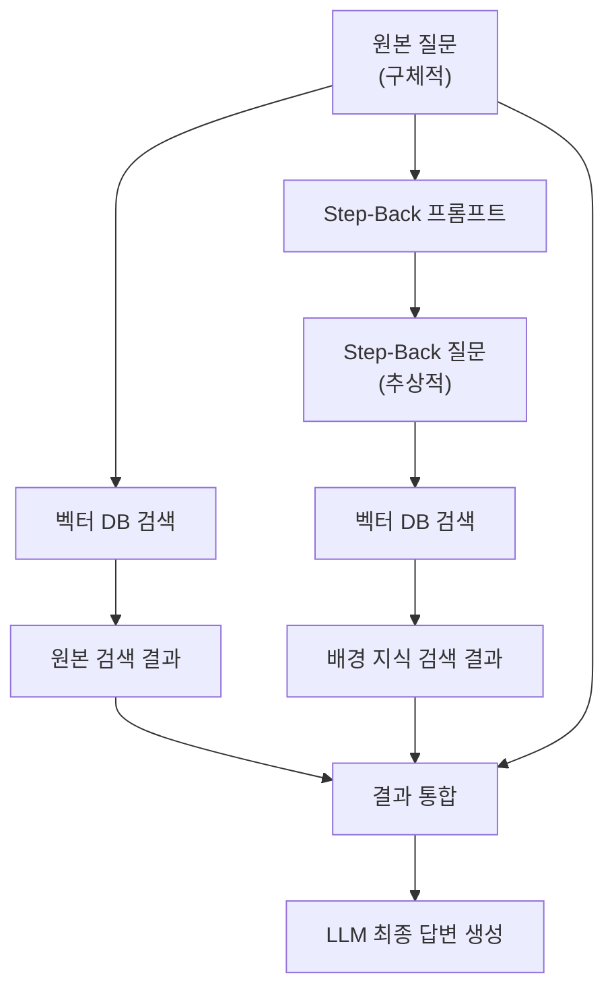
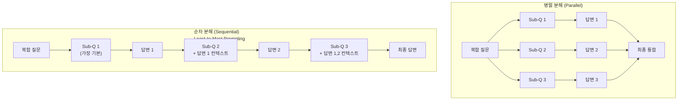
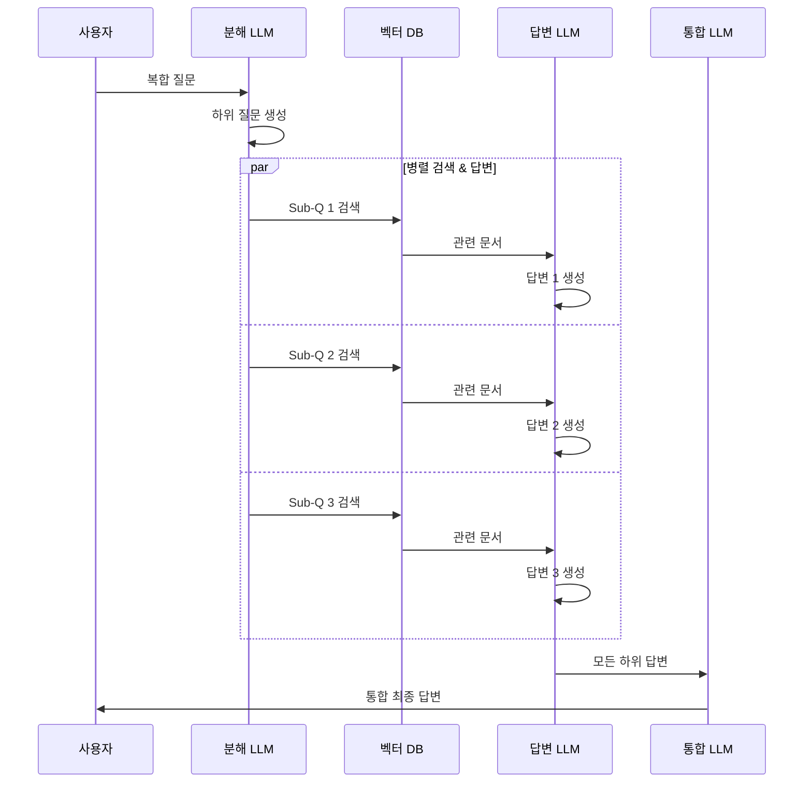
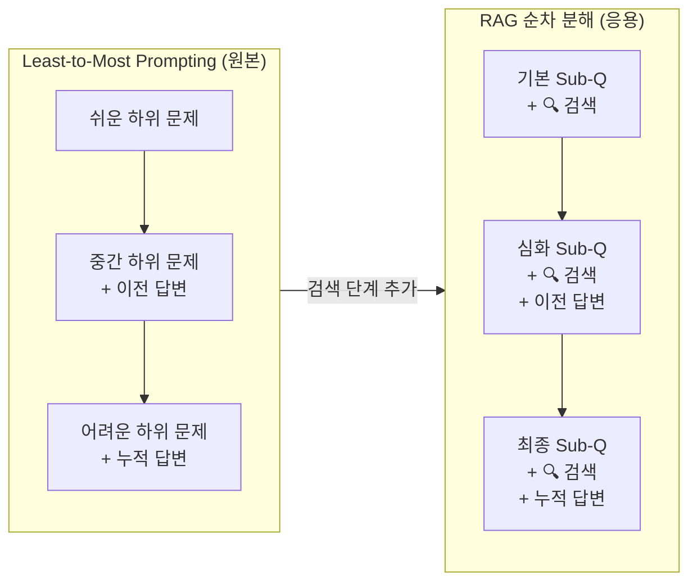
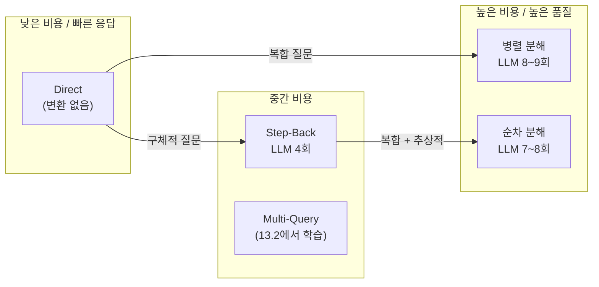

# Step-Back Prompting과 쿼리 분해

> 구체적인 질문을 추상화하고, 복잡한 질문을 분해하여 RAG 검색 품질을 극대화하는 Pre-retrieval 최적화 기법

## 개요

이 섹션에서는 쿼리 변환의 두 가지 핵심 전략인 **Step-Back Prompting**과 **쿼리 분해(Query Decomposition)**를 깊이 있게 다룹니다. Step-Back Prompting은 구체적인 질문을 더 일반적인 질문으로 추상화하여 넓은 맥락의 문서를 검색하고, 쿼리 분해는 복합 질문을 독립적인 하위 질문으로 나누어 각각 검색·답변한 뒤 통합하는 방식입니다. 두 기법 모두 LCEL 기반으로 직접 구현합니다.

**선수 지식**: [13.1 쿼리 변환이 필요한 이유와 전략 개관](13-쿼리-변환-기법-multi-query-hyde-step-back-prompting/01-쿼리-변환이-필요한-이유와-전략-개관.md)에서 배운 네 가지 쿼리 변환 전략의 개요, [13.2 Multi-Query Retriever](13-쿼리-변환-기법-multi-query-hyde-step-back-prompting/02-multi-query-retriever-다각도-검색.md)의 병렬 검색과 중복 제거, [13.3 HyDE](13-쿼리-변환-기법-multi-query-hyde-step-back-prompting/03-hyde-가설-문서-임베딩.md)의 가설 문서 생성 개념

**학습 목표**:
- Step-Back Prompting의 원리를 이해하고 LCEL 체인으로 구현할 수 있다
- 복합 질문을 하위 질문으로 분해하는 두 가지 전략(병렬/순차)을 구분할 수 있다
- Least-to-Most Prompting 기반의 순차 분해가 RAG에서 어떻게 활용되는지 설명할 수 있다
- Sub-Question 엔진을 구현하여 분해된 질문의 답변을 통합할 수 있다
- Step-Back과 쿼리 분해를 실제 RAG 파이프라인에 적용할 수 있다

## 왜 알아야 할까?

[13.1](13-쿼리-변환-기법-multi-query-hyde-step-back-prompting/01-쿼리-변환이-필요한-이유와-전략-개관.md)에서 살펴본 것처럼, 사용자의 질문이 RAG 시스템에서 기대만큼 좋은 결과를 내지 못하는 이유 중 두 가지가 특히 까다롭습니다.

**첫째, 질문이 너무 구체적인 경우입니다.** "2023년 3분기 삼성전자 HBM3E 양산 수율이 TSMC 대비 어떤가요?"처럼 매우 세부적인 질문은 벡터 DB에 정확히 일치하는 문서가 없으면 검색이 실패합니다. 하지만 "HBM3E 양산 기술 동향"이라는 더 넓은 질문으로 먼저 배경 지식을 확보하면, 원래 질문에도 훨씬 유용한 문서를 찾을 수 있죠.

**둘째, 질문이 여러 주제를 한꺼번에 묻는 경우입니다.** "LangChain과 LlamaIndex의 RAG 성능 차이는 뭐고, 각각의 장단점과 실무 도입 사례를 알려줘"라는 질문은 사실 3개 이상의 독립 질문이 뭉쳐 있습니다. 이걸 하나의 쿼리로 검색하면 어느 하나에도 깊이 있는 문서를 찾기 어렵습니다.

Step-Back Prompting과 쿼리 분해는 이 두 문제를 정면으로 해결합니다. Google DeepMind의 연구에 따르면, Step-Back Prompting만으로도 정보 검색 정확도가 **최대 36%** 향상되었고, 쿼리 분해를 결합하면 복합 질문의 답변 완전성이 크게 개선됩니다.

## 핵심 개념

### 개념 1: Step-Back Prompting — 한 발짝 물러서서 보기

> 💡 **비유**: 숲 속에서 길을 잃었을 때, 나무 사이를 비집고 다니는 것보다 언덕 위에 올라가 전체 지형을 조망하는 게 더 빠릅니다. Step-Back Prompting은 "언덕에 올라가기"입니다 — 구체적인 디테일에서 한 발짝 물러나, 더 넓은 시야에서 필요한 정보를 찾는 전략이죠.

Step-Back Prompting은 2023년 Google DeepMind가 발표한 논문 *"Take a Step Back: Evoking Reasoning via Abstraction in Large Language Models"*에서 제안된 기법입니다. 핵심 아이디어는 간단합니다:

1. **추상화(Abstraction)**: 원본 질문에서 더 일반적인 "Step-Back 질문"을 생성합니다
2. **이중 검색(Dual Retrieval)**: Step-Back 질문과 원본 질문 모두로 검색합니다
3. **통합 추론(Reasoning)**: 두 검색 결과를 합쳐 최종 답변을 생성합니다

예를 들어 보겠습니다:

| 원본 질문 | Step-Back 질문 |
|-----------|---------------|
| "FAISS의 IVF_PQ 인덱스에서 nprobe 값을 높이면 recall이 어떻게 변하나요?" | "FAISS의 인덱스 유형별 검색 성능 특성은 무엇인가요?" |
| "LangChain v0.3에서 ConversationBufferMemory가 deprecated된 이유는?" | "LangChain의 메모리 관리 아키텍처는 어떻게 발전해왔나요?" |
| "Python 3.12에서 GIL 제거가 멀티스레딩 성능에 미치는 영향은?" | "Python의 GIL(Global Interpreter Lock)의 역할과 한계는 무엇인가요?" |

> 📊 **그림 1**: Step-Back Prompting의 동작 흐름



Step-Back 질문을 생성하는 LCEL 체인을 구현해봅시다:

```python
from langchain_openai import ChatOpenAI
from langchain_core.prompts import ChatPromptTemplate, FewShotChatMessagePromptTemplate
from langchain_core.output_parsers import StrOutputParser

# Step-Back 프롬프트: Few-shot 예시로 추상화 패턴을 학습시킵니다
examples = [
    {
        "input": "FAISS에서 IVF_PQ 인덱스의 nprobe를 높이면 recall이 어떻게 변하나요?",
        "output": "FAISS의 인덱스 유형별 검색 성능 특성은 무엇인가요?",
    },
    {
        "input": "LangChain v0.3에서 ConversationBufferMemory가 deprecated된 이유는?",
        "output": "LangChain의 메모리 관리 아키텍처는 어떻게 발전해왔나요?",
    },
    {
        "input": "ChromaDB에서 HNSW의 ef_construction을 200으로 설정하면 인덱싱 시간이 얼마나 늘어나나요?",
        "output": "HNSW 알고리즘의 핵심 파라미터가 성능에 미치는 영향은 무엇인가요?",
    },
]

# Few-shot 프롬프트 구성
example_prompt = ChatPromptTemplate.from_messages([
    ("human", "{input}"),
    ("ai", "{output}"),
])

few_shot_prompt = FewShotChatMessagePromptTemplate(
    example_prompt=example_prompt,
    examples=examples,
)

step_back_prompt = ChatPromptTemplate.from_messages([
    ("system",
     "당신은 질문을 더 일반적이고 추상적인 형태로 변환하는 전문가입니다. "
     "주어진 구체적인 질문에서 한 단계 물러나, 해당 질문의 핵심 원리나 "
     "상위 개념에 대한 질문으로 변환하세요. "
     "변환된 질문만 출력하세요."),
    few_shot_prompt,
    ("human", "{question}"),
])

llm = ChatOpenAI(model="gpt-4o-mini", temperature=0)

# Step-Back 질문 생성 체인
step_back_chain = step_back_prompt | llm | StrOutputParser()
```

이제 이 체인을 실제 RAG 파이프라인에 통합합니다. 핵심은 **`RunnablePassthrough.assign()`**으로 원본 질문을 보존하면서 Step-Back 질문을 추가하는 것입니다:

```python
from langchain_core.runnables import RunnablePassthrough, RunnableParallel
from langchain_openai import OpenAIEmbeddings
from langchain_chroma import Chroma

# 벡터 DB와 리트리버 설정 (이전 섹션에서 구축한 것 활용)
embeddings = OpenAIEmbeddings(model="text-embedding-3-small")
vectorstore = Chroma(
    collection_name="rag_docs",
    embedding_function=embeddings,
    persist_directory="./chroma_db",
)
retriever = vectorstore.as_retriever(search_kwargs={"k": 4})

def format_docs(docs: list) -> str:
    """검색된 문서를 하나의 문자열로 결합합니다."""
    return "\n\n---\n\n".join(doc.page_content for doc in docs)

# Step-Back RAG 체인: 원본 + Step-Back 질문 모두로 검색
step_back_rag_prompt = ChatPromptTemplate.from_messages([
    ("system",
     "다음 컨텍스트를 활용하여 질문에 답변하세요.\n\n"
     "## 배경 지식 (Step-Back 검색 결과)\n{step_back_context}\n\n"
     "## 직접 관련 정보 (원본 검색 결과)\n{original_context}"),
    ("human", "{question}"),
])

step_back_rag_chain = (
    {
        # 원본 질문 보존
        "question": RunnablePassthrough(),
        # Step-Back 질문 생성 → 검색 → 문서 포매팅
        "step_back_context": step_back_chain | retriever | format_docs,
        # 원본 질문으로 직접 검색
        "original_context": retriever | format_docs,
    }
    | step_back_rag_prompt
    | llm
    | StrOutputParser()
)

# 실행
# result = step_back_rag_chain.invoke("FAISS IVF_PQ에서 nprobe를 높이면 recall이 어떻게 변하나요?")
```

> ⚠️ **흔한 오해**: "Step-Back 질문은 항상 원본보다 좋다"고 생각하기 쉽지만, Step-Back 질문만으로 검색하면 너무 일반적인 문서만 나옵니다. **반드시 원본 질문과 함께** 사용해야 합니다 — 배경 지식(Step-Back)과 세부 정보(원본)를 결합하는 것이 핵심이거든요.

### 개념 2: 쿼리 분해 — 복잡한 질문을 나누어 정복하기

> 💡 **비유**: 이사를 할 때 "짐을 옮겨라"라고 하면 막막하지만, "주방 그릇 포장 → 옷 상자 포장 → 가전제품 분리 → 트럭 적재" 순서로 나누면 훨씬 수월하죠. 쿼리 분해도 마찬가지입니다 — 하나의 복잡한 질문을 여러 개의 간단한 질문으로 나누어, 각각에 대해 정확한 답을 찾은 뒤 합치는 거예요.

쿼리 분해(Query Decomposition)는 하나의 복합 질문을 2~4개의 독립적인 하위 질문(Sub-Question)으로 분리하는 기법입니다. [13.1](13-쿼리-변환-기법-multi-query-hyde-step-back-prompting/01-쿼리-변환이-필요한-이유와-전략-개관.md)에서 개관했던 전략 중 하나인데요, 여기서는 두 가지 분해 전략을 깊이 다룹니다:

**병렬 분해 (Parallel Decomposition)**:
- 하위 질문들이 서로 독립적일 때 사용
- 모든 하위 질문을 동시에 검색·답변
- 예: "LangChain과 LlamaIndex의 장단점을 비교해줘" → 각 프레임워크에 대한 질문을 병렬 처리

**순차 분해 (Sequential Decomposition)**:
- 이전 하위 질문의 답변이 다음 질문의 맥락이 될 때 사용
- **Least-to-Most Prompting** 방식에 기반 — 가장 쉽고 기본적인 질문부터 순서대로 풀어가며, 이전 단계의 답변을 다음 단계의 맥락으로 누적하는 전략입니다
- 예: "RAG에서 리랭킹이 왜 중요하고, Cohere Rerank의 구현 방법은?" → 리랭킹 개념 이해 후 구현으로 진행

> 📊 **그림 2**: 병렬 분해 vs 순차 분해 비교



먼저 질문을 분해하는 체인을 구현합니다:

```python
from langchain_core.output_parsers import StrOutputParser
from langchain_core.prompts import ChatPromptTemplate

# 쿼리 분해 프롬프트
decomposition_prompt = ChatPromptTemplate.from_messages([
    ("system",
     "당신은 복잡한 질문을 분석하여 더 간단한 하위 질문으로 분해하는 전문가입니다.\n"
     "주어진 질문을 2~4개의 독립적인 하위 질문으로 나누세요.\n"
     "각 하위 질문은 단독으로 검색하여 답변할 수 있어야 합니다.\n"
     "하위 질문만 번호를 붙여 출력하세요. 다른 설명은 불필요합니다."),
    ("human", "{question}"),
])

# 분해 체인
decompose_chain = decomposition_prompt | llm | StrOutputParser()

def parse_sub_questions(response: str) -> list[str]:
    """LLM 응답에서 하위 질문 리스트를 추출합니다."""
    lines = response.strip().split("\n")
    sub_questions = []
    for line in lines:
        # "1. ", "2) ", "- " 등 다양한 형식 처리
        cleaned = line.strip().lstrip("0123456789.-) ").strip()
        if cleaned:
            sub_questions.append(cleaned)
    return sub_questions
```

```run:python
# 분해 결과 시뮬레이션 (실제로는 LLM이 생성)
original = "LangChain과 LlamaIndex의 RAG 성능 차이는 무엇이고, 각각의 장단점과 실무 도입 시 고려사항은?"

# LLM이 생성할 하위 질문 예시
sub_questions = [
    "LangChain의 RAG 파이프라인 구현 방식과 주요 특징은 무엇인가요?",
    "LlamaIndex의 RAG 파이프라인 구현 방식과 주요 특징은 무엇인가요?",
    "LangChain과 LlamaIndex의 RAG 검색 성능을 비교하면 어떤 차이가 있나요?",
    "RAG 프레임워크를 실무에 도입할 때 고려해야 할 핵심 요소는 무엇인가요?",
]

print(f"원본 질문: {original}\n")
print(f"분해된 하위 질문 ({len(sub_questions)}개):")
for i, sq in enumerate(sub_questions, 1):
    print(f"  {i}. {sq}")
```

```output
원본 질문: LangChain과 LlamaIndex의 RAG 성능 차이는 무엇이고, 각각의 장단점과 실무 도입 시 고려사항은?

분해된 하위 질문 (4개):
  1. LangChain의 RAG 파이프라인 구현 방식과 주요 특징은 무엇인가요?
  2. LlamaIndex의 RAG 파이프라인 구현 방식과 주요 특징은 무엇인가요?
  3. LangChain과 LlamaIndex의 RAG 검색 성능을 비교하면 어떤 차이가 있나요?
  4. RAG 프레임워크를 실무에 도입할 때 고려해야 할 핵심 요소는 무엇인가요?
```

### 개념 3: 병렬 분해 — 독립적인 하위 질문을 동시에 처리

> 💡 **비유**: 여러 과목 시험 준비를 할 때, 수학과 영어는 동시에 각각 공부해도 되지만, 미적분을 풀려면 먼저 함수를 이해해야 하죠. 병렬 분해는 "수학과 영어를 동시에 공부하는" 방식입니다.

병렬 분해는 하위 질문들이 서로 독립적일 때 사용합니다. 모든 하위 질문을 동시에 검색하고 답변한 뒤, 결과를 하나로 통합합니다:

```python
from langchain_core.runnables import RunnableLambda, RunnableParallel

def retrieve_and_answer(sub_question: str) -> dict:
    """하위 질문 하나에 대해 검색 후 답변을 생성합니다."""
    # 검색
    docs = retriever.invoke(sub_question)
    context = format_docs(docs)
    
    # 답변 생성
    answer_prompt = ChatPromptTemplate.from_messages([
        ("system", "다음 컨텍스트를 기반으로 질문에 답변하세요.\n\n{context}"),
        ("human", "{question}"),
    ])
    answer_chain = answer_prompt | llm | StrOutputParser()
    answer = answer_chain.invoke({"context": context, "question": sub_question})
    
    return {"question": sub_question, "answer": answer}

def parallel_decompose_and_answer(question: str) -> str:
    """복합 질문을 병렬 분해하여 각각 답변한 뒤 통합합니다."""
    # 1단계: 질문 분해
    decomposed = decompose_chain.invoke({"question": question})
    sub_questions = parse_sub_questions(decomposed)
    
    # 2단계: 각 하위 질문에 대해 검색 + 답변 (병렬 실행)
    sub_results = []
    for sq in sub_questions:
        result = retrieve_and_answer(sq)
        sub_results.append(result)
    
    # 3단계: 하위 답변들을 통합하여 최종 답변 생성
    qa_pairs = "\n\n".join(
        f"Q: {r['question']}\nA: {r['answer']}" for r in sub_results
    )
    
    synthesis_prompt = ChatPromptTemplate.from_messages([
        ("system",
         "다음은 복합 질문을 분해하여 각각 답변한 결과입니다.\n"
         "이 하위 답변들을 종합하여, 원본 질문에 대한 포괄적이고 "
         "일관된 최종 답변을 작성하세요.\n\n"
         "## 하위 질문-답변 쌍\n{qa_pairs}"),
        ("human", "원본 질문: {original_question}"),
    ])
    
    synthesis_chain = synthesis_prompt | llm | StrOutputParser()
    final_answer = synthesis_chain.invoke({
        "qa_pairs": qa_pairs,
        "original_question": question,
    })
    
    return final_answer
```

> 📊 **그림 3**: 병렬 분해 RAG 파이프라인의 세부 흐름



### 개념 4: 순차 분해와 Least-to-Most Prompting — 이전 답변을 다음 질문의 맥락으로

순차 분해(Sequential Decomposition)는 **Least-to-Most Prompting**에서 직접 영감을 받은 방식입니다. Least-to-Most Prompting은 Google Research가 2022년 논문 *"Least-to-Most Prompting Enables Complex Reasoning in Large Language Models"*에서 제안한 기법으로, 복잡한 문제를 **"가장 쉬운 것부터(least)" 풀어나가며 이전 답변을 다음 단계의 맥락으로 누적**하는 전략입니다.

원래는 수학 문제 풀이나 다단계 추론용으로 연구되었지만, RAG 커뮤니티가 이를 검색 파이프라인에 접목하면서 **Least-to-Most Prompting의 RAG 변형**이 탄생했습니다. 이것이 바로 우리가 구현할 순차 분해인데요, 핵심 차이는 각 단계마다 **벡터 DB 검색을 추가**한다는 점입니다. 마치 수학 증명에서 보조정리(lemma)를 먼저 증명하고, 이를 활용해 본 정리를 증명하는 것과 같죠.

> 📊 **그림 2.5**: Least-to-Most Prompting과 RAG 순차 분해의 관계



```python
def sequential_decompose_and_answer(question: str) -> str:
    """복합 질문을 순차 분해하여 맥락을 누적하며 답변합니다."""
    # 1단계: 질문 분해 (순서가 중요!)
    seq_decomposition_prompt = ChatPromptTemplate.from_messages([
        ("system",
         "당신은 복잡한 질문을 분석하여 순차적으로 풀어야 할 하위 질문으로 분해하는 전문가입니다.\n"
         "주어진 질문을 2~4개의 하위 질문으로 나누되, 쉬운 것부터 어려운 순서로 정렬하세요.\n"
         "앞 질문의 답이 뒷 질문을 이해하는 데 도움이 되도록 순서를 정하세요.\n"
         "이 방식은 Least-to-Most Prompting에 기반합니다 — 가장 기본적인 개념부터 "
         "점진적으로 복잡한 질문으로 나아가세요.\n"
         "하위 질문만 번호를 붙여 출력하세요."),
        ("human", "{question}"),
    ])
    
    seq_decompose_chain = seq_decomposition_prompt | llm | StrOutputParser()
    decomposed = seq_decompose_chain.invoke({"question": question})
    sub_questions = parse_sub_questions(decomposed)
    
    # 2단계: 순차적으로 답변 (이전 답변을 컨텍스트로 누적)
    accumulated_context = ""
    sub_results = []
    
    for i, sq in enumerate(sub_questions):
        # 검색
        docs = retriever.invoke(sq)
        doc_context = format_docs(docs)
        
        # 이전 답변이 있으면 컨텍스트에 추가
        if accumulated_context:
            full_context = (
                f"## 이전 단계에서 알아낸 정보\n{accumulated_context}\n\n"
                f"## 현재 검색 결과\n{doc_context}"
            )
        else:
            full_context = doc_context
        
        # 답변 생성
        seq_answer_prompt = ChatPromptTemplate.from_messages([
            ("system",
             "다음 컨텍스트를 기반으로 질문에 답변하세요.\n\n{context}"),
            ("human", "{question}"),
        ])
        seq_answer_chain = seq_answer_prompt | llm | StrOutputParser()
        answer = seq_answer_chain.invoke({
            "context": full_context,
            "question": sq,
        })
        
        sub_results.append({"question": sq, "answer": answer})
        # 이전 답변을 누적 컨텍스트에 추가
        accumulated_context += f"\nQ{i+1}: {sq}\nA{i+1}: {answer}\n"
    
    # 마지막 답변이 곧 최종 답변 (이미 모든 맥락이 누적됨)
    # 필요하면 별도 통합 단계 추가 가능
    return sub_results[-1]["answer"]
```

> 🔥 **실무 팁**: 병렬 vs 순차 중 어떤 걸 써야 할까요? 간단한 판별법이 있습니다. 하위 질문들이 "A와 B의 차이"처럼 **비교·대조** 형태면 **병렬**, "X를 이해하고 나서 Y를 구현"처럼 **전제 조건**이 있으면 **순차(Least-to-Most)**를 선택하세요. 확실하지 않다면 병렬이 더 안전합니다 — LLM 호출 횟수도 적고, 지연시간도 짧거든요.

### 개념 5: 분해 전략 자동 선택

[13.1](13-쿼리-변환-기법-multi-query-hyde-step-back-prompting/01-쿼리-변환이-필요한-이유와-전략-개관.md)에서 배운 쿼리 분류(Query Classification) 패턴을 여기에도 적용할 수 있습니다. 질문의 성격을 먼저 판별하고, Step-Back이 필요한지, 분해가 필요한지, 아니면 그대로 검색해도 되는지를 자동으로 결정하는 라우터를 만들어봅시다:

```python
from langchain_core.pydantic_v1 import BaseModel, Field
from enum import Enum

class QueryStrategy(str, Enum):
    """쿼리 변환 전략 유형"""
    DIRECT = "direct"           # 변환 없이 직접 검색
    STEP_BACK = "step_back"     # Step-Back 추상화
    DECOMPOSE = "decompose"     # 하위 질문 분해
    STEP_BACK_AND_DECOMPOSE = "step_back_and_decompose"  # 둘 다

class QueryClassification(BaseModel):
    """질문 분석 결과"""
    strategy: QueryStrategy = Field(
        description="이 질문에 가장 적합한 쿼리 변환 전략"
    )
    reasoning: str = Field(
        description="전략 선택 이유를 간단히 설명"
    )

# 구조화된 출력으로 전략을 분류
classifier_llm = llm.with_structured_output(QueryClassification)

classify_prompt = ChatPromptTemplate.from_messages([
    ("system",
     "당신은 RAG 시스템의 쿼리 분석 전문가입니다.\n"
     "주어진 질문을 분석하여 가장 적합한 검색 전략을 선택하세요:\n\n"
     "- direct: 단순하고 구체적인 질문. 변환 없이 바로 검색 가능\n"
     "- step_back: 너무 구체적이거나 세부적인 질문. 배경 지식이 필요\n"
     "- decompose: 여러 주제를 한꺼번에 묻는 복합 질문\n"
     "- step_back_and_decompose: 복합적이면서 배경 지식도 필요한 질문"),
    ("human", "{question}"),
])

classify_chain = classify_prompt | classifier_llm
```

```run:python
# 전략 분류 시뮬레이션
test_cases = [
    ("ChromaDB에서 컬렉션을 생성하는 방법은?", "direct"),
    ("HNSW 알고리즘에서 ef=64일 때 recall@10 값은?", "step_back"),
    ("BM25와 벡터 검색의 장단점, 그리고 하이브리드 검색 구현 방법은?", "decompose"),
    ("FAISS IVF_PQ의 nprobe별 성능과 Qdrant HNSW와의 비교, 실무 선택 기준은?", "step_back_and_decompose"),
]

print("쿼리 변환 전략 자동 분류 결과:")
print("=" * 70)
for question, strategy in test_cases:
    print(f"\n질문: {question}")
    print(f"  → 전략: {strategy}")
```

```output
쿼리 변환 전략 자동 분류 결과:
======================================================================

질문: ChromaDB에서 컬렉션을 생성하는 방법은?
  → 전략: direct

질문: HNSW 알고리즘에서 ef=64일 때 recall@10 값은?
  → 전략: step_back

질문: BM25와 벡터 검색의 장단점, 그리고 하이브리드 검색 구현 방법은?
  → 전략: decompose

질문: FAISS IVF_PQ의 nprobe별 성능과 Qdrant HNSW와의 비교, 실무 선택 기준은?
  → 전략: step_back_and_decompose
```

## 실습: 직접 해보기

Step-Back Prompting과 쿼리 분해를 결합한 **통합 쿼리 변환 RAG 파이프라인**을 구축해봅시다. 이 파이프라인은 질문의 유형을 자동으로 판별하고, 적합한 전략을 적용합니다.

```python
"""
통합 쿼리 변환 RAG 파이프라인
- Step-Back Prompting + Query Decomposition 결합
- 쿼리 유형별 자동 전략 선택
"""
import os
from dotenv import load_dotenv
from langchain_openai import ChatOpenAI, OpenAIEmbeddings
from langchain_chroma import Chroma
from langchain_core.prompts import ChatPromptTemplate, FewShotChatMessagePromptTemplate
from langchain_core.output_parsers import StrOutputParser
from langchain_core.documents import Document

load_dotenv()

# ── 1. 모델 및 벡터 DB 설정 ──
llm = ChatOpenAI(model="gpt-4o-mini", temperature=0)
embeddings = OpenAIEmbeddings(model="text-embedding-3-small")

# 샘플 문서로 벡터 DB 구축
sample_docs = [
    Document(page_content="FAISS는 Facebook AI Research에서 개발한 벡터 유사도 검색 라이브러리입니다. "
             "IVF(Inverted File Index)는 벡터를 클러스터로 그룹화하여 검색 범위를 좁히는 인덱스 방식입니다. "
             "PQ(Product Quantization)는 벡터를 압축하여 메모리를 절약합니다."),
    Document(page_content="HNSW(Hierarchical Navigable Small World)는 그래프 기반 ANN 알고리즘입니다. "
             "ef_construction은 인덱스 구축 시 탐색 범위, ef는 검색 시 탐색 범위를 결정합니다. "
             "ef 값이 높을수록 recall이 증가하지만 검색 속도가 감소합니다."),
    Document(page_content="BM25는 키워드 빈도(TF)와 역문서 빈도(IDF)를 기반으로 문서 관련성을 점수화합니다. "
             "벡터 검색은 의미적 유사도를 기반으로 검색하여 동의어와 패러프레이즈를 잘 처리합니다. "
             "하이브리드 검색은 두 방식을 결합하여 장점을 모두 취합니다."),
    Document(page_content="nprobe는 FAISS IVF 인덱스에서 검색 시 탐색할 클러스터 수입니다. "
             "nprobe가 높을수록 recall이 증가하지만 검색 속도가 감소합니다. "
             "일반적으로 전체 클러스터의 5~10%를 nprobe로 설정하면 좋은 균형을 얻습니다."),
    Document(page_content="Qdrant는 Rust로 구현된 벡터 데이터베이스로, 필터링 성능이 뛰어납니다. "
             "HNSW 기반 인덱싱을 사용하며, payload 필터와 결합된 검색을 효율적으로 수행합니다. "
             "gRPC 프로토콜을 지원하여 대규모 서비스에서 높은 처리량을 제공합니다."),
]

vectorstore = Chroma.from_documents(
    documents=sample_docs,
    embedding=embeddings,
    collection_name="query_transform_demo",
)
retriever = vectorstore.as_retriever(search_kwargs={"k": 3})


# ── 2. Step-Back 체인 ──
step_back_examples = [
    {"input": "FAISS IVF_PQ에서 nprobe=20일 때 recall은?",
     "output": "FAISS 인덱스의 검색 파라미터가 성능에 미치는 영향은?"},
    {"input": "Qdrant에서 HNSW ef를 128로 설정하면?",
     "output": "벡터 데이터베이스의 HNSW 인덱스 파라미터 튜닝 원리는?"},
]
example_prompt = ChatPromptTemplate.from_messages([
    ("human", "{input}"), ("ai", "{output}"),
])
few_shot_prompt = FewShotChatMessagePromptTemplate(
    example_prompt=example_prompt, examples=step_back_examples,
)
step_back_prompt = ChatPromptTemplate.from_messages([
    ("system",
     "주어진 구체적인 질문에서 한 단계 물러나, 핵심 원리나 상위 개념에 대한 "
     "더 일반적인 질문으로 변환하세요. 변환된 질문만 출력하세요."),
    few_shot_prompt,
    ("human", "{question}"),
])
step_back_chain = step_back_prompt | llm | StrOutputParser()


# ── 3. 분해 체인 ──
decompose_prompt = ChatPromptTemplate.from_messages([
    ("system",
     "복잡한 질문을 2~4개의 간단한 하위 질문으로 분해하세요.\n"
     "각 하위 질문은 독립적으로 검색·답변 가능해야 합니다.\n"
     "번호를 붙여 하위 질문만 출력하세요."),
    ("human", "{question}"),
])
decompose_chain = decompose_prompt | llm | StrOutputParser()


# ── 4. 유틸리티 함수들 ──
def format_docs(docs: list) -> str:
    """검색된 문서를 문자열로 결합합니다."""
    return "\n\n---\n\n".join(doc.page_content for doc in docs)

def parse_sub_questions(text: str) -> list[str]:
    """LLM 응답에서 하위 질문을 파싱합니다."""
    lines = text.strip().split("\n")
    return [
        line.strip().lstrip("0123456789.-) ").strip()
        for line in lines
        if line.strip() and line.strip().lstrip("0123456789.-) ").strip()
    ]

def answer_with_context(question: str, context: str) -> str:
    """컨텍스트를 기반으로 질문에 답변합니다."""
    prompt = ChatPromptTemplate.from_messages([
        ("system",
         "다음 컨텍스트를 기반으로 질문에 정확하게 답변하세요. "
         "컨텍스트에 없는 정보는 추측하지 마세요.\n\n{context}"),
        ("human", "{question}"),
    ])
    chain = prompt | llm | StrOutputParser()
    return chain.invoke({"context": context, "question": question})


# ── 5. 전략별 실행 함수 ──
def run_direct(question: str) -> str:
    """직접 검색: 변환 없이 바로 검색합니다."""
    docs = retriever.invoke(question)
    return answer_with_context(question, format_docs(docs))

def run_step_back(question: str) -> str:
    """Step-Back: 추상적 질문 + 원본 질문으로 이중 검색합니다."""
    # Step-Back 질문 생성
    sb_question = step_back_chain.invoke({"question": question})
    
    # 이중 검색
    original_docs = retriever.invoke(question)
    step_back_docs = retriever.invoke(sb_question)
    
    # 중복 제거 후 통합
    seen = set()
    all_docs = []
    for doc in step_back_docs + original_docs:
        if doc.page_content not in seen:
            seen.add(doc.page_content)
            all_docs.append(doc)
    
    context = (
        f"## 배경 지식 (Step-Back 질문: {sb_question})\n"
        f"{format_docs(step_back_docs)}\n\n"
        f"## 직접 관련 정보\n{format_docs(original_docs)}"
    )
    return answer_with_context(question, context)

def run_decompose(question: str) -> str:
    """병렬 분해: 하위 질문을 각각 답변 후 통합합니다."""
    decomposed = decompose_chain.invoke({"question": question})
    sub_questions = parse_sub_questions(decomposed)
    
    # 각 하위 질문에 대해 검색 + 답변
    qa_pairs = []
    for sq in sub_questions:
        docs = retriever.invoke(sq)
        answer = answer_with_context(sq, format_docs(docs))
        qa_pairs.append(f"Q: {sq}\nA: {answer}")
    
    # 통합
    synthesis_prompt = ChatPromptTemplate.from_messages([
        ("system",
         "다음 하위 질문-답변 쌍들을 종합하여 원본 질문에 대한 "
         "포괄적인 답변을 작성하세요.\n\n{qa_pairs}"),
        ("human", "{question}"),
    ])
    synthesis_chain = synthesis_prompt | llm | StrOutputParser()
    return synthesis_chain.invoke({
        "qa_pairs": "\n\n".join(qa_pairs),
        "question": question,
    })


# ── 6. 통합 파이프라인 (수동 전략 선택 버전) ──
def query_transform_rag(question: str, strategy: str = "auto") -> str:
    """
    쿼리 변환 전략을 적용하여 RAG 답변을 생성합니다.
    
    Args:
        question: 사용자 질문
        strategy: "direct" | "step_back" | "decompose" | "auto"
    """
    if strategy == "direct":
        return run_direct(question)
    elif strategy == "step_back":
        return run_step_back(question)
    elif strategy == "decompose":
        return run_decompose(question)
    elif strategy == "auto":
        # 자동 분류 (간단 규칙 기반 예시)
        if "비교" in question or "장단점" in question or "그리고" in question:
            return run_decompose(question)
        elif any(kw in question for kw in ["값", "수치", "설정하면", "경우"]):
            return run_step_back(question)
        else:
            return run_direct(question)
    else:
        raise ValueError(f"알 수 없는 전략: {strategy}")


# ── 사용 예시 ──
if __name__ == "__main__":
    # Step-Back 적용 케이스
    q1 = "FAISS IVF_PQ에서 nprobe를 20으로 설정하면 recall이 어떻게 되나요?"
    print(f"[Step-Back] 질문: {q1}")
    # result1 = query_transform_rag(q1, strategy="step_back")
    # print(f"답변: {result1}\n")
    
    # 분해 적용 케이스
    q2 = "BM25와 벡터 검색의 차이점, 그리고 하이브리드 검색의 구현 방법은?"
    print(f"[Decompose] 질문: {q2}")
    # result2 = query_transform_rag(q2, strategy="decompose")
    # print(f"답변: {result2}\n")
```

```run:python
# 전략별 LLM 호출 횟수 비교
strategies = {
    "Direct (변환 없음)": {"decompose": 0, "search": 1, "answer": 1, "synthesize": 0},
    "Step-Back": {"decompose": 0, "search": 2, "answer": 1, "synthesize": 0},
    "병렬 분해 (3 sub-Q)": {"decompose": 1, "search": 3, "answer": 3, "synthesize": 1},
    "순차 분해 (3 sub-Q)": {"decompose": 1, "search": 3, "answer": 3, "synthesize": 0},
    "Step-Back + 분해": {"decompose": 1, "search": 4, "answer": 3, "synthesize": 1},
}

print(f"{'전략':<25} {'분해':>4} {'검색':>4} {'답변':>4} {'통합':>4} {'총 LLM 호출':>10}")
print("-" * 65)
for name, counts in strategies.items():
    total = sum(counts.values())
    # Step-Back은 step_back 생성에 1회 추가
    if "Step-Back" in name:
        total += 1
    print(f"{name:<25} {counts['decompose']:>4} {counts['search']:>4} "
          f"{counts['answer']:>4} {counts['synthesize']:>4} {total:>10}")
```

```output
전략                        분해   검색   답변   통합  총 LLM 호출
-----------------------------------------------------------------
Direct (변환 없음)             0    1    1    0          2
Step-Back                    0    2    1    0          4
병렬 분해 (3 sub-Q)            1    3    3    1          9
순차 분해 (3 sub-Q)            1    3    3    0          8
Step-Back + 분해              1    4    3    1         10
```

> 📊 **그림 4**: 전략별 비용-품질 트레이드오프



## 더 깊이 알아보기

### Step-Back Prompting의 탄생

Step-Back Prompting은 2023년 10월 Google DeepMind의 Huaixiu Steven Zheng, Swaroop Mishra 등이 발표한 논문 *"Take a Step Back: Evoking Reasoning via Abstraction in Large Language Models"*에서 처음 소개되었습니다. 이 논문의 핵심 통찰은 놀라울 만큼 직관적이었습니다 — 인간이 어려운 문제를 풀 때 세부사항에 매몰되지 않고 "큰 그림"을 먼저 파악하는 것처럼, LLM에게도 같은 전략을 적용하면 어떨까?

연구팀은 PaLM-2L, GPT-4, Llama2-70B 모델로 실험했는데요, STEM 문제, 지식 QA, 멀티홉 추론 등 까다로운 태스크에서 일관되게 성능이 향상되었습니다. 특히 정보 검색 정확도가 최대 36% 개선된 것이 인상적이었죠. 방법 자체가 프롬프트 하나만 바꾸면 되는 간단한 기법이라, 논문 발표 직후 LangChain과 LlamaIndex 모두 빠르게 구현체를 추가했습니다.

### 쿼리 분해의 뿌리: Least-to-Most Prompting

쿼리 분해의 학술적 기반은 Google Research의 *"Least-to-Most Prompting Enables Complex Reasoning in Large Language Models"*(2022, Denny Zhou 등)입니다. 이 논문은 복잡한 문제를 "가장 쉬운 것부터(least)" 풀어나가며 맥락을 누적하는 두 단계 프로세스를 제안했습니다:

1. **분해 단계(Decomposition)**: 복잡한 문제를 더 쉬운 하위 문제들로 나눕니다
2. **순차 풀이 단계(Sequential Solving)**: 쉬운 하위 문제부터 풀면서, 이전 답변을 다음 단계의 프롬프트에 포함시킵니다

원래는 수학 문제 풀이(SCAN, GSM8K 벤치마크)와 상식 추론용으로 연구되었는데요, RAG 커뮤니티가 이를 검색 파이프라인에 접목하면서 **Least-to-Most의 RAG 변형(Sequential Query Decomposition)**이라는 실용적 패턴으로 발전했습니다. 우리가 개념 4에서 구현한 `sequential_decompose_and_answer()`가 바로 이 패턴의 구현체입니다 — 각 단계마다 벡터 DB 검색을 추가하여, LLM의 내부 지식에만 의존하지 않고 외부 문서에서도 근거를 확보하는 것이 핵심 차이점이죠.

> 💡 **알고 계셨나요?**: Step-Back Prompting의 영감은 교육학의 "scaffolding(비계 설정)" 이론에서 왔습니다. 1976년 Jerome Bruner가 제안한 이 이론은 학습자가 어려운 문제를 만났을 때 선생님이 더 기본적인 질문부터 던져주는 방식인데요, LLM에게 "스스로 선생님 역할"을 시키는 셈이죠.

## 흔한 오해와 팁

> ⚠️ **흔한 오해**: "쿼리 분해는 항상 더 좋은 결과를 낸다"고 생각하기 쉽지만, 단순한 질문을 불필요하게 분해하면 오히려 성능이 떨어집니다. 분해 과정에서 LLM이 원래 의도와 다른 하위 질문을 만들 수 있고, LLM 호출 횟수 증가로 비용과 지연시간이 크게 늘어나거든요. **단순 질문은 Direct 검색이 최선**입니다.

> ⚠️ **흔한 오해**: "Step-Back 질문이 너무 일반적이면 안 된다"라고 걱정하는 분들이 있는데, 사실 Step-Back 질문이 일반적인 건 의도된 것입니다. 핵심은 Step-Back 질문 **단독**이 아니라, **원본 질문과 함께** 사용한다는 점이에요. 배경 지식(넓고 얕은)과 직접 관련 정보(좁고 깊은)의 조합이 바로 Step-Back의 강점입니다.

> 💡 **알고 계셨나요?**: LangChain의 RAG from Scratch 시리즈에서는 쿼리 분해를 "Part 7"에서 다루는데, 실제로 이 구현이 Least-to-Most Prompting의 RAG 변형이라는 점이 GitHub 이슈에서 논의되었습니다. 원저자 Lance Martin은 "맞다, 영감을 받았지만 RAG에 맞게 검색 단계를 추가한 것"이라고 확인했습니다.

> 🔥 **실무 팁**: Step-Back 프롬프트의 Few-shot 예시는 도메인에 맞게 반드시 커스터마이징하세요. 의료 도메인이면 "특정 약물 부작용 → 약물 작용 메커니즘", 법률 도메인이면 "특정 판례 → 관련 법리" 같은 예시를 넣으면 추상화 품질이 크게 올라갑니다.

> 🔥 **실무 팁**: 쿼리 분해 시 하위 질문 수는 2~4개가 적정합니다. 5개 이상으로 분해하면 각 질문이 너무 사소해져서 검색 결과의 정보 밀도가 떨어지고, LLM 호출 비용도 급증합니다. 프롬프트에서 "2~4개"라고 명시적으로 제한하는 것이 중요합니다.

## 핵심 정리

| 개념 | 설명 |
|------|------|
| Step-Back Prompting | 구체적 질문을 추상적 질문으로 변환하여 넓은 맥락의 배경 지식을 검색하는 기법. 원본 질문과 함께 이중 검색 |
| 쿼리 분해 (Query Decomposition) | 복합 질문을 2~4개의 독립적 하위 질문으로 나누어 각각 검색·답변한 뒤 통합하는 기법 |
| 병렬 분해 (Parallel) | 하위 질문이 독립적일 때 사용. 동시 처리로 빠르며, 비교·대조형 질문에 적합 |
| 순차 분해 (Sequential) | 이전 답변이 다음 질문의 맥락이 될 때 사용. Least-to-Most Prompting의 RAG 변형 |
| Least-to-Most Prompting (RAG 변형) | Google Research(2022)가 제안한 "쉬운 것부터 순서대로" 풀이 전략을 RAG에 적용한 것. 각 단계에 검색을 추가하여 외부 문서 근거 확보 |
| Few-shot Step-Back 프롬프트 | 도메인 맞춤 예시로 추상화 품질을 높이는 기법. `FewShotChatMessagePromptTemplate` 활용 |
| 전략 자동 선택 라우터 | 질문 유형을 분류하여 direct / step_back / decompose를 자동 선택하는 파이프라인 |
| 답변 통합 (Synthesis) | 분해된 하위 답변들을 종합하여 일관된 최종 답변을 생성하는 단계 |

## 다음 섹션 미리보기

이번 섹션에서 배운 Step-Back Prompting, 쿼리 분해와 함께 [13.2](13-쿼리-변환-기법-multi-query-hyde-step-back-prompting/02-multi-query-retriever-다각도-검색.md)의 Multi-Query, [13.3](13-쿼리-변환-기법-multi-query-hyde-step-back-prompting/03-hyde-가설-문서-임베딩.md)의 HyDE까지 — 총 네 가지 쿼리 변환 전략을 모두 학습했습니다. 그런데 실제 RAG 시스템에서는 모든 질문에 하나의 전략만 적용하지 않죠. 질문의 특성에 따라 **적합한 전략을 자동으로 선택**하고, 때로는 **아예 다른 검색 소스나 인덱스로 질문을 보내야** 할 때도 있습니다. 다음 섹션 **[13.5 쿼리 라우팅](13-쿼리-변환-기법-multi-query-hyde-step-back-prompting/05-쿼리-라우팅-적절한-검색-전략-자동-선택.md)**에서는 이 "전략 자동 선택"을 넘어, 질문을 **최적의 데이터 소스로 라우팅**하는 기법을 다룹니다. 이번 섹션의 개념 5에서 맛본 쿼리 분류 라우터가 본격적으로 확장되는 셈이죠.

## 참고 자료

- [Take a Step Back: Evoking Reasoning via Abstraction in Large Language Models (Google DeepMind, 2023)](https://arxiv.org/abs/2310.06117) - Step-Back Prompting의 원본 논문. 추상화를 통한 추론 향상의 이론적 기반과 실험 결과를 상세히 다룹니다
- [Least-to-Most Prompting Enables Complex Reasoning in Large Language Models (Google Research, 2022)](https://arxiv.org/abs/2205.10625) - 순차 분해의 학술적 기반. "쉬운 것부터" 풀어가는 프롬프팅 전략의 원본 논문으로, RAG 순차 분해의 직접적 영감이 된 연구입니다
- [LangChain RAG from Scratch (GitHub 리포지토리)](https://github.com/langchain-ai/rag-from-scratch) - LangChain 엔지니어 Lance Martin의 RAG 구축 시리즈. Part 7(Decomposition)과 Part 8(Step-Back)에서 본 섹션의 기법을 다룹니다
- [LangChain Query Transformations (공식 블로그)](https://blog.langchain.com/query-transformations/) - Step-Back, Multi-Query, Decomposition 등 쿼리 변환 기법의 개요와 LangChain에서의 활용법을 설명합니다
- [NirDiamant RAG Techniques - Query Transformations (GitHub)](https://github.com/NirDiamant/RAG_Techniques/blob/main/all_rag_techniques/query_transformations.ipynb) - Step-Back과 쿼리 분해를 포함한 다양한 쿼리 변환 기법의 실행 가능한 노트북 구현

---
### 🔗 Related Sessions
- [multi_query](../02-rag-아키텍처-핵심-컴포넌트와-파이프라인-구조/03-advanced-rag-검색-전후-최적화-전략.md) (prerequisite)
- [hyde](../02-rag-아키텍처-핵심-컴포넌트와-파이프라인-구조/03-advanced-rag-검색-전후-최적화-전략.md) (prerequisite)
- [chatprompttemplate](../08-기본-rag-파이프라인-구축-langchain으로-첫-rag-앱-만들기/01-langchain-v1-핵심-개념과-설정.md) (prerequisite)
- [stroutputparser](../08-기본-rag-파이프라인-구축-langchain으로-첫-rag-앱-만들기/01-langchain-v1-핵심-개념과-설정.md) (prerequisite)
- [query_transformation](../13-쿼리-변환-기법-multi-query-hyde-step-back-prompting/01-쿼리-변환이-필요한-이유와-전략-개관.md) (prerequisite)
