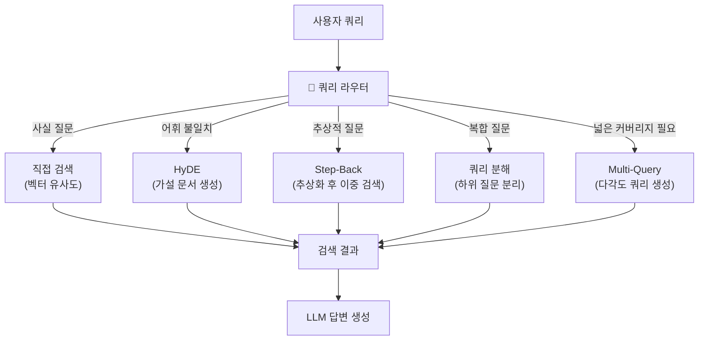
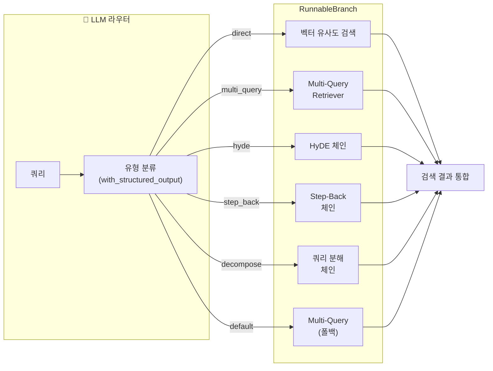
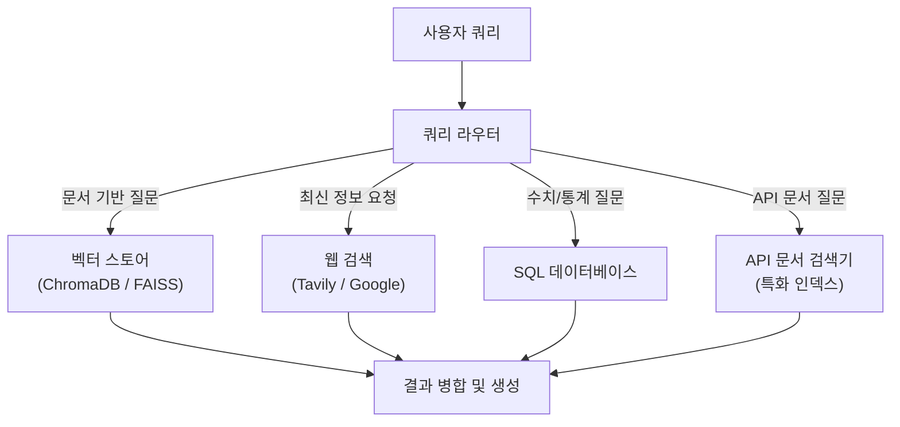
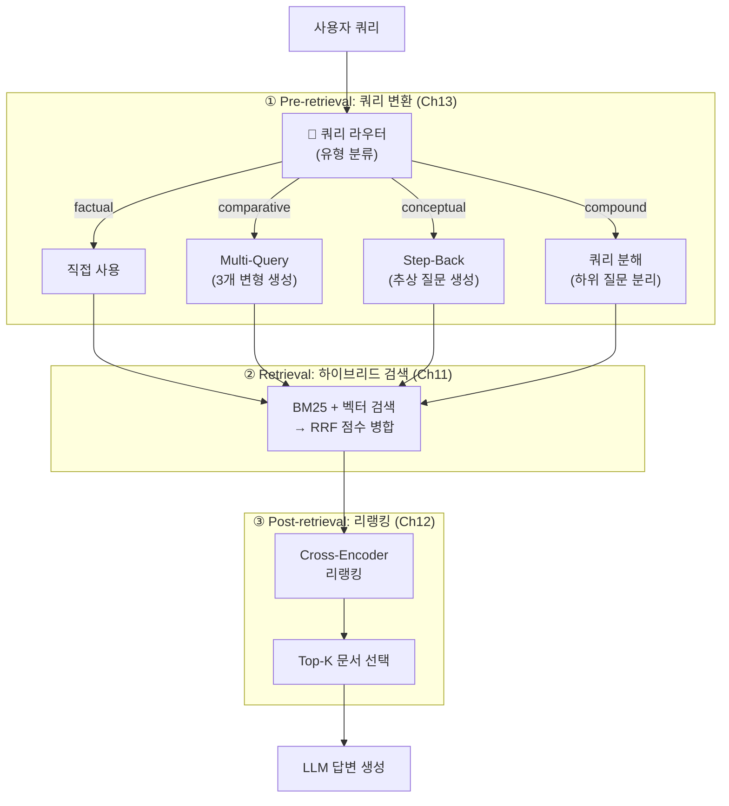
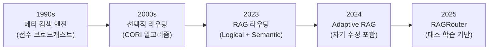

# 쿼리 라우팅 — 적절한 검색 전략 자동 선택

> 사용자 쿼리를 분석하여 최적의 검색 전략을 자동 선택하는 지능형 라우터를 구축합니다.

## 개요

이 섹션에서는 Chapter 13에서 배운 네 가지 쿼리 변환 기법(Multi-Query, HyDE, Step-Back Prompting, 쿼리 분해)을 **하나의 통합 파이프라인**으로 연결하는 핵심 접착제, 바로 **쿼리 라우터(Query Router)**를 구축합니다. LLM이 쿼리 유형을 자동으로 분류하고, 가장 효과적인 검색 전략으로 연결하는 동적 파이프라인을 만듭니다. 나아가, 앞서 배운 [하이브리드 검색(Ch11)](11-하이브리드-검색-bm25-키워드-검색과-벡터-검색-결합/01-bm25-키워드-검색-전통적-정보-검색의-힘.md)과 [리랭킹(Ch12)](12-리랭킹으로-검색-정확도-높이기-cohere-rerank-활용/01-리랭킹의-원리-왜-초기-검색으로는-부족한가.md)까지 결합하여, **쿼리 변환 → 하이브리드 검색 → 리랭킹**으로 이어지는 실전 통합 파이프라인도 구축해 봅니다.

**선수 지식**:
- [13.1: 쿼리 변환이 필요한 이유와 전략 개관](13-쿼리-변환-기법-multi-query-hyde-step-back-prompting/01-쿼리-변환이-필요한-이유와-전략-개관.md)에서 배운 `query_transformation`, `query_classification` 개념
- [13.2: Multi-Query Retriever](13-쿼리-변환-기법-multi-query-hyde-step-back-prompting/02-multi-query-retriever-다각도-검색.md)의 `MultiQueryRetriever`, `unique_union`
- [13.3: HyDE](13-쿼리-변환-기법-multi-query-hyde-step-back-prompting/03-hyde-가설-문서-임베딩.md)의 `HypotheticalDocumentEmbedder`, `hyde_chain`
- [13.4: Step-Back Prompting과 쿼리 분해](13-쿼리-변환-기법-multi-query-hyde-step-back-prompting/04-step-back-prompting과-쿼리-분해.md)의 `step_back_prompting_chain`, `query_strategy_router`
- [Ch11: 하이브리드 검색](11-하이브리드-검색-bm25-키워드-검색과-벡터-검색-결합/01-bm25-키워드-검색-전통적-정보-검색의-힘.md)의 BM25 + 벡터 검색 앙상블과 RRF
- [Ch12: 리랭킹](12-리랭킹으로-검색-정확도-높이기-cohere-rerank-활용/01-리랭킹의-원리-왜-초기-검색으로는-부족한가.md)의 Cross-Encoder 기반 재정렬
- LangChain의 LCEL 파이프 연산자(`|`)와 `RunnablePassthrough` 사용법

**학습 목표**:
- 쿼리 유형(사실 질문, 요약, 비교, 복합 질문 등)을 LLM으로 자동 분류할 수 있다
- Pydantic 구조화 출력과 `with_structured_output()`으로 안정적인 라우터를 구현할 수 있다
- 쿼리 유형별 최적 검색 전략을 매핑하고, `RunnableBranch`로 동적 파이프라인을 구축할 수 있다
- semantic-router를 활용한 임베딩 기반 저지연 라우팅 기법을 이해한다
- 쿼리 변환 + 하이브리드 검색 + 리랭킹을 하나의 파이프라인으로 통합할 수 있다

## 왜 알아야 할까?

앞선 네 개 세션에서 우리는 강력한 무기를 네 가지나 만들었습니다. Multi-Query는 검색 커버리지를 넓히고, HyDE는 어휘 불일치를 해결하며, Step-Back은 추상적 질문에 효과적이고, 쿼리 분해는 복합 질문을 처리합니다. 하지만 문제가 있습니다 — **모든 쿼리에 네 가지를 전부 적용하면 비용과 지연시간이 4배로 늘어납니다.**

실제 프로덕션 RAG 시스템에서는 "오늘 날씨 어때?"라는 단순 질문에 HyDE를 돌리는 건 낭비이고, "A와 B의 차이점은?"이라는 비교 질문에 Step-Back을 적용하면 오히려 정보가 흐려집니다. **쿼리 라우팅은 적재적소에 무기를 배치하는 전략**입니다.

게다가 실전에서는 쿼리 변환 하나만으로 끝나지 않습니다. Ch11에서 배운 **하이브리드 검색**으로 키워드와 의미 검색을 동시에 수행하고, Ch12에서 배운 **리랭킹**으로 검색 결과의 순위를 재조정해야 진정한 검색 품질이 나옵니다. 문제는 이 세 가지(쿼리 변환, 하이브리드 검색, 리랭킹)를 **언제, 어떻게 조합**할지인데 — 바로 쿼리 라우터가 이 판단을 자동화합니다.

LangSmith의 프로덕션 트레이스 분석(2025 Q4, 150개 기업)에 따르면, 쿼리 라우팅을 적용한 시스템은 복잡한 쿼리 처리 정확도가 35~50% 향상되었고, 불필요한 변환을 건너뛰어 평균 응답 지연도 줄었습니다. **똑똑한 RAG 시스템의 핵심은 "무엇을 적용할지"가 아니라 "언제 적용할지"를 아는 것**이거든요.

## 핵심 개념

### 개념 1: 쿼리 라우팅이란?

> 💡 **비유**: 대형 병원의 접수 창구를 떠올려 보세요. 환자가 "두통이요"라고 하면 내과로, "발목을 삐었어요"라면 정형외과로, "정기 검진이요"라면 건강검진센터로 안내합니다. 접수 직원이 증상을 듣고 **적절한 진료과를 선택**하는 것 — 이것이 바로 쿼리 라우팅입니다.

쿼리 라우팅(Query Routing)은 사용자의 질문을 분석하여, 해당 질문에 **가장 적합한 검색 전략이나 데이터 소스**로 자동 연결하는 Pre-retrieval 최적화 기법입니다. [13.1: 쿼리 변환이 필요한 이유와 전략 개관](13-쿼리-변환-기법-multi-query-hyde-step-back-prompting/01-쿼리-변환이-필요한-이유와-전략-개관.md)에서 `query_classification` 개념을 잠깐 다뤘는데, 이번 세션에서 본격적으로 구현합니다.

> 📊 **그림 1**: 쿼리 라우터의 위치와 역할



라우팅에는 크게 세 가지 접근 방식이 있습니다:

| 방식 | 원리 | 장점 | 단점 |
|------|------|------|------|
| **LLM 기반 라우팅** | LLM이 쿼리를 분석하여 경로 선택 | 유연성 높음, 맥락 이해 우수 | 지연시간 추가 (300~800ms) |
| **임베딩 기반 라우팅** | 쿼리 임베딩과 경로 임베딩의 유사도 비교 | 초고속 (< 10ms) | 미세한 의도 구분 어려움 |
| **규칙 기반 라우팅** | 키워드/정규식으로 패턴 매칭 | 가장 빠름, 예측 가능 | 유연성 낮음 |

실무에서는 **규칙 기반 → 임베딩 기반 → LLM 기반** 순서로 계층적 라우팅을 구성하는 경우가 많습니다. 간단한 패턴은 규칙으로 빠르게 처리하고, 규칙으로 판별하기 어려운 쿼리만 LLM에게 맡기는 거죠.

### 개념 2: LLM 기반 쿼리 라우터 — Pydantic 구조화 출력

> 💡 **비유**: LLM 기반 라우터는 **숙련된 접수 직원**과 같습니다. 증상만 듣는 게 아니라, 환자의 표정, 말투, 맥락까지 종합 판단하여 진료과를 정합니다. 다만, "내과인 것 같기도 하고 외과인 것 같기도 하고..."라고 모호하게 말하면 안 되겠죠? 그래서 **구조화된 양식**(체크리스트)에 체크하도록 합니다.

LLM 기반 라우터의 핵심은 **구조화 출력(Structured Output)**입니다. LLM이 자유 형식 텍스트가 아닌, 미리 정의한 스키마에 맞춰 응답하도록 강제하는 것이죠. LangChain에서는 Pydantic 모델과 `with_structured_output()` 메서드를 조합하여 이를 구현합니다.

먼저 쿼리 유형을 정의합니다:

```python
from enum import Enum
from pydantic import BaseModel, Field


class QueryType(str, Enum):
    """쿼리 유형 분류"""
    FACTUAL = "factual"           # 사실 확인: "Python의 GIL이 뭔가요?"
    COMPARATIVE = "comparative"   # 비교 분석: "FAISS와 ChromaDB 차이는?"
    PROCEDURAL = "procedural"     # 절차/방법: "RAG 파이프라인 구축 방법은?"
    CONCEPTUAL = "conceptual"     # 개념 이해: "임베딩이 왜 중요한가요?"
    COMPOUND = "compound"         # 복합 질문: "A도 알려주고 B도 비교해주세요"
    RECENT = "recent"             # 최신 정보: "2025년 LLM 트렌드는?"


class QueryRoute(BaseModel):
    """쿼리 라우팅 결과"""
    query_type: QueryType = Field(
        description="분류된 쿼리 유형"
    )
    strategy: str = Field(
        description="선택된 검색 전략: direct, multi_query, hyde, step_back, decompose, web_search"
    )
    reasoning: str = Field(
        description="이 전략을 선택한 이유 (한 문장)"
    )
    confidence: float = Field(
        ge=0.0, le=1.0,
        description="분류 확신도 (0.0~1.0)"
    )
```

이제 LLM 라우터를 구성합니다:

```python
from langchain_openai import ChatOpenAI
from langchain_core.prompts import ChatPromptTemplate

# 라우터 프롬프트 정의
ROUTER_PROMPT = ChatPromptTemplate.from_messages([
    ("system", """당신은 RAG 시스템의 쿼리 라우터입니다.
사용자 쿼리를 분석하여 최적의 검색 전략을 선택하세요.

## 전략 선택 기준

| 쿼리 유형 | 최적 전략 | 이유 |
|-----------|----------|------|
| 사실 확인 (factual) | direct | 명확한 키워드로 직접 검색이 효과적 |
| 비교 분석 (comparative) | multi_query | 비교 대상별 다각도 검색 필요 |
| 절차/방법 (procedural) | hyde | 가설 답변이 절차 문서와 형태적으로 유사 |
| 개념 이해 (conceptual) | step_back | 추상적 배경 지식이 도움됨 |
| 복합 질문 (compound) | decompose | 하위 질문 분리 후 각각 검색 |
| 최신 정보 (recent) | web_search | 벡터 DB에 없을 가능성 높음 |

confidence가 0.6 미만이면 multi_query를 기본값으로 사용하세요."""),
    ("human", "쿼리: {query}")
])

# 구조화 출력을 지원하는 LLM
llm = ChatOpenAI(model="gpt-4o-mini", temperature=0)
structured_llm = llm.with_structured_output(QueryRoute)

# LCEL 체인으로 라우터 구성
query_router = ROUTER_PROMPT | structured_llm
```

```run:python
# 라우터 동작 테스트 (시뮬레이션)
test_queries = [
    "Python의 GIL이란 무엇인가요?",
    "FAISS와 ChromaDB의 성능 차이를 비교해주세요",
    "RAG 파이프라인을 처음부터 구축하는 방법은?",
    "임베딩이 자연어 처리에서 왜 중요한가요?",
    "BM25와 HNSW의 차이를 설명하고, 각각 어떤 상황에 적합한지 알려주세요",
]

# 실제 환경에서는 query_router.invoke({"query": q}) 호출
# 여기서는 예상 결과를 보여줍니다
expected_routes = [
    ("factual", "direct", 0.92),
    ("comparative", "multi_query", 0.88),
    ("procedural", "hyde", 0.85),
    ("conceptual", "step_back", 0.90),
    ("compound", "decompose", 0.87),
]

for q, (qtype, strategy, conf) in zip(test_queries, expected_routes):
    print(f"쿼리: {q[:30]}...")
    print(f"  → 유형: {qtype}, 전략: {strategy}, 확신도: {conf}")
    print()
```

```output
쿼리: Python의 GIL이란 무엇인가요?...
  → 유형: factual, 전략: direct, 확신도: 0.92

쿼리: FAISS와 ChromaDB의 성능 차이를 비교해주...
  → 유형: comparative, 전략: multi_query, 확신도: 0.88

쿼리: RAG 파이프라인을 처음부터 구축하는 방법은?...
  → 유형: procedural, 전략: hyde, 확신도: 0.85

쿼리: 임베딩이 자연어 처리에서 왜 중요한가요?...
  → 유형: conceptual, 전략: step_back, 확신도: 0.9

쿼리: BM25와 HNSW의 차이를 설명하고, 각각 어떤...
  → 유형: compound, 전략: decompose, 확신도: 0.87
```

> ⚠️ **흔한 오해**: "LLM 라우터는 무조건 정확하다"고 생각하기 쉬운데, 실제로는 쿼리가 여러 유형에 걸치는 경우가 많습니다. "FAISS를 설치하고 벡터 검색하는 방법"은 `procedural`이면서 `factual`이기도 하죠. `confidence` 필드를 활용해 확신도가 낮으면 안전한 기본 전략(multi_query)으로 폴백하는 설계가 중요합니다.

### 개념 3: RunnableBranch — 조건부 체인 라우팅

> 💡 **비유**: `RunnableBranch`는 기찻길의 **전동 분기기**와 같습니다. 기차(쿼리)가 도착하면, 분기기가 자동으로 레일을 전환하여 올바른 노선(검색 전략)으로 보내줍니다. 각 노선은 독립적인 철로(LCEL 체인)로 연결되어 있어요.

LangChain의 `RunnableBranch`는 조건에 따라 서로 다른 Runnable 체인을 실행하는 LCEL 컴포넌트입니다. `if-elif-else`와 비슷하지만, LCEL 파이프라인 안에서 사용할 수 있다는 점이 핵심이죠.

> 📊 **그림 2**: RunnableBranch 기반 동적 라우팅 아키텍처



구현 코드를 살펴보겠습니다:

```python
from langchain_core.runnables import RunnableBranch, RunnablePassthrough, RunnableLambda

def build_routing_chain(
    vectorstore,
    llm,
    multi_query_retriever,
    hyde_chain,
    step_back_chain,
    decompose_chain,
):
    """쿼리 라우팅 기반 동적 검색 파이프라인 구축"""
    
    # 기본 검색기
    base_retriever = vectorstore.as_retriever(search_kwargs={"k": 4})
    
    # 1단계: 쿼리 분류
    structured_llm = llm.with_structured_output(QueryRoute)
    classify_chain = ROUTER_PROMPT | structured_llm
    
    # 2단계: 전략별 검색 체인 정의
    def direct_search(inputs: dict) -> list:
        """직접 벡터 검색"""
        return base_retriever.invoke(inputs["query"])
    
    def multi_query_search(inputs: dict) -> list:
        """Multi-Query 검색"""
        return multi_query_retriever.invoke(inputs["query"])
    
    def hyde_search(inputs: dict) -> list:
        """HyDE 기반 검색"""
        return hyde_chain.invoke(inputs["query"])
    
    def step_back_search(inputs: dict) -> list:
        """Step-Back 기반 검색"""
        return step_back_chain.invoke(inputs["query"])
    
    def decompose_search(inputs: dict) -> list:
        """쿼리 분해 후 통합 검색"""
        return decompose_chain.invoke(inputs["query"])
    
    # 3단계: RunnableBranch로 조건부 분기
    routing_branch = RunnableBranch(
        # (조건 함수, 실행할 Runnable) 쌍
        (lambda x: x["route"].strategy == "direct",
         RunnableLambda(direct_search)),
        (lambda x: x["route"].strategy == "multi_query",
         RunnableLambda(multi_query_search)),
        (lambda x: x["route"].strategy == "hyde",
         RunnableLambda(hyde_search)),
        (lambda x: x["route"].strategy == "step_back",
         RunnableLambda(step_back_search)),
        (lambda x: x["route"].strategy == "decompose",
         RunnableLambda(decompose_search)),
        # 기본값: multi_query (가장 범용적)
        RunnableLambda(multi_query_search),
    )
    
    # 4단계: 전체 파이프라인 조합
    full_chain = (
        RunnablePassthrough.assign(
            route=lambda x: classify_chain.invoke({"query": x["query"]})
        )
        | routing_branch
    )
    
    return full_chain
```

핵심은 `RunnablePassthrough.assign()`으로 원본 쿼리에 라우팅 결과를 추가하고, `RunnableBranch`가 그 결과를 보고 적절한 체인을 실행한다는 점입니다. 마치 접수 창구 직원이 환자 차트에 "정형외과"라고 적으면, 그 표시를 본 안내 직원이 정형외과로 안내하는 것과 같죠.

### 개념 4: 임베딩 기반 시맨틱 라우팅 — semantic-router

> 💡 **비유**: LLM 기반 라우팅이 숙련된 접수 직원이라면, 임베딩 기반 라우팅은 **자동 분류 기계**입니다. 우편물(쿼리)의 무게와 크기(임베딩 벡터)를 순식간에 측정해서, 가장 비슷한 카테고리 바구니에 떨어뜨립니다. 정확도는 접수 직원보다 약간 낮지만, 속도가 **수백 배** 빠릅니다.

LLM 호출 없이도 쿼리를 라우팅할 수 있습니다. Aurelio Labs의 `semantic-router` 라이브러리는 임베딩 벡터의 유사도만으로 밀리초 단위 라우팅을 수행합니다.

```python
from semantic_router import Route, RouteLayer
from semantic_router.encoders import OpenAIEncoder

# 각 경로를 대표하는 예시 발화 정의
factual_route = Route(
    name="direct",
    utterances=[
        "GIL이란 무엇인가요?",
        "Python의 데코레이터가 뭔가요?",
        "벡터 데이터베이스의 정의를 알려주세요",
        "HNSW 알고리즘이 뭔가요?",
        "토크나이저의 역할은?",
    ],
)

comparative_route = Route(
    name="multi_query",
    utterances=[
        "FAISS와 ChromaDB 차이점은?",
        "BM25와 벡터 검색 비교해주세요",
        "LangChain과 LlamaIndex 어떤 게 나은가요?",
        "Dense와 Sparse 임베딩의 장단점은?",
        "Pinecone과 Qdrant 성능 비교",
    ],
)

conceptual_route = Route(
    name="step_back",
    utterances=[
        "왜 임베딩이 중요한가요?",
        "RAG가 필요한 근본적 이유는?",
        "청킹이 검색 품질에 어떤 영향을 미치나요?",
        "벡터 공간에서 의미가 보존되는 원리는?",
        "할루시네이션이 발생하는 근본 원인은?",
    ],
)

compound_route = Route(
    name="decompose",
    utterances=[
        "FAISS 설치 방법과 ChromaDB와의 성능 차이를 알려주세요",
        "RAG의 장단점을 설명하고 개선 방법도 알려주세요",
        "임베딩 모델을 선택하는 기준과 파인튜닝 방법은?",
        "BM25로 검색한 다음 리랭킹하는 전체 과정은?",
    ],
)

# 인코더와 라우트 레이어 구성
encoder = OpenAIEncoder(name="text-embedding-3-small")
route_layer = RouteLayer(
    encoder=encoder,
    routes=[factual_route, comparative_route, conceptual_route, compound_route],
)
```

```run:python
# 시맨틱 라우터 동작 시뮬레이션
queries_and_routes = [
    ("코사인 유사도의 정의는?", "direct"),
    ("Qdrant과 Weaviate 뭐가 더 좋나요?", "multi_query"),
    ("트랜스포머가 NLP를 혁신한 이유는?", "step_back"),
    ("RAG 평가 메트릭 설명하고 RAGAS 설치법도 알려줘", "decompose"),
]

for query, expected in queries_and_routes:
    # 실제: route_layer(query).name
    print(f"쿼리: {query}")
    print(f"  → 라우팅 결과: {expected} (< 5ms)")
```

```output
쿼리: 코사인 유사도의 정의는?
  → 라우팅 결과: direct (< 5ms)
쿼리: Qdrant과 Weaviate 뭐가 더 좋나요?
  → 라우팅 결과: multi_query (< 5ms)
쿼리: 트랜스포머가 NLP를 혁신한 이유는?
  → 라우팅 결과: step_back (< 5ms)
쿼리: RAG 평가 메트릭 설명하고 RAGAS 설치법도 알려줘
  → 라우팅 결과: decompose (< 5ms)
```

> 🔥 **실무 팁**: 프로덕션 환경에서는 **계층형 라우팅**이 가장 효과적입니다. 1차로 `semantic-router`가 밀리초 단위로 분류하고, 확신도가 낮은(임계값 미달) 쿼리만 LLM 라우터에 넘기는 구조죠. 이렇게 하면 전체 쿼리의 70~80%는 LLM 호출 없이 처리할 수 있어, 비용과 지연시간을 크게 줄일 수 있습니다.

### 개념 5: 데이터 소스별 라우팅 — 멀티소스 RAG

쿼리 변환 전략뿐 아니라, **데이터 소스** 자체를 라우팅하는 것도 쿼리 라우터의 중요한 역할입니다. 벡터 DB에 없는 최신 정보는 웹 검색으로, 구조화된 수치 데이터는 SQL 데이터베이스로 보내는 식이죠.

> 📊 **그림 3**: 멀티소스 라우팅 아키텍처



```python
from typing import Literal
from pydantic import BaseModel, Field


class DataSourceRoute(BaseModel):
    """데이터 소스 라우팅 결과"""
    datasource: Literal[
        "vectorstore", "web_search", "sql_database"
    ] = Field(
        description="선택할 데이터 소스"
    )
    query_transform: Literal[
        "direct", "multi_query", "hyde", "step_back", "decompose"
    ] = Field(
        description="적용할 쿼리 변환 전략"
    )


MULTI_SOURCE_PROMPT = ChatPromptTemplate.from_messages([
    ("system", """당신은 RAG 시스템의 쿼리 라우터입니다.
사용자 쿼리를 분석하여 최적의 데이터 소스와 쿼리 변환 전략을 선택하세요.

## 데이터 소스 선택 기준
- vectorstore: 기술 문서, 튜토리얼, 개념 설명 등 사전 인덱싱된 문서 검색
- web_search: 최신 뉴스, 실시간 데이터, 벡터 DB에 없을 가능성이 높은 정보
- sql_database: 수치 데이터, 통계, 사용자/주문 등 구조화된 데이터 조회"""),
    ("human", "쿼리: {query}")
])

# 데이터소스 + 쿼리변환 전략을 동시에 결정하는 라우터
multi_source_router = (
    MULTI_SOURCE_PROMPT
    | llm.with_structured_output(DataSourceRoute)
)
```

이 패턴은 [16장: 에이전틱 RAG — LangGraph로 동적 검색 에이전트 구축](16-에이전틱-rag-langgraph로-동적-검색-에이전트-구축/01-에이전틱-rag란-왜-에이전트가-필요한가.md)에서 LangGraph의 상태 그래프와 결합되어, 검색 결과를 평가하고 필요하면 다른 소스로 재라우팅하는 **자기 수정(Self-Corrective) RAG**로 확장됩니다.

### 개념 6: 통합 검색 파이프라인 — 쿼리 변환 + 하이브리드 검색 + 리랭킹

> 💡 **비유**: 지금까지 우리는 검색 품질을 높이는 세 가지 도구를 따로따로 배웠습니다. **쿼리 변환**(Ch13)은 질문을 잘 다듬는 **돋보기**, **하이브리드 검색**(Ch11)은 키워드와 의미를 동시에 훑는 **쌍안경**, **리랭킹**(Ch12)은 검색 결과를 정밀하게 재정렬하는 **체(거름망)**입니다. 이제 이 세 도구를 하나의 **작업대**에 올려놓고, 상황에 맞게 조합하여 사용해 봅시다.

앞선 챕터들에서 각각 독립적으로 배운 기법을 실전에서는 개별적으로 사용하지 않습니다. 프로덕션 RAG 시스템의 전형적인 검색 파이프라인은 다음과 같은 3단 구조를 따릅니다:

1. **Pre-retrieval (쿼리 변환)** — 쿼리를 검색에 최적화된 형태로 변환
2. **Retrieval (하이브리드 검색)** — BM25(키워드)와 벡터(의미) 검색을 동시 수행, RRF로 결과 병합
3. **Post-retrieval (리랭킹)** — Cross-Encoder가 쿼리-문서 쌍을 정밀 평가하여 순위 재조정

쿼리 라우터는 이 3단 파이프라인에서 **1단계의 전략을 동적으로 선택**하는 역할을 합니다.

> 📊 **그림 4**: 쿼리 변환 + 하이브리드 검색 + 리랭킹 통합 파이프라인



왜 이 순서일까요? 각 단계의 역할이 다르기 때문입니다:

| 단계 | 역할 | 비유 | 없으면 어떻게 되나? |
|------|------|------|---------------------|
| 쿼리 변환 | 검색 쿼리 최적화 | 도서관에서 "어디를 찾아볼지" 결정 | 어휘 불일치로 관련 문서를 놓침 |
| 하이브리드 검색 | 넓은 후보군 확보 | 키워드 + 의미로 이중 그물 던지기 | 한쪽 방식의 약점에 취약 |
| 리랭킹 | 정밀 순위 재조정 | 후보 중 진짜 관련 문서만 선별 | 노이즈 문서가 LLM 컨텍스트 차지 |

다음은 이 세 기법을 하나의 파이프라인으로 결합한 구현입니다:

```python
"""
통합 검색 파이프라인: 쿼리 변환(Ch13) + 하이브리드 검색(Ch11) + 리랭킹(Ch12)
필요 패키지: pip install langchain langchain-openai langchain-community rank_bm25 sentence-transformers
"""
from langchain_openai import ChatOpenAI, OpenAIEmbeddings
from langchain_community.retrievers import BM25Retriever
from langchain_core.prompts import ChatPromptTemplate
from langchain_core.output_parsers import StrOutputParser
from langchain_core.documents import Document

from sentence_transformers import CrossEncoder


# ── 하이브리드 검색기 (Ch11에서 배운 BM25 + 벡터 + RRF) ──
def hybrid_search(
    query: str,
    bm25_retriever: BM25Retriever,
    vector_retriever,
    k: int = 10,
    rrf_k: int = 60,
) -> list[Document]:
    """BM25와 벡터 검색 결과를 RRF(Reciprocal Rank Fusion)로 병합"""
    bm25_docs = bm25_retriever.invoke(query)
    vector_docs = vector_retriever.invoke(query)

    # RRF 점수 계산 — Ch11에서 배운 공식: 1 / (k + rank)
    rrf_scores: dict[str, float] = {}
    doc_map: dict[str, Document] = {}

    for rank, doc in enumerate(bm25_docs):
        key = doc.page_content
        rrf_scores[key] = rrf_scores.get(key, 0) + 1 / (rrf_k + rank + 1)
        doc_map[key] = doc

    for rank, doc in enumerate(vector_docs):
        key = doc.page_content
        rrf_scores[key] = rrf_scores.get(key, 0) + 1 / (rrf_k + rank + 1)
        doc_map[key] = doc

    # 점수 내림차순 정렬 후 상위 k개 반환
    sorted_keys = sorted(rrf_scores, key=rrf_scores.get, reverse=True)[:k]
    return [doc_map[key] for key in sorted_keys]


# ── 리랭커 (Ch12에서 배운 Cross-Encoder) ──
def rerank_documents(
    query: str,
    documents: list[Document],
    model_name: str = "cross-encoder/ms-marco-MiniLM-L-6-v2",
    top_k: int = 4,
) -> list[Document]:
    """Cross-Encoder로 쿼리-문서 쌍의 관련성을 정밀 평가 후 재정렬"""
    if not documents:
        return []

    cross_encoder = CrossEncoder(model_name)
    # 쿼리-문서 쌍 구성
    pairs = [(query, doc.page_content) for doc in documents]
    # Cross-Encoder 점수 산출
    scores = cross_encoder.predict(pairs)

    # 점수 내림차순 정렬
    scored_docs = sorted(
        zip(scores, documents), key=lambda x: x[0], reverse=True
    )
    return [doc for _, doc in scored_docs[:top_k]]


# ── 쿼리 변환 함수들 (Ch13에서 배운 전략) ──
llm = ChatOpenAI(model="gpt-4o-mini", temperature=0)


def transform_multi_query(query: str) -> list[str]:
    """Multi-Query: 원본 쿼리를 다각도로 변형"""
    prompt = ChatPromptTemplate.from_messages([
        ("system", "주어진 질문에 대해 3가지 다른 관점의 검색 쿼리를 생성하세요. "
                   "줄바꿈으로 구분하여 출력하세요."),
        ("human", "{query}")
    ])
    result = (prompt | llm | StrOutputParser()).invoke({"query": query})
    alt_queries = [q.strip() for q in result.split("\n") if q.strip()]
    return [query] + alt_queries[:3]  # 원본 포함


def transform_step_back(query: str) -> list[str]:
    """Step-Back: 추상적 배경 질문 생성"""
    prompt = ChatPromptTemplate.from_messages([
        ("system", "주어진 질문에서 한 걸음 물러나, "
                   "더 넓은 맥락의 배경 질문을 만드세요."),
        ("human", "{query}")
    ])
    abstract = (prompt | llm | StrOutputParser()).invoke({"query": query})
    return [query, abstract.strip()]  # 원본 + 추상 질문


def transform_decompose(query: str) -> list[str]:
    """쿼리 분해: 하위 질문으로 분리"""
    prompt = ChatPromptTemplate.from_messages([
        ("system", "복합 질문을 독립적인 하위 질문 2~3개로 분해하세요. "
                   "줄바꿈으로 구분하여 출력하세요."),
        ("human", "{query}")
    ])
    result = (prompt | llm | StrOutputParser()).invoke({"query": query})
    return [q.strip() for q in result.split("\n") if q.strip()][:3]


# ── 통합 파이프라인 ──
def integrated_rag_pipeline(
    query: str,
    router_chain,
    bm25_retriever: BM25Retriever,
    vector_retriever,
    rerank_top_k: int = 4,
) -> dict:
    """
    쿼리 라우팅 → 쿼리 변환 → 하이브리드 검색 → 리랭킹 → 답변 생성
    Ch11 + Ch12 + Ch13의 기법을 하나의 파이프라인으로 통합
    """
    # ① 쿼리 라우팅: 최적 전략 결정
    route = router_chain.invoke({"query": query})
    strategy = route.strategy

    # ② 전략에 따른 쿼리 변환 (Ch13)
    if strategy == "multi_query":
        search_queries = transform_multi_query(query)
    elif strategy == "step_back":
        search_queries = transform_step_back(query)
    elif strategy == "decompose":
        search_queries = transform_decompose(query)
    else:  # direct
        search_queries = [query]

    # ③ 각 쿼리에 대해 하이브리드 검색 (Ch11) + 결과 통합
    all_docs = []
    seen = set()
    for sq in search_queries:
        docs = hybrid_search(sq, bm25_retriever, vector_retriever, k=6)
        for doc in docs:
            if doc.page_content not in seen:
                all_docs.append(doc)
                seen.add(doc.page_content)

    # ④ 리랭킹으로 최종 문서 선별 (Ch12)
    reranked_docs = rerank_documents(query, all_docs, top_k=rerank_top_k)

    # ⑤ 답변 생성
    context = "\n\n".join(
        f"[{i+1}] {doc.page_content}" for i, doc in enumerate(reranked_docs)
    )
    answer_prompt = ChatPromptTemplate.from_messages([
        ("system", "검색된 문서를 바탕으로 질문에 답변하세요.\n\n"
                   "검색된 문서:\n{context}"),
        ("human", "{query}")
    ])
    answer = (answer_prompt | llm | StrOutputParser()).invoke(
        {"context": context, "query": query}
    )

    return {
        "query": query,
        "route": {"type": route.query_type.value, "strategy": strategy,
                  "confidence": route.confidence},
        "search_queries": search_queries,
        "retrieved_count": len(all_docs),
        "reranked_count": len(reranked_docs),
        "answer": answer,
    }


# ── 실행 예시 ──
# result = integrated_rag_pipeline(
#     query="FAISS와 ChromaDB의 성능 차이를 비교해주세요",
#     router_chain=router_chain,
#     bm25_retriever=bm25_retriever,
#     vector_retriever=vector_retriever,
# )
# print(f"라우팅: {result['route']}")
# print(f"검색 쿼리 {len(result['search_queries'])}개 → "
#       f"하이브리드 검색 {result['retrieved_count']}건 → "
#       f"리랭킹 후 {result['reranked_count']}건")
# print(f"답변: {result['answer']}")
```

```run:python
# 통합 파이프라인 동작 시뮬레이션
scenarios = [
    {
        "query": "FAISS와 ChromaDB의 성능 차이를 비교해주세요",
        "route": "multi_query",
        "queries": 4,   # 원본 + 변형 3개
        "hybrid": 12,   # 4쿼리 × 각 6건에서 중복 제거
        "reranked": 4,   # 최종 Top-4
    },
    {
        "query": "임베딩이 자연어 처리에서 왜 중요한가요?",
        "route": "step_back",
        "queries": 2,   # 원본 + 추상 질문
        "hybrid": 9,
        "reranked": 4,
    },
    {
        "query": "Python의 GIL이란 무엇인가요?",
        "route": "direct",
        "queries": 1,   # 원본만
        "hybrid": 6,
        "reranked": 4,
    },
]

print("=" * 65)
print("통합 파이프라인: 쿼리 변환(Ch13) + 하이브리드(Ch11) + 리랭킹(Ch12)")
print("=" * 65)
for s in scenarios:
    print(f"\n쿼리: {s['query']}")
    print(f"  ① 라우팅 → 전략: {s['route']}")
    print(f"  ② 쿼리 변환 → 검색 쿼리 {s['queries']}개 생성")
    print(f"  ③ 하이브리드 검색 → 후보 문서 {s['hybrid']}건 (BM25+벡터, RRF 병합)")
    print(f"  ④ 리랭킹 → 최종 문서 {s['reranked']}건 (Cross-Encoder 재정렬)")
    print(f"  ⑤ 답변 생성 완료")
```

```output
=================================================================
통합 파이프라인: 쿼리 변환(Ch13) + 하이브리드(Ch11) + 리랭킹(Ch12)
=================================================================

쿼리: FAISS와 ChromaDB의 성능 차이를 비교해주세요
  ① 라우팅 → 전략: multi_query
  ② 쿼리 변환 → 검색 쿼리 4개 생성
  ③ 하이브리드 검색 → 후보 문서 12건 (BM25+벡터, RRF 병합)
  ④ 리랭킹 → 최종 문서 4건 (Cross-Encoder 재정렬)
  ⑤ 답변 생성 완료

쿼리: 임베딩이 자연어 처리에서 왜 중요한가요?
  ① 라우팅 → 전략: step_back
  ② 쿼리 변환 → 검색 쿼리 2개 생성
  ③ 하이브리드 검색 → 후보 문서 9건 (BM25+벡터, RRF 병합)
  ④ 리랭킹 → 최종 문서 4건 (Cross-Encoder 재정렬)
  ⑤ 답변 생성 완료

쿼리: Python의 GIL이란 무엇인가요?
  ① 라우팅 → 전략: direct
  ② 쿼리 변환 → 검색 쿼리 1개 생성
  ③ 하이브리드 검색 → 후보 문서 6건 (BM25+벡터, RRF 병합)
  ④ 리랭킹 → 최종 문서 4건 (Cross-Encoder 재정렬)
  ⑤ 답변 생성 완료
```

이 통합 파이프라인의 핵심 포인트는 **각 단계가 독립적으로 교체 가능하다**는 것입니다. 쿼리 변환 전략은 라우터가 동적으로 선택하고, 하이브리드 검색과 리랭킹은 어떤 쿼리 변환이 적용되었든 항상 일관되게 동작합니다. 마치 조립식 가구처럼, 각 모듈을 상황에 맞게 갈아 끼울 수 있는 거죠.

> ⚠️ **흔한 오해**: "세 기법을 전부 적용하면 무조건 좋다"고 생각할 수 있지만, **단순한 사실 질문에 모든 단계를 거치면 오히려 지연만 늘어납니다.** 위 시뮬레이션에서 `direct` 전략의 경우 쿼리 변환을 건너뛰고 바로 하이브리드 검색으로 들어갑니다. 리랭킹도 후보 문서가 이미 4건 이하라면 건너뛸 수 있죠. **쿼리 라우터가 이런 판단을 자동화하는 것**이 핵심입니다.

## 실습: 직접 해보기

이제 지금까지 배운 모든 개념을 합쳐, **쿼리 유형 분류 → 전략 선택 → 동적 검색 → 답변 생성**까지 이어지는 통합 라우팅 파이프라인을 구축해 보겠습니다.

```python
"""
Chapter 13 통합 실습: 쿼리 라우팅 기반 동적 RAG 파이프라인
필요 패키지: pip install langchain langchain-openai chromadb
"""
import os
from enum import Enum
from typing import Literal

from dotenv import load_dotenv
from pydantic import BaseModel, Field

from langchain_openai import ChatOpenAI, OpenAIEmbeddings
from langchain_core.prompts import ChatPromptTemplate
from langchain_core.output_parsers import StrOutputParser
from langchain_core.runnables import (
    RunnableBranch,
    RunnableLambda,
    RunnablePassthrough,
)
from langchain_core.documents import Document
from langchain_chroma import Chroma

load_dotenv()

# ── 1. 샘플 문서 준비 및 벡터 스토어 구성 ──
SAMPLE_DOCS = [
    Document(page_content="RAG는 Retrieval-Augmented Generation의 약자로, "
             "외부 지식을 검색하여 LLM 응답을 보강하는 기법입니다.",
             metadata={"topic": "rag"}),
    Document(page_content="FAISS는 Facebook AI Research가 개발한 "
             "대규모 벡터 유사도 검색 라이브러리입니다. "
             "GPU 가속을 지원하며 수십억 개 벡터도 처리합니다.",
             metadata={"topic": "vector_db"}),
    Document(page_content="ChromaDB는 오픈소스 임베딩 데이터베이스로, "
             "설치가 간편하고 Python API가 직관적입니다.",
             metadata={"topic": "vector_db"}),
    Document(page_content="BM25는 TF-IDF를 발전시킨 키워드 기반 검색 알고리즘입니다. "
             "문서 길이 정규화와 포화 함수를 도입했습니다.",
             metadata={"topic": "search"}),
    Document(page_content="코사인 유사도는 두 벡터 간의 각도를 기반으로 "
             "유사도를 측정합니다. 값의 범위는 -1에서 1까지입니다.",
             metadata={"topic": "embedding"}),
    Document(page_content="임베딩은 텍스트를 고차원 벡터 공간에 매핑하여 "
             "의미적 유사성을 수학적 거리로 표현합니다. "
             "Word2Vec에서 시작되어 현재는 트랜스포머 기반 모델이 주류입니다.",
             metadata={"topic": "embedding"}),
    Document(page_content="HNSW는 Hierarchical Navigable Small World의 약자로, "
             "그래프 기반 근사 최근접 이웃 알고리즘입니다. "
             "대부분의 벡터 DB에서 기본 인덱스로 사용합니다.",
             metadata={"topic": "vector_db"}),
    Document(page_content="LangChain의 LCEL은 파이프 연산자(|)로 "
             "컴포넌트를 선언적으로 연결하는 표현 언어입니다.",
             metadata={"topic": "framework"}),
]

embeddings = OpenAIEmbeddings(model="text-embedding-3-small")
vectorstore = Chroma.from_documents(SAMPLE_DOCS, embeddings)
base_retriever = vectorstore.as_retriever(search_kwargs={"k": 3})


# ── 2. 쿼리 라우터 정의 ──
class QueryType(str, Enum):
    FACTUAL = "factual"
    COMPARATIVE = "comparative"
    PROCEDURAL = "procedural"
    CONCEPTUAL = "conceptual"
    COMPOUND = "compound"


class QueryRoute(BaseModel):
    """쿼리 분류 및 라우팅 결과"""
    query_type: QueryType = Field(description="분류된 쿼리 유형")
    strategy: Literal[
        "direct", "multi_query", "hyde", "step_back", "decompose"
    ] = Field(description="선택된 검색 전략")
    reasoning: str = Field(description="전략 선택 이유")
    confidence: float = Field(ge=0.0, le=1.0, description="확신도")


llm = ChatOpenAI(model="gpt-4o-mini", temperature=0)

ROUTER_PROMPT = ChatPromptTemplate.from_messages([
    ("system", """사용자 쿼리를 분석하여 최적의 검색 전략을 선택하세요.

전략 매핑:
- factual → direct (단순 사실 확인)
- comparative → multi_query (비교 대상별 다각도 검색)
- procedural → hyde (가설 답변 생성 후 유사 문서 검색)
- conceptual → step_back (추상적 배경 지식 활용)
- compound → decompose (하위 질문 분리 후 각각 검색)

confidence < 0.6이면 multi_query를 기본값으로 사용하세요."""),
    ("human", "쿼리: {query}")
])

# 구조화 출력 라우터
router_chain = ROUTER_PROMPT | llm.with_structured_output(QueryRoute)


# ── 3. 전략별 검색 함수 정의 ──
def direct_retrieve(inputs: dict) -> dict:
    """직접 벡터 유사도 검색"""
    docs = base_retriever.invoke(inputs["query"])
    return {**inputs, "documents": docs, "used_strategy": "direct"}


def multi_query_retrieve(inputs: dict) -> dict:
    """Multi-Query: 쿼리 변형 후 통합 검색"""
    # 실제로는 MultiQueryRetriever 사용
    # 여기서는 간소화된 구현
    generate_prompt = ChatPromptTemplate.from_messages([
        ("system", "주어진 질문에 대해 3가지 다른 관점의 검색 쿼리를 생성하세요. "
                   "줄바꿈으로 구분하여 출력하세요."),
        ("human", "{query}")
    ])
    alt_queries_text = (generate_prompt | llm | StrOutputParser()).invoke(
        {"query": inputs["query"]}
    )
    alt_queries = [q.strip() for q in alt_queries_text.split("\n") if q.strip()]

    # 원본 + 변형 쿼리로 검색 후 중복 제거
    all_docs = base_retriever.invoke(inputs["query"])
    seen = {doc.page_content for doc in all_docs}
    for aq in alt_queries[:3]:
        for doc in base_retriever.invoke(aq):
            if doc.page_content not in seen:
                all_docs.append(doc)
                seen.add(doc.page_content)

    return {**inputs, "documents": all_docs, "used_strategy": "multi_query"}


def hyde_retrieve(inputs: dict) -> dict:
    """HyDE: 가설 문서 생성 후 임베딩 검색"""
    hyde_prompt = ChatPromptTemplate.from_messages([
        ("system", "주어진 질문에 대해 전문가가 작성한 것 같은 "
                   "가설적 답변 문서를 작성하세요. 200자 이내."),
        ("human", "{query}")
    ])
    hypothetical_doc = (hyde_prompt | llm | StrOutputParser()).invoke(
        {"query": inputs["query"]}
    )
    # 가설 문서의 임베딩으로 유사 문서 검색
    docs = vectorstore.similarity_search(hypothetical_doc, k=3)
    return {**inputs, "documents": docs, "used_strategy": "hyde"}


def step_back_retrieve(inputs: dict) -> dict:
    """Step-Back: 추상적 질문 생성 후 이중 검색"""
    step_back_prompt = ChatPromptTemplate.from_messages([
        ("system", "주어진 질문에서 한 걸음 물러나, "
                   "더 넓은 맥락의 배경 질문을 만드세요."),
        ("human", "{query}")
    ])
    abstract_query = (step_back_prompt | llm | StrOutputParser()).invoke(
        {"query": inputs["query"]}
    )
    # 원본 + 추상 질문으로 이중 검색
    original_docs = base_retriever.invoke(inputs["query"])
    abstract_docs = base_retriever.invoke(abstract_query)

    seen = {doc.page_content for doc in original_docs}
    combined = list(original_docs)
    for doc in abstract_docs:
        if doc.page_content not in seen:
            combined.append(doc)
            seen.add(doc.page_content)

    return {**inputs, "documents": combined, "used_strategy": "step_back"}


def decompose_retrieve(inputs: dict) -> dict:
    """쿼리 분해: 하위 질문별 검색 후 통합"""
    decompose_prompt = ChatPromptTemplate.from_messages([
        ("system", "복합 질문을 독립적인 하위 질문 2~3개로 분해하세요. "
                   "줄바꿈으로 구분하여 출력하세요."),
        ("human", "{query}")
    ])
    sub_queries_text = (decompose_prompt | llm | StrOutputParser()).invoke(
        {"query": inputs["query"]}
    )
    sub_queries = [q.strip() for q in sub_queries_text.split("\n") if q.strip()]

    all_docs = []
    seen = set()
    for sq in sub_queries[:3]:
        for doc in base_retriever.invoke(sq):
            if doc.page_content not in seen:
                all_docs.append(doc)
                seen.add(doc.page_content)

    return {**inputs, "documents": all_docs, "used_strategy": "decompose"}


# ── 4. RunnableBranch로 동적 라우팅 파이프라인 구성 ──
retrieval_branch = RunnableBranch(
    (lambda x: x["route"].strategy == "direct",
     RunnableLambda(direct_retrieve)),
    (lambda x: x["route"].strategy == "hyde",
     RunnableLambda(hyde_retrieve)),
    (lambda x: x["route"].strategy == "step_back",
     RunnableLambda(step_back_retrieve)),
    (lambda x: x["route"].strategy == "decompose",
     RunnableLambda(decompose_retrieve)),
    # 기본값: multi_query
    RunnableLambda(multi_query_retrieve),
)


# ── 5. 답변 생성 체인 ──
ANSWER_PROMPT = ChatPromptTemplate.from_messages([
    ("system", "검색된 문서를 바탕으로 질문에 답변하세요. "
               "문서에 없는 정보는 추측하지 마세요.\n\n"
               "검색된 문서:\n{context}"),
    ("human", "{query}")
])


def format_docs(inputs: dict) -> dict:
    """검색 결과를 텍스트로 포맷"""
    context = "\n\n".join(
        f"[{i+1}] {doc.page_content}"
        for i, doc in enumerate(inputs["documents"])
    )
    return {**inputs, "context": context}


# ── 6. 전체 파이프라인 조합 ──
rag_with_routing = (
    # 쿼리 분류 결과를 inputs에 추가
    RunnablePassthrough.assign(
        route=lambda x: router_chain.invoke({"query": x["query"]})
    )
    # 전략에 따라 검색 수행
    | retrieval_branch
    # 문서 포맷팅
    | RunnableLambda(format_docs)
    # 답변 생성
    | RunnablePassthrough.assign(
        answer=lambda x: (ANSWER_PROMPT | llm | StrOutputParser()).invoke(
            {"context": x["context"], "query": x["query"]}
        )
    )
)

# ── 실행 예시 ──
# result = rag_with_routing.invoke({"query": "FAISS와 ChromaDB의 차이는?"})
# print(f"사용된 전략: {result['used_strategy']}")
# print(f"검색 문서 수: {len(result['documents'])}")
# print(f"답변: {result['answer']}")
```

> 💡 **알고 계셨나요?**: 위 실습 코드를 실행하면, 동일한 `invoke()` 인터페이스로 어떤 쿼리든 처리할 수 있습니다. 사용자 입장에서는 내부에서 어떤 전략이 적용되는지 알 필요가 없죠. 이것이 바로 쿼리 라우팅의 핵심 가치 — **복잡성을 추상화하고 일관된 인터페이스를 제공**하는 것입니다. 개념 6에서 본 통합 파이프라인처럼, 하이브리드 검색과 리랭킹을 추가하더라도 같은 `invoke()` 호출 하나로 동작합니다.

## 더 깊이 알아보기

### 쿼리 라우팅의 기원 — 정보 검색에서 RAG까지

쿼리 라우팅이라는 개념은 RAG와 함께 등장한 것이 아닙니다. 사실 그 뿌리는 1990년대 **메타 검색 엔진(Metasearch Engine)**까지 거슬러 올라갑니다. MetaCrawler(1995)나 Dogpile(1996) 같은 초기 메타 검색 엔진은 사용자 쿼리를 여러 검색 엔진(AltaVista, Yahoo, Excite 등)에 동시에 보내고, 결과를 병합했습니다. 하지만 **모든 검색 엔진에 쿼리를 보내는 것은 비효율적**이라는 문제를 금방 깨달았죠.

이를 해결하기 위해 2000년대 초 연구자들은 **선택적 쿼리 라우팅(Selective Query Routing)**을 연구했습니다. 쿼리를 분석하여 가장 관련성 높은 검색 엔진 1~2개에만 보내는 거죠. CORI(Collection Retrieval Inference) 알고리즘이 대표적인데, 각 컬렉션(검색 엔진)이 어떤 주제에 강한지 프로필을 만들어두고, 쿼리와 프로필의 유사도로 라우팅했습니다.

이 아이디어가 2023~2024년 RAG 시스템에 그대로 부활한 겁니다. LangChain의 RAG from Scratch 시리즈에서 Lance Martin은 "Logical Routing"과 "Semantic Routing"을 구분하여, LLM의 추론 능력(논리 라우팅)과 임베딩 유사도(시맨틱 라우팅)를 각각 활용하는 패턴을 체계화했습니다. 2025년에는 "RAGRouter" 논문(arxiv:2505.23052)이 발표되어, 문서 임베딩과 RAG 능력 임베딩을 대조 학습으로 결합한 라우팅이 개별 LLM보다 나은 성능을 보인다는 것을 실증했습니다.

> 📊 **그림 5**: 쿼리 라우팅 기법의 발전 흐름



### Adaptive RAG — 라우팅과 자기 수정의 결합

LangGraph의 Adaptive RAG 튜토리얼에서 소개된 패턴은, 단순한 쿼리 라우팅을 넘어 **검색 결과를 평가하고 경로를 수정**하는 피드백 루프를 포함합니다. 논문에서는 세 가지 모드 사이 라우팅을 제안했습니다:

1. **No Retrieval**: 쿼리가 단순하여 LLM의 기존 지식으로 충분한 경우
2. **Single-shot RAG**: 한 번의 검색으로 충분한 경우
3. **Iterative RAG**: 검색 결과가 불충분하여 쿼리를 수정하고 재검색이 필요한 경우

이 패턴은 [16장: 에이전틱 RAG](16-에이전틱-rag-langgraph로-동적-검색-에이전트-구축/01-에이전틱-rag란-왜-에이전트가-필요한가.md)에서 LangGraph 상태 그래프로 본격 구현합니다.

## 흔한 오해와 팁

> ⚠️ **흔한 오해**: "라우터를 더 세밀하게 분류할수록 좋다"고 생각하기 쉽습니다. 하지만 쿼리 유형을 10개, 20개로 세분화하면 LLM의 분류 정확도가 급격히 떨어집니다. 실무에서는 **4~6개 유형**이 최적입니다. 분류가 틀려도 치명적이지 않도록, 각 전략이 어느 정도 범용성을 가지게 설계하는 것이 핵심이죠.

> 💡 **알고 계셨나요?**: `with_structured_output()` 메서드는 내부적으로 두 가지 방식을 지원합니다. **Function Calling** 모드(기본값)는 OpenAI의 도구 호출 API를 사용하고, **JSON Mode**는 JSON 스키마를 프롬프트에 주입합니다. Function Calling이 일반적으로 더 안정적이지만, 지원하지 않는 모델에서는 `method="json_mode"`로 전환할 수 있습니다.

> 🔥 **실무 팁**: 라우터 성능을 지속적으로 개선하려면, **라우팅 로그를 수집**하세요. 쿼리, 선택된 전략, 최종 답변 품질(사용자 피드백 또는 자동 평가)을 기록하면, 라우터 프롬프트를 데이터 기반으로 개선할 수 있습니다. LangSmith를 사용하면 이 과정을 자동화할 수 있어요.

> 🔥 **실무 팁**: 라우팅 결과의 `reasoning` 필드는 디버깅에 매우 유용합니다. 사용자에게 "이 질문은 비교 분석으로 분류되어 Multi-Query 전략을 적용했습니다"라고 투명하게 보여주면, 시스템 신뢰도가 높아지고 오류 보고도 정확해집니다.

> 🔥 **실무 팁**: 통합 파이프라인에서 **리랭킹은 선택적으로 적용**하는 것이 좋습니다. 단순 사실 질문(`direct`)처럼 검색 결과가 소수이고 정확도가 높을 때는 리랭킹을 건너뛰어 지연시간을 줄이세요. Cross-Encoder 리랭킹은 문서 수에 비례하여 시간이 걸리므로, 후보 문서가 8건 이상일 때만 적용하는 조건부 리랭킹이 실전에서 효과적입니다.

## 핵심 정리

| 개념 | 설명 |
|------|------|
| 쿼리 라우팅 | 쿼리 유형을 분석하여 최적의 검색 전략/데이터 소스를 자동 선택하는 기법 |
| LLM 기반 라우팅 | `with_structured_output()` + Pydantic으로 구조화된 분류 결과 생성 |
| 임베딩 기반 라우팅 | `semantic-router`로 밀리초 단위 초고속 라우팅 (LLM 호출 불필요) |
| `RunnableBranch` | LCEL의 조건부 분기 컴포넌트 — 라우팅 결과에 따라 다른 체인 실행 |
| 계층형 라우팅 | 규칙 → 임베딩 → LLM 순서로 단계적 분류하여 비용/지연 최적화 |
| 멀티소스 라우팅 | 검색 전략뿐 아니라 데이터 소스(벡터DB, 웹, SQL)까지 동적 선택 |
| 통합 파이프라인 | 쿼리 변환(Ch13) + 하이브리드 검색(Ch11) + 리랭킹(Ch12)을 결합한 3단 구조 |
| `QueryRoute` | Pydantic 모델로 정의한 라우팅 스키마 — query_type, strategy, confidence 포함 |
| Adaptive RAG | 라우팅 + 결과 평가 + 재라우팅을 결합한 자기 수정 RAG 패턴 |

## 다음 섹션 미리보기

Chapter 13을 마쳤습니다! 쿼리 변환의 "왜"에서 시작하여, Multi-Query, HyDE, Step-Back, 쿼리 분해를 거쳐, 마지막으로 이 모든 기법을 **지능적으로 선택하는 라우터**까지 구축했습니다. 특히 [하이브리드 검색(Ch11)](11-하이브리드-검색-bm25-키워드-검색과-벡터-검색-결합/01-bm25-키워드-검색-전통적-정보-검색의-힘.md)과 [리랭킹(Ch12)](12-리랭킹으로-검색-정확도-높이기-cohere-rerank-활용/01-리랭킹의-원리-왜-초기-검색으로는-부족한가.md)을 쿼리 변환과 결합하는 통합 파이프라인을 통해, 세 챕터에 걸쳐 배운 검색 품질 향상 기법들이 실전에서 어떻게 하나의 시스템으로 동작하는지 체험했습니다. 다음 [Chapter 14: 고급 청킹과 인덱싱 — RAPTOR, 시멘틱 청킹, 부모-자식 청킹](14-고급-청킹과-인덱싱-raptor-시멘틱-청킹-부모-자식-청킹/01-부모-자식-청킹-작게-검색하고-크게-반환하기.md)에서는 검색의 다른 축인 **인덱싱**을 혁신합니다. 쿼리를 아무리 잘 변환해도, 청크가 잘못 나뉘어 있으면 원하는 정보를 찾을 수 없겠죠? RAPTOR의 계층적 요약 트리, 시멘틱 청킹의 의미 기반 분할, 부모-자식 청킹의 다중 해상도 검색을 배우며, 쿼리 최적화와 인덱싱 최적화가 **양쪽 바퀴**처럼 함께 돌아가야 한다는 것을 체감하게 될 것입니다.

## 참고 자료

- [LangChain RAG from Scratch — Routing 노트북](https://github.com/langchain-ai/rag-from-scratch) - Lance Martin의 RAG from Scratch 시리즈에서 Logical/Semantic Routing 패턴을 단계별로 구현하는 노트북
- [LangGraph Adaptive RAG 튜토리얼](https://langchain-ai.github.io/langgraph/tutorials/rag/langgraph_adaptive_rag/) - 쿼리 라우팅과 자기 수정을 결합한 Adaptive RAG의 공식 LangGraph 구현 가이드
- [LangChain Structured Output 공식 문서](https://docs.langchain.com/oss/python/langchain/structured-output) - `with_structured_output()`과 Pydantic 모델을 활용한 구조화 출력 가이드
- [semantic-router GitHub 저장소](https://github.com/aurelio-labs/semantic-router) - Aurelio Labs의 임베딩 기반 초고속 라우팅 라이브러리 (밀리초 단위 의사결정)
- [RunnableBranch API 레퍼런스](https://python.langchain.com/api_reference/core/runnables/langchain_core.runnables.branch.RunnableBranch.html) - LangChain의 조건부 분기 Runnable 공식 API 문서
- [RAGRouter: Learning to Route Queries to Multiple RALMs (2025)](https://arxiv.org/abs/2505.23052) - 대조 학습 기반 RAG 쿼리 라우팅의 최신 연구 논문

---
### 🔗 Related Sessions
- [hyde](../02-rag-아키텍처-핵심-컴포넌트와-파이프라인-구조/03-advanced-rag-검색-전후-최적화-전략.md) (prerequisite)
- [query_transformation](../13-쿼리-변환-기법-multi-query-hyde-step-back-prompting/01-쿼리-변환이-필요한-이유와-전략-개관.md) (prerequisite)
- [runnablepassthrough](../08-기본-rag-파이프라인-구축-langchain으로-첫-rag-앱-만들기/02-lcel-langchain-expression-language-마스터하기.md) (prerequisite)
- [query_classification](../13-쿼리-변환-기법-multi-query-hyde-step-back-prompting/01-쿼리-변환이-필요한-이유와-전략-개관.md) (prerequisite)
- [step_back_prompting](../13-쿼리-변환-기법-multi-query-hyde-step-back-prompting/01-쿼리-변환이-필요한-이유와-전략-개관.md) (prerequisite)
- [query_decomposition](../13-쿼리-변환-기법-multi-query-hyde-step-back-prompting/01-쿼리-변환이-필요한-이유와-전략-개관.md) (prerequisite)
