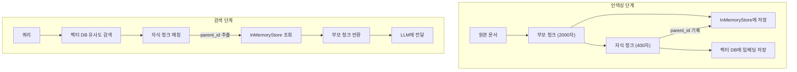
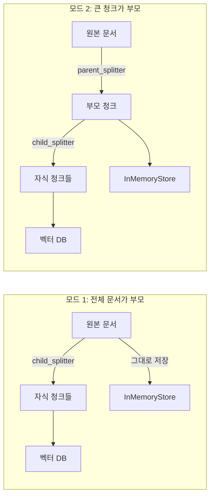

# 부모-자식 청킹 — 작게 검색하고 크게 반환하기

> 작은 청크로 정밀하게 검색하고, 큰 청크로 풍부한 컨텍스트를 LLM에 전달하는 이중 저장 전략

## 개요

이 섹션에서는 RAG 시스템의 근본적인 딜레마 — "검색 정밀도 vs. 컨텍스트 풍부함" — 를 해결하는 **부모-자식 청킹(Parent-Child Chunking)** 전략을 배웁니다. LangChain의 `ParentDocumentRetriever`를 사용하여 작은 자식 청크는 벡터 DB에, 큰 부모 청크는 문서 저장소에 각각 보관하는 이중 저장 구조를 구현합니다.

**선수 지식**: [텍스트 청킹 전략](ch04)에서 배운 `RecursiveCharacterTextSplitter`, 청크 크기와 오버랩 개념, [벡터 데이터베이스 기초](ch06)에서 배운 ChromaDB 사용법
**학습 목표**:
- 부모-자식 청킹이 해결하는 문제와 동작 원리를 설명할 수 있다
- `ParentDocumentRetriever`의 이중 저장 구조(벡터 DB + InMemoryStore)를 구현할 수 있다
- 부모/자식 청크 크기 조합을 실험하고 최적 설정을 선택할 수 있다

## 왜 알아야 할까?

[텍스트 청킹 전략](ch04)에서 청크 크기를 정할 때 고민했던 걸 기억하시나요? 청크를 작게 만들면 임베딩이 해당 내용의 의미를 정확하게 담아내지만, LLM이 받는 컨텍스트가 너무 짧아서 답변 품질이 떨어집니다. 반대로 청크를 크게 만들면 컨텍스트는 풍부하지만, 임베딩에 여러 주제가 섞여 검색 정밀도가 낮아지죠.

실무에서 이 문제는 정말 빈번하게 발생합니다. 예를 들어, 사내 기술 문서에서 "Redis의 TTL 설정 방법"을 검색할 때, 2000자짜리 청크에는 Redis 설치법, 설정법, 모니터링 등이 뒤섞여 있어 정확한 매칭이 어렵습니다. 그렇다고 200자짜리 청크를 쓰면 "TTL을 60초로 설정합니다"라는 문장만 검색되고, 앞뒤 맥락(왜 TTL이 필요한지, 어떤 상황에서 쓰는지)이 빠져버리거든요.

부모-자식 청킹은 이 딜레마를 우아하게 해결합니다. **검색은 작은 청크로, 반환은 큰 청크로.** 이 한 줄이 핵심입니다.

## 핵심 개념

### 개념 1: 청크 크기의 딜레마 — 왜 하나의 크기로는 부족한가

> 💡 **비유**: 도서관에서 책을 찾는다고 생각해보세요. 색인 카드(작은 청크)에는 "3장 2절: 신경망의 역전파"처럼 정확한 위치가 적혀 있어 원하는 내용을 빠르게 찾을 수 있습니다. 하지만 실제로 읽을 때는 색인 카드만 보는 게 아니라, 해당 절이 포함된 **챕터 전체**(큰 청크)를 펼쳐서 앞뒤 맥락과 함께 읽죠. 부모-자식 청킹은 바로 이 "색인은 정밀하게, 읽기는 넓게"라는 도서관의 원리를 RAG에 적용한 것입니다.

임베딩 모델의 특성을 생각해보면 이해가 쉽습니다. 임베딩 모델은 입력 텍스트의 **전체적인 의미**를 하나의 벡터로 압축합니다. 텍스트가 짧고 하나의 주제에 집중할수록, 생성된 벡터는 그 주제를 정확하게 표현합니다. 반면 텍스트가 길어지면 여러 주제가 섞이면서 벡터가 "평균적인" 의미를 갖게 되어, 특정 질문과의 매칭 정밀도가 떨어지거든요.

```run:python
# 청크 크기에 따른 임베딩 정밀도 차이를 직관적으로 이해해봅시다
small_chunk = "Redis의 TTL은 키의 만료 시간을 초 단위로 설정합니다."
large_chunk = """Redis는 인메모리 데이터베이스로, 설치는 apt-get install redis-server로 합니다.
데이터 타입으로는 String, List, Set, Hash 등이 있습니다.
TTL은 키의 만료 시간을 초 단위로 설정합니다.
모니터링은 redis-cli info 명령어로 할 수 있습니다."""

query = "Redis TTL 설정 방법"

print(f"쿼리: '{query}'")
print(f"\n작은 청크 (1주제): '{small_chunk}'")
print(f"  → 임베딩이 'Redis TTL 설정'에 집중 → 높은 유사도")
print(f"\n큰 청크 (4주제): '{large_chunk[:50]}...'")
print(f"  → 임베딩이 설치/타입/TTL/모니터링 평균 → 낮은 유사도")
```

```output
쿼리: 'Redis TTL 설정 방법'

작은 청크 (1주제): 'Redis의 TTL은 키의 만료 시간을 초 단위로 설정합니다.'
  → 임베딩이 'Redis TTL 설정'에 집중 → 높은 유사도

큰 청크 (4주제): 'Redis는 인메모리 데이터베이스로, 설치는 apt-get install re...'
  → 임베딩이 설치/타입/TTL/모니터링 평균 → 낮은 유사도
```

이처럼 검색에는 작은 청크가 유리하지만, LLM에 전달할 컨텍스트로는 큰 청크가 필요합니다. 부모-자식 청킹은 이 두 가지를 분리하여 **각각 최적화**합니다.

### 개념 2: 부모-자식 청킹의 동작 원리

> 💡 **비유**: 마트에서 물건을 찾는 과정을 떠올려보세요. 매장 안내판(자식 청크)에는 "라면 → 3번 통로 중간"이라고 정확한 위치만 적혀 있습니다. 하지만 실제로 3번 통로(부모 청크)에 도착하면 라면뿐 아니라 컵라면, 소스, 수프 등 관련 상품이 함께 진열되어 있죠. 안내판으로 **정확히 찾고**, 통로에서 **관련 상품까지 함께 보는** 것이 부모-자식 청킹의 원리입니다.

부모-자식 청킹의 핵심 구조는 이렇습니다:

**인덱싱 단계 (문서 저장)**:
1. 원본 문서를 큰 단위로 분할 → **부모 청크** (예: 2000자)
2. 각 부모 청크를 다시 작은 단위로 분할 → **자식 청크** (예: 400자)
3. 자식 청크만 벡터 DB에 임베딩하여 저장
4. 부모 청크는 별도의 문서 저장소(docstore)에 저장
5. 자식 → 부모 매핑 관계를 기록 (`parent_id`)

**검색 단계 (쿼리 처리)**:
1. 쿼리를 벡터 DB에서 검색 → 유사한 **자식 청크** 발견
2. 각 자식 청크의 `parent_id`를 추출
3. `parent_id`로 문서 저장소에서 해당 **부모 청크** 조회
4. 부모 청크를 LLM에 컨텍스트로 전달

> 📊 **그림 1**: 부모-자식 청킹의 인덱싱 및 검색 흐름



### 개념 3: 이중 저장소 전략 — 벡터 DB와 InMemoryStore

부모-자식 청킹에는 두 개의 저장소가 필요합니다:

| 저장소 | 저장 대상 | 역할 | 예시 |
|--------|----------|------|------|
| **벡터 DB** (ChromaDB 등) | 자식 청크 + 임베딩 | 유사도 기반 검색 | ChromaDB, FAISS, Pinecone |
| **문서 저장소** (docstore) | 부모 청크 원문 | ID 기반 조회 | InMemoryStore, Redis, SQL DB |

LangChain에서는 `InMemoryStore`를 기본 문서 저장소로 제공합니다. 이름 그대로 메모리에 딕셔너리 형태로 부모 청크를 저장하는데요, 프로토타이핑과 실험에는 편리하지만 프로세스가 종료되면 데이터가 사라진다는 점에 주의해야 합니다.

```python
from langchain.storage import InMemoryStore

# InMemoryStore는 내부적으로 딕셔너리와 같은 구조
store = InMemoryStore()

# 부모 청크 저장: {parent_id: Document} 형태
# ParentDocumentRetriever가 자동으로 관리하므로 직접 다룰 일은 적습니다
```

### 개념 4: ParentDocumentRetriever — LangChain의 구현체

LangChain은 부모-자식 청킹을 `ParentDocumentRetriever`라는 클래스로 깔끔하게 추상화해두었습니다. 핵심 파라미터를 살펴보겠습니다:

```python
from langchain.retrievers import ParentDocumentRetriever

retriever = ParentDocumentRetriever(
    vectorstore=vectorstore,      # 자식 청크를 저장할 벡터 DB
    docstore=store,               # 부모 청크를 저장할 문서 저장소
    child_splitter=child_splitter,  # 자식 청크 분할기 (필수)
    parent_splitter=parent_splitter,  # 부모 청크 분할기 (선택)
)
```

여기서 `parent_splitter`가 **선택 사항**이라는 점이 중요합니다. 두 가지 모드가 있거든요:

**모드 1: 전체 문서가 부모** (`parent_splitter` 미지정)
- 원본 문서 자체가 부모 청크가 됩니다
- 문서가 비교적 짧을 때 적합 (예: FAQ, 짧은 기사)

**모드 2: 큰 청크가 부모** (`parent_splitter` 지정)
- 원본 문서를 먼저 큰 청크로 나누고, 그 안에서 작은 자식 청크를 만듭니다
- 문서가 길 때 적합 (예: 기술 문서, 논문, 법률 문서)

> 📊 **그림 2**: ParentDocumentRetriever의 두 가지 모드 비교



```run:python
# 두 모드의 차이를 코드로 확인
print("=== 모드 1: 전체 문서가 부모 ===")
print("parent_splitter = None")
print("문서 전체 → InMemoryStore")
print("문서를 child_splitter로 분할 → 벡터 DB")
print()
print("=== 모드 2: 큰 청크가 부모 ===")
print("parent_splitter = RecursiveCharacterTextSplitter(chunk_size=2000)")
print("문서 → parent_splitter → 부모 청크 → InMemoryStore")
print("부모 청크 → child_splitter → 자식 청크 → 벡터 DB")
print()
print("💡 실무에서는 모드 2를 더 많이 사용합니다.")
print("   긴 문서에서 전체를 반환하면 LLM 컨텍스트 윈도우를 초과할 수 있거든요.")
```

```output
=== 모드 1: 전체 문서가 부모 ===
parent_splitter = None
문서 전체 → InMemoryStore
문서를 child_splitter로 분할 → 벡터 DB

=== 모드 2: 큰 청크가 부모 ===
parent_splitter = RecursiveCharacterTextSplitter(chunk_size=2000)
문서 → parent_splitter → 부모 청크 → InMemoryStore
부모 청크 → child_splitter → 자식 청크 → 벡터 DB

💡 실무에서는 모드 2를 더 많이 사용합니다.
   긴 문서에서 전체를 반환하면 LLM 컨텍스트 윈도우를 초과할 수 있거든요.
```

### 개념 5: 청크 크기 조합 최적화

부모와 자식 청크의 크기를 어떻게 조합하느냐에 따라 검색 품질이 크게 달라집니다. 핵심 원칙은 **자식은 충분히 작게, 부모는 충분히 크게, 그리고 그 비율을 적절하게** 유지하는 것입니다.

| 조합 | 자식 크기 | 부모 크기 | 비율 | 특징 |
|------|----------|----------|------|------|
| 보수적 | 200자 | 1000자 | 1:5 | 정밀한 검색, 적당한 컨텍스트 |
| **균형 (권장)** | **400자** | **2000자** | **1:5** | **검색 정밀도와 컨텍스트의 균형** |
| 공격적 | 400자 | 4000자 | 1:10 | 넓은 컨텍스트, 토큰 사용량 증가 |
| 초미세 | 100자 | 800자 | 1:8 | 매우 정밀한 검색, 짧은 답변에 적합 |

자식 청크가 너무 작으면(50자 미만) 의미 있는 임베딩을 만들기 어렵고, 부모 청크가 너무 크면 LLM의 컨텍스트 윈도우를 낭비하게 됩니다. 자식:부모 비율은 보통 **1:4 ~ 1:8** 범위가 효과적입니다.

## 실습: 직접 해보기

이제 `ParentDocumentRetriever`를 처음부터 끝까지 구현해봅시다. 한국어 기술 문서를 예제로 사용하겠습니다.

```python
# 필요한 패키지 설치
# pip install langchain langchain-community langchain-openai langchain-chroma chromadb

import os
from dotenv import load_dotenv

# 환경 변수에서 API 키 로드
load_dotenv()

from langchain_core.documents import Document
from langchain_text_splitters import RecursiveCharacterTextSplitter
from langchain_openai import OpenAIEmbeddings
from langchain_chroma import Chroma
from langchain.storage import InMemoryStore
from langchain.retrievers import ParentDocumentRetriever

# === 1단계: 샘플 문서 준비 ===
# 실제 기술 문서를 시뮬레이션하는 긴 텍스트
docs = [
    Document(
        page_content="""Redis는 Remote Dictionary Server의 약자로, 오픈소스 인메모리 데이터 구조 저장소입니다.
2009년 Salvatore Sanfilippo가 개발했으며, 현재 가장 인기 있는 키-값 저장소 중 하나입니다.

Redis의 핵심 데이터 타입으로는 String, List, Set, Sorted Set, Hash가 있습니다.
String은 가장 기본적인 타입으로 최대 512MB까지 저장할 수 있습니다.
List는 연결 리스트 구조로 push/pop 연산을 O(1)에 수행합니다.
Set은 중복을 허용하지 않는 문자열 컬렉션입니다.

TTL(Time To Live)은 Redis 키의 만료 시간을 설정하는 기능입니다.
EXPIRE 명령어로 초 단위, PEXPIRE로 밀리초 단위로 설정합니다.
TTL이 만료되면 키는 자동으로 삭제됩니다.
세션 관리, 캐시 무효화, 임시 데이터 저장 등에 활용됩니다.
PERSIST 명령어로 TTL을 제거하면 키는 영구적으로 유지됩니다.

Redis의 영속성(Persistence)은 RDB와 AOF 두 가지 방식을 지원합니다.
RDB는 특정 시점의 스냅샷을 디스크에 저장하는 방식입니다.
AOF는 모든 쓰기 명령을 로그 파일에 기록하는 방식입니다.
운영 환경에서는 두 가지를 함께 사용하는 것이 권장됩니다.

Redis Sentinel은 고가용성을 위한 모니터링 시스템입니다.
마스터 장애 시 자동으로 슬레이브를 마스터로 승격시킵니다.
Redis Cluster는 데이터를 여러 노드에 자동 분산하는 기능입니다.
16384개의 해시 슬롯으로 데이터를 분배합니다.""",
        metadata={"source": "redis_guide.md", "chapter": "Redis 완전 가이드"},
    ),
    Document(
        page_content="""PostgreSQL은 세계에서 가장 진보한 오픈소스 관계형 데이터베이스입니다.
1986년 UC Berkeley의 POSTGRES 프로젝트에서 시작되었습니다.

PostgreSQL의 인덱스 종류에는 B-tree, Hash, GiST, GIN, BRIN 등이 있습니다.
B-tree는 기본 인덱스로, 등호와 범위 검색에 효율적입니다.
GIN(Generalized Inverted Index)은 배열, JSONB, 전문 검색에 적합합니다.
BRIN(Block Range Index)은 물리적으로 정렬된 대용량 테이블에 효과적입니다.

VACUUM은 PostgreSQL의 MVCC로 인해 생기는 dead tuple을 정리하는 프로세스입니다.
MVCC는 동시성 제어를 위해 업데이트 시 새 버전의 행을 만드는 방식입니다.
Auto VACUUM이 기본 활성화되어 있지만, 대량 삭제 후에는 수동 실행이 필요할 수 있습니다.
VACUUM FULL은 테이블을 완전히 재작성하여 디스크 공간을 회수합니다.

PostgreSQL의 JSONB 타입은 JSON 데이터를 바이너리로 저장합니다.
GIN 인덱스와 결합하면 JSON 필드 내부까지 빠르게 검색할 수 있습니다.
@>, ?, ?| 등의 연산자로 JSON 데이터를 유연하게 쿼리합니다.""",
        metadata={"source": "postgresql_guide.md", "chapter": "PostgreSQL 심화"},
    ),
]

# === 2단계: 부모/자식 텍스트 분할기 설정 ===
# 부모 청크: 넓은 컨텍스트를 위해 크게 분할
parent_splitter = RecursiveCharacterTextSplitter(
    chunk_size=800,       # 부모 청크 크기
    chunk_overlap=100,    # 부모 청크 간 오버랩
)

# 자식 청크: 정밀한 검색을 위해 작게 분할
child_splitter = RecursiveCharacterTextSplitter(
    chunk_size=200,       # 자식 청크 크기
    chunk_overlap=30,     # 자식 청크 간 오버랩
)

# === 3단계: 저장소 초기화 ===
# 벡터 DB: 자식 청크의 임베딩 저장 및 유사도 검색
vectorstore = Chroma(
    collection_name="parent_child_demo",
    embedding_function=OpenAIEmbeddings(),
)

# 문서 저장소: 부모 청크 원문을 ID로 저장
store = InMemoryStore()

# === 4단계: ParentDocumentRetriever 생성 ===
retriever = ParentDocumentRetriever(
    vectorstore=vectorstore,
    docstore=store,
    child_splitter=child_splitter,
    parent_splitter=parent_splitter,   # 모드 2: 큰 청크가 부모
)

# === 5단계: 문서 인덱싱 ===
# add_documents가 자동으로:
# 1) parent_splitter로 부모 청크 생성 → InMemoryStore에 저장
# 2) child_splitter로 자식 청크 생성 → 벡터 DB에 임베딩/저장
# 3) 자식 → 부모 매핑(parent_id) 기록
retriever.add_documents(docs)

# === 6단계: 검색 실행 ===
# "Redis TTL"에 대해 검색
query = "Redis TTL 설정 방법은?"
results = retriever.invoke(query)

# 결과 확인
for i, doc in enumerate(results):
    print(f"=== 검색 결과 {i+1} ===")
    print(f"길이: {len(doc.page_content)}자")
    print(f"내용 미리보기: {doc.page_content[:150]}...")
    print()
```

이 코드를 실행하면, "Redis TTL"이라는 짧은 쿼리로 검색했지만 반환되는 문서는 TTL 내용을 포함한 **부모 청크 전체**(약 800자)가 됩니다. 자식 청크(약 200자)로 정밀하게 매칭한 후, 부모 청크로 교체하여 LLM이 충분한 맥락을 가지고 답변할 수 있게 해주는 거죠.

검색 과정을 좀 더 자세히 들여다보겠습니다:

```python
# 벡터 DB에 저장된 자식 청크 확인
child_docs = vectorstore.similarity_search("Redis TTL 설정", k=3)

print("=== 벡터 DB에서 검색된 자식 청크 ===")
for i, doc in enumerate(child_docs):
    print(f"\n--- 자식 청크 {i+1} (길이: {len(doc.page_content)}자) ---")
    print(doc.page_content[:200])

# InMemoryStore에 저장된 부모 청크 수 확인
parent_keys = list(store.yield_keys())
print(f"\n=== InMemoryStore의 부모 청크 수: {len(parent_keys)}개 ===")

# ParentDocumentRetriever의 검색 결과와 비교
parent_docs = retriever.invoke("Redis TTL 설정")
print(f"\n=== 최종 반환된 부모 청크 ===")
for i, doc in enumerate(parent_docs):
    print(f"\n--- 부모 청크 {i+1} (길이: {len(doc.page_content)}자) ---")
    print(doc.page_content[:300])
```

> 🔥 **실무 팁**: `retriever.invoke()`가 반환하는 문서 수가 예상보다 적을 수 있습니다. 여러 자식 청크가 같은 부모를 가리키면 중복이 제거되기 때문인데요, 이는 의도된 동작입니다. 벡터 DB에서 `k=6`으로 자식 청크를 가져와도, 모두 같은 부모에 속하면 부모 1개만 반환됩니다.

### 모드 1도 실험해보기: 전체 문서가 부모

```python
# parent_splitter를 지정하지 않으면 원본 문서 전체가 부모가 됩니다
retriever_full = ParentDocumentRetriever(
    vectorstore=Chroma(
        collection_name="full_parent_demo",
        embedding_function=OpenAIEmbeddings(),
    ),
    docstore=InMemoryStore(),
    child_splitter=child_splitter,
    # parent_splitter 생략 → 모드 1
)

retriever_full.add_documents(docs)
results_full = retriever_full.invoke("Redis TTL 설정 방법은?")

# 모드 1은 문서 전체를 반환
print(f"모드 1 반환 길이: {len(results_full[0].page_content)}자")
print(f"모드 2 반환 길이: {len(results[0].page_content)}자")
# 모드 1이 훨씬 길게 반환됩니다
```

## 더 깊이 알아보기

### 부모-자식 검색의 학술적 배경

부모-자식 청킹의 아이디어는 정보 검색(Information Retrieval) 분야에서 오래전부터 연구되어 온 **패시지 검색(Passage Retrieval)**에 뿌리를 두고 있습니다. 1990년대부터 연구자들은 "문서 전체를 검색 단위로 쓰면 정밀도가 떨어지지만, 문장 하나만 반환하면 맥락이 부족하다"는 문제를 인식하고 있었거든요.

이 아이디어가 RAG에 본격적으로 적용된 것은 2023년경입니다. LangChain 팀이 `ParentDocumentRetriever`를 구현하면서 "Small-to-Big" 검색 패턴이라는 이름으로 대중화했는데요, 핵심 통찰은 간단합니다 — **인덱싱과 검색의 단위를 분리하라**는 것이죠.

비슷한 시기에 LlamaIndex에서도 동일한 개념을 **Sentence Window Retrieval**이라는 이름으로 구현했습니다. 문장 단위로 인덱싱하되, 검색 시에는 해당 문장 주변의 "윈도우"를 함께 반환하는 방식인데요, 접근법은 약간 다르지만 "작게 검색하고 크게 반환한다"는 근본 원리는 동일합니다.

2024년 1월에 발표된 **RAPTOR**(Recursive Abstractive Processing for Tree-Organized Retrieval) 논문은 이 아이디어를 한 단계 더 발전시켰습니다. RAPTOR는 단순히 부모-자식 관계만 만드는 것이 아니라, 청크들을 클러스터링하고 요약하여 **트리 구조의 다층 인덱스**를 만듭니다. 부모-자식 청킹이 "2단 계층"이라면, RAPTOR는 "N단 계층"인 셈이죠 — 이 내용은 바로 다음 세션에서 자세히 다룹니다.

### InMemoryStore의 한계와 프로덕션 대안

`InMemoryStore`는 실험에는 완벽하지만, 프로덕션에서는 치명적인 약점이 있습니다 — 프로세스가 종료되면 모든 부모 청크 데이터가 사라지거든요. 실제 서비스에서는 다음과 같은 대안을 사용합니다:

- **Redis**: 빠른 읽기가 필요한 실시간 서비스에 적합
- **MongoDB / PostgreSQL**: 영속성과 트랜잭션이 필요한 경우
- **SQLite 기반 LocalFileStore**: 로컬 파일에 저장하는 간단한 대안

LangChain의 `create_kv_docstore()` 유틸리티를 사용하면 다양한 백엔드를 문서 저장소로 활용할 수 있습니다.

## 흔한 오해와 팁

> ⚠️ **흔한 오해**: "부모 청크도 임베딩되어 벡터 DB에 저장된다" — 아닙니다! 벡터 DB에 임베딩되는 것은 **자식 청크만**입니다. 부모 청크는 `InMemoryStore`(또는 다른 docstore)에 **원문 텍스트로만** 저장됩니다. 부모 청크는 임베딩 계산 없이 ID 기반으로 직접 조회되므로, 임베딩 비용은 자식 청크 수에 비례합니다. 부모 크기를 늘려도 임베딩 비용은 변하지 않는다는 뜻이죠.

> 💡 **알고 계셨나요?**: LangChain의 `ParentDocumentRetriever` 소스 코드를 들여다보면, 내부적으로 `MultiVectorRetriever`를 상속받고 있습니다. `MultiVectorRetriever`는 하나의 문서에 대해 **여러 개의 벡터 표현**을 가질 수 있게 해주는 범용 클래스인데요, 부모-자식 청킹 외에도 "문서 요약 + 원문", "다국어 번역본 + 원문" 등 다양한 멀티벡터 전략에 활용할 수 있습니다.

> 🔥 **실무 팁**: 청크 크기 조합을 실험할 때는 **RAGAS** 같은 평가 프레임워크로 정량적으로 측정하세요. "자식 200 / 부모 800"과 "자식 400 / 부모 2000" 중 어느 쪽이 나은지 직감에 의존하면 안 됩니다. [RAG 평가](ch17)에서 배울 Context Precision과 Context Recall 메트릭이 최적 조합을 찾는 데 큰 도움이 됩니다.

> 🔥 **실무 팁**: `InMemoryStore`를 쓸 때 주의할 점 — `add_documents()`를 호출할 때마다 새로운 UUID가 부모 청크에 할당됩니다. 같은 문서를 두 번 추가하면 중복 부모 청크가 생기고, 자식 청크도 두 배로 늘어납니다. 문서 업데이트 시에는 기존 데이터를 먼저 삭제한 후 다시 추가하는 것이 안전합니다.

## 핵심 정리

| 개념 | 설명 |
|------|------|
| 부모-자식 청킹 | 작은 자식 청크로 정밀 검색하고, 큰 부모 청크로 풍부한 컨텍스트를 제공하는 이중 저장 전략 |
| 자식 청크 | 벡터 DB에 임베딩되어 유사도 검색에 사용 (200~400자 권장) |
| 부모 청크 | 문서 저장소에 원문으로 저장되어 LLM 컨텍스트로 반환 (800~2000자 권장) |
| ParentDocumentRetriever | LangChain의 부모-자식 청킹 구현체. 벡터 DB + docstore 이중 저장 관리 |
| InMemoryStore | 부모 청크를 메모리에 저장하는 기본 docstore. 프로토타이핑용 |
| 모드 1 (전체 문서 부모) | `parent_splitter` 미지정. 원본 문서 전체가 부모. 짧은 문서에 적합 |
| 모드 2 (큰 청크 부모) | `parent_splitter` 지정. 문서를 먼저 큰 청크로 나눈 뒤 자식 분할. 긴 문서에 적합 |
| 자식:부모 비율 | 1:4 ~ 1:8 범위가 효과적. 권장 기본값은 400자:2000자 (1:5) |

## 다음 섹션 미리보기

세션 14.2에서는 **RAPTOR** — 문서를 재귀적으로 클러스터링하고 요약하여 다수준 트리 인덱스를 구축하는 기법을 학습합니다. 부모-자식 청킹이 개별 문서 내 로컬 컨텍스트를 다뤘다면, RAPTOR는 문서 전체를 관통하는 글로벌 컨텍스트까지 포착합니다.

## 참고 자료

- [How to use the Parent Document Retriever | LangChain 공식 문서](https://python.langchain.com/docs/how_to/parent_document_retriever/) - ParentDocumentRetriever의 공식 사용 가이드. 모드 1/모드 2 예제를 모두 다룹니다
- [ParentDocumentRetriever API Reference | LangChain](https://python.langchain.com/api_reference/langchain/retrievers/langchain.retrievers.parent_document_retriever.ParentDocumentRetriever.html) - 전체 파라미터와 메서드에 대한 API 레퍼런스
- [LangChain RAG From Scratch | GitHub](https://github.com/langchain-ai/rag-from-scratch) - LangChain 팀이 직접 만든 RAG 기초부터 고급까지 단계별 튜토리얼
- [Chunking Strategies for LLM Applications | Pinecone](https://www.pinecone.io/learn/chunking-strategies/) - 부모-자식 청킹을 포함한 다양한 청킹 전략의 비교 분석
- [RAPTOR: Recursive Abstractive Processing for Tree-Organized Retrieval](https://arxiv.org/abs/2401.18059) - 부모-자식 개념을 다층 트리 구조로 확장한 ICLR 2024 논문

---
### 🔗 Related Sessions
- [chunk_size](../04-텍스트-청킹-전략-문서-분할과-최적화/01-청킹의-중요성과-기본-원리.md) (prerequisite)
- [chunk_overlap](../04-텍스트-청킹-전략-문서-분할과-최적화/01-청킹의-중요성과-기본-원리.md) (prerequisite)
- [recursivecharactertextsplitter](../04-텍스트-청킹-전략-문서-분할과-최적화/02-고정-크기-청킹과-재귀적-청킹.md) (prerequisite)
