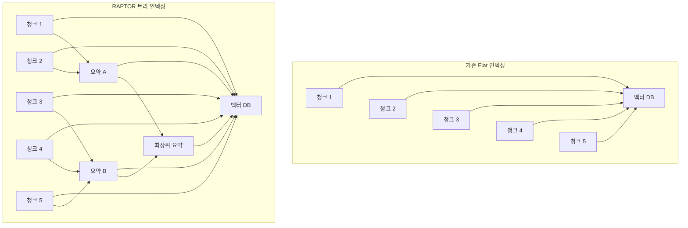
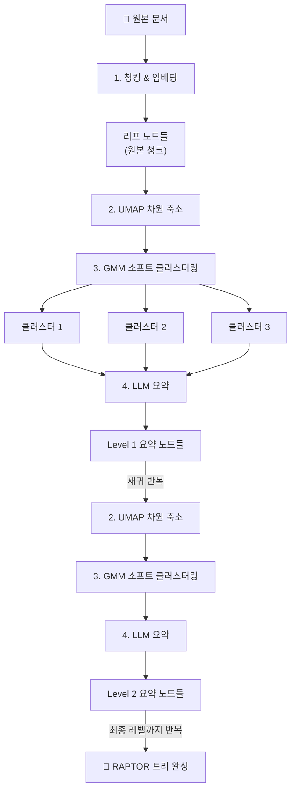
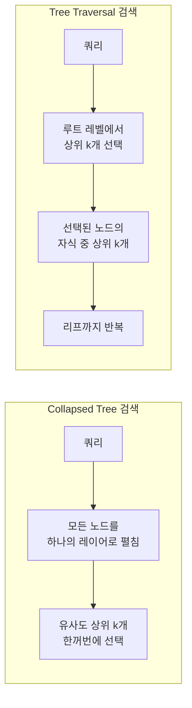

# RAPTOR — 계층적 요약을 통한 트리 인덱싱

> 문서를 재귀적으로 클러스터링하고 요약하여, 세부 사항부터 전체 맥락까지 다수준으로 검색하는 트리 인덱싱 기법

## 개요

이 섹션에서는 RAPTOR(Recursive Abstractive Processing for Tree-Organized Retrieval)의 핵심 아이디어를 이해하고, 리프 청크에서 시작하여 클러스터링과 요약을 반복해 트리를 구축하는 전체 과정을 학습합니다. 나아가 구축된 트리에서 다수준 검색을 수행하는 두 가지 전략을 비교하고, Python으로 직접 구현해 봅니다.

**선수 지식**: [14.1 부모-자식 청킹](14-1)에서 배운 이중 저장 전략과 Small-to-Big 검색 개념, 그리고 [4장 텍스트 청킹 전략](ch04)에서 다룬 텍스트 청킹 기초
**학습 목표**:
- RAPTOR의 "재귀적 클러스터링 → 요약 → 트리 구축" 파이프라인을 설명할 수 있다
- UMAP + GMM 소프트 클러스터링이 왜 필요한지 직관적으로 이해한다
- Collapsed Tree와 Tree Traversal 두 가지 검색 전략의 차이를 비교할 수 있다
- Python으로 간소화된 RAPTOR 파이프라인을 직접 구현할 수 있다

## 왜 알아야 할까?

앞서 [14.1 부모-자식 청킹](14-1)에서 부모-자식 청킹을 배웠죠? "작게 검색하고 크게 반환하기"라는 전략으로 검색 정밀도와 컨텍스트 풍부함을 동시에 잡았습니다. 하지만 한 가지 한계가 남아 있었는데요 — 부모-자식 청킹은 여전히 **개별 문서 내의 로컬 컨텍스트**만 다룹니다.

실제 RAG 시스템에서는 이런 질문도 들어옵니다:

- "이 논문 전체의 핵심 주장은 무엇인가?"
- "세 개 문서를 종합하면 어떤 결론이 나오는가?"
- "이 기술의 장단점을 전체적으로 비교해 달라"

이런 **고수준(high-level) 질문**에는 개별 청크를 아무리 잘 검색해도 답하기 어렵습니다. 문서 전체를 관통하는 맥락, 여러 청크에 흩어진 정보를 종합한 이해가 필요하거든요.

RAPTOR는 바로 이 문제를 해결합니다. 문서를 청크로 나눈 뒤, 비슷한 청크끼리 묶어 요약하고, 그 요약을 다시 묶어 더 높은 수준의 요약을 만드는 과정을 반복합니다. 결과적으로 **세부 사항부터 전체 맥락까지** 다양한 추상화 수준의 정보가 담긴 트리가 만들어지죠. 원본 RAPTOR 논문에서는 GPT-4와 결합했을 때 QuALITY 벤치마크에서 **절대 정확도 20% 향상**이라는 놀라운 결과를 보여주었습니다.

## 핵심 개념

### 개념 1: RAPTOR의 핵심 아이디어 — 지식 피라미드

> 💡 **비유**: 도서관의 분류 체계를 떠올려 보세요. 1층에는 개별 책(원본 청크)이 있고, 2층에는 주제별로 묶은 요약 카탈로그가 있고, 3층에는 분야별 개요서가 있습니다. "양자역학의 기본 원리"를 알고 싶으면 3층으로, "슈뢰딩거 방정식의 유도 과정"이 궁금하면 1층으로 가면 됩니다. RAPTOR는 이런 다층 도서관을 자동으로 구축하는 기법입니다.

RAPTOR의 전체 이름은 **Recursive Abstractive Processing for Tree-Organized Retrieval**입니다. 이름에서 알 수 있듯이 세 가지 핵심 요소가 있는데요:

1. **Recursive(재귀적)**: 같은 과정을 반복하며 트리를 아래에서 위로 쌓아 올립니다
2. **Abstractive Processing(추상적 처리)**: 단순 추출이 아닌, LLM이 내용을 이해하고 요약합니다
3. **Tree-Organized Retrieval(트리 구조 검색)**: 구축된 트리에서 적절한 수준의 정보를 검색합니다

기존 RAG는 문서를 일정 크기로 잘라서 벡터 DB에 넣고, 쿼리와 가장 유사한 청크 k개를 가져옵니다. 이 방식의 문제는 **모든 청크가 같은 추상화 수준**이라는 것이죠. 세부 사실을 묻는 질문에는 잘 작동하지만, 전체적인 맥락을 묻는 질문에는 힘을 못 씁니다.

> 📊 **그림 1**: 기존 RAG vs RAPTOR의 인덱싱 구조 비교



RAPTOR에서는 모든 레벨의 노드(리프 청크 + 중간 요약 + 최상위 요약)가 **동일한 벡터 DB**에 들어갑니다. 이렇게 하면 세부적인 질문에는 리프 청크가, 포괄적인 질문에는 상위 요약이 검색되어 나오죠.

### 개념 2: 트리 구축 파이프라인 — 4단계 프로세스

> 💡 **비유**: 학교에서 조별 발표를 준비한다고 생각해 보세요. 먼저 각자(리프 노드) 자료를 조사하고, 비슷한 주제를 맡은 사람끼리 소그룹(클러스터)을 만들어 미니 요약을 작성합니다. 그 다음 소그룹 대표들이 모여 중간 요약을 만들고, 최종적으로 조장이 전체 발표 요약을 작성합니다. 이것이 RAPTOR의 트리 구축 과정입니다.

RAPTOR의 트리 구축은 다음 4단계를 **재귀적으로** 반복합니다:

**1단계: 청킹 & 임베딩**
원본 문서를 적절한 크기의 청크로 나누고, 각 청크를 임베딩 벡터로 변환합니다. 이 청크들이 트리의 **리프 노드(leaf node)**가 됩니다.

**2단계: 차원 축소**
임베딩 벡터는 보통 768~1536차원으로, 이 상태로는 클러스터링이 잘 작동하지 않습니다. UMAP이라는 차원 축소 기법으로 **의미적 구조를 보존하면서** 10차원 정도로 압축합니다. 쉽게 말해, 고차원 공간에서 "어떤 청크가 어떤 청크와 가까운지"라는 관계를 유지하면서 다루기 쉬운 크기로 줄이는 거죠.

**3단계: 소프트 클러스터링**
차원 축소된 벡터들을 GMM(Gaussian Mixture Model)으로 클러스터링합니다. 여기서 핵심은 **소프트 클러스터링(soft clustering)**이라는 점인데요 — 하나의 청크가 여러 클러스터에 동시에 속할 수 있습니다. 예를 들어, "트랜스포머 아키텍처의 성능 비교"라는 청크는 '아키텍처' 클러스터와 '벤치마크' 클러스터 양쪽에 속할 수 있죠.

**4단계: LLM 요약**
각 클러스터에 속한 청크들을 하나로 합쳐 LLM에게 요약을 요청합니다. 이 요약이 트리의 **상위 노드**가 됩니다.

그리고 이 상위 노드들에 대해 **2~4단계를 다시 반복**합니다. 요약을 다시 임베딩하고, 클러스터링하고, 더 높은 수준의 요약을 만드는 거죠. 더 이상 클러스터를 만들 수 없을 때까지 반복하면 트리가 완성됩니다.

> 📊 **그림 2**: RAPTOR 트리 구축 파이프라인



### 개념 3: 왜 UMAP + GMM 조합인가?

> 💡 **비유**: 수백 장의 사진을 정리한다고 상상해 보세요. 먼저 비슷한 사진끼리 테이블 위에 펼쳐 놓습니다(UMAP — 고차원 특징을 2D 테이블 위에 매핑). 그 다음 "이 사진은 '여행' 앨범에도 들어가고 '음식' 앨범에도 들어갈 수 있다"고 판단합니다(GMM 소프트 클러스터링). K-Means처럼 하나의 앨범에만 강제로 넣지 않는 거죠.

왜 K-Means 같은 간단한 방법 대신 UMAP + GMM 조합을 쓸까요? 직관적으로 정리하면 이렇습니다:

**UMAP이 필요한 이유:**
임베딩 벡터는 768~1536차원이나 됩니다. 차원이 이렇게 높으면 데이터 포인트 간 거리가 전부 비슷비슷해져서 "가까운 것"과 "먼 것"을 구분하기 어려워집니다 — 이를 "차원의 저주"라고 부르죠. UMAP은 **"어떤 청크가 어떤 청크와 의미적으로 가까운가"라는 관계를 유지**하면서 10차원 정도로 줄여 줍니다. 덕분에 클러스터링 알고리즘이 제 역할을 할 수 있게 되는 거예요.

사용법 자체는 간단합니다:

```python
import umap

# UMAP으로 임베딩 차원 축소
reducer = umap.UMAP(
    n_neighbors=15,       # 이웃 범위: 클수록 전역 구조 보존, 작을수록 지역 구조 보존
    n_components=10,      # 축소 후 차원 수
    min_dist=0.01,        # 포인트 간 최소 거리
    metric="cosine"       # 임베딩에 적합한 거리 척도
)
reduced_embeddings = reducer.fit_transform(embeddings)
```

> ⚠️ **흔한 오해**: "UMAP은 시각화용 아닌가요?" — UMAP은 2D 시각화에도 많이 쓰이지만, RAPTOR에서는 10차원 정도로 축소하여 클러스터링 성능을 높이는 데 사용합니다. 시각화가 목적이 아니라 **차원의 저주를 피하면서 의미적 구조를 보존**하는 것이 핵심입니다.

**GMM 소프트 클러스터링이 필요한 이유:**
K-Means는 각 데이터를 정확히 하나의 클러스터에 할당합니다(하드 클러스터링). 하지만 텍스트는 여러 주제에 걸쳐 있을 수 있거든요. GMM은 각 데이터가 각 클러스터에 속할 **확률**을 계산하므로, 하나의 청크가 여러 클러스터의 요약에 포함될 수 있습니다. "트랜스포머의 성능 벤치마크"라는 청크가 '아키텍처' 주제와 '평가' 주제 모두에 포함되는 식이죠.

**최적 클러스터 수 결정:**
클러스터를 몇 개로 나눌지는 BIC(Bayesian Information Criterion)라는 점수로 자동 결정합니다. 여러 클러스터 수를 시도해 보고, BIC 점수가 가장 낮은 것을 고르면 됩니다. scikit-learn의 `GaussianMixture`가 이 과정을 쉽게 해 주죠:

```python
from sklearn.mixture import GaussianMixture
import numpy as np

def get_optimal_clusters(embeddings: np.ndarray, max_clusters: int = 50) -> int:
    """BIC를 사용하여 최적 클러스터 수를 결정합니다."""
    max_clusters = min(max_clusters, len(embeddings))
    bic_scores = []

    for n in range(1, max_clusters + 1):
        gmm = GaussianMixture(n_components=n, random_state=42)
        gmm.fit(embeddings)
        bic_scores.append(gmm.bic(embeddings))  # BIC가 낮을수록 좋음

    # BIC가 가장 낮은 클러스터 수 반환
    return int(np.argmin(bic_scores)) + 1
```

UMAP과 GMM의 수학적 원리가 궁금하다면 아래 [더 깊이 알아보기](#더-깊이-알아보기) 섹션에서 자세히 다루고 있으니 참고하세요.

### 개념 4: 두 가지 검색 전략 — Collapsed Tree vs Tree Traversal

트리를 다 구축했으면 이제 검색을 해야 하는데요, RAPTOR는 두 가지 검색 전략을 제안합니다.

> 📊 **그림 3**: Collapsed Tree vs Tree Traversal 검색 전략



**Collapsed Tree (평탄화 검색)**

트리의 모든 노드(리프 + 중간 요약 + 최상위 요약)를 하나의 평면으로 펼쳐 놓고, 쿼리와의 유사도를 한꺼번에 비교합니다. 토큰 제한에 도달할 때까지 유사도가 높은 노드들을 선택하죠.

- **장점**: 구현이 간단하고, 질문의 수준에 맞는 노드를 자동으로 선택
- **단점**: 모든 노드를 비교하므로 노드 수가 매우 많으면 느릴 수 있음

**Tree Traversal (트리 순회 검색)**

루트부터 시작하여 각 레벨에서 쿼리와 가장 유사한 노드 k개를 선택하고, 그 자식 노드들 중에서 다시 k개를 선택하는 방식으로 리프까지 내려갑니다.

- **장점**: 검색 범위를 좁혀가므로 대규모 트리에서 효율적
- **단점**: 상위에서 잘못된 경로를 타면 관련 정보를 놓칠 수 있음

> 🔥 **실무 팁**: 원본 RAPTOR 논문의 실험 결과에 따르면 **Collapsed Tree가 일관되게 더 좋은 성능**을 보였습니다. 모든 노드를 동시에 비교하기 때문에 질문에 딱 맞는 추상화 수준의 노드를 유연하게 선택할 수 있거든요. 특별한 이유가 없다면 Collapsed Tree를 기본 전략으로 사용하세요.

## 실습: 직접 해보기

이제 Python으로 간소화된 RAPTOR 파이프라인을 직접 구현해 봅시다. 전체 흐름(청킹 → 임베딩 → 클러스터링 → 요약 → 트리 검색)을 단계별로 구현합니다.

### 환경 설정

```python
# 필요한 패키지 설치
# pip install langchain langchain-openai chromadb tiktoken umap-learn scikit-learn numpy
```

### 전체 RAPTOR 구현

```python
import os
import numpy as np
from typing import Optional
from dataclasses import dataclass, field

import umap
from sklearn.mixture import GaussianMixture
from langchain_openai import ChatOpenAI, OpenAIEmbeddings
from langchain_core.prompts import ChatPromptTemplate
from langchain_text_splitters import RecursiveCharacterTextSplitter

# ──────────────────────────────────────────
# 1. 데이터 모델 정의
# ──────────────────────────────────────────
@dataclass
class Node:
    """RAPTOR 트리의 노드를 나타냅니다."""
    text: str                          # 원본 텍스트 또는 요약 텍스트
    index: int                         # 노드 고유 인덱스
    children: list[int] = field(default_factory=list)  # 자식 노드 인덱스
    embedding: Optional[np.ndarray] = None  # 임베딩 벡터
    level: int = 0                     # 트리에서의 레벨 (0=리프)


# ──────────────────────────────────────────
# 2. 임베딩 & 클러스터링 함수
# ──────────────────────────────────────────
def embed_texts(texts: list[str], emb_model: OpenAIEmbeddings) -> np.ndarray:
    """텍스트 리스트를 임베딩 벡터 배열로 변환합니다."""
    embeddings = emb_model.embed_documents(texts)
    return np.array(embeddings)


def reduce_dimensions(
    embeddings: np.ndarray,
    n_components: int = 10,
    n_neighbors: int | None = None,
) -> np.ndarray:
    """UMAP으로 임베딩 차원을 축소합니다."""
    n_samples = len(embeddings)
    if n_samples <= 2:
        return embeddings  # 너무 적으면 축소 불필요

    # n_neighbors 기본값: 데이터 크기에 맞게 조정
    if n_neighbors is None:
        n_neighbors = min(n_samples - 1, 15)
    n_components = min(n_components, n_samples - 1)

    reducer = umap.UMAP(
        n_neighbors=n_neighbors,
        n_components=n_components,
        min_dist=0.01,
        metric="cosine",
        random_state=42,
    )
    return reducer.fit_transform(embeddings)


def cluster_embeddings(
    embeddings: np.ndarray,
    threshold: float = 0.5,
    max_clusters: int = 50,
) -> list[list[int]]:
    """GMM 소프트 클러스터링으로 임베딩을 그룹화합니다."""
    n_samples = len(embeddings)
    if n_samples <= 1:
        return [list(range(n_samples))]

    # 최적 클러스터 수 결정 (BIC 기반)
    max_k = min(max_clusters, n_samples)
    best_bic = float("inf")
    best_n = 1

    for n in range(1, max_k + 1):
        gmm = GaussianMixture(n_components=n, random_state=42)
        gmm.fit(embeddings)
        bic = gmm.bic(embeddings)
        if bic < best_bic:
            best_bic = bic
            best_n = n

    # 최적 클러스터 수로 GMM 피팅
    gmm = GaussianMixture(n_components=best_n, random_state=42)
    gmm.fit(embeddings)
    probs = gmm.predict_proba(embeddings)  # (n_samples, n_clusters)

    # 소프트 클러스터링: 확률이 threshold 이상이면 해당 클러스터에 포함
    clusters: list[list[int]] = [[] for _ in range(best_n)]
    for i in range(n_samples):
        for j in range(best_n):
            if probs[i, j] >= threshold:
                clusters[j].append(i)

    # 빈 클러스터 제거
    clusters = [c for c in clusters if len(c) > 0]
    return clusters


# ──────────────────────────────────────────
# 3. 요약 함수
# ──────────────────────────────────────────
SUMMARY_PROMPT = ChatPromptTemplate.from_template(
    "다음 텍스트들을 종합하여 핵심 내용을 한국어로 요약해 주세요.\n"
    "중요한 사실, 수치, 개념을 빠뜨리지 마세요.\n\n"
    "{context}"
)

def summarize_cluster(
    texts: list[str],
    llm: ChatOpenAI,
) -> str:
    """클러스터에 속한 텍스트들을 LLM으로 요약합니다."""
    context = "\n\n---\n\n".join(texts)
    chain = SUMMARY_PROMPT | llm
    response = chain.invoke({"context": context})
    return response.content


# ──────────────────────────────────────────
# 4. RAPTOR 트리 구축
# ──────────────────────────────────────────
def build_raptor_tree(
    documents: list[str],
    emb_model: OpenAIEmbeddings,
    llm: ChatOpenAI,
    max_levels: int = 3,
    chunk_size: int = 1000,
    chunk_overlap: int = 100,
    cluster_threshold: float = 0.5,
) -> list[Node]:
    """RAPTOR 트리를 구축합니다."""
    # 1단계: 원본 문서 → 리프 청크
    splitter = RecursiveCharacterTextSplitter(
        chunk_size=chunk_size,
        chunk_overlap=chunk_overlap,
    )
    chunks = []
    for doc in documents:
        chunks.extend(splitter.split_text(doc))

    print(f"📄 리프 청크 {len(chunks)}개 생성")

    # 리프 노드 생성
    all_nodes: list[Node] = []
    embeddings = embed_texts(chunks, emb_model)

    for i, (text, emb) in enumerate(zip(chunks, embeddings)):
        node = Node(text=text, index=i, embedding=emb, level=0)
        all_nodes.append(node)

    # 재귀적 트리 구축
    current_level_nodes = list(range(len(all_nodes)))  # 현재 레벨의 노드 인덱스

    for level in range(1, max_levels + 1):
        if len(current_level_nodes) <= 1:
            print(f"🌳 레벨 {level}에서 노드 부족 → 트리 구축 완료")
            break

        # 현재 레벨 노드들의 임베딩 수집
        level_embeddings = np.array([
            all_nodes[idx].embedding for idx in current_level_nodes
        ])

        # UMAP 차원 축소
        reduced = reduce_dimensions(level_embeddings)

        # GMM 클러스터링
        clusters = cluster_embeddings(reduced, threshold=cluster_threshold)
        print(f"🔗 레벨 {level}: {len(clusters)}개 클러스터 생성")

        # 각 클러스터를 요약하여 상위 노드 생성
        new_level_indices = []
        for cluster_indices in clusters:
            # 클러스터에 속한 실제 노드 인덱스 매핑
            actual_indices = [current_level_nodes[ci] for ci in cluster_indices]
            cluster_texts = [all_nodes[idx].text for idx in actual_indices]

            # LLM 요약
            summary = summarize_cluster(cluster_texts, llm)

            # 요약 노드의 임베딩 생성
            summary_emb = embed_texts([summary], emb_model)[0]

            # 새 노드 추가
            new_index = len(all_nodes)
            new_node = Node(
                text=summary,
                index=new_index,
                children=actual_indices,
                embedding=summary_emb,
                level=level,
            )
            all_nodes.append(new_node)
            new_level_indices.append(new_index)

        current_level_nodes = new_level_indices
        print(f"📝 레벨 {level}: {len(new_level_indices)}개 요약 노드 생성")

    print(f"\n🌳 RAPTOR 트리 완성: 총 {len(all_nodes)}개 노드")
    return all_nodes


# ──────────────────────────────────────────
# 5. Collapsed Tree 검색
# ──────────────────────────────────────────
def collapsed_tree_retrieval(
    query: str,
    all_nodes: list[Node],
    emb_model: OpenAIEmbeddings,
    top_k: int = 5,
) -> list[Node]:
    """모든 노드를 평탄화하여 유사도 기반 검색을 수행합니다."""
    # 쿼리 임베딩
    query_emb = np.array(emb_model.embed_query(query))

    # 모든 노드와의 코사인 유사도 계산
    similarities = []
    for node in all_nodes:
        if node.embedding is not None:
            cos_sim = np.dot(query_emb, node.embedding) / (
                np.linalg.norm(query_emb) * np.linalg.norm(node.embedding)
            )
            similarities.append((node, cos_sim))

    # 유사도 높은 순으로 정렬
    similarities.sort(key=lambda x: x[1], reverse=True)

    # 상위 k개 반환
    return [node for node, _ in similarities[:top_k]]
```

### 실행 예제

```run:python
# ──────────────────────────────────────────
# RAPTOR 파이프라인 실행 데모
# ──────────────────────────────────────────
# 예시 문서 (실제로는 더 긴 문서를 사용)
sample_documents = [
    """트랜스포머(Transformer)는 2017년 구글이 "Attention is All You Need" 논문에서 제안한 
    딥러닝 아키텍처입니다. 셀프 어텐션 메커니즘을 사용하여 입력 시퀀스의 모든 위치를 
    동시에 처리합니다. RNN이나 LSTM과 달리 병렬 처리가 가능하여 학습 속도가 빠릅니다.""",

    """BERT는 구글이 2018년에 발표한 사전 학습 언어 모델입니다. 트랜스포머의 인코더 부분만 
    사용하며, MLM(Masked Language Model)과 NSP(Next Sentence Prediction) 태스크로 
    학습합니다. 양방향 컨텍스트를 이해할 수 있다는 것이 핵심 장점입니다.""",

    """GPT 시리즈는 OpenAI가 개발한 생성형 언어 모델입니다. 트랜스포머의 디코더 부분만 
    사용하며, 자기회귀(autoregressive) 방식으로 다음 토큰을 예측합니다. 
    GPT-3는 1750억 개의 파라미터를 가지며, few-shot 학습 능력이 뛰어납니다.""",

    """RAG(Retrieval-Augmented Generation)는 외부 지식을 검색하여 LLM의 응답을 보강하는 
    기법입니다. 할루시네이션을 줄이고 최신 정보를 반영할 수 있습니다. 
    임베딩 기반 검색과 생성 모델을 결합합니다.""",
]

# 트리 구축 시뮬레이션 (API 호출 없이 구조를 보여줌)
print("=" * 50)
print("RAPTOR 트리 구축 시뮬레이션")
print("=" * 50)
print(f"\n📄 입력 문서: {len(sample_documents)}개")
print(f"📏 평균 문서 길이: {sum(len(d) for d in sample_documents) // len(sample_documents)}자")

# 트리 구조 시뮬레이션
print("\n🌳 트리 구조:")
print("  Level 0 (리프): 4개 청크")
print("    ├── 청크 0: 트랜스포머 아키텍처")
print("    ├── 청크 1: BERT 모델")
print("    ├── 청크 2: GPT 시리즈")
print("    └── 청크 3: RAG 기법")
print("  Level 1 (요약): 2개 노드")
print("    ├── 요약 A: [청크 0, 1] → '트랜스포머 기반 인코더/디코더 모델'")
print("    └── 요약 B: [청크 2, 3] → '생성 모델과 검색 증강 기법'")
print("  Level 2 (최상위): 1개 노드")
print("    └── 루트: [요약 A, B] → 'NLP 핵심 기술 통합 요약'")
print(f"\n✅ 총 노드 수: 4(리프) + 2(L1) + 1(L2) = 7개")
print("✅ 모든 7개 노드가 벡터 DB에 저장됨 (Collapsed Tree)")
```

```output
==================================================
RAPTOR 트리 구축 시뮬레이션
==================================================

📄 입력 문서: 4개
📏 평균 문서 길이: 136자

🌳 트리 구조:
  Level 0 (리프): 4개 청크
    ├── 청크 0: 트랜스포머 아키텍처
    ├── 청크 1: BERT 모델
    ├── 청크 2: GPT 시리즈
    └── 청크 3: RAG 기법
  Level 1 (요약): 2개 노드
    ├── 요약 A: [청크 0, 1] → '트랜스포머 기반 인코더/디코더 모델'
    └── 요약 B: [청크 2, 3] → '생성 모델과 검색 증강 기법'
  Level 2 (최상위): 1개 노드
    └── 루트: [요약 A, B] → 'NLP 핵심 기술 통합 요약'

✅ 총 노드 수: 4(리프) + 2(L1) + 1(L2) = 7개
✅ 모든 7개 노드가 벡터 DB에 저장됨 (Collapsed Tree)
```

### Collapsed Tree 검색 시뮬레이션

```run:python
# Collapsed Tree 검색이 어떻게 작동하는지 시뮬레이션
queries = [
    "BERT의 학습 방식은?",                    # → 리프 노드 매칭 (세부 질문)
    "트랜스포머 기반 모델들의 공통점은?",       # → Level 1 요약 매칭 (중간 질문)
    "최신 NLP 기술의 전체적인 흐름은?",         # → Level 2 요약 매칭 (고수준 질문)
]

print("=" * 50)
print("Collapsed Tree 검색 시뮬레이션")
print("=" * 50)

for q in queries:
    print(f"\n🔍 쿼리: \"{q}\"")
    if "BERT" in q:
        print("   → 매칭: Level 0 (리프) — 청크 1: BERT 모델 상세 설명")
        print("   → 세부 사실 질문 → 원본 청크가 가장 유사")
    elif "공통점" in q:
        print("   → 매칭: Level 1 (요약) — 요약 A: 트랜스포머 기반 모델 종합")
        print("   → 비교/종합 질문 → 중간 수준 요약이 가장 유사")
    else:
        print("   → 매칭: Level 2 (루트) — 루트: NLP 핵심 기술 통합 요약")
        print("   → 전체 흐름 질문 → 최상위 요약이 가장 유사")
```

```output
==================================================
Collapsed Tree 검색 시뮬레이션
==================================================

🔍 쿼리: "BERT의 학습 방식은?"
   → 매칭: Level 0 (리프) — 청크 1: BERT 모델 상세 설명
   → 세부 사실 질문 → 원본 청크가 가장 유사

🔍 쿼리: "트랜스포머 기반 모델들의 공통점은?"
   → 매칭: Level 1 (요약) — 요약 A: 트랜스포머 기반 모델 종합
   → 비교/종합 질문 → 중간 수준 요약이 가장 유사

🔍 쿼리: "최신 NLP 기술의 전체적인 흐름은?"
   → 매칭: Level 2 (루트) — 루트: NLP 핵심 기술 통합 요약
   → 전체 흐름 질문 → 최상위 요약이 가장 유사
```

### ChromaDB를 활용한 Collapsed Tree 저장

실제 프로덕션에서는 모든 노드를 벡터 DB에 저장합니다. 아래는 ChromaDB를 사용한 예시입니다:

```python
import chromadb
from chromadb.utils import embedding_functions

def store_raptor_tree_in_chroma(
    all_nodes: list[Node],
    collection_name: str = "raptor_tree",
) -> chromadb.Collection:
    """RAPTOR 트리의 모든 노드를 ChromaDB에 저장합니다."""
    client = chromadb.Client()
    openai_ef = embedding_functions.OpenAIEmbeddingFunction(
        api_key=os.environ["OPENAI_API_KEY"],
        model_name="text-embedding-3-small",
    )

    collection = client.get_or_create_collection(
        name=collection_name,
        embedding_function=openai_ef,
    )

    # 모든 노드를 하나의 컬렉션에 저장 (Collapsed Tree)
    texts = [node.text for node in all_nodes]
    ids = [f"node_{node.index}" for node in all_nodes]
    metadatas = [
        {
            "level": node.level,
            "children": str(node.children),
            "node_type": "leaf" if node.level == 0 else "summary",
        }
        for node in all_nodes
    ]

    collection.add(
        documents=texts,
        ids=ids,
        metadatas=metadatas,
    )

    print(f"✅ {len(all_nodes)}개 노드를 ChromaDB에 저장 완료")
    return collection


def query_raptor_tree(
    collection: chromadb.Collection,
    query: str,
    top_k: int = 5,
) -> dict:
    """Collapsed Tree 검색을 수행합니다."""
    results = collection.query(
        query_texts=[query],
        n_results=top_k,
        include=["documents", "metadatas", "distances"],
    )

    # 검색 결과를 레벨별로 분류하여 반환
    retrieved = []
    for doc, meta, dist in zip(
        results["documents"][0],
        results["metadatas"][0],
        results["distances"][0],
    ):
        retrieved.append({
            "text": doc,
            "level": meta["level"],
            "node_type": meta["node_type"],
            "distance": dist,
        })

    return retrieved
```

## 더 깊이 알아보기

### RAPTOR의 탄생 — 스탠포드 NLP 연구실에서 시작된 아이디어

RAPTOR는 2024년 1월 스탠포드 대학교의 Parth Sarthi, Salman Abdullah, Aditi Tuli, Shubh Khanna, Anna Goldie, 그리고 NLP의 거장 **Christopher D. Manning** 교수가 함께 발표한 논문에서 시작되었습니다. Manning 교수는 Stanford NLP Group의 수장으로, Word2Vec 이전부터 NLP 연구를 이끌어 온 인물이죠.

이 논문은 ICLR 2024(International Conference on Learning Representations)에 정식 채택되었습니다. 핵심 관찰은 단순했습니다: "기존 RAG는 짧은 연속 청크만 검색하기 때문에 문서 전체의 맥락을 파악하지 못한다." 이 간단한 통찰에서 출발하여, **텍스트를 계층적으로 조직화하면 다양한 수준의 질문에 대응할 수 있다**는 아이디어를 체계적으로 검증한 것이죠.

> 💡 **알고 계셨나요?** RAPTOR라는 이름은 "Recursive Abstractive Processing for Tree-Organized Retrieval"의 약자인데요, 공교롭게도 '랩터'는 민첩하고 지능적인 공룡을 떠올리게 합니다. 실제로 RAPTOR의 검색 방식도 다양한 추상화 수준을 민첩하게 오가며 최적의 정보를 사냥(?)하는 모습이 닮아 있죠.

### 세션 14.1과의 연결 — 부모-자식 청킹에서 RAPTOR로

앞서 배운 부모-자식 청킹은 **문서 내부**에서 작은 청크(자식)와 큰 청크(부모)를 연결하는 전략이었습니다. RAPTOR는 이를 한 차원 더 발전시킨 것으로 볼 수 있는데요:

| 비교 항목 | 부모-자식 청킹 | RAPTOR |
|-----------|---------------|--------|
| 상위 노드 생성 | 원본 텍스트의 더 큰 범위 | LLM이 생성한 **요약** |
| 다루는 범위 | 단일 문서 내부 | 문서 간 **교차** 요약 가능 |
| 레벨 수 | 2 레벨 (자식 ↔ 부모) | N 레벨 (재귀적) |
| 추가 비용 | 저장 공간만 | LLM 요약 호출 비용 |
| 적합한 상황 | 단일 문서 QA | 다문서 종합, 복잡한 추론 |

두 기법은 배타적이지 않습니다. 부모-자식 청킹으로 기본 인덱싱을 하고, RAPTOR로 고수준 요약 레이어를 추가하는 **하이브리드 접근**도 가능합니다.

### 수학적 배경: UMAP, GMM, BIC

본문에서 "직관적으로" 설명한 UMAP과 GMM의 수학적 원리를 좀 더 자세히 살펴보겠습니다.

**UMAP의 차원 축소 원리**

UMAP은 고차원 데이터의 **위상적 구조(topological structure)**를 보존하면서 저차원으로 변환합니다. 구체적으로, 고차원에서의 이웃 관계를 퍼지 심플리셜 집합(fuzzy simplicial set)으로 모델링하고, 저차원에서도 이 구조가 최대한 보존되도록 최적화합니다. `n_neighbors` 파라미터가 이 과정에서 핵심적인데요:

```python
# n_neighbors에 따른 UMAP의 동작 차이
# 큰 값: 전역(global) 구조 보존 — 큰 주제 단위로 분리
global_reducer = umap.UMAP(
    n_neighbors=int(len(embeddings) - 1),
    n_components=10,
    min_dist=0.1,
    metric="cosine"
)

# 작은 값: 지역(local) 구조 보존 — 세부 주제 단위로 분리
local_reducer = umap.UMAP(
    n_neighbors=10,
    n_components=10,
    min_dist=0.01,
    metric="cosine"
)
```

**GMM의 소프트 클러스터링 수식**

GMM이 각 데이터 포인트 $x$가 클러스터 $k$에 속할 확률은 다음과 같이 계산됩니다:

$$P(z = k | x) = \frac{\pi_k \cdot \mathcal{N}(x | \mu_k, \Sigma_k)}{\sum_{j=1}^{K} \pi_j \cdot \mathcal{N}(x | \mu_j, \Sigma_j)}$$

- $\pi_k$: 클러스터 $k$의 혼합 가중치 (해당 클러스터의 사전 확률)
- $\mu_k, \Sigma_k$: 클러스터 $k$의 평균과 공분산
- $\mathcal{N}$: 다변량 정규분포

이게 의미하는 바는, 각 청크가 모든 클러스터에 대해 "이 클러스터에 속할 확률"을 받는다는 것입니다. 확률이 threshold(예: 0.5) 이상인 클러스터에 모두 포함되므로, 여러 주제에 걸친 청크도 놓치지 않고 처리할 수 있죠.

**BIC(Bayesian Information Criterion)로 최적 클러스터 수 결정**

BIC는 최적 클러스터 수 $K$를 결정하는 기준입니다:

$$\text{BIC} = -2 \ln(\hat{L}) + k \ln(n)$$

- $\hat{L}$: 최대 우도(likelihood)
- $k$: 모델 파라미터 수
- $n$: 데이터 포인트 수

BIC가 낮을수록 좋은 모델이며, 복잡도(파라미터 수)에 패널티를 주어 과적합을 방지합니다. 클러스터 수가 너무 적으면 우도가 낮아 BIC가 높아지고, 너무 많으면 파라미터 패널티로 BIC가 높아지므로, 균형점이 최적 클러스터 수가 됩니다.

## 흔한 오해와 팁

> ⚠️ **흔한 오해**: "RAPTOR는 요약이 많으니 정보 손실이 심하지 않을까?" — 아닙니다! RAPTOR는 원본 리프 청크를 **삭제하지 않습니다**. 모든 레벨의 노드가 벡터 DB에 함께 저장되기 때문에, 세부 사실이 필요하면 리프 노드가 검색되고, 전체 맥락이 필요하면 요약 노드가 검색됩니다. 정보가 사라지는 것이 아니라 **추가**되는 것이죠.

> ⚠️ **흔한 오해**: "클러스터링을 하면 K-Means면 충분하지 않나?" — RAPTOR에서 GMM을 쓰는 이유는 **소프트 클러스터링** 때문입니다. K-Means는 각 데이터를 정확히 하나의 클러스터에만 할당하지만, 텍스트 청크는 여러 주제를 동시에 다룰 수 있습니다. "트랜스포머의 성능 벤치마크"라는 청크가 '아키텍처' 주제와 '평가' 주제 모두에 관련될 수 있죠. GMM은 이런 다중 소속을 자연스럽게 처리합니다.

> 💡 **알고 계셨나요?** RAPTOR 논문에서 GPT-4와 결합했을 때 QuALITY 벤치마크에서 **절대 정확도 20% 향상**을 달성했습니다. QuALITY는 긴 문서에 대한 복잡한 추론 질문 벤치마크인데, 기존 flat 검색으로는 문서 전체를 관통하는 정보를 수집하기 어려웠던 것이죠.

> 🔥 **실무 팁**: RAPTOR의 트리 구축은 **인덱싱 시점**에 한 번만 실행됩니다. LLM 요약 호출 비용이 발생하지만, 한 번 구축하면 이후 검색은 일반 벡터 검색과 동일한 속도입니다. 문서가 자주 바뀌지 않는 지식 베이스에 특히 적합합니다. 다만 문서가 수시로 업데이트되는 경우에는 트리 재구축 비용을 고려해야 합니다.

> 🔥 **실무 팁**: `cluster_threshold` 값을 조절하여 소프트 클러스터링의 강도를 제어할 수 있습니다. 0.1로 낮추면 청크가 더 많은 클러스터에 중복 포함되어 요약이 풍부해지지만 비용이 늘고, 0.8로 높이면 거의 하드 클러스터링처럼 동작합니다. 일반적으로 0.3~0.5가 적절합니다.

## 핵심 정리

| 개념 | 설명 |
|------|------|
| RAPTOR | 재귀적으로 클러스터링하고 요약하여 트리 구조 인덱스를 구축하는 기법 |
| 리프 노드 | 원본 문서를 청킹한 최하위 노드 (기존 RAG의 청크와 동일) |
| UMAP | 고차원 임베딩을 저차원으로 축소하여 클러스터링 성능을 높이는 기법 |
| GMM 소프트 클러스터링 | 하나의 청크가 여러 클러스터에 속할 수 있는 확률적 클러스터링 |
| BIC | 최적 클러스터 수를 결정하는 모델 선택 기준 |
| Collapsed Tree 검색 | 모든 레벨의 노드를 하나의 레이어로 펼쳐서 검색 (추천 방식) |
| Tree Traversal 검색 | 루트에서 리프까지 레벨별로 탐색하는 검색 방식 |
| 다수준 검색 | 세부 질문 → 리프, 종합 질문 → 요약, 고수준 질문 → 루트가 자동 매칭 |

## 다음 섹션 미리보기

이번 세션에서 RAPTOR의 계층적 요약 인덱싱을 배웠다면, 다음 세션에서는 **시멘틱 청킹(Semantic Chunking)**을 다룹니다. 지금까지 우리가 사용한 청킹은 고정 크기(예: 1000자)로 문서를 나누는 방식이었는데요, 시멘틱 청킹은 **임베딩 유사도를 기반으로 의미 전환 지점을 자동 감지**하여 문단 경계를 결정합니다. 이 기법을 RAPTOR의 리프 노드 생성 단계에 적용하면 의미적으로 더 응집력 있는 청크로 트리를 구축할 수 있어, 검색 품질이 한층 더 올라갑니다.

## 참고 자료

- [RAPTOR: Recursive Abstractive Processing for Tree-Organized Retrieval (원본 논문)](https://arxiv.org/abs/2401.18059) - Parth Sarthi 등 스탠포드 연구진의 원본 논문. ICLR 2024 채택. RAPTOR의 알고리즘, 실험 결과, 검색 전략을 상세히 설명
- [RAPTOR 공식 GitHub 구현](https://github.com/parthsarthi03/raptor) - 논문 저자가 공개한 공식 Python 구현. BaseSummarizationModel, BaseQAModel, BaseEmbeddingModel 확장 가능
- [LangChain RAG From Scratch — RAPTOR 편](https://github.com/langchain-ai/rag-from-scratch) - LangChain의 RAG From Scratch 시리즈 13번째 영상 및 노트북. RAPTOR의 핵심 개념을 코드와 함께 설명
- [Improving RAG with RAPTOR (VectorHub by Superlinked)](https://superlinked.com/vectorhub/articles/improve-rag-with-raptor) - UMAP + GMM 클러스터링, Collapsed Tree vs Tree Traversal 검색을 코드와 함께 상세히 설명하는 실전 가이드
- [Retrieval-Augmented Generation for Large Language Models: A Survey](https://arxiv.org/abs/2312.10997) - RAG 기법 전반을 다룬 서베이 논문. RAPTOR를 포함한 고급 인덱싱 전략의 위치를 이해하는 데 유용

---
### 🔗 Related Sessions
- [부모-자식 청킹](../14-고급-청킹과-인덱싱-raptor-시멘틱-청킹-부모-자식-청킹/01-부모-자식-청킹-작게-검색하고-크게-반환하기.md) (prerequisite)
- [parentdocumentretriever](../14-고급-청킹과-인덱싱-raptor-시멘틱-청킹-부모-자식-청킹/01-부모-자식-청킹-작게-검색하고-크게-반환하기.md) (prerequisite)
