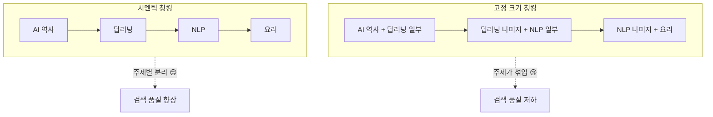
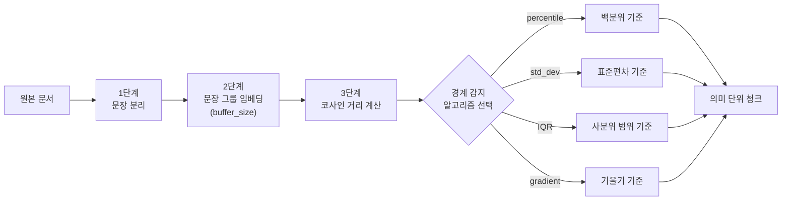
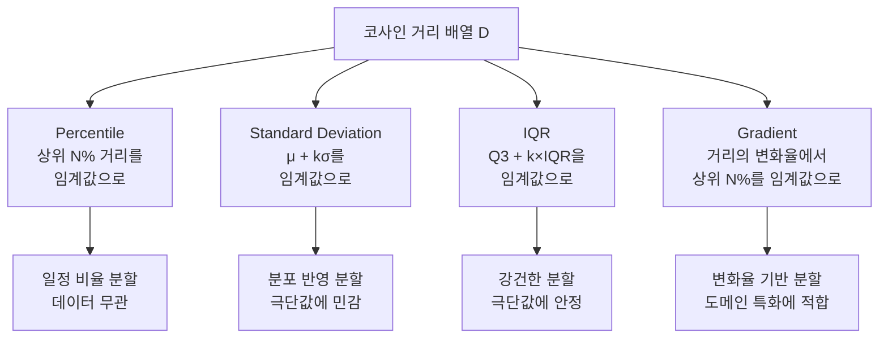
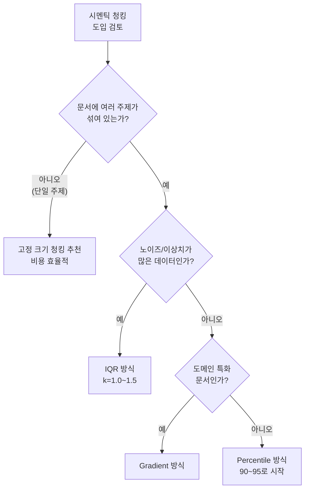

# 시멘틱 청킹 심화 — 의미 경계 감지 알고리즘

> 임베딩 유사도 기반으로 의미가 전환되는 지점을 자동 감지하여, 고정 크기가 아닌 "의미 단위"로 문서를 분할하는 시멘틱 청킹의 핵심 알고리즘을 깊이 파헤칩니다.

## 개요

이 세션에서는 시멘틱 청킹의 내부 작동 원리, 즉 **의미 경계를 감지하는 구체적인 알고리즘**들을 학습합니다. [14.2 RAPTOR](14-고급-청킹과-인덱싱-raptor-시멘틱-청킹-부모-자식-청킹/02-raptor-계층적-요약을-통한-트리-인덱싱.md)에서 UMAP 차원 축소와 GMM 클러스터링이라는 고급 알고리즘을 다뤘는데요, 좋은 소식이 있습니다 — 시멘틱 청킹은 그보다 **훨씬 직관적인 통계 기법**만으로 작동합니다. "두 문장이 얼마나 다른가?"를 숫자로 측정한 뒤, "이상하게 큰 숫자"를 찾는 것이 전부거든요.

LangChain의 `SemanticChunker`가 제공하는 네 가지 분할 기준(percentile, standard_deviation, interquartile, gradient)의 원리를 이해하고, 각각의 장단점을 실험으로 비교합니다.

**선수 지식**: [4장 텍스트 청킹 전략](04-텍스트-청킹-전략-문서-분할과-최적화/01-청킹의-중요성과-기본-원리.md)에서 학습한 기본 청킹 개념, [5장 임베딩 모델 이해](05-임베딩-모델-이해-텍스트를-벡터로-변환/01-임베딩의-기본-개념-단어에서-문장까지.md)에서 배운 코사인 유사도(Cosine Similarity) 개념

**학습 목표**:
- 시멘틱 청킹의 3단계 파이프라인(문장 분리 → 임베딩 → 경계 감지)을 설명할 수 있다
- percentile, standard_deviation, interquartile, gradient 네 가지 분할 기준의 원리와 차이를 이해한다
- 문서 특성에 따라 최적의 분할 기준을 선택할 수 있다
- 시멘틱 청킹의 비용 구조를 이해하고, 도입 여부를 판단할 수 있다

## 왜 알아야 할까?

[4장](04-텍스트-청킹-전략-문서-분할과-최적화/01-청킹의-중요성과-기본-원리.md)에서 배운 고정 크기 청킹을 떠올려 봅시다. 텍스트를 500자씩 잘라내는 방식이었죠? 빠르고 예측 가능하지만, 한 가지 치명적인 약점이 있습니다.

> 💡 **비유**: 고정 크기 청킹은 마치 **긴 빵을 자로 재서 정확히 10cm마다 자르는 것**과 같습니다. 빵 안에 딸기잼 구간과 초콜릿 구간이 있는데, 그런 건 신경 쓰지 않고 기계적으로 자르는 거죠. 결과적으로 한 조각에 딸기잼과 초콜릿이 섞여 있을 수 있습니다.

시멘틱 청킹은 이 문제를 **"맛이 바뀌는 지점"을 자동으로 감지**해서 해결합니다. 빵의 딸기잼↔초콜릿 경계를 찾아서 거기서 자르는 거죠. 그런데 컴퓨터가 "의미가 바뀐다"는 것을 어떻게 판단할까요?

사실 원리는 생각보다 간단합니다. [5장](05-임베딩-모델-이해-텍스트를-벡터로-변환/01-임베딩의-기본-개념-단어에서-문장까지.md)에서 배운 임베딩과 코사인 유사도를 기억하시나요? 비슷한 의미의 문장은 임베딩 벡터가 가깝고, 다른 의미의 문장은 멀어진다는 것이요. 시멘틱 청킹은 바로 이 원리를 활용합니다:

1. 문장들을 순서대로 임베딩한다
2. 이웃한 문장끼리 유사도를 비교한다
3. 유사도가 **갑자기 뚝 떨어지는 지점** = 의미 경계!

이 "뚝 떨어지는 지점"을 판단하는 방법이 네 가지가 있는데, 모두 고등학교 수준의 통계 개념(평균, 표준편차, 백분위수)이면 충분히 이해할 수 있습니다. RAPTOR의 UMAP이나 GMM보다 훨씬 친근한 도구들이죠.

실무에서 시멘틱 청킹을 도입하려면, 단순히 `SemanticChunker`를 호출하는 것만으로는 부족합니다. 네 가지 분할 기준 중 어떤 것을 쓸지, 임계값을 얼마로 설정할지, 비용 대비 효과가 있는지를 판단해야 하거든요. 이 세션에서 그 판단 기준을 확실히 잡아보겠습니다.

## 핵심 개념

### 개념 1: 고정 크기 → 시멘틱 — 무엇이 달라지나?

본격적인 알고리즘에 들어가기 전에, 고정 크기 청킹과 시멘틱 청킹의 차이를 한눈에 비교해 보겠습니다.

> 💡 **비유**: 고정 크기 청킹은 **줄자로 재서 자르는 것**, 시멘틱 청킹은 **문단이 바뀌는 곳에서 자르는 것**입니다. 후자가 더 자연스럽지만, "문단이 바뀌는 곳"을 자동으로 찾아야 하는 추가 작업이 필요하죠.

> 📊 **그림 1**: 고정 크기 청킹 vs 시멘틱 청킹



핵심 차이를 표로 정리하면 이렇습니다:

| 구분 | 고정 크기 청킹 | 시멘틱 청킹 |
|------|---------------|------------|
| **분할 기준** | 글자 수 / 토큰 수 | 의미 유사도 변화 |
| **장점** | 빠름, 비용 없음, 예측 가능 | 의미 단위로 자연스러운 분할 |
| **단점** | 주제 경계 무시 | 임베딩 API 비용, 느림 |
| **필요 도구** | 없음 | 임베딩 모델 |

그렇다면 시멘틱 청킹은 구체적으로 어떤 단계를 거칠까요?

### 개념 2: 시멘틱 청킹의 3단계 파이프라인

> 💡 **비유**: 시멘틱 청킹은 **라디오 주파수 튜닝**과 비슷합니다. 라디오를 돌리다 보면 방송이 선명한 구간과 "치지직" 잡음이 나는 구간이 있죠? 시멘틱 청킹은 문서를 읽어가면서 "의미의 잡음"이 발생하는 지점 — 즉 주제가 전환되는 지점 — 을 찾아 거기서 자릅니다.

LangChain의 `SemanticChunker`는 내부적으로 세 단계를 거칩니다:

**1단계: 문장 분리 (Sentence Splitting)**
원본 텍스트를 개별 문장으로 나눕니다. 기본적으로 마침표, 물음표, 느낌표 등을 기준으로 분리하며, 정규식(`sentence_split_regex`)으로 커스터마이징할 수 있습니다.

**2단계: 문장 그룹 임베딩 (Sentence Group Embedding)**
여기서 흥미로운 점이 있는데요 — 개별 문장 하나만 임베딩하는 게 아니라, **앞뒤 문장을 묶어서 그룹으로 임베딩**합니다. `buffer_size=1`(기본값)이면 [이전 문장 + 현재 문장 + 다음 문장] 3개를 합쳐서 하나의 임베딩을 만듭니다. 이렇게 하면 문맥을 더 풍부하게 반영할 수 있습니다.

**3단계: 유사도 비교 및 경계 감지 (Similarity Comparison & Boundary Detection)**
인접한 문장 그룹의 임베딩 사이에서 코사인 유사도(Cosine Similarity)를 계산합니다. 유사도가 갑자기 떨어지는 지점이 바로 "의미 경계"입니다. 이 경계를 어떤 기준으로 판단하느냐에 따라 네 가지 알고리즘이 나뉩니다.

> 📊 **그림 2**: 시멘틱 청킹의 3단계 파이프라인



기본적인 `SemanticChunker` 사용법을 먼저 살펴보겠습니다:

```python
from langchain_experimental.text_splitter import SemanticChunker
from langchain_openai import OpenAIEmbeddings

# 임베딩 모델 초기화
embeddings = OpenAIEmbeddings(model="text-embedding-3-small")

# 시멘틱 청커 생성 (기본: percentile 방식)
chunker = SemanticChunker(
    embeddings=embeddings,
    breakpoint_threshold_type="percentile",  # 분할 기준
    breakpoint_threshold_amount=95,           # 임계값
    buffer_size=1,                            # 앞뒤 문장 포함 개수
)

# 텍스트 분할
chunks = chunker.split_text(document_text)
```

### 개념 3: 핵심 아이디어 — "이상하게 큰 거리"를 찾는 네 가지 방법

네 가지 알고리즘을 본격적으로 살펴보기 전에, 공통 원리를 먼저 이해합시다. 시멘틱 청커는 인접 문장 그룹 간의 **코사인 거리(1 - 코사인 유사도)** 배열을 먼저 구합니다.

> 💡 **비유**: 열 명의 학생이 줄을 서 있고, 옆 사람과의 **키 차이**를 측정했다고 합시다. 대부분 비슷비슷한데 중간에 키 차이가 **유독 큰 곳**이 있다면? 거기가 바로 "초등학생 줄 → 중학생 줄"의 경계일 겁니다. 시멘틱 청킹도 마찬가지예요 — 문장 사이의 의미 거리를 쭉 나열한 뒤, **유독 큰 거리**가 나타나는 곳에서 자릅니다.

문제는 "유독 크다"를 어떻게 정의하느냐인데요, 여기서 네 가지 방법이 갈라집니다. 각각을 시험 성적에 비유해서 이해해 보겠습니다:

| 방법 | 비유 | 핵심 질문 |
|------|------|----------|
| **Percentile** | "상위 5% 안에 드는 점수인가?" | 전체 중 몇 퍼센트나 큰가? |
| **Standard Deviation** | "평균에서 너무 먼 점수인가?" | 평균 + 표준편차 N배를 넘는가? |
| **IQR** | "중간 50%와 너무 동떨어진가?" | 사분위 범위 기준 이상치인가? |
| **Gradient** | "점수가 갑자기 뛰어오른 지점인가?" | 변화율이 급격한가? |

이제 하나씩 구체적으로 살펴보겠습니다.

#### 3-1. Percentile (백분위 기준)

가장 직관적인 방법입니다. 모든 거리 값을 정렬한 뒤, **상위 N%에 해당하는 값**을 임계값으로 사용합니다.

$$\text{threshold} = P_k(D)$$

- $D$: 인접 문장 간 코사인 거리 배열
- $P_k$: $k$번째 백분위수 (기본값 $k = 95$)
- 거리 $d_i > \text{threshold}$인 지점에서 분할

이게 의미하는 바는, "전체 문장 쌍 중 상위 5%에 해당할 만큼 의미 차이가 큰 지점에서만 자르겠다"는 뜻입니다. 쉽게 말해, **"거리 순위 상위 5%만 경계로 본다"**는 거죠.

```run:python
import numpy as np

# 예시: 10개 문장 간 코사인 거리
distances = np.array([0.12, 0.15, 0.08, 0.45, 0.11, 0.09, 0.52, 0.14, 0.10])

# Percentile 방식: 95번째 백분위수를 임계값으로
threshold = np.percentile(distances, 95)
breakpoints = np.where(distances > threshold)[0]

print(f"거리 배열: {distances}")
print(f"95th percentile 임계값: {threshold:.3f}")
print(f"분할 지점 (인덱스): {breakpoints}")
print(f"→ 문장 {breakpoints[0]+1}과 {breakpoints[0]+2} 사이에서 분할")
```

```output
거리 배열: [0.12 0.15 0.08 0.45 0.11 0.09 0.52 0.14 0.1 ]
95th percentile 임계값: 0.492
분할 지점 (인덱스): [6]
→ 문장 7과 8 사이에서 분할
```

**장점**: 직관적이고, 데이터 분포에 무관하게 일정 비율로 분할
**단점**: 문서 내 주제 전환이 많든 적든, 항상 비슷한 개수의 경계가 생김

#### 3-2. Standard Deviation (표준편차 기준)

거리 배열의 **평균과 표준편차**를 계산해서, 평균에서 N 표준편차 이상 벗어난 거리를 경계로 판단합니다. 고등학교 수학에서 배운 정규분포를 떠올리시면 됩니다.

$$\text{threshold} = \mu(D) + k \cdot \sigma(D)$$

- $\mu(D)$: 거리 배열의 평균 — "보통 문장 간 거리가 이 정도"
- $\sigma(D)$: 거리 배열의 표준편차 — "보통 거리의 흩어진 정도"
- $k$: 배수 (기본값 $k = 3$, 실무에서는 $k = 1 \sim 2$ 추천)
- 거리 $d_i > \text{threshold}$인 지점에서 분할

쉽게 말하면, **"평균보다 k배의 표준편차만큼 더 먼 거리는 비정상적 → 경계!"** 라는 논리입니다.

```run:python
import numpy as np

distances = np.array([0.12, 0.15, 0.08, 0.45, 0.11, 0.09, 0.52, 0.14, 0.10])

mean = np.mean(distances)
std = np.std(distances)
k = 3  # 기본 배수
threshold = mean + k * std

breakpoints = np.where(distances > threshold)[0]

print(f"평균: {mean:.3f}, 표준편차: {std:.3f}")
print(f"임계값 (μ + 3σ): {threshold:.3f}")
print(f"분할 지점: {breakpoints}")
print(f"→ k=3이면 분할 없음! k를 낮춰보겠습니다.")

# k=1로 낮추면
threshold_k1 = mean + 1 * std
breakpoints_k1 = np.where(distances > threshold_k1)[0]
print(f"\n임계값 (μ + 1σ): {threshold_k1:.3f}")
print(f"분할 지점 (k=1): {breakpoints_k1}")
```

```output
평균: 0.196, 표준편차: 0.155
임계값 (μ + 3σ): 0.660
분할 지점: []
→ k=3이면 분할 없음! k를 낮춰보겠습니다.

임계값 (μ + 1σ): 0.350
분할 지점 (k=1): [3 6]
```

**장점**: 데이터의 실제 분포를 반영하여, 주제 전환이 적은 문서는 적게 자르고, 많은 문서는 많이 자름
**단점**: 극단값에 민감 — 하나의 거대한 주제 전환이 평균과 표준편차를 왜곡할 수 있음

> ⚠️ **흔한 오해**: "k=3이 기본값이니까 항상 3을 쓰면 된다"고 생각하기 쉽지만, 실제로 k=3은 너무 보수적이어서 **거의 분할이 일어나지 않는 경우**가 많습니다. 위 예시에서도 k=3이면 경계를 하나도 못 찾았죠! 실무에서는 k=1~2가 더 실용적인 결과를 줍니다.

#### 3-3. Interquartile Range (사분위 범위 기준)

통계학에서 이상치를 탐지하는 대표적인 방법인 **IQR 방식**을 사용합니다. 박스플롯(box plot)을 그릴 때 쓰는 바로 그 방법이에요.

$$IQR = Q_3 - Q_1$$
$$\text{threshold} = Q_3 + k \cdot IQR$$

- $Q_1$: 1사분위수 (하위 25%) — "작은 쪽 기준점"
- $Q_3$: 3사분위수 (상위 25%) — "큰 쪽 기준점"
- $IQR$: 사분위 범위 (중간 50%의 폭) — "보통 값들의 폭"
- $k$: 배수 (기본값 $k = 1.5$)

이 방식의 핵심 장점은 **극단값에 강건(robust)** 하다는 것입니다. 평균과 표준편차는 극단값 하나에 크게 흔들리지만, 사분위수는 중간 50%를 기준으로 하므로 양 끝의 이상치에 영향을 덜 받습니다.

```run:python
import numpy as np

distances = np.array([0.12, 0.15, 0.08, 0.45, 0.11, 0.09, 0.52, 0.14, 0.10])

q1 = np.percentile(distances, 25)
q3 = np.percentile(distances, 75)
iqr = q3 - q1
k = 1.5  # 기본 배수
threshold = q3 + k * iqr

breakpoints = np.where(distances > threshold)[0]

print(f"Q1: {q1:.3f}, Q3: {q3:.3f}, IQR: {iqr:.3f}")
print(f"임계값 (Q3 + 1.5×IQR): {threshold:.3f}")
print(f"분할 지점: {breakpoints}")
```

```output
Q1: 0.100, Q3: 0.150, IQR: 0.050
임계값 (Q3 + 1.5×IQR): 0.225
분할 지점: [3 6]
```

**장점**: 극단값에 강건하여 안정적인 분할, 박스플롯 이상치 탐지와 동일한 원리
**단점**: 거리 분포가 매우 좁을 때(모든 문장이 비슷한 주제) 과도하게 많은 분할이 발생할 수 있음

#### 3-4. Gradient (기울기 기준)

가장 최근에 추가된 방법으로, 거리 배열의 **변화율(기울기)**에 percentile을 적용합니다.

핵심 아이디어는 이렇습니다 — 거리 자체의 크기가 아니라, 거리가 **급격히 변하는 지점**을 찾는 것입니다. 예를 들어 거리가 [0.1, 0.12, 0.11, 0.45, ...]로 갈 때, 0.11→0.45의 "점프"가 경계입니다.

$$G_i = D_{i+1} - D_i$$
$$\text{threshold} = P_k(|G|)$$

- $G$: 거리 배열의 1차 차분 (gradient) — "거리가 얼마나 변했나"
- $|G|$: gradient의 절대값
- $P_k$: gradient 절대값 배열의 $k$번째 백분위수 (기본 $k = 95$)

이 방식은 **도메인 특화 문서(법률, 의학 등)**처럼 전체적으로 유사도가 높은 문서에서 특히 유용합니다. 절대적 거리는 모두 낮지만, 미세한 변화율 차이로 경계를 잡을 수 있거든요.

> 📊 **그림 3**: 네 가지 경계 감지 알고리즘 비교



### 개념 4: 알고리즘 선택 가이드

어떤 알고리즘을 써야 할지 판단하려면, 문서의 특성을 먼저 파악해야 합니다. 처음 시작할 때는 기본값인 `percentile`로 시작하고, 결과를 보면서 조정하면 됩니다.

| 문서 특성 | 추천 알고리즘 | 이유 |
|-----------|-------------|------|
| **일반적 용도, 빠른 시작** | `percentile` (기본값) | 가장 직관적, 튜닝 쉬움 |
| **주제 다양성 높음** (뉴스, 백과사전) | `percentile` | 일정 비율로 안정적 분할 |
| **주제 전환이 명확** (교과서, 매뉴얼) | `standard_deviation` (k=1~2) | 큰 전환만 정확히 포착 |
| **노이즈 많은 데이터** (웹 크롤링, OCR) | `interquartile` | 극단값에 강건 |
| **도메인 특화** (법률, 의학) | `gradient` | 미세한 주제 변화 감지 |

> 🔥 **실무 팁**: 알고리즘 선택이 어렵다면 이 단순한 규칙을 따르세요: **"일단 `percentile` 90으로 시작해서, 청크가 너무 많으면 95로, 너무 적으면 80으로 조정한다."** 대부분의 경우 이것만으로 충분합니다.

### 개념 5: 비용 분석 — 시멘틱 청킹은 그만한 가치가 있을까?

> 💡 **비유**: 시멘틱 청킹은 **맞춤 양복**과 같습니다. 기성복(고정 크기 청킹)보다 핏이 좋지만, 재단사(임베딩 API)에게 치수를 재는 비용이 추가되죠. 문제는 — 그 비용을 치를 만큼 핏이 좋아지느냐입니다.

시멘틱 청킹의 비용 구조를 정직하게 살펴보겠습니다:

**임베딩 API 호출 비용**
- 고정 크기 청킹: 최종 청크만 임베딩 → N개 임베딩
- 시멘틱 청킹: **모든 문장**을 먼저 임베딩 → M개 임베딩 (M >> N) + 최종 청크 N개 임베딩
- 10,000단어 문서라면 약 200~300개 문장 임베딩이 추가로 필요

**실제 비용 계산 예시** (`text-embedding-3-small` 기준):
- 1,000 토큰당 약 $0.00002
- 10,000단어 문서 ≈ 13,000 토큰 → 약 $0.00026 (시멘틱 청킹 추가 비용)
- 10,000개 문서: 약 $2.6 추가 비용

비용 자체는 크지 않지만, **처리 시간**이 더 큰 문제입니다. 문장마다 API를 호출하면 I/O 대기 시간이 크게 늘어나거든요.

그렇다면 시멘틱 청킹은 정말 비용만큼의 가치가 있을까요? 2024년 10월, Vectara의 연구자 Renyi Qu 등이 발표한 논문 [*"Is Semantic Chunking Worth the Computational Cost?"*](https://arxiv.org/abs/2410.13070)(Qu et al., 2024)가 이 질문에 정면으로 답합니다. 이 논문은 세 가지 검색 태스크에서 시멘틱 청킹과 고정 크기 청킹을 비교했는데, **비합성 데이터셋에서는 고정 크기 청킹과 통계적으로 유의미한 차이가 없거나 오히려 고정 크기가 더 나은 경우**도 있었습니다. 시멘틱 청킹이 일관된 성능 향상을 보인 것은 **주제 다양성이 인위적으로 높은 테스트 케이스**에 한정되었습니다.

이는 "시멘틱 청킹이 항상 더 좋다"는 통념에 도전하는 중요한 발견입니다. 다만 이 논문도 인정하듯, 시멘틱 청킹의 진가는 **여러 이질적 주제가 섞인 긴 문서**에서 발휘됩니다.

> 💡 **알고 계셨나요?**: Qu et al.(2024) 논문에 따르면, 시멘틱 청킹이 가장 큰 효과를 보인 시나리오는 **하나의 문서 안에 3개 이상의 이질적 주제가 혼재**하는 경우였습니다. 반대로, 학술 논문처럼 하나의 주제를 심도 있게 다루는 문서에서는 고정 크기 청킹과 거의 차이가 없었습니다. 따라서 시멘틱 청킹의 도입 여부를 결정할 때 가장 먼저 물어야 할 질문은 "우리 문서가 다주제(multi-topic) 문서인가?"입니다.

> 📊 **그림 4**: 시멘틱 청킹 도입 의사결정 흐름



## 실습: 직접 해보기

네 가지 알고리즘을 동일한 문서에 적용하고, 결과를 비교하는 완전한 실습 코드입니다.

```python
import os
import numpy as np
from dotenv import load_dotenv
from langchain_experimental.text_splitter import SemanticChunker
from langchain_openai import OpenAIEmbeddings

load_dotenv()

# 임베딩 모델 초기화
embeddings = OpenAIEmbeddings(model="text-embedding-3-small")

# 다양한 주제가 포함된 테스트 문서
sample_text = """
인공지능의 역사는 1956년 다트머스 회의에서 시작되었습니다. 존 매카시, 마빈 민스키 등이 
"인공지능"이라는 용어를 처음 사용했죠. 초기 AI 연구는 기호주의 접근법에 집중했습니다.
규칙 기반 시스템과 전문가 시스템이 주류를 이루었습니다.

그러나 1980년대 AI 겨울이 찾아왔습니다. 기대에 비해 성과가 부족했고, 연구 자금이 대폭 
삭감되었습니다. 많은 연구자들이 다른 분야로 떠났습니다.

2012년, 딥러닝이 이미지 인식 대회에서 압도적 성능을 보이면서 AI 르네상스가 시작되었습니다.
AlexNet은 ImageNet 대회에서 오류율을 크게 낮추었습니다. 이후 CNN, RNN, Transformer 등
다양한 아키텍처가 발전했습니다.

한편, 자연어 처리 분야에서는 2017년 Transformer의 등장이 혁명적이었습니다.
"Attention is All You Need" 논문은 기존 RNN 기반 모델을 대체했습니다.
BERT, GPT 시리즈가 연이어 등장하며 NLP의 판도가 바뀌었습니다.

최근에는 RAG(Retrieval-Augmented Generation)가 주목받고 있습니다.
LLM의 할루시네이션 문제를 외부 지식 검색으로 보완하는 접근법입니다.
벡터 데이터베이스와 임베딩 모델의 발전이 RAG를 실용적으로 만들었습니다.

요리에 대해 이야기해봅시다. 한국의 김치는 세계적으로 유명한 발효 식품입니다.
배추, 고춧가루, 젓갈 등을 사용하여 만들며, 유산균이 풍부합니다.
김치찌개, 김치볶음밥 등 다양한 요리에 활용됩니다.

다시 기술 이야기로 돌아오면, 벡터 데이터베이스는 RAG의 핵심 인프라입니다.
ChromaDB, FAISS, Pinecone 등 다양한 선택지가 있습니다.
각각의 장단점이 있어 사용 사례에 맞게 선택해야 합니다.
""".strip()


def compare_chunking_strategies(text: str, embeddings) -> dict:
    """네 가지 시멘틱 청킹 전략을 비교하는 함수"""
    
    strategies = {
        "percentile": {"breakpoint_threshold_type": "percentile", "breakpoint_threshold_amount": 90},
        "standard_deviation": {"breakpoint_threshold_type": "standard_deviation", "breakpoint_threshold_amount": 1.0},
        "interquartile": {"breakpoint_threshold_type": "interquartile", "breakpoint_threshold_amount": 1.5},
        "gradient": {"breakpoint_threshold_type": "gradient", "breakpoint_threshold_amount": 90},
    }
    
    results = {}
    
    for name, params in strategies.items():
        chunker = SemanticChunker(
            embeddings=embeddings,
            **params,
        )
        chunks = chunker.split_text(text)
        
        # 청크 통계 계산
        chunk_lengths = [len(c) for c in chunks]
        results[name] = {
            "num_chunks": len(chunks),
            "avg_length": np.mean(chunk_lengths),
            "std_length": np.std(chunk_lengths),
            "min_length": min(chunk_lengths),
            "max_length": max(chunk_lengths),
            "chunks": chunks,
        }
    
    return results


# 비교 실행
results = compare_chunking_strategies(sample_text, embeddings)

# 결과 출력
print("=" * 70)
print("시멘틱 청킹 알고리즘 비교 결과")
print("=" * 70)

for name, stats in results.items():
    print(f"\n📌 {name}")
    print(f"   청크 수: {stats['num_chunks']}개")
    print(f"   평균 길이: {stats['avg_length']:.0f}자")
    print(f"   길이 편차: {stats['std_length']:.0f}자")
    print(f"   최소/최대: {stats['min_length']}자 / {stats['max_length']}자")
    print(f"   ---")
    for i, chunk in enumerate(stats['chunks']):
        # 각 청크의 첫 40자만 미리보기
        preview = chunk[:40].replace('\n', ' ')
        print(f"   청크 {i+1}: [{len(chunk)}자] {preview}...")

# AI/요리 주제 분리 성공 여부 확인
print("\n" + "=" * 70)
print("🔍 주제 분리 성공 여부 (AI ↔ 요리)")
print("=" * 70)
keyword = "김치"
for name, stats in results.items():
    # "김치"가 독립 청크에 있는지 확인
    kimchi_chunks = [i for i, c in enumerate(stats['chunks']) if keyword in c]
    if kimchi_chunks:
        chunk_idx = kimchi_chunks[0]
        has_ai_content = "인공지능" in stats['chunks'][chunk_idx] or "RAG" in stats['chunks'][chunk_idx]
        status = "❌ AI 내용과 혼합" if has_ai_content else "✅ 요리 주제 분리 성공"
    else:
        status = "⚠️ 키워드 없음"
    print(f"   {name}: {status}")
```

다음으로, 임계값을 튜닝하면서 분할 결과가 어떻게 달라지는지 확인해보겠습니다:

```python
import numpy as np


def simulate_threshold_tuning(distances: np.ndarray) -> None:
    """다양한 임계값 설정에 따른 분할 지점 변화를 시뮬레이션"""
    
    print("코사인 거리 배열:")
    print(f"  {distances}\n")
    
    # 1. Percentile: 다양한 백분위 테스트
    print("📊 Percentile 방식 — 백분위별 분할")
    for pct in [70, 80, 90, 95]:
        threshold = np.percentile(distances, pct)
        breaks = np.where(distances > threshold)[0]
        print(f"  {pct}th: 임계값={threshold:.3f}, 분할 {len(breaks)}회 → 인덱스 {breaks.tolist()}")
    
    # 2. Standard Deviation: 다양한 k값 테스트
    print("\n📊 Standard Deviation 방식 — k값별 분할")
    mean, std = np.mean(distances), np.std(distances)
    for k in [0.5, 1.0, 1.5, 2.0, 3.0]:
        threshold = mean + k * std
        breaks = np.where(distances > threshold)[0]
        print(f"  k={k}: 임계값={threshold:.3f}, 분할 {len(breaks)}회 → 인덱스 {breaks.tolist()}")
    
    # 3. IQR: 다양한 k값 테스트
    print("\n📊 IQR 방식 — k값별 분할")
    q1, q3 = np.percentile(distances, 25), np.percentile(distances, 75)
    iqr = q3 - q1
    for k in [0.5, 1.0, 1.5, 2.0, 3.0]:
        threshold = q3 + k * iqr
        breaks = np.where(distances > threshold)[0]
        print(f"  k={k}: 임계값={threshold:.3f}, 분할 {len(breaks)}회 → 인덱스 {breaks.tolist()}")


# 현실적인 거리 분포 시뮬레이션
# 대부분 낮은 거리(같은 주제) + 가끔 높은 거리(주제 전환)
np.random.seed(42)
normal_distances = np.random.uniform(0.05, 0.20, 15)  # 같은 주제 내
# 인덱스 4, 9, 13에 주제 전환 삽입
normal_distances[4] = 0.42   # 약한 주제 전환
normal_distances[9] = 0.58   # 강한 주제 전환
normal_distances[13] = 0.35  # 미약한 주제 전환

simulate_threshold_tuning(normal_distances)
```

### 대용량 문서 최적화: 배치 임베딩

실무에서 수천 개 문서에 시멘틱 청킹을 적용할 때는 **배치 처리**가 핵심입니다:

```python
from langchain_experimental.text_splitter import SemanticChunker
from langchain_openai import OpenAIEmbeddings


def optimized_semantic_chunking(
    documents: list[str],
    embeddings,
    breakpoint_type: str = "standard_deviation",
    breakpoint_amount: float = 1.25,
    min_chunk_size: int = 100,
) -> list[list[str]]:
    """대용량 문서를 위한 최적화된 시멘틱 청킹
    
    Args:
        documents: 분할할 문서 텍스트 리스트
        embeddings: 임베딩 모델
        breakpoint_type: 분할 기준 ('percentile', 'standard_deviation',
                         'interquartile', 'gradient')
        breakpoint_amount: 임계값
        min_chunk_size: 최소 청크 크기 (너무 작은 청크 방지)
    
    Returns:
        문서별 청크 리스트의 리스트
    """
    chunker = SemanticChunker(
        embeddings=embeddings,
        breakpoint_threshold_type=breakpoint_type,
        breakpoint_threshold_amount=breakpoint_amount,
        min_chunk_size=min_chunk_size,  # 너무 짧은 청크 병합
    )
    
    all_chunks = []
    for i, doc in enumerate(documents):
        # 빈 문서 스킵
        if not doc.strip():
            all_chunks.append([])
            continue
        
        # 너무 짧은 문서는 그대로 반환 (임베딩 비용 절약)
        if len(doc) < min_chunk_size * 2:
            all_chunks.append([doc])
            continue
        
        chunks = chunker.split_text(doc)
        all_chunks.append(chunks)
        
        if (i + 1) % 100 == 0:
            print(f"  처리 완료: {i + 1}/{len(documents)} 문서")
    
    return all_chunks


# 사용 예시
embeddings = OpenAIEmbeddings(model="text-embedding-3-small")

# 짧은 문서는 시멘틱 청킹 스킵 → 비용 절약
documents = ["짧은 메모입니다.", "이것은 충분히 긴 문서입니다..." * 50]
results = optimized_semantic_chunking(documents, embeddings)
```

## 더 깊이 알아보기

### 시멘틱 청킹의 탄생 — Greg Kamradt의 "5 Levels of Text Splitting"

시멘틱 청킹 알고리즘의 원형은 **Greg Kamradt**가 2023년 말에 발표한 ["5 Levels of Text Splitting"](https://github.com/FullStackRetrieval-com/RetrievalTutorials/blob/main/tutorials/LevelsOfTextSplitting/5_Levels_Of_Text_Splitting.ipynb) 노트북에서 탄생했습니다. Kamradt는 텍스트 분할을 다섯 단계로 정의했는데요:

1. **Level 1**: 문자 기준 분할
2. **Level 2**: Recursive Character 분할
3. **Level 3**: 문서 타입별 분할 (코드, 마크다운 등)
4. **Level 4**: 시멘틱 청킹 (임베딩 기반)
5. **Level 5**: Agentic 청킹 (LLM이 직접 판단)

Level 4의 핵심 아이디어가 바로 "임베딩 워크(embedding walk)"입니다. 문장을 순서대로 걸어가면서 임베딩 거리를 측정하고, 거리가 큰 지점에서 자르는 것이죠. 이 아이디어가 LangChain의 `SemanticChunker`로 구현되었고, 이후 커뮤니티 기여(PR #16807)로 standard_deviation, interquartile, gradient 옵션이 추가되었습니다.

흥미로운 점은 Kamradt가 Level 5로 제안한 "Agentic Chunking" — LLM에게 "이 문장은 이전 청크에 넣을까, 새 청크를 시작할까?"를 직접 물어보는 방식 — 이 비용 문제로 아직 실용화되지 못했다는 것입니다. 시멘틱 청킹은 LLM 호출 없이 임베딩만으로 비슷한 효과를 내는 **실용적 타협점**인 셈이죠.

### 2024년의 반론 — "정말 비용만큼 가치가 있나?"

Vectara의 Qu et al.(2024) 논문은 10개 데이터셋에서 시멘틱 청킹과 고정 크기 청킹을 비교했습니다. NarrativeQA에서 고정 크기 200 토큰 청킹이 ROUGE-L 0.287을 기록한 반면, 시멘틱 청킹(percentile, 95)은 0.261에 그쳤습니다. 반면 합성 데이터셋인 FinanceBench에서는 시멘틱 청킹이 우위를 보였죠.

논문의 결론은 "시멘틱 청킹이 나쁘다"가 아니라, **"항상 좋은 것은 아니니 맹목적으로 적용하지 말라"**는 것입니다. 한편, Chroma의 벤치마크([Evaluating Chunking Strategies for Retrieval](https://research.trychroma.com/evaluating-chunking), 2024)에서는 시멘틱 청킹이 91~92% 리콜을 달성한 반면 고정 크기 청킹은 85~90% 리콜을 보여, 특정 조건에서는 여전히 의미 있는 차이가 존재함을 확인했습니다.

## 흔한 오해와 팁

> ⚠️ **흔한 오해**: "시멘틱 청킹은 항상 고정 크기 청킹보다 우수하다." 이것은 사실이 아닙니다. Qu et al.(2024)의 실험에서 비합성 데이터셋의 과반에서 고정 크기 청킹이 동등하거나 더 나은 검색 성능을 보였습니다. 시멘틱 청킹은 **여러 주제가 섞인 긴 문서**에서 진가를 발휘합니다. 하나의 주제만 다루는 논문이나 보고서에는 오히려 고정 크기 청킹이 더 효율적일 수 있습니다.

> ⚠️ **흔한 오해**: "`buffer_size`는 클수록 좋다." `buffer_size`를 너무 크게 하면 오히려 **경계 감지가 둔해집니다**. 앞뒤 5개 문장을 합치면 각 그룹의 임베딩이 서로 많이 겹쳐서 거리 차이가 줄어들거든요. 기본값 1(앞뒤 1개씩, 총 3문장 그룹)이 대부분의 경우 최적입니다.

> 💡 **알고 계셨나요?**: `SemanticChunker`에는 `number_of_chunks` 파라미터도 있습니다. 이 파라미터를 설정하면 경계 감지 알고리즘과 관계없이 **정확히 N개의 청크**가 생성됩니다. 거리가 큰 상위 N-1개 지점에서 분할하는 방식이죠. 청크 수를 미리 알고 있을 때 유용합니다.

> 🔥 **실무 팁**: 시멘틱 청킹의 **로컬 임베딩 모델 활용**을 적극 고려하세요. Sentence Transformers의 `all-MiniLM-L6-v2` 같은 경량 모델을 로컬에서 실행하면, API 호출 비용이 0이 되고 네트워크 지연도 없습니다. 시멘틱 청킹의 가장 큰 비용 요소가 임베딩 API 호출이므로, 로컬 모델로 전환하면 비용 문제가 사실상 사라집니다.

> 🔥 **실무 팁**: 시멘틱 청킹과 **[14.1절](14-고급-청킹과-인덱싱-raptor-시멘틱-청킹-부모-자식-청킹/01-부모-자식-청킹-작게-검색하고-크게-반환하기.md)의 부모-자식 청킹을 결합**하면 강력한 시너지가 생깁니다. 먼저 시멘틱 청킹으로 의미 단위의 부모 청크를 만들고, 각 부모 청크를 다시 작은 자식 청크로 분할하세요. 이렇게 하면 부모 청크가 의미적으로 일관된 컨텍스트를 제공하면서, 자식 청크로 정밀한 검색이 가능합니다.

## 핵심 정리

| 개념 | 설명 |
|------|------|
| **시멘틱 청킹 파이프라인** | 문장 분리 → 그룹 임베딩(buffer_size) → 코사인 거리 계산 → 경계 감지 |
| **Percentile** | 상위 N% 거리를 임계값으로 사용. 기본값 95. 직관적이고 가장 무난한 시작점 |
| **Standard Deviation** | μ + kσ를 임계값으로 사용. 기본값 k=3이나 실무에서는 k=1~2 추천 |
| **Interquartile (IQR)** | Q3 + k×IQR을 임계값으로 사용. 기본값 k=1.5. 극단값에 강건 |
| **Gradient** | 거리 변화율의 상위 N%를 임계값으로 사용. 도메인 특화 문서에 효과적 |
| **비용 트레이드오프** | 모든 문장 임베딩 필요 → 추가 비용 발생. 다주제 문서에서만 일관된 ROI |
| **최적화 전략** | 로컬 임베딩 모델 사용, 짧은 문서 스킵, 배치 처리, min_chunk_size 활용 |
| **부모-자식 결합** | 시멘틱 청킹으로 부모 생성 → 작은 자식 분할 → 의미 일관성 + 검색 정밀도 |

## 다음 섹션 미리보기

이번 세션에서 시멘틱 청킹의 알고리즘과 비용 분석을 다뤘습니다. 네 가지 통계적 분할 기준의 원리를 이해했으니, 다음 세션 14.4에서는 한 단계 더 나아갑니다. **가설 질문 인덱싱과 요약 인덱싱** — LLM으로 생성한 질문이나 요약을 검색용 표현으로 활용하는 **멀티 표현 인덱싱 전략**을 학습합니다. 시멘틱 청킹이 "어디서 자를지"를 개선했다면, 가설 질문 인덱싱은 "무엇으로 검색할지"를 개선하는 보완적 접근입니다.

## 참고 자료

- [SemanticChunker API Reference — LangChain 공식 문서](https://python.langchain.com/api_reference/experimental/text_splitter/langchain_experimental.text_splitter.SemanticChunker.html) - SemanticChunker의 전체 파라미터와 사용법이 정리된 공식 API 문서
- [5 Levels of Text Splitting — Greg Kamradt (FullStackRetrieval)](https://github.com/FullStackRetrieval-com/RetrievalTutorials/blob/main/tutorials/LevelsOfTextSplitting/5_Levels_Of_Text_Splitting.ipynb) - 시멘틱 청킹 알고리즘의 원형이 된 노트북. Level 4에서 임베딩 워크 기반 분할을 처음 제안
- [Is Semantic Chunking Worth the Computational Cost? — Qu et al., 2024](https://arxiv.org/abs/2410.13070) - 시멘틱 청킹의 비용 대비 효과를 10개 데이터셋, 세 가지 검색 태스크에서 실험한 논문
- [Retrieval-Augmented Generation for Large Language Models: A Survey](https://arxiv.org/abs/2312.10997) - RAG 전체 파이프라인의 최신 서베이. 청킹 전략을 포함한 각 컴포넌트 비교 분석
- [Evaluating Chunking Strategies for Retrieval — Chroma Research](https://research.trychroma.com/evaluating-chunking) - Chroma의 청킹 전략 벤치마크. 시멘틱 청킹 91~92% vs 고정 크기 85~90% 리콜 비교
- [SemanticChunker 한국어 튜토리얼 — LangChain OpenTutorial](https://langchain-opentutorial.gitbook.io/langchain-opentutorial/07-textsplitter/04-semanticchunker) - 시멘틱 청커의 네 가지 분할 기준을 코드 예제와 함께 비교 설명

---
### 🔗 Related Sessions
- [embedding](../05-임베딩-모델-이해-텍스트를-벡터로-변환/01-임베딩의-기본-개념-단어에서-문장까지.md) (prerequisite)
- [chunking](../04-텍스트-청킹-전략-문서-분할과-최적화/01-청킹의-중요성과-기본-원리.md) (prerequisite)
- [부모-자식 청킹](../14-고급-청킹과-인덱싱-raptor-시멘틱-청킹-부모-자식-청킹/01-부모-자식-청킹-작게-검색하고-크게-반환하기.md) (prerequisite)
- [parentdocumentretriever](../14-고급-청킹과-인덱싱-raptor-시멘틱-청킹-부모-자식-청킹/01-부모-자식-청킹-작게-검색하고-크게-반환하기.md) (prerequisite)
- [raptor](../14-고급-청킹과-인덱싱-raptor-시멘틱-청킹-부모-자식-청킹/02-raptor-계층적-요약을-통한-트리-인덱싱.md) (prerequisite)
