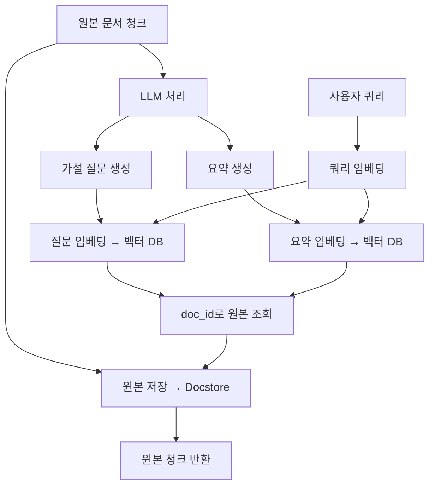
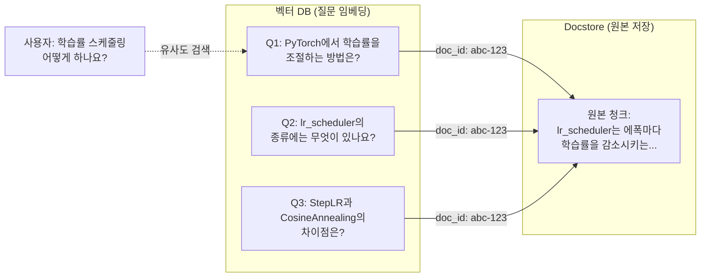
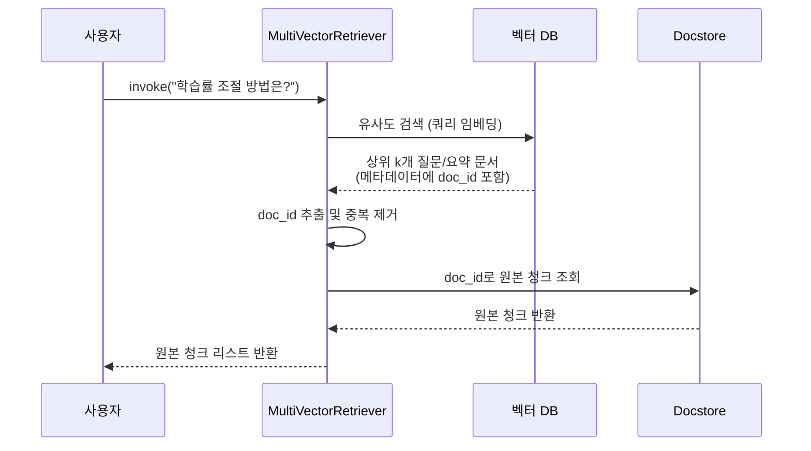
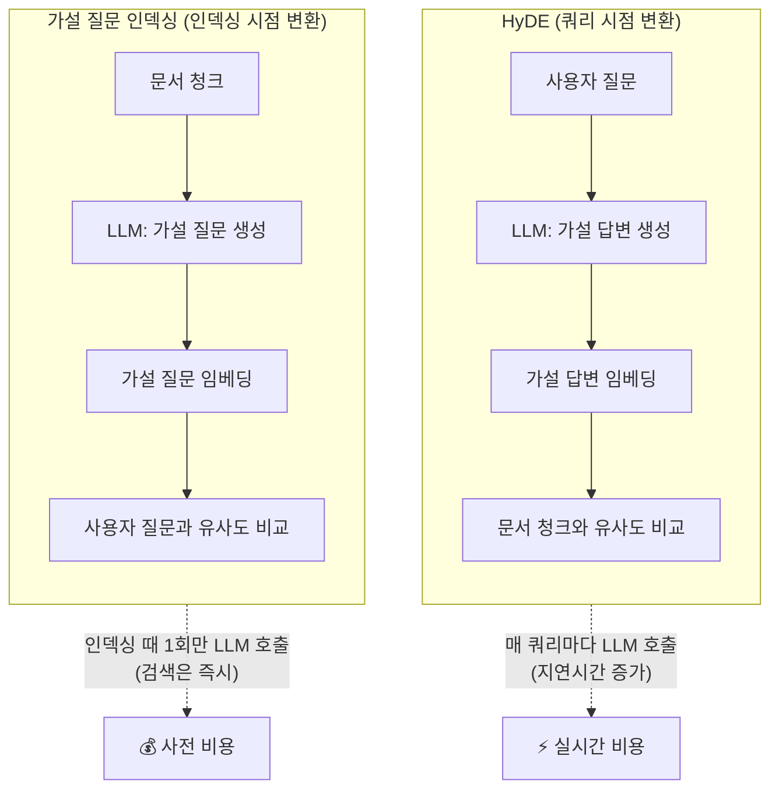

# 가설 질문 인덱싱과 요약 인덱싱

> 검색할 때 "문서"를 찾지 말고, "질문"이나 "요약"을 찾아라 — 멀티 표현 인덱싱의 핵심 아이디어

## 개요

이 섹션에서는 문서 청크를 그대로 임베딩하는 대신, LLM을 활용하여 **가설 질문(Hypothetical Questions)**이나 **요약(Summary)**을 생성하고 이를 인덱싱에 활용하는 고급 기법을 학습합니다. LangChain의 `MultiVectorRetriever`로 이 전략들을 통합 구현하고, 인덱싱 비용과 검색 품질 간의 트레이드오프를 분석합니다.

**선수 지식**: [14.1 부모-자식 청킹](14-고급-청킹과-인덱싱-raptor-시멘틱-청킹-부모-자식-청킹/01-부모-자식-청킹-작게-검색하고-크게-반환하기.md)에서 배운 `InMemoryStore`와 `doc_id` 매핑 개념, [14.2 RAPTOR](14-고급-청킹과-인덱싱-raptor-시멘틱-청킹-부모-자식-청킹/02-raptor-계층적-요약을-통한-트리-인덱싱.md)에서 학습한 LLM 기반 요약 생성, [13장 쿼리 변환 기법](13-쿼리-변환-기법-multi-query-hyde-step-back-prompting/01-쿼리-변환이-필요한-이유와-전략-개관.md)에서 다룬 HyDE의 개념

**학습 목표**:
- 가설 질문 인덱싱의 원리를 이해하고 LangChain으로 구현할 수 있다
- 요약 인덱싱으로 문서의 핵심 의미를 압축하여 검색 품질을 높일 수 있다
- `MultiVectorRetriever`로 다중 표현 인덱싱 전략을 통합 관리할 수 있다
- 인덱싱 비용(LLM 호출, 저장 공간)과 검색 품질 간의 트레이드오프를 판단할 수 있다

## 왜 알아야 할까?

앞서 [14.1](14-고급-청킹과-인덱싱-raptor-시멘틱-청킹-부모-자식-청킹/01-부모-자식-청킹-작게-검색하고-크게-반환하기.md)에서 부모-자식 청킹을 배울 때, "작은 청크로 검색하고 큰 청크를 반환한다"는 전략을 익혔죠. 하지만 여기엔 근본적인 문제가 하나 남아 있습니다. 사용자의 **질문**과 문서 **청크**는 본질적으로 다른 형태의 텍스트라는 점입니다.

"PyTorch에서 학습률을 조절하는 방법은?" 같은 질문과, 실제 문서에 있는 "lr_scheduler는 에폭마다 학습률을 감소시키는 유틸리티다"라는 설명문은 의미는 같지만 표현이 완전히 다릅니다. 임베딩 모델이 아무리 뛰어나도, **질문 ↔ 설명문** 사이의 의미적 간극을 완벽히 메우기는 어렵거든요.

가설 질문 인덱싱은 이 간극을 정면으로 해결합니다. 문서를 "이 문서로 답할 수 있는 질문"으로 변환하여 인덱싱하면, 검색이 **질문 ↔ 질문** 매칭으로 바뀝니다. 2025년 IEEE Access에 게재된 HyPE(Hypothetical Prompt Embeddings) 논문에 따르면, 이 기법만으로 컨텍스트 정밀도(Context Precision)가 최대 **42%p** 향상되었습니다.

요약 인덱싱은 또 다른 각도에서 접근합니다. 긴 청크의 핵심만 압축한 요약을 인덱싱하면, 세부 표현에 묻힌 핵심 의미가 더 잘 드러납니다. 특히 기술 문서나 법률 문서처럼 장황한 텍스트에서 위력을 발휘하죠.

## 핵심 개념

### 개념 1: 멀티 표현 인덱싱 — 하나의 문서, 여러 개의 얼굴

> 💡 **비유**: 도서관의 책을 생각해보세요. 같은 책이라도 **제목**, **목차**, **색인 키워드**, **서평**으로 찾을 수 있죠. 가설 질문 인덱싱은 "이 책에 대해 사람들이 물어볼 만한 질문"을 색인으로 만드는 것이고, 요약 인덱싱은 "이 책의 핵심 내용을 한 문장으로 압축한 서평"을 색인으로 만드는 것입니다. 어떤 방식으로 찾든, 반환되는 건 항상 **원본 책(원본 청크)**입니다.

멀티 표현 인덱싱(Multi-Representation Indexing)의 핵심 아이디어는 단순합니다:

1. **원본 문서**는 docstore에 보관한다
2. **검색용 표현**(가설 질문, 요약 등)을 LLM으로 생성한다
3. 검색용 표현을 벡터 DB에 임베딩한다
4. 검색 시 표현을 매칭하고, **원본 문서를 반환**한다

> 📊 **그림 1**: 멀티 표현 인덱싱의 전체 흐름



[14.1](14-고급-청킹과-인덱싱-raptor-시멘틱-청킹-부모-자식-청킹/01-부모-자식-청킹-작게-검색하고-크게-반환하기.md)에서 배운 `ParentDocumentRetriever`가 "작은 청크 → 큰 청크"의 크기 차원에서 분리했다면, `MultiVectorRetriever`는 "표현 형태" 차원에서 분리합니다. 둘 다 `doc_id`를 매개로 벡터 DB와 docstore를 연결하는 동일한 메커니즘을 사용하죠.

### 개념 2: 가설 질문 인덱싱 — 질문으로 질문을 찾는다

> 💡 **비유**: 시험 공부를 할 때 "이 내용으로 어떤 문제가 나올까?"라고 예상 문제를 만들어본 경험이 있으시죠? 가설 질문 인덱싱은 정확히 그 전략입니다. 각 문서 청크를 읽고 "이 내용에 대해 누군가가 물어볼 만한 질문 3~5개"를 LLM이 미리 만들어두는 거죠. 실제 사용자가 비슷한 질문을 하면, 질문끼리 비교하니까 매칭이 훨씬 정확해집니다.

기존 RAG 검색의 본질적 비대칭 문제를 정리하면 이렇습니다:

| 구분 | 기존 방식 | 가설 질문 방식 |
|------|-----------|---------------|
| 벡터 DB에 저장 | 문서 청크 임베딩 | 가설 질문 임베딩 |
| 검색 비교 대상 | 질문 ↔ 문서 (비대칭) | 질문 ↔ 질문 (대칭) |
| 임베딩 공간 정렬 | 낮음 | 높음 |
| 인덱싱 비용 | 임베딩만 | LLM + 임베딩 |

가설 질문 생성의 핵심 코드 패턴을 살펴보겠습니다:

```python
from langchain_core.prompts import ChatPromptTemplate
from langchain_openai import ChatOpenAI
from pydantic import BaseModel, Field

# 구조화된 출력을 위한 Pydantic 모델 정의
class HypotheticalQuestions(BaseModel):
    """문서 청크에 대한 가설 질문 목록"""
    questions: list[str] = Field(
        description="문서 내용으로 답할 수 있는 가설 질문 3개"
    )

# 가설 질문 생성 체인
prompt = ChatPromptTemplate.from_template(
    "다음 문서를 읽고, 이 문서의 내용으로 답할 수 있는 "
    "가설 질문을 정확히 3개 생성하세요.\n\n{doc}"
)

llm = ChatOpenAI(model="gpt-4o-mini", temperature=0)

# with_structured_output으로 Pydantic 모델에 맞춰 출력
chain = (
    {"doc": lambda x: x.page_content}
    | prompt
    | llm.with_structured_output(HypotheticalQuestions)
)
```

생성된 질문은 `doc_id`로 원본 청크와 연결됩니다:

```python
import uuid
from langchain_core.documents import Document

doc_ids = [str(uuid.uuid4()) for _ in chunks]

# 각 청크에 대해 가설 질문 생성 (배치 처리)
hypothetical_questions = chain.batch(
    chunks, 
    {"max_concurrency": 5}  # 병렬 처리로 속도 향상
)

# 가설 질문 → Document 객체로 변환 (doc_id 메타데이터 포함)
question_docs = []
for i, result in enumerate(hypothetical_questions):
    for q in result.questions:
        question_docs.append(
            Document(
                page_content=q,               # 질문 텍스트를 임베딩
                metadata={"doc_id": doc_ids[i]}  # 원본 청크 ID 참조
            )
        )
```

> 📊 **그림 2**: 가설 질문 인덱싱에서 doc_id를 통한 매핑 구조



청크 하나당 질문 3개를 생성하면, 100개 청크에서 300개의 질문 벡터가 만들어집니다. 벡터 DB 크기가 3배로 늘어나지만, 검색 정확도는 크게 향상됩니다. HyPE 논문의 실험에서는 청크당 **10~15개 질문**이 커버리지와 중복 사이의 최적 균형점이었습니다.

### 개념 3: 요약 인덱싱 — 핵심만 남기면 잡음이 사라진다

> 💡 **비유**: 친구에게 어제 본 영화를 추천할 때, 2시간짜리 영화 전체를 설명하진 않죠. "타임루프에 갇힌 주인공이 매일 같은 날을 반복하면서 성장하는 이야기야"처럼 핵심만 전달합니다. 요약 인덱싱도 마찬가지입니다. 수백 단어의 청크 대신 **핵심 의미를 압축한 한두 문장**을 임베딩하면, 세부 표현의 잡음이 사라지고 본질적 의미가 더 잘 매칭됩니다.

요약 인덱싱이 특히 효과적인 상황은 다음과 같습니다:

- **장황한 기술 문서**: 코드 예제, 주석, 부가 설명이 많아서 핵심이 묻히는 경우
- **법률/계약 문서**: 조건절, 단서 조항 등이 핵심 조항의 임베딩을 흐리는 경우
- **학술 논문**: 실험 설정, 관련 연구 서술이 핵심 기여를 희석시키는 경우

```python
# 요약 생성 체인
summary_prompt = ChatPromptTemplate.from_template(
    "다음 문서의 핵심 내용을 1-2문장으로 요약하세요. "
    "검색에 유용한 키워드를 반드시 포함하세요.\n\n{doc}"
)

summary_chain = (
    {"doc": lambda x: x.page_content}
    | summary_prompt
    | llm
    | StrOutputParser()
)

# 요약 배치 생성
summaries = summary_chain.batch(
    chunks, {"max_concurrency": 5}
)

# 요약 → Document 객체로 변환
summary_docs = [
    Document(
        page_content=s,                      # 요약 텍스트를 임베딩
        metadata={"doc_id": doc_ids[i]}      # 원본 청크 참조
    )
    for i, s in enumerate(summaries)
]
```

요약 인덱싱은 가설 질문 인덱싱과 달리 청크당 벡터가 1개이므로 저장 공간 부담이 적습니다. 대신, 요약 품질이 검색 품질을 좌우하기 때문에 프롬프트 설계가 중요합니다.

### 개념 4: MultiVectorRetriever로 통합하기

LangChain의 `MultiVectorRetriever`는 위 전략들을 하나의 인터페이스로 통합합니다. [14.1](14-고급-청킹과-인덱싱-raptor-시멘틱-청킹-부모-자식-청킹/01-부모-자식-청킹-작게-검색하고-크게-반환하기.md)에서 사용한 `ParentDocumentRetriever`가 사실 `MultiVectorRetriever`의 특수한 케이스라는 걸 알면 놀라울 수도 있는데요 — 둘 다 같은 원리(`doc_id` 기반 매핑)로 동작합니다.

```python
from langchain.retrievers.multi_vector import MultiVectorRetriever
from langchain.storage import InMemoryByteStore
from langchain_chroma import Chroma
from langchain_openai import OpenAIEmbeddings

# 1. 벡터 DB: 가설 질문/요약 임베딩 저장
vectorstore = Chroma(
    collection_name="hypothetical_questions",
    embedding_function=OpenAIEmbeddings(model="text-embedding-3-small"),
)

# 2. Docstore: 원본 청크 저장
store = InMemoryByteStore()
id_key = "doc_id"

# 3. MultiVectorRetriever 생성
retriever = MultiVectorRetriever(
    vectorstore=vectorstore,  # 검색용 벡터 DB
    byte_store=store,         # 원본 저장소
    id_key=id_key,            # 매핑 키 이름
)

# 4. 검색용 문서(질문/요약)와 원본 청크 등록
retriever.vectorstore.add_documents(question_docs)  # 질문을 벡터 DB에
retriever.docstore.mset(                             # 원본을 docstore에
    list(zip(doc_ids, chunks))
)
```

> 📊 **그림 3**: MultiVectorRetriever의 내부 검색 흐름



검색 결과에서 주의할 점이 있습니다. 서로 다른 가설 질문이 같은 `doc_id`를 가리킬 수 있으므로, `MultiVectorRetriever`는 내부적으로 **중복 제거**를 수행합니다. 예를 들어 상위 6개 질문이 매칭되었는데 그 중 3개가 같은 원본 청크를 가리키면, 실제로 반환되는 문서는 4개가 됩니다.

## 실습: 직접 해보기

가설 질문 인덱싱과 요약 인덱싱을 모두 구현하고, 기본 청크 임베딩과 검색 품질을 비교하는 전체 실습입니다.

```python
import uuid
from langchain_core.documents import Document
from langchain_core.prompts import ChatPromptTemplate
from langchain_core.output_parsers import StrOutputParser
from langchain_openai import ChatOpenAI, OpenAIEmbeddings
from langchain_chroma import Chroma
from langchain.storage import InMemoryByteStore
from langchain.retrievers.multi_vector import MultiVectorRetriever
from pydantic import BaseModel, Field

# ── 0. 샘플 문서 준비 ──────────────────────────────────────
docs = [
    Document(page_content=(
        "Transformer 모델의 Self-Attention 메커니즘은 입력 시퀀스의 모든 토큰 쌍 간의 "
        "관계를 계산합니다. Query, Key, Value 행렬을 통해 각 토큰이 다른 토큰에 얼마나 "
        "주의를 기울여야 하는지 결정하며, 이를 통해 장거리 의존성을 효과적으로 포착합니다. "
        "계산 복잡도는 시퀀스 길이의 제곱에 비례하여 O(n²)입니다."
    )),
    Document(page_content=(
        "RAG 시스템에서 청킹 전략은 검색 품질에 직접적인 영향을 미칩니다. "
        "고정 크기 청킹은 구현이 간단하지만 의미 단위를 무시할 수 있고, "
        "시멘틱 청킹은 의미 경계를 존중하지만 임베딩 비용이 추가됩니다. "
        "일반적으로 500-1000 토큰 크기가 대부분의 RAG 애플리케이션에 적합합니다."
    )),
    Document(page_content=(
        "벡터 데이터베이스에서 HNSW 인덱스는 그래프 기반 ANN 알고리즘으로, "
        "계층적 네비게이블 스몰 월드 그래프를 구축합니다. 삽입 시 M 파라미터가 "
        "노드당 연결 수를, efConstruction이 인덱스 품질을 결정합니다. "
        "검색 시에는 efSearch 파라미터로 정확도와 속도의 균형을 조절합니다. "
        "대부분의 벡터 DB(Chroma, Qdrant, Pinecone)에서 기본 인덱스로 채택됩니다."
    )),
]

# ── 1. LLM 및 임베딩 모델 초기화 ────────────────────────────
llm = ChatOpenAI(model="gpt-4o-mini", temperature=0)
embeddings = OpenAIEmbeddings(model="text-embedding-3-small")

# ── 2. 가설 질문 생성 ───────────────────────────────────────
class HypotheticalQuestions(BaseModel):
    """문서로 답할 수 있는 가설 질문 목록"""
    questions: list[str] = Field(
        description="문서 내용으로 답할 수 있는 질문 3개"
    )

question_chain = (
    {"doc": lambda x: x.page_content}
    | ChatPromptTemplate.from_template(
        "다음 문서를 읽고, 이 문서의 내용으로 답할 수 있는 "
        "가설 질문을 정확히 3개 생성하세요. "
        "질문은 구체적이고 명확해야 합니다.\n\n{doc}"
    )
    | llm.with_structured_output(HypotheticalQuestions)
)

# 배치 처리로 모든 문서의 가설 질문 생성
hypo_results = question_chain.batch(docs, {"max_concurrency": 5})

# ── 3. 요약 생성 ────────────────────────────────────────────
summary_chain = (
    {"doc": lambda x: x.page_content}
    | ChatPromptTemplate.from_template(
        "다음 문서의 핵심 내용을 1-2문장으로 요약하세요. "
        "기술 키워드를 반드시 포함하세요.\n\n{doc}"
    )
    | llm
    | StrOutputParser()
)

summaries = summary_chain.batch(docs, {"max_concurrency": 5})

# ── 4. 세 가지 리트리버 구성 ─────────────────────────────────
doc_ids = [str(uuid.uuid4()) for _ in docs]

def build_retriever(
    collection_name: str, 
    search_docs: list[Document]
) -> MultiVectorRetriever:
    """MultiVectorRetriever 팩토리 함수"""
    vectorstore = Chroma(
        collection_name=collection_name,
        embedding_function=embeddings,
    )
    store = InMemoryByteStore()
    retriever = MultiVectorRetriever(
        vectorstore=vectorstore,
        byte_store=store,
        id_key="doc_id",
    )
    # 검색용 문서를 벡터 DB에 추가
    retriever.vectorstore.add_documents(search_docs)
    # 원본 문서를 docstore에 저장
    retriever.docstore.mset(list(zip(doc_ids, docs)))
    return retriever

# 4-A. 가설 질문 리트리버
question_docs = []
for i, result in enumerate(hypo_results):
    for q in result.questions:
        question_docs.append(
            Document(page_content=q, metadata={"doc_id": doc_ids[i]})
        )

question_retriever = build_retriever("hypo_questions", question_docs)

# 4-B. 요약 리트리버
summary_docs = [
    Document(page_content=s, metadata={"doc_id": doc_ids[i]})
    for i, s in enumerate(summaries)
]

summary_retriever = build_retriever("summaries", summary_docs)

# 4-C. 기본 리트리버 (원본 청크 직접 임베딩 — 비교용)
baseline_docs = [
    Document(page_content=d.page_content, metadata={"doc_id": doc_ids[i]})
    for i, d in enumerate(docs)
]

baseline_retriever = build_retriever("baseline", baseline_docs)

# ── 5. 검색 비교 실행 ───────────────────────────────────────
query = "Transformer에서 토큰 간 관계를 어떻게 계산하나요?"

print("=" * 60)
print(f"쿼리: {query}")
print("=" * 60)

for name, ret in [
    ("기본 (원본 청크)", baseline_retriever),
    ("가설 질문", question_retriever),
    ("요약", summary_retriever),
]:
    results = ret.invoke(query)
    print(f"\n🔍 [{name}] 검색 결과 ({len(results)}건):")
    for j, doc in enumerate(results):
        # 원본 문서의 앞 80자만 표시
        preview = doc.page_content[:80].replace("\n", " ")
        print(f"  {j+1}. {preview}...")
```

```run:python
# 가설 질문이 어떻게 생성되는지 확인하는 예시 출력
docs_preview = [
    "Transformer Self-Attention 메커니즘...",
    "RAG 청킹 전략...", 
    "HNSW 인덱스 알고리즘..."
]

hypo_questions_example = [
    ["Self-Attention에서 Q, K, V 행렬의 역할은?",
     "Transformer의 계산 복잡도가 O(n²)인 이유는?",
     "장거리 의존성을 어떻게 포착하나요?"],
    ["고정 크기 청킹과 시멘틱 청킹의 차이점은?",
     "RAG에 적합한 청크 크기는 얼마인가요?",
     "청킹 전략이 검색 품질에 미치는 영향은?"],
    ["HNSW 인덱스의 M 파라미터는 무엇인가요?",
     "efConstruction과 efSearch의 차이는?",
     "어떤 벡터 DB가 HNSW를 지원하나요?"],
]

summaries_example = [
    "Transformer의 Self-Attention은 Q/K/V 행렬로 토큰 간 관계를 계산하며, O(n²) 복잡도를 가진다.",
    "RAG 청킹 전략으로 고정 크기와 시멘틱 방식이 있으며, 500-1000 토큰이 일반적으로 적합하다.",
    "HNSW는 계층적 그래프 기반 ANN 알고리즘으로, M/efConstruction/efSearch로 성능을 조절한다.",
]

print("📋 생성된 가설 질문:")
for i, (doc, questions) in enumerate(zip(docs_preview, hypo_questions_example)):
    print(f"\n  문서 {i+1}: {doc}")
    for j, q in enumerate(questions):
        print(f"    Q{j+1}: {q}")

print(f"\n📝 생성된 요약:")
for i, s in enumerate(summaries_example):
    print(f"  문서 {i+1}: {s}")

print(f"\n📊 인덱싱 통계:")
print(f"  원본 청크: {len(docs_preview)}개")
print(f"  가설 질문 벡터: {sum(len(q) for q in hypo_questions_example)}개")
print(f"  요약 벡터: {len(summaries_example)}개")
```

```output
📋 생성된 가설 질문:

  문서 1: Transformer Self-Attention 메커니즘...
    Q1: Self-Attention에서 Q, K, V 행렬의 역할은?
    Q2: Transformer의 계산 복잡도가 O(n²)인 이유는?
    Q3: 장거리 의존성을 어떻게 포착하나요?

  문서 2: RAG 청킹 전략...
    Q1: 고정 크기 청킹과 시멘틱 청킹의 차이점은?
    Q2: RAG에 적합한 청크 크기는 얼마인가요?
    Q3: 청킹 전략이 검색 품질에 미치는 영향은?

  문서 3: HNSW 인덱스 알고리즘...
    Q1: HNSW 인덱스의 M 파라미터는 무엇인가요?
    Q2: efConstruction과 efSearch의 차이는?
    Q3: 어떤 벡터 DB가 HNSW를 지원하나요?

📝 생성된 요약:
  문서 1: Transformer의 Self-Attention은 Q/K/V 행렬로 토큰 간 관계를 계산하며, O(n²) 복잡도를 가진다.
  문서 2: RAG 청킹 전략으로 고정 크기와 시멘틱 방식이 있으며, 500-1000 토큰이 일반적으로 적합하다.
  문서 3: HNSW는 계층적 그래프 기반 ANN 알고리즘으로, M/efConstruction/efSearch로 성능을 조절한다.

📊 인덱싱 통계:
  원본 청크: 3개
  가설 질문 벡터: 9개
  요약 벡터: 3개
```

### 비용-품질 트레이드오프 분석

세 가지 인덱싱 전략의 비용 구조를 비교해봅시다:

```run:python
# 인덱싱 비용 시뮬레이션 (1000개 청크 기준)
num_chunks = 1000
questions_per_chunk = 3
avg_chunk_tokens = 500        # 평균 청크 토큰 수
avg_summary_tokens = 50       # 평균 요약 토큰 수
avg_question_tokens = 20      # 평균 질문 토큰 수

# GPT-4o-mini 가격 (2025년 기준)
input_price = 0.15 / 1_000_000    # $0.15 / 1M input tokens
output_price = 0.60 / 1_000_000   # $0.60 / 1M output tokens

# text-embedding-3-small 가격
embedding_price = 0.02 / 1_000_000  # $0.02 / 1M tokens

# ── 전략별 비용 계산 ──────────────────────────────────────
# 1) 기본: 임베딩만
baseline_cost = num_chunks * avg_chunk_tokens * embedding_price
baseline_vectors = num_chunks

# 2) 가설 질문: LLM(질문 생성) + 임베딩(질문)
q_llm_input = num_chunks * (avg_chunk_tokens + 50)  # 청크 + 프롬프트
q_llm_output = num_chunks * questions_per_chunk * avg_question_tokens
q_llm_cost = q_llm_input * input_price + q_llm_output * output_price
q_embed_cost = num_chunks * questions_per_chunk * avg_question_tokens * embedding_price
q_total = q_llm_cost + q_embed_cost
q_vectors = num_chunks * questions_per_chunk

# 3) 요약: LLM(요약 생성) + 임베딩(요약)
s_llm_input = num_chunks * (avg_chunk_tokens + 30)  # 청크 + 프롬프트
s_llm_output = num_chunks * avg_summary_tokens
s_llm_cost = s_llm_input * input_price + s_llm_output * output_price
s_embed_cost = num_chunks * avg_summary_tokens * embedding_price
s_total = s_llm_cost + s_embed_cost
s_vectors = num_chunks

print("💰 인덱싱 비용 비교 (1,000 청크 기준)")
print("=" * 55)
print(f"{'전략':<18} {'LLM 비용':>10} {'임베딩 비용':>10} {'총 비용':>10} {'벡터 수':>8}")
print("-" * 55)
print(f"{'기본 (원본)':<18} {'$0.000':>10} {f'${baseline_cost:.3f}':>10} {f'${baseline_cost:.3f}':>10} {baseline_vectors:>8}")
print(f"{'가설 질문 (×3)':<18} {f'${q_llm_cost:.3f}':>10} {f'${q_embed_cost:.3f}':>10} {f'${q_total:.3f}':>10} {q_vectors:>8}")
print(f"{'요약':<18} {f'${s_llm_cost:.3f}':>10} {f'${s_embed_cost:.3f}':>10} {f'${s_total:.3f}':>10} {s_vectors:>8}")
print("-" * 55)
print(f"\n📌 가설 질문 인덱싱은 기본 대비 약 {q_total/baseline_cost:.0f}배 비용")
print(f"📌 요약 인덱싱은 기본 대비 약 {s_total/baseline_cost:.0f}배 비용")
print(f"📌 단, 검색 정확도 향상으로 LLM 재호출 비용 절감 효과 있음")
```

```output
💰 인덱싱 비용 비교 (1,000 청크 기준)
=======================================================
전략                  LLM 비용    임베딩 비용       총 비용   벡터 수
-------------------------------------------------------
기본 (원본)            $0.000     $0.010     $0.010     1000
가설 질문 (×3)         $0.119     $0.001     $0.120     3000
요약                  $0.110     $0.001     $0.111     1000
-------------------------------------------------------

📌 가설 질문 인덱싱은 기본 대비 약 12배 비용
📌 요약 인덱싱은 기본 대비 약 11배 비용
📌 단, 검색 정확도 향상으로 LLM 재호출 비용 절감 효과 있음
```

## 더 깊이 알아보기

### 멀티 표현 인덱싱의 탄생 — "문서가 아니라 질문을 저장하라"

가설 질문 인덱싱의 뿌리는 사실 2020년의 DPR(Dense Passage Retrieval) 논문까지 거슬러 올라갑니다. Facebook AI Research 팀은 질문-문서 간의 비대칭 문제를 처음으로 체계적으로 분석했는데요, Bi-Encoder로 질문과 문서를 같은 공간에 매핑하되 별도의 인코더를 사용하는 아이디어가 시초였습니다.

이 아이디어를 인덱싱 단계로 끌고 온 것이 LangChain의 "RAG From Scratch" 시리즈입니다. 2024년 초, LangChain 엔지니어 Lance Martin은 "Multi-Representation Indexing"이라는 개념을 제안하며, LLM을 활용해 문서의 다양한 표현을 사전에 생성하고 인덱싱하는 패턴을 정립했습니다. 핵심 통찰은 단순했습니다 — "검색 시점에 비대칭을 해결하려 하지 말고, **인덱싱 시점에 미리 해결하라**."

2025년에는 Domen Vake 등이 이를 학술적으로 검증한 HyPE(Hypothetical Prompt Embeddings) 논문을 IEEE Access에 발표했습니다. 6개 벤치마크 데이터셋에서 실험한 결과, 가설 질문 인덱싱이 기존 방식 대비 컨텍스트 정밀도를 최대 42%p, 클레임 리콜을 최대 45%p 향상시켰습니다. 특히 이 기법이 리랭킹, 멀티벡터 리트리벌 등 다른 RAG 기법들과 **상호 보완적**이라는 점이 확인되어, 프로덕션 파이프라인에서의 채택이 가속화되고 있습니다.

### HyDE와 가설 질문 인덱싱의 결정적 차이

[13장](13-쿼리-변환-기법-multi-query-hyde-step-back-prompting/01-쿼리-변환이-필요한-이유와-전략-개관.md)에서 배운 HyDE(Hypothetical Document Embeddings)를 기억하시나요? 둘 다 LLM을 활용하지만, 작동 시점이 정반대입니다:

> 📊 **그림 4**: HyDE(쿼리 시점) vs 가설 질문 인덱싱(인덱싱 시점) 비교



| 비교 항목 | HyDE | 가설 질문 인덱싱 |
|-----------|------|----------------|
| LLM 호출 시점 | 쿼리마다 | 인덱싱 때 한 번 |
| 검색 지연시간 | 높음 (LLM 호출 포함) | 낮음 (임베딩 검색만) |
| 비용 구조 | 쿼리 비례 (변동비) | 문서 비례 (고정비) |
| 적합한 상황 | 쿼리 빈도 낮은 경우 | 쿼리 빈도 높은 경우 |
| 결합 가능 | 가능 (HyDE + 가설 질문 동시 적용) | 가능 |

실무에서는 **쿼리 빈도**가 판단 기준이 됩니다. 하루 수천 건의 쿼리를 처리하는 챗봇이라면 인덱싱 시점에 비용을 지불하는 가설 질문 인덱싱이, 간헐적으로 사용되는 내부 검색 도구라면 HyDE가 더 경제적입니다.

## 흔한 오해와 팁

> ⚠️ **흔한 오해**: "가설 질문 인덱싱을 쓰면 항상 검색이 좋아진다"
> 
> 그렇지 않습니다. 가설 질문 인덱싱은 **Q&A 형태의 쿼리**에 특히 효과적이지만, 키워드 검색이나 탐색적 브라우징에는 오히려 기본 청크 임베딩이 나을 수 있습니다. 예를 들어 "HNSW"라는 키워드로 관련 문서를 찾는 경우, 원본 청크에 키워드가 직접 포함되어 있으므로 기본 방식이 더 정확할 수 있습니다. 쿼리 패턴을 분석하고 전략을 선택하세요.

> 💡 **알고 계셨나요?**: LangChain의 `ParentDocumentRetriever`는 사실 `MultiVectorRetriever`를 상속받은 하위 클래스입니다. [14.1](14-고급-청킹과-인덱싱-raptor-시멘틱-청킹-부모-자식-청킹/01-부모-자식-청킹-작게-검색하고-크게-반환하기.md)에서 사용한 부모-자식 청킹도 내부적으로는 `MultiVectorRetriever`의 `doc_id` 매핑을 그대로 사용합니다. 즉, 부모-자식 청킹 + 가설 질문 인덱싱을 **하나의 `MultiVectorRetriever`로 결합**하는 것도 가능합니다 — 작은 자식 청크에서 가설 질문을 생성하고, 부모 청크를 docstore에 저장하면 두 기법의 장점을 모두 취할 수 있습니다.

> 🔥 **실무 팁**: 가설 질문 생성 시 `max_concurrency`를 활용한 배치 처리가 핵심입니다. 1000개 청크를 순차 처리하면 수십 분이 걸리지만, `chain.batch(docs, {"max_concurrency": 10})`으로 병렬 처리하면 수 분으로 단축됩니다. 단, API rate limit에 주의하세요. 또한 생성된 질문의 품질을 한 번은 샘플링하여 검토하는 것이 좋습니다 — 프롬프트 한 줄의 차이가 검색 품질을 크게 좌우합니다.

> 🔥 **실무 팁**: 요약 인덱싱과 가설 질문 인덱싱을 **동시에 적용**할 수도 있습니다. 같은 `doc_id`로 요약 벡터와 질문 벡터를 하나의 벡터 DB에 함께 저장하면, 질문형 쿼리는 가설 질문에, 탐색형 쿼리는 요약에 매칭되어 다양한 쿼리 유형에 유연하게 대응할 수 있습니다.

## 핵심 정리

| 개념 | 설명 |
|------|------|
| 멀티 표현 인덱싱 | 문서의 다양한 표현(질문, 요약 등)을 생성하여 인덱싱하고, 검색 시 원본을 반환하는 전략 |
| 가설 질문 인덱싱 | LLM이 청크당 3~15개 질문을 생성, 질문↔질문 매칭으로 검색 비대칭 해소 |
| 요약 인덱싱 | 청크를 1-2문장으로 압축, 잡음 제거된 핵심 의미로 검색 품질 향상 |
| MultiVectorRetriever | `vectorstore`(검색용) + `byte_store`(원본) + `doc_id`(매핑)로 구성된 LangChain 통합 리트리버 |
| `doc_id` 매핑 | 다수의 검색용 벡터가 하나의 원본 청크를 가리키는 다대일 관계, 중복 자동 제거 |
| 비용 트레이드오프 | LLM 호출(인덱싱 시 고정비) vs 검색 품질 향상으로 인한 재호출 절감(변동비 절감) |
| HyDE와의 차이 | HyDE는 쿼리 시점 변환(변동비), 가설 질문 인덱싱은 인덱싱 시점 변환(고정비) |
| `with_structured_output` | Pydantic 모델로 LLM 출력을 구조화하여 안정적인 질문/요약 생성 |

## 다음 섹션 미리보기

지금까지 부모-자식 청킹, RAPTOR, 시멘틱 청킹, 그리고 가설 질문/요약 인덱싱까지 네 가지 고급 인덱싱 전략을 학습했습니다. 다음 세션 **14.5 인덱싱 전략 종합 비교와 최적 조합**에서는 이 전략들을 FAQ 문서, 기술 문서, 법률 문서 등 다양한 문서 유형에 적용하여 검색 품질을 정량 비교하고, 문서 유형별 최적 전략 조합을 도출합니다. "어떤 전략을 언제 써야 하는가?"에 대한 실무 가이드라인을 정리하는 챕터의 마무리 세션입니다.

## 참고 자료

- [How to retrieve using multiple vectors per document — LangChain 공식 문서](https://python.langchain.com/v0.2/docs/how_to/multi_vector/) - MultiVectorRetriever의 세 가지 전략(작은 청크, 요약, 가설 질문)에 대한 공식 가이드. 전체 코드 예제 포함
- [RAG From Scratch: Multi-Representation Indexing — LangChain GitHub](https://github.com/langchain-ai/rag-from-scratch) - Lance Martin의 RAG 구현 시리즈. 멀티 표현 인덱싱 패턴의 원형 코드와 영상 강의 포함
- [Bridging the Question-Answer Gap in RAG: Hypothetical Prompt Embeddings (HyPE) — IEEE Access](https://ieeexplore.ieee.org/document/11080443/) - 가설 질문 인덱싱의 학술적 검증. 6개 데이터셋에서 컨텍스트 정밀도 최대 42%p 향상 실증
- [MultiVectorRetriever API Reference — LangChain](https://python.langchain.com/api_reference/langchain/retrievers/langchain.retrievers.multi_vector.MultiVectorRetriever.html) - `vectorstore`, `byte_store`, `id_key` 파라미터의 상세 API 레퍼런스
- [RAG Techniques — NirDiamant GitHub](https://github.com/NirDiamant/RAG_Techniques) - HyPE를 포함한 다양한 고급 RAG 기법의 구현 코드 모음

---
### 🔗 Related Sessions
- [hyde](../02-rag-아키텍처-핵심-컴포넌트와-파이프라인-구조/03-advanced-rag-검색-전후-최적화-전략.md) (prerequisite)
- [부모-자식 청킹](../14-고급-청킹과-인덱싱-raptor-시멘틱-청킹-부모-자식-청킹/01-부모-자식-청킹-작게-검색하고-크게-반환하기.md) (prerequisite)
- [parentdocumentretriever](../14-고급-청킹과-인덱싱-raptor-시멘틱-청킹-부모-자식-청킹/01-부모-자식-청킹-작게-검색하고-크게-반환하기.md) (prerequisite)
- [raptor](../14-고급-청킹과-인덱싱-raptor-시멘틱-청킹-부모-자식-청킹/02-raptor-계층적-요약을-통한-트리-인덱싱.md) (prerequisite)
- [inmemorystore](../14-고급-청킹과-인덱싱-raptor-시멘틱-청킹-부모-자식-청킹/01-부모-자식-청킹-작게-검색하고-크게-반환하기.md) (prerequisite)
