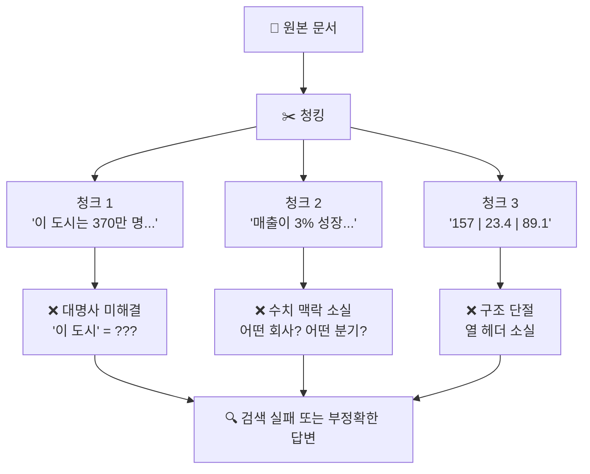
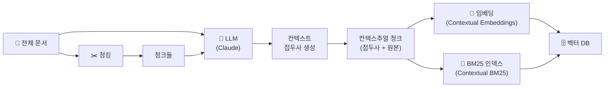
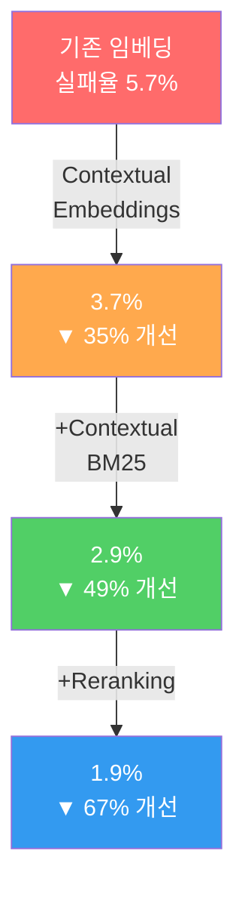
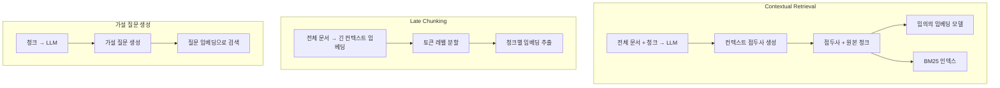

# Contextual RAG 소개 — 청크에 맥락을 더하다

> 기존 청킹의 맥락 손실 문제를 해결하는 Anthropic의 Contextual Retrieval 기법을 소개합니다.

## 개요

이 섹션에서는 RAG 시스템에서 문서를 청킹할 때 발생하는 **맥락 손실(context loss)** 문제를 깊이 있게 살펴보고, Anthropic이 2024년 9월에 발표한 **Contextual Retrieval** 기법이 이 문제를 어떻게 해결하는지 학습합니다. 각 청크에 문서 전체의 맥락을 설명하는 짧은 접두사를 추가하는 단순하면서도 강력한 아이디어를 이해하고, 실제 검색 성능이 얼마나 개선되는지 확인합니다.

**선수 지식**: 
- [Ch4: 텍스트 청킹 전략](ch04)에서 배운 청킹의 기본 원리와 다양한 분할 방법
- [Ch5: 임베딩 모델 이해](ch05)에서 배운 텍스트 임베딩의 원리
- [Ch11: 하이브리드 검색](ch11)에서 배운 BM25 키워드 검색과 벡터 검색의 결합
- [Ch12: 리랭킹](ch12)에서 배운 Cross-Encoder 기반 검색 결과 재정렬
- [Ch14: 고급 청킹과 인덱싱](ch14)에서 배운 시멘틱 청킹, 부모-자식 청킹 등 고급 전략

**학습 목표**:
- 기존 청킹 방식에서 발생하는 맥락 손실 문제를 구체적 예시로 설명할 수 있다
- Contextual Retrieval의 핵심 아이디어와 작동 원리를 이해한다
- 컨텍스추얼 청크의 전후 비교를 통해 실제 효과를 체감한다
- Contextual Retrieval의 성능 개선 수치와 비용 구조를 분석할 수 있다

## 왜 알아야 할까?

여러분이 열심히 RAG 시스템을 구축했다고 가정해볼까요? 문서를 잘 청킹하고, 임베딩 모델도 최신 것을 사용하고, 벡터 데이터베이스도 세팅했습니다. 그런데 사용자가 **"지난 분기 매출이 얼마야?"** 라고 물었을 때, 시스템이 엉뚱한 답변을 내놓습니다. 검색된 청크를 확인해보면 이런 내용이 들어있거든요:

> "전 분기 대비 매출이 3% 성장했습니다."

이 청크만 봐서는 **어떤 회사**의 **어떤 분기** 매출인지, **기준 금액이 얼마**인지 전혀 알 수 없죠. 원본 문서에서는 "ACME Corp의 2023년 2분기 SEC 보고서"라는 맥락 속에 있었고, 이전 문단에서 "전 분기 매출 3억 1400만 달러"라고 언급했는데, 청킹 과정에서 이 맥락이 모두 사라진 겁니다.

이것이 바로 RAG 시스템의 가장 흔하면서도 치명적인 문제인 **맥락 손실**입니다. [Ch14: 고급 청킹과 인덱싱](ch14)에서 부모-자식 청킹, 시멘틱 청킹 같은 고급 전략을 배웠지만, 이 전략들도 청크 자체에 맥락 정보를 포함시키지는 않았습니다. Anthropic의 Contextual Retrieval은 이 문제에 대한 놀랍도록 단순하면서 효과적인 해법을 제시합니다 — **검색 실패율을 최대 67%까지 줄일 수 있거든요.**

## 핵심 개념

### 개념 1: 청킹의 맥락 손실 문제

> 💡 **비유**: 1000피스 퍼즐 조각 하나를 뒤집어서 그림 면만 본다고 상상해보세요. "파란색과 흰색이 섞인 조각"이라는 것은 알 수 있지만, 이것이 하늘인지, 바다인지, 아니면 줄무늬 셔츠의 일부인지는 알 수 없습니다. 퍼즐 상자의 완성 그림(전체 문서)을 참고해야만 "이 조각은 왼쪽 상단의 하늘 부분이다"라고 위치를 특정할 수 있죠. 기존 청킹은 이 퍼즐 조각에 위치 정보를 적어두지 않는 것과 같습니다.

실제 RAG 시스템에서 맥락 손실은 크게 세 가지 유형으로 나타납니다:

**1. 대명사/지시어 문제 (Anaphoric Reference)**

원본 문서에서는 자연스럽게 읽히는 문장이 청크로 분리되면 의미를 잃습니다:

```
원본 문서 (베를린에 대한 위키피디아 문서):
"베를린은 독일의 수도이자 최대 도시다. 이 도시는 약 370만 명의
인구를 보유하고 있으며, 유럽에서 가장 인구가 많은 도시 중 하나다."

청크로 분리 후:
"이 도시는 약 370만 명의 인구를 보유하고 있으며,
유럽에서 가장 인구가 많은 도시 중 하나다."
→ "이 도시"가 무엇을 가리키는지 알 수 없음!
```

**2. 수치/맥락 분리 문제**

```
원본: "2023년 2분기 매출은 전 분기(3억 1400만 달러) 대비 3% 성장..."
청크: "전 분기 대비 매출이 3% 성장했습니다."
→ 어떤 회사? 어떤 분기? 기준 금액은?
```

**3. 테이블/구조 단절 문제**

표의 행 데이터만 청크에 포함되고 열 헤더가 빠지면, 숫자의 의미를 전혀 파악할 수 없게 됩니다.

> 📊 **그림 1**: 기존 청킹에서 발생하는 맥락 손실의 세 가지 유형



이 문제가 얼마나 심각한지 수치로 보면, 일반적인 RAG 시스템에서 **top-20 청크 검색 실패율이 약 5.7%** 에 달합니다. 100개의 질문 중 약 6개는 관련 문서를 검색조차 하지 못한다는 뜻이죠.

### 개념 2: Contextual Retrieval — 퍼즐 조각에 메모 붙이기

> 💡 **비유**: 이번에는 퍼즐 조각 뒷면에 "이 조각은 왼쪽 상단 하늘 영역에 속하며, 구름과 산봉우리 사이에 위치합니다"라고 메모를 붙인다고 생각해보세요. 이제 조각만 봐도 전체에서 어디에 해당하는지 바로 알 수 있습니다. Contextual Retrieval이 하는 일이 정확히 이것입니다.

**Contextual Retrieval**은 Anthropic이 2024년 9월에 발표한 기법으로, 핵심 아이디어는 매우 단순합니다:

> **각 청크를 임베딩하고 인덱싱하기 전에, LLM을 사용하여 해당 청크의 문서 내 맥락을 설명하는 짧은 접두사(context prefix)를 생성하여 추가한다.**

구체적인 과정을 살펴볼까요?

**Before — 기존 청크:**
```
"전 분기 대비 매출이 3% 성장했습니다."
```

**After — 컨텍스추얼 청크:**
```
"이 청크는 ACME Corp의 2023년 2분기 실적에 대한 SEC 보고서에서
발췌한 것입니다. 전 분기 매출은 3억 1400만 달러였습니다.
전 분기 대비 매출이 3% 성장했습니다."
```

앞에 추가된 1~2문장이 바로 **컨텍스트 접두사(context prefix)** 입니다. 보통 50~100 토큰 정도의 짧은 설명인데, 이것만으로도 검색 성능이 극적으로 향상됩니다.

> 📊 **그림 2**: Contextual Retrieval의 처리 흐름



이 기법은 두 가지 하위 기술로 구성됩니다:

- **Contextual Embeddings**: 컨텍스트 접두사가 추가된 청크를 임베딩하여 벡터 검색에 사용. [Ch5: 임베딩 모델 이해](ch05)에서 배운 것처럼, 텍스트 임베딩은 의미적 유사성을 벡터 공간에서 표현하는데, 맥락이 풍부한 텍스트를 임베딩하면 당연히 검색 품질도 올라가겠죠?
- **Contextual BM25**: 같은 컨텍스추얼 청크로 BM25 키워드 인덱스를 구축하여 키워드 검색에 사용

[Ch11: 하이브리드 검색](ch11)에서 배운 것처럼, 벡터 검색과 BM25를 결합하면 각각의 약점을 보완할 수 있었죠? Contextual Retrieval은 이 하이브리드 검색의 **입력 자체를 개선**하여 두 검색 모두의 품질을 한 단계 끌어올립니다.

### 개념 3: 컨텍스트 생성 프롬프트

Anthropic이 공개한 컨텍스트 생성 프롬프트는 아래와 같습니다:

```python
DOCUMENT_CONTEXT_PROMPT = """
<document>
{doc_content}
</document>
"""

CHUNK_CONTEXT_PROMPT = """
Here is the chunk we want to situate within the whole document
<chunk>
{chunk_content}
</chunk>

Please give a short succinct context to situate this chunk within the overall
document for the purposes of improving search retrieval of the chunk.
Answer only with the succinct context and nothing else.
"""
```

LLM에게 전체 문서와 개별 청크를 함께 보여주고, "이 청크를 문서 전체 맥락 속에 위치시키는 짧고 간결한 설명을 작성해달라"고 요청합니다. 핵심은 **"검색 성능 향상을 위한"** 이라는 목적을 명시한 부분인데요, 이 지시 덕분에 LLM이 검색에 유용한 키워드와 맥락 정보를 중심으로 접두사를 생성하게 됩니다.

여기서 한 가지 의문이 들 수 있습니다 — "모든 청크마다 LLM을 호출하면 비용이 엄청나지 않나요?" 좋은 질문입니다. 이 부분은 다음 개념에서 살펴보겠습니다.

### 개념 4: 프롬프트 캐싱으로 비용 최적화

같은 문서에 대해 청크 수만큼 LLM을 반복 호출해야 하는데, 매번 전체 문서를 입력으로 보내면 비용이 폭발적으로 증가할 것 같죠? Anthropic은 이 문제를 **프롬프트 캐싱(Prompt Caching)** 으로 해결했습니다.

> 💡 **비유**: 수업 시간에 30명의 학생이 같은 교과서를 참고하며 각자 다른 문제를 풀고 있다고 생각해보세요. 매번 학생마다 교과서를 새로 인쇄해서 나눠줄 필요가 있을까요? 교실 앞에 교과서 한 권을 비치해두고 모두가 참조하면 되잖아요. 프롬프트 캐싱이 바로 이 원리입니다 — 전체 문서는 한 번만 캐시에 올리고, 각 청크의 컨텍스트를 생성할 때마다 캐시된 문서를 재사용합니다.

```python
# 프롬프트 캐싱을 활용한 컨텍스트 생성
def situate_context(client, doc: str, chunk: str) -> str:
    response = client.messages.create(
        model="claude-haiku-4-5-20251001",
        max_tokens=1024,
        temperature=0.0,
        messages=[
            {
                "role": "user",
                "content": [
                    {
                        "type": "text",
                        "text": DOCUMENT_CONTEXT_PROMPT.format(doc_content=doc),
                        "cache_control": {"type": "ephemeral"},  # 문서를 캐시에 저장
                    },
                    {
                        "type": "text",
                        "text": CHUNK_CONTEXT_PROMPT.format(chunk_content=chunk),
                    },
                ],
            }
        ],
    )
    return response.content[0].text
```

`cache_control: {"type": "ephemeral"}`이 핵심입니다. 첫 번째 청크를 처리할 때 전체 문서가 캐시에 올라가고, 이후 같은 문서의 나머지 청크들을 처리할 때는 캐시된 문서를 읽기만 하면 됩니다. 캐시는 5분간 유지되므로, 한 문서의 모든 청크를 처리하기에 충분합니다.

Anthropic이 공개한 비용 분석에 따르면:

| 항목 | 가정 |
|------|------|
| 청크 크기 | 800 토큰 |
| 문서 크기 | 8,000 토큰 |
| 프롬프트 지시문 | 50 토큰 |
| 생성 컨텍스트 | 100 토큰 |

이 조건에서 **프롬프트 캐싱을 사용하면 백만 토큰당 약 $1.02**의 비용으로 컨텍스추얼 청크를 생성할 수 있습니다. 캐싱이 없을 때 대비 약 **90%의 비용 절감** 효과이며, 지연시간도 2배 이상 단축됩니다.

### 개념 5: 성능 개선 수치 — 기법의 누적 효과

Contextual Retrieval의 가장 인상적인 부분은 기법들이 **누적적으로 효과를 발휘**한다는 점입니다. Anthropic이 다양한 도메인의 데이터셋에서 측정한 top-20 청크 검색 실패율을 살펴보겠습니다:

```run:python
# Contextual Retrieval 성능 개선 수치
configs = [
    ("기존 임베딩", 5.7, "—"),
    ("Contextual Embeddings", 3.7, "35%"),
    ("Contextual Embeddings + Contextual BM25", 2.9, "49%"),
    ("Contextual Embeddings + Contextual BM25 + Reranking", 1.9, "67%"),
]

print("=" * 72)
print(f"{'구성':<45} {'실패율':>8} {'개선':>8}")
print("=" * 72)
for name, rate, improvement in configs:
    bar = "█" * int(rate * 5) + "░" * (30 - int(rate * 5))
    print(f"{name:<45} {rate:>6.1f}% {improvement:>8}")
print("=" * 72)
print("\n※ top-20 청크 검색 실패율 기준 (낮을수록 좋음)")
```

```output
========================================================================
구성                                            실패율     개선
========================================================================
기존 임베딩                                       5.7%        —
Contextual Embeddings                           3.7%      35%
Contextual Embeddings + Contextual BM25         2.9%      49%
Contextual Embeddings + Contextual BM25 + Reranking  1.9%      67%
========================================================================

※ top-20 청크 검색 실패율 기준 (낮을수록 좋음)
```

> 📊 **그림 3**: 기법 조합에 따른 검색 실패율 감소



이 수치에서 주목할 점은 각 기법이 독립적으로 효과를 내는 것이 아니라 **서로 누적**된다는 것입니다:

1. **Contextual Embeddings** — 의미 기반 검색의 품질을 높임 (35% 개선)
2. **+ Contextual BM25** — 키워드 기반 검색도 맥락화하여 하이브리드 검색 품질 향상 (49% 개선)
3. **+ Reranking** — [Ch12](ch12)에서 배운 리랭킹을 결합하여 최종 정밀도 극대화 (67% 개선)

## 실습: 직접 해보기

아직 전체 파이프라인을 구축하기 전이지만, Contextual Retrieval의 핵심 아이디어를 직접 체험해볼 수 있습니다. 아래 코드는 일반 청크와 컨텍스추얼 청크의 차이를 시뮬레이션합니다.

```python
# 필요한 패키지 설치
# pip install anthropic

import anthropic

# Anthropic 클라이언트 초기화 (.env에 ANTHROPIC_API_KEY 설정)
client = anthropic.Anthropic()

# 컨텍스트 생성 프롬프트 정의
DOCUMENT_CONTEXT_PROMPT = """
<document>
{doc_content}
</document>
"""

CHUNK_CONTEXT_PROMPT = """
Here is the chunk we want to situate within the whole document
<chunk>
{chunk_content}
</chunk>

Please give a short succinct context to situate this chunk within the overall
document for the purposes of improving search retrieval of the chunk.
Answer only with the succinct context and nothing else.
"""


def generate_context(client: anthropic.Anthropic, doc: str, chunk: str) -> str:
    """청크에 대한 컨텍스트 접두사를 생성합니다."""
    response = client.messages.create(
        model="claude-haiku-4-5-20251001",
        max_tokens=200,
        temperature=0.0,
        messages=[
            {
                "role": "user",
                "content": [
                    {
                        "type": "text",
                        "text": DOCUMENT_CONTEXT_PROMPT.format(doc_content=doc),
                        "cache_control": {"type": "ephemeral"},  # 문서 캐싱
                    },
                    {
                        "type": "text",
                        "text": CHUNK_CONTEXT_PROMPT.format(chunk_content=chunk),
                    },
                ],
            }
        ],
    )
    return response.content[0].text


# 예시 문서: 가상의 기술 기업 분기 보고서
sample_document = """
# TechNova Inc. 2024년 3분기 실적 보고서

## 요약
TechNova Inc.는 2024년 3분기에 매출 4억 2,300만 달러를 기록했습니다.
이는 전년 동기 대비 18% 성장한 수치입니다.

## 사업부별 실적

### 클라우드 서비스 부문
클라우드 서비스 부문 매출은 2억 8,100만 달러로 전체 매출의 66%를 차지했습니다.
특히 AI 인프라 서비스가 전 분기 대비 42% 성장하며 부문 성장을 견인했습니다.
신규 기업 고객 340개사를 확보했으며, 기존 고객의 순 매출 유지율은 128%입니다.

### 소프트웨어 라이선스 부문
소프트웨어 라이선스 매출은 1억 4,200만 달러를 기록했습니다.
연간 구독 모델로의 전환이 진행 중이며, 구독 매출 비중이 73%로 상승했습니다.
"""

# 문서를 청크로 분할 (간단한 단락 기반 분할)
chunks = [
    "클라우드 서비스 부문 매출은 2억 8,100만 달러로 전체 매출의 66%를 차지했습니다. "
    "특히 AI 인프라 서비스가 전 분기 대비 42% 성장하며 부문 성장을 견인했습니다.",

    "신규 기업 고객 340개사를 확보했으며, 기존 고객의 순 매출 유지율은 128%입니다.",

    "연간 구독 모델로의 전환이 진행 중이며, 구독 매출 비중이 73%로 상승했습니다.",
]

# 각 청크에 컨텍스트 접두사 생성
print("=" * 60)
print("일반 청크 vs 컨텍스추얼 청크 비교")
print("=" * 60)

for i, chunk in enumerate(chunks):
    context = generate_context(client, sample_document, chunk)

    print(f"\n--- 청크 {i + 1} ---")
    print(f"\n[일반 청크]")
    print(f"  {chunk}")
    print(f"\n[컨텍스트 접두사]")
    print(f"  {context}")
    print(f"\n[컨텍스추얼 청크]")
    print(f"  {context} {chunk}")
```

위 코드를 실행하면, 각 청크에 대해 LLM이 생성한 컨텍스트 접두사를 확인할 수 있습니다. 예를 들어 "신규 기업 고객 340개사를 확보했으며..."라는 청크에는 "TechNova Inc.의 2024년 3분기 클라우드 서비스 부문 실적에 대한 내용으로..." 같은 접두사가 붙게 됩니다.

```run:python
# 컨텍스추얼 청크의 효과를 직관적으로 이해하기 위한 시뮬레이션
# (API 호출 없이 개념 이해용)

# 가상의 검색 쿼리들
queries = [
    "TechNova의 클라우드 매출은?",
    "AI 인프라 서비스 성장률",
    "고객 유지율이 높은 기업",
]

# 일반 청크 — 맥락이 없는 상태
plain_chunk = "신규 기업 고객 340개사를 확보했으며, 기존 고객의 순 매출 유지율은 128%입니다."

# 컨텍스추얼 청크 — 맥락이 추가된 상태
contextual_chunk = (
    "이 내용은 TechNova Inc.의 2024년 3분기 실적 보고서 중 "
    "클라우드 서비스 부문에 대한 것입니다. 전체 매출은 4억 2,300만 달러이며, "
    "클라우드 부문이 66%를 차지합니다. "
    "신규 기업 고객 340개사를 확보했으며, 기존 고객의 순 매출 유지율은 128%입니다."
)

print("쿼리별 키워드 매칭 비교")
print("=" * 60)

for query in queries:
    query_words = set(query.replace("?", "").replace("의 ", " ").split())
    plain_words = set(plain_chunk.replace(",", "").replace(".", "").split())
    ctx_words = set(contextual_chunk.replace(",", "").replace(".", "").split())

    plain_match = query_words & plain_words
    ctx_match = query_words & ctx_words

    print(f"\n쿼리: '{query}'")
    print(f"  일반 청크 매칭: {plain_match or '없음'} ({len(plain_match)}개)")
    print(f"  컨텍스추얼 매칭: {ctx_match or '없음'} ({len(ctx_match)}개)")
```

```output
쿼리별 키워드 매칭 비교
============================================================

쿼리: 'TechNova의 클라우드 매출은?'
  일반 청크 매칭: 없음 (0개)
  컨텍스추얼 매칭: {'클라우드', 'TechNova', '매출은'}  (3개)

쿼리: 'AI 인프라 서비스 성장률'
  일반 청크 매칭: 없음 (0개)
  컨텍스추얼 매칭: 없음 (0개)

쿼리: '고객 유지율이 높은 기업'
  일반 청크 매칭: {'고객'} (1개)
  컨텍스추얼 매칭: {'기업', '고객'} (2개)
```

컨텍스트 접두사에 포함된 회사명, 부문명, 기간 등의 키워드 덕분에 **BM25 키워드 검색에서도 매칭 확률이 크게 올라가는 것**을 확인할 수 있습니다. 이것이 바로 "Contextual BM25"의 효과입니다.

## 더 깊이 알아보기

### Contextual Retrieval의 탄생 배경

Contextual Retrieval은 Anthropic이 2024년 9월 19일에 발표한 기법입니다. 사실 "청크에 맥락을 추가하자"라는 아이디어 자체는 완전히 새로운 것은 아닙니다. 이전부터 **가설 질문 생성(Hypothetical Questions)** 이나 **청크 요약(Chunk Summary)** 같은 방법이 시도되었거든요.

하지만 Anthropic의 접근이 특별한 이유는 두 가지입니다:

첫째, **프롬프트 캐싱과의 시너지**입니다. 같은 시기에 Anthropic이 출시한 프롬프트 캐싱 기능 덕분에, 문서당 수십 번의 LLM 호출이 경제적으로 실현 가능해졌습니다. 기술적으로는 알려진 아이디어였지만, 비용 문제로 실용성이 떨어졌던 것을 인프라 혁신으로 해결한 셈이죠.

둘째, **체계적인 벤치마크**입니다. Anthropic은 코드베이스, 소설, 과학 논문, AI 리서치 등 다양한 도메인에서 실험을 수행하고, 기법 조합별 성능 개선을 정량적으로 측정하여 공개했습니다. "이론적으로 좋을 것 같다"가 아니라 "이렇게 하면 67% 개선된다"는 구체적 수치를 제시한 것입니다.

### 유사 기법과의 비교

비슷한 시기에 등장한 **Late Chunking**(Jina AI)이라는 기법도 있습니다. Late Chunking은 긴 컨텍스트 임베딩 모델을 활용하여 문서 전체를 먼저 임베딩한 뒤, 토큰 레벨에서 청크로 분할하는 방식입니다. LLM 호출이 필요 없어 비용이 낮지만, 긴 컨텍스트를 지원하는 특수 임베딩 모델이 필요합니다.

반면 Contextual Retrieval은 **모든 임베딩 모델과 호환**되고, BM25 검색까지 동시에 개선한다는 장점이 있습니다. 어떤 기법이 더 좋다기보다, 각각의 장단점을 이해하고 상황에 맞게 선택하는 것이 중요합니다.

> 📊 **그림 4**: Contextual Retrieval과 유사 기법 비교



## 흔한 오해와 팁

> ⚠️ **흔한 오해**: "Contextual Retrieval은 청크 크기를 크게 늘리는 것과 같은 효과 아닌가요?" — 아닙니다. 단순히 청크를 크게 만들면 한 청크에 여러 주제가 섞여 오히려 검색 정밀도가 떨어집니다. Contextual Retrieval은 청크 크기를 유지하면서 **검색에 필요한 맥락 정보만** 선별적으로 추가합니다. 접두사로 추가되는 토큰은 50~100개 정도로, 800 토큰 청크 기준 6~12%에 불과합니다.

> 💡 **알고 계셨나요?**: Anthropic의 실험에서 Voyage AI와 Gemini 임베딩 모델이 Contextual Retrieval과 결합했을 때 가장 높은 성능을 보였습니다. 또한 top-5나 top-10보다 **top-20 청크**를 검색하는 것이 더 효과적이었는데, 이는 컨텍스추얼 청크가 다양한 관련 문서를 더 잘 포착하기 때문입니다.

> 🔥 **실무 팁**: 프롬프트를 도메인에 맞게 커스터마이징하면 성능이 더 올라갑니다. 예를 들어 법률 문서라면 "이 조항이 어떤 법률의 몇 조에 해당하며, 관련 조항은 무엇인지 설명해주세요"처럼 도메인 특화 지시를 추가하세요. Anthropic도 "특정 도메인에 맞는 커스텀 프롬프트가 범용 프롬프트보다 우수할 수 있다"고 권장합니다.

## 핵심 정리

| 개념 | 설명 |
|------|------|
| 맥락 손실 문제 | 청킹 시 대명사 해소, 수치 맥락, 구조 정보가 사라지는 문제 |
| Contextual Retrieval | 각 청크에 LLM이 생성한 문서 맥락 접두사(50~100 토큰)를 추가하는 기법 |
| Contextual Embeddings | 컨텍스추얼 청크로 벡터 임베딩을 생성하여 의미 검색 품질 향상 |
| Contextual BM25 | 컨텍스추얼 청크로 BM25 인덱스를 구축하여 키워드 검색 품질 향상 |
| 프롬프트 캐싱 | 문서를 캐시에 올려 청크별 LLM 호출 비용을 ~90% 절감 |
| 성능 개선 | 기존 대비 검색 실패율 최대 67% 감소 (Reranking 결합 시) |
| 비용 | 프롬프트 캐싱 사용 시 백만 토큰당 약 $1.02 |
| 기법 누적 효과 | Contextual Embeddings + BM25 + Reranking이 모두 누적적으로 효과 발휘 |

## 다음 섹션 미리보기

이번 섹션에서는 Contextual Retrieval의 **핵심 아이디어와 왜 효과적인지**를 이해했습니다. 다음 섹션 **[15.2: 컨텍스추얼 청크 생성 파이프라인 구현](ch15/session2)**에서는 실제로 LLM을 활용하여 컨텍스추얼 청크를 대규모로 생성하는 파이프라인을 직접 구축합니다. 프롬프트 캐싱 설정, 병렬 처리, 토큰 사용량 추적까지 프로덕션 수준의 구현을 다룹니다.

## 참고 자료

- [Introducing Contextual Retrieval — Anthropic 공식 블로그](https://www.anthropic.com/news/contextual-retrieval) - Contextual Retrieval의 원본 발표 문서. 기법의 동기, 구현 방법, 벤치마크 결과를 상세히 설명합니다.
- [Enhancing RAG with Contextual Embeddings — Anthropic Cookbook](https://platform.claude.com/cookbook/capabilities-contextual-embeddings-guide) - 프롬프트 캐싱을 활용한 공식 구현 예제 코드. Python으로 직접 따라할 수 있는 완전한 코드를 제공합니다.
- [How To Implement Contextual RAG From Anthropic — Together.ai](https://docs.together.ai/docs/how-to-implement-contextual-rag-from-anthropic) - Contextual RAG의 전체 파이프라인 구현 가이드. RRF(Reciprocal Rank Fusion)와 리랭킹까지 포함한 end-to-end 구현을 다룹니다.
- [Anthropic's Contextual Retrieval: A Guide With Implementation — DataCamp](https://www.datacamp.com/tutorial/contextual-retrieval-anthropic) - 초보자 친화적인 튜토리얼로, 개념 설명부터 단계별 구현까지 안내합니다.
- [Retrieval-Augmented Generation for Large Language Models: A Survey](https://arxiv.org/abs/2312.10997) - RAG 기법 전반에 대한 종합 서베이 논문. Contextual Retrieval이 해결하는 문제의 학술적 배경을 이해할 수 있습니다.

---
### 🔗 Related Sessions
- [embedding](../05-임베딩-모델-이해-텍스트를-벡터로-변환/01-임베딩의-기본-개념-단어에서-문장까지.md) (prerequisite)
- [vector_database](../06-벡터-데이터베이스-기초-chromadb로-시작하기/01-벡터-데이터베이스란-왜-필요한가.md) (prerequisite)
- [reranking](../02-rag-아키텍처-핵심-컴포넌트와-파이프라인-구조/03-advanced-rag-검색-전후-최적화-전략.md) (prerequisite)
- [chunking](../04-텍스트-청킹-전략-문서-분할과-최적화/01-청킹의-중요성과-기본-원리.md) (prerequisite)
