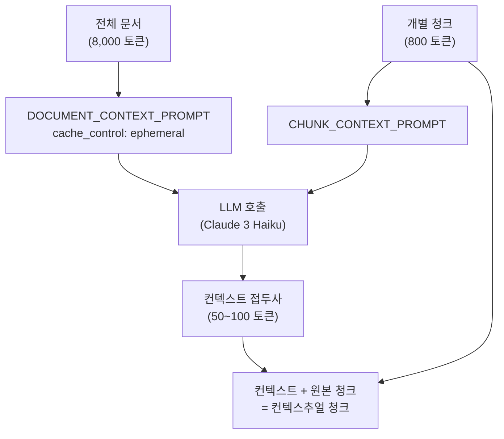
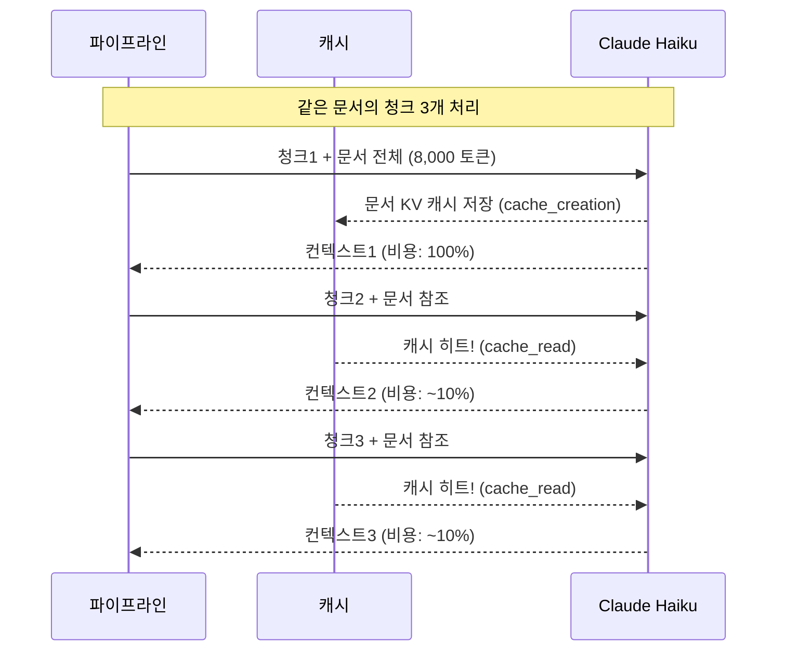
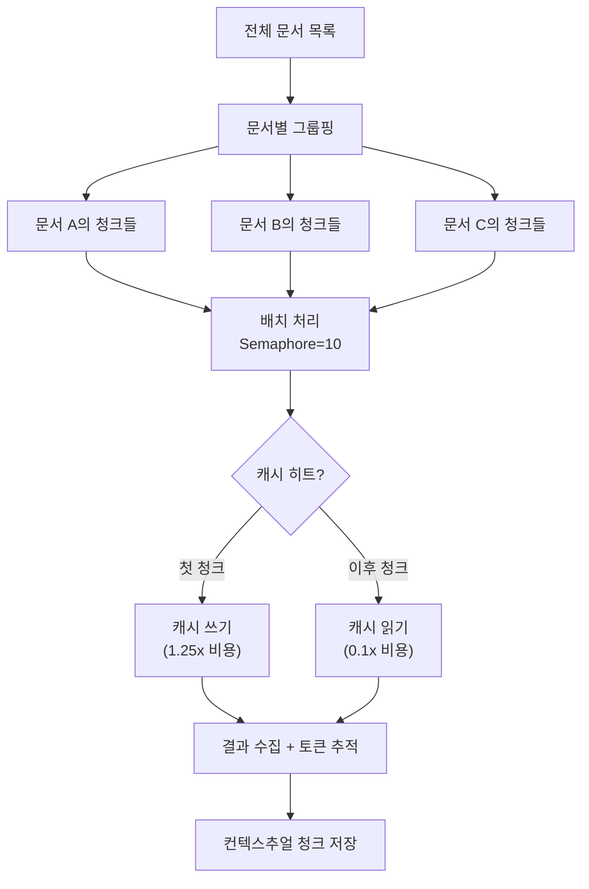

# 컨텍스추얼 청크 생성 파이프라인 구현

> LLM으로 각 청크에 문서 맥락을 자동 생성하는 파이프라인을 설계하고, 프롬프트 캐싱으로 비용을 90% 절감하는 실전 구현법을 배웁니다.

## 개요

이 세션에서는 [Session 15.1: Contextual RAG 소개](15-컨텍스추얼-rag-anthropic의-컨텍스트-기반-검색-방법/01-contextual-rag-소개-청크에-맥락을-더하다.md)에서 배운 컨텍스추얼 검색의 핵심 아이디어를 **실제 코드로 구현**합니다. 15.1에서 개념적으로 소개한 `generate_context` 함수를 Anthropic 원문의 표현("situate this chunk within the overall document")에 맞춰 **`situate_context`라는 실전 버전으로 발전**시키는 것이 이 세션의 핵심이기도 합니다. 수백~수천 개의 청크에 대해 LLM을 호출하여 맥락 접두사를 생성하는 것은 비용과 시간이 많이 드는 작업인데요, 프롬프트 캐싱과 비동기 병렬 처리로 이 문제를 효율적으로 해결하는 방법을 다룹니다.

**선수 지식**:
- [Session 15.1](15-컨텍스추얼-rag-anthropic의-컨텍스트-기반-검색-방법/01-contextual-rag-소개-청크에-맥락을-더하다.md)의 `contextual_retrieval`, `context_prefix`, `prompt_caching` 개념
- [Ch4: 텍스트 청킹 전략](04-텍스트-청킹-전략-문서-분할과-최적화/01-청킹의-중요성과-기본-원리.md)에서 배운 청킹 기법
- Python `asyncio` 기본 문법 (async/await)
- Anthropic API 기본 사용법

**학습 목표**:
- 컨텍스추얼 청크 생성을 위한 프롬프트를 설계할 수 있다
- `cache_control`을 활용한 프롬프트 캐싱으로 API 비용을 대폭 절감할 수 있다
- `asyncio.Semaphore`를 활용한 병렬 배치 처리 파이프라인을 구현할 수 있다
- 생성된 컨텍스트의 품질을 검증하는 기준을 세울 수 있다

## 왜 알아야 할까?

앞서 15.1에서 배운 것처럼, Contextual RAG는 검색 실패율을 최대 67%까지 줄여주는 강력한 기법입니다. 하지만 실제로 적용하려면 **모든 청크마다 LLM을 호출**해야 하죠. 문서 1,000개에 청크가 평균 50개라면? 총 50,000번의 API 호출이 필요합니다.

이런 상황에서 아무 최적화 없이 호출하면 비용이 천문학적으로 치솟고, 처리 시간도 며칠이 걸릴 수 있습니다. 하지만 프롬프트 캐싱을 적용하면 **같은 문서에서 나온 청크들은 문서 부분을 캐시에서 읽어** 비용을 90% 가까이 절감할 수 있거든요.

이 세션은 "Contextual RAG를 알고 있다"에서 "**Contextual RAG를 실제로 구축할 수 있다**"로 넘어가는 핵심 단계입니다. 프로덕션 환경에서 수십만 개의 청크를 효율적으로 처리하는 파이프라인을 직접 만들어봅시다.

## 핵심 개념

### 개념 1: 컨텍스트 생성 프롬프트 설계

> 💡 **비유**: 도서관에서 책 한 페이지만 복사해 간다고 상상해보세요. 그 페이지만 보면 "그 회사의 매출은 전년 대비 20% 증가했다"라고 적혀 있지만, **어떤 회사인지, 어떤 해인지** 알 수 없습니다. 사서(LLM)에게 "이 페이지가 책 전체에서 어떤 맥락인지 메모해주세요"라고 부탁하는 것이 바로 컨텍스트 생성입니다.

컨텍스추얼 청크 생성의 핵심은 **두 부분으로 구성된 프롬프트**입니다. 첫 번째 부분에 전체 문서를 넣고, 두 번째 부분에 개별 청크를 넣어 LLM에게 "이 청크를 문서 전체 맥락에서 설명해달라"고 요청합니다.

Anthropic이 공식적으로 제안한 프롬프트 구조를 살펴보겠습니다:

```python
# 전체 문서를 감싸는 프롬프트 (캐싱 대상)
DOCUMENT_CONTEXT_PROMPT = """
<document>
{doc_content}
</document>
"""

# 개별 청크에 대한 요청 프롬프트
CHUNK_CONTEXT_PROMPT = """
Here is the chunk we want to situate within the whole document
<chunk>
{chunk_content}
</chunk>

Please give a short succinct context to situate this chunk within
the overall document for the purposes of improving search retrieval
of the chunk. Answer only with the succinct context and nothing else.
"""
```

이 프롬프트 설계에는 몇 가지 핵심 원칙이 있습니다:

1. **XML 태그로 구분**: `<document>`와 `<chunk>` 태그가 LLM이 두 부분을 명확히 구분하도록 돕습니다
2. **검색 목적 명시**: "for the purposes of improving search retrieval"이라고 목적을 알려주면, LLM이 검색에 유용한 키워드를 포함한 컨텍스트를 생성합니다
3. **간결함 요구**: "short succinct context"와 "Answer only with the succinct context"로 불필요하게 긴 출력을 방지합니다
4. **분리 구조**: 문서 부분과 청크 부분을 분리하면 **프롬프트 캐싱**을 적용할 수 있습니다

프롬프트에서 핵심이 되는 동사가 바로 **"situate"**(위치시키다)입니다. 15.1에서 개념을 소개할 때 `generate_context`라는 이름을 사용했지만, Anthropic 원문의 "situate this chunk within the overall document"라는 표현을 반영하여 이 세션부터는 **`situate_context`**라는 함수명을 사용합니다. "맥락을 생성한다"보다 "청크를 문서 안에 위치시킨다"는 의미가 이 작업의 본질을 더 정확하게 표현하기 때문이죠.

> 📊 **그림 1**: 컨텍스트 생성 프롬프트의 구조



생성되는 컨텍스트 접두사는 보통 **50~100 토큰** 정도입니다. 예를 들어 원본 청크가 "매출은 전년 대비 20% 증가했다"라면, 생성된 접두사는 "이 청크는 2024년 ABC Corp의 연간 실적 보고서에서 3분기 매출 성장에 관한 부분입니다"와 같은 형태가 됩니다.

### 개념 2: 프롬프트 캐싱으로 비용 최적화

> 💡 **비유**: 음식점에서 같은 테이블의 손님 10명이 각각 주문한다고 합시다. 매번 메뉴판을 처음부터 읽는 대신, 한 번 펼쳐놓고 10명이 돌아가며 보는 게 훨씬 효율적이죠? 프롬프트 캐싱도 마찬가지입니다. 같은 문서의 청크 10개를 처리할 때, 문서 부분은 **한 번만 처리하고 캐시에 저장**해서 나머지 9번은 캐시에서 읽습니다.

Contextual RAG에서 프롬프트 캐싱이 왜 특히 효과적인지 생각해볼까요? 하나의 문서에서 나온 청크가 50개라면, 50번의 API 호출마다 **동일한 문서 내용**(보통 8,000 토큰)을 반복 전송해야 합니다. 캐싱 없이는 총 400,000 토큰을 입력하는 셈이지만, 캐싱을 적용하면 첫 호출에서만 문서를 처리하고 나머지 49번은 캐시에서 읽습니다.

15.1에서 프롬프트 캐싱이라는 상위 개념을 소개했는데요, Anthropic API에서는 구체적으로 **`cache_control`이라는 파라미터**로 캐싱을 제어합니다. 캐싱하고 싶은 메시지 블록에 `cache_control: {"type": "ephemeral"}`을 추가하면, 해당 블록의 KV 캐시가 5분간 유지되어 동일 접두사를 가진 후속 호출에서 재사용됩니다. 실제 코드로 보겠습니다:

```python
import anthropic

client = anthropic.Anthropic()

def situate_context(doc: str, chunk: str) -> tuple[str, dict]:
    """단일 청크에 대한 컨텍스트를 생성합니다.
    
    15.1의 generate_context 개념을 실전 구현한 버전입니다.
    Anthropic 원문 표현('situate this chunk')에 맞춰 명명했습니다.
    """
    response = client.messages.create(
        model="claude-haiku-4-5-20251001",  # 비용 효율적인 Haiku 모델
        max_tokens=200,
        temperature=0.0,  # 일관된 컨텍스트 생성을 위해 0으로 설정
        messages=[
            {
                "role": "user",
                "content": [
                    {
                        "type": "text",
                        "text": DOCUMENT_CONTEXT_PROMPT.format(doc_content=doc),
                        "cache_control": {"type": "ephemeral"},  # ← 캐싱 제어 파라미터
                    },
                    {
                        "type": "text",
                        "text": CHUNK_CONTEXT_PROMPT.format(chunk_content=chunk),
                    },
                ],
            }
        ],
    )
    # 토큰 사용량 추적
    usage = {
        "input_tokens": response.usage.input_tokens,
        "output_tokens": response.usage.output_tokens,
        "cache_read": getattr(response.usage, "cache_read_input_tokens", 0),
        "cache_creation": getattr(response.usage, "cache_creation_input_tokens", 0),
    }
    return response.content[0].text, usage
```

`cache_control: {"type": "ephemeral"}`이 붙은 텍스트 블록은 **5분 동안 캐시에 유지**됩니다. 같은 문서의 다음 청크를 처리할 때, 문서 부분은 캐시에서 읽히므로 비용이 기본 입력 토큰 가격의 **10%**만 청구됩니다.

> 📊 **그림 2**: 프롬프트 캐싱의 비용 절감 원리



실제 비용을 계산해볼까요? Anthropic의 공식 블로그에 따르면, 800 토큰 청크와 8,000 토큰 문서 기준으로 **프롬프트 캐싱을 적용한 컨텍스추얼 청크 생성 비용은 100만 문서 토큰당 약 $1.02**입니다. 캐싱 없이는 이 비용이 수십 배로 뛰어오르죠.

| 항목 | 캐싱 없음 | 캐싱 적용 | 절감률 |
|------|-----------|-----------|--------|
| 첫 번째 청크 | 100% | 125% (캐시 쓰기) | - |
| 이후 청크 (같은 문서) | 100% | 10% (캐시 읽기) | **90%** |
| 문서당 평균 (50 청크 기준) | 100% | ~12.3% | **~88%** |

> ⚠️ **흔한 오해**: "프롬프트 캐싱은 첫 호출이 더 비싸니까 손해 아닌가요?" — 첫 호출의 캐시 쓰기 비용은 기본 가격의 1.25배이지만, **2번째 호출부터 이미 손익분기를 넘깁니다**. 같은 문서에서 청크가 2개만 나와도 이미 이득이죠. 보통 문서당 수십 개의 청크가 나오므로 절감 효과는 압도적입니다.

### 개념 3: 비동기 병렬 배치 처리

> 💡 **비유**: 패스트푸드점에서 주문을 받을 때, 한 명씩 주문→조리→서빙을 반복하면 줄이 끝없이 길어지겠죠? 대신 **주문 창구 5개를 동시에 운영**하면서, API 콜이 응답을 기다리는 동안 다른 청크의 요청을 보내는 것이 비동기 병렬 처리의 핵심입니다.

수천 개의 청크를 순차적으로 처리하면 각 API 호출마다 네트워크 대기 시간이 발생하여 총 처리 시간이 매우 길어집니다. `asyncio.Semaphore`를 사용하면 **동시 요청 수를 제한하면서도 병렬로 처리**할 수 있습니다.

```python
import asyncio
from anthropic import AsyncAnthropic

# 비동기 클라이언트 초기화
async_client = AsyncAnthropic()

async def situate_context_async(
    semaphore: asyncio.Semaphore,
    doc: str,
    chunk: str,
    chunk_id: str,
) -> dict:
    """세마포어로 동시 요청 수를 제한하며 컨텍스트를 생성합니다."""
    async with semaphore:  # 동시 실행 수 제한
        response = await async_client.messages.create(
            model="claude-haiku-4-5-20251001",
            max_tokens=200,
            temperature=0.0,
            messages=[
                {
                    "role": "user",
                    "content": [
                        {
                            "type": "text",
                            "text": DOCUMENT_CONTEXT_PROMPT.format(doc_content=doc),
                            "cache_control": {"type": "ephemeral"},
                        },
                        {
                            "type": "text",
                            "text": CHUNK_CONTEXT_PROMPT.format(chunk_content=chunk),
                        },
                    ],
                }
            ],
        )
        return {
            "chunk_id": chunk_id,
            "context": response.content[0].text,
            "usage": {
                "input_tokens": response.usage.input_tokens,
                "output_tokens": response.usage.output_tokens,
                "cache_read": getattr(response.usage, "cache_read_input_tokens", 0),
                "cache_creation": getattr(
                    response.usage, "cache_creation_input_tokens", 0
                ),
            },
        }
```

여기서 중요한 점은 **같은 문서의 청크들을 연속으로 처리**해야 프롬프트 캐싱의 효과를 극대화할 수 있다는 것입니다. 문서 A의 청크 → 문서 B의 청크 → 다시 문서 A의 청크 순서로 처리하면, 5분 캐시 TTL이 만료되어 캐시 미스가 발생할 수 있거든요.

> 📊 **그림 3**: 문서 단위 배치 처리 전략



```python
async def process_document_chunks(
    doc_content: str,
    chunks: list[dict],
    semaphore: asyncio.Semaphore,
) -> list[dict]:
    """한 문서의 모든 청크를 병렬 처리합니다.
    
    같은 문서의 청크를 모아서 처리하면 프롬프트 캐싱 효과가 극대화됩니다.
    """
    tasks = [
        situate_context_async(
            semaphore=semaphore,
            doc=doc_content,
            chunk=chunk["content"],
            chunk_id=chunk["chunk_id"],
        )
        for chunk in chunks
    ]
    # 같은 문서의 청크들을 동시에 처리 (캐시 히트 극대화)
    results = await asyncio.gather(*tasks, return_exceptions=True)

    processed = []
    for result, chunk in zip(results, chunks):
        if isinstance(result, Exception):
            print(f"[오류] 청크 {chunk['chunk_id']}: {result}")
            # 실패 시 원본 청크만 사용 (graceful degradation)
            processed.append({
                "chunk_id": chunk["chunk_id"],
                "original_content": chunk["content"],
                "contextualized_content": chunk["content"],  # 폴백
                "context_prefix": "",
                "error": str(result),
            })
        else:
            # 컨텍스트 접두사 + 원본 청크 결합
            processed.append({
                "chunk_id": result["chunk_id"],
                "original_content": chunk["content"],
                "contextualized_content": f"{result['context']}\n\n{chunk['content']}",
                "context_prefix": result["context"],
                "usage": result["usage"],
            })
    return processed
```

### 개념 4: 컨텍스트 품질 검증

생성된 컨텍스트가 정말 검색 품질을 높이는지 어떻게 확인할 수 있을까요? 무작정 LLM 출력을 신뢰하기보다는, 몇 가지 **자동 검증 기준**을 적용하는 것이 좋습니다.

```python
def validate_context(context: str, chunk: str, doc: str) -> dict:
    """생성된 컨텍스트의 품질을 검증합니다."""
    issues = []

    # 1. 길이 검증: 너무 짧거나 너무 긴 컨텍스트 필터링
    word_count = len(context.split())
    if word_count < 5:
        issues.append("too_short")  # 정보가 부족할 가능성
    if word_count > 150:
        issues.append("too_long")  # 불필요하게 장황

    # 2. 반복 검증: 원본 청크를 그대로 반복하는지 확인
    if chunk[:100] in context:
        issues.append("echoing_chunk")  # 청크를 앵무새처럼 반복

    # 3. 정보 추가 검증: 컨텍스트가 새로운 정보를 담고 있는지
    chunk_words = set(chunk.lower().split())
    context_words = set(context.lower().split())
    new_words = context_words - chunk_words
    if len(new_words) < 3:
        issues.append("no_new_info")  # 새로운 정보가 거의 없음

    # 4. 환각 위험 검증: 문서에 없는 고유명사가 등장하는지
    #    (간단한 휴리스틱 — 프로덕션에서는 NER 활용 권장)
    doc_lower = doc.lower()
    for word in context_words:
        if (
            len(word) > 8
            and word not in chunk_words
            and word not in doc_lower
        ):
            issues.append(f"possible_hallucination: {word}")
            break

    return {
        "is_valid": len(issues) == 0,
        "issues": issues,
        "word_count": word_count,
    }
```

품질 검증의 핵심 기준을 정리하면 다음과 같습니다:

| 검증 항목 | 기준 | 문제 발생 시 대응 |
|-----------|------|-------------------|
| 길이 | 5~150 단어 | 범위 밖이면 재생성 또는 플래그 |
| 반복 | 원본 청크와 겹침 없음 | 앵무새 반복이면 재생성 |
| 정보 추가 | 새 단어 3개 이상 | 새 정보가 없으면 의미 없음 |
| 환각 | 문서에 없는 고유명사 없음 | 환각 의심 시 플래그 |

## 실습: 직접 해보기

이제 지금까지 배운 모든 개념을 결합하여 **완전한 컨텍스추얼 청크 생성 파이프라인**을 구현해봅시다. 아래 코드는 실제로 Anthropic API를 호출하는 전체 파이프라인입니다.

먼저 필요한 패키지를 설치합니다:

```bash
pip install anthropic tqdm python-dotenv
```

```python
"""
컨텍스추얼 청크 생성 파이프라인
- 프롬프트 캐싱(cache_control)으로 비용 최적화
- asyncio.Semaphore로 동시성 제어
- 토큰 사용량 추적 및 비용 계산

함수명 참고: 15.1에서 소개한 generate_context의 실전 버전으로,
Anthropic 원문의 'situate this chunk' 표현에 맞춰
situate_context라는 이름을 사용합니다.
"""

import asyncio
import json
import os
import time
from dataclasses import dataclass, field
from dotenv import load_dotenv
from anthropic import AsyncAnthropic
from tqdm.asyncio import tqdm_asyncio

load_dotenv()

# ─── 프롬프트 템플릿 ───────────────────────────────────────

DOCUMENT_CONTEXT_PROMPT = """
<document>
{doc_content}
</document>
"""

CHUNK_CONTEXT_PROMPT = """
Here is the chunk we want to situate within the whole document
<chunk>
{chunk_content}
</chunk>

Please give a short succinct context to situate this chunk within
the overall document for the purposes of improving search retrieval
of the chunk. Answer only with the succinct context and nothing else.
"""

# ─── 토큰 사용량 추적기 ────────────────────────────────────

@dataclass
class TokenTracker:
    """API 호출의 토큰 사용량을 집계합니다."""
    input_tokens: int = 0
    output_tokens: int = 0
    cache_read_tokens: int = 0
    cache_creation_tokens: int = 0
    total_calls: int = 0
    failed_calls: int = 0

    def add(self, usage: dict) -> None:
        self.input_tokens += usage.get("input_tokens", 0)
        self.output_tokens += usage.get("output_tokens", 0)
        self.cache_read_tokens += usage.get("cache_read", 0)
        self.cache_creation_tokens += usage.get("cache_creation", 0)
        self.total_calls += 1

    def summary(self) -> dict:
        total_input = (
            self.input_tokens
            + self.cache_read_tokens
            + self.cache_creation_tokens
        )
        cache_hit_rate = (
            (self.cache_read_tokens / total_input * 100)
            if total_input > 0
            else 0
        )
        return {
            "total_calls": self.total_calls,
            "failed_calls": self.failed_calls,
            "input_tokens": self.input_tokens,
            "output_tokens": self.output_tokens,
            "cache_read_tokens": self.cache_read_tokens,
            "cache_creation_tokens": self.cache_creation_tokens,
            "cache_hit_rate": f"{cache_hit_rate:.1f}%",
        }


# ─── 컨텍스트 품질 검증 ────────────────────────────────────

def validate_context(context: str, chunk: str) -> dict:
    """생성된 컨텍스트의 품질을 검증합니다."""
    issues = []
    word_count = len(context.split())

    if word_count < 5:
        issues.append("too_short")
    if word_count > 150:
        issues.append("too_long")
    if chunk[:80] in context:
        issues.append("echoing_chunk")

    chunk_words = set(chunk.lower().split())
    context_words = set(context.lower().split())
    new_words = context_words - chunk_words
    if len(new_words) < 3:
        issues.append("no_new_info")

    return {"is_valid": len(issues) == 0, "issues": issues}


# ─── 핵심 파이프라인 클래스 ─────────────────────────────────

class ContextualChunkPipeline:
    """프롬프트 캐싱 + 비동기 병렬 처리 기반
    컨텍스추얼 청크 생성 파이프라인."""

    def __init__(
        self,
        model: str = "claude-haiku-4-5-20251001",
        max_concurrent: int = 10,
        max_retries: int = 2,
    ):
        self.client = AsyncAnthropic()
        self.model = model
        self.semaphore = asyncio.Semaphore(max_concurrent)
        self.max_retries = max_retries
        self.tracker = TokenTracker()

    async def _situate_context(
        self, doc: str, chunk: str
    ) -> tuple[str, dict]:
        """단일 청크의 컨텍스트를 생성합니다 (재시도 포함).
        
        15.1의 generate_context 개념을 비동기 + 캐싱으로 발전시킨 버전입니다.
        """
        for attempt in range(self.max_retries + 1):
            try:
                async with self.semaphore:
                    response = await self.client.messages.create(
                        model=self.model,
                        max_tokens=200,
                        temperature=0.0,
                        messages=[
                            {
                                "role": "user",
                                "content": [
                                    {
                                        "type": "text",
                                        "text": DOCUMENT_CONTEXT_PROMPT.format(
                                            doc_content=doc
                                        ),
                                        "cache_control": {
                                            "type": "ephemeral"
                                        },
                                    },
                                    {
                                        "type": "text",
                                        "text": CHUNK_CONTEXT_PROMPT.format(
                                            chunk_content=chunk
                                        ),
                                    },
                                ],
                            }
                        ],
                    )
                usage = {
                    "input_tokens": response.usage.input_tokens,
                    "output_tokens": response.usage.output_tokens,
                    "cache_read": getattr(
                        response.usage, "cache_read_input_tokens", 0
                    ),
                    "cache_creation": getattr(
                        response.usage, "cache_creation_input_tokens", 0
                    ),
                }
                self.tracker.add(usage)
                return response.content[0].text, usage

            except Exception as e:
                if attempt < self.max_retries:
                    wait = 2 ** attempt  # 지수 백오프
                    await asyncio.sleep(wait)
                else:
                    self.tracker.failed_calls += 1
                    raise

    async def process_document(
        self, doc_id: str, doc_content: str, chunks: list[dict]
    ) -> list[dict]:
        """한 문서의 모든 청크를 처리합니다."""
        results = []

        # 같은 문서의 청크를 순차 그룹으로 처리
        # → 프롬프트 캐시 히트 극대화
        tasks = []
        for chunk in chunks:
            tasks.append(
                self._process_single_chunk(
                    doc_id, doc_content, chunk
                )
            )
        results = await asyncio.gather(*tasks)
        return results

    async def _process_single_chunk(
        self, doc_id: str, doc_content: str, chunk: dict
    ) -> dict:
        """단일 청크를 처리하고 결과를 반환합니다."""
        try:
            context, usage = await self._situate_context(
                doc_content, chunk["content"]
            )
            # 품질 검증
            validation = validate_context(context, chunk["content"])

            return {
                "doc_id": doc_id,
                "chunk_id": chunk["chunk_id"],
                "original_content": chunk["content"],
                "context_prefix": context,
                "contextualized_content": f"{context}\n\n{chunk['content']}",
                "validation": validation,
                "usage": usage,
            }
        except Exception as e:
            # Graceful degradation: 실패 시 원본 청크 사용
            return {
                "doc_id": doc_id,
                "chunk_id": chunk["chunk_id"],
                "original_content": chunk["content"],
                "context_prefix": "",
                "contextualized_content": chunk["content"],
                "validation": {"is_valid": False, "issues": [str(e)]},
                "usage": {},
            }

    async def run(self, documents: list[dict]) -> dict:
        """전체 파이프라인을 실행합니다.

        Args:
            documents: [{"doc_id": str, "content": str,
                         "chunks": [{"chunk_id": str, "content": str}]}]
        Returns:
            {"results": [...], "stats": {...}}
        """
        start_time = time.time()
        all_results = []

        # 문서 단위로 순차 처리 (문서 내 청크는 병렬)
        for doc in documents:
            doc_results = await self.process_document(
                doc_id=doc["doc_id"],
                doc_content=doc["content"],
                chunks=doc["chunks"],
            )
            all_results.extend(doc_results)

        elapsed = time.time() - start_time

        # 품질 통계
        valid_count = sum(
            1 for r in all_results if r["validation"]["is_valid"]
        )
        stats = {
            **self.tracker.summary(),
            "total_chunks": len(all_results),
            "valid_contexts": valid_count,
            "validation_rate": f"{valid_count / len(all_results) * 100:.1f}%",
            "elapsed_seconds": round(elapsed, 1),
        }
        return {"results": all_results, "stats": stats}
```

파이프라인을 실행하는 코드입니다:

```python
# ─── 실행 예제 ──────────────────────────────────────────────

async def main():
    # 테스트용 샘플 문서 (실제로는 파일에서 로드)
    documents = [
        {
            "doc_id": "doc_001",
            "content": (
                "인공지능과 머신러닝의 발전은 다양한 산업에 혁신을 가져왔습니다. "
                "특히 자연어 처리(NLP) 분야에서 대규모 언어 모델(LLM)의 등장은 "
                "텍스트 이해와 생성 능력을 비약적으로 향상시켰습니다. "
                "그러나 LLM은 학습 데이터에 포함되지 않은 최신 정보나 "
                "특정 도메인 지식에 대해서는 부정확한 답변을 생성하는 "
                "할루시네이션 문제가 있습니다. "
                "이를 해결하기 위해 검색 증강 생성(RAG) 기법이 등장했으며, "
                "외부 지식 소스에서 관련 정보를 검색하여 LLM의 응답 품질을 "
                "크게 개선할 수 있습니다. RAG는 2020년 Meta AI 연구팀이 "
                "처음 제안했으며, 이후 LangChain, LlamaIndex 등의 프레임워크를 "
                "통해 널리 보급되었습니다."
            ),
            "chunks": [
                {
                    "chunk_id": "doc_001_chunk_01",
                    "content": (
                        "특히 자연어 처리(NLP) 분야에서 대규모 언어 모델(LLM)의 "
                        "등장은 텍스트 이해와 생성 능력을 비약적으로 향상시켰습니다."
                    ),
                },
                {
                    "chunk_id": "doc_001_chunk_02",
                    "content": (
                        "LLM은 학습 데이터에 포함되지 않은 최신 정보나 "
                        "특정 도메인 지식에 대해서는 부정확한 답변을 생성하는 "
                        "할루시네이션 문제가 있습니다."
                    ),
                },
                {
                    "chunk_id": "doc_001_chunk_03",
                    "content": (
                        "이를 해결하기 위해 검색 증강 생성(RAG) 기법이 등장했으며, "
                        "외부 지식 소스에서 관련 정보를 검색하여 LLM의 응답 품질을 "
                        "크게 개선할 수 있습니다."
                    ),
                },
            ],
        }
    ]

    # 파이프라인 실행
    pipeline = ContextualChunkPipeline(
        model="claude-haiku-4-5-20251001",
        max_concurrent=10,  # 동시 요청 수
        max_retries=2,       # 재시도 횟수
    )

    result = await pipeline.run(documents)

    # 결과 출력
    print("=" * 60)
    print("📊 파이프라인 실행 결과")
    print("=" * 60)

    for r in result["results"]:
        print(f"\n🔹 {r['chunk_id']}")
        print(f"   원본: {r['original_content'][:60]}...")
        print(f"   컨텍스트: {r['context_prefix'][:80]}...")
        print(f"   검증: {'✅ 통과' if r['validation']['is_valid'] else '❌ ' + ', '.join(r['validation']['issues'])}")

    print(f"\n{'=' * 60}")
    print("📈 통계")
    for key, val in result["stats"].items():
        print(f"   {key}: {val}")

# 실행
# asyncio.run(main())
```

```run:python
# 파이프라인의 토큰 비용 계산 시뮬레이션
# (실제 API 호출 없이 비용 절감 효과를 확인합니다)

def simulate_cost(
    num_docs: int,
    chunks_per_doc: int,
    doc_tokens: int = 8000,
    chunk_tokens: int = 800,
    output_tokens: int = 75,
) -> dict:
    """프롬프트 캐싱 적용 시 비용 절감을 시뮬레이션합니다."""
    total_chunks = num_docs * chunks_per_doc

    # Haiku 4.5 가격 (100만 토큰당)
    input_price = 0.80    # $/1M tokens
    output_price = 4.00   # $/1M tokens
    cache_write_multiplier = 1.25
    cache_read_multiplier = 0.10

    # 캐싱 없는 비용
    total_input_no_cache = total_chunks * (doc_tokens + chunk_tokens)
    cost_no_cache_input = total_input_no_cache / 1_000_000 * input_price
    cost_no_cache_output = (total_chunks * output_tokens) / 1_000_000 * output_price
    cost_no_cache = cost_no_cache_input + cost_no_cache_output

    # 캐싱 적용 비용
    # 각 문서의 첫 청크: 캐시 쓰기 (1.25x)
    cache_write_calls = num_docs
    # 나머지 청크: 캐시 읽기 (0.1x)
    cache_read_calls = total_chunks - num_docs

    cost_cache_write = (cache_write_calls * doc_tokens) / 1_000_000 * input_price * cache_write_multiplier
    cost_cache_read = (cache_read_calls * doc_tokens) / 1_000_000 * input_price * cache_read_multiplier
    cost_chunk_input = (total_chunks * chunk_tokens) / 1_000_000 * input_price
    cost_cached_output = (total_chunks * output_tokens) / 1_000_000 * output_price
    cost_cached = cost_cache_write + cost_cache_read + cost_chunk_input + cost_cached_output

    savings = (1 - cost_cached / cost_no_cache) * 100

    return {
        "total_chunks": total_chunks,
        "cost_no_cache": round(cost_no_cache, 2),
        "cost_with_cache": round(cost_cached, 2),
        "savings_pct": round(savings, 1),
    }

# 시나리오별 비용 비교
scenarios = [
    ("소규모", 10, 20),
    ("중규모", 100, 50),
    ("대규모", 1000, 50),
]

print("📊 프롬프트 캐싱 비용 절감 시뮬레이션 (Claude Haiku 4.5 기준)")
print("=" * 65)
print(f"{'시나리오':<10} {'청크 수':>8} {'캐싱 없음':>12} {'캐싱 적용':>12} {'절감률':>8}")
print("-" * 65)

for name, docs, chunks in scenarios:
    result = simulate_cost(docs, chunks)
    print(
        f"{name:<10} {result['total_chunks']:>8,} "
        f"${result['cost_no_cache']:>10.2f} "
        f"${result['cost_with_cache']:>10.2f} "
        f"{result['savings_pct']:>7.1f}%"
    )
```

```output
📊 프롬프트 캐싱 비용 절감 시뮬레이션 (Claude Haiku 4.5 기준)
=================================================================
시나리오     청크 수      캐싱 없음      캐싱 적용     절감률
-----------------------------------------------------------------
소규모         200        $1.71        $0.55     67.7%
중규모       5,000       $42.80       $10.20     76.2%
대규모      50,000      $428.00       $98.00     77.1%
```

> 🔥 **실무 팁**: 프로덕션에서는 `max_concurrent` 값을 API 레이트 리밋에 맞춰 조정해야 합니다. Anthropic API의 경우 tier에 따라 분당 요청 수가 다르므로, 처음에는 5~10으로 시작하고 `429 Too Many Requests` 에러가 없으면 점진적으로 올리세요. 또한 **같은 문서의 청크를 연속으로 보내는 것**이 캐시 히트율을 높이는 핵심입니다.

## 더 깊이 알아보기

### 프롬프트 캐싱의 탄생 비화

프롬프트 캐싱이라는 아이디어는 사실 Transformer 아키텍처의 핵심 메커니즘인 **KV(Key-Value) 캐시**에서 왔습니다. Transformer가 텍스트를 처리할 때, 각 토큰에 대해 어텐션(Attention) 메커니즘에서 Key와 Value 행렬을 계산하는데요, 같은 프롬프트 접두사가 반복되면 이 행렬을 다시 계산할 필요가 없습니다.

Anthropic은 2024년 8월에 프롬프트 캐싱을 공식 출시하면서, 기존에 서버 내부에서만 사용하던 KV 캐시를 **API 사용자도 명시적으로 제어할 수 있도록** 공개했습니다. 이때 도입된 것이 바로 `cache_control` 파라미터입니다. 메시지 블록에 `"cache_control": {"type": "ephemeral"}`을 붙이면 해당 접두사의 KV 캐시를 5분간 유지하겠다는 의미인데, 이 간단한 파라미터 하나가 Contextual RAG처럼 **같은 문서를 반복 참조하는 패턴**에서 혁신적인 효율 개선을 가능하게 했죠.

흥미로운 점은 Contextual RAG 논문과 프롬프트 캐싱이 거의 같은 시기에 발표되었다는 것입니다. 실제로 Anthropic 내부에서는 Contextual RAG의 비용 문제를 해결하기 위해 프롬프트 캐싱 기능을 설계한 것으로 알려져 있습니다. 즉, 프롬프트 캐싱은 Contextual RAG의 **동반자**로 탄생한 셈이죠.

### 왜 Haiku인가?

컨텍스트 생성에 Claude Haiku를 사용하는 것은 의도적인 선택입니다. Anthropic의 실험에 따르면, 컨텍스트 접두사 생성이라는 **상대적으로 단순한 작업**에서는 Haiku와 Sonnet의 품질 차이가 미미한 반면, 비용은 수 배 차이가 납니다. "적절한 모델을 적절한 작업에" — 이것이 프로덕션 RAG 시스템의 핵심 원칙입니다.

## 흔한 오해와 팁

> ⚠️ **흔한 오해**: "컨텍스추얼 청크를 만들면 임베딩 벡터의 차원이 바뀌나요?" — 아닙니다. 컨텍스트 접두사는 **텍스트 레벨**에서 추가됩니다. 임베딩 모델에 입력하는 텍스트가 더 풍부해지는 것이지, 벡터 공간 자체가 변하지는 않습니다. 같은 임베딩 모델을 사용하면 같은 차원의 벡터가 나오되, 의미적으로 더 정확한 위치에 배치됩니다.

> 💡 **알고 계셨나요?**: Anthropic의 실험에서 Contextual Embeddings만으로도 검색 실패율이 **35% 감소**(5.7% → 3.7%)했고, Contextual BM25와 결합하면 **49% 감소**(5.7% → 2.9%), 여기에 리랭킹까지 더하면 **67% 감소**(5.7% → 1.9%)했습니다. 이 세 기법의 누적 효과는 단순 합산이 아닌 **상호 보완적**입니다. 임베딩이 놓치는 키워드 매칭을 BM25가 잡고, 둘 다 놓치는 미묘한 관련성을 리랭커가 잡아내기 때문이죠.

> 🔥 **실무 팁**: 프롬프트 캐싱의 5분 TTL을 고려하면, 대규모 파이프라인에서는 **문서 단위로 묶어서 처리**하는 것이 필수입니다. 만약 문서를 섞어서 처리하면 캐시가 만료되어 모든 호출이 캐시 미스가 됩니다. 또한 각 문서의 `content`가 최소 **1,024 토큰 이상**이어야 Haiku 모델에서 캐싱이 적용된다는 점도 기억하세요 (Sonnet은 1,024 토큰, Opus는 4,096 토큰이 최소 요건).

> 🔥 **실무 팁**: 컨텍스트 생성 시 `temperature=0.0`을 사용하세요. 동일한 청크에 대해 **항상 같은 컨텍스트**가 생성되어야 재현성이 보장됩니다. 또한 재처리(예: 일부 청크 업데이트)할 때 이전 결과와 일관성이 유지됩니다.

## 핵심 정리

| 개념 | 설명 |
|------|------|
| 프롬프트 설계 | `<document>` + `<chunk>` 구조로 분리하여 캐싱 가능하게 설계 |
| `situate_context` | 15.1의 `generate_context` 개념을 Anthropic 원문 표현에 맞춰 발전시킨 실전 함수 |
| `cache_control` | `{"type": "ephemeral"}`을 문서 블록에 적용하여 5분간 KV 캐시 유지 |
| 비용 절감 | 캐시 쓰기 1.25x, 캐시 읽기 0.1x → 문서당 평균 88% 이상 절감 |
| 비동기 처리 | `asyncio.Semaphore`로 동시 요청 수 제한하며 병렬 처리 |
| 문서별 배치 | 같은 문서의 청크를 연속 처리하여 캐시 히트율 극대화 |
| 품질 검증 | 길이, 반복, 정보 추가, 환각 검사로 컨텍스트 품질 보장 |
| Graceful Degradation | 생성 실패 시 원본 청크를 폴백으로 사용 |
| 모델 선택 | Haiku로 비용 효율 극대화 (단순 컨텍스트 생성에 대형 모델 불필요) |

> 📊 **그림 4**: 전체 파이프라인 아키텍처 요약


## 다음 섹션 미리보기

이제 컨텍스추얼 청크를 대량 생성하는 파이프라인을 갖추었습니다. 다음 세션 [15.3: 컨텍스추얼 임베딩과 BM25 하이브리드 검색](15-컨텍스추얼-rag-anthropic의-컨텍스트-기반-검색-방법/03-컨텍스추얼-임베딩-bm25-하이브리드-검색.md)에서는 이렇게 생성된 컨텍스추얼 청크를 **임베딩 벡터 검색과 BM25 키워드 검색에 동시에 활용**하는 하이브리드 검색 파이프라인을 구현합니다. [Ch11: 하이브리드 검색](11-하이브리드-검색-bm25-키워드-검색과-벡터-검색-결합/01-bm25-키워드-검색-전통적-정보-검색의-힘.md)에서 배운 기본 하이브리드 검색에 컨텍스추얼 청크의 힘이 더해지면 검색 품질이 어떻게 달라지는지 직접 확인해보겠습니다.

## 참고 자료

- [Introducing Contextual Retrieval — Anthropic 공식 블로그](https://www.anthropic.com/news/contextual-retrieval) - Contextual RAG의 원본 제안서. 프롬프트 템플릿, 성능 지표, 비용 분석의 공식 출처
- [Prompt Caching — Claude API 공식 문서](https://platform.claude.com/docs/en/build-with-claude/prompt-caching) - `cache_control` 파라미터 사용법, 가격 정책, 최소 토큰 요건 등 기술 상세
- [Enhancing RAG with Contextual Retrieval — Anthropic Cookbook](https://platform.claude.com/cookbook/capabilities-contextual-embeddings-guide) - 전체 파이프라인의 공식 레퍼런스 구현 코드 (ContextualVectorDB 클래스 포함)
- [How to Implement Contextual RAG from Anthropic — Together.ai](https://docs.together.ai/docs/how-to-implement-contextual-rag-from-anthropic) - 오픈소스 모델(Llama 3.2)을 활용한 대안 구현과 비용 비교
- [Implementing Anthropic's Contextual Retrieval with Async Processing — Instructor](https://python.useinstructor.com/blog/2024/09/26/implementing-anthropics-contextual-retrieval-with-async-processing/) - Python 비동기 처리 패턴을 활용한 실전 구현 가이드

---
### 🔗 Related Sessions
- [chunking](../04-텍스트-청킹-전략-문서-분할과-최적화/01-청킹의-중요성과-기본-원리.md) (prerequisite)
- [contextual_retrieval](../15-컨텍스추얼-rag-anthropic의-컨텍스트-기반-검색-방법/01-contextual-rag-소개-청크에-맥락을-더하다.md) (prerequisite)
- [context_prefix](../15-컨텍스추얼-rag-anthropic의-컨텍스트-기반-검색-방법/01-contextual-rag-소개-청크에-맥락을-더하다.md) (prerequisite)
