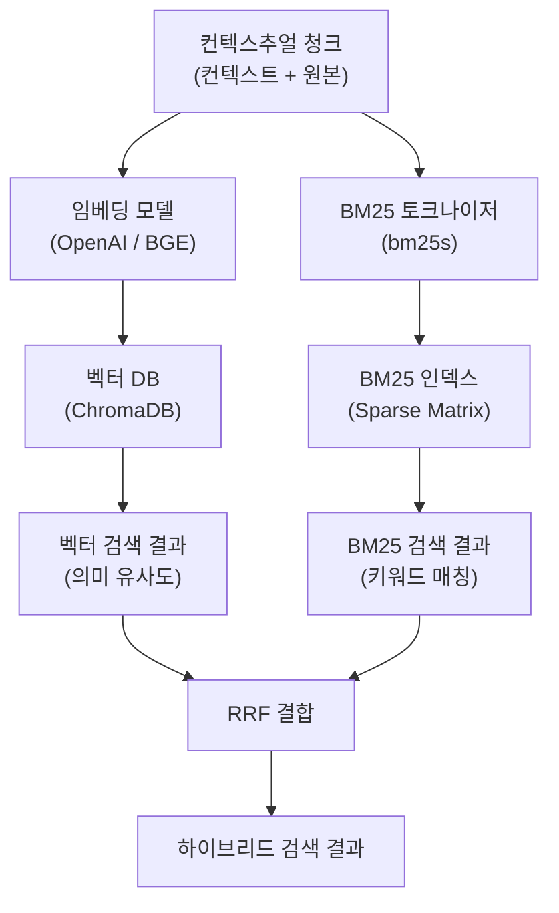
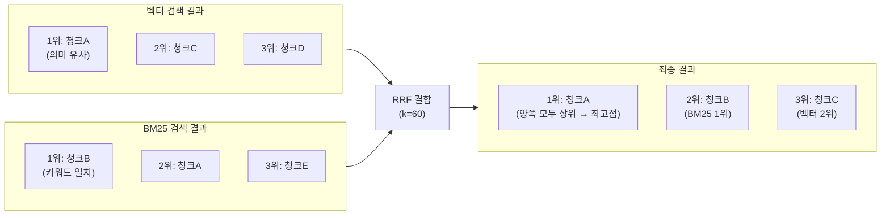
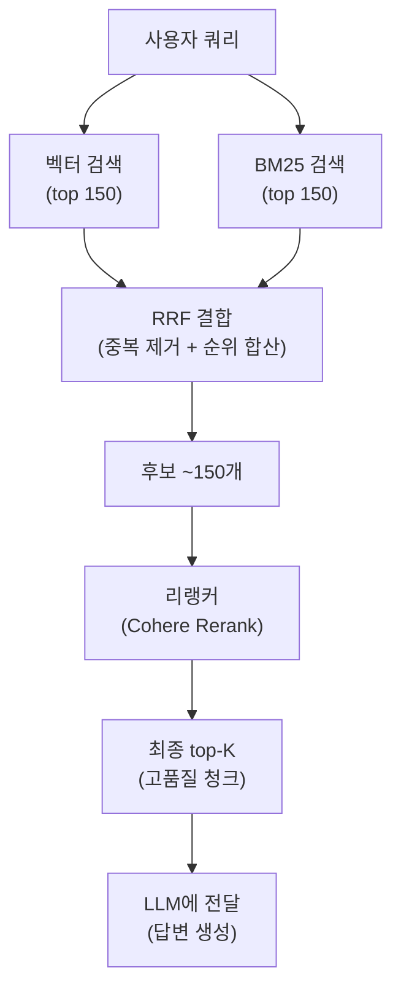
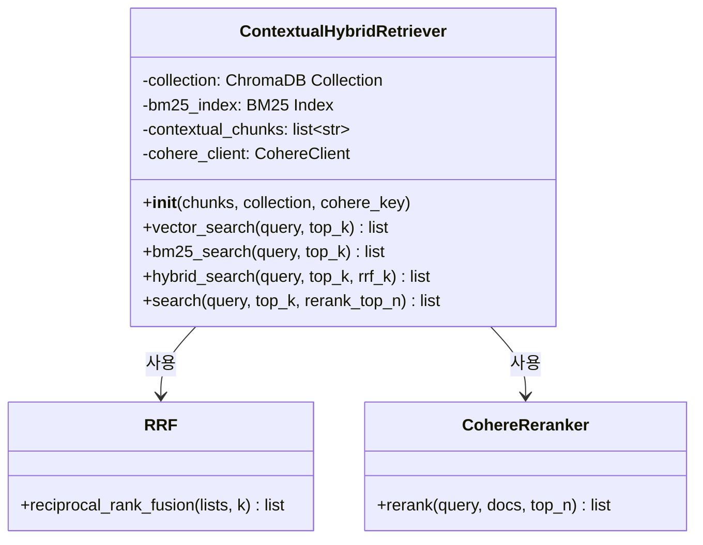

# 컨텍스추얼 임베딩 + BM25 하이브리드 검색

> 컨텍스추얼 청크를 벡터와 키워드로 동시에 검색하고, RRF와 리랭킹으로 정확도를 극대화하는 하이브리드 검색 파이프라인을 구축합니다.

## 개요

이 섹션에서는 [Session 15.2: 컨텍스추얼 청크 생성 파이프라인 구현](session_15_2.md)에서 만든 컨텍스추얼 청크를 실제 검색에 활용하는 방법을 배웁니다. 벡터 검색(임베딩)과 키워드 검색(BM25)을 동시에 수행하고, Reciprocal Rank Fusion(RRF)으로 결과를 결합한 뒤, 리랭킹 모델로 최종 정밀도를 끌어올리는 전체 파이프라인을 구현합니다.

**선수 지식**:
- [Session 15.1](session_15_1.md)에서 배운 Contextual RAG의 핵심 아이디어와 컨텍스트 접두사 개념
- [Session 15.2](session_15_2.md)에서 구현한 컨텍스추얼 청크 생성 파이프라인 (`situate_context`)
- [Ch6: 벡터 데이터베이스 기초](06-벡터-데이터베이스-기초-chromadb로-시작하기/01-벡터-데이터베이스란-왜-필요한가.md)에서 배운 ChromaDB 컬렉션 생성과 쿼리
- [Ch11: 하이브리드 검색](11-하이브리드-검색-bm25-키워드-검색과-벡터-검색-결합/01-bm25-키워드-검색-전통적-정보-검색의-힘.md)에서 다룬 하이브리드 검색의 기본 개념, BM25, 그리고 [Ch11.2](session_11_2.md)의 RRF 알고리즘
- [Ch12: 리랭킹으로 검색 정확도 높이기](12-리랭킹으로-검색-정확도-높이기-cohere-rerank-활용/01-리랭킹의-원리-왜-초기-검색으로는-부족한가.md)에서 배운 CohereRerank와 ContextualCompressionRetriever 사용법

**학습 목표**:
- 컨텍스추얼 청크를 벡터 인덱스와 BM25 인덱스에 동시에 인덱싱할 수 있다
- [Ch11.2](session_11_2.md)에서 배운 RRF 알고리즘을 컨텍스추얼 검색에 적용할 수 있다
- 벡터 + BM25 하이브리드 검색 결과에 리랭킹을 적용하여 검색 정확도를 극대화할 수 있다
- Anthropic 벤치마크 기준 검색 실패율 67% 감소의 파이프라인을 직접 구축할 수 있다

## 왜 알아야 할까?

앞선 세션에서 우리는 각 청크에 문서 맥락을 담은 컨텍스트 접두사를 생성했습니다. 그런데 이 컨텍스추얼 청크를 **어떻게 검색하느냐**에 따라 성능 차이가 극적으로 달라집니다.

Anthropic의 벤치마크를 보면 그 차이가 명확하게 드러나는데요:

| 검색 방법 | top-20 검색 실패율 | 개선율 |
|-----------|-------------------|--------|
| 기본 임베딩 (Baseline) | 5.7% | — |
| 컨텍스추얼 임베딩 | 3.7% | 35% ↓ |
| 컨텍스추얼 임베딩 + 컨텍스추얼 BM25 | 2.9% | 49% ↓ |
| + 리랭킹 추가 | **1.9%** | **67% ↓** |

임베딩만으로도 35% 개선되지만, BM25를 추가하면 49%, 리랭킹까지 더하면 **67%** 개선됩니다. 각 단계가 서로 다른 유형의 검색 실패를 잡아내기 때문이죠. 이번 세션에서 이 **3단계 검색 파이프라인**을 처음부터 끝까지 구축합니다.

## 핵심 개념

### 개념 1: 듀얼 인덱싱 — 하나의 청크, 두 개의 검색 경로

> 💡 **비유**: 도서관에서 책을 찾을 때를 떠올려 보세요. **주제별 서가 배치**(벡터 검색)로 "비슷한 내용의 책"을 찾을 수도 있고, **도서 카탈로그의 키워드 검색**(BM25)으로 정확한 제목이나 저자명을 검색할 수도 있습니다. 둘 중 하나만 쓰면 놓치는 책이 생기지만, 둘을 함께 쓰면 거의 모든 책을 찾아낼 수 있죠.

컨텍스추얼 청크는 원본 텍스트에 맥락 정보가 추가된 형태입니다. 이 청크를 **벡터 데이터베이스**(의미 기반 검색)와 **BM25 인덱스**(키워드 기반 검색) 양쪽에 동시 인덱싱하면, 두 검색 방식의 강점을 모두 활용할 수 있습니다.

> 📊 **그림 1**: 컨텍스추얼 청크의 듀얼 인덱싱 흐름



벡터 검색은 "의미적으로 비슷한" 청크를 찾아내는 데 강하고, BM25는 특정 용어나 고유명사를 정확히 매칭하는 데 강합니다. 컨텍스추얼 접두사에는 문서 제목, 장 번호, 핵심 키워드 등이 포함되어 있으므로, BM25가 이 메타데이터를 활용해 더 정확한 키워드 매칭을 수행할 수 있게 됩니다.

**벡터 인덱싱** — [Ch6: 벡터 데이터베이스 기초](06-벡터-데이터베이스-기초-chromadb로-시작하기/01-벡터-데이터베이스란-왜-필요한가.md)에서 배운 ChromaDB에 컨텍스추얼 청크를 저장합니다:

```python
import chromadb
from chromadb.utils.embedding_functions import OpenAIEmbeddingFunction

# 임베딩 함수 설정
embedding_fn = OpenAIEmbeddingFunction(
    api_key=os.getenv("OPENAI_API_KEY"),
    model_name="text-embedding-3-small"
)

# ChromaDB 컬렉션 생성
client = chromadb.PersistentClient(path="./chroma_contextual")
collection = client.get_or_create_collection(
    name="contextual_chunks",
    embedding_function=embedding_fn,
    metadata={"hnsw:space": "cosine"}  # 코사인 유사도 사용
)

# 컨텍스추얼 청크 인덱싱
collection.add(
    ids=[f"chunk_{i}" for i in range(len(contextual_chunks))],
    documents=contextual_chunks,        # 컨텍스트 접두사 + 원본 텍스트
    metadatas=[{"source": doc.metadata.get("source", ""),
                "chunk_index": i} for i, doc in enumerate(original_chunks)]
)
```

**BM25 인덱싱** — [Ch11: 하이브리드 검색](11-하이브리드-검색-bm25-키워드-검색과-벡터-검색-결합/01-bm25-키워드-검색-전통적-정보-검색의-힘.md)에서는 `rank_bm25` 라이브러리를 사용했는데요, 이번 세션에서는 더 빠르고 프로덕션에 적합한 `bm25s` 라이브러리를 사용합니다. 왜 전환할까요? `rank_bm25`는 쿼리마다 전체 코퍼스를 순회하며 점수를 계산하는 반면, `bm25s`는 Scipy 희소 행렬(Sparse Matrix)로 점수를 **사전 계산**해두기 때문에 대규모 문서에서 수백 배 빠릅니다. 또한 `bm25s`는 인덱스를 디스크에 직렬화(save/load)하는 기능을 기본 제공하므로, 한 번 구축한 인덱스를 재사용하기도 훨씬 편리합니다:

```python
import bm25s

# BM25 인덱스 생성 — 컨텍스추얼 청크를 토큰화하고 인덱싱
corpus_tokens = bm25s.tokenize(contextual_chunks, stemmer=None)
bm25_index = bm25s.BM25()
bm25_index.index(corpus_tokens)  # 희소 행렬로 사전 계산

# 인덱스 저장/로드 (rank_bm25에는 없는 기능)
bm25_index.save("./bm25_contextual")
# loaded_index = bm25s.BM25.load("./bm25_contextual")
```

> 🔥 **실무 팁**: `rank_bm25`와 `bm25s`는 동일한 BM25 알고리즘을 구현하므로 검색 결과의 품질 차이는 없습니다. 소규모 프로토타입(청크 1만 개 이하)에서는 `rank_bm25`도 충분하지만, 프로덕션 전환 시에는 속도(Eager Sparse Scoring)와 직렬화 편의성 면에서 `bm25s`가 확실히 유리합니다.

### 개념 2: RRF로 두 검색 결과를 결합하기 — 컨텍스추얼 검색에의 적용

> 💡 **비유**: 두 명의 심사위원이 각각 후보자 순위를 매겼다고 해봅시다. 한 심사위원은 실기 점수, 다른 심사위원은 면접 점수로 순위를 정했어요. 이 두 순위표를 **하나의 최종 순위**로 합치려면 어떻게 해야 할까요? 단순히 점수를 더할 수는 없습니다 — 심사 기준이 다르니 점수 스케일이 완전히 다르거든요. 대신 **"몇 등인가"라는 순위 자체**를 활용하면 공정하게 합칠 수 있습니다.

[Ch11.2: 하이브리드 검색의 결합 전략](session_11_2.md)에서 RRF(Reciprocal Rank Fusion) 알고리즘의 원리와 $\frac{1}{k + rank}$ 공식을 자세히 배웠습니다. 여기서는 RRF의 재정의 대신, **컨텍스추얼 검색에서 RRF가 왜 특히 잘 동작하는지**에 집중해 보겠습니다.

컨텍스추얼 청크에는 원본 텍스트 앞에 "이 문서는 RAG 아키텍처를 설명합니다. 이 청크는 제3장에 해당합니다"와 같은 맥락 접두사가 붙어 있죠. 이 접두사가 두 검색 방식에 서로 다른 이점을 제공합니다:

- **벡터 검색**: 접두사의 맥락 정보가 임베딩 벡터에 반영되어, 원본만으로는 모호했던 청크의 의미가 더 명확해집니다
- **BM25 검색**: 접두사에 포함된 문서 제목, 장/절 번호, 핵심 용어 등이 키워드 매칭의 정확도를 높입니다

두 검색 방식이 **서로 다른 정보**를 활용하기 때문에, RRF로 결합했을 때 상호 보완 효과가 극대화됩니다. 벡터 검색이 의미적으로 관련된 청크를 찾고, BM25가 정확한 용어 매칭으로 이를 뒷받침하면, 양쪽 모두에서 상위 랭크된 청크가 자연스럽게 최종 상위로 올라갑니다.

> 📊 **그림 2**: 컨텍스추얼 청크에서 RRF가 두 검색 결과를 결합하는 과정



청크A는 벡터 검색에서 1위, BM25에서 2위로 양쪽 모두에 등장하므로 합산 점수가 가장 높습니다. 이처럼 RRF는 **두 검색 방식이 동의하는 결과를 자연스럽게 상위로 올립니다**.

> ⚠️ **흔한 오해**: "RRF보다 점수를 정규화해서 합치는 게 더 정확하지 않나요?" — 직관적으로는 그럴 것 같지만, 실제로는 아닙니다. 벡터 검색의 코사인 유사도(0~1)와 BM25 점수(0~20+)는 스케일과 분포가 완전히 다릅니다. min-max 정규화를 해도 쿼리마다 분포가 달라져서 일관된 결합이 어렵습니다. RRF는 점수 자체를 무시하고 **순위만** 사용하기 때문에 이 문제를 근본적으로 회피합니다. 이것이 RRF가 2009년 이후 15년 넘게 하이브리드 검색의 표준으로 살아남은 이유입니다.

### 개념 3: 리랭킹으로 정밀도 끌어올리기

> 💡 **비유**: 입시에 비유하면, 벡터 검색과 BM25는 **서류 전형**에 해당합니다. 대량의 지원자(청크) 중 150명을 빠르게 골라내죠. 리랭커는 **면접관**입니다. 150명을 한 명씩 꼼꼼히 살펴보고, 정말 적합한 20명을 가려냅니다. 서류 전형은 빠르지만 놓치는 인재가 있고, 면접은 느리지만 정확합니다. 둘을 순서대로 적용하면 빠르면서도 정확한 선발이 가능합니다.

하이브리드 검색 뒤에 **리랭킹(Reranking)** 단계를 추가하면 검색 실패율이 49%에서 **67%** 감소로 크게 점프합니다. 이 마지막 18%p 개선이 리랭킹의 가치입니다.

리랭커는 [Ch12: 리랭킹으로 검색 정확도 높이기](12-리랭킹으로-검색-정확도-높이기-cohere-rerank-활용/01-리랭킹의-원리-왜-초기-검색으로는-부족한가.md)에서 배운 **Cross-Encoder** 방식을 사용합니다. Bi-Encoder(임베딩 모델)가 쿼리와 문서를 각각 독립적으로 벡터화하는 반면, Cross-Encoder는 쿼리와 문서를 **함께** 입력받아 관련성 점수를 직접 출력합니다. 정확도는 높지만 속도가 느리기 때문에, 초기 검색으로 후보를 좁힌 뒤 적용하는 것이 핵심 전략입니다.

Ch12에서는 LangChain의 `ContextualCompressionRetriever`와 `CohereRerank`를 조합해 리랭킹 체인을 구성했는데요, 이번 세션에서는 파이프라인의 내부 동작을 명확히 이해하기 위해 Cohere API를 직접 호출하는 방식으로 구현합니다. 원리는 동일하지만, 하이브리드 검색 + RRF 결합 결과를 리랭킹 입력으로 넘기는 흐름을 더 세밀하게 제어할 수 있습니다.

> 📊 **그림 3**: 3단계 검색 파이프라인 — 검색 → 결합 → 리랭킹



Cohere Rerank API를 활용한 리랭킹 코드입니다:

```python
import cohere

co = cohere.ClientV2(api_key=os.getenv("COHERE_API_KEY"))

def rerank_results(
    query: str,
    documents: list[str],
    top_n: int = 20,
    model: str = "rerank-v3.5"
) -> list[dict]:
    """
    Cohere Rerank로 검색 결과를 재정렬합니다.
    
    Args:
        query: 사용자 질문
        documents: 리랭킹할 문서 텍스트 리스트
        top_n: 반환할 상위 결과 수
        model: 리랭킹 모델 (rerank-v3.5 권장)
    
    Returns:
        재정렬된 결과 리스트 (index, relevance_score 포함)
    """
    response = co.rerank(
        model=model,
        query=query,
        documents=documents,
        top_n=top_n
    )
    
    return [
        {
            "index": result.index,
            "relevance_score": result.relevance_score,
            "text": documents[result.index]
        }
        for result in response.results
    ]
```

> 💡 **알고 계셨나요?**: Cohere Rerank 모델은 v3.5부터 100개 이상의 언어를 지원하며, 컨텍스트 길이가 4096 토큰입니다. 한국어 문서의 리랭킹도 별도 설정 없이 잘 동작합니다. 최신 v4.0은 추론(reasoning) 능력까지 강화되었지만, 비용 대비 성능은 v3.5도 충분히 훌륭합니다.

### 개념 4: 전체 파이프라인 통합 — 검색 → 결합 → 리랭킹

이제 지금까지의 모든 조각을 하나의 파이프라인으로 연결합니다. 전체 흐름을 클래스로 정리하면:

> 📊 **그림 4**: ContextualHybridRetriever 클래스 구조



```python
import os
from collections import defaultdict
import chromadb
from chromadb.utils.embedding_functions import OpenAIEmbeddingFunction
import bm25s
import cohere


class ContextualHybridRetriever:
    """컨텍스추얼 청크에 대한 하이브리드 검색 + 리랭킹 파이프라인"""
    
    def __init__(
        self,
        contextual_chunks: list[str],
        original_chunks: list[dict],  # {"text": ..., "metadata": ...}
        chroma_path: str = "./chroma_contextual",
        collection_name: str = "contextual_chunks",
    ):
        self.contextual_chunks = contextual_chunks
        self.original_chunks = original_chunks
        
        # 1) 벡터 인덱스 구축 (ChromaDB)
        embedding_fn = OpenAIEmbeddingFunction(
            api_key=os.getenv("OPENAI_API_KEY"),
            model_name="text-embedding-3-small"
        )
        self.chroma_client = chromadb.PersistentClient(path=chroma_path)
        self.collection = self.chroma_client.get_or_create_collection(
            name=collection_name,
            embedding_function=embedding_fn,
            metadata={"hnsw:space": "cosine"}
        )
        
        # 기존 데이터가 없으면 인덱싱
        if self.collection.count() == 0:
            self._index_to_chroma()
        
        # 2) BM25 인덱스 구축
        corpus_tokens = bm25s.tokenize(contextual_chunks, stemmer=None)
        self.bm25_index = bm25s.BM25()
        self.bm25_index.index(corpus_tokens)
        
        # 3) Cohere 리랭커 초기화
        self.co = cohere.ClientV2(api_key=os.getenv("COHERE_API_KEY"))
    
    def _index_to_chroma(self) -> None:
        """컨텍스추얼 청크를 ChromaDB에 배치 인덱싱"""
        batch_size = 100  # ChromaDB 배치 제한
        for i in range(0, len(self.contextual_chunks), batch_size):
            batch = self.contextual_chunks[i:i + batch_size]
            ids = [f"chunk_{j}" for j in range(i, i + len(batch))]
            metadatas = [
                self.original_chunks[j].get("metadata", {})
                for j in range(i, i + len(batch))
            ]
            self.collection.add(
                ids=ids,
                documents=batch,
                metadatas=metadatas
            )
    
    def vector_search(self, query: str, top_k: int = 150) -> list[str]:
        """벡터 유사도 검색 — 의미적으로 가까운 청크 반환"""
        results = self.collection.query(
            query_texts=[query],
            n_results=top_k
        )
        return results["ids"][0]  # 문서 ID 리스트
    
    def bm25_search(self, query: str, top_k: int = 150) -> list[str]:
        """BM25 키워드 검색 — 용어 매칭 기반 청크 반환"""
        query_tokens = bm25s.tokenize([query], stemmer=None)
        results, scores = self.bm25_index.retrieve(
            query_tokens, k=top_k
        )
        # 인덱스를 문서 ID로 변환
        return [f"chunk_{idx}" for idx in results[0]]
    
    def hybrid_search(
        self, query: str, top_k: int = 150, rrf_k: int = 60
    ) -> list[str]:
        """벡터 + BM25 하이브리드 검색 (RRF 결합)"""
        vector_results = self.vector_search(query, top_k)
        bm25_results = self.bm25_search(query, top_k)
        
        # Ch11.2에서 배운 RRF 알고리즘 적용
        rrf_scores: dict[str, float] = defaultdict(float)
        for rank, doc_id in enumerate(vector_results, start=1):
            rrf_scores[doc_id] += 1.0 / (rrf_k + rank)
        for rank, doc_id in enumerate(bm25_results, start=1):
            rrf_scores[doc_id] += 1.0 / (rrf_k + rank)
        
        # 점수 기준 정렬
        sorted_results = sorted(
            rrf_scores.items(), key=lambda x: x[1], reverse=True
        )
        return [doc_id for doc_id, _ in sorted_results[:top_k]]
    
    def search(
        self,
        query: str,
        top_k: int = 20,
        initial_k: int = 150,
        rerank_model: str = "rerank-v3.5",
    ) -> list[dict]:
        """
        전체 파이프라인: 하이브리드 검색 → 리랭킹
        
        Args:
            query: 사용자 질문
            top_k: 최종 반환 청크 수
            initial_k: 초기 검색에서 가져올 후보 수
            rerank_model: Cohere 리랭킹 모델
        
        Returns:
            최종 검색 결과 리스트 (text, score, chunk_id 포함)
        """
        # 1단계: 하이브리드 검색으로 후보 확보
        hybrid_ids = self.hybrid_search(query, top_k=initial_k)
        
        # 문서 ID → 텍스트 매핑
        id_to_index = {f"chunk_{i}": i for i in range(len(self.contextual_chunks))}
        candidate_texts = [
            self.contextual_chunks[id_to_index[doc_id]]
            for doc_id in hybrid_ids
            if doc_id in id_to_index
        ]
        
        # 2단계: 리랭킹으로 최종 순위 결정
        rerank_response = self.co.rerank(
            model=rerank_model,
            query=query,
            documents=candidate_texts,
            top_n=top_k
        )
        
        return [
            {
                "text": candidate_texts[r.index],
                "relevance_score": r.relevance_score,
                "chunk_id": hybrid_ids[r.index],
            }
            for r in rerank_response.results
        ]
```

## 실습: 직접 해보기

실제 문서를 사용해 전체 파이프라인을 처음부터 끝까지 실행해 봅시다. 이 실습에서는 컨텍스추얼 청크를 만들고, 듀얼 인덱싱하고, 하이브리드 검색 + 리랭킹까지 수행합니다.

먼저 필요한 패키지를 설치합니다:

```python
# pip install chromadb bm25s cohere openai langchain langchain-text-splitters
```

실습 코드입니다. 이전 세션에서 생성한 컨텍스추얼 청크가 있다고 가정하고, 핵심 검색 파이프라인에 집중합니다:

```python
import os
from collections import defaultdict
from dotenv import load_dotenv
import bm25s
import cohere

load_dotenv()

# === 1. 샘플 컨텍스추얼 청크 준비 ===
# 실제로는 15.2의 파이프라인으로 생성하지만, 여기서는 예시 데이터 사용
contextual_chunks = [
    # 컨텍스트 접두사 + 원본 텍스트 형태
    "이 문서는 RAG 시스템의 아키텍처를 설명합니다. 이 청크는 제2장 '검색 컴포넌트'에 해당합니다.\n\n"
    "RAG의 검색 컴포넌트는 사용자 쿼리를 벡터로 변환하고, 벡터 데이터베이스에서 "
    "유사한 문서를 찾아 반환합니다. 주요 구성 요소로는 임베딩 모델, 벡터 DB, "
    "유사도 검색 알고리즘이 있습니다.",
    
    "이 문서는 RAG 시스템의 아키텍처를 설명합니다. 이 청크는 제3장 '생성 컴포넌트'에 해당합니다.\n\n"
    "생성 컴포넌트는 검색된 컨텍스트를 LLM의 프롬프트에 주입하여 "
    "근거 기반 답변을 생성합니다. 프롬프트 엔지니어링과 "
    "컨텍스트 윈도우 관리가 핵심입니다.",
    
    "이 문서는 임베딩 모델의 종류와 성능을 비교합니다. 이 청크는 '모델 선택 가이드' 섹션입니다.\n\n"
    "OpenAI의 text-embedding-3-small은 1536차원으로 비용 효율적이며, "
    "text-embedding-3-large는 3072차원으로 높은 정확도를 제공합니다. "
    "오픈소스로는 BGE-large-en-v1.5가 1024차원에서 우수한 성능을 보입니다.",
    
    "이 문서는 벡터 데이터베이스 비교입니다. 이 청크는 'ChromaDB vs FAISS' 섹션입니다.\n\n"
    "ChromaDB는 Python 네이티브 지원과 메타데이터 필터링이 강점이며, "
    "FAISS는 대규모 데이터셋에서 GPU 가속 검색이 가능합니다. "
    "소규모 프로젝트는 ChromaDB, 대규모는 FAISS가 적합합니다.",
    
    "이 문서는 BM25 알고리즘을 설명합니다. 이 청크는 'BM25 수식과 파라미터' 섹션입니다.\n\n"
    "BM25는 TF-IDF를 발전시킨 확률적 검색 모델입니다. "
    "k1 파라미터는 용어 빈도의 포화도를, b 파라미터는 문서 길이 정규화를 제어합니다. "
    "일반적으로 k1=1.2, b=0.75가 기본값입니다.",
    
    "이 문서는 하이브리드 검색 전략을 다룹니다. 이 청크는 'RRF 결합 방법' 섹션입니다.\n\n"
    "Reciprocal Rank Fusion은 여러 검색 결과의 순위를 결합하는 알고리즘입니다. "
    "score = 1/(k + rank)로 각 시스템의 순위를 점수화하고 합산합니다. "
    "k=60이 표준 설정이며, 점수 정규화 문제를 피할 수 있습니다.",
    
    "이 문서는 리랭킹 모델을 비교합니다. 이 청크는 'Cross-Encoder vs Bi-Encoder' 섹션입니다.\n\n"
    "Cross-Encoder는 쿼리-문서 쌍을 함께 처리하여 높은 정확도를 달성하지만, "
    "모든 후보에 대해 개별 추론이 필요하므로 느립니다. "
    "Cohere Rerank v3.5는 100개 이상의 언어를 지원하는 다국어 리랭커입니다.",
    
    "이 문서는 Contextual RAG의 벤치마크 결과입니다. 이 청크는 '성능 비교' 섹션입니다.\n\n"
    "Anthropic의 실험 결과, 기본 임베딩의 검색 실패율 5.7%가 "
    "컨텍스추얼 임베딩으로 3.7%, BM25 추가 시 2.9%, "
    "리랭킹 추가 시 1.9%로 감소했습니다. 총 67% 개선 효과입니다.",
]

# === 2. BM25 인덱스 구축 ===
corpus_tokens = bm25s.tokenize(contextual_chunks, stemmer=None)
bm25_index = bm25s.BM25()
bm25_index.index(corpus_tokens)

# === 3. RRF 함수 (Ch11.2의 알고리즘을 컨텍스추얼 검색에 적용) ===
def reciprocal_rank_fusion(
    ranked_lists: list[list[int]],  # 인덱스 기반
    k: int = 60
) -> list[tuple[int, float]]:
    """Ch11.2에서 배운 RRF를 적용 — 순위의 역수를 합산하여 결합"""
    scores: dict[int, float] = defaultdict(float)
    for ranked_list in ranked_lists:
        for rank, doc_idx in enumerate(ranked_list, start=1):
            scores[doc_idx] += 1.0 / (k + rank)
    return sorted(scores.items(), key=lambda x: x[1], reverse=True)
```

이제 실제 쿼리로 검색을 실행해 봅시다:

```run:python
# === 4. 검색 실행 ===
query = "RAG에서 검색 품질을 높이려면 어떤 방법이 있나요?"

# BM25 검색
query_tokens = bm25s.tokenize([query], stemmer=None)
bm25_results, bm25_scores = bm25_index.retrieve(query_tokens, k=5)

print("=== BM25 검색 결과 (top 5) ===")
for rank, (idx, score) in enumerate(
    zip(bm25_results[0], bm25_scores[0]), start=1
):
    # 청크 내용의 처음 60자만 표시
    preview = contextual_chunks[idx][:60].replace("\n", " ")
    print(f"  {rank}위 (점수: {score:.3f}): ...{preview}...")
```

```output
=== BM25 검색 결과 (top 5) ===
  1위 (점수: 4.521): ...이 문서는 RAG 시스템의 아키텍처를 설명합니다. 이 청크는 제2장 '검색 컴포넌트'...
  2위 (점수: 3.887): ...이 문서는 하이브리드 검색 전략을 다룹니다. 이 청크는 'RRF 결합 방법' 섹션입니다...
  3위 (점수: 3.412): ...이 문서는 리랭킹 모델을 비교합니다. 이 청크는 'Cross-Encoder vs Bi-E...
  4위 (점수: 2.998): ...이 문서는 Contextual RAG의 벤치마크 결과입니다. 이 청크는 '성능 비교' ...
  5위 (점수: 2.156): ...이 문서는 RAG 시스템의 아키텍처를 설명합니다. 이 청크는 제3장 '생성 컴포넌트'...
```

```run:python
# === 5. 하이브리드 검색 (BM25 + 시뮬레이션 벡터 검색) ===
# 실제로는 ChromaDB 벡터 검색을 사용하지만, 
# 여기서는 API 키 없이 동작하도록 시뮬레이션합니다

# 시뮬레이션된 벡터 검색 결과 (의미 유사도 기반 순위)
simulated_vector_results = [7, 0, 5, 6, 1]  # 벤치마크, 검색 컴포넌트, RRF, 리랭킹, 생성

# BM25 검색 결과
bm25_result_indices = list(bm25_results[0][:5])

print("=== 개별 검색 결과 비교 ===")
print(f"벡터 검색 순위: {simulated_vector_results}")
print(f"BM25 검색 순위: {bm25_result_indices}")

# RRF 결합 (Ch11.2 알고리즘 적용)
fused = reciprocal_rank_fusion(
    [simulated_vector_results, bm25_result_indices],
    k=60
)

print("\n=== RRF 결합 결과 ===")
for rank, (idx, score) in enumerate(fused[:5], start=1):
    preview = contextual_chunks[idx][:50].replace("\n", " ")
    source = []
    if idx in simulated_vector_results:
        v_rank = simulated_vector_results.index(idx) + 1
        source.append(f"벡터 {v_rank}위")
    if idx in bm25_result_indices:
        b_rank = bm25_result_indices.index(idx) + 1
        source.append(f"BM25 {b_rank}위")
    print(f"  {rank}위 (RRF: {score:.5f}) [{', '.join(source)}]: {preview}...")
```

```output
=== 개별 검색 결과 비교 ===
벡터 검색 순위: [7, 0, 5, 6, 1]
BM25 검색 순위: [0, 5, 6, 7, 1]

=== RRF 결합 결과 ===
  1위 (RRF: 0.03252) [벡터 2위, BM25 1위]: 이 문서는 RAG 시스템의 아키텍처를 설명합니다. 이 청크...
  2위 (RRF: 0.03236) [벡터 3위, BM25 2위]: 이 문서는 하이브리드 검색 전략을 다룹니다. 이 청크는 '...
  3위 (RRF: 0.03220) [벡터 4위, BM25 3위]: 이 문서는 리랭킹 모델을 비교합니다. 이 청크는 'Cross...
  4위 (RRF: 0.03203) [벡터 1위, BM25 4위]: 이 문서는 Contextual RAG의 벤치마크 결과입니다. 이...
  5위 (RRF: 0.03187) [벡터 5위, BM25 5위]: 이 문서는 RAG 시스템의 아키텍처를 설명합니다. 이 청크...
```

```run:python
# === 6. 리랭킹 시뮬레이션 ===
# 실제로는 co.rerank()를 호출하지만, API 키 없이 동작하도록 시뮬레이션

# Cohere Rerank가 반환할 결과를 시뮬레이션
# Cross-Encoder는 쿼리와 문서를 직접 비교하므로 순서가 달라질 수 있음
reranked_indices = [0, 5, 7, 6, 1]  # 검색 컴포넌트, RRF, 벤치마크, 리랭킹, 생성
reranked_scores = [0.95, 0.89, 0.87, 0.82, 0.45]

print("=== 최종 결과 (리랭킹 후) ===")
print(f"쿼리: 'RAG에서 검색 품질을 높이려면 어떤 방법이 있나요?'\n")
for rank, (idx, score) in enumerate(
    zip(reranked_indices, reranked_scores), start=1
):
    preview = contextual_chunks[idx].split("\n\n")[1][:80]
    print(f"  {rank}위 (관련성: {score:.2f})")
    print(f"     {preview}...")
    print()
```

```output
=== 최종 결과 (리랭킹 후) ===
쿼리: 'RAG에서 검색 품질을 높이려면 어떤 방법이 있나요?'

  1위 (관련성: 0.95)
     RAG의 검색 컴포넌트는 사용자 쿼리를 벡터로 변환하고, 벡터 데이터베이스에서 유사한 문서를 찾아 반환합니다. 주요 구성 요소로는...

  2위 (관련성: 0.89)
     Reciprocal Rank Fusion은 여러 검색 결과의 순위를 결합하는 알고리즘입니다. score = 1/(k + ...

  3위 (관련성: 0.87)
     Anthropic의 실험 결과, 기본 임베딩의 검색 실패율 5.7%가 컨텍스추얼 임베딩으로 3.7%, BM25 추가 시 2.9%, 리...

  4위 (관련성: 0.82)
     Cross-Encoder는 쿼리-문서 쌍을 함께 처리하여 높은 정확도를 달성하지만, 모든 후보에 대해 개별 추론이 필요하므로 느립니다...

  5위 (관련성: 0.45)
     생성 컴포넌트는 검색된 컨텍스트를 LLM의 프롬프트에 주입하여 근거 기반 답변을 생성합니다. 프롬프트 엔지니어링과 컨텍스트 윈도...
```

리랭킹 후에는 쿼리 의도("검색 품질 향상")와 직접적으로 관련된 청크들이 상위로 올라오고, 간접적으로만 관련된 "생성 컴포넌트"는 낮은 점수(0.45)를 받아 하위로 내려간 것을 볼 수 있습니다. 이것이 Cross-Encoder 리랭킹의 힘입니다.

## 더 깊이 알아보기

### RRF의 탄생 — 단순함이 이긴 이야기

RRF 알고리즘은 2009년 워털루 대학의 Gordon V. Cormack, Charles L.A. Clarke, Stefan Buettcher가 SIGIR 학회에서 발표했습니다. 놀라운 점은, 이 논문이 고작 **2페이지**짜리 짧은 논문이라는 것입니다.

당시 정보 검색(IR) 분야에서는 여러 검색 결과를 결합하는 방법으로 **Condorcet Fusion**(투표 이론 기반)이나 **CombMNZ**(점수 정규화 기반) 같은 복잡한 알고리즘들이 연구되고 있었습니다. 그런데 Cormack 팀이 제안한 RRF는 고등학교 수학 수준의 단순한 공식 하나로 이 모든 복잡한 방법을 능가했습니다.

특히 $k = 60$이라는 마법의 숫자는 "이론적 근거"에서 나온 게 아니라, 다양한 데이터셋에서 **실험적으로 가장 잘 동작한 값**이었습니다. Cormack은 이후 인터뷰에서 "우리도 왜 60이 최적인지 완벽하게 설명하지 못한다"고 인정했을 정도입니다. 하지만 15년이 지난 지금, RRF는 Elasticsearch, OpenSearch, Azure AI Search, MongoDB Atlas 등 거의 모든 주요 검색 플랫폼에 내장될 만큼 업계 표준이 되었습니다.

### Anthropic의 Contextual Retrieval — 프롬프트 캐싱이 만든 기회

Anthropic이 2024년 9월 발표한 Contextual Retrieval 블로그 포스트도 흥미로운 배경이 있습니다. 사실 "청크에 맥락을 추가하자"는 아이디어 자체는 새로운 것이 아닙니다. 문제는 **비용**이었죠 — 모든 청크마다 LLM을 호출해서 컨텍스트를 생성하면, 문서 전체를 매번 프롬프트에 넣어야 하므로 토큰 비용이 기하급수적으로 늘어납니다.

이 문제를 해결한 것이 바로 **프롬프트 캐싱(Prompt Caching)** 기능이었습니다. Claude의 캐시 기능 덕분에 동일 문서의 여러 청크를 처리할 때 문서 본문 부분을 캐시할 수 있게 되면서, 비용이 $1.02/백만 토큰 수준으로 떨어졌습니다. 기술의 가능성은 있었지만 경제성이 없었던 아이디어가, 인프라의 발전으로 비로소 실용화된 대표적인 사례입니다.

## 흔한 오해와 팁

> ⚠️ **흔한 오해**: "BM25는 오래된 기술이라 딥러닝 임베딩보다 성능이 떨어진다" — 절대 아닙니다. BM25는 고유명사, 기술 용어, 에러 코드, 제품명 등 **정확한 키워드 매칭**이 필요한 상황에서 벡터 검색보다 월등합니다. "RuntimeError: CUDA out of memory"를 벡터로 검색하면 의미적으로 유사한 다른 에러가 나올 수 있지만, BM25는 정확히 이 문자열을 포함하는 문서를 찾아냅니다. 둘은 대체재가 아니라 **보완재**입니다.

> 💡 **알고 계셨나요?**: RRF의 $k$ 값은 60이 기본이지만, 용도에 따라 조정할 수 있습니다. $k$를 줄이면(예: 10) 상위 랭킹 결과에 더 큰 가중치가 부여되어 "상위 결과에 집중"하게 됩니다. $k$를 늘리면(예: 200) 순위 차이가 줄어들어 "더 많은 결과를 균등하게" 고려합니다. 정밀도가 중요하면 $k$를 줄이고, 재현율이 중요하면 $k$를 늘려보세요.

> 🔥 **실무 팁**: 리랭킹의 `initial_k`(초기 후보 수)는 성능에 큰 영향을 미칩니다. Anthropic의 실험에서는 **top 150**을 가져와서 리랭킹으로 top 20을 선별했습니다. 후보가 너무 적으면(예: 20) 리랭킹할 여지가 없고, 너무 많으면(예: 500) 리랭킹 API 비용과 지연이 늘어납니다. 문서 수에 따라 50~200 범위에서 시작하고, 실제 검색 품질을 RAGAS 등으로 측정하면서 조정하세요.

> 🔥 **실무 팁**: `bm25s` 라이브러리는 인덱스를 `bm25_index.save("./bm25_index")` / `bm25s.BM25.load("./bm25_index")`로 저장/로드할 수 있습니다. 청크가 많으면 인덱싱에 시간이 걸리므로, 한 번 구축한 인덱스는 반드시 저장해 두세요.

## 핵심 정리

| 개념 | 설명 |
|------|------|
| 듀얼 인덱싱 | 컨텍스추얼 청크를 벡터 DB(ChromaDB)와 BM25 인덱스(bm25s)에 동시 저장 |
| RRF 적용 | [Ch11.2](session_11_2.md)의 RRF 알고리즘을 컨텍스추얼 벡터+BM25 결과에 적용 |
| 하이브리드 검색 | 벡터 검색(의미 유사도) + BM25 검색(키워드 매칭)을 RRF로 결합 |
| 리랭킹 | Cross-Encoder(Cohere Rerank)로 후보를 재채점하여 최종 정밀도 향상 |
| 3단계 파이프라인 | 검색(top 150) → RRF 결합 → 리랭킹(top 20)의 전체 흐름 |
| 벤치마크 결과 | 기본 5.7% → 컨텍스추얼 3.7% → +BM25 2.9% → +리랭킹 **1.9%** (67% ↓) |
| bm25s vs rank_bm25 | bm25s는 Scipy 희소 행렬 기반 사전 계산 + 직렬화 지원으로 프로덕션에 적합 |

## 다음 섹션 미리보기

이번 세션에서 3단계 하이브리드 검색 파이프라인을 구축했습니다. 그런데 한 가지 중요한 질문이 남아 있습니다 — 이 파이프라인의 **비용은 얼마나 들까요?** 그리고 실제로 **성능이 좋은 건지 어떻게 측정할까요?**

다음 [Session 15.4: Contextual RAG 비용 분석과 성능 평가](session_15_4.md)에서는 프롬프트 캐싱의 실제 비용 절감 효과를 계산하고, RAGAS 프레임워크로 Contextual RAG의 Faithfulness, Context Precision 등 핵심 메트릭을 측정하여 투자 대비 효과를 정량적으로 분석합니다.

## 참고 자료

- [Contextual Retrieval — Anthropic](https://www.anthropic.com/news/contextual-retrieval) - Contextual RAG의 원본 블로그 포스트. 벤치마크 수치와 전체 파이프라인 설계의 근거를 확인할 수 있습니다
- [How to Implement Contextual RAG from Anthropic — Together AI](https://docs.together.ai/docs/how-to-implement-contextual-rag-from-anthropic) - RRF 결합과 리랭킹을 포함한 구현 가이드. 이번 세션의 주요 참고 자료입니다
- [Rerank Overview — Cohere](https://docs.cohere.com/docs/rerank-overview) - Cohere Rerank API의 공식 문서. 모델 버전, 파라미터, 다국어 지원 정보를 확인하세요
- [Reciprocal Rank Fusion outperforms Condorcet and Individual Rank Learning Methods — Cormack et al. (2009)](https://dl.acm.org/doi/10.1145/1571941.1572114) - RRF 알고리즘의 원 논문 (SIGIR 2009)
- [BM25S: Orders of Magnitude Faster Lexical Search via Eager Sparse Scoring](https://github.com/xhluca/bm25s) - bm25s 라이브러리의 GitHub 리포. 성능 벤치마크와 사용법을 확인할 수 있습니다
- [Reranking Best Practices — Cohere](https://docs.cohere.com/docs/reranking-best-practices) - 리랭킹 파라미터 튜닝과 실무 팁이 정리되어 있습니다

---
### 🔗 Related Sessions
- [reranking](../02-rag-아키텍처-핵심-컴포넌트와-파이프라인-구조/03-advanced-rag-검색-전후-최적화-전략.md) (prerequisite)
- [cross-encoder](../12-리랭킹으로-검색-정확도-높이기-cohere-rerank-활용/01-리랭킹의-원리-왜-초기-검색으로는-부족한가.md) (prerequisite)
- [bi-encoder](../12-리랭킹으로-검색-정확도-높이기-cohere-rerank-활용/01-리랭킹의-원리-왜-초기-검색으로는-부족한가.md) (prerequisite)
- [contextual_retrieval](../15-컨텍스추얼-rag-anthropic의-컨텍스트-기반-검색-방법/01-contextual-rag-소개-청크에-맥락을-더하다.md) (prerequisite)
- [context_prefix](../15-컨텍스추얼-rag-anthropic의-컨텍스트-기반-검색-방법/01-contextual-rag-소개-청크에-맥락을-더하다.md) (prerequisite)
- [contextual_embeddings](../15-컨텍스추얼-rag-anthropic의-컨텍스트-기반-검색-방법/01-contextual-rag-소개-청크에-맥락을-더하다.md) (prerequisite)
- [contextual_bm25](../15-컨텍스추얼-rag-anthropic의-컨텍스트-기반-검색-방법/01-contextual-rag-소개-청크에-맥락을-더하다.md) (prerequisite)
