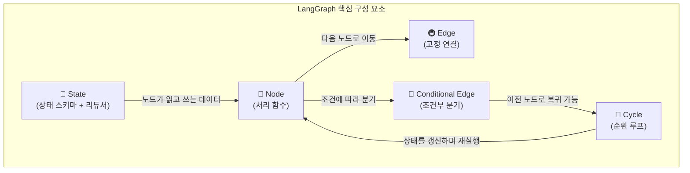
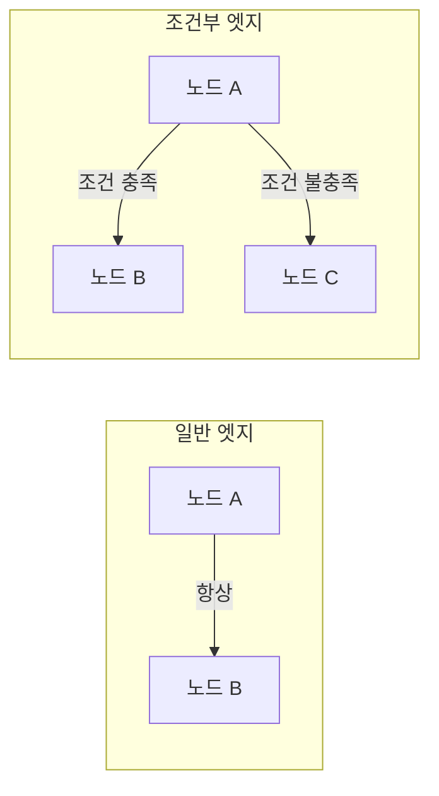
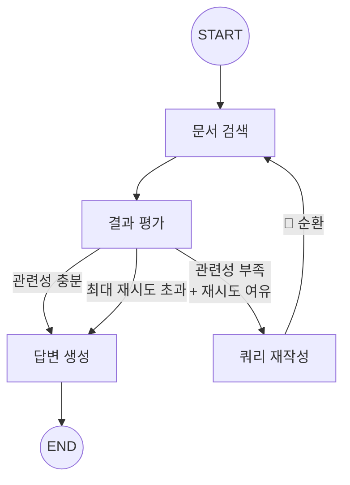
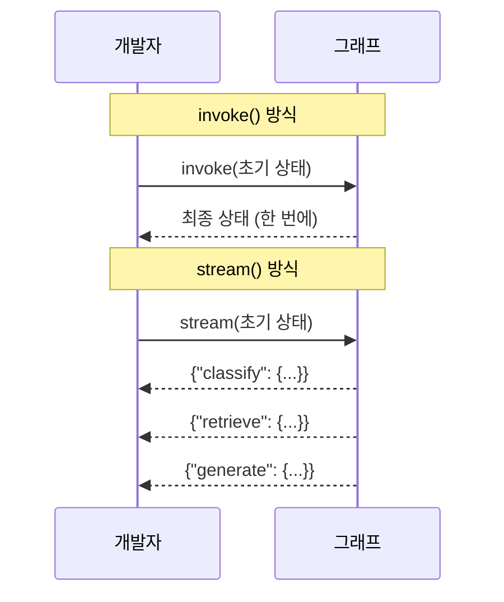
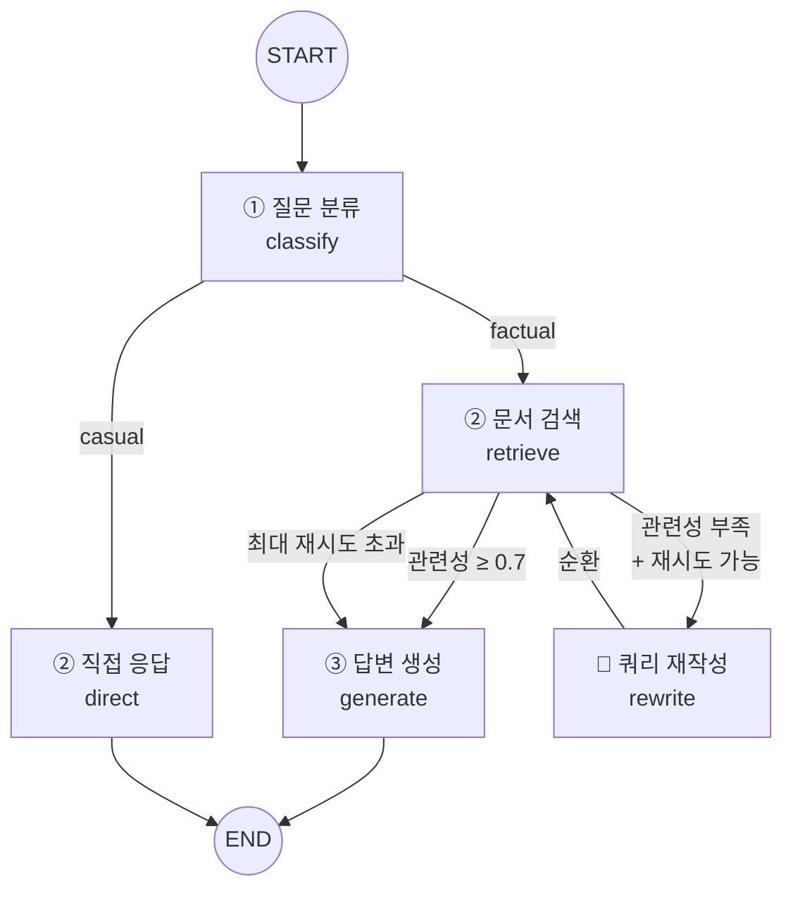

# LangGraph 기초 — 상태 그래프 프로그래밍

> LLM 에이전트의 의사결정 흐름을 그래프로 설계하고 실행하는 LangGraph의 핵심 개념을 배우고, 순환 루프와 스트리밍까지 구현합니다.

## 개요

이 섹션에서는 [16.1: 에이전틱 RAG란 — 왜 에이전트가 필요한가](ch16/session1.md)에서 살펴본 에이전틱 RAG의 의사결정 로직을 **실제 코드로 구현하기 위한 도구**, LangGraph를 배웁니다. 상태(State), 노드(Node), 엣지(Edge), 조건부 엣지(Conditional Edge)라는 네 가지 핵심 개념을 이해하고, **순환 그래프(Cycle)**로 재시도 루프를 구성하며, 스트리밍 실행으로 중간 과정을 추적하는 방법까지 다룹니다.

**선수 지식**: 에이전틱 RAG의 개념과 필요성(16.1), Python TypedDict 기본 문법, [LangChain 기초(8장)](ch08/session1.md)
**학습 목표**:
- LangGraph의 `StateGraph`를 TypedDict 스키마로 정의하고, 리듀서로 상태 누적 전략을 설계할 수 있다
- 노드(함수)와 엣지(연결)로 처리 흐름을 구성할 수 있다
- 조건부 엣지로 상태에 따른 분기 로직을 구현할 수 있다
- **순환 그래프(Cycle)**로 재검색·재시도 루프를 구현할 수 있다
- `stream()` 모드로 노드별 실행 과정을 실시간 추적할 수 있다

## 왜 알아야 할까?

앞서 16.1에서 우리는 에이전틱 RAG가 "검색할지 말지", "결과가 충분한지", "다시 검색할지"를 **동적으로 판단**한다는 것을 배웠습니다. 그런데 이런 복잡한 의사결정 흐름을 `if-else`문으로 작성하면 어떻게 될까요?

```python
# 이런 코드가 점점 복잡해진다면...
if should_retrieve(query):
    docs = retrieve(query)
    if is_relevant(docs):
        if needs_more_context(docs):
            docs += retrieve(refined_query)
        answer = generate(query, docs)
    else:
        answer = web_search(query)
else:
    answer = generate_directly(query)
```

조건이 3~4개만 되어도 코드가 스파게티처럼 엉키기 시작합니다. 게다가 "이 분기에서 저 분기로 돌아가기", "중간 상태 저장하기", "실행 흐름 시각화하기" 같은 요구사항이 추가되면 유지보수가 사실상 불가능해지죠. 더 심각한 건 **재시도 루프**입니다. "검색 결과가 부족하면 쿼리를 바꿔서 다시 검색"하는 로직을 `while`문으로 감싸면, 종료 조건 관리, 상태 추적, 최대 재시도 제한이 모두 개발자의 수작업이 됩니다.

LangGraph는 이 문제를 **그래프**라는 추상화로 해결합니다. 각 처리 단계를 **노드**, 단계 간 연결을 **엣지**, 분기 로직을 **조건부 엣지**, 재시도를 **순환 엣지**로 표현하면, 복잡한 에이전트 흐름도 깔끔하게 설계하고 관리할 수 있습니다. 이것이 바로 LangGraph가 에이전틱 RAG 구현의 표준 도구가 된 이유입니다.

## 핵심 개념

### 개념 1: LangGraph란 — 지하철 노선도로 이해하기

> 💡 **비유**: LangGraph는 **지하철 노선도 설계 도구**와 같습니다. 각 역(노드)에서 어떤 작업을 하고, 어떤 노선(엣지)을 타고 다음 역으로 이동하며, 환승역(조건부 엣지)에서는 상황에 따라 다른 노선으로 갈아탈 수 있죠. 그리고 승객이 들고 다니는 가방(상태)에는 여행 중 수집한 정보가 차곡차곡 쌓입니다. 때로는 환승을 잘못해서 이전 역으로 **되돌아가기(순환)**도 할 수 있습니다 — 이것이 바로 LangGraph가 일반 파이프라인과 다른 핵심 차이입니다.

LangGraph는 LangChain 팀이 개발한 **상태 기반 그래프 프레임워크**입니다. LLM 애플리케이션의 처리 흐름을 **방향 그래프(Directed Graph)**로 정의하고, 각 노드에서 공유 상태를 읽고 업데이트하면서 작업을 진행합니다.

> 📊 **그림 1**: LangGraph의 다섯 가지 핵심 구성 요소



먼저 LangGraph를 설치합니다.

```bash
pip install -U langgraph
```

LangGraph v1.0 이상이 설치됩니다. Python 3.10 이상이 필요하며, LangChain 코어 패키지가 함께 설치됩니다.

### 개념 2: State — 그래프의 공유 메모리와 리듀서 전략

> 💡 **비유**: State는 **릴레이 경주의 바통**과 같습니다. 주자(노드)가 바통(상태)을 받아서 자기 구간을 달린 뒤, 메모를 추가하거나 수정한 바통을 다음 주자에게 넘깁니다. 모든 주자가 같은 바통을 공유하기 때문에, 앞선 주자가 남긴 정보를 다음 주자가 활용할 수 있죠.

LangGraph에서 **State(상태)**는 그래프의 모든 노드가 공유하는 데이터 구조입니다. Python의 `TypedDict`를 사용해 스키마를 정의합니다.

```python
from typing import TypedDict

# 가장 기본적인 상태 정의
class GraphState(TypedDict):
    query: str           # 사용자 질문
    context: str         # 검색된 문서 내용
    answer: str          # 생성된 답변
```

이렇게 정의하면 그래프의 모든 노드가 `query`, `context`, `answer` 세 가지 필드에 접근할 수 있습니다. 노드가 상태를 업데이트하면, **기본적으로 해당 필드의 값이 덮어쓰기(overwrite)** 됩니다.

하지만 때로는 값을 덮어쓰는 대신 **누적**하고 싶을 때가 있습니다. 예를 들어, 검색 결과를 여러 번 추가하거나, 대화 메시지를 쌓아가는 경우죠. 이때 **리듀서(Reducer)**를 사용합니다.

```python
from typing import Annotated, TypedDict
from operator import add

class AccumulatingState(TypedDict):
    query: str                                    # 덮어쓰기 (기본 동작)
    results: Annotated[list[str], add]            # 리스트 누적 (add 리듀서)
    retry_count: int                              # 덮어쓰기
```

`Annotated[list[str], add]`는 "이 필드가 업데이트될 때, 기존 리스트에 새 리스트를 **이어붙여라(concatenate)**"라는 뜻입니다. `operator.add`가 리듀서 함수 역할을 합니다.

```run:python
from typing import Annotated
from operator import add

# 리듀서 동작 시뮬레이션
existing = ["문서1", "문서2"]
new_update = ["문서3"]

# add 리듀서: 기존 + 신규 → 합치기
result = add(existing, new_update)
print(f"기존 상태: {existing}")
print(f"노드가 반환: {new_update}")
print(f"리듀서 적용 후: {result}")
```

```output
기존 상태: ['문서1', '문서2']
노드가 반환: ['문서3']
리듀서 적용 후: ['문서1', '문서2', '문서3']
```

리듀서는 `operator.add`에만 한정되지 않습니다. 커스텀 함수를 작성해 더 정교한 병합 전략을 구현할 수 있습니다.

```python
from typing import Annotated, TypedDict

def keep_unique(existing: list[str], new: list[str]) -> list[str]:
    """중복을 제거하며 누적하는 커스텀 리듀서"""
    seen = set(existing)
    return existing + [item for item in new if item not in seen]

def latest_non_empty(existing: str, new: str) -> str:
    """빈 문자열이 아닐 때만 업데이트하는 리듀서"""
    return new if new else existing

class SmartState(TypedDict):
    documents: Annotated[list[str], keep_unique]         # 중복 없이 누적
    answer: Annotated[str, latest_non_empty]              # 빈 값 무시
    retry_count: int                                      # 일반 덮어쓰기
```

이 패턴은 순환 그래프에서 특히 중요합니다. 재검색 루프를 돌 때 같은 문서가 중복 추가되는 것을 리듀서 레벨에서 방지할 수 있거든요.

> ⚠️ **흔한 오해**: "리듀서를 쓰면 항상 값이 누적된다"고 생각하기 쉽지만, 리듀서 없이 정의된 필드는 **무조건 덮어쓰기**됩니다. 순환 그래프에서 실수로 리듀서를 빼먹으면 이전 검색 결과가 루프를 돌 때마다 통째로 사라질 수 있으니 주의하세요!

### 개념 3: Node — 실제 작업을 수행하는 함수

> 💡 **비유**: 노드는 **공장의 작업 스테이션**입니다. 컨베이어 벨트(엣지)를 타고 부품(상태)이 도착하면, 해당 스테이션의 작업자(함수)가 부품을 가공하고 다시 벨트에 올려놓습니다.

노드는 **상태를 입력받아 처리한 뒤, 업데이트할 필드를 딕셔너리로 반환하는 Python 함수**입니다.

```python
from langgraph.graph import StateGraph, START, END
from typing import TypedDict

class SimpleState(TypedDict):
    text: str
    length: int

# 노드 함수: 상태를 받고, 업데이트할 필드를 딕셔너리로 반환
def measure_length(state: SimpleState) -> dict:
    """텍스트 길이를 측정하는 노드"""
    text = state["text"]
    return {"length": len(text)}  # length 필드만 업데이트

# StateGraph 생성 및 노드 추가
builder = StateGraph(SimpleState)
builder.add_node("measure", measure_length)  # "measure"라는 이름으로 등록
```

핵심 규칙은 간단합니다:
1. 함수의 **첫 번째 인자**로 현재 상태(`state`)를 받는다
2. **딕셔너리**를 반환하며, 키는 상태 스키마의 필드명이다
3. 반환하지 않은 필드는 **변경되지 않는다**

### 개념 4: Edge와 Conditional Edge — 흐름 제어

엣지는 노드 사이의 **연결**입니다. 두 가지 종류가 있습니다.

**일반 엣지(Edge)**: A 노드 다음에 항상 B 노드로 이동

```python
builder.add_edge(START, "node_a")    # 시작 → node_a
builder.add_edge("node_a", "node_b") # node_a → node_b
builder.add_edge("node_b", END)      # node_b → 종료
```

`START`와 `END`는 LangGraph가 제공하는 특수 상수입니다. `START`는 그래프의 진입점, `END`는 종료점을 나타냅니다.

**조건부 엣지(Conditional Edge)**: 상태를 보고 다음 노드를 **동적으로 결정**

```python
def decide_next(state: SimpleState) -> str:
    """상태를 보고 다음 노드 이름을 반환"""
    if state["length"] > 100:
        return "summarize"   # 길면 요약 노드로
    return "respond"         # 짧으면 응답 노드로

builder.add_conditional_edges(
    "measure",          # 출발 노드
    decide_next,        # 라우팅 함수
    {                   # 반환값 → 노드 매핑
        "summarize": "summarize_node",
        "respond": "respond_node",
    }
)
```

> 📊 **그림 2**: 일반 엣지 vs 조건부 엣지



조건부 엣지의 라우팅 함수가 반환하는 문자열은 **매핑 딕셔너리의 키**와 일치해야 합니다. 매핑을 생략하면, 반환값 자체가 노드 이름으로 사용됩니다.

### 개념 5: Cycle — 순환 그래프로 재시도 루프 만들기

LangGraph가 단순한 DAG(방향 비순환 그래프) 도구들과 결정적으로 다른 점은 **순환(Cycle)**을 지원한다는 것입니다. 16.1에서 배운 Corrective RAG의 "검색 → 평가 → 불충분하면 쿼리 수정 후 재검색" 패턴을 떠올려보세요. 이 재시도 루프는 조건부 엣지가 **이미 실행된 노드를 다시 가리키는 것**으로 구현됩니다.

> 💡 **비유**: 음식점에서 주문한 요리가 나왔는데 덜 익었다고 생각해보세요. "다시 구워주세요"라고 돌려보내면 주방(노드)으로 다시 가고, 이번에는 잘 익어서 나오면 테이블(END)에 둡니다. 이 "되돌려보내기"가 바로 순환 엣지입니다.

> 📊 **그림 3**: 순환 그래프 — 재검색 루프 패턴



코드로 표현하면 이렇습니다:

```python
from langgraph.graph import StateGraph, START, END
from typing import Annotated, TypedDict
from operator import add

class RetryState(TypedDict):
    query: str
    documents: Annotated[list[str], add]
    relevance_score: float
    retry_count: int                      # 재시도 횟수 추적
    max_retries: int                      # 최대 재시도 제한

def evaluate_and_route(state: RetryState) -> str:
    """관련성이 부족하고 재시도 여유가 있으면 재검색"""
    if state["relevance_score"] >= 0.7:
        return "generate"
    if state["retry_count"] < state["max_retries"]:
        return "rewrite"      # rewrite → retrieve로 돌아가는 순환
    return "generate"         # 최대 재시도 초과 시 강제 진행

builder = StateGraph(RetryState)
builder.add_node("retrieve", retrieve_docs)
builder.add_node("evaluate", evaluate_docs)
builder.add_node("rewrite", rewrite_query)
builder.add_node("generate", generate_answer)

builder.add_edge(START, "retrieve")
builder.add_edge("retrieve", "evaluate")
builder.add_conditional_edges("evaluate", evaluate_and_route, {
    "generate": "generate",
    "rewrite": "rewrite",
})
builder.add_edge("rewrite", "retrieve")   # 🔄 순환 엣지!
builder.add_edge("generate", END)

graph = builder.compile()
```

여기서 `rewrite → retrieve` 엣지가 순환을 만듭니다. 이 패턴에서 주의할 점이 두 가지 있습니다:

1. **무한 루프 방지**: `retry_count`와 `max_retries`로 반드시 종료 조건을 보장하세요. LangGraph 자체에는 기본 루프 제한이 없습니다. `compile()`시 `recursion_limit` 파라미터로 전체 스텝 수를 제한할 수도 있습니다.
2. **상태 갱신 전략**: 순환마다 `documents`가 누적되어야 한다면 리듀서(`add`)를, 이전 결과를 버리고 새 결과로 교체해야 한다면 리듀서 없이 덮어쓰기를 선택하세요.

```python
# recursion_limit으로 전체 노드 실행 횟수 제한 (기본값: 25)
graph = builder.compile()
result = graph.invoke(initial_state, {"recursion_limit": 15})
```

### 개념 6: stream() — 노드별 실행 과정 추적

`invoke()`가 최종 결과만 반환하는 반면, `stream()`은 **각 노드가 실행될 때마다 중간 상태를 생성(yield)**합니다. 복잡한 그래프에서 "지금 어떤 노드가 실행 중인지", "상태가 어떻게 변화하는지"를 실시간으로 추적할 수 있어서 디버깅과 사용자 피드백에 필수적입니다.

```python
# invoke: 최종 결과만 반환
result = graph.invoke({"query": "RAG란?", ...})

# stream: 노드 실행마다 중간 결과를 yield
for event in graph.stream({"query": "RAG란?", ...}):
    # event는 {노드이름: 해당 노드의 반환값} 형태
    node_name = list(event.keys())[0]
    node_output = event[node_name]
    print(f"[{node_name}] → {node_output}")
```

`stream()`이 반환하는 각 이벤트는 `{"노드이름": 노드가_반환한_딕셔너리}` 형태입니다. 이를 활용하면 에이전트가 검색 중인지, 답변을 생성 중인지를 사용자에게 실시간으로 알려줄 수 있죠.

> 📊 **그림 4**: invoke() vs stream() 실행 방식 비교



### 개념 7: compile()과 실행 — 그래프 완성하기

그래프의 모든 노드와 엣지를 정의한 후, `compile()`을 호출하면 실행 가능한 그래프 객체가 됩니다.

```python
# 그래프 컴파일 (구조 검증 포함)
graph = builder.compile()

# 그래프 실행 — invoke()에 초기 상태 전달
result = graph.invoke({"text": "Hello, LangGraph!", "length": 0})
print(result)  # {"text": "Hello, LangGraph!", "length": 17}
```

`compile()`은 그래프 구조를 검증합니다. 연결되지 않은 노드가 있거나, `START`에서 도달할 수 없는 노드가 있으면 오류를 발생시킵니다. `invoke()`는 초기 상태를 넣고 그래프를 처음부터 끝까지 실행합니다.

`compile()` 시 유용한 옵션들:

```python
# 순환 그래프의 최대 스텝 제한
graph = builder.compile()
result = graph.invoke(state, {"recursion_limit": 10})

# 특정 노드 직전에 실행을 멈추는 breakpoint (디버깅용)
graph = builder.compile(interrupt_before=["generate"])
```

`interrupt_before`는 체크포인터(Checkpointer)와 함께 사용할 때 진가를 발휘합니다. 특정 노드 실행 전에 그래프를 일시 정지하고, 사람이 상태를 확인하거나 수정한 뒤 이어서 실행할 수 있죠. 이것이 **Human-in-the-Loop** 패턴의 기반이 되며, 다음 섹션들에서 자세히 다룹니다.

## 실습: 직접 해보기

이제 에이전틱 RAG의 핵심 패턴인 **"질문 분류 → 검색 → 결과 평가 → 불충분하면 재검색(순환) → 출력"** 흐름을 LangGraph로 구현해봅시다. 16.1에서 배운 Corrective RAG의 재검색 루프까지 포함한 완전한 예제입니다. LLM 없이 순수 Python 로직만으로 그래프의 동작 원리를 체험합니다.

```run:python
from typing import Annotated, TypedDict
from operator import add
from langgraph.graph import StateGraph, START, END


# === 1단계: 상태 스키마 정의 ===
class RAGState(TypedDict):
    """에이전틱 RAG의 상태 스키마"""
    query: str                                     # 사용자 질문 (재작성 시 갱신)
    original_query: str                            # 원본 질문 (보존용)
    query_type: str                                # 질문 유형: "factual" 또는 "casual"
    documents: Annotated[list[str], add]           # 검색된 문서 (누적)
    relevance_score: float                         # 검색 결과 관련성 점수
    retry_count: int                               # 재검색 횟수
    max_retries: int                               # 최대 재시도 제한
    answer: str                                    # 최종 답변
    steps: Annotated[list[str], add]               # 실행 경로 추적 (누적)


# === 2단계: 노드 함수 정의 ===
def classify_query(state: RAGState) -> dict:
    """질문을 분류하는 노드"""
    query = state["query"]
    factual_keywords = ["정의", "설명", "무엇", "어떻게", "왜", "차이"]
    is_factual = any(kw in query for kw in factual_keywords)
    query_type = "factual" if is_factual else "casual"
    return {
        "query_type": query_type,
        "original_query": query,
        "steps": [f"① 질문 분류: '{query}' → {query_type}"]
    }


def retrieve_documents(state: RAGState) -> dict:
    """문서를 검색하는 노드"""
    query = state["query"]
    retry = state.get("retry_count", 0)
    # 시뮬레이션: 재시도할수록 더 좋은 결과를 찾는다고 가정
    mock_db = {
        "RAG": ["RAG는 검색 증강 생성의 약자입니다.", "2020년 Facebook AI에서 발표했습니다."],
        "임베딩": ["임베딩은 텍스트를 벡터로 변환합니다.", "코사인 유사도로 비교합니다."],
        "검색 증강": ["검색 증강 생성은 외부 지식을 활용합니다."],
    }
    docs = []
    for key, values in mock_db.items():
        if key in query:
            docs.extend(values)
    # 재시도 시 관련성 점수가 점진적으로 개선
    base_score = 0.9 if docs else 0.3
    score = min(1.0, base_score + retry * 0.25)
    return {
        "documents": docs if docs else [f"(재시도 {retry+1}) 관련 문서 발견"],
        "relevance_score": score,
        "steps": [f"{'② ' if retry == 0 else '🔄 '}문서 검색 (시도 {retry+1}): {len(docs)}건, 관련성 {score:.1f}"]
    }


def evaluate_and_route(state: RAGState) -> str:
    """검색 결과 품질을 평가하고 다음 행동 결정"""
    if state["relevance_score"] >= 0.7:
        return "generate"
    if state["retry_count"] < state["max_retries"]:
        return "rewrite"
    return "generate"  # 최대 재시도 초과 → 강제 진행


def rewrite_query(state: RAGState) -> dict:
    """검색 결과가 부족할 때 쿼리를 재작성하는 노드"""
    original = state["original_query"]
    retry = state["retry_count"]
    # 시뮬레이션: 키워드 확장으로 쿼리 개선
    expansions = ["검색 증강", "retrieval augmented", "벡터 검색"]
    new_query = f"{original} {expansions[retry % len(expansions)]}"
    return {
        "query": new_query,
        "retry_count": retry + 1,
        "steps": [f"🔄 쿼리 재작성: '{new_query}'"]
    }


def generate_answer(state: RAGState) -> dict:
    """검색 결과를 기반으로 답변을 생성하는 노드"""
    docs = state["documents"]
    query = state["original_query"]
    if docs:
        answer = f"[검색 기반 답변] {' '.join(docs[:3])}"
    else:
        answer = f"[직접 답변] '{query}'에 대한 일반적인 답변입니다."
    return {
        "answer": answer,
        "steps": ["③ 답변 생성 완료"]
    }


def direct_response(state: RAGState) -> dict:
    """검색 없이 직접 응답하는 노드"""
    return {
        "answer": f"안녕하세요! '{state['query']}'에 대해 편하게 대화해요 😊",
        "steps": ["② 직접 응답 (검색 불필요)"]
    }


# === 3단계: 라우팅 함수 ===
def route_by_query_type(state: RAGState) -> str:
    """질문 유형에 따라 다음 노드 결정"""
    return "retrieve" if state["query_type"] == "factual" else "direct"


# === 4단계: 그래프 조립 ===
builder = StateGraph(RAGState)

# 노드 추가
builder.add_node("classify", classify_query)
builder.add_node("retrieve", retrieve_documents)
builder.add_node("rewrite", rewrite_query)
builder.add_node("generate", generate_answer)
builder.add_node("direct", direct_response)

# 엣지 연결
builder.add_edge(START, "classify")
builder.add_conditional_edges("classify", route_by_query_type, {
    "retrieve": "retrieve",
    "direct": "direct",
})
builder.add_conditional_edges("retrieve", evaluate_and_route, {
    "generate": "generate",
    "rewrite": "rewrite",
})
builder.add_edge("rewrite", "retrieve")   # 🔄 순환 엣지: 재검색!
builder.add_edge("generate", END)
builder.add_edge("direct", END)

# === 5단계: 컴파일 및 실행 ===
graph = builder.compile()

# 테스트 1: 사실 기반 질문 — 검색 경로 (높은 관련성 → 바로 답변)
print("=" * 55)
print("테스트 1: 사실 기반 질문 (검색 → 바로 답변)")
print("=" * 55)
result1 = graph.invoke({
    "query": "RAG의 정의는 무엇인가요?",
    "original_query": "", "query_type": "",
    "documents": [], "relevance_score": 0.0,
    "retry_count": 0, "max_retries": 2,
    "answer": "", "steps": [],
})
print(f"질문: {result1['original_query']}")
print(f"경로: {' → '.join(result1['steps'])}")
print(f"답변: {result1['answer']}")

print()

# 테스트 2: 검색 결과 부족 → 재검색 루프 발동
print("=" * 55)
print("테스트 2: 낮은 관련성 → 재검색 순환 루프")
print("=" * 55)
result2 = graph.invoke({
    "query": "LLM 파인튜닝의 차이는 무엇인가요?",
    "original_query": "", "query_type": "",
    "documents": [], "relevance_score": 0.0,
    "retry_count": 0, "max_retries": 2,
    "answer": "", "steps": [],
})
print(f"질문: {result2['original_query']}")
print(f"경로:")
for step in result2['steps']:
    print(f"  {step}")
print(f"총 재시도: {result2['retry_count']}회")
print(f"답변: {result2['answer'][:60]}...")

print()

# 테스트 3: 일상 대화 — 직접 응답 경로
print("=" * 55)
print("테스트 3: 일상 대화 (직접 응답)")
print("=" * 55)
result3 = graph.invoke({
    "query": "안녕, 오늘 날씨 좋다!",
    "original_query": "", "query_type": "",
    "documents": [], "relevance_score": 0.0,
    "retry_count": 0, "max_retries": 2,
    "answer": "", "steps": [],
})
print(f"질문: {result3['original_query']}")
print(f"경로: {' → '.join(result3['steps'])}")
print(f"답변: {result3['answer']}")
```

```output
=======================================================
테스트 1: 사실 기반 질문 (검색 → 바로 답변)
=======================================================
질문: RAG의 정의는 무엇인가요?
경로: ① 질문 분류: 'RAG의 정의는 무엇인가요?' → factual → ② 문서 검색 (시도 1): 2건, 관련성 0.9 → ③ 답변 생성 완료
답변: [검색 기반 답변] RAG는 검색 증강 생성의 약자입니다. 2020년 Facebook AI에서 발표했습니다.

=======================================================
테스트 2: 낮은 관련성 → 재검색 순환 루프
=======================================================
질문: LLM 파인튜닝의 차이는 무엇인가요?
경로:
  ① 질문 분류: 'LLM 파인튜닝의 차이는 무엇인가요?' → factual
  ② 문서 검색 (시도 1): 0건, 관련성 0.3
  🔄 쿼리 재작성: 'LLM 파인튜닝의 차이는 무엇인가요? 검색 증강'
  🔄 문서 검색 (시도 2): 1건, 관련성 0.6
  🔄 쿼리 재작성: 'LLM 파인튜닝의 차이는 무엇인가요? retrieval augmented'
  🔄 문서 검색 (시도 3): 0건, 관련성 0.8
  ③ 답변 생성 완료
총 재시도: 2회
답변: [검색 기반 답변] (재시도 1) 관련 문서 발견 검색 증강 생성은 외부...

=======================================================
테스트 3: 일상 대화 (직접 응답)
=======================================================
질문: 안녕, 오늘 날씨 좋다!
경로: ① 질문 분류: '안녕, 오늘 날씨 좋다!' → casual → ② 직접 응답 (검색 불필요)
답변: 안녕하세요! '안녕, 오늘 날씨 좋다!'에 대해 편하게 대화해요 😊
```

테스트 2의 결과를 주목해보세요. 첫 검색에서 관련성 0.3으로 실패한 뒤, 쿼리를 재작성하고 재검색하는 **순환 루프**가 2회 동작했습니다. 이것이 바로 16.1에서 배운 Corrective RAG의 핵심 패턴이 LangGraph로 구현된 모습입니다.

이 실습 그래프에는 16.1의 세 가지 에이전틱 패턴이 모두 반영되어 있습니다:
- **쿼리 라우팅** (Adaptive RAG): `classify` → `route_by_query_type`으로 질문 유형에 따른 분기
- **검색 결과 평가** (Corrective RAG): `retrieve` → `evaluate_and_route`로 품질 기반 분기
- **쿼리 재작성 + 재검색** (Self-RAG 변형): `rewrite → retrieve` 순환으로 품질 개선 루프

### stream()으로 실행 과정 추적하기

실습 그래프에 `stream()`을 적용하면, 각 노드의 실행을 실시간으로 관찰할 수 있습니다.

```python
# stream()으로 노드별 실행 결과 추적
initial_state = {
    "query": "RAG의 정의는 무엇인가요?",
    "original_query": "", "query_type": "",
    "documents": [], "relevance_score": 0.0,
    "retry_count": 0, "max_retries": 2,
    "answer": "", "steps": [],
}

for event in graph.stream(initial_state):
    node_name = list(event.keys())[0]
    output = event[node_name]
    print(f"[{node_name}] 실행 완료:")
    for key, value in output.items():
        print(f"  {key}: {value}")
    print()
```

`stream()`의 출력을 사용자 인터페이스와 연결하면, "지금 검색 중입니다...", "결과를 평가하고 있습니다..."같은 **진행 상황 피드백**을 제공할 수 있습니다. 순환 루프가 동작할 때는 같은 노드 이름(`retrieve`)이 여러 번 등장하는 것도 확인할 수 있죠.

> 📊 **그림 5**: 실습 그래프의 전체 구조 (순환 포함)



### 그래프 시각화

LangGraph는 구축한 그래프를 시각적으로 확인하는 기능을 제공합니다. Mermaid 형식의 텍스트를 출력하거나, PNG 이미지로 렌더링할 수 있습니다.

```python
# Mermaid 텍스트 출력 (터미널에서 확인)
mermaid_text = graph.get_graph().draw_mermaid()
print(mermaid_text)
# 출력된 텍스트를 https://mermaid.live 에 붙여넣으면 다이어그램을 볼 수 있습니다

# Jupyter Notebook에서 PNG 이미지로 시각화
# from IPython.display import Image, display
# display(Image(graph.get_graph().draw_mermaid_png()))
```

`draw_mermaid()`는 추가 패키지 없이 사용할 수 있고, `draw_mermaid_png()`는 기본적으로 Mermaid.ink API를 사용하여 PNG를 생성합니다.

## 더 깊이 알아보기

### LangGraph의 탄생 — 유연성에 대한 갈증

LangGraph는 LangChain의 창시자 **Harrison Chase**가 2024년 초에 공개한 프레임워크입니다. LangChain은 2022년 10월에 출시되어 LLM 애플리케이션 개발의 사실상 표준이 되었지만, 에이전트 구현에 있어서는 한계가 있었습니다.

초기 LangChain의 `AgentExecutor`는 "도구를 호출하고 → 결과를 확인하고 → 다시 호출"하는 단순한 루프만 지원했습니다. 그런데 사용자들은 훨씬 더 복잡한 흐름을 원했죠 — "검색 결과가 나쁘면 쿼리를 재작성해서 다시 검색", "세 가지 소스를 병렬로 검색한 뒤 결과를 합치기" 같은 것들요.

Harrison Chase는 이 문제를 해결하기 위해 **유한 상태 기계(Finite State Machine)**에서 영감을 받았습니다. 유한 상태 기계는 1950년대부터 컴퓨터 과학의 기초로 사용되어 온 개념으로, "상태(state)"와 "전이(transition)"로 시스템의 동작을 모델링합니다. 네트워크 프로토콜, 게임 AI, 컴파일러 등 수많은 분야에서 검증된 이 패러다임을 LLM 에이전트에 적용한 것이 바로 LangGraph입니다.

> 💡 **알고 계셨나요?**: "Graph"라는 이름은 수학의 그래프 이론에서 왔습니다. 노드(꼭짓점)와 엣지(간선)로 구성된 자료구조죠. LangGraph는 특히 **방향 비순환 그래프(DAG)**뿐 아니라 **순환(cycle)**도 지원한다는 점이 특별합니다. 이 덕분에 "검색 → 평가 → 불충분하면 다시 검색"같은 반복 루프를 자연스럽게 표현할 수 있습니다. 2025년 10월에는 LangGraph v1.0이 정식 출시되었고, 2026년 1월 기준 v1.0.7까지 업데이트되었습니다.

### 왜 TypedDict인가?

LangGraph가 상태 스키마로 `TypedDict`를 채택한 데에는 실용적인 이유가 있습니다. Python의 `TypedDict`는 일반 딕셔너리처럼 사용하면서도 **타입 검사기(mypy, pyright)**가 필드 이름과 타입을 확인할 수 있게 해줍니다. `dataclass`나 Pydantic `BaseModel`과 달리 직렬화(serialization)가 간편하고, 기존 딕셔너리 코드와의 호환성도 뛰어나죠. 물론 LangGraph는 `dataclass`나 Pydantic 모델도 상태 스키마로 지원하지만, 공식 문서와 대부분의 예제에서 `TypedDict`를 사용하는 이유가 여기 있습니다.

## 흔한 오해와 팁

> ⚠️ **흔한 오해**: "LangGraph는 LangChain 없이는 사용할 수 없다?" — 아닙니다! LangGraph는 LangChain과 밀접하게 통합되어 있지만, 핵심 그래프 기능(StateGraph, 노드, 엣지)은 **LangChain 없이도 독립적으로 사용**할 수 있습니다. 이번 실습처럼 순수 Python 함수만으로도 그래프를 구성할 수 있죠. 물론 LLM과 도구를 활용하려면 LangChain 통합이 편리합니다.

> ⚠️ **흔한 오해**: "순환 그래프는 무한 루프에 빠진다?" — 그래프 자체가 무한 루프를 일으키는 것이 아니라, **라우팅 함수의 종료 조건이 불완전할 때** 문제가 됩니다. `retry_count` 같은 카운터를 상태에 포함하고, `recursion_limit`을 설정하면 안전하게 순환을 사용할 수 있습니다.

> 💡 **알고 계셨나요?**: LangGraph의 `Annotated` + 리듀서 패턴은 **Redux(JavaScript 상태 관리 라이브러리)**의 리듀서 개념에서 영감을 받았습니다. Redux에서 `(state, action) => newState`이듯, LangGraph에서도 `reducer(existing_value, new_value) => merged_value`로 상태를 업데이트합니다.

> 🔥 **실무 팁**: 노드 함수를 작성할 때, **반환 딕셔너리에는 변경할 필드만 포함**하세요. 모든 필드를 다 반환하면 의도치 않게 다른 노드의 업데이트를 덮어쓸 수 있습니다. 또한 `steps` 같은 디버깅용 필드에 `Annotated[list[str], add]` 리듀서를 달아두면, 그래프의 실행 경로를 손쉽게 추적할 수 있어 개발과 디버깅에 매우 유용합니다.

> 🔥 **실무 팁**: `add_conditional_edges`의 매핑 딕셔너리를 생략할 수도 있습니다. 이 경우 라우팅 함수가 반환하는 문자열이 **그대로 노드 이름**으로 사용됩니다. 간단한 그래프에서는 매핑 없이 직접 노드 이름을 반환하는 것이 코드를 더 깔끔하게 만듭니다. 종료하려면 `END` 상수를 반환하면 됩니다.

## 핵심 정리

| 개념 | 설명 |
|------|------|
| **StateGraph** | 상태 스키마를 받아 그래프를 구성하는 LangGraph의 핵심 클래스 |
| **State (TypedDict)** | 그래프의 모든 노드가 공유하는 데이터 구조. 필드별로 리듀서 지정 가능 |
| **Reducer** | `Annotated[type, func]`로 지정. 상태 업데이트 시 덮어쓰기 대신 누적/병합 수행. 커스텀 함수로 정교한 전략 구현 가능 |
| **Node** | 상태를 입력받아 처리 후 업데이트할 필드를 딕셔너리로 반환하는 함수 |
| **Edge** | 노드 간 고정 연결. `add_edge(source, target)` |
| **Conditional Edge** | 라우팅 함수의 반환값에 따라 다음 노드를 동적으로 결정. `add_conditional_edges()` |
| **Cycle (순환)** | 조건부 엣지가 이전 노드를 가리켜 재시도 루프를 형성. 반드시 종료 조건 필요 |
| **START / END** | 그래프의 진입점과 종료점을 나타내는 특수 상수 |
| **compile()** | 그래프 구조를 검증하고 실행 가능한 객체로 변환. `recursion_limit`, `interrupt_before` 등 옵션 지원 |
| **invoke()** | 초기 상태를 넣고 그래프를 처음부터 끝까지 실행. 최종 상태만 반환 |
| **stream()** | 노드 실행마다 중간 결과를 yield. 디버깅과 실시간 피드백에 활용 |

## 다음 섹션 미리보기

이번 섹션에서 LangGraph의 핵심 빌딩 블록과 순환 패턴까지 익혔으니, 다음 섹션에서는 이 도구를 사용해 **실제 벡터 DB 검색 도구를 LangGraph 에이전트에 통합**하는 방법을 배웁니다. LLM이 검색 도구를 호출할지 말지를 스스로 판단하고, 검색 결과를 활용해 답변을 생성하는 **도구 호출(Tool Calling) 기반 RAG 에이전트**를 구축합니다.

## 참고 자료

- [LangGraph Graph API 공식 문서](https://docs.langchain.com/oss/python/langgraph/graph-api) - StateGraph, 노드, 엣지, 조건부 엣지의 전체 API 레퍼런스
- [LangGraph 설치 가이드](https://docs.langchain.com/oss/python/langgraph/install) - 설치 방법과 의존성 안내
- [LangGraph GitHub 리포지토리](https://github.com/langchain-ai/langgraph) - 소스 코드, 예제, 이슈 트래커
- [LangGraph Agentic RAG 공식 문서](https://docs.langchain.com/oss/python/langgraph/agentic-rag) - LangGraph를 활용한 에이전틱 RAG 구현 가이드
- [LangGraph: Build Stateful AI Agents in Python – Real Python](https://realpython.com/langgraph-python/) - StateGraph와 TypedDict를 활용한 상세 튜토리얼
- [langgraph PyPI 페이지](https://pypi.org/project/langgraph/) - 최신 버전 정보 및 변경 이력

---
### 🔗 Related Sessions
- [agentic_rag](../16-에이전틱-rag-langgraph로-동적-검색-에이전트-구축/01-에이전틱-rag란-왜-에이전트가-필요한가.md) (prerequisite)
- [corrective_rag](../16-에이전틱-rag-langgraph로-동적-검색-에이전트-구축/01-에이전틱-rag란-왜-에이전트가-필요한가.md) (prerequisite)
- [adaptive_rag](../16-에이전틱-rag-langgraph로-동적-검색-에이전트-구축/01-에이전틱-rag란-왜-에이전트가-필요한가.md) (prerequisite)
