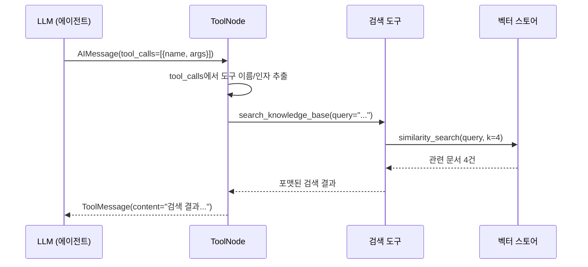
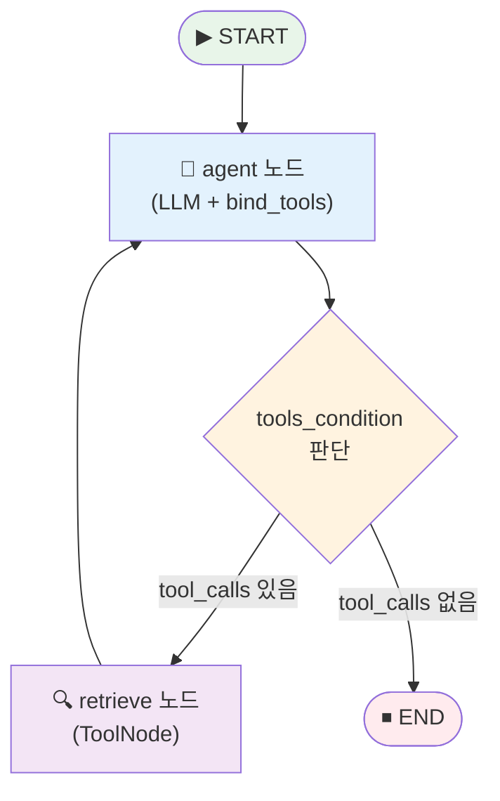
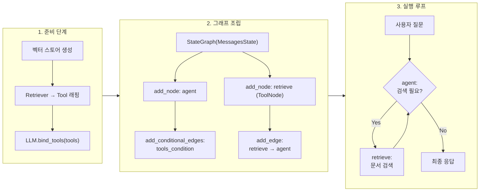
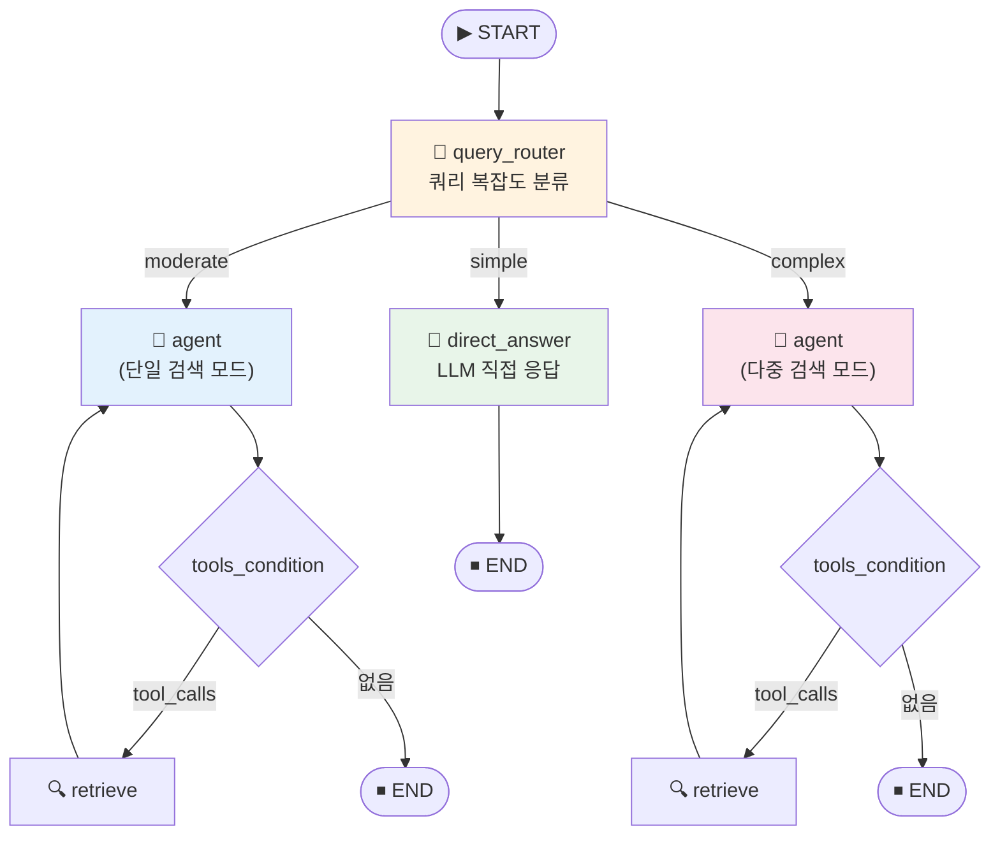

# 검색 도구를 활용하는 RAG 에이전트 구축

> 벡터 스토어를 도구(Tool)로 래핑하고, LLM이 스스로 검색 여부를 판단하는 에이전틱 RAG 에이전트를 LangGraph로 구현합니다. 나아가 Adaptive RAG의 쿼리 라우팅까지 적용해 봅니다.

## 개요

이 섹션에서는 [16.2: LangGraph 기초](ch16/session2.md)에서 배운 StateGraph, Node, Edge, Conditional Edge를 활용하여, **실제 벡터 스토어를 검색 도구로 연결한 RAG 에이전트**를 구축합니다. LLM이 사용자 질문을 분석하고, 검색이 필요하면 도구를 호출하며, 필요 없으면 바로 응답하는 **자율적 의사결정 시스템**을 만들어 봅니다. 더 나아가 [16.1: 에이전틱 RAG란 무엇인가](ch16/session1.md)에서 개념적으로 소개한 **Adaptive RAG의 쿼리 라우팅** 로직을 실제 코드로 구현하여, 질문 복잡도에 따라 No Retrieval / Single-step / Multi-step을 동적으로 분기하는 에이전트를 완성합니다.

**선수 지식**:
- [16.1: 에이전틱 RAG란 무엇인가](ch16/session1.md)에서 배운 에이전틱 RAG의 개념과 Corrective/Self/Adaptive RAG 패턴
- [16.2: LangGraph 기초](ch16/session2.md)에서 배운 LangGraph의 StateGraph, Node, Edge, Conditional Edge, MessagesState
- [6장: 벡터 스토어와 ChromaDB](06-벡터-데이터베이스-기초-chromadb로-시작하기/01-벡터-데이터베이스란-왜-필요한가.md)에서 배운 ChromaDB 벡터 스토어 기본 사용법

**학습 목표**:
- 벡터 스토어 검색기를 LangChain Tool로 래핑하는 방법을 익힌다
- `ToolNode`와 `tools_condition`의 역할과 동작 원리를 이해한다
- `bind_tools`로 LLM에 도구 호출 능력을 부여하는 패턴을 익힌다
- 검색 여부를 LLM이 자율적으로 판단하는 에이전트 그래프를 구축한다
- Adaptive RAG의 쿼리 라우팅 로직을 에이전트에 통합하여, 질문 복잡도별 경로를 설계한다

## 왜 알아야 할까?

[16.1: 에이전틱 RAG란 무엇인가](ch16/session1.md)에서 정적 RAG의 한계를 살펴봤죠? "날씨 어때?"라는 질문에도 무조건 벡터 검색을 하는 비효율. 그리고 [16.2: LangGraph 기초](ch16/session2.md)에서 LangGraph의 그래프 구조를 배웠고요. 이제 이 두 가지를 **합칠 차례**입니다.

실무에서 RAG 시스템을 운영하다 보면, 모든 질문에 검색을 수행하는 것이 얼마나 비효율적인지 체감하게 됩니다. API 호출 비용, 응답 지연, 불필요한 컨텍스트가 오히려 답변 품질을 떨어뜨리는 문제까지 — 이 모든 것을 해결하는 핵심이 바로 **"LLM이 스스로 검색 도구를 호출할지 판단하는 것"**입니다.

하지만 여기서 한 발 더 나아가 봅시다. "검색할지 말지"만 결정하는 것으로 충분할까요? "RAG가 뭐야?"처럼 한 번 검색이면 되는 질문과, "RAG와 Fine-tuning을 비교하고 각각의 장단점을 청킹 전략과 연결해 설명해줘"처럼 여러 소스를 종합해야 하는 질문은 같은 방식으로 처리할 수 없죠. [16.1](ch16/session1.md)에서 소개한 Adaptive RAG가 바로 이 문제를 해결하는 패턴입니다. 이 섹션에서 그 아이디어를 실제 코드로 구현합니다.

이 섹션을 마치면, 여러분은 LLM이 마치 숙련된 사서처럼 "이건 내가 아는 내용이니 바로 답할게요", "이건 한 번만 찾아보면 될 것 같아요", "이건 여러 자료를 종합해야 해요"라고 판단하는 에이전트를 직접 만들 수 있게 됩니다.

## 핵심 개념

### 개념 1: 벡터 스토어를 도구(Tool)로 래핑하기

> 💡 **비유**: 도서관의 사서를 떠올려 보세요. 사서에게 "양자역학 관련 책 찾아주세요"라고 말하면, 사서는 서가에서 관련 도서를 찾아 건네줍니다. 여러분이 직접 서가를 뒤지지 않아도 되죠. **Tool 래핑**은 벡터 스토어라는 서가에 **사서 인터페이스**를 붙이는 것과 같습니다. LLM(이용자)은 사서에게 요청만 하면, 나머지는 사서(Tool)가 알아서 처리합니다.

LangGraph에서 LLM이 벡터 스토어를 사용하려면, 검색기(Retriever)를 **Tool 객체**로 감싸야 합니다. LangChain은 이를 위해 두 가지 방법을 제공합니다.

**방법 1: `create_retriever_tool` 함수** — 가장 간편한 방법입니다.

```python
from langchain_core.tools.retriever import create_retriever_tool

# 벡터 스토어에서 retriever 생성
retriever = vectorstore.as_retriever(search_kwargs={"k": 4})

# retriever를 Tool로 래핑
retriever_tool = create_retriever_tool(
    retriever=retriever,
    name="search_knowledge_base",        # LLM이 인식할 도구 이름
    description="회사 내부 문서에서 정보를 검색합니다. "
                "기술 문서, 정책, 가이드라인 관련 질문에 사용하세요.",
)
```

`name`과 `description`이 왜 중요할까요? LLM은 이 정보를 보고 **언제 이 도구를 사용할지** 판단합니다. 마치 사서의 명찰에 "기술 문서 담당"이라고 적혀 있으면, 기술 질문이 들어왔을 때 그 사서에게 찾아가는 것과 같죠. `description`을 구체적이고 정확하게 작성해야 LLM이 올바른 판단을 내립니다.

**방법 2: `@tool` 데코레이터** — 검색 로직을 커스터마이징할 때 유용합니다.

```python
from langchain_core.tools import tool

@tool
def search_knowledge_base(query: str) -> str:
    """회사 내부 문서에서 정보를 검색합니다.
    기술 문서, 정책, 가이드라인 관련 질문에 사용하세요."""
    docs = retriever.invoke(query)
    return "\n\n".join(
        f"[출처: {doc.metadata.get('source', '알 수 없음')}]\n{doc.page_content}"
        for doc in docs
    )
```

`@tool` 데코레이터를 사용하면 검색 결과의 포맷을 자유롭게 조절할 수 있습니다. 메타데이터를 함께 반환하거나, 여러 검색 소스를 결합하는 등 유연한 처리가 가능하거든요.

> ⚠️ **흔한 오해**: "Tool의 `name`은 아무거나 지어도 된다"고 생각하기 쉽지만, 실제로는 LLM이 이 이름을 기반으로 도구를 선택합니다. `tool_1`, `my_func` 같은 모호한 이름은 LLM의 판단을 흐리게 만듭니다. **도구의 역할이 명확히 드러나는 이름**을 사용하세요.

### 개념 2: ToolNode — 도구 실행을 담당하는 전용 노드

> 💡 **비유**: 음식점 주방을 생각해 보세요. 홀 직원(LLM)이 주문서(tool_calls)를 작성하면, 주방(ToolNode)이 주문에 맞는 요리를 만들어 냅니다. 홀 직원은 요리하는 법을 몰라도 됩니다 — 주문서만 정확히 쓰면 주방에서 알아서 해주거든요. `ToolNode`가 바로 이 주방 역할입니다.

`ToolNode`는 LangGraph에서 제공하는 **사전 빌드된(prebuilt) 노드**로, LLM이 반환한 `tool_calls`를 실제로 실행하는 역할을 합니다.

```python
from langgraph.prebuilt import ToolNode

# Tool 목록을 전달하여 ToolNode 생성
tools = [retriever_tool]
tool_node = ToolNode(tools)
```

이것만으로 끝입니다! `ToolNode`는 내부적으로 다음 과정을 자동 처리합니다:

1. LLM 응답에서 `tool_calls` 추출
2. 호출할 도구 이름과 인자 매핑
3. 해당 도구 함수 실행
4. 실행 결과를 `ToolMessage` 형태로 상태에 추가

> 📊 **그림 1**: ToolNode의 내부 동작 흐름



`ToolNode`에 여러 도구를 등록할 수도 있습니다. 웹 검색, 데이터베이스 조회, 계산기 등 다양한 도구를 `ToolNode([tool_a, tool_b, tool_c])` 형태로 전달하면, LLM이 상황에 맞는 도구를 골라서 호출합니다.

### 개념 3: bind_tools — LLM에게 도구 호출 능력 부여하기

> 💡 **비유**: 스마트폰에 앱을 설치하는 것과 비슷합니다. 스마트폰(LLM) 자체는 다양한 기능을 수행할 잠재력이 있지만, 카메라 앱(검색 도구)을 **설치(bind)**해야 사진을 찍을 수 있죠. `bind_tools`는 LLM에게 "이런 도구들을 사용할 수 있어"라고 알려주는 것입니다.

OpenAI의 GPT-4o나 Anthropic의 Claude 같은 최신 LLM들은 **Function Calling(도구 호출)** 기능을 내장하고 있습니다. `bind_tools`를 사용하면 LLM이 일반 텍스트 응답 대신 **구조화된 도구 호출 요청**을 반환할 수 있게 됩니다.

```python
from langchain_openai import ChatOpenAI

# LLM 초기화
llm = ChatOpenAI(model="gpt-4o", temperature=0)

# 도구를 바인딩하여 도구 호출이 가능한 LLM 생성
llm_with_tools = llm.bind_tools(tools)
```

`bind_tools` 전후로 LLM의 응답이 어떻게 달라지는지 살펴볼까요?

```run:python
# bind_tools 전후 응답 비교 (개념 시연)
print("=== bind_tools 적용 전 ===")
print("사용자: 'RAG의 핵심 개념이 뭐야?'")
print("LLM 응답: 'RAG는 Retrieval-Augmented Generation의 약자로...'")
print("→ 일반 텍스트 응답만 가능\n")

print("=== bind_tools 적용 후 ===")
print("사용자: 'RAG의 핵심 개념이 뭐야?'")
print("LLM 응답: AIMessage(")
print("  content='',")
print("  tool_calls=[{")
print("    'name': 'search_knowledge_base',")
print("    'args': {'query': 'RAG 핵심 개념'},")
print("    'id': 'call_abc123'")
print("  }]")
print(")")
print("→ 도구 호출 요청을 구조화된 형태로 반환!")
```

```output
=== bind_tools 적용 전 ===
사용자: 'RAG의 핵심 개념이 뭐야?'
LLM 응답: 'RAG는 Retrieval-Augmented Generation의 약자로...'
→ 일반 텍스트 응답만 가능

=== bind_tools 적용 후 ===
사용자: 'RAG의 핵심 개념이 뭐야?'
LLM 응답: AIMessage(
  content='',
  tool_calls=[{
    'name': 'search_knowledge_base',
    'args': {'query': 'RAG 핵심 개념'},
    'id': 'call_abc123'
  }]
)
→ 도구 호출 요청을 구조화된 형태로 반환!
```

핵심은 **LLM 자체가 도구를 실행하는 게 아니라**, "이 도구를 이 인자로 호출해 달라"는 **요청만 생성**한다는 겁니다. 실제 실행은 `ToolNode`가 담당하고요. 이 분리 덕분에 LLM은 의사결정에만 집중하고, 실행은 안전한 환경에서 제어할 수 있습니다.

### 개념 4: tools_condition — 검색할지 말지 자동 라우팅

> 💡 **비유**: 병원 접수처의 간호사를 떠올려 보세요. 환자(LLM 응답)가 "검사가 필요합니다"(tool_calls 있음)라고 하면 검사실(ToolNode)로 보내고, "처방만 하면 됩니다"(tool_calls 없음)라고 하면 바로 수납(END)으로 안내하죠. `tools_condition`이 바로 이 **분기 판단**을 합니다.

`tools_condition`은 LangGraph가 제공하는 사전 빌드 함수로, LLM의 마지막 응답에 `tool_calls`가 있는지 확인하여 **"tools"** 또는 **"__end__"**를 반환합니다.

```python
from langgraph.prebuilt import ToolNode, tools_condition

# 그래프에 조건부 엣지 추가
graph.add_conditional_edges(
    "agent",              # 출발 노드
    tools_condition,      # 조건 함수
    {
        "tools": "retrieve",   # tool_calls가 있으면 → retrieve 노드로
        "__end__": "__end__",  # tool_calls가 없으면 → 종료
    },
)
```

이것이 에이전틱 RAG의 핵심 메커니즘입니다. LLM이 질문을 보고:
- "이건 검색이 필요해" → `tool_calls` 포함 응답 → `tools_condition`이 `"tools"` 반환 → 검색 실행
- "이건 내가 알아" → 텍스트 응답 → `tools_condition`이 `"__end__"` 반환 → 바로 종료

> 📊 **그림 2**: tools_condition 기반 라우팅 흐름



`retrieve` → `agent`로 다시 돌아가는 엣지에 주목하세요. 검색 결과를 받은 LLM이 **또 다른 검색이 필요하다고 판단**하면 다시 도구를 호출할 수 있습니다. 이것이 바로 [16.1: 에이전틱 RAG란 무엇인가](ch16/session1.md)에서 배운 "단일 검색의 한계"를 극복하는 **반복 검색 루프**입니다.

### 개념 5: 전체 에이전트 그래프 조립하기

지금까지 배운 네 가지 요소를 하나로 조립하면, 검색 도구를 활용하는 완전한 RAG 에이전트가 됩니다.

> 📊 **그림 3**: RAG 에이전트의 전체 그래프 구조



이 구조의 아름다운 점은 **코드가 매우 간결하다**는 것입니다. LangGraph의 `ToolNode`와 `tools_condition`이 복잡한 로직을 추상화해 주기 때문에, 핵심 코드는 20줄이 채 되지 않습니다.

```python
from langgraph.graph import StateGraph, MessagesState, START, END
from langgraph.prebuilt import ToolNode, tools_condition

# 1. 에이전트 노드 정의
def agent(state: MessagesState) -> dict:
    """LLM이 메시지를 분석하고 도구 호출 여부를 결정합니다."""
    response = llm_with_tools.invoke(state["messages"])
    return {"messages": [response]}

# 2. 그래프 조립
graph = StateGraph(MessagesState)
graph.add_node("agent", agent)                          # 에이전트 노드
graph.add_node("retrieve", ToolNode(tools))             # 검색 도구 노드

graph.add_edge(START, "agent")                          # 시작 → 에이전트
graph.add_conditional_edges("agent", tools_condition)   # 에이전트 → 조건 분기
graph.add_edge("retrieve", "agent")                     # 검색 후 → 에이전트로 복귀

# 3. 컴파일 및 실행
app = graph.compile()
```

`add_conditional_edges`에 명시적 매핑(`{"tools": "retrieve", ...}`)을 전달하지 않으면, LangGraph는 `tools_condition`의 반환값을 노드 이름으로 자동 매핑합니다. 단, `ToolNode`를 등록한 노드 이름이 `"tools"`가 아닌 경우(여기서는 `"retrieve"`)에는 매핑을 명시해야 합니다:

```python
graph.add_conditional_edges(
    "agent",
    tools_condition,
    {"tools": "retrieve", "__end__": END},  # "tools" → "retrieve" 노드로 매핑
)
```

### 개념 6: Adaptive RAG — 쿼리 복잡도에 따른 동적 라우팅

> 💡 **비유**: 같은 병원에 가더라도, 가벼운 감기(simple)는 접수 후 바로 처방전을 받고, 원인 모를 두통(moderate)은 검사 한 가지를 받은 뒤 진단을 받고, 복합 증상(complex)은 여러 검사를 순서대로 받으며 종합 진단을 받죠? Adaptive RAG도 마찬가지입니다. 질문의 **복잡도를 먼저 분류**하고, 그에 맞는 검색 전략을 적용합니다.

[16.1: 에이전틱 RAG란 무엇인가](ch16/session1.md)에서 Adaptive RAG를 개념적으로 소개했습니다. 핵심 아이디어는 **모든 질문을 같은 파이프라인으로 처리하지 않는다**는 것인데요. 쿼리 복잡도를 세 단계로 분류합니다:

| 복잡도 | 예시 질문 | 전략 |
|--------|-----------|------|
| **Simple** | "안녕하세요", "고마워" | 검색 없이 LLM 직접 응답 (No Retrieval) |
| **Moderate** | "RAG가 뭐야?" | 단일 검색 후 응답 (Single-step Retrieval) |
| **Complex** | "RAG와 Fine-tuning의 장단점을 청킹 전략과 연결해 설명해줘" | 다중 검색 + 종합 (Multi-step Retrieval) |

앞서 구축한 기본 에이전트에서도 `tools_condition`이 "검색 O/X"를 판단하긴 합니다. 하지만 그 판단은 전적으로 LLM의 암묵적 결정에 맡겨져 있어서, **검색 깊이**를 제어하기 어렵습니다. Adaptive RAG는 여기에 **명시적인 쿼리 분류 단계**를 추가합니다.

이를 구현하는 방법은 크게 두 가지입니다:

**방법 1: 시스템 프롬프트 강화** — 가장 간단하면서도 효과적인 접근입니다. LLM에게 쿼리 복잡도를 인식하고 행동을 조절하라고 명시적으로 지시하는 것이죠.

```python
ADAPTIVE_SYSTEM_PROMPT = """당신은 AI/ML 기술 문서 전문 어시스턴트입니다.

## 쿼리 라우팅 규칙
사용자 질문의 복잡도를 판단하고, 아래 전략에 따라 행동하세요:

1. **Simple (검색 불필요)**: 일반 인사, 감사, 기술과 무관한 질문
   → 검색 도구를 사용하지 말고 직접 답변하세요.

2. **Moderate (단일 검색)**: 하나의 개념이나 사실에 대한 질문
   → 검색 도구를 1회 호출하여 관련 문서를 찾은 뒤 답변하세요.

3. **Complex (다중 검색)**: 여러 개념의 비교, 관계 분석, 종합적 설명이 필요한 질문
   → 검색 도구를 여러 번 호출하여 각 개념에 대한 문서를 수집한 뒤,
     종합적으로 답변하세요. 각 검색마다 서로 다른 키워드를 사용하세요.
"""
```

**방법 2: 전용 라우터 노드** — 보다 구조적인 접근입니다. LLM이 먼저 쿼리를 분류하고, 그 결과에 따라 **그래프 경로 자체**가 달라지도록 설계합니다.

```python
from pydantic import BaseModel, Field
from typing import Literal

# 쿼리 복잡도 분류를 위한 구조화 출력
class QueryComplexity(BaseModel):
    complexity: Literal["simple", "moderate", "complex"] = Field(
        description="쿼리의 복잡도 수준"
    )
    reasoning: str = Field(
        description="복잡도를 판단한 근거를 한 문장으로 설명"
    )

# 라우터 LLM: 구조화 출력으로 복잡도 분류
router_llm = llm.with_structured_output(QueryComplexity)
```

> 📊 **그림 4**: Adaptive RAG 쿼리 라우팅 흐름



이 다이어그램에서 핵심은 `query_router` 노드가 **그래프 진입점에서 경로를 분기**한다는 것입니다. simple 질문은 검색 노드를 아예 거치지 않으므로 응답 속도가 빨라지고, complex 질문은 다중 검색을 통해 풍부한 컨텍스트를 수집합니다.

> 🔥 **실무 팁**: 방법 1(프롬프트 강화)과 방법 2(라우터 노드)를 선택할 때, **트래픽 규모**를 고려하세요. 일일 수백 건 수준이면 프롬프트 강화만으로 충분합니다. 수만 건 이상이라면 라우터 노드로 분리하여 simple 질문의 LLM 호출을 최소화하는 것이 비용 면에서 유리합니다.

## 실습: 직접 해보기

이제 모든 개념을 결합하여 **완전히 동작하는 검색 도구 기반 RAG 에이전트**를 구축해 봅시다. 기본 에이전트를 먼저 만들고, 이어서 Adaptive RAG 쿼리 라우팅을 추가하는 순서로 진행합니다.

### 환경 준비

```python
# 필요한 패키지 설치
# pip install langchain-core langchain-openai langchain-chroma langgraph chromadb
```

### 전체 코드 — 기본 에이전트

```python
import os
from langchain_openai import ChatOpenAI, OpenAIEmbeddings
from langchain_chroma import Chroma
from langchain_core.documents import Document
from langchain_core.tools.retriever import create_retriever_tool
from langgraph.graph import StateGraph, MessagesState, START, END
from langgraph.prebuilt import ToolNode, tools_condition

# ─────────────────────────────────────────────
# 1단계: 샘플 문서로 벡터 스토어 생성
# ─────────────────────────────────────────────
documents = [
    Document(
        page_content="RAG(Retrieval-Augmented Generation)는 외부 지식 소스에서 "
                     "관련 정보를 검색하여 LLM의 응답을 보강하는 기법입니다. "
                     "2020년 Meta AI의 Patrick Lewis 팀이 처음 제안했습니다.",
        metadata={"source": "rag_overview.md", "topic": "RAG"},
    ),
    Document(
        page_content="벡터 데이터베이스는 고차원 벡터를 효율적으로 저장하고 "
                     "유사도 기반 검색을 수행합니다. ChromaDB, FAISS, Pinecone, "
                     "Qdrant 등이 대표적입니다.",
        metadata={"source": "vector_db.md", "topic": "벡터DB"},
    ),
    Document(
        page_content="임베딩 모델은 텍스트를 고차원 벡터로 변환합니다. "
                     "OpenAI의 text-embedding-3-small, Sentence Transformers의 "
                     "all-MiniLM-L6-v2 등이 널리 사용됩니다.",
        metadata={"source": "embeddings.md", "topic": "임베딩"},
    ),
    Document(
        page_content="청킹(Chunking)은 긴 문서를 작은 단위로 분할하는 과정입니다. "
                     "고정 크기 청킹, 시멘틱 청킹, 재귀적 문자 분할 등의 "
                     "전략이 있습니다. 청크 크기는 보통 500~1000 토큰을 권장합니다.",
        metadata={"source": "chunking.md", "topic": "청킹"},
    ),
    Document(
        page_content="LangChain의 LCEL(LangChain Expression Language)은 "
                     "파이프 연산자(|)로 컴포넌트를 연결하는 선언적 문법입니다. "
                     "프롬프트 | LLM | 출력 파서 형태로 체인을 구성합니다.",
        metadata={"source": "lcel.md", "topic": "LangChain"},
    ),
]

# 벡터 스토어 생성 (인메모리 ChromaDB)
vectorstore = Chroma.from_documents(
    documents=documents,
    embedding=OpenAIEmbeddings(model="text-embedding-3-small"),
    collection_name="rag_knowledge",
)

# ─────────────────────────────────────────────
# 2단계: Retriever를 Tool로 래핑
# ─────────────────────────────────────────────
retriever = vectorstore.as_retriever(search_kwargs={"k": 3})

retriever_tool = create_retriever_tool(
    retriever=retriever,
    name="search_rag_docs",
    description="RAG, 벡터 데이터베이스, 임베딩, 청킹, LangChain 등 "
                "AI/ML 기술 문서를 검색합니다. 기술적 질문에 사용하세요.",
)

tools = [retriever_tool]

# ─────────────────────────────────────────────
# 3단계: LLM에 도구 바인딩
# ─────────────────────────────────────────────
llm = ChatOpenAI(model="gpt-4o-mini", temperature=0)
llm_with_tools = llm.bind_tools(tools)

# ─────────────────────────────────────────────
# 4단계: 에이전트 노드 정의
# ─────────────────────────────────────────────
SYSTEM_PROMPT = (
    "당신은 AI/ML 기술 문서 전문 어시스턴트입니다. "
    "사용자의 질문이 RAG, 벡터 DB, 임베딩, 청킹, LangChain과 관련된 "
    "기술적 질문이면 반드시 검색 도구를 사용하여 정확한 정보를 제공하세요. "
    "일반적인 인사나 기술과 무관한 질문에는 도구 없이 직접 답변하세요."
)

def agent_node(state: MessagesState) -> dict:
    """에이전트 노드: LLM이 메시지를 분석하고 응답 또는 도구 호출을 결정합니다."""
    from langchain_core.messages import SystemMessage

    # 시스템 프롬프트 + 기존 메시지를 함께 전달
    messages = [SystemMessage(content=SYSTEM_PROMPT)] + state["messages"]
    response = llm_with_tools.invoke(messages)
    return {"messages": [response]}

# ─────────────────────────────────────────────
# 5단계: 그래프 조립 및 컴파일
# ─────────────────────────────────────────────
graph = StateGraph(MessagesState)

# 노드 등록
graph.add_node("agent", agent_node)
graph.add_node("retrieve", ToolNode(tools))

# 엣지 연결
graph.add_edge(START, "agent")
graph.add_conditional_edges(
    "agent",
    tools_condition,
    {"tools": "retrieve", "__end__": END},
)
graph.add_edge("retrieve", "agent")

# 컴파일
app = graph.compile()
```

### 에이전트 실행 및 흐름 추적

에이전트를 실행하고 **각 단계의 흐름을 추적**해 봅시다. `stream` 메서드를 사용하면 노드별 실행 과정을 실시간으로 관찰할 수 있습니다.

```python
from langchain_core.messages import HumanMessage

def run_agent_with_trace(query: str) -> None:
    """에이전트를 실행하고 각 노드의 처리 과정을 출력합니다."""
    print(f"{'='*60}")
    print(f"📝 사용자 질문: {query}")
    print(f"{'='*60}")

    input_message = {"messages": [HumanMessage(content=query)]}

    # stream으로 각 노드의 실행 과정을 추적
    for step in app.stream(input_message, stream_mode="updates"):
        for node_name, output in step.items():
            print(f"\n🔄 [{node_name}] 노드 실행됨")

            if node_name == "agent":
                msg = output["messages"][-1]
                if hasattr(msg, "tool_calls") and msg.tool_calls:
                    for tc in msg.tool_calls:
                        print(f"   🔧 도구 호출: {tc['name']}")
                        print(f"   📋 쿼리: {tc['args']}")
                else:
                    print(f"   💬 직접 응답: {msg.content[:100]}...")

            elif node_name == "retrieve":
                msg = output["messages"][-1]
                print(f"   📚 검색 결과 반환 ({len(msg.content)}자)")

    print(f"\n{'='*60}\n")


# ─────────────────────────────────────────────
# 테스트 1: 기술적 질문 → 검색 도구 호출
# ─────────────────────────────────────────────
run_agent_with_trace("RAG가 뭔가요? 누가 처음 만들었나요?")

# ─────────────────────────────────────────────
# 테스트 2: 일반 질문 → 검색 없이 직접 응답
# ─────────────────────────────────────────────
run_agent_with_trace("안녕하세요! 오늘 날씨 어때요?")
```

실행하면 다음과 같은 흐름을 확인할 수 있습니다:

```run:python
# 에이전트 실행 흐름 시뮬레이션
print("=" * 60)
print("📝 사용자 질문: RAG가 뭔가요? 누가 처음 만들었나요?")
print("=" * 60)
print()
print("🔄 [agent] 노드 실행됨")
print("   🔧 도구 호출: search_rag_docs")
print("   📋 쿼리: {'query': 'RAG 개념 역사 창시자'}")
print()
print("🔄 [retrieve] 노드 실행됨")
print("   📚 검색 결과 반환 (312자)")
print()
print("🔄 [agent] 노드 실행됨")
print("   💬 직접 응답: RAG(Retrieval-Augmented Generation)는 외부 지식을 검색하여 LLM 응답을 보강하는 기법입니다...")
print()
print("=" * 60)
print()
print("=" * 60)
print("📝 사용자 질문: 안녕하세요! 오늘 날씨 어때요?")
print("=" * 60)
print()
print("🔄 [agent] 노드 실행됨")
print("   💬 직접 응답: 안녕하세요! 저는 AI/ML 기술 문서 어시스턴트입니다. 날씨 정보는 제공하기 어렵지만...")
print()
print("=" * 60)
```

```output
============================================================
📝 사용자 질문: RAG가 뭔가요? 누가 처음 만들었나요?
============================================================

🔄 [agent] 노드 실행됨
   🔧 도구 호출: search_rag_docs
   📋 쿼리: {'query': 'RAG 개념 역사 창시자'}

🔄 [retrieve] 노드 실행됨
   📚 검색 결과 반환 (312자)

🔄 [agent] 노드 실행됨
   💬 직접 응답: RAG(Retrieval-Augmented Generation)는 외부 지식을 검색하여 LLM 응답을 보강하는 기법입니다...

============================================================

============================================================
📝 사용자 질문: 안녕하세요! 오늘 날씨 어때요?
============================================================

🔄 [agent] 노드 실행됨
   💬 직접 응답: 안녕하세요! 저는 AI/ML 기술 문서 어시스턴트입니다. 날씨 정보는 제공하기 어렵지만...

============================================================
```

첫 번째 질문에서는 `agent → retrieve → agent` 순서로 **두 번의 에이전트 호출**이 발생했습니다. 두 번째 질문에서는 검색 없이 `agent` 한 번만 실행됐고요. 이것이 에이전틱 RAG의 핵심 — **필요할 때만 검색**하는 지능적 라우팅입니다.

### Adaptive RAG 라우팅 추가하기

기본 에이전트가 잘 동작하는 것을 확인했으니, 이제 **쿼리 복잡도에 따른 Adaptive 라우팅**을 추가해 봅시다. 앞서 소개한 두 가지 방법 중, 여기서는 **방법 2(라우터 노드)**를 구현하여 그래프 수준에서 경로를 분기합니다.

```python
from pydantic import BaseModel, Field
from typing import Literal, TypedDict, Annotated
from langchain_core.messages import SystemMessage, HumanMessage, AIMessage
from langgraph.graph import StateGraph, MessagesState, START, END
from langgraph.prebuilt import ToolNode, tools_condition

# ─────────────────────────────────────────────
# 1단계: 쿼리 복잡도 분류 스키마 정의
# ─────────────────────────────────────────────
class QueryComplexity(BaseModel):
    """사용자 쿼리의 복잡도를 분류합니다."""
    complexity: Literal["simple", "moderate", "complex"] = Field(
        description="simple: 검색 불필요(인사, 잡담), "
                    "moderate: 단일 개념 질문, "
                    "complex: 여러 개념 비교/종합 필요"
    )
    reasoning: str = Field(
        description="복잡도 판단 근거를 한 문장으로 설명"
    )

# 라우터용 LLM (구조화 출력)
router_llm = ChatOpenAI(model="gpt-4o-mini", temperature=0)
structured_router = router_llm.with_structured_output(QueryComplexity)

ROUTER_PROMPT = (
    "사용자의 질문을 분석하여 복잡도를 분류하세요.\n"
    "- simple: 일반 인사, 감사, 기술과 무관한 질문\n"
    "- moderate: 하나의 개념, 정의, 사실 확인 질문\n"
    "- complex: 여러 개념 비교, 관계 분석, 종합적 설명 요구"
)

# ─────────────────────────────────────────────
# 2단계: 노드 정의
# ─────────────────────────────────────────────

def query_router(state: MessagesState) -> dict:
    """쿼리 복잡도를 분류하여 상태에 저장합니다."""
    last_message = state["messages"][-1]
    result = structured_router.invoke([
        SystemMessage(content=ROUTER_PROMPT),
        last_message,
    ])
    # 분류 결과를 AIMessage로 상태에 기록 (디버깅용)
    route_msg = AIMessage(
        content=f"[라우팅] 복잡도: {result.complexity} | 근거: {result.reasoning}"
    )
    return {"messages": [route_msg], "complexity": result.complexity}

def direct_answer(state: MessagesState) -> dict:
    """검색 없이 LLM이 직접 응답합니다 (simple 쿼리용)."""
    # 라우팅 메시지를 제외한 원래 사용자 메시지만 전달
    user_messages = [m for m in state["messages"] if isinstance(m, HumanMessage)]
    response = llm.invoke([
        SystemMessage(content="친절하게 답변하세요. 기술 검색 도구는 사용하지 않습니다."),
        user_messages[-1],
    ])
    return {"messages": [response]}

# 단일 검색 에이전트 (moderate)
MODERATE_PROMPT = (
    "AI/ML 기술 문서 어시스턴트입니다. "
    "검색 도구를 1회 호출하여 관련 문서를 찾고 답변하세요."
)

def agent_moderate(state: MessagesState) -> dict:
    """단일 검색 모드 에이전트."""
    messages = [SystemMessage(content=MODERATE_PROMPT)] + [
        m for m in state["messages"] if not m.content.startswith("[라우팅]")
    ]
    response = llm_with_tools.invoke(messages)
    return {"messages": [response]}

# 다중 검색 에이전트 (complex)
COMPLEX_PROMPT = (
    "AI/ML 기술 문서 어시스턴트입니다. "
    "이 질문은 복잡하므로, 검색 도구를 여러 번 호출하여 "
    "각 하위 주제에 대한 문서를 수집한 뒤 종합적으로 답변하세요. "
    "각 검색마다 서로 다른 키워드를 사용하세요."
)

def agent_complex(state: MessagesState) -> dict:
    """다중 검색 모드 에이전트."""
    messages = [SystemMessage(content=COMPLEX_PROMPT)] + [
        m for m in state["messages"] if not m.content.startswith("[라우팅]")
    ]
    response = llm_with_tools.invoke(messages)
    return {"messages": [response]}

# ─────────────────────────────────────────────
# 3단계: 라우팅 조건 함수
# ─────────────────────────────────────────────

# 확장된 상태: complexity 필드 추가
class AdaptiveState(MessagesState):
    complexity: str

def route_by_complexity(state: AdaptiveState) -> str:
    """쿼리 복잡도에 따라 다음 노드를 결정합니다."""
    complexity = state.get("complexity", "moderate")
    if complexity == "simple":
        return "direct_answer"
    elif complexity == "complex":
        return "agent_complex"
    else:
        return "agent_moderate"

# ─────────────────────────────────────────────
# 4단계: Adaptive RAG 그래프 조립
# ─────────────────────────────────────────────
adaptive_graph = StateGraph(AdaptiveState)

# 노드 등록
adaptive_graph.add_node("query_router", query_router)
adaptive_graph.add_node("direct_answer", direct_answer)
adaptive_graph.add_node("agent_moderate", agent_moderate)
adaptive_graph.add_node("agent_complex", agent_complex)
adaptive_graph.add_node("retrieve", ToolNode(tools))

# 시작 → 라우터
adaptive_graph.add_edge(START, "query_router")

# 라우터 → 복잡도별 분기
adaptive_graph.add_conditional_edges(
    "query_router",
    route_by_complexity,
    {
        "direct_answer": "direct_answer",
        "agent_moderate": "agent_moderate",
        "agent_complex": "agent_complex",
    },
)

# 직접 응답 → 종료
adaptive_graph.add_edge("direct_answer", END)

# moderate 에이전트 → 도구 호출 여부에 따라 분기
adaptive_graph.add_conditional_edges(
    "agent_moderate",
    tools_condition,
    {"tools": "retrieve", "__end__": END},
)

# complex 에이전트 → 도구 호출 여부에 따라 분기
adaptive_graph.add_conditional_edges(
    "agent_complex",
    tools_condition,
    {"tools": "retrieve", "__end__": END},
)

# 검색 결과 → 호출한 에이전트로 복귀
# (어떤 에이전트가 호출했는지에 따라 복귀 노드 결정)
def route_after_retrieve(state: AdaptiveState) -> str:
    """검색 후 원래 에이전트 노드로 복귀합니다."""
    complexity = state.get("complexity", "moderate")
    return "agent_complex" if complexity == "complex" else "agent_moderate"

adaptive_graph.add_conditional_edges(
    "retrieve",
    route_after_retrieve,
    {
        "agent_moderate": "agent_moderate",
        "agent_complex": "agent_complex",
    },
)

# 컴파일
adaptive_app = adaptive_graph.compile()
```

### Adaptive RAG 에이전트 실행 테스트

세 가지 복잡도의 질문으로 Adaptive 라우팅이 제대로 동작하는지 확인해 봅시다.

```python
def run_adaptive_agent(query: str) -> None:
    """Adaptive RAG 에이전트를 실행하고 라우팅 경로를 추적합니다."""
    print(f"{'='*60}")
    print(f"📝 질문: {query}")
    print(f"{'='*60}")

    input_message = {"messages": [HumanMessage(content=query)]}

    for step in adaptive_app.stream(input_message, stream_mode="updates"):
        for node_name, output in step.items():
            if node_name == "query_router":
                # 라우팅 결과 표시
                route_msg = output["messages"][-1].content
                print(f"🔀 {route_msg}")
            elif node_name == "direct_answer":
                print(f"💬 직접 응답: {output['messages'][-1].content[:80]}...")
            elif node_name in ("agent_moderate", "agent_complex"):
                msg = output["messages"][-1]
                if hasattr(msg, "tool_calls") and msg.tool_calls:
                    for tc in msg.tool_calls:
                        print(f"🔧 검색 호출: {tc['args'].get('query', '')}")
                else:
                    print(f"✅ 최종 응답: {msg.content[:80]}...")
            elif node_name == "retrieve":
                print(f"📚 검색 결과 반환")

    print()


# Simple: 검색 불필요
run_adaptive_agent("안녕하세요!")

# Moderate: 단일 검색
run_adaptive_agent("RAG가 뭔가요?")

# Complex: 다중 검색
run_adaptive_agent("RAG와 임베딩, 청킹의 관계를 설명하고 각각의 역할을 비교해주세요")
```

실행 결과를 시뮬레이션하면 이렇습니다:

```run:python
# Adaptive RAG 에이전트 실행 시뮬레이션
print("=" * 60)
print("📝 질문: 안녕하세요!")
print("=" * 60)
print("🔀 [라우팅] 복잡도: simple | 근거: 일반 인사로 기술 검색이 불필요함")
print("💬 직접 응답: 안녕하세요! 무엇을 도와드릴까요?")
print()

print("=" * 60)
print("📝 질문: RAG가 뭔가요?")
print("=" * 60)
print("🔀 [라우팅] 복잡도: moderate | 근거: 단일 개념(RAG)에 대한 정의 질문")
print("🔧 검색 호출: RAG 개념 정의")
print("📚 검색 결과 반환")
print("✅ 최종 응답: RAG(Retrieval-Augmented Generation)는 외부 지식을 검색하여 LLM의 응답을 보강하는...")
print()

print("=" * 60)
print("📝 질문: RAG와 임베딩, 청킹의 관계를 설명하고 각각의 역할을 비교해주세요")
print("=" * 60)
print("🔀 [라우팅] 복잡도: complex | 근거: RAG, 임베딩, 청킹 3개 개념의 비교/종합 필요")
print("🔧 검색 호출: RAG 개념 역할")
print("📚 검색 결과 반환")
print("🔧 검색 호출: 임베딩 모델 역할")
print("📚 검색 결과 반환")
print("🔧 검색 호출: 청킹 전략 역할")
print("📚 검색 결과 반환")
print("✅ 최종 응답: RAG 파이프라인에서 각 구성 요소의 역할을 정리하면...")
```

```output
============================================================
📝 질문: 안녕하세요!
============================================================
🔀 [라우팅] 복잡도: simple | 근거: 일반 인사로 기술 검색이 불필요함
💬 직접 응답: 안녕하세요! 무엇을 도와드릴까요?

============================================================
📝 질문: RAG가 뭔가요?
============================================================
🔀 [라우팅] 복잡도: moderate | 근거: 단일 개념(RAG)에 대한 정의 질문
🔧 검색 호출: RAG 개념 정의
📚 검색 결과 반환
✅ 최종 응답: RAG(Retrieval-Augmented Generation)는 외부 지식을 검색하여 LLM의 응답을 보강하는...

============================================================
📝 질문: RAG와 임베딩, 청킹의 관계를 설명하고 각각의 역할을 비교해주세요
============================================================
🔀 [라우팅] 복잡도: complex | 근거: RAG, 임베딩, 청킹 3개 개념의 비교/종합 필요
🔧 검색 호출: RAG 개념 역할
📚 검색 결과 반환
🔧 검색 호출: 임베딩 모델 역할
📚 검색 결과 반환
🔧 검색 호출: 청킹 전략 역할
📚 검색 결과 반환
✅ 최종 응답: RAG 파이프라인에서 각 구성 요소의 역할을 정리하면...
```

결과를 보면 **같은 에이전트인데 질문에 따라 완전히 다른 경로**를 탄다는 것을 알 수 있습니다. simple은 검색 노드를 아예 거치지 않고, moderate는 1회, complex는 3회 검색을 수행했죠. 이것이 [16.1](ch16/session1.md)에서 소개한 Adaptive RAG의 핵심 — **"쿼리에 맞는 최적의 검색 전략을 동적으로 선택"** — 을 실제 코드로 구현한 결과입니다.

### 그래프 시각화

LangGraph는 컴파일된 그래프를 시각적으로 확인하는 기능도 제공합니다.

```python
# 그래프 구조를 Mermaid 형식으로 출력
print(adaptive_app.get_graph().draw_mermaid())

# Jupyter 환경에서 이미지로 표시
# from IPython.display import Image, display
# display(Image(adaptive_app.get_graph().draw_mermaid_png()))
```

## 더 깊이 알아보기

### Tool Calling의 탄생 — ChatGPT에서 Function Calling까지

LLM이 도구를 호출한다는 아이디어는 어디서 왔을까요? 2023년 6월, OpenAI가 GPT-3.5와 GPT-4에 **Function Calling** 기능을 도입하면서 이 패러다임이 본격적으로 시작됐습니다. 그 전까지 LLM이 외부 시스템과 상호작용하려면, 출력 텍스트를 정규식으로 파싱하는 불안정한 방법에 의존해야 했거든요.

Function Calling의 핵심 아이디어는 놀랍도록 단순합니다: "LLM에게 사용 가능한 함수의 **스키마(이름, 설명, 파라미터)**를 알려주면, LLM이 적절한 시점에 적절한 인자로 함수를 호출하는 JSON을 생성한다." 이 단순한 아이디어가 Copilot, 에이전트, 에이전틱 RAG 등 현재 AI 생태계의 핵심 인프라가 됐습니다.

LangGraph의 `ToolNode`와 `tools_condition`은 이 Function Calling 패턴을 **그래프 기반 워크플로**로 일반화한 것입니다. 한 가지 흥미로운 점은, LangGraph 팀이 처음에는 Agent 구현을 단순한 루프로 만들었다가, 복잡한 조건 분기와 상태 관리의 필요성을 느끼고 그래프 추상화를 도입했다는 것입니다. 이로 인해 "검색 → 평가 → 재검색"같은 복잡한 에이전틱 패턴을 선언적으로 표현할 수 있게 됐죠.

### ReAct 패턴과 에이전틱 RAG의 관계

에이전틱 RAG의 `agent → tool → agent` 루프는 사실 2022년 Yao et al.이 발표한 **ReAct(Reasoning + Acting)** 패턴의 직접적인 구현체입니다. ReAct는 "LLM이 사고(Thought)하고, 행동(Action)하고, 관찰(Observation)하는 것을 반복하면 더 나은 결과를 낼 수 있다"는 아이디어인데요. LangGraph에서 이를 구조적으로 표현하면:

- **Thought**: `agent` 노드에서 LLM이 질문을 분석
- **Action**: `tool_calls`를 통해 도구 호출 결정
- **Observation**: `ToolNode`가 실행한 결과를 `ToolMessage`로 반환

이 루프가 `tools_condition`에 의해 자동으로 반복되면서, LLM은 마치 인간 연구자처럼 "검색 → 읽기 → 더 필요하면 추가 검색"하는 행동을 보이게 됩니다.

### Adaptive RAG의 학술적 배경

Adaptive RAG라는 이름은 2024년 Jeong et al.이 발표한 논문 *"Adaptive-RAG: Learning to Adapt Retrieval-Augmented Large Language Models through Question Complexity"*에서 공식화됐습니다. 이 논문의 핵심 기여는 **쿼리 복잡도 분류기(classifier)를 별도로 학습**시켜, LLM 호출 전에 라우팅 경로를 결정한다는 아이디어입니다. 우리가 위 실습에서 `with_structured_output`으로 LLM에게 분류를 맡긴 것과 달리, 원래 논문은 가벼운 분류 모델(예: T5-small)을 사용하여 라우팅 비용을 최소화합니다.

흥미롭게도, 논문에서는 단순한 3단계 분류(No Retrieval / Single-step / Multi-step)만으로도 기존 고정 RAG 대비 **정확도와 효율성 모두에서 유의미한 개선**을 달성했습니다. 때로는 거창한 아키텍처보다 "언제 검색하고, 언제 안 할지"를 잘 판단하는 것이 더 중요하다는 교훈이죠.

## 흔한 오해와 팁

> ⚠️ **흔한 오해**: "LLM이 도구를 직접 실행한다"고 생각하기 쉽지만, 실제로 LLM은 **도구 호출 요청(JSON)**만 생성합니다. `ToolNode`가 이를 받아서 실제 함수를 실행하죠. 이 분리가 중요한 이유는 보안입니다 — LLM이 임의의 코드를 실행하는 것이 아니라, 사전에 등록된 도구만 호출할 수 있으니까요.

> 💡 **알고 계셨나요?**: `tools_condition`의 내부 구현은 놀라울 정도로 간단합니다. `state["messages"][-1].tool_calls`가 비어있는지만 확인하면 끝이거든요. 복잡한 로직 없이 LLM의 출력 형태만으로 라우팅 경로가 결정됩니다. 이 단순함이 LangGraph의 설계 철학 — "복잡한 행동을 단순한 그래프 프리미티브로 표현한다" — 을 잘 보여줍니다.

> ⚠️ **흔한 오해**: "Adaptive RAG에서 라우터가 잘못 분류하면 어떡하지?"라고 걱정할 수 있는데요. 실제로 moderate로 분류된 질문도 에이전트가 필요하다고 판단하면 다중 검색을 수행할 수 있습니다(ReAct 루프). 라우터는 **최적 경로에 대한 힌트**를 제공하는 것이지, 강제로 행동을 제한하는 것이 아닙니다. 다만 simple로 분류되면 검색 자체를 건너뛰므로, 라우터의 simple/non-simple 분류 정확도는 중요합니다.

> 🔥 **실무 팁**: Tool의 `description`은 에이전트 성능에 **결정적 영향**을 미칩니다. "문서를 검색합니다"같은 막연한 설명 대신, "재무 보고서와 분기별 매출 데이터를 검색합니다. 매출, 수익, 비용 관련 질문에 사용하세요."처럼 **어떤 데이터가 있고, 언제 사용해야 하는지**를 구체적으로 써주세요. 이것만으로도 라우팅 정확도가 크게 올라갑니다.

> 🔥 **실무 팁**: `ToolNode`에 노드 이름을 `"tools"`로 등록하면 `tools_condition`의 기본 매핑과 자동으로 일치하므로, `add_conditional_edges`에서 명시적 매핑 딕셔너리를 생략할 수 있습니다. 코드를 더 간결하게 유지하고 싶다면 이 컨벤션을 따르세요:
> ```python
> graph.add_node("tools", ToolNode(tools))     # 이름을 "tools"로
> graph.add_conditional_edges("agent", tools_condition)  # 매핑 생략 가능
> ```

## 핵심 정리

| 개념 | 설명 |
|------|------|
| **create_retriever_tool** | Retriever를 LLM이 호출 가능한 Tool 객체로 래핑하는 함수. `name`과 `description`이 라우팅 품질을 좌우 |
| **@tool 데코레이터** | 일반 함수를 Tool로 변환. 검색 로직 커스터마이징(포맷, 필터, 다중 소스)에 유용 |
| **ToolNode** | LLM의 `tool_calls`를 실제로 실행하는 사전 빌드 노드. 도구 매핑, 실행, 결과 반환을 자동 처리 |
| **bind_tools** | LLM에 사용 가능한 도구 목록을 바인딩. LLM이 텍스트 대신 구조화된 도구 호출 요청을 반환 가능 |
| **tools_condition** | LLM 응답에 `tool_calls`가 있는지 확인하여 `"tools"` 또는 `"__end__"`를 반환하는 라우팅 함수 |
| **Adaptive RAG** | 쿼리 복잡도(simple/moderate/complex)를 분류하고, 복잡도에 맞는 검색 전략을 동적으로 선택하는 패턴 |
| **쿼리 라우터** | `with_structured_output`으로 LLM이 쿼리 복잡도를 분류. 그래프 진입점에서 경로를 분기 |
| **ReAct 루프** | agent → tool → agent 반복 패턴. 필요 시 다중 검색을 자율적으로 수행 |
| **MessagesState** | LangGraph 사전 빌드 상태 스키마. 메시지 리스트를 자동 누적 관리 |

## 다음 섹션 미리보기

이번 섹션에서는 LLM이 **검색할지 말지** 스스로 판단하는 에이전트를 만들었고, Adaptive RAG로 쿼리 복잡도에 따른 동적 라우팅까지 구현했습니다. 하지만 검색 결과가 실제로 질문에 관련 있는지는 아직 확인하지 않았죠. 쓸모없는 문서를 가져왔는데 그대로 답변에 활용한다면? 다음 섹션 [16.4: 검색 결과 평가와 Corrective RAG 구현](ch16/session4.md)에서는 검색된 문서의 **관련성을 자동으로 평가**하고, 품질이 낮으면 **쿼리를 재작성하여 재검색**하는 Corrective RAG 패턴을 LangGraph로 구현합니다. [16.1: 에이전틱 RAG란 무엇인가](ch16/session1.md)에서 소개한 Corrective RAG의 아이디어가 실제 코드로 완성되는 것이죠.

## 참고 자료

- [Build a custom RAG agent with LangGraph — LangChain 공식 문서](https://docs.langchain.com/oss/python/langgraph/agentic-rag) - LangGraph로 에이전틱 RAG를 구축하는 공식 튜토리얼. ToolNode, tools_condition, 문서 그레이딩까지 포함
- [LangChain RAG Documentation](https://docs.langchain.com/oss/python/langchain/rag) - LangChain의 RAG 패턴 전반과 Tool 기반 검색 패턴 설명
- [create_retriever_tool API Reference](https://python.langchain.com/api_reference/core/tools/langchain_core.tools.retriever.create_retriever_tool.html) - `create_retriever_tool` 함수의 전체 시그니처와 파라미터 설명
- [LangGraph Prebuilt Components — ToolNode](https://github.com/langchain-ai/langgraph/blob/main/libs/prebuilt/langgraph/prebuilt/tool_node.py) - ToolNode와 tools_condition의 소스 코드. 내부 동작 원리 이해에 유용
- [ReAct: Synergizing Reasoning and Acting in Language Models](https://arxiv.org/abs/2210.03629) - Yao et al., 2022. 에이전틱 RAG의 이론적 기반이 되는 ReAct 패턴 논문
- [Adaptive-RAG: Learning to Adapt Retrieval-Augmented Large Language Models through Question Complexity](https://arxiv.org/abs/2403.14403) - Jeong et al., 2024. 쿼리 복잡도 기반 적응적 검색 전략의 원 논문. simple/moderate/complex 분류의 학술적 근거

---
### 🔗 Related Sessions
- [agentic_rag](../16-에이전틱-rag-langgraph로-동적-검색-에이전트-구축/01-에이전틱-rag란-왜-에이전트가-필요한가.md) (prerequisite)
- [stategraph](../16-에이전틱-rag-langgraph로-동적-검색-에이전트-구축/02-langgraph-기초-상태-그래프-프로그래밍.md) (prerequisite)
- [langgraph_node](../16-에이전틱-rag-langgraph로-동적-검색-에이전트-구축/02-langgraph-기초-상태-그래프-프로그래밍.md) (prerequisite)
- [langgraph_edge](../16-에이전틱-rag-langgraph로-동적-검색-에이전트-구축/02-langgraph-기초-상태-그래프-프로그래밍.md) (prerequisite)
- [langgraph_conditional_edge](../16-에이전틱-rag-langgraph로-동적-검색-에이전트-구축/02-langgraph-기초-상태-그래프-프로그래밍.md) (prerequisite)
- [langgraph_compile](../16-에이전틱-rag-langgraph로-동적-검색-에이전트-구축/02-langgraph-기초-상태-그래프-프로그래밍.md) (prerequisite)
