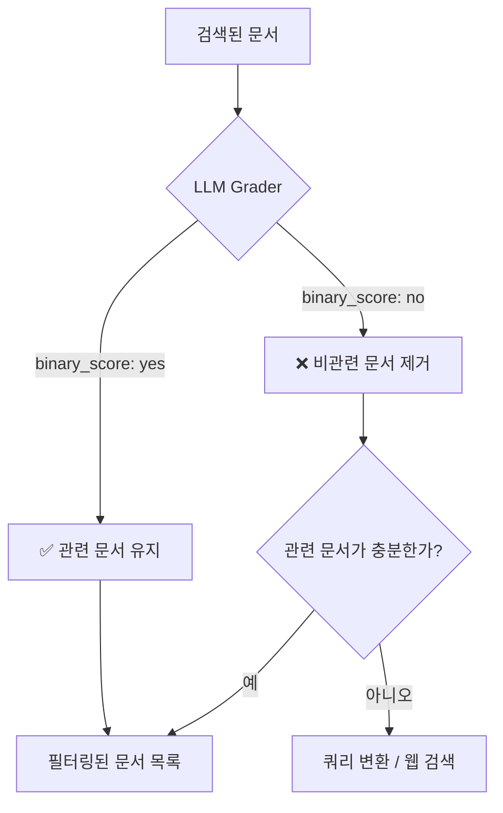
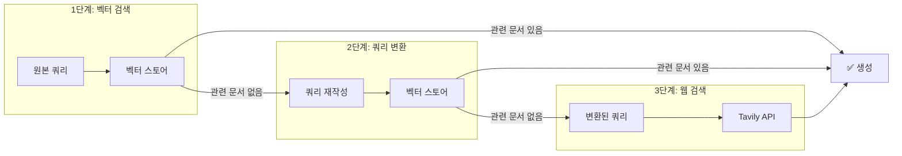
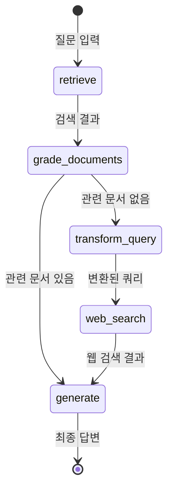
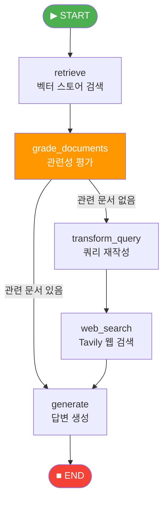

# Corrective RAG — 검색 결과 평가와 재검색

> 검색한 문서가 쓸모없다면? LLM이 스스로 판단하고, 쿼리를 다시 쓰고, 웹까지 뒤지는 자기 교정 RAG를 만들어 봅니다.

## 개요

이 섹션에서는 검색 결과의 품질을 LLM이 직접 평가(grading)하고, 관련성이 낮으면 쿼리를 변환하거나 웹 검색으로 폴백하는 **Corrective RAG(CRAG)** 패턴을 LangGraph로 구현합니다. 앞서 [16.3: 검색 도구를 활용하는 RAG 에이전트 구축](16-에이전틱-rag-langgraph로-동적-검색-에이전트-구축/03-검색-도구를-활용하는-rag-에이전트-구축.md)에서 만든 Tool Calling 기반 에이전트가 "필요할 때 검색"하는 데 그쳤다면, 이번에는 **검색한 결과가 진짜 쓸모 있는지까지 자동으로 판단**하는 단계를 추가합니다.

한 가지 눈여겨볼 점이 있습니다. 16.3에서는 `MessagesState` + `ToolNode` + `tools_condition`을 활용한 **ReAct 패턴**으로 그래프를 구성했죠. LLM이 도구 사용 여부를 자율적으로 판단하는 방식이었습니다. 반면 이번 Corrective RAG는 `TypedDict`로 커스텀 상태를 정의하고, `retrieve → grade_documents → transform_query → web_search → generate`처럼 **각 단계를 명시적 노드로 분리**하는 완전히 다른 아키텍처를 사용합니다. 왜 이렇게 바꿀까요? Tool Calling 방식은 LLM에게 자율성을 주는 대신 **"언제, 어떤 순서로 실행할지"를 예측하기 어렵습니다**. Corrective RAG처럼 "반드시 검색 → 평가 → 조건 분기"라는 **정해진 워크플로**가 필요한 경우에는, 각 단계를 명시적 노드로 분리하여 **더 세밀한 제어와 디버깅**이 가능한 커스텀 그래프가 적합합니다.

**선수 지식**:
- LangGraph의 StateGraph, Node, Edge, Conditional Edge ([16.2](16-에이전틱-rag-langgraph로-동적-검색-에이전트-구축/02-langgraph-기초-상태-그래프-프로그래밍.md))
- `create_retriever_tool`, `ToolNode`, `tools_condition` ([16.3](16-에이전틱-rag-langgraph로-동적-검색-에이전트-구축/03-검색-도구를-활용하는-rag-에이전트-구축.md))
- Pydantic `BaseModel`과 LangChain의 `with_structured_output` 개념

**학습 목표**:
- `GradeDocuments` 모델로 검색 결과의 관련성을 이진 평가하는 방법을 익힌다
- 관련성이 낮을 때 쿼리를 자동 변환(transform)하는 노드를 구현할 수 있다
- Tavily 웹 검색을 폴백 전략으로 통합하여 지식 범위를 확장한다
- retrieve → grade → (transform → web_search) → generate 전체 그래프를 LangGraph로 조립한다

## 왜 알아야 할까?

[16.1](16-에이전틱-rag-langgraph로-동적-검색-에이전트-구축/01-에이전틱-rag란-왜-에이전트가-필요한가.md)에서 정적 RAG의 한계를 이야기했죠. 그중 가장 치명적인 문제가 바로 **"검색은 했는데 가져온 문서가 엉뚱한 것"**인 경우입니다.

실제 프로덕션 RAG 시스템에서 이런 일은 생각보다 자주 일어납니다:
- 사용자가 모호한 질문을 던졌을 때 ("그거 어떻게 해?")
- 벡터 스토어에 해당 주제의 문서가 아예 없을 때
- 임베딩 모델이 의미를 잘못 포착해 유사하지만 무관한 문서를 반환할 때

기존 RAG는 이런 상황에서도 가져온 문서를 그대로 컨텍스트에 넣고 답변을 생성합니다. 결과는? **할루시네이션(Hallucination)**이거나 완전히 엉뚱한 답변이죠.

Corrective RAG는 이 문제에 대한 가장 실용적인 해법입니다. 검색 결과를 **생성 전에 평가**하고, 품질이 낮으면 **쿼리를 변환해서 다시 검색**하거나 **웹 검색으로 범위를 넓히는** 자기 교정(self-correcting) 메커니즘을 제공합니다. 2024년 이후 프로덕션 RAG 시스템에서 사실상 표준 패턴으로 자리잡고 있습니다.

## 핵심 개념

### 개념 1: 검색 결과 평가(Document Grading) — 시험지 채점하는 조교

> 💡 **비유**: 대학 조교가 학생들의 오픈북 시험 답안을 채점하는 상황을 떠올려 보세요. 학생(retriever)이 교재에서 찾아 쓴 내용이 질문과 관련 있는지, 조교(grader)가 "관련 있음 ✅ / 관련 없음 ❌"로 빠르게 판별합니다. 관련 없는 답안이 많으면 "다시 찾아오세요"라고 돌려보내죠. Corrective RAG의 Document Grading이 바로 이 조교 역할입니다.

Document Grading은 검색된 각 문서가 사용자의 질문에 **실제로 관련 있는지**를 LLM이 판단하는 과정입니다. 핵심은 Pydantic의 `BaseModel`과 LangChain의 `with_structured_output()`을 결합하여, LLM의 판단을 **구조화된 데이터**로 받는 것입니다.

```python
from pydantic import BaseModel, Field

class GradeDocuments(BaseModel):
    """검색된 문서의 관련성을 이진 점수로 평가합니다."""
    binary_score: str = Field(
        description="문서가 질문에 관련 있으면 'yes', 없으면 'no'"
    )
```

이 모델을 LLM에 바인딩하면, LLM은 자유 텍스트 대신 반드시 `{"binary_score": "yes"}` 또는 `{"binary_score": "no"}` 형태로 응답합니다.

```python
from langchain_openai import ChatOpenAI
from langchain_core.prompts import ChatPromptTemplate

# 구조화된 출력을 반환하는 grader LLM 생성
llm = ChatOpenAI(model="gpt-4o-mini", temperature=0)
structured_llm_grader = llm.with_structured_output(GradeDocuments)

# 평가 프롬프트
grade_prompt = ChatPromptTemplate.from_messages([
    ("system", """당신은 검색된 문서가 사용자 질문에 관련 있는지 평가하는 전문가입니다.
문서가 질문과 관련된 키워드나 의미를 포함하면 'yes', 아니면 'no'로 답하세요.
엄격하게 판단할 필요는 없습니다. 부분적으로 관련 있어도 'yes'입니다."""),
    ("human", "질문: {question}\n\n문서 내용: {document}"),
])

# 체인 구성
doc_grader = grade_prompt | structured_llm_grader
```

> 📊 **그림 1**: Document Grading의 판단 흐름



> ⚠️ **흔한 오해**: `binary_score`를 `bool` 타입으로 하면 되지 않을까? 실제로는 `str`이 더 안정적입니다. LLM의 structured output에서 boolean 파싱은 모델에 따라 불안정할 수 있고, `"yes"/"no"` 문자열이 프롬프트와 더 자연스럽게 맞물립니다.

### 개념 2: 쿼리 변환(Query Transform) — 질문을 더 잘 다듬기

> 💡 **비유**: 도서관에서 "그 유명한 AI 책"을 찾아달라고 했더니 사서가 엉뚱한 책을 가져왔다면, 여러분은 어떻게 하시겠어요? "2024년 출간된, 딥러닝 기초를 다루는, 이안 굿펠로우 저"처럼 **더 구체적으로 질문을 다시 만들겠죠**. Query Transform이 바로 이 과정입니다.

검색 결과가 관련성 평가를 통과하지 못하면, 원래 질문을 그대로 다시 검색하는 것은 의미가 없습니다. 같은 질문으로는 같은 (비관련) 결과가 나올 테니까요. 따라서 LLM이 원래 질문의 **의도는 유지**하면서 **표현을 개선**한 새로운 쿼리를 생성합니다. [13장: 쿼리 변환 기법](13-쿼리-변환-기법-multi-query-hyde-step-back-prompting/01-쿼리-변환이-필요한-이유와-전략-개관.md)에서 배운 HyDE나 Multi-Query 기법과 유사하지만, 여기서는 LLM이 원래 쿼리의 의도를 유지하면서 **더 검색에 적합한 형태로 재작성(rewrite)**하는 데 집중합니다. 13장의 기법들이 "여러 관점의 쿼리를 생성"하거나 "가상 문서를 만드는" 전략이었다면, Corrective RAG의 쿼리 변환은 **검색 실패 후 복구**라는 명확한 목적을 가진 단일 재작성입니다.

```python
from langchain_core.messages import HumanMessage

def transform_query(state: dict) -> dict:
    """질문을 벡터 스토어 검색에 최적화된 형태로 변환합니다."""
    question = state["question"]
    documents = state["documents"]

    # 쿼리 재작성 프롬프트
    rewrite_prompt = ChatPromptTemplate.from_messages([
        ("system", """당신은 벡터 스토어 검색에 최적화된 질문을 만드는 전문가입니다.
원래 질문의 의도를 유지하면서, 더 구체적이고 검색 친화적인 질문으로 변환하세요.
키워드를 명확히 하고, 불필요한 수식어를 제거하세요."""),
        ("human", "원래 질문: {question}\n\n개선된 질문을 작성하세요."),
    ])

    llm = ChatOpenAI(model="gpt-4o-mini", temperature=0)
    chain = rewrite_prompt | llm

    response = chain.invoke({"question": question})
    # 변환된 질문으로 상태 업데이트
    return {"question": response.content, "documents": documents}
```

```run:python
# 쿼리 변환 예시 (시뮬레이션)
original_queries = [
    "그거 어떻게 동작해?",
    "RAG 성능 안 좋은데",
    "벡터 DB 뭐가 좋아?",
]

transformed_queries = [
    "RAG(Retrieval-Augmented Generation) 파이프라인의 동작 원리와 핵심 컴포넌트",
    "RAG 시스템의 검색 정확도와 응답 품질을 개선하는 최적화 전략",
    "ChromaDB, FAISS, Pinecone, Qdrant 벡터 데이터베이스 성능 비교 분석",
]

for orig, trans in zip(original_queries, transformed_queries):
    print(f"원본: {orig}")
    print(f"변환: {trans}")
    print()
```

```output
원본: 그거 어떻게 동작해?
변환: RAG(Retrieval-Augmented Generation) 파이프라인의 동작 원리와 핵심 컴포넌트

원본: RAG 성능 안 좋은데
변환: RAG 시스템의 검색 정확도와 응답 품질을 개선하는 최적화 전략

원본: 벡터 DB 뭐가 좋아?
변환: ChromaDB, FAISS, Pinecone, Qdrant 벡터 데이터베이스 성능 비교 분석
```

### 개념 3: 웹 검색 폴백(Web Search Fallback) — 도서관 밖으로 나가기

> 💡 **비유**: 회사 내부 위키에서 원하는 정보를 못 찾았을 때, 결국 구글 검색을 하게 되죠? 벡터 스토어가 "내부 위키"라면, 웹 검색은 "구글"에 해당합니다. 내부에 정보가 없을 때 외부로 범위를 넓히는 안전망(safety net)이죠.

벡터 스토어에 관련 문서가 아예 없는 경우, 쿼리를 아무리 다듬어도 좋은 결과를 얻기 어렵습니다. 이때 **웹 검색**을 폴백 전략으로 사용합니다. LangChain 생태계에서는 **Tavily Search API**가 LLM 친화적인 검색 결과를 제공하여 널리 사용됩니다.

```python
from langchain_community.tools.tavily_search import TavilySearchResults

# Tavily 웹 검색 도구 초기화 (최대 3개 결과)
web_search_tool = TavilySearchResults(k=3)

def web_search(state: dict) -> dict:
    """웹 검색을 수행하여 벡터 스토어 외부의 정보를 가져옵니다."""
    question = state["question"]

    # Tavily로 웹 검색 실행
    search_results = web_search_tool.invoke({"query": question})

    # 검색 결과를 문서 형태로 변환
    from langchain_core.documents import Document
    web_docs = [
        Document(
            page_content=result["content"],
            metadata={"source": result["url"]}
        )
        for result in search_results
    ]

    return {"documents": web_docs, "question": question}
```

> 📊 **그림 2**: Corrective RAG의 3단계 폴백 전략



### 개념 4: 라우팅 결정 함수(decide_to_generate) — 교차로의 신호등

Corrective RAG 그래프에서 가장 중요한 부분은 **조건부 라우팅**입니다. `grade_documents` 노드가 모든 문서를 평가한 후, 필터링된 관련 문서가 충분한지에 따라 다음 경로를 결정합니다.

```python
def decide_to_generate(state: dict) -> str:
    """관련 문서 존재 여부에 따라 다음 단계를 결정합니다."""
    filtered_documents = state["documents"]

    if not filtered_documents:
        # 관련 문서가 하나도 없으면 → 쿼리 변환 후 웹 검색
        print("---판정: 관련 문서 없음 → 쿼리 변환---")
        return "transform_query"
    else:
        # 관련 문서가 있으면 → 답변 생성
        print("---판정: 관련 문서 발견 → 답변 생성---")
        return "generate"
```

> 📊 **그림 3**: Corrective RAG 전체 그래프 구조



## 실습: 직접 해보기

이제 Corrective RAG의 전체 그래프를 LangGraph로 조립해 봅시다. 앞서 배운 개별 컴포넌트들을 하나의 완전한 파이프라인으로 연결합니다.

### 환경 설정

```python
# 필요한 패키지 설치
# pip install langchain langchain-openai langchain-community langgraph \
#             langchain-chroma tavily-python

import os
os.environ["OPENAI_API_KEY"] = "your-openai-api-key"
os.environ["TAVILY_API_KEY"] = "your-tavily-api-key"
```

### 1단계: 벡터 스토어와 Retriever 준비

```python
from langchain_chroma import Chroma
from langchain_openai import OpenAIEmbeddings, ChatOpenAI
from langchain_core.documents import Document

# 예시 문서 — RAG 관련 기술 문서
docs = [
    Document(
        page_content="RAG는 Retrieval-Augmented Generation의 약자로, "
        "외부 지식 소스에서 관련 정보를 검색하여 LLM의 응답을 보강하는 기법입니다. "
        "2020년 Facebook AI Research(현 Meta AI)의 Patrick Lewis 등이 발표한 논문에서 처음 제안되었습니다.",
        metadata={"source": "rag_overview"}
    ),
    Document(
        page_content="LangChain은 LLM 애플리케이션 개발 프레임워크입니다. "
        "LCEL(LangChain Expression Language)을 사용하여 체인을 선언적으로 구성할 수 있으며, "
        "다양한 벡터 스토어, 임베딩 모델, LLM과 통합됩니다.",
        metadata={"source": "langchain_docs"}
    ),
    Document(
        page_content="ChromaDB는 오픈소스 벡터 데이터베이스로, "
        "임베딩 저장과 유사도 검색을 간편하게 수행할 수 있습니다. "
        "Python에서 pip install chromadb로 설치할 수 있습니다.",
        metadata={"source": "chromadb_docs"}
    ),
    Document(
        page_content="FAISS는 Facebook AI에서 개발한 벡터 유사도 검색 라이브러리입니다. "
        "대규모 벡터 데이터셋에서 빠른 근사 최근접 이웃(ANN) 검색을 지원하며, "
        "GPU 가속을 활용할 수 있습니다.",
        metadata={"source": "faiss_docs"}
    ),
]

# 벡터 스토어 생성
vectorstore = Chroma.from_documents(
    documents=docs,
    embedding=OpenAIEmbeddings(),
    collection_name="corrective-rag-demo"
)

# retriever 생성 (상위 2개 문서 반환)
retriever = vectorstore.as_retriever(search_kwargs={"k": 2})
```

### 2단계: Grader, 프롬프트, 도구 정의

```python
from pydantic import BaseModel, Field
from langchain_core.prompts import ChatPromptTemplate
from langchain_community.tools.tavily_search import TavilySearchResults

# --- Document Grader ---
class GradeDocuments(BaseModel):
    """검색된 문서의 관련성을 이진 점수로 평가합니다."""
    binary_score: str = Field(
        description="문서가 질문에 관련 있으면 'yes', 없으면 'no'"
    )

llm = ChatOpenAI(model="gpt-4o-mini", temperature=0)

# 구조화된 출력 grader
structured_llm_grader = llm.with_structured_output(GradeDocuments)

grade_prompt = ChatPromptTemplate.from_messages([
    ("system",
     "당신은 검색된 문서가 사용자 질문에 관련 있는지 평가하는 전문가입니다.\n"
     "문서가 질문과 관련된 키워드나 의미를 포함하면 'yes', 아니면 'no'로 답하세요."),
    ("human", "질문: {question}\n\n문서 내용: {document}"),
])

doc_grader = grade_prompt | structured_llm_grader

# --- 쿼리 재작성 체인 ---
rewrite_prompt = ChatPromptTemplate.from_messages([
    ("system",
     "당신은 질문을 벡터 스토어 검색에 최적화된 형태로 변환하는 전문가입니다.\n"
     "원래 질문의 의도를 유지하면서, 핵심 키워드를 명확히 하고 "
     "검색 친화적인 질문으로 바꾸세요."),
    ("human", "원래 질문: {question}\n\n개선된 질문:"),
])

query_rewriter = rewrite_prompt | llm

# --- 답변 생성 체인 ---
generate_prompt = ChatPromptTemplate.from_messages([
    ("system",
     "당신은 질문-답변 전문가입니다. "
     "아래 검색된 문서를 참고하여 질문에 답하세요.\n"
     "문서에 없는 내용은 추측하지 마세요."),
    ("human", "질문: {question}\n\n참고 문서:\n{context}"),
])

rag_chain = generate_prompt | llm

# --- 웹 검색 도구 ---
web_search_tool = TavilySearchResults(k=3)
```

### 3단계: 그래프 상태와 노드 함수 정의

```python
from typing import TypedDict
from langchain_core.documents import Document

class GraphState(TypedDict):
    """Corrective RAG 그래프의 상태 스키마"""
    question: str           # 사용자 질문 (변환될 수 있음)
    documents: list         # 검색된/필터링된 문서 목록
    generation: str         # 최종 생성된 답변


def retrieve(state: GraphState) -> GraphState:
    """벡터 스토어에서 관련 문서를 검색합니다."""
    print("---노드: RETRIEVE---")
    question = state["question"]
    documents = retriever.invoke(question)
    return {"documents": documents, "question": question}


def grade_documents(state: GraphState) -> GraphState:
    """검색된 문서의 관련성을 평가하고 필터링합니다."""
    print("---노드: GRADE DOCUMENTS---")
    question = state["question"]
    documents = state["documents"]

    filtered_docs = []
    for doc in documents:
        # 각 문서를 개별 평가
        score = doc_grader.invoke({
            "question": question,
            "document": doc.page_content
        })
        if score.binary_score == "yes":
            print(f"  ✅ 관련 있음: {doc.metadata.get('source', 'unknown')}")
            filtered_docs.append(doc)
        else:
            print(f"  ❌ 관련 없음: {doc.metadata.get('source', 'unknown')}")

    return {"documents": filtered_docs, "question": question}


def transform_query(state: GraphState) -> GraphState:
    """질문을 검색에 최적화된 형태로 변환합니다."""
    print("---노드: TRANSFORM QUERY---")
    question = state["question"]

    response = query_rewriter.invoke({"question": question})
    better_question = response.content
    print(f"  원본: {question}")
    print(f"  변환: {better_question}")

    return {"question": better_question, "documents": state["documents"]}


def web_search(state: GraphState) -> GraphState:
    """Tavily로 웹 검색을 수행합니다."""
    print("---노드: WEB SEARCH---")
    question = state["question"]

    search_results = web_search_tool.invoke({"query": question})
    web_docs = [
        Document(
            page_content=result["content"],
            metadata={"source": result["url"]}
        )
        for result in search_results
    ]
    print(f"  웹 검색 결과: {len(web_docs)}건")

    return {"documents": web_docs, "question": question}


def generate(state: GraphState) -> GraphState:
    """필터링된 문서를 기반으로 답변을 생성합니다."""
    print("---노드: GENERATE---")
    question = state["question"]
    documents = state["documents"]

    # 문서 내용을 하나의 컨텍스트로 결합
    context = "\n\n".join(doc.page_content for doc in documents)

    response = rag_chain.invoke({
        "question": question,
        "context": context
    })

    return {
        "documents": documents,
        "question": question,
        "generation": response.content
    }


def decide_to_generate(state: GraphState) -> str:
    """관련 문서 유무에 따라 다음 경로를 결정합니다."""
    print("---라우팅: DECIDE TO GENERATE---")
    filtered_documents = state["documents"]

    if not filtered_documents:
        print("  → 관련 문서 없음 → 쿼리 변환")
        return "transform_query"
    else:
        print(f"  → 관련 문서 {len(filtered_documents)}건 → 답변 생성")
        return "generate"
```

### 4단계: LangGraph 그래프 조립 및 실행

```python
from langgraph.graph import END, StateGraph

# 그래프 생성
workflow = StateGraph(GraphState)

# 노드 등록
workflow.add_node("retrieve", retrieve)
workflow.add_node("grade_documents", grade_documents)
workflow.add_node("transform_query", transform_query)
workflow.add_node("web_search", web_search)
workflow.add_node("generate", generate)

# 엣지 연결
workflow.set_entry_point("retrieve")                  # 시작 → 검색
workflow.add_edge("retrieve", "grade_documents")      # 검색 → 평가

# 조건부 엣지: 평가 결과에 따라 분기
workflow.add_conditional_edges(
    "grade_documents",                                 # 출발 노드
    decide_to_generate,                                # 라우팅 함수
    {
        "transform_query": "transform_query",          # 관련 문서 없음
        "generate": "generate",                        # 관련 문서 있음
    },
)

workflow.add_edge("transform_query", "web_search")    # 쿼리 변환 → 웹 검색
workflow.add_edge("web_search", "generate")           # 웹 검색 → 생성
workflow.add_edge("generate", END)                    # 생성 → 종료

# 컴파일
app = workflow.compile()
```

### 5단계: 두 가지 시나리오로 테스트

```python
# === 시나리오 1: 벡터 스토어에 관련 문서가 있는 경우 ===
print("=" * 60)
print("시나리오 1: RAG에 대한 질문 (벡터 스토어에 정보 있음)")
print("=" * 60)

result1 = app.invoke({"question": "RAG란 무엇인가요?"})
print(f"\n최종 답변:\n{result1['generation']}")

print("\n")

# === 시나리오 2: 벡터 스토어에 관련 문서가 없는 경우 ===
print("=" * 60)
print("시나리오 2: 최신 뉴스 질문 (벡터 스토어에 정보 없음)")
print("=" * 60)

result2 = app.invoke({"question": "2024년 노벨 물리학상 수상자는 누구인가요?"})
print(f"\n최종 답변:\n{result2['generation']}")
```

이 코드를 실행하면, 시나리오 1에서는 `retrieve → grade_documents → generate` 경로를 따르고, 시나리오 2에서는 `retrieve → grade_documents → transform_query → web_search → generate` 경로를 따르는 것을 확인할 수 있습니다.

> 🔥 **실무 팁**: 프로덕션에서는 `grade_documents`의 LLM 호출이 문서 수만큼 발생하므로 비용과 지연이 커질 수 있습니다. 검색 결과 수(`k`)를 3~5개로 제한하거나, 빠른 모델(`gpt-4o-mini`)을 grader에 사용하면 비용을 크게 줄일 수 있습니다.

### 그래프 시각화 (선택)

```python
# LangGraph의 내장 시각화 기능 (Jupyter 환경)
from IPython.display import Image, display

display(Image(app.get_graph().draw_mermaid_png()))
```

> 📊 **그림 4**: 실습 코드의 전체 Corrective RAG 워크플로



## 더 깊이 알아보기

### CRAG 논문의 탄생 배경

Corrective RAG의 학술적 토대는 2024년 1월 **Shi-Qi Yan, Jia-Chen Gu, Yun Zhu, Zhen-Hua Ling**이 발표한 논문 ["Corrective Retrieval Augmented Generation"(CRAG)](https://arxiv.org/abs/2401.15884)에서 시작됩니다.

이 논문이 주목받은 이유가 재미있습니다. 당시 RAG는 이미 업계 표준으로 자리잡았지만, 대부분의 시스템이 **"검색 결과를 무조건 신뢰"**하는 소박한 가정 위에 세워져 있었거든요. 연구진은 이 가정이 얼마나 위험한지를 실험으로 보여주었습니다.

CRAG 논문의 핵심 기여는 세 가지입니다:

1. **경량 검색 평가기(Lightweight Retrieval Evaluator)**: 검색 결과의 전체 품질을 **Correct / Incorrect / Ambiguous** 세 단계로 평가합니다. 우리 실습에서는 이를 단순화하여 이진(yes/no) 평가로 구현했지만, 원본 논문은 "애매한" 경우도 별도로 처리합니다.

2. **대규모 웹 검색 보강**: 검색 결과가 Incorrect로 판정되면 웹 검색을 트리거하여 지식 범위를 확장합니다. Ambiguous인 경우에는 원본 검색 결과와 웹 검색 결과를 **모두** 활용합니다.

3. **Decompose-then-Recompose 알고리즘**: 검색된 문서에서 핵심 정보만 선별적으로 추출하고 불필요한 정보를 걸러내는 후처리 과정입니다. 이는 긴 문서에서 노이즈를 제거하는 데 특히 효과적입니다.

흥미로운 점은, CRAG가 **플러그앤플레이(plug-and-play)** 방식으로 설계되었다는 것입니다. 기존 어떤 RAG 파이프라인에든 끼워 넣을 수 있도록 만들어졌고, 실험에서도 다양한 기반 모델과 결합했을 때 일관된 성능 향상을 보여주었습니다.

### LangChain 팀의 기여

CRAG 논문이 나온 직후, LangChain 팀은 이를 LangGraph로 구현한 튜토리얼을 공개하면서 "Agentic RAG" 패러다임을 대중화했습니다. LangChain 공동 창업자 Harrison Chase가 직접 제작한 [RAG from Scratch](https://github.com/langchain-ai/rag-from-scratch) 시리즈에서 Corrective RAG를 다루면서, 학술 논문의 아이디어가 실무 코드로 빠르게 전환된 대표적 사례가 되었습니다.

## 흔한 오해와 팁

> ⚠️ **흔한 오해**: "Corrective RAG는 무조건 더 좋다?" — 그렇지 않습니다. Document Grading을 위한 추가 LLM 호출은 **지연 시간(latency)**과 **비용(cost)**을 증가시킵니다. 질문의 95%가 벡터 스토어 내 문서로 충분히 답변 가능한 시스템이라면, 매번 grading을 돌리는 것은 오버헤드입니다. **"검색 실패가 빈번한 도메인"**에서 Corrective RAG의 가치가 극대화됩니다.

> 💡 **알고 계셨나요?**: CRAG 논문에서 제안한 3단계 평가(Correct / Incorrect / Ambiguous)는 사실 **검색 결과 전체**에 대한 종합 평가입니다. 우리 실습처럼 문서를 개별 평가하는 방식은 LangChain 커뮤니티에서 실용성을 위해 단순화한 버전이에요. 원본 논문은 전체 검색 결과의 신뢰도를 한 번에 판단하여 세 가지 행동(유지/교체/보강) 중 하나를 선택합니다.

> 🔥 **실무 팁**: grading의 비용이 걱정된다면, **임베딩 유사도 점수를 사전 필터**로 활용하세요. 예를 들어 유사도 0.3 미만인 문서는 LLM 평가 없이 바로 제외하고, 0.3~0.7 사이의 "애매한" 문서만 LLM grader로 정밀 평가하면 LLM 호출 횟수를 대폭 줄일 수 있습니다.

> 🔥 **실무 팁**: 웹 검색 폴백 시 Tavily API 키가 필요합니다. 무료 플랜에서 월 1,000건의 검색이 가능하므로 개발과 테스트에는 충분합니다. 프로덕션에서는 DuckDuckGo 검색(`langchain_community.tools.DuckDuckGoSearchResults`)을 무료 대안으로 고려하세요.

## 핵심 정리

| 개념 | 설명 |
|------|------|
| **GradeDocuments** | Pydantic `BaseModel`로 정의한 문서 관련성 평가 스키마. `binary_score`로 yes/no 판정 |
| **with_structured_output()** | LLM이 자유 텍스트 대신 지정한 스키마에 맞는 구조화된 JSON을 반환하도록 강제 |
| **Document Grading** | 검색된 각 문서를 LLM이 질문 대비 관련성을 평가하여 필터링하는 과정 |
| **Query Transform** | 관련 문서가 없을 때 LLM이 원래 질문을 검색 최적화된 형태로 재작성 |
| **Web Search Fallback** | 벡터 스토어에 정보가 없을 때 Tavily 등 웹 검색 API로 외부 지식을 가져오는 안전망 |
| **decide_to_generate** | 필터링된 문서 수에 따라 generate 또는 transform_query로 분기하는 조건부 라우팅 함수 |
| **커스텀 그래프 vs ReAct** | Tool Calling(ReAct)은 LLM 자율 판단, 커스텀 그래프는 명시적 노드로 세밀한 워크플로 제어 |
| **CRAG 논문** | Shi-Qi Yan 등(2024)이 제안한 Corrective RAG의 학술적 기반. 3단계 평가 + 웹 검색 보강 |

## 다음 섹션 미리보기

이번 세션에서 구축한 Corrective RAG는 **검색 결과의 관련성**을 평가했습니다. 하지만 "관련 있는 문서를 잘 가져왔는데, 생성된 답변이 사실과 다른" 경우도 있죠. 다음 세션 [16.5: Self-RAG와 Adaptive RAG — 답변 품질까지 평가하기](16-에이전틱-rag-langgraph로-동적-검색-에이전트-구축/05-self-rag-생성-결과까지-자체-평가.md)에서는 **생성된 답변 자체의 품질**(할루시네이션 여부, 질문 적합성)까지 평가하는 Self-RAG 패턴을 추가하고, Corrective RAG와 결합하여 검색-평가-생성-재평가의 완전한 자기 교정 루프를 구현합니다.

## 참고 자료

- [Corrective Retrieval Augmented Generation (CRAG 원본 논문)](https://arxiv.org/abs/2401.15884) - Shi-Qi Yan 등이 제안한 CRAG의 학술적 기반. 3단계 신뢰도 평가와 웹 검색 보강 전략의 원본
- [Build a custom RAG agent with LangGraph — LangChain 공식 문서](https://docs.langchain.com/oss/python/langgraph/agentic-rag) - LangGraph로 Document Grading과 Query Rewriting을 구현하는 공식 튜토리얼
- [LangChain RAG from Scratch — GitHub](https://github.com/langchain-ai/rag-from-scratch) - Harrison Chase가 제작한 RAG 시리즈. Corrective RAG, Self-RAG, Adaptive RAG 구현 포함
- [Corrective RAG (CRAG) Implementation With LangGraph — DataCamp](https://www.datacamp.com/tutorial/corrective-rag-crag) - CRAG를 LangGraph로 단계별 구현하는 실전 튜토리얼
- [Self-Reflective RAG with LangGraph — LangChain Blog](https://blog.langchain.com/agentic-rag-with-langgraph/) - Corrective RAG와 Self-RAG를 LangGraph로 구현한 공식 블로그 포스트

---
### 🔗 Related Sessions
- [agentic_rag](../16-에이전틱-rag-langgraph로-동적-검색-에이전트-구축/01-에이전틱-rag란-왜-에이전트가-필요한가.md) (prerequisite)
- [corrective_rag](../16-에이전틱-rag-langgraph로-동적-검색-에이전트-구축/01-에이전틱-rag란-왜-에이전트가-필요한가.md) (prerequisite)
- [stategraph](../16-에이전틱-rag-langgraph로-동적-검색-에이전트-구축/02-langgraph-기초-상태-그래프-프로그래밍.md) (prerequisite)
- [langgraph_node](../16-에이전틱-rag-langgraph로-동적-검색-에이전트-구축/02-langgraph-기초-상태-그래프-프로그래밍.md) (prerequisite)
- [langgraph_edge](../16-에이전틱-rag-langgraph로-동적-검색-에이전트-구축/02-langgraph-기초-상태-그래프-프로그래밍.md) (prerequisite)
- [langgraph_conditional_edge](../16-에이전틱-rag-langgraph로-동적-검색-에이전트-구축/02-langgraph-기초-상태-그래프-프로그래밍.md) (prerequisite)
- [retriever_tool_wrapping](../16-에이전틱-rag-langgraph로-동적-검색-에이전트-구축/03-검색-도구를-활용하는-rag-에이전트-구축.md) (prerequisite)
